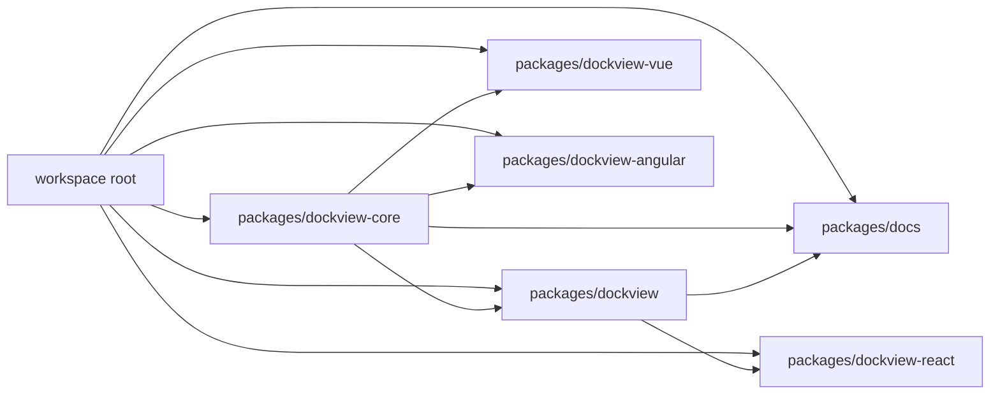
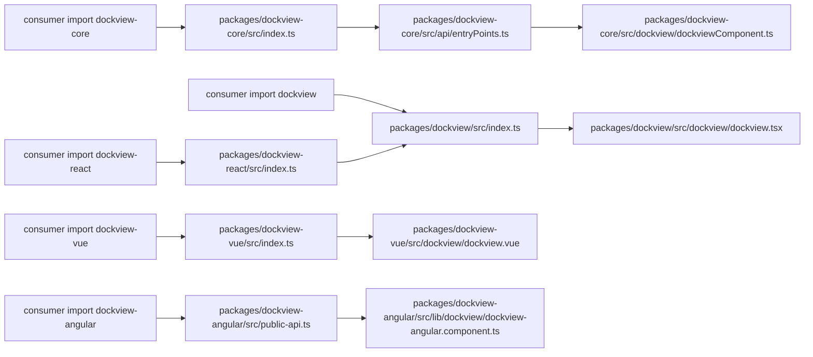
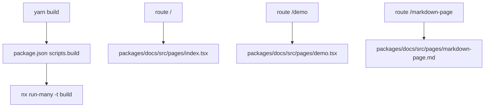
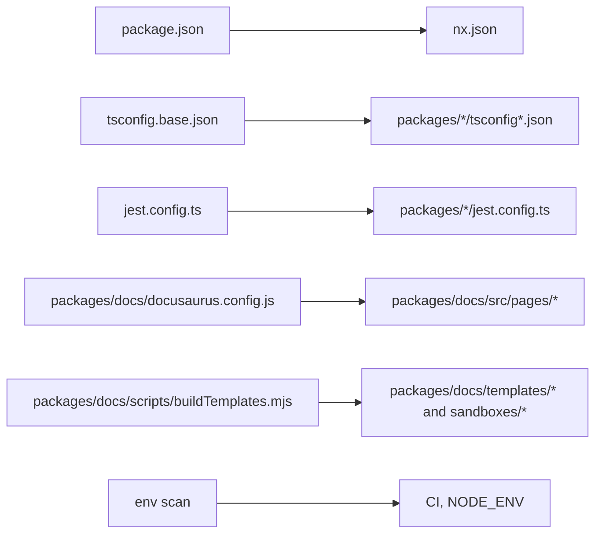
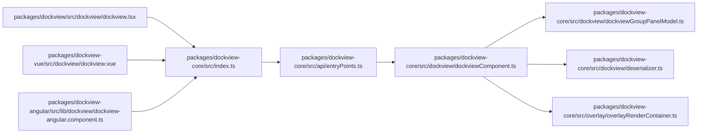
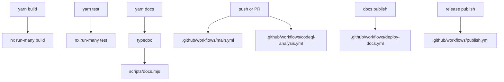

# Dockview AI Index (中文)

生成时间: 2026-03-27

## 1. 索引目标与适用查询场景摘要
- 目标: 为 AI 代码问答、RAG、自动化分析、新人导航与维护交接提供稳定、可检索、可机器消费的代码索引。
- 查询场景: 入口定位、公开导出定位、核心状态机定位、框架包装层定位、构建/测试/发布链路定位、docs 页面与示例入口定位、配置与环境影响范围定位。
- 产物: 本 Markdown 概览 + 完整 JSONL 记录文件 `docs/manual/dockview-ai-index.records.jsonl`。
- 覆盖策略: 每个纳入范围的 tracked file 至少对应 1 条 `file_record`。

## 2. 项目类型识别结果与依据
- 识别结果: `monorepo + library/sdk`，附带一个 `frontend docs app`。
- 依据: 根 `package.json` 使用 Yarn workspaces；各发布包暴露 `main/module/types`；`packages/docs` 是 Docusaurus 站点；`nx.json` 管理跨包构建与 fixed-version release。

## 3. 索引目录框架
- 第一部分: 索引范围、排除项与项目全景
- 第二部分: 文件级索引
- 第三部分: 符号级索引
- 第四部分: 结构关系索引
- 第五部分: 特殊热点索引
- 第六部分: 测试、示例、构建与 CI 索引
- 第七部分: 查询词典与检索路由
- 第八部分: 机器可读导出设计
- 第九部分: 索引质量要求

## 4. 需要生成的 Mermaid 图清单
- package / module / file 映射图
- 入口链 / 导出链关系图
- 路由 / 页面 / 命令 映射图
- env / config -> file 影响图
- 文件级依赖图
- build / test / release / CI 流程图

## 5. 机器可读索引设计摘要
- 记录类型: `file_record`、`symbol_record`、`route_record`、`config_record`、`query_route_record`。
- 字段焦点: 文件路径、文件类型、所属 package、运行时上下文、导出符号、导入关系、环境变量依赖、查询关键词、查询意图路由。
- 当前统计: `930` 条 `file_record`，`2207` 条 `symbol_record`，`6` 条 `route_record`，`5` 条 `config_record`，`6` 条 `query_route_record`。

# 第一部分：索引范围、排除项与项目全景

## 1. 索引目标、范围、排除项
- 覆盖目录: workspace root、`packages/*`、`.github/workflows`、`scripts/`、docs 包内部 docs/blog/templates/sandboxes/static/src/theme/src/pages。
- 排除目录: `node_modules/`、`dist/`、`build/`、`coverage/`、`.next/`、`.nuxt/`、`.turbo/`、`.nx/`、`out/`、`.git/`。
- 特殊排除: `docs/manual/*` 被视为生成产物，不回灌进本次索引。
- 索引基线: `git ls-files`。

## 2. workspace / package / module / file 全量地图
- workspace 根职责: 管理 Yarn workspace、NX 编排、统一测试/发布/TS/Jest/ESLint/Prettier/TypeDoc 配置。
- package 职责: `dockview-core`=核心引擎；`dockview`=React；`dockview-vue`=Vue；`dockview-react`=兼容 re-export；`dockview-angular`=Angular；`dockview-docs`=Docusaurus 文档站。

### Mermaid 1: package / module / file 映射图



### 完整文件树

```text
├─ .codesandbox
│  └─ ci.json
├─ .editorconfig
├─ .eslintignore
├─ .eslintrc.js
├─ .github
│  ├─ ISSUE_TEMPLATE
│  │  ├─ bug_report.md
│  │  └─ feature_request.md
│  └─ workflows
│     ├─ codeql-analysis.yml
│     ├─ deploy-docs.yml
│     ├─ main.yml
│     └─ publish.yml
├─ .gitignore
├─ .prettierignore
├─ .prettierrc
├─ .vscode
│  ├─ extensions.json
│  └─ settings.json
├─ AGENTS.md
├─ CLAUDE.md
├─ jest-setup.ts
├─ jest.config.ts
├─ LICENSE
├─ llms-full.txt
├─ llms.txt
├─ nx.json
├─ package.json
├─ packages
│  ├─ dockview
│  │  ├─ AGENTS.md
│  │  ├─ CLAUDE.md
│  │  ├─ jest.config.ts
│  │  ├─ package.json
│  │  ├─ README.md
│  │  ├─ rollup.config.js
│  │  ├─ scripts
│  │  │  ├─ copy-css.js
│  │  │  └─ rollupEntryTarget.ts
│  │  ├─ src
│  │  │  ├─ __tests__
│  │  │  │  ├─ __mocks__
│  │  │  │  │  └─ resizeObserver.js
│  │  │  │  ├─ __test_utils__
│  │  │  │  │  └─ utils.ts
│  │  │  │  ├─ dockview
│  │  │  │  │  ├─ defaultTab.spec.tsx
│  │  │  │  │  ├─ dockview.spec.tsx
│  │  │  │  │  └─ headerActionsRenderer.spec.ts
│  │  │  │  ├─ gridview
│  │  │  │  │  └─ gridview.spec.tsx
│  │  │  │  ├─ paneview
│  │  │  │  │  └─ paneview.spec.tsx
│  │  │  │  ├─ react.spec.tsx
│  │  │  │  └─ splitview
│  │  │  │     └─ splitview.spec.tsx
│  │  │  ├─ dockview
│  │  │  │  ├─ defaultTab.tsx
│  │  │  │  ├─ dockview.tsx
│  │  │  │  ├─ headerActionsRenderer.ts
│  │  │  │  ├─ reactContentPart.ts
│  │  │  │  ├─ reactHeaderPart.ts
│  │  │  │  └─ reactWatermarkPart.ts
│  │  │  ├─ gridview
│  │  │  │  ├─ gridview.tsx
│  │  │  │  └─ view.ts
│  │  │  ├─ index.ts
│  │  │  ├─ paneview
│  │  │  │  ├─ paneview.tsx
│  │  │  │  └─ view.ts
│  │  │  ├─ react.ts
│  │  │  ├─ splitview
│  │  │  │  ├─ splitview.tsx
│  │  │  │  └─ view.ts
│  │  │  ├─ svg.tsx
│  │  │  └─ types.ts
│  │  ├─ tsconfig.esm.json
│  │  ├─ tsconfig.json
│  │  └─ typedoc.json
│  ├─ dockview-angular
│  │  ├─ AGENTS.md
│  │  ├─ CLAUDE.md
│  │  ├─ gulpfile.js
│  │  ├─ jest.config.ts
│  │  ├─ ng-package.json
│  │  ├─ package.json
│  │  ├─ README.md
│  │  ├─ scripts
│  │  │  └─ copy-css.js
│  │  ├─ src
│  │  │  ├─ __tests__
│  │  │  │  ├─ __mocks__
│  │  │  │  │  ├─ angular-testing.js
│  │  │  │  │  └─ resizeObserver.js
│  │  │  │  ├─ __test_utils__
│  │  │  │  │  └─ test-helpers.ts
│  │  │  │  ├─ angular-renderer.spec.ts
│  │  │  │  ├─ component-factory.spec.ts
│  │  │  │  ├─ dockview-angular.component.spec.ts
│  │  │  │  ├─ empty.spec.ts
│  │  │  │  ├─ gridview-angular.component.spec.ts
│  │  │  │  ├─ lifecycle-utils.spec.ts
│  │  │  │  ├─ paneview-angular.component.spec.ts
│  │  │  │  ├─ setup-jest.ts
│  │  │  │  └─ splitview-angular.component.spec.ts
│  │  │  ├─ index.ts
│  │  │  ├─ lib
│  │  │  │  ├─ dockview
│  │  │  │  │  ├─ dockview-angular.component.ts
│  │  │  │  │  └─ types.ts
│  │  │  │  ├─ dockview-angular.module.ts
│  │  │  │  ├─ gridview
│  │  │  │  │  ├─ angular-gridview-panel.ts
│  │  │  │  │  ├─ gridview-angular.component.ts
│  │  │  │  │  └─ types.ts
│  │  │  │  ├─ paneview
│  │  │  │  │  ├─ angular-pane-part.ts
│  │  │  │  │  ├─ paneview-angular.component.ts
│  │  │  │  │  └─ types.ts
│  │  │  │  ├─ splitview
│  │  │  │  │  ├─ angular-splitview-panel.ts
│  │  │  │  │  ├─ splitview-angular.component.ts
│  │  │  │  │  └─ types.ts
│  │  │  │  └─ utils
│  │  │  │     ├─ angular-renderer.ts
│  │  │  │     ├─ component-factory.ts
│  │  │  │     └─ lifecycle-utils.ts
│  │  │  └─ public-api.ts
│  │  ├─ tsconfig.json
│  │  ├─ tsconfig.lib.json
│  │  ├─ tsconfig.spec.json
│  │  ├─ tsconfig.test.json
│  │  └─ typedoc.json
│  ├─ dockview-core
│  │  ├─ AGENTS.md
│  │  ├─ CLAUDE.md
│  │  ├─ gulpfile.js
│  │  ├─ jest.config.ts
│  │  ├─ package.json
│  │  ├─ README.md
│  │  ├─ rollup.config.js
│  │  ├─ scripts
│  │  │  └─ rollupEntryTarget.ts
│  │  ├─ src
│  │  │  ├─ __tests__
│  │  │  │  ├─ __mocks__
│  │  │  │  │  ├─ mockDockviewPanelModel.ts
│  │  │  │  │  ├─ mockWindow.ts
│  │  │  │  │  └─ resizeObserver.js
│  │  │  │  ├─ __test_utils__
│  │  │  │  │  └─ utils.ts
│  │  │  │  ├─ api
│  │  │  │  │  ├─ api.spec.ts
│  │  │  │  │  ├─ component.api.spec.ts
│  │  │  │  │  └─ dockviewPanelApi.spec.ts
│  │  │  │  ├─ array.spec.ts
│  │  │  │  ├─ dnd
│  │  │  │  │  ├─ abstractDragHandler.spec.ts
│  │  │  │  │  ├─ dataTransfer.spec.ts
│  │  │  │  │  ├─ droptarget.spec.ts
│  │  │  │  │  ├─ ghost.spec.ts
│  │  │  │  │  └─ groupDragHandler.spec.ts
│  │  │  │  ├─ dockview
│  │  │  │  │  ├─ components
│  │  │  │  │  │  ├─ panel
│  │  │  │  │  │  │  └─ content.spec.ts
│  │  │  │  │  │  ├─ tab
│  │  │  │  │  │  │  └─ defaultTab.spec.ts
│  │  │  │  │  │  ├─ tab.spec.ts
│  │  │  │  │  │  └─ titlebar
│  │  │  │  │  │     ├─ tabs.spec.ts
│  │  │  │  │  │     ├─ tabsAnimation.spec.ts
│  │  │  │  │  │     ├─ tabsContainer.spec.ts
│  │  │  │  │  │     └─ voidContainer.spec.ts
│  │  │  │  │  ├─ dockviewComponent.spec.ts
│  │  │  │  │  ├─ dockviewGroupPanel.spec.ts
│  │  │  │  │  ├─ dockviewGroupPanelModel.spec.ts
│  │  │  │  │  ├─ dockviewPanel.spec.ts
│  │  │  │  │  └─ dockviewPanelModel.spec.ts
│  │  │  │  ├─ dom.spec.ts
│  │  │  │  ├─ events.spec.ts
│  │  │  │  ├─ gridview
│  │  │  │  │  ├─ baseComponentGridview.spec.ts
│  │  │  │  │  ├─ gridview.spec.ts
│  │  │  │  │  ├─ gridviewComponent.spec.ts
│  │  │  │  │  └─ gridviewPanel.spec.ts
│  │  │  │  ├─ lifecycle.spec.ts
│  │  │  │  ├─ math.spec.ts
│  │  │  │  ├─ overlay
│  │  │  │  │  ├─ overlay.spec.ts
│  │  │  │  │  └─ overlayRenderContainer.spec.ts
│  │  │  │  ├─ paneview
│  │  │  │  │  ├─ paneview.spec.ts
│  │  │  │  │  └─ paneviewComponent.spec.ts
│  │  │  │  └─ splitview
│  │  │  │     ├─ splitview.spec.ts
│  │  │  │     └─ splitviewComponent.spec.ts
│  │  │  ├─ api
│  │  │  │  ├─ component.api.ts
│  │  │  │  ├─ dockviewGroupPanelApi.ts
│  │  │  │  ├─ dockviewPanelApi.ts
│  │  │  │  ├─ entryPoints.ts
│  │  │  │  ├─ gridviewPanelApi.ts
│  │  │  │  ├─ panelApi.ts
│  │  │  │  ├─ paneviewPanelApi.ts
│  │  │  │  └─ splitviewPanelApi.ts
│  │  │  ├─ array.ts
│  │  │  ├─ constants.ts
│  │  │  ├─ dnd
│  │  │  │  ├─ abstractDragHandler.ts
│  │  │  │  ├─ dataTransfer.ts
│  │  │  │  ├─ dnd.ts
│  │  │  │  ├─ droptarget.scss
│  │  │  │  ├─ droptarget.ts
│  │  │  │  ├─ dropTargetAnchorContainer.scss
│  │  │  │  ├─ dropTargetAnchorContainer.ts
│  │  │  │  ├─ ghost.ts
│  │  │  │  └─ groupDragHandler.ts
│  │  │  ├─ dockview
│  │  │  │  ├─ components
│  │  │  │  │  ├─ panel
│  │  │  │  │  │  └─ content.ts
│  │  │  │  │  ├─ popupService.ts
│  │  │  │  │  ├─ tab
│  │  │  │  │  │  ├─ defaultTab.scss
│  │  │  │  │  │  ├─ defaultTab.ts
│  │  │  │  │  │  └─ tab.ts
│  │  │  │  │  ├─ titlebar
│  │  │  │  │  │  ├─ tabOverflowControl.scss
│  │  │  │  │  │  ├─ tabOverflowControl.ts
│  │  │  │  │  │  ├─ tabs.scss
│  │  │  │  │  │  ├─ tabs.ts
│  │  │  │  │  │  ├─ tabsContainer.scss
│  │  │  │  │  │  ├─ tabsContainer.ts
│  │  │  │  │  │  └─ voidContainer.ts
│  │  │  │  │  └─ watermark
│  │  │  │  │     ├─ watermark.scss
│  │  │  │  │     └─ watermark.ts
│  │  │  │  ├─ deserializer.ts
│  │  │  │  ├─ dockviewComponent.scss
│  │  │  │  ├─ dockviewComponent.ts
│  │  │  │  ├─ dockviewFloatingGroupPanel.ts
│  │  │  │  ├─ dockviewGroupPanel.scss
│  │  │  │  ├─ dockviewGroupPanel.ts
│  │  │  │  ├─ dockviewGroupPanelModel.ts
│  │  │  │  ├─ dockviewPanel.ts
│  │  │  │  ├─ dockviewPanelModel.ts
│  │  │  │  ├─ events.ts
│  │  │  │  ├─ framework.ts
│  │  │  │  ├─ options.ts
│  │  │  │  ├─ strictEventsSequencing.ts
│  │  │  │  ├─ theme.ts
│  │  │  │  ├─ types.ts
│  │  │  │  └─ validate.ts
│  │  │  ├─ dom.ts
│  │  │  ├─ events.ts
│  │  │  ├─ framwork.ts
│  │  │  ├─ gridview
│  │  │  │  ├─ baseComponentGridview.scss
│  │  │  │  ├─ baseComponentGridview.ts
│  │  │  │  ├─ basePanelView.ts
│  │  │  │  ├─ branchNode.ts
│  │  │  │  ├─ gridview.scss
│  │  │  │  ├─ gridview.ts
│  │  │  │  ├─ gridviewComponent.ts
│  │  │  │  ├─ gridviewPanel.ts
│  │  │  │  ├─ leafNode.ts
│  │  │  │  ├─ options.ts
│  │  │  │  └─ types.ts
│  │  │  ├─ index.ts
│  │  │  ├─ lifecycle.ts
│  │  │  ├─ math.ts
│  │  │  ├─ overlay
│  │  │  │  ├─ overlay.scss
│  │  │  │  ├─ overlay.ts
│  │  │  │  ├─ overlayReadyContainer.scss
│  │  │  │  └─ overlayRenderContainer.ts
│  │  │  ├─ panel
│  │  │  │  └─ types.ts
│  │  │  ├─ paneview
│  │  │  │  ├─ defaultPaneviewHeader.ts
│  │  │  │  ├─ draggablePaneviewPanel.ts
│  │  │  │  ├─ options.ts
│  │  │  │  ├─ paneview.scss
│  │  │  │  ├─ paneview.ts
│  │  │  │  ├─ paneviewComponent.ts
│  │  │  │  └─ paneviewPanel.ts
│  │  │  ├─ popoutWindow.ts
│  │  │  ├─ resizable.ts
│  │  │  ├─ scrollbar.scss
│  │  │  ├─ scrollbar.ts
│  │  │  ├─ splitview
│  │  │  │  ├─ options.ts
│  │  │  │  ├─ splitview.scss
│  │  │  │  ├─ splitview.ts
│  │  │  │  ├─ splitviewComponent.ts
│  │  │  │  ├─ splitviewPanel.ts
│  │  │  │  └─ viewItem.ts
│  │  │  ├─ svg.scss
│  │  │  ├─ svg.ts
│  │  │  ├─ theme
│  │  │  │  ├─ _drop-target-static-mixin.scss
│  │  │  │  ├─ _sash-handle-mixin.scss
│  │  │  │  └─ _space-mixin.scss
│  │  │  ├─ theme.scss
│  │  │  └─ types.ts
│  │  ├─ tsconfig.esm.json
│  │  ├─ tsconfig.json
│  │  └─ typedoc.json
│  ├─ dockview-react
│  │  ├─ AGENTS.md
│  │  ├─ CLAUDE.md
│  │  ├─ jest.config.ts
│  │  ├─ package.json
│  │  ├─ README.md
│  │  ├─ rollup.config.js
│  │  ├─ scripts
│  │  │  ├─ copy-css.js
│  │  │  └─ rollupEntryTarget.ts
│  │  ├─ src
│  │  │  ├─ __tests__
│  │  │  │  └─ empty.spec.ts
│  │  │  └─ index.ts
│  │  ├─ tsconfig.esm.json
│  │  ├─ tsconfig.json
│  │  └─ typedoc.json
│  ├─ dockview-vue
│  │  ├─ AGENTS.md
│  │  ├─ CLAUDE.md
│  │  ├─ jest.config.ts
│  │  ├─ package.json
│  │  ├─ README.md
│  │  ├─ scripts
│  │  │  └─ copy-css.js
│  │  ├─ src
│  │  │  ├─ __tests__
│  │  │  │  ├─ __mocks__
│  │  │  │  │  └─ resizeObserver.js
│  │  │  │  ├─ __test_utils__
│  │  │  │  │  └─ utils.ts
│  │  │  │  ├─ dockview.spec.ts
│  │  │  │  ├─ gridview.spec.ts
│  │  │  │  ├─ paneview.spec.ts
│  │  │  │  ├─ simple.spec.ts
│  │  │  │  ├─ splitview.spec.ts
│  │  │  │  └─ utils.spec.ts
│  │  │  ├─ composables
│  │  │  │  └─ useViewComponent.ts
│  │  │  ├─ dockview
│  │  │  │  ├─ dockview.vue
│  │  │  │  └─ types.ts
│  │  │  ├─ gridview
│  │  │  │  ├─ gridview.vue
│  │  │  │  ├─ types.ts
│  │  │  │  └─ view.ts
│  │  │  ├─ index.ts
│  │  │  ├─ paneview
│  │  │  │  ├─ paneview.vue
│  │  │  │  ├─ types.ts
│  │  │  │  └─ view.ts
│  │  │  ├─ splitview
│  │  │  │  ├─ splitview.vue
│  │  │  │  ├─ types.ts
│  │  │  │  └─ view.ts
│  │  │  └─ utils.ts
│  │  ├─ tsconfig.app.json
│  │  ├─ tsconfig.build-types.json
│  │  ├─ tsconfig.config.json
│  │  ├─ tsconfig.json
│  │  ├─ tsconfig.typedoc.json
│  │  ├─ typedoc.json
│  │  └─ vite.config.ts
│  ├─ docs
│  │  ├─ .gitignore
│  │  ├─ AGENTS.md
│  │  ├─ babel.config.js
│  │  ├─ blog
│  │  │  ├─ 2022-05-11-dockview-1.4.1.mdx
│  │  │  ├─ 2022-05-16-dockview-1.4.2.mdx
│  │  │  ├─ 2022-05-26-dockview-1.4.3.mdx
│  │  │  ├─ 2022-06-12-dockview-1.5.0.mdx
│  │  │  ├─ 2022-07-23-dockview-1.5.1.mdx
│  │  │  ├─ 2022-10-04-dockview-1.5.2.mdx
│  │  │  ├─ 2023-02-26-dockview-1.6.0.mdx
│  │  │  ├─ 2023-03-25-dockview-1.7.0.md
│  │  │  ├─ 2023-04-11-dockview-1.7.1.md
│  │  │  ├─ 2023-05-07-dockview-1.7.2.md
│  │  │  ├─ 2023-06-03-dockview-1.7.3.md
│  │  │  ├─ 2023-06-10-dockview-1.7.4.md
│  │  │  ├─ 2023-06-11-dockview-1.7.5.md
│  │  │  ├─ 2023-06-18-dockview-1.7.6.md
│  │  │  ├─ 2023-07-23-dockview-1.8.0.md
│  │  │  ├─ 2023-07-24-dockview-1.8.2.md
│  │  │  ├─ 2023-09-17-dockview-1.8.3.md
│  │  │  ├─ 2023-10-06-dockview-1.8.4.md
│  │  │  ├─ 2023-10-06-dockview-1.8.5.md
│  │  │  ├─ 2024-01-15-dockview-1.9.0.md
│  │  │  ├─ 2024-01-20-dockview-1.9.1.md
│  │  │  ├─ 2024-01-23-dockview-1.9.2.md
│  │  │  ├─ 2024-02-25-dockview-1.10.0.md
│  │  │  ├─ 2024-03-03-dockview-1.10.1.md
│  │  │  ├─ 2024-03-15-dockview-1.10.2.md
│  │  │  ├─ 2024-03-17-dockview-1.11.0.md
│  │  │  ├─ 2024-04-15-dockview-1.12.0.md
│  │  │  ├─ 2024-04-27-dockview-1.13.0.md
│  │  │  ├─ 2024-05-05-dockview-1.13.1.md
│  │  │  ├─ 2024-05-23-dockview-1.14.0.md
│  │  │  ├─ 2024-05-28-dockview-1.14.1.md
│  │  │  ├─ 2024-06-08-dockview-1.14.2.md
│  │  │  ├─ 2024-07-12-dockview-1.15.0.md
│  │  │  ├─ 2024-07-16-dockview-1.15.1.md
│  │  │  ├─ 2024-07-17-dockview-1.15.2.md
│  │  │  ├─ 2024-08-01-dockview-1.15.3.md
│  │  │  ├─ 2024-08-11-dockview-1.16.0.md
│  │  │  ├─ 2024-08-13-dockview-1.16.1.md
│  │  │  ├─ 2024-09-05-dockview-1.17.0.md
│  │  │  ├─ 2024-09-05-dockview-1.17.1.md
│  │  │  ├─ 2024-10-12-dockview-1.17.2.md
│  │  │  ├─ 2024-11-03-dockview-2.0.0.md
│  │  │  ├─ 2024-12-17-dockview-2.1.0.md
│  │  │  ├─ 2024-12-20-dockview-2.1.1.md
│  │  │  ├─ 2024-12-21-dockview-2.1.2.md
│  │  │  ├─ 2024-12-22-dockview-2.1.3.md
│  │  │  ├─ 2024-12-23-dockview-2.1.4.md
│  │  │  ├─ 2024-12-29-dockview-3.0.0.md
│  │  │  ├─ 2025-01-09-dockview-3.0.1.md
│  │  │  ├─ 2025-01-11-dockview-3.0.2.md
│  │  │  ├─ 2025-02-02-dockview-3.1.0.md
│  │  │  ├─ 2025-02-09-dockview-3.1.1.md
│  │  │  ├─ 2025-02-12-dockview-3.2.0.md
│  │  │  ├─ 2025-03-12-dockview-4.0.0.md
│  │  │  ├─ 2025-03-14-dockview-4.0.1.md
│  │  │  ├─ 2025-03-16-dockview-4.1.0.md
│  │  │  ├─ 2025-03-17-dockview-4.2.0.md
│  │  │  ├─ 2025-03-18-dockview-4.2.1.md
│  │  │  ├─ 2025-03-26-dockview-4.2.2.md
│  │  │  ├─ 2025-04-08-dockview-4.2.3.md
│  │  │  ├─ 2025-04-29-dockview-4.2.4.md
│  │  │  ├─ 2025-05-01-dockview-4.2.5.md
│  │  │  ├─ 2025-06-03-dockview-4.3.0.md
│  │  │  ├─ 2025-06-05-dockview-4.3.1.md
│  │  │  ├─ 2025-06-19-dockview-4.4.0.md
│  │  │  ├─ 2025-07-17-dockview-4.4.1.md
│  │  │  ├─ 2025-07-19-dockview-4.5.0.md
│  │  │  ├─ 2025-08-02-dockview-4.6.2.md
│  │  │  ├─ 2025-08-22-dockview-4.7.0.md
│  │  │  ├─ 2025-08-29-dockview-4.7.1.md
│  │  │  ├─ 2025-09-22-dockview-4.9.0.md
│  │  │  ├─ 2025-10-30-dockview-4.10.0.md
│  │  │  ├─ 2025-11-04-dockview-4.11.0.md
│  │  │  └─ authors.yml
│  │  ├─ CLAUDE.md
│  │  ├─ docs
│  │  │  ├─ advanced
│  │  │  │  ├─ _category_.json
│  │  │  │  ├─ advanced.mdx
│  │  │  │  ├─ iframe.mdx
│  │  │  │  ├─ keyboard.mdx
│  │  │  │  └─ nested.mdx
│  │  │  ├─ api
│  │  │  │  ├─ dockview
│  │  │  │  │  ├─ groupApi.mdx
│  │  │  │  │  ├─ options.mdx
│  │  │  │  │  ├─ overview.mdx
│  │  │  │  │  └─ panelApi.mdx
│  │  │  │  ├─ gridview
│  │  │  │  │  ├─ api.mdx
│  │  │  │  │  ├─ options.mdx
│  │  │  │  │  └─ panelApi.mdx
│  │  │  │  ├─ paneview
│  │  │  │  │  ├─ api.mdx
│  │  │  │  │  ├─ options.mdx
│  │  │  │  │  └─ panelApi.mdx
│  │  │  │  └─ splitview
│  │  │  │     ├─ api.mdx
│  │  │  │     ├─ options.mdx
│  │  │  │     └─ panelApi.mdx
│  │  │  ├─ core
│  │  │  │  ├─ dnd
│  │  │  │  │  ├─ _category_.json
│  │  │  │  │  ├─ disable.mdx
│  │  │  │  │  ├─ dragAndDrop.mdx
│  │  │  │  │  ├─ external.mdx
│  │  │  │  │  ├─ overview.mdx
│  │  │  │  │  └─ thirdParty.mdx
│  │  │  │  ├─ events.mdx
│  │  │  │  ├─ groups
│  │  │  │  │  ├─ _category_.json
│  │  │  │  │  ├─ add.mdx
│  │  │  │  │  ├─ constraints.mdx
│  │  │  │  │  ├─ controls.mdx
│  │  │  │  │  ├─ floatingGroups.mdx
│  │  │  │  │  ├─ hiddenHeader.mdx
│  │  │  │  │  ├─ locked.mdx
│  │  │  │  │  ├─ maxmizedGroups.mdx
│  │  │  │  │  ├─ move.mdx
│  │  │  │  │  ├─ popoutGroups.mdx
│  │  │  │  │  └─ resizing.mdx
│  │  │  │  ├─ locked.mdx
│  │  │  │  ├─ overview.mdx
│  │  │  │  ├─ panels
│  │  │  │  │  ├─ _category_.json
│  │  │  │  │  ├─ add.mdx
│  │  │  │  │  ├─ headerPosition.mdx
│  │  │  │  │  ├─ move.mdx
│  │  │  │  │  ├─ register.mdx
│  │  │  │  │  ├─ remove.mdx
│  │  │  │  │  ├─ rendering.mdx
│  │  │  │  │  ├─ resizing.mdx
│  │  │  │  │  ├─ tabs.mdx
│  │  │  │  │  └─ update.mdx
│  │  │  │  ├─ scrollbars.mdx
│  │  │  │  ├─ sizing.mdx
│  │  │  │  ├─ state
│  │  │  │  │  ├─ _category_.json
│  │  │  │  │  ├─ load.mdx
│  │  │  │  │  └─ save.mdx
│  │  │  │  ├─ theming.mdx
│  │  │  │  └─ watermark.mdx
│  │  │  ├─ index.mdx
│  │  │  ├─ other
│  │  │  │  ├─ gridview
│  │  │  │  │  ├─ _category_.json
│  │  │  │  │  └─ overview.mdx
│  │  │  │  ├─ paneview
│  │  │  │  │  ├─ _category_.json
│  │  │  │  │  └─ overview.mdx
│  │  │  │  ├─ splitview
│  │  │  │  │  ├─ _category_.json
│  │  │  │  │  └─ overview.mdx
│  │  │  │  └─ tabview.mdx
│  │  │  └─ overview
│  │  │     ├─ installation.mdx
│  │  │     ├─ introduction.mdx
│  │  │     └─ quickstart.mdx
│  │  ├─ docusaurus.config.js
│  │  ├─ jsexamples
│  │  │  └─ dockview.html
│  │  ├─ locate.js
│  │  ├─ package.json
│  │  ├─ README.md
│  │  ├─ sandboxes
│  │  │  ├─ dockview-app
│  │  │  │  ├─ package.json
│  │  │  │  ├─ public
│  │  │  │  │  └─ index.html
│  │  │  │  ├─ src
│  │  │  │  │  ├─ app.tsx
│  │  │  │  │  ├─ index.tsx
│  │  │  │  │  └─ styles.css
│  │  │  │  └─ tsconfig.json
│  │  │  ├─ editor-gridview
│  │  │  │  ├─ package.json
│  │  │  │  ├─ public
│  │  │  │  │  └─ index.html
│  │  │  │  ├─ src
│  │  │  │  │  ├─ app.scss
│  │  │  │  │  ├─ app.tsx
│  │  │  │  │  ├─ index.tsx
│  │  │  │  │  └─ styles.css
│  │  │  │  └─ tsconfig.json
│  │  │  ├─ externaldnd-dockview
│  │  │  │  ├─ package.json
│  │  │  │  ├─ public
│  │  │  │  │  └─ index.html
│  │  │  │  ├─ src
│  │  │  │  │  ├─ app.tsx
│  │  │  │  │  ├─ index.tsx
│  │  │  │  │  ├─ styles.css
│  │  │  │  │  └─ treeview.tsx
│  │  │  │  └─ tsconfig.json
│  │  │  ├─ fullwidthtab-dockview
│  │  │  │  ├─ package.json
│  │  │  │  ├─ public
│  │  │  │  │  └─ index.html
│  │  │  │  ├─ src
│  │  │  │  │  ├─ app.scss
│  │  │  │  │  ├─ app.tsx
│  │  │  │  │  ├─ index.tsx
│  │  │  │  │  └─ styles.css
│  │  │  │  └─ tsconfig.json
│  │  │  ├─ iframe-dockview
│  │  │  │  ├─ package.json
│  │  │  │  ├─ public
│  │  │  │  │  └─ index.html
│  │  │  │  ├─ src
│  │  │  │  │  ├─ app.tsx
│  │  │  │  │  ├─ index.tsx
│  │  │  │  │  └─ styles.css
│  │  │  │  └─ tsconfig.json
│  │  │  ├─ javascript
│  │  │  │  └─ fullwidthtab-dockview
│  │  │  │     ├─ package.json
│  │  │  │     ├─ public
│  │  │  │     │  └─ index.html
│  │  │  │     ├─ src
│  │  │  │     │  ├─ app.scss
│  │  │  │     │  ├─ app.ts
│  │  │  │     │  ├─ index.ts
│  │  │  │     │  └─ styles.css
│  │  │  │     └─ tsconfig.json
│  │  │  ├─ keyboard-dockview
│  │  │  │  ├─ package.json
│  │  │  │  ├─ public
│  │  │  │  │  └─ index.html
│  │  │  │  ├─ src
│  │  │  │  │  ├─ app.scss
│  │  │  │  │  ├─ app.tsx
│  │  │  │  │  ├─ index.tsx
│  │  │  │  │  └─ styles.css
│  │  │  │  └─ tsconfig.json
│  │  │  ├─ nativeapp-dockview
│  │  │  │  ├─ package.json
│  │  │  │  ├─ public
│  │  │  │  │  └─ index.html
│  │  │  │  ├─ src
│  │  │  │  │  ├─ app.scss
│  │  │  │  │  ├─ app.tsx
│  │  │  │  │  ├─ index.tsx
│  │  │  │  │  └─ styles.css
│  │  │  │  └─ tsconfig.json
│  │  │  ├─ react
│  │  │  │  ├─ dockview
│  │  │  │  │  ├─ constraints
│  │  │  │  │  │  ├─ package.json
│  │  │  │  │  │  ├─ public
│  │  │  │  │  │  │  └─ index.html
│  │  │  │  │  │  ├─ src
│  │  │  │  │  │  │  ├─ app.tsx
│  │  │  │  │  │  │  ├─ index.tsx
│  │  │  │  │  │  │  └─ styles.css
│  │  │  │  │  │  └─ tsconfig.json
│  │  │  │  │  ├─ demo-dockview
│  │  │  │  │  │  ├─ package.json
│  │  │  │  │  │  ├─ public
│  │  │  │  │  │  │  └─ index.html
│  │  │  │  │  │  ├─ src
│  │  │  │  │  │  │  ├─ app.scss
│  │  │  │  │  │  │  ├─ app.tsx
│  │  │  │  │  │  │  ├─ controls.tsx
│  │  │  │  │  │  │  ├─ debugPanel.tsx
│  │  │  │  │  │  │  ├─ defaultLayout.ts
│  │  │  │  │  │  │  ├─ eventLogPanel.tsx
│  │  │  │  │  │  │  ├─ gridActions.tsx
│  │  │  │  │  │  │  ├─ groupActions.tsx
│  │  │  │  │  │  │  ├─ index.tsx
│  │  │  │  │  │  │  ├─ layoutInspectorPanel.tsx
│  │  │  │  │  │  │  ├─ mapboxPanel.tsx
│  │  │  │  │  │  │  ├─ marketContext.tsx
│  │  │  │  │  │  │  ├─ orderBookPanel.tsx
│  │  │  │  │  │  │  ├─ ordersPanel.tsx
│  │  │  │  │  │  │  ├─ panelActions.tsx
│  │  │  │  │  │  │  ├─ panelBuilder.tsx
│  │  │  │  │  │  │  ├─ panelDebugPanel.tsx
│  │  │  │  │  │  │  ├─ panelTheme.ts
│  │  │  │  │  │  │  ├─ positionSummaryPanel.tsx
│  │  │  │  │  │  │  ├─ priceAlertPanel.tsx
│  │  │  │  │  │  │  ├─ settingsModal.tsx
│  │  │  │  │  │  │  ├─ styles.css
│  │  │  │  │  │  │  └─ watchlistPanel.tsx
│  │  │  │  │  │  └─ tsconfig.json
│  │  │  │  │  ├─ dnd-events
│  │  │  │  │  │  ├─ package.json
│  │  │  │  │  │  ├─ public
│  │  │  │  │  │  │  └─ index.html
│  │  │  │  │  │  ├─ src
│  │  │  │  │  │  │  ├─ app.tsx
│  │  │  │  │  │  │  ├─ index.tsx
│  │  │  │  │  │  │  └─ styles.css
│  │  │  │  │  │  └─ tsconfig.json
│  │  │  │  │  ├─ dnd-external
│  │  │  │  │  │  ├─ package.json
│  │  │  │  │  │  ├─ public
│  │  │  │  │  │  │  └─ index.html
│  │  │  │  │  │  ├─ src
│  │  │  │  │  │  │  ├─ app.tsx
│  │  │  │  │  │  │  ├─ index.tsx
│  │  │  │  │  │  │  └─ styles.css
│  │  │  │  │  │  └─ tsconfig.json
│  │  │  │  │  ├─ floating-groups
│  │  │  │  │  │  ├─ package.json
│  │  │  │  │  │  ├─ public
│  │  │  │  │  │  │  └─ index.html
│  │  │  │  │  │  ├─ src
│  │  │  │  │  │  │  ├─ app.tsx
│  │  │  │  │  │  │  ├─ index.tsx
│  │  │  │  │  │  │  ├─ styles.css
│  │  │  │  │  │  │  └─ utils.tsx
│  │  │  │  │  │  └─ tsconfig.json
│  │  │  │  │  ├─ group-actions
│  │  │  │  │  │  ├─ package.json
│  │  │  │  │  │  ├─ public
│  │  │  │  │  │  │  └─ index.html
│  │  │  │  │  │  ├─ src
│  │  │  │  │  │  │  ├─ app.scss
│  │  │  │  │  │  │  ├─ app.tsx
│  │  │  │  │  │  │  ├─ index.tsx
│  │  │  │  │  │  │  └─ styles.css
│  │  │  │  │  │  └─ tsconfig.json
│  │  │  │  │  ├─ layout
│  │  │  │  │  │  ├─ package.json
│  │  │  │  │  │  ├─ public
│  │  │  │  │  │  │  └─ index.html
│  │  │  │  │  │  ├─ src
│  │  │  │  │  │  │  ├─ app.tsx
│  │  │  │  │  │  │  ├─ index.tsx
│  │  │  │  │  │  │  └─ styles.css
│  │  │  │  │  │  └─ tsconfig.json
│  │  │  │  │  ├─ locked
│  │  │  │  │  │  ├─ package.json
│  │  │  │  │  │  ├─ public
│  │  │  │  │  │  │  └─ index.html
│  │  │  │  │  │  ├─ src
│  │  │  │  │  │  │  ├─ app.tsx
│  │  │  │  │  │  │  ├─ index.tsx
│  │  │  │  │  │  │  └─ styles.css
│  │  │  │  │  │  └─ tsconfig.json
│  │  │  │  │  ├─ maximize-group
│  │  │  │  │  │  ├─ package.json
│  │  │  │  │  │  ├─ public
│  │  │  │  │  │  │  └─ index.html
│  │  │  │  │  │  ├─ src
│  │  │  │  │  │  │  ├─ app.tsx
│  │  │  │  │  │  │  ├─ index.tsx
│  │  │  │  │  │  │  ├─ styles.css
│  │  │  │  │  │  │  └─ utils.tsx
│  │  │  │  │  │  └─ tsconfig.json
│  │  │  │  │  ├─ render-mode
│  │  │  │  │  │  ├─ package.json
│  │  │  │  │  │  ├─ public
│  │  │  │  │  │  │  └─ index.html
│  │  │  │  │  │  ├─ src
│  │  │  │  │  │  │  ├─ app.scss
│  │  │  │  │  │  │  ├─ app.tsx
│  │  │  │  │  │  │  ├─ index.tsx
│  │  │  │  │  │  │  └─ styles.css
│  │  │  │  │  │  └─ tsconfig.json
│  │  │  │  │  ├─ resize
│  │  │  │  │  │  ├─ package.json
│  │  │  │  │  │  ├─ public
│  │  │  │  │  │  │  └─ index.html
│  │  │  │  │  │  ├─ src
│  │  │  │  │  │  │  ├─ app.tsx
│  │  │  │  │  │  │  ├─ index.tsx
│  │  │  │  │  │  │  ├─ resize.scss
│  │  │  │  │  │  │  └─ styles.css
│  │  │  │  │  │  └─ tsconfig.json
│  │  │  │  │  ├─ resize-container
│  │  │  │  │  │  ├─ package.json
│  │  │  │  │  │  ├─ public
│  │  │  │  │  │  │  └─ index.html
│  │  │  │  │  │  ├─ src
│  │  │  │  │  │  │  ├─ app.tsx
│  │  │  │  │  │  │  ├─ index.tsx
│  │  │  │  │  │  │  └─ styles.css
│  │  │  │  │  │  └─ tsconfig.json
│  │  │  │  │  ├─ scrollbars
│  │  │  │  │  │  ├─ package.json
│  │  │  │  │  │  ├─ public
│  │  │  │  │  │  │  └─ index.html
│  │  │  │  │  │  ├─ src
│  │  │  │  │  │  │  ├─ app.scss
│  │  │  │  │  │  │  ├─ app.tsx
│  │  │  │  │  │  │  ├─ index.tsx
│  │  │  │  │  │  │  └─ styles.css
│  │  │  │  │  │  └─ tsconfig.json
│  │  │  │  │  ├─ tabview
│  │  │  │  │  │  ├─ package.json
│  │  │  │  │  │  ├─ public
│  │  │  │  │  │  │  └─ index.html
│  │  │  │  │  │  ├─ src
│  │  │  │  │  │  │  ├─ app.tsx
│  │  │  │  │  │  │  ├─ index.tsx
│  │  │  │  │  │  │  └─ styles.css
│  │  │  │  │  │  └─ tsconfig.json
│  │  │  │  │  ├─ update-parameters
│  │  │  │  │  │  ├─ package.json
│  │  │  │  │  │  ├─ public
│  │  │  │  │  │  │  └─ index.html
│  │  │  │  │  │  ├─ src
│  │  │  │  │  │  │  ├─ app.tsx
│  │  │  │  │  │  │  ├─ index.tsx
│  │  │  │  │  │  │  └─ styles.css
│  │  │  │  │  │  └─ tsconfig.json
│  │  │  │  │  ├─ update-title
│  │  │  │  │  │  ├─ package.json
│  │  │  │  │  │  ├─ public
│  │  │  │  │  │  │  └─ index.html
│  │  │  │  │  │  ├─ src
│  │  │  │  │  │  │  ├─ app.tsx
│  │  │  │  │  │  │  ├─ index.tsx
│  │  │  │  │  │  │  └─ styles.css
│  │  │  │  │  │  └─ tsconfig.json
│  │  │  │  │  └─ watermark
│  │  │  │  │     ├─ package.json
│  │  │  │  │     ├─ public
│  │  │  │  │     │  └─ index.html
│  │  │  │  │     ├─ src
│  │  │  │  │     │  ├─ app.tsx
│  │  │  │  │     │  ├─ index.tsx
│  │  │  │  │     │  └─ styles.css
│  │  │  │  │     └─ tsconfig.json
│  │  │  │  ├─ gridview
│  │  │  │  │  └─ simple
│  │  │  │  │     ├─ package.json
│  │  │  │  │     ├─ public
│  │  │  │  │     │  └─ index.html
│  │  │  │  │     ├─ src
│  │  │  │  │     │  ├─ app.scss
│  │  │  │  │     │  ├─ app.tsx
│  │  │  │  │     │  ├─ index.tsx
│  │  │  │  │     │  └─ styles.css
│  │  │  │  │     └─ tsconfig.json
│  │  │  │  ├─ paneview
│  │  │  │  │  └─ simple
│  │  │  │  │     ├─ package.json
│  │  │  │  │     ├─ public
│  │  │  │  │     │  └─ index.html
│  │  │  │  │     ├─ src
│  │  │  │  │     │  ├─ app.tsx
│  │  │  │  │     │  ├─ index.tsx
│  │  │  │  │     │  └─ styles.css
│  │  │  │  │     └─ tsconfig.json
│  │  │  │  └─ splitview
│  │  │  │     └─ simple
│  │  │  │        ├─ package.json
│  │  │  │        ├─ public
│  │  │  │        │  └─ index.html
│  │  │  │        ├─ src
│  │  │  │        │  ├─ app.tsx
│  │  │  │        │  ├─ index.tsx
│  │  │  │        │  └─ styles.css
│  │  │  │        └─ tsconfig.json
│  │  │  └─ rendering-dockview
│  │  │     ├─ package.json
│  │  │     ├─ public
│  │  │     │  └─ index.html
│  │  │     ├─ src
│  │  │     │  ├─ app.tsx
│  │  │     │  ├─ index.tsx
│  │  │     │  └─ styles.css
│  │  │     └─ tsconfig.json
│  │  ├─ scripts
│  │  │  ├─ buildTemplates.mjs
│  │  │  └─ template.html
│  │  ├─ sidebars.js
│  │  ├─ src
│  │  │  ├─ components
│  │  │  │  ├─ cssVariables.tsx
│  │  │  │  ├─ dockview
│  │  │  │  │  └─ customCss.tsx
│  │  │  │  ├─ frameworkSpecific.css
│  │  │  │  ├─ frameworkSpecific.tsx
│  │  │  │  ├─ gridview
│  │  │  │  │  └─ events.tsx
│  │  │  │  ├─ HomepageFeatures
│  │  │  │  │  ├─ index.tsx
│  │  │  │  │  ├─ introduction.tsx
│  │  │  │  │  └─ styles.module.css
│  │  │  │  ├─ paneview
│  │  │  │  │  ├─ customHeader.tsx
│  │  │  │  │  ├─ dragAndDrop.tsx
│  │  │  │  │  ├─ sideBySide.scss
│  │  │  │  │  └─ sideBySide.tsx
│  │  │  │  ├─ simpleGridview.tsx
│  │  │  │  ├─ simplePaneview.tsx
│  │  │  │  ├─ simpleSplitview.tsx
│  │  │  │  ├─ simpleSplitview2.tsx
│  │  │  │  ├─ splitview
│  │  │  │  │  ├─ active.tsx
│  │  │  │  │  ├─ math.scss
│  │  │  │  │  └─ math.tsx
│  │  │  │  └─ ui
│  │  │  │     ├─ browserHeader.tsx
│  │  │  │     ├─ codeRunner.tsx
│  │  │  │     ├─ codeSandboxButton.scss
│  │  │  │     ├─ codeSandboxButton.tsx
│  │  │  │     ├─ console
│  │  │  │     │  ├─ console.scss
│  │  │  │     │  └─ console.tsx
│  │  │  │     ├─ container.scss
│  │  │  │     ├─ container.tsx
│  │  │  │     ├─ exampleFrame.tsx
│  │  │  │     ├─ reference
│  │  │  │     │  ├─ docRef.scss
│  │  │  │     │  ├─ docRef.tsx
│  │  │  │     │  └─ types.ts
│  │  │  │     ├─ spinner.scss
│  │  │  │     └─ spinner.tsx
│  │  │  ├─ config
│  │  │  │  ├─ cssVariable.config.ts
│  │  │  │  └─ theme.config.ts
│  │  │  ├─ css
│  │  │  │  └─ custom.scss
│  │  │  ├─ generated
│  │  │  │  └─ api.output.json
│  │  │  ├─ misc
│  │  │  │  └─ math
│  │  │  │     ├─ constraints.jpg
│  │  │  │     ├─ math.mdx
│  │  │  │     └─ visual_1.jpg
│  │  │  ├─ pages
│  │  │  │  ├─ demo.module.css
│  │  │  │  ├─ demo.tsx
│  │  │  │  ├─ index.module.css
│  │  │  │  ├─ index.scss
│  │  │  │  ├─ index.tsx
│  │  │  │  └─ markdown-page.md
│  │  │  ├─ theme
│  │  │  │  ├─ Admonition
│  │  │  │  │  ├─ Icon
│  │  │  │  │  │  ├─ Danger.js
│  │  │  │  │  │  ├─ Info.js
│  │  │  │  │  │  ├─ Note.js
│  │  │  │  │  │  ├─ Tip.js
│  │  │  │  │  │  └─ Warning.js
│  │  │  │  │  ├─ index.js
│  │  │  │  │  ├─ Layout
│  │  │  │  │  │  ├─ index.js
│  │  │  │  │  │  └─ styles.module.css
│  │  │  │  │  ├─ Type
│  │  │  │  │  │  ├─ Caution.js
│  │  │  │  │  │  ├─ Danger.js
│  │  │  │  │  │  ├─ Info.js
│  │  │  │  │  │  ├─ Note.js
│  │  │  │  │  │  ├─ Tip.js
│  │  │  │  │  │  └─ Warning.js
│  │  │  │  │  └─ Types.js
│  │  │  │  ├─ DocItem
│  │  │  │  │  ├─ Content
│  │  │  │  │  │  └─ index.js
│  │  │  │  │  └─ Layout
│  │  │  │  │     ├─ index.js
│  │  │  │  │     └─ styles.module.css
│  │  │  │  ├─ MDXComponents.js
│  │  │  │  └─ Root.tsx
│  │  │  └─ util
│  │  │     └─ markdown.ts
│  │  ├─ static
│  │  │  ├─ .nojekyll
│  │  │  ├─ example-runner
│  │  │  │  ├─ css.js
│  │  │  │  ├─ dockview-angular-boilerplate
│  │  │  │  │  └─ systemjs.config.js
│  │  │  │  ├─ dockview-react-boilerplate
│  │  │  │  │  └─ systemjs.config.js
│  │  │  │  ├─ dockview-typescript-boilerplate
│  │  │  │  │  └─ systemjs.config.js
│  │  │  │  └─ dockview-vue-boilerplate
│  │  │  │     └─ systemjs.config.js
│  │  │  ├─ examples
│  │  │  │  └─ dockview
│  │  │  │     ├─ next
│  │  │  │     │  ├─ index.html
│  │  │  │     │  ├─ main.css
│  │  │  │     │  └─ main.tsx
│  │  │  │     └─ simple
│  │  │  │        ├─ index.html
│  │  │  │        ├─ index.tsx
│  │  │  │        └─ systemjs.config.js
│  │  │  ├─ img
│  │  │  │  ├─ add_to_empty_space.svg
│  │  │  │  ├─ add_to_group.svg
│  │  │  │  ├─ add_to_tab.svg
│  │  │  │  ├─ angular-icon.svg
│  │  │  │  ├─ Animation.gif
│  │  │  │  ├─ codesandbox_hint.svg
│  │  │  │  ├─ dockview_grid_2.svg
│  │  │  │  ├─ dockview_grid_3.svg
│  │  │  │  ├─ dockview_grid_4.svg
│  │  │  │  ├─ dockview_grid.svg
│  │  │  │  ├─ dockview_logo.ico
│  │  │  │  ├─ dockview_logo.svg
│  │  │  │  ├─ dockview_splash_2.svg
│  │  │  │  ├─ docusaurus.png
│  │  │  │  ├─ drop_positions.svg
│  │  │  │  ├─ favicon.ico
│  │  │  │  ├─ float_add.svg
│  │  │  │  ├─ float_group.svg
│  │  │  │  ├─ float_move.svg
│  │  │  │  ├─ js-icon.svg
│  │  │  │  ├─ logo.svg
│  │  │  │  ├─ magnet_drop_positions.svg
│  │  │  │  ├─ react-icon.svg
│  │  │  │  ├─ splashscreen.gif
│  │  │  │  ├─ undraw_docusaurus_mountain.svg
│  │  │  │  ├─ undraw_docusaurus_react.svg
│  │  │  │  ├─ undraw_docusaurus_tree.svg
│  │  │  │  └─ vue-icon.svg
│  │  │  ├─ llms-full.txt
│  │  │  ├─ llms.txt
│  │  │  ├─ popout.html
│  │  │  └─ robots.txt
│  │  ├─ templates
│  │  │  ├─ dockview
│  │  │  │  ├─ basic
│  │  │  │  │  ├─ angular
│  │  │  │  │  │  └─ src
│  │  │  │  │  │     └─ index.ts
│  │  │  │  │  ├─ react
│  │  │  │  │  │  ├─ package.json
│  │  │  │  │  │  ├─ src
│  │  │  │  │  │  │  ├─ app.tsx
│  │  │  │  │  │  │  └─ index.tsx
│  │  │  │  │  │  └─ tsconfig.json
│  │  │  │  │  ├─ typescript
│  │  │  │  │  │  └─ src
│  │  │  │  │  │     └─ index.ts
│  │  │  │  │  └─ vue
│  │  │  │  │     └─ src
│  │  │  │  │        └─ index.ts
│  │  │  │  ├─ constraints
│  │  │  │  │  ├─ angular
│  │  │  │  │  │  └─ src
│  │  │  │  │  │     └─ index.ts
│  │  │  │  │  ├─ react
│  │  │  │  │  │  ├─ package.json
│  │  │  │  │  │  ├─ src
│  │  │  │  │  │  │  ├─ app.tsx
│  │  │  │  │  │  │  └─ index.tsx
│  │  │  │  │  │  └─ tsconfig.json
│  │  │  │  │  └─ vue
│  │  │  │  │     └─ src
│  │  │  │  │        └─ index.ts
│  │  │  │  ├─ custom-header
│  │  │  │  │  ├─ angular
│  │  │  │  │  │  └─ src
│  │  │  │  │  │     └─ index.ts
│  │  │  │  │  ├─ react
│  │  │  │  │  │  ├─ package.json
│  │  │  │  │  │  ├─ src
│  │  │  │  │  │  │  ├─ app.tsx
│  │  │  │  │  │  │  └─ index.tsx
│  │  │  │  │  │  └─ tsconfig.json
│  │  │  │  │  ├─ typescript
│  │  │  │  │  │  └─ src
│  │  │  │  │  │     └─ index.ts
│  │  │  │  │  └─ vue
│  │  │  │  │     └─ src
│  │  │  │  │        └─ index.ts
│  │  │  │  ├─ demo-dockview
│  │  │  │  │  └─ react
│  │  │  │  │     ├─ package.json
│  │  │  │  │     ├─ src
│  │  │  │  │     │  ├─ app.css
│  │  │  │  │     │  ├─ app.tsx
│  │  │  │  │     │  ├─ controls.tsx
│  │  │  │  │     │  ├─ debugPanel.tsx
│  │  │  │  │     │  ├─ defaultLayout.ts
│  │  │  │  │     │  ├─ gridActions.tsx
│  │  │  │  │     │  ├─ groupActions.tsx
│  │  │  │  │     │  ├─ index.tsx
│  │  │  │  │     │  ├─ logLines.tsx
│  │  │  │  │     │  └─ panelActions.tsx
│  │  │  │  │     └─ tsconfig.json
│  │  │  │  ├─ dnd-events
│  │  │  │  │  ├─ react
│  │  │  │  │  │  ├─ package.json
│  │  │  │  │  │  ├─ src
│  │  │  │  │  │  │  ├─ app.tsx
│  │  │  │  │  │  │  └─ index.tsx
│  │  │  │  │  │  └─ tsconfig.json
│  │  │  │  │  └─ vue
│  │  │  │  │     └─ src
│  │  │  │  │        └─ index.ts
│  │  │  │  ├─ dnd-external
│  │  │  │  │  ├─ react
│  │  │  │  │  │  ├─ package.json
│  │  │  │  │  │  ├─ src
│  │  │  │  │  │  │  ├─ app.tsx
│  │  │  │  │  │  │  └─ index.tsx
│  │  │  │  │  │  └─ tsconfig.json
│  │  │  │  │  └─ vue
│  │  │  │  │     └─ src
│  │  │  │  │        └─ index.ts
│  │  │  │  ├─ floating-groups
│  │  │  │  │  ├─ angular
│  │  │  │  │  │  └─ src
│  │  │  │  │  │     └─ index.ts
│  │  │  │  │  ├─ react
│  │  │  │  │  │  ├─ package.json
│  │  │  │  │  │  ├─ src
│  │  │  │  │  │  │  ├─ app.tsx
│  │  │  │  │  │  │  ├─ index.tsx
│  │  │  │  │  │  │  └─ utils.tsx
│  │  │  │  │  │  └─ tsconfig.json
│  │  │  │  │  └─ vue
│  │  │  │  │     └─ src
│  │  │  │  │        └─ index.ts
│  │  │  │  ├─ group-actions
│  │  │  │  │  ├─ angular
│  │  │  │  │  │  └─ src
│  │  │  │  │  │     └─ index.ts
│  │  │  │  │  ├─ react
│  │  │  │  │  │  ├─ package.json
│  │  │  │  │  │  ├─ src
│  │  │  │  │  │  │  ├─ app.css
│  │  │  │  │  │  │  ├─ app.tsx
│  │  │  │  │  │  │  └─ index.tsx
│  │  │  │  │  │  └─ tsconfig.json
│  │  │  │  │  ├─ typescript
│  │  │  │  │  │  └─ src
│  │  │  │  │  │     ├─ index.css
│  │  │  │  │  │     └─ index.ts
│  │  │  │  │  └─ vue
│  │  │  │  │     └─ src
│  │  │  │  │        ├─ app.css
│  │  │  │  │        └─ index.ts
│  │  │  │  ├─ layout
│  │  │  │  │  ├─ react
│  │  │  │  │  │  ├─ package.json
│  │  │  │  │  │  ├─ src
│  │  │  │  │  │  │  ├─ app.tsx
│  │  │  │  │  │  │  └─ index.tsx
│  │  │  │  │  │  └─ tsconfig.json
│  │  │  │  │  └─ vue
│  │  │  │  │     └─ src
│  │  │  │  │        └─ index.ts
│  │  │  │  ├─ locked
│  │  │  │  │  ├─ react
│  │  │  │  │  │  ├─ package.json
│  │  │  │  │  │  ├─ src
│  │  │  │  │  │  │  ├─ app.tsx
│  │  │  │  │  │  │  └─ index.tsx
│  │  │  │  │  │  └─ tsconfig.json
│  │  │  │  │  ├─ typescript
│  │  │  │  │  │  └─ src
│  │  │  │  │  │     └─ index.ts
│  │  │  │  │  └─ vue
│  │  │  │  │     └─ src
│  │  │  │  │        └─ index.ts
│  │  │  │  ├─ maximize-group
│  │  │  │  │  ├─ react
│  │  │  │  │  │  ├─ package.json
│  │  │  │  │  │  ├─ src
│  │  │  │  │  │  │  ├─ app.tsx
│  │  │  │  │  │  │  └─ index.tsx
│  │  │  │  │  │  └─ tsconfig.json
│  │  │  │  │  └─ vue
│  │  │  │  │     └─ src
│  │  │  │  │        └─ index.ts
│  │  │  │  ├─ nested
│  │  │  │  │  ├─ react
│  │  │  │  │  │  ├─ package.json
│  │  │  │  │  │  ├─ src
│  │  │  │  │  │  │  ├─ app.tsx
│  │  │  │  │  │  │  └─ index.tsx
│  │  │  │  │  │  └─ tsconfig.json
│  │  │  │  │  └─ vue
│  │  │  │  │     └─ src
│  │  │  │  │        └─ index.ts
│  │  │  │  ├─ popout-group
│  │  │  │  │  ├─ react
│  │  │  │  │  │  ├─ package.json
│  │  │  │  │  │  ├─ src
│  │  │  │  │  │  │  ├─ app.tsx
│  │  │  │  │  │  │  ├─ index.tsx
│  │  │  │  │  │  │  ├─ popover.tsx
│  │  │  │  │  │  │  └─ utils.tsx
│  │  │  │  │  │  └─ tsconfig.json
│  │  │  │  │  └─ vue
│  │  │  │  │     └─ src
│  │  │  │  │        └─ index.ts
│  │  │  │  ├─ render-mode
│  │  │  │  │  ├─ react
│  │  │  │  │  │  ├─ package.json
│  │  │  │  │  │  ├─ src
│  │  │  │  │  │  │  ├─ app.tsx
│  │  │  │  │  │  │  └─ index.tsx
│  │  │  │  │  │  └─ tsconfig.json
│  │  │  │  │  └─ vue
│  │  │  │  │     └─ src
│  │  │  │  │        └─ index.ts
│  │  │  │  ├─ resize
│  │  │  │  │  ├─ react
│  │  │  │  │  │  ├─ package.json
│  │  │  │  │  │  ├─ src
│  │  │  │  │  │  │  ├─ app.tsx
│  │  │  │  │  │  │  ├─ index.tsx
│  │  │  │  │  │  │  └─ resize.css
│  │  │  │  │  │  └─ tsconfig.json
│  │  │  │  │  └─ vue
│  │  │  │  │     └─ src
│  │  │  │  │        ├─ index.ts
│  │  │  │  │        └─ resize.css
│  │  │  │  ├─ resize-container
│  │  │  │  │  ├─ react
│  │  │  │  │  │  ├─ package.json
│  │  │  │  │  │  ├─ src
│  │  │  │  │  │  │  ├─ app.tsx
│  │  │  │  │  │  │  └─ index.tsx
│  │  │  │  │  │  └─ tsconfig.json
│  │  │  │  │  └─ vue
│  │  │  │  │     └─ src
│  │  │  │  │        └─ index.ts
│  │  │  │  ├─ scrollbars
│  │  │  │  │  ├─ react
│  │  │  │  │  │  ├─ package.json
│  │  │  │  │  │  ├─ src
│  │  │  │  │  │  │  ├─ app.tsx
│  │  │  │  │  │  │  └─ index.tsx
│  │  │  │  │  │  └─ tsconfig.json
│  │  │  │  │  ├─ typescript
│  │  │  │  │  │  └─ src
│  │  │  │  │  │     └─ index.ts
│  │  │  │  │  └─ vue
│  │  │  │  │     └─ src
│  │  │  │  │        └─ index.ts
│  │  │  │  ├─ tabview
│  │  │  │  │  ├─ react
│  │  │  │  │  │  ├─ package.json
│  │  │  │  │  │  ├─ src
│  │  │  │  │  │  │  ├─ app.tsx
│  │  │  │  │  │  │  └─ index.tsx
│  │  │  │  │  │  └─ tsconfig.json
│  │  │  │  │  ├─ typescript
│  │  │  │  │  │  └─ src
│  │  │  │  │  │     └─ index.ts
│  │  │  │  │  └─ vue
│  │  │  │  │     └─ src
│  │  │  │  │        └─ index.ts
│  │  │  │  ├─ update-parameters
│  │  │  │  │  ├─ react
│  │  │  │  │  │  ├─ package.json
│  │  │  │  │  │  ├─ src
│  │  │  │  │  │  │  ├─ app.tsx
│  │  │  │  │  │  │  └─ index.tsx
│  │  │  │  │  │  └─ tsconfig.json
│  │  │  │  │  ├─ typescript
│  │  │  │  │  │  └─ src
│  │  │  │  │  │     └─ index.ts
│  │  │  │  │  └─ vue
│  │  │  │  │     └─ src
│  │  │  │  │        └─ index.ts
│  │  │  │  ├─ update-title
│  │  │  │  │  ├─ react
│  │  │  │  │  │  ├─ package.json
│  │  │  │  │  │  ├─ src
│  │  │  │  │  │  │  ├─ app.tsx
│  │  │  │  │  │  │  └─ index.tsx
│  │  │  │  │  │  └─ tsconfig.json
│  │  │  │  │  ├─ typescript
│  │  │  │  │  │  └─ src
│  │  │  │  │  │     └─ index.ts
│  │  │  │  │  └─ vue
│  │  │  │  │     └─ src
│  │  │  │  │        └─ index.ts
│  │  │  │  └─ watermark
│  │  │  │     ├─ angular
│  │  │  │     │  └─ src
│  │  │  │     │     └─ index.ts
│  │  │  │     ├─ react
│  │  │  │     │  └─ src
│  │  │  │     │     ├─ app.tsx
│  │  │  │     │     └─ index.tsx
│  │  │  │     ├─ typescript
│  │  │  │     │  └─ src
│  │  │  │     │     └─ index.ts
│  │  │  │     └─ vue
│  │  │  │        └─ src
│  │  │  │           └─ index.ts
│  │  │  ├─ gridview
│  │  │  │  └─ basic
│  │  │  │     ├─ angular
│  │  │  │     │  └─ src
│  │  │  │     │     └─ index.ts
│  │  │  │     ├─ react
│  │  │  │     │  └─ src
│  │  │  │     │     ├─ app.tsx
│  │  │  │     │     └─ index.tsx
│  │  │  │     ├─ typescript
│  │  │  │     │  └─ src
│  │  │  │     │     └─ index.ts
│  │  │  │     └─ vue
│  │  │  │        └─ src
│  │  │  │           └─ index.ts
│  │  │  ├─ paneview
│  │  │  │  └─ basic
│  │  │  │     ├─ angular
│  │  │  │     │  └─ src
│  │  │  │     │     └─ index.ts
│  │  │  │     ├─ react
│  │  │  │     │  └─ src
│  │  │  │     │     ├─ app.tsx
│  │  │  │     │     └─ index.tsx
│  │  │  │     ├─ typescript
│  │  │  │     │  └─ src
│  │  │  │     │     └─ index.ts
│  │  │  │     └─ vue
│  │  │  │        └─ src
│  │  │  │           └─ index.ts
│  │  │  └─ splitview
│  │  │     └─ basic
│  │  │        ├─ angular
│  │  │        │  └─ src
│  │  │        │     └─ index.ts
│  │  │        ├─ react
│  │  │        │  └─ src
│  │  │        │     ├─ app.tsx
│  │  │        │     └─ index.tsx
│  │  │        ├─ typescript
│  │  │        │  └─ src
│  │  │        │     └─ index.ts
│  │  │        └─ vue
│  │  │           └─ src
│  │  │              └─ index.ts
│  │  ├─ tsconfig.json
│  │  └─ web-server
│  │     └─ index.mjs
│  └─ README.md
├─ README.md
├─ scripts
│  ├─ docs.mjs
│  └─ package-docs.js
├─ SECURITY.md
├─ sonar-project.properties
├─ tsconfig.base.json
├─ tsconfig.eslint.json
├─ tsconfig.json
├─ tsconfig.spec.json
├─ tsconfig.test.json
├─ typedoc.base.json
├─ typedoc.json
├─ vscode.code-workspace
└─ yarn.lock
```

# 第二部分：文件级索引

## 3. 文件级索引总表
- 完整逐文件记录见 `docs/manual/dockview-ai-index.records.jsonl`。
- file kind 统计: `asset`=30；`ci`=4；`component`=4；`composable`=1；`config`=63；`doc`=162；`example`=355；`generated`=14；`page`=3；`script`=13；`service`=1；`source`=158；`style`=37；`test`=69；`type`=14；`workspace`=2
- package 统计: `dockview`=36；`dockview-angular`=42；`dockview-core`=145；`dockview-docs`=620；`dockview-react`=13；`dockview-vue`=35；`README.md`=1；`workspace-root`=38

### `dockview` (36)
- file_path: `packages/dockview/AGENTS.md`; file_kind: `doc`; package_name: `dockview`; runtime_context: `browser`; role: `documentation`; summary: 说明文档：AGENTS.md; exported_symbols: []; imported_from_files: []; imported_by_files: []; typical_queries: 这个文件是干什么的 / 和哪些文件相关
- file_path: `packages/dockview/CLAUDE.md`; file_kind: `doc`; package_name: `dockview`; runtime_context: `browser`; role: `documentation`; summary: 说明文档：CLAUDE.md; exported_symbols: []; imported_from_files: []; imported_by_files: []; typical_queries: 这个文件是干什么的 / 和哪些文件相关
- file_path: `packages/dockview/jest.config.ts`; file_kind: `config`; package_name: `dockview`; runtime_context: `build-time`; role: `config-file`; summary: 配置文件：jest.config.ts; exported_symbols: config; imported_from_files: []; imported_by_files: []; typical_queries: 配置项在哪 / 构建为什么失败
- file_path: `packages/dockview/package.json`; file_kind: `config`; package_name: `dockview`; runtime_context: `build-time`; role: `config-file`; summary: 配置文件：package.json; exported_symbols: []; imported_from_files: []; imported_by_files: packages/dockview/rollup.config.js; typical_queries: 配置项在哪 / 构建为什么失败
- file_path: `packages/dockview/README.md`; file_kind: `doc`; package_name: `dockview`; runtime_context: `browser`; role: `documentation`; summary: 说明文档：README.md; exported_symbols: []; imported_from_files: packages/dockview/src/index.ts; imported_by_files: []; typical_queries: 这个文件是干什么的 / 和哪些文件相关
- file_path: `packages/dockview/rollup.config.js`; file_kind: `config`; package_name: `dockview`; runtime_context: `build-time`; role: `config-file`; summary: 配置文件：rollup.config.js; exported_symbols: []; imported_from_files: packages/dockview/package.json; imported_by_files: []; typical_queries: 配置项在哪 / 构建为什么失败
- file_path: `packages/dockview/scripts/copy-css.js`; file_kind: `script`; package_name: `dockview`; runtime_context: `node`; role: `module`; summary: 脚本文件：packages/dockview/scripts/copy-css.js; exported_symbols: []; imported_from_files: []; imported_by_files: []; typical_queries: 这个文件是干什么的 / 和哪些文件相关
- file_path: `packages/dockview/scripts/rollupEntryTarget.ts`; file_kind: `script`; package_name: `dockview`; runtime_context: `node`; role: `module`; summary: 脚本文件：packages/dockview/scripts/rollupEntryTarget.ts; exported_symbols: ActiveEvent, AddComponentOptions, AddGroupOptions, AddPanelOptions, AddPanelPositionOptions, AddPaneviewComponentOptions, AddSplitviewComponentOptions, BaseComponentOptions, BaseGrid, BaseGridOptions ...; imported_from_files: packages/dockview/src/index.ts; imported_by_files: []; typical_queries: 这个文件是干什么的 / 和哪些文件相关
- file_path: `packages/dockview/src/__tests__/__mocks__/resizeObserver.js`; file_kind: `test`; package_name: `dockview`; runtime_context: `test-time`; role: `test-spec`; summary: 测试用例：resizeObserver.js; exported_symbols: []; imported_from_files: []; imported_by_files: []; typical_queries: 这个功能有哪些测试 / 回归先看哪条 spec
- file_path: `packages/dockview/src/__tests__/__test_utils__/utils.ts`; file_kind: `test`; package_name: `dockview`; runtime_context: `test-time`; role: `test-spec`; summary: 测试用例：utils.ts; exported_symbols: setMockRefElement; imported_from_files: []; imported_by_files: packages/dockview/src/__tests__/dockview/dockview.spec.tsx, packages/dockview/src/__tests__/gridview/gridview.spec.tsx, packages/dockview/src/__tests__/paneview/paneview.spec.tsx, packages/dockview/src/__tests__/splitview/splitview.spec.tsx; typical_queries: 这个功能有哪些测试 / 回归先看哪条 spec
- file_path: `packages/dockview/src/__tests__/dockview/defaultTab.spec.tsx`; file_kind: `test`; package_name: `dockview`; runtime_context: `test-time`; role: `test-spec`; summary: 测试用例：defaultTab.spec.tsx; exported_symbols: []; imported_from_files: packages/dockview-core/src/index.ts, packages/dockview/src/dockview/defaultTab.tsx; imported_by_files: []; typical_queries: 这个功能有哪些测试 / 回归先看哪条 spec
- file_path: `packages/dockview/src/__tests__/dockview/dockview.spec.tsx`; file_kind: `test`; package_name: `dockview`; runtime_context: `test-time`; role: `test-spec`; summary: 测试用例：dockview.spec.tsx; exported_symbols: []; imported_from_files: packages/dockview-core/src/index.ts, packages/dockview/src/__tests__/__test_utils__/utils.ts, packages/dockview/src/dockview/dockview.tsx; imported_by_files: []; typical_queries: 这个功能有哪些测试 / 回归先看哪条 spec
- file_path: `packages/dockview/src/__tests__/dockview/headerActionsRenderer.spec.ts`; file_kind: `test`; package_name: `dockview`; runtime_context: `test-time`; role: `test-spec`; summary: 测试用例：headerActionsRenderer.spec.ts; exported_symbols: []; imported_from_files: packages/dockview-core/src/index.ts, packages/dockview/src/dockview/headerActionsRenderer.ts; imported_by_files: []; typical_queries: 这个功能有哪些测试 / 回归先看哪条 spec
- file_path: `packages/dockview/src/__tests__/gridview/gridview.spec.tsx`; file_kind: `test`; package_name: `dockview`; runtime_context: `test-time`; role: `test-spec`; summary: 测试用例：gridview.spec.tsx; exported_symbols: []; imported_from_files: packages/dockview-core/src/index.ts, packages/dockview/src/__tests__/__test_utils__/utils.ts, packages/dockview/src/gridview/gridview.tsx; imported_by_files: []; typical_queries: 这个功能有哪些测试 / 回归先看哪条 spec
- file_path: `packages/dockview/src/__tests__/paneview/paneview.spec.tsx`; file_kind: `test`; package_name: `dockview`; runtime_context: `test-time`; role: `test-spec`; summary: 测试用例：paneview.spec.tsx; exported_symbols: []; imported_from_files: packages/dockview-core/src/index.ts, packages/dockview/src/__tests__/__test_utils__/utils.ts, packages/dockview/src/paneview/paneview.tsx; imported_by_files: []; typical_queries: 这个功能有哪些测试 / 回归先看哪条 spec
- file_path: `packages/dockview/src/__tests__/react.spec.tsx`; file_kind: `test`; package_name: `dockview`; runtime_context: `test-time`; role: `test-spec`; summary: 测试用例：react.spec.tsx; exported_symbols: []; imported_from_files: packages/dockview/src/react.ts; imported_by_files: []; typical_queries: 这个功能有哪些测试 / 回归先看哪条 spec
- file_path: `packages/dockview/src/__tests__/splitview/splitview.spec.tsx`; file_kind: `test`; package_name: `dockview`; runtime_context: `test-time`; role: `test-spec`; summary: 测试用例：splitview.spec.tsx; exported_symbols: []; imported_from_files: packages/dockview-core/src/index.ts, packages/dockview/src/__tests__/__test_utils__/utils.ts, packages/dockview/src/splitview/splitview.tsx; imported_by_files: []; typical_queries: 这个功能有哪些测试 / 回归先看哪条 spec
- file_path: `packages/dockview/src/dockview/defaultTab.tsx`; file_kind: `source`; package_name: `dockview`; runtime_context: `browser`; role: `module`; summary: 源码模块：defaultTab.tsx; exported_symbols: DockviewDefaultTab, IDockviewDefaultTabProps; imported_from_files: packages/dockview-core/src/index.ts, packages/dockview/src/svg.tsx; imported_by_files: packages/dockview/src/__tests__/dockview/defaultTab.spec.tsx, packages/dockview/src/index.ts; typical_queries: 这个文件是干什么的 / 和哪些文件相关
- file_path: `packages/dockview/src/dockview/dockview.tsx`; file_kind: `source`; package_name: `dockview`; runtime_context: `browser`; role: `react-runtime-bridge`; summary: React Dockview 组件桥接层; exported_symbols: DockviewReact, IDockviewReactProps; imported_from_files: packages/dockview-core/src/index.ts, packages/dockview/src/dockview/headerActionsRenderer.ts, packages/dockview/src/dockview/reactContentPart.ts, packages/dockview/src/dockview/reactHeaderPart.ts, packages/dockview/src/dockview/reactWatermarkPart.ts; imported_by_files: packages/dockview/src/__tests__/dockview/dockview.spec.tsx, packages/dockview/src/index.ts; typical_queries: 入口在哪里 / 这个文件干什么 / 相关实现在哪
- file_path: `packages/dockview/src/dockview/headerActionsRenderer.ts`; file_kind: `source`; package_name: `dockview`; runtime_context: `browser`; role: `module`; summary: 源码模块：headerActionsRenderer.ts; exported_symbols: ReactHeaderActionsRendererPart; imported_from_files: packages/dockview-core/src/index.ts, packages/dockview/src/react.ts; imported_by_files: packages/dockview/src/__tests__/dockview/headerActionsRenderer.spec.ts, packages/dockview/src/dockview/dockview.tsx; typical_queries: 这个文件是干什么的 / 和哪些文件相关
- file_path: `packages/dockview/src/dockview/reactContentPart.ts`; file_kind: `source`; package_name: `dockview`; runtime_context: `browser`; role: `module`; summary: 源码模块：reactContentPart.ts; exported_symbols: ReactPanelContentPart; imported_from_files: packages/dockview-core/src/index.ts, packages/dockview/src/react.ts; imported_by_files: packages/dockview/src/dockview/dockview.tsx; typical_queries: 这个文件是干什么的 / 和哪些文件相关
- file_path: `packages/dockview/src/dockview/reactHeaderPart.ts`; file_kind: `source`; package_name: `dockview`; runtime_context: `browser`; role: `module`; summary: 源码模块：reactHeaderPart.ts; exported_symbols: ReactPanelHeaderPart; imported_from_files: packages/dockview-core/src/index.ts, packages/dockview/src/react.ts; imported_by_files: packages/dockview/src/dockview/dockview.tsx; typical_queries: 这个文件是干什么的 / 和哪些文件相关
- file_path: `packages/dockview/src/dockview/reactWatermarkPart.ts`; file_kind: `source`; package_name: `dockview`; runtime_context: `browser`; role: `module`; summary: 源码模块：reactWatermarkPart.ts; exported_symbols: ReactWatermarkPart; imported_from_files: packages/dockview-core/src/index.ts, packages/dockview/src/react.ts; imported_by_files: packages/dockview/src/dockview/dockview.tsx; typical_queries: 这个文件是干什么的 / 和哪些文件相关
- file_path: `packages/dockview/src/gridview/gridview.tsx`; file_kind: `source`; package_name: `dockview`; runtime_context: `browser`; role: `module`; summary: 源码模块：gridview.tsx; exported_symbols: GridviewReact, GridviewReadyEvent, IGridviewPanelProps, IGridviewReactProps; imported_from_files: packages/dockview-core/src/index.ts, packages/dockview/src/gridview/view.ts, packages/dockview/src/react.ts, packages/dockview/src/types.ts; imported_by_files: packages/dockview/src/__tests__/gridview/gridview.spec.tsx, packages/dockview/src/gridview/view.ts, packages/dockview/src/index.ts; typical_queries: 这个文件是干什么的 / 和哪些文件相关
- file_path: `packages/dockview/src/gridview/view.ts`; file_kind: `source`; package_name: `dockview`; runtime_context: `browser`; role: `module`; summary: 源码模块：view.ts; exported_symbols: ReactGridPanelView; imported_from_files: packages/dockview-core/src/index.ts, packages/dockview/src/gridview/gridview.tsx, packages/dockview/src/react.ts; imported_by_files: packages/dockview/src/gridview/gridview.tsx; typical_queries: 这个文件是干什么的 / 和哪些文件相关
- file_path: `packages/dockview/src/index.ts`; file_kind: `source`; package_name: `dockview`; runtime_context: `browser`; role: `public-entry barrel`; summary: React 包公开导出入口; exported_symbols: ActiveEvent, AddComponentOptions, AddGroupOptions, AddPanelOptions, AddPanelPositionOptions, AddPaneviewComponentOptions, AddSplitviewComponentOptions, BaseComponentOptions, BaseGrid, BaseGridOptions ...; imported_from_files: packages/dockview-core/src/index.ts, packages/dockview/src/dockview/defaultTab.tsx, packages/dockview/src/dockview/dockview.tsx, packages/dockview/src/gridview/gridview.tsx, packages/dockview/src/paneview/paneview.tsx; imported_by_files: AGENTS.md, README.md, llms-full.txt, packages/dockview-react/AGENTS.md, packages/dockview-react/src/index.ts; typical_queries: 入口在哪里 / 这个文件干什么 / 相关实现在哪
- file_path: `packages/dockview/src/paneview/paneview.tsx`; file_kind: `source`; package_name: `dockview`; runtime_context: `browser`; role: `module`; summary: 源码模块：paneview.tsx; exported_symbols: IPaneviewPanelProps, IPaneviewReactProps, PaneviewReact, PaneviewReadyEvent; imported_from_files: packages/dockview-core/src/index.ts, packages/dockview/src/paneview/view.ts, packages/dockview/src/react.ts, packages/dockview/src/types.ts; imported_by_files: packages/dockview/src/__tests__/paneview/paneview.spec.tsx, packages/dockview/src/index.ts, packages/dockview/src/paneview/view.ts; typical_queries: 这个文件是干什么的 / 和哪些文件相关
- file_path: `packages/dockview/src/paneview/view.ts`; file_kind: `source`; package_name: `dockview`; runtime_context: `browser`; role: `module`; summary: 源码模块：view.ts; exported_symbols: PanePanelSection; imported_from_files: packages/dockview-core/src/index.ts, packages/dockview/src/paneview/paneview.tsx, packages/dockview/src/react.ts; imported_by_files: packages/dockview/src/paneview/paneview.tsx; typical_queries: 这个文件是干什么的 / 和哪些文件相关
- file_path: `packages/dockview/src/react.ts`; file_kind: `source`; package_name: `dockview`; runtime_context: `browser`; role: `module`; summary: 源码模块：react.ts; exported_symbols: ReactPart, ReactPartContext, ReactPortalStore, isReactComponent, usePortalsLifecycle; imported_from_files: packages/dockview-core/src/index.ts; imported_by_files: packages/dockview/src/__tests__/react.spec.tsx, packages/dockview/src/dockview/dockview.tsx, packages/dockview/src/dockview/headerActionsRenderer.ts, packages/dockview/src/dockview/reactContentPart.ts, packages/dockview/src/dockview/reactHeaderPart.ts; typical_queries: 这个文件是干什么的 / 和哪些文件相关
- file_path: `packages/dockview/src/splitview/splitview.tsx`; file_kind: `source`; package_name: `dockview`; runtime_context: `browser`; role: `module`; summary: 源码模块：splitview.tsx; exported_symbols: ISplitviewPanelProps, ISplitviewReactProps, SplitviewReact, SplitviewReadyEvent; imported_from_files: packages/dockview-core/src/index.ts, packages/dockview/src/react.ts, packages/dockview/src/splitview/view.ts, packages/dockview/src/types.ts; imported_by_files: packages/dockview/src/__tests__/splitview/splitview.spec.tsx, packages/dockview/src/index.ts, packages/dockview/src/splitview/view.ts; typical_queries: 这个文件是干什么的 / 和哪些文件相关
- file_path: `packages/dockview/src/splitview/view.ts`; file_kind: `source`; package_name: `dockview`; runtime_context: `browser`; role: `module`; summary: 源码模块：view.ts; exported_symbols: ReactPanelView; imported_from_files: packages/dockview-core/src/index.ts, packages/dockview/src/react.ts, packages/dockview/src/splitview/splitview.tsx; imported_by_files: packages/dockview/src/splitview/splitview.tsx; typical_queries: 这个文件是干什么的 / 和哪些文件相关
- file_path: `packages/dockview/src/svg.tsx`; file_kind: `source`; package_name: `dockview`; runtime_context: `browser`; role: `module`; summary: 源码模块：svg.tsx; exported_symbols: CloseButton, ExpandMore; imported_from_files: []; imported_by_files: packages/dockview/src/dockview/defaultTab.tsx; typical_queries: 这个文件是干什么的 / 和哪些文件相关
- file_path: `packages/dockview/src/types.ts`; file_kind: `type`; package_name: `dockview`; runtime_context: `browser`; role: `module`; summary: 类型定义文件：types.ts; exported_symbols: PanelParameters; imported_from_files: packages/dockview-core/src/index.ts; imported_by_files: packages/dockview/src/gridview/gridview.tsx, packages/dockview/src/index.ts, packages/dockview/src/paneview/paneview.tsx, packages/dockview/src/splitview/splitview.tsx; typical_queries: 这个文件是干什么的 / 和哪些文件相关
- file_path: `packages/dockview/tsconfig.esm.json`; file_kind: `config`; package_name: `dockview`; runtime_context: `build-time`; role: `config-file`; summary: 配置文件：tsconfig.esm.json; exported_symbols: []; imported_from_files: []; imported_by_files: []; typical_queries: 配置项在哪 / 构建为什么失败
- file_path: `packages/dockview/tsconfig.json`; file_kind: `config`; package_name: `dockview`; runtime_context: `build-time`; role: `config-file`; summary: 配置文件：tsconfig.json; exported_symbols: []; imported_from_files: []; imported_by_files: []; typical_queries: 配置项在哪 / 构建为什么失败
- file_path: `packages/dockview/typedoc.json`; file_kind: `config`; package_name: `dockview`; runtime_context: `build-time`; role: `config-file`; summary: 配置文件：typedoc.json; exported_symbols: []; imported_from_files: []; imported_by_files: []; typical_queries: 配置项在哪 / 构建为什么失败

### `dockview-angular` (42)
- file_path: `packages/dockview-angular/AGENTS.md`; file_kind: `doc`; package_name: `dockview-angular`; runtime_context: `browser`; role: `documentation`; summary: 说明文档：AGENTS.md; exported_symbols: []; imported_from_files: []; imported_by_files: []; typical_queries: 这个文件是干什么的 / 和哪些文件相关
- file_path: `packages/dockview-angular/CLAUDE.md`; file_kind: `doc`; package_name: `dockview-angular`; runtime_context: `browser`; role: `documentation`; summary: 说明文档：CLAUDE.md; exported_symbols: []; imported_from_files: []; imported_by_files: []; typical_queries: 这个文件是干什么的 / 和哪些文件相关
- file_path: `packages/dockview-angular/gulpfile.js`; file_kind: `script`; package_name: `dockview-angular`; runtime_context: `node`; role: `module`; summary: 脚本文件：packages/dockview-angular/gulpfile.js; exported_symbols: []; imported_from_files: []; imported_by_files: []; typical_queries: 这个文件是干什么的 / 和哪些文件相关
- file_path: `packages/dockview-angular/jest.config.ts`; file_kind: `config`; package_name: `dockview-angular`; runtime_context: `build-time`; role: `config-file`; summary: 配置文件：jest.config.ts; exported_symbols: config; imported_from_files: []; imported_by_files: []; typical_queries: 配置项在哪 / 构建为什么失败
- file_path: `packages/dockview-angular/ng-package.json`; file_kind: `config`; package_name: `dockview-angular`; runtime_context: `build-time`; role: `config-file`; summary: 配置文件：ng-package.json; exported_symbols: []; imported_from_files: []; imported_by_files: []; typical_queries: 配置项在哪 / 构建为什么失败
- file_path: `packages/dockview-angular/package.json`; file_kind: `config`; package_name: `dockview-angular`; runtime_context: `build-time`; role: `config-file`; summary: 配置文件：package.json; exported_symbols: []; imported_from_files: []; imported_by_files: []; typical_queries: 配置项在哪 / 构建为什么失败
- file_path: `packages/dockview-angular/README.md`; file_kind: `doc`; package_name: `dockview-angular`; runtime_context: `browser`; role: `documentation`; summary: 说明文档：README.md; exported_symbols: []; imported_from_files: packages/dockview-angular/src/public-api.ts, packages/dockview-core/src/index.ts; imported_by_files: []; typical_queries: 这个文件是干什么的 / 和哪些文件相关
- file_path: `packages/dockview-angular/scripts/copy-css.js`; file_kind: `script`; package_name: `dockview-angular`; runtime_context: `node`; role: `module`; summary: 脚本文件：packages/dockview-angular/scripts/copy-css.js; exported_symbols: []; imported_from_files: []; imported_by_files: []; typical_queries: 这个文件是干什么的 / 和哪些文件相关
- file_path: `packages/dockview-angular/src/__tests__/__mocks__/angular-testing.js`; file_kind: `test`; package_name: `dockview-angular`; runtime_context: `test-time`; role: `test-spec`; summary: 测试用例：angular-testing.js; exported_symbols: []; imported_from_files: []; imported_by_files: []; typical_queries: 这个功能有哪些测试 / 回归先看哪条 spec
- file_path: `packages/dockview-angular/src/__tests__/__mocks__/resizeObserver.js`; file_kind: `test`; package_name: `dockview-angular`; runtime_context: `test-time`; role: `test-spec`; summary: 测试用例：resizeObserver.js; exported_symbols: []; imported_from_files: []; imported_by_files: []; typical_queries: 这个功能有哪些测试 / 回归先看哪条 spec
- file_path: `packages/dockview-angular/src/__tests__/__test_utils__/test-helpers.ts`; file_kind: `test`; package_name: `dockview-angular`; runtime_context: `test-time`; role: `test-spec`; summary: 测试用例：test-helpers.ts; exported_symbols: TestPanelComponent, TestTabComponent, TestWatermarkComponent, createComponentFixture, getTestComponents, setupTestBed, waitForAsync; imported_from_files: packages/dockview-angular/src/lib/dockview-angular.module.ts; imported_by_files: packages/dockview-angular/src/__tests__/dockview-angular.component.spec.ts, packages/dockview-angular/src/__tests__/gridview-angular.component.spec.ts, packages/dockview-angular/src/__tests__/paneview-angular.component.spec.ts, packages/dockview-angular/src/__tests__/splitview-angular.component.spec.ts; typical_queries: 这个功能有哪些测试 / 回归先看哪条 spec
- file_path: `packages/dockview-angular/src/__tests__/angular-renderer.spec.ts`; file_kind: `test`; package_name: `dockview-angular`; runtime_context: `test-time`; role: `test-spec`; summary: 测试用例：angular-renderer.spec.ts; exported_symbols: []; imported_from_files: packages/dockview-angular/src/lib/utils/angular-renderer.ts; imported_by_files: []; typical_queries: 这个功能有哪些测试 / 回归先看哪条 spec
- file_path: `packages/dockview-angular/src/__tests__/component-factory.spec.ts`; file_kind: `test`; package_name: `dockview-angular`; runtime_context: `test-time`; role: `test-spec`; summary: 测试用例：component-factory.spec.ts; exported_symbols: []; imported_from_files: packages/dockview-angular/src/lib/utils/component-factory.ts, packages/dockview-core/src/index.ts; imported_by_files: []; typical_queries: 这个功能有哪些测试 / 回归先看哪条 spec
- file_path: `packages/dockview-angular/src/__tests__/dockview-angular.component.spec.ts`; file_kind: `test`; package_name: `dockview-angular`; runtime_context: `test-time`; role: `test-spec`; summary: 测试用例：dockview-angular.component.spec.ts; exported_symbols: []; imported_from_files: packages/dockview-angular/src/__tests__/__test_utils__/test-helpers.ts, packages/dockview-angular/src/lib/dockview/dockview-angular.component.ts, packages/dockview-core/src/index.ts; imported_by_files: []; typical_queries: 这个功能有哪些测试 / 回归先看哪条 spec
- file_path: `packages/dockview-angular/src/__tests__/empty.spec.ts`; file_kind: `test`; package_name: `dockview-angular`; runtime_context: `test-time`; role: `test-spec`; summary: 测试用例：empty.spec.ts; exported_symbols: []; imported_from_files: []; imported_by_files: []; typical_queries: 这个功能有哪些测试 / 回归先看哪条 spec
- file_path: `packages/dockview-angular/src/__tests__/gridview-angular.component.spec.ts`; file_kind: `test`; package_name: `dockview-angular`; runtime_context: `test-time`; role: `test-spec`; summary: 测试用例：gridview-angular.component.spec.ts; exported_symbols: []; imported_from_files: packages/dockview-angular/src/__tests__/__test_utils__/test-helpers.ts, packages/dockview-angular/src/lib/gridview/gridview-angular.component.ts, packages/dockview-core/src/index.ts; imported_by_files: []; typical_queries: 这个功能有哪些测试 / 回归先看哪条 spec
- file_path: `packages/dockview-angular/src/__tests__/lifecycle-utils.spec.ts`; file_kind: `test`; package_name: `dockview-angular`; runtime_context: `test-time`; role: `test-spec`; summary: 测试用例：lifecycle-utils.spec.ts; exported_symbols: []; imported_from_files: packages/dockview-angular/src/lib/utils/lifecycle-utils.ts, packages/dockview-core/src/index.ts; imported_by_files: []; typical_queries: 这个功能有哪些测试 / 回归先看哪条 spec
- file_path: `packages/dockview-angular/src/__tests__/paneview-angular.component.spec.ts`; file_kind: `test`; package_name: `dockview-angular`; runtime_context: `test-time`; role: `test-spec`; summary: 测试用例：paneview-angular.component.spec.ts; exported_symbols: []; imported_from_files: packages/dockview-angular/src/__tests__/__test_utils__/test-helpers.ts, packages/dockview-angular/src/lib/paneview/paneview-angular.component.ts, packages/dockview-core/src/index.ts; imported_by_files: []; typical_queries: 这个功能有哪些测试 / 回归先看哪条 spec
- file_path: `packages/dockview-angular/src/__tests__/setup-jest.ts`; file_kind: `test`; package_name: `dockview-angular`; runtime_context: `test-time`; role: `test-spec`; summary: 测试用例：setup-jest.ts; exported_symbols: []; imported_from_files: []; imported_by_files: []; typical_queries: 这个功能有哪些测试 / 回归先看哪条 spec
- file_path: `packages/dockview-angular/src/__tests__/splitview-angular.component.spec.ts`; file_kind: `test`; package_name: `dockview-angular`; runtime_context: `test-time`; role: `test-spec`; summary: 测试用例：splitview-angular.component.spec.ts; exported_symbols: []; imported_from_files: packages/dockview-angular/src/__tests__/__test_utils__/test-helpers.ts, packages/dockview-angular/src/lib/splitview/splitview-angular.component.ts, packages/dockview-core/src/index.ts; imported_by_files: []; typical_queries: 这个功能有哪些测试 / 回归先看哪条 spec
- file_path: `packages/dockview-angular/src/index.ts`; file_kind: `source`; package_name: `dockview-angular`; runtime_context: `browser`; role: `public-entry barrel`; summary: 源码模块：index.ts; exported_symbols: ActiveEvent, AddComponentOptions, AddGroupOptions, AddPanelOptions, AddPanelPositionOptions, AddPaneviewComponentOptions, AddSplitviewComponentOptions, AngularDisposable, AngularFrameworkComponentFactory, AngularLifecycleManager ...; imported_from_files: packages/dockview-angular/src/public-api.ts; imported_by_files: []; typical_queries: 这个文件是干什么的 / 和哪些文件相关
- file_path: `packages/dockview-angular/src/lib/dockview-angular.module.ts`; file_kind: `source`; package_name: `dockview-angular`; runtime_context: `browser`; role: `module`; summary: 源码模块：dockview-angular.module.ts; exported_symbols: DockviewAngularModule; imported_from_files: packages/dockview-angular/src/lib/dockview/dockview-angular.component.ts, packages/dockview-angular/src/lib/gridview/gridview-angular.component.ts, packages/dockview-angular/src/lib/paneview/paneview-angular.component.ts, packages/dockview-angular/src/lib/splitview/splitview-angular.component.ts; imported_by_files: packages/dockview-angular/src/__tests__/__test_utils__/test-helpers.ts, packages/dockview-angular/src/public-api.ts; typical_queries: 这个文件是干什么的 / 和哪些文件相关
- file_path: `packages/dockview-angular/src/lib/dockview/dockview-angular.component.ts`; file_kind: `source`; package_name: `dockview-angular`; runtime_context: `browser`; role: `angular-runtime-bridge`; summary: Angular Dockview 组件桥接层; exported_symbols: DockviewAngularComponent, DockviewAngularOptions; imported_from_files: packages/dockview-angular/src/lib/utils/component-factory.ts, packages/dockview-angular/src/lib/utils/lifecycle-utils.ts, packages/dockview-core/src/index.ts; imported_by_files: packages/dockview-angular/src/__tests__/dockview-angular.component.spec.ts, packages/dockview-angular/src/lib/dockview-angular.module.ts, packages/dockview-angular/src/public-api.ts; typical_queries: 入口在哪里 / 这个文件干什么 / 相关实现在哪
- file_path: `packages/dockview-angular/src/lib/dockview/types.ts`; file_kind: `type`; package_name: `dockview-angular`; runtime_context: `browser`; role: `module`; summary: 类型定义文件：types.ts; exported_symbols: DockviewAngularComponentOptions, DockviewAngularEvents, DockviewAngularOptions, DockviewApi, DockviewDidDropEvent, DockviewOptions, DockviewReadyEvent, DockviewWillDropEvent, IDockviewAngularHeaderActionsProps, IDockviewAngularPanelHeaderProps ...; imported_from_files: packages/dockview-core/src/index.ts; imported_by_files: packages/dockview-angular/src/public-api.ts; typical_queries: 这个文件是干什么的 / 和哪些文件相关
- file_path: `packages/dockview-angular/src/lib/gridview/angular-gridview-panel.ts`; file_kind: `source`; package_name: `dockview-angular`; runtime_context: `browser`; role: `module`; summary: 源码模块：angular-gridview-panel.ts; exported_symbols: AngularGridviewPanel; imported_from_files: packages/dockview-angular/src/lib/utils/angular-renderer.ts, packages/dockview-core/src/index.ts; imported_by_files: packages/dockview-angular/src/lib/utils/component-factory.ts; typical_queries: 这个文件是干什么的 / 和哪些文件相关
- file_path: `packages/dockview-angular/src/lib/gridview/gridview-angular.component.ts`; file_kind: `source`; package_name: `dockview-angular`; runtime_context: `browser`; role: `module`; summary: 源码模块：gridview-angular.component.ts; exported_symbols: GridviewAngularComponent, GridviewAngularOptions; imported_from_files: packages/dockview-angular/src/lib/gridview/types.ts, packages/dockview-angular/src/lib/utils/component-factory.ts, packages/dockview-angular/src/lib/utils/lifecycle-utils.ts, packages/dockview-core/src/index.ts; imported_by_files: packages/dockview-angular/src/__tests__/gridview-angular.component.spec.ts, packages/dockview-angular/src/lib/dockview-angular.module.ts, packages/dockview-angular/src/public-api.ts; typical_queries: 这个文件是干什么的 / 和哪些文件相关
- file_path: `packages/dockview-angular/src/lib/gridview/types.ts`; file_kind: `type`; package_name: `dockview-angular`; runtime_context: `browser`; role: `module`; summary: 类型定义文件：types.ts; exported_symbols: GridviewAngularEvents, GridviewAngularOptions, GridviewAngularReadyEvent, GridviewApi, GridviewOptions; imported_from_files: packages/dockview-core/src/index.ts; imported_by_files: packages/dockview-angular/src/lib/gridview/gridview-angular.component.ts, packages/dockview-angular/src/public-api.ts; typical_queries: 这个文件是干什么的 / 和哪些文件相关
- file_path: `packages/dockview-angular/src/lib/paneview/angular-pane-part.ts`; file_kind: `source`; package_name: `dockview-angular`; runtime_context: `browser`; role: `module`; summary: 源码模块：angular-pane-part.ts; exported_symbols: AngularPanePart; imported_from_files: packages/dockview-angular/src/lib/utils/angular-renderer.ts, packages/dockview-core/src/index.ts; imported_by_files: packages/dockview-angular/src/lib/paneview/paneview-angular.component.ts, packages/dockview-angular/src/lib/utils/component-factory.ts; typical_queries: 这个文件是干什么的 / 和哪些文件相关
- file_path: `packages/dockview-angular/src/lib/paneview/paneview-angular.component.ts`; file_kind: `source`; package_name: `dockview-angular`; runtime_context: `browser`; role: `module`; summary: 源码模块：paneview-angular.component.ts; exported_symbols: PaneviewAngularComponent, PaneviewAngularOptions; imported_from_files: packages/dockview-angular/src/lib/paneview/angular-pane-part.ts, packages/dockview-angular/src/lib/paneview/types.ts, packages/dockview-angular/src/lib/utils/component-factory.ts, packages/dockview-angular/src/lib/utils/lifecycle-utils.ts, packages/dockview-core/src/index.ts; imported_by_files: packages/dockview-angular/src/__tests__/paneview-angular.component.spec.ts, packages/dockview-angular/src/lib/dockview-angular.module.ts, packages/dockview-angular/src/public-api.ts; typical_queries: 这个文件是干什么的 / 和哪些文件相关
- file_path: `packages/dockview-angular/src/lib/paneview/types.ts`; file_kind: `type`; package_name: `dockview-angular`; runtime_context: `browser`; role: `module`; summary: 类型定义文件：types.ts; exported_symbols: PaneviewAngularEvents, PaneviewAngularOptions, PaneviewAngularReadyEvent, PaneviewApi, PaneviewDropEvent, PaneviewOptions; imported_from_files: packages/dockview-core/src/index.ts; imported_by_files: packages/dockview-angular/src/lib/paneview/paneview-angular.component.ts, packages/dockview-angular/src/public-api.ts; typical_queries: 这个文件是干什么的 / 和哪些文件相关
- file_path: `packages/dockview-angular/src/lib/splitview/angular-splitview-panel.ts`; file_kind: `source`; package_name: `dockview-angular`; runtime_context: `browser`; role: `module`; summary: 源码模块：angular-splitview-panel.ts; exported_symbols: AngularSplitviewPanel; imported_from_files: packages/dockview-angular/src/lib/utils/angular-renderer.ts, packages/dockview-core/src/index.ts; imported_by_files: packages/dockview-angular/src/lib/utils/component-factory.ts; typical_queries: 这个文件是干什么的 / 和哪些文件相关
- file_path: `packages/dockview-angular/src/lib/splitview/splitview-angular.component.ts`; file_kind: `source`; package_name: `dockview-angular`; runtime_context: `browser`; role: `module`; summary: 源码模块：splitview-angular.component.ts; exported_symbols: SplitviewAngularComponent, SplitviewAngularOptions; imported_from_files: packages/dockview-angular/src/lib/splitview/types.ts, packages/dockview-angular/src/lib/utils/component-factory.ts, packages/dockview-angular/src/lib/utils/lifecycle-utils.ts, packages/dockview-core/src/index.ts; imported_by_files: packages/dockview-angular/src/__tests__/splitview-angular.component.spec.ts, packages/dockview-angular/src/lib/dockview-angular.module.ts, packages/dockview-angular/src/public-api.ts; typical_queries: 这个文件是干什么的 / 和哪些文件相关
- file_path: `packages/dockview-angular/src/lib/splitview/types.ts`; file_kind: `type`; package_name: `dockview-angular`; runtime_context: `browser`; role: `module`; summary: 类型定义文件：types.ts; exported_symbols: SplitviewAngularEvents, SplitviewAngularOptions, SplitviewAngularReadyEvent, SplitviewApi, SplitviewOptions; imported_from_files: packages/dockview-core/src/index.ts; imported_by_files: packages/dockview-angular/src/lib/splitview/splitview-angular.component.ts, packages/dockview-angular/src/public-api.ts; typical_queries: 这个文件是干什么的 / 和哪些文件相关
- file_path: `packages/dockview-angular/src/lib/utils/angular-renderer.ts`; file_kind: `source`; package_name: `dockview-angular`; runtime_context: `browser`; role: `angular-renderer`; summary: Angular 动态渲染桥; exported_symbols: AngularRenderer, AngularRendererOptions; imported_from_files: packages/dockview-core/src/index.ts; imported_by_files: packages/dockview-angular/src/__tests__/angular-renderer.spec.ts, packages/dockview-angular/src/lib/gridview/angular-gridview-panel.ts, packages/dockview-angular/src/lib/paneview/angular-pane-part.ts, packages/dockview-angular/src/lib/splitview/angular-splitview-panel.ts, packages/dockview-angular/src/lib/utils/component-factory.ts; typical_queries: 入口在哪里 / 这个文件干什么 / 相关实现在哪
- file_path: `packages/dockview-angular/src/lib/utils/component-factory.ts`; file_kind: `source`; package_name: `dockview-angular`; runtime_context: `browser`; role: `module`; summary: 源码模块：component-factory.ts; exported_symbols: AngularFrameworkComponentFactory; imported_from_files: packages/dockview-angular/src/lib/gridview/angular-gridview-panel.ts, packages/dockview-angular/src/lib/paneview/angular-pane-part.ts, packages/dockview-angular/src/lib/splitview/angular-splitview-panel.ts, packages/dockview-angular/src/lib/utils/angular-renderer.ts, packages/dockview-core/src/index.ts; imported_by_files: packages/dockview-angular/src/__tests__/component-factory.spec.ts, packages/dockview-angular/src/lib/dockview/dockview-angular.component.ts, packages/dockview-angular/src/lib/gridview/gridview-angular.component.ts, packages/dockview-angular/src/lib/paneview/paneview-angular.component.ts, packages/dockview-angular/src/lib/splitview/splitview-angular.component.ts; typical_queries: 这个文件是干什么的 / 和哪些文件相关
- file_path: `packages/dockview-angular/src/lib/utils/lifecycle-utils.ts`; file_kind: `source`; package_name: `dockview-angular`; runtime_context: `browser`; role: `module`; summary: 源码模块：lifecycle-utils.ts; exported_symbols: AngularDisposable, AngularLifecycleManager, createAngularDisposable; imported_from_files: packages/dockview-core/src/index.ts; imported_by_files: packages/dockview-angular/src/__tests__/lifecycle-utils.spec.ts, packages/dockview-angular/src/lib/dockview/dockview-angular.component.ts, packages/dockview-angular/src/lib/gridview/gridview-angular.component.ts, packages/dockview-angular/src/lib/paneview/paneview-angular.component.ts, packages/dockview-angular/src/lib/splitview/splitview-angular.component.ts; typical_queries: 这个文件是干什么的 / 和哪些文件相关
- file_path: `packages/dockview-angular/src/public-api.ts`; file_kind: `source`; package_name: `dockview-angular`; runtime_context: `browser`; role: `public-entry barrel`; summary: Angular 包公开导出入口; exported_symbols: ActiveEvent, AddComponentOptions, AddGroupOptions, AddPanelOptions, AddPanelPositionOptions, AddPaneviewComponentOptions, AddSplitviewComponentOptions, AngularDisposable, AngularFrameworkComponentFactory, AngularLifecycleManager ...; imported_from_files: packages/dockview-angular/src/lib/dockview-angular.module.ts, packages/dockview-angular/src/lib/dockview/dockview-angular.component.ts, packages/dockview-angular/src/lib/dockview/types.ts, packages/dockview-angular/src/lib/gridview/gridview-angular.component.ts, packages/dockview-angular/src/lib/gridview/types.ts; imported_by_files: llms-full.txt, packages/dockview-angular/README.md, packages/dockview-angular/src/index.ts, packages/docs/docs/core/panels/rendering.mdx, packages/docs/docs/core/panels/tabs.mdx; typical_queries: 入口在哪里 / 这个文件干什么 / 相关实现在哪
- file_path: `packages/dockview-angular/tsconfig.json`; file_kind: `config`; package_name: `dockview-angular`; runtime_context: `build-time`; role: `config-file`; summary: 配置文件：tsconfig.json; exported_symbols: []; imported_from_files: []; imported_by_files: []; typical_queries: 配置项在哪 / 构建为什么失败
- file_path: `packages/dockview-angular/tsconfig.lib.json`; file_kind: `config`; package_name: `dockview-angular`; runtime_context: `build-time`; role: `config-file`; summary: 配置文件：tsconfig.lib.json; exported_symbols: []; imported_from_files: []; imported_by_files: []; typical_queries: 配置项在哪 / 构建为什么失败
- file_path: `packages/dockview-angular/tsconfig.spec.json`; file_kind: `config`; package_name: `dockview-angular`; runtime_context: `build-time`; role: `config-file`; summary: 配置文件：tsconfig.spec.json; exported_symbols: []; imported_from_files: []; imported_by_files: []; typical_queries: 配置项在哪 / 构建为什么失败
- file_path: `packages/dockview-angular/tsconfig.test.json`; file_kind: `config`; package_name: `dockview-angular`; runtime_context: `build-time`; role: `config-file`; summary: 配置文件：tsconfig.test.json; exported_symbols: []; imported_from_files: []; imported_by_files: []; typical_queries: 配置项在哪 / 构建为什么失败
- file_path: `packages/dockview-angular/typedoc.json`; file_kind: `config`; package_name: `dockview-angular`; runtime_context: `build-time`; role: `config-file`; summary: 配置文件：typedoc.json; exported_symbols: []; imported_from_files: []; imported_by_files: []; typical_queries: 配置项在哪 / 构建为什么失败

### `dockview-core` (145)
- file_path: `packages/dockview-core/AGENTS.md`; file_kind: `doc`; package_name: `dockview-core`; runtime_context: `browser`; role: `documentation`; summary: 说明文档：AGENTS.md; exported_symbols: []; imported_from_files: []; imported_by_files: []; typical_queries: 这个文件是干什么的 / 和哪些文件相关
- file_path: `packages/dockview-core/CLAUDE.md`; file_kind: `doc`; package_name: `dockview-core`; runtime_context: `browser`; role: `documentation`; summary: 说明文档：CLAUDE.md; exported_symbols: []; imported_from_files: []; imported_by_files: []; typical_queries: 这个文件是干什么的 / 和哪些文件相关
- file_path: `packages/dockview-core/gulpfile.js`; file_kind: `script`; package_name: `dockview-core`; runtime_context: `node`; role: `module`; summary: 脚本文件：packages/dockview-core/gulpfile.js; exported_symbols: []; imported_from_files: []; imported_by_files: []; typical_queries: 这个文件是干什么的 / 和哪些文件相关
- file_path: `packages/dockview-core/jest.config.ts`; file_kind: `config`; package_name: `dockview-core`; runtime_context: `build-time`; role: `config-file`; summary: 配置文件：jest.config.ts; exported_symbols: config; imported_from_files: []; imported_by_files: []; typical_queries: 配置项在哪 / 构建为什么失败
- file_path: `packages/dockview-core/package.json`; file_kind: `config`; package_name: `dockview-core`; runtime_context: `build-time`; role: `config-file`; summary: 配置文件：package.json; exported_symbols: []; imported_from_files: []; imported_by_files: packages/dockview-core/rollup.config.js; typical_queries: 配置项在哪 / 构建为什么失败
- file_path: `packages/dockview-core/README.md`; file_kind: `doc`; package_name: `dockview-core`; runtime_context: `browser`; role: `documentation`; summary: 说明文档：README.md; exported_symbols: []; imported_from_files: packages/dockview-core/src/index.ts; imported_by_files: []; typical_queries: 这个文件是干什么的 / 和哪些文件相关
- file_path: `packages/dockview-core/rollup.config.js`; file_kind: `config`; package_name: `dockview-core`; runtime_context: `build-time`; role: `config-file`; summary: 配置文件：rollup.config.js; exported_symbols: []; imported_from_files: packages/dockview-core/package.json; imported_by_files: []; typical_queries: 配置项在哪 / 构建为什么失败
- file_path: `packages/dockview-core/scripts/rollupEntryTarget.ts`; file_kind: `script`; package_name: `dockview-core`; runtime_context: `node`; role: `module`; summary: 脚本文件：packages/dockview-core/scripts/rollupEntryTarget.ts; exported_symbols: ActiveEvent, AddComponentOptions, AddGroupOptions, AddPanelOptions, AddPanelPositionOptions, AddPaneviewComponentOptions, AddSplitviewComponentOptions, BaseComponentOptions, BaseGrid, BaseGridOptions ...; imported_from_files: packages/dockview-core/src/index.ts; imported_by_files: []; typical_queries: 这个文件是干什么的 / 和哪些文件相关
- file_path: `packages/dockview-core/src/__tests__/__mocks__/mockDockviewPanelModel.ts`; file_kind: `test`; package_name: `dockview-core`; runtime_context: `test-time`; role: `test-spec`; summary: 测试用例：mockDockviewPanelModel.ts; exported_symbols: DockviewPanelModelMock; imported_from_files: packages/dockview-core/src/dockview/dockviewGroupPanel.ts, packages/dockview-core/src/dockview/dockviewPanelModel.ts, packages/dockview-core/src/dockview/framework.ts, packages/dockview-core/src/dockview/types.ts, packages/dockview-core/src/panel/types.ts; imported_by_files: packages/dockview-core/src/__tests__/dockview/dockviewGroupPanel.spec.ts; typical_queries: 这个功能有哪些测试 / 回归先看哪条 spec
- file_path: `packages/dockview-core/src/__tests__/__mocks__/mockWindow.ts`; file_kind: `test`; package_name: `dockview-core`; runtime_context: `test-time`; role: `test-spec`; summary: 测试用例：mockWindow.ts; exported_symbols: setupMockWindow; imported_from_files: []; imported_by_files: packages/dockview-core/src/__tests__/dockview/dockviewComponent.spec.ts; typical_queries: 这个功能有哪些测试 / 回归先看哪条 spec
- file_path: `packages/dockview-core/src/__tests__/__mocks__/resizeObserver.js`; file_kind: `test`; package_name: `dockview-core`; runtime_context: `test-time`; role: `test-spec`; summary: 测试用例：resizeObserver.js; exported_symbols: []; imported_from_files: []; imported_by_files: []; typical_queries: 这个功能有哪些测试 / 回归先看哪条 spec
- file_path: `packages/dockview-core/src/__tests__/__test_utils__/utils.ts`; file_kind: `test`; package_name: `dockview-core`; runtime_context: `test-time`; role: `test-spec`; summary: 测试用例：utils.ts; exported_symbols: Writable, createOffsetDragOverEvent, exhaustAnimationFrame, exhaustMicrotaskQueue, mockGetBoundingClientRect, setMockRefElement; imported_from_files: []; imported_by_files: packages/dockview-core/src/__tests__/dnd/droptarget.spec.ts, packages/dockview-core/src/__tests__/dockview/dockviewGroupPanelModel.spec.ts, packages/dockview-core/src/__tests__/overlay/overlay.spec.ts, packages/dockview-core/src/__tests__/overlay/overlayRenderContainer.spec.ts; typical_queries: 这个功能有哪些测试 / 回归先看哪条 spec
- file_path: `packages/dockview-core/src/__tests__/api/api.spec.ts`; file_kind: `test`; package_name: `dockview-core`; runtime_context: `test-time`; role: `test-spec`; summary: 测试用例：api.spec.ts; exported_symbols: []; imported_from_files: packages/dockview-core/src/api/panelApi.ts, packages/dockview-core/src/panel/types.ts; imported_by_files: []; typical_queries: 这个功能有哪些测试 / 回归先看哪条 spec
- file_path: `packages/dockview-core/src/__tests__/api/component.api.spec.ts`; file_kind: `test`; package_name: `dockview-core`; runtime_context: `test-time`; role: `test-spec`; summary: 测试用例：component.api.spec.ts; exported_symbols: []; imported_from_files: packages/dockview-core/src/api/component.api.ts, packages/dockview-core/src/dockview/dockviewComponent.ts, packages/dockview-core/src/gridview/gridviewComponent.ts, packages/dockview-core/src/paneview/paneviewComponent.ts, packages/dockview-core/src/splitview/splitviewComponent.ts; imported_by_files: []; typical_queries: 这个功能有哪些测试 / 回归先看哪条 spec
- file_path: `packages/dockview-core/src/__tests__/api/dockviewPanelApi.spec.ts`; file_kind: `test`; package_name: `dockview-core`; runtime_context: `test-time`; role: `test-spec`; summary: 测试用例：dockviewPanelApi.spec.ts; exported_symbols: []; imported_from_files: packages/dockview-core/src/api/dockviewPanelApi.ts, packages/dockview-core/src/dockview/dockviewComponent.ts, packages/dockview-core/src/dockview/dockviewGroupPanel.ts, packages/dockview-core/src/dockview/dockviewPanel.ts; imported_by_files: []; typical_queries: 这个功能有哪些测试 / 回归先看哪条 spec
- file_path: `packages/dockview-core/src/__tests__/array.spec.ts`; file_kind: `test`; package_name: `dockview-core`; runtime_context: `test-time`; role: `test-spec`; summary: 测试用例：array.spec.ts; exported_symbols: []; imported_from_files: packages/dockview-core/src/array.ts; imported_by_files: []; typical_queries: 这个功能有哪些测试 / 回归先看哪条 spec
- file_path: `packages/dockview-core/src/__tests__/dnd/abstractDragHandler.spec.ts`; file_kind: `test`; package_name: `dockview-core`; runtime_context: `test-time`; role: `test-spec`; summary: 测试用例：abstractDragHandler.spec.ts; exported_symbols: []; imported_from_files: packages/dockview-core/src/dnd/abstractDragHandler.ts, packages/dockview-core/src/lifecycle.ts; imported_by_files: []; typical_queries: 这个功能有哪些测试 / 回归先看哪条 spec
- file_path: `packages/dockview-core/src/__tests__/dnd/dataTransfer.spec.ts`; file_kind: `test`; package_name: `dockview-core`; runtime_context: `test-time`; role: `test-spec`; summary: 测试用例：dataTransfer.spec.ts; exported_symbols: []; imported_from_files: packages/dockview-core/src/dnd/dataTransfer.ts; imported_by_files: []; typical_queries: 这个功能有哪些测试 / 回归先看哪条 spec
- file_path: `packages/dockview-core/src/__tests__/dnd/droptarget.spec.ts`; file_kind: `test`; package_name: `dockview-core`; runtime_context: `test-time`; role: `test-spec`; summary: 测试用例：droptarget.spec.ts; exported_symbols: []; imported_from_files: packages/dockview-core/src/__tests__/__test_utils__/utils.ts, packages/dockview-core/src/dnd/droptarget.ts; imported_by_files: []; typical_queries: 这个功能有哪些测试 / 回归先看哪条 spec
- file_path: `packages/dockview-core/src/__tests__/dnd/ghost.spec.ts`; file_kind: `test`; package_name: `dockview-core`; runtime_context: `test-time`; role: `test-spec`; summary: 测试用例：ghost.spec.ts; exported_symbols: []; imported_from_files: packages/dockview-core/src/dnd/ghost.ts; imported_by_files: []; typical_queries: 这个功能有哪些测试 / 回归先看哪条 spec
- file_path: `packages/dockview-core/src/__tests__/dnd/groupDragHandler.spec.ts`; file_kind: `test`; package_name: `dockview-core`; runtime_context: `test-time`; role: `test-spec`; summary: 测试用例：groupDragHandler.spec.ts; exported_symbols: []; imported_from_files: packages/dockview-core/src/dnd/dataTransfer.ts, packages/dockview-core/src/dnd/groupDragHandler.ts, packages/dockview-core/src/dockview/dockviewComponent.ts, packages/dockview-core/src/dockview/dockviewGroupPanel.ts; imported_by_files: []; typical_queries: 这个功能有哪些测试 / 回归先看哪条 spec
- file_path: `packages/dockview-core/src/__tests__/dockview/components/panel/content.spec.ts`; file_kind: `test`; package_name: `dockview-core`; runtime_context: `test-time`; role: `test-spec`; summary: 测试用例：content.spec.ts; exported_symbols: []; imported_from_files: packages/dockview-core/src/dockview/components/panel/content.ts, packages/dockview-core/src/dockview/dockviewComponent.ts, packages/dockview-core/src/dockview/dockviewGroupPanelModel.ts, packages/dockview-core/src/dockview/dockviewPanel.ts, packages/dockview-core/src/dockview/dockviewPanelModel.ts; imported_by_files: []; typical_queries: 这个功能有哪些测试 / 回归先看哪条 spec
- file_path: `packages/dockview-core/src/__tests__/dockview/components/tab.spec.ts`; file_kind: `test`; package_name: `dockview-core`; runtime_context: `test-time`; role: `test-spec`; summary: 测试用例：tab.spec.ts; exported_symbols: []; imported_from_files: packages/dockview-core/src/dnd/dataTransfer.ts, packages/dockview-core/src/dockview/components/tab/tab.ts, packages/dockview-core/src/dockview/dockviewComponent.ts, packages/dockview-core/src/dockview/dockviewGroupPanel.ts, packages/dockview-core/src/dockview/dockviewGroupPanelModel.ts; imported_by_files: []; typical_queries: 这个功能有哪些测试 / 回归先看哪条 spec
- file_path: `packages/dockview-core/src/__tests__/dockview/components/tab/defaultTab.spec.ts`; file_kind: `test`; package_name: `dockview-core`; runtime_context: `test-time`; role: `test-spec`; summary: 测试用例：defaultTab.spec.ts; exported_symbols: []; imported_from_files: packages/dockview-core/src/api/component.api.ts, packages/dockview-core/src/api/dockviewPanelApi.ts, packages/dockview-core/src/dockview/components/tab/defaultTab.ts, packages/dockview-core/src/events.ts; imported_by_files: []; typical_queries: 这个功能有哪些测试 / 回归先看哪条 spec
- file_path: `packages/dockview-core/src/__tests__/dockview/components/titlebar/tabs.spec.ts`; file_kind: `test`; package_name: `dockview-core`; runtime_context: `test-time`; role: `test-spec`; summary: 测试用例：tabs.spec.ts; exported_symbols: []; imported_from_files: packages/dockview-core/src/dockview/components/titlebar/tabs.ts, packages/dockview-core/src/dockview/dockviewComponent.ts, packages/dockview-core/src/dockview/dockviewGroupPanel.ts; imported_by_files: []; typical_queries: 这个功能有哪些测试 / 回归先看哪条 spec
- file_path: `packages/dockview-core/src/__tests__/dockview/components/titlebar/tabsAnimation.spec.ts`; file_kind: `test`; package_name: `dockview-core`; runtime_context: `test-time`; role: `test-spec`; summary: 测试用例：tabsAnimation.spec.ts; exported_symbols: []; imported_from_files: packages/dockview-core/src/dnd/dataTransfer.ts, packages/dockview-core/src/dockview/components/titlebar/tabs.ts, packages/dockview-core/src/dockview/dockviewComponent.ts, packages/dockview-core/src/dockview/dockviewGroupPanel.ts, packages/dockview-core/src/dockview/dockviewPanel.ts; imported_by_files: []; typical_queries: 这个功能有哪些测试 / 回归先看哪条 spec
- file_path: `packages/dockview-core/src/__tests__/dockview/components/titlebar/tabsContainer.spec.ts`; file_kind: `test`; package_name: `dockview-core`; runtime_context: `test-time`; role: `test-spec`; summary: 测试用例：tabsContainer.spec.ts; exported_symbols: []; imported_from_files: packages/dockview-core/src/__tests__/dockview/dockviewGroupPanelModel.spec.ts, packages/dockview-core/src/api/dockviewPanelApi.ts, packages/dockview-core/src/dnd/dataTransfer.ts, packages/dockview-core/src/dockview/components/titlebar/tabsContainer.ts, packages/dockview-core/src/dockview/dockviewComponent.ts; imported_by_files: []; typical_queries: 这个功能有哪些测试 / 回归先看哪条 spec
- file_path: `packages/dockview-core/src/__tests__/dockview/components/titlebar/voidContainer.spec.ts`; file_kind: `test`; package_name: `dockview-core`; runtime_context: `test-time`; role: `test-spec`; summary: 测试用例：voidContainer.spec.ts; exported_symbols: []; imported_from_files: packages/dockview-core/src/dockview/components/titlebar/voidContainer.ts, packages/dockview-core/src/dockview/dockviewComponent.ts, packages/dockview-core/src/dockview/dockviewGroupPanel.ts; imported_by_files: []; typical_queries: 这个功能有哪些测试 / 回归先看哪条 spec
- file_path: `packages/dockview-core/src/__tests__/dockview/dockviewComponent.spec.ts`; file_kind: `test`; package_name: `dockview-core`; runtime_context: `test-time`; role: `test-spec`; summary: 测试用例：dockviewComponent.spec.ts; exported_symbols: []; imported_from_files: packages/dockview-core/src/__tests__/__mocks__/mockWindow.ts, packages/dockview-core/src/api/component.api.ts, packages/dockview-core/src/api/gridviewPanelApi.ts, packages/dockview-core/src/dnd/dataTransfer.ts, packages/dockview-core/src/dockview/components/titlebar/tabsContainer.ts; imported_by_files: []; typical_queries: 这个功能有哪些测试 / 回归先看哪条 spec
- file_path: `packages/dockview-core/src/__tests__/dockview/dockviewGroupPanel.spec.ts`; file_kind: `test`; package_name: `dockview-core`; runtime_context: `test-time`; role: `test-spec`; summary: 测试用例：dockviewGroupPanel.spec.ts; exported_symbols: []; imported_from_files: packages/dockview-core/src/__tests__/__mocks__/mockDockviewPanelModel.ts, packages/dockview-core/src/dockview/components/panel/content.ts, packages/dockview-core/src/dockview/dockviewComponent.ts, packages/dockview-core/src/dockview/dockviewGroupPanel.ts, packages/dockview-core/src/dockview/dockviewGroupPanelModel.ts; imported_by_files: []; typical_queries: 这个功能有哪些测试 / 回归先看哪条 spec
- file_path: `packages/dockview-core/src/__tests__/dockview/dockviewGroupPanelModel.spec.ts`; file_kind: `test`; package_name: `dockview-core`; runtime_context: `test-time`; role: `test-spec`; summary: 测试用例：dockviewGroupPanelModel.spec.ts; exported_symbols: TestPanel; imported_from_files: packages/dockview-core/src/__tests__/__test_utils__/utils.ts, packages/dockview-core/src/api/dockviewPanelApi.ts, packages/dockview-core/src/dnd/dataTransfer.ts, packages/dockview-core/src/dockview/dockviewComponent.ts, packages/dockview-core/src/dockview/dockviewGroupPanel.ts; imported_by_files: packages/dockview-core/src/__tests__/dockview/components/titlebar/tabsContainer.spec.ts; typical_queries: 这个功能有哪些测试 / 回归先看哪条 spec
- file_path: `packages/dockview-core/src/__tests__/dockview/dockviewPanel.spec.ts`; file_kind: `test`; package_name: `dockview-core`; runtime_context: `test-time`; role: `test-spec`; summary: 测试用例：dockviewPanel.spec.ts; exported_symbols: []; imported_from_files: packages/dockview-core/src/api/component.api.ts, packages/dockview-core/src/dockview/dockviewComponent.ts, packages/dockview-core/src/dockview/dockviewGroupPanel.ts, packages/dockview-core/src/dockview/dockviewPanel.ts, packages/dockview-core/src/dockview/dockviewPanelModel.ts; imported_by_files: []; typical_queries: 这个功能有哪些测试 / 回归先看哪条 spec
- file_path: `packages/dockview-core/src/__tests__/dockview/dockviewPanelModel.spec.ts`; file_kind: `test`; package_name: `dockview-core`; runtime_context: `test-time`; role: `test-spec`; summary: 测试用例：dockviewPanelModel.spec.ts; exported_symbols: []; imported_from_files: packages/dockview-core/src/dockview/components/tab/defaultTab.ts, packages/dockview-core/src/dockview/dockviewComponent.ts, packages/dockview-core/src/dockview/dockviewPanelModel.ts, packages/dockview-core/src/dockview/types.ts; imported_by_files: []; typical_queries: 这个功能有哪些测试 / 回归先看哪条 spec
- file_path: `packages/dockview-core/src/__tests__/dom.spec.ts`; file_kind: `test`; package_name: `dockview-core`; runtime_context: `test-time`; role: `test-spec`; summary: 测试用例：dom.spec.ts; exported_symbols: []; imported_from_files: packages/dockview-core/src/dom.ts; imported_by_files: []; typical_queries: 这个功能有哪些测试 / 回归先看哪条 spec
- file_path: `packages/dockview-core/src/__tests__/events.spec.ts`; file_kind: `test`; package_name: `dockview-core`; runtime_context: `test-time`; role: `test-spec`; summary: 测试用例：events.spec.ts; exported_symbols: []; imported_from_files: packages/dockview-core/src/events.ts; imported_by_files: []; typical_queries: 这个功能有哪些测试 / 回归先看哪条 spec
- file_path: `packages/dockview-core/src/__tests__/gridview/baseComponentGridview.spec.ts`; file_kind: `test`; package_name: `dockview-core`; runtime_context: `test-time`; role: `test-spec`; summary: 测试用例：baseComponentGridview.spec.ts; exported_symbols: []; imported_from_files: packages/dockview-core/src/events.ts, packages/dockview-core/src/gridview/baseComponentGridview.ts, packages/dockview-core/src/gridview/gridview.ts, packages/dockview-core/src/lifecycle.ts, packages/dockview-core/src/panel/types.ts; imported_by_files: []; typical_queries: 这个功能有哪些测试 / 回归先看哪条 spec
- file_path: `packages/dockview-core/src/__tests__/gridview/gridview.spec.ts`; file_kind: `test`; package_name: `dockview-core`; runtime_context: `test-time`; role: `test-spec`; summary: 测试用例：gridview.spec.ts; exported_symbols: []; imported_from_files: packages/dockview-core/src/events.ts, packages/dockview-core/src/gridview/branchNode.ts, packages/dockview-core/src/gridview/gridview.ts, packages/dockview-core/src/splitview/splitview.ts; imported_by_files: []; typical_queries: 这个功能有哪些测试 / 回归先看哪条 spec
- file_path: `packages/dockview-core/src/__tests__/gridview/gridviewComponent.spec.ts`; file_kind: `test`; package_name: `dockview-core`; runtime_context: `test-time`; role: `test-spec`; summary: 测试用例：gridviewComponent.spec.ts; exported_symbols: []; imported_from_files: packages/dockview-core/src/gridview/gridviewComponent.ts, packages/dockview-core/src/gridview/gridviewPanel.ts, packages/dockview-core/src/lifecycle.ts, packages/dockview-core/src/panel/types.ts, packages/dockview-core/src/splitview/splitview.ts; imported_by_files: []; typical_queries: 这个功能有哪些测试 / 回归先看哪条 spec
- file_path: `packages/dockview-core/src/__tests__/gridview/gridviewPanel.spec.ts`; file_kind: `test`; package_name: `dockview-core`; runtime_context: `test-time`; role: `test-spec`; summary: 测试用例：gridviewPanel.spec.ts; exported_symbols: []; imported_from_files: packages/dockview-core/src/dockview/dockviewComponent.ts, packages/dockview-core/src/dockview/dockviewGroupPanel.ts; imported_by_files: []; typical_queries: 这个功能有哪些测试 / 回归先看哪条 spec
- file_path: `packages/dockview-core/src/__tests__/lifecycle.spec.ts`; file_kind: `test`; package_name: `dockview-core`; runtime_context: `test-time`; role: `test-spec`; summary: 测试用例：lifecycle.spec.ts; exported_symbols: []; imported_from_files: packages/dockview-core/src/lifecycle.ts; imported_by_files: []; typical_queries: 这个功能有哪些测试 / 回归先看哪条 spec
- file_path: `packages/dockview-core/src/__tests__/math.spec.ts`; file_kind: `test`; package_name: `dockview-core`; runtime_context: `test-time`; role: `test-spec`; summary: 测试用例：math.spec.ts; exported_symbols: []; imported_from_files: packages/dockview-core/src/math.ts; imported_by_files: []; typical_queries: 这个功能有哪些测试 / 回归先看哪条 spec
- file_path: `packages/dockview-core/src/__tests__/overlay/overlay.spec.ts`; file_kind: `test`; package_name: `dockview-core`; runtime_context: `test-time`; role: `test-spec`; summary: 测试用例：overlay.spec.ts; exported_symbols: []; imported_from_files: packages/dockview-core/src/__tests__/__test_utils__/utils.ts, packages/dockview-core/src/overlay/overlay.ts; imported_by_files: []; typical_queries: 这个功能有哪些测试 / 回归先看哪条 spec
- file_path: `packages/dockview-core/src/__tests__/overlay/overlayRenderContainer.spec.ts`; file_kind: `test`; package_name: `dockview-core`; runtime_context: `test-time`; role: `test-spec`; summary: 测试用例：overlayRenderContainer.spec.ts; exported_symbols: []; imported_from_files: packages/dockview-core/src/__tests__/__test_utils__/utils.ts, packages/dockview-core/src/dnd/droptarget.ts, packages/dockview-core/src/dockview/dockviewComponent.ts, packages/dockview-core/src/dockview/dockviewGroupPanel.ts, packages/dockview-core/src/dockview/dockviewPanel.ts; imported_by_files: []; typical_queries: 这个功能有哪些测试 / 回归先看哪条 spec
- file_path: `packages/dockview-core/src/__tests__/paneview/paneview.spec.ts`; file_kind: `test`; package_name: `dockview-core`; runtime_context: `test-time`; role: `test-spec`; summary: 测试用例：paneview.spec.ts; exported_symbols: []; imported_from_files: packages/dockview-core/src/lifecycle.ts, packages/dockview-core/src/paneview/paneview.ts, packages/dockview-core/src/paneview/paneviewPanel.ts, packages/dockview-core/src/splitview/splitview.ts; imported_by_files: []; typical_queries: 这个功能有哪些测试 / 回归先看哪条 spec
- file_path: `packages/dockview-core/src/__tests__/paneview/paneviewComponent.spec.ts`; file_kind: `test`; package_name: `dockview-core`; runtime_context: `test-time`; role: `test-spec`; summary: 测试用例：paneviewComponent.spec.ts; exported_symbols: []; imported_from_files: packages/dockview-core/src/api/panelApi.ts, packages/dockview-core/src/lifecycle.ts, packages/dockview-core/src/panel/types.ts, packages/dockview-core/src/paneview/paneviewComponent.ts, packages/dockview-core/src/paneview/paneviewPanel.ts; imported_by_files: []; typical_queries: 这个功能有哪些测试 / 回归先看哪条 spec
- file_path: `packages/dockview-core/src/__tests__/splitview/splitview.spec.ts`; file_kind: `test`; package_name: `dockview-core`; runtime_context: `test-time`; role: `test-spec`; summary: 测试用例：splitview.spec.ts; exported_symbols: []; imported_from_files: packages/dockview-core/src/events.ts, packages/dockview-core/src/lifecycle.ts, packages/dockview-core/src/splitview/splitview.ts; imported_by_files: []; typical_queries: 这个功能有哪些测试 / 回归先看哪条 spec
- file_path: `packages/dockview-core/src/__tests__/splitview/splitviewComponent.spec.ts`; file_kind: `test`; package_name: `dockview-core`; runtime_context: `test-time`; role: `test-spec`; summary: 测试用例：splitviewComponent.spec.ts; exported_symbols: []; imported_from_files: packages/dockview-core/src/api/panelApi.ts, packages/dockview-core/src/events.ts, packages/dockview-core/src/lifecycle.ts, packages/dockview-core/src/splitview/splitview.ts, packages/dockview-core/src/splitview/splitviewComponent.ts; imported_by_files: []; typical_queries: 这个功能有哪些测试 / 回归先看哪条 spec
- file_path: `packages/dockview-core/src/api/component.api.ts`; file_kind: `source`; package_name: `dockview-core`; runtime_context: `browser`; role: `module`; summary: 源码模块：component.api.ts; exported_symbols: CommonApi, DockviewApi, GridviewApi, PaneviewApi, SplitviewApi; imported_from_files: packages/dockview-core/src/dockview/components/titlebar/tabsContainer.ts, packages/dockview-core/src/dockview/dockviewComponent.ts, packages/dockview-core/src/dockview/dockviewGroupPanel.ts, packages/dockview-core/src/dockview/dockviewGroupPanelModel.ts, packages/dockview-core/src/dockview/dockviewPanel.ts; imported_by_files: packages/dockview-core/src/__tests__/api/component.api.spec.ts, packages/dockview-core/src/__tests__/dockview/components/tab/defaultTab.spec.ts, packages/dockview-core/src/__tests__/dockview/dockviewComponent.spec.ts, packages/dockview-core/src/__tests__/dockview/dockviewPanel.spec.ts, packages/dockview-core/src/api/entryPoints.ts; typical_queries: 这个文件是干什么的 / 和哪些文件相关
- file_path: `packages/dockview-core/src/api/dockviewGroupPanelApi.ts`; file_kind: `source`; package_name: `dockview-core`; runtime_context: `browser`; role: `module`; summary: 源码模块：dockviewGroupPanelApi.ts; exported_symbols: DockviewGroupMoveParams, DockviewGroupPanelApi, DockviewGroupPanelApiImpl, DockviewGroupPanelFloatingChangeEvent; imported_from_files: packages/dockview-core/src/api/gridviewPanelApi.ts, packages/dockview-core/src/dnd/droptarget.ts, packages/dockview-core/src/dockview/dockviewComponent.ts, packages/dockview-core/src/dockview/dockviewGroupPanel.ts, packages/dockview-core/src/dockview/dockviewGroupPanelModel.ts; imported_by_files: packages/dockview-core/src/api/dockviewPanelApi.ts, packages/dockview-core/src/dockview/dockviewGroupPanel.ts, packages/dockview-core/src/dockview/framework.ts, packages/dockview-core/src/index.ts; typical_queries: 这个文件是干什么的 / 和哪些文件相关
- file_path: `packages/dockview-core/src/api/dockviewPanelApi.ts`; file_kind: `source`; package_name: `dockview-core`; runtime_context: `browser`; role: `module`; summary: 源码模块：dockviewPanelApi.ts; exported_symbols: ActiveGroupEvent, DockviewPanelApi, DockviewPanelApiImpl, DockviewPanelMoveParams, GroupChangedEvent, RendererChangedEvent, TitleEvent; imported_from_files: packages/dockview-core/src/api/dockviewGroupPanelApi.ts, packages/dockview-core/src/api/gridviewPanelApi.ts, packages/dockview-core/src/dockview/dockviewComponent.ts, packages/dockview-core/src/dockview/dockviewGroupPanel.ts, packages/dockview-core/src/dockview/dockviewGroupPanelModel.ts; imported_by_files: packages/dockview-core/src/__tests__/api/dockviewPanelApi.spec.ts, packages/dockview-core/src/__tests__/dockview/components/tab/defaultTab.spec.ts, packages/dockview-core/src/__tests__/dockview/components/titlebar/tabsContainer.spec.ts, packages/dockview-core/src/__tests__/dockview/dockviewGroupPanelModel.spec.ts, packages/dockview-core/src/dockview/dockviewGroupPanelModel.ts; typical_queries: 这个文件是干什么的 / 和哪些文件相关
- file_path: `packages/dockview-core/src/api/entryPoints.ts`; file_kind: `source`; package_name: `dockview-core`; runtime_context: `browser`; role: `api-entry`; summary: 核心 API 入口类型汇总; exported_symbols: createDockview, createGridview, createPaneview, createSplitview; imported_from_files: packages/dockview-core/src/api/component.api.ts, packages/dockview-core/src/dockview/dockviewComponent.ts, packages/dockview-core/src/dockview/options.ts, packages/dockview-core/src/gridview/gridviewComponent.ts, packages/dockview-core/src/gridview/options.ts; imported_by_files: packages/dockview-core/src/index.ts; typical_queries: 入口在哪里 / 这个文件干什么 / 相关实现在哪
- file_path: `packages/dockview-core/src/api/gridviewPanelApi.ts`; file_kind: `source`; package_name: `dockview-core`; runtime_context: `browser`; role: `module`; summary: 源码模块：gridviewPanelApi.ts; exported_symbols: GridConstraintChangeEvent, GridviewPanelApi, GridviewPanelApiImpl, SizeEvent; imported_from_files: packages/dockview-core/src/api/panelApi.ts, packages/dockview-core/src/events.ts, packages/dockview-core/src/panel/types.ts, packages/dockview-core/src/types.ts; imported_by_files: packages/dockview-core/src/__tests__/dockview/dockviewComponent.spec.ts, packages/dockview-core/src/api/dockviewGroupPanelApi.ts, packages/dockview-core/src/api/dockviewPanelApi.ts, packages/dockview-core/src/gridview/gridviewPanel.ts, packages/dockview-core/src/index.ts; typical_queries: 这个文件是干什么的 / 和哪些文件相关
- file_path: `packages/dockview-core/src/api/panelApi.ts`; file_kind: `source`; package_name: `dockview-core`; runtime_context: `browser`; role: `module`; summary: 源码模块：panelApi.ts; exported_symbols: ActiveEvent, FocusEvent, PanelApi, PanelApiImpl, PanelDimensionChangeEvent, VisibilityEvent, WillFocusEvent; imported_from_files: packages/dockview-core/src/events.ts, packages/dockview-core/src/lifecycle.ts, packages/dockview-core/src/panel/types.ts; imported_by_files: packages/dockview-core/src/__tests__/api/api.spec.ts, packages/dockview-core/src/__tests__/paneview/paneviewComponent.spec.ts, packages/dockview-core/src/__tests__/splitview/splitviewComponent.spec.ts, packages/dockview-core/src/api/gridviewPanelApi.ts, packages/dockview-core/src/api/splitviewPanelApi.ts; typical_queries: 这个文件是干什么的 / 和哪些文件相关
- file_path: `packages/dockview-core/src/api/paneviewPanelApi.ts`; file_kind: `source`; package_name: `dockview-core`; runtime_context: `browser`; role: `module`; summary: 源码模块：paneviewPanelApi.ts; exported_symbols: ExpansionEvent, PaneviewPanelApi, PaneviewPanelApiImpl; imported_from_files: packages/dockview-core/src/api/splitviewPanelApi.ts, packages/dockview-core/src/events.ts, packages/dockview-core/src/paneview/paneviewPanel.ts; imported_by_files: packages/dockview-core/src/index.ts, packages/dockview-core/src/paneview/defaultPaneviewHeader.ts, packages/dockview-core/src/paneview/paneviewPanel.ts; typical_queries: 这个文件是干什么的 / 和哪些文件相关
- file_path: `packages/dockview-core/src/api/splitviewPanelApi.ts`; file_kind: `source`; package_name: `dockview-core`; runtime_context: `browser`; role: `module`; summary: 源码模块：splitviewPanelApi.ts; exported_symbols: PanelConstraintChangeEvent, PanelSizeEvent, SplitviewPanelApi, SplitviewPanelApiImpl; imported_from_files: packages/dockview-core/src/api/panelApi.ts, packages/dockview-core/src/events.ts, packages/dockview-core/src/lifecycle.ts, packages/dockview-core/src/types.ts; imported_by_files: packages/dockview-core/src/api/paneviewPanelApi.ts, packages/dockview-core/src/index.ts, packages/dockview-core/src/splitview/splitviewPanel.ts; typical_queries: 这个文件是干什么的 / 和哪些文件相关
- file_path: `packages/dockview-core/src/array.ts`; file_kind: `source`; package_name: `dockview-core`; runtime_context: `browser`; role: `module`; summary: 源码模块：array.ts; exported_symbols: firstIndex, last, pushToEnd, pushToStart, remove, sequenceEquals, tail; imported_from_files: []; imported_by_files: packages/dockview-core/src/__tests__/array.spec.ts, packages/dockview-core/src/dockview/dockviewComponent.ts, packages/dockview-core/src/gridview/gridview.ts, packages/dockview-core/src/gridview/gridviewComponent.ts, packages/dockview-core/src/splitview/splitview.ts; typical_queries: 这个文件是干什么的 / 和哪些文件相关
- file_path: `packages/dockview-core/src/constants.ts`; file_kind: `source`; package_name: `dockview-core`; runtime_context: `browser`; role: `module`; summary: 源码模块：constants.ts; exported_symbols: DEFAULT_FLOATING_GROUP_OVERFLOW_SIZE, DEFAULT_FLOATING_GROUP_POSITION, DESERIALIZATION_POPOUT_DELAY_MS; imported_from_files: []; imported_by_files: packages/dockview-core/src/dockview/dockviewComponent.ts; typical_queries: 这个文件是干什么的 / 和哪些文件相关
- file_path: `packages/dockview-core/src/dnd/abstractDragHandler.ts`; file_kind: `source`; package_name: `dockview-core`; runtime_context: `browser`; role: `module`; summary: 源码模块：abstractDragHandler.ts; exported_symbols: DragHandler; imported_from_files: packages/dockview-core/src/dom.ts, packages/dockview-core/src/events.ts, packages/dockview-core/src/lifecycle.ts; imported_by_files: packages/dockview-core/src/__tests__/dnd/abstractDragHandler.spec.ts, packages/dockview-core/src/dnd/groupDragHandler.ts, packages/dockview-core/src/dockview/components/tab/tab.ts, packages/dockview-core/src/paneview/draggablePaneviewPanel.ts; typical_queries: 这个文件是干什么的 / 和哪些文件相关
- file_path: `packages/dockview-core/src/dnd/dataTransfer.ts`; file_kind: `source`; package_name: `dockview-core`; runtime_context: `browser`; role: `module`; summary: 源码模块：dataTransfer.ts; exported_symbols: LocalSelectionTransfer, PaneTransfer, PanelTransfer, getPaneData, getPanelData; imported_from_files: []; imported_by_files: packages/dockview-core/src/__tests__/dnd/dataTransfer.spec.ts, packages/dockview-core/src/__tests__/dnd/groupDragHandler.spec.ts, packages/dockview-core/src/__tests__/dockview/components/tab.spec.ts, packages/dockview-core/src/__tests__/dockview/components/titlebar/tabsAnimation.spec.ts, packages/dockview-core/src/__tests__/dockview/components/titlebar/tabsContainer.spec.ts; typical_queries: 这个文件是干什么的 / 和哪些文件相关
- file_path: `packages/dockview-core/src/dnd/dnd.ts`; file_kind: `source`; package_name: `dockview-core`; runtime_context: `browser`; role: `module`; summary: 源码模块：dnd.ts; exported_symbols: DragAndDropObserver, ICompositeDragAndDropObserverCallbacks, IDragAndDropObserverCallbacks, IDraggedCompositeData; imported_from_files: packages/dockview-core/src/events.ts, packages/dockview-core/src/lifecycle.ts; imported_by_files: packages/dockview-core/src/dnd/droptarget.ts, packages/dockview-core/src/overlay/overlayRenderContainer.ts; typical_queries: 这个文件是干什么的 / 和哪些文件相关
- file_path: `packages/dockview-core/src/dnd/droptarget.scss`; file_kind: `style`; package_name: `dockview-core`; runtime_context: `browser`; role: `style-sheet`; summary: 样式资源：droptarget.scss; exported_symbols: []; imported_from_files: []; imported_by_files: []; typical_queries: 这个文件是干什么的 / 和哪些文件相关
- file_path: `packages/dockview-core/src/dnd/droptarget.ts`; file_kind: `source`; package_name: `dockview-core`; runtime_context: `browser`; role: `module`; summary: 源码模块：droptarget.ts; exported_symbols: CanDisplayOverlay, DropTargetTargetModel, Droptarget, DroptargetEvent, DroptargetOptions, DroptargetOverlayModel, MeasuredValue, Position, WillShowOverlayEvent, calculateQuadrantAsPercentage ...; imported_from_files: packages/dockview-core/src/dnd/dnd.ts, packages/dockview-core/src/dom.ts, packages/dockview-core/src/events.ts, packages/dockview-core/src/gridview/baseComponentGridview.ts, packages/dockview-core/src/lifecycle.ts; imported_by_files: packages/dockview-core/src/__tests__/dnd/droptarget.spec.ts, packages/dockview-core/src/__tests__/overlay/overlayRenderContainer.spec.ts, packages/dockview-core/src/api/dockviewGroupPanelApi.ts, packages/dockview-core/src/dnd/dropTargetAnchorContainer.ts, packages/dockview-core/src/dockview/components/panel/content.ts; typical_queries: 这个文件是干什么的 / 和哪些文件相关
- file_path: `packages/dockview-core/src/dnd/dropTargetAnchorContainer.scss`; file_kind: `style`; package_name: `dockview-core`; runtime_context: `browser`; role: `style-sheet`; summary: 样式资源：dropTargetAnchorContainer.scss; exported_symbols: []; imported_from_files: []; imported_by_files: []; typical_queries: 这个文件是干什么的 / 和哪些文件相关
- file_path: `packages/dockview-core/src/dnd/dropTargetAnchorContainer.ts`; file_kind: `source`; package_name: `dockview-core`; runtime_context: `browser`; role: `module`; summary: 源码模块：dropTargetAnchorContainer.ts; exported_symbols: DropTargetAnchorContainer; imported_from_files: packages/dockview-core/src/dnd/droptarget.ts, packages/dockview-core/src/lifecycle.ts; imported_by_files: packages/dockview-core/src/dockview/dockviewComponent.ts, packages/dockview-core/src/dockview/dockviewGroupPanelModel.ts; typical_queries: 这个文件是干什么的 / 和哪些文件相关
- file_path: `packages/dockview-core/src/dnd/ghost.ts`; file_kind: `source`; package_name: `dockview-core`; runtime_context: `browser`; role: `module`; summary: 源码模块：ghost.ts; exported_symbols: addGhostImage; imported_from_files: packages/dockview-core/src/dom.ts; imported_by_files: packages/dockview-core/src/__tests__/dnd/ghost.spec.ts, packages/dockview-core/src/dnd/groupDragHandler.ts, packages/dockview-core/src/dockview/components/tab/tab.ts; typical_queries: 这个文件是干什么的 / 和哪些文件相关
- file_path: `packages/dockview-core/src/dnd/groupDragHandler.ts`; file_kind: `source`; package_name: `dockview-core`; runtime_context: `browser`; role: `module`; summary: 源码模块：groupDragHandler.ts; exported_symbols: GroupDragHandler; imported_from_files: packages/dockview-core/src/dnd/abstractDragHandler.ts, packages/dockview-core/src/dnd/dataTransfer.ts, packages/dockview-core/src/dnd/ghost.ts, packages/dockview-core/src/dockview/dockviewComponent.ts, packages/dockview-core/src/dockview/dockviewGroupPanel.ts; imported_by_files: packages/dockview-core/src/__tests__/dnd/groupDragHandler.spec.ts, packages/dockview-core/src/dockview/components/titlebar/voidContainer.ts; typical_queries: 这个文件是干什么的 / 和哪些文件相关
- file_path: `packages/dockview-core/src/dockview/components/panel/content.ts`; file_kind: `source`; package_name: `dockview-core`; runtime_context: `browser`; role: `module`; summary: 源码模块：content.ts; exported_symbols: ContentContainer, IContentContainer; imported_from_files: packages/dockview-core/src/dnd/dataTransfer.ts, packages/dockview-core/src/dnd/droptarget.ts, packages/dockview-core/src/dockview/dockviewComponent.ts, packages/dockview-core/src/dockview/dockviewGroupPanelModel.ts, packages/dockview-core/src/dockview/dockviewPanel.ts; imported_by_files: packages/dockview-core/src/__tests__/dockview/components/panel/content.spec.ts, packages/dockview-core/src/__tests__/dockview/dockviewGroupPanel.spec.ts, packages/dockview-core/src/dockview/dockviewGroupPanelModel.ts, packages/dockview-core/src/index.ts; typical_queries: 这个文件是干什么的 / 和哪些文件相关
- file_path: `packages/dockview-core/src/dockview/components/popupService.ts`; file_kind: `service`; package_name: `dockview-core`; runtime_context: `browser`; role: `module`; summary: 源码模块：popupService.ts; exported_symbols: PopupService; imported_from_files: packages/dockview-core/src/dom.ts, packages/dockview-core/src/events.ts, packages/dockview-core/src/lifecycle.ts; imported_by_files: packages/dockview-core/src/dockview/dockviewComponent.ts; typical_queries: 这个文件是干什么的 / 和哪些文件相关
- file_path: `packages/dockview-core/src/dockview/components/tab/defaultTab.scss`; file_kind: `style`; package_name: `dockview-core`; runtime_context: `browser`; role: `style-sheet`; summary: 样式资源：defaultTab.scss; exported_symbols: []; imported_from_files: []; imported_by_files: []; typical_queries: 这个文件是干什么的 / 和哪些文件相关
- file_path: `packages/dockview-core/src/dockview/components/tab/defaultTab.ts`; file_kind: `source`; package_name: `dockview-core`; runtime_context: `browser`; role: `module`; summary: 源码模块：defaultTab.ts; exported_symbols: DefaultTab; imported_from_files: packages/dockview-core/src/dockview/types.ts, packages/dockview-core/src/events.ts, packages/dockview-core/src/lifecycle.ts, packages/dockview-core/src/svg.ts; imported_by_files: packages/dockview-core/src/__tests__/dockview/components/tab/defaultTab.spec.ts, packages/dockview-core/src/__tests__/dockview/dockviewPanelModel.spec.ts, packages/dockview-core/src/dockview/dockviewPanelModel.ts, packages/dockview-core/src/index.ts; typical_queries: 这个文件是干什么的 / 和哪些文件相关
- file_path: `packages/dockview-core/src/dockview/components/tab/tab.ts`; file_kind: `source`; package_name: `dockview-core`; runtime_context: `browser`; role: `module`; summary: 源码模块：tab.ts; exported_symbols: Tab; imported_from_files: packages/dockview-core/src/dnd/abstractDragHandler.ts, packages/dockview-core/src/dnd/dataTransfer.ts, packages/dockview-core/src/dnd/droptarget.ts, packages/dockview-core/src/dnd/ghost.ts, packages/dockview-core/src/dockview/dockviewComponent.ts; imported_by_files: packages/dockview-core/src/__tests__/dockview/components/tab.spec.ts, packages/dockview-core/src/dockview/components/titlebar/tabs.ts, packages/dockview-core/src/dockview/components/titlebar/tabsContainer.ts, packages/dockview-core/src/index.ts; typical_queries: 这个文件是干什么的 / 和哪些文件相关
- file_path: `packages/dockview-core/src/dockview/components/titlebar/tabOverflowControl.scss`; file_kind: `style`; package_name: `dockview-core`; runtime_context: `browser`; role: `style-sheet`; summary: 样式资源：tabOverflowControl.scss; exported_symbols: []; imported_from_files: []; imported_by_files: []; typical_queries: 这个文件是干什么的 / 和哪些文件相关
- file_path: `packages/dockview-core/src/dockview/components/titlebar/tabOverflowControl.ts`; file_kind: `source`; package_name: `dockview-core`; runtime_context: `browser`; role: `module`; summary: 源码模块：tabOverflowControl.ts; exported_symbols: DropdownElement, createDropdownElementHandle; imported_from_files: packages/dockview-core/src/svg.ts; imported_by_files: packages/dockview-core/src/dockview/components/titlebar/tabsContainer.ts; typical_queries: 这个文件是干什么的 / 和哪些文件相关
- file_path: `packages/dockview-core/src/dockview/components/titlebar/tabs.scss`; file_kind: `style`; package_name: `dockview-core`; runtime_context: `browser`; role: `style-sheet`; summary: 样式资源：tabs.scss; exported_symbols: []; imported_from_files: []; imported_by_files: []; typical_queries: 这个文件是干什么的 / 和哪些文件相关
- file_path: `packages/dockview-core/src/dockview/components/titlebar/tabs.ts`; file_kind: `source`; package_name: `dockview-core`; runtime_context: `browser`; role: `module`; summary: 源码模块：tabs.ts; exported_symbols: Tabs; imported_from_files: packages/dockview-core/src/dnd/dataTransfer.ts, packages/dockview-core/src/dockview/components/tab/tab.ts, packages/dockview-core/src/dockview/components/titlebar/tabsContainer.ts, packages/dockview-core/src/dockview/dockviewComponent.ts, packages/dockview-core/src/dockview/dockviewGroupPanel.ts; imported_by_files: packages/dockview-core/src/__tests__/dockview/components/titlebar/tabs.spec.ts, packages/dockview-core/src/__tests__/dockview/components/titlebar/tabsAnimation.spec.ts, packages/dockview-core/src/dockview/components/titlebar/tabsContainer.ts; typical_queries: 这个文件是干什么的 / 和哪些文件相关
- file_path: `packages/dockview-core/src/dockview/components/titlebar/tabsContainer.scss`; file_kind: `style`; package_name: `dockview-core`; runtime_context: `browser`; role: `style-sheet`; summary: 样式资源：tabsContainer.scss; exported_symbols: []; imported_from_files: []; imported_by_files: []; typical_queries: 这个文件是干什么的 / 和哪些文件相关
- file_path: `packages/dockview-core/src/dockview/components/titlebar/tabsContainer.ts`; file_kind: `source`; package_name: `dockview-core`; runtime_context: `browser`; role: `module`; summary: 源码模块：tabsContainer.ts; exported_symbols: GroupDragEvent, ITabsContainer, TabDragEvent, TabDropIndexEvent, TabsContainer; imported_from_files: packages/dockview-core/src/dnd/dataTransfer.ts, packages/dockview-core/src/dockview/components/tab/tab.ts, packages/dockview-core/src/dockview/components/titlebar/tabOverflowControl.ts, packages/dockview-core/src/dockview/components/titlebar/tabs.ts, packages/dockview-core/src/dockview/components/titlebar/voidContainer.ts; imported_by_files: packages/dockview-core/src/__tests__/dockview/components/titlebar/tabsContainer.spec.ts, packages/dockview-core/src/__tests__/dockview/dockviewComponent.spec.ts, packages/dockview-core/src/api/component.api.ts, packages/dockview-core/src/dockview/components/titlebar/tabs.ts, packages/dockview-core/src/dockview/dockviewComponent.ts; typical_queries: 这个文件是干什么的 / 和哪些文件相关
- file_path: `packages/dockview-core/src/dockview/components/titlebar/voidContainer.ts`; file_kind: `source`; package_name: `dockview-core`; runtime_context: `browser`; role: `module`; summary: 源码模块：voidContainer.ts; exported_symbols: VoidContainer; imported_from_files: packages/dockview-core/src/dnd/dataTransfer.ts, packages/dockview-core/src/dnd/droptarget.ts, packages/dockview-core/src/dnd/groupDragHandler.ts, packages/dockview-core/src/dockview/dockviewComponent.ts, packages/dockview-core/src/dockview/dockviewGroupPanel.ts; imported_by_files: packages/dockview-core/src/__tests__/dockview/components/titlebar/voidContainer.spec.ts, packages/dockview-core/src/dockview/components/titlebar/tabsContainer.ts; typical_queries: 这个文件是干什么的 / 和哪些文件相关
- file_path: `packages/dockview-core/src/dockview/components/watermark/watermark.scss`; file_kind: `style`; package_name: `dockview-core`; runtime_context: `browser`; role: `style-sheet`; summary: 样式资源：watermark.scss; exported_symbols: []; imported_from_files: []; imported_by_files: []; typical_queries: 这个文件是干什么的 / 和哪些文件相关
- file_path: `packages/dockview-core/src/dockview/components/watermark/watermark.ts`; file_kind: `source`; package_name: `dockview-core`; runtime_context: `browser`; role: `module`; summary: 源码模块：watermark.ts; exported_symbols: Watermark; imported_from_files: packages/dockview-core/src/dockview/types.ts, packages/dockview-core/src/lifecycle.ts; imported_by_files: packages/dockview-core/src/dockview/dockviewComponent.ts; typical_queries: 这个文件是干什么的 / 和哪些文件相关
- file_path: `packages/dockview-core/src/dockview/deserializer.ts`; file_kind: `source`; package_name: `dockview-core`; runtime_context: `browser`; role: `state-restore`; summary: 布局快照反序列化恢复逻辑; exported_symbols: DefaultDockviewDeserialzier, IPanelDeserializer; imported_from_files: packages/dockview-core/src/api/component.api.ts, packages/dockview-core/src/dockview/dockviewComponent.ts, packages/dockview-core/src/dockview/dockviewGroupPanel.ts, packages/dockview-core/src/dockview/dockviewPanel.ts, packages/dockview-core/src/dockview/dockviewPanelModel.ts; imported_by_files: packages/dockview-core/src/dockview/dockviewComponent.ts, packages/dockview-core/src/gridview/gridviewComponent.ts, packages/dockview-core/src/index.ts; typical_queries: 入口在哪里 / 这个文件干什么 / 相关实现在哪
- file_path: `packages/dockview-core/src/dockview/dockviewComponent.scss`; file_kind: `style`; package_name: `dockview-core`; runtime_context: `browser`; role: `style-sheet`; summary: 样式资源：dockviewComponent.scss; exported_symbols: []; imported_from_files: []; imported_by_files: []; typical_queries: 这个文件是干什么的 / 和哪些文件相关
- file_path: `packages/dockview-core/src/dockview/dockviewComponent.ts`; file_kind: `source`; package_name: `dockview-core`; runtime_context: `browser`; role: `core-runtime`; summary: Dockview 主容器与布局状态协调核心; exported_symbols: DockviewComponent, DockviewMaximizedGroupChanged, DockviewPopoutGroupOptions, FloatingGroupOptions, FloatingGroupOptionsInternal, IDockviewComponent, MovePanelEvent, PanelReference, PopoutGroupChangePositionEvent, PopoutGroupChangeSizeEvent ...; imported_from_files: packages/dockview-core/src/api/component.api.ts, packages/dockview-core/src/array.ts, packages/dockview-core/src/constants.ts, packages/dockview-core/src/dnd/dataTransfer.ts, packages/dockview-core/src/dnd/dropTargetAnchorContainer.ts; imported_by_files: packages/dockview-core/src/__tests__/api/component.api.spec.ts, packages/dockview-core/src/__tests__/api/dockviewPanelApi.spec.ts, packages/dockview-core/src/__tests__/dnd/groupDragHandler.spec.ts, packages/dockview-core/src/__tests__/dockview/components/panel/content.spec.ts, packages/dockview-core/src/__tests__/dockview/components/tab.spec.ts; typical_queries: 入口在哪里 / 这个文件干什么 / 相关实现在哪
- file_path: `packages/dockview-core/src/dockview/dockviewFloatingGroupPanel.ts`; file_kind: `source`; package_name: `dockview-core`; runtime_context: `browser`; role: `module`; summary: 源码模块：dockviewFloatingGroupPanel.ts; exported_symbols: DockviewFloatingGroupPanel, IDockviewFloatingGroupPanel; imported_from_files: packages/dockview-core/src/dockview/dockviewGroupPanel.ts, packages/dockview-core/src/lifecycle.ts, packages/dockview-core/src/overlay/overlay.ts, packages/dockview-core/src/types.ts; imported_by_files: packages/dockview-core/src/dockview/dockviewComponent.ts; typical_queries: 这个文件是干什么的 / 和哪些文件相关
- file_path: `packages/dockview-core/src/dockview/dockviewGroupPanel.scss`; file_kind: `style`; package_name: `dockview-core`; runtime_context: `browser`; role: `style-sheet`; summary: 样式资源：dockviewGroupPanel.scss; exported_symbols: []; imported_from_files: []; imported_by_files: []; typical_queries: 这个文件是干什么的 / 和哪些文件相关
- file_path: `packages/dockview-core/src/dockview/dockviewGroupPanel.ts`; file_kind: `source`; package_name: `dockview-core`; runtime_context: `browser`; role: `module`; summary: 源码模块：dockviewGroupPanel.ts; exported_symbols: DockviewGroupPanel, IDockviewGroupPanel, IDockviewGroupPanelPublic; imported_from_files: packages/dockview-core/src/api/dockviewGroupPanelApi.ts, packages/dockview-core/src/dockview/dockviewComponent.ts, packages/dockview-core/src/dockview/dockviewGroupPanelModel.ts, packages/dockview-core/src/dockview/dockviewPanel.ts, packages/dockview-core/src/gridview/gridviewPanel.ts; imported_by_files: packages/dockview-core/src/__tests__/__mocks__/mockDockviewPanelModel.ts, packages/dockview-core/src/__tests__/api/dockviewPanelApi.spec.ts, packages/dockview-core/src/__tests__/dnd/groupDragHandler.spec.ts, packages/dockview-core/src/__tests__/dockview/components/tab.spec.ts, packages/dockview-core/src/__tests__/dockview/components/titlebar/tabs.spec.ts; typical_queries: 这个文件是干什么的 / 和哪些文件相关
- file_path: `packages/dockview-core/src/dockview/dockviewGroupPanelModel.ts`; file_kind: `source`; package_name: `dockview-core`; runtime_context: `browser`; role: `group-model`; summary: Dockview 分组模型与 tab 状态管理核心; exported_symbols: DockviewDidDropEvent, DockviewGroupChangeEvent, DockviewGroupLocation, DockviewGroupPanelLocked, DockviewGroupPanelModel, DockviewWillDropEvent, GroupOptions, GroupPanelViewState, IDockviewGroupPanelModel, IHeader; imported_from_files: packages/dockview-core/src/api/component.api.ts, packages/dockview-core/src/api/dockviewPanelApi.ts, packages/dockview-core/src/dnd/dataTransfer.ts, packages/dockview-core/src/dnd/dropTargetAnchorContainer.ts, packages/dockview-core/src/dnd/droptarget.ts; imported_by_files: packages/dockview-core/src/__tests__/dockview/components/panel/content.spec.ts, packages/dockview-core/src/__tests__/dockview/components/tab.spec.ts, packages/dockview-core/src/__tests__/dockview/components/titlebar/tabsContainer.spec.ts, packages/dockview-core/src/__tests__/dockview/dockviewGroupPanel.spec.ts, packages/dockview-core/src/__tests__/dockview/dockviewGroupPanelModel.spec.ts; typical_queries: 入口在哪里 / 这个文件干什么 / 相关实现在哪
- file_path: `packages/dockview-core/src/dockview/dockviewPanel.ts`; file_kind: `source`; package_name: `dockview-core`; runtime_context: `browser`; role: `module`; summary: 源码模块：dockviewPanel.ts; exported_symbols: DockviewPanel, IDockviewPanel; imported_from_files: packages/dockview-core/src/api/component.api.ts, packages/dockview-core/src/api/dockviewPanelApi.ts, packages/dockview-core/src/api/panelApi.ts, packages/dockview-core/src/dockview/dockviewComponent.ts, packages/dockview-core/src/dockview/dockviewGroupPanel.ts; imported_by_files: packages/dockview-core/src/__tests__/api/dockviewPanelApi.spec.ts, packages/dockview-core/src/__tests__/dockview/components/panel/content.spec.ts, packages/dockview-core/src/__tests__/dockview/components/tab.spec.ts, packages/dockview-core/src/__tests__/dockview/components/titlebar/tabsAnimation.spec.ts, packages/dockview-core/src/__tests__/dockview/components/titlebar/tabsContainer.spec.ts; typical_queries: 这个文件是干什么的 / 和哪些文件相关
- file_path: `packages/dockview-core/src/dockview/dockviewPanelModel.ts`; file_kind: `source`; package_name: `dockview-core`; runtime_context: `browser`; role: `module`; summary: 源码模块：dockviewPanelModel.ts; exported_symbols: DockviewPanelModel, IDockviewPanelModel; imported_from_files: packages/dockview-core/src/dockview/components/tab/defaultTab.ts, packages/dockview-core/src/dockview/dockviewComponent.ts, packages/dockview-core/src/dockview/framework.ts, packages/dockview-core/src/dockview/types.ts, packages/dockview-core/src/lifecycle.ts; imported_by_files: packages/dockview-core/src/__tests__/__mocks__/mockDockviewPanelModel.ts, packages/dockview-core/src/__tests__/dockview/components/panel/content.spec.ts, packages/dockview-core/src/__tests__/dockview/components/titlebar/tabsAnimation.spec.ts, packages/dockview-core/src/__tests__/dockview/dockviewGroupPanel.spec.ts, packages/dockview-core/src/__tests__/dockview/dockviewGroupPanelModel.spec.ts; typical_queries: 这个文件是干什么的 / 和哪些文件相关
- file_path: `packages/dockview-core/src/dockview/events.ts`; file_kind: `source`; package_name: `dockview-core`; runtime_context: `browser`; role: `module`; summary: 源码模块：events.ts; exported_symbols: DockviewGroupDropLocation, DockviewWillShowOverlayLocationEvent, DockviewWillShowOverlayLocationEventOptions; imported_from_files: packages/dockview-core/src/api/component.api.ts, packages/dockview-core/src/dnd/dataTransfer.ts, packages/dockview-core/src/dnd/droptarget.ts, packages/dockview-core/src/dockview/dockviewGroupPanel.ts, packages/dockview-core/src/dockview/dockviewPanel.ts; imported_by_files: packages/dockview-core/src/api/component.api.ts, packages/dockview-core/src/dockview/components/titlebar/tabs.ts, packages/dockview-core/src/dockview/components/titlebar/tabsContainer.ts, packages/dockview-core/src/dockview/dockviewComponent.ts, packages/dockview-core/src/dockview/dockviewGroupPanelModel.ts; typical_queries: 这个文件是干什么的 / 和哪些文件相关
- file_path: `packages/dockview-core/src/dockview/framework.ts`; file_kind: `source`; package_name: `dockview-core`; runtime_context: `browser`; role: `module`; summary: 源码模块：framework.ts; exported_symbols: DockviewReadyEvent, IDockviewHeaderActionsProps, IDockviewPanelHeaderProps, IDockviewPanelProps, IGroupHeaderProps, IGroupPanelBaseProps, IWatermarkPanelProps, TabLocation; imported_from_files: packages/dockview-core/src/api/component.api.ts, packages/dockview-core/src/api/dockviewGroupPanelApi.ts, packages/dockview-core/src/api/dockviewPanelApi.ts, packages/dockview-core/src/dockview/dockviewGroupPanel.ts, packages/dockview-core/src/dockview/dockviewPanel.ts; imported_by_files: packages/dockview-core/src/__tests__/__mocks__/mockDockviewPanelModel.ts, packages/dockview-core/src/__tests__/dockview/dockviewGroupPanelModel.spec.ts, packages/dockview-core/src/dockview/dockviewPanelModel.ts, packages/dockview-core/src/dockview/options.ts, packages/dockview-core/src/dockview/types.ts; typical_queries: 这个文件是干什么的 / 和哪些文件相关
- file_path: `packages/dockview-core/src/dockview/options.ts`; file_kind: `source`; package_name: `dockview-core`; runtime_context: `browser`; role: `module`; summary: 源码模块：options.ts; exported_symbols: AddGroupOptions, AddPanelOptions, AddPanelPositionOptions, CreateComponentOptions, DEFAULT_TAB_ANIMATION, DockviewComponentOptions, DockviewDndOverlayEvent, DockviewFrameworkOptions, DockviewHeaderDirection, DockviewHeaderPosition ...; imported_from_files: packages/dockview-core/src/api/component.api.ts, packages/dockview-core/src/dnd/dataTransfer.ts, packages/dockview-core/src/dnd/droptarget.ts, packages/dockview-core/src/dockview/dockviewComponent.ts, packages/dockview-core/src/dockview/dockviewGroupPanel.ts; imported_by_files: packages/dockview-core/src/__tests__/dockview/components/titlebar/tabsAnimation.spec.ts, packages/dockview-core/src/__tests__/dockview/dockviewComponent.spec.ts, packages/dockview-core/src/api/component.api.ts, packages/dockview-core/src/api/dockviewGroupPanelApi.ts, packages/dockview-core/src/api/entryPoints.ts; typical_queries: 这个文件是干什么的 / 和哪些文件相关
- file_path: `packages/dockview-core/src/dockview/strictEventsSequencing.ts`; file_kind: `source`; package_name: `dockview-core`; runtime_context: `browser`; role: `module`; summary: 源码模块：strictEventsSequencing.ts; exported_symbols: StrictEventsSequencing; imported_from_files: packages/dockview-core/src/dockview/dockviewComponent.ts, packages/dockview-core/src/lifecycle.ts; imported_by_files: packages/dockview-core/src/dockview/dockviewComponent.ts; typical_queries: 这个文件是干什么的 / 和哪些文件相关
- file_path: `packages/dockview-core/src/dockview/theme.ts`; file_kind: `source`; package_name: `dockview-core`; runtime_context: `browser`; role: `module`; summary: 源码模块：theme.ts; exported_symbols: DockviewTheme, themeAbyss, themeAbyssSpaced, themeDark, themeDracula, themeLight, themeLightSpaced, themeReplit, themeVisualStudio; imported_from_files: []; imported_by_files: packages/dockview-core/src/dockview/dockviewComponent.ts, packages/dockview-core/src/dockview/options.ts, packages/dockview-core/src/index.ts; typical_queries: 这个文件是干什么的 / 和哪些文件相关
- file_path: `packages/dockview-core/src/dockview/types.ts`; file_kind: `type`; package_name: `dockview-core`; runtime_context: `browser`; role: `module`; summary: 类型定义文件：types.ts; exported_symbols: GroupPanelPartInitParameters, GroupviewPanelState, HeaderPartInitParameters, IContentRenderer, IGroupPanelInitParameters, ITabRenderer, IWatermarkRenderer, TabPartInitParameters, WatermarkRendererInitParameters; imported_from_files: packages/dockview-core/src/api/component.api.ts, packages/dockview-core/src/api/dockviewPanelApi.ts, packages/dockview-core/src/dockview/dockviewGroupPanel.ts, packages/dockview-core/src/dockview/framework.ts, packages/dockview-core/src/overlay/overlayRenderContainer.ts; imported_by_files: packages/dockview-core/src/__tests__/__mocks__/mockDockviewPanelModel.ts, packages/dockview-core/src/__tests__/dockview/components/panel/content.spec.ts, packages/dockview-core/src/__tests__/dockview/components/titlebar/tabsAnimation.spec.ts, packages/dockview-core/src/__tests__/dockview/dockviewComponent.spec.ts, packages/dockview-core/src/__tests__/dockview/dockviewGroupPanel.spec.ts; typical_queries: 这个文件是干什么的 / 和哪些文件相关
- file_path: `packages/dockview-core/src/dockview/validate.ts`; file_kind: `source`; package_name: `dockview-core`; runtime_context: `browser`; role: `module`; summary: 源码模块：validate.ts; exported_symbols: []; imported_from_files: packages/dockview-core/src/dockview/dockviewComponent.ts, packages/dockview-core/src/dockview/dockviewGroupPanelModel.ts, packages/dockview-core/src/gridview/gridview.ts, packages/dockview-core/src/splitview/splitview.ts; imported_by_files: []; typical_queries: 这个文件是干什么的 / 和哪些文件相关
- file_path: `packages/dockview-core/src/dom.ts`; file_kind: `source`; package_name: `dockview-core`; runtime_context: `browser`; role: `module`; summary: 源码模块：dom.ts; exported_symbols: Classnames, IFocusTracker, OverflowEvent, OverflowObserver, addClasses, addStyles, addTestId, disableIframePointEvents, findRelativeZIndexParent, getDockviewTheme ...; imported_from_files: packages/dockview-core/src/events.ts, packages/dockview-core/src/lifecycle.ts; imported_by_files: packages/dockview-core/src/__tests__/dom.spec.ts, packages/dockview-core/src/dnd/abstractDragHandler.ts, packages/dockview-core/src/dnd/droptarget.ts, packages/dockview-core/src/dnd/ghost.ts, packages/dockview-core/src/dnd/groupDragHandler.ts; typical_queries: 这个文件是干什么的 / 和哪些文件相关
- file_path: `packages/dockview-core/src/events.ts`; file_kind: `source`; package_name: `dockview-core`; runtime_context: `browser`; role: `module`; summary: 源码模块：events.ts; exported_symbols: AcceptableEvent, AsapEvent, DockviewEvent, Emitter, EmitterOptions, Event, IAcceptableEvent, IDockviewEvent, addDisposableListener, any; imported_from_files: packages/dockview-core/src/lifecycle.ts; imported_by_files: packages/dockview-core/src/__tests__/dockview/components/tab/defaultTab.spec.ts, packages/dockview-core/src/__tests__/dockview/dockviewComponent.spec.ts, packages/dockview-core/src/__tests__/dockview/dockviewGroupPanelModel.spec.ts, packages/dockview-core/src/__tests__/events.spec.ts, packages/dockview-core/src/__tests__/gridview/baseComponentGridview.spec.ts; typical_queries: 这个文件是干什么的 / 和哪些文件相关
- file_path: `packages/dockview-core/src/framwork.ts`; file_kind: `source`; package_name: `dockview-core`; runtime_context: `browser`; role: `module`; summary: 源码模块：framwork.ts; exported_symbols: PanelParameters; imported_from_files: packages/dockview-core/src/panel/types.ts; imported_by_files: packages/dockview-core/src/dockview/framework.ts; typical_queries: 这个文件是干什么的 / 和哪些文件相关
- file_path: `packages/dockview-core/src/gridview/baseComponentGridview.scss`; file_kind: `style`; package_name: `dockview-core`; runtime_context: `browser`; role: `style-sheet`; summary: 样式资源：baseComponentGridview.scss; exported_symbols: []; imported_from_files: []; imported_by_files: []; typical_queries: 这个文件是干什么的 / 和哪些文件相关
- file_path: `packages/dockview-core/src/gridview/baseComponentGridview.ts`; file_kind: `source`; package_name: `dockview-core`; runtime_context: `browser`; role: `module`; summary: 源码模块：baseComponentGridview.ts; exported_symbols: BaseGrid, BaseGridOptions, Direction, IBaseGrid, IGridPanelView, MaximizedChanged, toTarget; imported_from_files: packages/dockview-core/src/dnd/droptarget.ts, packages/dockview-core/src/dockview/options.ts, packages/dockview-core/src/dom.ts, packages/dockview-core/src/events.ts, packages/dockview-core/src/gridview/gridview.ts; imported_by_files: packages/dockview-core/src/__tests__/gridview/baseComponentGridview.spec.ts, packages/dockview-core/src/api/component.api.ts, packages/dockview-core/src/dnd/droptarget.ts, packages/dockview-core/src/dockview/dockviewComponent.ts, packages/dockview-core/src/dockview/options.ts; typical_queries: 这个文件是干什么的 / 和哪些文件相关
- file_path: `packages/dockview-core/src/gridview/basePanelView.ts`; file_kind: `source`; package_name: `dockview-core`; runtime_context: `browser`; role: `module`; summary: 源码模块：basePanelView.ts; exported_symbols: BasePanelView, BasePanelViewExported, BasePanelViewState; imported_from_files: packages/dockview-core/src/api/panelApi.ts, packages/dockview-core/src/dom.ts, packages/dockview-core/src/lifecycle.ts, packages/dockview-core/src/panel/types.ts; imported_by_files: packages/dockview-core/src/gridview/gridviewPanel.ts, packages/dockview-core/src/paneview/paneviewPanel.ts, packages/dockview-core/src/splitview/splitviewPanel.ts; typical_queries: 这个文件是干什么的 / 和哪些文件相关
- file_path: `packages/dockview-core/src/gridview/branchNode.ts`; file_kind: `source`; package_name: `dockview-core`; runtime_context: `browser`; role: `module`; summary: 源码模块：branchNode.ts; exported_symbols: BranchNode; imported_from_files: packages/dockview-core/src/events.ts, packages/dockview-core/src/gridview/gridview.ts, packages/dockview-core/src/gridview/leafNode.ts, packages/dockview-core/src/gridview/types.ts, packages/dockview-core/src/lifecycle.ts; imported_by_files: packages/dockview-core/src/__tests__/gridview/gridview.spec.ts, packages/dockview-core/src/gridview/gridview.ts, packages/dockview-core/src/gridview/types.ts; typical_queries: 这个文件是干什么的 / 和哪些文件相关
- file_path: `packages/dockview-core/src/gridview/gridview.scss`; file_kind: `style`; package_name: `dockview-core`; runtime_context: `browser`; role: `style-sheet`; summary: 样式资源：gridview.scss; exported_symbols: []; imported_from_files: []; imported_by_files: []; typical_queries: 这个文件是干什么的 / 和哪些文件相关
- file_path: `packages/dockview-core/src/gridview/gridview.ts`; file_kind: `source`; package_name: `dockview-core`; runtime_context: `browser`; role: `module`; summary: 源码模块：gridview.ts; exported_symbols: GridBranchNode, GridLeafNode, GridNode, Gridview, IGridView, INodeDescriptor, ISerializedBranchNode, ISerializedLeafNode, ISerializedNode, IViewDeserializer ...; imported_from_files: packages/dockview-core/src/array.ts, packages/dockview-core/src/dnd/droptarget.ts, packages/dockview-core/src/events.ts, packages/dockview-core/src/gridview/branchNode.ts, packages/dockview-core/src/gridview/leafNode.ts; imported_by_files: packages/dockview-core/src/__tests__/gridview/baseComponentGridview.spec.ts, packages/dockview-core/src/__tests__/gridview/gridview.spec.ts, packages/dockview-core/src/dockview/dockviewComponent.ts, packages/dockview-core/src/dockview/dockviewGroupPanelModel.ts, packages/dockview-core/src/dockview/options.ts; typical_queries: 这个文件是干什么的 / 和哪些文件相关
- file_path: `packages/dockview-core/src/gridview/gridviewComponent.ts`; file_kind: `source`; package_name: `dockview-core`; runtime_context: `browser`; role: `module`; summary: 源码模块：gridviewComponent.ts; exported_symbols: AddComponentOptions, GridviewComponent, IGridPanelComponentView, IGridviewComponent, SerializedGridviewComponent; imported_from_files: packages/dockview-core/src/array.ts, packages/dockview-core/src/dnd/droptarget.ts, packages/dockview-core/src/dockview/deserializer.ts, packages/dockview-core/src/events.ts, packages/dockview-core/src/gridview/baseComponentGridview.ts; imported_by_files: packages/dockview-core/src/__tests__/api/component.api.spec.ts, packages/dockview-core/src/__tests__/gridview/gridviewComponent.spec.ts, packages/dockview-core/src/api/component.api.ts, packages/dockview-core/src/api/entryPoints.ts, packages/dockview-core/src/gridview/gridviewPanel.ts; typical_queries: 这个文件是干什么的 / 和哪些文件相关
- file_path: `packages/dockview-core/src/gridview/gridviewPanel.ts`; file_kind: `source`; package_name: `dockview-core`; runtime_context: `browser`; role: `module`; summary: 源码模块：gridviewPanel.ts; exported_symbols: Contraints, GridPanelViewState, GridviewInitParameters, GridviewPanel, IGridviewPanel; imported_from_files: packages/dockview-core/src/api/gridviewPanelApi.ts, packages/dockview-core/src/events.ts, packages/dockview-core/src/gridview/baseComponentGridview.ts, packages/dockview-core/src/gridview/basePanelView.ts, packages/dockview-core/src/gridview/gridview.ts; imported_by_files: packages/dockview-core/src/__tests__/gridview/gridviewComponent.spec.ts, packages/dockview-core/src/api/component.api.ts, packages/dockview-core/src/dockview/dockviewGroupPanel.ts, packages/dockview-core/src/dockview/dockviewGroupPanelModel.ts, packages/dockview-core/src/dockview/dockviewPanel.ts; typical_queries: 这个文件是干什么的 / 和哪些文件相关
- file_path: `packages/dockview-core/src/gridview/leafNode.ts`; file_kind: `source`; package_name: `dockview-core`; runtime_context: `browser`; role: `module`; summary: 源码模块：leafNode.ts; exported_symbols: LeafNode; imported_from_files: packages/dockview-core/src/events.ts, packages/dockview-core/src/gridview/gridview.ts, packages/dockview-core/src/lifecycle.ts, packages/dockview-core/src/splitview/splitview.ts; imported_by_files: packages/dockview-core/src/gridview/branchNode.ts, packages/dockview-core/src/gridview/gridview.ts, packages/dockview-core/src/gridview/types.ts; typical_queries: 这个文件是干什么的 / 和哪些文件相关
- file_path: `packages/dockview-core/src/gridview/options.ts`; file_kind: `source`; package_name: `dockview-core`; runtime_context: `browser`; role: `module`; summary: 源码模块：options.ts; exported_symbols: GridviewComponentOptions, GridviewFrameworkOptions, GridviewOptions, PROPERTY_KEYS_GRIDVIEW; imported_from_files: packages/dockview-core/src/dockview/options.ts, packages/dockview-core/src/gridview/gridviewPanel.ts, packages/dockview-core/src/splitview/splitview.ts; imported_by_files: packages/dockview-core/src/api/component.api.ts, packages/dockview-core/src/api/entryPoints.ts, packages/dockview-core/src/gridview/gridviewComponent.ts, packages/dockview-core/src/index.ts; typical_queries: 这个文件是干什么的 / 和哪些文件相关
- file_path: `packages/dockview-core/src/gridview/types.ts`; file_kind: `type`; package_name: `dockview-core`; runtime_context: `browser`; role: `module`; summary: 类型定义文件：types.ts; exported_symbols: Node; imported_from_files: packages/dockview-core/src/gridview/branchNode.ts, packages/dockview-core/src/gridview/leafNode.ts; imported_by_files: packages/dockview-core/src/gridview/branchNode.ts, packages/dockview-core/src/gridview/gridview.ts; typical_queries: 这个文件是干什么的 / 和哪些文件相关
- file_path: `packages/dockview-core/src/index.ts`; file_kind: `source`; package_name: `dockview-core`; runtime_context: `browser`; role: `public-entry barrel`; summary: dockview-core 公开导出入口; exported_symbols: ActiveEvent, AddComponentOptions, AddGroupOptions, AddPanelOptions, AddPanelPositionOptions, AddPaneviewComponentOptions, AddSplitviewComponentOptions, BaseComponentOptions, BaseGrid, BaseGridOptions ...; imported_from_files: packages/dockview-core/src/api/component.api.ts, packages/dockview-core/src/api/dockviewGroupPanelApi.ts, packages/dockview-core/src/api/dockviewPanelApi.ts, packages/dockview-core/src/api/entryPoints.ts, packages/dockview-core/src/api/gridviewPanelApi.ts; imported_by_files: llms-full.txt, packages/dockview-angular/README.md, packages/dockview-angular/src/__tests__/component-factory.spec.ts, packages/dockview-angular/src/__tests__/dockview-angular.component.spec.ts, packages/dockview-angular/src/__tests__/gridview-angular.component.spec.ts; typical_queries: 入口在哪里 / 这个文件干什么 / 相关实现在哪
- file_path: `packages/dockview-core/src/lifecycle.ts`; file_kind: `source`; package_name: `dockview-core`; runtime_context: `browser`; role: `module`; summary: 源码模块：lifecycle.ts; exported_symbols: CompositeDisposable, IDisposable, IValueDisposable, MutableDisposable, NONE, from; imported_from_files: []; imported_by_files: packages/dockview-core/src/__tests__/dnd/abstractDragHandler.spec.ts, packages/dockview-core/src/__tests__/dockview/components/panel/content.spec.ts, packages/dockview-core/src/__tests__/dockview/dockviewComponent.spec.ts, packages/dockview-core/src/__tests__/dockview/dockviewGroupPanelModel.spec.ts, packages/dockview-core/src/__tests__/gridview/baseComponentGridview.spec.ts; typical_queries: 这个文件是干什么的 / 和哪些文件相关
- file_path: `packages/dockview-core/src/math.ts`; file_kind: `source`; package_name: `dockview-core`; runtime_context: `browser`; role: `module`; summary: 源码模块：math.ts; exported_symbols: clamp, range, sequentialNumberGenerator; imported_from_files: []; imported_by_files: packages/dockview-core/src/__tests__/math.spec.ts, packages/dockview-core/src/dnd/droptarget.ts, packages/dockview-core/src/dockview/dockviewComponent.ts, packages/dockview-core/src/gridview/baseComponentGridview.ts, packages/dockview-core/src/overlay/overlay.ts; typical_queries: 这个文件是干什么的 / 和哪些文件相关
- file_path: `packages/dockview-core/src/overlay/overlay.scss`; file_kind: `style`; package_name: `dockview-core`; runtime_context: `browser`; role: `style-sheet`; summary: 样式资源：overlay.scss; exported_symbols: []; imported_from_files: []; imported_by_files: []; typical_queries: 这个文件是干什么的 / 和哪些文件相关
- file_path: `packages/dockview-core/src/overlay/overlay.ts`; file_kind: `source`; package_name: `dockview-core`; runtime_context: `browser`; role: `module`; summary: 源码模块：overlay.ts; exported_symbols: Overlay; imported_from_files: packages/dockview-core/src/dom.ts, packages/dockview-core/src/events.ts, packages/dockview-core/src/lifecycle.ts, packages/dockview-core/src/math.ts, packages/dockview-core/src/types.ts; imported_by_files: packages/dockview-core/src/__tests__/overlay/overlay.spec.ts, packages/dockview-core/src/dockview/dockviewComponent.ts, packages/dockview-core/src/dockview/dockviewFloatingGroupPanel.ts; typical_queries: 这个文件是干什么的 / 和哪些文件相关
- file_path: `packages/dockview-core/src/overlay/overlayReadyContainer.scss`; file_kind: `style`; package_name: `dockview-core`; runtime_context: `browser`; role: `style-sheet`; summary: 样式资源：overlayReadyContainer.scss; exported_symbols: []; imported_from_files: []; imported_by_files: []; typical_queries: 这个文件是干什么的 / 和哪些文件相关
- file_path: `packages/dockview-core/src/overlay/overlayRenderContainer.ts`; file_kind: `source`; package_name: `dockview-core`; runtime_context: `browser`; role: `drag-overlay`; summary: 拖拽 overlay 渲染容器; exported_symbols: DockviewPanelRenderer, IRenderable, OverlayRenderContainer; imported_from_files: packages/dockview-core/src/dnd/dnd.ts, packages/dockview-core/src/dnd/droptarget.ts, packages/dockview-core/src/dockview/dockviewComponent.ts, packages/dockview-core/src/dockview/dockviewPanel.ts, packages/dockview-core/src/dom.ts; imported_by_files: packages/dockview-core/src/__tests__/dockview/components/panel/content.spec.ts, packages/dockview-core/src/__tests__/dockview/dockviewGroupPanel.spec.ts, packages/dockview-core/src/__tests__/dockview/dockviewGroupPanelModel.spec.ts, packages/dockview-core/src/__tests__/overlay/overlayRenderContainer.spec.ts, packages/dockview-core/src/api/dockviewPanelApi.ts; typical_queries: 入口在哪里 / 这个文件干什么 / 相关实现在哪
- file_path: `packages/dockview-core/src/panel/types.ts`; file_kind: `type`; package_name: `dockview-core`; runtime_context: `browser`; role: `module`; summary: 类型定义文件：types.ts; exported_symbols: BaseComponentOptions, IFrameworkPart, IPanel, PanelInitParameters, PanelUpdateEvent, Parameters; imported_from_files: packages/dockview-core/src/lifecycle.ts, packages/dockview-core/src/splitview/splitview.ts; imported_by_files: packages/dockview-core/src/__tests__/__mocks__/mockDockviewPanelModel.ts, packages/dockview-core/src/__tests__/api/api.spec.ts, packages/dockview-core/src/__tests__/dockview/components/panel/content.spec.ts, packages/dockview-core/src/__tests__/dockview/dockviewComponent.spec.ts, packages/dockview-core/src/__tests__/dockview/dockviewGroupPanelModel.spec.ts; typical_queries: 这个文件是干什么的 / 和哪些文件相关
- file_path: `packages/dockview-core/src/paneview/defaultPaneviewHeader.ts`; file_kind: `source`; package_name: `dockview-core`; runtime_context: `browser`; role: `module`; summary: 源码模块：defaultPaneviewHeader.ts; exported_symbols: DefaultHeader; imported_from_files: packages/dockview-core/src/api/paneviewPanelApi.ts, packages/dockview-core/src/dom.ts, packages/dockview-core/src/events.ts, packages/dockview-core/src/lifecycle.ts, packages/dockview-core/src/panel/types.ts; imported_by_files: packages/dockview-core/src/paneview/paneviewComponent.ts; typical_queries: 这个文件是干什么的 / 和哪些文件相关
- file_path: `packages/dockview-core/src/paneview/draggablePaneviewPanel.ts`; file_kind: `source`; package_name: `dockview-core`; runtime_context: `browser`; role: `module`; summary: 源码模块：draggablePaneviewPanel.ts; exported_symbols: DraggablePaneviewPanel, PaneviewDidDropEvent; imported_from_files: packages/dockview-core/src/api/component.api.ts, packages/dockview-core/src/dnd/abstractDragHandler.ts, packages/dockview-core/src/dnd/dataTransfer.ts, packages/dockview-core/src/dnd/droptarget.ts, packages/dockview-core/src/events.ts; imported_by_files: packages/dockview-core/src/api/component.api.ts, packages/dockview-core/src/index.ts, packages/dockview-core/src/paneview/paneviewComponent.ts; typical_queries: 这个文件是干什么的 / 和哪些文件相关
- file_path: `packages/dockview-core/src/paneview/options.ts`; file_kind: `source`; package_name: `dockview-core`; runtime_context: `browser`; role: `module`; summary: 源码模块：options.ts; exported_symbols: PROPERTY_KEYS_PANEVIEW, PaneviewComponentOptions, PaneviewDndOverlayEvent, PaneviewFrameworkOptions, PaneviewOptions, PaneviewUnhandledDragOverEvent; imported_from_files: packages/dockview-core/src/dnd/dataTransfer.ts, packages/dockview-core/src/dnd/droptarget.ts, packages/dockview-core/src/dockview/options.ts, packages/dockview-core/src/events.ts, packages/dockview-core/src/paneview/paneviewPanel.ts; imported_by_files: packages/dockview-core/src/api/component.api.ts, packages/dockview-core/src/api/entryPoints.ts, packages/dockview-core/src/index.ts, packages/dockview-core/src/paneview/draggablePaneviewPanel.ts, packages/dockview-core/src/paneview/paneviewComponent.ts; typical_queries: 这个文件是干什么的 / 和哪些文件相关
- file_path: `packages/dockview-core/src/paneview/paneview.scss`; file_kind: `style`; package_name: `dockview-core`; runtime_context: `browser`; role: `style-sheet`; summary: 样式资源：paneview.scss; exported_symbols: []; imported_from_files: []; imported_by_files: []; typical_queries: 这个文件是干什么的 / 和哪些文件相关
- file_path: `packages/dockview-core/src/paneview/paneview.ts`; file_kind: `source`; package_name: `dockview-core`; runtime_context: `browser`; role: `module`; summary: 源码模块：paneview.ts; exported_symbols: Paneview; imported_from_files: packages/dockview-core/src/dom.ts, packages/dockview-core/src/events.ts, packages/dockview-core/src/lifecycle.ts, packages/dockview-core/src/paneview/paneviewPanel.ts, packages/dockview-core/src/splitview/splitview.ts; imported_by_files: packages/dockview-core/src/__tests__/paneview/paneview.spec.ts, packages/dockview-core/src/index.ts, packages/dockview-core/src/paneview/paneviewComponent.ts; typical_queries: 这个文件是干什么的 / 和哪些文件相关
- file_path: `packages/dockview-core/src/paneview/paneviewComponent.ts`; file_kind: `source`; package_name: `dockview-core`; runtime_context: `browser`; role: `module`; summary: 源码模块：paneviewComponent.ts; exported_symbols: AddPaneviewComponentOptions, IPaneviewComponent, PaneFramework, PaneviewComponent, SerializedPaneview, SerializedPaneviewPanel; imported_from_files: packages/dockview-core/src/api/component.api.ts, packages/dockview-core/src/dom.ts, packages/dockview-core/src/events.ts, packages/dockview-core/src/lifecycle.ts, packages/dockview-core/src/math.ts; imported_by_files: packages/dockview-core/src/__tests__/api/component.api.spec.ts, packages/dockview-core/src/__tests__/paneview/paneviewComponent.spec.ts, packages/dockview-core/src/api/component.api.ts, packages/dockview-core/src/api/entryPoints.ts, packages/dockview-core/src/index.ts; typical_queries: 这个文件是干什么的 / 和哪些文件相关
- file_path: `packages/dockview-core/src/paneview/paneviewPanel.ts`; file_kind: `source`; package_name: `dockview-core`; runtime_context: `browser`; role: `module`; summary: 源码模块：paneviewPanel.ts; exported_symbols: IPanePart, IPaneview, IPaneviewPanel, PanePanelComponentInitParameter, PanePanelInitParameter, PanePanelViewState, PaneviewPanel; imported_from_files: packages/dockview-core/src/api/component.api.ts, packages/dockview-core/src/api/paneviewPanelApi.ts, packages/dockview-core/src/dom.ts, packages/dockview-core/src/events.ts, packages/dockview-core/src/gridview/basePanelView.ts; imported_by_files: packages/dockview-core/src/__tests__/paneview/paneview.spec.ts, packages/dockview-core/src/__tests__/paneview/paneviewComponent.spec.ts, packages/dockview-core/src/api/component.api.ts, packages/dockview-core/src/api/paneviewPanelApi.ts, packages/dockview-core/src/index.ts; typical_queries: 这个文件是干什么的 / 和哪些文件相关
- file_path: `packages/dockview-core/src/popoutWindow.ts`; file_kind: `source`; package_name: `dockview-core`; runtime_context: `browser`; role: `popout-runtime`; summary: 弹出窗口与浮动组跨 window 协调; exported_symbols: PopoutWindow, PopoutWindowOptions; imported_from_files: packages/dockview-core/src/dom.ts, packages/dockview-core/src/events.ts, packages/dockview-core/src/lifecycle.ts, packages/dockview-core/src/types.ts; imported_by_files: packages/dockview-core/src/dockview/dockviewComponent.ts; typical_queries: 入口在哪里 / 这个文件干什么 / 相关实现在哪
- file_path: `packages/dockview-core/src/resizable.ts`; file_kind: `source`; package_name: `dockview-core`; runtime_context: `browser`; role: `module`; summary: 源码模块：resizable.ts; exported_symbols: Resizable; imported_from_files: packages/dockview-core/src/dom.ts, packages/dockview-core/src/lifecycle.ts; imported_by_files: packages/dockview-core/src/gridview/baseComponentGridview.ts, packages/dockview-core/src/paneview/paneviewComponent.ts, packages/dockview-core/src/splitview/splitviewComponent.ts; typical_queries: 这个文件是干什么的 / 和哪些文件相关
- file_path: `packages/dockview-core/src/scrollbar.scss`; file_kind: `style`; package_name: `dockview-core`; runtime_context: `browser`; role: `style-sheet`; summary: 样式资源：scrollbar.scss; exported_symbols: []; imported_from_files: []; imported_by_files: []; typical_queries: 这个文件是干什么的 / 和哪些文件相关
- file_path: `packages/dockview-core/src/scrollbar.ts`; file_kind: `source`; package_name: `dockview-core`; runtime_context: `browser`; role: `module`; summary: 源码模块：scrollbar.ts; exported_symbols: Scrollbar; imported_from_files: packages/dockview-core/src/dom.ts, packages/dockview-core/src/events.ts, packages/dockview-core/src/lifecycle.ts, packages/dockview-core/src/math.ts; imported_by_files: packages/dockview-core/src/dockview/components/titlebar/tabs.ts; typical_queries: 这个文件是干什么的 / 和哪些文件相关
- file_path: `packages/dockview-core/src/splitview/options.ts`; file_kind: `source`; package_name: `dockview-core`; runtime_context: `browser`; role: `module`; summary: 源码模块：options.ts; exported_symbols: PROPERTY_KEYS_SPLITVIEW, PanelViewInitParameters, SplitviewComponentOptions, SplitviewFrameworkOptions, SplitviewOptions; imported_from_files: packages/dockview-core/src/dockview/options.ts, packages/dockview-core/src/panel/types.ts, packages/dockview-core/src/splitview/splitview.ts, packages/dockview-core/src/splitview/splitviewComponent.ts, packages/dockview-core/src/splitview/splitviewPanel.ts; imported_by_files: packages/dockview-core/src/api/component.api.ts, packages/dockview-core/src/api/entryPoints.ts, packages/dockview-core/src/index.ts, packages/dockview-core/src/splitview/splitviewComponent.ts, packages/dockview-core/src/splitview/splitviewPanel.ts; typical_queries: 这个文件是干什么的 / 和哪些文件相关
- file_path: `packages/dockview-core/src/splitview/splitview.scss`; file_kind: `style`; package_name: `dockview-core`; runtime_context: `browser`; role: `style-sheet`; summary: 样式资源：splitview.scss; exported_symbols: []; imported_from_files: []; imported_by_files: []; typical_queries: 这个文件是干什么的 / 和哪些文件相关
- file_path: `packages/dockview-core/src/splitview/splitview.ts`; file_kind: `source`; package_name: `dockview-core`; runtime_context: `browser`; role: `module`; summary: 源码模块：splitview.ts; exported_symbols: Distribute, DistributeSizing, IBaseView, ISplitViewDescriptor, ISplitviewStyles, IView, Invisible, InvisibleSizing, LayoutPriority, Orientation ...; imported_from_files: packages/dockview-core/src/array.ts, packages/dockview-core/src/dom.ts, packages/dockview-core/src/events.ts, packages/dockview-core/src/lifecycle.ts, packages/dockview-core/src/math.ts; imported_by_files: packages/dockview-core/src/__tests__/dockview/dockviewComponent.spec.ts, packages/dockview-core/src/__tests__/gridview/baseComponentGridview.spec.ts, packages/dockview-core/src/__tests__/gridview/gridview.spec.ts, packages/dockview-core/src/__tests__/gridview/gridviewComponent.spec.ts, packages/dockview-core/src/__tests__/paneview/paneview.spec.ts; typical_queries: 这个文件是干什么的 / 和哪些文件相关
- file_path: `packages/dockview-core/src/splitview/splitviewComponent.ts`; file_kind: `source`; package_name: `dockview-core`; runtime_context: `browser`; role: `module`; summary: 源码模块：splitviewComponent.ts; exported_symbols: AddSplitviewComponentOptions, ISplitviewComponent, SerializedSplitview, SerializedSplitviewPanel, SerializedSplitviewPanelData, SplitviewComponent; imported_from_files: packages/dockview-core/src/dom.ts, packages/dockview-core/src/events.ts, packages/dockview-core/src/lifecycle.ts, packages/dockview-core/src/panel/types.ts, packages/dockview-core/src/resizable.ts; imported_by_files: packages/dockview-core/src/__tests__/api/component.api.spec.ts, packages/dockview-core/src/__tests__/splitview/splitviewComponent.spec.ts, packages/dockview-core/src/api/component.api.ts, packages/dockview-core/src/api/entryPoints.ts, packages/dockview-core/src/index.ts; typical_queries: 这个文件是干什么的 / 和哪些文件相关
- file_path: `packages/dockview-core/src/splitview/splitviewPanel.ts`; file_kind: `source`; package_name: `dockview-core`; runtime_context: `browser`; role: `module`; summary: 源码模块：splitviewPanel.ts; exported_symbols: ISplitviewPanel, SplitviewPanel; imported_from_files: packages/dockview-core/src/api/splitviewPanelApi.ts, packages/dockview-core/src/events.ts, packages/dockview-core/src/gridview/basePanelView.ts, packages/dockview-core/src/splitview/options.ts, packages/dockview-core/src/splitview/splitview.ts; imported_by_files: packages/dockview-core/src/__tests__/splitview/splitviewComponent.spec.ts, packages/dockview-core/src/api/component.api.ts, packages/dockview-core/src/index.ts, packages/dockview-core/src/splitview/options.ts, packages/dockview-core/src/splitview/splitviewComponent.ts; typical_queries: 这个文件是干什么的 / 和哪些文件相关
- file_path: `packages/dockview-core/src/splitview/viewItem.ts`; file_kind: `source`; package_name: `dockview-core`; runtime_context: `browser`; role: `module`; summary: 源码模块：viewItem.ts; exported_symbols: ViewItem; imported_from_files: packages/dockview-core/src/lifecycle.ts, packages/dockview-core/src/math.ts, packages/dockview-core/src/splitview/splitview.ts; imported_by_files: packages/dockview-core/src/splitview/splitview.ts; typical_queries: 这个文件是干什么的 / 和哪些文件相关
- file_path: `packages/dockview-core/src/svg.scss`; file_kind: `style`; package_name: `dockview-core`; runtime_context: `browser`; role: `style-sheet`; summary: 样式资源：svg.scss; exported_symbols: []; imported_from_files: []; imported_by_files: []; typical_queries: 这个文件是干什么的 / 和哪些文件相关
- file_path: `packages/dockview-core/src/svg.ts`; file_kind: `source`; package_name: `dockview-core`; runtime_context: `browser`; role: `module`; summary: 源码模块：svg.ts; exported_symbols: createChevronRightButton, createCloseButton, createExpandMoreButton; imported_from_files: []; imported_by_files: packages/dockview-core/src/dockview/components/tab/defaultTab.ts, packages/dockview-core/src/dockview/components/titlebar/tabOverflowControl.ts, packages/dockview-core/src/paneview/defaultPaneviewHeader.ts; typical_queries: 这个文件是干什么的 / 和哪些文件相关
- file_path: `packages/dockview-core/src/theme.scss`; file_kind: `style`; package_name: `dockview-core`; runtime_context: `browser`; role: `style-sheet`; summary: 样式资源：theme.scss; exported_symbols: []; imported_from_files: []; imported_by_files: []; typical_queries: 这个文件是干什么的 / 和哪些文件相关
- file_path: `packages/dockview-core/src/theme/_drop-target-static-mixin.scss`; file_kind: `style`; package_name: `dockview-core`; runtime_context: `browser`; role: `style-sheet`; summary: 样式资源：_drop-target-static-mixin.scss; exported_symbols: []; imported_from_files: []; imported_by_files: []; typical_queries: 这个文件是干什么的 / 和哪些文件相关
- file_path: `packages/dockview-core/src/theme/_sash-handle-mixin.scss`; file_kind: `style`; package_name: `dockview-core`; runtime_context: `browser`; role: `style-sheet`; summary: 样式资源：_sash-handle-mixin.scss; exported_symbols: []; imported_from_files: []; imported_by_files: []; typical_queries: 这个文件是干什么的 / 和哪些文件相关
- file_path: `packages/dockview-core/src/theme/_space-mixin.scss`; file_kind: `style`; package_name: `dockview-core`; runtime_context: `browser`; role: `style-sheet`; summary: 样式资源：_space-mixin.scss; exported_symbols: []; imported_from_files: []; imported_by_files: []; typical_queries: 这个文件是干什么的 / 和哪些文件相关
- file_path: `packages/dockview-core/src/types.ts`; file_kind: `type`; package_name: `dockview-core`; runtime_context: `browser`; role: `module`; summary: 类型定义文件：types.ts; exported_symbols: AnchorPosition, AnchoredBox, Box, FunctionOrValue, Optional; imported_from_files: []; imported_by_files: packages/dockview-core/src/api/component.api.ts, packages/dockview-core/src/api/gridviewPanelApi.ts, packages/dockview-core/src/api/splitviewPanelApi.ts, packages/dockview-core/src/dockview/dockviewComponent.ts, packages/dockview-core/src/dockview/dockviewFloatingGroupPanel.ts; typical_queries: 这个文件是干什么的 / 和哪些文件相关
- file_path: `packages/dockview-core/tsconfig.esm.json`; file_kind: `config`; package_name: `dockview-core`; runtime_context: `build-time`; role: `config-file`; summary: 配置文件：tsconfig.esm.json; exported_symbols: []; imported_from_files: []; imported_by_files: []; typical_queries: 配置项在哪 / 构建为什么失败
- file_path: `packages/dockview-core/tsconfig.json`; file_kind: `config`; package_name: `dockview-core`; runtime_context: `build-time`; role: `config-file`; summary: 配置文件：tsconfig.json; exported_symbols: []; imported_from_files: []; imported_by_files: []; typical_queries: 配置项在哪 / 构建为什么失败
- file_path: `packages/dockview-core/typedoc.json`; file_kind: `config`; package_name: `dockview-core`; runtime_context: `build-time`; role: `config-file`; summary: 配置文件：typedoc.json; exported_symbols: []; imported_from_files: []; imported_by_files: []; typical_queries: 配置项在哪 / 构建为什么失败

### `dockview-docs` (620)
- file_path: `packages/docs/.gitignore`; file_kind: `generated`; package_name: `dockview-docs`; runtime_context: `static`; role: `module`; summary: 生成文件：.gitignore; exported_symbols: []; imported_from_files: []; imported_by_files: []; typical_queries: 这个文件是干什么的 / 和哪些文件相关
- file_path: `packages/docs/AGENTS.md`; file_kind: `doc`; package_name: `dockview-docs`; runtime_context: `static`; role: `documentation`; summary: 说明文档：AGENTS.md; exported_symbols: []; imported_from_files: []; imported_by_files: []; typical_queries: 这个文件是干什么的 / 和哪些文件相关
- file_path: `packages/docs/babel.config.js`; file_kind: `config`; package_name: `dockview-docs`; runtime_context: `build-time`; role: `config-file`; summary: 配置文件：babel.config.js; exported_symbols: []; imported_from_files: []; imported_by_files: []; typical_queries: 配置项在哪 / 构建为什么失败
- file_path: `packages/docs/blog/2022-05-11-dockview-1.4.1.mdx`; file_kind: `doc`; package_name: `dockview-docs`; runtime_context: `static`; role: `documentation`; summary: 发布日志或博客：2022-05-11-dockview-1.4.1.mdx; exported_symbols: []; imported_from_files: []; imported_by_files: []; typical_queries: 这个文件是干什么的 / 和哪些文件相关
- file_path: `packages/docs/blog/2022-05-16-dockview-1.4.2.mdx`; file_kind: `doc`; package_name: `dockview-docs`; runtime_context: `static`; role: `documentation`; summary: 发布日志或博客：2022-05-16-dockview-1.4.2.mdx; exported_symbols: []; imported_from_files: []; imported_by_files: []; typical_queries: 这个文件是干什么的 / 和哪些文件相关
- file_path: `packages/docs/blog/2022-05-26-dockview-1.4.3.mdx`; file_kind: `doc`; package_name: `dockview-docs`; runtime_context: `static`; role: `documentation`; summary: 发布日志或博客：2022-05-26-dockview-1.4.3.mdx; exported_symbols: []; imported_from_files: []; imported_by_files: []; typical_queries: 这个文件是干什么的 / 和哪些文件相关
- file_path: `packages/docs/blog/2022-06-12-dockview-1.5.0.mdx`; file_kind: `doc`; package_name: `dockview-docs`; runtime_context: `static`; role: `documentation`; summary: 发布日志或博客：2022-06-12-dockview-1.5.0.mdx; exported_symbols: []; imported_from_files: []; imported_by_files: []; typical_queries: 这个文件是干什么的 / 和哪些文件相关
- file_path: `packages/docs/blog/2022-07-23-dockview-1.5.1.mdx`; file_kind: `doc`; package_name: `dockview-docs`; runtime_context: `static`; role: `documentation`; summary: 发布日志或博客：2022-07-23-dockview-1.5.1.mdx; exported_symbols: []; imported_from_files: []; imported_by_files: []; typical_queries: 这个文件是干什么的 / 和哪些文件相关
- file_path: `packages/docs/blog/2022-10-04-dockview-1.5.2.mdx`; file_kind: `doc`; package_name: `dockview-docs`; runtime_context: `static`; role: `documentation`; summary: 发布日志或博客：2022-10-04-dockview-1.5.2.mdx; exported_symbols: []; imported_from_files: []; imported_by_files: []; typical_queries: 这个文件是干什么的 / 和哪些文件相关
- file_path: `packages/docs/blog/2023-02-26-dockview-1.6.0.mdx`; file_kind: `doc`; package_name: `dockview-docs`; runtime_context: `static`; role: `documentation`; summary: 发布日志或博客：2023-02-26-dockview-1.6.0.mdx; exported_symbols: []; imported_from_files: []; imported_by_files: []; typical_queries: 这个文件是干什么的 / 和哪些文件相关
- file_path: `packages/docs/blog/2023-03-25-dockview-1.7.0.md`; file_kind: `doc`; package_name: `dockview-docs`; runtime_context: `static`; role: `documentation`; summary: 发布日志或博客：2023-03-25-dockview-1.7.0.md; exported_symbols: []; imported_from_files: []; imported_by_files: []; typical_queries: 这个文件是干什么的 / 和哪些文件相关
- file_path: `packages/docs/blog/2023-04-11-dockview-1.7.1.md`; file_kind: `doc`; package_name: `dockview-docs`; runtime_context: `static`; role: `documentation`; summary: 发布日志或博客：2023-04-11-dockview-1.7.1.md; exported_symbols: []; imported_from_files: []; imported_by_files: []; typical_queries: 这个文件是干什么的 / 和哪些文件相关
- file_path: `packages/docs/blog/2023-05-07-dockview-1.7.2.md`; file_kind: `doc`; package_name: `dockview-docs`; runtime_context: `static`; role: `documentation`; summary: 发布日志或博客：2023-05-07-dockview-1.7.2.md; exported_symbols: []; imported_from_files: []; imported_by_files: []; typical_queries: 这个文件是干什么的 / 和哪些文件相关
- file_path: `packages/docs/blog/2023-06-03-dockview-1.7.3.md`; file_kind: `doc`; package_name: `dockview-docs`; runtime_context: `static`; role: `documentation`; summary: 发布日志或博客：2023-06-03-dockview-1.7.3.md; exported_symbols: []; imported_from_files: []; imported_by_files: []; typical_queries: 这个文件是干什么的 / 和哪些文件相关
- file_path: `packages/docs/blog/2023-06-10-dockview-1.7.4.md`; file_kind: `doc`; package_name: `dockview-docs`; runtime_context: `static`; role: `documentation`; summary: 发布日志或博客：2023-06-10-dockview-1.7.4.md; exported_symbols: []; imported_from_files: []; imported_by_files: []; typical_queries: 这个文件是干什么的 / 和哪些文件相关
- file_path: `packages/docs/blog/2023-06-11-dockview-1.7.5.md`; file_kind: `doc`; package_name: `dockview-docs`; runtime_context: `static`; role: `documentation`; summary: 发布日志或博客：2023-06-11-dockview-1.7.5.md; exported_symbols: []; imported_from_files: []; imported_by_files: []; typical_queries: 这个文件是干什么的 / 和哪些文件相关
- file_path: `packages/docs/blog/2023-06-18-dockview-1.7.6.md`; file_kind: `doc`; package_name: `dockview-docs`; runtime_context: `static`; role: `documentation`; summary: 发布日志或博客：2023-06-18-dockview-1.7.6.md; exported_symbols: []; imported_from_files: []; imported_by_files: []; typical_queries: 这个文件是干什么的 / 和哪些文件相关
- file_path: `packages/docs/blog/2023-07-23-dockview-1.8.0.md`; file_kind: `doc`; package_name: `dockview-docs`; runtime_context: `static`; role: `documentation`; summary: 发布日志或博客：2023-07-23-dockview-1.8.0.md; exported_symbols: []; imported_from_files: []; imported_by_files: []; typical_queries: 这个文件是干什么的 / 和哪些文件相关
- file_path: `packages/docs/blog/2023-07-24-dockview-1.8.2.md`; file_kind: `doc`; package_name: `dockview-docs`; runtime_context: `static`; role: `documentation`; summary: 发布日志或博客：2023-07-24-dockview-1.8.2.md; exported_symbols: []; imported_from_files: []; imported_by_files: []; typical_queries: 这个文件是干什么的 / 和哪些文件相关
- file_path: `packages/docs/blog/2023-09-17-dockview-1.8.3.md`; file_kind: `doc`; package_name: `dockview-docs`; runtime_context: `static`; role: `documentation`; summary: 发布日志或博客：2023-09-17-dockview-1.8.3.md; exported_symbols: []; imported_from_files: []; imported_by_files: []; typical_queries: 这个文件是干什么的 / 和哪些文件相关
- file_path: `packages/docs/blog/2023-10-06-dockview-1.8.4.md`; file_kind: `doc`; package_name: `dockview-docs`; runtime_context: `static`; role: `documentation`; summary: 发布日志或博客：2023-10-06-dockview-1.8.4.md; exported_symbols: []; imported_from_files: []; imported_by_files: []; typical_queries: 这个文件是干什么的 / 和哪些文件相关
- file_path: `packages/docs/blog/2023-10-06-dockview-1.8.5.md`; file_kind: `doc`; package_name: `dockview-docs`; runtime_context: `static`; role: `documentation`; summary: 发布日志或博客：2023-10-06-dockview-1.8.5.md; exported_symbols: []; imported_from_files: []; imported_by_files: []; typical_queries: 这个文件是干什么的 / 和哪些文件相关
- file_path: `packages/docs/blog/2024-01-15-dockview-1.9.0.md`; file_kind: `doc`; package_name: `dockview-docs`; runtime_context: `static`; role: `documentation`; summary: 发布日志或博客：2024-01-15-dockview-1.9.0.md; exported_symbols: []; imported_from_files: []; imported_by_files: []; typical_queries: 这个文件是干什么的 / 和哪些文件相关
- file_path: `packages/docs/blog/2024-01-20-dockview-1.9.1.md`; file_kind: `doc`; package_name: `dockview-docs`; runtime_context: `static`; role: `documentation`; summary: 发布日志或博客：2024-01-20-dockview-1.9.1.md; exported_symbols: []; imported_from_files: []; imported_by_files: []; typical_queries: 这个文件是干什么的 / 和哪些文件相关
- file_path: `packages/docs/blog/2024-01-23-dockview-1.9.2.md`; file_kind: `doc`; package_name: `dockview-docs`; runtime_context: `static`; role: `documentation`; summary: 发布日志或博客：2024-01-23-dockview-1.9.2.md; exported_symbols: []; imported_from_files: []; imported_by_files: []; typical_queries: 这个文件是干什么的 / 和哪些文件相关
- file_path: `packages/docs/blog/2024-02-25-dockview-1.10.0.md`; file_kind: `doc`; package_name: `dockview-docs`; runtime_context: `static`; role: `documentation`; summary: 发布日志或博客：2024-02-25-dockview-1.10.0.md; exported_symbols: []; imported_from_files: []; imported_by_files: []; typical_queries: 这个文件是干什么的 / 和哪些文件相关
- file_path: `packages/docs/blog/2024-03-03-dockview-1.10.1.md`; file_kind: `doc`; package_name: `dockview-docs`; runtime_context: `static`; role: `documentation`; summary: 发布日志或博客：2024-03-03-dockview-1.10.1.md; exported_symbols: []; imported_from_files: []; imported_by_files: []; typical_queries: 这个文件是干什么的 / 和哪些文件相关
- file_path: `packages/docs/blog/2024-03-15-dockview-1.10.2.md`; file_kind: `doc`; package_name: `dockview-docs`; runtime_context: `static`; role: `documentation`; summary: 发布日志或博客：2024-03-15-dockview-1.10.2.md; exported_symbols: []; imported_from_files: []; imported_by_files: []; typical_queries: 这个文件是干什么的 / 和哪些文件相关
- file_path: `packages/docs/blog/2024-03-17-dockview-1.11.0.md`; file_kind: `doc`; package_name: `dockview-docs`; runtime_context: `static`; role: `documentation`; summary: 发布日志或博客：2024-03-17-dockview-1.11.0.md; exported_symbols: []; imported_from_files: []; imported_by_files: []; typical_queries: 这个文件是干什么的 / 和哪些文件相关
- file_path: `packages/docs/blog/2024-04-15-dockview-1.12.0.md`; file_kind: `doc`; package_name: `dockview-docs`; runtime_context: `static`; role: `documentation`; summary: 发布日志或博客：2024-04-15-dockview-1.12.0.md; exported_symbols: []; imported_from_files: []; imported_by_files: []; typical_queries: 这个文件是干什么的 / 和哪些文件相关
- file_path: `packages/docs/blog/2024-04-27-dockview-1.13.0.md`; file_kind: `doc`; package_name: `dockview-docs`; runtime_context: `static`; role: `documentation`; summary: 发布日志或博客：2024-04-27-dockview-1.13.0.md; exported_symbols: []; imported_from_files: []; imported_by_files: []; typical_queries: 这个文件是干什么的 / 和哪些文件相关
- file_path: `packages/docs/blog/2024-05-05-dockview-1.13.1.md`; file_kind: `doc`; package_name: `dockview-docs`; runtime_context: `static`; role: `documentation`; summary: 发布日志或博客：2024-05-05-dockview-1.13.1.md; exported_symbols: []; imported_from_files: []; imported_by_files: []; typical_queries: 这个文件是干什么的 / 和哪些文件相关
- file_path: `packages/docs/blog/2024-05-23-dockview-1.14.0.md`; file_kind: `doc`; package_name: `dockview-docs`; runtime_context: `static`; role: `documentation`; summary: 发布日志或博客：2024-05-23-dockview-1.14.0.md; exported_symbols: []; imported_from_files: []; imported_by_files: []; typical_queries: 这个文件是干什么的 / 和哪些文件相关
- file_path: `packages/docs/blog/2024-05-28-dockview-1.14.1.md`; file_kind: `doc`; package_name: `dockview-docs`; runtime_context: `static`; role: `documentation`; summary: 发布日志或博客：2024-05-28-dockview-1.14.1.md; exported_symbols: []; imported_from_files: []; imported_by_files: []; typical_queries: 这个文件是干什么的 / 和哪些文件相关
- file_path: `packages/docs/blog/2024-06-08-dockview-1.14.2.md`; file_kind: `doc`; package_name: `dockview-docs`; runtime_context: `static`; role: `documentation`; summary: 发布日志或博客：2024-06-08-dockview-1.14.2.md; exported_symbols: []; imported_from_files: []; imported_by_files: []; typical_queries: 这个文件是干什么的 / 和哪些文件相关
- file_path: `packages/docs/blog/2024-07-12-dockview-1.15.0.md`; file_kind: `doc`; package_name: `dockview-docs`; runtime_context: `static`; role: `documentation`; summary: 发布日志或博客：2024-07-12-dockview-1.15.0.md; exported_symbols: []; imported_from_files: []; imported_by_files: []; typical_queries: 这个文件是干什么的 / 和哪些文件相关
- file_path: `packages/docs/blog/2024-07-16-dockview-1.15.1.md`; file_kind: `doc`; package_name: `dockview-docs`; runtime_context: `static`; role: `documentation`; summary: 发布日志或博客：2024-07-16-dockview-1.15.1.md; exported_symbols: []; imported_from_files: []; imported_by_files: []; typical_queries: 这个文件是干什么的 / 和哪些文件相关
- file_path: `packages/docs/blog/2024-07-17-dockview-1.15.2.md`; file_kind: `doc`; package_name: `dockview-docs`; runtime_context: `static`; role: `documentation`; summary: 发布日志或博客：2024-07-17-dockview-1.15.2.md; exported_symbols: []; imported_from_files: []; imported_by_files: []; typical_queries: 这个文件是干什么的 / 和哪些文件相关
- file_path: `packages/docs/blog/2024-08-01-dockview-1.15.3.md`; file_kind: `doc`; package_name: `dockview-docs`; runtime_context: `static`; role: `documentation`; summary: 发布日志或博客：2024-08-01-dockview-1.15.3.md; exported_symbols: []; imported_from_files: []; imported_by_files: []; typical_queries: 这个文件是干什么的 / 和哪些文件相关
- file_path: `packages/docs/blog/2024-08-11-dockview-1.16.0.md`; file_kind: `doc`; package_name: `dockview-docs`; runtime_context: `static`; role: `documentation`; summary: 发布日志或博客：2024-08-11-dockview-1.16.0.md; exported_symbols: []; imported_from_files: []; imported_by_files: []; typical_queries: 这个文件是干什么的 / 和哪些文件相关
- file_path: `packages/docs/blog/2024-08-13-dockview-1.16.1.md`; file_kind: `doc`; package_name: `dockview-docs`; runtime_context: `static`; role: `documentation`; summary: 发布日志或博客：2024-08-13-dockview-1.16.1.md; exported_symbols: []; imported_from_files: []; imported_by_files: []; typical_queries: 这个文件是干什么的 / 和哪些文件相关
- file_path: `packages/docs/blog/2024-09-05-dockview-1.17.0.md`; file_kind: `doc`; package_name: `dockview-docs`; runtime_context: `static`; role: `documentation`; summary: 发布日志或博客：2024-09-05-dockview-1.17.0.md; exported_symbols: []; imported_from_files: []; imported_by_files: []; typical_queries: 这个文件是干什么的 / 和哪些文件相关
- file_path: `packages/docs/blog/2024-09-05-dockview-1.17.1.md`; file_kind: `doc`; package_name: `dockview-docs`; runtime_context: `static`; role: `documentation`; summary: 发布日志或博客：2024-09-05-dockview-1.17.1.md; exported_symbols: []; imported_from_files: []; imported_by_files: []; typical_queries: 这个文件是干什么的 / 和哪些文件相关
- file_path: `packages/docs/blog/2024-10-12-dockview-1.17.2.md`; file_kind: `doc`; package_name: `dockview-docs`; runtime_context: `static`; role: `documentation`; summary: 发布日志或博客：2024-10-12-dockview-1.17.2.md; exported_symbols: []; imported_from_files: []; imported_by_files: []; typical_queries: 这个文件是干什么的 / 和哪些文件相关
- file_path: `packages/docs/blog/2024-11-03-dockview-2.0.0.md`; file_kind: `doc`; package_name: `dockview-docs`; runtime_context: `static`; role: `documentation`; summary: 发布日志或博客：2024-11-03-dockview-2.0.0.md; exported_symbols: []; imported_from_files: []; imported_by_files: []; typical_queries: 这个文件是干什么的 / 和哪些文件相关
- file_path: `packages/docs/blog/2024-12-17-dockview-2.1.0.md`; file_kind: `doc`; package_name: `dockview-docs`; runtime_context: `static`; role: `documentation`; summary: 发布日志或博客：2024-12-17-dockview-2.1.0.md; exported_symbols: []; imported_from_files: []; imported_by_files: []; typical_queries: 这个文件是干什么的 / 和哪些文件相关
- file_path: `packages/docs/blog/2024-12-20-dockview-2.1.1.md`; file_kind: `doc`; package_name: `dockview-docs`; runtime_context: `static`; role: `documentation`; summary: 发布日志或博客：2024-12-20-dockview-2.1.1.md; exported_symbols: []; imported_from_files: []; imported_by_files: []; typical_queries: 这个文件是干什么的 / 和哪些文件相关
- file_path: `packages/docs/blog/2024-12-21-dockview-2.1.2.md`; file_kind: `doc`; package_name: `dockview-docs`; runtime_context: `static`; role: `documentation`; summary: 发布日志或博客：2024-12-21-dockview-2.1.2.md; exported_symbols: []; imported_from_files: []; imported_by_files: []; typical_queries: 这个文件是干什么的 / 和哪些文件相关
- file_path: `packages/docs/blog/2024-12-22-dockview-2.1.3.md`; file_kind: `doc`; package_name: `dockview-docs`; runtime_context: `static`; role: `documentation`; summary: 发布日志或博客：2024-12-22-dockview-2.1.3.md; exported_symbols: []; imported_from_files: []; imported_by_files: []; typical_queries: 这个文件是干什么的 / 和哪些文件相关
- file_path: `packages/docs/blog/2024-12-23-dockview-2.1.4.md`; file_kind: `doc`; package_name: `dockview-docs`; runtime_context: `static`; role: `documentation`; summary: 发布日志或博客：2024-12-23-dockview-2.1.4.md; exported_symbols: []; imported_from_files: []; imported_by_files: []; typical_queries: 这个文件是干什么的 / 和哪些文件相关
- file_path: `packages/docs/blog/2024-12-29-dockview-3.0.0.md`; file_kind: `doc`; package_name: `dockview-docs`; runtime_context: `static`; role: `documentation`; summary: 发布日志或博客：2024-12-29-dockview-3.0.0.md; exported_symbols: []; imported_from_files: []; imported_by_files: []; typical_queries: 这个文件是干什么的 / 和哪些文件相关
- file_path: `packages/docs/blog/2025-01-09-dockview-3.0.1.md`; file_kind: `doc`; package_name: `dockview-docs`; runtime_context: `static`; role: `documentation`; summary: 发布日志或博客：2025-01-09-dockview-3.0.1.md; exported_symbols: []; imported_from_files: []; imported_by_files: []; typical_queries: 这个文件是干什么的 / 和哪些文件相关
- file_path: `packages/docs/blog/2025-01-11-dockview-3.0.2.md`; file_kind: `doc`; package_name: `dockview-docs`; runtime_context: `static`; role: `documentation`; summary: 发布日志或博客：2025-01-11-dockview-3.0.2.md; exported_symbols: []; imported_from_files: []; imported_by_files: []; typical_queries: 这个文件是干什么的 / 和哪些文件相关
- file_path: `packages/docs/blog/2025-02-02-dockview-3.1.0.md`; file_kind: `doc`; package_name: `dockview-docs`; runtime_context: `static`; role: `documentation`; summary: 发布日志或博客：2025-02-02-dockview-3.1.0.md; exported_symbols: []; imported_from_files: []; imported_by_files: []; typical_queries: 这个文件是干什么的 / 和哪些文件相关
- file_path: `packages/docs/blog/2025-02-09-dockview-3.1.1.md`; file_kind: `doc`; package_name: `dockview-docs`; runtime_context: `static`; role: `documentation`; summary: 发布日志或博客：2025-02-09-dockview-3.1.1.md; exported_symbols: []; imported_from_files: []; imported_by_files: []; typical_queries: 这个文件是干什么的 / 和哪些文件相关
- file_path: `packages/docs/blog/2025-02-12-dockview-3.2.0.md`; file_kind: `doc`; package_name: `dockview-docs`; runtime_context: `static`; role: `documentation`; summary: 发布日志或博客：2025-02-12-dockview-3.2.0.md; exported_symbols: []; imported_from_files: []; imported_by_files: []; typical_queries: 这个文件是干什么的 / 和哪些文件相关
- file_path: `packages/docs/blog/2025-03-12-dockview-4.0.0.md`; file_kind: `doc`; package_name: `dockview-docs`; runtime_context: `static`; role: `documentation`; summary: 发布日志或博客：2025-03-12-dockview-4.0.0.md; exported_symbols: []; imported_from_files: []; imported_by_files: []; typical_queries: 这个文件是干什么的 / 和哪些文件相关
- file_path: `packages/docs/blog/2025-03-14-dockview-4.0.1.md`; file_kind: `doc`; package_name: `dockview-docs`; runtime_context: `static`; role: `documentation`; summary: 发布日志或博客：2025-03-14-dockview-4.0.1.md; exported_symbols: []; imported_from_files: []; imported_by_files: []; typical_queries: 这个文件是干什么的 / 和哪些文件相关
- file_path: `packages/docs/blog/2025-03-16-dockview-4.1.0.md`; file_kind: `doc`; package_name: `dockview-docs`; runtime_context: `static`; role: `documentation`; summary: 发布日志或博客：2025-03-16-dockview-4.1.0.md; exported_symbols: []; imported_from_files: []; imported_by_files: []; typical_queries: 这个文件是干什么的 / 和哪些文件相关
- file_path: `packages/docs/blog/2025-03-17-dockview-4.2.0.md`; file_kind: `doc`; package_name: `dockview-docs`; runtime_context: `static`; role: `documentation`; summary: 发布日志或博客：2025-03-17-dockview-4.2.0.md; exported_symbols: []; imported_from_files: []; imported_by_files: []; typical_queries: 这个文件是干什么的 / 和哪些文件相关
- file_path: `packages/docs/blog/2025-03-18-dockview-4.2.1.md`; file_kind: `doc`; package_name: `dockview-docs`; runtime_context: `static`; role: `documentation`; summary: 发布日志或博客：2025-03-18-dockview-4.2.1.md; exported_symbols: []; imported_from_files: []; imported_by_files: []; typical_queries: 这个文件是干什么的 / 和哪些文件相关
- file_path: `packages/docs/blog/2025-03-26-dockview-4.2.2.md`; file_kind: `doc`; package_name: `dockview-docs`; runtime_context: `static`; role: `documentation`; summary: 发布日志或博客：2025-03-26-dockview-4.2.2.md; exported_symbols: []; imported_from_files: []; imported_by_files: []; typical_queries: 这个文件是干什么的 / 和哪些文件相关
- file_path: `packages/docs/blog/2025-04-08-dockview-4.2.3.md`; file_kind: `doc`; package_name: `dockview-docs`; runtime_context: `static`; role: `documentation`; summary: 发布日志或博客：2025-04-08-dockview-4.2.3.md; exported_symbols: []; imported_from_files: []; imported_by_files: []; typical_queries: 这个文件是干什么的 / 和哪些文件相关
- file_path: `packages/docs/blog/2025-04-29-dockview-4.2.4.md`; file_kind: `doc`; package_name: `dockview-docs`; runtime_context: `static`; role: `documentation`; summary: 发布日志或博客：2025-04-29-dockview-4.2.4.md; exported_symbols: []; imported_from_files: []; imported_by_files: []; typical_queries: 这个文件是干什么的 / 和哪些文件相关
- file_path: `packages/docs/blog/2025-05-01-dockview-4.2.5.md`; file_kind: `doc`; package_name: `dockview-docs`; runtime_context: `static`; role: `documentation`; summary: 发布日志或博客：2025-05-01-dockview-4.2.5.md; exported_symbols: []; imported_from_files: []; imported_by_files: []; typical_queries: 这个文件是干什么的 / 和哪些文件相关
- file_path: `packages/docs/blog/2025-06-03-dockview-4.3.0.md`; file_kind: `doc`; package_name: `dockview-docs`; runtime_context: `static`; role: `documentation`; summary: 发布日志或博客：2025-06-03-dockview-4.3.0.md; exported_symbols: []; imported_from_files: []; imported_by_files: []; typical_queries: 这个文件是干什么的 / 和哪些文件相关
- file_path: `packages/docs/blog/2025-06-05-dockview-4.3.1.md`; file_kind: `doc`; package_name: `dockview-docs`; runtime_context: `static`; role: `documentation`; summary: 发布日志或博客：2025-06-05-dockview-4.3.1.md; exported_symbols: []; imported_from_files: []; imported_by_files: []; typical_queries: 这个文件是干什么的 / 和哪些文件相关
- file_path: `packages/docs/blog/2025-06-19-dockview-4.4.0.md`; file_kind: `doc`; package_name: `dockview-docs`; runtime_context: `static`; role: `documentation`; summary: 发布日志或博客：2025-06-19-dockview-4.4.0.md; exported_symbols: []; imported_from_files: []; imported_by_files: []; typical_queries: 这个文件是干什么的 / 和哪些文件相关
- file_path: `packages/docs/blog/2025-07-17-dockview-4.4.1.md`; file_kind: `doc`; package_name: `dockview-docs`; runtime_context: `static`; role: `documentation`; summary: 发布日志或博客：2025-07-17-dockview-4.4.1.md; exported_symbols: []; imported_from_files: []; imported_by_files: []; typical_queries: 这个文件是干什么的 / 和哪些文件相关
- file_path: `packages/docs/blog/2025-07-19-dockview-4.5.0.md`; file_kind: `doc`; package_name: `dockview-docs`; runtime_context: `static`; role: `documentation`; summary: 发布日志或博客：2025-07-19-dockview-4.5.0.md; exported_symbols: []; imported_from_files: []; imported_by_files: []; typical_queries: 这个文件是干什么的 / 和哪些文件相关
- file_path: `packages/docs/blog/2025-08-02-dockview-4.6.2.md`; file_kind: `doc`; package_name: `dockview-docs`; runtime_context: `static`; role: `documentation`; summary: 发布日志或博客：2025-08-02-dockview-4.6.2.md; exported_symbols: []; imported_from_files: []; imported_by_files: []; typical_queries: 这个文件是干什么的 / 和哪些文件相关
- file_path: `packages/docs/blog/2025-08-22-dockview-4.7.0.md`; file_kind: `doc`; package_name: `dockview-docs`; runtime_context: `static`; role: `documentation`; summary: 发布日志或博客：2025-08-22-dockview-4.7.0.md; exported_symbols: []; imported_from_files: []; imported_by_files: []; typical_queries: 这个文件是干什么的 / 和哪些文件相关
- file_path: `packages/docs/blog/2025-08-29-dockview-4.7.1.md`; file_kind: `doc`; package_name: `dockview-docs`; runtime_context: `static`; role: `documentation`; summary: 发布日志或博客：2025-08-29-dockview-4.7.1.md; exported_symbols: []; imported_from_files: []; imported_by_files: []; typical_queries: 这个文件是干什么的 / 和哪些文件相关
- file_path: `packages/docs/blog/2025-09-22-dockview-4.9.0.md`; file_kind: `doc`; package_name: `dockview-docs`; runtime_context: `static`; role: `documentation`; summary: 发布日志或博客：2025-09-22-dockview-4.9.0.md; exported_symbols: []; imported_from_files: []; imported_by_files: []; typical_queries: 这个文件是干什么的 / 和哪些文件相关
- file_path: `packages/docs/blog/2025-10-30-dockview-4.10.0.md`; file_kind: `doc`; package_name: `dockview-docs`; runtime_context: `static`; role: `documentation`; summary: 发布日志或博客：2025-10-30-dockview-4.10.0.md; exported_symbols: []; imported_from_files: []; imported_by_files: []; typical_queries: 这个文件是干什么的 / 和哪些文件相关
- file_path: `packages/docs/blog/2025-11-04-dockview-4.11.0.md`; file_kind: `doc`; package_name: `dockview-docs`; runtime_context: `static`; role: `documentation`; summary: 发布日志或博客：2025-11-04-dockview-4.11.0.md; exported_symbols: []; imported_from_files: []; imported_by_files: []; typical_queries: 这个文件是干什么的 / 和哪些文件相关
- file_path: `packages/docs/blog/authors.yml`; file_kind: `generated`; package_name: `dockview-docs`; runtime_context: `static`; role: `module`; summary: 生成文件：authors.yml; exported_symbols: []; imported_from_files: []; imported_by_files: []; typical_queries: 这个文件是干什么的 / 和哪些文件相关
- file_path: `packages/docs/CLAUDE.md`; file_kind: `doc`; package_name: `dockview-docs`; runtime_context: `static`; role: `documentation`; summary: 说明文档：CLAUDE.md; exported_symbols: []; imported_from_files: []; imported_by_files: []; typical_queries: 这个文件是干什么的 / 和哪些文件相关
- file_path: `packages/docs/docs/advanced/_category_.json`; file_kind: `config`; package_name: `dockview-docs`; runtime_context: `build-time`; role: `config-file`; summary: 配置文件：_category_.json; exported_symbols: []; imported_from_files: []; imported_by_files: []; typical_queries: 配置项在哪 / 构建为什么失败
- file_path: `packages/docs/docs/advanced/advanced.mdx`; file_kind: `doc`; package_name: `dockview-docs`; runtime_context: `static`; role: `documentation`; summary: 文档页面：advanced/advanced.mdx; exported_symbols: []; imported_from_files: packages/docs/sandboxes/nativeapp-dockview/src/app.tsx, packages/docs/src/components/ui/container.tsx; imported_by_files: []; typical_queries: 这个文件是干什么的 / 和哪些文件相关
- file_path: `packages/docs/docs/advanced/iframe.mdx`; file_kind: `doc`; package_name: `dockview-docs`; runtime_context: `static`; role: `documentation`; summary: 文档页面：advanced/iframe.mdx; exported_symbols: []; imported_from_files: packages/docs/sandboxes/iframe-dockview/src/app.tsx, packages/docs/src/components/ui/container.tsx; imported_by_files: []; typical_queries: 这个文件是干什么的 / 和哪些文件相关
- file_path: `packages/docs/docs/advanced/keyboard.mdx`; file_kind: `doc`; package_name: `dockview-docs`; runtime_context: `static`; role: `documentation`; summary: 文档页面：advanced/keyboard.mdx; exported_symbols: []; imported_from_files: packages/docs/sandboxes/keyboard-dockview/src/app.tsx, packages/docs/src/components/ui/container.tsx; imported_by_files: []; typical_queries: 这个文件是干什么的 / 和哪些文件相关
- file_path: `packages/docs/docs/advanced/nested.mdx`; file_kind: `doc`; package_name: `dockview-docs`; runtime_context: `static`; role: `documentation`; summary: 文档页面：advanced/nested.mdx; exported_symbols: []; imported_from_files: packages/docs/src/components/ui/codeRunner.tsx; imported_by_files: []; typical_queries: 这个文件是干什么的 / 和哪些文件相关
- file_path: `packages/docs/docs/api/dockview/groupApi.mdx`; file_kind: `doc`; package_name: `dockview-docs`; runtime_context: `static`; role: `documentation`; summary: 文档页面：api/dockview/groupApi.mdx; exported_symbols: []; imported_from_files: packages/docs/src/components/ui/reference/docRef.tsx; imported_by_files: []; typical_queries: 这个文件是干什么的 / 和哪些文件相关
- file_path: `packages/docs/docs/api/dockview/options.mdx`; file_kind: `doc`; package_name: `dockview-docs`; runtime_context: `static`; role: `documentation`; summary: 文档页面：api/dockview/options.mdx; exported_symbols: []; imported_from_files: packages/docs/src/components/ui/reference/docRef.tsx; imported_by_files: []; typical_queries: 这个文件是干什么的 / 和哪些文件相关
- file_path: `packages/docs/docs/api/dockview/overview.mdx`; file_kind: `doc`; package_name: `dockview-docs`; runtime_context: `static`; role: `documentation`; summary: 文档页面：api/dockview/overview.mdx; exported_symbols: []; imported_from_files: packages/docs/src/components/ui/reference/docRef.tsx; imported_by_files: []; typical_queries: 这个文件是干什么的 / 和哪些文件相关
- file_path: `packages/docs/docs/api/dockview/panelApi.mdx`; file_kind: `doc`; package_name: `dockview-docs`; runtime_context: `static`; role: `documentation`; summary: 文档页面：api/dockview/panelApi.mdx; exported_symbols: []; imported_from_files: packages/docs/src/components/ui/reference/docRef.tsx; imported_by_files: []; typical_queries: 这个文件是干什么的 / 和哪些文件相关
- file_path: `packages/docs/docs/api/gridview/api.mdx`; file_kind: `doc`; package_name: `dockview-docs`; runtime_context: `static`; role: `documentation`; summary: 文档页面：api/gridview/api.mdx; exported_symbols: []; imported_from_files: packages/docs/src/components/ui/reference/docRef.tsx; imported_by_files: []; typical_queries: 这个文件是干什么的 / 和哪些文件相关
- file_path: `packages/docs/docs/api/gridview/options.mdx`; file_kind: `doc`; package_name: `dockview-docs`; runtime_context: `static`; role: `documentation`; summary: 文档页面：api/gridview/options.mdx; exported_symbols: []; imported_from_files: packages/docs/src/components/ui/reference/docRef.tsx; imported_by_files: []; typical_queries: 这个文件是干什么的 / 和哪些文件相关
- file_path: `packages/docs/docs/api/gridview/panelApi.mdx`; file_kind: `doc`; package_name: `dockview-docs`; runtime_context: `static`; role: `documentation`; summary: 文档页面：api/gridview/panelApi.mdx; exported_symbols: []; imported_from_files: packages/docs/src/components/ui/reference/docRef.tsx; imported_by_files: []; typical_queries: 这个文件是干什么的 / 和哪些文件相关
- file_path: `packages/docs/docs/api/paneview/api.mdx`; file_kind: `doc`; package_name: `dockview-docs`; runtime_context: `static`; role: `documentation`; summary: 文档页面：api/paneview/api.mdx; exported_symbols: []; imported_from_files: packages/docs/src/components/ui/reference/docRef.tsx; imported_by_files: []; typical_queries: 这个文件是干什么的 / 和哪些文件相关
- file_path: `packages/docs/docs/api/paneview/options.mdx`; file_kind: `doc`; package_name: `dockview-docs`; runtime_context: `static`; role: `documentation`; summary: 文档页面：api/paneview/options.mdx; exported_symbols: []; imported_from_files: packages/docs/src/components/ui/reference/docRef.tsx; imported_by_files: []; typical_queries: 这个文件是干什么的 / 和哪些文件相关
- file_path: `packages/docs/docs/api/paneview/panelApi.mdx`; file_kind: `doc`; package_name: `dockview-docs`; runtime_context: `static`; role: `documentation`; summary: 文档页面：api/paneview/panelApi.mdx; exported_symbols: []; imported_from_files: packages/docs/src/components/ui/reference/docRef.tsx; imported_by_files: []; typical_queries: 这个文件是干什么的 / 和哪些文件相关
- file_path: `packages/docs/docs/api/splitview/api.mdx`; file_kind: `doc`; package_name: `dockview-docs`; runtime_context: `static`; role: `documentation`; summary: 文档页面：api/splitview/api.mdx; exported_symbols: []; imported_from_files: packages/docs/src/components/ui/reference/docRef.tsx; imported_by_files: []; typical_queries: 这个文件是干什么的 / 和哪些文件相关
- file_path: `packages/docs/docs/api/splitview/options.mdx`; file_kind: `doc`; package_name: `dockview-docs`; runtime_context: `static`; role: `documentation`; summary: 文档页面：api/splitview/options.mdx; exported_symbols: []; imported_from_files: packages/docs/src/components/ui/reference/docRef.tsx; imported_by_files: []; typical_queries: 这个文件是干什么的 / 和哪些文件相关
- file_path: `packages/docs/docs/api/splitview/panelApi.mdx`; file_kind: `doc`; package_name: `dockview-docs`; runtime_context: `static`; role: `documentation`; summary: 文档页面：api/splitview/panelApi.mdx; exported_symbols: []; imported_from_files: packages/docs/src/components/ui/reference/docRef.tsx; imported_by_files: []; typical_queries: 这个文件是干什么的 / 和哪些文件相关
- file_path: `packages/docs/docs/core/dnd/_category_.json`; file_kind: `config`; package_name: `dockview-docs`; runtime_context: `build-time`; role: `config-file`; summary: 配置文件：_category_.json; exported_symbols: []; imported_from_files: []; imported_by_files: []; typical_queries: 配置项在哪 / 构建为什么失败
- file_path: `packages/docs/docs/core/dnd/disable.mdx`; file_kind: `doc`; package_name: `dockview-docs`; runtime_context: `static`; role: `documentation`; summary: 文档页面：core/dnd/disable.mdx; exported_symbols: []; imported_from_files: packages/docs/src/components/ui/reference/docRef.tsx; imported_by_files: []; typical_queries: 这个文件是干什么的 / 和哪些文件相关
- file_path: `packages/docs/docs/core/dnd/dragAndDrop.mdx`; file_kind: `doc`; package_name: `dockview-docs`; runtime_context: `static`; role: `documentation`; summary: 文档页面：core/dnd/dragAndDrop.mdx; exported_symbols: []; imported_from_files: packages/docs/sandboxes/externaldnd-dockview/src/app.tsx, packages/docs/src/components/ui/container.tsx, packages/docs/src/components/ui/reference/docRef.tsx; imported_by_files: []; typical_queries: 这个文件是干什么的 / 和哪些文件相关
- file_path: `packages/docs/docs/core/dnd/external.mdx`; file_kind: `doc`; package_name: `dockview-docs`; runtime_context: `static`; role: `documentation`; summary: 文档页面：core/dnd/external.mdx; exported_symbols: []; imported_from_files: packages/docs/src/components/ui/reference/docRef.tsx; imported_by_files: []; typical_queries: 这个文件是干什么的 / 和哪些文件相关
- file_path: `packages/docs/docs/core/dnd/overview.mdx`; file_kind: `doc`; package_name: `dockview-docs`; runtime_context: `static`; role: `documentation`; summary: 文档页面：core/dnd/overview.mdx; exported_symbols: []; imported_from_files: []; imported_by_files: []; typical_queries: 这个文件是干什么的 / 和哪些文件相关
- file_path: `packages/docs/docs/core/dnd/thirdParty.mdx`; file_kind: `doc`; package_name: `dockview-docs`; runtime_context: `static`; role: `documentation`; summary: 文档页面：core/dnd/thirdParty.mdx; exported_symbols: []; imported_from_files: []; imported_by_files: []; typical_queries: 这个文件是干什么的 / 和哪些文件相关
- file_path: `packages/docs/docs/core/events.mdx`; file_kind: `doc`; package_name: `dockview-docs`; runtime_context: `static`; role: `documentation`; summary: 文档页面：core/events.mdx; exported_symbols: []; imported_from_files: packages/docs/src/components/ui/reference/docRef.tsx; imported_by_files: []; typical_queries: 这个文件是干什么的 / 和哪些文件相关
- file_path: `packages/docs/docs/core/groups/_category_.json`; file_kind: `config`; package_name: `dockview-docs`; runtime_context: `build-time`; role: `config-file`; summary: 配置文件：_category_.json; exported_symbols: []; imported_from_files: []; imported_by_files: []; typical_queries: 配置项在哪 / 构建为什么失败
- file_path: `packages/docs/docs/core/groups/add.mdx`; file_kind: `doc`; package_name: `dockview-docs`; runtime_context: `static`; role: `documentation`; summary: 文档页面：core/groups/add.mdx; exported_symbols: []; imported_from_files: packages/docs/src/components/ui/reference/docRef.tsx; imported_by_files: []; typical_queries: 这个文件是干什么的 / 和哪些文件相关
- file_path: `packages/docs/docs/core/groups/constraints.mdx`; file_kind: `doc`; package_name: `dockview-docs`; runtime_context: `static`; role: `documentation`; summary: 文档页面：core/groups/constraints.mdx; exported_symbols: []; imported_from_files: packages/docs/src/components/ui/reference/docRef.tsx; imported_by_files: []; typical_queries: 这个文件是干什么的 / 和哪些文件相关
- file_path: `packages/docs/docs/core/groups/controls.mdx`; file_kind: `doc`; package_name: `dockview-docs`; runtime_context: `static`; role: `documentation`; summary: 文档页面：core/groups/controls.mdx; exported_symbols: []; imported_from_files: packages/docs/src/components/ui/reference/docRef.tsx; imported_by_files: []; typical_queries: 这个文件是干什么的 / 和哪些文件相关
- file_path: `packages/docs/docs/core/groups/floatingGroups.mdx`; file_kind: `doc`; package_name: `dockview-docs`; runtime_context: `static`; role: `documentation`; summary: 文档页面：core/groups/floatingGroups.mdx; exported_symbols: []; imported_from_files: packages/docs/src/components/ui/reference/docRef.tsx; imported_by_files: []; typical_queries: 这个文件是干什么的 / 和哪些文件相关
- file_path: `packages/docs/docs/core/groups/hiddenHeader.mdx`; file_kind: `doc`; package_name: `dockview-docs`; runtime_context: `static`; role: `documentation`; summary: 文档页面：core/groups/hiddenHeader.mdx; exported_symbols: []; imported_from_files: packages/docs/src/components/ui/reference/docRef.tsx; imported_by_files: []; typical_queries: 这个文件是干什么的 / 和哪些文件相关
- file_path: `packages/docs/docs/core/groups/locked.mdx`; file_kind: `doc`; package_name: `dockview-docs`; runtime_context: `static`; role: `documentation`; summary: 文档页面：core/groups/locked.mdx; exported_symbols: []; imported_from_files: packages/docs/src/components/ui/codeRunner.tsx; imported_by_files: []; typical_queries: 这个文件是干什么的 / 和哪些文件相关
- file_path: `packages/docs/docs/core/groups/maxmizedGroups.mdx`; file_kind: `doc`; package_name: `dockview-docs`; runtime_context: `static`; role: `documentation`; summary: 文档页面：core/groups/maxmizedGroups.mdx; exported_symbols: []; imported_from_files: packages/docs/src/components/ui/reference/docRef.tsx; imported_by_files: []; typical_queries: 这个文件是干什么的 / 和哪些文件相关
- file_path: `packages/docs/docs/core/groups/move.mdx`; file_kind: `doc`; package_name: `dockview-docs`; runtime_context: `static`; role: `documentation`; summary: 文档页面：core/groups/move.mdx; exported_symbols: []; imported_from_files: packages/docs/src/components/ui/reference/docRef.tsx; imported_by_files: []; typical_queries: 这个文件是干什么的 / 和哪些文件相关
- file_path: `packages/docs/docs/core/groups/popoutGroups.mdx`; file_kind: `doc`; package_name: `dockview-docs`; runtime_context: `static`; role: `documentation`; summary: 文档页面：core/groups/popoutGroups.mdx; exported_symbols: []; imported_from_files: packages/docs/src/components/ui/reference/docRef.tsx; imported_by_files: []; typical_queries: 这个文件是干什么的 / 和哪些文件相关
- file_path: `packages/docs/docs/core/groups/resizing.mdx`; file_kind: `doc`; package_name: `dockview-docs`; runtime_context: `static`; role: `documentation`; summary: 文档页面：core/groups/resizing.mdx; exported_symbols: []; imported_from_files: packages/docs/src/components/ui/reference/docRef.tsx; imported_by_files: []; typical_queries: 这个文件是干什么的 / 和哪些文件相关
- file_path: `packages/docs/docs/core/locked.mdx`; file_kind: `doc`; package_name: `dockview-docs`; runtime_context: `static`; role: `documentation`; summary: 文档页面：core/locked.mdx; exported_symbols: []; imported_from_files: packages/docs/src/components/ui/reference/docRef.tsx; imported_by_files: []; typical_queries: 这个文件是干什么的 / 和哪些文件相关
- file_path: `packages/docs/docs/core/overview.mdx`; file_kind: `doc`; package_name: `dockview-docs`; runtime_context: `static`; role: `documentation`; summary: 文档页面：core/overview.mdx; exported_symbols: []; imported_from_files: []; imported_by_files: []; typical_queries: 这个文件是干什么的 / 和哪些文件相关
- file_path: `packages/docs/docs/core/panels/_category_.json`; file_kind: `config`; package_name: `dockview-docs`; runtime_context: `build-time`; role: `config-file`; summary: 配置文件：_category_.json; exported_symbols: []; imported_from_files: []; imported_by_files: []; typical_queries: 配置项在哪 / 构建为什么失败
- file_path: `packages/docs/docs/core/panels/add.mdx`; file_kind: `doc`; package_name: `dockview-docs`; runtime_context: `static`; role: `documentation`; summary: 文档页面：core/panels/add.mdx; exported_symbols: []; imported_from_files: packages/docs/src/components/ui/codeRunner.tsx, packages/docs/src/components/ui/reference/docRef.tsx; imported_by_files: []; typical_queries: 这个文件是干什么的 / 和哪些文件相关
- file_path: `packages/docs/docs/core/panels/headerPosition.mdx`; file_kind: `doc`; package_name: `dockview-docs`; runtime_context: `static`; role: `documentation`; summary: 文档页面：core/panels/headerPosition.mdx; exported_symbols: []; imported_from_files: packages/dockview-core/src/index.ts, packages/docs/src/components/ui/codeRunner.tsx, packages/docs/src/components/ui/reference/docRef.tsx; imported_by_files: []; typical_queries: 这个文件是干什么的 / 和哪些文件相关
- file_path: `packages/docs/docs/core/panels/move.mdx`; file_kind: `doc`; package_name: `dockview-docs`; runtime_context: `static`; role: `documentation`; summary: 文档页面：core/panels/move.mdx; exported_symbols: []; imported_from_files: packages/docs/src/components/ui/reference/docRef.tsx; imported_by_files: []; typical_queries: 这个文件是干什么的 / 和哪些文件相关
- file_path: `packages/docs/docs/core/panels/register.mdx`; file_kind: `doc`; package_name: `dockview-docs`; runtime_context: `static`; role: `documentation`; summary: 文档页面：core/panels/register.mdx; exported_symbols: []; imported_from_files: packages/docs/src/components/ui/reference/docRef.tsx; imported_by_files: []; typical_queries: 这个文件是干什么的 / 和哪些文件相关
- file_path: `packages/docs/docs/core/panels/remove.mdx`; file_kind: `doc`; package_name: `dockview-docs`; runtime_context: `static`; role: `documentation`; summary: 文档页面：core/panels/remove.mdx; exported_symbols: []; imported_from_files: packages/docs/src/components/ui/reference/docRef.tsx; imported_by_files: []; typical_queries: 这个文件是干什么的 / 和哪些文件相关
- file_path: `packages/docs/docs/core/panels/rendering.mdx`; file_kind: `doc`; package_name: `dockview-docs`; runtime_context: `static`; role: `documentation`; summary: 文档页面：core/panels/rendering.mdx; exported_symbols: []; imported_from_files: packages/dockview-angular/src/public-api.ts, packages/dockview-vue/src/index.ts, packages/dockview/src/index.ts, packages/docs/sandboxes/rendering-dockview/src/app.tsx, packages/docs/src/components/ui/codeRunner.tsx; imported_by_files: []; typical_queries: 这个文件是干什么的 / 和哪些文件相关
- file_path: `packages/docs/docs/core/panels/resizing.mdx`; file_kind: `doc`; package_name: `dockview-docs`; runtime_context: `static`; role: `documentation`; summary: 文档页面：core/panels/resizing.mdx; exported_symbols: []; imported_from_files: packages/docs/src/components/ui/codeRunner.tsx, packages/docs/src/components/ui/reference/docRef.tsx; imported_by_files: []; typical_queries: 这个文件是干什么的 / 和哪些文件相关
- file_path: `packages/docs/docs/core/panels/tabs.mdx`; file_kind: `doc`; package_name: `dockview-docs`; runtime_context: `static`; role: `documentation`; summary: 文档页面：core/panels/tabs.mdx; exported_symbols: []; imported_from_files: packages/dockview-angular/src/public-api.ts, packages/dockview-core/src/index.ts, packages/dockview-vue/src/index.ts, packages/dockview/src/index.ts, packages/docs/sandboxes/fullwidthtab-dockview/src/app.tsx; imported_by_files: []; typical_queries: 这个文件是干什么的 / 和哪些文件相关
- file_path: `packages/docs/docs/core/panels/update.mdx`; file_kind: `doc`; package_name: `dockview-docs`; runtime_context: `static`; role: `documentation`; summary: 文档页面：core/panels/update.mdx; exported_symbols: []; imported_from_files: packages/docs/src/components/ui/reference/docRef.tsx; imported_by_files: []; typical_queries: 这个文件是干什么的 / 和哪些文件相关
- file_path: `packages/docs/docs/core/scrollbars.mdx`; file_kind: `doc`; package_name: `dockview-docs`; runtime_context: `static`; role: `documentation`; summary: 文档页面：core/scrollbars.mdx; exported_symbols: []; imported_from_files: []; imported_by_files: []; typical_queries: 这个文件是干什么的 / 和哪些文件相关
- file_path: `packages/docs/docs/core/sizing.mdx`; file_kind: `doc`; package_name: `dockview-docs`; runtime_context: `static`; role: `documentation`; summary: 文档页面：core/sizing.mdx; exported_symbols: []; imported_from_files: packages/docs/src/components/ui/reference/docRef.tsx; imported_by_files: []; typical_queries: 这个文件是干什么的 / 和哪些文件相关
- file_path: `packages/docs/docs/core/state/_category_.json`; file_kind: `config`; package_name: `dockview-docs`; runtime_context: `build-time`; role: `config-file`; summary: 配置文件：_category_.json; exported_symbols: []; imported_from_files: []; imported_by_files: []; typical_queries: 配置项在哪 / 构建为什么失败
- file_path: `packages/docs/docs/core/state/load.mdx`; file_kind: `doc`; package_name: `dockview-docs`; runtime_context: `static`; role: `documentation`; summary: 文档页面：core/state/load.mdx; exported_symbols: []; imported_from_files: packages/dockview-angular/src/public-api.ts, packages/dockview-core/src/index.ts, packages/dockview-vue/src/index.ts, packages/docs/src/components/ui/codeRunner.tsx, packages/docs/src/components/ui/reference/docRef.tsx; imported_by_files: []; typical_queries: 这个文件是干什么的 / 和哪些文件相关
- file_path: `packages/docs/docs/core/state/save.mdx`; file_kind: `doc`; package_name: `dockview-docs`; runtime_context: `static`; role: `documentation`; summary: 文档页面：core/state/save.mdx; exported_symbols: []; imported_from_files: packages/dockview-angular/src/public-api.ts, packages/dockview-core/src/index.ts, packages/dockview-vue/src/index.ts, packages/docs/src/components/ui/codeRunner.tsx, packages/docs/src/components/ui/reference/docRef.tsx; imported_by_files: []; typical_queries: 这个文件是干什么的 / 和哪些文件相关
- file_path: `packages/docs/docs/core/theming.mdx`; file_kind: `doc`; package_name: `dockview-docs`; runtime_context: `static`; role: `documentation`; summary: 文档页面：core/theming.mdx; exported_symbols: []; imported_from_files: packages/dockview/src/index.ts, packages/docs/src/components/cssVariables.tsx, packages/docs/src/components/ui/reference/docRef.tsx; imported_by_files: []; typical_queries: 这个文件是干什么的 / 和哪些文件相关
- file_path: `packages/docs/docs/core/watermark.mdx`; file_kind: `doc`; package_name: `dockview-docs`; runtime_context: `static`; role: `documentation`; summary: 文档页面：core/watermark.mdx; exported_symbols: []; imported_from_files: packages/docs/src/components/ui/reference/docRef.tsx; imported_by_files: []; typical_queries: 这个文件是干什么的 / 和哪些文件相关
- file_path: `packages/docs/docs/index.mdx`; file_kind: `doc`; package_name: `dockview-docs`; runtime_context: `static`; role: `documentation`; summary: 文档页面：index.mdx; exported_symbols: []; imported_from_files: []; imported_by_files: []; typical_queries: 这个文件是干什么的 / 和哪些文件相关
- file_path: `packages/docs/docs/other/gridview/_category_.json`; file_kind: `config`; package_name: `dockview-docs`; runtime_context: `build-time`; role: `config-file`; summary: 配置文件：_category_.json; exported_symbols: []; imported_from_files: []; imported_by_files: []; typical_queries: 配置项在哪 / 构建为什么失败
- file_path: `packages/docs/docs/other/gridview/overview.mdx`; file_kind: `doc`; package_name: `dockview-docs`; runtime_context: `static`; role: `documentation`; summary: 文档页面：other/gridview/overview.mdx; exported_symbols: []; imported_from_files: packages/docs/src/components/ui/exampleFrame.tsx, packages/docs/src/components/ui/reference/docRef.tsx; imported_by_files: []; typical_queries: 这个文件是干什么的 / 和哪些文件相关
- file_path: `packages/docs/docs/other/paneview/_category_.json`; file_kind: `config`; package_name: `dockview-docs`; runtime_context: `build-time`; role: `config-file`; summary: 配置文件：_category_.json; exported_symbols: []; imported_from_files: []; imported_by_files: []; typical_queries: 配置项在哪 / 构建为什么失败
- file_path: `packages/docs/docs/other/paneview/overview.mdx`; file_kind: `doc`; package_name: `dockview-docs`; runtime_context: `static`; role: `documentation`; summary: 文档页面：other/paneview/overview.mdx; exported_symbols: []; imported_from_files: packages/docs/src/components/ui/exampleFrame.tsx, packages/docs/src/components/ui/reference/docRef.tsx; imported_by_files: []; typical_queries: 这个文件是干什么的 / 和哪些文件相关
- file_path: `packages/docs/docs/other/splitview/_category_.json`; file_kind: `config`; package_name: `dockview-docs`; runtime_context: `build-time`; role: `config-file`; summary: 配置文件：_category_.json; exported_symbols: []; imported_from_files: []; imported_by_files: []; typical_queries: 配置项在哪 / 构建为什么失败
- file_path: `packages/docs/docs/other/splitview/overview.mdx`; file_kind: `doc`; package_name: `dockview-docs`; runtime_context: `static`; role: `documentation`; summary: 文档页面：other/splitview/overview.mdx; exported_symbols: []; imported_from_files: packages/docs/src/components/ui/exampleFrame.tsx, packages/docs/src/components/ui/reference/docRef.tsx; imported_by_files: []; typical_queries: 这个文件是干什么的 / 和哪些文件相关
- file_path: `packages/docs/docs/other/tabview.mdx`; file_kind: `doc`; package_name: `dockview-docs`; runtime_context: `static`; role: `documentation`; summary: 文档页面：other/tabview.mdx; exported_symbols: []; imported_from_files: []; imported_by_files: []; typical_queries: 这个文件是干什么的 / 和哪些文件相关
- file_path: `packages/docs/docs/overview/installation.mdx`; file_kind: `doc`; package_name: `dockview-docs`; runtime_context: `static`; role: `documentation`; summary: 文档页面：overview/installation.mdx; exported_symbols: []; imported_from_files: []; imported_by_files: []; typical_queries: 这个文件是干什么的 / 和哪些文件相关
- file_path: `packages/docs/docs/overview/introduction.mdx`; file_kind: `doc`; package_name: `dockview-docs`; runtime_context: `static`; role: `documentation`; summary: 文档页面：overview/introduction.mdx; exported_symbols: []; imported_from_files: []; imported_by_files: []; typical_queries: 这个文件是干什么的 / 和哪些文件相关
- file_path: `packages/docs/docs/overview/quickstart.mdx`; file_kind: `doc`; package_name: `dockview-docs`; runtime_context: `static`; role: `documentation`; summary: 文档页面：overview/quickstart.mdx; exported_symbols: []; imported_from_files: packages/dockview-angular/src/public-api.ts, packages/dockview-core/src/index.ts, packages/dockview-react/src/index.ts, packages/dockview-vue/src/index.ts, packages/docs/src/components/ui/codeRunner.tsx; imported_by_files: []; typical_queries: 这个文件是干什么的 / 和哪些文件相关
- file_path: `packages/docs/docusaurus.config.js`; file_kind: `config`; package_name: `dockview-docs`; runtime_context: `build-time`; role: `docs-site-config`; summary: Docusaurus 站点配置; exported_symbols: []; imported_from_files: []; imported_by_files: []; typical_queries: 入口在哪里 / 这个文件干什么 / 相关实现在哪
- file_path: `packages/docs/jsexamples/dockview.html`; file_kind: `generated`; package_name: `dockview-docs`; runtime_context: `static`; role: `module`; summary: 生成文件：dockview.html; exported_symbols: []; imported_from_files: []; imported_by_files: []; typical_queries: 这个文件是干什么的 / 和哪些文件相关
- file_path: `packages/docs/locate.js`; file_kind: `source`; package_name: `dockview-docs`; runtime_context: `node`; role: `module`; summary: 源码模块：locate.js; exported_symbols: []; imported_from_files: []; imported_by_files: []; typical_queries: 这个文件是干什么的 / 和哪些文件相关
- file_path: `packages/docs/package.json`; file_kind: `config`; package_name: `dockview-docs`; runtime_context: `build-time`; role: `docs-package-config`; summary: Docusaurus 文档站脚本与依赖配置; exported_symbols: []; imported_from_files: []; imported_by_files: []; typical_queries: 入口在哪里 / 这个文件干什么 / 相关实现在哪
- file_path: `packages/docs/README.md`; file_kind: `doc`; package_name: `dockview-docs`; runtime_context: `static`; role: `documentation`; summary: 说明文档：README.md; exported_symbols: []; imported_from_files: []; imported_by_files: []; typical_queries: 这个文件是干什么的 / 和哪些文件相关
- file_path: `packages/docs/sandboxes/dockview-app/package.json`; file_kind: `example`; package_name: `dockview-docs`; runtime_context: `browser`; role: `module`; summary: 示例或模板文件：package.json; exported_symbols: []; imported_from_files: []; imported_by_files: []; typical_queries: 有没有示例可参考 / 这个能力的最小案例在哪
- file_path: `packages/docs/sandboxes/dockview-app/public/index.html`; file_kind: `example`; package_name: `dockview-docs`; runtime_context: `browser`; role: `module`; summary: 示例或模板文件：index.html; exported_symbols: []; imported_from_files: []; imported_by_files: []; typical_queries: 有没有示例可参考 / 这个能力的最小案例在哪
- file_path: `packages/docs/sandboxes/dockview-app/src/app.tsx`; file_kind: `example`; package_name: `dockview-docs`; runtime_context: `browser`; role: `module`; summary: 示例或模板文件：app.tsx; exported_symbols: DockviewDemo2; imported_from_files: packages/dockview/src/index.ts; imported_by_files: packages/docs/sandboxes/dockview-app/src/index.tsx, packages/docs/src/components/HomepageFeatures/introduction.tsx; typical_queries: 有没有示例可参考 / 这个能力的最小案例在哪
- file_path: `packages/docs/sandboxes/dockview-app/src/index.tsx`; file_kind: `example`; package_name: `dockview-docs`; runtime_context: `browser`; role: `module`; summary: 示例或模板文件：index.tsx; exported_symbols: []; imported_from_files: packages/docs/sandboxes/dockview-app/src/app.tsx, packages/docs/sandboxes/dockview-app/src/styles.css; imported_by_files: []; typical_queries: 有没有示例可参考 / 这个能力的最小案例在哪
- file_path: `packages/docs/sandboxes/dockview-app/src/styles.css`; file_kind: `example`; package_name: `dockview-docs`; runtime_context: `browser`; role: `module`; summary: 示例或模板文件：styles.css; exported_symbols: []; imported_from_files: []; imported_by_files: packages/docs/sandboxes/dockview-app/src/index.tsx; typical_queries: 有没有示例可参考 / 这个能力的最小案例在哪
- file_path: `packages/docs/sandboxes/dockview-app/tsconfig.json`; file_kind: `example`; package_name: `dockview-docs`; runtime_context: `browser`; role: `module`; summary: 示例或模板文件：tsconfig.json; exported_symbols: []; imported_from_files: []; imported_by_files: []; typical_queries: 有没有示例可参考 / 这个能力的最小案例在哪
- file_path: `packages/docs/sandboxes/editor-gridview/package.json`; file_kind: `example`; package_name: `dockview-docs`; runtime_context: `browser`; role: `module`; summary: 示例或模板文件：package.json; exported_symbols: []; imported_from_files: []; imported_by_files: []; typical_queries: 有没有示例可参考 / 这个能力的最小案例在哪
- file_path: `packages/docs/sandboxes/editor-gridview/public/index.html`; file_kind: `example`; package_name: `dockview-docs`; runtime_context: `browser`; role: `module`; summary: 示例或模板文件：index.html; exported_symbols: []; imported_from_files: []; imported_by_files: []; typical_queries: 有没有示例可参考 / 这个能力的最小案例在哪
- file_path: `packages/docs/sandboxes/editor-gridview/src/app.scss`; file_kind: `example`; package_name: `dockview-docs`; runtime_context: `browser`; role: `module`; summary: 示例或模板文件：app.scss; exported_symbols: []; imported_from_files: []; imported_by_files: packages/docs/sandboxes/editor-gridview/src/app.tsx; typical_queries: 有没有示例可参考 / 这个能力的最小案例在哪
- file_path: `packages/docs/sandboxes/editor-gridview/src/app.tsx`; file_kind: `example`; package_name: `dockview-docs`; runtime_context: `browser`; role: `module`; summary: 示例或模板文件：app.tsx; exported_symbols: App; imported_from_files: packages/dockview/src/index.ts, packages/docs/sandboxes/editor-gridview/src/app.scss; imported_by_files: packages/docs/sandboxes/editor-gridview/src/index.tsx; typical_queries: 有没有示例可参考 / 这个能力的最小案例在哪
- file_path: `packages/docs/sandboxes/editor-gridview/src/index.tsx`; file_kind: `example`; package_name: `dockview-docs`; runtime_context: `browser`; role: `module`; summary: 示例或模板文件：index.tsx; exported_symbols: []; imported_from_files: packages/docs/sandboxes/editor-gridview/src/app.tsx, packages/docs/sandboxes/editor-gridview/src/styles.css; imported_by_files: []; typical_queries: 有没有示例可参考 / 这个能力的最小案例在哪
- file_path: `packages/docs/sandboxes/editor-gridview/src/styles.css`; file_kind: `example`; package_name: `dockview-docs`; runtime_context: `browser`; role: `module`; summary: 示例或模板文件：styles.css; exported_symbols: []; imported_from_files: []; imported_by_files: packages/docs/sandboxes/editor-gridview/src/index.tsx; typical_queries: 有没有示例可参考 / 这个能力的最小案例在哪
- file_path: `packages/docs/sandboxes/editor-gridview/tsconfig.json`; file_kind: `example`; package_name: `dockview-docs`; runtime_context: `browser`; role: `module`; summary: 示例或模板文件：tsconfig.json; exported_symbols: []; imported_from_files: []; imported_by_files: []; typical_queries: 有没有示例可参考 / 这个能力的最小案例在哪
- file_path: `packages/docs/sandboxes/externaldnd-dockview/package.json`; file_kind: `example`; package_name: `dockview-docs`; runtime_context: `browser`; role: `module`; summary: 示例或模板文件：package.json; exported_symbols: []; imported_from_files: []; imported_by_files: []; typical_queries: 有没有示例可参考 / 这个能力的最小案例在哪
- file_path: `packages/docs/sandboxes/externaldnd-dockview/public/index.html`; file_kind: `example`; package_name: `dockview-docs`; runtime_context: `browser`; role: `module`; summary: 示例或模板文件：index.html; exported_symbols: []; imported_from_files: []; imported_by_files: []; typical_queries: 有没有示例可参考 / 这个能力的最小案例在哪
- file_path: `packages/docs/sandboxes/externaldnd-dockview/src/app.tsx`; file_kind: `example`; package_name: `dockview-docs`; runtime_context: `browser`; role: `module`; summary: 示例或模板文件：app.tsx; exported_symbols: App; imported_from_files: packages/dockview/src/index.ts, packages/docs/sandboxes/externaldnd-dockview/src/treeview.tsx; imported_by_files: packages/docs/docs/core/dnd/dragAndDrop.mdx, packages/docs/sandboxes/externaldnd-dockview/src/index.tsx; typical_queries: 有没有示例可参考 / 这个能力的最小案例在哪
- file_path: `packages/docs/sandboxes/externaldnd-dockview/src/index.tsx`; file_kind: `example`; package_name: `dockview-docs`; runtime_context: `browser`; role: `module`; summary: 示例或模板文件：index.tsx; exported_symbols: []; imported_from_files: packages/docs/sandboxes/externaldnd-dockview/src/app.tsx, packages/docs/sandboxes/externaldnd-dockview/src/styles.css; imported_by_files: []; typical_queries: 有没有示例可参考 / 这个能力的最小案例在哪
- file_path: `packages/docs/sandboxes/externaldnd-dockview/src/styles.css`; file_kind: `example`; package_name: `dockview-docs`; runtime_context: `browser`; role: `module`; summary: 示例或模板文件：styles.css; exported_symbols: []; imported_from_files: []; imported_by_files: packages/docs/sandboxes/externaldnd-dockview/src/index.tsx; typical_queries: 有没有示例可参考 / 这个能力的最小案例在哪
- file_path: `packages/docs/sandboxes/externaldnd-dockview/src/treeview.tsx`; file_kind: `example`; package_name: `dockview-docs`; runtime_context: `browser`; role: `module`; summary: 示例或模板文件：treeview.tsx; exported_symbols: TreeComponent; imported_from_files: []; imported_by_files: packages/docs/sandboxes/externaldnd-dockview/src/app.tsx; typical_queries: 有没有示例可参考 / 这个能力的最小案例在哪
- file_path: `packages/docs/sandboxes/externaldnd-dockview/tsconfig.json`; file_kind: `example`; package_name: `dockview-docs`; runtime_context: `browser`; role: `module`; summary: 示例或模板文件：tsconfig.json; exported_symbols: []; imported_from_files: []; imported_by_files: []; typical_queries: 有没有示例可参考 / 这个能力的最小案例在哪
- file_path: `packages/docs/sandboxes/fullwidthtab-dockview/package.json`; file_kind: `example`; package_name: `dockview-docs`; runtime_context: `browser`; role: `module`; summary: 示例或模板文件：package.json; exported_symbols: []; imported_from_files: []; imported_by_files: []; typical_queries: 有没有示例可参考 / 这个能力的最小案例在哪
- file_path: `packages/docs/sandboxes/fullwidthtab-dockview/public/index.html`; file_kind: `example`; package_name: `dockview-docs`; runtime_context: `browser`; role: `module`; summary: 示例或模板文件：index.html; exported_symbols: []; imported_from_files: []; imported_by_files: []; typical_queries: 有没有示例可参考 / 这个能力的最小案例在哪
- file_path: `packages/docs/sandboxes/fullwidthtab-dockview/src/app.scss`; file_kind: `example`; package_name: `dockview-docs`; runtime_context: `browser`; role: `module`; summary: 示例或模板文件：app.scss; exported_symbols: []; imported_from_files: []; imported_by_files: packages/docs/sandboxes/fullwidthtab-dockview/src/app.tsx; typical_queries: 有没有示例可参考 / 这个能力的最小案例在哪
- file_path: `packages/docs/sandboxes/fullwidthtab-dockview/src/app.tsx`; file_kind: `example`; package_name: `dockview-docs`; runtime_context: `browser`; role: `module`; summary: 示例或模板文件：app.tsx; exported_symbols: DockviewNative; imported_from_files: packages/dockview/src/index.ts, packages/docs/sandboxes/fullwidthtab-dockview/src/app.scss; imported_by_files: packages/docs/docs/core/panels/tabs.mdx, packages/docs/sandboxes/fullwidthtab-dockview/src/index.tsx; typical_queries: 有没有示例可参考 / 这个能力的最小案例在哪
- file_path: `packages/docs/sandboxes/fullwidthtab-dockview/src/index.tsx`; file_kind: `example`; package_name: `dockview-docs`; runtime_context: `browser`; role: `module`; summary: 示例或模板文件：index.tsx; exported_symbols: []; imported_from_files: packages/docs/sandboxes/fullwidthtab-dockview/src/app.tsx, packages/docs/sandboxes/fullwidthtab-dockview/src/styles.css; imported_by_files: []; typical_queries: 有没有示例可参考 / 这个能力的最小案例在哪
- file_path: `packages/docs/sandboxes/fullwidthtab-dockview/src/styles.css`; file_kind: `example`; package_name: `dockview-docs`; runtime_context: `browser`; role: `module`; summary: 示例或模板文件：styles.css; exported_symbols: []; imported_from_files: []; imported_by_files: packages/docs/sandboxes/fullwidthtab-dockview/src/index.tsx; typical_queries: 有没有示例可参考 / 这个能力的最小案例在哪
- file_path: `packages/docs/sandboxes/fullwidthtab-dockview/tsconfig.json`; file_kind: `example`; package_name: `dockview-docs`; runtime_context: `browser`; role: `module`; summary: 示例或模板文件：tsconfig.json; exported_symbols: []; imported_from_files: []; imported_by_files: []; typical_queries: 有没有示例可参考 / 这个能力的最小案例在哪
- file_path: `packages/docs/sandboxes/iframe-dockview/package.json`; file_kind: `example`; package_name: `dockview-docs`; runtime_context: `browser`; role: `module`; summary: 示例或模板文件：package.json; exported_symbols: []; imported_from_files: []; imported_by_files: []; typical_queries: 有没有示例可参考 / 这个能力的最小案例在哪
- file_path: `packages/docs/sandboxes/iframe-dockview/public/index.html`; file_kind: `example`; package_name: `dockview-docs`; runtime_context: `browser`; role: `module`; summary: 示例或模板文件：index.html; exported_symbols: []; imported_from_files: []; imported_by_files: []; typical_queries: 有没有示例可参考 / 这个能力的最小案例在哪
- file_path: `packages/docs/sandboxes/iframe-dockview/src/app.tsx`; file_kind: `example`; package_name: `dockview-docs`; runtime_context: `browser`; role: `module`; summary: 示例或模板文件：app.tsx; exported_symbols: App; imported_from_files: packages/dockview/src/index.ts; imported_by_files: packages/docs/docs/advanced/iframe.mdx, packages/docs/sandboxes/iframe-dockview/src/index.tsx; typical_queries: 有没有示例可参考 / 这个能力的最小案例在哪
- file_path: `packages/docs/sandboxes/iframe-dockview/src/index.tsx`; file_kind: `example`; package_name: `dockview-docs`; runtime_context: `browser`; role: `module`; summary: 示例或模板文件：index.tsx; exported_symbols: []; imported_from_files: packages/docs/sandboxes/iframe-dockview/src/app.tsx, packages/docs/sandboxes/iframe-dockview/src/styles.css; imported_by_files: []; typical_queries: 有没有示例可参考 / 这个能力的最小案例在哪
- file_path: `packages/docs/sandboxes/iframe-dockview/src/styles.css`; file_kind: `example`; package_name: `dockview-docs`; runtime_context: `browser`; role: `module`; summary: 示例或模板文件：styles.css; exported_symbols: []; imported_from_files: []; imported_by_files: packages/docs/sandboxes/iframe-dockview/src/index.tsx; typical_queries: 有没有示例可参考 / 这个能力的最小案例在哪
- file_path: `packages/docs/sandboxes/iframe-dockview/tsconfig.json`; file_kind: `example`; package_name: `dockview-docs`; runtime_context: `browser`; role: `module`; summary: 示例或模板文件：tsconfig.json; exported_symbols: []; imported_from_files: []; imported_by_files: []; typical_queries: 有没有示例可参考 / 这个能力的最小案例在哪
- file_path: `packages/docs/sandboxes/javascript/fullwidthtab-dockview/package.json`; file_kind: `example`; package_name: `dockview-docs`; runtime_context: `browser`; role: `module`; summary: 示例或模板文件：package.json; exported_symbols: []; imported_from_files: []; imported_by_files: []; typical_queries: 有没有示例可参考 / 这个能力的最小案例在哪
- file_path: `packages/docs/sandboxes/javascript/fullwidthtab-dockview/public/index.html`; file_kind: `example`; package_name: `dockview-docs`; runtime_context: `browser`; role: `module`; summary: 示例或模板文件：index.html; exported_symbols: []; imported_from_files: []; imported_by_files: []; typical_queries: 有没有示例可参考 / 这个能力的最小案例在哪
- file_path: `packages/docs/sandboxes/javascript/fullwidthtab-dockview/src/app.scss`; file_kind: `example`; package_name: `dockview-docs`; runtime_context: `browser`; role: `module`; summary: 示例或模板文件：app.scss; exported_symbols: []; imported_from_files: []; imported_by_files: packages/docs/sandboxes/javascript/fullwidthtab-dockview/src/app.ts; typical_queries: 有没有示例可参考 / 这个能力的最小案例在哪
- file_path: `packages/docs/sandboxes/javascript/fullwidthtab-dockview/src/app.ts`; file_kind: `example`; package_name: `dockview-docs`; runtime_context: `browser`; role: `module`; summary: 示例或模板文件：app.ts; exported_symbols: attach; imported_from_files: packages/dockview-core/src/index.ts, packages/docs/sandboxes/javascript/fullwidthtab-dockview/src/app.scss; imported_by_files: packages/docs/docs/core/panels/tabs.mdx, packages/docs/sandboxes/javascript/fullwidthtab-dockview/src/index.ts; typical_queries: 有没有示例可参考 / 这个能力的最小案例在哪
- file_path: `packages/docs/sandboxes/javascript/fullwidthtab-dockview/src/index.ts`; file_kind: `example`; package_name: `dockview-docs`; runtime_context: `browser`; role: `public-entry barrel`; summary: 示例或模板文件：index.ts; exported_symbols: []; imported_from_files: packages/docs/sandboxes/javascript/fullwidthtab-dockview/src/app.ts, packages/docs/sandboxes/javascript/fullwidthtab-dockview/src/styles.css; imported_by_files: []; typical_queries: 有没有示例可参考 / 这个能力的最小案例在哪
- file_path: `packages/docs/sandboxes/javascript/fullwidthtab-dockview/src/styles.css`; file_kind: `example`; package_name: `dockview-docs`; runtime_context: `browser`; role: `module`; summary: 示例或模板文件：styles.css; exported_symbols: []; imported_from_files: []; imported_by_files: packages/docs/sandboxes/javascript/fullwidthtab-dockview/src/index.ts; typical_queries: 有没有示例可参考 / 这个能力的最小案例在哪
- file_path: `packages/docs/sandboxes/javascript/fullwidthtab-dockview/tsconfig.json`; file_kind: `example`; package_name: `dockview-docs`; runtime_context: `browser`; role: `module`; summary: 示例或模板文件：tsconfig.json; exported_symbols: []; imported_from_files: []; imported_by_files: []; typical_queries: 有没有示例可参考 / 这个能力的最小案例在哪
- file_path: `packages/docs/sandboxes/keyboard-dockview/package.json`; file_kind: `example`; package_name: `dockview-docs`; runtime_context: `browser`; role: `module`; summary: 示例或模板文件：package.json; exported_symbols: []; imported_from_files: []; imported_by_files: []; typical_queries: 有没有示例可参考 / 这个能力的最小案例在哪
- file_path: `packages/docs/sandboxes/keyboard-dockview/public/index.html`; file_kind: `example`; package_name: `dockview-docs`; runtime_context: `browser`; role: `module`; summary: 示例或模板文件：index.html; exported_symbols: []; imported_from_files: []; imported_by_files: []; typical_queries: 有没有示例可参考 / 这个能力的最小案例在哪
- file_path: `packages/docs/sandboxes/keyboard-dockview/src/app.scss`; file_kind: `example`; package_name: `dockview-docs`; runtime_context: `browser`; role: `module`; summary: 示例或模板文件：app.scss; exported_symbols: []; imported_from_files: []; imported_by_files: packages/docs/sandboxes/keyboard-dockview/src/app.tsx; typical_queries: 有没有示例可参考 / 这个能力的最小案例在哪
- file_path: `packages/docs/sandboxes/keyboard-dockview/src/app.tsx`; file_kind: `example`; package_name: `dockview-docs`; runtime_context: `browser`; role: `module`; summary: 示例或模板文件：app.tsx; exported_symbols: DockviewDemo; imported_from_files: packages/dockview/src/index.ts, packages/docs/sandboxes/keyboard-dockview/src/app.scss; imported_by_files: packages/docs/docs/advanced/keyboard.mdx, packages/docs/sandboxes/keyboard-dockview/src/index.tsx; typical_queries: 有没有示例可参考 / 这个能力的最小案例在哪
- file_path: `packages/docs/sandboxes/keyboard-dockview/src/index.tsx`; file_kind: `example`; package_name: `dockview-docs`; runtime_context: `browser`; role: `module`; summary: 示例或模板文件：index.tsx; exported_symbols: []; imported_from_files: packages/docs/sandboxes/keyboard-dockview/src/app.tsx, packages/docs/sandboxes/keyboard-dockview/src/styles.css; imported_by_files: []; typical_queries: 有没有示例可参考 / 这个能力的最小案例在哪
- file_path: `packages/docs/sandboxes/keyboard-dockview/src/styles.css`; file_kind: `example`; package_name: `dockview-docs`; runtime_context: `browser`; role: `module`; summary: 示例或模板文件：styles.css; exported_symbols: []; imported_from_files: []; imported_by_files: packages/docs/sandboxes/keyboard-dockview/src/index.tsx; typical_queries: 有没有示例可参考 / 这个能力的最小案例在哪
- file_path: `packages/docs/sandboxes/keyboard-dockview/tsconfig.json`; file_kind: `example`; package_name: `dockview-docs`; runtime_context: `browser`; role: `module`; summary: 示例或模板文件：tsconfig.json; exported_symbols: []; imported_from_files: []; imported_by_files: []; typical_queries: 有没有示例可参考 / 这个能力的最小案例在哪
- file_path: `packages/docs/sandboxes/nativeapp-dockview/package.json`; file_kind: `example`; package_name: `dockview-docs`; runtime_context: `browser`; role: `module`; summary: 示例或模板文件：package.json; exported_symbols: []; imported_from_files: []; imported_by_files: []; typical_queries: 有没有示例可参考 / 这个能力的最小案例在哪
- file_path: `packages/docs/sandboxes/nativeapp-dockview/public/index.html`; file_kind: `example`; package_name: `dockview-docs`; runtime_context: `browser`; role: `module`; summary: 示例或模板文件：index.html; exported_symbols: []; imported_from_files: []; imported_by_files: []; typical_queries: 有没有示例可参考 / 这个能力的最小案例在哪
- file_path: `packages/docs/sandboxes/nativeapp-dockview/src/app.scss`; file_kind: `example`; package_name: `dockview-docs`; runtime_context: `browser`; role: `module`; summary: 示例或模板文件：app.scss; exported_symbols: []; imported_from_files: []; imported_by_files: packages/docs/sandboxes/nativeapp-dockview/src/app.tsx; typical_queries: 有没有示例可参考 / 这个能力的最小案例在哪
- file_path: `packages/docs/sandboxes/nativeapp-dockview/src/app.tsx`; file_kind: `example`; package_name: `dockview-docs`; runtime_context: `browser`; role: `module`; summary: 示例或模板文件：app.tsx; exported_symbols: DockviewNative2; imported_from_files: packages/dockview/src/index.ts, packages/docs/sandboxes/nativeapp-dockview/src/app.scss; imported_by_files: packages/docs/docs/advanced/advanced.mdx, packages/docs/sandboxes/nativeapp-dockview/src/index.tsx; typical_queries: 有没有示例可参考 / 这个能力的最小案例在哪
- file_path: `packages/docs/sandboxes/nativeapp-dockview/src/index.tsx`; file_kind: `example`; package_name: `dockview-docs`; runtime_context: `browser`; role: `module`; summary: 示例或模板文件：index.tsx; exported_symbols: []; imported_from_files: packages/docs/sandboxes/nativeapp-dockview/src/app.tsx, packages/docs/sandboxes/nativeapp-dockview/src/styles.css; imported_by_files: []; typical_queries: 有没有示例可参考 / 这个能力的最小案例在哪
- file_path: `packages/docs/sandboxes/nativeapp-dockview/src/styles.css`; file_kind: `example`; package_name: `dockview-docs`; runtime_context: `browser`; role: `module`; summary: 示例或模板文件：styles.css; exported_symbols: []; imported_from_files: []; imported_by_files: packages/docs/sandboxes/nativeapp-dockview/src/index.tsx; typical_queries: 有没有示例可参考 / 这个能力的最小案例在哪
- file_path: `packages/docs/sandboxes/nativeapp-dockview/tsconfig.json`; file_kind: `example`; package_name: `dockview-docs`; runtime_context: `browser`; role: `module`; summary: 示例或模板文件：tsconfig.json; exported_symbols: []; imported_from_files: []; imported_by_files: []; typical_queries: 有没有示例可参考 / 这个能力的最小案例在哪
- file_path: `packages/docs/sandboxes/react/dockview/constraints/package.json`; file_kind: `example`; package_name: `dockview-docs`; runtime_context: `browser`; role: `module`; summary: 示例或模板文件：package.json; exported_symbols: []; imported_from_files: []; imported_by_files: []; typical_queries: 有没有示例可参考 / 这个能力的最小案例在哪
- file_path: `packages/docs/sandboxes/react/dockview/constraints/public/index.html`; file_kind: `example`; package_name: `dockview-docs`; runtime_context: `browser`; role: `module`; summary: 示例或模板文件：index.html; exported_symbols: []; imported_from_files: []; imported_by_files: []; typical_queries: 有没有示例可参考 / 这个能力的最小案例在哪
- file_path: `packages/docs/sandboxes/react/dockview/constraints/src/app.tsx`; file_kind: `example`; package_name: `dockview-docs`; runtime_context: `browser`; role: `module`; summary: 示例或模板文件：app.tsx; exported_symbols: App; imported_from_files: packages/dockview/src/index.ts; imported_by_files: packages/docs/sandboxes/react/dockview/constraints/src/index.tsx; typical_queries: 有没有示例可参考 / 这个能力的最小案例在哪
- file_path: `packages/docs/sandboxes/react/dockview/constraints/src/index.tsx`; file_kind: `example`; package_name: `dockview-docs`; runtime_context: `browser`; role: `module`; summary: 示例或模板文件：index.tsx; exported_symbols: []; imported_from_files: packages/docs/sandboxes/react/dockview/constraints/src/app.tsx, packages/docs/sandboxes/react/dockview/constraints/src/styles.css; imported_by_files: []; typical_queries: 有没有示例可参考 / 这个能力的最小案例在哪
- file_path: `packages/docs/sandboxes/react/dockview/constraints/src/styles.css`; file_kind: `example`; package_name: `dockview-docs`; runtime_context: `browser`; role: `module`; summary: 示例或模板文件：styles.css; exported_symbols: []; imported_from_files: []; imported_by_files: packages/docs/sandboxes/react/dockview/constraints/src/index.tsx; typical_queries: 有没有示例可参考 / 这个能力的最小案例在哪
- file_path: `packages/docs/sandboxes/react/dockview/constraints/tsconfig.json`; file_kind: `example`; package_name: `dockview-docs`; runtime_context: `browser`; role: `module`; summary: 示例或模板文件：tsconfig.json; exported_symbols: []; imported_from_files: []; imported_by_files: []; typical_queries: 有没有示例可参考 / 这个能力的最小案例在哪
- file_path: `packages/docs/sandboxes/react/dockview/demo-dockview/package.json`; file_kind: `example`; package_name: `dockview-docs`; runtime_context: `browser`; role: `module`; summary: 示例或模板文件：package.json; exported_symbols: []; imported_from_files: []; imported_by_files: []; typical_queries: 有没有示例可参考 / 这个能力的最小案例在哪
- file_path: `packages/docs/sandboxes/react/dockview/demo-dockview/public/index.html`; file_kind: `example`; package_name: `dockview-docs`; runtime_context: `browser`; role: `module`; summary: 示例或模板文件：index.html; exported_symbols: []; imported_from_files: []; imported_by_files: []; typical_queries: 有没有示例可参考 / 这个能力的最小案例在哪
- file_path: `packages/docs/sandboxes/react/dockview/demo-dockview/src/app.scss`; file_kind: `example`; package_name: `dockview-docs`; runtime_context: `browser`; role: `module`; summary: 示例或模板文件：app.scss; exported_symbols: []; imported_from_files: []; imported_by_files: packages/docs/sandboxes/react/dockview/demo-dockview/src/app.tsx; typical_queries: 有没有示例可参考 / 这个能力的最小案例在哪
- file_path: `packages/docs/sandboxes/react/dockview/demo-dockview/src/app.tsx`; file_kind: `example`; package_name: `dockview-docs`; runtime_context: `browser`; role: `module`; summary: 示例或模板文件：app.tsx; exported_symbols: ApiContext, DockviewDemo; imported_from_files: packages/dockview/src/index.ts, packages/docs/sandboxes/react/dockview/demo-dockview/src/app.scss, packages/docs/sandboxes/react/dockview/demo-dockview/src/controls.tsx, packages/docs/sandboxes/react/dockview/demo-dockview/src/debugPanel.tsx, packages/docs/sandboxes/react/dockview/demo-dockview/src/defaultLayout.ts; imported_by_files: packages/docs/sandboxes/react/dockview/demo-dockview/src/index.tsx; typical_queries: 有没有示例可参考 / 这个能力的最小案例在哪
- file_path: `packages/docs/sandboxes/react/dockview/demo-dockview/src/controls.tsx`; file_kind: `example`; package_name: `dockview-docs`; runtime_context: `browser`; role: `module`; summary: 示例或模板文件：controls.tsx; exported_symbols: LeftControls, PrefixHeaderControls, RightControls; imported_from_files: packages/dockview/src/index.ts, packages/docs/sandboxes/react/dockview/demo-dockview/src/defaultLayout.ts; imported_by_files: packages/docs/sandboxes/react/dockview/demo-dockview/src/app.tsx; typical_queries: 有没有示例可参考 / 这个能力的最小案例在哪
- file_path: `packages/docs/sandboxes/react/dockview/demo-dockview/src/debugPanel.tsx`; file_kind: `example`; package_name: `dockview-docs`; runtime_context: `browser`; role: `module`; summary: 示例或模板文件：debugPanel.tsx; exported_symbols: PanelApiMetadata, Table, usePanelApiMetadata; imported_from_files: packages/dockview/src/index.ts; imported_by_files: packages/docs/sandboxes/react/dockview/demo-dockview/src/app.tsx, packages/docs/sandboxes/react/dockview/demo-dockview/src/panelDebugPanel.tsx; typical_queries: 有没有示例可参考 / 这个能力的最小案例在哪
- file_path: `packages/docs/sandboxes/react/dockview/demo-dockview/src/defaultLayout.ts`; file_kind: `example`; package_name: `dockview-docs`; runtime_context: `browser`; role: `module`; summary: 示例或模板文件：defaultLayout.ts; exported_symbols: defaultConfig, nextId; imported_from_files: packages/dockview/src/index.ts; imported_by_files: packages/docs/sandboxes/react/dockview/demo-dockview/src/app.tsx, packages/docs/sandboxes/react/dockview/demo-dockview/src/controls.tsx, packages/docs/sandboxes/react/dockview/demo-dockview/src/gridActions.tsx, packages/docs/sandboxes/react/dockview/demo-dockview/src/panelBuilder.tsx; typical_queries: 有没有示例可参考 / 这个能力的最小案例在哪
- file_path: `packages/docs/sandboxes/react/dockview/demo-dockview/src/eventLogPanel.tsx`; file_kind: `example`; package_name: `dockview-docs`; runtime_context: `browser`; role: `module`; summary: 示例或模板文件：eventLogPanel.tsx; exported_symbols: EventLogPanel; imported_from_files: packages/dockview/src/index.ts, packages/docs/sandboxes/react/dockview/demo-dockview/src/panelTheme.ts; imported_by_files: packages/docs/sandboxes/react/dockview/demo-dockview/src/app.tsx; typical_queries: 有没有示例可参考 / 这个能力的最小案例在哪
- file_path: `packages/docs/sandboxes/react/dockview/demo-dockview/src/gridActions.tsx`; file_kind: `example`; package_name: `dockview-docs`; runtime_context: `browser`; role: `module`; summary: 示例或模板文件：gridActions.tsx; exported_symbols: GridActions; imported_from_files: packages/dockview/src/index.ts, packages/docs/sandboxes/react/dockview/demo-dockview/src/defaultLayout.ts, packages/docs/sandboxes/react/dockview/demo-dockview/src/panelBuilder.tsx; imported_by_files: packages/docs/sandboxes/react/dockview/demo-dockview/src/settingsModal.tsx; typical_queries: 有没有示例可参考 / 这个能力的最小案例在哪
- file_path: `packages/docs/sandboxes/react/dockview/demo-dockview/src/groupActions.tsx`; file_kind: `example`; package_name: `dockview-docs`; runtime_context: `browser`; role: `module`; summary: 示例或模板文件：groupActions.tsx; exported_symbols: GroupActions; imported_from_files: packages/dockview/src/index.ts; imported_by_files: packages/docs/sandboxes/react/dockview/demo-dockview/src/settingsModal.tsx; typical_queries: 有没有示例可参考 / 这个能力的最小案例在哪
- file_path: `packages/docs/sandboxes/react/dockview/demo-dockview/src/index.tsx`; file_kind: `example`; package_name: `dockview-docs`; runtime_context: `browser`; role: `module`; summary: 示例或模板文件：index.tsx; exported_symbols: []; imported_from_files: packages/docs/sandboxes/react/dockview/demo-dockview/src/app.tsx, packages/docs/sandboxes/react/dockview/demo-dockview/src/styles.css; imported_by_files: []; typical_queries: 有没有示例可参考 / 这个能力的最小案例在哪
- file_path: `packages/docs/sandboxes/react/dockview/demo-dockview/src/layoutInspectorPanel.tsx`; file_kind: `example`; package_name: `dockview-docs`; runtime_context: `browser`; role: `module`; summary: 示例或模板文件：layoutInspectorPanel.tsx; exported_symbols: LayoutInspectorPanel; imported_from_files: packages/dockview/src/index.ts, packages/docs/sandboxes/react/dockview/demo-dockview/src/panelTheme.ts; imported_by_files: packages/docs/sandboxes/react/dockview/demo-dockview/src/app.tsx; typical_queries: 有没有示例可参考 / 这个能力的最小案例在哪
- file_path: `packages/docs/sandboxes/react/dockview/demo-dockview/src/mapboxPanel.tsx`; file_kind: `example`; package_name: `dockview-docs`; runtime_context: `browser`; role: `module`; summary: 示例或模板文件：mapboxPanel.tsx; exported_symbols: MapboxPanel; imported_from_files: packages/dockview/src/index.ts; imported_by_files: []; typical_queries: 有没有示例可参考 / 这个能力的最小案例在哪
- file_path: `packages/docs/sandboxes/react/dockview/demo-dockview/src/marketContext.tsx`; file_kind: `example`; package_name: `dockview-docs`; runtime_context: `browser`; role: `module`; summary: 示例或模板文件：marketContext.tsx; exported_symbols: MarketAction, MarketContext, MarketDispatchContext, MarketProvider, MarketState, TICK_INTERVAL, Trade, WATCHLIST_TICKERS, WatchlistTicker, useMarket ...; imported_from_files: []; imported_by_files: packages/docs/sandboxes/react/dockview/demo-dockview/src/app.tsx, packages/docs/sandboxes/react/dockview/demo-dockview/src/orderBookPanel.tsx, packages/docs/sandboxes/react/dockview/demo-dockview/src/ordersPanel.tsx, packages/docs/sandboxes/react/dockview/demo-dockview/src/positionSummaryPanel.tsx, packages/docs/sandboxes/react/dockview/demo-dockview/src/priceAlertPanel.tsx; typical_queries: 有没有示例可参考 / 这个能力的最小案例在哪
- file_path: `packages/docs/sandboxes/react/dockview/demo-dockview/src/orderBookPanel.tsx`; file_kind: `example`; package_name: `dockview-docs`; runtime_context: `browser`; role: `module`; summary: 示例或模板文件：orderBookPanel.tsx; exported_symbols: OrderBookPanel; imported_from_files: packages/docs/sandboxes/react/dockview/demo-dockview/src/marketContext.tsx, packages/docs/sandboxes/react/dockview/demo-dockview/src/panelTheme.ts; imported_by_files: packages/docs/sandboxes/react/dockview/demo-dockview/src/app.tsx; typical_queries: 有没有示例可参考 / 这个能力的最小案例在哪
- file_path: `packages/docs/sandboxes/react/dockview/demo-dockview/src/ordersPanel.tsx`; file_kind: `example`; package_name: `dockview-docs`; runtime_context: `browser`; role: `module`; summary: 示例或模板文件：ordersPanel.tsx; exported_symbols: OrdersPanel, rowData; imported_from_files: packages/docs/sandboxes/react/dockview/demo-dockview/src/marketContext.tsx, packages/docs/sandboxes/react/dockview/demo-dockview/src/panelTheme.ts; imported_by_files: packages/docs/sandboxes/react/dockview/demo-dockview/src/app.tsx, packages/docs/sandboxes/react/dockview/demo-dockview/src/positionSummaryPanel.tsx; typical_queries: 有没有示例可参考 / 这个能力的最小案例在哪
- file_path: `packages/docs/sandboxes/react/dockview/demo-dockview/src/panelActions.tsx`; file_kind: `example`; package_name: `dockview-docs`; runtime_context: `browser`; role: `module`; summary: 示例或模板文件：panelActions.tsx; exported_symbols: PanelActions; imported_from_files: packages/dockview/src/index.ts; imported_by_files: packages/docs/sandboxes/react/dockview/demo-dockview/src/settingsModal.tsx; typical_queries: 有没有示例可参考 / 这个能力的最小案例在哪
- file_path: `packages/docs/sandboxes/react/dockview/demo-dockview/src/panelBuilder.tsx`; file_kind: `example`; package_name: `dockview-docs`; runtime_context: `browser`; role: `module`; summary: 示例或模板文件：panelBuilder.tsx; exported_symbols: PanelBuilder; imported_from_files: packages/dockview/src/index.ts, packages/docs/sandboxes/react/dockview/demo-dockview/src/defaultLayout.ts; imported_by_files: packages/docs/sandboxes/react/dockview/demo-dockview/src/gridActions.tsx; typical_queries: 有没有示例可参考 / 这个能力的最小案例在哪
- file_path: `packages/docs/sandboxes/react/dockview/demo-dockview/src/panelDebugPanel.tsx`; file_kind: `example`; package_name: `dockview-docs`; runtime_context: `browser`; role: `module`; summary: 示例或模板文件：panelDebugPanel.tsx; exported_symbols: PanelDebugPanel; imported_from_files: packages/dockview/src/index.ts, packages/docs/sandboxes/react/dockview/demo-dockview/src/debugPanel.tsx, packages/docs/sandboxes/react/dockview/demo-dockview/src/panelTheme.ts; imported_by_files: packages/docs/sandboxes/react/dockview/demo-dockview/src/app.tsx; typical_queries: 有没有示例可参考 / 这个能力的最小案例在哪
- file_path: `packages/docs/sandboxes/react/dockview/demo-dockview/src/panelTheme.ts`; file_kind: `example`; package_name: `dockview-docs`; runtime_context: `browser`; role: `module`; summary: 示例或模板文件：panelTheme.ts; exported_symbols: DARK_COLORS, LIGHT_COLORS, LIGHT_THEME_NAMES, PanelColors, PanelColorsContext, usePanelColors; imported_from_files: []; imported_by_files: packages/docs/sandboxes/react/dockview/demo-dockview/src/app.tsx, packages/docs/sandboxes/react/dockview/demo-dockview/src/eventLogPanel.tsx, packages/docs/sandboxes/react/dockview/demo-dockview/src/layoutInspectorPanel.tsx, packages/docs/sandboxes/react/dockview/demo-dockview/src/orderBookPanel.tsx, packages/docs/sandboxes/react/dockview/demo-dockview/src/ordersPanel.tsx; typical_queries: 有没有示例可参考 / 这个能力的最小案例在哪
- file_path: `packages/docs/sandboxes/react/dockview/demo-dockview/src/positionSummaryPanel.tsx`; file_kind: `example`; package_name: `dockview-docs`; runtime_context: `browser`; role: `module`; summary: 示例或模板文件：positionSummaryPanel.tsx; exported_symbols: PositionSummaryPanel; imported_from_files: packages/docs/sandboxes/react/dockview/demo-dockview/src/marketContext.tsx, packages/docs/sandboxes/react/dockview/demo-dockview/src/ordersPanel.tsx, packages/docs/sandboxes/react/dockview/demo-dockview/src/panelTheme.ts; imported_by_files: packages/docs/sandboxes/react/dockview/demo-dockview/src/app.tsx; typical_queries: 有没有示例可参考 / 这个能力的最小案例在哪
- file_path: `packages/docs/sandboxes/react/dockview/demo-dockview/src/priceAlertPanel.tsx`; file_kind: `example`; package_name: `dockview-docs`; runtime_context: `browser`; role: `module`; summary: 示例或模板文件：priceAlertPanel.tsx; exported_symbols: PriceAlertPanel; imported_from_files: packages/docs/sandboxes/react/dockview/demo-dockview/src/marketContext.tsx, packages/docs/sandboxes/react/dockview/demo-dockview/src/panelTheme.ts; imported_by_files: packages/docs/sandboxes/react/dockview/demo-dockview/src/app.tsx; typical_queries: 有没有示例可参考 / 这个能力的最小案例在哪
- file_path: `packages/docs/sandboxes/react/dockview/demo-dockview/src/settingsModal.tsx`; file_kind: `example`; package_name: `dockview-docs`; runtime_context: `browser`; role: `module`; summary: 示例或模板文件：settingsModal.tsx; exported_symbols: SettingsModal; imported_from_files: packages/dockview/src/index.ts, packages/docs/sandboxes/react/dockview/demo-dockview/src/gridActions.tsx, packages/docs/sandboxes/react/dockview/demo-dockview/src/groupActions.tsx, packages/docs/sandboxes/react/dockview/demo-dockview/src/panelActions.tsx; imported_by_files: packages/docs/sandboxes/react/dockview/demo-dockview/src/app.tsx; typical_queries: 有没有示例可参考 / 这个能力的最小案例在哪
- file_path: `packages/docs/sandboxes/react/dockview/demo-dockview/src/styles.css`; file_kind: `example`; package_name: `dockview-docs`; runtime_context: `browser`; role: `module`; summary: 示例或模板文件：styles.css; exported_symbols: []; imported_from_files: []; imported_by_files: packages/docs/sandboxes/react/dockview/demo-dockview/src/index.tsx; typical_queries: 有没有示例可参考 / 这个能力的最小案例在哪
- file_path: `packages/docs/sandboxes/react/dockview/demo-dockview/src/watchlistPanel.tsx`; file_kind: `example`; package_name: `dockview-docs`; runtime_context: `browser`; role: `module`; summary: 示例或模板文件：watchlistPanel.tsx; exported_symbols: WatchlistPanel; imported_from_files: packages/docs/sandboxes/react/dockview/demo-dockview/src/marketContext.tsx, packages/docs/sandboxes/react/dockview/demo-dockview/src/panelTheme.ts; imported_by_files: packages/docs/sandboxes/react/dockview/demo-dockview/src/app.tsx; typical_queries: 有没有示例可参考 / 这个能力的最小案例在哪
- file_path: `packages/docs/sandboxes/react/dockview/demo-dockview/tsconfig.json`; file_kind: `example`; package_name: `dockview-docs`; runtime_context: `browser`; role: `module`; summary: 示例或模板文件：tsconfig.json; exported_symbols: []; imported_from_files: []; imported_by_files: []; typical_queries: 有没有示例可参考 / 这个能力的最小案例在哪
- file_path: `packages/docs/sandboxes/react/dockview/dnd-events/package.json`; file_kind: `example`; package_name: `dockview-docs`; runtime_context: `browser`; role: `module`; summary: 示例或模板文件：package.json; exported_symbols: []; imported_from_files: []; imported_by_files: []; typical_queries: 有没有示例可参考 / 这个能力的最小案例在哪
- file_path: `packages/docs/sandboxes/react/dockview/dnd-events/public/index.html`; file_kind: `example`; package_name: `dockview-docs`; runtime_context: `browser`; role: `module`; summary: 示例或模板文件：index.html; exported_symbols: []; imported_from_files: []; imported_by_files: []; typical_queries: 有没有示例可参考 / 这个能力的最小案例在哪
- file_path: `packages/docs/sandboxes/react/dockview/dnd-events/src/app.tsx`; file_kind: `example`; package_name: `dockview-docs`; runtime_context: `browser`; role: `module`; summary: 示例或模板文件：app.tsx; exported_symbols: Component; imported_from_files: packages/dockview/src/index.ts; imported_by_files: packages/docs/sandboxes/react/dockview/dnd-events/src/index.tsx; typical_queries: 有没有示例可参考 / 这个能力的最小案例在哪
- file_path: `packages/docs/sandboxes/react/dockview/dnd-events/src/index.tsx`; file_kind: `example`; package_name: `dockview-docs`; runtime_context: `browser`; role: `module`; summary: 示例或模板文件：index.tsx; exported_symbols: []; imported_from_files: packages/docs/sandboxes/react/dockview/dnd-events/src/app.tsx, packages/docs/sandboxes/react/dockview/dnd-events/src/styles.css; imported_by_files: []; typical_queries: 有没有示例可参考 / 这个能力的最小案例在哪
- file_path: `packages/docs/sandboxes/react/dockview/dnd-events/src/styles.css`; file_kind: `example`; package_name: `dockview-docs`; runtime_context: `browser`; role: `module`; summary: 示例或模板文件：styles.css; exported_symbols: []; imported_from_files: []; imported_by_files: packages/docs/sandboxes/react/dockview/dnd-events/src/index.tsx; typical_queries: 有没有示例可参考 / 这个能力的最小案例在哪
- file_path: `packages/docs/sandboxes/react/dockview/dnd-events/tsconfig.json`; file_kind: `example`; package_name: `dockview-docs`; runtime_context: `browser`; role: `module`; summary: 示例或模板文件：tsconfig.json; exported_symbols: []; imported_from_files: []; imported_by_files: []; typical_queries: 有没有示例可参考 / 这个能力的最小案例在哪
- file_path: `packages/docs/sandboxes/react/dockview/dnd-external/package.json`; file_kind: `example`; package_name: `dockview-docs`; runtime_context: `browser`; role: `module`; summary: 示例或模板文件：package.json; exported_symbols: []; imported_from_files: []; imported_by_files: []; typical_queries: 有没有示例可参考 / 这个能力的最小案例在哪
- file_path: `packages/docs/sandboxes/react/dockview/dnd-external/public/index.html`; file_kind: `example`; package_name: `dockview-docs`; runtime_context: `browser`; role: `module`; summary: 示例或模板文件：index.html; exported_symbols: []; imported_from_files: []; imported_by_files: []; typical_queries: 有没有示例可参考 / 这个能力的最小案例在哪
- file_path: `packages/docs/sandboxes/react/dockview/dnd-external/src/app.tsx`; file_kind: `example`; package_name: `dockview-docs`; runtime_context: `browser`; role: `module`; summary: 示例或模板文件：app.tsx; exported_symbols: DndDockview; imported_from_files: packages/dockview/src/index.ts; imported_by_files: packages/docs/sandboxes/react/dockview/dnd-external/src/index.tsx; typical_queries: 有没有示例可参考 / 这个能力的最小案例在哪
- file_path: `packages/docs/sandboxes/react/dockview/dnd-external/src/index.tsx`; file_kind: `example`; package_name: `dockview-docs`; runtime_context: `browser`; role: `module`; summary: 示例或模板文件：index.tsx; exported_symbols: []; imported_from_files: packages/docs/sandboxes/react/dockview/dnd-external/src/app.tsx, packages/docs/sandboxes/react/dockview/dnd-external/src/styles.css; imported_by_files: []; typical_queries: 有没有示例可参考 / 这个能力的最小案例在哪
- file_path: `packages/docs/sandboxes/react/dockview/dnd-external/src/styles.css`; file_kind: `example`; package_name: `dockview-docs`; runtime_context: `browser`; role: `module`; summary: 示例或模板文件：styles.css; exported_symbols: []; imported_from_files: []; imported_by_files: packages/docs/sandboxes/react/dockview/dnd-external/src/index.tsx; typical_queries: 有没有示例可参考 / 这个能力的最小案例在哪
- file_path: `packages/docs/sandboxes/react/dockview/dnd-external/tsconfig.json`; file_kind: `example`; package_name: `dockview-docs`; runtime_context: `browser`; role: `module`; summary: 示例或模板文件：tsconfig.json; exported_symbols: []; imported_from_files: []; imported_by_files: []; typical_queries: 有没有示例可参考 / 这个能力的最小案例在哪
- file_path: `packages/docs/sandboxes/react/dockview/floating-groups/package.json`; file_kind: `example`; package_name: `dockview-docs`; runtime_context: `browser`; role: `module`; summary: 示例或模板文件：package.json; exported_symbols: []; imported_from_files: []; imported_by_files: []; typical_queries: 有没有示例可参考 / 这个能力的最小案例在哪
- file_path: `packages/docs/sandboxes/react/dockview/floating-groups/public/index.html`; file_kind: `example`; package_name: `dockview-docs`; runtime_context: `browser`; role: `module`; summary: 示例或模板文件：index.html; exported_symbols: []; imported_from_files: []; imported_by_files: []; typical_queries: 有没有示例可参考 / 这个能力的最小案例在哪
- file_path: `packages/docs/sandboxes/react/dockview/floating-groups/src/app.tsx`; file_kind: `example`; package_name: `dockview-docs`; runtime_context: `browser`; role: `module`; summary: 示例或模板文件：app.tsx; exported_symbols: DockviewPersistence; imported_from_files: packages/dockview/src/index.ts, packages/docs/sandboxes/react/dockview/floating-groups/src/utils.tsx; imported_by_files: packages/docs/sandboxes/react/dockview/floating-groups/src/index.tsx; typical_queries: 有没有示例可参考 / 这个能力的最小案例在哪
- file_path: `packages/docs/sandboxes/react/dockview/floating-groups/src/index.tsx`; file_kind: `example`; package_name: `dockview-docs`; runtime_context: `browser`; role: `module`; summary: 示例或模板文件：index.tsx; exported_symbols: []; imported_from_files: packages/docs/sandboxes/react/dockview/floating-groups/src/app.tsx, packages/docs/sandboxes/react/dockview/floating-groups/src/styles.css; imported_by_files: []; typical_queries: 有没有示例可参考 / 这个能力的最小案例在哪
- file_path: `packages/docs/sandboxes/react/dockview/floating-groups/src/styles.css`; file_kind: `example`; package_name: `dockview-docs`; runtime_context: `browser`; role: `module`; summary: 示例或模板文件：styles.css; exported_symbols: []; imported_from_files: []; imported_by_files: packages/docs/sandboxes/react/dockview/floating-groups/src/index.tsx; typical_queries: 有没有示例可参考 / 这个能力的最小案例在哪
- file_path: `packages/docs/sandboxes/react/dockview/floating-groups/src/utils.tsx`; file_kind: `example`; package_name: `dockview-docs`; runtime_context: `browser`; role: `module`; summary: 示例或模板文件：utils.tsx; exported_symbols: Icon; imported_from_files: []; imported_by_files: packages/docs/sandboxes/react/dockview/floating-groups/src/app.tsx; typical_queries: 有没有示例可参考 / 这个能力的最小案例在哪
- file_path: `packages/docs/sandboxes/react/dockview/floating-groups/tsconfig.json`; file_kind: `example`; package_name: `dockview-docs`; runtime_context: `browser`; role: `module`; summary: 示例或模板文件：tsconfig.json; exported_symbols: []; imported_from_files: []; imported_by_files: []; typical_queries: 有没有示例可参考 / 这个能力的最小案例在哪
- file_path: `packages/docs/sandboxes/react/dockview/group-actions/package.json`; file_kind: `example`; package_name: `dockview-docs`; runtime_context: `browser`; role: `module`; summary: 示例或模板文件：package.json; exported_symbols: []; imported_from_files: []; imported_by_files: []; typical_queries: 有没有示例可参考 / 这个能力的最小案例在哪
- file_path: `packages/docs/sandboxes/react/dockview/group-actions/public/index.html`; file_kind: `example`; package_name: `dockview-docs`; runtime_context: `browser`; role: `module`; summary: 示例或模板文件：index.html; exported_symbols: []; imported_from_files: []; imported_by_files: []; typical_queries: 有没有示例可参考 / 这个能力的最小案例在哪
- file_path: `packages/docs/sandboxes/react/dockview/group-actions/src/app.scss`; file_kind: `example`; package_name: `dockview-docs`; runtime_context: `browser`; role: `module`; summary: 示例或模板文件：app.scss; exported_symbols: []; imported_from_files: []; imported_by_files: packages/docs/sandboxes/react/dockview/group-actions/src/app.tsx; typical_queries: 有没有示例可参考 / 这个能力的最小案例在哪
- file_path: `packages/docs/sandboxes/react/dockview/group-actions/src/app.tsx`; file_kind: `example`; package_name: `dockview-docs`; runtime_context: `browser`; role: `module`; summary: 示例或模板文件：app.tsx; exported_symbols: DockviewGroupControl; imported_from_files: packages/dockview/src/index.ts, packages/docs/sandboxes/react/dockview/group-actions/src/app.scss; imported_by_files: packages/docs/sandboxes/react/dockview/group-actions/src/index.tsx; typical_queries: 有没有示例可参考 / 这个能力的最小案例在哪
- file_path: `packages/docs/sandboxes/react/dockview/group-actions/src/index.tsx`; file_kind: `example`; package_name: `dockview-docs`; runtime_context: `browser`; role: `module`; summary: 示例或模板文件：index.tsx; exported_symbols: []; imported_from_files: packages/docs/sandboxes/react/dockview/group-actions/src/app.tsx, packages/docs/sandboxes/react/dockview/group-actions/src/styles.css; imported_by_files: []; typical_queries: 有没有示例可参考 / 这个能力的最小案例在哪
- file_path: `packages/docs/sandboxes/react/dockview/group-actions/src/styles.css`; file_kind: `example`; package_name: `dockview-docs`; runtime_context: `browser`; role: `module`; summary: 示例或模板文件：styles.css; exported_symbols: []; imported_from_files: []; imported_by_files: packages/docs/sandboxes/react/dockview/group-actions/src/index.tsx; typical_queries: 有没有示例可参考 / 这个能力的最小案例在哪
- file_path: `packages/docs/sandboxes/react/dockview/group-actions/tsconfig.json`; file_kind: `example`; package_name: `dockview-docs`; runtime_context: `browser`; role: `module`; summary: 示例或模板文件：tsconfig.json; exported_symbols: []; imported_from_files: []; imported_by_files: []; typical_queries: 有没有示例可参考 / 这个能力的最小案例在哪
- file_path: `packages/docs/sandboxes/react/dockview/layout/package.json`; file_kind: `example`; package_name: `dockview-docs`; runtime_context: `browser`; role: `module`; summary: 示例或模板文件：package.json; exported_symbols: []; imported_from_files: []; imported_by_files: []; typical_queries: 有没有示例可参考 / 这个能力的最小案例在哪
- file_path: `packages/docs/sandboxes/react/dockview/layout/public/index.html`; file_kind: `example`; package_name: `dockview-docs`; runtime_context: `browser`; role: `module`; summary: 示例或模板文件：index.html; exported_symbols: []; imported_from_files: []; imported_by_files: []; typical_queries: 有没有示例可参考 / 这个能力的最小案例在哪
- file_path: `packages/docs/sandboxes/react/dockview/layout/src/app.tsx`; file_kind: `example`; package_name: `dockview-docs`; runtime_context: `browser`; role: `module`; summary: 示例或模板文件：app.tsx; exported_symbols: DockviewPersistence; imported_from_files: packages/dockview/src/index.ts; imported_by_files: packages/docs/sandboxes/react/dockview/layout/src/index.tsx; typical_queries: 有没有示例可参考 / 这个能力的最小案例在哪
- file_path: `packages/docs/sandboxes/react/dockview/layout/src/index.tsx`; file_kind: `example`; package_name: `dockview-docs`; runtime_context: `browser`; role: `module`; summary: 示例或模板文件：index.tsx; exported_symbols: []; imported_from_files: packages/docs/sandboxes/react/dockview/layout/src/app.tsx, packages/docs/sandboxes/react/dockview/layout/src/styles.css; imported_by_files: []; typical_queries: 有没有示例可参考 / 这个能力的最小案例在哪
- file_path: `packages/docs/sandboxes/react/dockview/layout/src/styles.css`; file_kind: `example`; package_name: `dockview-docs`; runtime_context: `browser`; role: `module`; summary: 示例或模板文件：styles.css; exported_symbols: []; imported_from_files: []; imported_by_files: packages/docs/sandboxes/react/dockview/layout/src/index.tsx; typical_queries: 有没有示例可参考 / 这个能力的最小案例在哪
- file_path: `packages/docs/sandboxes/react/dockview/layout/tsconfig.json`; file_kind: `example`; package_name: `dockview-docs`; runtime_context: `browser`; role: `module`; summary: 示例或模板文件：tsconfig.json; exported_symbols: []; imported_from_files: []; imported_by_files: []; typical_queries: 有没有示例可参考 / 这个能力的最小案例在哪
- file_path: `packages/docs/sandboxes/react/dockview/locked/package.json`; file_kind: `example`; package_name: `dockview-docs`; runtime_context: `browser`; role: `module`; summary: 示例或模板文件：package.json; exported_symbols: []; imported_from_files: []; imported_by_files: []; typical_queries: 有没有示例可参考 / 这个能力的最小案例在哪
- file_path: `packages/docs/sandboxes/react/dockview/locked/public/index.html`; file_kind: `example`; package_name: `dockview-docs`; runtime_context: `browser`; role: `module`; summary: 示例或模板文件：index.html; exported_symbols: []; imported_from_files: []; imported_by_files: []; typical_queries: 有没有示例可参考 / 这个能力的最小案例在哪
- file_path: `packages/docs/sandboxes/react/dockview/locked/src/app.tsx`; file_kind: `example`; package_name: `dockview-docs`; runtime_context: `browser`; role: `module`; summary: 示例或模板文件：app.tsx; exported_symbols: Component; imported_from_files: packages/dockview/src/index.ts; imported_by_files: packages/docs/sandboxes/react/dockview/locked/src/index.tsx; typical_queries: 有没有示例可参考 / 这个能力的最小案例在哪
- file_path: `packages/docs/sandboxes/react/dockview/locked/src/index.tsx`; file_kind: `example`; package_name: `dockview-docs`; runtime_context: `browser`; role: `module`; summary: 示例或模板文件：index.tsx; exported_symbols: []; imported_from_files: packages/docs/sandboxes/react/dockview/locked/src/app.tsx, packages/docs/sandboxes/react/dockview/locked/src/styles.css; imported_by_files: []; typical_queries: 有没有示例可参考 / 这个能力的最小案例在哪
- file_path: `packages/docs/sandboxes/react/dockview/locked/src/styles.css`; file_kind: `example`; package_name: `dockview-docs`; runtime_context: `browser`; role: `module`; summary: 示例或模板文件：styles.css; exported_symbols: []; imported_from_files: []; imported_by_files: packages/docs/sandboxes/react/dockview/locked/src/index.tsx; typical_queries: 有没有示例可参考 / 这个能力的最小案例在哪
- file_path: `packages/docs/sandboxes/react/dockview/locked/tsconfig.json`; file_kind: `example`; package_name: `dockview-docs`; runtime_context: `browser`; role: `module`; summary: 示例或模板文件：tsconfig.json; exported_symbols: []; imported_from_files: []; imported_by_files: []; typical_queries: 有没有示例可参考 / 这个能力的最小案例在哪
- file_path: `packages/docs/sandboxes/react/dockview/maximize-group/package.json`; file_kind: `example`; package_name: `dockview-docs`; runtime_context: `browser`; role: `module`; summary: 示例或模板文件：package.json; exported_symbols: []; imported_from_files: []; imported_by_files: []; typical_queries: 有没有示例可参考 / 这个能力的最小案例在哪
- file_path: `packages/docs/sandboxes/react/dockview/maximize-group/public/index.html`; file_kind: `example`; package_name: `dockview-docs`; runtime_context: `browser`; role: `module`; summary: 示例或模板文件：index.html; exported_symbols: []; imported_from_files: []; imported_by_files: []; typical_queries: 有没有示例可参考 / 这个能力的最小案例在哪
- file_path: `packages/docs/sandboxes/react/dockview/maximize-group/src/app.tsx`; file_kind: `example`; package_name: `dockview-docs`; runtime_context: `browser`; role: `module`; summary: 示例或模板文件：app.tsx; exported_symbols: App; imported_from_files: packages/dockview/src/index.ts, packages/docs/sandboxes/react/dockview/maximize-group/src/utils.tsx; imported_by_files: packages/docs/sandboxes/react/dockview/maximize-group/src/index.tsx; typical_queries: 有没有示例可参考 / 这个能力的最小案例在哪
- file_path: `packages/docs/sandboxes/react/dockview/maximize-group/src/index.tsx`; file_kind: `example`; package_name: `dockview-docs`; runtime_context: `browser`; role: `module`; summary: 示例或模板文件：index.tsx; exported_symbols: []; imported_from_files: packages/docs/sandboxes/react/dockview/maximize-group/src/app.tsx, packages/docs/sandboxes/react/dockview/maximize-group/src/styles.css; imported_by_files: []; typical_queries: 有没有示例可参考 / 这个能力的最小案例在哪
- file_path: `packages/docs/sandboxes/react/dockview/maximize-group/src/styles.css`; file_kind: `example`; package_name: `dockview-docs`; runtime_context: `browser`; role: `module`; summary: 示例或模板文件：styles.css; exported_symbols: []; imported_from_files: []; imported_by_files: packages/docs/sandboxes/react/dockview/maximize-group/src/index.tsx; typical_queries: 有没有示例可参考 / 这个能力的最小案例在哪
- file_path: `packages/docs/sandboxes/react/dockview/maximize-group/src/utils.tsx`; file_kind: `example`; package_name: `dockview-docs`; runtime_context: `browser`; role: `module`; summary: 示例或模板文件：utils.tsx; exported_symbols: Icon; imported_from_files: []; imported_by_files: packages/docs/sandboxes/react/dockview/maximize-group/src/app.tsx; typical_queries: 有没有示例可参考 / 这个能力的最小案例在哪
- file_path: `packages/docs/sandboxes/react/dockview/maximize-group/tsconfig.json`; file_kind: `example`; package_name: `dockview-docs`; runtime_context: `browser`; role: `module`; summary: 示例或模板文件：tsconfig.json; exported_symbols: []; imported_from_files: []; imported_by_files: []; typical_queries: 有没有示例可参考 / 这个能力的最小案例在哪
- file_path: `packages/docs/sandboxes/react/dockview/render-mode/package.json`; file_kind: `example`; package_name: `dockview-docs`; runtime_context: `browser`; role: `module`; summary: 示例或模板文件：package.json; exported_symbols: []; imported_from_files: []; imported_by_files: []; typical_queries: 有没有示例可参考 / 这个能力的最小案例在哪
- file_path: `packages/docs/sandboxes/react/dockview/render-mode/public/index.html`; file_kind: `example`; package_name: `dockview-docs`; runtime_context: `browser`; role: `module`; summary: 示例或模板文件：index.html; exported_symbols: []; imported_from_files: []; imported_by_files: []; typical_queries: 有没有示例可参考 / 这个能力的最小案例在哪
- file_path: `packages/docs/sandboxes/react/dockview/render-mode/src/app.scss`; file_kind: `example`; package_name: `dockview-docs`; runtime_context: `browser`; role: `module`; summary: 示例或模板文件：app.scss; exported_symbols: []; imported_from_files: []; imported_by_files: packages/docs/sandboxes/react/dockview/render-mode/src/app.tsx; typical_queries: 有没有示例可参考 / 这个能力的最小案例在哪
- file_path: `packages/docs/sandboxes/react/dockview/render-mode/src/app.tsx`; file_kind: `example`; package_name: `dockview-docs`; runtime_context: `browser`; role: `module`; summary: 示例或模板文件：app.tsx; exported_symbols: DockviewDemo; imported_from_files: packages/dockview/src/index.ts, packages/docs/sandboxes/react/dockview/render-mode/src/app.scss; imported_by_files: packages/docs/sandboxes/react/dockview/render-mode/src/index.tsx; typical_queries: 有没有示例可参考 / 这个能力的最小案例在哪
- file_path: `packages/docs/sandboxes/react/dockview/render-mode/src/index.tsx`; file_kind: `example`; package_name: `dockview-docs`; runtime_context: `browser`; role: `module`; summary: 示例或模板文件：index.tsx; exported_symbols: []; imported_from_files: packages/docs/sandboxes/react/dockview/render-mode/src/app.tsx, packages/docs/sandboxes/react/dockview/render-mode/src/styles.css; imported_by_files: []; typical_queries: 有没有示例可参考 / 这个能力的最小案例在哪
- file_path: `packages/docs/sandboxes/react/dockview/render-mode/src/styles.css`; file_kind: `example`; package_name: `dockview-docs`; runtime_context: `browser`; role: `module`; summary: 示例或模板文件：styles.css; exported_symbols: []; imported_from_files: []; imported_by_files: packages/docs/sandboxes/react/dockview/render-mode/src/index.tsx; typical_queries: 有没有示例可参考 / 这个能力的最小案例在哪
- file_path: `packages/docs/sandboxes/react/dockview/render-mode/tsconfig.json`; file_kind: `example`; package_name: `dockview-docs`; runtime_context: `browser`; role: `module`; summary: 示例或模板文件：tsconfig.json; exported_symbols: []; imported_from_files: []; imported_by_files: []; typical_queries: 有没有示例可参考 / 这个能力的最小案例在哪
- file_path: `packages/docs/sandboxes/react/dockview/resize-container/package.json`; file_kind: `example`; package_name: `dockview-docs`; runtime_context: `browser`; role: `module`; summary: 示例或模板文件：package.json; exported_symbols: []; imported_from_files: []; imported_by_files: []; typical_queries: 有没有示例可参考 / 这个能力的最小案例在哪
- file_path: `packages/docs/sandboxes/react/dockview/resize-container/public/index.html`; file_kind: `example`; package_name: `dockview-docs`; runtime_context: `browser`; role: `module`; summary: 示例或模板文件：index.html; exported_symbols: []; imported_from_files: []; imported_by_files: []; typical_queries: 有没有示例可参考 / 这个能力的最小案例在哪
- file_path: `packages/docs/sandboxes/react/dockview/resize-container/src/app.tsx`; file_kind: `example`; package_name: `dockview-docs`; runtime_context: `browser`; role: `module`; summary: 示例或模板文件：app.tsx; exported_symbols: App, Container; imported_from_files: packages/dockview/src/index.ts; imported_by_files: packages/docs/sandboxes/react/dockview/resize-container/src/index.tsx; typical_queries: 有没有示例可参考 / 这个能力的最小案例在哪
- file_path: `packages/docs/sandboxes/react/dockview/resize-container/src/index.tsx`; file_kind: `example`; package_name: `dockview-docs`; runtime_context: `browser`; role: `module`; summary: 示例或模板文件：index.tsx; exported_symbols: []; imported_from_files: packages/docs/sandboxes/react/dockview/resize-container/src/app.tsx, packages/docs/sandboxes/react/dockview/resize-container/src/styles.css; imported_by_files: []; typical_queries: 有没有示例可参考 / 这个能力的最小案例在哪
- file_path: `packages/docs/sandboxes/react/dockview/resize-container/src/styles.css`; file_kind: `example`; package_name: `dockview-docs`; runtime_context: `browser`; role: `module`; summary: 示例或模板文件：styles.css; exported_symbols: []; imported_from_files: []; imported_by_files: packages/docs/sandboxes/react/dockview/resize-container/src/index.tsx; typical_queries: 有没有示例可参考 / 这个能力的最小案例在哪
- file_path: `packages/docs/sandboxes/react/dockview/resize-container/tsconfig.json`; file_kind: `example`; package_name: `dockview-docs`; runtime_context: `browser`; role: `module`; summary: 示例或模板文件：tsconfig.json; exported_symbols: []; imported_from_files: []; imported_by_files: []; typical_queries: 有没有示例可参考 / 这个能力的最小案例在哪
- file_path: `packages/docs/sandboxes/react/dockview/resize/package.json`; file_kind: `example`; package_name: `dockview-docs`; runtime_context: `browser`; role: `module`; summary: 示例或模板文件：package.json; exported_symbols: []; imported_from_files: []; imported_by_files: []; typical_queries: 有没有示例可参考 / 这个能力的最小案例在哪
- file_path: `packages/docs/sandboxes/react/dockview/resize/public/index.html`; file_kind: `example`; package_name: `dockview-docs`; runtime_context: `browser`; role: `module`; summary: 示例或模板文件：index.html; exported_symbols: []; imported_from_files: []; imported_by_files: []; typical_queries: 有没有示例可参考 / 这个能力的最小案例在哪
- file_path: `packages/docs/sandboxes/react/dockview/resize/src/app.tsx`; file_kind: `example`; package_name: `dockview-docs`; runtime_context: `browser`; role: `module`; summary: 示例或模板文件：app.tsx; exported_symbols: ResizeDockview; imported_from_files: packages/dockview/src/index.ts, packages/docs/sandboxes/react/dockview/resize/src/resize.scss; imported_by_files: packages/docs/sandboxes/react/dockview/resize/src/index.tsx; typical_queries: 有没有示例可参考 / 这个能力的最小案例在哪
- file_path: `packages/docs/sandboxes/react/dockview/resize/src/index.tsx`; file_kind: `example`; package_name: `dockview-docs`; runtime_context: `browser`; role: `module`; summary: 示例或模板文件：index.tsx; exported_symbols: []; imported_from_files: packages/docs/sandboxes/react/dockview/resize/src/app.tsx, packages/docs/sandboxes/react/dockview/resize/src/styles.css; imported_by_files: []; typical_queries: 有没有示例可参考 / 这个能力的最小案例在哪
- file_path: `packages/docs/sandboxes/react/dockview/resize/src/resize.scss`; file_kind: `example`; package_name: `dockview-docs`; runtime_context: `browser`; role: `module`; summary: 示例或模板文件：resize.scss; exported_symbols: []; imported_from_files: []; imported_by_files: packages/docs/sandboxes/react/dockview/resize/src/app.tsx; typical_queries: 有没有示例可参考 / 这个能力的最小案例在哪
- file_path: `packages/docs/sandboxes/react/dockview/resize/src/styles.css`; file_kind: `example`; package_name: `dockview-docs`; runtime_context: `browser`; role: `module`; summary: 示例或模板文件：styles.css; exported_symbols: []; imported_from_files: []; imported_by_files: packages/docs/sandboxes/react/dockview/resize/src/index.tsx; typical_queries: 有没有示例可参考 / 这个能力的最小案例在哪
- file_path: `packages/docs/sandboxes/react/dockview/resize/tsconfig.json`; file_kind: `example`; package_name: `dockview-docs`; runtime_context: `browser`; role: `module`; summary: 示例或模板文件：tsconfig.json; exported_symbols: []; imported_from_files: []; imported_by_files: []; typical_queries: 有没有示例可参考 / 这个能力的最小案例在哪
- file_path: `packages/docs/sandboxes/react/dockview/scrollbars/package.json`; file_kind: `example`; package_name: `dockview-docs`; runtime_context: `browser`; role: `module`; summary: 示例或模板文件：package.json; exported_symbols: []; imported_from_files: []; imported_by_files: []; typical_queries: 有没有示例可参考 / 这个能力的最小案例在哪
- file_path: `packages/docs/sandboxes/react/dockview/scrollbars/public/index.html`; file_kind: `example`; package_name: `dockview-docs`; runtime_context: `browser`; role: `module`; summary: 示例或模板文件：index.html; exported_symbols: []; imported_from_files: []; imported_by_files: []; typical_queries: 有没有示例可参考 / 这个能力的最小案例在哪
- file_path: `packages/docs/sandboxes/react/dockview/scrollbars/src/app.scss`; file_kind: `example`; package_name: `dockview-docs`; runtime_context: `browser`; role: `module`; summary: 示例或模板文件：app.scss; exported_symbols: []; imported_from_files: []; imported_by_files: packages/docs/sandboxes/react/dockview/scrollbars/src/app.tsx; typical_queries: 有没有示例可参考 / 这个能力的最小案例在哪
- file_path: `packages/docs/sandboxes/react/dockview/scrollbars/src/app.tsx`; file_kind: `example`; package_name: `dockview-docs`; runtime_context: `browser`; role: `module`; summary: 示例或模板文件：app.tsx; exported_symbols: DockviewComponent; imported_from_files: packages/dockview/src/index.ts, packages/docs/sandboxes/react/dockview/scrollbars/src/app.scss; imported_by_files: packages/docs/sandboxes/react/dockview/scrollbars/src/index.tsx; typical_queries: 有没有示例可参考 / 这个能力的最小案例在哪
- file_path: `packages/docs/sandboxes/react/dockview/scrollbars/src/index.tsx`; file_kind: `example`; package_name: `dockview-docs`; runtime_context: `browser`; role: `module`; summary: 示例或模板文件：index.tsx; exported_symbols: []; imported_from_files: packages/docs/sandboxes/react/dockview/scrollbars/src/app.tsx, packages/docs/sandboxes/react/dockview/scrollbars/src/styles.css; imported_by_files: []; typical_queries: 有没有示例可参考 / 这个能力的最小案例在哪
- file_path: `packages/docs/sandboxes/react/dockview/scrollbars/src/styles.css`; file_kind: `example`; package_name: `dockview-docs`; runtime_context: `browser`; role: `module`; summary: 示例或模板文件：styles.css; exported_symbols: []; imported_from_files: []; imported_by_files: packages/docs/sandboxes/react/dockview/scrollbars/src/index.tsx; typical_queries: 有没有示例可参考 / 这个能力的最小案例在哪
- file_path: `packages/docs/sandboxes/react/dockview/scrollbars/tsconfig.json`; file_kind: `example`; package_name: `dockview-docs`; runtime_context: `browser`; role: `module`; summary: 示例或模板文件：tsconfig.json; exported_symbols: []; imported_from_files: []; imported_by_files: []; typical_queries: 有没有示例可参考 / 这个能力的最小案例在哪
- file_path: `packages/docs/sandboxes/react/dockview/tabview/package.json`; file_kind: `example`; package_name: `dockview-docs`; runtime_context: `browser`; role: `module`; summary: 示例或模板文件：package.json; exported_symbols: []; imported_from_files: []; imported_by_files: []; typical_queries: 有没有示例可参考 / 这个能力的最小案例在哪
- file_path: `packages/docs/sandboxes/react/dockview/tabview/public/index.html`; file_kind: `example`; package_name: `dockview-docs`; runtime_context: `browser`; role: `module`; summary: 示例或模板文件：index.html; exported_symbols: []; imported_from_files: []; imported_by_files: []; typical_queries: 有没有示例可参考 / 这个能力的最小案例在哪
- file_path: `packages/docs/sandboxes/react/dockview/tabview/src/app.tsx`; file_kind: `example`; package_name: `dockview-docs`; runtime_context: `browser`; role: `module`; summary: 示例或模板文件：app.tsx; exported_symbols: Component; imported_from_files: packages/dockview/src/index.ts; imported_by_files: packages/docs/sandboxes/react/dockview/tabview/src/index.tsx; typical_queries: 有没有示例可参考 / 这个能力的最小案例在哪
- file_path: `packages/docs/sandboxes/react/dockview/tabview/src/index.tsx`; file_kind: `example`; package_name: `dockview-docs`; runtime_context: `browser`; role: `module`; summary: 示例或模板文件：index.tsx; exported_symbols: []; imported_from_files: packages/docs/sandboxes/react/dockview/tabview/src/app.tsx, packages/docs/sandboxes/react/dockview/tabview/src/styles.css; imported_by_files: []; typical_queries: 有没有示例可参考 / 这个能力的最小案例在哪
- file_path: `packages/docs/sandboxes/react/dockview/tabview/src/styles.css`; file_kind: `example`; package_name: `dockview-docs`; runtime_context: `browser`; role: `module`; summary: 示例或模板文件：styles.css; exported_symbols: []; imported_from_files: []; imported_by_files: packages/docs/sandboxes/react/dockview/tabview/src/index.tsx; typical_queries: 有没有示例可参考 / 这个能力的最小案例在哪
- file_path: `packages/docs/sandboxes/react/dockview/tabview/tsconfig.json`; file_kind: `example`; package_name: `dockview-docs`; runtime_context: `browser`; role: `module`; summary: 示例或模板文件：tsconfig.json; exported_symbols: []; imported_from_files: []; imported_by_files: []; typical_queries: 有没有示例可参考 / 这个能力的最小案例在哪
- file_path: `packages/docs/sandboxes/react/dockview/update-parameters/package.json`; file_kind: `example`; package_name: `dockview-docs`; runtime_context: `browser`; role: `module`; summary: 示例或模板文件：package.json; exported_symbols: []; imported_from_files: []; imported_by_files: []; typical_queries: 有没有示例可参考 / 这个能力的最小案例在哪
- file_path: `packages/docs/sandboxes/react/dockview/update-parameters/public/index.html`; file_kind: `example`; package_name: `dockview-docs`; runtime_context: `browser`; role: `module`; summary: 示例或模板文件：index.html; exported_symbols: []; imported_from_files: []; imported_by_files: []; typical_queries: 有没有示例可参考 / 这个能力的最小案例在哪
- file_path: `packages/docs/sandboxes/react/dockview/update-parameters/src/app.tsx`; file_kind: `example`; package_name: `dockview-docs`; runtime_context: `browser`; role: `module`; summary: 示例或模板文件：app.tsx; exported_symbols: App; imported_from_files: packages/dockview/src/index.ts; imported_by_files: packages/docs/sandboxes/react/dockview/update-parameters/src/index.tsx; typical_queries: 有没有示例可参考 / 这个能力的最小案例在哪
- file_path: `packages/docs/sandboxes/react/dockview/update-parameters/src/index.tsx`; file_kind: `example`; package_name: `dockview-docs`; runtime_context: `browser`; role: `module`; summary: 示例或模板文件：index.tsx; exported_symbols: []; imported_from_files: packages/docs/sandboxes/react/dockview/update-parameters/src/app.tsx, packages/docs/sandboxes/react/dockview/update-parameters/src/styles.css; imported_by_files: []; typical_queries: 有没有示例可参考 / 这个能力的最小案例在哪
- file_path: `packages/docs/sandboxes/react/dockview/update-parameters/src/styles.css`; file_kind: `example`; package_name: `dockview-docs`; runtime_context: `browser`; role: `module`; summary: 示例或模板文件：styles.css; exported_symbols: []; imported_from_files: []; imported_by_files: packages/docs/sandboxes/react/dockview/update-parameters/src/index.tsx; typical_queries: 有没有示例可参考 / 这个能力的最小案例在哪
- file_path: `packages/docs/sandboxes/react/dockview/update-parameters/tsconfig.json`; file_kind: `example`; package_name: `dockview-docs`; runtime_context: `browser`; role: `module`; summary: 示例或模板文件：tsconfig.json; exported_symbols: []; imported_from_files: []; imported_by_files: []; typical_queries: 有没有示例可参考 / 这个能力的最小案例在哪
- file_path: `packages/docs/sandboxes/react/dockview/update-title/package.json`; file_kind: `example`; package_name: `dockview-docs`; runtime_context: `browser`; role: `module`; summary: 示例或模板文件：package.json; exported_symbols: []; imported_from_files: []; imported_by_files: []; typical_queries: 有没有示例可参考 / 这个能力的最小案例在哪
- file_path: `packages/docs/sandboxes/react/dockview/update-title/public/index.html`; file_kind: `example`; package_name: `dockview-docs`; runtime_context: `browser`; role: `module`; summary: 示例或模板文件：index.html; exported_symbols: []; imported_from_files: []; imported_by_files: []; typical_queries: 有没有示例可参考 / 这个能力的最小案例在哪
- file_path: `packages/docs/sandboxes/react/dockview/update-title/src/app.tsx`; file_kind: `example`; package_name: `dockview-docs`; runtime_context: `browser`; role: `module`; summary: 示例或模板文件：app.tsx; exported_symbols: App; imported_from_files: packages/dockview/src/index.ts; imported_by_files: packages/docs/sandboxes/react/dockview/update-title/src/index.tsx; typical_queries: 有没有示例可参考 / 这个能力的最小案例在哪
- file_path: `packages/docs/sandboxes/react/dockview/update-title/src/index.tsx`; file_kind: `example`; package_name: `dockview-docs`; runtime_context: `browser`; role: `module`; summary: 示例或模板文件：index.tsx; exported_symbols: []; imported_from_files: packages/docs/sandboxes/react/dockview/update-title/src/app.tsx, packages/docs/sandboxes/react/dockview/update-title/src/styles.css; imported_by_files: []; typical_queries: 有没有示例可参考 / 这个能力的最小案例在哪
- file_path: `packages/docs/sandboxes/react/dockview/update-title/src/styles.css`; file_kind: `example`; package_name: `dockview-docs`; runtime_context: `browser`; role: `module`; summary: 示例或模板文件：styles.css; exported_symbols: []; imported_from_files: []; imported_by_files: packages/docs/sandboxes/react/dockview/update-title/src/index.tsx; typical_queries: 有没有示例可参考 / 这个能力的最小案例在哪
- file_path: `packages/docs/sandboxes/react/dockview/update-title/tsconfig.json`; file_kind: `example`; package_name: `dockview-docs`; runtime_context: `browser`; role: `module`; summary: 示例或模板文件：tsconfig.json; exported_symbols: []; imported_from_files: []; imported_by_files: []; typical_queries: 有没有示例可参考 / 这个能力的最小案例在哪
- file_path: `packages/docs/sandboxes/react/dockview/watermark/package.json`; file_kind: `example`; package_name: `dockview-docs`; runtime_context: `browser`; role: `module`; summary: 示例或模板文件：package.json; exported_symbols: []; imported_from_files: []; imported_by_files: []; typical_queries: 有没有示例可参考 / 这个能力的最小案例在哪
- file_path: `packages/docs/sandboxes/react/dockview/watermark/public/index.html`; file_kind: `example`; package_name: `dockview-docs`; runtime_context: `browser`; role: `module`; summary: 示例或模板文件：index.html; exported_symbols: []; imported_from_files: []; imported_by_files: []; typical_queries: 有没有示例可参考 / 这个能力的最小案例在哪
- file_path: `packages/docs/sandboxes/react/dockview/watermark/src/app.tsx`; file_kind: `example`; package_name: `dockview-docs`; runtime_context: `browser`; role: `module`; summary: 示例或模板文件：app.tsx; exported_symbols: DockviewWatermark; imported_from_files: packages/dockview/src/index.ts; imported_by_files: packages/docs/sandboxes/react/dockview/watermark/src/index.tsx; typical_queries: 有没有示例可参考 / 这个能力的最小案例在哪
- file_path: `packages/docs/sandboxes/react/dockview/watermark/src/index.tsx`; file_kind: `example`; package_name: `dockview-docs`; runtime_context: `browser`; role: `module`; summary: 示例或模板文件：index.tsx; exported_symbols: []; imported_from_files: packages/docs/sandboxes/react/dockview/watermark/src/app.tsx, packages/docs/sandboxes/react/dockview/watermark/src/styles.css; imported_by_files: []; typical_queries: 有没有示例可参考 / 这个能力的最小案例在哪
- file_path: `packages/docs/sandboxes/react/dockview/watermark/src/styles.css`; file_kind: `example`; package_name: `dockview-docs`; runtime_context: `browser`; role: `module`; summary: 示例或模板文件：styles.css; exported_symbols: []; imported_from_files: []; imported_by_files: packages/docs/sandboxes/react/dockview/watermark/src/index.tsx; typical_queries: 有没有示例可参考 / 这个能力的最小案例在哪
- file_path: `packages/docs/sandboxes/react/dockview/watermark/tsconfig.json`; file_kind: `example`; package_name: `dockview-docs`; runtime_context: `browser`; role: `module`; summary: 示例或模板文件：tsconfig.json; exported_symbols: []; imported_from_files: []; imported_by_files: []; typical_queries: 有没有示例可参考 / 这个能力的最小案例在哪
- file_path: `packages/docs/sandboxes/react/gridview/simple/package.json`; file_kind: `example`; package_name: `dockview-docs`; runtime_context: `browser`; role: `module`; summary: 示例或模板文件：package.json; exported_symbols: []; imported_from_files: []; imported_by_files: []; typical_queries: 有没有示例可参考 / 这个能力的最小案例在哪
- file_path: `packages/docs/sandboxes/react/gridview/simple/public/index.html`; file_kind: `example`; package_name: `dockview-docs`; runtime_context: `browser`; role: `module`; summary: 示例或模板文件：index.html; exported_symbols: []; imported_from_files: []; imported_by_files: []; typical_queries: 有没有示例可参考 / 这个能力的最小案例在哪
- file_path: `packages/docs/sandboxes/react/gridview/simple/src/app.scss`; file_kind: `example`; package_name: `dockview-docs`; runtime_context: `browser`; role: `module`; summary: 示例或模板文件：app.scss; exported_symbols: []; imported_from_files: []; imported_by_files: []; typical_queries: 有没有示例可参考 / 这个能力的最小案例在哪
- file_path: `packages/docs/sandboxes/react/gridview/simple/src/app.tsx`; file_kind: `example`; package_name: `dockview-docs`; runtime_context: `browser`; role: `module`; summary: 示例或模板文件：app.tsx; exported_symbols: App; imported_from_files: packages/dockview/src/index.ts; imported_by_files: packages/docs/sandboxes/react/gridview/simple/src/index.tsx; typical_queries: 有没有示例可参考 / 这个能力的最小案例在哪
- file_path: `packages/docs/sandboxes/react/gridview/simple/src/index.tsx`; file_kind: `example`; package_name: `dockview-docs`; runtime_context: `browser`; role: `module`; summary: 示例或模板文件：index.tsx; exported_symbols: []; imported_from_files: packages/docs/sandboxes/react/gridview/simple/src/app.tsx, packages/docs/sandboxes/react/gridview/simple/src/styles.css; imported_by_files: []; typical_queries: 有没有示例可参考 / 这个能力的最小案例在哪
- file_path: `packages/docs/sandboxes/react/gridview/simple/src/styles.css`; file_kind: `example`; package_name: `dockview-docs`; runtime_context: `browser`; role: `module`; summary: 示例或模板文件：styles.css; exported_symbols: []; imported_from_files: []; imported_by_files: packages/docs/sandboxes/react/gridview/simple/src/index.tsx; typical_queries: 有没有示例可参考 / 这个能力的最小案例在哪
- file_path: `packages/docs/sandboxes/react/gridview/simple/tsconfig.json`; file_kind: `example`; package_name: `dockview-docs`; runtime_context: `browser`; role: `module`; summary: 示例或模板文件：tsconfig.json; exported_symbols: []; imported_from_files: []; imported_by_files: []; typical_queries: 有没有示例可参考 / 这个能力的最小案例在哪
- file_path: `packages/docs/sandboxes/react/paneview/simple/package.json`; file_kind: `example`; package_name: `dockview-docs`; runtime_context: `browser`; role: `module`; summary: 示例或模板文件：package.json; exported_symbols: []; imported_from_files: []; imported_by_files: []; typical_queries: 有没有示例可参考 / 这个能力的最小案例在哪
- file_path: `packages/docs/sandboxes/react/paneview/simple/public/index.html`; file_kind: `example`; package_name: `dockview-docs`; runtime_context: `browser`; role: `module`; summary: 示例或模板文件：index.html; exported_symbols: []; imported_from_files: []; imported_by_files: []; typical_queries: 有没有示例可参考 / 这个能力的最小案例在哪
- file_path: `packages/docs/sandboxes/react/paneview/simple/src/app.tsx`; file_kind: `example`; package_name: `dockview-docs`; runtime_context: `browser`; role: `module`; summary: 示例或模板文件：app.tsx; exported_symbols: App; imported_from_files: packages/dockview/src/index.ts; imported_by_files: packages/docs/sandboxes/react/paneview/simple/src/index.tsx; typical_queries: 有没有示例可参考 / 这个能力的最小案例在哪
- file_path: `packages/docs/sandboxes/react/paneview/simple/src/index.tsx`; file_kind: `example`; package_name: `dockview-docs`; runtime_context: `browser`; role: `module`; summary: 示例或模板文件：index.tsx; exported_symbols: []; imported_from_files: packages/docs/sandboxes/react/paneview/simple/src/app.tsx, packages/docs/sandboxes/react/paneview/simple/src/styles.css; imported_by_files: []; typical_queries: 有没有示例可参考 / 这个能力的最小案例在哪
- file_path: `packages/docs/sandboxes/react/paneview/simple/src/styles.css`; file_kind: `example`; package_name: `dockview-docs`; runtime_context: `browser`; role: `module`; summary: 示例或模板文件：styles.css; exported_symbols: []; imported_from_files: []; imported_by_files: packages/docs/sandboxes/react/paneview/simple/src/index.tsx; typical_queries: 有没有示例可参考 / 这个能力的最小案例在哪
- file_path: `packages/docs/sandboxes/react/paneview/simple/tsconfig.json`; file_kind: `example`; package_name: `dockview-docs`; runtime_context: `browser`; role: `module`; summary: 示例或模板文件：tsconfig.json; exported_symbols: []; imported_from_files: []; imported_by_files: []; typical_queries: 有没有示例可参考 / 这个能力的最小案例在哪
- file_path: `packages/docs/sandboxes/react/splitview/simple/package.json`; file_kind: `example`; package_name: `dockview-docs`; runtime_context: `browser`; role: `module`; summary: 示例或模板文件：package.json; exported_symbols: []; imported_from_files: []; imported_by_files: []; typical_queries: 有没有示例可参考 / 这个能力的最小案例在哪
- file_path: `packages/docs/sandboxes/react/splitview/simple/public/index.html`; file_kind: `example`; package_name: `dockview-docs`; runtime_context: `browser`; role: `module`; summary: 示例或模板文件：index.html; exported_symbols: []; imported_from_files: []; imported_by_files: []; typical_queries: 有没有示例可参考 / 这个能力的最小案例在哪
- file_path: `packages/docs/sandboxes/react/splitview/simple/src/app.tsx`; file_kind: `example`; package_name: `dockview-docs`; runtime_context: `browser`; role: `module`; summary: 示例或模板文件：app.tsx; exported_symbols: App; imported_from_files: packages/dockview/src/index.ts; imported_by_files: packages/docs/sandboxes/react/splitview/simple/src/index.tsx; typical_queries: 有没有示例可参考 / 这个能力的最小案例在哪
- file_path: `packages/docs/sandboxes/react/splitview/simple/src/index.tsx`; file_kind: `example`; package_name: `dockview-docs`; runtime_context: `browser`; role: `module`; summary: 示例或模板文件：index.tsx; exported_symbols: []; imported_from_files: packages/docs/sandboxes/react/splitview/simple/src/app.tsx, packages/docs/sandboxes/react/splitview/simple/src/styles.css; imported_by_files: []; typical_queries: 有没有示例可参考 / 这个能力的最小案例在哪
- file_path: `packages/docs/sandboxes/react/splitview/simple/src/styles.css`; file_kind: `example`; package_name: `dockview-docs`; runtime_context: `browser`; role: `module`; summary: 示例或模板文件：styles.css; exported_symbols: []; imported_from_files: []; imported_by_files: packages/docs/sandboxes/react/splitview/simple/src/index.tsx; typical_queries: 有没有示例可参考 / 这个能力的最小案例在哪
- file_path: `packages/docs/sandboxes/react/splitview/simple/tsconfig.json`; file_kind: `example`; package_name: `dockview-docs`; runtime_context: `browser`; role: `module`; summary: 示例或模板文件：tsconfig.json; exported_symbols: []; imported_from_files: []; imported_by_files: []; typical_queries: 有没有示例可参考 / 这个能力的最小案例在哪
- file_path: `packages/docs/sandboxes/rendering-dockview/package.json`; file_kind: `example`; package_name: `dockview-docs`; runtime_context: `browser`; role: `module`; summary: 示例或模板文件：package.json; exported_symbols: []; imported_from_files: []; imported_by_files: []; typical_queries: 有没有示例可参考 / 这个能力的最小案例在哪
- file_path: `packages/docs/sandboxes/rendering-dockview/public/index.html`; file_kind: `example`; package_name: `dockview-docs`; runtime_context: `browser`; role: `module`; summary: 示例或模板文件：index.html; exported_symbols: []; imported_from_files: []; imported_by_files: []; typical_queries: 有没有示例可参考 / 这个能力的最小案例在哪
- file_path: `packages/docs/sandboxes/rendering-dockview/src/app.tsx`; file_kind: `example`; package_name: `dockview-docs`; runtime_context: `browser`; role: `module`; summary: 示例或模板文件：app.tsx; exported_symbols: RenderingDockview; imported_from_files: packages/dockview/src/index.ts; imported_by_files: packages/docs/docs/core/panels/rendering.mdx, packages/docs/sandboxes/rendering-dockview/src/index.tsx; typical_queries: 有没有示例可参考 / 这个能力的最小案例在哪
- file_path: `packages/docs/sandboxes/rendering-dockview/src/index.tsx`; file_kind: `example`; package_name: `dockview-docs`; runtime_context: `browser`; role: `module`; summary: 示例或模板文件：index.tsx; exported_symbols: []; imported_from_files: packages/docs/sandboxes/rendering-dockview/src/app.tsx, packages/docs/sandboxes/rendering-dockview/src/styles.css; imported_by_files: []; typical_queries: 有没有示例可参考 / 这个能力的最小案例在哪
- file_path: `packages/docs/sandboxes/rendering-dockview/src/styles.css`; file_kind: `example`; package_name: `dockview-docs`; runtime_context: `browser`; role: `module`; summary: 示例或模板文件：styles.css; exported_symbols: []; imported_from_files: []; imported_by_files: packages/docs/sandboxes/rendering-dockview/src/index.tsx; typical_queries: 有没有示例可参考 / 这个能力的最小案例在哪
- file_path: `packages/docs/sandboxes/rendering-dockview/tsconfig.json`; file_kind: `example`; package_name: `dockview-docs`; runtime_context: `browser`; role: `module`; summary: 示例或模板文件：tsconfig.json; exported_symbols: []; imported_from_files: []; imported_by_files: []; typical_queries: 有没有示例可参考 / 这个能力的最小案例在哪
- file_path: `packages/docs/scripts/buildTemplates.mjs`; file_kind: `script`; package_name: `dockview-docs`; runtime_context: `node`; role: `docs-template-builder`; summary: 模板与 sandboxes 构建脚本; exported_symbols: []; imported_from_files: []; imported_by_files: []; typical_queries: 入口在哪里 / 这个文件干什么 / 相关实现在哪
- file_path: `packages/docs/scripts/template.html`; file_kind: `script`; package_name: `dockview-docs`; runtime_context: `node`; role: `module`; summary: 脚本文件：packages/docs/scripts/template.html; exported_symbols: []; imported_from_files: []; imported_by_files: []; typical_queries: 这个文件是干什么的 / 和哪些文件相关
- file_path: `packages/docs/sidebars.js`; file_kind: `config`; package_name: `dockview-docs`; runtime_context: `build-time`; role: `config-file`; summary: 配置文件：sidebars.js; exported_symbols: []; imported_from_files: []; imported_by_files: []; typical_queries: 配置项在哪 / 构建为什么失败
- file_path: `packages/docs/src/components/cssVariables.tsx`; file_kind: `source`; package_name: `dockview-docs`; runtime_context: `node`; role: `module`; summary: 源码模块：cssVariables.tsx; exported_symbols: CSSVariablesTable, Table, ThemeTable; imported_from_files: packages/docs/src/config/cssVariable.config.ts, packages/docs/src/config/theme.config.ts, packages/docs/src/util/markdown.ts; imported_by_files: packages/docs/docs/core/theming.mdx; typical_queries: 这个文件是干什么的 / 和哪些文件相关
- file_path: `packages/docs/src/components/dockview/customCss.tsx`; file_kind: `source`; package_name: `dockview-docs`; runtime_context: `node`; role: `module`; summary: 源码模块：customCss.tsx; exported_symbols: CustomCSSDockview; imported_from_files: packages/dockview/src/index.ts; imported_by_files: []; typical_queries: 这个文件是干什么的 / 和哪些文件相关
- file_path: `packages/docs/src/components/frameworkSpecific.css`; file_kind: `style`; package_name: `dockview-docs`; runtime_context: `static`; role: `style-sheet`; summary: 样式资源：frameworkSpecific.css; exported_symbols: []; imported_from_files: []; imported_by_files: packages/docs/src/components/frameworkSpecific.tsx; typical_queries: 这个文件是干什么的 / 和哪些文件相关
- file_path: `packages/docs/src/components/frameworkSpecific.tsx`; file_kind: `source`; package_name: `dockview-docs`; runtime_context: `node`; role: `module`; summary: 源码模块：frameworkSpecific.tsx; exported_symbols: FrameworkDescriptor, FrameworkSelector, FrameworkSpecific, useActiveFramework; imported_from_files: packages/docs/src/components/frameworkSpecific.css; imported_by_files: packages/docs/src/components/ui/codeRunner.tsx, packages/docs/src/theme/DocItem/Content/index.js, packages/docs/src/theme/MDXComponents.js; typical_queries: 这个文件是干什么的 / 和哪些文件相关
- file_path: `packages/docs/src/components/gridview/events.tsx`; file_kind: `source`; package_name: `dockview-docs`; runtime_context: `node`; role: `module`; summary: 源码模块：events.tsx; exported_symbols: EventsGridview; imported_from_files: packages/dockview/src/index.ts, packages/docs/src/components/ui/console/console.tsx; imported_by_files: []; typical_queries: 这个文件是干什么的 / 和哪些文件相关
- file_path: `packages/docs/src/components/HomepageFeatures/index.tsx`; file_kind: `source`; package_name: `dockview-docs`; runtime_context: `node`; role: `module`; summary: 源码模块：index.tsx; exported_symbols: HomepageFeatures; imported_from_files: packages/docs/src/components/HomepageFeatures/styles.module.css, packages/docs/static/img/dockview_grid_3.svg, packages/docs/static/img/dockview_grid_4.svg, packages/docs/static/img/dockview_splash_2.svg; imported_by_files: packages/docs/src/components/HomepageFeatures/introduction.tsx; typical_queries: 这个文件是干什么的 / 和哪些文件相关
- file_path: `packages/docs/src/components/HomepageFeatures/introduction.tsx`; file_kind: `source`; package_name: `dockview-docs`; runtime_context: `node`; role: `module`; summary: 源码模块：introduction.tsx; exported_symbols: Introduction; imported_from_files: packages/docs/sandboxes/dockview-app/src/app.tsx, packages/docs/src/components/HomepageFeatures/index.tsx, packages/docs/src/components/ui/browserHeader.tsx, packages/docs/src/components/ui/container.tsx; imported_by_files: []; typical_queries: 这个文件是干什么的 / 和哪些文件相关
- file_path: `packages/docs/src/components/HomepageFeatures/styles.module.css`; file_kind: `style`; package_name: `dockview-docs`; runtime_context: `static`; role: `style-sheet`; summary: 样式资源：styles.module.css; exported_symbols: []; imported_from_files: []; imported_by_files: packages/docs/src/components/HomepageFeatures/index.tsx; typical_queries: 这个文件是干什么的 / 和哪些文件相关
- file_path: `packages/docs/src/components/paneview/customHeader.tsx`; file_kind: `source`; package_name: `dockview-docs`; runtime_context: `node`; role: `module`; summary: 源码模块：customHeader.tsx; exported_symbols: CustomHeaderPaneview; imported_from_files: packages/dockview/src/index.ts; imported_by_files: []; typical_queries: 这个文件是干什么的 / 和哪些文件相关
- file_path: `packages/docs/src/components/paneview/dragAndDrop.tsx`; file_kind: `source`; package_name: `dockview-docs`; runtime_context: `node`; role: `module`; summary: 源码模块：dragAndDrop.tsx; exported_symbols: DragAndDropPaneview; imported_from_files: packages/dockview/src/index.ts; imported_by_files: []; typical_queries: 这个文件是干什么的 / 和哪些文件相关
- file_path: `packages/docs/src/components/paneview/sideBySide.scss`; file_kind: `style`; package_name: `dockview-docs`; runtime_context: `static`; role: `style-sheet`; summary: 样式资源：sideBySide.scss; exported_symbols: []; imported_from_files: []; imported_by_files: packages/docs/src/components/paneview/sideBySide.tsx; typical_queries: 这个文件是干什么的 / 和哪些文件相关
- file_path: `packages/docs/src/components/paneview/sideBySide.tsx`; file_kind: `source`; package_name: `dockview-docs`; runtime_context: `node`; role: `module`; summary: 源码模块：sideBySide.tsx; exported_symbols: SideBySidePaneview; imported_from_files: packages/dockview/src/index.ts, packages/docs/src/components/paneview/sideBySide.scss, packages/docs/src/components/ui/console/console.tsx; imported_by_files: []; typical_queries: 这个文件是干什么的 / 和哪些文件相关
- file_path: `packages/docs/src/components/simpleGridview.tsx`; file_kind: `source`; package_name: `dockview-docs`; runtime_context: `node`; role: `module`; summary: 源码模块：simpleGridview.tsx; exported_symbols: SimpleGridview; imported_from_files: packages/dockview/src/index.ts; imported_by_files: []; typical_queries: 这个文件是干什么的 / 和哪些文件相关
- file_path: `packages/docs/src/components/simplePaneview.tsx`; file_kind: `source`; package_name: `dockview-docs`; runtime_context: `node`; role: `module`; summary: 源码模块：simplePaneview.tsx; exported_symbols: SimplePaneview; imported_from_files: packages/dockview/src/index.ts; imported_by_files: []; typical_queries: 这个文件是干什么的 / 和哪些文件相关
- file_path: `packages/docs/src/components/simpleSplitview.tsx`; file_kind: `source`; package_name: `dockview-docs`; runtime_context: `node`; role: `module`; summary: 源码模块：simpleSplitview.tsx; exported_symbols: SimpleSplitview; imported_from_files: packages/dockview/src/index.ts; imported_by_files: packages/docs/src/components/simpleSplitview2.tsx; typical_queries: 这个文件是干什么的 / 和哪些文件相关
- file_path: `packages/docs/src/components/simpleSplitview2.tsx`; file_kind: `source`; package_name: `dockview-docs`; runtime_context: `node`; role: `module`; summary: 源码模块：simpleSplitview2.tsx; exported_symbols: SimpleSplitview2; imported_from_files: packages/docs/src/components/simpleSplitview.tsx; imported_by_files: []; typical_queries: 这个文件是干什么的 / 和哪些文件相关
- file_path: `packages/docs/src/components/splitview/active.tsx`; file_kind: `source`; package_name: `dockview-docs`; runtime_context: `node`; role: `module`; summary: 源码模块：active.tsx; exported_symbols: SplitviewExample1; imported_from_files: packages/dockview/src/index.ts; imported_by_files: []; typical_queries: 这个文件是干什么的 / 和哪些文件相关
- file_path: `packages/docs/src/components/splitview/math.scss`; file_kind: `style`; package_name: `dockview-docs`; runtime_context: `static`; role: `style-sheet`; summary: 样式资源：math.scss; exported_symbols: []; imported_from_files: []; imported_by_files: packages/docs/src/components/splitview/math.tsx; typical_queries: 这个文件是干什么的 / 和哪些文件相关
- file_path: `packages/docs/src/components/splitview/math.tsx`; file_kind: `source`; package_name: `dockview-docs`; runtime_context: `node`; role: `module`; summary: 源码模块：math.tsx; exported_symbols: Splitview; imported_from_files: packages/docs/src/components/splitview/math.scss; imported_by_files: []; typical_queries: 这个文件是干什么的 / 和哪些文件相关
- file_path: `packages/docs/src/components/ui/browserHeader.tsx`; file_kind: `source`; package_name: `dockview-docs`; runtime_context: `node`; role: `module`; summary: 源码模块：browserHeader.tsx; exported_symbols: BrowserHeader; imported_from_files: []; imported_by_files: packages/docs/src/components/HomepageFeatures/introduction.tsx; typical_queries: 这个文件是干什么的 / 和哪些文件相关
- file_path: `packages/docs/src/components/ui/codeRunner.tsx`; file_kind: `source`; package_name: `dockview-docs`; runtime_context: `node`; role: `module`; summary: 源码模块：codeRunner.tsx; exported_symbols: CodeRunner, _CodeRunner; imported_from_files: packages/docs/src/components/frameworkSpecific.tsx; imported_by_files: packages/docs/docs/advanced/nested.mdx, packages/docs/docs/core/groups/locked.mdx, packages/docs/docs/core/panels/add.mdx, packages/docs/docs/core/panels/headerPosition.mdx, packages/docs/docs/core/panels/rendering.mdx; typical_queries: 这个文件是干什么的 / 和哪些文件相关
- file_path: `packages/docs/src/components/ui/codeSandboxButton.scss`; file_kind: `style`; package_name: `dockview-docs`; runtime_context: `static`; role: `style-sheet`; summary: 样式资源：codeSandboxButton.scss; exported_symbols: []; imported_from_files: []; imported_by_files: packages/docs/src/components/ui/codeSandboxButton.tsx; typical_queries: 这个文件是干什么的 / 和哪些文件相关
- file_path: `packages/docs/src/components/ui/codeSandboxButton.tsx`; file_kind: `source`; package_name: `dockview-docs`; runtime_context: `node`; role: `module`; summary: 源码模块：codeSandboxButton.tsx; exported_symbols: CodeSandboxButton; imported_from_files: packages/docs/src/components/ui/codeSandboxButton.scss, packages/docs/src/components/ui/container.tsx; imported_by_files: packages/docs/src/components/ui/container.tsx; typical_queries: 这个文件是干什么的 / 和哪些文件相关
- file_path: `packages/docs/src/components/ui/console/console.scss`; file_kind: `style`; package_name: `dockview-docs`; runtime_context: `static`; role: `style-sheet`; summary: 样式资源：console.scss; exported_symbols: []; imported_from_files: []; imported_by_files: packages/docs/src/components/ui/console/console.tsx; typical_queries: 这个文件是干什么的 / 和哪些文件相关
- file_path: `packages/docs/src/components/ui/console/console.tsx`; file_kind: `source`; package_name: `dockview-docs`; runtime_context: `node`; role: `module`; summary: 源码模块：console.tsx; exported_symbols: Console, IConsoleProps, Line; imported_from_files: packages/docs/src/components/ui/console/console.scss; imported_by_files: packages/docs/src/components/gridview/events.tsx, packages/docs/src/components/paneview/sideBySide.tsx; typical_queries: 这个文件是干什么的 / 和哪些文件相关
- file_path: `packages/docs/src/components/ui/container.scss`; file_kind: `style`; package_name: `dockview-docs`; runtime_context: `static`; role: `style-sheet`; summary: 样式资源：container.scss; exported_symbols: []; imported_from_files: []; imported_by_files: packages/docs/src/components/ui/container.tsx; typical_queries: 这个文件是干什么的 / 和哪些文件相关
- file_path: `packages/docs/src/components/ui/container.tsx`; file_kind: `source`; package_name: `dockview-docs`; runtime_context: `node`; role: `module`; summary: 源码模块：container.tsx; exported_symbols: Container, MultiFrameworkContainer, MultiFrameworkContainer2, ThemePicker, useTheme; imported_from_files: packages/docs/src/components/ui/codeSandboxButton.tsx, packages/docs/src/components/ui/container.scss, packages/docs/src/components/ui/spinner.tsx; imported_by_files: packages/docs/docs/advanced/advanced.mdx, packages/docs/docs/advanced/iframe.mdx, packages/docs/docs/advanced/keyboard.mdx, packages/docs/docs/core/dnd/dragAndDrop.mdx, packages/docs/docs/core/panels/rendering.mdx; typical_queries: 这个文件是干什么的 / 和哪些文件相关
- file_path: `packages/docs/src/components/ui/exampleFrame.tsx`; file_kind: `source`; package_name: `dockview-docs`; runtime_context: `node`; role: `module`; summary: 源码模块：exampleFrame.tsx; exported_symbols: ExampleFrame; imported_from_files: packages/dockview/src/index.ts; imported_by_files: packages/docs/docs/other/gridview/overview.mdx, packages/docs/docs/other/paneview/overview.mdx, packages/docs/docs/other/splitview/overview.mdx, packages/docs/src/pages/demo.tsx; typical_queries: 这个文件是干什么的 / 和哪些文件相关
- file_path: `packages/docs/src/components/ui/reference/docRef.scss`; file_kind: `style`; package_name: `dockview-docs`; runtime_context: `static`; role: `style-sheet`; summary: 样式资源：docRef.scss; exported_symbols: []; imported_from_files: []; imported_by_files: packages/docs/src/components/ui/reference/docRef.tsx; typical_queries: 这个文件是干什么的 / 和哪些文件相关
- file_path: `packages/docs/src/components/ui/reference/docRef.tsx`; file_kind: `source`; package_name: `dockview-docs`; runtime_context: `node`; role: `module`; summary: 源码模块：docRef.tsx; exported_symbols: DocRef, DocRefProps, DocumentRef, Markdown, Summary, Tags, Text; imported_from_files: packages/docs/src/components/ui/reference/docRef.scss, packages/docs/src/components/ui/reference/types.ts, packages/docs/src/generated/api.output.json; imported_by_files: packages/docs/docs/api/dockview/groupApi.mdx, packages/docs/docs/api/dockview/options.mdx, packages/docs/docs/api/dockview/overview.mdx, packages/docs/docs/api/dockview/panelApi.mdx, packages/docs/docs/api/gridview/api.mdx; typical_queries: 这个文件是干什么的 / 和哪些文件相关
- file_path: `packages/docs/src/components/ui/reference/types.ts`; file_kind: `type`; package_name: `dockview-docs`; runtime_context: `node`; role: `module`; summary: 类型定义文件：types.ts; exported_symbols: Accessor, Array, CallSignature, Class, Comment, Constructor, ConstructorSignature, Enum, EnumMember, ExportedTypeFile ...; imported_from_files: []; imported_by_files: packages/docs/src/components/ui/reference/docRef.tsx; typical_queries: 这个文件是干什么的 / 和哪些文件相关
- file_path: `packages/docs/src/components/ui/spinner.scss`; file_kind: `style`; package_name: `dockview-docs`; runtime_context: `static`; role: `style-sheet`; summary: 样式资源：spinner.scss; exported_symbols: []; imported_from_files: []; imported_by_files: packages/docs/src/components/ui/spinner.tsx; typical_queries: 这个文件是干什么的 / 和哪些文件相关
- file_path: `packages/docs/src/components/ui/spinner.tsx`; file_kind: `source`; package_name: `dockview-docs`; runtime_context: `node`; role: `module`; summary: 源码模块：spinner.tsx; exported_symbols: Spinner; imported_from_files: packages/docs/src/components/ui/spinner.scss; imported_by_files: packages/docs/src/components/ui/container.tsx; typical_queries: 这个文件是干什么的 / 和哪些文件相关
- file_path: `packages/docs/src/config/cssVariable.config.ts`; file_kind: `source`; package_name: `dockview-docs`; runtime_context: `node`; role: `module`; summary: 源码模块：cssVariable.config.ts; exported_symbols: cssVariableConfig; imported_from_files: []; imported_by_files: packages/docs/src/components/cssVariables.tsx; typical_queries: 这个文件是干什么的 / 和哪些文件相关
- file_path: `packages/docs/src/config/theme.config.ts`; file_kind: `source`; package_name: `dockview-docs`; runtime_context: `node`; role: `module`; summary: 源码模块：theme.config.ts; exported_symbols: themeConfig; imported_from_files: packages/dockview/src/index.ts; imported_by_files: packages/docs/src/components/cssVariables.tsx, packages/docs/src/pages/demo.tsx; typical_queries: 这个文件是干什么的 / 和哪些文件相关
- file_path: `packages/docs/src/css/custom.scss`; file_kind: `style`; package_name: `dockview-docs`; runtime_context: `static`; role: `style-sheet`; summary: 样式资源：custom.scss; exported_symbols: []; imported_from_files: []; imported_by_files: []; typical_queries: 这个文件是干什么的 / 和哪些文件相关
- file_path: `packages/docs/src/generated/api.output.json`; file_kind: `generated`; package_name: `dockview-docs`; runtime_context: `static`; role: `module`; summary: 生成文件：api.output.json; exported_symbols: []; imported_from_files: []; imported_by_files: packages/docs/src/components/ui/reference/docRef.tsx; typical_queries: 这个文件是干什么的 / 和哪些文件相关
- file_path: `packages/docs/src/misc/math/constraints.jpg`; file_kind: `asset`; package_name: `dockview-docs`; runtime_context: `static`; role: `static-asset`; summary: 静态资源：constraints.jpg; exported_symbols: []; imported_from_files: []; imported_by_files: []; typical_queries: 这个文件是干什么的 / 和哪些文件相关
- file_path: `packages/docs/src/misc/math/math.mdx`; file_kind: `doc`; package_name: `dockview-docs`; runtime_context: `static`; role: `documentation`; summary: 说明文档：math.mdx; exported_symbols: []; imported_from_files: []; imported_by_files: []; typical_queries: 这个文件是干什么的 / 和哪些文件相关
- file_path: `packages/docs/src/misc/math/visual_1.jpg`; file_kind: `asset`; package_name: `dockview-docs`; runtime_context: `static`; role: `static-asset`; summary: 静态资源：visual_1.jpg; exported_symbols: []; imported_from_files: []; imported_by_files: []; typical_queries: 这个文件是干什么的 / 和哪些文件相关
- file_path: `packages/docs/src/pages/demo.module.css`; file_kind: `style`; package_name: `dockview-docs`; runtime_context: `static`; role: `route-page`; summary: 样式资源：demo.module.css; exported_symbols: []; imported_from_files: []; imported_by_files: packages/docs/src/pages/demo.tsx; typical_queries: 这个文件是干什么的 / 和哪些文件相关
- file_path: `packages/docs/src/pages/demo.tsx`; file_kind: `page`; package_name: `dockview-docs`; runtime_context: `browser`; role: `docs-page`; summary: 文档站 demo 页面，对应 route `/demo`; exported_symbols: Demo; imported_from_files: packages/dockview/src/index.ts, packages/docs/src/components/ui/exampleFrame.tsx, packages/docs/src/config/theme.config.ts, packages/docs/src/pages/demo.module.css; imported_by_files: []; typical_queries: 入口在哪里 / 这个文件干什么 / 相关实现在哪
- file_path: `packages/docs/src/pages/index.module.css`; file_kind: `style`; package_name: `dockview-docs`; runtime_context: `static`; role: `route-page`; summary: 样式资源：index.module.css; exported_symbols: []; imported_from_files: []; imported_by_files: []; typical_queries: 这个文件是干什么的 / 和哪些文件相关
- file_path: `packages/docs/src/pages/index.scss`; file_kind: `style`; package_name: `dockview-docs`; runtime_context: `static`; role: `route-page`; summary: 样式资源：index.scss; exported_symbols: []; imported_from_files: []; imported_by_files: packages/docs/src/pages/index.tsx; typical_queries: 这个文件是干什么的 / 和哪些文件相关
- file_path: `packages/docs/src/pages/index.tsx`; file_kind: `page`; package_name: `dockview-docs`; runtime_context: `browser`; role: `docs-page`; summary: 文档站首页，对应 route `/`; exported_symbols: Home; imported_from_files: packages/docs/src/pages/index.scss; imported_by_files: []; typical_queries: 入口在哪里 / 这个文件干什么 / 相关实现在哪
- file_path: `packages/docs/src/pages/markdown-page.md`; file_kind: `page`; package_name: `dockview-docs`; runtime_context: `browser`; role: `route-page`; summary: 页面文件：markdown-page.md; exported_symbols: []; imported_from_files: []; imported_by_files: []; typical_queries: 页面入口在哪 / 页面依赖哪些组件
- file_path: `packages/docs/src/theme/Admonition/Icon/Danger.js`; file_kind: `source`; package_name: `dockview-docs`; runtime_context: `node`; role: `module`; summary: 源码模块：Danger.js; exported_symbols: AdmonitionIconDanger; imported_from_files: []; imported_by_files: []; typical_queries: 这个文件是干什么的 / 和哪些文件相关
- file_path: `packages/docs/src/theme/Admonition/Icon/Info.js`; file_kind: `source`; package_name: `dockview-docs`; runtime_context: `node`; role: `module`; summary: 源码模块：Info.js; exported_symbols: AdmonitionIconInfo; imported_from_files: []; imported_by_files: []; typical_queries: 这个文件是干什么的 / 和哪些文件相关
- file_path: `packages/docs/src/theme/Admonition/Icon/Note.js`; file_kind: `source`; package_name: `dockview-docs`; runtime_context: `node`; role: `module`; summary: 源码模块：Note.js; exported_symbols: AdmonitionIconNote; imported_from_files: []; imported_by_files: []; typical_queries: 这个文件是干什么的 / 和哪些文件相关
- file_path: `packages/docs/src/theme/Admonition/Icon/Tip.js`; file_kind: `source`; package_name: `dockview-docs`; runtime_context: `node`; role: `module`; summary: 源码模块：Tip.js; exported_symbols: AdmonitionIconTip; imported_from_files: []; imported_by_files: []; typical_queries: 这个文件是干什么的 / 和哪些文件相关
- file_path: `packages/docs/src/theme/Admonition/Icon/Warning.js`; file_kind: `source`; package_name: `dockview-docs`; runtime_context: `node`; role: `module`; summary: 源码模块：Warning.js; exported_symbols: AdmonitionIconCaution; imported_from_files: []; imported_by_files: []; typical_queries: 这个文件是干什么的 / 和哪些文件相关
- file_path: `packages/docs/src/theme/Admonition/index.js`; file_kind: `source`; package_name: `dockview-docs`; runtime_context: `node`; role: `module`; summary: 源码模块：index.js; exported_symbols: Admonition; imported_from_files: []; imported_by_files: []; typical_queries: 这个文件是干什么的 / 和哪些文件相关
- file_path: `packages/docs/src/theme/Admonition/Layout/index.js`; file_kind: `source`; package_name: `dockview-docs`; runtime_context: `node`; role: `module`; summary: 源码模块：index.js; exported_symbols: AdmonitionLayout; imported_from_files: packages/docs/src/theme/Admonition/Layout/styles.module.css; imported_by_files: []; typical_queries: 这个文件是干什么的 / 和哪些文件相关
- file_path: `packages/docs/src/theme/Admonition/Layout/styles.module.css`; file_kind: `style`; package_name: `dockview-docs`; runtime_context: `static`; role: `style-sheet`; summary: 样式资源：styles.module.css; exported_symbols: []; imported_from_files: []; imported_by_files: packages/docs/src/theme/Admonition/Layout/index.js; typical_queries: 这个文件是干什么的 / 和哪些文件相关
- file_path: `packages/docs/src/theme/Admonition/Type/Caution.js`; file_kind: `source`; package_name: `dockview-docs`; runtime_context: `node`; role: `module`; summary: 源码模块：Caution.js; exported_symbols: AdmonitionTypeCaution; imported_from_files: []; imported_by_files: []; typical_queries: 这个文件是干什么的 / 和哪些文件相关
- file_path: `packages/docs/src/theme/Admonition/Type/Danger.js`; file_kind: `source`; package_name: `dockview-docs`; runtime_context: `node`; role: `module`; summary: 源码模块：Danger.js; exported_symbols: AdmonitionTypeDanger; imported_from_files: []; imported_by_files: []; typical_queries: 这个文件是干什么的 / 和哪些文件相关
- file_path: `packages/docs/src/theme/Admonition/Type/Info.js`; file_kind: `source`; package_name: `dockview-docs`; runtime_context: `node`; role: `module`; summary: 源码模块：Info.js; exported_symbols: AdmonitionTypeInfo; imported_from_files: []; imported_by_files: []; typical_queries: 这个文件是干什么的 / 和哪些文件相关
- file_path: `packages/docs/src/theme/Admonition/Type/Note.js`; file_kind: `source`; package_name: `dockview-docs`; runtime_context: `node`; role: `module`; summary: 源码模块：Note.js; exported_symbols: AdmonitionTypeNote; imported_from_files: []; imported_by_files: []; typical_queries: 这个文件是干什么的 / 和哪些文件相关
- file_path: `packages/docs/src/theme/Admonition/Type/Tip.js`; file_kind: `source`; package_name: `dockview-docs`; runtime_context: `node`; role: `module`; summary: 源码模块：Tip.js; exported_symbols: AdmonitionTypeTip; imported_from_files: []; imported_by_files: []; typical_queries: 这个文件是干什么的 / 和哪些文件相关
- file_path: `packages/docs/src/theme/Admonition/Type/Warning.js`; file_kind: `source`; package_name: `dockview-docs`; runtime_context: `node`; role: `module`; summary: 源码模块：Warning.js; exported_symbols: AdmonitionTypeWarning; imported_from_files: []; imported_by_files: []; typical_queries: 这个文件是干什么的 / 和哪些文件相关
- file_path: `packages/docs/src/theme/Admonition/Types.js`; file_kind: `source`; package_name: `dockview-docs`; runtime_context: `node`; role: `module`; summary: 源码模块：Types.js; exported_symbols: default; imported_from_files: []; imported_by_files: []; typical_queries: 这个文件是干什么的 / 和哪些文件相关
- file_path: `packages/docs/src/theme/DocItem/Content/index.js`; file_kind: `source`; package_name: `dockview-docs`; runtime_context: `node`; role: `module`; summary: 源码模块：index.js; exported_symbols: DocItemContent; imported_from_files: packages/docs/src/components/frameworkSpecific.tsx; imported_by_files: []; typical_queries: 这个文件是干什么的 / 和哪些文件相关
- file_path: `packages/docs/src/theme/DocItem/Layout/index.js`; file_kind: `source`; package_name: `dockview-docs`; runtime_context: `node`; role: `module`; summary: 源码模块：index.js; exported_symbols: DocItemLayout; imported_from_files: packages/docs/src/theme/DocItem/Layout/styles.module.css; imported_by_files: []; typical_queries: 这个文件是干什么的 / 和哪些文件相关
- file_path: `packages/docs/src/theme/DocItem/Layout/styles.module.css`; file_kind: `style`; package_name: `dockview-docs`; runtime_context: `static`; role: `style-sheet`; summary: 样式资源：styles.module.css; exported_symbols: []; imported_from_files: []; imported_by_files: packages/docs/src/theme/DocItem/Layout/index.js; typical_queries: 这个文件是干什么的 / 和哪些文件相关
- file_path: `packages/docs/src/theme/MDXComponents.js`; file_kind: `source`; package_name: `dockview-docs`; runtime_context: `node`; role: `module`; summary: 源码模块：MDXComponents.js; exported_symbols: default; imported_from_files: packages/docs/src/components/frameworkSpecific.tsx, packages/docs/src/components/ui/codeRunner.tsx; imported_by_files: []; typical_queries: 这个文件是干什么的 / 和哪些文件相关
- file_path: `packages/docs/src/theme/Root.tsx`; file_kind: `source`; package_name: `dockview-docs`; runtime_context: `node`; role: `module`; summary: 源码模块：Root.tsx; exported_symbols: Root; imported_from_files: []; imported_by_files: []; typical_queries: 这个文件是干什么的 / 和哪些文件相关
- file_path: `packages/docs/src/util/markdown.ts`; file_kind: `source`; package_name: `dockview-docs`; runtime_context: `node`; role: `module`; summary: 源码模块：markdown.ts; exported_symbols: convertMarkdown; imported_from_files: []; imported_by_files: packages/docs/src/components/cssVariables.tsx; typical_queries: 这个文件是干什么的 / 和哪些文件相关
- file_path: `packages/docs/static/.nojekyll`; file_kind: `generated`; package_name: `dockview-docs`; runtime_context: `static`; role: `module`; summary: 生成文件：.nojekyll; exported_symbols: []; imported_from_files: []; imported_by_files: []; typical_queries: 这个文件是干什么的 / 和哪些文件相关
- file_path: `packages/docs/static/example-runner/css.js`; file_kind: `source`; package_name: `dockview-docs`; runtime_context: `node`; role: `module`; summary: 源码模块：css.js; exported_symbols: []; imported_from_files: []; imported_by_files: []; typical_queries: 这个文件是干什么的 / 和哪些文件相关
- file_path: `packages/docs/static/example-runner/dockview-angular-boilerplate/systemjs.config.js`; file_kind: `source`; package_name: `dockview-docs`; runtime_context: `node`; role: `module`; summary: 源码模块：systemjs.config.js; exported_symbols: []; imported_from_files: []; imported_by_files: []; typical_queries: 这个文件是干什么的 / 和哪些文件相关
- file_path: `packages/docs/static/example-runner/dockview-react-boilerplate/systemjs.config.js`; file_kind: `source`; package_name: `dockview-docs`; runtime_context: `node`; role: `module`; summary: 源码模块：systemjs.config.js; exported_symbols: []; imported_from_files: []; imported_by_files: []; typical_queries: 这个文件是干什么的 / 和哪些文件相关
- file_path: `packages/docs/static/example-runner/dockview-typescript-boilerplate/systemjs.config.js`; file_kind: `source`; package_name: `dockview-docs`; runtime_context: `node`; role: `module`; summary: 源码模块：systemjs.config.js; exported_symbols: []; imported_from_files: []; imported_by_files: []; typical_queries: 这个文件是干什么的 / 和哪些文件相关
- file_path: `packages/docs/static/example-runner/dockview-vue-boilerplate/systemjs.config.js`; file_kind: `source`; package_name: `dockview-docs`; runtime_context: `node`; role: `module`; summary: 源码模块：systemjs.config.js; exported_symbols: []; imported_from_files: []; imported_by_files: []; typical_queries: 这个文件是干什么的 / 和哪些文件相关
- file_path: `packages/docs/static/examples/dockview/next/index.html`; file_kind: `generated`; package_name: `dockview-docs`; runtime_context: `static`; role: `module`; summary: 生成文件：index.html; exported_symbols: []; imported_from_files: []; imported_by_files: []; typical_queries: 这个文件是干什么的 / 和哪些文件相关
- file_path: `packages/docs/static/examples/dockview/next/main.css`; file_kind: `style`; package_name: `dockview-docs`; runtime_context: `static`; role: `style-sheet`; summary: 样式资源：main.css; exported_symbols: []; imported_from_files: []; imported_by_files: packages/docs/static/examples/dockview/next/main.tsx; typical_queries: 这个文件是干什么的 / 和哪些文件相关
- file_path: `packages/docs/static/examples/dockview/next/main.tsx`; file_kind: `source`; package_name: `dockview-docs`; runtime_context: `node`; role: `module`; summary: 源码模块：main.tsx; exported_symbols: []; imported_from_files: packages/dockview/src/index.ts, packages/docs/static/examples/dockview/next/main.css; imported_by_files: []; typical_queries: 这个文件是干什么的 / 和哪些文件相关
- file_path: `packages/docs/static/examples/dockview/simple/index.html`; file_kind: `generated`; package_name: `dockview-docs`; runtime_context: `static`; role: `module`; summary: 生成文件：index.html; exported_symbols: []; imported_from_files: []; imported_by_files: []; typical_queries: 这个文件是干什么的 / 和哪些文件相关
- file_path: `packages/docs/static/examples/dockview/simple/index.tsx`; file_kind: `source`; package_name: `dockview-docs`; runtime_context: `node`; role: `module`; summary: 源码模块：index.tsx; exported_symbols: []; imported_from_files: packages/dockview/src/index.ts; imported_by_files: []; typical_queries: 这个文件是干什么的 / 和哪些文件相关
- file_path: `packages/docs/static/examples/dockview/simple/systemjs.config.js`; file_kind: `source`; package_name: `dockview-docs`; runtime_context: `node`; role: `module`; summary: 源码模块：systemjs.config.js; exported_symbols: []; imported_from_files: []; imported_by_files: []; typical_queries: 这个文件是干什么的 / 和哪些文件相关
- file_path: `packages/docs/static/img/add_to_empty_space.svg`; file_kind: `asset`; package_name: `dockview-docs`; runtime_context: `static`; role: `static-asset`; summary: 静态资源：add_to_empty_space.svg; exported_symbols: []; imported_from_files: []; imported_by_files: []; typical_queries: 这个文件是干什么的 / 和哪些文件相关
- file_path: `packages/docs/static/img/add_to_group.svg`; file_kind: `asset`; package_name: `dockview-docs`; runtime_context: `static`; role: `static-asset`; summary: 静态资源：add_to_group.svg; exported_symbols: []; imported_from_files: []; imported_by_files: []; typical_queries: 这个文件是干什么的 / 和哪些文件相关
- file_path: `packages/docs/static/img/add_to_tab.svg`; file_kind: `asset`; package_name: `dockview-docs`; runtime_context: `static`; role: `static-asset`; summary: 静态资源：add_to_tab.svg; exported_symbols: []; imported_from_files: []; imported_by_files: []; typical_queries: 这个文件是干什么的 / 和哪些文件相关
- file_path: `packages/docs/static/img/angular-icon.svg`; file_kind: `asset`; package_name: `dockview-docs`; runtime_context: `static`; role: `static-asset`; summary: 静态资源：angular-icon.svg; exported_symbols: []; imported_from_files: []; imported_by_files: []; typical_queries: 这个文件是干什么的 / 和哪些文件相关
- file_path: `packages/docs/static/img/Animation.gif`; file_kind: `asset`; package_name: `dockview-docs`; runtime_context: `static`; role: `static-asset`; summary: 静态资源：Animation.gif; exported_symbols: []; imported_from_files: []; imported_by_files: []; typical_queries: 这个文件是干什么的 / 和哪些文件相关
- file_path: `packages/docs/static/img/codesandbox_hint.svg`; file_kind: `asset`; package_name: `dockview-docs`; runtime_context: `static`; role: `static-asset`; summary: 静态资源：codesandbox_hint.svg; exported_symbols: []; imported_from_files: []; imported_by_files: []; typical_queries: 这个文件是干什么的 / 和哪些文件相关
- file_path: `packages/docs/static/img/dockview_grid_2.svg`; file_kind: `asset`; package_name: `dockview-docs`; runtime_context: `static`; role: `static-asset`; summary: 静态资源：dockview_grid_2.svg; exported_symbols: []; imported_from_files: []; imported_by_files: []; typical_queries: 这个文件是干什么的 / 和哪些文件相关
- file_path: `packages/docs/static/img/dockview_grid_3.svg`; file_kind: `asset`; package_name: `dockview-docs`; runtime_context: `static`; role: `static-asset`; summary: 静态资源：dockview_grid_3.svg; exported_symbols: []; imported_from_files: []; imported_by_files: packages/docs/src/components/HomepageFeatures/index.tsx; typical_queries: 这个文件是干什么的 / 和哪些文件相关
- file_path: `packages/docs/static/img/dockview_grid_4.svg`; file_kind: `asset`; package_name: `dockview-docs`; runtime_context: `static`; role: `static-asset`; summary: 静态资源：dockview_grid_4.svg; exported_symbols: []; imported_from_files: []; imported_by_files: packages/docs/src/components/HomepageFeatures/index.tsx; typical_queries: 这个文件是干什么的 / 和哪些文件相关
- file_path: `packages/docs/static/img/dockview_grid.svg`; file_kind: `asset`; package_name: `dockview-docs`; runtime_context: `static`; role: `static-asset`; summary: 静态资源：dockview_grid.svg; exported_symbols: []; imported_from_files: []; imported_by_files: []; typical_queries: 这个文件是干什么的 / 和哪些文件相关
- file_path: `packages/docs/static/img/dockview_logo.ico`; file_kind: `asset`; package_name: `dockview-docs`; runtime_context: `static`; role: `static-asset`; summary: 静态资源：dockview_logo.ico; exported_symbols: []; imported_from_files: []; imported_by_files: []; typical_queries: 这个文件是干什么的 / 和哪些文件相关
- file_path: `packages/docs/static/img/dockview_logo.svg`; file_kind: `asset`; package_name: `dockview-docs`; runtime_context: `static`; role: `static-asset`; summary: 静态资源：dockview_logo.svg; exported_symbols: []; imported_from_files: []; imported_by_files: []; typical_queries: 这个文件是干什么的 / 和哪些文件相关
- file_path: `packages/docs/static/img/dockview_splash_2.svg`; file_kind: `asset`; package_name: `dockview-docs`; runtime_context: `static`; role: `static-asset`; summary: 静态资源：dockview_splash_2.svg; exported_symbols: []; imported_from_files: []; imported_by_files: packages/docs/src/components/HomepageFeatures/index.tsx; typical_queries: 这个文件是干什么的 / 和哪些文件相关
- file_path: `packages/docs/static/img/docusaurus.png`; file_kind: `asset`; package_name: `dockview-docs`; runtime_context: `static`; role: `static-asset`; summary: 静态资源：docusaurus.png; exported_symbols: []; imported_from_files: []; imported_by_files: []; typical_queries: 这个文件是干什么的 / 和哪些文件相关
- file_path: `packages/docs/static/img/drop_positions.svg`; file_kind: `asset`; package_name: `dockview-docs`; runtime_context: `static`; role: `static-asset`; summary: 静态资源：drop_positions.svg; exported_symbols: []; imported_from_files: []; imported_by_files: []; typical_queries: 这个文件是干什么的 / 和哪些文件相关
- file_path: `packages/docs/static/img/favicon.ico`; file_kind: `asset`; package_name: `dockview-docs`; runtime_context: `static`; role: `static-asset`; summary: 静态资源：favicon.ico; exported_symbols: []; imported_from_files: []; imported_by_files: []; typical_queries: 这个文件是干什么的 / 和哪些文件相关
- file_path: `packages/docs/static/img/float_add.svg`; file_kind: `asset`; package_name: `dockview-docs`; runtime_context: `static`; role: `static-asset`; summary: 静态资源：float_add.svg; exported_symbols: []; imported_from_files: []; imported_by_files: []; typical_queries: 这个文件是干什么的 / 和哪些文件相关
- file_path: `packages/docs/static/img/float_group.svg`; file_kind: `asset`; package_name: `dockview-docs`; runtime_context: `static`; role: `static-asset`; summary: 静态资源：float_group.svg; exported_symbols: []; imported_from_files: []; imported_by_files: []; typical_queries: 这个文件是干什么的 / 和哪些文件相关
- file_path: `packages/docs/static/img/float_move.svg`; file_kind: `asset`; package_name: `dockview-docs`; runtime_context: `static`; role: `static-asset`; summary: 静态资源：float_move.svg; exported_symbols: []; imported_from_files: []; imported_by_files: []; typical_queries: 这个文件是干什么的 / 和哪些文件相关
- file_path: `packages/docs/static/img/js-icon.svg`; file_kind: `asset`; package_name: `dockview-docs`; runtime_context: `static`; role: `static-asset`; summary: 静态资源：js-icon.svg; exported_symbols: []; imported_from_files: []; imported_by_files: []; typical_queries: 这个文件是干什么的 / 和哪些文件相关
- file_path: `packages/docs/static/img/logo.svg`; file_kind: `asset`; package_name: `dockview-docs`; runtime_context: `static`; role: `static-asset`; summary: 静态资源：logo.svg; exported_symbols: []; imported_from_files: []; imported_by_files: []; typical_queries: 这个文件是干什么的 / 和哪些文件相关
- file_path: `packages/docs/static/img/magnet_drop_positions.svg`; file_kind: `asset`; package_name: `dockview-docs`; runtime_context: `static`; role: `static-asset`; summary: 静态资源：magnet_drop_positions.svg; exported_symbols: []; imported_from_files: []; imported_by_files: []; typical_queries: 这个文件是干什么的 / 和哪些文件相关
- file_path: `packages/docs/static/img/react-icon.svg`; file_kind: `asset`; package_name: `dockview-docs`; runtime_context: `static`; role: `static-asset`; summary: 静态资源：react-icon.svg; exported_symbols: []; imported_from_files: []; imported_by_files: []; typical_queries: 这个文件是干什么的 / 和哪些文件相关
- file_path: `packages/docs/static/img/splashscreen.gif`; file_kind: `asset`; package_name: `dockview-docs`; runtime_context: `static`; role: `static-asset`; summary: 静态资源：splashscreen.gif; exported_symbols: []; imported_from_files: []; imported_by_files: []; typical_queries: 这个文件是干什么的 / 和哪些文件相关
- file_path: `packages/docs/static/img/undraw_docusaurus_mountain.svg`; file_kind: `asset`; package_name: `dockview-docs`; runtime_context: `static`; role: `static-asset`; summary: 静态资源：undraw_docusaurus_mountain.svg; exported_symbols: []; imported_from_files: []; imported_by_files: []; typical_queries: 这个文件是干什么的 / 和哪些文件相关
- file_path: `packages/docs/static/img/undraw_docusaurus_react.svg`; file_kind: `asset`; package_name: `dockview-docs`; runtime_context: `static`; role: `static-asset`; summary: 静态资源：undraw_docusaurus_react.svg; exported_symbols: []; imported_from_files: []; imported_by_files: []; typical_queries: 这个文件是干什么的 / 和哪些文件相关
- file_path: `packages/docs/static/img/undraw_docusaurus_tree.svg`; file_kind: `asset`; package_name: `dockview-docs`; runtime_context: `static`; role: `static-asset`; summary: 静态资源：undraw_docusaurus_tree.svg; exported_symbols: []; imported_from_files: []; imported_by_files: []; typical_queries: 这个文件是干什么的 / 和哪些文件相关
- file_path: `packages/docs/static/img/vue-icon.svg`; file_kind: `asset`; package_name: `dockview-docs`; runtime_context: `static`; role: `static-asset`; summary: 静态资源：vue-icon.svg; exported_symbols: []; imported_from_files: []; imported_by_files: []; typical_queries: 这个文件是干什么的 / 和哪些文件相关
- file_path: `packages/docs/static/llms-full.txt`; file_kind: `doc`; package_name: `dockview-docs`; runtime_context: `static`; role: `documentation`; summary: 说明文档：llms-full.txt; exported_symbols: []; imported_from_files: []; imported_by_files: []; typical_queries: 这个文件是干什么的 / 和哪些文件相关
- file_path: `packages/docs/static/llms.txt`; file_kind: `doc`; package_name: `dockview-docs`; runtime_context: `static`; role: `documentation`; summary: 说明文档：llms.txt; exported_symbols: []; imported_from_files: []; imported_by_files: []; typical_queries: 这个文件是干什么的 / 和哪些文件相关
- file_path: `packages/docs/static/popout.html`; file_kind: `generated`; package_name: `dockview-docs`; runtime_context: `static`; role: `module`; summary: 生成文件：popout.html; exported_symbols: []; imported_from_files: []; imported_by_files: []; typical_queries: 这个文件是干什么的 / 和哪些文件相关
- file_path: `packages/docs/static/robots.txt`; file_kind: `doc`; package_name: `dockview-docs`; runtime_context: `static`; role: `documentation`; summary: 说明文档：robots.txt; exported_symbols: []; imported_from_files: []; imported_by_files: []; typical_queries: 这个文件是干什么的 / 和哪些文件相关
- file_path: `packages/docs/templates/dockview/basic/angular/src/index.ts`; file_kind: `example`; package_name: `dockview-docs`; runtime_context: `browser`; role: `public-entry barrel`; summary: 示例或模板文件：index.ts; exported_symbols: AppComponent, AppModule, DefaultPanelComponent; imported_from_files: packages/dockview-angular/src/public-api.ts; imported_by_files: []; typical_queries: 有没有示例可参考 / 这个能力的最小案例在哪
- file_path: `packages/docs/templates/dockview/basic/react/package.json`; file_kind: `example`; package_name: `dockview-docs`; runtime_context: `browser`; role: `module`; summary: 示例或模板文件：package.json; exported_symbols: []; imported_from_files: []; imported_by_files: []; typical_queries: 有没有示例可参考 / 这个能力的最小案例在哪
- file_path: `packages/docs/templates/dockview/basic/react/src/app.tsx`; file_kind: `example`; package_name: `dockview-docs`; runtime_context: `browser`; role: `module`; summary: 示例或模板文件：app.tsx; exported_symbols: default; imported_from_files: packages/dockview/src/index.ts; imported_by_files: packages/docs/templates/dockview/basic/react/src/index.tsx; typical_queries: 有没有示例可参考 / 这个能力的最小案例在哪
- file_path: `packages/docs/templates/dockview/basic/react/src/index.tsx`; file_kind: `example`; package_name: `dockview-docs`; runtime_context: `browser`; role: `module`; summary: 示例或模板文件：index.tsx; exported_symbols: []; imported_from_files: packages/docs/templates/dockview/basic/react/src/app.tsx; imported_by_files: []; typical_queries: 有没有示例可参考 / 这个能力的最小案例在哪
- file_path: `packages/docs/templates/dockview/basic/react/tsconfig.json`; file_kind: `example`; package_name: `dockview-docs`; runtime_context: `browser`; role: `module`; summary: 示例或模板文件：tsconfig.json; exported_symbols: []; imported_from_files: []; imported_by_files: []; typical_queries: 有没有示例可参考 / 这个能力的最小案例在哪
- file_path: `packages/docs/templates/dockview/basic/typescript/src/index.ts`; file_kind: `example`; package_name: `dockview-docs`; runtime_context: `browser`; role: `public-entry barrel`; summary: 示例或模板文件：index.ts; exported_symbols: []; imported_from_files: packages/dockview-core/src/index.ts; imported_by_files: []; typical_queries: 有没有示例可参考 / 这个能力的最小案例在哪
- file_path: `packages/docs/templates/dockview/basic/vue/src/index.ts`; file_kind: `example`; package_name: `dockview-docs`; runtime_context: `browser`; role: `public-entry barrel`; summary: 示例或模板文件：index.ts; exported_symbols: []; imported_from_files: packages/dockview-vue/src/index.ts; imported_by_files: []; typical_queries: 有没有示例可参考 / 这个能力的最小案例在哪
- file_path: `packages/docs/templates/dockview/constraints/angular/src/index.ts`; file_kind: `example`; package_name: `dockview-docs`; runtime_context: `browser`; role: `public-entry barrel`; summary: 示例或模板文件：index.ts; exported_symbols: AppComponent, AppModule, DefaultPanelComponent; imported_from_files: packages/dockview-angular/src/public-api.ts; imported_by_files: []; typical_queries: 有没有示例可参考 / 这个能力的最小案例在哪
- file_path: `packages/docs/templates/dockview/constraints/react/package.json`; file_kind: `example`; package_name: `dockview-docs`; runtime_context: `browser`; role: `module`; summary: 示例或模板文件：package.json; exported_symbols: []; imported_from_files: []; imported_by_files: []; typical_queries: 有没有示例可参考 / 这个能力的最小案例在哪
- file_path: `packages/docs/templates/dockview/constraints/react/src/app.tsx`; file_kind: `example`; package_name: `dockview-docs`; runtime_context: `browser`; role: `module`; summary: 示例或模板文件：app.tsx; exported_symbols: App; imported_from_files: packages/dockview/src/index.ts; imported_by_files: packages/docs/templates/dockview/constraints/react/src/index.tsx; typical_queries: 有没有示例可参考 / 这个能力的最小案例在哪
- file_path: `packages/docs/templates/dockview/constraints/react/src/index.tsx`; file_kind: `example`; package_name: `dockview-docs`; runtime_context: `browser`; role: `module`; summary: 示例或模板文件：index.tsx; exported_symbols: []; imported_from_files: packages/docs/templates/dockview/constraints/react/src/app.tsx; imported_by_files: []; typical_queries: 有没有示例可参考 / 这个能力的最小案例在哪
- file_path: `packages/docs/templates/dockview/constraints/react/tsconfig.json`; file_kind: `example`; package_name: `dockview-docs`; runtime_context: `browser`; role: `module`; summary: 示例或模板文件：tsconfig.json; exported_symbols: []; imported_from_files: []; imported_by_files: []; typical_queries: 有没有示例可参考 / 这个能力的最小案例在哪
- file_path: `packages/docs/templates/dockview/constraints/vue/src/index.ts`; file_kind: `example`; package_name: `dockview-docs`; runtime_context: `browser`; role: `public-entry barrel`; summary: 示例或模板文件：index.ts; exported_symbols: []; imported_from_files: packages/dockview-vue/src/index.ts; imported_by_files: []; typical_queries: 有没有示例可参考 / 这个能力的最小案例在哪
- file_path: `packages/docs/templates/dockview/custom-header/angular/src/index.ts`; file_kind: `example`; package_name: `dockview-docs`; runtime_context: `browser`; role: `public-entry barrel`; summary: 示例或模板文件：index.ts; exported_symbols: AppComponent, AppModule, CustomTabComponent, DefaultPanelComponent; imported_from_files: packages/dockview-angular/src/public-api.ts; imported_by_files: []; typical_queries: 有没有示例可参考 / 这个能力的最小案例在哪
- file_path: `packages/docs/templates/dockview/custom-header/react/package.json`; file_kind: `example`; package_name: `dockview-docs`; runtime_context: `browser`; role: `module`; summary: 示例或模板文件：package.json; exported_symbols: []; imported_from_files: []; imported_by_files: []; typical_queries: 有没有示例可参考 / 这个能力的最小案例在哪
- file_path: `packages/docs/templates/dockview/custom-header/react/src/app.tsx`; file_kind: `example`; package_name: `dockview-docs`; runtime_context: `browser`; role: `module`; summary: 示例或模板文件：app.tsx; exported_symbols: App; imported_from_files: packages/dockview/src/index.ts; imported_by_files: packages/docs/templates/dockview/custom-header/react/src/index.tsx; typical_queries: 有没有示例可参考 / 这个能力的最小案例在哪
- file_path: `packages/docs/templates/dockview/custom-header/react/src/index.tsx`; file_kind: `example`; package_name: `dockview-docs`; runtime_context: `browser`; role: `module`; summary: 示例或模板文件：index.tsx; exported_symbols: []; imported_from_files: packages/docs/templates/dockview/custom-header/react/src/app.tsx; imported_by_files: []; typical_queries: 有没有示例可参考 / 这个能力的最小案例在哪
- file_path: `packages/docs/templates/dockview/custom-header/react/tsconfig.json`; file_kind: `example`; package_name: `dockview-docs`; runtime_context: `browser`; role: `module`; summary: 示例或模板文件：tsconfig.json; exported_symbols: []; imported_from_files: []; imported_by_files: []; typical_queries: 有没有示例可参考 / 这个能力的最小案例在哪
- file_path: `packages/docs/templates/dockview/custom-header/typescript/src/index.ts`; file_kind: `example`; package_name: `dockview-docs`; runtime_context: `browser`; role: `public-entry barrel`; summary: 示例或模板文件：index.ts; exported_symbols: []; imported_from_files: packages/dockview-core/src/index.ts; imported_by_files: []; typical_queries: 有没有示例可参考 / 这个能力的最小案例在哪
- file_path: `packages/docs/templates/dockview/custom-header/vue/src/index.ts`; file_kind: `example`; package_name: `dockview-docs`; runtime_context: `browser`; role: `public-entry barrel`; summary: 示例或模板文件：index.ts; exported_symbols: []; imported_from_files: packages/dockview-vue/src/index.ts; imported_by_files: []; typical_queries: 有没有示例可参考 / 这个能力的最小案例在哪
- file_path: `packages/docs/templates/dockview/demo-dockview/react/package.json`; file_kind: `example`; package_name: `dockview-docs`; runtime_context: `browser`; role: `module`; summary: 示例或模板文件：package.json; exported_symbols: []; imported_from_files: []; imported_by_files: []; typical_queries: 有没有示例可参考 / 这个能力的最小案例在哪
- file_path: `packages/docs/templates/dockview/demo-dockview/react/src/app.css`; file_kind: `example`; package_name: `dockview-docs`; runtime_context: `browser`; role: `module`; summary: 示例或模板文件：app.css; exported_symbols: []; imported_from_files: []; imported_by_files: packages/docs/templates/dockview/demo-dockview/react/src/app.tsx; typical_queries: 有没有示例可参考 / 这个能力的最小案例在哪
- file_path: `packages/docs/templates/dockview/demo-dockview/react/src/app.tsx`; file_kind: `example`; package_name: `dockview-docs`; runtime_context: `browser`; role: `module`; summary: 示例或模板文件：app.tsx; exported_symbols: DockviewDemo; imported_from_files: packages/dockview/src/index.ts, packages/docs/templates/dockview/demo-dockview/react/src/app.css, packages/docs/templates/dockview/demo-dockview/react/src/controls.tsx, packages/docs/templates/dockview/demo-dockview/react/src/debugPanel.tsx, packages/docs/templates/dockview/demo-dockview/react/src/defaultLayout.ts; imported_by_files: packages/docs/templates/dockview/demo-dockview/react/src/index.tsx; typical_queries: 有没有示例可参考 / 这个能力的最小案例在哪
- file_path: `packages/docs/templates/dockview/demo-dockview/react/src/controls.tsx`; file_kind: `example`; package_name: `dockview-docs`; runtime_context: `browser`; role: `module`; summary: 示例或模板文件：controls.tsx; exported_symbols: LeftControls, PrefixHeaderControls, RightControls; imported_from_files: packages/dockview/src/index.ts, packages/docs/templates/dockview/demo-dockview/react/src/defaultLayout.ts; imported_by_files: packages/docs/templates/dockview/demo-dockview/react/src/app.tsx; typical_queries: 有没有示例可参考 / 这个能力的最小案例在哪
- file_path: `packages/docs/templates/dockview/demo-dockview/react/src/debugPanel.tsx`; file_kind: `example`; package_name: `dockview-docs`; runtime_context: `browser`; role: `module`; summary: 示例或模板文件：debugPanel.tsx; exported_symbols: PanelApiMetadata, Table, usePanelApiMetadata; imported_from_files: packages/dockview/src/index.ts; imported_by_files: packages/docs/templates/dockview/demo-dockview/react/src/app.tsx; typical_queries: 有没有示例可参考 / 这个能力的最小案例在哪
- file_path: `packages/docs/templates/dockview/demo-dockview/react/src/defaultLayout.ts`; file_kind: `example`; package_name: `dockview-docs`; runtime_context: `browser`; role: `module`; summary: 示例或模板文件：defaultLayout.ts; exported_symbols: defaultConfig, nextId; imported_from_files: packages/dockview/src/index.ts; imported_by_files: packages/docs/templates/dockview/demo-dockview/react/src/app.tsx, packages/docs/templates/dockview/demo-dockview/react/src/controls.tsx, packages/docs/templates/dockview/demo-dockview/react/src/gridActions.tsx; typical_queries: 有没有示例可参考 / 这个能力的最小案例在哪
- file_path: `packages/docs/templates/dockview/demo-dockview/react/src/gridActions.tsx`; file_kind: `example`; package_name: `dockview-docs`; runtime_context: `browser`; role: `module`; summary: 示例或模板文件：gridActions.tsx; exported_symbols: GridActions; imported_from_files: packages/dockview/src/index.ts, packages/docs/templates/dockview/demo-dockview/react/src/defaultLayout.ts; imported_by_files: packages/docs/templates/dockview/demo-dockview/react/src/app.tsx; typical_queries: 有没有示例可参考 / 这个能力的最小案例在哪
- file_path: `packages/docs/templates/dockview/demo-dockview/react/src/groupActions.tsx`; file_kind: `example`; package_name: `dockview-docs`; runtime_context: `browser`; role: `module`; summary: 示例或模板文件：groupActions.tsx; exported_symbols: GroupActions; imported_from_files: packages/dockview/src/index.ts; imported_by_files: packages/docs/templates/dockview/demo-dockview/react/src/app.tsx; typical_queries: 有没有示例可参考 / 这个能力的最小案例在哪
- file_path: `packages/docs/templates/dockview/demo-dockview/react/src/index.tsx`; file_kind: `example`; package_name: `dockview-docs`; runtime_context: `browser`; role: `module`; summary: 示例或模板文件：index.tsx; exported_symbols: []; imported_from_files: packages/docs/templates/dockview/demo-dockview/react/src/app.tsx; imported_by_files: []; typical_queries: 有没有示例可参考 / 这个能力的最小案例在哪
- file_path: `packages/docs/templates/dockview/demo-dockview/react/src/logLines.tsx`; file_kind: `example`; package_name: `dockview-docs`; runtime_context: `browser`; role: `module`; summary: 示例或模板文件：logLines.tsx; exported_symbols: LogLine, LogLines; imported_from_files: []; imported_by_files: packages/docs/templates/dockview/demo-dockview/react/src/app.tsx; typical_queries: 有没有示例可参考 / 这个能力的最小案例在哪
- file_path: `packages/docs/templates/dockview/demo-dockview/react/src/panelActions.tsx`; file_kind: `example`; package_name: `dockview-docs`; runtime_context: `browser`; role: `module`; summary: 示例或模板文件：panelActions.tsx; exported_symbols: PanelActions; imported_from_files: packages/dockview/src/index.ts; imported_by_files: packages/docs/templates/dockview/demo-dockview/react/src/app.tsx; typical_queries: 有没有示例可参考 / 这个能力的最小案例在哪
- file_path: `packages/docs/templates/dockview/demo-dockview/react/tsconfig.json`; file_kind: `example`; package_name: `dockview-docs`; runtime_context: `browser`; role: `module`; summary: 示例或模板文件：tsconfig.json; exported_symbols: []; imported_from_files: []; imported_by_files: []; typical_queries: 有没有示例可参考 / 这个能力的最小案例在哪
- file_path: `packages/docs/templates/dockview/dnd-events/react/package.json`; file_kind: `example`; package_name: `dockview-docs`; runtime_context: `browser`; role: `module`; summary: 示例或模板文件：package.json; exported_symbols: []; imported_from_files: []; imported_by_files: []; typical_queries: 有没有示例可参考 / 这个能力的最小案例在哪
- file_path: `packages/docs/templates/dockview/dnd-events/react/src/app.tsx`; file_kind: `example`; package_name: `dockview-docs`; runtime_context: `browser`; role: `module`; summary: 示例或模板文件：app.tsx; exported_symbols: Component; imported_from_files: packages/dockview/src/index.ts; imported_by_files: packages/docs/templates/dockview/dnd-events/react/src/index.tsx; typical_queries: 有没有示例可参考 / 这个能力的最小案例在哪
- file_path: `packages/docs/templates/dockview/dnd-events/react/src/index.tsx`; file_kind: `example`; package_name: `dockview-docs`; runtime_context: `browser`; role: `module`; summary: 示例或模板文件：index.tsx; exported_symbols: []; imported_from_files: packages/docs/templates/dockview/dnd-events/react/src/app.tsx; imported_by_files: []; typical_queries: 有没有示例可参考 / 这个能力的最小案例在哪
- file_path: `packages/docs/templates/dockview/dnd-events/react/tsconfig.json`; file_kind: `example`; package_name: `dockview-docs`; runtime_context: `browser`; role: `module`; summary: 示例或模板文件：tsconfig.json; exported_symbols: []; imported_from_files: []; imported_by_files: []; typical_queries: 有没有示例可参考 / 这个能力的最小案例在哪
- file_path: `packages/docs/templates/dockview/dnd-events/vue/src/index.ts`; file_kind: `example`; package_name: `dockview-docs`; runtime_context: `browser`; role: `public-entry barrel`; summary: 示例或模板文件：index.ts; exported_symbols: []; imported_from_files: packages/dockview-vue/src/index.ts; imported_by_files: []; typical_queries: 有没有示例可参考 / 这个能力的最小案例在哪
- file_path: `packages/docs/templates/dockview/dnd-external/react/package.json`; file_kind: `example`; package_name: `dockview-docs`; runtime_context: `browser`; role: `module`; summary: 示例或模板文件：package.json; exported_symbols: []; imported_from_files: []; imported_by_files: []; typical_queries: 有没有示例可参考 / 这个能力的最小案例在哪
- file_path: `packages/docs/templates/dockview/dnd-external/react/src/app.tsx`; file_kind: `example`; package_name: `dockview-docs`; runtime_context: `browser`; role: `module`; summary: 示例或模板文件：app.tsx; exported_symbols: DndDockview; imported_from_files: packages/dockview/src/index.ts; imported_by_files: packages/docs/templates/dockview/dnd-external/react/src/index.tsx; typical_queries: 有没有示例可参考 / 这个能力的最小案例在哪
- file_path: `packages/docs/templates/dockview/dnd-external/react/src/index.tsx`; file_kind: `example`; package_name: `dockview-docs`; runtime_context: `browser`; role: `module`; summary: 示例或模板文件：index.tsx; exported_symbols: []; imported_from_files: packages/docs/templates/dockview/dnd-external/react/src/app.tsx; imported_by_files: []; typical_queries: 有没有示例可参考 / 这个能力的最小案例在哪
- file_path: `packages/docs/templates/dockview/dnd-external/react/tsconfig.json`; file_kind: `example`; package_name: `dockview-docs`; runtime_context: `browser`; role: `module`; summary: 示例或模板文件：tsconfig.json; exported_symbols: []; imported_from_files: []; imported_by_files: []; typical_queries: 有没有示例可参考 / 这个能力的最小案例在哪
- file_path: `packages/docs/templates/dockview/dnd-external/vue/src/index.ts`; file_kind: `example`; package_name: `dockview-docs`; runtime_context: `browser`; role: `public-entry barrel`; summary: 示例或模板文件：index.ts; exported_symbols: []; imported_from_files: packages/dockview-vue/src/index.ts; imported_by_files: []; typical_queries: 有没有示例可参考 / 这个能力的最小案例在哪
- file_path: `packages/docs/templates/dockview/floating-groups/angular/src/index.ts`; file_kind: `example`; package_name: `dockview-docs`; runtime_context: `browser`; role: `public-entry barrel`; summary: 示例或模板文件：index.ts; exported_symbols: AppComponent, AppModule, DefaultPanelComponent, LeftHeaderActionsComponent, RightHeaderActionsComponent, WatermarkComponent; imported_from_files: packages/dockview-angular/src/public-api.ts; imported_by_files: []; typical_queries: 有没有示例可参考 / 这个能力的最小案例在哪
- file_path: `packages/docs/templates/dockview/floating-groups/react/package.json`; file_kind: `example`; package_name: `dockview-docs`; runtime_context: `browser`; role: `module`; summary: 示例或模板文件：package.json; exported_symbols: []; imported_from_files: []; imported_by_files: []; typical_queries: 有没有示例可参考 / 这个能力的最小案例在哪
- file_path: `packages/docs/templates/dockview/floating-groups/react/src/app.tsx`; file_kind: `example`; package_name: `dockview-docs`; runtime_context: `browser`; role: `module`; summary: 示例或模板文件：app.tsx; exported_symbols: DockviewPersistence; imported_from_files: packages/dockview/src/index.ts, packages/docs/templates/dockview/floating-groups/react/src/utils.tsx; imported_by_files: packages/docs/templates/dockview/floating-groups/react/src/index.tsx; typical_queries: 有没有示例可参考 / 这个能力的最小案例在哪
- file_path: `packages/docs/templates/dockview/floating-groups/react/src/index.tsx`; file_kind: `example`; package_name: `dockview-docs`; runtime_context: `browser`; role: `module`; summary: 示例或模板文件：index.tsx; exported_symbols: []; imported_from_files: packages/docs/templates/dockview/floating-groups/react/src/app.tsx; imported_by_files: []; typical_queries: 有没有示例可参考 / 这个能力的最小案例在哪
- file_path: `packages/docs/templates/dockview/floating-groups/react/src/utils.tsx`; file_kind: `example`; package_name: `dockview-docs`; runtime_context: `browser`; role: `module`; summary: 示例或模板文件：utils.tsx; exported_symbols: Icon; imported_from_files: []; imported_by_files: packages/docs/templates/dockview/floating-groups/react/src/app.tsx; typical_queries: 有没有示例可参考 / 这个能力的最小案例在哪
- file_path: `packages/docs/templates/dockview/floating-groups/react/tsconfig.json`; file_kind: `example`; package_name: `dockview-docs`; runtime_context: `browser`; role: `module`; summary: 示例或模板文件：tsconfig.json; exported_symbols: []; imported_from_files: []; imported_by_files: []; typical_queries: 有没有示例可参考 / 这个能力的最小案例在哪
- file_path: `packages/docs/templates/dockview/floating-groups/vue/src/index.ts`; file_kind: `example`; package_name: `dockview-docs`; runtime_context: `browser`; role: `public-entry barrel`; summary: 示例或模板文件：index.ts; exported_symbols: []; imported_from_files: packages/dockview-vue/src/index.ts; imported_by_files: []; typical_queries: 有没有示例可参考 / 这个能力的最小案例在哪
- file_path: `packages/docs/templates/dockview/group-actions/angular/src/index.ts`; file_kind: `example`; package_name: `dockview-docs`; runtime_context: `browser`; role: `public-entry barrel`; summary: 示例或模板文件：index.ts; exported_symbols: AppComponent, AppModule, DefaultPanelComponent, LeftHeaderActionsComponent, PrefixHeaderActionsComponent, RightHeaderActionsComponent; imported_from_files: packages/dockview-angular/src/public-api.ts; imported_by_files: []; typical_queries: 有没有示例可参考 / 这个能力的最小案例在哪
- file_path: `packages/docs/templates/dockview/group-actions/react/package.json`; file_kind: `example`; package_name: `dockview-docs`; runtime_context: `browser`; role: `module`; summary: 示例或模板文件：package.json; exported_symbols: []; imported_from_files: []; imported_by_files: []; typical_queries: 有没有示例可参考 / 这个能力的最小案例在哪
- file_path: `packages/docs/templates/dockview/group-actions/react/src/app.css`; file_kind: `example`; package_name: `dockview-docs`; runtime_context: `browser`; role: `module`; summary: 示例或模板文件：app.css; exported_symbols: []; imported_from_files: []; imported_by_files: packages/docs/templates/dockview/group-actions/react/src/app.tsx; typical_queries: 有没有示例可参考 / 这个能力的最小案例在哪
- file_path: `packages/docs/templates/dockview/group-actions/react/src/app.tsx`; file_kind: `example`; package_name: `dockview-docs`; runtime_context: `browser`; role: `module`; summary: 示例或模板文件：app.tsx; exported_symbols: DockviewGroupControl; imported_from_files: packages/dockview/src/index.ts, packages/docs/templates/dockview/group-actions/react/src/app.css; imported_by_files: packages/docs/templates/dockview/group-actions/react/src/index.tsx; typical_queries: 有没有示例可参考 / 这个能力的最小案例在哪
- file_path: `packages/docs/templates/dockview/group-actions/react/src/index.tsx`; file_kind: `example`; package_name: `dockview-docs`; runtime_context: `browser`; role: `module`; summary: 示例或模板文件：index.tsx; exported_symbols: []; imported_from_files: packages/docs/templates/dockview/group-actions/react/src/app.tsx; imported_by_files: []; typical_queries: 有没有示例可参考 / 这个能力的最小案例在哪
- file_path: `packages/docs/templates/dockview/group-actions/react/tsconfig.json`; file_kind: `example`; package_name: `dockview-docs`; runtime_context: `browser`; role: `module`; summary: 示例或模板文件：tsconfig.json; exported_symbols: []; imported_from_files: []; imported_by_files: []; typical_queries: 有没有示例可参考 / 这个能力的最小案例在哪
- file_path: `packages/docs/templates/dockview/group-actions/typescript/src/index.css`; file_kind: `example`; package_name: `dockview-docs`; runtime_context: `browser`; role: `module`; summary: 示例或模板文件：index.css; exported_symbols: []; imported_from_files: []; imported_by_files: packages/docs/templates/dockview/group-actions/typescript/src/index.ts; typical_queries: 有没有示例可参考 / 这个能力的最小案例在哪
- file_path: `packages/docs/templates/dockview/group-actions/typescript/src/index.ts`; file_kind: `example`; package_name: `dockview-docs`; runtime_context: `browser`; role: `public-entry barrel`; summary: 示例或模板文件：index.ts; exported_symbols: []; imported_from_files: packages/dockview-core/src/index.ts, packages/docs/templates/dockview/group-actions/typescript/src/index.css; imported_by_files: []; typical_queries: 有没有示例可参考 / 这个能力的最小案例在哪
- file_path: `packages/docs/templates/dockview/group-actions/vue/src/app.css`; file_kind: `example`; package_name: `dockview-docs`; runtime_context: `browser`; role: `module`; summary: 示例或模板文件：app.css; exported_symbols: []; imported_from_files: []; imported_by_files: packages/docs/templates/dockview/group-actions/vue/src/index.ts; typical_queries: 有没有示例可参考 / 这个能力的最小案例在哪
- file_path: `packages/docs/templates/dockview/group-actions/vue/src/index.ts`; file_kind: `example`; package_name: `dockview-docs`; runtime_context: `browser`; role: `public-entry barrel`; summary: 示例或模板文件：index.ts; exported_symbols: []; imported_from_files: packages/dockview-vue/src/index.ts, packages/docs/templates/dockview/group-actions/vue/src/app.css; imported_by_files: []; typical_queries: 有没有示例可参考 / 这个能力的最小案例在哪
- file_path: `packages/docs/templates/dockview/layout/react/package.json`; file_kind: `example`; package_name: `dockview-docs`; runtime_context: `browser`; role: `module`; summary: 示例或模板文件：package.json; exported_symbols: []; imported_from_files: []; imported_by_files: []; typical_queries: 有没有示例可参考 / 这个能力的最小案例在哪
- file_path: `packages/docs/templates/dockview/layout/react/src/app.tsx`; file_kind: `example`; package_name: `dockview-docs`; runtime_context: `browser`; role: `module`; summary: 示例或模板文件：app.tsx; exported_symbols: DockviewPersistence; imported_from_files: packages/dockview/src/index.ts; imported_by_files: packages/docs/templates/dockview/layout/react/src/index.tsx; typical_queries: 有没有示例可参考 / 这个能力的最小案例在哪
- file_path: `packages/docs/templates/dockview/layout/react/src/index.tsx`; file_kind: `example`; package_name: `dockview-docs`; runtime_context: `browser`; role: `module`; summary: 示例或模板文件：index.tsx; exported_symbols: []; imported_from_files: packages/docs/templates/dockview/layout/react/src/app.tsx; imported_by_files: []; typical_queries: 有没有示例可参考 / 这个能力的最小案例在哪
- file_path: `packages/docs/templates/dockview/layout/react/tsconfig.json`; file_kind: `example`; package_name: `dockview-docs`; runtime_context: `browser`; role: `module`; summary: 示例或模板文件：tsconfig.json; exported_symbols: []; imported_from_files: []; imported_by_files: []; typical_queries: 有没有示例可参考 / 这个能力的最小案例在哪
- file_path: `packages/docs/templates/dockview/layout/vue/src/index.ts`; file_kind: `example`; package_name: `dockview-docs`; runtime_context: `browser`; role: `public-entry barrel`; summary: 示例或模板文件：index.ts; exported_symbols: []; imported_from_files: packages/dockview-vue/src/index.ts; imported_by_files: []; typical_queries: 有没有示例可参考 / 这个能力的最小案例在哪
- file_path: `packages/docs/templates/dockview/locked/react/package.json`; file_kind: `example`; package_name: `dockview-docs`; runtime_context: `browser`; role: `module`; summary: 示例或模板文件：package.json; exported_symbols: []; imported_from_files: []; imported_by_files: []; typical_queries: 有没有示例可参考 / 这个能力的最小案例在哪
- file_path: `packages/docs/templates/dockview/locked/react/src/app.tsx`; file_kind: `example`; package_name: `dockview-docs`; runtime_context: `browser`; role: `module`; summary: 示例或模板文件：app.tsx; exported_symbols: Component; imported_from_files: packages/dockview/src/index.ts; imported_by_files: packages/docs/templates/dockview/locked/react/src/index.tsx; typical_queries: 有没有示例可参考 / 这个能力的最小案例在哪
- file_path: `packages/docs/templates/dockview/locked/react/src/index.tsx`; file_kind: `example`; package_name: `dockview-docs`; runtime_context: `browser`; role: `module`; summary: 示例或模板文件：index.tsx; exported_symbols: []; imported_from_files: packages/docs/templates/dockview/locked/react/src/app.tsx; imported_by_files: []; typical_queries: 有没有示例可参考 / 这个能力的最小案例在哪
- file_path: `packages/docs/templates/dockview/locked/react/tsconfig.json`; file_kind: `example`; package_name: `dockview-docs`; runtime_context: `browser`; role: `module`; summary: 示例或模板文件：tsconfig.json; exported_symbols: []; imported_from_files: []; imported_by_files: []; typical_queries: 有没有示例可参考 / 这个能力的最小案例在哪
- file_path: `packages/docs/templates/dockview/locked/typescript/src/index.ts`; file_kind: `example`; package_name: `dockview-docs`; runtime_context: `browser`; role: `public-entry barrel`; summary: 示例或模板文件：index.ts; exported_symbols: []; imported_from_files: packages/dockview-core/src/index.ts; imported_by_files: []; typical_queries: 有没有示例可参考 / 这个能力的最小案例在哪
- file_path: `packages/docs/templates/dockview/locked/vue/src/index.ts`; file_kind: `example`; package_name: `dockview-docs`; runtime_context: `browser`; role: `public-entry barrel`; summary: 示例或模板文件：index.ts; exported_symbols: []; imported_from_files: packages/dockview-vue/src/index.ts; imported_by_files: []; typical_queries: 有没有示例可参考 / 这个能力的最小案例在哪
- file_path: `packages/docs/templates/dockview/maximize-group/react/package.json`; file_kind: `example`; package_name: `dockview-docs`; runtime_context: `browser`; role: `module`; summary: 示例或模板文件：package.json; exported_symbols: []; imported_from_files: []; imported_by_files: []; typical_queries: 有没有示例可参考 / 这个能力的最小案例在哪
- file_path: `packages/docs/templates/dockview/maximize-group/react/src/app.tsx`; file_kind: `example`; package_name: `dockview-docs`; runtime_context: `browser`; role: `module`; summary: 示例或模板文件：app.tsx; exported_symbols: App; imported_from_files: packages/dockview/src/index.ts; imported_by_files: packages/docs/templates/dockview/maximize-group/react/src/index.tsx; typical_queries: 有没有示例可参考 / 这个能力的最小案例在哪
- file_path: `packages/docs/templates/dockview/maximize-group/react/src/index.tsx`; file_kind: `example`; package_name: `dockview-docs`; runtime_context: `browser`; role: `module`; summary: 示例或模板文件：index.tsx; exported_symbols: []; imported_from_files: packages/docs/templates/dockview/maximize-group/react/src/app.tsx; imported_by_files: []; typical_queries: 有没有示例可参考 / 这个能力的最小案例在哪
- file_path: `packages/docs/templates/dockview/maximize-group/react/tsconfig.json`; file_kind: `example`; package_name: `dockview-docs`; runtime_context: `browser`; role: `module`; summary: 示例或模板文件：tsconfig.json; exported_symbols: []; imported_from_files: []; imported_by_files: []; typical_queries: 有没有示例可参考 / 这个能力的最小案例在哪
- file_path: `packages/docs/templates/dockview/maximize-group/vue/src/index.ts`; file_kind: `example`; package_name: `dockview-docs`; runtime_context: `browser`; role: `public-entry barrel`; summary: 示例或模板文件：index.ts; exported_symbols: []; imported_from_files: packages/dockview-vue/src/index.ts; imported_by_files: []; typical_queries: 有没有示例可参考 / 这个能力的最小案例在哪
- file_path: `packages/docs/templates/dockview/nested/react/package.json`; file_kind: `example`; package_name: `dockview-docs`; runtime_context: `browser`; role: `module`; summary: 示例或模板文件：package.json; exported_symbols: []; imported_from_files: []; imported_by_files: []; typical_queries: 有没有示例可参考 / 这个能力的最小案例在哪
- file_path: `packages/docs/templates/dockview/nested/react/src/app.tsx`; file_kind: `example`; package_name: `dockview-docs`; runtime_context: `browser`; role: `module`; summary: 示例或模板文件：app.tsx; exported_symbols: NestedDockview; imported_from_files: packages/dockview/src/index.ts; imported_by_files: packages/docs/templates/dockview/nested/react/src/index.tsx; typical_queries: 有没有示例可参考 / 这个能力的最小案例在哪
- file_path: `packages/docs/templates/dockview/nested/react/src/index.tsx`; file_kind: `example`; package_name: `dockview-docs`; runtime_context: `browser`; role: `module`; summary: 示例或模板文件：index.tsx; exported_symbols: []; imported_from_files: packages/docs/templates/dockview/nested/react/src/app.tsx; imported_by_files: []; typical_queries: 有没有示例可参考 / 这个能力的最小案例在哪
- file_path: `packages/docs/templates/dockview/nested/react/tsconfig.json`; file_kind: `example`; package_name: `dockview-docs`; runtime_context: `browser`; role: `module`; summary: 示例或模板文件：tsconfig.json; exported_symbols: []; imported_from_files: []; imported_by_files: []; typical_queries: 有没有示例可参考 / 这个能力的最小案例在哪
- file_path: `packages/docs/templates/dockview/nested/vue/src/index.ts`; file_kind: `example`; package_name: `dockview-docs`; runtime_context: `browser`; role: `public-entry barrel`; summary: 示例或模板文件：index.ts; exported_symbols: []; imported_from_files: packages/dockview-vue/src/index.ts; imported_by_files: []; typical_queries: 有没有示例可参考 / 这个能力的最小案例在哪
- file_path: `packages/docs/templates/dockview/popout-group/react/package.json`; file_kind: `example`; package_name: `dockview-docs`; runtime_context: `browser`; role: `module`; summary: 示例或模板文件：package.json; exported_symbols: []; imported_from_files: []; imported_by_files: []; typical_queries: 有没有示例可参考 / 这个能力的最小案例在哪
- file_path: `packages/docs/templates/dockview/popout-group/react/src/app.tsx`; file_kind: `example`; package_name: `dockview-docs`; runtime_context: `browser`; role: `module`; summary: 示例或模板文件：app.tsx; exported_symbols: App; imported_from_files: packages/dockview/src/index.ts, packages/docs/templates/dockview/popout-group/react/src/popover.tsx, packages/docs/templates/dockview/popout-group/react/src/utils.tsx; imported_by_files: packages/docs/templates/dockview/popout-group/react/src/index.tsx; typical_queries: 有没有示例可参考 / 这个能力的最小案例在哪
- file_path: `packages/docs/templates/dockview/popout-group/react/src/index.tsx`; file_kind: `example`; package_name: `dockview-docs`; runtime_context: `browser`; role: `module`; summary: 示例或模板文件：index.tsx; exported_symbols: []; imported_from_files: packages/docs/templates/dockview/popout-group/react/src/app.tsx; imported_by_files: []; typical_queries: 有没有示例可参考 / 这个能力的最小案例在哪
- file_path: `packages/docs/templates/dockview/popout-group/react/src/popover.tsx`; file_kind: `example`; package_name: `dockview-docs`; runtime_context: `browser`; role: `module`; summary: 示例或模板文件：popover.tsx; exported_symbols: PopoverMenu; imported_from_files: []; imported_by_files: packages/docs/templates/dockview/popout-group/react/src/app.tsx; typical_queries: 有没有示例可参考 / 这个能力的最小案例在哪
- file_path: `packages/docs/templates/dockview/popout-group/react/src/utils.tsx`; file_kind: `example`; package_name: `dockview-docs`; runtime_context: `browser`; role: `module`; summary: 示例或模板文件：utils.tsx; exported_symbols: Icon; imported_from_files: []; imported_by_files: packages/docs/templates/dockview/popout-group/react/src/app.tsx; typical_queries: 有没有示例可参考 / 这个能力的最小案例在哪
- file_path: `packages/docs/templates/dockview/popout-group/react/tsconfig.json`; file_kind: `example`; package_name: `dockview-docs`; runtime_context: `browser`; role: `module`; summary: 示例或模板文件：tsconfig.json; exported_symbols: []; imported_from_files: []; imported_by_files: []; typical_queries: 有没有示例可参考 / 这个能力的最小案例在哪
- file_path: `packages/docs/templates/dockview/popout-group/vue/src/index.ts`; file_kind: `example`; package_name: `dockview-docs`; runtime_context: `browser`; role: `public-entry barrel`; summary: 示例或模板文件：index.ts; exported_symbols: []; imported_from_files: packages/dockview-vue/src/index.ts; imported_by_files: []; typical_queries: 有没有示例可参考 / 这个能力的最小案例在哪
- file_path: `packages/docs/templates/dockview/render-mode/react/package.json`; file_kind: `example`; package_name: `dockview-docs`; runtime_context: `browser`; role: `module`; summary: 示例或模板文件：package.json; exported_symbols: []; imported_from_files: []; imported_by_files: []; typical_queries: 有没有示例可参考 / 这个能力的最小案例在哪
- file_path: `packages/docs/templates/dockview/render-mode/react/src/app.tsx`; file_kind: `example`; package_name: `dockview-docs`; runtime_context: `browser`; role: `module`; summary: 示例或模板文件：app.tsx; exported_symbols: DockviewDemo; imported_from_files: packages/dockview/src/index.ts; imported_by_files: packages/docs/templates/dockview/render-mode/react/src/index.tsx; typical_queries: 有没有示例可参考 / 这个能力的最小案例在哪
- file_path: `packages/docs/templates/dockview/render-mode/react/src/index.tsx`; file_kind: `example`; package_name: `dockview-docs`; runtime_context: `browser`; role: `module`; summary: 示例或模板文件：index.tsx; exported_symbols: []; imported_from_files: packages/docs/templates/dockview/render-mode/react/src/app.tsx; imported_by_files: []; typical_queries: 有没有示例可参考 / 这个能力的最小案例在哪
- file_path: `packages/docs/templates/dockview/render-mode/react/tsconfig.json`; file_kind: `example`; package_name: `dockview-docs`; runtime_context: `browser`; role: `module`; summary: 示例或模板文件：tsconfig.json; exported_symbols: []; imported_from_files: []; imported_by_files: []; typical_queries: 有没有示例可参考 / 这个能力的最小案例在哪
- file_path: `packages/docs/templates/dockview/render-mode/vue/src/index.ts`; file_kind: `example`; package_name: `dockview-docs`; runtime_context: `browser`; role: `public-entry barrel`; summary: 示例或模板文件：index.ts; exported_symbols: []; imported_from_files: packages/dockview-vue/src/index.ts; imported_by_files: []; typical_queries: 有没有示例可参考 / 这个能力的最小案例在哪
- file_path: `packages/docs/templates/dockview/resize-container/react/package.json`; file_kind: `example`; package_name: `dockview-docs`; runtime_context: `browser`; role: `module`; summary: 示例或模板文件：package.json; exported_symbols: []; imported_from_files: []; imported_by_files: []; typical_queries: 有没有示例可参考 / 这个能力的最小案例在哪
- file_path: `packages/docs/templates/dockview/resize-container/react/src/app.tsx`; file_kind: `example`; package_name: `dockview-docs`; runtime_context: `browser`; role: `module`; summary: 示例或模板文件：app.tsx; exported_symbols: App, Container; imported_from_files: packages/dockview/src/index.ts; imported_by_files: packages/docs/templates/dockview/resize-container/react/src/index.tsx; typical_queries: 有没有示例可参考 / 这个能力的最小案例在哪
- file_path: `packages/docs/templates/dockview/resize-container/react/src/index.tsx`; file_kind: `example`; package_name: `dockview-docs`; runtime_context: `browser`; role: `module`; summary: 示例或模板文件：index.tsx; exported_symbols: []; imported_from_files: packages/docs/templates/dockview/resize-container/react/src/app.tsx; imported_by_files: []; typical_queries: 有没有示例可参考 / 这个能力的最小案例在哪
- file_path: `packages/docs/templates/dockview/resize-container/react/tsconfig.json`; file_kind: `example`; package_name: `dockview-docs`; runtime_context: `browser`; role: `module`; summary: 示例或模板文件：tsconfig.json; exported_symbols: []; imported_from_files: []; imported_by_files: []; typical_queries: 有没有示例可参考 / 这个能力的最小案例在哪
- file_path: `packages/docs/templates/dockview/resize-container/vue/src/index.ts`; file_kind: `example`; package_name: `dockview-docs`; runtime_context: `browser`; role: `public-entry barrel`; summary: 示例或模板文件：index.ts; exported_symbols: []; imported_from_files: packages/dockview-vue/src/index.ts; imported_by_files: []; typical_queries: 有没有示例可参考 / 这个能力的最小案例在哪
- file_path: `packages/docs/templates/dockview/resize/react/package.json`; file_kind: `example`; package_name: `dockview-docs`; runtime_context: `browser`; role: `module`; summary: 示例或模板文件：package.json; exported_symbols: []; imported_from_files: []; imported_by_files: []; typical_queries: 有没有示例可参考 / 这个能力的最小案例在哪
- file_path: `packages/docs/templates/dockview/resize/react/src/app.tsx`; file_kind: `example`; package_name: `dockview-docs`; runtime_context: `browser`; role: `module`; summary: 示例或模板文件：app.tsx; exported_symbols: ResizeDockview; imported_from_files: packages/dockview/src/index.ts, packages/docs/templates/dockview/resize/react/src/resize.css; imported_by_files: packages/docs/templates/dockview/resize/react/src/index.tsx; typical_queries: 有没有示例可参考 / 这个能力的最小案例在哪
- file_path: `packages/docs/templates/dockview/resize/react/src/index.tsx`; file_kind: `example`; package_name: `dockview-docs`; runtime_context: `browser`; role: `module`; summary: 示例或模板文件：index.tsx; exported_symbols: []; imported_from_files: packages/docs/templates/dockview/resize/react/src/app.tsx; imported_by_files: []; typical_queries: 有没有示例可参考 / 这个能力的最小案例在哪
- file_path: `packages/docs/templates/dockview/resize/react/src/resize.css`; file_kind: `example`; package_name: `dockview-docs`; runtime_context: `browser`; role: `module`; summary: 示例或模板文件：resize.css; exported_symbols: []; imported_from_files: []; imported_by_files: packages/docs/templates/dockview/resize/react/src/app.tsx; typical_queries: 有没有示例可参考 / 这个能力的最小案例在哪
- file_path: `packages/docs/templates/dockview/resize/react/tsconfig.json`; file_kind: `example`; package_name: `dockview-docs`; runtime_context: `browser`; role: `module`; summary: 示例或模板文件：tsconfig.json; exported_symbols: []; imported_from_files: []; imported_by_files: []; typical_queries: 有没有示例可参考 / 这个能力的最小案例在哪
- file_path: `packages/docs/templates/dockview/resize/vue/src/index.ts`; file_kind: `example`; package_name: `dockview-docs`; runtime_context: `browser`; role: `public-entry barrel`; summary: 示例或模板文件：index.ts; exported_symbols: []; imported_from_files: packages/dockview-vue/src/index.ts, packages/docs/templates/dockview/resize/vue/src/resize.css; imported_by_files: []; typical_queries: 有没有示例可参考 / 这个能力的最小案例在哪
- file_path: `packages/docs/templates/dockview/resize/vue/src/resize.css`; file_kind: `example`; package_name: `dockview-docs`; runtime_context: `browser`; role: `module`; summary: 示例或模板文件：resize.css; exported_symbols: []; imported_from_files: []; imported_by_files: packages/docs/templates/dockview/resize/vue/src/index.ts; typical_queries: 有没有示例可参考 / 这个能力的最小案例在哪
- file_path: `packages/docs/templates/dockview/scrollbars/react/package.json`; file_kind: `example`; package_name: `dockview-docs`; runtime_context: `browser`; role: `module`; summary: 示例或模板文件：package.json; exported_symbols: []; imported_from_files: []; imported_by_files: []; typical_queries: 有没有示例可参考 / 这个能力的最小案例在哪
- file_path: `packages/docs/templates/dockview/scrollbars/react/src/app.tsx`; file_kind: `example`; package_name: `dockview-docs`; runtime_context: `browser`; role: `module`; summary: 示例或模板文件：app.tsx; exported_symbols: DockviewComponent; imported_from_files: packages/dockview/src/index.ts; imported_by_files: packages/docs/templates/dockview/scrollbars/react/src/index.tsx; typical_queries: 有没有示例可参考 / 这个能力的最小案例在哪
- file_path: `packages/docs/templates/dockview/scrollbars/react/src/index.tsx`; file_kind: `example`; package_name: `dockview-docs`; runtime_context: `browser`; role: `module`; summary: 示例或模板文件：index.tsx; exported_symbols: []; imported_from_files: packages/docs/templates/dockview/scrollbars/react/src/app.tsx; imported_by_files: []; typical_queries: 有没有示例可参考 / 这个能力的最小案例在哪
- file_path: `packages/docs/templates/dockview/scrollbars/react/tsconfig.json`; file_kind: `example`; package_name: `dockview-docs`; runtime_context: `browser`; role: `module`; summary: 示例或模板文件：tsconfig.json; exported_symbols: []; imported_from_files: []; imported_by_files: []; typical_queries: 有没有示例可参考 / 这个能力的最小案例在哪
- file_path: `packages/docs/templates/dockview/scrollbars/typescript/src/index.ts`; file_kind: `example`; package_name: `dockview-docs`; runtime_context: `browser`; role: `public-entry barrel`; summary: 示例或模板文件：index.ts; exported_symbols: []; imported_from_files: packages/dockview-core/src/index.ts; imported_by_files: []; typical_queries: 有没有示例可参考 / 这个能力的最小案例在哪
- file_path: `packages/docs/templates/dockview/scrollbars/vue/src/index.ts`; file_kind: `example`; package_name: `dockview-docs`; runtime_context: `browser`; role: `public-entry barrel`; summary: 示例或模板文件：index.ts; exported_symbols: []; imported_from_files: packages/dockview-vue/src/index.ts; imported_by_files: []; typical_queries: 有没有示例可参考 / 这个能力的最小案例在哪
- file_path: `packages/docs/templates/dockview/tabview/react/package.json`; file_kind: `example`; package_name: `dockview-docs`; runtime_context: `browser`; role: `module`; summary: 示例或模板文件：package.json; exported_symbols: []; imported_from_files: []; imported_by_files: []; typical_queries: 有没有示例可参考 / 这个能力的最小案例在哪
- file_path: `packages/docs/templates/dockview/tabview/react/src/app.tsx`; file_kind: `example`; package_name: `dockview-docs`; runtime_context: `browser`; role: `module`; summary: 示例或模板文件：app.tsx; exported_symbols: Component; imported_from_files: packages/dockview/src/index.ts; imported_by_files: packages/docs/templates/dockview/tabview/react/src/index.tsx; typical_queries: 有没有示例可参考 / 这个能力的最小案例在哪
- file_path: `packages/docs/templates/dockview/tabview/react/src/index.tsx`; file_kind: `example`; package_name: `dockview-docs`; runtime_context: `browser`; role: `module`; summary: 示例或模板文件：index.tsx; exported_symbols: []; imported_from_files: packages/docs/templates/dockview/tabview/react/src/app.tsx; imported_by_files: []; typical_queries: 有没有示例可参考 / 这个能力的最小案例在哪
- file_path: `packages/docs/templates/dockview/tabview/react/tsconfig.json`; file_kind: `example`; package_name: `dockview-docs`; runtime_context: `browser`; role: `module`; summary: 示例或模板文件：tsconfig.json; exported_symbols: []; imported_from_files: []; imported_by_files: []; typical_queries: 有没有示例可参考 / 这个能力的最小案例在哪
- file_path: `packages/docs/templates/dockview/tabview/typescript/src/index.ts`; file_kind: `example`; package_name: `dockview-docs`; runtime_context: `browser`; role: `public-entry barrel`; summary: 示例或模板文件：index.ts; exported_symbols: []; imported_from_files: packages/dockview-core/src/index.ts; imported_by_files: []; typical_queries: 有没有示例可参考 / 这个能力的最小案例在哪
- file_path: `packages/docs/templates/dockview/tabview/vue/src/index.ts`; file_kind: `example`; package_name: `dockview-docs`; runtime_context: `browser`; role: `public-entry barrel`; summary: 示例或模板文件：index.ts; exported_symbols: []; imported_from_files: packages/dockview-vue/src/index.ts; imported_by_files: []; typical_queries: 有没有示例可参考 / 这个能力的最小案例在哪
- file_path: `packages/docs/templates/dockview/update-parameters/react/package.json`; file_kind: `example`; package_name: `dockview-docs`; runtime_context: `browser`; role: `module`; summary: 示例或模板文件：package.json; exported_symbols: []; imported_from_files: []; imported_by_files: []; typical_queries: 有没有示例可参考 / 这个能力的最小案例在哪
- file_path: `packages/docs/templates/dockview/update-parameters/react/src/app.tsx`; file_kind: `example`; package_name: `dockview-docs`; runtime_context: `browser`; role: `module`; summary: 示例或模板文件：app.tsx; exported_symbols: App; imported_from_files: packages/dockview/src/index.ts; imported_by_files: packages/docs/templates/dockview/update-parameters/react/src/index.tsx; typical_queries: 有没有示例可参考 / 这个能力的最小案例在哪
- file_path: `packages/docs/templates/dockview/update-parameters/react/src/index.tsx`; file_kind: `example`; package_name: `dockview-docs`; runtime_context: `browser`; role: `module`; summary: 示例或模板文件：index.tsx; exported_symbols: []; imported_from_files: packages/docs/templates/dockview/update-parameters/react/src/app.tsx; imported_by_files: []; typical_queries: 有没有示例可参考 / 这个能力的最小案例在哪
- file_path: `packages/docs/templates/dockview/update-parameters/react/tsconfig.json`; file_kind: `example`; package_name: `dockview-docs`; runtime_context: `browser`; role: `module`; summary: 示例或模板文件：tsconfig.json; exported_symbols: []; imported_from_files: []; imported_by_files: []; typical_queries: 有没有示例可参考 / 这个能力的最小案例在哪
- file_path: `packages/docs/templates/dockview/update-parameters/typescript/src/index.ts`; file_kind: `example`; package_name: `dockview-docs`; runtime_context: `browser`; role: `public-entry barrel`; summary: 示例或模板文件：index.ts; exported_symbols: []; imported_from_files: packages/dockview-core/src/index.ts; imported_by_files: []; typical_queries: 有没有示例可参考 / 这个能力的最小案例在哪
- file_path: `packages/docs/templates/dockview/update-parameters/vue/src/index.ts`; file_kind: `example`; package_name: `dockview-docs`; runtime_context: `browser`; role: `public-entry barrel`; summary: 示例或模板文件：index.ts; exported_symbols: []; imported_from_files: packages/dockview-vue/src/index.ts; imported_by_files: []; typical_queries: 有没有示例可参考 / 这个能力的最小案例在哪
- file_path: `packages/docs/templates/dockview/update-title/react/package.json`; file_kind: `example`; package_name: `dockview-docs`; runtime_context: `browser`; role: `module`; summary: 示例或模板文件：package.json; exported_symbols: []; imported_from_files: []; imported_by_files: []; typical_queries: 有没有示例可参考 / 这个能力的最小案例在哪
- file_path: `packages/docs/templates/dockview/update-title/react/src/app.tsx`; file_kind: `example`; package_name: `dockview-docs`; runtime_context: `browser`; role: `module`; summary: 示例或模板文件：app.tsx; exported_symbols: App; imported_from_files: packages/dockview/src/index.ts; imported_by_files: packages/docs/templates/dockview/update-title/react/src/index.tsx; typical_queries: 有没有示例可参考 / 这个能力的最小案例在哪
- file_path: `packages/docs/templates/dockview/update-title/react/src/index.tsx`; file_kind: `example`; package_name: `dockview-docs`; runtime_context: `browser`; role: `module`; summary: 示例或模板文件：index.tsx; exported_symbols: []; imported_from_files: packages/docs/templates/dockview/update-title/react/src/app.tsx; imported_by_files: []; typical_queries: 有没有示例可参考 / 这个能力的最小案例在哪
- file_path: `packages/docs/templates/dockview/update-title/react/tsconfig.json`; file_kind: `example`; package_name: `dockview-docs`; runtime_context: `browser`; role: `module`; summary: 示例或模板文件：tsconfig.json; exported_symbols: []; imported_from_files: []; imported_by_files: []; typical_queries: 有没有示例可参考 / 这个能力的最小案例在哪
- file_path: `packages/docs/templates/dockview/update-title/typescript/src/index.ts`; file_kind: `example`; package_name: `dockview-docs`; runtime_context: `browser`; role: `public-entry barrel`; summary: 示例或模板文件：index.ts; exported_symbols: []; imported_from_files: packages/dockview-core/src/index.ts; imported_by_files: []; typical_queries: 有没有示例可参考 / 这个能力的最小案例在哪
- file_path: `packages/docs/templates/dockview/update-title/vue/src/index.ts`; file_kind: `example`; package_name: `dockview-docs`; runtime_context: `browser`; role: `public-entry barrel`; summary: 示例或模板文件：index.ts; exported_symbols: []; imported_from_files: packages/dockview-vue/src/index.ts; imported_by_files: []; typical_queries: 有没有示例可参考 / 这个能力的最小案例在哪
- file_path: `packages/docs/templates/dockview/watermark/angular/src/index.ts`; file_kind: `example`; package_name: `dockview-docs`; runtime_context: `browser`; role: `public-entry barrel`; summary: 示例或模板文件：index.ts; exported_symbols: AppComponent, AppModule, DefaultPanelComponent, WatermarkComponent; imported_from_files: packages/dockview-angular/src/public-api.ts; imported_by_files: []; typical_queries: 有没有示例可参考 / 这个能力的最小案例在哪
- file_path: `packages/docs/templates/dockview/watermark/react/src/app.tsx`; file_kind: `example`; package_name: `dockview-docs`; runtime_context: `browser`; role: `module`; summary: 示例或模板文件：app.tsx; exported_symbols: DockviewWatermark; imported_from_files: packages/dockview/src/index.ts; imported_by_files: packages/docs/templates/dockview/watermark/react/src/index.tsx; typical_queries: 有没有示例可参考 / 这个能力的最小案例在哪
- file_path: `packages/docs/templates/dockview/watermark/react/src/index.tsx`; file_kind: `example`; package_name: `dockview-docs`; runtime_context: `browser`; role: `module`; summary: 示例或模板文件：index.tsx; exported_symbols: []; imported_from_files: packages/docs/templates/dockview/watermark/react/src/app.tsx; imported_by_files: []; typical_queries: 有没有示例可参考 / 这个能力的最小案例在哪
- file_path: `packages/docs/templates/dockview/watermark/typescript/src/index.ts`; file_kind: `example`; package_name: `dockview-docs`; runtime_context: `browser`; role: `public-entry barrel`; summary: 示例或模板文件：index.ts; exported_symbols: []; imported_from_files: packages/dockview-core/src/index.ts; imported_by_files: []; typical_queries: 有没有示例可参考 / 这个能力的最小案例在哪
- file_path: `packages/docs/templates/dockview/watermark/vue/src/index.ts`; file_kind: `example`; package_name: `dockview-docs`; runtime_context: `browser`; role: `public-entry barrel`; summary: 示例或模板文件：index.ts; exported_symbols: []; imported_from_files: packages/dockview-vue/src/index.ts; imported_by_files: []; typical_queries: 有没有示例可参考 / 这个能力的最小案例在哪
- file_path: `packages/docs/templates/gridview/basic/angular/src/index.ts`; file_kind: `example`; package_name: `dockview-docs`; runtime_context: `browser`; role: `public-entry barrel`; summary: 示例或模板文件：index.ts; exported_symbols: AppComponent, AppModule, DefaultPanelComponent; imported_from_files: packages/dockview-angular/src/public-api.ts; imported_by_files: []; typical_queries: 有没有示例可参考 / 这个能力的最小案例在哪
- file_path: `packages/docs/templates/gridview/basic/react/src/app.tsx`; file_kind: `example`; package_name: `dockview-docs`; runtime_context: `browser`; role: `module`; summary: 示例或模板文件：app.tsx; exported_symbols: default; imported_from_files: packages/dockview/src/index.ts; imported_by_files: packages/docs/templates/gridview/basic/react/src/index.tsx; typical_queries: 有没有示例可参考 / 这个能力的最小案例在哪
- file_path: `packages/docs/templates/gridview/basic/react/src/index.tsx`; file_kind: `example`; package_name: `dockview-docs`; runtime_context: `browser`; role: `module`; summary: 示例或模板文件：index.tsx; exported_symbols: []; imported_from_files: packages/docs/templates/gridview/basic/react/src/app.tsx; imported_by_files: []; typical_queries: 有没有示例可参考 / 这个能力的最小案例在哪
- file_path: `packages/docs/templates/gridview/basic/typescript/src/index.ts`; file_kind: `example`; package_name: `dockview-docs`; runtime_context: `browser`; role: `public-entry barrel`; summary: 示例或模板文件：index.ts; exported_symbols: []; imported_from_files: packages/dockview-core/src/index.ts; imported_by_files: []; typical_queries: 有没有示例可参考 / 这个能力的最小案例在哪
- file_path: `packages/docs/templates/gridview/basic/vue/src/index.ts`; file_kind: `example`; package_name: `dockview-docs`; runtime_context: `browser`; role: `public-entry barrel`; summary: 示例或模板文件：index.ts; exported_symbols: []; imported_from_files: packages/dockview-vue/src/index.ts; imported_by_files: []; typical_queries: 有没有示例可参考 / 这个能力的最小案例在哪
- file_path: `packages/docs/templates/paneview/basic/angular/src/index.ts`; file_kind: `example`; package_name: `dockview-docs`; runtime_context: `browser`; role: `public-entry barrel`; summary: 示例或模板文件：index.ts; exported_symbols: AppComponent, AppModule, DefaultPanelComponent; imported_from_files: packages/dockview-angular/src/public-api.ts; imported_by_files: []; typical_queries: 有没有示例可参考 / 这个能力的最小案例在哪
- file_path: `packages/docs/templates/paneview/basic/react/src/app.tsx`; file_kind: `example`; package_name: `dockview-docs`; runtime_context: `browser`; role: `module`; summary: 示例或模板文件：app.tsx; exported_symbols: default; imported_from_files: packages/dockview/src/index.ts; imported_by_files: packages/docs/templates/paneview/basic/react/src/index.tsx; typical_queries: 有没有示例可参考 / 这个能力的最小案例在哪
- file_path: `packages/docs/templates/paneview/basic/react/src/index.tsx`; file_kind: `example`; package_name: `dockview-docs`; runtime_context: `browser`; role: `module`; summary: 示例或模板文件：index.tsx; exported_symbols: []; imported_from_files: packages/docs/templates/paneview/basic/react/src/app.tsx; imported_by_files: []; typical_queries: 有没有示例可参考 / 这个能力的最小案例在哪
- file_path: `packages/docs/templates/paneview/basic/typescript/src/index.ts`; file_kind: `example`; package_name: `dockview-docs`; runtime_context: `browser`; role: `public-entry barrel`; summary: 示例或模板文件：index.ts; exported_symbols: []; imported_from_files: packages/dockview-core/src/index.ts; imported_by_files: []; typical_queries: 有没有示例可参考 / 这个能力的最小案例在哪
- file_path: `packages/docs/templates/paneview/basic/vue/src/index.ts`; file_kind: `example`; package_name: `dockview-docs`; runtime_context: `browser`; role: `public-entry barrel`; summary: 示例或模板文件：index.ts; exported_symbols: []; imported_from_files: packages/dockview-vue/src/index.ts; imported_by_files: []; typical_queries: 有没有示例可参考 / 这个能力的最小案例在哪
- file_path: `packages/docs/templates/splitview/basic/angular/src/index.ts`; file_kind: `example`; package_name: `dockview-docs`; runtime_context: `browser`; role: `public-entry barrel`; summary: 示例或模板文件：index.ts; exported_symbols: AppComponent, AppModule, DefaultPanelComponent; imported_from_files: packages/dockview-angular/src/public-api.ts; imported_by_files: []; typical_queries: 有没有示例可参考 / 这个能力的最小案例在哪
- file_path: `packages/docs/templates/splitview/basic/react/src/app.tsx`; file_kind: `example`; package_name: `dockview-docs`; runtime_context: `browser`; role: `module`; summary: 示例或模板文件：app.tsx; exported_symbols: default; imported_from_files: packages/dockview/src/index.ts; imported_by_files: packages/docs/templates/splitview/basic/react/src/index.tsx; typical_queries: 有没有示例可参考 / 这个能力的最小案例在哪
- file_path: `packages/docs/templates/splitview/basic/react/src/index.tsx`; file_kind: `example`; package_name: `dockview-docs`; runtime_context: `browser`; role: `module`; summary: 示例或模板文件：index.tsx; exported_symbols: []; imported_from_files: packages/docs/templates/splitview/basic/react/src/app.tsx; imported_by_files: []; typical_queries: 有没有示例可参考 / 这个能力的最小案例在哪
- file_path: `packages/docs/templates/splitview/basic/typescript/src/index.ts`; file_kind: `example`; package_name: `dockview-docs`; runtime_context: `browser`; role: `public-entry barrel`; summary: 示例或模板文件：index.ts; exported_symbols: []; imported_from_files: packages/dockview-core/src/index.ts; imported_by_files: []; typical_queries: 有没有示例可参考 / 这个能力的最小案例在哪
- file_path: `packages/docs/templates/splitview/basic/vue/src/index.ts`; file_kind: `example`; package_name: `dockview-docs`; runtime_context: `browser`; role: `public-entry barrel`; summary: 示例或模板文件：index.ts; exported_symbols: []; imported_from_files: packages/dockview-vue/src/index.ts; imported_by_files: []; typical_queries: 有没有示例可参考 / 这个能力的最小案例在哪
- file_path: `packages/docs/tsconfig.json`; file_kind: `config`; package_name: `dockview-docs`; runtime_context: `build-time`; role: `config-file`; summary: 配置文件：tsconfig.json; exported_symbols: []; imported_from_files: []; imported_by_files: []; typical_queries: 配置项在哪 / 构建为什么失败
- file_path: `packages/docs/web-server/index.mjs`; file_kind: `source`; package_name: `dockview-docs`; runtime_context: `node`; role: `docs-dev-server`; summary: docs 开发辅助 ESM server; exported_symbols: []; imported_from_files: []; imported_by_files: []; typical_queries: 入口在哪里 / 这个文件干什么 / 相关实现在哪

### `dockview-react` (13)
- file_path: `packages/dockview-react/AGENTS.md`; file_kind: `doc`; package_name: `dockview-react`; runtime_context: `browser`; role: `documentation`; summary: 说明文档：AGENTS.md; exported_symbols: []; imported_from_files: packages/dockview/src/index.ts; imported_by_files: []; typical_queries: 这个文件是干什么的 / 和哪些文件相关
- file_path: `packages/dockview-react/CLAUDE.md`; file_kind: `doc`; package_name: `dockview-react`; runtime_context: `browser`; role: `documentation`; summary: 说明文档：CLAUDE.md; exported_symbols: []; imported_from_files: []; imported_by_files: []; typical_queries: 这个文件是干什么的 / 和哪些文件相关
- file_path: `packages/dockview-react/jest.config.ts`; file_kind: `config`; package_name: `dockview-react`; runtime_context: `build-time`; role: `config-file`; summary: 配置文件：jest.config.ts; exported_symbols: config; imported_from_files: []; imported_by_files: []; typical_queries: 配置项在哪 / 构建为什么失败
- file_path: `packages/dockview-react/package.json`; file_kind: `config`; package_name: `dockview-react`; runtime_context: `build-time`; role: `config-file`; summary: 配置文件：package.json; exported_symbols: []; imported_from_files: []; imported_by_files: packages/dockview-react/rollup.config.js; typical_queries: 配置项在哪 / 构建为什么失败
- file_path: `packages/dockview-react/README.md`; file_kind: `doc`; package_name: `dockview-react`; runtime_context: `browser`; role: `documentation`; summary: 说明文档：README.md; exported_symbols: []; imported_from_files: []; imported_by_files: []; typical_queries: 这个文件是干什么的 / 和哪些文件相关
- file_path: `packages/dockview-react/rollup.config.js`; file_kind: `config`; package_name: `dockview-react`; runtime_context: `build-time`; role: `config-file`; summary: 配置文件：rollup.config.js; exported_symbols: []; imported_from_files: packages/dockview-react/package.json; imported_by_files: []; typical_queries: 配置项在哪 / 构建为什么失败
- file_path: `packages/dockview-react/scripts/copy-css.js`; file_kind: `script`; package_name: `dockview-react`; runtime_context: `node`; role: `module`; summary: 脚本文件：packages/dockview-react/scripts/copy-css.js; exported_symbols: []; imported_from_files: []; imported_by_files: []; typical_queries: 这个文件是干什么的 / 和哪些文件相关
- file_path: `packages/dockview-react/scripts/rollupEntryTarget.ts`; file_kind: `script`; package_name: `dockview-react`; runtime_context: `node`; role: `module`; summary: 脚本文件：packages/dockview-react/scripts/rollupEntryTarget.ts; exported_symbols: ActiveEvent, AddComponentOptions, AddGroupOptions, AddPanelOptions, AddPanelPositionOptions, AddPaneviewComponentOptions, AddSplitviewComponentOptions, BaseComponentOptions, BaseGrid, BaseGridOptions ...; imported_from_files: packages/dockview-react/src/index.ts; imported_by_files: []; typical_queries: 这个文件是干什么的 / 和哪些文件相关
- file_path: `packages/dockview-react/src/__tests__/empty.spec.ts`; file_kind: `test`; package_name: `dockview-react`; runtime_context: `test-time`; role: `test-spec`; summary: 测试用例：empty.spec.ts; exported_symbols: []; imported_from_files: []; imported_by_files: []; typical_queries: 这个功能有哪些测试 / 回归先看哪条 spec
- file_path: `packages/dockview-react/src/index.ts`; file_kind: `source`; package_name: `dockview-react`; runtime_context: `browser`; role: `compat-barrel`; summary: 兼容包入口，整体 re-export 自 dockview; exported_symbols: ActiveEvent, AddComponentOptions, AddGroupOptions, AddPanelOptions, AddPanelPositionOptions, AddPaneviewComponentOptions, AddSplitviewComponentOptions, BaseComponentOptions, BaseGrid, BaseGridOptions ...; imported_from_files: packages/dockview/src/index.ts; imported_by_files: packages/dockview-react/scripts/rollupEntryTarget.ts, packages/docs/docs/overview/quickstart.mdx; typical_queries: 入口在哪里 / 这个文件干什么 / 相关实现在哪
- file_path: `packages/dockview-react/tsconfig.esm.json`; file_kind: `config`; package_name: `dockview-react`; runtime_context: `build-time`; role: `config-file`; summary: 配置文件：tsconfig.esm.json; exported_symbols: []; imported_from_files: []; imported_by_files: []; typical_queries: 配置项在哪 / 构建为什么失败
- file_path: `packages/dockview-react/tsconfig.json`; file_kind: `config`; package_name: `dockview-react`; runtime_context: `build-time`; role: `config-file`; summary: 配置文件：tsconfig.json; exported_symbols: []; imported_from_files: []; imported_by_files: []; typical_queries: 配置项在哪 / 构建为什么失败
- file_path: `packages/dockview-react/typedoc.json`; file_kind: `config`; package_name: `dockview-react`; runtime_context: `build-time`; role: `config-file`; summary: 配置文件：typedoc.json; exported_symbols: []; imported_from_files: []; imported_by_files: []; typical_queries: 配置项在哪 / 构建为什么失败

### `dockview-vue` (35)
- file_path: `packages/dockview-vue/AGENTS.md`; file_kind: `doc`; package_name: `dockview-vue`; runtime_context: `browser`; role: `documentation`; summary: 说明文档：AGENTS.md; exported_symbols: []; imported_from_files: []; imported_by_files: []; typical_queries: 这个文件是干什么的 / 和哪些文件相关
- file_path: `packages/dockview-vue/CLAUDE.md`; file_kind: `doc`; package_name: `dockview-vue`; runtime_context: `browser`; role: `documentation`; summary: 说明文档：CLAUDE.md; exported_symbols: []; imported_from_files: []; imported_by_files: []; typical_queries: 这个文件是干什么的 / 和哪些文件相关
- file_path: `packages/dockview-vue/jest.config.ts`; file_kind: `config`; package_name: `dockview-vue`; runtime_context: `build-time`; role: `config-file`; summary: 配置文件：jest.config.ts; exported_symbols: config; imported_from_files: []; imported_by_files: []; typical_queries: 配置项在哪 / 构建为什么失败
- file_path: `packages/dockview-vue/package.json`; file_kind: `config`; package_name: `dockview-vue`; runtime_context: `build-time`; role: `config-file`; summary: 配置文件：package.json; exported_symbols: []; imported_from_files: []; imported_by_files: []; typical_queries: 配置项在哪 / 构建为什么失败
- file_path: `packages/dockview-vue/README.md`; file_kind: `doc`; package_name: `dockview-vue`; runtime_context: `browser`; role: `documentation`; summary: 说明文档：README.md; exported_symbols: []; imported_from_files: packages/dockview-core/src/index.ts, packages/dockview-vue/src/index.ts; imported_by_files: []; typical_queries: 这个文件是干什么的 / 和哪些文件相关
- file_path: `packages/dockview-vue/scripts/copy-css.js`; file_kind: `script`; package_name: `dockview-vue`; runtime_context: `node`; role: `module`; summary: 脚本文件：packages/dockview-vue/scripts/copy-css.js; exported_symbols: []; imported_from_files: []; imported_by_files: []; typical_queries: 这个文件是干什么的 / 和哪些文件相关
- file_path: `packages/dockview-vue/src/__tests__/__mocks__/resizeObserver.js`; file_kind: `test`; package_name: `dockview-vue`; runtime_context: `test-time`; role: `test-spec`; summary: 测试用例：resizeObserver.js; exported_symbols: []; imported_from_files: []; imported_by_files: []; typical_queries: 这个功能有哪些测试 / 回归先看哪条 spec
- file_path: `packages/dockview-vue/src/__tests__/__test_utils__/utils.ts`; file_kind: `test`; package_name: `dockview-vue`; runtime_context: `test-time`; role: `test-spec`; summary: 测试用例：utils.ts; exported_symbols: createMockVueInstance, setMockRefElement; imported_from_files: []; imported_by_files: []; typical_queries: 这个功能有哪些测试 / 回归先看哪条 spec
- file_path: `packages/dockview-vue/src/__tests__/dockview.spec.ts`; file_kind: `test`; package_name: `dockview-vue`; runtime_context: `test-time`; role: `test-spec`; summary: 测试用例：dockview.spec.ts; exported_symbols: []; imported_from_files: packages/dockview-core/src/index.ts, packages/dockview-vue/src/dockview/types.ts; imported_by_files: []; typical_queries: 这个功能有哪些测试 / 回归先看哪条 spec
- file_path: `packages/dockview-vue/src/__tests__/gridview.spec.ts`; file_kind: `test`; package_name: `dockview-vue`; runtime_context: `test-time`; role: `test-spec`; summary: 测试用例：gridview.spec.ts; exported_symbols: []; imported_from_files: packages/dockview-core/src/index.ts, packages/dockview-vue/src/gridview/types.ts, packages/dockview-vue/src/gridview/view.ts, packages/dockview-vue/src/utils.ts; imported_by_files: []; typical_queries: 这个功能有哪些测试 / 回归先看哪条 spec
- file_path: `packages/dockview-vue/src/__tests__/paneview.spec.ts`; file_kind: `test`; package_name: `dockview-vue`; runtime_context: `test-time`; role: `test-spec`; summary: 测试用例：paneview.spec.ts; exported_symbols: []; imported_from_files: packages/dockview-core/src/index.ts, packages/dockview-vue/src/paneview/types.ts, packages/dockview-vue/src/paneview/view.ts; imported_by_files: []; typical_queries: 这个功能有哪些测试 / 回归先看哪条 spec
- file_path: `packages/dockview-vue/src/__tests__/simple.spec.ts`; file_kind: `test`; package_name: `dockview-vue`; runtime_context: `test-time`; role: `test-spec`; summary: 测试用例：simple.spec.ts; exported_symbols: []; imported_from_files: packages/dockview-core/src/index.ts, packages/dockview-vue/src/gridview/view.ts, packages/dockview-vue/src/paneview/view.ts, packages/dockview-vue/src/splitview/view.ts, packages/dockview-vue/src/utils.ts; imported_by_files: []; typical_queries: 这个功能有哪些测试 / 回归先看哪条 spec
- file_path: `packages/dockview-vue/src/__tests__/splitview.spec.ts`; file_kind: `test`; package_name: `dockview-vue`; runtime_context: `test-time`; role: `test-spec`; summary: 测试用例：splitview.spec.ts; exported_symbols: []; imported_from_files: packages/dockview-core/src/index.ts, packages/dockview-vue/src/splitview/types.ts, packages/dockview-vue/src/splitview/view.ts, packages/dockview-vue/src/utils.ts; imported_by_files: []; typical_queries: 这个功能有哪些测试 / 回归先看哪条 spec
- file_path: `packages/dockview-vue/src/__tests__/utils.spec.ts`; file_kind: `test`; package_name: `dockview-vue`; runtime_context: `test-time`; role: `test-spec`; summary: 测试用例：utils.spec.ts; exported_symbols: []; imported_from_files: packages/dockview-core/src/index.ts, packages/dockview-vue/src/utils.ts; imported_by_files: []; typical_queries: 这个功能有哪些测试 / 回归先看哪条 spec
- file_path: `packages/dockview-vue/src/composables/useViewComponent.ts`; file_kind: `composable`; package_name: `dockview-vue`; runtime_context: `browser`; role: `vue-composable`; summary: Vue 视图装配 composable; exported_symbols: ViewComponentConfig, useViewComponent; imported_from_files: packages/dockview-vue/src/utils.ts; imported_by_files: packages/dockview-vue/src/gridview/gridview.vue, packages/dockview-vue/src/paneview/paneview.vue, packages/dockview-vue/src/splitview/splitview.vue; typical_queries: 入口在哪里 / 这个文件干什么 / 相关实现在哪
- file_path: `packages/dockview-vue/src/dockview/dockview.vue`; file_kind: `component`; package_name: `dockview-vue`; runtime_context: `browser`; role: `vue-runtime-bridge`; summary: Vue Dockview 组件桥接层; exported_symbols: []; imported_from_files: packages/dockview-core/src/index.ts, packages/dockview-vue/src/dockview/types.ts, packages/dockview-vue/src/utils.ts; imported_by_files: packages/dockview-vue/src/index.ts; typical_queries: 入口在哪里 / 这个文件干什么 / 相关实现在哪
- file_path: `packages/dockview-vue/src/dockview/types.ts`; file_kind: `type`; package_name: `dockview-vue`; runtime_context: `browser`; role: `module`; summary: 类型定义文件：types.ts; exported_symbols: IDockviewVueProps, VueEvents, VueProps; imported_from_files: packages/dockview-core/src/index.ts; imported_by_files: packages/dockview-vue/src/__tests__/dockview.spec.ts, packages/dockview-vue/src/dockview/dockview.vue, packages/dockview-vue/src/index.ts; typical_queries: 这个文件是干什么的 / 和哪些文件相关
- file_path: `packages/dockview-vue/src/gridview/gridview.vue`; file_kind: `component`; package_name: `dockview-vue`; runtime_context: `browser`; role: `module`; summary: 组件文件：gridview.vue; exported_symbols: []; imported_from_files: packages/dockview-core/src/index.ts, packages/dockview-vue/src/composables/useViewComponent.ts, packages/dockview-vue/src/gridview/types.ts, packages/dockview-vue/src/gridview/view.ts; imported_by_files: packages/dockview-vue/src/index.ts; typical_queries: 这个文件是干什么的 / 和哪些文件相关
- file_path: `packages/dockview-vue/src/gridview/types.ts`; file_kind: `type`; package_name: `dockview-vue`; runtime_context: `browser`; role: `module`; summary: 类型定义文件：types.ts; exported_symbols: GridviewReadyEvent, GridviewVueEvents, IGridviewVuePanelProps, IGridviewVueProps; imported_from_files: packages/dockview-core/src/index.ts; imported_by_files: packages/dockview-vue/src/__tests__/gridview.spec.ts, packages/dockview-vue/src/gridview/gridview.vue, packages/dockview-vue/src/gridview/view.ts, packages/dockview-vue/src/index.ts; typical_queries: 这个文件是干什么的 / 和哪些文件相关
- file_path: `packages/dockview-vue/src/gridview/view.ts`; file_kind: `source`; package_name: `dockview-vue`; runtime_context: `browser`; role: `module`; summary: 源码模块：view.ts; exported_symbols: VueGridviewPanelView; imported_from_files: packages/dockview-core/src/index.ts, packages/dockview-vue/src/gridview/types.ts, packages/dockview-vue/src/utils.ts; imported_by_files: packages/dockview-vue/src/__tests__/gridview.spec.ts, packages/dockview-vue/src/__tests__/simple.spec.ts, packages/dockview-vue/src/gridview/gridview.vue; typical_queries: 这个文件是干什么的 / 和哪些文件相关
- file_path: `packages/dockview-vue/src/index.ts`; file_kind: `source`; package_name: `dockview-vue`; runtime_context: `browser`; role: `public-entry barrel`; summary: Vue 包公开导出入口; exported_symbols: ActiveEvent, AddComponentOptions, AddGroupOptions, AddPanelOptions, AddPanelPositionOptions, AddPaneviewComponentOptions, AddSplitviewComponentOptions, BaseComponentOptions, BaseGrid, BaseGridOptions ...; imported_from_files: packages/dockview-core/src/index.ts, packages/dockview-vue/src/dockview/dockview.vue, packages/dockview-vue/src/dockview/types.ts, packages/dockview-vue/src/gridview/gridview.vue, packages/dockview-vue/src/gridview/types.ts; imported_by_files: llms-full.txt, packages/dockview-vue/README.md, packages/docs/docs/core/panels/rendering.mdx, packages/docs/docs/core/panels/tabs.mdx, packages/docs/docs/core/state/load.mdx; typical_queries: 入口在哪里 / 这个文件干什么 / 相关实现在哪
- file_path: `packages/dockview-vue/src/paneview/paneview.vue`; file_kind: `component`; package_name: `dockview-vue`; runtime_context: `browser`; role: `module`; summary: 组件文件：paneview.vue; exported_symbols: []; imported_from_files: packages/dockview-core/src/index.ts, packages/dockview-vue/src/composables/useViewComponent.ts, packages/dockview-vue/src/paneview/types.ts, packages/dockview-vue/src/paneview/view.ts; imported_by_files: packages/dockview-vue/src/index.ts; typical_queries: 这个文件是干什么的 / 和哪些文件相关
- file_path: `packages/dockview-vue/src/paneview/types.ts`; file_kind: `type`; package_name: `dockview-vue`; runtime_context: `browser`; role: `module`; summary: 类型定义文件：types.ts; exported_symbols: IPaneviewVuePanelProps, IPaneviewVueProps, PaneviewReadyEvent, PaneviewVueEvents; imported_from_files: packages/dockview-core/src/index.ts; imported_by_files: packages/dockview-vue/src/__tests__/paneview.spec.ts, packages/dockview-vue/src/index.ts, packages/dockview-vue/src/paneview/paneview.vue, packages/dockview-vue/src/paneview/view.ts; typical_queries: 这个文件是干什么的 / 和哪些文件相关
- file_path: `packages/dockview-vue/src/paneview/view.ts`; file_kind: `source`; package_name: `dockview-vue`; runtime_context: `browser`; role: `module`; summary: 源码模块：view.ts; exported_symbols: VuePaneviewPanelView; imported_from_files: packages/dockview-core/src/index.ts, packages/dockview-vue/src/paneview/types.ts, packages/dockview-vue/src/utils.ts; imported_by_files: packages/dockview-vue/src/__tests__/paneview.spec.ts, packages/dockview-vue/src/__tests__/simple.spec.ts, packages/dockview-vue/src/paneview/paneview.vue; typical_queries: 这个文件是干什么的 / 和哪些文件相关
- file_path: `packages/dockview-vue/src/splitview/splitview.vue`; file_kind: `component`; package_name: `dockview-vue`; runtime_context: `browser`; role: `module`; summary: 组件文件：splitview.vue; exported_symbols: []; imported_from_files: packages/dockview-core/src/index.ts, packages/dockview-vue/src/composables/useViewComponent.ts, packages/dockview-vue/src/splitview/types.ts, packages/dockview-vue/src/splitview/view.ts; imported_by_files: packages/dockview-vue/src/index.ts; typical_queries: 这个文件是干什么的 / 和哪些文件相关
- file_path: `packages/dockview-vue/src/splitview/types.ts`; file_kind: `type`; package_name: `dockview-vue`; runtime_context: `browser`; role: `module`; summary: 类型定义文件：types.ts; exported_symbols: ISplitviewVuePanelProps, ISplitviewVueProps, SplitviewReadyEvent, SplitviewVueEvents; imported_from_files: packages/dockview-core/src/index.ts; imported_by_files: packages/dockview-vue/src/__tests__/splitview.spec.ts, packages/dockview-vue/src/index.ts, packages/dockview-vue/src/splitview/splitview.vue, packages/dockview-vue/src/splitview/view.ts; typical_queries: 这个文件是干什么的 / 和哪些文件相关
- file_path: `packages/dockview-vue/src/splitview/view.ts`; file_kind: `source`; package_name: `dockview-vue`; runtime_context: `browser`; role: `module`; summary: 源码模块：view.ts; exported_symbols: VueSplitviewPanelView; imported_from_files: packages/dockview-core/src/index.ts, packages/dockview-vue/src/splitview/types.ts, packages/dockview-vue/src/utils.ts; imported_by_files: packages/dockview-vue/src/__tests__/simple.spec.ts, packages/dockview-vue/src/__tests__/splitview.spec.ts, packages/dockview-vue/src/splitview/splitview.vue; typical_queries: 这个文件是干什么的 / 和哪些文件相关
- file_path: `packages/dockview-vue/src/utils.ts`; file_kind: `source`; package_name: `dockview-vue`; runtime_context: `browser`; role: `module`; summary: 源码模块：utils.ts; exported_symbols: ComponentInterface, VueComponent, VueHeaderActionsRenderer, VuePart, VueRenderer, VueWatermarkRenderer, findComponent, mountVueComponent; imported_from_files: packages/dockview-core/src/index.ts; imported_by_files: packages/dockview-vue/src/__tests__/gridview.spec.ts, packages/dockview-vue/src/__tests__/simple.spec.ts, packages/dockview-vue/src/__tests__/splitview.spec.ts, packages/dockview-vue/src/__tests__/utils.spec.ts, packages/dockview-vue/src/composables/useViewComponent.ts; typical_queries: 这个文件是干什么的 / 和哪些文件相关
- file_path: `packages/dockview-vue/tsconfig.app.json`; file_kind: `config`; package_name: `dockview-vue`; runtime_context: `build-time`; role: `config-file`; summary: 配置文件：tsconfig.app.json; exported_symbols: []; imported_from_files: []; imported_by_files: []; typical_queries: 配置项在哪 / 构建为什么失败
- file_path: `packages/dockview-vue/tsconfig.build-types.json`; file_kind: `config`; package_name: `dockview-vue`; runtime_context: `build-time`; role: `config-file`; summary: 配置文件：tsconfig.build-types.json; exported_symbols: []; imported_from_files: []; imported_by_files: []; typical_queries: 配置项在哪 / 构建为什么失败
- file_path: `packages/dockview-vue/tsconfig.config.json`; file_kind: `config`; package_name: `dockview-vue`; runtime_context: `build-time`; role: `config-file`; summary: 配置文件：tsconfig.config.json; exported_symbols: []; imported_from_files: []; imported_by_files: []; typical_queries: 配置项在哪 / 构建为什么失败
- file_path: `packages/dockview-vue/tsconfig.json`; file_kind: `config`; package_name: `dockview-vue`; runtime_context: `build-time`; role: `config-file`; summary: 配置文件：tsconfig.json; exported_symbols: []; imported_from_files: []; imported_by_files: []; typical_queries: 配置项在哪 / 构建为什么失败
- file_path: `packages/dockview-vue/tsconfig.typedoc.json`; file_kind: `config`; package_name: `dockview-vue`; runtime_context: `build-time`; role: `config-file`; summary: 配置文件：tsconfig.typedoc.json; exported_symbols: []; imported_from_files: []; imported_by_files: []; typical_queries: 配置项在哪 / 构建为什么失败
- file_path: `packages/dockview-vue/typedoc.json`; file_kind: `config`; package_name: `dockview-vue`; runtime_context: `build-time`; role: `config-file`; summary: 配置文件：typedoc.json; exported_symbols: []; imported_from_files: []; imported_by_files: []; typical_queries: 配置项在哪 / 构建为什么失败
- file_path: `packages/dockview-vue/vite.config.ts`; file_kind: `config`; package_name: `dockview-vue`; runtime_context: `build-time`; role: `config-file`; summary: 配置文件：vite.config.ts; exported_symbols: defineConfig; imported_from_files: []; imported_by_files: []; typical_queries: 配置项在哪 / 构建为什么失败

### `README.md` (1)
- file_path: `packages/README.md`; file_kind: `doc`; package_name: `README.md`; runtime_context: `static`; role: `documentation`; summary: 说明文档：README.md; exported_symbols: []; imported_from_files: []; imported_by_files: []; typical_queries: 这个文件是干什么的 / 和哪些文件相关

### `workspace-root` (38)
- file_path: `.codesandbox/ci.json`; file_kind: `config`; package_name: `workspace-root`; runtime_context: `build-time`; role: `config-file`; summary: 配置文件：ci.json; exported_symbols: []; imported_from_files: []; imported_by_files: []; typical_queries: 配置项在哪 / 构建为什么失败
- file_path: `.editorconfig`; file_kind: `config`; package_name: `workspace-root`; runtime_context: `build-time`; role: `config-file`; summary: 配置文件：.editorconfig; exported_symbols: []; imported_from_files: []; imported_by_files: []; typical_queries: 配置项在哪 / 构建为什么失败
- file_path: `.eslintignore`; file_kind: `generated`; package_name: `workspace-root`; runtime_context: `static`; role: `module`; summary: 生成文件：.eslintignore; exported_symbols: []; imported_from_files: []; imported_by_files: []; typical_queries: 这个文件是干什么的 / 和哪些文件相关
- file_path: `.eslintrc.js`; file_kind: `config`; package_name: `workspace-root`; runtime_context: `build-time`; role: `config-file`; summary: 配置文件：.eslintrc.js; exported_symbols: []; imported_from_files: []; imported_by_files: []; typical_queries: 配置项在哪 / 构建为什么失败
- file_path: `.github/ISSUE_TEMPLATE/bug_report.md`; file_kind: `doc`; package_name: `workspace-root`; runtime_context: `static`; role: `documentation`; summary: 说明文档：bug_report.md; exported_symbols: []; imported_from_files: []; imported_by_files: []; typical_queries: 这个文件是干什么的 / 和哪些文件相关
- file_path: `.github/ISSUE_TEMPLATE/feature_request.md`; file_kind: `doc`; package_name: `workspace-root`; runtime_context: `static`; role: `documentation`; summary: 说明文档：feature_request.md; exported_symbols: []; imported_from_files: []; imported_by_files: []; typical_queries: 这个文件是干什么的 / 和哪些文件相关
- file_path: `.github/workflows/codeql-analysis.yml`; file_kind: `ci`; package_name: `workspace-root`; runtime_context: `ci`; role: `module`; summary: GitHub Actions 工作流：codeql-analysis.yml; exported_symbols: []; imported_from_files: []; imported_by_files: []; typical_queries: 这个文件是干什么的 / 和哪些文件相关
- file_path: `.github/workflows/deploy-docs.yml`; file_kind: `ci`; package_name: `workspace-root`; runtime_context: `ci`; role: `module`; summary: GitHub Actions 工作流：deploy-docs.yml; exported_symbols: []; imported_from_files: []; imported_by_files: []; typical_queries: 这个文件是干什么的 / 和哪些文件相关
- file_path: `.github/workflows/main.yml`; file_kind: `ci`; package_name: `workspace-root`; runtime_context: `ci`; role: `module`; summary: GitHub Actions 工作流：main.yml; exported_symbols: []; imported_from_files: []; imported_by_files: []; typical_queries: 这个文件是干什么的 / 和哪些文件相关
- file_path: `.github/workflows/publish.yml`; file_kind: `ci`; package_name: `workspace-root`; runtime_context: `ci`; role: `module`; summary: GitHub Actions 工作流：publish.yml; exported_symbols: []; imported_from_files: []; imported_by_files: []; typical_queries: 这个文件是干什么的 / 和哪些文件相关
- file_path: `.gitignore`; file_kind: `generated`; package_name: `workspace-root`; runtime_context: `static`; role: `module`; summary: 生成文件：.gitignore; exported_symbols: []; imported_from_files: []; imported_by_files: []; typical_queries: 这个文件是干什么的 / 和哪些文件相关
- file_path: `.prettierignore`; file_kind: `generated`; package_name: `workspace-root`; runtime_context: `static`; role: `module`; summary: 生成文件：.prettierignore; exported_symbols: []; imported_from_files: []; imported_by_files: []; typical_queries: 这个文件是干什么的 / 和哪些文件相关
- file_path: `.prettierrc`; file_kind: `config`; package_name: `workspace-root`; runtime_context: `build-time`; role: `config-file`; summary: 配置文件：.prettierrc; exported_symbols: []; imported_from_files: []; imported_by_files: []; typical_queries: 配置项在哪 / 构建为什么失败
- file_path: `.vscode/extensions.json`; file_kind: `config`; package_name: `workspace-root`; runtime_context: `build-time`; role: `config-file`; summary: 配置文件：extensions.json; exported_symbols: []; imported_from_files: []; imported_by_files: []; typical_queries: 配置项在哪 / 构建为什么失败
- file_path: `.vscode/settings.json`; file_kind: `config`; package_name: `workspace-root`; runtime_context: `build-time`; role: `config-file`; summary: 配置文件：settings.json; exported_symbols: []; imported_from_files: []; imported_by_files: []; typical_queries: 配置项在哪 / 构建为什么失败
- file_path: `AGENTS.md`; file_kind: `doc`; package_name: `workspace-root`; runtime_context: `static`; role: `documentation`; summary: 说明文档：AGENTS.md; exported_symbols: []; imported_from_files: packages/dockview/src/index.ts; imported_by_files: []; typical_queries: 这个文件是干什么的 / 和哪些文件相关
- file_path: `CLAUDE.md`; file_kind: `doc`; package_name: `workspace-root`; runtime_context: `static`; role: `documentation`; summary: 说明文档：CLAUDE.md; exported_symbols: []; imported_from_files: []; imported_by_files: []; typical_queries: 这个文件是干什么的 / 和哪些文件相关
- file_path: `jest-setup.ts`; file_kind: `source`; package_name: `workspace-root`; runtime_context: `node`; role: `module`; summary: 源码模块：jest-setup.ts; exported_symbols: []; imported_from_files: []; imported_by_files: []; typical_queries: 这个文件是干什么的 / 和哪些文件相关
- file_path: `jest.config.ts`; file_kind: `config`; package_name: `workspace-root`; runtime_context: `build-time`; role: `test-entry`; summary: 根级 Jest 聚合配置; exported_symbols: config; imported_from_files: []; imported_by_files: []; typical_queries: 入口在哪里 / 这个文件干什么 / 相关实现在哪
- file_path: `LICENSE`; file_kind: `generated`; package_name: `workspace-root`; runtime_context: `static`; role: `module`; summary: 生成文件：LICENSE; exported_symbols: []; imported_from_files: []; imported_by_files: []; typical_queries: 这个文件是干什么的 / 和哪些文件相关
- file_path: `llms-full.txt`; file_kind: `doc`; package_name: `workspace-root`; runtime_context: `static`; role: `documentation`; summary: 说明文档：llms-full.txt; exported_symbols: []; imported_from_files: packages/dockview-angular/src/public-api.ts, packages/dockview-core/src/index.ts, packages/dockview-vue/src/index.ts, packages/dockview/src/index.ts; imported_by_files: []; typical_queries: 这个文件是干什么的 / 和哪些文件相关
- file_path: `llms.txt`; file_kind: `doc`; package_name: `workspace-root`; runtime_context: `static`; role: `documentation`; summary: 说明文档：llms.txt; exported_symbols: []; imported_from_files: []; imported_by_files: []; typical_queries: 这个文件是干什么的 / 和哪些文件相关
- file_path: `nx.json`; file_kind: `workspace`; package_name: `workspace-root`; runtime_context: `build-time`; role: `workspace-orchestrator`; summary: NX 编排与固定版本发布配置; exported_symbols: []; imported_from_files: []; imported_by_files: []; typical_queries: 入口在哪里 / 这个文件干什么 / 相关实现在哪
- file_path: `package.json`; file_kind: `workspace`; package_name: `workspace-root`; runtime_context: `build-time`; role: `workspace-entry`; summary: workspace 根脚本与 workspaces 定义; exported_symbols: []; imported_from_files: []; imported_by_files: []; typical_queries: 入口在哪里 / 这个文件干什么 / 相关实现在哪
- file_path: `README.md`; file_kind: `doc`; package_name: `workspace-root`; runtime_context: `static`; role: `documentation`; summary: 说明文档：README.md; exported_symbols: []; imported_from_files: packages/dockview/src/index.ts; imported_by_files: []; typical_queries: 这个文件是干什么的 / 和哪些文件相关
- file_path: `scripts/docs.mjs`; file_kind: `script`; package_name: `workspace-root`; runtime_context: `node`; role: `docs-build-script`; summary: TypeDoc 后处理与文档整理脚本; exported_symbols: []; imported_from_files: []; imported_by_files: []; typical_queries: 入口在哪里 / 这个文件干什么 / 相关实现在哪
- file_path: `scripts/package-docs.js`; file_kind: `script`; package_name: `workspace-root`; runtime_context: `node`; role: `module`; summary: 脚本文件：scripts/package-docs.js; exported_symbols: []; imported_from_files: []; imported_by_files: []; typical_queries: 这个文件是干什么的 / 和哪些文件相关
- file_path: `SECURITY.md`; file_kind: `doc`; package_name: `workspace-root`; runtime_context: `static`; role: `documentation`; summary: 说明文档：SECURITY.md; exported_symbols: []; imported_from_files: []; imported_by_files: []; typical_queries: 这个文件是干什么的 / 和哪些文件相关
- file_path: `sonar-project.properties`; file_kind: `config`; package_name: `workspace-root`; runtime_context: `build-time`; role: `config-file`; summary: 配置文件：sonar-project.properties; exported_symbols: []; imported_from_files: []; imported_by_files: []; typical_queries: 配置项在哪 / 构建为什么失败
- file_path: `tsconfig.base.json`; file_kind: `config`; package_name: `workspace-root`; runtime_context: `build-time`; role: `ts-base`; summary: 全仓库 TypeScript 基线配置; exported_symbols: []; imported_from_files: []; imported_by_files: []; typical_queries: 入口在哪里 / 这个文件干什么 / 相关实现在哪
- file_path: `tsconfig.eslint.json`; file_kind: `config`; package_name: `workspace-root`; runtime_context: `build-time`; role: `config-file`; summary: 配置文件：tsconfig.eslint.json; exported_symbols: []; imported_from_files: []; imported_by_files: []; typical_queries: 配置项在哪 / 构建为什么失败
- file_path: `tsconfig.json`; file_kind: `config`; package_name: `workspace-root`; runtime_context: `build-time`; role: `config-file`; summary: 配置文件：tsconfig.json; exported_symbols: []; imported_from_files: []; imported_by_files: []; typical_queries: 配置项在哪 / 构建为什么失败
- file_path: `tsconfig.spec.json`; file_kind: `config`; package_name: `workspace-root`; runtime_context: `build-time`; role: `config-file`; summary: 配置文件：tsconfig.spec.json; exported_symbols: []; imported_from_files: []; imported_by_files: []; typical_queries: 配置项在哪 / 构建为什么失败
- file_path: `tsconfig.test.json`; file_kind: `config`; package_name: `workspace-root`; runtime_context: `build-time`; role: `config-file`; summary: 配置文件：tsconfig.test.json; exported_symbols: []; imported_from_files: []; imported_by_files: []; typical_queries: 配置项在哪 / 构建为什么失败
- file_path: `typedoc.base.json`; file_kind: `config`; package_name: `workspace-root`; runtime_context: `build-time`; role: `config-file`; summary: 配置文件：typedoc.base.json; exported_symbols: []; imported_from_files: []; imported_by_files: []; typical_queries: 配置项在哪 / 构建为什么失败
- file_path: `typedoc.json`; file_kind: `config`; package_name: `workspace-root`; runtime_context: `build-time`; role: `config-file`; summary: 配置文件：typedoc.json; exported_symbols: []; imported_from_files: []; imported_by_files: []; typical_queries: 配置项在哪 / 构建为什么失败
- file_path: `vscode.code-workspace`; file_kind: `generated`; package_name: `workspace-root`; runtime_context: `static`; role: `module`; summary: 生成文件：vscode.code-workspace; exported_symbols: []; imported_from_files: []; imported_by_files: []; typical_queries: 这个文件是干什么的 / 和哪些文件相关
- file_path: `yarn.lock`; file_kind: `generated`; package_name: `workspace-root`; runtime_context: `static`; role: `module`; summary: 生成文件：yarn.lock; exported_symbols: []; imported_from_files: []; imported_by_files: []; typical_queries: 这个文件是干什么的 / 和哪些文件相关

## 4. 文件级详细索引卡
### `package.json`
- 文件类型: `workspace`
- 所属 package: `workspace-root`
- 模块路径: `package.json`
- 运行时上下文: `build-time`
- 文件职责: workspace 根脚本与 workspaces 定义
- 关键导出: []
- 关键导入: []
- 依赖它的文件: []
- path alias 关系: []
- 涉及的环境变量: []
- 涉及的 feature / mode / target: []
- 适合回答的问题: 入口在哪里；这个文件干什么；相关实现在哪
- 建议阅读前置文件: []
- 相关文件: []
- 关键源码证据: `package.json`；入口关联：workspace build/test/release entry
- 待确认项: 无

### `nx.json`
- 文件类型: `workspace`
- 所属 package: `workspace-root`
- 模块路径: `nx.json`
- 运行时上下文: `build-time`
- 文件职责: NX 编排与固定版本发布配置
- 关键导出: []
- 关键导入: []
- 依赖它的文件: []
- path alias 关系: []
- 涉及的环境变量: []
- 涉及的 feature / mode / target: []
- 适合回答的问题: 入口在哪里；这个文件干什么；相关实现在哪
- 建议阅读前置文件: []
- 相关文件: []
- 关键源码证据: `nx.json`
- 待确认项: 无

### `tsconfig.base.json`
- 文件类型: `config`
- 所属 package: `workspace-root`
- 模块路径: `tsconfig.base.json`
- 运行时上下文: `build-time`
- 文件职责: 全仓库 TypeScript 基线配置
- 关键导出: []
- 关键导入: []
- 依赖它的文件: []
- path alias 关系: []
- 涉及的环境变量: []
- 涉及的 feature / mode / target: []
- 适合回答的问题: 入口在哪里；这个文件干什么；相关实现在哪
- 建议阅读前置文件: []
- 相关文件: []
- 关键源码证据: `tsconfig.base.json`
- 待确认项: 无

### `tsconfig.json`
- 文件类型: `config`
- 所属 package: `workspace-root`
- 模块路径: `tsconfig.json`
- 运行时上下文: `build-time`
- 文件职责: 配置文件：tsconfig.json
- 关键导出: []
- 关键导入: []
- 依赖它的文件: []
- path alias 关系: []
- 涉及的环境变量: []
- 涉及的 feature / mode / target: []
- 适合回答的问题: 配置项在哪；构建为什么失败
- 建议阅读前置文件: []
- 相关文件: []
- 关键源码证据: `tsconfig.json`
- 待确认项: 无

### `jest.config.ts`
- 文件类型: `config`
- 所属 package: `workspace-root`
- 模块路径: `jest.config.ts`
- 运行时上下文: `build-time`
- 文件职责: 根级 Jest 聚合配置
- 关键导出: config
- 关键导入: []
- 依赖它的文件: []
- path alias 关系: []
- 涉及的环境变量: []
- 涉及的 feature / mode / target: test
- 适合回答的问题: 入口在哪里；这个文件干什么；相关实现在哪
- 建议阅读前置文件: []
- 相关文件: []
- 关键源码证据: `jest.config.ts`
- 待确认项: 无

### `.github/workflows/main.yml`
- 文件类型: `ci`
- 所属 package: `workspace-root`
- 模块路径: `.github/workflows/main.yml`
- 运行时上下文: `ci`
- 文件职责: GitHub Actions 工作流：main.yml
- 关键导出: []
- 关键导入: []
- 依赖它的文件: []
- path alias 关系: []
- 涉及的环境变量: []
- 涉及的 feature / mode / target: []
- 适合回答的问题: 这个文件是干什么的；和哪些文件相关
- 建议阅读前置文件: []
- 相关文件: []
- 关键源码证据: `.github/workflows/main.yml`；入口关联：CI workflow entry
- 待确认项: 无

### `.github/workflows/publish.yml`
- 文件类型: `ci`
- 所属 package: `workspace-root`
- 模块路径: `.github/workflows/publish.yml`
- 运行时上下文: `ci`
- 文件职责: GitHub Actions 工作流：publish.yml
- 关键导出: []
- 关键导入: []
- 依赖它的文件: []
- path alias 关系: []
- 涉及的环境变量: []
- 涉及的 feature / mode / target: release
- 适合回答的问题: 这个文件是干什么的；和哪些文件相关
- 建议阅读前置文件: []
- 相关文件: []
- 关键源码证据: `.github/workflows/publish.yml`；入口关联：CI workflow entry
- 待确认项: 无

### `.github/workflows/deploy-docs.yml`
- 文件类型: `ci`
- 所属 package: `workspace-root`
- 模块路径: `.github/workflows/deploy-docs.yml`
- 运行时上下文: `ci`
- 文件职责: GitHub Actions 工作流：deploy-docs.yml
- 关键导出: []
- 关键导入: []
- 依赖它的文件: []
- path alias 关系: []
- 涉及的环境变量: []
- 涉及的 feature / mode / target: docs
- 适合回答的问题: 这个文件是干什么的；和哪些文件相关
- 建议阅读前置文件: []
- 相关文件: []
- 关键源码证据: `.github/workflows/deploy-docs.yml`；入口关联：CI workflow entry
- 待确认项: 无

### `.github/workflows/codeql-analysis.yml`
- 文件类型: `ci`
- 所属 package: `workspace-root`
- 模块路径: `.github/workflows/codeql-analysis.yml`
- 运行时上下文: `ci`
- 文件职责: GitHub Actions 工作流：codeql-analysis.yml
- 关键导出: []
- 关键导入: []
- 依赖它的文件: []
- path alias 关系: []
- 涉及的环境变量: []
- 涉及的 feature / mode / target: []
- 适合回答的问题: 这个文件是干什么的；和哪些文件相关
- 建议阅读前置文件: []
- 相关文件: []
- 关键源码证据: `.github/workflows/codeql-analysis.yml`；入口关联：CI workflow entry
- 待确认项: 无

### `scripts/docs.mjs`
- 文件类型: `script`
- 所属 package: `workspace-root`
- 模块路径: `scripts/docs.mjs`
- 运行时上下文: `node`
- 文件职责: TypeDoc 后处理与文档整理脚本
- 关键导出: []
- 关键导入: []
- 依赖它的文件: []
- path alias 关系: []
- 涉及的环境变量: []
- 涉及的 feature / mode / target: docs
- 适合回答的问题: 入口在哪里；这个文件干什么；相关实现在哪
- 建议阅读前置文件: []
- 相关文件: []
- 关键源码证据: `scripts/docs.mjs`
- 待确认项: 无

### `scripts/package-docs.js`
- 文件类型: `script`
- 所属 package: `workspace-root`
- 模块路径: `scripts/package-docs.js`
- 运行时上下文: `node`
- 文件职责: 脚本文件：scripts/package-docs.js
- 关键导出: []
- 关键导入: []
- 依赖它的文件: []
- path alias 关系: []
- 涉及的环境变量: []
- 涉及的 feature / mode / target: docs
- 适合回答的问题: 这个文件是干什么的；和哪些文件相关
- 建议阅读前置文件: []
- 相关文件: []
- 关键源码证据: `scripts/package-docs.js`
- 待确认项: 无

### `packages/dockview-core/src/index.ts`
- 文件类型: `source`
- 所属 package: `dockview-core`
- 模块路径: `src/index.ts`
- 运行时上下文: `browser`
- 文件职责: dockview-core 公开导出入口
- 关键导出: ActiveEvent, AddComponentOptions, AddGroupOptions, AddPanelOptions, AddPanelPositionOptions, AddPaneviewComponentOptions, AddSplitviewComponentOptions, BaseComponentOptions, BaseGrid, BaseGridOptions, CommonApi, ContentContainer, Contraints, CreateComponentOptions, DEFAULT_TAB_ANIMATION, DefaultDockviewDeserialzier, DefaultTab, Direction, Distribute, DistributeSizing
- 关键导入: packages/dockview-core/src/api/component.api.ts, packages/dockview-core/src/api/dockviewGroupPanelApi.ts, packages/dockview-core/src/api/dockviewPanelApi.ts, packages/dockview-core/src/api/entryPoints.ts, packages/dockview-core/src/api/gridviewPanelApi.ts, packages/dockview-core/src/api/panelApi.ts, packages/dockview-core/src/api/paneviewPanelApi.ts, packages/dockview-core/src/api/splitviewPanelApi.ts, packages/dockview-core/src/dnd/dataTransfer.ts, packages/dockview-core/src/dnd/droptarget.ts, packages/dockview-core/src/dockview/components/panel/content.ts, packages/dockview-core/src/dockview/components/tab/defaultTab.ts
- 依赖它的文件: llms-full.txt, packages/dockview-angular/README.md, packages/dockview-angular/src/__tests__/component-factory.spec.ts, packages/dockview-angular/src/__tests__/dockview-angular.component.spec.ts, packages/dockview-angular/src/__tests__/gridview-angular.component.spec.ts, packages/dockview-angular/src/__tests__/lifecycle-utils.spec.ts, packages/dockview-angular/src/__tests__/paneview-angular.component.spec.ts, packages/dockview-angular/src/__tests__/splitview-angular.component.spec.ts, packages/dockview-angular/src/lib/dockview/dockview-angular.component.ts, packages/dockview-angular/src/lib/dockview/types.ts, packages/dockview-angular/src/lib/gridview/angular-gridview-panel.ts, packages/dockview-angular/src/lib/gridview/gridview-angular.component.ts
- path alias 关系: []
- 涉及的环境变量: []
- 涉及的 feature / mode / target: []
- 适合回答的问题: 入口在哪里；这个文件干什么；相关实现在哪
- 建议阅读前置文件: packages/dockview-core/src/api/component.api.ts, packages/dockview-core/src/api/dockviewGroupPanelApi.ts, packages/dockview-core/src/api/dockviewPanelApi.ts, packages/dockview-core/src/api/entryPoints.ts
- 相关文件: packages/dockview-core/src/api/component.api.ts, packages/dockview-core/src/api/dockviewGroupPanelApi.ts, packages/dockview-core/src/api/dockviewPanelApi.ts, packages/dockview-core/src/api/entryPoints.ts, llms-full.txt, packages/dockview-angular/README.md, packages/dockview-angular/src/__tests__/component-factory.spec.ts, packages/dockview-angular/src/__tests__/dockview-angular.component.spec.ts
- 关键源码证据: `packages/dockview-core/src/index.ts`；入口关联：public package entry
- 待确认项: 无

### `packages/dockview-core/src/api/entryPoints.ts`
- 文件类型: `source`
- 所属 package: `dockview-core`
- 模块路径: `src/api/entryPoints.ts`
- 运行时上下文: `browser`
- 文件职责: 核心 API 入口类型汇总
- 关键导出: createDockview, createGridview, createPaneview, createSplitview
- 关键导入: packages/dockview-core/src/api/component.api.ts, packages/dockview-core/src/dockview/dockviewComponent.ts, packages/dockview-core/src/dockview/options.ts, packages/dockview-core/src/gridview/gridviewComponent.ts, packages/dockview-core/src/gridview/options.ts, packages/dockview-core/src/paneview/options.ts, packages/dockview-core/src/paneview/paneviewComponent.ts, packages/dockview-core/src/splitview/options.ts, packages/dockview-core/src/splitview/splitviewComponent.ts
- 依赖它的文件: packages/dockview-core/src/index.ts
- path alias 关系: []
- 涉及的环境变量: []
- 涉及的 feature / mode / target: []
- 适合回答的问题: 入口在哪里；这个文件干什么；相关实现在哪
- 建议阅读前置文件: packages/dockview-core/src/api/component.api.ts, packages/dockview-core/src/dockview/dockviewComponent.ts, packages/dockview-core/src/dockview/options.ts, packages/dockview-core/src/gridview/gridviewComponent.ts
- 相关文件: packages/dockview-core/src/api/component.api.ts, packages/dockview-core/src/dockview/dockviewComponent.ts, packages/dockview-core/src/dockview/options.ts, packages/dockview-core/src/gridview/gridviewComponent.ts, packages/dockview-core/src/index.ts
- 关键源码证据: `packages/dockview-core/src/api/entryPoints.ts`
- 待确认项: 无

### `packages/dockview-core/src/dockview/dockviewComponent.ts`
- 文件类型: `source`
- 所属 package: `dockview-core`
- 模块路径: `src/dockview/dockviewComponent.ts`
- 运行时上下文: `browser`
- 文件职责: Dockview 主容器与布局状态协调核心
- 关键导出: DockviewComponent, DockviewMaximizedGroupChanged, DockviewPopoutGroupOptions, FloatingGroupOptions, FloatingGroupOptionsInternal, IDockviewComponent, MovePanelEvent, PanelReference, PopoutGroupChangePositionEvent, PopoutGroupChangeSizeEvent, SerializedDockview, SerializedFloatingGroup, SerializedPopoutGroup
- 关键导入: packages/dockview-core/src/api/component.api.ts, packages/dockview-core/src/array.ts, packages/dockview-core/src/constants.ts, packages/dockview-core/src/dnd/dataTransfer.ts, packages/dockview-core/src/dnd/dropTargetAnchorContainer.ts, packages/dockview-core/src/dnd/droptarget.ts, packages/dockview-core/src/dockview/components/popupService.ts, packages/dockview-core/src/dockview/components/titlebar/tabsContainer.ts, packages/dockview-core/src/dockview/components/watermark/watermark.ts, packages/dockview-core/src/dockview/deserializer.ts, packages/dockview-core/src/dockview/dockviewFloatingGroupPanel.ts, packages/dockview-core/src/dockview/dockviewGroupPanel.ts
- 依赖它的文件: packages/dockview-core/src/__tests__/api/component.api.spec.ts, packages/dockview-core/src/__tests__/api/dockviewPanelApi.spec.ts, packages/dockview-core/src/__tests__/dnd/groupDragHandler.spec.ts, packages/dockview-core/src/__tests__/dockview/components/panel/content.spec.ts, packages/dockview-core/src/__tests__/dockview/components/tab.spec.ts, packages/dockview-core/src/__tests__/dockview/components/titlebar/tabs.spec.ts, packages/dockview-core/src/__tests__/dockview/components/titlebar/tabsAnimation.spec.ts, packages/dockview-core/src/__tests__/dockview/components/titlebar/tabsContainer.spec.ts, packages/dockview-core/src/__tests__/dockview/components/titlebar/voidContainer.spec.ts, packages/dockview-core/src/__tests__/dockview/dockviewComponent.spec.ts, packages/dockview-core/src/__tests__/dockview/dockviewGroupPanel.spec.ts, packages/dockview-core/src/__tests__/dockview/dockviewGroupPanelModel.spec.ts
- path alias 关系: []
- 涉及的环境变量: []
- 涉及的 feature / mode / target: []
- 适合回答的问题: 入口在哪里；这个文件干什么；相关实现在哪
- 建议阅读前置文件: packages/dockview-core/src/api/component.api.ts, packages/dockview-core/src/array.ts, packages/dockview-core/src/constants.ts, packages/dockview-core/src/dnd/dataTransfer.ts
- 相关文件: packages/dockview-core/src/api/component.api.ts, packages/dockview-core/src/array.ts, packages/dockview-core/src/constants.ts, packages/dockview-core/src/dnd/dataTransfer.ts, packages/dockview-core/src/__tests__/api/component.api.spec.ts, packages/dockview-core/src/__tests__/api/dockviewPanelApi.spec.ts, packages/dockview-core/src/__tests__/dnd/groupDragHandler.spec.ts, packages/dockview-core/src/__tests__/dockview/components/panel/content.spec.ts
- 关键源码证据: `packages/dockview-core/src/dockview/dockviewComponent.ts`
- 待确认项: 无

### `packages/dockview-core/src/dockview/dockviewGroupPanelModel.ts`
- 文件类型: `source`
- 所属 package: `dockview-core`
- 模块路径: `src/dockview/dockviewGroupPanelModel.ts`
- 运行时上下文: `browser`
- 文件职责: Dockview 分组模型与 tab 状态管理核心
- 关键导出: DockviewDidDropEvent, DockviewGroupChangeEvent, DockviewGroupLocation, DockviewGroupPanelLocked, DockviewGroupPanelModel, DockviewWillDropEvent, GroupOptions, GroupPanelViewState, IDockviewGroupPanelModel, IHeader
- 关键导入: packages/dockview-core/src/api/component.api.ts, packages/dockview-core/src/api/dockviewPanelApi.ts, packages/dockview-core/src/dnd/dataTransfer.ts, packages/dockview-core/src/dnd/dropTargetAnchorContainer.ts, packages/dockview-core/src/dnd/droptarget.ts, packages/dockview-core/src/dockview/components/panel/content.ts, packages/dockview-core/src/dockview/components/titlebar/tabsContainer.ts, packages/dockview-core/src/dockview/dockviewComponent.ts, packages/dockview-core/src/dockview/dockviewGroupPanel.ts, packages/dockview-core/src/dockview/dockviewPanel.ts, packages/dockview-core/src/dockview/events.ts, packages/dockview-core/src/dockview/options.ts
- 依赖它的文件: packages/dockview-core/src/__tests__/dockview/components/panel/content.spec.ts, packages/dockview-core/src/__tests__/dockview/components/tab.spec.ts, packages/dockview-core/src/__tests__/dockview/components/titlebar/tabsContainer.spec.ts, packages/dockview-core/src/__tests__/dockview/dockviewGroupPanel.spec.ts, packages/dockview-core/src/__tests__/dockview/dockviewGroupPanelModel.spec.ts, packages/dockview-core/src/api/component.api.ts, packages/dockview-core/src/api/dockviewGroupPanelApi.ts, packages/dockview-core/src/api/dockviewPanelApi.ts, packages/dockview-core/src/dockview/components/panel/content.ts, packages/dockview-core/src/dockview/components/titlebar/voidContainer.ts, packages/dockview-core/src/dockview/dockviewComponent.ts, packages/dockview-core/src/dockview/dockviewGroupPanel.ts
- path alias 关系: []
- 涉及的环境变量: []
- 涉及的 feature / mode / target: []
- 适合回答的问题: 入口在哪里；这个文件干什么；相关实现在哪
- 建议阅读前置文件: packages/dockview-core/src/api/component.api.ts, packages/dockview-core/src/api/dockviewPanelApi.ts, packages/dockview-core/src/dnd/dataTransfer.ts, packages/dockview-core/src/dnd/dropTargetAnchorContainer.ts
- 相关文件: packages/dockview-core/src/api/component.api.ts, packages/dockview-core/src/api/dockviewPanelApi.ts, packages/dockview-core/src/dnd/dataTransfer.ts, packages/dockview-core/src/dnd/dropTargetAnchorContainer.ts, packages/dockview-core/src/__tests__/dockview/components/panel/content.spec.ts, packages/dockview-core/src/__tests__/dockview/components/tab.spec.ts, packages/dockview-core/src/__tests__/dockview/components/titlebar/tabsContainer.spec.ts, packages/dockview-core/src/__tests__/dockview/dockviewGroupPanel.spec.ts
- 关键源码证据: `packages/dockview-core/src/dockview/dockviewGroupPanelModel.ts`
- 待确认项: 无

### `packages/dockview-core/src/dockview/deserializer.ts`
- 文件类型: `source`
- 所属 package: `dockview-core`
- 模块路径: `src/dockview/deserializer.ts`
- 运行时上下文: `browser`
- 文件职责: 布局快照反序列化恢复逻辑
- 关键导出: DefaultDockviewDeserialzier, IPanelDeserializer
- 关键导入: packages/dockview-core/src/api/component.api.ts, packages/dockview-core/src/dockview/dockviewComponent.ts, packages/dockview-core/src/dockview/dockviewGroupPanel.ts, packages/dockview-core/src/dockview/dockviewPanel.ts, packages/dockview-core/src/dockview/dockviewPanelModel.ts, packages/dockview-core/src/dockview/types.ts
- 依赖它的文件: packages/dockview-core/src/dockview/dockviewComponent.ts, packages/dockview-core/src/gridview/gridviewComponent.ts, packages/dockview-core/src/index.ts
- path alias 关系: []
- 涉及的环境变量: []
- 涉及的 feature / mode / target: []
- 适合回答的问题: 入口在哪里；这个文件干什么；相关实现在哪
- 建议阅读前置文件: packages/dockview-core/src/api/component.api.ts, packages/dockview-core/src/dockview/dockviewComponent.ts, packages/dockview-core/src/dockview/dockviewGroupPanel.ts, packages/dockview-core/src/dockview/dockviewPanel.ts
- 相关文件: packages/dockview-core/src/api/component.api.ts, packages/dockview-core/src/dockview/dockviewComponent.ts, packages/dockview-core/src/dockview/dockviewGroupPanel.ts, packages/dockview-core/src/dockview/dockviewPanel.ts, packages/dockview-core/src/gridview/gridviewComponent.ts, packages/dockview-core/src/index.ts
- 关键源码证据: `packages/dockview-core/src/dockview/deserializer.ts`
- 待确认项: 无

### `packages/dockview-core/src/overlay/overlayRenderContainer.ts`
- 文件类型: `source`
- 所属 package: `dockview-core`
- 模块路径: `src/overlay/overlayRenderContainer.ts`
- 运行时上下文: `browser`
- 文件职责: 拖拽 overlay 渲染容器
- 关键导出: DockviewPanelRenderer, IRenderable, OverlayRenderContainer
- 关键导入: packages/dockview-core/src/dnd/dnd.ts, packages/dockview-core/src/dnd/droptarget.ts, packages/dockview-core/src/dockview/dockviewComponent.ts, packages/dockview-core/src/dockview/dockviewPanel.ts, packages/dockview-core/src/dom.ts, packages/dockview-core/src/lifecycle.ts
- 依赖它的文件: packages/dockview-core/src/__tests__/dockview/components/panel/content.spec.ts, packages/dockview-core/src/__tests__/dockview/dockviewGroupPanel.spec.ts, packages/dockview-core/src/__tests__/dockview/dockviewGroupPanelModel.spec.ts, packages/dockview-core/src/__tests__/overlay/overlayRenderContainer.spec.ts, packages/dockview-core/src/api/dockviewPanelApi.ts, packages/dockview-core/src/dockview/dockviewComponent.ts, packages/dockview-core/src/dockview/dockviewGroupPanelModel.ts, packages/dockview-core/src/dockview/dockviewPanel.ts, packages/dockview-core/src/dockview/options.ts, packages/dockview-core/src/dockview/types.ts, packages/dockview-core/src/index.ts
- path alias 关系: []
- 涉及的环境变量: []
- 涉及的 feature / mode / target: []
- 适合回答的问题: 入口在哪里；这个文件干什么；相关实现在哪
- 建议阅读前置文件: packages/dockview-core/src/dnd/dnd.ts, packages/dockview-core/src/dnd/droptarget.ts, packages/dockview-core/src/dockview/dockviewComponent.ts, packages/dockview-core/src/dockview/dockviewPanel.ts
- 相关文件: packages/dockview-core/src/dnd/dnd.ts, packages/dockview-core/src/dnd/droptarget.ts, packages/dockview-core/src/dockview/dockviewComponent.ts, packages/dockview-core/src/dockview/dockviewPanel.ts, packages/dockview-core/src/__tests__/dockview/components/panel/content.spec.ts, packages/dockview-core/src/__tests__/dockview/dockviewGroupPanel.spec.ts, packages/dockview-core/src/__tests__/dockview/dockviewGroupPanelModel.spec.ts, packages/dockview-core/src/__tests__/overlay/overlayRenderContainer.spec.ts
- 关键源码证据: `packages/dockview-core/src/overlay/overlayRenderContainer.ts`
- 待确认项: 无

### `packages/dockview-core/src/popoutWindow.ts`
- 文件类型: `source`
- 所属 package: `dockview-core`
- 模块路径: `src/popoutWindow.ts`
- 运行时上下文: `browser`
- 文件职责: 弹出窗口与浮动组跨 window 协调
- 关键导出: PopoutWindow, PopoutWindowOptions
- 关键导入: packages/dockview-core/src/dom.ts, packages/dockview-core/src/events.ts, packages/dockview-core/src/lifecycle.ts, packages/dockview-core/src/types.ts
- 依赖它的文件: packages/dockview-core/src/dockview/dockviewComponent.ts
- path alias 关系: []
- 涉及的环境变量: []
- 涉及的 feature / mode / target: []
- 适合回答的问题: 入口在哪里；这个文件干什么；相关实现在哪
- 建议阅读前置文件: packages/dockview-core/src/dom.ts, packages/dockview-core/src/events.ts, packages/dockview-core/src/lifecycle.ts, packages/dockview-core/src/types.ts
- 相关文件: packages/dockview-core/src/dom.ts, packages/dockview-core/src/events.ts, packages/dockview-core/src/lifecycle.ts, packages/dockview-core/src/types.ts, packages/dockview-core/src/dockview/dockviewComponent.ts
- 关键源码证据: `packages/dockview-core/src/popoutWindow.ts`
- 待确认项: 无

### `packages/dockview/src/index.ts`
- 文件类型: `source`
- 所属 package: `dockview`
- 模块路径: `src/index.ts`
- 运行时上下文: `browser`
- 文件职责: React 包公开导出入口
- 关键导出: ActiveEvent, AddComponentOptions, AddGroupOptions, AddPanelOptions, AddPanelPositionOptions, AddPaneviewComponentOptions, AddSplitviewComponentOptions, BaseComponentOptions, BaseGrid, BaseGridOptions, CommonApi, ContentContainer, Contraints, CreateComponentOptions, DEFAULT_TAB_ANIMATION, DefaultDockviewDeserialzier, DefaultTab, Direction, Distribute, DistributeSizing
- 关键导入: packages/dockview-core/src/index.ts, packages/dockview/src/dockview/defaultTab.tsx, packages/dockview/src/dockview/dockview.tsx, packages/dockview/src/gridview/gridview.tsx, packages/dockview/src/paneview/paneview.tsx, packages/dockview/src/react.ts, packages/dockview/src/splitview/splitview.tsx, packages/dockview/src/types.ts
- 依赖它的文件: AGENTS.md, README.md, llms-full.txt, packages/dockview-react/AGENTS.md, packages/dockview-react/src/index.ts, packages/dockview/README.md, packages/dockview/scripts/rollupEntryTarget.ts, packages/docs/docs/core/panels/rendering.mdx, packages/docs/docs/core/panels/tabs.mdx, packages/docs/docs/core/theming.mdx, packages/docs/sandboxes/dockview-app/src/app.tsx, packages/docs/sandboxes/editor-gridview/src/app.tsx
- path alias 关系: []
- 涉及的环境变量: []
- 涉及的 feature / mode / target: []
- 适合回答的问题: 入口在哪里；这个文件干什么；相关实现在哪
- 建议阅读前置文件: packages/dockview-core/src/index.ts, packages/dockview/src/dockview/defaultTab.tsx, packages/dockview/src/dockview/dockview.tsx, packages/dockview/src/gridview/gridview.tsx
- 相关文件: packages/dockview-core/src/index.ts, packages/dockview/src/dockview/defaultTab.tsx, packages/dockview/src/dockview/dockview.tsx, packages/dockview/src/gridview/gridview.tsx, AGENTS.md, README.md, llms-full.txt, packages/dockview-react/AGENTS.md
- 关键源码证据: `packages/dockview/src/index.ts`；入口关联：public package entry
- 待确认项: 无

### `packages/dockview/src/dockview/dockview.tsx`
- 文件类型: `source`
- 所属 package: `dockview`
- 模块路径: `src/dockview/dockview.tsx`
- 运行时上下文: `browser`
- 文件职责: React Dockview 组件桥接层
- 关键导出: DockviewReact, IDockviewReactProps
- 关键导入: packages/dockview-core/src/index.ts, packages/dockview/src/dockview/headerActionsRenderer.ts, packages/dockview/src/dockview/reactContentPart.ts, packages/dockview/src/dockview/reactHeaderPart.ts, packages/dockview/src/dockview/reactWatermarkPart.ts, packages/dockview/src/react.ts
- 依赖它的文件: packages/dockview/src/__tests__/dockview/dockview.spec.tsx, packages/dockview/src/index.ts
- path alias 关系: []
- 涉及的环境变量: []
- 涉及的 feature / mode / target: []
- 适合回答的问题: 入口在哪里；这个文件干什么；相关实现在哪
- 建议阅读前置文件: packages/dockview-core/src/index.ts, packages/dockview/src/dockview/headerActionsRenderer.ts, packages/dockview/src/dockview/reactContentPart.ts, packages/dockview/src/dockview/reactHeaderPart.ts
- 相关文件: packages/dockview-core/src/index.ts, packages/dockview/src/dockview/headerActionsRenderer.ts, packages/dockview/src/dockview/reactContentPart.ts, packages/dockview/src/dockview/reactHeaderPart.ts, packages/dockview/src/__tests__/dockview/dockview.spec.tsx, packages/dockview/src/index.ts
- 关键源码证据: `packages/dockview/src/dockview/dockview.tsx`
- 待确认项: 无

### `packages/dockview-vue/src/index.ts`
- 文件类型: `source`
- 所属 package: `dockview-vue`
- 模块路径: `src/index.ts`
- 运行时上下文: `browser`
- 文件职责: Vue 包公开导出入口
- 关键导出: ActiveEvent, AddComponentOptions, AddGroupOptions, AddPanelOptions, AddPanelPositionOptions, AddPaneviewComponentOptions, AddSplitviewComponentOptions, BaseComponentOptions, BaseGrid, BaseGridOptions, CommonApi, ComponentInterface, ContentContainer, Contraints, CreateComponentOptions, DEFAULT_TAB_ANIMATION, DefaultDockviewDeserialzier, DefaultTab, Direction, Distribute
- 关键导入: packages/dockview-core/src/index.ts, packages/dockview-vue/src/dockview/dockview.vue, packages/dockview-vue/src/dockview/types.ts, packages/dockview-vue/src/gridview/gridview.vue, packages/dockview-vue/src/gridview/types.ts, packages/dockview-vue/src/paneview/paneview.vue, packages/dockview-vue/src/paneview/types.ts, packages/dockview-vue/src/splitview/splitview.vue, packages/dockview-vue/src/splitview/types.ts, packages/dockview-vue/src/utils.ts
- 依赖它的文件: llms-full.txt, packages/dockview-vue/README.md, packages/docs/docs/core/panels/rendering.mdx, packages/docs/docs/core/panels/tabs.mdx, packages/docs/docs/core/state/load.mdx, packages/docs/docs/core/state/save.mdx, packages/docs/docs/overview/quickstart.mdx, packages/docs/templates/dockview/basic/vue/src/index.ts, packages/docs/templates/dockview/constraints/vue/src/index.ts, packages/docs/templates/dockview/custom-header/vue/src/index.ts, packages/docs/templates/dockview/dnd-events/vue/src/index.ts, packages/docs/templates/dockview/dnd-external/vue/src/index.ts
- path alias 关系: []
- 涉及的环境变量: []
- 涉及的 feature / mode / target: []
- 适合回答的问题: 入口在哪里；这个文件干什么；相关实现在哪
- 建议阅读前置文件: packages/dockview-core/src/index.ts, packages/dockview-vue/src/dockview/dockview.vue, packages/dockview-vue/src/dockview/types.ts, packages/dockview-vue/src/gridview/gridview.vue
- 相关文件: packages/dockview-core/src/index.ts, packages/dockview-vue/src/dockview/dockview.vue, packages/dockview-vue/src/dockview/types.ts, packages/dockview-vue/src/gridview/gridview.vue, llms-full.txt, packages/dockview-vue/README.md, packages/docs/docs/core/panels/rendering.mdx, packages/docs/docs/core/panels/tabs.mdx
- 关键源码证据: `packages/dockview-vue/src/index.ts`；入口关联：public package entry
- 待确认项: 无

### `packages/dockview-vue/src/dockview/dockview.vue`
- 文件类型: `component`
- 所属 package: `dockview-vue`
- 模块路径: `src/dockview/dockview.vue`
- 运行时上下文: `browser`
- 文件职责: Vue Dockview 组件桥接层
- 关键导出: []
- 关键导入: packages/dockview-core/src/index.ts, packages/dockview-vue/src/dockview/types.ts, packages/dockview-vue/src/utils.ts
- 依赖它的文件: packages/dockview-vue/src/index.ts
- path alias 关系: []
- 涉及的环境变量: []
- 涉及的 feature / mode / target: []
- 适合回答的问题: 入口在哪里；这个文件干什么；相关实现在哪
- 建议阅读前置文件: packages/dockview-core/src/index.ts, packages/dockview-vue/src/dockview/types.ts, packages/dockview-vue/src/utils.ts
- 相关文件: packages/dockview-core/src/index.ts, packages/dockview-vue/src/dockview/types.ts, packages/dockview-vue/src/utils.ts, packages/dockview-vue/src/index.ts
- 关键源码证据: `packages/dockview-vue/src/dockview/dockview.vue`
- 待确认项: 无

### `packages/dockview-vue/src/composables/useViewComponent.ts`
- 文件类型: `composable`
- 所属 package: `dockview-vue`
- 模块路径: `src/composables/useViewComponent.ts`
- 运行时上下文: `browser`
- 文件职责: Vue 视图装配 composable
- 关键导出: ViewComponentConfig, useViewComponent
- 关键导入: packages/dockview-vue/src/utils.ts
- 依赖它的文件: packages/dockview-vue/src/gridview/gridview.vue, packages/dockview-vue/src/paneview/paneview.vue, packages/dockview-vue/src/splitview/splitview.vue
- path alias 关系: []
- 涉及的环境变量: []
- 涉及的 feature / mode / target: []
- 适合回答的问题: 入口在哪里；这个文件干什么；相关实现在哪
- 建议阅读前置文件: packages/dockview-vue/src/utils.ts
- 相关文件: packages/dockview-vue/src/utils.ts, packages/dockview-vue/src/gridview/gridview.vue, packages/dockview-vue/src/paneview/paneview.vue, packages/dockview-vue/src/splitview/splitview.vue
- 关键源码证据: `packages/dockview-vue/src/composables/useViewComponent.ts`
- 待确认项: 无

### `packages/dockview-react/src/index.ts`
- 文件类型: `source`
- 所属 package: `dockview-react`
- 模块路径: `src/index.ts`
- 运行时上下文: `browser`
- 文件职责: 兼容包入口，整体 re-export 自 dockview
- 关键导出: ActiveEvent, AddComponentOptions, AddGroupOptions, AddPanelOptions, AddPanelPositionOptions, AddPaneviewComponentOptions, AddSplitviewComponentOptions, BaseComponentOptions, BaseGrid, BaseGridOptions, CommonApi, ContentContainer, Contraints, CreateComponentOptions, DEFAULT_TAB_ANIMATION, DefaultDockviewDeserialzier, DefaultTab, Direction, Distribute, DistributeSizing
- 关键导入: packages/dockview/src/index.ts
- 依赖它的文件: packages/dockview-react/scripts/rollupEntryTarget.ts, packages/docs/docs/overview/quickstart.mdx
- path alias 关系: []
- 涉及的环境变量: []
- 涉及的 feature / mode / target: []
- 适合回答的问题: 入口在哪里；这个文件干什么；相关实现在哪
- 建议阅读前置文件: packages/dockview/src/index.ts
- 相关文件: packages/dockview/src/index.ts, packages/dockview-react/scripts/rollupEntryTarget.ts, packages/docs/docs/overview/quickstart.mdx
- 关键源码证据: `packages/dockview-react/src/index.ts`；入口关联：public package entry
- 待确认项: 无

### `packages/dockview-angular/src/public-api.ts`
- 文件类型: `source`
- 所属 package: `dockview-angular`
- 模块路径: `src/public-api.ts`
- 运行时上下文: `browser`
- 文件职责: Angular 包公开导出入口
- 关键导出: ActiveEvent, AddComponentOptions, AddGroupOptions, AddPanelOptions, AddPanelPositionOptions, AddPaneviewComponentOptions, AddSplitviewComponentOptions, AngularDisposable, AngularFrameworkComponentFactory, AngularLifecycleManager, AngularRenderer, AngularRendererOptions, BaseComponentOptions, BaseGrid, BaseGridOptions, CommonApi, ContentContainer, Contraints, CreateComponentOptions, DEFAULT_TAB_ANIMATION
- 关键导入: packages/dockview-angular/src/lib/dockview-angular.module.ts, packages/dockview-angular/src/lib/dockview/dockview-angular.component.ts, packages/dockview-angular/src/lib/dockview/types.ts, packages/dockview-angular/src/lib/gridview/gridview-angular.component.ts, packages/dockview-angular/src/lib/gridview/types.ts, packages/dockview-angular/src/lib/paneview/paneview-angular.component.ts, packages/dockview-angular/src/lib/paneview/types.ts, packages/dockview-angular/src/lib/splitview/splitview-angular.component.ts, packages/dockview-angular/src/lib/splitview/types.ts, packages/dockview-angular/src/lib/utils/angular-renderer.ts, packages/dockview-angular/src/lib/utils/component-factory.ts, packages/dockview-angular/src/lib/utils/lifecycle-utils.ts
- 依赖它的文件: llms-full.txt, packages/dockview-angular/README.md, packages/dockview-angular/src/index.ts, packages/docs/docs/core/panels/rendering.mdx, packages/docs/docs/core/panels/tabs.mdx, packages/docs/docs/core/state/load.mdx, packages/docs/docs/core/state/save.mdx, packages/docs/docs/overview/quickstart.mdx, packages/docs/templates/dockview/basic/angular/src/index.ts, packages/docs/templates/dockview/constraints/angular/src/index.ts, packages/docs/templates/dockview/custom-header/angular/src/index.ts, packages/docs/templates/dockview/floating-groups/angular/src/index.ts
- path alias 关系: []
- 涉及的环境变量: []
- 涉及的 feature / mode / target: []
- 适合回答的问题: 入口在哪里；这个文件干什么；相关实现在哪
- 建议阅读前置文件: packages/dockview-angular/src/lib/dockview-angular.module.ts, packages/dockview-angular/src/lib/dockview/dockview-angular.component.ts, packages/dockview-angular/src/lib/dockview/types.ts, packages/dockview-angular/src/lib/gridview/gridview-angular.component.ts
- 相关文件: packages/dockview-angular/src/lib/dockview-angular.module.ts, packages/dockview-angular/src/lib/dockview/dockview-angular.component.ts, packages/dockview-angular/src/lib/dockview/types.ts, packages/dockview-angular/src/lib/gridview/gridview-angular.component.ts, llms-full.txt, packages/dockview-angular/README.md, packages/dockview-angular/src/index.ts, packages/docs/docs/core/panels/rendering.mdx
- 关键源码证据: `packages/dockview-angular/src/public-api.ts`；入口关联：public package entry
- 待确认项: 无

### `packages/dockview-angular/src/lib/dockview/dockview-angular.component.ts`
- 文件类型: `source`
- 所属 package: `dockview-angular`
- 模块路径: `src/lib/dockview/dockview-angular.component.ts`
- 运行时上下文: `browser`
- 文件职责: Angular Dockview 组件桥接层
- 关键导出: DockviewAngularComponent, DockviewAngularOptions
- 关键导入: packages/dockview-angular/src/lib/utils/component-factory.ts, packages/dockview-angular/src/lib/utils/lifecycle-utils.ts, packages/dockview-core/src/index.ts
- 依赖它的文件: packages/dockview-angular/src/__tests__/dockview-angular.component.spec.ts, packages/dockview-angular/src/lib/dockview-angular.module.ts, packages/dockview-angular/src/public-api.ts
- path alias 关系: @angular/core
- 涉及的环境变量: []
- 涉及的 feature / mode / target: []
- 适合回答的问题: 入口在哪里；这个文件干什么；相关实现在哪
- 建议阅读前置文件: packages/dockview-angular/src/lib/utils/component-factory.ts, packages/dockview-angular/src/lib/utils/lifecycle-utils.ts, packages/dockview-core/src/index.ts
- 相关文件: packages/dockview-angular/src/lib/utils/component-factory.ts, packages/dockview-angular/src/lib/utils/lifecycle-utils.ts, packages/dockview-core/src/index.ts, packages/dockview-angular/src/__tests__/dockview-angular.component.spec.ts, packages/dockview-angular/src/lib/dockview-angular.module.ts, packages/dockview-angular/src/public-api.ts
- 关键源码证据: `packages/dockview-angular/src/lib/dockview/dockview-angular.component.ts`
- 待确认项: 无

### `packages/dockview-angular/src/lib/utils/angular-renderer.ts`
- 文件类型: `source`
- 所属 package: `dockview-angular`
- 模块路径: `src/lib/utils/angular-renderer.ts`
- 运行时上下文: `browser`
- 文件职责: Angular 动态渲染桥
- 关键导出: AngularRenderer, AngularRendererOptions
- 关键导入: packages/dockview-core/src/index.ts
- 依赖它的文件: packages/dockview-angular/src/__tests__/angular-renderer.spec.ts, packages/dockview-angular/src/lib/gridview/angular-gridview-panel.ts, packages/dockview-angular/src/lib/paneview/angular-pane-part.ts, packages/dockview-angular/src/lib/splitview/angular-splitview-panel.ts, packages/dockview-angular/src/lib/utils/component-factory.ts, packages/dockview-angular/src/public-api.ts
- path alias 关系: @angular/core
- 涉及的环境变量: []
- 涉及的 feature / mode / target: []
- 适合回答的问题: 入口在哪里；这个文件干什么；相关实现在哪
- 建议阅读前置文件: packages/dockview-core/src/index.ts
- 相关文件: packages/dockview-core/src/index.ts, packages/dockview-angular/src/__tests__/angular-renderer.spec.ts, packages/dockview-angular/src/lib/gridview/angular-gridview-panel.ts, packages/dockview-angular/src/lib/paneview/angular-pane-part.ts, packages/dockview-angular/src/lib/splitview/angular-splitview-panel.ts
- 关键源码证据: `packages/dockview-angular/src/lib/utils/angular-renderer.ts`
- 待确认项: 无

### `packages/docs/package.json`
- 文件类型: `config`
- 所属 package: `dockview-docs`
- 模块路径: `package.json`
- 运行时上下文: `build-time`
- 文件职责: Docusaurus 文档站脚本与依赖配置
- 关键导出: []
- 关键导入: []
- 依赖它的文件: []
- path alias 关系: []
- 涉及的环境变量: []
- 涉及的 feature / mode / target: docs
- 适合回答的问题: 入口在哪里；这个文件干什么；相关实现在哪
- 建议阅读前置文件: []
- 相关文件: []
- 关键源码证据: `packages/docs/package.json`
- 待确认项: 无

### `packages/docs/docusaurus.config.js`
- 文件类型: `config`
- 所属 package: `dockview-docs`
- 模块路径: `docusaurus.config.js`
- 运行时上下文: `build-time`
- 文件职责: Docusaurus 站点配置
- 关键导出: []
- 关键导入: []
- 依赖它的文件: []
- path alias 关系: @docusaurus/preset-classic, @docusaurus/types
- 涉及的环境变量: CI, NODE_ENV
- 涉及的 feature / mode / target: docs
- 适合回答的问题: 入口在哪里；这个文件干什么；相关实现在哪
- 建议阅读前置文件: []
- 相关文件: []
- 关键源码证据: `packages/docs/docusaurus.config.js`
- 待确认项: 无

### `packages/docs/src/pages/index.tsx`
- 文件类型: `page`
- 所属 package: `dockview-docs`
- 模块路径: `src/pages/index.tsx`
- 运行时上下文: `browser`
- 文件职责: 文档站首页，对应 route `/`
- 关键导出: Home
- 关键导入: packages/docs/src/pages/index.scss
- 依赖它的文件: []
- path alias 关系: @docusaurus/Link, @docusaurus/useBaseUrl, @theme/Layout
- 涉及的环境变量: []
- 涉及的 feature / mode / target: docs
- 适合回答的问题: 入口在哪里；这个文件干什么；相关实现在哪
- 建议阅读前置文件: packages/docs/src/pages/index.scss
- 相关文件: packages/docs/src/pages/index.scss
- 关键源码证据: `packages/docs/src/pages/index.tsx`；入口关联：route /
- 待确认项: 无

### `packages/docs/src/pages/demo.tsx`
- 文件类型: `page`
- 所属 package: `dockview-docs`
- 模块路径: `src/pages/demo.tsx`
- 运行时上下文: `browser`
- 文件职责: 文档站 demo 页面，对应 route `/demo`
- 关键导出: Demo
- 关键导入: packages/dockview/src/index.ts, packages/docs/src/components/ui/exampleFrame.tsx, packages/docs/src/config/theme.config.ts, packages/docs/src/pages/demo.module.css
- 依赖它的文件: []
- path alias 关系: @docusaurus/BrowserOnly, @docusaurus/Head, @radix-ui/react-dropdown-menu, @theme/Layout
- 涉及的环境变量: []
- 涉及的 feature / mode / target: docs
- 适合回答的问题: 入口在哪里；这个文件干什么；相关实现在哪
- 建议阅读前置文件: packages/dockview/src/index.ts, packages/docs/src/components/ui/exampleFrame.tsx, packages/docs/src/config/theme.config.ts, packages/docs/src/pages/demo.module.css
- 相关文件: packages/dockview/src/index.ts, packages/docs/src/components/ui/exampleFrame.tsx, packages/docs/src/config/theme.config.ts, packages/docs/src/pages/demo.module.css
- 关键源码证据: `packages/docs/src/pages/demo.tsx`；入口关联：route /demo
- 待确认项: 无

### `packages/docs/scripts/buildTemplates.mjs`
- 文件类型: `script`
- 所属 package: `dockview-docs`
- 模块路径: `scripts/buildTemplates.mjs`
- 运行时上下文: `node`
- 文件职责: 模板与 sandboxes 构建脚本
- 关键导出: []
- 关键导入: []
- 依赖它的文件: []
- path alias 关系: []
- 涉及的环境变量: []
- 涉及的 feature / mode / target: docs
- 适合回答的问题: 入口在哪里；这个文件干什么；相关实现在哪
- 建议阅读前置文件: []
- 相关文件: []
- 关键源码证据: `packages/docs/scripts/buildTemplates.mjs`
- 待确认项: 无

### `packages/docs/web-server/index.mjs`
- 文件类型: `source`
- 所属 package: `dockview-docs`
- 模块路径: `web-server/index.mjs`
- 运行时上下文: `node`
- 文件职责: docs 开发辅助 ESM server
- 关键导出: []
- 关键导入: []
- 依赖它的文件: []
- path alias 关系: []
- 涉及的环境变量: []
- 涉及的 feature / mode / target: docs
- 适合回答的问题: 入口在哪里；这个文件干什么；相关实现在哪
- 建议阅读前置文件: []
- 相关文件: []
- 关键源码证据: `packages/docs/web-server/index.mjs`
- 待确认项: 【待确认】需运行 docs 开发流程后再确认是否存在隐式环境变量分支。


# 第三部分：符号级索引

## 5. 符号级索引
- 完整符号记录已写入 JSONL；以下为当前符号摘录。
- symbol_name: `_CodeRunner`; symbol_kind: `const`; defined_in: `packages/docs/src/components/ui/codeRunner.tsx`; exported_from: `packages/docs/src/components/ui/codeRunner.tsx`; visibility: `public`; summary: codeRunner.tsx 中的 const 符号; used_by_files: packages/docs/docs/advanced/nested.mdx, packages/docs/docs/core/groups/locked.mdx, packages/docs/docs/core/panels/add.mdx, packages/docs/docs/core/panels/headerPosition.mdx, packages/docs/docs/core/panels/rendering.mdx, packages/docs/docs/core/panels/resizing.mdx, packages/docs/docs/core/panels/tabs.mdx, packages/docs/docs/core/state/load.mdx
- symbol_name: `AcceptableEvent`; symbol_kind: `class`; defined_in: `packages/dockview-core/src/events.ts`; exported_from: `packages/dockview-core/src/events.ts`; visibility: `public`; summary: events.ts 中的 class 符号; used_by_files: packages/dockview-core/src/__tests__/dockview/components/tab/defaultTab.spec.ts, packages/dockview-core/src/__tests__/dockview/dockviewComponent.spec.ts, packages/dockview-core/src/__tests__/dockview/dockviewGroupPanelModel.spec.ts, packages/dockview-core/src/__tests__/events.spec.ts, packages/dockview-core/src/__tests__/gridview/baseComponentGridview.spec.ts, packages/dockview-core/src/__tests__/gridview/gridview.spec.ts, packages/dockview-core/src/__tests__/overlay/overlayRenderContainer.spec.ts, packages/dockview-core/src/__tests__/splitview/splitview.spec.ts
- symbol_name: `Accessor`; symbol_kind: `type`; defined_in: `packages/docs/src/components/ui/reference/types.ts`; exported_from: `packages/docs/src/components/ui/reference/types.ts`; visibility: `public`; summary: types.ts 中的 type 符号; used_by_files: packages/docs/src/components/ui/reference/docRef.tsx
- symbol_name: `ActiveEvent`; symbol_kind: `interface`; defined_in: `packages/dockview-core/src/api/panelApi.ts`; exported_from: `packages/dockview-core/src/api/panelApi.ts`; visibility: `public`; summary: panelApi.ts 中的 interface 符号; used_by_files: packages/dockview-core/src/__tests__/api/api.spec.ts, packages/dockview-core/src/__tests__/paneview/paneviewComponent.spec.ts, packages/dockview-core/src/__tests__/splitview/splitviewComponent.spec.ts, packages/dockview-core/src/api/gridviewPanelApi.ts, packages/dockview-core/src/api/splitviewPanelApi.ts, packages/dockview-core/src/dockview/dockviewPanel.ts, packages/dockview-core/src/gridview/basePanelView.ts, packages/dockview-core/src/index.ts
- symbol_name: `ActiveEvent`; symbol_kind: `interface`; defined_in: `packages/dockview-core/src/api/panelApi.ts`; exported_from: `packages/dockview-angular/src/index.ts`; visibility: `public`; summary: ActiveEvent 通过 packages/dockview-angular/src/index.ts 对外暴露; used_by_files: packages/dockview-core/src/__tests__/api/api.spec.ts, packages/dockview-core/src/__tests__/paneview/paneviewComponent.spec.ts, packages/dockview-core/src/__tests__/splitview/splitviewComponent.spec.ts, packages/dockview-core/src/api/gridviewPanelApi.ts, packages/dockview-core/src/api/splitviewPanelApi.ts, packages/dockview-core/src/dockview/dockviewPanel.ts, packages/dockview-core/src/gridview/basePanelView.ts, packages/dockview-core/src/index.ts
- symbol_name: `ActiveEvent`; symbol_kind: `interface`; defined_in: `packages/dockview-core/src/api/panelApi.ts`; exported_from: `packages/dockview-angular/src/public-api.ts`; visibility: `public`; summary: ActiveEvent 通过 packages/dockview-angular/src/public-api.ts 对外暴露; used_by_files: llms-full.txt, packages/dockview-angular/README.md, packages/dockview-angular/src/index.ts, packages/docs/docs/core/panels/rendering.mdx, packages/docs/docs/core/panels/tabs.mdx, packages/docs/docs/core/state/load.mdx, packages/docs/docs/core/state/save.mdx, packages/docs/docs/overview/quickstart.mdx
- symbol_name: `ActiveEvent`; symbol_kind: `interface`; defined_in: `packages/dockview-core/src/api/panelApi.ts`; exported_from: `packages/dockview-core/src/index.ts`; visibility: `public`; summary: ActiveEvent 通过 packages/dockview-core/src/index.ts 对外暴露; used_by_files: llms-full.txt, packages/dockview-angular/README.md, packages/dockview-angular/src/__tests__/component-factory.spec.ts, packages/dockview-angular/src/__tests__/dockview-angular.component.spec.ts, packages/dockview-angular/src/__tests__/gridview-angular.component.spec.ts, packages/dockview-angular/src/__tests__/lifecycle-utils.spec.ts, packages/dockview-angular/src/__tests__/paneview-angular.component.spec.ts, packages/dockview-angular/src/__tests__/splitview-angular.component.spec.ts
- symbol_name: `ActiveEvent`; symbol_kind: `interface`; defined_in: `packages/dockview-core/src/api/panelApi.ts`; exported_from: `packages/dockview-react/src/index.ts`; visibility: `public`; summary: ActiveEvent 通过 packages/dockview-react/src/index.ts 对外暴露; used_by_files: packages/dockview-react/scripts/rollupEntryTarget.ts, packages/docs/docs/overview/quickstart.mdx, packages/dockview-core/src/__tests__/api/api.spec.ts, packages/dockview-core/src/__tests__/paneview/paneviewComponent.spec.ts, packages/dockview-core/src/__tests__/splitview/splitviewComponent.spec.ts, packages/dockview-core/src/api/gridviewPanelApi.ts, packages/dockview-core/src/api/splitviewPanelApi.ts, packages/dockview-core/src/dockview/dockviewPanel.ts
- symbol_name: `ActiveEvent`; symbol_kind: `interface`; defined_in: `packages/dockview-core/src/api/panelApi.ts`; exported_from: `packages/dockview-vue/src/index.ts`; visibility: `public`; summary: ActiveEvent 通过 packages/dockview-vue/src/index.ts 对外暴露; used_by_files: llms-full.txt, packages/dockview-vue/README.md, packages/docs/docs/core/panels/rendering.mdx, packages/docs/docs/core/panels/tabs.mdx, packages/docs/docs/core/state/load.mdx, packages/docs/docs/core/state/save.mdx, packages/docs/docs/overview/quickstart.mdx, packages/docs/templates/dockview/basic/vue/src/index.ts
- symbol_name: `ActiveEvent`; symbol_kind: `interface`; defined_in: `packages/dockview-core/src/api/panelApi.ts`; exported_from: `packages/dockview/src/index.ts`; visibility: `public`; summary: ActiveEvent 通过 packages/dockview/src/index.ts 对外暴露; used_by_files: AGENTS.md, README.md, llms-full.txt, packages/dockview-react/AGENTS.md, packages/dockview-react/src/index.ts, packages/dockview/README.md, packages/dockview/scripts/rollupEntryTarget.ts, packages/docs/docs/core/panels/rendering.mdx
- symbol_name: `ActiveGroupEvent`; symbol_kind: `interface`; defined_in: `packages/dockview-core/src/api/dockviewPanelApi.ts`; exported_from: `packages/dockview-core/src/api/dockviewPanelApi.ts`; visibility: `public`; summary: dockviewPanelApi.ts 中的 interface 符号; used_by_files: packages/dockview-core/src/__tests__/api/dockviewPanelApi.spec.ts, packages/dockview-core/src/__tests__/dockview/components/tab/defaultTab.spec.ts, packages/dockview-core/src/__tests__/dockview/components/titlebar/tabsContainer.spec.ts, packages/dockview-core/src/__tests__/dockview/dockviewGroupPanelModel.spec.ts, packages/dockview-core/src/dockview/dockviewGroupPanelModel.ts, packages/dockview-core/src/dockview/dockviewPanel.ts, packages/dockview-core/src/dockview/framework.ts, packages/dockview-core/src/dockview/types.ts
- symbol_name: `addClasses`; symbol_kind: `const`; defined_in: `packages/dockview-core/src/dom.ts`; exported_from: `packages/dockview-core/src/dom.ts`; visibility: `public`; summary: dom.ts 中的 const 符号; used_by_files: packages/dockview-core/src/__tests__/dom.spec.ts, packages/dockview-core/src/dnd/abstractDragHandler.ts, packages/dockview-core/src/dnd/droptarget.ts, packages/dockview-core/src/dnd/ghost.ts, packages/dockview-core/src/dnd/groupDragHandler.ts, packages/dockview-core/src/dockview/components/panel/content.ts, packages/dockview-core/src/dockview/components/popupService.ts, packages/dockview-core/src/dockview/components/tab/tab.ts
- symbol_name: `AddComponentOptions`; symbol_kind: `interface`; defined_in: `packages/dockview-core/src/gridview/gridviewComponent.ts`; exported_from: `packages/dockview-core/src/gridview/gridviewComponent.ts`; visibility: `public`; summary: gridviewComponent.ts 中的 interface 符号; used_by_files: packages/dockview-core/src/__tests__/api/component.api.spec.ts, packages/dockview-core/src/__tests__/gridview/gridviewComponent.spec.ts, packages/dockview-core/src/api/component.api.ts, packages/dockview-core/src/api/entryPoints.ts, packages/dockview-core/src/gridview/gridviewPanel.ts, packages/dockview-core/src/index.ts
- symbol_name: `AddComponentOptions`; symbol_kind: `interface`; defined_in: `packages/dockview-core/src/gridview/gridviewComponent.ts`; exported_from: `packages/dockview-angular/src/index.ts`; visibility: `public`; summary: AddComponentOptions 通过 packages/dockview-angular/src/index.ts 对外暴露; used_by_files: packages/dockview-core/src/__tests__/api/component.api.spec.ts, packages/dockview-core/src/__tests__/gridview/gridviewComponent.spec.ts, packages/dockview-core/src/api/component.api.ts, packages/dockview-core/src/api/entryPoints.ts, packages/dockview-core/src/gridview/gridviewPanel.ts, packages/dockview-core/src/index.ts
- symbol_name: `AddComponentOptions`; symbol_kind: `interface`; defined_in: `packages/dockview-core/src/gridview/gridviewComponent.ts`; exported_from: `packages/dockview-angular/src/public-api.ts`; visibility: `public`; summary: AddComponentOptions 通过 packages/dockview-angular/src/public-api.ts 对外暴露; used_by_files: llms-full.txt, packages/dockview-angular/README.md, packages/dockview-angular/src/index.ts, packages/docs/docs/core/panels/rendering.mdx, packages/docs/docs/core/panels/tabs.mdx, packages/docs/docs/core/state/load.mdx, packages/docs/docs/core/state/save.mdx, packages/docs/docs/overview/quickstart.mdx
- symbol_name: `AddComponentOptions`; symbol_kind: `interface`; defined_in: `packages/dockview-core/src/gridview/gridviewComponent.ts`; exported_from: `packages/dockview-core/src/index.ts`; visibility: `public`; summary: AddComponentOptions 通过 packages/dockview-core/src/index.ts 对外暴露; used_by_files: llms-full.txt, packages/dockview-angular/README.md, packages/dockview-angular/src/__tests__/component-factory.spec.ts, packages/dockview-angular/src/__tests__/dockview-angular.component.spec.ts, packages/dockview-angular/src/__tests__/gridview-angular.component.spec.ts, packages/dockview-angular/src/__tests__/lifecycle-utils.spec.ts, packages/dockview-angular/src/__tests__/paneview-angular.component.spec.ts, packages/dockview-angular/src/__tests__/splitview-angular.component.spec.ts
- symbol_name: `AddComponentOptions`; symbol_kind: `interface`; defined_in: `packages/dockview-core/src/gridview/gridviewComponent.ts`; exported_from: `packages/dockview-react/src/index.ts`; visibility: `public`; summary: AddComponentOptions 通过 packages/dockview-react/src/index.ts 对外暴露; used_by_files: packages/dockview-react/scripts/rollupEntryTarget.ts, packages/docs/docs/overview/quickstart.mdx, packages/dockview-core/src/__tests__/api/component.api.spec.ts, packages/dockview-core/src/__tests__/gridview/gridviewComponent.spec.ts, packages/dockview-core/src/api/component.api.ts, packages/dockview-core/src/api/entryPoints.ts, packages/dockview-core/src/gridview/gridviewPanel.ts, packages/dockview-core/src/index.ts
- symbol_name: `AddComponentOptions`; symbol_kind: `interface`; defined_in: `packages/dockview-core/src/gridview/gridviewComponent.ts`; exported_from: `packages/dockview-vue/src/index.ts`; visibility: `public`; summary: AddComponentOptions 通过 packages/dockview-vue/src/index.ts 对外暴露; used_by_files: llms-full.txt, packages/dockview-vue/README.md, packages/docs/docs/core/panels/rendering.mdx, packages/docs/docs/core/panels/tabs.mdx, packages/docs/docs/core/state/load.mdx, packages/docs/docs/core/state/save.mdx, packages/docs/docs/overview/quickstart.mdx, packages/docs/templates/dockview/basic/vue/src/index.ts
- symbol_name: `AddComponentOptions`; symbol_kind: `interface`; defined_in: `packages/dockview-core/src/gridview/gridviewComponent.ts`; exported_from: `packages/dockview/src/index.ts`; visibility: `public`; summary: AddComponentOptions 通过 packages/dockview/src/index.ts 对外暴露; used_by_files: AGENTS.md, README.md, llms-full.txt, packages/dockview-react/AGENTS.md, packages/dockview-react/src/index.ts, packages/dockview/README.md, packages/dockview/scripts/rollupEntryTarget.ts, packages/docs/docs/core/panels/rendering.mdx
- symbol_name: `addDisposableListener`; symbol_kind: `function`; defined_in: `packages/dockview-core/src/events.ts`; exported_from: `packages/dockview-core/src/events.ts`; visibility: `public`; summary: events.ts 中的 function 符号; used_by_files: packages/dockview-core/src/__tests__/dockview/components/tab/defaultTab.spec.ts, packages/dockview-core/src/__tests__/dockview/dockviewComponent.spec.ts, packages/dockview-core/src/__tests__/dockview/dockviewGroupPanelModel.spec.ts, packages/dockview-core/src/__tests__/events.spec.ts, packages/dockview-core/src/__tests__/gridview/baseComponentGridview.spec.ts, packages/dockview-core/src/__tests__/gridview/gridview.spec.ts, packages/dockview-core/src/__tests__/overlay/overlayRenderContainer.spec.ts, packages/dockview-core/src/__tests__/splitview/splitview.spec.ts
- symbol_name: `addGhostImage`; symbol_kind: `function`; defined_in: `packages/dockview-core/src/dnd/ghost.ts`; exported_from: `packages/dockview-core/src/dnd/ghost.ts`; visibility: `public`; summary: ghost.ts 中的 function 符号; used_by_files: packages/dockview-core/src/__tests__/dnd/ghost.spec.ts, packages/dockview-core/src/dnd/groupDragHandler.ts, packages/dockview-core/src/dockview/components/tab/tab.ts
- symbol_name: `AddGroupOptions`; symbol_kind: `type`; defined_in: `packages/dockview-core/src/dockview/options.ts`; exported_from: `packages/dockview-core/src/dockview/options.ts`; visibility: `public`; summary: options.ts 中的 type 符号; used_by_files: packages/dockview-core/src/__tests__/dockview/components/titlebar/tabsAnimation.spec.ts, packages/dockview-core/src/__tests__/dockview/dockviewComponent.spec.ts, packages/dockview-core/src/api/component.api.ts, packages/dockview-core/src/api/dockviewGroupPanelApi.ts, packages/dockview-core/src/api/entryPoints.ts, packages/dockview-core/src/dockview/components/titlebar/tabs.ts, packages/dockview-core/src/dockview/components/titlebar/tabsContainer.ts, packages/dockview-core/src/dockview/dockviewComponent.ts
- symbol_name: `AddGroupOptions`; symbol_kind: `type`; defined_in: `packages/dockview-core/src/dockview/options.ts`; exported_from: `packages/dockview-angular/src/index.ts`; visibility: `public`; summary: AddGroupOptions 通过 packages/dockview-angular/src/index.ts 对外暴露; used_by_files: packages/dockview-core/src/__tests__/dockview/components/titlebar/tabsAnimation.spec.ts, packages/dockview-core/src/__tests__/dockview/dockviewComponent.spec.ts, packages/dockview-core/src/api/component.api.ts, packages/dockview-core/src/api/dockviewGroupPanelApi.ts, packages/dockview-core/src/api/entryPoints.ts, packages/dockview-core/src/dockview/components/titlebar/tabs.ts, packages/dockview-core/src/dockview/components/titlebar/tabsContainer.ts, packages/dockview-core/src/dockview/dockviewComponent.ts
- symbol_name: `AddGroupOptions`; symbol_kind: `type`; defined_in: `packages/dockview-core/src/dockview/options.ts`; exported_from: `packages/dockview-angular/src/public-api.ts`; visibility: `public`; summary: AddGroupOptions 通过 packages/dockview-angular/src/public-api.ts 对外暴露; used_by_files: llms-full.txt, packages/dockview-angular/README.md, packages/dockview-angular/src/index.ts, packages/docs/docs/core/panels/rendering.mdx, packages/docs/docs/core/panels/tabs.mdx, packages/docs/docs/core/state/load.mdx, packages/docs/docs/core/state/save.mdx, packages/docs/docs/overview/quickstart.mdx
- symbol_name: `AddGroupOptions`; symbol_kind: `type`; defined_in: `packages/dockview-core/src/dockview/options.ts`; exported_from: `packages/dockview-core/src/index.ts`; visibility: `public`; summary: AddGroupOptions 通过 packages/dockview-core/src/index.ts 对外暴露; used_by_files: llms-full.txt, packages/dockview-angular/README.md, packages/dockview-angular/src/__tests__/component-factory.spec.ts, packages/dockview-angular/src/__tests__/dockview-angular.component.spec.ts, packages/dockview-angular/src/__tests__/gridview-angular.component.spec.ts, packages/dockview-angular/src/__tests__/lifecycle-utils.spec.ts, packages/dockview-angular/src/__tests__/paneview-angular.component.spec.ts, packages/dockview-angular/src/__tests__/splitview-angular.component.spec.ts
- symbol_name: `AddGroupOptions`; symbol_kind: `type`; defined_in: `packages/dockview-core/src/dockview/options.ts`; exported_from: `packages/dockview-react/src/index.ts`; visibility: `public`; summary: AddGroupOptions 通过 packages/dockview-react/src/index.ts 对外暴露; used_by_files: packages/dockview-react/scripts/rollupEntryTarget.ts, packages/docs/docs/overview/quickstart.mdx, packages/dockview-core/src/__tests__/dockview/components/titlebar/tabsAnimation.spec.ts, packages/dockview-core/src/__tests__/dockview/dockviewComponent.spec.ts, packages/dockview-core/src/api/component.api.ts, packages/dockview-core/src/api/dockviewGroupPanelApi.ts, packages/dockview-core/src/api/entryPoints.ts, packages/dockview-core/src/dockview/components/titlebar/tabs.ts
- symbol_name: `AddGroupOptions`; symbol_kind: `type`; defined_in: `packages/dockview-core/src/dockview/options.ts`; exported_from: `packages/dockview-vue/src/index.ts`; visibility: `public`; summary: AddGroupOptions 通过 packages/dockview-vue/src/index.ts 对外暴露; used_by_files: llms-full.txt, packages/dockview-vue/README.md, packages/docs/docs/core/panels/rendering.mdx, packages/docs/docs/core/panels/tabs.mdx, packages/docs/docs/core/state/load.mdx, packages/docs/docs/core/state/save.mdx, packages/docs/docs/overview/quickstart.mdx, packages/docs/templates/dockview/basic/vue/src/index.ts
- symbol_name: `AddGroupOptions`; symbol_kind: `type`; defined_in: `packages/dockview-core/src/dockview/options.ts`; exported_from: `packages/dockview/src/index.ts`; visibility: `public`; summary: AddGroupOptions 通过 packages/dockview/src/index.ts 对外暴露; used_by_files: AGENTS.md, README.md, llms-full.txt, packages/dockview-react/AGENTS.md, packages/dockview-react/src/index.ts, packages/dockview/README.md, packages/dockview/scripts/rollupEntryTarget.ts, packages/docs/docs/core/panels/rendering.mdx
- symbol_name: `AddPanelOptions`; symbol_kind: `type`; defined_in: `packages/dockview-core/src/dockview/options.ts`; exported_from: `packages/dockview-core/src/dockview/options.ts`; visibility: `public`; summary: options.ts 中的 type 符号; used_by_files: packages/dockview-core/src/__tests__/dockview/components/titlebar/tabsAnimation.spec.ts, packages/dockview-core/src/__tests__/dockview/dockviewComponent.spec.ts, packages/dockview-core/src/api/component.api.ts, packages/dockview-core/src/api/dockviewGroupPanelApi.ts, packages/dockview-core/src/api/entryPoints.ts, packages/dockview-core/src/dockview/components/titlebar/tabs.ts, packages/dockview-core/src/dockview/components/titlebar/tabsContainer.ts, packages/dockview-core/src/dockview/dockviewComponent.ts
- symbol_name: `AddPanelOptions`; symbol_kind: `type`; defined_in: `packages/dockview-core/src/dockview/options.ts`; exported_from: `packages/dockview-angular/src/index.ts`; visibility: `public`; summary: AddPanelOptions 通过 packages/dockview-angular/src/index.ts 对外暴露; used_by_files: packages/dockview-core/src/__tests__/dockview/components/titlebar/tabsAnimation.spec.ts, packages/dockview-core/src/__tests__/dockview/dockviewComponent.spec.ts, packages/dockview-core/src/api/component.api.ts, packages/dockview-core/src/api/dockviewGroupPanelApi.ts, packages/dockview-core/src/api/entryPoints.ts, packages/dockview-core/src/dockview/components/titlebar/tabs.ts, packages/dockview-core/src/dockview/components/titlebar/tabsContainer.ts, packages/dockview-core/src/dockview/dockviewComponent.ts
- symbol_name: `AddPanelOptions`; symbol_kind: `type`; defined_in: `packages/dockview-core/src/dockview/options.ts`; exported_from: `packages/dockview-angular/src/public-api.ts`; visibility: `public`; summary: AddPanelOptions 通过 packages/dockview-angular/src/public-api.ts 对外暴露; used_by_files: llms-full.txt, packages/dockview-angular/README.md, packages/dockview-angular/src/index.ts, packages/docs/docs/core/panels/rendering.mdx, packages/docs/docs/core/panels/tabs.mdx, packages/docs/docs/core/state/load.mdx, packages/docs/docs/core/state/save.mdx, packages/docs/docs/overview/quickstart.mdx
- symbol_name: `AddPanelOptions`; symbol_kind: `type`; defined_in: `packages/dockview-core/src/dockview/options.ts`; exported_from: `packages/dockview-core/src/index.ts`; visibility: `public`; summary: AddPanelOptions 通过 packages/dockview-core/src/index.ts 对外暴露; used_by_files: llms-full.txt, packages/dockview-angular/README.md, packages/dockview-angular/src/__tests__/component-factory.spec.ts, packages/dockview-angular/src/__tests__/dockview-angular.component.spec.ts, packages/dockview-angular/src/__tests__/gridview-angular.component.spec.ts, packages/dockview-angular/src/__tests__/lifecycle-utils.spec.ts, packages/dockview-angular/src/__tests__/paneview-angular.component.spec.ts, packages/dockview-angular/src/__tests__/splitview-angular.component.spec.ts
- symbol_name: `AddPanelOptions`; symbol_kind: `type`; defined_in: `packages/dockview-core/src/dockview/options.ts`; exported_from: `packages/dockview-react/src/index.ts`; visibility: `public`; summary: AddPanelOptions 通过 packages/dockview-react/src/index.ts 对外暴露; used_by_files: packages/dockview-react/scripts/rollupEntryTarget.ts, packages/docs/docs/overview/quickstart.mdx, packages/dockview-core/src/__tests__/dockview/components/titlebar/tabsAnimation.spec.ts, packages/dockview-core/src/__tests__/dockview/dockviewComponent.spec.ts, packages/dockview-core/src/api/component.api.ts, packages/dockview-core/src/api/dockviewGroupPanelApi.ts, packages/dockview-core/src/api/entryPoints.ts, packages/dockview-core/src/dockview/components/titlebar/tabs.ts
- symbol_name: `AddPanelOptions`; symbol_kind: `type`; defined_in: `packages/dockview-core/src/dockview/options.ts`; exported_from: `packages/dockview-vue/src/index.ts`; visibility: `public`; summary: AddPanelOptions 通过 packages/dockview-vue/src/index.ts 对外暴露; used_by_files: llms-full.txt, packages/dockview-vue/README.md, packages/docs/docs/core/panels/rendering.mdx, packages/docs/docs/core/panels/tabs.mdx, packages/docs/docs/core/state/load.mdx, packages/docs/docs/core/state/save.mdx, packages/docs/docs/overview/quickstart.mdx, packages/docs/templates/dockview/basic/vue/src/index.ts
- symbol_name: `AddPanelOptions`; symbol_kind: `type`; defined_in: `packages/dockview-core/src/dockview/options.ts`; exported_from: `packages/dockview/src/index.ts`; visibility: `public`; summary: AddPanelOptions 通过 packages/dockview/src/index.ts 对外暴露; used_by_files: AGENTS.md, README.md, llms-full.txt, packages/dockview-react/AGENTS.md, packages/dockview-react/src/index.ts, packages/dockview/README.md, packages/dockview/scripts/rollupEntryTarget.ts, packages/docs/docs/core/panels/rendering.mdx
- symbol_name: `AddPanelPositionOptions`; symbol_kind: `type`; defined_in: `packages/dockview-core/src/dockview/options.ts`; exported_from: `packages/dockview-core/src/dockview/options.ts`; visibility: `public`; summary: options.ts 中的 type 符号; used_by_files: packages/dockview-core/src/__tests__/dockview/components/titlebar/tabsAnimation.spec.ts, packages/dockview-core/src/__tests__/dockview/dockviewComponent.spec.ts, packages/dockview-core/src/api/component.api.ts, packages/dockview-core/src/api/dockviewGroupPanelApi.ts, packages/dockview-core/src/api/entryPoints.ts, packages/dockview-core/src/dockview/components/titlebar/tabs.ts, packages/dockview-core/src/dockview/components/titlebar/tabsContainer.ts, packages/dockview-core/src/dockview/dockviewComponent.ts
- symbol_name: `AddPanelPositionOptions`; symbol_kind: `type`; defined_in: `packages/dockview-core/src/dockview/options.ts`; exported_from: `packages/dockview-angular/src/index.ts`; visibility: `public`; summary: AddPanelPositionOptions 通过 packages/dockview-angular/src/index.ts 对外暴露; used_by_files: packages/dockview-core/src/__tests__/dockview/components/titlebar/tabsAnimation.spec.ts, packages/dockview-core/src/__tests__/dockview/dockviewComponent.spec.ts, packages/dockview-core/src/api/component.api.ts, packages/dockview-core/src/api/dockviewGroupPanelApi.ts, packages/dockview-core/src/api/entryPoints.ts, packages/dockview-core/src/dockview/components/titlebar/tabs.ts, packages/dockview-core/src/dockview/components/titlebar/tabsContainer.ts, packages/dockview-core/src/dockview/dockviewComponent.ts
- symbol_name: `AddPanelPositionOptions`; symbol_kind: `type`; defined_in: `packages/dockview-core/src/dockview/options.ts`; exported_from: `packages/dockview-angular/src/public-api.ts`; visibility: `public`; summary: AddPanelPositionOptions 通过 packages/dockview-angular/src/public-api.ts 对外暴露; used_by_files: llms-full.txt, packages/dockview-angular/README.md, packages/dockview-angular/src/index.ts, packages/docs/docs/core/panels/rendering.mdx, packages/docs/docs/core/panels/tabs.mdx, packages/docs/docs/core/state/load.mdx, packages/docs/docs/core/state/save.mdx, packages/docs/docs/overview/quickstart.mdx
- symbol_name: `AddPanelPositionOptions`; symbol_kind: `type`; defined_in: `packages/dockview-core/src/dockview/options.ts`; exported_from: `packages/dockview-core/src/index.ts`; visibility: `public`; summary: AddPanelPositionOptions 通过 packages/dockview-core/src/index.ts 对外暴露; used_by_files: llms-full.txt, packages/dockview-angular/README.md, packages/dockview-angular/src/__tests__/component-factory.spec.ts, packages/dockview-angular/src/__tests__/dockview-angular.component.spec.ts, packages/dockview-angular/src/__tests__/gridview-angular.component.spec.ts, packages/dockview-angular/src/__tests__/lifecycle-utils.spec.ts, packages/dockview-angular/src/__tests__/paneview-angular.component.spec.ts, packages/dockview-angular/src/__tests__/splitview-angular.component.spec.ts
- symbol_name: `AddPanelPositionOptions`; symbol_kind: `type`; defined_in: `packages/dockview-core/src/dockview/options.ts`; exported_from: `packages/dockview-react/src/index.ts`; visibility: `public`; summary: AddPanelPositionOptions 通过 packages/dockview-react/src/index.ts 对外暴露; used_by_files: packages/dockview-react/scripts/rollupEntryTarget.ts, packages/docs/docs/overview/quickstart.mdx, packages/dockview-core/src/__tests__/dockview/components/titlebar/tabsAnimation.spec.ts, packages/dockview-core/src/__tests__/dockview/dockviewComponent.spec.ts, packages/dockview-core/src/api/component.api.ts, packages/dockview-core/src/api/dockviewGroupPanelApi.ts, packages/dockview-core/src/api/entryPoints.ts, packages/dockview-core/src/dockview/components/titlebar/tabs.ts
- symbol_name: `AddPanelPositionOptions`; symbol_kind: `type`; defined_in: `packages/dockview-core/src/dockview/options.ts`; exported_from: `packages/dockview-vue/src/index.ts`; visibility: `public`; summary: AddPanelPositionOptions 通过 packages/dockview-vue/src/index.ts 对外暴露; used_by_files: llms-full.txt, packages/dockview-vue/README.md, packages/docs/docs/core/panels/rendering.mdx, packages/docs/docs/core/panels/tabs.mdx, packages/docs/docs/core/state/load.mdx, packages/docs/docs/core/state/save.mdx, packages/docs/docs/overview/quickstart.mdx, packages/docs/templates/dockview/basic/vue/src/index.ts
- symbol_name: `AddPanelPositionOptions`; symbol_kind: `type`; defined_in: `packages/dockview-core/src/dockview/options.ts`; exported_from: `packages/dockview/src/index.ts`; visibility: `public`; summary: AddPanelPositionOptions 通过 packages/dockview/src/index.ts 对外暴露; used_by_files: AGENTS.md, README.md, llms-full.txt, packages/dockview-react/AGENTS.md, packages/dockview-react/src/index.ts, packages/dockview/README.md, packages/dockview/scripts/rollupEntryTarget.ts, packages/docs/docs/core/panels/rendering.mdx
- symbol_name: `AddPaneviewComponentOptions`; symbol_kind: `interface`; defined_in: `packages/dockview-core/src/paneview/paneviewComponent.ts`; exported_from: `packages/dockview-core/src/paneview/paneviewComponent.ts`; visibility: `public`; summary: paneviewComponent.ts 中的 interface 符号; used_by_files: packages/dockview-core/src/__tests__/api/component.api.spec.ts, packages/dockview-core/src/__tests__/paneview/paneviewComponent.spec.ts, packages/dockview-core/src/api/component.api.ts, packages/dockview-core/src/api/entryPoints.ts, packages/dockview-core/src/index.ts, packages/dockview-core/src/paneview/draggablePaneviewPanel.ts, packages/dockview-core/src/paneview/paneviewPanel.ts
- symbol_name: `AddPaneviewComponentOptions`; symbol_kind: `interface`; defined_in: `packages/dockview-core/src/paneview/paneviewComponent.ts`; exported_from: `packages/dockview-angular/src/index.ts`; visibility: `public`; summary: AddPaneviewComponentOptions 通过 packages/dockview-angular/src/index.ts 对外暴露; used_by_files: packages/dockview-core/src/__tests__/api/component.api.spec.ts, packages/dockview-core/src/__tests__/paneview/paneviewComponent.spec.ts, packages/dockview-core/src/api/component.api.ts, packages/dockview-core/src/api/entryPoints.ts, packages/dockview-core/src/index.ts, packages/dockview-core/src/paneview/draggablePaneviewPanel.ts, packages/dockview-core/src/paneview/paneviewPanel.ts
- symbol_name: `AddPaneviewComponentOptions`; symbol_kind: `interface`; defined_in: `packages/dockview-core/src/paneview/paneviewComponent.ts`; exported_from: `packages/dockview-angular/src/public-api.ts`; visibility: `public`; summary: AddPaneviewComponentOptions 通过 packages/dockview-angular/src/public-api.ts 对外暴露; used_by_files: llms-full.txt, packages/dockview-angular/README.md, packages/dockview-angular/src/index.ts, packages/docs/docs/core/panels/rendering.mdx, packages/docs/docs/core/panels/tabs.mdx, packages/docs/docs/core/state/load.mdx, packages/docs/docs/core/state/save.mdx, packages/docs/docs/overview/quickstart.mdx
- symbol_name: `AddPaneviewComponentOptions`; symbol_kind: `interface`; defined_in: `packages/dockview-core/src/paneview/paneviewComponent.ts`; exported_from: `packages/dockview-core/src/index.ts`; visibility: `public`; summary: AddPaneviewComponentOptions 通过 packages/dockview-core/src/index.ts 对外暴露; used_by_files: llms-full.txt, packages/dockview-angular/README.md, packages/dockview-angular/src/__tests__/component-factory.spec.ts, packages/dockview-angular/src/__tests__/dockview-angular.component.spec.ts, packages/dockview-angular/src/__tests__/gridview-angular.component.spec.ts, packages/dockview-angular/src/__tests__/lifecycle-utils.spec.ts, packages/dockview-angular/src/__tests__/paneview-angular.component.spec.ts, packages/dockview-angular/src/__tests__/splitview-angular.component.spec.ts
- symbol_name: `AddPaneviewComponentOptions`; symbol_kind: `interface`; defined_in: `packages/dockview-core/src/paneview/paneviewComponent.ts`; exported_from: `packages/dockview-react/src/index.ts`; visibility: `public`; summary: AddPaneviewComponentOptions 通过 packages/dockview-react/src/index.ts 对外暴露; used_by_files: packages/dockview-react/scripts/rollupEntryTarget.ts, packages/docs/docs/overview/quickstart.mdx, packages/dockview-core/src/__tests__/api/component.api.spec.ts, packages/dockview-core/src/__tests__/paneview/paneviewComponent.spec.ts, packages/dockview-core/src/api/component.api.ts, packages/dockview-core/src/api/entryPoints.ts, packages/dockview-core/src/index.ts, packages/dockview-core/src/paneview/draggablePaneviewPanel.ts
- symbol_name: `AddPaneviewComponentOptions`; symbol_kind: `interface`; defined_in: `packages/dockview-core/src/paneview/paneviewComponent.ts`; exported_from: `packages/dockview-vue/src/index.ts`; visibility: `public`; summary: AddPaneviewComponentOptions 通过 packages/dockview-vue/src/index.ts 对外暴露; used_by_files: llms-full.txt, packages/dockview-vue/README.md, packages/docs/docs/core/panels/rendering.mdx, packages/docs/docs/core/panels/tabs.mdx, packages/docs/docs/core/state/load.mdx, packages/docs/docs/core/state/save.mdx, packages/docs/docs/overview/quickstart.mdx, packages/docs/templates/dockview/basic/vue/src/index.ts
- symbol_name: `AddPaneviewComponentOptions`; symbol_kind: `interface`; defined_in: `packages/dockview-core/src/paneview/paneviewComponent.ts`; exported_from: `packages/dockview/src/index.ts`; visibility: `public`; summary: AddPaneviewComponentOptions 通过 packages/dockview/src/index.ts 对外暴露; used_by_files: AGENTS.md, README.md, llms-full.txt, packages/dockview-react/AGENTS.md, packages/dockview-react/src/index.ts, packages/dockview/README.md, packages/dockview/scripts/rollupEntryTarget.ts, packages/docs/docs/core/panels/rendering.mdx
- symbol_name: `AddSplitviewComponentOptions`; symbol_kind: `interface`; defined_in: `packages/dockview-core/src/splitview/splitviewComponent.ts`; exported_from: `packages/dockview-core/src/splitview/splitviewComponent.ts`; visibility: `public`; summary: splitviewComponent.ts 中的 interface 符号; used_by_files: packages/dockview-core/src/__tests__/api/component.api.spec.ts, packages/dockview-core/src/__tests__/splitview/splitviewComponent.spec.ts, packages/dockview-core/src/api/component.api.ts, packages/dockview-core/src/api/entryPoints.ts, packages/dockview-core/src/index.ts, packages/dockview-core/src/splitview/options.ts
- symbol_name: `AddSplitviewComponentOptions`; symbol_kind: `interface`; defined_in: `packages/dockview-core/src/splitview/splitviewComponent.ts`; exported_from: `packages/dockview-angular/src/index.ts`; visibility: `public`; summary: AddSplitviewComponentOptions 通过 packages/dockview-angular/src/index.ts 对外暴露; used_by_files: packages/dockview-core/src/__tests__/api/component.api.spec.ts, packages/dockview-core/src/__tests__/splitview/splitviewComponent.spec.ts, packages/dockview-core/src/api/component.api.ts, packages/dockview-core/src/api/entryPoints.ts, packages/dockview-core/src/index.ts, packages/dockview-core/src/splitview/options.ts
- symbol_name: `AddSplitviewComponentOptions`; symbol_kind: `interface`; defined_in: `packages/dockview-core/src/splitview/splitviewComponent.ts`; exported_from: `packages/dockview-angular/src/public-api.ts`; visibility: `public`; summary: AddSplitviewComponentOptions 通过 packages/dockview-angular/src/public-api.ts 对外暴露; used_by_files: llms-full.txt, packages/dockview-angular/README.md, packages/dockview-angular/src/index.ts, packages/docs/docs/core/panels/rendering.mdx, packages/docs/docs/core/panels/tabs.mdx, packages/docs/docs/core/state/load.mdx, packages/docs/docs/core/state/save.mdx, packages/docs/docs/overview/quickstart.mdx
- symbol_name: `AddSplitviewComponentOptions`; symbol_kind: `interface`; defined_in: `packages/dockview-core/src/splitview/splitviewComponent.ts`; exported_from: `packages/dockview-core/src/index.ts`; visibility: `public`; summary: AddSplitviewComponentOptions 通过 packages/dockview-core/src/index.ts 对外暴露; used_by_files: llms-full.txt, packages/dockview-angular/README.md, packages/dockview-angular/src/__tests__/component-factory.spec.ts, packages/dockview-angular/src/__tests__/dockview-angular.component.spec.ts, packages/dockview-angular/src/__tests__/gridview-angular.component.spec.ts, packages/dockview-angular/src/__tests__/lifecycle-utils.spec.ts, packages/dockview-angular/src/__tests__/paneview-angular.component.spec.ts, packages/dockview-angular/src/__tests__/splitview-angular.component.spec.ts
- symbol_name: `AddSplitviewComponentOptions`; symbol_kind: `interface`; defined_in: `packages/dockview-core/src/splitview/splitviewComponent.ts`; exported_from: `packages/dockview-react/src/index.ts`; visibility: `public`; summary: AddSplitviewComponentOptions 通过 packages/dockview-react/src/index.ts 对外暴露; used_by_files: packages/dockview-react/scripts/rollupEntryTarget.ts, packages/docs/docs/overview/quickstart.mdx, packages/dockview-core/src/__tests__/api/component.api.spec.ts, packages/dockview-core/src/__tests__/splitview/splitviewComponent.spec.ts, packages/dockview-core/src/api/component.api.ts, packages/dockview-core/src/api/entryPoints.ts, packages/dockview-core/src/index.ts, packages/dockview-core/src/splitview/options.ts
- symbol_name: `AddSplitviewComponentOptions`; symbol_kind: `interface`; defined_in: `packages/dockview-core/src/splitview/splitviewComponent.ts`; exported_from: `packages/dockview-vue/src/index.ts`; visibility: `public`; summary: AddSplitviewComponentOptions 通过 packages/dockview-vue/src/index.ts 对外暴露; used_by_files: llms-full.txt, packages/dockview-vue/README.md, packages/docs/docs/core/panels/rendering.mdx, packages/docs/docs/core/panels/tabs.mdx, packages/docs/docs/core/state/load.mdx, packages/docs/docs/core/state/save.mdx, packages/docs/docs/overview/quickstart.mdx, packages/docs/templates/dockview/basic/vue/src/index.ts
- symbol_name: `AddSplitviewComponentOptions`; symbol_kind: `interface`; defined_in: `packages/dockview-core/src/splitview/splitviewComponent.ts`; exported_from: `packages/dockview/src/index.ts`; visibility: `public`; summary: AddSplitviewComponentOptions 通过 packages/dockview/src/index.ts 对外暴露; used_by_files: AGENTS.md, README.md, llms-full.txt, packages/dockview-react/AGENTS.md, packages/dockview-react/src/index.ts, packages/dockview/README.md, packages/dockview/scripts/rollupEntryTarget.ts, packages/docs/docs/core/panels/rendering.mdx
- symbol_name: `addStyles`; symbol_kind: `function`; defined_in: `packages/dockview-core/src/dom.ts`; exported_from: `packages/dockview-core/src/dom.ts`; visibility: `public`; summary: dom.ts 中的 function 符号; used_by_files: packages/dockview-core/src/__tests__/dom.spec.ts, packages/dockview-core/src/dnd/abstractDragHandler.ts, packages/dockview-core/src/dnd/droptarget.ts, packages/dockview-core/src/dnd/ghost.ts, packages/dockview-core/src/dnd/groupDragHandler.ts, packages/dockview-core/src/dockview/components/panel/content.ts, packages/dockview-core/src/dockview/components/popupService.ts, packages/dockview-core/src/dockview/components/tab/tab.ts
- symbol_name: `addTestId`; symbol_kind: `function`; defined_in: `packages/dockview-core/src/dom.ts`; exported_from: `packages/dockview-core/src/dom.ts`; visibility: `public`; summary: dom.ts 中的 function 符号; used_by_files: packages/dockview-core/src/__tests__/dom.spec.ts, packages/dockview-core/src/dnd/abstractDragHandler.ts, packages/dockview-core/src/dnd/droptarget.ts, packages/dockview-core/src/dnd/ghost.ts, packages/dockview-core/src/dnd/groupDragHandler.ts, packages/dockview-core/src/dockview/components/panel/content.ts, packages/dockview-core/src/dockview/components/popupService.ts, packages/dockview-core/src/dockview/components/tab/tab.ts
- symbol_name: `Admonition`; symbol_kind: `function`; defined_in: `packages/docs/src/theme/Admonition/index.js`; exported_from: `packages/docs/src/theme/Admonition/index.js`; visibility: `public`; summary: index.js 中的 function 符号; used_by_files: []
- symbol_name: `AdmonitionIconCaution`; symbol_kind: `function`; defined_in: `packages/docs/src/theme/Admonition/Icon/Warning.js`; exported_from: `packages/docs/src/theme/Admonition/Icon/Warning.js`; visibility: `public`; summary: Warning.js 中的 function 符号; used_by_files: []
- symbol_name: `AdmonitionIconDanger`; symbol_kind: `function`; defined_in: `packages/docs/src/theme/Admonition/Icon/Danger.js`; exported_from: `packages/docs/src/theme/Admonition/Icon/Danger.js`; visibility: `public`; summary: Danger.js 中的 function 符号; used_by_files: []
- symbol_name: `AdmonitionIconInfo`; symbol_kind: `function`; defined_in: `packages/docs/src/theme/Admonition/Icon/Info.js`; exported_from: `packages/docs/src/theme/Admonition/Icon/Info.js`; visibility: `public`; summary: Info.js 中的 function 符号; used_by_files: []
- symbol_name: `AdmonitionIconNote`; symbol_kind: `function`; defined_in: `packages/docs/src/theme/Admonition/Icon/Note.js`; exported_from: `packages/docs/src/theme/Admonition/Icon/Note.js`; visibility: `public`; summary: Note.js 中的 function 符号; used_by_files: []
- symbol_name: `AdmonitionIconTip`; symbol_kind: `function`; defined_in: `packages/docs/src/theme/Admonition/Icon/Tip.js`; exported_from: `packages/docs/src/theme/Admonition/Icon/Tip.js`; visibility: `public`; summary: Tip.js 中的 function 符号; used_by_files: []
- symbol_name: `AdmonitionLayout`; symbol_kind: `function`; defined_in: `packages/docs/src/theme/Admonition/Layout/index.js`; exported_from: `packages/docs/src/theme/Admonition/Layout/index.js`; visibility: `public`; summary: index.js 中的 function 符号; used_by_files: []
- symbol_name: `AdmonitionTypeCaution`; symbol_kind: `function`; defined_in: `packages/docs/src/theme/Admonition/Type/Caution.js`; exported_from: `packages/docs/src/theme/Admonition/Type/Caution.js`; visibility: `public`; summary: Caution.js 中的 function 符号; used_by_files: []
- symbol_name: `AdmonitionTypeDanger`; symbol_kind: `function`; defined_in: `packages/docs/src/theme/Admonition/Type/Danger.js`; exported_from: `packages/docs/src/theme/Admonition/Type/Danger.js`; visibility: `public`; summary: Danger.js 中的 function 符号; used_by_files: []
- symbol_name: `AdmonitionTypeInfo`; symbol_kind: `function`; defined_in: `packages/docs/src/theme/Admonition/Type/Info.js`; exported_from: `packages/docs/src/theme/Admonition/Type/Info.js`; visibility: `public`; summary: Info.js 中的 function 符号; used_by_files: []
- symbol_name: `AdmonitionTypeNote`; symbol_kind: `function`; defined_in: `packages/docs/src/theme/Admonition/Type/Note.js`; exported_from: `packages/docs/src/theme/Admonition/Type/Note.js`; visibility: `public`; summary: Note.js 中的 function 符号; used_by_files: []
- symbol_name: `AdmonitionTypeTip`; symbol_kind: `function`; defined_in: `packages/docs/src/theme/Admonition/Type/Tip.js`; exported_from: `packages/docs/src/theme/Admonition/Type/Tip.js`; visibility: `public`; summary: Tip.js 中的 function 符号; used_by_files: []
- symbol_name: `AdmonitionTypeWarning`; symbol_kind: `function`; defined_in: `packages/docs/src/theme/Admonition/Type/Warning.js`; exported_from: `packages/docs/src/theme/Admonition/Type/Warning.js`; visibility: `public`; summary: Warning.js 中的 function 符号; used_by_files: []
- symbol_name: `AnchoredBox`; symbol_kind: `type`; defined_in: `packages/dockview-core/src/types.ts`; exported_from: `packages/dockview-core/src/types.ts`; visibility: `public`; summary: types.ts 中的 type 符号; used_by_files: packages/dockview-core/src/api/component.api.ts, packages/dockview-core/src/api/gridviewPanelApi.ts, packages/dockview-core/src/api/splitviewPanelApi.ts, packages/dockview-core/src/dockview/dockviewComponent.ts, packages/dockview-core/src/dockview/dockviewFloatingGroupPanel.ts, packages/dockview-core/src/dockview/types.ts, packages/dockview-core/src/gridview/gridviewPanel.ts, packages/dockview-core/src/overlay/overlay.ts
- symbol_name: `AnchorPosition`; symbol_kind: `type`; defined_in: `packages/dockview-core/src/types.ts`; exported_from: `packages/dockview-core/src/types.ts`; visibility: `public`; summary: types.ts 中的 type 符号; used_by_files: packages/dockview-core/src/api/component.api.ts, packages/dockview-core/src/api/gridviewPanelApi.ts, packages/dockview-core/src/api/splitviewPanelApi.ts, packages/dockview-core/src/dockview/dockviewComponent.ts, packages/dockview-core/src/dockview/dockviewFloatingGroupPanel.ts, packages/dockview-core/src/dockview/types.ts, packages/dockview-core/src/gridview/gridviewPanel.ts, packages/dockview-core/src/overlay/overlay.ts
- symbol_name: `AngularDisposable`; symbol_kind: `class`; defined_in: `packages/dockview-angular/src/lib/utils/lifecycle-utils.ts`; exported_from: `packages/dockview-angular/src/lib/utils/lifecycle-utils.ts`; visibility: `public`; summary: lifecycle-utils.ts 中的 class 符号; used_by_files: packages/dockview-angular/src/__tests__/lifecycle-utils.spec.ts, packages/dockview-angular/src/lib/dockview/dockview-angular.component.ts, packages/dockview-angular/src/lib/gridview/gridview-angular.component.ts, packages/dockview-angular/src/lib/paneview/paneview-angular.component.ts, packages/dockview-angular/src/lib/splitview/splitview-angular.component.ts, packages/dockview-angular/src/public-api.ts
- symbol_name: `AngularDisposable`; symbol_kind: `class`; defined_in: `packages/dockview-angular/src/lib/utils/lifecycle-utils.ts`; exported_from: `packages/dockview-angular/src/index.ts`; visibility: `public`; summary: AngularDisposable 通过 packages/dockview-angular/src/index.ts 对外暴露; used_by_files: packages/dockview-angular/src/__tests__/lifecycle-utils.spec.ts, packages/dockview-angular/src/lib/dockview/dockview-angular.component.ts, packages/dockview-angular/src/lib/gridview/gridview-angular.component.ts, packages/dockview-angular/src/lib/paneview/paneview-angular.component.ts, packages/dockview-angular/src/lib/splitview/splitview-angular.component.ts, packages/dockview-angular/src/public-api.ts
- symbol_name: `AngularDisposable`; symbol_kind: `class`; defined_in: `packages/dockview-angular/src/lib/utils/lifecycle-utils.ts`; exported_from: `packages/dockview-angular/src/public-api.ts`; visibility: `public`; summary: AngularDisposable 通过 packages/dockview-angular/src/public-api.ts 对外暴露; used_by_files: llms-full.txt, packages/dockview-angular/README.md, packages/dockview-angular/src/index.ts, packages/docs/docs/core/panels/rendering.mdx, packages/docs/docs/core/panels/tabs.mdx, packages/docs/docs/core/state/load.mdx, packages/docs/docs/core/state/save.mdx, packages/docs/docs/overview/quickstart.mdx
- symbol_name: `AngularFrameworkComponentFactory`; symbol_kind: `class`; defined_in: `packages/dockview-angular/src/lib/utils/component-factory.ts`; exported_from: `packages/dockview-angular/src/lib/utils/component-factory.ts`; visibility: `public`; summary: component-factory.ts 中的 class 符号; used_by_files: packages/dockview-angular/src/__tests__/component-factory.spec.ts, packages/dockview-angular/src/lib/dockview/dockview-angular.component.ts, packages/dockview-angular/src/lib/gridview/gridview-angular.component.ts, packages/dockview-angular/src/lib/paneview/paneview-angular.component.ts, packages/dockview-angular/src/lib/splitview/splitview-angular.component.ts, packages/dockview-angular/src/public-api.ts
- symbol_name: `AngularFrameworkComponentFactory`; symbol_kind: `class`; defined_in: `packages/dockview-angular/src/lib/utils/component-factory.ts`; exported_from: `packages/dockview-angular/src/index.ts`; visibility: `public`; summary: AngularFrameworkComponentFactory 通过 packages/dockview-angular/src/index.ts 对外暴露; used_by_files: packages/dockview-angular/src/__tests__/component-factory.spec.ts, packages/dockview-angular/src/lib/dockview/dockview-angular.component.ts, packages/dockview-angular/src/lib/gridview/gridview-angular.component.ts, packages/dockview-angular/src/lib/paneview/paneview-angular.component.ts, packages/dockview-angular/src/lib/splitview/splitview-angular.component.ts, packages/dockview-angular/src/public-api.ts
- symbol_name: `AngularFrameworkComponentFactory`; symbol_kind: `class`; defined_in: `packages/dockview-angular/src/lib/utils/component-factory.ts`; exported_from: `packages/dockview-angular/src/public-api.ts`; visibility: `public`; summary: AngularFrameworkComponentFactory 通过 packages/dockview-angular/src/public-api.ts 对外暴露; used_by_files: llms-full.txt, packages/dockview-angular/README.md, packages/dockview-angular/src/index.ts, packages/docs/docs/core/panels/rendering.mdx, packages/docs/docs/core/panels/tabs.mdx, packages/docs/docs/core/state/load.mdx, packages/docs/docs/core/state/save.mdx, packages/docs/docs/overview/quickstart.mdx
- symbol_name: `AngularGridviewPanel`; symbol_kind: `class`; defined_in: `packages/dockview-angular/src/lib/gridview/angular-gridview-panel.ts`; exported_from: `packages/dockview-angular/src/lib/gridview/angular-gridview-panel.ts`; visibility: `public`; summary: angular-gridview-panel.ts 中的 class 符号; used_by_files: packages/dockview-angular/src/lib/utils/component-factory.ts
- symbol_name: `AngularLifecycleManager`; symbol_kind: `class`; defined_in: `packages/dockview-angular/src/lib/utils/lifecycle-utils.ts`; exported_from: `packages/dockview-angular/src/lib/utils/lifecycle-utils.ts`; visibility: `public`; summary: lifecycle-utils.ts 中的 class 符号; used_by_files: packages/dockview-angular/src/__tests__/lifecycle-utils.spec.ts, packages/dockview-angular/src/lib/dockview/dockview-angular.component.ts, packages/dockview-angular/src/lib/gridview/gridview-angular.component.ts, packages/dockview-angular/src/lib/paneview/paneview-angular.component.ts, packages/dockview-angular/src/lib/splitview/splitview-angular.component.ts, packages/dockview-angular/src/public-api.ts
- symbol_name: `AngularLifecycleManager`; symbol_kind: `class`; defined_in: `packages/dockview-angular/src/lib/utils/lifecycle-utils.ts`; exported_from: `packages/dockview-angular/src/index.ts`; visibility: `public`; summary: AngularLifecycleManager 通过 packages/dockview-angular/src/index.ts 对外暴露; used_by_files: packages/dockview-angular/src/__tests__/lifecycle-utils.spec.ts, packages/dockview-angular/src/lib/dockview/dockview-angular.component.ts, packages/dockview-angular/src/lib/gridview/gridview-angular.component.ts, packages/dockview-angular/src/lib/paneview/paneview-angular.component.ts, packages/dockview-angular/src/lib/splitview/splitview-angular.component.ts, packages/dockview-angular/src/public-api.ts
- symbol_name: `AngularLifecycleManager`; symbol_kind: `class`; defined_in: `packages/dockview-angular/src/lib/utils/lifecycle-utils.ts`; exported_from: `packages/dockview-angular/src/public-api.ts`; visibility: `public`; summary: AngularLifecycleManager 通过 packages/dockview-angular/src/public-api.ts 对外暴露; used_by_files: llms-full.txt, packages/dockview-angular/README.md, packages/dockview-angular/src/index.ts, packages/docs/docs/core/panels/rendering.mdx, packages/docs/docs/core/panels/tabs.mdx, packages/docs/docs/core/state/load.mdx, packages/docs/docs/core/state/save.mdx, packages/docs/docs/overview/quickstart.mdx
- symbol_name: `AngularPanePart`; symbol_kind: `class`; defined_in: `packages/dockview-angular/src/lib/paneview/angular-pane-part.ts`; exported_from: `packages/dockview-angular/src/lib/paneview/angular-pane-part.ts`; visibility: `public`; summary: angular-pane-part.ts 中的 class 符号; used_by_files: packages/dockview-angular/src/lib/paneview/paneview-angular.component.ts, packages/dockview-angular/src/lib/utils/component-factory.ts
- symbol_name: `AngularRenderer`; symbol_kind: `class`; defined_in: `packages/dockview-angular/src/lib/utils/angular-renderer.ts`; exported_from: `packages/dockview-angular/src/lib/utils/angular-renderer.ts`; visibility: `public`; summary: angular-renderer.ts 中的 class 符号; used_by_files: packages/dockview-angular/src/__tests__/angular-renderer.spec.ts, packages/dockview-angular/src/lib/gridview/angular-gridview-panel.ts, packages/dockview-angular/src/lib/paneview/angular-pane-part.ts, packages/dockview-angular/src/lib/splitview/angular-splitview-panel.ts, packages/dockview-angular/src/lib/utils/component-factory.ts, packages/dockview-angular/src/public-api.ts
- symbol_name: `AngularRenderer`; symbol_kind: `class`; defined_in: `packages/dockview-angular/src/lib/utils/angular-renderer.ts`; exported_from: `packages/dockview-angular/src/index.ts`; visibility: `public`; summary: AngularRenderer 通过 packages/dockview-angular/src/index.ts 对外暴露; used_by_files: packages/dockview-angular/src/__tests__/angular-renderer.spec.ts, packages/dockview-angular/src/lib/gridview/angular-gridview-panel.ts, packages/dockview-angular/src/lib/paneview/angular-pane-part.ts, packages/dockview-angular/src/lib/splitview/angular-splitview-panel.ts, packages/dockview-angular/src/lib/utils/component-factory.ts, packages/dockview-angular/src/public-api.ts
- symbol_name: `AngularRenderer`; symbol_kind: `class`; defined_in: `packages/dockview-angular/src/lib/utils/angular-renderer.ts`; exported_from: `packages/dockview-angular/src/public-api.ts`; visibility: `public`; summary: AngularRenderer 通过 packages/dockview-angular/src/public-api.ts 对外暴露; used_by_files: llms-full.txt, packages/dockview-angular/README.md, packages/dockview-angular/src/index.ts, packages/docs/docs/core/panels/rendering.mdx, packages/docs/docs/core/panels/tabs.mdx, packages/docs/docs/core/state/load.mdx, packages/docs/docs/core/state/save.mdx, packages/docs/docs/overview/quickstart.mdx
- symbol_name: `AngularRendererOptions`; symbol_kind: `interface`; defined_in: `packages/dockview-angular/src/lib/utils/angular-renderer.ts`; exported_from: `packages/dockview-angular/src/lib/utils/angular-renderer.ts`; visibility: `public`; summary: angular-renderer.ts 中的 interface 符号; used_by_files: packages/dockview-angular/src/__tests__/angular-renderer.spec.ts, packages/dockview-angular/src/lib/gridview/angular-gridview-panel.ts, packages/dockview-angular/src/lib/paneview/angular-pane-part.ts, packages/dockview-angular/src/lib/splitview/angular-splitview-panel.ts, packages/dockview-angular/src/lib/utils/component-factory.ts, packages/dockview-angular/src/public-api.ts
- symbol_name: `AngularRendererOptions`; symbol_kind: `interface`; defined_in: `packages/dockview-angular/src/lib/utils/angular-renderer.ts`; exported_from: `packages/dockview-angular/src/index.ts`; visibility: `public`; summary: AngularRendererOptions 通过 packages/dockview-angular/src/index.ts 对外暴露; used_by_files: packages/dockview-angular/src/__tests__/angular-renderer.spec.ts, packages/dockview-angular/src/lib/gridview/angular-gridview-panel.ts, packages/dockview-angular/src/lib/paneview/angular-pane-part.ts, packages/dockview-angular/src/lib/splitview/angular-splitview-panel.ts, packages/dockview-angular/src/lib/utils/component-factory.ts, packages/dockview-angular/src/public-api.ts
- symbol_name: `AngularRendererOptions`; symbol_kind: `interface`; defined_in: `packages/dockview-angular/src/lib/utils/angular-renderer.ts`; exported_from: `packages/dockview-angular/src/public-api.ts`; visibility: `public`; summary: AngularRendererOptions 通过 packages/dockview-angular/src/public-api.ts 对外暴露; used_by_files: llms-full.txt, packages/dockview-angular/README.md, packages/dockview-angular/src/index.ts, packages/docs/docs/core/panels/rendering.mdx, packages/docs/docs/core/panels/tabs.mdx, packages/docs/docs/core/state/load.mdx, packages/docs/docs/core/state/save.mdx, packages/docs/docs/overview/quickstart.mdx
- symbol_name: `AngularSplitviewPanel`; symbol_kind: `class`; defined_in: `packages/dockview-angular/src/lib/splitview/angular-splitview-panel.ts`; exported_from: `packages/dockview-angular/src/lib/splitview/angular-splitview-panel.ts`; visibility: `public`; summary: angular-splitview-panel.ts 中的 class 符号; used_by_files: packages/dockview-angular/src/lib/utils/component-factory.ts
- symbol_name: `any`; symbol_kind: `const`; defined_in: `packages/dockview-core/src/events.ts`; exported_from: `packages/dockview-core/src/events.ts`; visibility: `public`; summary: events.ts 中的 const 符号; used_by_files: packages/dockview-core/src/__tests__/dockview/components/tab/defaultTab.spec.ts, packages/dockview-core/src/__tests__/dockview/dockviewComponent.spec.ts, packages/dockview-core/src/__tests__/dockview/dockviewGroupPanelModel.spec.ts, packages/dockview-core/src/__tests__/events.spec.ts, packages/dockview-core/src/__tests__/gridview/baseComponentGridview.spec.ts, packages/dockview-core/src/__tests__/gridview/gridview.spec.ts, packages/dockview-core/src/__tests__/overlay/overlayRenderContainer.spec.ts, packages/dockview-core/src/__tests__/splitview/splitview.spec.ts
- symbol_name: `ApiContext`; symbol_kind: `const`; defined_in: `packages/docs/sandboxes/react/dockview/demo-dockview/src/app.tsx`; exported_from: `packages/docs/sandboxes/react/dockview/demo-dockview/src/app.tsx`; visibility: `public`; summary: app.tsx 中的 const 符号; used_by_files: packages/docs/sandboxes/react/dockview/demo-dockview/src/index.tsx
- symbol_name: `App`; symbol_kind: `function`; defined_in: `packages/docs/docs/overview/quickstart.mdx`; exported_from: `packages/docs/docs/overview/quickstart.mdx`; visibility: `public`; summary: quickstart.mdx 中的 function 符号; used_by_files: []
- symbol_name: `App`; symbol_kind: `const`; defined_in: `packages/docs/sandboxes/editor-gridview/src/app.tsx`; exported_from: `packages/docs/sandboxes/editor-gridview/src/app.tsx`; visibility: `public`; summary: app.tsx 中的 const 符号; used_by_files: packages/docs/sandboxes/editor-gridview/src/index.tsx
- symbol_name: `App`; symbol_kind: `const`; defined_in: `packages/docs/sandboxes/externaldnd-dockview/src/app.tsx`; exported_from: `packages/docs/sandboxes/externaldnd-dockview/src/app.tsx`; visibility: `public`; summary: app.tsx 中的 const 符号; used_by_files: packages/docs/docs/core/dnd/dragAndDrop.mdx, packages/docs/sandboxes/externaldnd-dockview/src/index.tsx
- symbol_name: `App`; symbol_kind: `const`; defined_in: `packages/docs/sandboxes/iframe-dockview/src/app.tsx`; exported_from: `packages/docs/sandboxes/iframe-dockview/src/app.tsx`; visibility: `public`; summary: app.tsx 中的 const 符号; used_by_files: packages/docs/docs/advanced/iframe.mdx, packages/docs/sandboxes/iframe-dockview/src/index.tsx
- symbol_name: `App`; symbol_kind: `const`; defined_in: `packages/docs/sandboxes/react/dockview/constraints/src/app.tsx`; exported_from: `packages/docs/sandboxes/react/dockview/constraints/src/app.tsx`; visibility: `public`; summary: app.tsx 中的 const 符号; used_by_files: packages/docs/sandboxes/react/dockview/constraints/src/index.tsx
- symbol_name: `App`; symbol_kind: `const`; defined_in: `packages/docs/sandboxes/react/dockview/maximize-group/src/app.tsx`; exported_from: `packages/docs/sandboxes/react/dockview/maximize-group/src/app.tsx`; visibility: `public`; summary: app.tsx 中的 const 符号; used_by_files: packages/docs/sandboxes/react/dockview/maximize-group/src/index.tsx
- symbol_name: `App`; symbol_kind: `const`; defined_in: `packages/docs/sandboxes/react/dockview/resize-container/src/app.tsx`; exported_from: `packages/docs/sandboxes/react/dockview/resize-container/src/app.tsx`; visibility: `public`; summary: app.tsx 中的 const 符号; used_by_files: packages/docs/sandboxes/react/dockview/resize-container/src/index.tsx
- symbol_name: `App`; symbol_kind: `const`; defined_in: `packages/docs/sandboxes/react/dockview/update-parameters/src/app.tsx`; exported_from: `packages/docs/sandboxes/react/dockview/update-parameters/src/app.tsx`; visibility: `public`; summary: app.tsx 中的 const 符号; used_by_files: packages/docs/sandboxes/react/dockview/update-parameters/src/index.tsx
- symbol_name: `App`; symbol_kind: `const`; defined_in: `packages/docs/sandboxes/react/dockview/update-title/src/app.tsx`; exported_from: `packages/docs/sandboxes/react/dockview/update-title/src/app.tsx`; visibility: `public`; summary: app.tsx 中的 const 符号; used_by_files: packages/docs/sandboxes/react/dockview/update-title/src/index.tsx
- symbol_name: `App`; symbol_kind: `const`; defined_in: `packages/docs/sandboxes/react/gridview/simple/src/app.tsx`; exported_from: `packages/docs/sandboxes/react/gridview/simple/src/app.tsx`; visibility: `public`; summary: app.tsx 中的 const 符号; used_by_files: packages/docs/sandboxes/react/gridview/simple/src/index.tsx
- symbol_name: `App`; symbol_kind: `const`; defined_in: `packages/docs/sandboxes/react/paneview/simple/src/app.tsx`; exported_from: `packages/docs/sandboxes/react/paneview/simple/src/app.tsx`; visibility: `public`; summary: app.tsx 中的 const 符号; used_by_files: packages/docs/sandboxes/react/paneview/simple/src/index.tsx
- symbol_name: `App`; symbol_kind: `const`; defined_in: `packages/docs/sandboxes/react/splitview/simple/src/app.tsx`; exported_from: `packages/docs/sandboxes/react/splitview/simple/src/app.tsx`; visibility: `public`; summary: app.tsx 中的 const 符号; used_by_files: packages/docs/sandboxes/react/splitview/simple/src/index.tsx
- symbol_name: `App`; symbol_kind: `const`; defined_in: `packages/docs/templates/dockview/constraints/react/src/app.tsx`; exported_from: `packages/docs/templates/dockview/constraints/react/src/app.tsx`; visibility: `public`; summary: app.tsx 中的 const 符号; used_by_files: packages/docs/templates/dockview/constraints/react/src/index.tsx
- symbol_name: `App`; symbol_kind: `const`; defined_in: `packages/docs/templates/dockview/custom-header/react/src/app.tsx`; exported_from: `packages/docs/templates/dockview/custom-header/react/src/app.tsx`; visibility: `public`; summary: app.tsx 中的 const 符号; used_by_files: packages/docs/templates/dockview/custom-header/react/src/index.tsx
- symbol_name: `App`; symbol_kind: `const`; defined_in: `packages/docs/templates/dockview/maximize-group/react/src/app.tsx`; exported_from: `packages/docs/templates/dockview/maximize-group/react/src/app.tsx`; visibility: `public`; summary: app.tsx 中的 const 符号; used_by_files: packages/docs/templates/dockview/maximize-group/react/src/index.tsx
- symbol_name: `App`; symbol_kind: `const`; defined_in: `packages/docs/templates/dockview/popout-group/react/src/app.tsx`; exported_from: `packages/docs/templates/dockview/popout-group/react/src/app.tsx`; visibility: `public`; summary: app.tsx 中的 const 符号; used_by_files: packages/docs/templates/dockview/popout-group/react/src/index.tsx
- symbol_name: `App`; symbol_kind: `const`; defined_in: `packages/docs/templates/dockview/resize-container/react/src/app.tsx`; exported_from: `packages/docs/templates/dockview/resize-container/react/src/app.tsx`; visibility: `public`; summary: app.tsx 中的 const 符号; used_by_files: packages/docs/templates/dockview/resize-container/react/src/index.tsx
- symbol_name: `App`; symbol_kind: `const`; defined_in: `packages/docs/templates/dockview/update-parameters/react/src/app.tsx`; exported_from: `packages/docs/templates/dockview/update-parameters/react/src/app.tsx`; visibility: `public`; summary: app.tsx 中的 const 符号; used_by_files: packages/docs/templates/dockview/update-parameters/react/src/index.tsx
- symbol_name: `App`; symbol_kind: `const`; defined_in: `packages/docs/templates/dockview/update-title/react/src/app.tsx`; exported_from: `packages/docs/templates/dockview/update-title/react/src/app.tsx`; visibility: `public`; summary: app.tsx 中的 const 符号; used_by_files: packages/docs/templates/dockview/update-title/react/src/index.tsx
- symbol_name: `AppComponent`; symbol_kind: `class`; defined_in: `llms-full.txt`; exported_from: `llms-full.txt`; visibility: `public`; summary: llms-full.txt 中的 class 符号; used_by_files: []
- symbol_name: `AppComponent`; symbol_kind: `class`; defined_in: `packages/dockview-angular/README.md`; exported_from: `packages/dockview-angular/README.md`; visibility: `public`; summary: README.md 中的 class 符号; used_by_files: []
- symbol_name: `AppComponent`; symbol_kind: `class`; defined_in: `packages/docs/docs/core/groups/controls.mdx`; exported_from: `packages/docs/docs/core/groups/controls.mdx`; visibility: `public`; summary: controls.mdx 中的 class 符号; used_by_files: []
- symbol_name: `AppComponent`; symbol_kind: `class`; defined_in: `packages/docs/docs/core/overview.mdx`; exported_from: `packages/docs/docs/core/overview.mdx`; visibility: `public`; summary: overview.mdx 中的 class 符号; used_by_files: []
- symbol_name: `AppComponent`; symbol_kind: `class`; defined_in: `packages/docs/docs/core/panels/register.mdx`; exported_from: `packages/docs/docs/core/panels/register.mdx`; visibility: `public`; summary: register.mdx 中的 class 符号; used_by_files: []
- symbol_name: `AppComponent`; symbol_kind: `class`; defined_in: `packages/docs/docs/core/panels/tabs.mdx`; exported_from: `packages/docs/docs/core/panels/tabs.mdx`; visibility: `public`; summary: tabs.mdx 中的 class 符号; used_by_files: []
- symbol_name: `AppComponent`; symbol_kind: `class`; defined_in: `packages/docs/docs/core/sizing.mdx`; exported_from: `packages/docs/docs/core/sizing.mdx`; visibility: `public`; summary: sizing.mdx 中的 class 符号; used_by_files: []
- symbol_name: `AppComponent`; symbol_kind: `class`; defined_in: `packages/docs/docs/core/state/load.mdx`; exported_from: `packages/docs/docs/core/state/load.mdx`; visibility: `public`; summary: load.mdx 中的 class 符号; used_by_files: []
- symbol_name: `AppComponent`; symbol_kind: `class`; defined_in: `packages/docs/docs/core/state/save.mdx`; exported_from: `packages/docs/docs/core/state/save.mdx`; visibility: `public`; summary: save.mdx 中的 class 符号; used_by_files: []
- symbol_name: `AppComponent`; symbol_kind: `class`; defined_in: `packages/docs/docs/overview/quickstart.mdx`; exported_from: `packages/docs/docs/overview/quickstart.mdx`; visibility: `public`; summary: quickstart.mdx 中的 class 符号; used_by_files: []
- symbol_name: `AppComponent`; symbol_kind: `class`; defined_in: `packages/docs/templates/dockview/basic/angular/src/index.ts`; exported_from: `packages/docs/templates/dockview/basic/angular/src/index.ts`; visibility: `public`; summary: index.ts 中的 class 符号; used_by_files: []
- symbol_name: `AppComponent`; symbol_kind: `class`; defined_in: `packages/docs/templates/dockview/constraints/angular/src/index.ts`; exported_from: `packages/docs/templates/dockview/constraints/angular/src/index.ts`; visibility: `public`; summary: index.ts 中的 class 符号; used_by_files: []
- symbol_name: `AppComponent`; symbol_kind: `class`; defined_in: `packages/docs/templates/dockview/custom-header/angular/src/index.ts`; exported_from: `packages/docs/templates/dockview/custom-header/angular/src/index.ts`; visibility: `public`; summary: index.ts 中的 class 符号; used_by_files: []
- symbol_name: `AppComponent`; symbol_kind: `class`; defined_in: `packages/docs/templates/dockview/floating-groups/angular/src/index.ts`; exported_from: `packages/docs/templates/dockview/floating-groups/angular/src/index.ts`; visibility: `public`; summary: index.ts 中的 class 符号; used_by_files: []
- symbol_name: `AppComponent`; symbol_kind: `class`; defined_in: `packages/docs/templates/dockview/group-actions/angular/src/index.ts`; exported_from: `packages/docs/templates/dockview/group-actions/angular/src/index.ts`; visibility: `public`; summary: index.ts 中的 class 符号; used_by_files: []
- symbol_name: `AppComponent`; symbol_kind: `class`; defined_in: `packages/docs/templates/dockview/watermark/angular/src/index.ts`; exported_from: `packages/docs/templates/dockview/watermark/angular/src/index.ts`; visibility: `public`; summary: index.ts 中的 class 符号; used_by_files: []
- symbol_name: `AppComponent`; symbol_kind: `class`; defined_in: `packages/docs/templates/gridview/basic/angular/src/index.ts`; exported_from: `packages/docs/templates/gridview/basic/angular/src/index.ts`; visibility: `public`; summary: index.ts 中的 class 符号; used_by_files: []
- symbol_name: `AppComponent`; symbol_kind: `class`; defined_in: `packages/docs/templates/paneview/basic/angular/src/index.ts`; exported_from: `packages/docs/templates/paneview/basic/angular/src/index.ts`; visibility: `public`; summary: index.ts 中的 class 符号; used_by_files: []
- symbol_name: `AppComponent`; symbol_kind: `class`; defined_in: `packages/docs/templates/splitview/basic/angular/src/index.ts`; exported_from: `packages/docs/templates/splitview/basic/angular/src/index.ts`; visibility: `public`; summary: index.ts 中的 class 符号; used_by_files: []
- symbol_name: `AppModule`; symbol_kind: `class`; defined_in: `packages/docs/docs/overview/quickstart.mdx`; exported_from: `packages/docs/docs/overview/quickstart.mdx`; visibility: `public`; summary: quickstart.mdx 中的 class 符号; used_by_files: []
- symbol_name: `AppModule`; symbol_kind: `class`; defined_in: `packages/docs/templates/dockview/basic/angular/src/index.ts`; exported_from: `packages/docs/templates/dockview/basic/angular/src/index.ts`; visibility: `public`; summary: index.ts 中的 class 符号; used_by_files: []
- symbol_name: `AppModule`; symbol_kind: `class`; defined_in: `packages/docs/templates/dockview/constraints/angular/src/index.ts`; exported_from: `packages/docs/templates/dockview/constraints/angular/src/index.ts`; visibility: `public`; summary: index.ts 中的 class 符号; used_by_files: []
- symbol_name: `AppModule`; symbol_kind: `class`; defined_in: `packages/docs/templates/dockview/custom-header/angular/src/index.ts`; exported_from: `packages/docs/templates/dockview/custom-header/angular/src/index.ts`; visibility: `public`; summary: index.ts 中的 class 符号; used_by_files: []
- symbol_name: `AppModule`; symbol_kind: `class`; defined_in: `packages/docs/templates/dockview/floating-groups/angular/src/index.ts`; exported_from: `packages/docs/templates/dockview/floating-groups/angular/src/index.ts`; visibility: `public`; summary: index.ts 中的 class 符号; used_by_files: []
- symbol_name: `AppModule`; symbol_kind: `class`; defined_in: `packages/docs/templates/dockview/group-actions/angular/src/index.ts`; exported_from: `packages/docs/templates/dockview/group-actions/angular/src/index.ts`; visibility: `public`; summary: index.ts 中的 class 符号; used_by_files: []
- symbol_name: `AppModule`; symbol_kind: `class`; defined_in: `packages/docs/templates/dockview/watermark/angular/src/index.ts`; exported_from: `packages/docs/templates/dockview/watermark/angular/src/index.ts`; visibility: `public`; summary: index.ts 中的 class 符号; used_by_files: []
- symbol_name: `AppModule`; symbol_kind: `class`; defined_in: `packages/docs/templates/gridview/basic/angular/src/index.ts`; exported_from: `packages/docs/templates/gridview/basic/angular/src/index.ts`; visibility: `public`; summary: index.ts 中的 class 符号; used_by_files: []
- symbol_name: `AppModule`; symbol_kind: `class`; defined_in: `packages/docs/templates/paneview/basic/angular/src/index.ts`; exported_from: `packages/docs/templates/paneview/basic/angular/src/index.ts`; visibility: `public`; summary: index.ts 中的 class 符号; used_by_files: []
- symbol_name: `AppModule`; symbol_kind: `class`; defined_in: `packages/docs/templates/splitview/basic/angular/src/index.ts`; exported_from: `packages/docs/templates/splitview/basic/angular/src/index.ts`; visibility: `public`; summary: index.ts 中的 class 符号; used_by_files: []
- symbol_name: `Array`; symbol_kind: `interface`; defined_in: `packages/docs/src/components/ui/reference/types.ts`; exported_from: `packages/docs/src/components/ui/reference/types.ts`; visibility: `public`; summary: types.ts 中的 interface 符号; used_by_files: packages/docs/src/components/ui/reference/docRef.tsx
- symbol_name: `AsapEvent`; symbol_kind: `class`; defined_in: `packages/dockview-core/src/events.ts`; exported_from: `packages/dockview-core/src/events.ts`; visibility: `public`; summary: events.ts 中的 class 符号; used_by_files: packages/dockview-core/src/__tests__/dockview/components/tab/defaultTab.spec.ts, packages/dockview-core/src/__tests__/dockview/dockviewComponent.spec.ts, packages/dockview-core/src/__tests__/dockview/dockviewGroupPanelModel.spec.ts, packages/dockview-core/src/__tests__/events.spec.ts, packages/dockview-core/src/__tests__/gridview/baseComponentGridview.spec.ts, packages/dockview-core/src/__tests__/gridview/gridview.spec.ts, packages/dockview-core/src/__tests__/overlay/overlayRenderContainer.spec.ts, packages/dockview-core/src/__tests__/splitview/splitview.spec.ts
- symbol_name: `attach`; symbol_kind: `function`; defined_in: `packages/docs/sandboxes/javascript/fullwidthtab-dockview/src/app.ts`; exported_from: `packages/docs/sandboxes/javascript/fullwidthtab-dockview/src/app.ts`; visibility: `public`; summary: app.ts 中的 function 符号; used_by_files: packages/docs/docs/core/panels/tabs.mdx, packages/docs/sandboxes/javascript/fullwidthtab-dockview/src/index.ts
- symbol_name: `BaseComponentOptions`; symbol_kind: `interface`; defined_in: `packages/dockview-core/src/panel/types.ts`; exported_from: `packages/dockview-core/src/panel/types.ts`; visibility: `public`; summary: types.ts 中的 interface 符号; used_by_files: packages/dockview-core/src/__tests__/__mocks__/mockDockviewPanelModel.ts, packages/dockview-core/src/__tests__/api/api.spec.ts, packages/dockview-core/src/__tests__/dockview/components/panel/content.spec.ts, packages/dockview-core/src/__tests__/dockview/dockviewComponent.spec.ts, packages/dockview-core/src/__tests__/dockview/dockviewGroupPanelModel.spec.ts, packages/dockview-core/src/__tests__/gridview/baseComponentGridview.spec.ts, packages/dockview-core/src/__tests__/gridview/gridviewComponent.spec.ts, packages/dockview-core/src/__tests__/paneview/paneviewComponent.spec.ts
- symbol_name: `BaseComponentOptions`; symbol_kind: `interface`; defined_in: `packages/dockview-core/src/panel/types.ts`; exported_from: `packages/dockview-angular/src/index.ts`; visibility: `public`; summary: BaseComponentOptions 通过 packages/dockview-angular/src/index.ts 对外暴露; used_by_files: packages/dockview-core/src/__tests__/__mocks__/mockDockviewPanelModel.ts, packages/dockview-core/src/__tests__/api/api.spec.ts, packages/dockview-core/src/__tests__/dockview/components/panel/content.spec.ts, packages/dockview-core/src/__tests__/dockview/dockviewComponent.spec.ts, packages/dockview-core/src/__tests__/dockview/dockviewGroupPanelModel.spec.ts, packages/dockview-core/src/__tests__/gridview/baseComponentGridview.spec.ts, packages/dockview-core/src/__tests__/gridview/gridviewComponent.spec.ts, packages/dockview-core/src/__tests__/paneview/paneviewComponent.spec.ts
- symbol_name: `BaseComponentOptions`; symbol_kind: `interface`; defined_in: `packages/dockview-core/src/panel/types.ts`; exported_from: `packages/dockview-angular/src/public-api.ts`; visibility: `public`; summary: BaseComponentOptions 通过 packages/dockview-angular/src/public-api.ts 对外暴露; used_by_files: llms-full.txt, packages/dockview-angular/README.md, packages/dockview-angular/src/index.ts, packages/docs/docs/core/panels/rendering.mdx, packages/docs/docs/core/panels/tabs.mdx, packages/docs/docs/core/state/load.mdx, packages/docs/docs/core/state/save.mdx, packages/docs/docs/overview/quickstart.mdx
- symbol_name: `BaseComponentOptions`; symbol_kind: `interface`; defined_in: `packages/dockview-core/src/panel/types.ts`; exported_from: `packages/dockview-core/src/index.ts`; visibility: `public`; summary: BaseComponentOptions 通过 packages/dockview-core/src/index.ts 对外暴露; used_by_files: llms-full.txt, packages/dockview-angular/README.md, packages/dockview-angular/src/__tests__/component-factory.spec.ts, packages/dockview-angular/src/__tests__/dockview-angular.component.spec.ts, packages/dockview-angular/src/__tests__/gridview-angular.component.spec.ts, packages/dockview-angular/src/__tests__/lifecycle-utils.spec.ts, packages/dockview-angular/src/__tests__/paneview-angular.component.spec.ts, packages/dockview-angular/src/__tests__/splitview-angular.component.spec.ts
- symbol_name: `BaseComponentOptions`; symbol_kind: `interface`; defined_in: `packages/dockview-core/src/panel/types.ts`; exported_from: `packages/dockview-react/src/index.ts`; visibility: `public`; summary: BaseComponentOptions 通过 packages/dockview-react/src/index.ts 对外暴露; used_by_files: packages/dockview-react/scripts/rollupEntryTarget.ts, packages/docs/docs/overview/quickstart.mdx, packages/dockview-core/src/__tests__/__mocks__/mockDockviewPanelModel.ts, packages/dockview-core/src/__tests__/api/api.spec.ts, packages/dockview-core/src/__tests__/dockview/components/panel/content.spec.ts, packages/dockview-core/src/__tests__/dockview/dockviewComponent.spec.ts, packages/dockview-core/src/__tests__/dockview/dockviewGroupPanelModel.spec.ts, packages/dockview-core/src/__tests__/gridview/baseComponentGridview.spec.ts
- symbol_name: `BaseComponentOptions`; symbol_kind: `interface`; defined_in: `packages/dockview-core/src/panel/types.ts`; exported_from: `packages/dockview-vue/src/index.ts`; visibility: `public`; summary: BaseComponentOptions 通过 packages/dockview-vue/src/index.ts 对外暴露; used_by_files: llms-full.txt, packages/dockview-vue/README.md, packages/docs/docs/core/panels/rendering.mdx, packages/docs/docs/core/panels/tabs.mdx, packages/docs/docs/core/state/load.mdx, packages/docs/docs/core/state/save.mdx, packages/docs/docs/overview/quickstart.mdx, packages/docs/templates/dockview/basic/vue/src/index.ts
- symbol_name: `BaseComponentOptions`; symbol_kind: `interface`; defined_in: `packages/dockview-core/src/panel/types.ts`; exported_from: `packages/dockview/src/index.ts`; visibility: `public`; summary: BaseComponentOptions 通过 packages/dockview/src/index.ts 对外暴露; used_by_files: AGENTS.md, README.md, llms-full.txt, packages/dockview-react/AGENTS.md, packages/dockview-react/src/index.ts, packages/dockview/README.md, packages/dockview/scripts/rollupEntryTarget.ts, packages/docs/docs/core/panels/rendering.mdx
- symbol_name: `BaseGrid`; symbol_kind: `class`; defined_in: `packages/dockview-core/src/gridview/baseComponentGridview.ts`; exported_from: `packages/dockview-core/src/gridview/baseComponentGridview.ts`; visibility: `public`; summary: baseComponentGridview.ts 中的 class 符号; used_by_files: packages/dockview-core/src/__tests__/gridview/baseComponentGridview.spec.ts, packages/dockview-core/src/api/component.api.ts, packages/dockview-core/src/dnd/droptarget.ts, packages/dockview-core/src/dockview/dockviewComponent.ts, packages/dockview-core/src/dockview/options.ts, packages/dockview-core/src/gridview/gridviewComponent.ts, packages/dockview-core/src/gridview/gridviewPanel.ts, packages/dockview-core/src/index.ts
- symbol_name: `BaseGrid`; symbol_kind: `class`; defined_in: `packages/dockview-core/src/gridview/baseComponentGridview.ts`; exported_from: `packages/dockview-angular/src/index.ts`; visibility: `public`; summary: BaseGrid 通过 packages/dockview-angular/src/index.ts 对外暴露; used_by_files: packages/dockview-core/src/__tests__/gridview/baseComponentGridview.spec.ts, packages/dockview-core/src/api/component.api.ts, packages/dockview-core/src/dnd/droptarget.ts, packages/dockview-core/src/dockview/dockviewComponent.ts, packages/dockview-core/src/dockview/options.ts, packages/dockview-core/src/gridview/gridviewComponent.ts, packages/dockview-core/src/gridview/gridviewPanel.ts, packages/dockview-core/src/index.ts
- symbol_name: `BaseGrid`; symbol_kind: `class`; defined_in: `packages/dockview-core/src/gridview/baseComponentGridview.ts`; exported_from: `packages/dockview-angular/src/public-api.ts`; visibility: `public`; summary: BaseGrid 通过 packages/dockview-angular/src/public-api.ts 对外暴露; used_by_files: llms-full.txt, packages/dockview-angular/README.md, packages/dockview-angular/src/index.ts, packages/docs/docs/core/panels/rendering.mdx, packages/docs/docs/core/panels/tabs.mdx, packages/docs/docs/core/state/load.mdx, packages/docs/docs/core/state/save.mdx, packages/docs/docs/overview/quickstart.mdx
- symbol_name: `BaseGrid`; symbol_kind: `class`; defined_in: `packages/dockview-core/src/gridview/baseComponentGridview.ts`; exported_from: `packages/dockview-core/src/index.ts`; visibility: `public`; summary: BaseGrid 通过 packages/dockview-core/src/index.ts 对外暴露; used_by_files: llms-full.txt, packages/dockview-angular/README.md, packages/dockview-angular/src/__tests__/component-factory.spec.ts, packages/dockview-angular/src/__tests__/dockview-angular.component.spec.ts, packages/dockview-angular/src/__tests__/gridview-angular.component.spec.ts, packages/dockview-angular/src/__tests__/lifecycle-utils.spec.ts, packages/dockview-angular/src/__tests__/paneview-angular.component.spec.ts, packages/dockview-angular/src/__tests__/splitview-angular.component.spec.ts
- symbol_name: `BaseGrid`; symbol_kind: `class`; defined_in: `packages/dockview-core/src/gridview/baseComponentGridview.ts`; exported_from: `packages/dockview-react/src/index.ts`; visibility: `public`; summary: BaseGrid 通过 packages/dockview-react/src/index.ts 对外暴露; used_by_files: packages/dockview-react/scripts/rollupEntryTarget.ts, packages/docs/docs/overview/quickstart.mdx, packages/dockview-core/src/__tests__/gridview/baseComponentGridview.spec.ts, packages/dockview-core/src/api/component.api.ts, packages/dockview-core/src/dnd/droptarget.ts, packages/dockview-core/src/dockview/dockviewComponent.ts, packages/dockview-core/src/dockview/options.ts, packages/dockview-core/src/gridview/gridviewComponent.ts
- symbol_name: `BaseGrid`; symbol_kind: `class`; defined_in: `packages/dockview-core/src/gridview/baseComponentGridview.ts`; exported_from: `packages/dockview-vue/src/index.ts`; visibility: `public`; summary: BaseGrid 通过 packages/dockview-vue/src/index.ts 对外暴露; used_by_files: llms-full.txt, packages/dockview-vue/README.md, packages/docs/docs/core/panels/rendering.mdx, packages/docs/docs/core/panels/tabs.mdx, packages/docs/docs/core/state/load.mdx, packages/docs/docs/core/state/save.mdx, packages/docs/docs/overview/quickstart.mdx, packages/docs/templates/dockview/basic/vue/src/index.ts
- symbol_name: `BaseGrid`; symbol_kind: `class`; defined_in: `packages/dockview-core/src/gridview/baseComponentGridview.ts`; exported_from: `packages/dockview/src/index.ts`; visibility: `public`; summary: BaseGrid 通过 packages/dockview/src/index.ts 对外暴露; used_by_files: AGENTS.md, README.md, llms-full.txt, packages/dockview-react/AGENTS.md, packages/dockview-react/src/index.ts, packages/dockview/README.md, packages/dockview/scripts/rollupEntryTarget.ts, packages/docs/docs/core/panels/rendering.mdx
- symbol_name: `BaseGridOptions`; symbol_kind: `interface`; defined_in: `packages/dockview-core/src/gridview/baseComponentGridview.ts`; exported_from: `packages/dockview-core/src/gridview/baseComponentGridview.ts`; visibility: `public`; summary: baseComponentGridview.ts 中的 interface 符号; used_by_files: packages/dockview-core/src/__tests__/gridview/baseComponentGridview.spec.ts, packages/dockview-core/src/api/component.api.ts, packages/dockview-core/src/dnd/droptarget.ts, packages/dockview-core/src/dockview/dockviewComponent.ts, packages/dockview-core/src/dockview/options.ts, packages/dockview-core/src/gridview/gridviewComponent.ts, packages/dockview-core/src/gridview/gridviewPanel.ts, packages/dockview-core/src/index.ts
- symbol_name: `BaseGridOptions`; symbol_kind: `interface`; defined_in: `packages/dockview-core/src/gridview/baseComponentGridview.ts`; exported_from: `packages/dockview-angular/src/index.ts`; visibility: `public`; summary: BaseGridOptions 通过 packages/dockview-angular/src/index.ts 对外暴露; used_by_files: packages/dockview-core/src/__tests__/gridview/baseComponentGridview.spec.ts, packages/dockview-core/src/api/component.api.ts, packages/dockview-core/src/dnd/droptarget.ts, packages/dockview-core/src/dockview/dockviewComponent.ts, packages/dockview-core/src/dockview/options.ts, packages/dockview-core/src/gridview/gridviewComponent.ts, packages/dockview-core/src/gridview/gridviewPanel.ts, packages/dockview-core/src/index.ts
- symbol_name: `BaseGridOptions`; symbol_kind: `interface`; defined_in: `packages/dockview-core/src/gridview/baseComponentGridview.ts`; exported_from: `packages/dockview-angular/src/public-api.ts`; visibility: `public`; summary: BaseGridOptions 通过 packages/dockview-angular/src/public-api.ts 对外暴露; used_by_files: llms-full.txt, packages/dockview-angular/README.md, packages/dockview-angular/src/index.ts, packages/docs/docs/core/panels/rendering.mdx, packages/docs/docs/core/panels/tabs.mdx, packages/docs/docs/core/state/load.mdx, packages/docs/docs/core/state/save.mdx, packages/docs/docs/overview/quickstart.mdx
- symbol_name: `BaseGridOptions`; symbol_kind: `interface`; defined_in: `packages/dockview-core/src/gridview/baseComponentGridview.ts`; exported_from: `packages/dockview-core/src/index.ts`; visibility: `public`; summary: BaseGridOptions 通过 packages/dockview-core/src/index.ts 对外暴露; used_by_files: llms-full.txt, packages/dockview-angular/README.md, packages/dockview-angular/src/__tests__/component-factory.spec.ts, packages/dockview-angular/src/__tests__/dockview-angular.component.spec.ts, packages/dockview-angular/src/__tests__/gridview-angular.component.spec.ts, packages/dockview-angular/src/__tests__/lifecycle-utils.spec.ts, packages/dockview-angular/src/__tests__/paneview-angular.component.spec.ts, packages/dockview-angular/src/__tests__/splitview-angular.component.spec.ts
- symbol_name: `BaseGridOptions`; symbol_kind: `interface`; defined_in: `packages/dockview-core/src/gridview/baseComponentGridview.ts`; exported_from: `packages/dockview-react/src/index.ts`; visibility: `public`; summary: BaseGridOptions 通过 packages/dockview-react/src/index.ts 对外暴露; used_by_files: packages/dockview-react/scripts/rollupEntryTarget.ts, packages/docs/docs/overview/quickstart.mdx, packages/dockview-core/src/__tests__/gridview/baseComponentGridview.spec.ts, packages/dockview-core/src/api/component.api.ts, packages/dockview-core/src/dnd/droptarget.ts, packages/dockview-core/src/dockview/dockviewComponent.ts, packages/dockview-core/src/dockview/options.ts, packages/dockview-core/src/gridview/gridviewComponent.ts
- symbol_name: `BaseGridOptions`; symbol_kind: `interface`; defined_in: `packages/dockview-core/src/gridview/baseComponentGridview.ts`; exported_from: `packages/dockview-vue/src/index.ts`; visibility: `public`; summary: BaseGridOptions 通过 packages/dockview-vue/src/index.ts 对外暴露; used_by_files: llms-full.txt, packages/dockview-vue/README.md, packages/docs/docs/core/panels/rendering.mdx, packages/docs/docs/core/panels/tabs.mdx, packages/docs/docs/core/state/load.mdx, packages/docs/docs/core/state/save.mdx, packages/docs/docs/overview/quickstart.mdx, packages/docs/templates/dockview/basic/vue/src/index.ts
- symbol_name: `BaseGridOptions`; symbol_kind: `interface`; defined_in: `packages/dockview-core/src/gridview/baseComponentGridview.ts`; exported_from: `packages/dockview/src/index.ts`; visibility: `public`; summary: BaseGridOptions 通过 packages/dockview/src/index.ts 对外暴露; used_by_files: AGENTS.md, README.md, llms-full.txt, packages/dockview-react/AGENTS.md, packages/dockview-react/src/index.ts, packages/dockview/README.md, packages/dockview/scripts/rollupEntryTarget.ts, packages/docs/docs/core/panels/rendering.mdx
- symbol_name: `BasePanelView`; symbol_kind: `class`; defined_in: `packages/dockview-core/src/gridview/basePanelView.ts`; exported_from: `packages/dockview-core/src/gridview/basePanelView.ts`; visibility: `public`; summary: basePanelView.ts 中的 class 符号; used_by_files: packages/dockview-core/src/gridview/gridviewPanel.ts, packages/dockview-core/src/paneview/paneviewPanel.ts, packages/dockview-core/src/splitview/splitviewPanel.ts
- symbol_name: `BasePanelViewExported`; symbol_kind: `interface`; defined_in: `packages/dockview-core/src/gridview/basePanelView.ts`; exported_from: `packages/dockview-core/src/gridview/basePanelView.ts`; visibility: `public`; summary: basePanelView.ts 中的 interface 符号; used_by_files: packages/dockview-core/src/gridview/gridviewPanel.ts, packages/dockview-core/src/paneview/paneviewPanel.ts, packages/dockview-core/src/splitview/splitviewPanel.ts
- symbol_name: `BasePanelViewState`; symbol_kind: `interface`; defined_in: `packages/dockview-core/src/gridview/basePanelView.ts`; exported_from: `packages/dockview-core/src/gridview/basePanelView.ts`; visibility: `public`; summary: basePanelView.ts 中的 interface 符号; used_by_files: packages/dockview-core/src/gridview/gridviewPanel.ts, packages/dockview-core/src/paneview/paneviewPanel.ts, packages/dockview-core/src/splitview/splitviewPanel.ts
- symbol_name: `Box`; symbol_kind: `interface`; defined_in: `packages/dockview-core/src/types.ts`; exported_from: `packages/dockview-core/src/types.ts`; visibility: `public`; summary: types.ts 中的 interface 符号; used_by_files: packages/dockview-core/src/api/component.api.ts, packages/dockview-core/src/api/gridviewPanelApi.ts, packages/dockview-core/src/api/splitviewPanelApi.ts, packages/dockview-core/src/dockview/dockviewComponent.ts, packages/dockview-core/src/dockview/dockviewFloatingGroupPanel.ts, packages/dockview-core/src/dockview/types.ts, packages/dockview-core/src/gridview/gridviewPanel.ts, packages/dockview-core/src/overlay/overlay.ts
- symbol_name: `BranchNode`; symbol_kind: `class`; defined_in: `packages/dockview-core/src/gridview/branchNode.ts`; exported_from: `packages/dockview-core/src/gridview/branchNode.ts`; visibility: `public`; summary: branchNode.ts 中的 class 符号; used_by_files: packages/dockview-core/src/__tests__/gridview/gridview.spec.ts, packages/dockview-core/src/gridview/gridview.ts, packages/dockview-core/src/gridview/types.ts
- symbol_name: `BrowserHeader`; symbol_kind: `const`; defined_in: `packages/docs/src/components/ui/browserHeader.tsx`; exported_from: `packages/docs/src/components/ui/browserHeader.tsx`; visibility: `public`; summary: browserHeader.tsx 中的 const 符号; used_by_files: packages/docs/src/components/HomepageFeatures/introduction.tsx
- symbol_name: `calculateQuadrantAsPercentage`; symbol_kind: `function`; defined_in: `packages/dockview-core/src/dnd/droptarget.ts`; exported_from: `packages/dockview-core/src/dnd/droptarget.ts`; visibility: `public`; summary: droptarget.ts 中的 function 符号; used_by_files: packages/dockview-core/src/__tests__/dnd/droptarget.spec.ts, packages/dockview-core/src/__tests__/overlay/overlayRenderContainer.spec.ts, packages/dockview-core/src/api/dockviewGroupPanelApi.ts, packages/dockview-core/src/dnd/dropTargetAnchorContainer.ts, packages/dockview-core/src/dockview/components/panel/content.ts, packages/dockview-core/src/dockview/components/tab/tab.ts, packages/dockview-core/src/dockview/components/titlebar/voidContainer.ts, packages/dockview-core/src/dockview/dockviewComponent.ts
- symbol_name: `calculateQuadrantAsPixels`; symbol_kind: `function`; defined_in: `packages/dockview-core/src/dnd/droptarget.ts`; exported_from: `packages/dockview-core/src/dnd/droptarget.ts`; visibility: `public`; summary: droptarget.ts 中的 function 符号; used_by_files: packages/dockview-core/src/__tests__/dnd/droptarget.spec.ts, packages/dockview-core/src/__tests__/overlay/overlayRenderContainer.spec.ts, packages/dockview-core/src/api/dockviewGroupPanelApi.ts, packages/dockview-core/src/dnd/dropTargetAnchorContainer.ts, packages/dockview-core/src/dockview/components/panel/content.ts, packages/dockview-core/src/dockview/components/tab/tab.ts, packages/dockview-core/src/dockview/components/titlebar/voidContainer.ts, packages/dockview-core/src/dockview/dockviewComponent.ts
- symbol_name: `CallSignature`; symbol_kind: `type`; defined_in: `packages/docs/src/components/ui/reference/types.ts`; exported_from: `packages/docs/src/components/ui/reference/types.ts`; visibility: `public`; summary: types.ts 中的 type 符号; used_by_files: packages/docs/src/components/ui/reference/docRef.tsx
- symbol_name: `CanDisplayOverlay`; symbol_kind: `type`; defined_in: `packages/dockview-core/src/dnd/droptarget.ts`; exported_from: `packages/dockview-core/src/dnd/droptarget.ts`; visibility: `public`; summary: droptarget.ts 中的 type 符号; used_by_files: packages/dockview-core/src/__tests__/dnd/droptarget.spec.ts, packages/dockview-core/src/__tests__/overlay/overlayRenderContainer.spec.ts, packages/dockview-core/src/api/dockviewGroupPanelApi.ts, packages/dockview-core/src/dnd/dropTargetAnchorContainer.ts, packages/dockview-core/src/dockview/components/panel/content.ts, packages/dockview-core/src/dockview/components/tab/tab.ts, packages/dockview-core/src/dockview/components/titlebar/voidContainer.ts, packages/dockview-core/src/dockview/dockviewComponent.ts
- symbol_name: `clamp`; symbol_kind: `const`; defined_in: `packages/dockview-core/src/math.ts`; exported_from: `packages/dockview-core/src/math.ts`; visibility: `public`; summary: math.ts 中的 const 符号; used_by_files: packages/dockview-core/src/__tests__/math.spec.ts, packages/dockview-core/src/dnd/droptarget.ts, packages/dockview-core/src/dockview/dockviewComponent.ts, packages/dockview-core/src/gridview/baseComponentGridview.ts, packages/dockview-core/src/overlay/overlay.ts, packages/dockview-core/src/paneview/paneviewComponent.ts, packages/dockview-core/src/scrollbar.ts, packages/dockview-core/src/splitview/splitview.ts
- symbol_name: `Class`; symbol_kind: `type`; defined_in: `packages/docs/src/components/ui/reference/types.ts`; exported_from: `packages/docs/src/components/ui/reference/types.ts`; visibility: `public`; summary: types.ts 中的 type 符号; used_by_files: packages/docs/src/components/ui/reference/docRef.tsx
- symbol_name: `Classnames`; symbol_kind: `class`; defined_in: `packages/dockview-core/src/dom.ts`; exported_from: `packages/dockview-core/src/dom.ts`; visibility: `public`; summary: dom.ts 中的 class 符号; used_by_files: packages/dockview-core/src/__tests__/dom.spec.ts, packages/dockview-core/src/dnd/abstractDragHandler.ts, packages/dockview-core/src/dnd/droptarget.ts, packages/dockview-core/src/dnd/ghost.ts, packages/dockview-core/src/dnd/groupDragHandler.ts, packages/dockview-core/src/dockview/components/panel/content.ts, packages/dockview-core/src/dockview/components/popupService.ts, packages/dockview-core/src/dockview/components/tab/tab.ts
- symbol_name: `CloseButton`; symbol_kind: `const`; defined_in: `packages/dockview/src/svg.tsx`; exported_from: `packages/dockview/src/svg.tsx`; visibility: `public`; summary: svg.tsx 中的 const 符号; used_by_files: packages/dockview/src/dockview/defaultTab.tsx
- symbol_name: `CodeRunner`; symbol_kind: `const`; defined_in: `packages/docs/src/components/ui/codeRunner.tsx`; exported_from: `packages/docs/src/components/ui/codeRunner.tsx`; visibility: `public`; summary: codeRunner.tsx 中的 const 符号; used_by_files: packages/docs/docs/advanced/nested.mdx, packages/docs/docs/core/groups/locked.mdx, packages/docs/docs/core/panels/add.mdx, packages/docs/docs/core/panels/headerPosition.mdx, packages/docs/docs/core/panels/rendering.mdx, packages/docs/docs/core/panels/resizing.mdx, packages/docs/docs/core/panels/tabs.mdx, packages/docs/docs/core/state/load.mdx
- symbol_name: `CodeSandboxButton`; symbol_kind: `const`; defined_in: `packages/docs/src/components/ui/codeSandboxButton.tsx`; exported_from: `packages/docs/src/components/ui/codeSandboxButton.tsx`; visibility: `public`; summary: codeSandboxButton.tsx 中的 const 符号; used_by_files: packages/docs/src/components/ui/container.tsx
- symbol_name: `codify`; symbol_kind: `function`; defined_in: `packages/docs/src/components/ui/reference/types.ts`; exported_from: `packages/docs/src/components/ui/reference/types.ts`; visibility: `public`; summary: types.ts 中的 function 符号; used_by_files: packages/docs/src/components/ui/reference/docRef.tsx
- symbol_name: `codifyType`; symbol_kind: `function`; defined_in: `packages/docs/src/components/ui/reference/types.ts`; exported_from: `packages/docs/src/components/ui/reference/types.ts`; visibility: `public`; summary: types.ts 中的 function 符号; used_by_files: packages/docs/src/components/ui/reference/docRef.tsx
- symbol_name: `Comment`; symbol_kind: `type`; defined_in: `packages/docs/src/components/ui/reference/types.ts`; exported_from: `packages/docs/src/components/ui/reference/types.ts`; visibility: `public`; summary: types.ts 中的 type 符号; used_by_files: packages/docs/src/components/ui/reference/docRef.tsx
- symbol_name: `CommonApi`; symbol_kind: `interface`; defined_in: `packages/dockview-core/src/api/component.api.ts`; exported_from: `packages/dockview-core/src/api/component.api.ts`; visibility: `public`; summary: component.api.ts 中的 interface 符号; used_by_files: packages/dockview-core/src/__tests__/api/component.api.spec.ts, packages/dockview-core/src/__tests__/dockview/components/tab/defaultTab.spec.ts, packages/dockview-core/src/__tests__/dockview/dockviewComponent.spec.ts, packages/dockview-core/src/__tests__/dockview/dockviewPanel.spec.ts, packages/dockview-core/src/api/entryPoints.ts, packages/dockview-core/src/dockview/deserializer.ts, packages/dockview-core/src/dockview/dockviewComponent.ts, packages/dockview-core/src/dockview/dockviewGroupPanelModel.ts
- symbol_name: `CommonApi`; symbol_kind: `interface`; defined_in: `packages/dockview-core/src/api/component.api.ts`; exported_from: `packages/dockview-angular/src/index.ts`; visibility: `public`; summary: CommonApi 通过 packages/dockview-angular/src/index.ts 对外暴露; used_by_files: packages/dockview-core/src/__tests__/api/component.api.spec.ts, packages/dockview-core/src/__tests__/dockview/components/tab/defaultTab.spec.ts, packages/dockview-core/src/__tests__/dockview/dockviewComponent.spec.ts, packages/dockview-core/src/__tests__/dockview/dockviewPanel.spec.ts, packages/dockview-core/src/api/entryPoints.ts, packages/dockview-core/src/dockview/deserializer.ts, packages/dockview-core/src/dockview/dockviewComponent.ts, packages/dockview-core/src/dockview/dockviewGroupPanelModel.ts
- symbol_name: `CommonApi`; symbol_kind: `interface`; defined_in: `packages/dockview-core/src/api/component.api.ts`; exported_from: `packages/dockview-angular/src/public-api.ts`; visibility: `public`; summary: CommonApi 通过 packages/dockview-angular/src/public-api.ts 对外暴露; used_by_files: llms-full.txt, packages/dockview-angular/README.md, packages/dockview-angular/src/index.ts, packages/docs/docs/core/panels/rendering.mdx, packages/docs/docs/core/panels/tabs.mdx, packages/docs/docs/core/state/load.mdx, packages/docs/docs/core/state/save.mdx, packages/docs/docs/overview/quickstart.mdx
- symbol_name: `CommonApi`; symbol_kind: `interface`; defined_in: `packages/dockview-core/src/api/component.api.ts`; exported_from: `packages/dockview-core/src/index.ts`; visibility: `public`; summary: CommonApi 通过 packages/dockview-core/src/index.ts 对外暴露; used_by_files: llms-full.txt, packages/dockview-angular/README.md, packages/dockview-angular/src/__tests__/component-factory.spec.ts, packages/dockview-angular/src/__tests__/dockview-angular.component.spec.ts, packages/dockview-angular/src/__tests__/gridview-angular.component.spec.ts, packages/dockview-angular/src/__tests__/lifecycle-utils.spec.ts, packages/dockview-angular/src/__tests__/paneview-angular.component.spec.ts, packages/dockview-angular/src/__tests__/splitview-angular.component.spec.ts
- symbol_name: `CommonApi`; symbol_kind: `interface`; defined_in: `packages/dockview-core/src/api/component.api.ts`; exported_from: `packages/dockview-react/src/index.ts`; visibility: `public`; summary: CommonApi 通过 packages/dockview-react/src/index.ts 对外暴露; used_by_files: packages/dockview-react/scripts/rollupEntryTarget.ts, packages/docs/docs/overview/quickstart.mdx, packages/dockview-core/src/__tests__/api/component.api.spec.ts, packages/dockview-core/src/__tests__/dockview/components/tab/defaultTab.spec.ts, packages/dockview-core/src/__tests__/dockview/dockviewComponent.spec.ts, packages/dockview-core/src/__tests__/dockview/dockviewPanel.spec.ts, packages/dockview-core/src/api/entryPoints.ts, packages/dockview-core/src/dockview/deserializer.ts
- symbol_name: `CommonApi`; symbol_kind: `interface`; defined_in: `packages/dockview-core/src/api/component.api.ts`; exported_from: `packages/dockview-vue/src/index.ts`; visibility: `public`; summary: CommonApi 通过 packages/dockview-vue/src/index.ts 对外暴露; used_by_files: llms-full.txt, packages/dockview-vue/README.md, packages/docs/docs/core/panels/rendering.mdx, packages/docs/docs/core/panels/tabs.mdx, packages/docs/docs/core/state/load.mdx, packages/docs/docs/core/state/save.mdx, packages/docs/docs/overview/quickstart.mdx, packages/docs/templates/dockview/basic/vue/src/index.ts
- symbol_name: `CommonApi`; symbol_kind: `interface`; defined_in: `packages/dockview-core/src/api/component.api.ts`; exported_from: `packages/dockview/src/index.ts`; visibility: `public`; summary: CommonApi 通过 packages/dockview/src/index.ts 对外暴露; used_by_files: AGENTS.md, README.md, llms-full.txt, packages/dockview-react/AGENTS.md, packages/dockview-react/src/index.ts, packages/dockview/README.md, packages/dockview/scripts/rollupEntryTarget.ts, packages/docs/docs/core/panels/rendering.mdx
- symbol_name: `Component`; symbol_kind: `const`; defined_in: `packages/docs/sandboxes/react/dockview/dnd-events/src/app.tsx`; exported_from: `packages/docs/sandboxes/react/dockview/dnd-events/src/app.tsx`; visibility: `public`; summary: app.tsx 中的 const 符号; used_by_files: packages/docs/sandboxes/react/dockview/dnd-events/src/index.tsx
- symbol_name: `Component`; symbol_kind: `const`; defined_in: `packages/docs/sandboxes/react/dockview/locked/src/app.tsx`; exported_from: `packages/docs/sandboxes/react/dockview/locked/src/app.tsx`; visibility: `public`; summary: app.tsx 中的 const 符号; used_by_files: packages/docs/sandboxes/react/dockview/locked/src/index.tsx
- symbol_name: `Component`; symbol_kind: `const`; defined_in: `packages/docs/sandboxes/react/dockview/tabview/src/app.tsx`; exported_from: `packages/docs/sandboxes/react/dockview/tabview/src/app.tsx`; visibility: `public`; summary: app.tsx 中的 const 符号; used_by_files: packages/docs/sandboxes/react/dockview/tabview/src/index.tsx
- symbol_name: `Component`; symbol_kind: `const`; defined_in: `packages/docs/templates/dockview/dnd-events/react/src/app.tsx`; exported_from: `packages/docs/templates/dockview/dnd-events/react/src/app.tsx`; visibility: `public`; summary: app.tsx 中的 const 符号; used_by_files: packages/docs/templates/dockview/dnd-events/react/src/index.tsx
- symbol_name: `Component`; symbol_kind: `const`; defined_in: `packages/docs/templates/dockview/locked/react/src/app.tsx`; exported_from: `packages/docs/templates/dockview/locked/react/src/app.tsx`; visibility: `public`; summary: app.tsx 中的 const 符号; used_by_files: packages/docs/templates/dockview/locked/react/src/index.tsx
- symbol_name: `Component`; symbol_kind: `const`; defined_in: `packages/docs/templates/dockview/tabview/react/src/app.tsx`; exported_from: `packages/docs/templates/dockview/tabview/react/src/app.tsx`; visibility: `public`; summary: app.tsx 中的 const 符号; used_by_files: packages/docs/templates/dockview/tabview/react/src/index.tsx
- symbol_name: `ComponentInterface`; symbol_kind: `type`; defined_in: `packages/dockview-vue/src/utils.ts`; exported_from: `packages/dockview-vue/src/utils.ts`; visibility: `public`; summary: utils.ts 中的 type 符号; used_by_files: packages/dockview-vue/src/__tests__/gridview.spec.ts, packages/dockview-vue/src/__tests__/simple.spec.ts, packages/dockview-vue/src/__tests__/splitview.spec.ts, packages/dockview-vue/src/__tests__/utils.spec.ts, packages/dockview-vue/src/composables/useViewComponent.ts, packages/dockview-vue/src/dockview/dockview.vue, packages/dockview-vue/src/gridview/view.ts, packages/dockview-vue/src/index.ts
- symbol_name: `ComponentInterface`; symbol_kind: `type`; defined_in: `packages/dockview-vue/src/utils.ts`; exported_from: `packages/dockview-vue/src/index.ts`; visibility: `public`; summary: ComponentInterface 通过 packages/dockview-vue/src/index.ts 对外暴露; used_by_files: llms-full.txt, packages/dockview-vue/README.md, packages/docs/docs/core/panels/rendering.mdx, packages/docs/docs/core/panels/tabs.mdx, packages/docs/docs/core/state/load.mdx, packages/docs/docs/core/state/save.mdx, packages/docs/docs/overview/quickstart.mdx, packages/docs/templates/dockview/basic/vue/src/index.ts
- symbol_name: `CompositeDisposable`; symbol_kind: `class`; defined_in: `packages/dockview-core/src/lifecycle.ts`; exported_from: `packages/dockview-core/src/lifecycle.ts`; visibility: `public`; summary: lifecycle.ts 中的 class 符号; used_by_files: packages/dockview-core/src/__tests__/dnd/abstractDragHandler.spec.ts, packages/dockview-core/src/__tests__/dockview/components/panel/content.spec.ts, packages/dockview-core/src/__tests__/dockview/dockviewComponent.spec.ts, packages/dockview-core/src/__tests__/dockview/dockviewGroupPanelModel.spec.ts, packages/dockview-core/src/__tests__/gridview/baseComponentGridview.spec.ts, packages/dockview-core/src/__tests__/gridview/gridviewComponent.spec.ts, packages/dockview-core/src/__tests__/lifecycle.spec.ts, packages/dockview-core/src/__tests__/paneview/paneview.spec.ts
- symbol_name: `config`; symbol_kind: `const`; defined_in: `jest.config.ts`; exported_from: `jest.config.ts`; visibility: `public`; summary: jest.config.ts 中的 const 符号; used_by_files: []
- symbol_name: `config`; symbol_kind: `const`; defined_in: `packages/dockview-angular/jest.config.ts`; exported_from: `packages/dockview-angular/jest.config.ts`; visibility: `public`; summary: jest.config.ts 中的 const 符号; used_by_files: []
- symbol_name: `config`; symbol_kind: `const`; defined_in: `packages/dockview-core/jest.config.ts`; exported_from: `packages/dockview-core/jest.config.ts`; visibility: `public`; summary: jest.config.ts 中的 const 符号; used_by_files: []
- symbol_name: `config`; symbol_kind: `const`; defined_in: `packages/dockview-react/jest.config.ts`; exported_from: `packages/dockview-react/jest.config.ts`; visibility: `public`; summary: jest.config.ts 中的 const 符号; used_by_files: []
- symbol_name: `config`; symbol_kind: `const`; defined_in: `packages/dockview-vue/jest.config.ts`; exported_from: `packages/dockview-vue/jest.config.ts`; visibility: `public`; summary: jest.config.ts 中的 const 符号; used_by_files: []
- symbol_name: `config`; symbol_kind: `const`; defined_in: `packages/dockview/jest.config.ts`; exported_from: `packages/dockview/jest.config.ts`; visibility: `public`; summary: jest.config.ts 中的 const 符号; used_by_files: []
- symbol_name: `Console`; symbol_kind: `const`; defined_in: `packages/docs/src/components/ui/console/console.tsx`; exported_from: `packages/docs/src/components/ui/console/console.tsx`; visibility: `public`; summary: console.tsx 中的 const 符号; used_by_files: packages/docs/src/components/gridview/events.tsx, packages/docs/src/components/paneview/sideBySide.tsx
- symbol_name: `Constructor`; symbol_kind: `type`; defined_in: `packages/docs/src/components/ui/reference/types.ts`; exported_from: `packages/docs/src/components/ui/reference/types.ts`; visibility: `public`; summary: types.ts 中的 type 符号; used_by_files: packages/docs/src/components/ui/reference/docRef.tsx
- symbol_name: `ConstructorSignature`; symbol_kind: `type`; defined_in: `packages/docs/src/components/ui/reference/types.ts`; exported_from: `packages/docs/src/components/ui/reference/types.ts`; visibility: `public`; summary: types.ts 中的 type 符号; used_by_files: packages/docs/src/components/ui/reference/docRef.tsx
- symbol_name: `Container`; symbol_kind: `const`; defined_in: `packages/docs/sandboxes/react/dockview/resize-container/src/app.tsx`; exported_from: `packages/docs/sandboxes/react/dockview/resize-container/src/app.tsx`; visibility: `public`; summary: app.tsx 中的 const 符号; used_by_files: packages/docs/sandboxes/react/dockview/resize-container/src/index.tsx
- symbol_name: `Container`; symbol_kind: `const`; defined_in: `packages/docs/src/components/ui/container.tsx`; exported_from: `packages/docs/src/components/ui/container.tsx`; visibility: `public`; summary: container.tsx 中的 const 符号; used_by_files: packages/docs/docs/advanced/advanced.mdx, packages/docs/docs/advanced/iframe.mdx, packages/docs/docs/advanced/keyboard.mdx, packages/docs/docs/core/dnd/dragAndDrop.mdx, packages/docs/docs/core/panels/rendering.mdx, packages/docs/docs/core/panels/tabs.mdx, packages/docs/src/components/HomepageFeatures/introduction.tsx, packages/docs/src/components/ui/codeSandboxButton.tsx
- symbol_name: `Container`; symbol_kind: `const`; defined_in: `packages/docs/templates/dockview/resize-container/react/src/app.tsx`; exported_from: `packages/docs/templates/dockview/resize-container/react/src/app.tsx`; visibility: `public`; summary: app.tsx 中的 const 符号; used_by_files: packages/docs/templates/dockview/resize-container/react/src/index.tsx
- symbol_name: `ContentContainer`; symbol_kind: `class`; defined_in: `packages/dockview-core/src/dockview/components/panel/content.ts`; exported_from: `packages/dockview-core/src/dockview/components/panel/content.ts`; visibility: `public`; summary: content.ts 中的 class 符号; used_by_files: packages/dockview-core/src/__tests__/dockview/components/panel/content.spec.ts, packages/dockview-core/src/__tests__/dockview/dockviewGroupPanel.spec.ts, packages/dockview-core/src/dockview/dockviewGroupPanelModel.ts, packages/dockview-core/src/index.ts
- symbol_name: `ContentContainer`; symbol_kind: `class`; defined_in: `packages/dockview-core/src/dockview/components/panel/content.ts`; exported_from: `packages/dockview-angular/src/index.ts`; visibility: `public`; summary: ContentContainer 通过 packages/dockview-angular/src/index.ts 对外暴露; used_by_files: packages/dockview-core/src/__tests__/dockview/components/panel/content.spec.ts, packages/dockview-core/src/__tests__/dockview/dockviewGroupPanel.spec.ts, packages/dockview-core/src/dockview/dockviewGroupPanelModel.ts, packages/dockview-core/src/index.ts
- symbol_name: `ContentContainer`; symbol_kind: `class`; defined_in: `packages/dockview-core/src/dockview/components/panel/content.ts`; exported_from: `packages/dockview-angular/src/public-api.ts`; visibility: `public`; summary: ContentContainer 通过 packages/dockview-angular/src/public-api.ts 对外暴露; used_by_files: llms-full.txt, packages/dockview-angular/README.md, packages/dockview-angular/src/index.ts, packages/docs/docs/core/panels/rendering.mdx, packages/docs/docs/core/panels/tabs.mdx, packages/docs/docs/core/state/load.mdx, packages/docs/docs/core/state/save.mdx, packages/docs/docs/overview/quickstart.mdx
- symbol_name: `ContentContainer`; symbol_kind: `class`; defined_in: `packages/dockview-core/src/dockview/components/panel/content.ts`; exported_from: `packages/dockview-core/src/index.ts`; visibility: `public`; summary: ContentContainer 通过 packages/dockview-core/src/index.ts 对外暴露; used_by_files: llms-full.txt, packages/dockview-angular/README.md, packages/dockview-angular/src/__tests__/component-factory.spec.ts, packages/dockview-angular/src/__tests__/dockview-angular.component.spec.ts, packages/dockview-angular/src/__tests__/gridview-angular.component.spec.ts, packages/dockview-angular/src/__tests__/lifecycle-utils.spec.ts, packages/dockview-angular/src/__tests__/paneview-angular.component.spec.ts, packages/dockview-angular/src/__tests__/splitview-angular.component.spec.ts
- symbol_name: `ContentContainer`; symbol_kind: `class`; defined_in: `packages/dockview-core/src/dockview/components/panel/content.ts`; exported_from: `packages/dockview-react/src/index.ts`; visibility: `public`; summary: ContentContainer 通过 packages/dockview-react/src/index.ts 对外暴露; used_by_files: packages/dockview-react/scripts/rollupEntryTarget.ts, packages/docs/docs/overview/quickstart.mdx, packages/dockview-core/src/__tests__/dockview/components/panel/content.spec.ts, packages/dockview-core/src/__tests__/dockview/dockviewGroupPanel.spec.ts, packages/dockview-core/src/dockview/dockviewGroupPanelModel.ts, packages/dockview-core/src/index.ts
- symbol_name: `ContentContainer`; symbol_kind: `class`; defined_in: `packages/dockview-core/src/dockview/components/panel/content.ts`; exported_from: `packages/dockview-vue/src/index.ts`; visibility: `public`; summary: ContentContainer 通过 packages/dockview-vue/src/index.ts 对外暴露; used_by_files: llms-full.txt, packages/dockview-vue/README.md, packages/docs/docs/core/panels/rendering.mdx, packages/docs/docs/core/panels/tabs.mdx, packages/docs/docs/core/state/load.mdx, packages/docs/docs/core/state/save.mdx, packages/docs/docs/overview/quickstart.mdx, packages/docs/templates/dockview/basic/vue/src/index.ts
- symbol_name: `ContentContainer`; symbol_kind: `class`; defined_in: `packages/dockview-core/src/dockview/components/panel/content.ts`; exported_from: `packages/dockview/src/index.ts`; visibility: `public`; summary: ContentContainer 通过 packages/dockview/src/index.ts 对外暴露; used_by_files: AGENTS.md, README.md, llms-full.txt, packages/dockview-react/AGENTS.md, packages/dockview-react/src/index.ts, packages/dockview/README.md, packages/dockview/scripts/rollupEntryTarget.ts, packages/docs/docs/core/panels/rendering.mdx
- symbol_name: `Contraints`; symbol_kind: `interface`; defined_in: `packages/dockview-core/src/gridview/gridviewPanel.ts`; exported_from: `packages/dockview-core/src/gridview/gridviewPanel.ts`; visibility: `public`; summary: gridviewPanel.ts 中的 interface 符号; used_by_files: packages/dockview-core/src/__tests__/gridview/gridviewComponent.spec.ts, packages/dockview-core/src/api/component.api.ts, packages/dockview-core/src/dockview/dockviewGroupPanel.ts, packages/dockview-core/src/dockview/dockviewGroupPanelModel.ts, packages/dockview-core/src/dockview/dockviewPanel.ts, packages/dockview-core/src/dockview/options.ts, packages/dockview-core/src/gridview/gridviewComponent.ts, packages/dockview-core/src/gridview/options.ts
- symbol_name: `Contraints`; symbol_kind: `interface`; defined_in: `packages/dockview-core/src/gridview/gridviewPanel.ts`; exported_from: `packages/dockview-angular/src/index.ts`; visibility: `public`; summary: Contraints 通过 packages/dockview-angular/src/index.ts 对外暴露; used_by_files: packages/dockview-core/src/__tests__/gridview/gridviewComponent.spec.ts, packages/dockview-core/src/api/component.api.ts, packages/dockview-core/src/dockview/dockviewGroupPanel.ts, packages/dockview-core/src/dockview/dockviewGroupPanelModel.ts, packages/dockview-core/src/dockview/dockviewPanel.ts, packages/dockview-core/src/dockview/options.ts, packages/dockview-core/src/gridview/gridviewComponent.ts, packages/dockview-core/src/gridview/options.ts
- symbol_name: `Contraints`; symbol_kind: `interface`; defined_in: `packages/dockview-core/src/gridview/gridviewPanel.ts`; exported_from: `packages/dockview-angular/src/public-api.ts`; visibility: `public`; summary: Contraints 通过 packages/dockview-angular/src/public-api.ts 对外暴露; used_by_files: llms-full.txt, packages/dockview-angular/README.md, packages/dockview-angular/src/index.ts, packages/docs/docs/core/panels/rendering.mdx, packages/docs/docs/core/panels/tabs.mdx, packages/docs/docs/core/state/load.mdx, packages/docs/docs/core/state/save.mdx, packages/docs/docs/overview/quickstart.mdx
- symbol_name: `Contraints`; symbol_kind: `interface`; defined_in: `packages/dockview-core/src/gridview/gridviewPanel.ts`; exported_from: `packages/dockview-core/src/index.ts`; visibility: `public`; summary: Contraints 通过 packages/dockview-core/src/index.ts 对外暴露; used_by_files: llms-full.txt, packages/dockview-angular/README.md, packages/dockview-angular/src/__tests__/component-factory.spec.ts, packages/dockview-angular/src/__tests__/dockview-angular.component.spec.ts, packages/dockview-angular/src/__tests__/gridview-angular.component.spec.ts, packages/dockview-angular/src/__tests__/lifecycle-utils.spec.ts, packages/dockview-angular/src/__tests__/paneview-angular.component.spec.ts, packages/dockview-angular/src/__tests__/splitview-angular.component.spec.ts
- symbol_name: `Contraints`; symbol_kind: `interface`; defined_in: `packages/dockview-core/src/gridview/gridviewPanel.ts`; exported_from: `packages/dockview-react/src/index.ts`; visibility: `public`; summary: Contraints 通过 packages/dockview-react/src/index.ts 对外暴露; used_by_files: packages/dockview-react/scripts/rollupEntryTarget.ts, packages/docs/docs/overview/quickstart.mdx, packages/dockview-core/src/__tests__/gridview/gridviewComponent.spec.ts, packages/dockview-core/src/api/component.api.ts, packages/dockview-core/src/dockview/dockviewGroupPanel.ts, packages/dockview-core/src/dockview/dockviewGroupPanelModel.ts, packages/dockview-core/src/dockview/dockviewPanel.ts, packages/dockview-core/src/dockview/options.ts
- symbol_name: `Contraints`; symbol_kind: `interface`; defined_in: `packages/dockview-core/src/gridview/gridviewPanel.ts`; exported_from: `packages/dockview-vue/src/index.ts`; visibility: `public`; summary: Contraints 通过 packages/dockview-vue/src/index.ts 对外暴露; used_by_files: llms-full.txt, packages/dockview-vue/README.md, packages/docs/docs/core/panels/rendering.mdx, packages/docs/docs/core/panels/tabs.mdx, packages/docs/docs/core/state/load.mdx, packages/docs/docs/core/state/save.mdx, packages/docs/docs/overview/quickstart.mdx, packages/docs/templates/dockview/basic/vue/src/index.ts
- symbol_name: `Contraints`; symbol_kind: `interface`; defined_in: `packages/dockview-core/src/gridview/gridviewPanel.ts`; exported_from: `packages/dockview/src/index.ts`; visibility: `public`; summary: Contraints 通过 packages/dockview/src/index.ts 对外暴露; used_by_files: AGENTS.md, README.md, llms-full.txt, packages/dockview-react/AGENTS.md, packages/dockview-react/src/index.ts, packages/dockview/README.md, packages/dockview/scripts/rollupEntryTarget.ts, packages/docs/docs/core/panels/rendering.mdx
- symbol_name: `convertMarkdown`; symbol_kind: `const`; defined_in: `packages/docs/src/util/markdown.ts`; exported_from: `packages/docs/src/util/markdown.ts`; visibility: `public`; summary: markdown.ts 中的 const 符号; used_by_files: packages/docs/src/components/cssVariables.tsx
- symbol_name: `createAngularDisposable`; symbol_kind: `function`; defined_in: `packages/dockview-angular/src/lib/utils/lifecycle-utils.ts`; exported_from: `packages/dockview-angular/src/lib/utils/lifecycle-utils.ts`; visibility: `public`; summary: lifecycle-utils.ts 中的 function 符号; used_by_files: packages/dockview-angular/src/__tests__/lifecycle-utils.spec.ts, packages/dockview-angular/src/lib/dockview/dockview-angular.component.ts, packages/dockview-angular/src/lib/gridview/gridview-angular.component.ts, packages/dockview-angular/src/lib/paneview/paneview-angular.component.ts, packages/dockview-angular/src/lib/splitview/splitview-angular.component.ts, packages/dockview-angular/src/public-api.ts
- symbol_name: `createAngularDisposable`; symbol_kind: `function`; defined_in: `packages/dockview-angular/src/lib/utils/lifecycle-utils.ts`; exported_from: `packages/dockview-angular/src/index.ts`; visibility: `public`; summary: createAngularDisposable 通过 packages/dockview-angular/src/index.ts 对外暴露; used_by_files: packages/dockview-angular/src/__tests__/lifecycle-utils.spec.ts, packages/dockview-angular/src/lib/dockview/dockview-angular.component.ts, packages/dockview-angular/src/lib/gridview/gridview-angular.component.ts, packages/dockview-angular/src/lib/paneview/paneview-angular.component.ts, packages/dockview-angular/src/lib/splitview/splitview-angular.component.ts, packages/dockview-angular/src/public-api.ts
- symbol_name: `createAngularDisposable`; symbol_kind: `function`; defined_in: `packages/dockview-angular/src/lib/utils/lifecycle-utils.ts`; exported_from: `packages/dockview-angular/src/public-api.ts`; visibility: `public`; summary: createAngularDisposable 通过 packages/dockview-angular/src/public-api.ts 对外暴露; used_by_files: llms-full.txt, packages/dockview-angular/README.md, packages/dockview-angular/src/index.ts, packages/docs/docs/core/panels/rendering.mdx, packages/docs/docs/core/panels/tabs.mdx, packages/docs/docs/core/state/load.mdx, packages/docs/docs/core/state/save.mdx, packages/docs/docs/overview/quickstart.mdx
- symbol_name: `createChevronRightButton`; symbol_kind: `const`; defined_in: `packages/dockview-core/src/svg.ts`; exported_from: `packages/dockview-core/src/svg.ts`; visibility: `public`; summary: svg.ts 中的 const 符号; used_by_files: packages/dockview-core/src/dockview/components/tab/defaultTab.ts, packages/dockview-core/src/dockview/components/titlebar/tabOverflowControl.ts, packages/dockview-core/src/paneview/defaultPaneviewHeader.ts
- symbol_name: `createCloseButton`; symbol_kind: `const`; defined_in: `packages/dockview-core/src/svg.ts`; exported_from: `packages/dockview-core/src/svg.ts`; visibility: `public`; summary: svg.ts 中的 const 符号; used_by_files: packages/dockview-core/src/dockview/components/tab/defaultTab.ts, packages/dockview-core/src/dockview/components/titlebar/tabOverflowControl.ts, packages/dockview-core/src/paneview/defaultPaneviewHeader.ts
- symbol_name: `createComponentFixture`; symbol_kind: `function`; defined_in: `packages/dockview-angular/src/__tests__/__test_utils__/test-helpers.ts`; exported_from: `packages/dockview-angular/src/__tests__/__test_utils__/test-helpers.ts`; visibility: `public`; summary: test-helpers.ts 中的 function 符号; used_by_files: packages/dockview-angular/src/__tests__/dockview-angular.component.spec.ts, packages/dockview-angular/src/__tests__/gridview-angular.component.spec.ts, packages/dockview-angular/src/__tests__/paneview-angular.component.spec.ts, packages/dockview-angular/src/__tests__/splitview-angular.component.spec.ts
- symbol_name: `CreateComponentOptions`; symbol_kind: `interface`; defined_in: `packages/dockview-core/src/dockview/options.ts`; exported_from: `packages/dockview-core/src/dockview/options.ts`; visibility: `public`; summary: options.ts 中的 interface 符号; used_by_files: packages/dockview-core/src/__tests__/dockview/components/titlebar/tabsAnimation.spec.ts, packages/dockview-core/src/__tests__/dockview/dockviewComponent.spec.ts, packages/dockview-core/src/api/component.api.ts, packages/dockview-core/src/api/dockviewGroupPanelApi.ts, packages/dockview-core/src/api/entryPoints.ts, packages/dockview-core/src/dockview/components/titlebar/tabs.ts, packages/dockview-core/src/dockview/components/titlebar/tabsContainer.ts, packages/dockview-core/src/dockview/dockviewComponent.ts
- symbol_name: `CreateComponentOptions`; symbol_kind: `interface`; defined_in: `packages/dockview-core/src/dockview/options.ts`; exported_from: `packages/dockview-angular/src/index.ts`; visibility: `public`; summary: CreateComponentOptions 通过 packages/dockview-angular/src/index.ts 对外暴露; used_by_files: packages/dockview-core/src/__tests__/dockview/components/titlebar/tabsAnimation.spec.ts, packages/dockview-core/src/__tests__/dockview/dockviewComponent.spec.ts, packages/dockview-core/src/api/component.api.ts, packages/dockview-core/src/api/dockviewGroupPanelApi.ts, packages/dockview-core/src/api/entryPoints.ts, packages/dockview-core/src/dockview/components/titlebar/tabs.ts, packages/dockview-core/src/dockview/components/titlebar/tabsContainer.ts, packages/dockview-core/src/dockview/dockviewComponent.ts
- symbol_name: `CreateComponentOptions`; symbol_kind: `interface`; defined_in: `packages/dockview-core/src/dockview/options.ts`; exported_from: `packages/dockview-angular/src/public-api.ts`; visibility: `public`; summary: CreateComponentOptions 通过 packages/dockview-angular/src/public-api.ts 对外暴露; used_by_files: llms-full.txt, packages/dockview-angular/README.md, packages/dockview-angular/src/index.ts, packages/docs/docs/core/panels/rendering.mdx, packages/docs/docs/core/panels/tabs.mdx, packages/docs/docs/core/state/load.mdx, packages/docs/docs/core/state/save.mdx, packages/docs/docs/overview/quickstart.mdx
- symbol_name: `CreateComponentOptions`; symbol_kind: `interface`; defined_in: `packages/dockview-core/src/dockview/options.ts`; exported_from: `packages/dockview-core/src/index.ts`; visibility: `public`; summary: CreateComponentOptions 通过 packages/dockview-core/src/index.ts 对外暴露; used_by_files: llms-full.txt, packages/dockview-angular/README.md, packages/dockview-angular/src/__tests__/component-factory.spec.ts, packages/dockview-angular/src/__tests__/dockview-angular.component.spec.ts, packages/dockview-angular/src/__tests__/gridview-angular.component.spec.ts, packages/dockview-angular/src/__tests__/lifecycle-utils.spec.ts, packages/dockview-angular/src/__tests__/paneview-angular.component.spec.ts, packages/dockview-angular/src/__tests__/splitview-angular.component.spec.ts
- symbol_name: `CreateComponentOptions`; symbol_kind: `interface`; defined_in: `packages/dockview-core/src/dockview/options.ts`; exported_from: `packages/dockview-react/src/index.ts`; visibility: `public`; summary: CreateComponentOptions 通过 packages/dockview-react/src/index.ts 对外暴露; used_by_files: packages/dockview-react/scripts/rollupEntryTarget.ts, packages/docs/docs/overview/quickstart.mdx, packages/dockview-core/src/__tests__/dockview/components/titlebar/tabsAnimation.spec.ts, packages/dockview-core/src/__tests__/dockview/dockviewComponent.spec.ts, packages/dockview-core/src/api/component.api.ts, packages/dockview-core/src/api/dockviewGroupPanelApi.ts, packages/dockview-core/src/api/entryPoints.ts, packages/dockview-core/src/dockview/components/titlebar/tabs.ts
- symbol_name: `CreateComponentOptions`; symbol_kind: `interface`; defined_in: `packages/dockview-core/src/dockview/options.ts`; exported_from: `packages/dockview-vue/src/index.ts`; visibility: `public`; summary: CreateComponentOptions 通过 packages/dockview-vue/src/index.ts 对外暴露; used_by_files: llms-full.txt, packages/dockview-vue/README.md, packages/docs/docs/core/panels/rendering.mdx, packages/docs/docs/core/panels/tabs.mdx, packages/docs/docs/core/state/load.mdx, packages/docs/docs/core/state/save.mdx, packages/docs/docs/overview/quickstart.mdx, packages/docs/templates/dockview/basic/vue/src/index.ts
- symbol_name: `CreateComponentOptions`; symbol_kind: `interface`; defined_in: `packages/dockview-core/src/dockview/options.ts`; exported_from: `packages/dockview/src/index.ts`; visibility: `public`; summary: CreateComponentOptions 通过 packages/dockview/src/index.ts 对外暴露; used_by_files: AGENTS.md, README.md, llms-full.txt, packages/dockview-react/AGENTS.md, packages/dockview-react/src/index.ts, packages/dockview/README.md, packages/dockview/scripts/rollupEntryTarget.ts, packages/docs/docs/core/panels/rendering.mdx
- symbol_name: `createDockview`; symbol_kind: `function`; defined_in: `packages/dockview-core/src/api/entryPoints.ts`; exported_from: `packages/dockview-core/src/api/entryPoints.ts`; visibility: `public`; summary: entryPoints.ts 中的 function 符号; used_by_files: packages/dockview-core/src/index.ts
- symbol_name: `createDockview`; symbol_kind: `function`; defined_in: `packages/dockview-core/src/api/entryPoints.ts`; exported_from: `packages/dockview-angular/src/index.ts`; visibility: `public`; summary: createDockview 通过 packages/dockview-angular/src/index.ts 对外暴露; used_by_files: packages/dockview-core/src/index.ts
- symbol_name: `createDockview`; symbol_kind: `function`; defined_in: `packages/dockview-core/src/api/entryPoints.ts`; exported_from: `packages/dockview-angular/src/public-api.ts`; visibility: `public`; summary: createDockview 通过 packages/dockview-angular/src/public-api.ts 对外暴露; used_by_files: llms-full.txt, packages/dockview-angular/README.md, packages/dockview-angular/src/index.ts, packages/docs/docs/core/panels/rendering.mdx, packages/docs/docs/core/panels/tabs.mdx, packages/docs/docs/core/state/load.mdx, packages/docs/docs/core/state/save.mdx, packages/docs/docs/overview/quickstart.mdx
- symbol_name: `createDockview`; symbol_kind: `function`; defined_in: `packages/dockview-core/src/api/entryPoints.ts`; exported_from: `packages/dockview-core/src/index.ts`; visibility: `public`; summary: createDockview 通过 packages/dockview-core/src/index.ts 对外暴露; used_by_files: llms-full.txt, packages/dockview-angular/README.md, packages/dockview-angular/src/__tests__/component-factory.spec.ts, packages/dockview-angular/src/__tests__/dockview-angular.component.spec.ts, packages/dockview-angular/src/__tests__/gridview-angular.component.spec.ts, packages/dockview-angular/src/__tests__/lifecycle-utils.spec.ts, packages/dockview-angular/src/__tests__/paneview-angular.component.spec.ts, packages/dockview-angular/src/__tests__/splitview-angular.component.spec.ts
- symbol_name: `createDockview`; symbol_kind: `function`; defined_in: `packages/dockview-core/src/api/entryPoints.ts`; exported_from: `packages/dockview-react/src/index.ts`; visibility: `public`; summary: createDockview 通过 packages/dockview-react/src/index.ts 对外暴露; used_by_files: packages/dockview-react/scripts/rollupEntryTarget.ts, packages/docs/docs/overview/quickstart.mdx, packages/dockview-core/src/index.ts
- symbol_name: `createDockview`; symbol_kind: `function`; defined_in: `packages/dockview-core/src/api/entryPoints.ts`; exported_from: `packages/dockview-vue/src/index.ts`; visibility: `public`; summary: createDockview 通过 packages/dockview-vue/src/index.ts 对外暴露; used_by_files: llms-full.txt, packages/dockview-vue/README.md, packages/docs/docs/core/panels/rendering.mdx, packages/docs/docs/core/panels/tabs.mdx, packages/docs/docs/core/state/load.mdx, packages/docs/docs/core/state/save.mdx, packages/docs/docs/overview/quickstart.mdx, packages/docs/templates/dockview/basic/vue/src/index.ts
- symbol_name: `createDockview`; symbol_kind: `function`; defined_in: `packages/dockview-core/src/api/entryPoints.ts`; exported_from: `packages/dockview/src/index.ts`; visibility: `public`; summary: createDockview 通过 packages/dockview/src/index.ts 对外暴露; used_by_files: AGENTS.md, README.md, llms-full.txt, packages/dockview-react/AGENTS.md, packages/dockview-react/src/index.ts, packages/dockview/README.md, packages/dockview/scripts/rollupEntryTarget.ts, packages/docs/docs/core/panels/rendering.mdx
- symbol_name: `createDropdownElementHandle`; symbol_kind: `function`; defined_in: `packages/dockview-core/src/dockview/components/titlebar/tabOverflowControl.ts`; exported_from: `packages/dockview-core/src/dockview/components/titlebar/tabOverflowControl.ts`; visibility: `public`; summary: tabOverflowControl.ts 中的 function 符号; used_by_files: packages/dockview-core/src/dockview/components/titlebar/tabsContainer.ts
- symbol_name: `createExpandMoreButton`; symbol_kind: `const`; defined_in: `packages/dockview-core/src/svg.ts`; exported_from: `packages/dockview-core/src/svg.ts`; visibility: `public`; summary: svg.ts 中的 const 符号; used_by_files: packages/dockview-core/src/dockview/components/tab/defaultTab.ts, packages/dockview-core/src/dockview/components/titlebar/tabOverflowControl.ts, packages/dockview-core/src/paneview/defaultPaneviewHeader.ts
- symbol_name: `createGridview`; symbol_kind: `function`; defined_in: `packages/dockview-core/src/api/entryPoints.ts`; exported_from: `packages/dockview-core/src/api/entryPoints.ts`; visibility: `public`; summary: entryPoints.ts 中的 function 符号; used_by_files: packages/dockview-core/src/index.ts
- symbol_name: `createGridview`; symbol_kind: `function`; defined_in: `packages/dockview-core/src/api/entryPoints.ts`; exported_from: `packages/dockview-angular/src/index.ts`; visibility: `public`; summary: createGridview 通过 packages/dockview-angular/src/index.ts 对外暴露; used_by_files: packages/dockview-core/src/index.ts
- symbol_name: `createGridview`; symbol_kind: `function`; defined_in: `packages/dockview-core/src/api/entryPoints.ts`; exported_from: `packages/dockview-angular/src/public-api.ts`; visibility: `public`; summary: createGridview 通过 packages/dockview-angular/src/public-api.ts 对外暴露; used_by_files: llms-full.txt, packages/dockview-angular/README.md, packages/dockview-angular/src/index.ts, packages/docs/docs/core/panels/rendering.mdx, packages/docs/docs/core/panels/tabs.mdx, packages/docs/docs/core/state/load.mdx, packages/docs/docs/core/state/save.mdx, packages/docs/docs/overview/quickstart.mdx
- symbol_name: `createGridview`; symbol_kind: `function`; defined_in: `packages/dockview-core/src/api/entryPoints.ts`; exported_from: `packages/dockview-core/src/index.ts`; visibility: `public`; summary: createGridview 通过 packages/dockview-core/src/index.ts 对外暴露; used_by_files: llms-full.txt, packages/dockview-angular/README.md, packages/dockview-angular/src/__tests__/component-factory.spec.ts, packages/dockview-angular/src/__tests__/dockview-angular.component.spec.ts, packages/dockview-angular/src/__tests__/gridview-angular.component.spec.ts, packages/dockview-angular/src/__tests__/lifecycle-utils.spec.ts, packages/dockview-angular/src/__tests__/paneview-angular.component.spec.ts, packages/dockview-angular/src/__tests__/splitview-angular.component.spec.ts
- symbol_name: `createGridview`; symbol_kind: `function`; defined_in: `packages/dockview-core/src/api/entryPoints.ts`; exported_from: `packages/dockview-react/src/index.ts`; visibility: `public`; summary: createGridview 通过 packages/dockview-react/src/index.ts 对外暴露; used_by_files: packages/dockview-react/scripts/rollupEntryTarget.ts, packages/docs/docs/overview/quickstart.mdx, packages/dockview-core/src/index.ts
- symbol_name: `createGridview`; symbol_kind: `function`; defined_in: `packages/dockview-core/src/api/entryPoints.ts`; exported_from: `packages/dockview-vue/src/index.ts`; visibility: `public`; summary: createGridview 通过 packages/dockview-vue/src/index.ts 对外暴露; used_by_files: llms-full.txt, packages/dockview-vue/README.md, packages/docs/docs/core/panels/rendering.mdx, packages/docs/docs/core/panels/tabs.mdx, packages/docs/docs/core/state/load.mdx, packages/docs/docs/core/state/save.mdx, packages/docs/docs/overview/quickstart.mdx, packages/docs/templates/dockview/basic/vue/src/index.ts
- symbol_name: `createGridview`; symbol_kind: `function`; defined_in: `packages/dockview-core/src/api/entryPoints.ts`; exported_from: `packages/dockview/src/index.ts`; visibility: `public`; summary: createGridview 通过 packages/dockview/src/index.ts 对外暴露; used_by_files: AGENTS.md, README.md, llms-full.txt, packages/dockview-react/AGENTS.md, packages/dockview-react/src/index.ts, packages/dockview/README.md, packages/dockview/scripts/rollupEntryTarget.ts, packages/docs/docs/core/panels/rendering.mdx
- symbol_name: `createMockVueInstance`; symbol_kind: `function`; defined_in: `packages/dockview-vue/src/__tests__/__test_utils__/utils.ts`; exported_from: `packages/dockview-vue/src/__tests__/__test_utils__/utils.ts`; visibility: `public`; summary: utils.ts 中的 function 符号; used_by_files: []
- symbol_name: `createOffsetDragOverEvent`; symbol_kind: `function`; defined_in: `packages/dockview-core/src/__tests__/__test_utils__/utils.ts`; exported_from: `packages/dockview-core/src/__tests__/__test_utils__/utils.ts`; visibility: `public`; summary: utils.ts 中的 function 符号; used_by_files: packages/dockview-core/src/__tests__/dnd/droptarget.spec.ts, packages/dockview-core/src/__tests__/dockview/dockviewGroupPanelModel.spec.ts, packages/dockview-core/src/__tests__/overlay/overlay.spec.ts, packages/dockview-core/src/__tests__/overlay/overlayRenderContainer.spec.ts
- symbol_name: `createPaneview`; symbol_kind: `function`; defined_in: `packages/dockview-core/src/api/entryPoints.ts`; exported_from: `packages/dockview-core/src/api/entryPoints.ts`; visibility: `public`; summary: entryPoints.ts 中的 function 符号; used_by_files: packages/dockview-core/src/index.ts
- symbol_name: `createPaneview`; symbol_kind: `function`; defined_in: `packages/dockview-core/src/api/entryPoints.ts`; exported_from: `packages/dockview-angular/src/index.ts`; visibility: `public`; summary: createPaneview 通过 packages/dockview-angular/src/index.ts 对外暴露; used_by_files: packages/dockview-core/src/index.ts
- symbol_name: `createPaneview`; symbol_kind: `function`; defined_in: `packages/dockview-core/src/api/entryPoints.ts`; exported_from: `packages/dockview-angular/src/public-api.ts`; visibility: `public`; summary: createPaneview 通过 packages/dockview-angular/src/public-api.ts 对外暴露; used_by_files: llms-full.txt, packages/dockview-angular/README.md, packages/dockview-angular/src/index.ts, packages/docs/docs/core/panels/rendering.mdx, packages/docs/docs/core/panels/tabs.mdx, packages/docs/docs/core/state/load.mdx, packages/docs/docs/core/state/save.mdx, packages/docs/docs/overview/quickstart.mdx
- symbol_name: `createPaneview`; symbol_kind: `function`; defined_in: `packages/dockview-core/src/api/entryPoints.ts`; exported_from: `packages/dockview-core/src/index.ts`; visibility: `public`; summary: createPaneview 通过 packages/dockview-core/src/index.ts 对外暴露; used_by_files: llms-full.txt, packages/dockview-angular/README.md, packages/dockview-angular/src/__tests__/component-factory.spec.ts, packages/dockview-angular/src/__tests__/dockview-angular.component.spec.ts, packages/dockview-angular/src/__tests__/gridview-angular.component.spec.ts, packages/dockview-angular/src/__tests__/lifecycle-utils.spec.ts, packages/dockview-angular/src/__tests__/paneview-angular.component.spec.ts, packages/dockview-angular/src/__tests__/splitview-angular.component.spec.ts
- symbol_name: `createPaneview`; symbol_kind: `function`; defined_in: `packages/dockview-core/src/api/entryPoints.ts`; exported_from: `packages/dockview-react/src/index.ts`; visibility: `public`; summary: createPaneview 通过 packages/dockview-react/src/index.ts 对外暴露; used_by_files: packages/dockview-react/scripts/rollupEntryTarget.ts, packages/docs/docs/overview/quickstart.mdx, packages/dockview-core/src/index.ts
- symbol_name: `createPaneview`; symbol_kind: `function`; defined_in: `packages/dockview-core/src/api/entryPoints.ts`; exported_from: `packages/dockview-vue/src/index.ts`; visibility: `public`; summary: createPaneview 通过 packages/dockview-vue/src/index.ts 对外暴露; used_by_files: llms-full.txt, packages/dockview-vue/README.md, packages/docs/docs/core/panels/rendering.mdx, packages/docs/docs/core/panels/tabs.mdx, packages/docs/docs/core/state/load.mdx, packages/docs/docs/core/state/save.mdx, packages/docs/docs/overview/quickstart.mdx, packages/docs/templates/dockview/basic/vue/src/index.ts
- symbol_name: `createPaneview`; symbol_kind: `function`; defined_in: `packages/dockview-core/src/api/entryPoints.ts`; exported_from: `packages/dockview/src/index.ts`; visibility: `public`; summary: createPaneview 通过 packages/dockview/src/index.ts 对外暴露; used_by_files: AGENTS.md, README.md, llms-full.txt, packages/dockview-react/AGENTS.md, packages/dockview-react/src/index.ts, packages/dockview/README.md, packages/dockview/scripts/rollupEntryTarget.ts, packages/docs/docs/core/panels/rendering.mdx
- symbol_name: `createSplitview`; symbol_kind: `function`; defined_in: `packages/dockview-core/src/api/entryPoints.ts`; exported_from: `packages/dockview-core/src/api/entryPoints.ts`; visibility: `public`; summary: entryPoints.ts 中的 function 符号; used_by_files: packages/dockview-core/src/index.ts
- symbol_name: `createSplitview`; symbol_kind: `function`; defined_in: `packages/dockview-core/src/api/entryPoints.ts`; exported_from: `packages/dockview-angular/src/index.ts`; visibility: `public`; summary: createSplitview 通过 packages/dockview-angular/src/index.ts 对外暴露; used_by_files: packages/dockview-core/src/index.ts
- symbol_name: `createSplitview`; symbol_kind: `function`; defined_in: `packages/dockview-core/src/api/entryPoints.ts`; exported_from: `packages/dockview-angular/src/public-api.ts`; visibility: `public`; summary: createSplitview 通过 packages/dockview-angular/src/public-api.ts 对外暴露; used_by_files: llms-full.txt, packages/dockview-angular/README.md, packages/dockview-angular/src/index.ts, packages/docs/docs/core/panels/rendering.mdx, packages/docs/docs/core/panels/tabs.mdx, packages/docs/docs/core/state/load.mdx, packages/docs/docs/core/state/save.mdx, packages/docs/docs/overview/quickstart.mdx
- symbol_name: `createSplitview`; symbol_kind: `function`; defined_in: `packages/dockview-core/src/api/entryPoints.ts`; exported_from: `packages/dockview-core/src/index.ts`; visibility: `public`; summary: createSplitview 通过 packages/dockview-core/src/index.ts 对外暴露; used_by_files: llms-full.txt, packages/dockview-angular/README.md, packages/dockview-angular/src/__tests__/component-factory.spec.ts, packages/dockview-angular/src/__tests__/dockview-angular.component.spec.ts, packages/dockview-angular/src/__tests__/gridview-angular.component.spec.ts, packages/dockview-angular/src/__tests__/lifecycle-utils.spec.ts, packages/dockview-angular/src/__tests__/paneview-angular.component.spec.ts, packages/dockview-angular/src/__tests__/splitview-angular.component.spec.ts
- symbol_name: `createSplitview`; symbol_kind: `function`; defined_in: `packages/dockview-core/src/api/entryPoints.ts`; exported_from: `packages/dockview-react/src/index.ts`; visibility: `public`; summary: createSplitview 通过 packages/dockview-react/src/index.ts 对外暴露; used_by_files: packages/dockview-react/scripts/rollupEntryTarget.ts, packages/docs/docs/overview/quickstart.mdx, packages/dockview-core/src/index.ts
- symbol_name: `createSplitview`; symbol_kind: `function`; defined_in: `packages/dockview-core/src/api/entryPoints.ts`; exported_from: `packages/dockview-vue/src/index.ts`; visibility: `public`; summary: createSplitview 通过 packages/dockview-vue/src/index.ts 对外暴露; used_by_files: llms-full.txt, packages/dockview-vue/README.md, packages/docs/docs/core/panels/rendering.mdx, packages/docs/docs/core/panels/tabs.mdx, packages/docs/docs/core/state/load.mdx, packages/docs/docs/core/state/save.mdx, packages/docs/docs/overview/quickstart.mdx, packages/docs/templates/dockview/basic/vue/src/index.ts
- symbol_name: `createSplitview`; symbol_kind: `function`; defined_in: `packages/dockview-core/src/api/entryPoints.ts`; exported_from: `packages/dockview/src/index.ts`; visibility: `public`; summary: createSplitview 通过 packages/dockview/src/index.ts 对外暴露; used_by_files: AGENTS.md, README.md, llms-full.txt, packages/dockview-react/AGENTS.md, packages/dockview-react/src/index.ts, packages/dockview/README.md, packages/dockview/scripts/rollupEntryTarget.ts, packages/docs/docs/core/panels/rendering.mdx
- symbol_name: `cssVariableConfig`; symbol_kind: `const`; defined_in: `packages/docs/src/config/cssVariable.config.ts`; exported_from: `packages/docs/src/config/cssVariable.config.ts`; visibility: `public`; summary: cssVariable.config.ts 中的 const 符号; used_by_files: packages/docs/src/components/cssVariables.tsx
- symbol_name: `CSSVariablesTable`; symbol_kind: `const`; defined_in: `packages/docs/src/components/cssVariables.tsx`; exported_from: `packages/docs/src/components/cssVariables.tsx`; visibility: `public`; summary: cssVariables.tsx 中的 const 符号; used_by_files: packages/docs/docs/core/theming.mdx
- symbol_name: `CustomCSSDockview`; symbol_kind: `const`; defined_in: `packages/docs/src/components/dockview/customCss.tsx`; exported_from: `packages/docs/src/components/dockview/customCss.tsx`; visibility: `public`; summary: customCss.tsx 中的 const 符号; used_by_files: []
- symbol_name: `CustomHeaderPaneview`; symbol_kind: `const`; defined_in: `packages/docs/src/components/paneview/customHeader.tsx`; exported_from: `packages/docs/src/components/paneview/customHeader.tsx`; visibility: `public`; summary: customHeader.tsx 中的 const 符号; used_by_files: []
- symbol_name: `CustomTabComponent`; symbol_kind: `class`; defined_in: `packages/docs/templates/dockview/custom-header/angular/src/index.ts`; exported_from: `packages/docs/templates/dockview/custom-header/angular/src/index.ts`; visibility: `public`; summary: index.ts 中的 class 符号; used_by_files: []
- symbol_name: `CustomTabRenderer`; symbol_kind: `class`; defined_in: `packages/docs/docs/core/panels/tabs.mdx`; exported_from: `packages/docs/docs/core/panels/tabs.mdx`; visibility: `public`; summary: tabs.mdx 中的 class 符号; used_by_files: []
- symbol_name: `DARK_COLORS`; symbol_kind: `const`; defined_in: `packages/docs/sandboxes/react/dockview/demo-dockview/src/panelTheme.ts`; exported_from: `packages/docs/sandboxes/react/dockview/demo-dockview/src/panelTheme.ts`; visibility: `public`; summary: panelTheme.ts 中的 const 符号; used_by_files: packages/docs/sandboxes/react/dockview/demo-dockview/src/app.tsx, packages/docs/sandboxes/react/dockview/demo-dockview/src/eventLogPanel.tsx, packages/docs/sandboxes/react/dockview/demo-dockview/src/layoutInspectorPanel.tsx, packages/docs/sandboxes/react/dockview/demo-dockview/src/orderBookPanel.tsx, packages/docs/sandboxes/react/dockview/demo-dockview/src/ordersPanel.tsx, packages/docs/sandboxes/react/dockview/demo-dockview/src/panelDebugPanel.tsx, packages/docs/sandboxes/react/dockview/demo-dockview/src/positionSummaryPanel.tsx, packages/docs/sandboxes/react/dockview/demo-dockview/src/priceAlertPanel.tsx
- symbol_name: `default`; symbol_kind: `default`; defined_in: `packages/docs/src/theme/Admonition/Types.js`; exported_from: `packages/docs/src/theme/Admonition/Types.js`; visibility: `public`; summary: Types.js 中的 default 符号; used_by_files: []
- symbol_name: `default`; symbol_kind: `default`; defined_in: `packages/docs/src/theme/MDXComponents.js`; exported_from: `packages/docs/src/theme/MDXComponents.js`; visibility: `public`; summary: MDXComponents.js 中的 default 符号; used_by_files: []
- symbol_name: `default`; symbol_kind: `default`; defined_in: `packages/docs/templates/dockview/basic/react/src/app.tsx`; exported_from: `packages/docs/templates/dockview/basic/react/src/app.tsx`; visibility: `public`; summary: app.tsx 中的 default 符号; used_by_files: packages/docs/templates/dockview/basic/react/src/index.tsx
- symbol_name: `default`; symbol_kind: `default`; defined_in: `packages/docs/templates/gridview/basic/react/src/app.tsx`; exported_from: `packages/docs/templates/gridview/basic/react/src/app.tsx`; visibility: `public`; summary: app.tsx 中的 default 符号; used_by_files: packages/docs/templates/gridview/basic/react/src/index.tsx
- symbol_name: `default`; symbol_kind: `default`; defined_in: `packages/docs/templates/paneview/basic/react/src/app.tsx`; exported_from: `packages/docs/templates/paneview/basic/react/src/app.tsx`; visibility: `public`; summary: app.tsx 中的 default 符号; used_by_files: packages/docs/templates/paneview/basic/react/src/index.tsx
- symbol_name: `default`; symbol_kind: `default`; defined_in: `packages/docs/templates/splitview/basic/react/src/app.tsx`; exported_from: `packages/docs/templates/splitview/basic/react/src/app.tsx`; visibility: `public`; summary: app.tsx 中的 default 符号; used_by_files: packages/docs/templates/splitview/basic/react/src/index.tsx
- symbol_name: `DEFAULT_FLOATING_GROUP_OVERFLOW_SIZE`; symbol_kind: `const`; defined_in: `packages/dockview-core/src/constants.ts`; exported_from: `packages/dockview-core/src/constants.ts`; visibility: `public`; summary: constants.ts 中的 const 符号; used_by_files: packages/dockview-core/src/dockview/dockviewComponent.ts
- symbol_name: `DEFAULT_FLOATING_GROUP_POSITION`; symbol_kind: `const`; defined_in: `packages/dockview-core/src/constants.ts`; exported_from: `packages/dockview-core/src/constants.ts`; visibility: `public`; summary: constants.ts 中的 const 符号; used_by_files: packages/dockview-core/src/dockview/dockviewComponent.ts
- symbol_name: `DEFAULT_TAB_ANIMATION`; symbol_kind: `const`; defined_in: `packages/dockview-core/src/dockview/options.ts`; exported_from: `packages/dockview-core/src/dockview/options.ts`; visibility: `public`; summary: options.ts 中的 const 符号; used_by_files: packages/dockview-core/src/__tests__/dockview/components/titlebar/tabsAnimation.spec.ts, packages/dockview-core/src/__tests__/dockview/dockviewComponent.spec.ts, packages/dockview-core/src/api/component.api.ts, packages/dockview-core/src/api/dockviewGroupPanelApi.ts, packages/dockview-core/src/api/entryPoints.ts, packages/dockview-core/src/dockview/components/titlebar/tabs.ts, packages/dockview-core/src/dockview/components/titlebar/tabsContainer.ts, packages/dockview-core/src/dockview/dockviewComponent.ts
- symbol_name: `DEFAULT_TAB_ANIMATION`; symbol_kind: `const`; defined_in: `packages/dockview-core/src/dockview/options.ts`; exported_from: `packages/dockview-angular/src/index.ts`; visibility: `public`; summary: DEFAULT_TAB_ANIMATION 通过 packages/dockview-angular/src/index.ts 对外暴露; used_by_files: packages/dockview-core/src/__tests__/dockview/components/titlebar/tabsAnimation.spec.ts, packages/dockview-core/src/__tests__/dockview/dockviewComponent.spec.ts, packages/dockview-core/src/api/component.api.ts, packages/dockview-core/src/api/dockviewGroupPanelApi.ts, packages/dockview-core/src/api/entryPoints.ts, packages/dockview-core/src/dockview/components/titlebar/tabs.ts, packages/dockview-core/src/dockview/components/titlebar/tabsContainer.ts, packages/dockview-core/src/dockview/dockviewComponent.ts
- symbol_name: `DEFAULT_TAB_ANIMATION`; symbol_kind: `const`; defined_in: `packages/dockview-core/src/dockview/options.ts`; exported_from: `packages/dockview-angular/src/public-api.ts`; visibility: `public`; summary: DEFAULT_TAB_ANIMATION 通过 packages/dockview-angular/src/public-api.ts 对外暴露; used_by_files: llms-full.txt, packages/dockview-angular/README.md, packages/dockview-angular/src/index.ts, packages/docs/docs/core/panels/rendering.mdx, packages/docs/docs/core/panels/tabs.mdx, packages/docs/docs/core/state/load.mdx, packages/docs/docs/core/state/save.mdx, packages/docs/docs/overview/quickstart.mdx
- symbol_name: `DEFAULT_TAB_ANIMATION`; symbol_kind: `const`; defined_in: `packages/dockview-core/src/dockview/options.ts`; exported_from: `packages/dockview-core/src/index.ts`; visibility: `public`; summary: DEFAULT_TAB_ANIMATION 通过 packages/dockview-core/src/index.ts 对外暴露; used_by_files: llms-full.txt, packages/dockview-angular/README.md, packages/dockview-angular/src/__tests__/component-factory.spec.ts, packages/dockview-angular/src/__tests__/dockview-angular.component.spec.ts, packages/dockview-angular/src/__tests__/gridview-angular.component.spec.ts, packages/dockview-angular/src/__tests__/lifecycle-utils.spec.ts, packages/dockview-angular/src/__tests__/paneview-angular.component.spec.ts, packages/dockview-angular/src/__tests__/splitview-angular.component.spec.ts
- symbol_name: `DEFAULT_TAB_ANIMATION`; symbol_kind: `const`; defined_in: `packages/dockview-core/src/dockview/options.ts`; exported_from: `packages/dockview-react/src/index.ts`; visibility: `public`; summary: DEFAULT_TAB_ANIMATION 通过 packages/dockview-react/src/index.ts 对外暴露; used_by_files: packages/dockview-react/scripts/rollupEntryTarget.ts, packages/docs/docs/overview/quickstart.mdx, packages/dockview-core/src/__tests__/dockview/components/titlebar/tabsAnimation.spec.ts, packages/dockview-core/src/__tests__/dockview/dockviewComponent.spec.ts, packages/dockview-core/src/api/component.api.ts, packages/dockview-core/src/api/dockviewGroupPanelApi.ts, packages/dockview-core/src/api/entryPoints.ts, packages/dockview-core/src/dockview/components/titlebar/tabs.ts
- symbol_name: `DEFAULT_TAB_ANIMATION`; symbol_kind: `const`; defined_in: `packages/dockview-core/src/dockview/options.ts`; exported_from: `packages/dockview-vue/src/index.ts`; visibility: `public`; summary: DEFAULT_TAB_ANIMATION 通过 packages/dockview-vue/src/index.ts 对外暴露; used_by_files: llms-full.txt, packages/dockview-vue/README.md, packages/docs/docs/core/panels/rendering.mdx, packages/docs/docs/core/panels/tabs.mdx, packages/docs/docs/core/state/load.mdx, packages/docs/docs/core/state/save.mdx, packages/docs/docs/overview/quickstart.mdx, packages/docs/templates/dockview/basic/vue/src/index.ts
- symbol_name: `DEFAULT_TAB_ANIMATION`; symbol_kind: `const`; defined_in: `packages/dockview-core/src/dockview/options.ts`; exported_from: `packages/dockview/src/index.ts`; visibility: `public`; summary: DEFAULT_TAB_ANIMATION 通过 packages/dockview/src/index.ts 对外暴露; used_by_files: AGENTS.md, README.md, llms-full.txt, packages/dockview-react/AGENTS.md, packages/dockview-react/src/index.ts, packages/dockview/README.md, packages/dockview/scripts/rollupEntryTarget.ts, packages/docs/docs/core/panels/rendering.mdx
- symbol_name: `defaultConfig`; symbol_kind: `function`; defined_in: `packages/docs/sandboxes/react/dockview/demo-dockview/src/defaultLayout.ts`; exported_from: `packages/docs/sandboxes/react/dockview/demo-dockview/src/defaultLayout.ts`; visibility: `public`; summary: defaultLayout.ts 中的 function 符号; used_by_files: packages/docs/sandboxes/react/dockview/demo-dockview/src/app.tsx, packages/docs/sandboxes/react/dockview/demo-dockview/src/controls.tsx, packages/docs/sandboxes/react/dockview/demo-dockview/src/gridActions.tsx, packages/docs/sandboxes/react/dockview/demo-dockview/src/panelBuilder.tsx
- symbol_name: `defaultConfig`; symbol_kind: `function`; defined_in: `packages/docs/templates/dockview/demo-dockview/react/src/defaultLayout.ts`; exported_from: `packages/docs/templates/dockview/demo-dockview/react/src/defaultLayout.ts`; visibility: `public`; summary: defaultLayout.ts 中的 function 符号; used_by_files: packages/docs/templates/dockview/demo-dockview/react/src/app.tsx, packages/docs/templates/dockview/demo-dockview/react/src/controls.tsx, packages/docs/templates/dockview/demo-dockview/react/src/gridActions.tsx
- symbol_name: `DefaultDockviewDeserialzier`; symbol_kind: `class`; defined_in: `packages/dockview-core/src/dockview/deserializer.ts`; exported_from: `packages/dockview-core/src/dockview/deserializer.ts`; visibility: `public`; summary: deserializer.ts 中的 class 符号; used_by_files: packages/dockview-core/src/dockview/dockviewComponent.ts, packages/dockview-core/src/gridview/gridviewComponent.ts, packages/dockview-core/src/index.ts
- symbol_name: `DefaultDockviewDeserialzier`; symbol_kind: `class`; defined_in: `packages/dockview-core/src/dockview/deserializer.ts`; exported_from: `packages/dockview-angular/src/index.ts`; visibility: `public`; summary: DefaultDockviewDeserialzier 通过 packages/dockview-angular/src/index.ts 对外暴露; used_by_files: packages/dockview-core/src/dockview/dockviewComponent.ts, packages/dockview-core/src/gridview/gridviewComponent.ts, packages/dockview-core/src/index.ts
- symbol_name: `DefaultDockviewDeserialzier`; symbol_kind: `class`; defined_in: `packages/dockview-core/src/dockview/deserializer.ts`; exported_from: `packages/dockview-angular/src/public-api.ts`; visibility: `public`; summary: DefaultDockviewDeserialzier 通过 packages/dockview-angular/src/public-api.ts 对外暴露; used_by_files: llms-full.txt, packages/dockview-angular/README.md, packages/dockview-angular/src/index.ts, packages/docs/docs/core/panels/rendering.mdx, packages/docs/docs/core/panels/tabs.mdx, packages/docs/docs/core/state/load.mdx, packages/docs/docs/core/state/save.mdx, packages/docs/docs/overview/quickstart.mdx
- symbol_name: `DefaultDockviewDeserialzier`; symbol_kind: `class`; defined_in: `packages/dockview-core/src/dockview/deserializer.ts`; exported_from: `packages/dockview-core/src/index.ts`; visibility: `public`; summary: DefaultDockviewDeserialzier 通过 packages/dockview-core/src/index.ts 对外暴露; used_by_files: llms-full.txt, packages/dockview-angular/README.md, packages/dockview-angular/src/__tests__/component-factory.spec.ts, packages/dockview-angular/src/__tests__/dockview-angular.component.spec.ts, packages/dockview-angular/src/__tests__/gridview-angular.component.spec.ts, packages/dockview-angular/src/__tests__/lifecycle-utils.spec.ts, packages/dockview-angular/src/__tests__/paneview-angular.component.spec.ts, packages/dockview-angular/src/__tests__/splitview-angular.component.spec.ts
- symbol_name: `DefaultDockviewDeserialzier`; symbol_kind: `class`; defined_in: `packages/dockview-core/src/dockview/deserializer.ts`; exported_from: `packages/dockview-react/src/index.ts`; visibility: `public`; summary: DefaultDockviewDeserialzier 通过 packages/dockview-react/src/index.ts 对外暴露; used_by_files: packages/dockview-react/scripts/rollupEntryTarget.ts, packages/docs/docs/overview/quickstart.mdx, packages/dockview-core/src/dockview/dockviewComponent.ts, packages/dockview-core/src/gridview/gridviewComponent.ts, packages/dockview-core/src/index.ts
- symbol_name: `DefaultDockviewDeserialzier`; symbol_kind: `class`; defined_in: `packages/dockview-core/src/dockview/deserializer.ts`; exported_from: `packages/dockview-vue/src/index.ts`; visibility: `public`; summary: DefaultDockviewDeserialzier 通过 packages/dockview-vue/src/index.ts 对外暴露; used_by_files: llms-full.txt, packages/dockview-vue/README.md, packages/docs/docs/core/panels/rendering.mdx, packages/docs/docs/core/panels/tabs.mdx, packages/docs/docs/core/state/load.mdx, packages/docs/docs/core/state/save.mdx, packages/docs/docs/overview/quickstart.mdx, packages/docs/templates/dockview/basic/vue/src/index.ts
- symbol_name: `DefaultDockviewDeserialzier`; symbol_kind: `class`; defined_in: `packages/dockview-core/src/dockview/deserializer.ts`; exported_from: `packages/dockview/src/index.ts`; visibility: `public`; summary: DefaultDockviewDeserialzier 通过 packages/dockview/src/index.ts 对外暴露; used_by_files: AGENTS.md, README.md, llms-full.txt, packages/dockview-react/AGENTS.md, packages/dockview-react/src/index.ts, packages/dockview/README.md, packages/dockview/scripts/rollupEntryTarget.ts, packages/docs/docs/core/panels/rendering.mdx
- symbol_name: `DefaultHeader`; symbol_kind: `class`; defined_in: `packages/dockview-core/src/paneview/defaultPaneviewHeader.ts`; exported_from: `packages/dockview-core/src/paneview/defaultPaneviewHeader.ts`; visibility: `public`; summary: defaultPaneviewHeader.ts 中的 class 符号; used_by_files: packages/dockview-core/src/paneview/paneviewComponent.ts
- symbol_name: `DefaultPanelComponent`; symbol_kind: `class`; defined_in: `packages/docs/templates/dockview/basic/angular/src/index.ts`; exported_from: `packages/docs/templates/dockview/basic/angular/src/index.ts`; visibility: `public`; summary: index.ts 中的 class 符号; used_by_files: []
- symbol_name: `DefaultPanelComponent`; symbol_kind: `class`; defined_in: `packages/docs/templates/dockview/constraints/angular/src/index.ts`; exported_from: `packages/docs/templates/dockview/constraints/angular/src/index.ts`; visibility: `public`; summary: index.ts 中的 class 符号; used_by_files: []
- symbol_name: `DefaultPanelComponent`; symbol_kind: `class`; defined_in: `packages/docs/templates/dockview/custom-header/angular/src/index.ts`; exported_from: `packages/docs/templates/dockview/custom-header/angular/src/index.ts`; visibility: `public`; summary: index.ts 中的 class 符号; used_by_files: []
- symbol_name: `DefaultPanelComponent`; symbol_kind: `class`; defined_in: `packages/docs/templates/dockview/floating-groups/angular/src/index.ts`; exported_from: `packages/docs/templates/dockview/floating-groups/angular/src/index.ts`; visibility: `public`; summary: index.ts 中的 class 符号; used_by_files: []
- symbol_name: `DefaultPanelComponent`; symbol_kind: `class`; defined_in: `packages/docs/templates/dockview/group-actions/angular/src/index.ts`; exported_from: `packages/docs/templates/dockview/group-actions/angular/src/index.ts`; visibility: `public`; summary: index.ts 中的 class 符号; used_by_files: []
- symbol_name: `DefaultPanelComponent`; symbol_kind: `class`; defined_in: `packages/docs/templates/dockview/watermark/angular/src/index.ts`; exported_from: `packages/docs/templates/dockview/watermark/angular/src/index.ts`; visibility: `public`; summary: index.ts 中的 class 符号; used_by_files: []
- symbol_name: `DefaultPanelComponent`; symbol_kind: `class`; defined_in: `packages/docs/templates/gridview/basic/angular/src/index.ts`; exported_from: `packages/docs/templates/gridview/basic/angular/src/index.ts`; visibility: `public`; summary: index.ts 中的 class 符号; used_by_files: []
- symbol_name: `DefaultPanelComponent`; symbol_kind: `class`; defined_in: `packages/docs/templates/paneview/basic/angular/src/index.ts`; exported_from: `packages/docs/templates/paneview/basic/angular/src/index.ts`; visibility: `public`; summary: index.ts 中的 class 符号; used_by_files: []
- symbol_name: `DefaultPanelComponent`; symbol_kind: `class`; defined_in: `packages/docs/templates/splitview/basic/angular/src/index.ts`; exported_from: `packages/docs/templates/splitview/basic/angular/src/index.ts`; visibility: `public`; summary: index.ts 中的 class 符号; used_by_files: []
- symbol_name: `DefaultTab`; symbol_kind: `class`; defined_in: `packages/dockview-core/src/dockview/components/tab/defaultTab.ts`; exported_from: `packages/dockview-core/src/dockview/components/tab/defaultTab.ts`; visibility: `public`; summary: defaultTab.ts 中的 class 符号; used_by_files: packages/dockview-core/src/__tests__/dockview/components/tab/defaultTab.spec.ts, packages/dockview-core/src/__tests__/dockview/dockviewPanelModel.spec.ts, packages/dockview-core/src/dockview/dockviewPanelModel.ts, packages/dockview-core/src/index.ts
- symbol_name: `DefaultTab`; symbol_kind: `class`; defined_in: `packages/dockview-core/src/dockview/components/tab/defaultTab.ts`; exported_from: `packages/dockview-angular/src/index.ts`; visibility: `public`; summary: DefaultTab 通过 packages/dockview-angular/src/index.ts 对外暴露; used_by_files: packages/dockview-core/src/__tests__/dockview/components/tab/defaultTab.spec.ts, packages/dockview-core/src/__tests__/dockview/dockviewPanelModel.spec.ts, packages/dockview-core/src/dockview/dockviewPanelModel.ts, packages/dockview-core/src/index.ts
- symbol_name: `DefaultTab`; symbol_kind: `class`; defined_in: `packages/dockview-core/src/dockview/components/tab/defaultTab.ts`; exported_from: `packages/dockview-angular/src/public-api.ts`; visibility: `public`; summary: DefaultTab 通过 packages/dockview-angular/src/public-api.ts 对外暴露; used_by_files: llms-full.txt, packages/dockview-angular/README.md, packages/dockview-angular/src/index.ts, packages/docs/docs/core/panels/rendering.mdx, packages/docs/docs/core/panels/tabs.mdx, packages/docs/docs/core/state/load.mdx, packages/docs/docs/core/state/save.mdx, packages/docs/docs/overview/quickstart.mdx
- symbol_name: `DefaultTab`; symbol_kind: `class`; defined_in: `packages/dockview-core/src/dockview/components/tab/defaultTab.ts`; exported_from: `packages/dockview-core/src/index.ts`; visibility: `public`; summary: DefaultTab 通过 packages/dockview-core/src/index.ts 对外暴露; used_by_files: llms-full.txt, packages/dockview-angular/README.md, packages/dockview-angular/src/__tests__/component-factory.spec.ts, packages/dockview-angular/src/__tests__/dockview-angular.component.spec.ts, packages/dockview-angular/src/__tests__/gridview-angular.component.spec.ts, packages/dockview-angular/src/__tests__/lifecycle-utils.spec.ts, packages/dockview-angular/src/__tests__/paneview-angular.component.spec.ts, packages/dockview-angular/src/__tests__/splitview-angular.component.spec.ts
- symbol_name: `DefaultTab`; symbol_kind: `class`; defined_in: `packages/dockview-core/src/dockview/components/tab/defaultTab.ts`; exported_from: `packages/dockview-react/src/index.ts`; visibility: `public`; summary: DefaultTab 通过 packages/dockview-react/src/index.ts 对外暴露; used_by_files: packages/dockview-react/scripts/rollupEntryTarget.ts, packages/docs/docs/overview/quickstart.mdx, packages/dockview-core/src/__tests__/dockview/components/tab/defaultTab.spec.ts, packages/dockview-core/src/__tests__/dockview/dockviewPanelModel.spec.ts, packages/dockview-core/src/dockview/dockviewPanelModel.ts, packages/dockview-core/src/index.ts
- symbol_name: `DefaultTab`; symbol_kind: `class`; defined_in: `packages/dockview-core/src/dockview/components/tab/defaultTab.ts`; exported_from: `packages/dockview-vue/src/index.ts`; visibility: `public`; summary: DefaultTab 通过 packages/dockview-vue/src/index.ts 对外暴露; used_by_files: llms-full.txt, packages/dockview-vue/README.md, packages/docs/docs/core/panels/rendering.mdx, packages/docs/docs/core/panels/tabs.mdx, packages/docs/docs/core/state/load.mdx, packages/docs/docs/core/state/save.mdx, packages/docs/docs/overview/quickstart.mdx, packages/docs/templates/dockview/basic/vue/src/index.ts
- symbol_name: `DefaultTab`; symbol_kind: `class`; defined_in: `packages/dockview-core/src/dockview/components/tab/defaultTab.ts`; exported_from: `packages/dockview/src/index.ts`; visibility: `public`; summary: DefaultTab 通过 packages/dockview/src/index.ts 对外暴露; used_by_files: AGENTS.md, README.md, llms-full.txt, packages/dockview-react/AGENTS.md, packages/dockview-react/src/index.ts, packages/dockview/README.md, packages/dockview/scripts/rollupEntryTarget.ts, packages/docs/docs/core/panels/rendering.mdx
- symbol_name: `defineComponent`; symbol_kind: `default`; defined_in: `packages/docs/docs/core/panels/tabs.mdx`; exported_from: `packages/docs/docs/core/panels/tabs.mdx`; visibility: `public`; summary: tabs.mdx 中的 default 符号; used_by_files: []
- symbol_name: `defineConfig`; symbol_kind: `default`; defined_in: `packages/dockview-vue/vite.config.ts`; exported_from: `packages/dockview-vue/vite.config.ts`; visibility: `public`; summary: vite.config.ts 中的 default 符号; used_by_files: []
- symbol_name: `Demo`; symbol_kind: `function`; defined_in: `packages/docs/src/pages/demo.tsx`; exported_from: `packages/docs/src/pages/demo.tsx`; visibility: `public`; summary: demo.tsx 中的 function 符号; used_by_files: []
- symbol_name: `DESERIALIZATION_POPOUT_DELAY_MS`; symbol_kind: `const`; defined_in: `packages/dockview-core/src/constants.ts`; exported_from: `packages/dockview-core/src/constants.ts`; visibility: `public`; summary: constants.ts 中的 const 符号; used_by_files: packages/dockview-core/src/dockview/dockviewComponent.ts
- symbol_name: `Direction`; symbol_kind: `type`; defined_in: `packages/dockview-core/src/gridview/baseComponentGridview.ts`; exported_from: `packages/dockview-core/src/gridview/baseComponentGridview.ts`; visibility: `public`; summary: baseComponentGridview.ts 中的 type 符号; used_by_files: packages/dockview-core/src/__tests__/gridview/baseComponentGridview.spec.ts, packages/dockview-core/src/api/component.api.ts, packages/dockview-core/src/dnd/droptarget.ts, packages/dockview-core/src/dockview/dockviewComponent.ts, packages/dockview-core/src/dockview/options.ts, packages/dockview-core/src/gridview/gridviewComponent.ts, packages/dockview-core/src/gridview/gridviewPanel.ts, packages/dockview-core/src/index.ts
- symbol_name: `Direction`; symbol_kind: `type`; defined_in: `packages/dockview-core/src/gridview/baseComponentGridview.ts`; exported_from: `packages/dockview-angular/src/index.ts`; visibility: `public`; summary: Direction 通过 packages/dockview-angular/src/index.ts 对外暴露; used_by_files: packages/dockview-core/src/__tests__/gridview/baseComponentGridview.spec.ts, packages/dockview-core/src/api/component.api.ts, packages/dockview-core/src/dnd/droptarget.ts, packages/dockview-core/src/dockview/dockviewComponent.ts, packages/dockview-core/src/dockview/options.ts, packages/dockview-core/src/gridview/gridviewComponent.ts, packages/dockview-core/src/gridview/gridviewPanel.ts, packages/dockview-core/src/index.ts
- symbol_name: `Direction`; symbol_kind: `type`; defined_in: `packages/dockview-core/src/gridview/baseComponentGridview.ts`; exported_from: `packages/dockview-angular/src/public-api.ts`; visibility: `public`; summary: Direction 通过 packages/dockview-angular/src/public-api.ts 对外暴露; used_by_files: llms-full.txt, packages/dockview-angular/README.md, packages/dockview-angular/src/index.ts, packages/docs/docs/core/panels/rendering.mdx, packages/docs/docs/core/panels/tabs.mdx, packages/docs/docs/core/state/load.mdx, packages/docs/docs/core/state/save.mdx, packages/docs/docs/overview/quickstart.mdx
- symbol_name: `Direction`; symbol_kind: `type`; defined_in: `packages/dockview-core/src/gridview/baseComponentGridview.ts`; exported_from: `packages/dockview-core/src/index.ts`; visibility: `public`; summary: Direction 通过 packages/dockview-core/src/index.ts 对外暴露; used_by_files: llms-full.txt, packages/dockview-angular/README.md, packages/dockview-angular/src/__tests__/component-factory.spec.ts, packages/dockview-angular/src/__tests__/dockview-angular.component.spec.ts, packages/dockview-angular/src/__tests__/gridview-angular.component.spec.ts, packages/dockview-angular/src/__tests__/lifecycle-utils.spec.ts, packages/dockview-angular/src/__tests__/paneview-angular.component.spec.ts, packages/dockview-angular/src/__tests__/splitview-angular.component.spec.ts
- symbol_name: `Direction`; symbol_kind: `type`; defined_in: `packages/dockview-core/src/gridview/baseComponentGridview.ts`; exported_from: `packages/dockview-react/src/index.ts`; visibility: `public`; summary: Direction 通过 packages/dockview-react/src/index.ts 对外暴露; used_by_files: packages/dockview-react/scripts/rollupEntryTarget.ts, packages/docs/docs/overview/quickstart.mdx, packages/dockview-core/src/__tests__/gridview/baseComponentGridview.spec.ts, packages/dockview-core/src/api/component.api.ts, packages/dockview-core/src/dnd/droptarget.ts, packages/dockview-core/src/dockview/dockviewComponent.ts, packages/dockview-core/src/dockview/options.ts, packages/dockview-core/src/gridview/gridviewComponent.ts
- symbol_name: `Direction`; symbol_kind: `type`; defined_in: `packages/dockview-core/src/gridview/baseComponentGridview.ts`; exported_from: `packages/dockview-vue/src/index.ts`; visibility: `public`; summary: Direction 通过 packages/dockview-vue/src/index.ts 对外暴露; used_by_files: llms-full.txt, packages/dockview-vue/README.md, packages/docs/docs/core/panels/rendering.mdx, packages/docs/docs/core/panels/tabs.mdx, packages/docs/docs/core/state/load.mdx, packages/docs/docs/core/state/save.mdx, packages/docs/docs/overview/quickstart.mdx, packages/docs/templates/dockview/basic/vue/src/index.ts
- symbol_name: `Direction`; symbol_kind: `type`; defined_in: `packages/dockview-core/src/gridview/baseComponentGridview.ts`; exported_from: `packages/dockview/src/index.ts`; visibility: `public`; summary: Direction 通过 packages/dockview/src/index.ts 对外暴露; used_by_files: AGENTS.md, README.md, llms-full.txt, packages/dockview-react/AGENTS.md, packages/dockview-react/src/index.ts, packages/dockview/README.md, packages/dockview/scripts/rollupEntryTarget.ts, packages/docs/docs/core/panels/rendering.mdx
- symbol_name: `directionToPosition`; symbol_kind: `function`; defined_in: `packages/dockview-core/src/dnd/droptarget.ts`; exported_from: `packages/dockview-core/src/dnd/droptarget.ts`; visibility: `public`; summary: droptarget.ts 中的 function 符号; used_by_files: packages/dockview-core/src/__tests__/dnd/droptarget.spec.ts, packages/dockview-core/src/__tests__/overlay/overlayRenderContainer.spec.ts, packages/dockview-core/src/api/dockviewGroupPanelApi.ts, packages/dockview-core/src/dnd/dropTargetAnchorContainer.ts, packages/dockview-core/src/dockview/components/panel/content.ts, packages/dockview-core/src/dockview/components/tab/tab.ts, packages/dockview-core/src/dockview/components/titlebar/voidContainer.ts, packages/dockview-core/src/dockview/dockviewComponent.ts
- symbol_name: `directionToPosition`; symbol_kind: `function`; defined_in: `packages/dockview-core/src/dnd/droptarget.ts`; exported_from: `packages/dockview-angular/src/index.ts`; visibility: `public`; summary: directionToPosition 通过 packages/dockview-angular/src/index.ts 对外暴露; used_by_files: packages/dockview-core/src/__tests__/dnd/droptarget.spec.ts, packages/dockview-core/src/__tests__/overlay/overlayRenderContainer.spec.ts, packages/dockview-core/src/api/dockviewGroupPanelApi.ts, packages/dockview-core/src/dnd/dropTargetAnchorContainer.ts, packages/dockview-core/src/dockview/components/panel/content.ts, packages/dockview-core/src/dockview/components/tab/tab.ts, packages/dockview-core/src/dockview/components/titlebar/voidContainer.ts, packages/dockview-core/src/dockview/dockviewComponent.ts
- symbol_name: `directionToPosition`; symbol_kind: `function`; defined_in: `packages/dockview-core/src/dnd/droptarget.ts`; exported_from: `packages/dockview-angular/src/public-api.ts`; visibility: `public`; summary: directionToPosition 通过 packages/dockview-angular/src/public-api.ts 对外暴露; used_by_files: llms-full.txt, packages/dockview-angular/README.md, packages/dockview-angular/src/index.ts, packages/docs/docs/core/panels/rendering.mdx, packages/docs/docs/core/panels/tabs.mdx, packages/docs/docs/core/state/load.mdx, packages/docs/docs/core/state/save.mdx, packages/docs/docs/overview/quickstart.mdx
- symbol_name: `directionToPosition`; symbol_kind: `function`; defined_in: `packages/dockview-core/src/dnd/droptarget.ts`; exported_from: `packages/dockview-core/src/index.ts`; visibility: `public`; summary: directionToPosition 通过 packages/dockview-core/src/index.ts 对外暴露; used_by_files: llms-full.txt, packages/dockview-angular/README.md, packages/dockview-angular/src/__tests__/component-factory.spec.ts, packages/dockview-angular/src/__tests__/dockview-angular.component.spec.ts, packages/dockview-angular/src/__tests__/gridview-angular.component.spec.ts, packages/dockview-angular/src/__tests__/lifecycle-utils.spec.ts, packages/dockview-angular/src/__tests__/paneview-angular.component.spec.ts, packages/dockview-angular/src/__tests__/splitview-angular.component.spec.ts
- symbol_name: `directionToPosition`; symbol_kind: `function`; defined_in: `packages/dockview-core/src/dnd/droptarget.ts`; exported_from: `packages/dockview-react/src/index.ts`; visibility: `public`; summary: directionToPosition 通过 packages/dockview-react/src/index.ts 对外暴露; used_by_files: packages/dockview-react/scripts/rollupEntryTarget.ts, packages/docs/docs/overview/quickstart.mdx, packages/dockview-core/src/__tests__/dnd/droptarget.spec.ts, packages/dockview-core/src/__tests__/overlay/overlayRenderContainer.spec.ts, packages/dockview-core/src/api/dockviewGroupPanelApi.ts, packages/dockview-core/src/dnd/dropTargetAnchorContainer.ts, packages/dockview-core/src/dockview/components/panel/content.ts, packages/dockview-core/src/dockview/components/tab/tab.ts
- symbol_name: `directionToPosition`; symbol_kind: `function`; defined_in: `packages/dockview-core/src/dnd/droptarget.ts`; exported_from: `packages/dockview-vue/src/index.ts`; visibility: `public`; summary: directionToPosition 通过 packages/dockview-vue/src/index.ts 对外暴露; used_by_files: llms-full.txt, packages/dockview-vue/README.md, packages/docs/docs/core/panels/rendering.mdx, packages/docs/docs/core/panels/tabs.mdx, packages/docs/docs/core/state/load.mdx, packages/docs/docs/core/state/save.mdx, packages/docs/docs/overview/quickstart.mdx, packages/docs/templates/dockview/basic/vue/src/index.ts
- symbol_name: `directionToPosition`; symbol_kind: `function`; defined_in: `packages/dockview-core/src/dnd/droptarget.ts`; exported_from: `packages/dockview/src/index.ts`; visibility: `public`; summary: directionToPosition 通过 packages/dockview/src/index.ts 对外暴露; used_by_files: AGENTS.md, README.md, llms-full.txt, packages/dockview-react/AGENTS.md, packages/dockview-react/src/index.ts, packages/dockview/README.md, packages/dockview/scripts/rollupEntryTarget.ts, packages/docs/docs/core/panels/rendering.mdx
- symbol_name: `disableIframePointEvents`; symbol_kind: `function`; defined_in: `packages/dockview-core/src/dom.ts`; exported_from: `packages/dockview-core/src/dom.ts`; visibility: `public`; summary: dom.ts 中的 function 符号; used_by_files: packages/dockview-core/src/__tests__/dom.spec.ts, packages/dockview-core/src/dnd/abstractDragHandler.ts, packages/dockview-core/src/dnd/droptarget.ts, packages/dockview-core/src/dnd/ghost.ts, packages/dockview-core/src/dnd/groupDragHandler.ts, packages/dockview-core/src/dockview/components/panel/content.ts, packages/dockview-core/src/dockview/components/popupService.ts, packages/dockview-core/src/dockview/components/tab/tab.ts
- symbol_name: `Distribute`; symbol_kind: `const`; defined_in: `packages/dockview-core/src/splitview/splitview.ts`; exported_from: `packages/dockview-core/src/splitview/splitview.ts`; visibility: `public`; summary: splitview.ts 中的 const 符号; used_by_files: packages/dockview-core/src/__tests__/dockview/dockviewComponent.spec.ts, packages/dockview-core/src/__tests__/gridview/baseComponentGridview.spec.ts, packages/dockview-core/src/__tests__/gridview/gridview.spec.ts, packages/dockview-core/src/__tests__/gridview/gridviewComponent.spec.ts, packages/dockview-core/src/__tests__/paneview/paneview.spec.ts, packages/dockview-core/src/__tests__/paneview/paneviewComponent.spec.ts, packages/dockview-core/src/__tests__/splitview/splitview.spec.ts, packages/dockview-core/src/__tests__/splitview/splitviewComponent.spec.ts
- symbol_name: `Distribute`; symbol_kind: `const`; defined_in: `packages/dockview-core/src/splitview/splitview.ts`; exported_from: `packages/dockview-angular/src/index.ts`; visibility: `public`; summary: Distribute 通过 packages/dockview-angular/src/index.ts 对外暴露; used_by_files: packages/dockview-core/src/__tests__/dockview/dockviewComponent.spec.ts, packages/dockview-core/src/__tests__/gridview/baseComponentGridview.spec.ts, packages/dockview-core/src/__tests__/gridview/gridview.spec.ts, packages/dockview-core/src/__tests__/gridview/gridviewComponent.spec.ts, packages/dockview-core/src/__tests__/paneview/paneview.spec.ts, packages/dockview-core/src/__tests__/paneview/paneviewComponent.spec.ts, packages/dockview-core/src/__tests__/splitview/splitview.spec.ts, packages/dockview-core/src/__tests__/splitview/splitviewComponent.spec.ts
- symbol_name: `Distribute`; symbol_kind: `const`; defined_in: `packages/dockview-core/src/splitview/splitview.ts`; exported_from: `packages/dockview-angular/src/public-api.ts`; visibility: `public`; summary: Distribute 通过 packages/dockview-angular/src/public-api.ts 对外暴露; used_by_files: llms-full.txt, packages/dockview-angular/README.md, packages/dockview-angular/src/index.ts, packages/docs/docs/core/panels/rendering.mdx, packages/docs/docs/core/panels/tabs.mdx, packages/docs/docs/core/state/load.mdx, packages/docs/docs/core/state/save.mdx, packages/docs/docs/overview/quickstart.mdx
- symbol_name: `Distribute`; symbol_kind: `const`; defined_in: `packages/dockview-core/src/splitview/splitview.ts`; exported_from: `packages/dockview-core/src/index.ts`; visibility: `public`; summary: Distribute 通过 packages/dockview-core/src/index.ts 对外暴露; used_by_files: llms-full.txt, packages/dockview-angular/README.md, packages/dockview-angular/src/__tests__/component-factory.spec.ts, packages/dockview-angular/src/__tests__/dockview-angular.component.spec.ts, packages/dockview-angular/src/__tests__/gridview-angular.component.spec.ts, packages/dockview-angular/src/__tests__/lifecycle-utils.spec.ts, packages/dockview-angular/src/__tests__/paneview-angular.component.spec.ts, packages/dockview-angular/src/__tests__/splitview-angular.component.spec.ts
- symbol_name: `Distribute`; symbol_kind: `const`; defined_in: `packages/dockview-core/src/splitview/splitview.ts`; exported_from: `packages/dockview-react/src/index.ts`; visibility: `public`; summary: Distribute 通过 packages/dockview-react/src/index.ts 对外暴露; used_by_files: packages/dockview-react/scripts/rollupEntryTarget.ts, packages/docs/docs/overview/quickstart.mdx, packages/dockview-core/src/__tests__/dockview/dockviewComponent.spec.ts, packages/dockview-core/src/__tests__/gridview/baseComponentGridview.spec.ts, packages/dockview-core/src/__tests__/gridview/gridview.spec.ts, packages/dockview-core/src/__tests__/gridview/gridviewComponent.spec.ts, packages/dockview-core/src/__tests__/paneview/paneview.spec.ts, packages/dockview-core/src/__tests__/paneview/paneviewComponent.spec.ts
- symbol_name: `Distribute`; symbol_kind: `const`; defined_in: `packages/dockview-core/src/splitview/splitview.ts`; exported_from: `packages/dockview-vue/src/index.ts`; visibility: `public`; summary: Distribute 通过 packages/dockview-vue/src/index.ts 对外暴露; used_by_files: llms-full.txt, packages/dockview-vue/README.md, packages/docs/docs/core/panels/rendering.mdx, packages/docs/docs/core/panels/tabs.mdx, packages/docs/docs/core/state/load.mdx, packages/docs/docs/core/state/save.mdx, packages/docs/docs/overview/quickstart.mdx, packages/docs/templates/dockview/basic/vue/src/index.ts
- symbol_name: `Distribute`; symbol_kind: `const`; defined_in: `packages/dockview-core/src/splitview/splitview.ts`; exported_from: `packages/dockview/src/index.ts`; visibility: `public`; summary: Distribute 通过 packages/dockview/src/index.ts 对外暴露; used_by_files: AGENTS.md, README.md, llms-full.txt, packages/dockview-react/AGENTS.md, packages/dockview-react/src/index.ts, packages/dockview/README.md, packages/dockview/scripts/rollupEntryTarget.ts, packages/docs/docs/core/panels/rendering.mdx
- symbol_name: `DistributeSizing`; symbol_kind: `type`; defined_in: `packages/dockview-core/src/splitview/splitview.ts`; exported_from: `packages/dockview-core/src/splitview/splitview.ts`; visibility: `public`; summary: splitview.ts 中的 type 符号; used_by_files: packages/dockview-core/src/__tests__/dockview/dockviewComponent.spec.ts, packages/dockview-core/src/__tests__/gridview/baseComponentGridview.spec.ts, packages/dockview-core/src/__tests__/gridview/gridview.spec.ts, packages/dockview-core/src/__tests__/gridview/gridviewComponent.spec.ts, packages/dockview-core/src/__tests__/paneview/paneview.spec.ts, packages/dockview-core/src/__tests__/paneview/paneviewComponent.spec.ts, packages/dockview-core/src/__tests__/splitview/splitview.spec.ts, packages/dockview-core/src/__tests__/splitview/splitviewComponent.spec.ts
- symbol_name: `DistributeSizing`; symbol_kind: `type`; defined_in: `packages/dockview-core/src/splitview/splitview.ts`; exported_from: `packages/dockview-angular/src/index.ts`; visibility: `public`; summary: DistributeSizing 通过 packages/dockview-angular/src/index.ts 对外暴露; used_by_files: packages/dockview-core/src/__tests__/dockview/dockviewComponent.spec.ts, packages/dockview-core/src/__tests__/gridview/baseComponentGridview.spec.ts, packages/dockview-core/src/__tests__/gridview/gridview.spec.ts, packages/dockview-core/src/__tests__/gridview/gridviewComponent.spec.ts, packages/dockview-core/src/__tests__/paneview/paneview.spec.ts, packages/dockview-core/src/__tests__/paneview/paneviewComponent.spec.ts, packages/dockview-core/src/__tests__/splitview/splitview.spec.ts, packages/dockview-core/src/__tests__/splitview/splitviewComponent.spec.ts
- symbol_name: `DistributeSizing`; symbol_kind: `type`; defined_in: `packages/dockview-core/src/splitview/splitview.ts`; exported_from: `packages/dockview-angular/src/public-api.ts`; visibility: `public`; summary: DistributeSizing 通过 packages/dockview-angular/src/public-api.ts 对外暴露; used_by_files: llms-full.txt, packages/dockview-angular/README.md, packages/dockview-angular/src/index.ts, packages/docs/docs/core/panels/rendering.mdx, packages/docs/docs/core/panels/tabs.mdx, packages/docs/docs/core/state/load.mdx, packages/docs/docs/core/state/save.mdx, packages/docs/docs/overview/quickstart.mdx
- symbol_name: `DistributeSizing`; symbol_kind: `type`; defined_in: `packages/dockview-core/src/splitview/splitview.ts`; exported_from: `packages/dockview-core/src/index.ts`; visibility: `public`; summary: DistributeSizing 通过 packages/dockview-core/src/index.ts 对外暴露; used_by_files: llms-full.txt, packages/dockview-angular/README.md, packages/dockview-angular/src/__tests__/component-factory.spec.ts, packages/dockview-angular/src/__tests__/dockview-angular.component.spec.ts, packages/dockview-angular/src/__tests__/gridview-angular.component.spec.ts, packages/dockview-angular/src/__tests__/lifecycle-utils.spec.ts, packages/dockview-angular/src/__tests__/paneview-angular.component.spec.ts, packages/dockview-angular/src/__tests__/splitview-angular.component.spec.ts
- symbol_name: `DistributeSizing`; symbol_kind: `type`; defined_in: `packages/dockview-core/src/splitview/splitview.ts`; exported_from: `packages/dockview-react/src/index.ts`; visibility: `public`; summary: DistributeSizing 通过 packages/dockview-react/src/index.ts 对外暴露; used_by_files: packages/dockview-react/scripts/rollupEntryTarget.ts, packages/docs/docs/overview/quickstart.mdx, packages/dockview-core/src/__tests__/dockview/dockviewComponent.spec.ts, packages/dockview-core/src/__tests__/gridview/baseComponentGridview.spec.ts, packages/dockview-core/src/__tests__/gridview/gridview.spec.ts, packages/dockview-core/src/__tests__/gridview/gridviewComponent.spec.ts, packages/dockview-core/src/__tests__/paneview/paneview.spec.ts, packages/dockview-core/src/__tests__/paneview/paneviewComponent.spec.ts
- symbol_name: `DistributeSizing`; symbol_kind: `type`; defined_in: `packages/dockview-core/src/splitview/splitview.ts`; exported_from: `packages/dockview-vue/src/index.ts`; visibility: `public`; summary: DistributeSizing 通过 packages/dockview-vue/src/index.ts 对外暴露; used_by_files: llms-full.txt, packages/dockview-vue/README.md, packages/docs/docs/core/panels/rendering.mdx, packages/docs/docs/core/panels/tabs.mdx, packages/docs/docs/core/state/load.mdx, packages/docs/docs/core/state/save.mdx, packages/docs/docs/overview/quickstart.mdx, packages/docs/templates/dockview/basic/vue/src/index.ts
- symbol_name: `DistributeSizing`; symbol_kind: `type`; defined_in: `packages/dockview-core/src/splitview/splitview.ts`; exported_from: `packages/dockview/src/index.ts`; visibility: `public`; summary: DistributeSizing 通过 packages/dockview/src/index.ts 对外暴露; used_by_files: AGENTS.md, README.md, llms-full.txt, packages/dockview-react/AGENTS.md, packages/dockview-react/src/index.ts, packages/dockview/README.md, packages/dockview/scripts/rollupEntryTarget.ts, packages/docs/docs/core/panels/rendering.mdx
- symbol_name: `DndDockview`; symbol_kind: `const`; defined_in: `packages/docs/sandboxes/react/dockview/dnd-external/src/app.tsx`; exported_from: `packages/docs/sandboxes/react/dockview/dnd-external/src/app.tsx`; visibility: `public`; summary: app.tsx 中的 const 符号; used_by_files: packages/docs/sandboxes/react/dockview/dnd-external/src/index.tsx
- symbol_name: `DndDockview`; symbol_kind: `const`; defined_in: `packages/docs/templates/dockview/dnd-external/react/src/app.tsx`; exported_from: `packages/docs/templates/dockview/dnd-external/react/src/app.tsx`; visibility: `public`; summary: app.tsx 中的 const 符号; used_by_files: packages/docs/templates/dockview/dnd-external/react/src/index.tsx
- symbol_name: `DocItemContent`; symbol_kind: `function`; defined_in: `packages/docs/src/theme/DocItem/Content/index.js`; exported_from: `packages/docs/src/theme/DocItem/Content/index.js`; visibility: `public`; summary: index.js 中的 function 符号; used_by_files: []
- symbol_name: `DocItemLayout`; symbol_kind: `function`; defined_in: `packages/docs/src/theme/DocItem/Layout/index.js`; exported_from: `packages/docs/src/theme/DocItem/Layout/index.js`; visibility: `public`; summary: index.js 中的 function 符号; used_by_files: []
- symbol_name: `DockviewAngularComponent`; symbol_kind: `class`; defined_in: `packages/dockview-angular/src/lib/dockview/dockview-angular.component.ts`; exported_from: `packages/dockview-angular/src/lib/dockview/dockview-angular.component.ts`; visibility: `public`; summary: dockview-angular.component.ts 中的 class 符号; used_by_files: packages/dockview-angular/src/__tests__/dockview-angular.component.spec.ts, packages/dockview-angular/src/lib/dockview-angular.module.ts, packages/dockview-angular/src/public-api.ts
- symbol_name: `DockviewAngularComponent`; symbol_kind: `class`; defined_in: `packages/dockview-angular/src/lib/dockview/dockview-angular.component.ts`; exported_from: `packages/dockview-angular/src/index.ts`; visibility: `public`; summary: DockviewAngularComponent 通过 packages/dockview-angular/src/index.ts 对外暴露; used_by_files: packages/dockview-angular/src/__tests__/dockview-angular.component.spec.ts, packages/dockview-angular/src/lib/dockview-angular.module.ts, packages/dockview-angular/src/public-api.ts
- symbol_name: `DockviewAngularComponent`; symbol_kind: `class`; defined_in: `packages/dockview-angular/src/lib/dockview/dockview-angular.component.ts`; exported_from: `packages/dockview-angular/src/public-api.ts`; visibility: `public`; summary: DockviewAngularComponent 通过 packages/dockview-angular/src/public-api.ts 对外暴露; used_by_files: llms-full.txt, packages/dockview-angular/README.md, packages/dockview-angular/src/index.ts, packages/docs/docs/core/panels/rendering.mdx, packages/docs/docs/core/panels/tabs.mdx, packages/docs/docs/core/state/load.mdx, packages/docs/docs/core/state/save.mdx, packages/docs/docs/overview/quickstart.mdx
- symbol_name: `DockviewAngularComponentOptions`; symbol_kind: `interface`; defined_in: `packages/dockview-angular/src/lib/dockview/types.ts`; exported_from: `packages/dockview-angular/src/lib/dockview/types.ts`; visibility: `public`; summary: types.ts 中的 interface 符号; used_by_files: packages/dockview-angular/src/public-api.ts
- symbol_name: `DockviewAngularComponentOptions`; symbol_kind: `interface`; defined_in: `packages/dockview-angular/src/lib/dockview/types.ts`; exported_from: `packages/dockview-angular/src/index.ts`; visibility: `public`; summary: DockviewAngularComponentOptions 通过 packages/dockview-angular/src/index.ts 对外暴露; used_by_files: packages/dockview-angular/src/public-api.ts
- symbol_name: `DockviewAngularComponentOptions`; symbol_kind: `interface`; defined_in: `packages/dockview-angular/src/lib/dockview/types.ts`; exported_from: `packages/dockview-angular/src/public-api.ts`; visibility: `public`; summary: DockviewAngularComponentOptions 通过 packages/dockview-angular/src/public-api.ts 对外暴露; used_by_files: llms-full.txt, packages/dockview-angular/README.md, packages/dockview-angular/src/index.ts, packages/docs/docs/core/panels/rendering.mdx, packages/docs/docs/core/panels/tabs.mdx, packages/docs/docs/core/state/load.mdx, packages/docs/docs/core/state/save.mdx, packages/docs/docs/overview/quickstart.mdx
- symbol_name: `DockviewAngularEvents`; symbol_kind: `interface`; defined_in: `packages/dockview-angular/src/lib/dockview/types.ts`; exported_from: `packages/dockview-angular/src/lib/dockview/types.ts`; visibility: `public`; summary: types.ts 中的 interface 符号; used_by_files: packages/dockview-angular/src/public-api.ts
- symbol_name: `DockviewAngularEvents`; symbol_kind: `interface`; defined_in: `packages/dockview-angular/src/lib/dockview/types.ts`; exported_from: `packages/dockview-angular/src/index.ts`; visibility: `public`; summary: DockviewAngularEvents 通过 packages/dockview-angular/src/index.ts 对外暴露; used_by_files: packages/dockview-angular/src/public-api.ts
- symbol_name: `DockviewAngularEvents`; symbol_kind: `interface`; defined_in: `packages/dockview-angular/src/lib/dockview/types.ts`; exported_from: `packages/dockview-angular/src/public-api.ts`; visibility: `public`; summary: DockviewAngularEvents 通过 packages/dockview-angular/src/public-api.ts 对外暴露; used_by_files: llms-full.txt, packages/dockview-angular/README.md, packages/dockview-angular/src/index.ts, packages/docs/docs/core/panels/rendering.mdx, packages/docs/docs/core/panels/tabs.mdx, packages/docs/docs/core/state/load.mdx, packages/docs/docs/core/state/save.mdx, packages/docs/docs/overview/quickstart.mdx
- symbol_name: `DockviewAngularModule`; symbol_kind: `class`; defined_in: `packages/dockview-angular/src/lib/dockview-angular.module.ts`; exported_from: `packages/dockview-angular/src/lib/dockview-angular.module.ts`; visibility: `public`; summary: dockview-angular.module.ts 中的 class 符号; used_by_files: packages/dockview-angular/src/__tests__/__test_utils__/test-helpers.ts, packages/dockview-angular/src/public-api.ts
- symbol_name: `DockviewAngularModule`; symbol_kind: `class`; defined_in: `packages/dockview-angular/src/lib/dockview-angular.module.ts`; exported_from: `packages/dockview-angular/src/index.ts`; visibility: `public`; summary: DockviewAngularModule 通过 packages/dockview-angular/src/index.ts 对外暴露; used_by_files: packages/dockview-angular/src/__tests__/__test_utils__/test-helpers.ts, packages/dockview-angular/src/public-api.ts
- symbol_name: `DockviewAngularModule`; symbol_kind: `class`; defined_in: `packages/dockview-angular/src/lib/dockview-angular.module.ts`; exported_from: `packages/dockview-angular/src/public-api.ts`; visibility: `public`; summary: DockviewAngularModule 通过 packages/dockview-angular/src/public-api.ts 对外暴露; used_by_files: llms-full.txt, packages/dockview-angular/README.md, packages/dockview-angular/src/index.ts, packages/docs/docs/core/panels/rendering.mdx, packages/docs/docs/core/panels/tabs.mdx, packages/docs/docs/core/state/load.mdx, packages/docs/docs/core/state/save.mdx, packages/docs/docs/overview/quickstart.mdx
- symbol_name: `DockviewAngularOptions`; symbol_kind: `interface`; defined_in: `packages/dockview-angular/src/lib/dockview/dockview-angular.component.ts`; exported_from: `packages/dockview-angular/src/lib/dockview/dockview-angular.component.ts`; visibility: `public`; summary: dockview-angular.component.ts 中的 interface 符号; used_by_files: packages/dockview-angular/src/__tests__/dockview-angular.component.spec.ts, packages/dockview-angular/src/lib/dockview-angular.module.ts, packages/dockview-angular/src/public-api.ts
- symbol_name: `DockviewAngularOptions`; symbol_kind: `interface`; defined_in: `packages/dockview-angular/src/lib/dockview/types.ts`; exported_from: `packages/dockview-angular/src/lib/dockview/types.ts`; visibility: `public`; summary: types.ts 中的 interface 符号; used_by_files: packages/dockview-angular/src/public-api.ts
- symbol_name: `DockviewAngularOptions`; symbol_kind: `interface`; defined_in: `packages/dockview-angular/src/lib/dockview/types.ts`; exported_from: `packages/dockview-angular/src/index.ts`; visibility: `public`; summary: DockviewAngularOptions 通过 packages/dockview-angular/src/index.ts 对外暴露; used_by_files: packages/dockview-angular/src/public-api.ts
- symbol_name: `DockviewAngularOptions`; symbol_kind: `interface`; defined_in: `packages/dockview-angular/src/lib/dockview/types.ts`; exported_from: `packages/dockview-angular/src/public-api.ts`; visibility: `public`; summary: DockviewAngularOptions 通过 packages/dockview-angular/src/public-api.ts 对外暴露; used_by_files: llms-full.txt, packages/dockview-angular/README.md, packages/dockview-angular/src/index.ts, packages/docs/docs/core/panels/rendering.mdx, packages/docs/docs/core/panels/tabs.mdx, packages/docs/docs/core/state/load.mdx, packages/docs/docs/core/state/save.mdx, packages/docs/docs/overview/quickstart.mdx
- symbol_name: `DockviewApi`; symbol_kind: `class`; defined_in: `packages/dockview-core/src/api/component.api.ts`; exported_from: `packages/dockview-core/src/api/component.api.ts`; visibility: `public`; summary: component.api.ts 中的 class 符号; used_by_files: packages/dockview-core/src/__tests__/api/component.api.spec.ts, packages/dockview-core/src/__tests__/dockview/components/tab/defaultTab.spec.ts, packages/dockview-core/src/__tests__/dockview/dockviewComponent.spec.ts, packages/dockview-core/src/__tests__/dockview/dockviewPanel.spec.ts, packages/dockview-core/src/api/entryPoints.ts, packages/dockview-core/src/dockview/deserializer.ts, packages/dockview-core/src/dockview/dockviewComponent.ts, packages/dockview-core/src/dockview/dockviewGroupPanelModel.ts
- symbol_name: `DockviewApi`; symbol_kind: `class`; defined_in: `packages/dockview-core/src/api/component.api.ts`; exported_from: `packages/dockview-angular/src/index.ts`; visibility: `public`; summary: DockviewApi 通过 packages/dockview-angular/src/index.ts 对外暴露; used_by_files: packages/dockview-core/src/__tests__/api/component.api.spec.ts, packages/dockview-core/src/__tests__/dockview/components/tab/defaultTab.spec.ts, packages/dockview-core/src/__tests__/dockview/dockviewComponent.spec.ts, packages/dockview-core/src/__tests__/dockview/dockviewPanel.spec.ts, packages/dockview-core/src/api/entryPoints.ts, packages/dockview-core/src/dockview/deserializer.ts, packages/dockview-core/src/dockview/dockviewComponent.ts, packages/dockview-core/src/dockview/dockviewGroupPanelModel.ts
- symbol_name: `DockviewApi`; symbol_kind: `class`; defined_in: `packages/dockview-core/src/api/component.api.ts`; exported_from: `packages/dockview-angular/src/public-api.ts`; visibility: `public`; summary: DockviewApi 通过 packages/dockview-angular/src/public-api.ts 对外暴露; used_by_files: llms-full.txt, packages/dockview-angular/README.md, packages/dockview-angular/src/index.ts, packages/docs/docs/core/panels/rendering.mdx, packages/docs/docs/core/panels/tabs.mdx, packages/docs/docs/core/state/load.mdx, packages/docs/docs/core/state/save.mdx, packages/docs/docs/overview/quickstart.mdx
- symbol_name: `DockviewApi`; symbol_kind: `class`; defined_in: `packages/dockview-core/src/api/component.api.ts`; exported_from: `packages/dockview-core/src/index.ts`; visibility: `public`; summary: DockviewApi 通过 packages/dockview-core/src/index.ts 对外暴露; used_by_files: llms-full.txt, packages/dockview-angular/README.md, packages/dockview-angular/src/__tests__/component-factory.spec.ts, packages/dockview-angular/src/__tests__/dockview-angular.component.spec.ts, packages/dockview-angular/src/__tests__/gridview-angular.component.spec.ts, packages/dockview-angular/src/__tests__/lifecycle-utils.spec.ts, packages/dockview-angular/src/__tests__/paneview-angular.component.spec.ts, packages/dockview-angular/src/__tests__/splitview-angular.component.spec.ts
- symbol_name: `DockviewApi`; symbol_kind: `class`; defined_in: `packages/dockview-core/src/api/component.api.ts`; exported_from: `packages/dockview-react/src/index.ts`; visibility: `public`; summary: DockviewApi 通过 packages/dockview-react/src/index.ts 对外暴露; used_by_files: packages/dockview-react/scripts/rollupEntryTarget.ts, packages/docs/docs/overview/quickstart.mdx, packages/dockview-core/src/__tests__/api/component.api.spec.ts, packages/dockview-core/src/__tests__/dockview/components/tab/defaultTab.spec.ts, packages/dockview-core/src/__tests__/dockview/dockviewComponent.spec.ts, packages/dockview-core/src/__tests__/dockview/dockviewPanel.spec.ts, packages/dockview-core/src/api/entryPoints.ts, packages/dockview-core/src/dockview/deserializer.ts
- symbol_name: `DockviewApi`; symbol_kind: `class`; defined_in: `packages/dockview-core/src/api/component.api.ts`; exported_from: `packages/dockview-vue/src/index.ts`; visibility: `public`; summary: DockviewApi 通过 packages/dockview-vue/src/index.ts 对外暴露; used_by_files: llms-full.txt, packages/dockview-vue/README.md, packages/docs/docs/core/panels/rendering.mdx, packages/docs/docs/core/panels/tabs.mdx, packages/docs/docs/core/state/load.mdx, packages/docs/docs/core/state/save.mdx, packages/docs/docs/overview/quickstart.mdx, packages/docs/templates/dockview/basic/vue/src/index.ts
- symbol_name: `DockviewApi`; symbol_kind: `class`; defined_in: `packages/dockview-core/src/api/component.api.ts`; exported_from: `packages/dockview/src/index.ts`; visibility: `public`; summary: DockviewApi 通过 packages/dockview/src/index.ts 对外暴露; used_by_files: AGENTS.md, README.md, llms-full.txt, packages/dockview-react/AGENTS.md, packages/dockview-react/src/index.ts, packages/dockview/README.md, packages/dockview/scripts/rollupEntryTarget.ts, packages/docs/docs/core/panels/rendering.mdx
- symbol_name: `DockviewComponent`; symbol_kind: `class`; defined_in: `packages/dockview-core/src/dockview/dockviewComponent.ts`; exported_from: `packages/dockview-core/src/dockview/dockviewComponent.ts`; visibility: `public`; summary: dockviewComponent.ts 中的 class 符号; used_by_files: packages/dockview-core/src/__tests__/api/component.api.spec.ts, packages/dockview-core/src/__tests__/api/dockviewPanelApi.spec.ts, packages/dockview-core/src/__tests__/dnd/groupDragHandler.spec.ts, packages/dockview-core/src/__tests__/dockview/components/panel/content.spec.ts, packages/dockview-core/src/__tests__/dockview/components/tab.spec.ts, packages/dockview-core/src/__tests__/dockview/components/titlebar/tabs.spec.ts, packages/dockview-core/src/__tests__/dockview/components/titlebar/tabsAnimation.spec.ts, packages/dockview-core/src/__tests__/dockview/components/titlebar/tabsContainer.spec.ts
- symbol_name: `DockviewComponent`; symbol_kind: `const`; defined_in: `packages/docs/sandboxes/react/dockview/scrollbars/src/app.tsx`; exported_from: `packages/docs/sandboxes/react/dockview/scrollbars/src/app.tsx`; visibility: `public`; summary: app.tsx 中的 const 符号; used_by_files: packages/docs/sandboxes/react/dockview/scrollbars/src/index.tsx
- symbol_name: `DockviewComponent`; symbol_kind: `const`; defined_in: `packages/docs/templates/dockview/scrollbars/react/src/app.tsx`; exported_from: `packages/docs/templates/dockview/scrollbars/react/src/app.tsx`; visibility: `public`; summary: app.tsx 中的 const 符号; used_by_files: packages/docs/templates/dockview/scrollbars/react/src/index.tsx
- symbol_name: `DockviewComponent`; symbol_kind: `class`; defined_in: `packages/dockview-core/src/dockview/dockviewComponent.ts`; exported_from: `packages/dockview-angular/src/index.ts`; visibility: `public`; summary: DockviewComponent 通过 packages/dockview-angular/src/index.ts 对外暴露; used_by_files: packages/dockview-core/src/__tests__/api/component.api.spec.ts, packages/dockview-core/src/__tests__/api/dockviewPanelApi.spec.ts, packages/dockview-core/src/__tests__/dnd/groupDragHandler.spec.ts, packages/dockview-core/src/__tests__/dockview/components/panel/content.spec.ts, packages/dockview-core/src/__tests__/dockview/components/tab.spec.ts, packages/dockview-core/src/__tests__/dockview/components/titlebar/tabs.spec.ts, packages/dockview-core/src/__tests__/dockview/components/titlebar/tabsAnimation.spec.ts, packages/dockview-core/src/__tests__/dockview/components/titlebar/tabsContainer.spec.ts
- symbol_name: `DockviewComponent`; symbol_kind: `class`; defined_in: `packages/dockview-core/src/dockview/dockviewComponent.ts`; exported_from: `packages/dockview-angular/src/public-api.ts`; visibility: `public`; summary: DockviewComponent 通过 packages/dockview-angular/src/public-api.ts 对外暴露; used_by_files: llms-full.txt, packages/dockview-angular/README.md, packages/dockview-angular/src/index.ts, packages/docs/docs/core/panels/rendering.mdx, packages/docs/docs/core/panels/tabs.mdx, packages/docs/docs/core/state/load.mdx, packages/docs/docs/core/state/save.mdx, packages/docs/docs/overview/quickstart.mdx
- symbol_name: `DockviewComponent`; symbol_kind: `class`; defined_in: `packages/dockview-core/src/dockview/dockviewComponent.ts`; exported_from: `packages/dockview-core/src/index.ts`; visibility: `public`; summary: DockviewComponent 通过 packages/dockview-core/src/index.ts 对外暴露; used_by_files: llms-full.txt, packages/dockview-angular/README.md, packages/dockview-angular/src/__tests__/component-factory.spec.ts, packages/dockview-angular/src/__tests__/dockview-angular.component.spec.ts, packages/dockview-angular/src/__tests__/gridview-angular.component.spec.ts, packages/dockview-angular/src/__tests__/lifecycle-utils.spec.ts, packages/dockview-angular/src/__tests__/paneview-angular.component.spec.ts, packages/dockview-angular/src/__tests__/splitview-angular.component.spec.ts
- symbol_name: `DockviewComponent`; symbol_kind: `class`; defined_in: `packages/dockview-core/src/dockview/dockviewComponent.ts`; exported_from: `packages/dockview-react/src/index.ts`; visibility: `public`; summary: DockviewComponent 通过 packages/dockview-react/src/index.ts 对外暴露; used_by_files: packages/dockview-react/scripts/rollupEntryTarget.ts, packages/docs/docs/overview/quickstart.mdx, packages/dockview-core/src/__tests__/api/component.api.spec.ts, packages/dockview-core/src/__tests__/api/dockviewPanelApi.spec.ts, packages/dockview-core/src/__tests__/dnd/groupDragHandler.spec.ts, packages/dockview-core/src/__tests__/dockview/components/panel/content.spec.ts, packages/dockview-core/src/__tests__/dockview/components/tab.spec.ts, packages/dockview-core/src/__tests__/dockview/components/titlebar/tabs.spec.ts
- symbol_name: `DockviewComponent`; symbol_kind: `class`; defined_in: `packages/dockview-core/src/dockview/dockviewComponent.ts`; exported_from: `packages/dockview-vue/src/index.ts`; visibility: `public`; summary: DockviewComponent 通过 packages/dockview-vue/src/index.ts 对外暴露; used_by_files: llms-full.txt, packages/dockview-vue/README.md, packages/docs/docs/core/panels/rendering.mdx, packages/docs/docs/core/panels/tabs.mdx, packages/docs/docs/core/state/load.mdx, packages/docs/docs/core/state/save.mdx, packages/docs/docs/overview/quickstart.mdx, packages/docs/templates/dockview/basic/vue/src/index.ts
- symbol_name: `DockviewComponent`; symbol_kind: `class`; defined_in: `packages/dockview-core/src/dockview/dockviewComponent.ts`; exported_from: `packages/dockview/src/index.ts`; visibility: `public`; summary: DockviewComponent 通过 packages/dockview/src/index.ts 对外暴露; used_by_files: AGENTS.md, README.md, llms-full.txt, packages/dockview-react/AGENTS.md, packages/dockview-react/src/index.ts, packages/dockview/README.md, packages/dockview/scripts/rollupEntryTarget.ts, packages/docs/docs/core/panels/rendering.mdx
- symbol_name: `DockviewComponentOptions`; symbol_kind: `type`; defined_in: `packages/dockview-core/src/dockview/options.ts`; exported_from: `packages/dockview-core/src/dockview/options.ts`; visibility: `public`; summary: options.ts 中的 type 符号; used_by_files: packages/dockview-core/src/__tests__/dockview/components/titlebar/tabsAnimation.spec.ts, packages/dockview-core/src/__tests__/dockview/dockviewComponent.spec.ts, packages/dockview-core/src/api/component.api.ts, packages/dockview-core/src/api/dockviewGroupPanelApi.ts, packages/dockview-core/src/api/entryPoints.ts, packages/dockview-core/src/dockview/components/titlebar/tabs.ts, packages/dockview-core/src/dockview/components/titlebar/tabsContainer.ts, packages/dockview-core/src/dockview/dockviewComponent.ts
- symbol_name: `DockviewComponentOptions`; symbol_kind: `type`; defined_in: `packages/dockview-core/src/dockview/options.ts`; exported_from: `packages/dockview-angular/src/index.ts`; visibility: `public`; summary: DockviewComponentOptions 通过 packages/dockview-angular/src/index.ts 对外暴露; used_by_files: packages/dockview-core/src/__tests__/dockview/components/titlebar/tabsAnimation.spec.ts, packages/dockview-core/src/__tests__/dockview/dockviewComponent.spec.ts, packages/dockview-core/src/api/component.api.ts, packages/dockview-core/src/api/dockviewGroupPanelApi.ts, packages/dockview-core/src/api/entryPoints.ts, packages/dockview-core/src/dockview/components/titlebar/tabs.ts, packages/dockview-core/src/dockview/components/titlebar/tabsContainer.ts, packages/dockview-core/src/dockview/dockviewComponent.ts
- symbol_name: `DockviewComponentOptions`; symbol_kind: `type`; defined_in: `packages/dockview-core/src/dockview/options.ts`; exported_from: `packages/dockview-angular/src/public-api.ts`; visibility: `public`; summary: DockviewComponentOptions 通过 packages/dockview-angular/src/public-api.ts 对外暴露; used_by_files: llms-full.txt, packages/dockview-angular/README.md, packages/dockview-angular/src/index.ts, packages/docs/docs/core/panels/rendering.mdx, packages/docs/docs/core/panels/tabs.mdx, packages/docs/docs/core/state/load.mdx, packages/docs/docs/core/state/save.mdx, packages/docs/docs/overview/quickstart.mdx
- symbol_name: `DockviewComponentOptions`; symbol_kind: `type`; defined_in: `packages/dockview-core/src/dockview/options.ts`; exported_from: `packages/dockview-core/src/index.ts`; visibility: `public`; summary: DockviewComponentOptions 通过 packages/dockview-core/src/index.ts 对外暴露; used_by_files: llms-full.txt, packages/dockview-angular/README.md, packages/dockview-angular/src/__tests__/component-factory.spec.ts, packages/dockview-angular/src/__tests__/dockview-angular.component.spec.ts, packages/dockview-angular/src/__tests__/gridview-angular.component.spec.ts, packages/dockview-angular/src/__tests__/lifecycle-utils.spec.ts, packages/dockview-angular/src/__tests__/paneview-angular.component.spec.ts, packages/dockview-angular/src/__tests__/splitview-angular.component.spec.ts
- symbol_name: `DockviewComponentOptions`; symbol_kind: `type`; defined_in: `packages/dockview-core/src/dockview/options.ts`; exported_from: `packages/dockview-react/src/index.ts`; visibility: `public`; summary: DockviewComponentOptions 通过 packages/dockview-react/src/index.ts 对外暴露; used_by_files: packages/dockview-react/scripts/rollupEntryTarget.ts, packages/docs/docs/overview/quickstart.mdx, packages/dockview-core/src/__tests__/dockview/components/titlebar/tabsAnimation.spec.ts, packages/dockview-core/src/__tests__/dockview/dockviewComponent.spec.ts, packages/dockview-core/src/api/component.api.ts, packages/dockview-core/src/api/dockviewGroupPanelApi.ts, packages/dockview-core/src/api/entryPoints.ts, packages/dockview-core/src/dockview/components/titlebar/tabs.ts
- symbol_name: `DockviewComponentOptions`; symbol_kind: `type`; defined_in: `packages/dockview-core/src/dockview/options.ts`; exported_from: `packages/dockview-vue/src/index.ts`; visibility: `public`; summary: DockviewComponentOptions 通过 packages/dockview-vue/src/index.ts 对外暴露; used_by_files: llms-full.txt, packages/dockview-vue/README.md, packages/docs/docs/core/panels/rendering.mdx, packages/docs/docs/core/panels/tabs.mdx, packages/docs/docs/core/state/load.mdx, packages/docs/docs/core/state/save.mdx, packages/docs/docs/overview/quickstart.mdx, packages/docs/templates/dockview/basic/vue/src/index.ts
- symbol_name: `DockviewComponentOptions`; symbol_kind: `type`; defined_in: `packages/dockview-core/src/dockview/options.ts`; exported_from: `packages/dockview/src/index.ts`; visibility: `public`; summary: DockviewComponentOptions 通过 packages/dockview/src/index.ts 对外暴露; used_by_files: AGENTS.md, README.md, llms-full.txt, packages/dockview-react/AGENTS.md, packages/dockview-react/src/index.ts, packages/dockview/README.md, packages/dockview/scripts/rollupEntryTarget.ts, packages/docs/docs/core/panels/rendering.mdx
- symbol_name: `DockviewCompositeDisposable`; symbol_kind: `public-api`; defined_in: `packages/dockview-core/src/lifecycle.ts`; exported_from: `packages/dockview-angular/src/index.ts`; visibility: `public`; summary: DockviewCompositeDisposable 通过 packages/dockview-angular/src/index.ts 对外暴露; used_by_files: packages/dockview-core/src/__tests__/dnd/abstractDragHandler.spec.ts, packages/dockview-core/src/__tests__/dockview/components/panel/content.spec.ts, packages/dockview-core/src/__tests__/dockview/dockviewComponent.spec.ts, packages/dockview-core/src/__tests__/dockview/dockviewGroupPanelModel.spec.ts, packages/dockview-core/src/__tests__/gridview/baseComponentGridview.spec.ts, packages/dockview-core/src/__tests__/gridview/gridviewComponent.spec.ts, packages/dockview-core/src/__tests__/lifecycle.spec.ts, packages/dockview-core/src/__tests__/paneview/paneview.spec.ts
- symbol_name: `DockviewCompositeDisposable`; symbol_kind: `public-api`; defined_in: `packages/dockview-core/src/lifecycle.ts`; exported_from: `packages/dockview-angular/src/public-api.ts`; visibility: `public`; summary: DockviewCompositeDisposable 通过 packages/dockview-angular/src/public-api.ts 对外暴露; used_by_files: llms-full.txt, packages/dockview-angular/README.md, packages/dockview-angular/src/index.ts, packages/docs/docs/core/panels/rendering.mdx, packages/docs/docs/core/panels/tabs.mdx, packages/docs/docs/core/state/load.mdx, packages/docs/docs/core/state/save.mdx, packages/docs/docs/overview/quickstart.mdx
- symbol_name: `DockviewCompositeDisposable`; symbol_kind: `public-api`; defined_in: `packages/dockview-core/src/lifecycle.ts`; exported_from: `packages/dockview-core/src/index.ts`; visibility: `public`; summary: DockviewCompositeDisposable 通过 packages/dockview-core/src/index.ts 对外暴露; used_by_files: llms-full.txt, packages/dockview-angular/README.md, packages/dockview-angular/src/__tests__/component-factory.spec.ts, packages/dockview-angular/src/__tests__/dockview-angular.component.spec.ts, packages/dockview-angular/src/__tests__/gridview-angular.component.spec.ts, packages/dockview-angular/src/__tests__/lifecycle-utils.spec.ts, packages/dockview-angular/src/__tests__/paneview-angular.component.spec.ts, packages/dockview-angular/src/__tests__/splitview-angular.component.spec.ts
- symbol_name: `DockviewCompositeDisposable`; symbol_kind: `public-api`; defined_in: `packages/dockview-core/src/lifecycle.ts`; exported_from: `packages/dockview-react/src/index.ts`; visibility: `public`; summary: DockviewCompositeDisposable 通过 packages/dockview-react/src/index.ts 对外暴露; used_by_files: packages/dockview-react/scripts/rollupEntryTarget.ts, packages/docs/docs/overview/quickstart.mdx, packages/dockview-core/src/__tests__/dnd/abstractDragHandler.spec.ts, packages/dockview-core/src/__tests__/dockview/components/panel/content.spec.ts, packages/dockview-core/src/__tests__/dockview/dockviewComponent.spec.ts, packages/dockview-core/src/__tests__/dockview/dockviewGroupPanelModel.spec.ts, packages/dockview-core/src/__tests__/gridview/baseComponentGridview.spec.ts, packages/dockview-core/src/__tests__/gridview/gridviewComponent.spec.ts
- symbol_name: `DockviewCompositeDisposable`; symbol_kind: `public-api`; defined_in: `packages/dockview-core/src/lifecycle.ts`; exported_from: `packages/dockview-vue/src/index.ts`; visibility: `public`; summary: DockviewCompositeDisposable 通过 packages/dockview-vue/src/index.ts 对外暴露; used_by_files: llms-full.txt, packages/dockview-vue/README.md, packages/docs/docs/core/panels/rendering.mdx, packages/docs/docs/core/panels/tabs.mdx, packages/docs/docs/core/state/load.mdx, packages/docs/docs/core/state/save.mdx, packages/docs/docs/overview/quickstart.mdx, packages/docs/templates/dockview/basic/vue/src/index.ts
- symbol_name: `DockviewCompositeDisposable`; symbol_kind: `public-api`; defined_in: `packages/dockview-core/src/lifecycle.ts`; exported_from: `packages/dockview/src/index.ts`; visibility: `public`; summary: DockviewCompositeDisposable 通过 packages/dockview/src/index.ts 对外暴露; used_by_files: AGENTS.md, README.md, llms-full.txt, packages/dockview-react/AGENTS.md, packages/dockview-react/src/index.ts, packages/dockview/README.md, packages/dockview/scripts/rollupEntryTarget.ts, packages/docs/docs/core/panels/rendering.mdx
- symbol_name: `DockviewDefaultTab`; symbol_kind: `const`; defined_in: `packages/dockview/src/dockview/defaultTab.tsx`; exported_from: `packages/dockview/src/dockview/defaultTab.tsx`; visibility: `public`; summary: defaultTab.tsx 中的 const 符号; used_by_files: packages/dockview/src/__tests__/dockview/defaultTab.spec.tsx, packages/dockview/src/index.ts
- symbol_name: `DockviewDefaultTab`; symbol_kind: `const`; defined_in: `packages/dockview/src/dockview/defaultTab.tsx`; exported_from: `packages/dockview-react/src/index.ts`; visibility: `public`; summary: DockviewDefaultTab 通过 packages/dockview-react/src/index.ts 对外暴露; used_by_files: packages/dockview-react/scripts/rollupEntryTarget.ts, packages/docs/docs/overview/quickstart.mdx, packages/dockview/src/__tests__/dockview/defaultTab.spec.tsx, packages/dockview/src/index.ts
- symbol_name: `DockviewDefaultTab`; symbol_kind: `const`; defined_in: `packages/dockview/src/dockview/defaultTab.tsx`; exported_from: `packages/dockview/src/index.ts`; visibility: `public`; summary: DockviewDefaultTab 通过 packages/dockview/src/index.ts 对外暴露; used_by_files: AGENTS.md, README.md, llms-full.txt, packages/dockview-react/AGENTS.md, packages/dockview-react/src/index.ts, packages/dockview/README.md, packages/dockview/scripts/rollupEntryTarget.ts, packages/docs/docs/core/panels/rendering.mdx
- symbol_name: `DockviewDemo`; symbol_kind: `const`; defined_in: `packages/docs/sandboxes/keyboard-dockview/src/app.tsx`; exported_from: `packages/docs/sandboxes/keyboard-dockview/src/app.tsx`; visibility: `public`; summary: app.tsx 中的 const 符号; used_by_files: packages/docs/docs/advanced/keyboard.mdx, packages/docs/sandboxes/keyboard-dockview/src/index.tsx
- symbol_name: `DockviewDemo`; symbol_kind: `const`; defined_in: `packages/docs/sandboxes/react/dockview/demo-dockview/src/app.tsx`; exported_from: `packages/docs/sandboxes/react/dockview/demo-dockview/src/app.tsx`; visibility: `public`; summary: app.tsx 中的 const 符号; used_by_files: packages/docs/sandboxes/react/dockview/demo-dockview/src/index.tsx
- symbol_name: `DockviewDemo`; symbol_kind: `const`; defined_in: `packages/docs/sandboxes/react/dockview/render-mode/src/app.tsx`; exported_from: `packages/docs/sandboxes/react/dockview/render-mode/src/app.tsx`; visibility: `public`; summary: app.tsx 中的 const 符号; used_by_files: packages/docs/sandboxes/react/dockview/render-mode/src/index.tsx
- symbol_name: `DockviewDemo`; symbol_kind: `const`; defined_in: `packages/docs/templates/dockview/demo-dockview/react/src/app.tsx`; exported_from: `packages/docs/templates/dockview/demo-dockview/react/src/app.tsx`; visibility: `public`; summary: app.tsx 中的 const 符号; used_by_files: packages/docs/templates/dockview/demo-dockview/react/src/index.tsx
- symbol_name: `DockviewDemo`; symbol_kind: `const`; defined_in: `packages/docs/templates/dockview/render-mode/react/src/app.tsx`; exported_from: `packages/docs/templates/dockview/render-mode/react/src/app.tsx`; visibility: `public`; summary: app.tsx 中的 const 符号; used_by_files: packages/docs/templates/dockview/render-mode/react/src/index.tsx
- symbol_name: `DockviewDemo2`; symbol_kind: `const`; defined_in: `packages/docs/sandboxes/dockview-app/src/app.tsx`; exported_from: `packages/docs/sandboxes/dockview-app/src/app.tsx`; visibility: `public`; summary: app.tsx 中的 const 符号; used_by_files: packages/docs/sandboxes/dockview-app/src/index.tsx, packages/docs/src/components/HomepageFeatures/introduction.tsx
- symbol_name: `DockviewDidDropEvent`; symbol_kind: `class`; defined_in: `packages/dockview-core/src/dockview/dockviewGroupPanelModel.ts`; exported_from: `packages/dockview-core/src/dockview/dockviewGroupPanelModel.ts`; visibility: `public`; summary: dockviewGroupPanelModel.ts 中的 class 符号; used_by_files: packages/dockview-core/src/__tests__/dockview/components/panel/content.spec.ts, packages/dockview-core/src/__tests__/dockview/components/tab.spec.ts, packages/dockview-core/src/__tests__/dockview/components/titlebar/tabsContainer.spec.ts, packages/dockview-core/src/__tests__/dockview/dockviewGroupPanel.spec.ts, packages/dockview-core/src/__tests__/dockview/dockviewGroupPanelModel.spec.ts, packages/dockview-core/src/api/component.api.ts, packages/dockview-core/src/api/dockviewGroupPanelApi.ts, packages/dockview-core/src/api/dockviewPanelApi.ts
- symbol_name: `DockviewDidDropEvent`; symbol_kind: `class`; defined_in: `packages/dockview-core/src/dockview/dockviewGroupPanelModel.ts`; exported_from: `packages/dockview-angular/src/index.ts`; visibility: `public`; summary: DockviewDidDropEvent 通过 packages/dockview-angular/src/index.ts 对外暴露; used_by_files: packages/dockview-core/src/__tests__/dockview/components/panel/content.spec.ts, packages/dockview-core/src/__tests__/dockview/components/tab.spec.ts, packages/dockview-core/src/__tests__/dockview/components/titlebar/tabsContainer.spec.ts, packages/dockview-core/src/__tests__/dockview/dockviewGroupPanel.spec.ts, packages/dockview-core/src/__tests__/dockview/dockviewGroupPanelModel.spec.ts, packages/dockview-core/src/api/component.api.ts, packages/dockview-core/src/api/dockviewGroupPanelApi.ts, packages/dockview-core/src/api/dockviewPanelApi.ts
- symbol_name: `DockviewDidDropEvent`; symbol_kind: `class`; defined_in: `packages/dockview-core/src/dockview/dockviewGroupPanelModel.ts`; exported_from: `packages/dockview-angular/src/public-api.ts`; visibility: `public`; summary: DockviewDidDropEvent 通过 packages/dockview-angular/src/public-api.ts 对外暴露; used_by_files: llms-full.txt, packages/dockview-angular/README.md, packages/dockview-angular/src/index.ts, packages/docs/docs/core/panels/rendering.mdx, packages/docs/docs/core/panels/tabs.mdx, packages/docs/docs/core/state/load.mdx, packages/docs/docs/core/state/save.mdx, packages/docs/docs/overview/quickstart.mdx
- symbol_name: `DockviewDidDropEvent`; symbol_kind: `class`; defined_in: `packages/dockview-core/src/dockview/dockviewGroupPanelModel.ts`; exported_from: `packages/dockview-core/src/index.ts`; visibility: `public`; summary: DockviewDidDropEvent 通过 packages/dockview-core/src/index.ts 对外暴露; used_by_files: llms-full.txt, packages/dockview-angular/README.md, packages/dockview-angular/src/__tests__/component-factory.spec.ts, packages/dockview-angular/src/__tests__/dockview-angular.component.spec.ts, packages/dockview-angular/src/__tests__/gridview-angular.component.spec.ts, packages/dockview-angular/src/__tests__/lifecycle-utils.spec.ts, packages/dockview-angular/src/__tests__/paneview-angular.component.spec.ts, packages/dockview-angular/src/__tests__/splitview-angular.component.spec.ts
- symbol_name: `DockviewDidDropEvent`; symbol_kind: `class`; defined_in: `packages/dockview-core/src/dockview/dockviewGroupPanelModel.ts`; exported_from: `packages/dockview-react/src/index.ts`; visibility: `public`; summary: DockviewDidDropEvent 通过 packages/dockview-react/src/index.ts 对外暴露; used_by_files: packages/dockview-react/scripts/rollupEntryTarget.ts, packages/docs/docs/overview/quickstart.mdx, packages/dockview-core/src/__tests__/dockview/components/panel/content.spec.ts, packages/dockview-core/src/__tests__/dockview/components/tab.spec.ts, packages/dockview-core/src/__tests__/dockview/components/titlebar/tabsContainer.spec.ts, packages/dockview-core/src/__tests__/dockview/dockviewGroupPanel.spec.ts, packages/dockview-core/src/__tests__/dockview/dockviewGroupPanelModel.spec.ts, packages/dockview-core/src/api/component.api.ts
- symbol_name: `DockviewDidDropEvent`; symbol_kind: `class`; defined_in: `packages/dockview-core/src/dockview/dockviewGroupPanelModel.ts`; exported_from: `packages/dockview-vue/src/index.ts`; visibility: `public`; summary: DockviewDidDropEvent 通过 packages/dockview-vue/src/index.ts 对外暴露; used_by_files: llms-full.txt, packages/dockview-vue/README.md, packages/docs/docs/core/panels/rendering.mdx, packages/docs/docs/core/panels/tabs.mdx, packages/docs/docs/core/state/load.mdx, packages/docs/docs/core/state/save.mdx, packages/docs/docs/overview/quickstart.mdx, packages/docs/templates/dockview/basic/vue/src/index.ts
- symbol_name: `DockviewDidDropEvent`; symbol_kind: `class`; defined_in: `packages/dockview-core/src/dockview/dockviewGroupPanelModel.ts`; exported_from: `packages/dockview/src/index.ts`; visibility: `public`; summary: DockviewDidDropEvent 通过 packages/dockview/src/index.ts 对外暴露; used_by_files: AGENTS.md, README.md, llms-full.txt, packages/dockview-react/AGENTS.md, packages/dockview-react/src/index.ts, packages/dockview/README.md, packages/dockview/scripts/rollupEntryTarget.ts, packages/docs/docs/core/panels/rendering.mdx
- symbol_name: `DockviewDisposable`; symbol_kind: `public-api`; defined_in: `packages/dockview-core/src/lifecycle.ts`; exported_from: `packages/dockview-angular/src/index.ts`; visibility: `public`; summary: DockviewDisposable 通过 packages/dockview-angular/src/index.ts 对外暴露; used_by_files: packages/dockview-core/src/__tests__/dnd/abstractDragHandler.spec.ts, packages/dockview-core/src/__tests__/dockview/components/panel/content.spec.ts, packages/dockview-core/src/__tests__/dockview/dockviewComponent.spec.ts, packages/dockview-core/src/__tests__/dockview/dockviewGroupPanelModel.spec.ts, packages/dockview-core/src/__tests__/gridview/baseComponentGridview.spec.ts, packages/dockview-core/src/__tests__/gridview/gridviewComponent.spec.ts, packages/dockview-core/src/__tests__/lifecycle.spec.ts, packages/dockview-core/src/__tests__/paneview/paneview.spec.ts
- symbol_name: `DockviewDisposable`; symbol_kind: `public-api`; defined_in: `packages/dockview-core/src/lifecycle.ts`; exported_from: `packages/dockview-angular/src/public-api.ts`; visibility: `public`; summary: DockviewDisposable 通过 packages/dockview-angular/src/public-api.ts 对外暴露; used_by_files: llms-full.txt, packages/dockview-angular/README.md, packages/dockview-angular/src/index.ts, packages/docs/docs/core/panels/rendering.mdx, packages/docs/docs/core/panels/tabs.mdx, packages/docs/docs/core/state/load.mdx, packages/docs/docs/core/state/save.mdx, packages/docs/docs/overview/quickstart.mdx
- symbol_name: `DockviewDisposable`; symbol_kind: `public-api`; defined_in: `packages/dockview-core/src/lifecycle.ts`; exported_from: `packages/dockview-core/src/index.ts`; visibility: `public`; summary: DockviewDisposable 通过 packages/dockview-core/src/index.ts 对外暴露; used_by_files: llms-full.txt, packages/dockview-angular/README.md, packages/dockview-angular/src/__tests__/component-factory.spec.ts, packages/dockview-angular/src/__tests__/dockview-angular.component.spec.ts, packages/dockview-angular/src/__tests__/gridview-angular.component.spec.ts, packages/dockview-angular/src/__tests__/lifecycle-utils.spec.ts, packages/dockview-angular/src/__tests__/paneview-angular.component.spec.ts, packages/dockview-angular/src/__tests__/splitview-angular.component.spec.ts
- symbol_name: `DockviewDisposable`; symbol_kind: `public-api`; defined_in: `packages/dockview-core/src/lifecycle.ts`; exported_from: `packages/dockview-react/src/index.ts`; visibility: `public`; summary: DockviewDisposable 通过 packages/dockview-react/src/index.ts 对外暴露; used_by_files: packages/dockview-react/scripts/rollupEntryTarget.ts, packages/docs/docs/overview/quickstart.mdx, packages/dockview-core/src/__tests__/dnd/abstractDragHandler.spec.ts, packages/dockview-core/src/__tests__/dockview/components/panel/content.spec.ts, packages/dockview-core/src/__tests__/dockview/dockviewComponent.spec.ts, packages/dockview-core/src/__tests__/dockview/dockviewGroupPanelModel.spec.ts, packages/dockview-core/src/__tests__/gridview/baseComponentGridview.spec.ts, packages/dockview-core/src/__tests__/gridview/gridviewComponent.spec.ts
- symbol_name: `DockviewDisposable`; symbol_kind: `public-api`; defined_in: `packages/dockview-core/src/lifecycle.ts`; exported_from: `packages/dockview-vue/src/index.ts`; visibility: `public`; summary: DockviewDisposable 通过 packages/dockview-vue/src/index.ts 对外暴露; used_by_files: llms-full.txt, packages/dockview-vue/README.md, packages/docs/docs/core/panels/rendering.mdx, packages/docs/docs/core/panels/tabs.mdx, packages/docs/docs/core/state/load.mdx, packages/docs/docs/core/state/save.mdx, packages/docs/docs/overview/quickstart.mdx, packages/docs/templates/dockview/basic/vue/src/index.ts
- symbol_name: `DockviewDisposable`; symbol_kind: `public-api`; defined_in: `packages/dockview-core/src/lifecycle.ts`; exported_from: `packages/dockview/src/index.ts`; visibility: `public`; summary: DockviewDisposable 通过 packages/dockview/src/index.ts 对外暴露; used_by_files: AGENTS.md, README.md, llms-full.txt, packages/dockview-react/AGENTS.md, packages/dockview-react/src/index.ts, packages/dockview/README.md, packages/dockview/scripts/rollupEntryTarget.ts, packages/docs/docs/core/panels/rendering.mdx
- symbol_name: `DockviewDndOverlayEvent`; symbol_kind: `interface`; defined_in: `packages/dockview-core/src/dockview/options.ts`; exported_from: `packages/dockview-core/src/dockview/options.ts`; visibility: `public`; summary: options.ts 中的 interface 符号; used_by_files: packages/dockview-core/src/__tests__/dockview/components/titlebar/tabsAnimation.spec.ts, packages/dockview-core/src/__tests__/dockview/dockviewComponent.spec.ts, packages/dockview-core/src/api/component.api.ts, packages/dockview-core/src/api/dockviewGroupPanelApi.ts, packages/dockview-core/src/api/entryPoints.ts, packages/dockview-core/src/dockview/components/titlebar/tabs.ts, packages/dockview-core/src/dockview/components/titlebar/tabsContainer.ts, packages/dockview-core/src/dockview/dockviewComponent.ts
- symbol_name: `DockviewDndOverlayEvent`; symbol_kind: `interface`; defined_in: `packages/dockview-core/src/dockview/options.ts`; exported_from: `packages/dockview-angular/src/index.ts`; visibility: `public`; summary: DockviewDndOverlayEvent 通过 packages/dockview-angular/src/index.ts 对外暴露; used_by_files: packages/dockview-core/src/__tests__/dockview/components/titlebar/tabsAnimation.spec.ts, packages/dockview-core/src/__tests__/dockview/dockviewComponent.spec.ts, packages/dockview-core/src/api/component.api.ts, packages/dockview-core/src/api/dockviewGroupPanelApi.ts, packages/dockview-core/src/api/entryPoints.ts, packages/dockview-core/src/dockview/components/titlebar/tabs.ts, packages/dockview-core/src/dockview/components/titlebar/tabsContainer.ts, packages/dockview-core/src/dockview/dockviewComponent.ts
- symbol_name: `DockviewDndOverlayEvent`; symbol_kind: `interface`; defined_in: `packages/dockview-core/src/dockview/options.ts`; exported_from: `packages/dockview-angular/src/public-api.ts`; visibility: `public`; summary: DockviewDndOverlayEvent 通过 packages/dockview-angular/src/public-api.ts 对外暴露; used_by_files: llms-full.txt, packages/dockview-angular/README.md, packages/dockview-angular/src/index.ts, packages/docs/docs/core/panels/rendering.mdx, packages/docs/docs/core/panels/tabs.mdx, packages/docs/docs/core/state/load.mdx, packages/docs/docs/core/state/save.mdx, packages/docs/docs/overview/quickstart.mdx
- symbol_name: `DockviewDndOverlayEvent`; symbol_kind: `interface`; defined_in: `packages/dockview-core/src/dockview/options.ts`; exported_from: `packages/dockview-core/src/index.ts`; visibility: `public`; summary: DockviewDndOverlayEvent 通过 packages/dockview-core/src/index.ts 对外暴露; used_by_files: llms-full.txt, packages/dockview-angular/README.md, packages/dockview-angular/src/__tests__/component-factory.spec.ts, packages/dockview-angular/src/__tests__/dockview-angular.component.spec.ts, packages/dockview-angular/src/__tests__/gridview-angular.component.spec.ts, packages/dockview-angular/src/__tests__/lifecycle-utils.spec.ts, packages/dockview-angular/src/__tests__/paneview-angular.component.spec.ts, packages/dockview-angular/src/__tests__/splitview-angular.component.spec.ts
- symbol_name: `DockviewDndOverlayEvent`; symbol_kind: `interface`; defined_in: `packages/dockview-core/src/dockview/options.ts`; exported_from: `packages/dockview-react/src/index.ts`; visibility: `public`; summary: DockviewDndOverlayEvent 通过 packages/dockview-react/src/index.ts 对外暴露; used_by_files: packages/dockview-react/scripts/rollupEntryTarget.ts, packages/docs/docs/overview/quickstart.mdx, packages/dockview-core/src/__tests__/dockview/components/titlebar/tabsAnimation.spec.ts, packages/dockview-core/src/__tests__/dockview/dockviewComponent.spec.ts, packages/dockview-core/src/api/component.api.ts, packages/dockview-core/src/api/dockviewGroupPanelApi.ts, packages/dockview-core/src/api/entryPoints.ts, packages/dockview-core/src/dockview/components/titlebar/tabs.ts
- symbol_name: `DockviewDndOverlayEvent`; symbol_kind: `interface`; defined_in: `packages/dockview-core/src/dockview/options.ts`; exported_from: `packages/dockview-vue/src/index.ts`; visibility: `public`; summary: DockviewDndOverlayEvent 通过 packages/dockview-vue/src/index.ts 对外暴露; used_by_files: llms-full.txt, packages/dockview-vue/README.md, packages/docs/docs/core/panels/rendering.mdx, packages/docs/docs/core/panels/tabs.mdx, packages/docs/docs/core/state/load.mdx, packages/docs/docs/core/state/save.mdx, packages/docs/docs/overview/quickstart.mdx, packages/docs/templates/dockview/basic/vue/src/index.ts
- symbol_name: `DockviewDndOverlayEvent`; symbol_kind: `interface`; defined_in: `packages/dockview-core/src/dockview/options.ts`; exported_from: `packages/dockview/src/index.ts`; visibility: `public`; summary: DockviewDndOverlayEvent 通过 packages/dockview/src/index.ts 对外暴露; used_by_files: AGENTS.md, README.md, llms-full.txt, packages/dockview-react/AGENTS.md, packages/dockview-react/src/index.ts, packages/dockview/README.md, packages/dockview/scripts/rollupEntryTarget.ts, packages/docs/docs/core/panels/rendering.mdx
- symbol_name: `DockviewEmitter`; symbol_kind: `public-api`; defined_in: `packages/dockview-core/src/events.ts`; exported_from: `packages/dockview-angular/src/index.ts`; visibility: `public`; summary: DockviewEmitter 通过 packages/dockview-angular/src/index.ts 对外暴露; used_by_files: packages/dockview-core/src/__tests__/dockview/components/tab/defaultTab.spec.ts, packages/dockview-core/src/__tests__/dockview/dockviewComponent.spec.ts, packages/dockview-core/src/__tests__/dockview/dockviewGroupPanelModel.spec.ts, packages/dockview-core/src/__tests__/events.spec.ts, packages/dockview-core/src/__tests__/gridview/baseComponentGridview.spec.ts, packages/dockview-core/src/__tests__/gridview/gridview.spec.ts, packages/dockview-core/src/__tests__/overlay/overlayRenderContainer.spec.ts, packages/dockview-core/src/__tests__/splitview/splitview.spec.ts
- symbol_name: `DockviewEmitter`; symbol_kind: `public-api`; defined_in: `packages/dockview-core/src/events.ts`; exported_from: `packages/dockview-angular/src/public-api.ts`; visibility: `public`; summary: DockviewEmitter 通过 packages/dockview-angular/src/public-api.ts 对外暴露; used_by_files: llms-full.txt, packages/dockview-angular/README.md, packages/dockview-angular/src/index.ts, packages/docs/docs/core/panels/rendering.mdx, packages/docs/docs/core/panels/tabs.mdx, packages/docs/docs/core/state/load.mdx, packages/docs/docs/core/state/save.mdx, packages/docs/docs/overview/quickstart.mdx
- symbol_name: `DockviewEmitter`; symbol_kind: `public-api`; defined_in: `packages/dockview-core/src/events.ts`; exported_from: `packages/dockview-core/src/index.ts`; visibility: `public`; summary: DockviewEmitter 通过 packages/dockview-core/src/index.ts 对外暴露; used_by_files: llms-full.txt, packages/dockview-angular/README.md, packages/dockview-angular/src/__tests__/component-factory.spec.ts, packages/dockview-angular/src/__tests__/dockview-angular.component.spec.ts, packages/dockview-angular/src/__tests__/gridview-angular.component.spec.ts, packages/dockview-angular/src/__tests__/lifecycle-utils.spec.ts, packages/dockview-angular/src/__tests__/paneview-angular.component.spec.ts, packages/dockview-angular/src/__tests__/splitview-angular.component.spec.ts
- symbol_name: `DockviewEmitter`; symbol_kind: `public-api`; defined_in: `packages/dockview-core/src/events.ts`; exported_from: `packages/dockview-react/src/index.ts`; visibility: `public`; summary: DockviewEmitter 通过 packages/dockview-react/src/index.ts 对外暴露; used_by_files: packages/dockview-react/scripts/rollupEntryTarget.ts, packages/docs/docs/overview/quickstart.mdx, packages/dockview-core/src/__tests__/dockview/components/tab/defaultTab.spec.ts, packages/dockview-core/src/__tests__/dockview/dockviewComponent.spec.ts, packages/dockview-core/src/__tests__/dockview/dockviewGroupPanelModel.spec.ts, packages/dockview-core/src/__tests__/events.spec.ts, packages/dockview-core/src/__tests__/gridview/baseComponentGridview.spec.ts, packages/dockview-core/src/__tests__/gridview/gridview.spec.ts
- symbol_name: `DockviewEmitter`; symbol_kind: `public-api`; defined_in: `packages/dockview-core/src/events.ts`; exported_from: `packages/dockview-vue/src/index.ts`; visibility: `public`; summary: DockviewEmitter 通过 packages/dockview-vue/src/index.ts 对外暴露; used_by_files: llms-full.txt, packages/dockview-vue/README.md, packages/docs/docs/core/panels/rendering.mdx, packages/docs/docs/core/panels/tabs.mdx, packages/docs/docs/core/state/load.mdx, packages/docs/docs/core/state/save.mdx, packages/docs/docs/overview/quickstart.mdx, packages/docs/templates/dockview/basic/vue/src/index.ts
- symbol_name: `DockviewEmitter`; symbol_kind: `public-api`; defined_in: `packages/dockview-core/src/events.ts`; exported_from: `packages/dockview/src/index.ts`; visibility: `public`; summary: DockviewEmitter 通过 packages/dockview/src/index.ts 对外暴露; used_by_files: AGENTS.md, README.md, llms-full.txt, packages/dockview-react/AGENTS.md, packages/dockview-react/src/index.ts, packages/dockview/README.md, packages/dockview/scripts/rollupEntryTarget.ts, packages/docs/docs/core/panels/rendering.mdx
- symbol_name: `DockviewEvent`; symbol_kind: `class`; defined_in: `packages/dockview-core/src/events.ts`; exported_from: `packages/dockview-core/src/events.ts`; visibility: `public`; summary: events.ts 中的 class 符号; used_by_files: packages/dockview-core/src/__tests__/dockview/components/tab/defaultTab.spec.ts, packages/dockview-core/src/__tests__/dockview/dockviewComponent.spec.ts, packages/dockview-core/src/__tests__/dockview/dockviewGroupPanelModel.spec.ts, packages/dockview-core/src/__tests__/events.spec.ts, packages/dockview-core/src/__tests__/gridview/baseComponentGridview.spec.ts, packages/dockview-core/src/__tests__/gridview/gridview.spec.ts, packages/dockview-core/src/__tests__/overlay/overlayRenderContainer.spec.ts, packages/dockview-core/src/__tests__/splitview/splitview.spec.ts
- symbol_name: `DockviewEvent`; symbol_kind: `class`; defined_in: `packages/dockview-core/src/events.ts`; exported_from: `packages/dockview-angular/src/index.ts`; visibility: `public`; summary: DockviewEvent 通过 packages/dockview-angular/src/index.ts 对外暴露; used_by_files: packages/dockview-core/src/__tests__/dockview/components/tab/defaultTab.spec.ts, packages/dockview-core/src/__tests__/dockview/dockviewComponent.spec.ts, packages/dockview-core/src/__tests__/dockview/dockviewGroupPanelModel.spec.ts, packages/dockview-core/src/__tests__/events.spec.ts, packages/dockview-core/src/__tests__/gridview/baseComponentGridview.spec.ts, packages/dockview-core/src/__tests__/gridview/gridview.spec.ts, packages/dockview-core/src/__tests__/overlay/overlayRenderContainer.spec.ts, packages/dockview-core/src/__tests__/splitview/splitview.spec.ts
- symbol_name: `DockviewEvent`; symbol_kind: `class`; defined_in: `packages/dockview-core/src/events.ts`; exported_from: `packages/dockview-angular/src/public-api.ts`; visibility: `public`; summary: DockviewEvent 通过 packages/dockview-angular/src/public-api.ts 对外暴露; used_by_files: llms-full.txt, packages/dockview-angular/README.md, packages/dockview-angular/src/index.ts, packages/docs/docs/core/panels/rendering.mdx, packages/docs/docs/core/panels/tabs.mdx, packages/docs/docs/core/state/load.mdx, packages/docs/docs/core/state/save.mdx, packages/docs/docs/overview/quickstart.mdx
- symbol_name: `DockviewEvent`; symbol_kind: `class`; defined_in: `packages/dockview-core/src/events.ts`; exported_from: `packages/dockview-core/src/index.ts`; visibility: `public`; summary: DockviewEvent 通过 packages/dockview-core/src/index.ts 对外暴露; used_by_files: llms-full.txt, packages/dockview-angular/README.md, packages/dockview-angular/src/__tests__/component-factory.spec.ts, packages/dockview-angular/src/__tests__/dockview-angular.component.spec.ts, packages/dockview-angular/src/__tests__/gridview-angular.component.spec.ts, packages/dockview-angular/src/__tests__/lifecycle-utils.spec.ts, packages/dockview-angular/src/__tests__/paneview-angular.component.spec.ts, packages/dockview-angular/src/__tests__/splitview-angular.component.spec.ts
- symbol_name: `DockviewEvent`; symbol_kind: `class`; defined_in: `packages/dockview-core/src/events.ts`; exported_from: `packages/dockview-react/src/index.ts`; visibility: `public`; summary: DockviewEvent 通过 packages/dockview-react/src/index.ts 对外暴露; used_by_files: packages/dockview-react/scripts/rollupEntryTarget.ts, packages/docs/docs/overview/quickstart.mdx, packages/dockview-core/src/__tests__/dockview/components/tab/defaultTab.spec.ts, packages/dockview-core/src/__tests__/dockview/dockviewComponent.spec.ts, packages/dockview-core/src/__tests__/dockview/dockviewGroupPanelModel.spec.ts, packages/dockview-core/src/__tests__/events.spec.ts, packages/dockview-core/src/__tests__/gridview/baseComponentGridview.spec.ts, packages/dockview-core/src/__tests__/gridview/gridview.spec.ts
- symbol_name: `DockviewEvent`; symbol_kind: `class`; defined_in: `packages/dockview-core/src/events.ts`; exported_from: `packages/dockview-vue/src/index.ts`; visibility: `public`; summary: DockviewEvent 通过 packages/dockview-vue/src/index.ts 对外暴露; used_by_files: llms-full.txt, packages/dockview-vue/README.md, packages/docs/docs/core/panels/rendering.mdx, packages/docs/docs/core/panels/tabs.mdx, packages/docs/docs/core/state/load.mdx, packages/docs/docs/core/state/save.mdx, packages/docs/docs/overview/quickstart.mdx, packages/docs/templates/dockview/basic/vue/src/index.ts
- symbol_name: `DockviewEvent`; symbol_kind: `class`; defined_in: `packages/dockview-core/src/events.ts`; exported_from: `packages/dockview/src/index.ts`; visibility: `public`; summary: DockviewEvent 通过 packages/dockview/src/index.ts 对外暴露; used_by_files: AGENTS.md, README.md, llms-full.txt, packages/dockview-react/AGENTS.md, packages/dockview-react/src/index.ts, packages/dockview/README.md, packages/dockview/scripts/rollupEntryTarget.ts, packages/docs/docs/core/panels/rendering.mdx
- symbol_name: `DockviewFloatingGroupPanel`; symbol_kind: `class`; defined_in: `packages/dockview-core/src/dockview/dockviewFloatingGroupPanel.ts`; exported_from: `packages/dockview-core/src/dockview/dockviewFloatingGroupPanel.ts`; visibility: `public`; summary: dockviewFloatingGroupPanel.ts 中的 class 符号; used_by_files: packages/dockview-core/src/dockview/dockviewComponent.ts
- symbol_name: `DockviewFrameworkOptions`; symbol_kind: `interface`; defined_in: `packages/dockview-core/src/dockview/options.ts`; exported_from: `packages/dockview-core/src/dockview/options.ts`; visibility: `public`; summary: options.ts 中的 interface 符号; used_by_files: packages/dockview-core/src/__tests__/dockview/components/titlebar/tabsAnimation.spec.ts, packages/dockview-core/src/__tests__/dockview/dockviewComponent.spec.ts, packages/dockview-core/src/api/component.api.ts, packages/dockview-core/src/api/dockviewGroupPanelApi.ts, packages/dockview-core/src/api/entryPoints.ts, packages/dockview-core/src/dockview/components/titlebar/tabs.ts, packages/dockview-core/src/dockview/components/titlebar/tabsContainer.ts, packages/dockview-core/src/dockview/dockviewComponent.ts
- symbol_name: `DockviewFrameworkOptions`; symbol_kind: `interface`; defined_in: `packages/dockview-core/src/dockview/options.ts`; exported_from: `packages/dockview-angular/src/index.ts`; visibility: `public`; summary: DockviewFrameworkOptions 通过 packages/dockview-angular/src/index.ts 对外暴露; used_by_files: packages/dockview-core/src/__tests__/dockview/components/titlebar/tabsAnimation.spec.ts, packages/dockview-core/src/__tests__/dockview/dockviewComponent.spec.ts, packages/dockview-core/src/api/component.api.ts, packages/dockview-core/src/api/dockviewGroupPanelApi.ts, packages/dockview-core/src/api/entryPoints.ts, packages/dockview-core/src/dockview/components/titlebar/tabs.ts, packages/dockview-core/src/dockview/components/titlebar/tabsContainer.ts, packages/dockview-core/src/dockview/dockviewComponent.ts
- symbol_name: `DockviewFrameworkOptions`; symbol_kind: `interface`; defined_in: `packages/dockview-core/src/dockview/options.ts`; exported_from: `packages/dockview-angular/src/public-api.ts`; visibility: `public`; summary: DockviewFrameworkOptions 通过 packages/dockview-angular/src/public-api.ts 对外暴露; used_by_files: llms-full.txt, packages/dockview-angular/README.md, packages/dockview-angular/src/index.ts, packages/docs/docs/core/panels/rendering.mdx, packages/docs/docs/core/panels/tabs.mdx, packages/docs/docs/core/state/load.mdx, packages/docs/docs/core/state/save.mdx, packages/docs/docs/overview/quickstart.mdx
- symbol_name: `DockviewFrameworkOptions`; symbol_kind: `interface`; defined_in: `packages/dockview-core/src/dockview/options.ts`; exported_from: `packages/dockview-core/src/index.ts`; visibility: `public`; summary: DockviewFrameworkOptions 通过 packages/dockview-core/src/index.ts 对外暴露; used_by_files: llms-full.txt, packages/dockview-angular/README.md, packages/dockview-angular/src/__tests__/component-factory.spec.ts, packages/dockview-angular/src/__tests__/dockview-angular.component.spec.ts, packages/dockview-angular/src/__tests__/gridview-angular.component.spec.ts, packages/dockview-angular/src/__tests__/lifecycle-utils.spec.ts, packages/dockview-angular/src/__tests__/paneview-angular.component.spec.ts, packages/dockview-angular/src/__tests__/splitview-angular.component.spec.ts
- symbol_name: `DockviewFrameworkOptions`; symbol_kind: `interface`; defined_in: `packages/dockview-core/src/dockview/options.ts`; exported_from: `packages/dockview-react/src/index.ts`; visibility: `public`; summary: DockviewFrameworkOptions 通过 packages/dockview-react/src/index.ts 对外暴露; used_by_files: packages/dockview-react/scripts/rollupEntryTarget.ts, packages/docs/docs/overview/quickstart.mdx, packages/dockview-core/src/__tests__/dockview/components/titlebar/tabsAnimation.spec.ts, packages/dockview-core/src/__tests__/dockview/dockviewComponent.spec.ts, packages/dockview-core/src/api/component.api.ts, packages/dockview-core/src/api/dockviewGroupPanelApi.ts, packages/dockview-core/src/api/entryPoints.ts, packages/dockview-core/src/dockview/components/titlebar/tabs.ts
- symbol_name: `DockviewFrameworkOptions`; symbol_kind: `interface`; defined_in: `packages/dockview-core/src/dockview/options.ts`; exported_from: `packages/dockview-vue/src/index.ts`; visibility: `public`; summary: DockviewFrameworkOptions 通过 packages/dockview-vue/src/index.ts 对外暴露; used_by_files: llms-full.txt, packages/dockview-vue/README.md, packages/docs/docs/core/panels/rendering.mdx, packages/docs/docs/core/panels/tabs.mdx, packages/docs/docs/core/state/load.mdx, packages/docs/docs/core/state/save.mdx, packages/docs/docs/overview/quickstart.mdx, packages/docs/templates/dockview/basic/vue/src/index.ts
- symbol_name: `DockviewFrameworkOptions`; symbol_kind: `interface`; defined_in: `packages/dockview-core/src/dockview/options.ts`; exported_from: `packages/dockview/src/index.ts`; visibility: `public`; summary: DockviewFrameworkOptions 通过 packages/dockview/src/index.ts 对外暴露; used_by_files: AGENTS.md, README.md, llms-full.txt, packages/dockview-react/AGENTS.md, packages/dockview-react/src/index.ts, packages/dockview/README.md, packages/dockview/scripts/rollupEntryTarget.ts, packages/docs/docs/core/panels/rendering.mdx
- symbol_name: `DockviewGroupChangeEvent`; symbol_kind: `interface`; defined_in: `packages/dockview-core/src/dockview/dockviewGroupPanelModel.ts`; exported_from: `packages/dockview-core/src/dockview/dockviewGroupPanelModel.ts`; visibility: `public`; summary: dockviewGroupPanelModel.ts 中的 interface 符号; used_by_files: packages/dockview-core/src/__tests__/dockview/components/panel/content.spec.ts, packages/dockview-core/src/__tests__/dockview/components/tab.spec.ts, packages/dockview-core/src/__tests__/dockview/components/titlebar/tabsContainer.spec.ts, packages/dockview-core/src/__tests__/dockview/dockviewGroupPanel.spec.ts, packages/dockview-core/src/__tests__/dockview/dockviewGroupPanelModel.spec.ts, packages/dockview-core/src/api/component.api.ts, packages/dockview-core/src/api/dockviewGroupPanelApi.ts, packages/dockview-core/src/api/dockviewPanelApi.ts
- symbol_name: `DockviewGroupChangeEvent`; symbol_kind: `interface`; defined_in: `packages/dockview-core/src/dockview/dockviewGroupPanelModel.ts`; exported_from: `packages/dockview-angular/src/index.ts`; visibility: `public`; summary: DockviewGroupChangeEvent 通过 packages/dockview-angular/src/index.ts 对外暴露; used_by_files: packages/dockview-core/src/__tests__/dockview/components/panel/content.spec.ts, packages/dockview-core/src/__tests__/dockview/components/tab.spec.ts, packages/dockview-core/src/__tests__/dockview/components/titlebar/tabsContainer.spec.ts, packages/dockview-core/src/__tests__/dockview/dockviewGroupPanel.spec.ts, packages/dockview-core/src/__tests__/dockview/dockviewGroupPanelModel.spec.ts, packages/dockview-core/src/api/component.api.ts, packages/dockview-core/src/api/dockviewGroupPanelApi.ts, packages/dockview-core/src/api/dockviewPanelApi.ts
- symbol_name: `DockviewGroupChangeEvent`; symbol_kind: `interface`; defined_in: `packages/dockview-core/src/dockview/dockviewGroupPanelModel.ts`; exported_from: `packages/dockview-angular/src/public-api.ts`; visibility: `public`; summary: DockviewGroupChangeEvent 通过 packages/dockview-angular/src/public-api.ts 对外暴露; used_by_files: llms-full.txt, packages/dockview-angular/README.md, packages/dockview-angular/src/index.ts, packages/docs/docs/core/panels/rendering.mdx, packages/docs/docs/core/panels/tabs.mdx, packages/docs/docs/core/state/load.mdx, packages/docs/docs/core/state/save.mdx, packages/docs/docs/overview/quickstart.mdx
- symbol_name: `DockviewGroupChangeEvent`; symbol_kind: `interface`; defined_in: `packages/dockview-core/src/dockview/dockviewGroupPanelModel.ts`; exported_from: `packages/dockview-core/src/index.ts`; visibility: `public`; summary: DockviewGroupChangeEvent 通过 packages/dockview-core/src/index.ts 对外暴露; used_by_files: llms-full.txt, packages/dockview-angular/README.md, packages/dockview-angular/src/__tests__/component-factory.spec.ts, packages/dockview-angular/src/__tests__/dockview-angular.component.spec.ts, packages/dockview-angular/src/__tests__/gridview-angular.component.spec.ts, packages/dockview-angular/src/__tests__/lifecycle-utils.spec.ts, packages/dockview-angular/src/__tests__/paneview-angular.component.spec.ts, packages/dockview-angular/src/__tests__/splitview-angular.component.spec.ts
- symbol_name: `DockviewGroupChangeEvent`; symbol_kind: `interface`; defined_in: `packages/dockview-core/src/dockview/dockviewGroupPanelModel.ts`; exported_from: `packages/dockview-react/src/index.ts`; visibility: `public`; summary: DockviewGroupChangeEvent 通过 packages/dockview-react/src/index.ts 对外暴露; used_by_files: packages/dockview-react/scripts/rollupEntryTarget.ts, packages/docs/docs/overview/quickstart.mdx, packages/dockview-core/src/__tests__/dockview/components/panel/content.spec.ts, packages/dockview-core/src/__tests__/dockview/components/tab.spec.ts, packages/dockview-core/src/__tests__/dockview/components/titlebar/tabsContainer.spec.ts, packages/dockview-core/src/__tests__/dockview/dockviewGroupPanel.spec.ts, packages/dockview-core/src/__tests__/dockview/dockviewGroupPanelModel.spec.ts, packages/dockview-core/src/api/component.api.ts
- symbol_name: `DockviewGroupChangeEvent`; symbol_kind: `interface`; defined_in: `packages/dockview-core/src/dockview/dockviewGroupPanelModel.ts`; exported_from: `packages/dockview-vue/src/index.ts`; visibility: `public`; summary: DockviewGroupChangeEvent 通过 packages/dockview-vue/src/index.ts 对外暴露; used_by_files: llms-full.txt, packages/dockview-vue/README.md, packages/docs/docs/core/panels/rendering.mdx, packages/docs/docs/core/panels/tabs.mdx, packages/docs/docs/core/state/load.mdx, packages/docs/docs/core/state/save.mdx, packages/docs/docs/overview/quickstart.mdx, packages/docs/templates/dockview/basic/vue/src/index.ts
- symbol_name: `DockviewGroupChangeEvent`; symbol_kind: `interface`; defined_in: `packages/dockview-core/src/dockview/dockviewGroupPanelModel.ts`; exported_from: `packages/dockview/src/index.ts`; visibility: `public`; summary: DockviewGroupChangeEvent 通过 packages/dockview/src/index.ts 对外暴露; used_by_files: AGENTS.md, README.md, llms-full.txt, packages/dockview-react/AGENTS.md, packages/dockview-react/src/index.ts, packages/dockview/README.md, packages/dockview/scripts/rollupEntryTarget.ts, packages/docs/docs/core/panels/rendering.mdx
- symbol_name: `DockviewGroupControl`; symbol_kind: `const`; defined_in: `packages/docs/sandboxes/react/dockview/group-actions/src/app.tsx`; exported_from: `packages/docs/sandboxes/react/dockview/group-actions/src/app.tsx`; visibility: `public`; summary: app.tsx 中的 const 符号; used_by_files: packages/docs/sandboxes/react/dockview/group-actions/src/index.tsx
- symbol_name: `DockviewGroupControl`; symbol_kind: `const`; defined_in: `packages/docs/templates/dockview/group-actions/react/src/app.tsx`; exported_from: `packages/docs/templates/dockview/group-actions/react/src/app.tsx`; visibility: `public`; summary: app.tsx 中的 const 符号; used_by_files: packages/docs/templates/dockview/group-actions/react/src/index.tsx
- symbol_name: `DockviewGroupDropLocation`; symbol_kind: `type`; defined_in: `packages/dockview-core/src/dockview/events.ts`; exported_from: `packages/dockview-core/src/dockview/events.ts`; visibility: `public`; summary: events.ts 中的 type 符号; used_by_files: packages/dockview-core/src/api/component.api.ts, packages/dockview-core/src/dockview/components/titlebar/tabs.ts, packages/dockview-core/src/dockview/components/titlebar/tabsContainer.ts, packages/dockview-core/src/dockview/dockviewComponent.ts, packages/dockview-core/src/dockview/dockviewGroupPanelModel.ts, packages/dockview-core/src/dockview/options.ts, packages/dockview-core/src/index.ts
- symbol_name: `DockviewGroupLocation`; symbol_kind: `type`; defined_in: `packages/dockview-core/src/dockview/dockviewGroupPanelModel.ts`; exported_from: `packages/dockview-core/src/dockview/dockviewGroupPanelModel.ts`; visibility: `public`; summary: dockviewGroupPanelModel.ts 中的 type 符号; used_by_files: packages/dockview-core/src/__tests__/dockview/components/panel/content.spec.ts, packages/dockview-core/src/__tests__/dockview/components/tab.spec.ts, packages/dockview-core/src/__tests__/dockview/components/titlebar/tabsContainer.spec.ts, packages/dockview-core/src/__tests__/dockview/dockviewGroupPanel.spec.ts, packages/dockview-core/src/__tests__/dockview/dockviewGroupPanelModel.spec.ts, packages/dockview-core/src/api/component.api.ts, packages/dockview-core/src/api/dockviewGroupPanelApi.ts, packages/dockview-core/src/api/dockviewPanelApi.ts
- symbol_name: `DockviewGroupMoveParams`; symbol_kind: `interface`; defined_in: `packages/dockview-core/src/api/dockviewGroupPanelApi.ts`; exported_from: `packages/dockview-core/src/api/dockviewGroupPanelApi.ts`; visibility: `public`; summary: dockviewGroupPanelApi.ts 中的 interface 符号; used_by_files: packages/dockview-core/src/api/dockviewPanelApi.ts, packages/dockview-core/src/dockview/dockviewGroupPanel.ts, packages/dockview-core/src/dockview/framework.ts, packages/dockview-core/src/index.ts
- symbol_name: `DockviewGroupMoveParams`; symbol_kind: `interface`; defined_in: `packages/dockview-core/src/api/dockviewGroupPanelApi.ts`; exported_from: `packages/dockview-angular/src/index.ts`; visibility: `public`; summary: DockviewGroupMoveParams 通过 packages/dockview-angular/src/index.ts 对外暴露; used_by_files: packages/dockview-core/src/api/dockviewPanelApi.ts, packages/dockview-core/src/dockview/dockviewGroupPanel.ts, packages/dockview-core/src/dockview/framework.ts, packages/dockview-core/src/index.ts
- symbol_name: `DockviewGroupMoveParams`; symbol_kind: `interface`; defined_in: `packages/dockview-core/src/api/dockviewGroupPanelApi.ts`; exported_from: `packages/dockview-angular/src/public-api.ts`; visibility: `public`; summary: DockviewGroupMoveParams 通过 packages/dockview-angular/src/public-api.ts 对外暴露; used_by_files: llms-full.txt, packages/dockview-angular/README.md, packages/dockview-angular/src/index.ts, packages/docs/docs/core/panels/rendering.mdx, packages/docs/docs/core/panels/tabs.mdx, packages/docs/docs/core/state/load.mdx, packages/docs/docs/core/state/save.mdx, packages/docs/docs/overview/quickstart.mdx
- symbol_name: `DockviewGroupMoveParams`; symbol_kind: `interface`; defined_in: `packages/dockview-core/src/api/dockviewGroupPanelApi.ts`; exported_from: `packages/dockview-core/src/index.ts`; visibility: `public`; summary: DockviewGroupMoveParams 通过 packages/dockview-core/src/index.ts 对外暴露; used_by_files: llms-full.txt, packages/dockview-angular/README.md, packages/dockview-angular/src/__tests__/component-factory.spec.ts, packages/dockview-angular/src/__tests__/dockview-angular.component.spec.ts, packages/dockview-angular/src/__tests__/gridview-angular.component.spec.ts, packages/dockview-angular/src/__tests__/lifecycle-utils.spec.ts, packages/dockview-angular/src/__tests__/paneview-angular.component.spec.ts, packages/dockview-angular/src/__tests__/splitview-angular.component.spec.ts
- symbol_name: `DockviewGroupMoveParams`; symbol_kind: `interface`; defined_in: `packages/dockview-core/src/api/dockviewGroupPanelApi.ts`; exported_from: `packages/dockview-react/src/index.ts`; visibility: `public`; summary: DockviewGroupMoveParams 通过 packages/dockview-react/src/index.ts 对外暴露; used_by_files: packages/dockview-react/scripts/rollupEntryTarget.ts, packages/docs/docs/overview/quickstart.mdx, packages/dockview-core/src/api/dockviewPanelApi.ts, packages/dockview-core/src/dockview/dockviewGroupPanel.ts, packages/dockview-core/src/dockview/framework.ts, packages/dockview-core/src/index.ts
- symbol_name: `DockviewGroupMoveParams`; symbol_kind: `interface`; defined_in: `packages/dockview-core/src/api/dockviewGroupPanelApi.ts`; exported_from: `packages/dockview-vue/src/index.ts`; visibility: `public`; summary: DockviewGroupMoveParams 通过 packages/dockview-vue/src/index.ts 对外暴露; used_by_files: llms-full.txt, packages/dockview-vue/README.md, packages/docs/docs/core/panels/rendering.mdx, packages/docs/docs/core/panels/tabs.mdx, packages/docs/docs/core/state/load.mdx, packages/docs/docs/core/state/save.mdx, packages/docs/docs/overview/quickstart.mdx, packages/docs/templates/dockview/basic/vue/src/index.ts
- symbol_name: `DockviewGroupMoveParams`; symbol_kind: `interface`; defined_in: `packages/dockview-core/src/api/dockviewGroupPanelApi.ts`; exported_from: `packages/dockview/src/index.ts`; visibility: `public`; summary: DockviewGroupMoveParams 通过 packages/dockview/src/index.ts 对外暴露; used_by_files: AGENTS.md, README.md, llms-full.txt, packages/dockview-react/AGENTS.md, packages/dockview-react/src/index.ts, packages/dockview/README.md, packages/dockview/scripts/rollupEntryTarget.ts, packages/docs/docs/core/panels/rendering.mdx
- symbol_name: `DockviewGroupPanel`; symbol_kind: `class`; defined_in: `packages/dockview-core/src/dockview/dockviewGroupPanel.ts`; exported_from: `packages/dockview-core/src/dockview/dockviewGroupPanel.ts`; visibility: `public`; summary: dockviewGroupPanel.ts 中的 class 符号; used_by_files: packages/dockview-core/src/__tests__/__mocks__/mockDockviewPanelModel.ts, packages/dockview-core/src/__tests__/api/dockviewPanelApi.spec.ts, packages/dockview-core/src/__tests__/dnd/groupDragHandler.spec.ts, packages/dockview-core/src/__tests__/dockview/components/tab.spec.ts, packages/dockview-core/src/__tests__/dockview/components/titlebar/tabs.spec.ts, packages/dockview-core/src/__tests__/dockview/components/titlebar/tabsAnimation.spec.ts, packages/dockview-core/src/__tests__/dockview/components/titlebar/tabsContainer.spec.ts, packages/dockview-core/src/__tests__/dockview/components/titlebar/voidContainer.spec.ts
- symbol_name: `DockviewGroupPanel`; symbol_kind: `class`; defined_in: `packages/dockview-core/src/dockview/dockviewGroupPanel.ts`; exported_from: `packages/dockview-angular/src/index.ts`; visibility: `public`; summary: DockviewGroupPanel 通过 packages/dockview-angular/src/index.ts 对外暴露; used_by_files: packages/dockview-core/src/__tests__/__mocks__/mockDockviewPanelModel.ts, packages/dockview-core/src/__tests__/api/dockviewPanelApi.spec.ts, packages/dockview-core/src/__tests__/dnd/groupDragHandler.spec.ts, packages/dockview-core/src/__tests__/dockview/components/tab.spec.ts, packages/dockview-core/src/__tests__/dockview/components/titlebar/tabs.spec.ts, packages/dockview-core/src/__tests__/dockview/components/titlebar/tabsAnimation.spec.ts, packages/dockview-core/src/__tests__/dockview/components/titlebar/tabsContainer.spec.ts, packages/dockview-core/src/__tests__/dockview/components/titlebar/voidContainer.spec.ts
- symbol_name: `DockviewGroupPanel`; symbol_kind: `class`; defined_in: `packages/dockview-core/src/dockview/dockviewGroupPanel.ts`; exported_from: `packages/dockview-angular/src/public-api.ts`; visibility: `public`; summary: DockviewGroupPanel 通过 packages/dockview-angular/src/public-api.ts 对外暴露; used_by_files: llms-full.txt, packages/dockview-angular/README.md, packages/dockview-angular/src/index.ts, packages/docs/docs/core/panels/rendering.mdx, packages/docs/docs/core/panels/tabs.mdx, packages/docs/docs/core/state/load.mdx, packages/docs/docs/core/state/save.mdx, packages/docs/docs/overview/quickstart.mdx
- symbol_name: `DockviewGroupPanel`; symbol_kind: `class`; defined_in: `packages/dockview-core/src/dockview/dockviewGroupPanel.ts`; exported_from: `packages/dockview-core/src/index.ts`; visibility: `public`; summary: DockviewGroupPanel 通过 packages/dockview-core/src/index.ts 对外暴露; used_by_files: llms-full.txt, packages/dockview-angular/README.md, packages/dockview-angular/src/__tests__/component-factory.spec.ts, packages/dockview-angular/src/__tests__/dockview-angular.component.spec.ts, packages/dockview-angular/src/__tests__/gridview-angular.component.spec.ts, packages/dockview-angular/src/__tests__/lifecycle-utils.spec.ts, packages/dockview-angular/src/__tests__/paneview-angular.component.spec.ts, packages/dockview-angular/src/__tests__/splitview-angular.component.spec.ts
- symbol_name: `DockviewGroupPanel`; symbol_kind: `class`; defined_in: `packages/dockview-core/src/dockview/dockviewGroupPanel.ts`; exported_from: `packages/dockview-react/src/index.ts`; visibility: `public`; summary: DockviewGroupPanel 通过 packages/dockview-react/src/index.ts 对外暴露; used_by_files: packages/dockview-react/scripts/rollupEntryTarget.ts, packages/docs/docs/overview/quickstart.mdx, packages/dockview-core/src/__tests__/__mocks__/mockDockviewPanelModel.ts, packages/dockview-core/src/__tests__/api/dockviewPanelApi.spec.ts, packages/dockview-core/src/__tests__/dnd/groupDragHandler.spec.ts, packages/dockview-core/src/__tests__/dockview/components/tab.spec.ts, packages/dockview-core/src/__tests__/dockview/components/titlebar/tabs.spec.ts, packages/dockview-core/src/__tests__/dockview/components/titlebar/tabsAnimation.spec.ts
- symbol_name: `DockviewGroupPanel`; symbol_kind: `class`; defined_in: `packages/dockview-core/src/dockview/dockviewGroupPanel.ts`; exported_from: `packages/dockview-vue/src/index.ts`; visibility: `public`; summary: DockviewGroupPanel 通过 packages/dockview-vue/src/index.ts 对外暴露; used_by_files: llms-full.txt, packages/dockview-vue/README.md, packages/docs/docs/core/panels/rendering.mdx, packages/docs/docs/core/panels/tabs.mdx, packages/docs/docs/core/state/load.mdx, packages/docs/docs/core/state/save.mdx, packages/docs/docs/overview/quickstart.mdx, packages/docs/templates/dockview/basic/vue/src/index.ts
- symbol_name: `DockviewGroupPanel`; symbol_kind: `class`; defined_in: `packages/dockview-core/src/dockview/dockviewGroupPanel.ts`; exported_from: `packages/dockview/src/index.ts`; visibility: `public`; summary: DockviewGroupPanel 通过 packages/dockview/src/index.ts 对外暴露; used_by_files: AGENTS.md, README.md, llms-full.txt, packages/dockview-react/AGENTS.md, packages/dockview-react/src/index.ts, packages/dockview/README.md, packages/dockview/scripts/rollupEntryTarget.ts, packages/docs/docs/core/panels/rendering.mdx
- symbol_name: `DockviewGroupPanelApi`; symbol_kind: `interface`; defined_in: `packages/dockview-core/src/api/dockviewGroupPanelApi.ts`; exported_from: `packages/dockview-core/src/api/dockviewGroupPanelApi.ts`; visibility: `public`; summary: dockviewGroupPanelApi.ts 中的 interface 符号; used_by_files: packages/dockview-core/src/api/dockviewPanelApi.ts, packages/dockview-core/src/dockview/dockviewGroupPanel.ts, packages/dockview-core/src/dockview/framework.ts, packages/dockview-core/src/index.ts
- symbol_name: `DockviewGroupPanelApi`; symbol_kind: `interface`; defined_in: `packages/dockview-core/src/api/dockviewGroupPanelApi.ts`; exported_from: `packages/dockview-angular/src/index.ts`; visibility: `public`; summary: DockviewGroupPanelApi 通过 packages/dockview-angular/src/index.ts 对外暴露; used_by_files: packages/dockview-core/src/api/dockviewPanelApi.ts, packages/dockview-core/src/dockview/dockviewGroupPanel.ts, packages/dockview-core/src/dockview/framework.ts, packages/dockview-core/src/index.ts
- symbol_name: `DockviewGroupPanelApi`; symbol_kind: `interface`; defined_in: `packages/dockview-core/src/api/dockviewGroupPanelApi.ts`; exported_from: `packages/dockview-angular/src/public-api.ts`; visibility: `public`; summary: DockviewGroupPanelApi 通过 packages/dockview-angular/src/public-api.ts 对外暴露; used_by_files: llms-full.txt, packages/dockview-angular/README.md, packages/dockview-angular/src/index.ts, packages/docs/docs/core/panels/rendering.mdx, packages/docs/docs/core/panels/tabs.mdx, packages/docs/docs/core/state/load.mdx, packages/docs/docs/core/state/save.mdx, packages/docs/docs/overview/quickstart.mdx
- symbol_name: `DockviewGroupPanelApi`; symbol_kind: `interface`; defined_in: `packages/dockview-core/src/api/dockviewGroupPanelApi.ts`; exported_from: `packages/dockview-core/src/index.ts`; visibility: `public`; summary: DockviewGroupPanelApi 通过 packages/dockview-core/src/index.ts 对外暴露; used_by_files: llms-full.txt, packages/dockview-angular/README.md, packages/dockview-angular/src/__tests__/component-factory.spec.ts, packages/dockview-angular/src/__tests__/dockview-angular.component.spec.ts, packages/dockview-angular/src/__tests__/gridview-angular.component.spec.ts, packages/dockview-angular/src/__tests__/lifecycle-utils.spec.ts, packages/dockview-angular/src/__tests__/paneview-angular.component.spec.ts, packages/dockview-angular/src/__tests__/splitview-angular.component.spec.ts
- symbol_name: `DockviewGroupPanelApi`; symbol_kind: `interface`; defined_in: `packages/dockview-core/src/api/dockviewGroupPanelApi.ts`; exported_from: `packages/dockview-react/src/index.ts`; visibility: `public`; summary: DockviewGroupPanelApi 通过 packages/dockview-react/src/index.ts 对外暴露; used_by_files: packages/dockview-react/scripts/rollupEntryTarget.ts, packages/docs/docs/overview/quickstart.mdx, packages/dockview-core/src/api/dockviewPanelApi.ts, packages/dockview-core/src/dockview/dockviewGroupPanel.ts, packages/dockview-core/src/dockview/framework.ts, packages/dockview-core/src/index.ts
- symbol_name: `DockviewGroupPanelApi`; symbol_kind: `interface`; defined_in: `packages/dockview-core/src/api/dockviewGroupPanelApi.ts`; exported_from: `packages/dockview-vue/src/index.ts`; visibility: `public`; summary: DockviewGroupPanelApi 通过 packages/dockview-vue/src/index.ts 对外暴露; used_by_files: llms-full.txt, packages/dockview-vue/README.md, packages/docs/docs/core/panels/rendering.mdx, packages/docs/docs/core/panels/tabs.mdx, packages/docs/docs/core/state/load.mdx, packages/docs/docs/core/state/save.mdx, packages/docs/docs/overview/quickstart.mdx, packages/docs/templates/dockview/basic/vue/src/index.ts
- symbol_name: `DockviewGroupPanelApi`; symbol_kind: `interface`; defined_in: `packages/dockview-core/src/api/dockviewGroupPanelApi.ts`; exported_from: `packages/dockview/src/index.ts`; visibility: `public`; summary: DockviewGroupPanelApi 通过 packages/dockview/src/index.ts 对外暴露; used_by_files: AGENTS.md, README.md, llms-full.txt, packages/dockview-react/AGENTS.md, packages/dockview-react/src/index.ts, packages/dockview/README.md, packages/dockview/scripts/rollupEntryTarget.ts, packages/docs/docs/core/panels/rendering.mdx
- symbol_name: `DockviewGroupPanelApiImpl`; symbol_kind: `class`; defined_in: `packages/dockview-core/src/api/dockviewGroupPanelApi.ts`; exported_from: `packages/dockview-core/src/api/dockviewGroupPanelApi.ts`; visibility: `public`; summary: dockviewGroupPanelApi.ts 中的 class 符号; used_by_files: packages/dockview-core/src/api/dockviewPanelApi.ts, packages/dockview-core/src/dockview/dockviewGroupPanel.ts, packages/dockview-core/src/dockview/framework.ts, packages/dockview-core/src/index.ts
- symbol_name: `DockviewGroupPanelFloatingChangeEvent`; symbol_kind: `interface`; defined_in: `packages/dockview-core/src/api/dockviewGroupPanelApi.ts`; exported_from: `packages/dockview-core/src/api/dockviewGroupPanelApi.ts`; visibility: `public`; summary: dockviewGroupPanelApi.ts 中的 interface 符号; used_by_files: packages/dockview-core/src/api/dockviewPanelApi.ts, packages/dockview-core/src/dockview/dockviewGroupPanel.ts, packages/dockview-core/src/dockview/framework.ts, packages/dockview-core/src/index.ts
- symbol_name: `DockviewGroupPanelFloatingChangeEvent`; symbol_kind: `interface`; defined_in: `packages/dockview-core/src/api/dockviewGroupPanelApi.ts`; exported_from: `packages/dockview-angular/src/index.ts`; visibility: `public`; summary: DockviewGroupPanelFloatingChangeEvent 通过 packages/dockview-angular/src/index.ts 对外暴露; used_by_files: packages/dockview-core/src/api/dockviewPanelApi.ts, packages/dockview-core/src/dockview/dockviewGroupPanel.ts, packages/dockview-core/src/dockview/framework.ts, packages/dockview-core/src/index.ts
- symbol_name: `DockviewGroupPanelFloatingChangeEvent`; symbol_kind: `interface`; defined_in: `packages/dockview-core/src/api/dockviewGroupPanelApi.ts`; exported_from: `packages/dockview-angular/src/public-api.ts`; visibility: `public`; summary: DockviewGroupPanelFloatingChangeEvent 通过 packages/dockview-angular/src/public-api.ts 对外暴露; used_by_files: llms-full.txt, packages/dockview-angular/README.md, packages/dockview-angular/src/index.ts, packages/docs/docs/core/panels/rendering.mdx, packages/docs/docs/core/panels/tabs.mdx, packages/docs/docs/core/state/load.mdx, packages/docs/docs/core/state/save.mdx, packages/docs/docs/overview/quickstart.mdx
- symbol_name: `DockviewGroupPanelFloatingChangeEvent`; symbol_kind: `interface`; defined_in: `packages/dockview-core/src/api/dockviewGroupPanelApi.ts`; exported_from: `packages/dockview-core/src/index.ts`; visibility: `public`; summary: DockviewGroupPanelFloatingChangeEvent 通过 packages/dockview-core/src/index.ts 对外暴露; used_by_files: llms-full.txt, packages/dockview-angular/README.md, packages/dockview-angular/src/__tests__/component-factory.spec.ts, packages/dockview-angular/src/__tests__/dockview-angular.component.spec.ts, packages/dockview-angular/src/__tests__/gridview-angular.component.spec.ts, packages/dockview-angular/src/__tests__/lifecycle-utils.spec.ts, packages/dockview-angular/src/__tests__/paneview-angular.component.spec.ts, packages/dockview-angular/src/__tests__/splitview-angular.component.spec.ts
- symbol_name: `DockviewGroupPanelFloatingChangeEvent`; symbol_kind: `interface`; defined_in: `packages/dockview-core/src/api/dockviewGroupPanelApi.ts`; exported_from: `packages/dockview-react/src/index.ts`; visibility: `public`; summary: DockviewGroupPanelFloatingChangeEvent 通过 packages/dockview-react/src/index.ts 对外暴露; used_by_files: packages/dockview-react/scripts/rollupEntryTarget.ts, packages/docs/docs/overview/quickstart.mdx, packages/dockview-core/src/api/dockviewPanelApi.ts, packages/dockview-core/src/dockview/dockviewGroupPanel.ts, packages/dockview-core/src/dockview/framework.ts, packages/dockview-core/src/index.ts
- symbol_name: `DockviewGroupPanelFloatingChangeEvent`; symbol_kind: `interface`; defined_in: `packages/dockview-core/src/api/dockviewGroupPanelApi.ts`; exported_from: `packages/dockview-vue/src/index.ts`; visibility: `public`; summary: DockviewGroupPanelFloatingChangeEvent 通过 packages/dockview-vue/src/index.ts 对外暴露; used_by_files: llms-full.txt, packages/dockview-vue/README.md, packages/docs/docs/core/panels/rendering.mdx, packages/docs/docs/core/panels/tabs.mdx, packages/docs/docs/core/state/load.mdx, packages/docs/docs/core/state/save.mdx, packages/docs/docs/overview/quickstart.mdx, packages/docs/templates/dockview/basic/vue/src/index.ts
- symbol_name: `DockviewGroupPanelFloatingChangeEvent`; symbol_kind: `interface`; defined_in: `packages/dockview-core/src/api/dockviewGroupPanelApi.ts`; exported_from: `packages/dockview/src/index.ts`; visibility: `public`; summary: DockviewGroupPanelFloatingChangeEvent 通过 packages/dockview/src/index.ts 对外暴露; used_by_files: AGENTS.md, README.md, llms-full.txt, packages/dockview-react/AGENTS.md, packages/dockview-react/src/index.ts, packages/dockview/README.md, packages/dockview/scripts/rollupEntryTarget.ts, packages/docs/docs/core/panels/rendering.mdx
- symbol_name: `DockviewGroupPanelLocked`; symbol_kind: `type`; defined_in: `packages/dockview-core/src/dockview/dockviewGroupPanelModel.ts`; exported_from: `packages/dockview-core/src/dockview/dockviewGroupPanelModel.ts`; visibility: `public`; summary: dockviewGroupPanelModel.ts 中的 type 符号; used_by_files: packages/dockview-core/src/__tests__/dockview/components/panel/content.spec.ts, packages/dockview-core/src/__tests__/dockview/components/tab.spec.ts, packages/dockview-core/src/__tests__/dockview/components/titlebar/tabsContainer.spec.ts, packages/dockview-core/src/__tests__/dockview/dockviewGroupPanel.spec.ts, packages/dockview-core/src/__tests__/dockview/dockviewGroupPanelModel.spec.ts, packages/dockview-core/src/api/component.api.ts, packages/dockview-core/src/api/dockviewGroupPanelApi.ts, packages/dockview-core/src/api/dockviewPanelApi.ts
- symbol_name: `DockviewGroupPanelModel`; symbol_kind: `class`; defined_in: `packages/dockview-core/src/dockview/dockviewGroupPanelModel.ts`; exported_from: `packages/dockview-core/src/dockview/dockviewGroupPanelModel.ts`; visibility: `public`; summary: dockviewGroupPanelModel.ts 中的 class 符号; used_by_files: packages/dockview-core/src/__tests__/dockview/components/panel/content.spec.ts, packages/dockview-core/src/__tests__/dockview/components/tab.spec.ts, packages/dockview-core/src/__tests__/dockview/components/titlebar/tabsContainer.spec.ts, packages/dockview-core/src/__tests__/dockview/dockviewGroupPanel.spec.ts, packages/dockview-core/src/__tests__/dockview/dockviewGroupPanelModel.spec.ts, packages/dockview-core/src/api/component.api.ts, packages/dockview-core/src/api/dockviewGroupPanelApi.ts, packages/dockview-core/src/api/dockviewPanelApi.ts
- symbol_name: `DockviewGroupPanelModel`; symbol_kind: `class`; defined_in: `packages/dockview-core/src/dockview/dockviewGroupPanelModel.ts`; exported_from: `packages/dockview-angular/src/index.ts`; visibility: `public`; summary: DockviewGroupPanelModel 通过 packages/dockview-angular/src/index.ts 对外暴露; used_by_files: packages/dockview-core/src/__tests__/dockview/components/panel/content.spec.ts, packages/dockview-core/src/__tests__/dockview/components/tab.spec.ts, packages/dockview-core/src/__tests__/dockview/components/titlebar/tabsContainer.spec.ts, packages/dockview-core/src/__tests__/dockview/dockviewGroupPanel.spec.ts, packages/dockview-core/src/__tests__/dockview/dockviewGroupPanelModel.spec.ts, packages/dockview-core/src/api/component.api.ts, packages/dockview-core/src/api/dockviewGroupPanelApi.ts, packages/dockview-core/src/api/dockviewPanelApi.ts
- symbol_name: `DockviewGroupPanelModel`; symbol_kind: `class`; defined_in: `packages/dockview-core/src/dockview/dockviewGroupPanelModel.ts`; exported_from: `packages/dockview-angular/src/public-api.ts`; visibility: `public`; summary: DockviewGroupPanelModel 通过 packages/dockview-angular/src/public-api.ts 对外暴露; used_by_files: llms-full.txt, packages/dockview-angular/README.md, packages/dockview-angular/src/index.ts, packages/docs/docs/core/panels/rendering.mdx, packages/docs/docs/core/panels/tabs.mdx, packages/docs/docs/core/state/load.mdx, packages/docs/docs/core/state/save.mdx, packages/docs/docs/overview/quickstart.mdx
- symbol_name: `DockviewGroupPanelModel`; symbol_kind: `class`; defined_in: `packages/dockview-core/src/dockview/dockviewGroupPanelModel.ts`; exported_from: `packages/dockview-core/src/index.ts`; visibility: `public`; summary: DockviewGroupPanelModel 通过 packages/dockview-core/src/index.ts 对外暴露; used_by_files: llms-full.txt, packages/dockview-angular/README.md, packages/dockview-angular/src/__tests__/component-factory.spec.ts, packages/dockview-angular/src/__tests__/dockview-angular.component.spec.ts, packages/dockview-angular/src/__tests__/gridview-angular.component.spec.ts, packages/dockview-angular/src/__tests__/lifecycle-utils.spec.ts, packages/dockview-angular/src/__tests__/paneview-angular.component.spec.ts, packages/dockview-angular/src/__tests__/splitview-angular.component.spec.ts
- symbol_name: `DockviewGroupPanelModel`; symbol_kind: `class`; defined_in: `packages/dockview-core/src/dockview/dockviewGroupPanelModel.ts`; exported_from: `packages/dockview-react/src/index.ts`; visibility: `public`; summary: DockviewGroupPanelModel 通过 packages/dockview-react/src/index.ts 对外暴露; used_by_files: packages/dockview-react/scripts/rollupEntryTarget.ts, packages/docs/docs/overview/quickstart.mdx, packages/dockview-core/src/__tests__/dockview/components/panel/content.spec.ts, packages/dockview-core/src/__tests__/dockview/components/tab.spec.ts, packages/dockview-core/src/__tests__/dockview/components/titlebar/tabsContainer.spec.ts, packages/dockview-core/src/__tests__/dockview/dockviewGroupPanel.spec.ts, packages/dockview-core/src/__tests__/dockview/dockviewGroupPanelModel.spec.ts, packages/dockview-core/src/api/component.api.ts
- symbol_name: `DockviewGroupPanelModel`; symbol_kind: `class`; defined_in: `packages/dockview-core/src/dockview/dockviewGroupPanelModel.ts`; exported_from: `packages/dockview-vue/src/index.ts`; visibility: `public`; summary: DockviewGroupPanelModel 通过 packages/dockview-vue/src/index.ts 对外暴露; used_by_files: llms-full.txt, packages/dockview-vue/README.md, packages/docs/docs/core/panels/rendering.mdx, packages/docs/docs/core/panels/tabs.mdx, packages/docs/docs/core/state/load.mdx, packages/docs/docs/core/state/save.mdx, packages/docs/docs/overview/quickstart.mdx, packages/docs/templates/dockview/basic/vue/src/index.ts
- symbol_name: `DockviewGroupPanelModel`; symbol_kind: `class`; defined_in: `packages/dockview-core/src/dockview/dockviewGroupPanelModel.ts`; exported_from: `packages/dockview/src/index.ts`; visibility: `public`; summary: DockviewGroupPanelModel 通过 packages/dockview/src/index.ts 对外暴露; used_by_files: AGENTS.md, README.md, llms-full.txt, packages/dockview-react/AGENTS.md, packages/dockview-react/src/index.ts, packages/dockview/README.md, packages/dockview/scripts/rollupEntryTarget.ts, packages/docs/docs/core/panels/rendering.mdx
- symbol_name: `DockviewHeaderDirection`; symbol_kind: `type`; defined_in: `packages/dockview-core/src/dockview/options.ts`; exported_from: `packages/dockview-core/src/dockview/options.ts`; visibility: `public`; summary: options.ts 中的 type 符号; used_by_files: packages/dockview-core/src/__tests__/dockview/components/titlebar/tabsAnimation.spec.ts, packages/dockview-core/src/__tests__/dockview/dockviewComponent.spec.ts, packages/dockview-core/src/api/component.api.ts, packages/dockview-core/src/api/dockviewGroupPanelApi.ts, packages/dockview-core/src/api/entryPoints.ts, packages/dockview-core/src/dockview/components/titlebar/tabs.ts, packages/dockview-core/src/dockview/components/titlebar/tabsContainer.ts, packages/dockview-core/src/dockview/dockviewComponent.ts
- symbol_name: `DockviewHeaderDirection`; symbol_kind: `type`; defined_in: `packages/dockview-core/src/dockview/options.ts`; exported_from: `packages/dockview-angular/src/index.ts`; visibility: `public`; summary: DockviewHeaderDirection 通过 packages/dockview-angular/src/index.ts 对外暴露; used_by_files: packages/dockview-core/src/__tests__/dockview/components/titlebar/tabsAnimation.spec.ts, packages/dockview-core/src/__tests__/dockview/dockviewComponent.spec.ts, packages/dockview-core/src/api/component.api.ts, packages/dockview-core/src/api/dockviewGroupPanelApi.ts, packages/dockview-core/src/api/entryPoints.ts, packages/dockview-core/src/dockview/components/titlebar/tabs.ts, packages/dockview-core/src/dockview/components/titlebar/tabsContainer.ts, packages/dockview-core/src/dockview/dockviewComponent.ts
- symbol_name: `DockviewHeaderDirection`; symbol_kind: `type`; defined_in: `packages/dockview-core/src/dockview/options.ts`; exported_from: `packages/dockview-angular/src/public-api.ts`; visibility: `public`; summary: DockviewHeaderDirection 通过 packages/dockview-angular/src/public-api.ts 对外暴露; used_by_files: llms-full.txt, packages/dockview-angular/README.md, packages/dockview-angular/src/index.ts, packages/docs/docs/core/panels/rendering.mdx, packages/docs/docs/core/panels/tabs.mdx, packages/docs/docs/core/state/load.mdx, packages/docs/docs/core/state/save.mdx, packages/docs/docs/overview/quickstart.mdx
- symbol_name: `DockviewHeaderDirection`; symbol_kind: `type`; defined_in: `packages/dockview-core/src/dockview/options.ts`; exported_from: `packages/dockview-core/src/index.ts`; visibility: `public`; summary: DockviewHeaderDirection 通过 packages/dockview-core/src/index.ts 对外暴露; used_by_files: llms-full.txt, packages/dockview-angular/README.md, packages/dockview-angular/src/__tests__/component-factory.spec.ts, packages/dockview-angular/src/__tests__/dockview-angular.component.spec.ts, packages/dockview-angular/src/__tests__/gridview-angular.component.spec.ts, packages/dockview-angular/src/__tests__/lifecycle-utils.spec.ts, packages/dockview-angular/src/__tests__/paneview-angular.component.spec.ts, packages/dockview-angular/src/__tests__/splitview-angular.component.spec.ts
- symbol_name: `DockviewHeaderDirection`; symbol_kind: `type`; defined_in: `packages/dockview-core/src/dockview/options.ts`; exported_from: `packages/dockview-react/src/index.ts`; visibility: `public`; summary: DockviewHeaderDirection 通过 packages/dockview-react/src/index.ts 对外暴露; used_by_files: packages/dockview-react/scripts/rollupEntryTarget.ts, packages/docs/docs/overview/quickstart.mdx, packages/dockview-core/src/__tests__/dockview/components/titlebar/tabsAnimation.spec.ts, packages/dockview-core/src/__tests__/dockview/dockviewComponent.spec.ts, packages/dockview-core/src/api/component.api.ts, packages/dockview-core/src/api/dockviewGroupPanelApi.ts, packages/dockview-core/src/api/entryPoints.ts, packages/dockview-core/src/dockview/components/titlebar/tabs.ts
- symbol_name: `DockviewHeaderDirection`; symbol_kind: `type`; defined_in: `packages/dockview-core/src/dockview/options.ts`; exported_from: `packages/dockview-vue/src/index.ts`; visibility: `public`; summary: DockviewHeaderDirection 通过 packages/dockview-vue/src/index.ts 对外暴露; used_by_files: llms-full.txt, packages/dockview-vue/README.md, packages/docs/docs/core/panels/rendering.mdx, packages/docs/docs/core/panels/tabs.mdx, packages/docs/docs/core/state/load.mdx, packages/docs/docs/core/state/save.mdx, packages/docs/docs/overview/quickstart.mdx, packages/docs/templates/dockview/basic/vue/src/index.ts
- symbol_name: `DockviewHeaderDirection`; symbol_kind: `type`; defined_in: `packages/dockview-core/src/dockview/options.ts`; exported_from: `packages/dockview/src/index.ts`; visibility: `public`; summary: DockviewHeaderDirection 通过 packages/dockview/src/index.ts 对外暴露; used_by_files: AGENTS.md, README.md, llms-full.txt, packages/dockview-react/AGENTS.md, packages/dockview-react/src/index.ts, packages/dockview/README.md, packages/dockview/scripts/rollupEntryTarget.ts, packages/docs/docs/core/panels/rendering.mdx
- symbol_name: `DockviewHeaderPosition`; symbol_kind: `type`; defined_in: `packages/dockview-core/src/dockview/options.ts`; exported_from: `packages/dockview-core/src/dockview/options.ts`; visibility: `public`; summary: options.ts 中的 type 符号; used_by_files: packages/dockview-core/src/__tests__/dockview/components/titlebar/tabsAnimation.spec.ts, packages/dockview-core/src/__tests__/dockview/dockviewComponent.spec.ts, packages/dockview-core/src/api/component.api.ts, packages/dockview-core/src/api/dockviewGroupPanelApi.ts, packages/dockview-core/src/api/entryPoints.ts, packages/dockview-core/src/dockview/components/titlebar/tabs.ts, packages/dockview-core/src/dockview/components/titlebar/tabsContainer.ts, packages/dockview-core/src/dockview/dockviewComponent.ts
- symbol_name: `DockviewHeaderPosition`; symbol_kind: `type`; defined_in: `packages/dockview-core/src/dockview/options.ts`; exported_from: `packages/dockview-angular/src/index.ts`; visibility: `public`; summary: DockviewHeaderPosition 通过 packages/dockview-angular/src/index.ts 对外暴露; used_by_files: packages/dockview-core/src/__tests__/dockview/components/titlebar/tabsAnimation.spec.ts, packages/dockview-core/src/__tests__/dockview/dockviewComponent.spec.ts, packages/dockview-core/src/api/component.api.ts, packages/dockview-core/src/api/dockviewGroupPanelApi.ts, packages/dockview-core/src/api/entryPoints.ts, packages/dockview-core/src/dockview/components/titlebar/tabs.ts, packages/dockview-core/src/dockview/components/titlebar/tabsContainer.ts, packages/dockview-core/src/dockview/dockviewComponent.ts
- symbol_name: `DockviewHeaderPosition`; symbol_kind: `type`; defined_in: `packages/dockview-core/src/dockview/options.ts`; exported_from: `packages/dockview-angular/src/public-api.ts`; visibility: `public`; summary: DockviewHeaderPosition 通过 packages/dockview-angular/src/public-api.ts 对外暴露; used_by_files: llms-full.txt, packages/dockview-angular/README.md, packages/dockview-angular/src/index.ts, packages/docs/docs/core/panels/rendering.mdx, packages/docs/docs/core/panels/tabs.mdx, packages/docs/docs/core/state/load.mdx, packages/docs/docs/core/state/save.mdx, packages/docs/docs/overview/quickstart.mdx
- symbol_name: `DockviewHeaderPosition`; symbol_kind: `type`; defined_in: `packages/dockview-core/src/dockview/options.ts`; exported_from: `packages/dockview-core/src/index.ts`; visibility: `public`; summary: DockviewHeaderPosition 通过 packages/dockview-core/src/index.ts 对外暴露; used_by_files: llms-full.txt, packages/dockview-angular/README.md, packages/dockview-angular/src/__tests__/component-factory.spec.ts, packages/dockview-angular/src/__tests__/dockview-angular.component.spec.ts, packages/dockview-angular/src/__tests__/gridview-angular.component.spec.ts, packages/dockview-angular/src/__tests__/lifecycle-utils.spec.ts, packages/dockview-angular/src/__tests__/paneview-angular.component.spec.ts, packages/dockview-angular/src/__tests__/splitview-angular.component.spec.ts
- symbol_name: `DockviewHeaderPosition`; symbol_kind: `type`; defined_in: `packages/dockview-core/src/dockview/options.ts`; exported_from: `packages/dockview-react/src/index.ts`; visibility: `public`; summary: DockviewHeaderPosition 通过 packages/dockview-react/src/index.ts 对外暴露; used_by_files: packages/dockview-react/scripts/rollupEntryTarget.ts, packages/docs/docs/overview/quickstart.mdx, packages/dockview-core/src/__tests__/dockview/components/titlebar/tabsAnimation.spec.ts, packages/dockview-core/src/__tests__/dockview/dockviewComponent.spec.ts, packages/dockview-core/src/api/component.api.ts, packages/dockview-core/src/api/dockviewGroupPanelApi.ts, packages/dockview-core/src/api/entryPoints.ts, packages/dockview-core/src/dockview/components/titlebar/tabs.ts
- symbol_name: `DockviewHeaderPosition`; symbol_kind: `type`; defined_in: `packages/dockview-core/src/dockview/options.ts`; exported_from: `packages/dockview-vue/src/index.ts`; visibility: `public`; summary: DockviewHeaderPosition 通过 packages/dockview-vue/src/index.ts 对外暴露; used_by_files: llms-full.txt, packages/dockview-vue/README.md, packages/docs/docs/core/panels/rendering.mdx, packages/docs/docs/core/panels/tabs.mdx, packages/docs/docs/core/state/load.mdx, packages/docs/docs/core/state/save.mdx, packages/docs/docs/overview/quickstart.mdx, packages/docs/templates/dockview/basic/vue/src/index.ts
- symbol_name: `DockviewHeaderPosition`; symbol_kind: `type`; defined_in: `packages/dockview-core/src/dockview/options.ts`; exported_from: `packages/dockview/src/index.ts`; visibility: `public`; summary: DockviewHeaderPosition 通过 packages/dockview/src/index.ts 对外暴露; used_by_files: AGENTS.md, README.md, llms-full.txt, packages/dockview-react/AGENTS.md, packages/dockview-react/src/index.ts, packages/dockview/README.md, packages/dockview/scripts/rollupEntryTarget.ts, packages/docs/docs/core/panels/rendering.mdx
- symbol_name: `DockviewIDisposable`; symbol_kind: `public-api`; defined_in: `packages/dockview-core/src/lifecycle.ts`; exported_from: `packages/dockview-angular/src/index.ts`; visibility: `public`; summary: DockviewIDisposable 通过 packages/dockview-angular/src/index.ts 对外暴露; used_by_files: packages/dockview-core/src/__tests__/dnd/abstractDragHandler.spec.ts, packages/dockview-core/src/__tests__/dockview/components/panel/content.spec.ts, packages/dockview-core/src/__tests__/dockview/dockviewComponent.spec.ts, packages/dockview-core/src/__tests__/dockview/dockviewGroupPanelModel.spec.ts, packages/dockview-core/src/__tests__/gridview/baseComponentGridview.spec.ts, packages/dockview-core/src/__tests__/gridview/gridviewComponent.spec.ts, packages/dockview-core/src/__tests__/lifecycle.spec.ts, packages/dockview-core/src/__tests__/paneview/paneview.spec.ts
- symbol_name: `DockviewIDisposable`; symbol_kind: `public-api`; defined_in: `packages/dockview-core/src/lifecycle.ts`; exported_from: `packages/dockview-angular/src/public-api.ts`; visibility: `public`; summary: DockviewIDisposable 通过 packages/dockview-angular/src/public-api.ts 对外暴露; used_by_files: llms-full.txt, packages/dockview-angular/README.md, packages/dockview-angular/src/index.ts, packages/docs/docs/core/panels/rendering.mdx, packages/docs/docs/core/panels/tabs.mdx, packages/docs/docs/core/state/load.mdx, packages/docs/docs/core/state/save.mdx, packages/docs/docs/overview/quickstart.mdx
- symbol_name: `DockviewIDisposable`; symbol_kind: `public-api`; defined_in: `packages/dockview-core/src/lifecycle.ts`; exported_from: `packages/dockview-core/src/index.ts`; visibility: `public`; summary: DockviewIDisposable 通过 packages/dockview-core/src/index.ts 对外暴露; used_by_files: llms-full.txt, packages/dockview-angular/README.md, packages/dockview-angular/src/__tests__/component-factory.spec.ts, packages/dockview-angular/src/__tests__/dockview-angular.component.spec.ts, packages/dockview-angular/src/__tests__/gridview-angular.component.spec.ts, packages/dockview-angular/src/__tests__/lifecycle-utils.spec.ts, packages/dockview-angular/src/__tests__/paneview-angular.component.spec.ts, packages/dockview-angular/src/__tests__/splitview-angular.component.spec.ts
- symbol_name: `DockviewIDisposable`; symbol_kind: `public-api`; defined_in: `packages/dockview-core/src/lifecycle.ts`; exported_from: `packages/dockview-react/src/index.ts`; visibility: `public`; summary: DockviewIDisposable 通过 packages/dockview-react/src/index.ts 对外暴露; used_by_files: packages/dockview-react/scripts/rollupEntryTarget.ts, packages/docs/docs/overview/quickstart.mdx, packages/dockview-core/src/__tests__/dnd/abstractDragHandler.spec.ts, packages/dockview-core/src/__tests__/dockview/components/panel/content.spec.ts, packages/dockview-core/src/__tests__/dockview/dockviewComponent.spec.ts, packages/dockview-core/src/__tests__/dockview/dockviewGroupPanelModel.spec.ts, packages/dockview-core/src/__tests__/gridview/baseComponentGridview.spec.ts, packages/dockview-core/src/__tests__/gridview/gridviewComponent.spec.ts
- symbol_name: `DockviewIDisposable`; symbol_kind: `public-api`; defined_in: `packages/dockview-core/src/lifecycle.ts`; exported_from: `packages/dockview-vue/src/index.ts`; visibility: `public`; summary: DockviewIDisposable 通过 packages/dockview-vue/src/index.ts 对外暴露; used_by_files: llms-full.txt, packages/dockview-vue/README.md, packages/docs/docs/core/panels/rendering.mdx, packages/docs/docs/core/panels/tabs.mdx, packages/docs/docs/core/state/load.mdx, packages/docs/docs/core/state/save.mdx, packages/docs/docs/overview/quickstart.mdx, packages/docs/templates/dockview/basic/vue/src/index.ts
- symbol_name: `DockviewIDisposable`; symbol_kind: `public-api`; defined_in: `packages/dockview-core/src/lifecycle.ts`; exported_from: `packages/dockview/src/index.ts`; visibility: `public`; summary: DockviewIDisposable 通过 packages/dockview/src/index.ts 对外暴露; used_by_files: AGENTS.md, README.md, llms-full.txt, packages/dockview-react/AGENTS.md, packages/dockview-react/src/index.ts, packages/dockview/README.md, packages/dockview/scripts/rollupEntryTarget.ts, packages/docs/docs/core/panels/rendering.mdx
- symbol_name: `DockviewMaximizedGroupChanged`; symbol_kind: `interface`; defined_in: `packages/dockview-core/src/dockview/dockviewComponent.ts`; exported_from: `packages/dockview-core/src/dockview/dockviewComponent.ts`; visibility: `public`; summary: dockviewComponent.ts 中的 interface 符号; used_by_files: packages/dockview-core/src/__tests__/api/component.api.spec.ts, packages/dockview-core/src/__tests__/api/dockviewPanelApi.spec.ts, packages/dockview-core/src/__tests__/dnd/groupDragHandler.spec.ts, packages/dockview-core/src/__tests__/dockview/components/panel/content.spec.ts, packages/dockview-core/src/__tests__/dockview/components/tab.spec.ts, packages/dockview-core/src/__tests__/dockview/components/titlebar/tabs.spec.ts, packages/dockview-core/src/__tests__/dockview/components/titlebar/tabsAnimation.spec.ts, packages/dockview-core/src/__tests__/dockview/components/titlebar/tabsContainer.spec.ts
- symbol_name: `DockviewMaximizedGroupChanged`; symbol_kind: `interface`; defined_in: `packages/dockview-core/src/dockview/dockviewComponent.ts`; exported_from: `packages/dockview-angular/src/index.ts`; visibility: `public`; summary: DockviewMaximizedGroupChanged 通过 packages/dockview-angular/src/index.ts 对外暴露; used_by_files: packages/dockview-core/src/__tests__/api/component.api.spec.ts, packages/dockview-core/src/__tests__/api/dockviewPanelApi.spec.ts, packages/dockview-core/src/__tests__/dnd/groupDragHandler.spec.ts, packages/dockview-core/src/__tests__/dockview/components/panel/content.spec.ts, packages/dockview-core/src/__tests__/dockview/components/tab.spec.ts, packages/dockview-core/src/__tests__/dockview/components/titlebar/tabs.spec.ts, packages/dockview-core/src/__tests__/dockview/components/titlebar/tabsAnimation.spec.ts, packages/dockview-core/src/__tests__/dockview/components/titlebar/tabsContainer.spec.ts
- symbol_name: `DockviewMaximizedGroupChanged`; symbol_kind: `interface`; defined_in: `packages/dockview-core/src/dockview/dockviewComponent.ts`; exported_from: `packages/dockview-angular/src/public-api.ts`; visibility: `public`; summary: DockviewMaximizedGroupChanged 通过 packages/dockview-angular/src/public-api.ts 对外暴露; used_by_files: llms-full.txt, packages/dockview-angular/README.md, packages/dockview-angular/src/index.ts, packages/docs/docs/core/panels/rendering.mdx, packages/docs/docs/core/panels/tabs.mdx, packages/docs/docs/core/state/load.mdx, packages/docs/docs/core/state/save.mdx, packages/docs/docs/overview/quickstart.mdx
- symbol_name: `DockviewMaximizedGroupChanged`; symbol_kind: `interface`; defined_in: `packages/dockview-core/src/dockview/dockviewComponent.ts`; exported_from: `packages/dockview-core/src/index.ts`; visibility: `public`; summary: DockviewMaximizedGroupChanged 通过 packages/dockview-core/src/index.ts 对外暴露; used_by_files: llms-full.txt, packages/dockview-angular/README.md, packages/dockview-angular/src/__tests__/component-factory.spec.ts, packages/dockview-angular/src/__tests__/dockview-angular.component.spec.ts, packages/dockview-angular/src/__tests__/gridview-angular.component.spec.ts, packages/dockview-angular/src/__tests__/lifecycle-utils.spec.ts, packages/dockview-angular/src/__tests__/paneview-angular.component.spec.ts, packages/dockview-angular/src/__tests__/splitview-angular.component.spec.ts
- symbol_name: `DockviewMaximizedGroupChanged`; symbol_kind: `interface`; defined_in: `packages/dockview-core/src/dockview/dockviewComponent.ts`; exported_from: `packages/dockview-react/src/index.ts`; visibility: `public`; summary: DockviewMaximizedGroupChanged 通过 packages/dockview-react/src/index.ts 对外暴露; used_by_files: packages/dockview-react/scripts/rollupEntryTarget.ts, packages/docs/docs/overview/quickstart.mdx, packages/dockview-core/src/__tests__/api/component.api.spec.ts, packages/dockview-core/src/__tests__/api/dockviewPanelApi.spec.ts, packages/dockview-core/src/__tests__/dnd/groupDragHandler.spec.ts, packages/dockview-core/src/__tests__/dockview/components/panel/content.spec.ts, packages/dockview-core/src/__tests__/dockview/components/tab.spec.ts, packages/dockview-core/src/__tests__/dockview/components/titlebar/tabs.spec.ts
- symbol_name: `DockviewMaximizedGroupChanged`; symbol_kind: `interface`; defined_in: `packages/dockview-core/src/dockview/dockviewComponent.ts`; exported_from: `packages/dockview-vue/src/index.ts`; visibility: `public`; summary: DockviewMaximizedGroupChanged 通过 packages/dockview-vue/src/index.ts 对外暴露; used_by_files: llms-full.txt, packages/dockview-vue/README.md, packages/docs/docs/core/panels/rendering.mdx, packages/docs/docs/core/panels/tabs.mdx, packages/docs/docs/core/state/load.mdx, packages/docs/docs/core/state/save.mdx, packages/docs/docs/overview/quickstart.mdx, packages/docs/templates/dockview/basic/vue/src/index.ts
- symbol_name: `DockviewMaximizedGroupChanged`; symbol_kind: `interface`; defined_in: `packages/dockview-core/src/dockview/dockviewComponent.ts`; exported_from: `packages/dockview/src/index.ts`; visibility: `public`; summary: DockviewMaximizedGroupChanged 通过 packages/dockview/src/index.ts 对外暴露; used_by_files: AGENTS.md, README.md, llms-full.txt, packages/dockview-react/AGENTS.md, packages/dockview-react/src/index.ts, packages/dockview/README.md, packages/dockview/scripts/rollupEntryTarget.ts, packages/docs/docs/core/panels/rendering.mdx
- symbol_name: `DockviewMutableDisposable`; symbol_kind: `public-api`; defined_in: `packages/dockview-core/src/lifecycle.ts`; exported_from: `packages/dockview-angular/src/index.ts`; visibility: `public`; summary: DockviewMutableDisposable 通过 packages/dockview-angular/src/index.ts 对外暴露; used_by_files: packages/dockview-core/src/__tests__/dnd/abstractDragHandler.spec.ts, packages/dockview-core/src/__tests__/dockview/components/panel/content.spec.ts, packages/dockview-core/src/__tests__/dockview/dockviewComponent.spec.ts, packages/dockview-core/src/__tests__/dockview/dockviewGroupPanelModel.spec.ts, packages/dockview-core/src/__tests__/gridview/baseComponentGridview.spec.ts, packages/dockview-core/src/__tests__/gridview/gridviewComponent.spec.ts, packages/dockview-core/src/__tests__/lifecycle.spec.ts, packages/dockview-core/src/__tests__/paneview/paneview.spec.ts
- symbol_name: `DockviewMutableDisposable`; symbol_kind: `public-api`; defined_in: `packages/dockview-core/src/lifecycle.ts`; exported_from: `packages/dockview-angular/src/public-api.ts`; visibility: `public`; summary: DockviewMutableDisposable 通过 packages/dockview-angular/src/public-api.ts 对外暴露; used_by_files: llms-full.txt, packages/dockview-angular/README.md, packages/dockview-angular/src/index.ts, packages/docs/docs/core/panels/rendering.mdx, packages/docs/docs/core/panels/tabs.mdx, packages/docs/docs/core/state/load.mdx, packages/docs/docs/core/state/save.mdx, packages/docs/docs/overview/quickstart.mdx
- symbol_name: `DockviewMutableDisposable`; symbol_kind: `public-api`; defined_in: `packages/dockview-core/src/lifecycle.ts`; exported_from: `packages/dockview-core/src/index.ts`; visibility: `public`; summary: DockviewMutableDisposable 通过 packages/dockview-core/src/index.ts 对外暴露; used_by_files: llms-full.txt, packages/dockview-angular/README.md, packages/dockview-angular/src/__tests__/component-factory.spec.ts, packages/dockview-angular/src/__tests__/dockview-angular.component.spec.ts, packages/dockview-angular/src/__tests__/gridview-angular.component.spec.ts, packages/dockview-angular/src/__tests__/lifecycle-utils.spec.ts, packages/dockview-angular/src/__tests__/paneview-angular.component.spec.ts, packages/dockview-angular/src/__tests__/splitview-angular.component.spec.ts
- symbol_name: `DockviewMutableDisposable`; symbol_kind: `public-api`; defined_in: `packages/dockview-core/src/lifecycle.ts`; exported_from: `packages/dockview-react/src/index.ts`; visibility: `public`; summary: DockviewMutableDisposable 通过 packages/dockview-react/src/index.ts 对外暴露; used_by_files: packages/dockview-react/scripts/rollupEntryTarget.ts, packages/docs/docs/overview/quickstart.mdx, packages/dockview-core/src/__tests__/dnd/abstractDragHandler.spec.ts, packages/dockview-core/src/__tests__/dockview/components/panel/content.spec.ts, packages/dockview-core/src/__tests__/dockview/dockviewComponent.spec.ts, packages/dockview-core/src/__tests__/dockview/dockviewGroupPanelModel.spec.ts, packages/dockview-core/src/__tests__/gridview/baseComponentGridview.spec.ts, packages/dockview-core/src/__tests__/gridview/gridviewComponent.spec.ts
- symbol_name: `DockviewMutableDisposable`; symbol_kind: `public-api`; defined_in: `packages/dockview-core/src/lifecycle.ts`; exported_from: `packages/dockview-vue/src/index.ts`; visibility: `public`; summary: DockviewMutableDisposable 通过 packages/dockview-vue/src/index.ts 对外暴露; used_by_files: llms-full.txt, packages/dockview-vue/README.md, packages/docs/docs/core/panels/rendering.mdx, packages/docs/docs/core/panels/tabs.mdx, packages/docs/docs/core/state/load.mdx, packages/docs/docs/core/state/save.mdx, packages/docs/docs/overview/quickstart.mdx, packages/docs/templates/dockview/basic/vue/src/index.ts
- symbol_name: `DockviewMutableDisposable`; symbol_kind: `public-api`; defined_in: `packages/dockview-core/src/lifecycle.ts`; exported_from: `packages/dockview/src/index.ts`; visibility: `public`; summary: DockviewMutableDisposable 通过 packages/dockview/src/index.ts 对外暴露; used_by_files: AGENTS.md, README.md, llms-full.txt, packages/dockview-react/AGENTS.md, packages/dockview-react/src/index.ts, packages/dockview/README.md, packages/dockview/scripts/rollupEntryTarget.ts, packages/docs/docs/core/panels/rendering.mdx
- symbol_name: `DockviewNative`; symbol_kind: `const`; defined_in: `packages/docs/sandboxes/fullwidthtab-dockview/src/app.tsx`; exported_from: `packages/docs/sandboxes/fullwidthtab-dockview/src/app.tsx`; visibility: `public`; summary: app.tsx 中的 const 符号; used_by_files: packages/docs/docs/core/panels/tabs.mdx, packages/docs/sandboxes/fullwidthtab-dockview/src/index.tsx
- symbol_name: `DockviewNative2`; symbol_kind: `const`; defined_in: `packages/docs/sandboxes/nativeapp-dockview/src/app.tsx`; exported_from: `packages/docs/sandboxes/nativeapp-dockview/src/app.tsx`; visibility: `public`; summary: app.tsx 中的 const 符号; used_by_files: packages/docs/docs/advanced/advanced.mdx, packages/docs/sandboxes/nativeapp-dockview/src/index.tsx
- symbol_name: `DockviewOptions`; symbol_kind: `interface`; defined_in: `packages/dockview-core/src/dockview/options.ts`; exported_from: `packages/dockview-core/src/dockview/options.ts`; visibility: `public`; summary: options.ts 中的 interface 符号; used_by_files: packages/dockview-core/src/__tests__/dockview/components/titlebar/tabsAnimation.spec.ts, packages/dockview-core/src/__tests__/dockview/dockviewComponent.spec.ts, packages/dockview-core/src/api/component.api.ts, packages/dockview-core/src/api/dockviewGroupPanelApi.ts, packages/dockview-core/src/api/entryPoints.ts, packages/dockview-core/src/dockview/components/titlebar/tabs.ts, packages/dockview-core/src/dockview/components/titlebar/tabsContainer.ts, packages/dockview-core/src/dockview/dockviewComponent.ts
- symbol_name: `DockviewOptions`; symbol_kind: `interface`; defined_in: `packages/dockview-core/src/dockview/options.ts`; exported_from: `packages/dockview-angular/src/index.ts`; visibility: `public`; summary: DockviewOptions 通过 packages/dockview-angular/src/index.ts 对外暴露; used_by_files: packages/dockview-core/src/__tests__/dockview/components/titlebar/tabsAnimation.spec.ts, packages/dockview-core/src/__tests__/dockview/dockviewComponent.spec.ts, packages/dockview-core/src/api/component.api.ts, packages/dockview-core/src/api/dockviewGroupPanelApi.ts, packages/dockview-core/src/api/entryPoints.ts, packages/dockview-core/src/dockview/components/titlebar/tabs.ts, packages/dockview-core/src/dockview/components/titlebar/tabsContainer.ts, packages/dockview-core/src/dockview/dockviewComponent.ts
- symbol_name: `DockviewOptions`; symbol_kind: `interface`; defined_in: `packages/dockview-core/src/dockview/options.ts`; exported_from: `packages/dockview-angular/src/public-api.ts`; visibility: `public`; summary: DockviewOptions 通过 packages/dockview-angular/src/public-api.ts 对外暴露; used_by_files: llms-full.txt, packages/dockview-angular/README.md, packages/dockview-angular/src/index.ts, packages/docs/docs/core/panels/rendering.mdx, packages/docs/docs/core/panels/tabs.mdx, packages/docs/docs/core/state/load.mdx, packages/docs/docs/core/state/save.mdx, packages/docs/docs/overview/quickstart.mdx
- symbol_name: `DockviewOptions`; symbol_kind: `interface`; defined_in: `packages/dockview-core/src/dockview/options.ts`; exported_from: `packages/dockview-core/src/index.ts`; visibility: `public`; summary: DockviewOptions 通过 packages/dockview-core/src/index.ts 对外暴露; used_by_files: llms-full.txt, packages/dockview-angular/README.md, packages/dockview-angular/src/__tests__/component-factory.spec.ts, packages/dockview-angular/src/__tests__/dockview-angular.component.spec.ts, packages/dockview-angular/src/__tests__/gridview-angular.component.spec.ts, packages/dockview-angular/src/__tests__/lifecycle-utils.spec.ts, packages/dockview-angular/src/__tests__/paneview-angular.component.spec.ts, packages/dockview-angular/src/__tests__/splitview-angular.component.spec.ts
- symbol_name: `DockviewOptions`; symbol_kind: `interface`; defined_in: `packages/dockview-core/src/dockview/options.ts`; exported_from: `packages/dockview-react/src/index.ts`; visibility: `public`; summary: DockviewOptions 通过 packages/dockview-react/src/index.ts 对外暴露; used_by_files: packages/dockview-react/scripts/rollupEntryTarget.ts, packages/docs/docs/overview/quickstart.mdx, packages/dockview-core/src/__tests__/dockview/components/titlebar/tabsAnimation.spec.ts, packages/dockview-core/src/__tests__/dockview/dockviewComponent.spec.ts, packages/dockview-core/src/api/component.api.ts, packages/dockview-core/src/api/dockviewGroupPanelApi.ts, packages/dockview-core/src/api/entryPoints.ts, packages/dockview-core/src/dockview/components/titlebar/tabs.ts
- symbol_name: `DockviewOptions`; symbol_kind: `interface`; defined_in: `packages/dockview-core/src/dockview/options.ts`; exported_from: `packages/dockview-vue/src/index.ts`; visibility: `public`; summary: DockviewOptions 通过 packages/dockview-vue/src/index.ts 对外暴露; used_by_files: llms-full.txt, packages/dockview-vue/README.md, packages/docs/docs/core/panels/rendering.mdx, packages/docs/docs/core/panels/tabs.mdx, packages/docs/docs/core/state/load.mdx, packages/docs/docs/core/state/save.mdx, packages/docs/docs/overview/quickstart.mdx, packages/docs/templates/dockview/basic/vue/src/index.ts
- symbol_name: `DockviewOptions`; symbol_kind: `interface`; defined_in: `packages/dockview-core/src/dockview/options.ts`; exported_from: `packages/dockview/src/index.ts`; visibility: `public`; summary: DockviewOptions 通过 packages/dockview/src/index.ts 对外暴露; used_by_files: AGENTS.md, README.md, llms-full.txt, packages/dockview-react/AGENTS.md, packages/dockview-react/src/index.ts, packages/dockview/README.md, packages/dockview/scripts/rollupEntryTarget.ts, packages/docs/docs/core/panels/rendering.mdx
- symbol_name: `DockviewPanel`; symbol_kind: `class`; defined_in: `packages/dockview-core/src/dockview/dockviewPanel.ts`; exported_from: `packages/dockview-core/src/dockview/dockviewPanel.ts`; visibility: `public`; summary: dockviewPanel.ts 中的 class 符号; used_by_files: packages/dockview-core/src/__tests__/api/dockviewPanelApi.spec.ts, packages/dockview-core/src/__tests__/dockview/components/panel/content.spec.ts, packages/dockview-core/src/__tests__/dockview/components/tab.spec.ts, packages/dockview-core/src/__tests__/dockview/components/titlebar/tabsAnimation.spec.ts, packages/dockview-core/src/__tests__/dockview/components/titlebar/tabsContainer.spec.ts, packages/dockview-core/src/__tests__/dockview/dockviewComponent.spec.ts, packages/dockview-core/src/__tests__/dockview/dockviewGroupPanel.spec.ts, packages/dockview-core/src/__tests__/dockview/dockviewGroupPanelModel.spec.ts
- symbol_name: `DockviewPanel`; symbol_kind: `class`; defined_in: `packages/dockview-core/src/dockview/dockviewPanel.ts`; exported_from: `packages/dockview-angular/src/index.ts`; visibility: `public`; summary: DockviewPanel 通过 packages/dockview-angular/src/index.ts 对外暴露; used_by_files: packages/dockview-core/src/__tests__/api/dockviewPanelApi.spec.ts, packages/dockview-core/src/__tests__/dockview/components/panel/content.spec.ts, packages/dockview-core/src/__tests__/dockview/components/tab.spec.ts, packages/dockview-core/src/__tests__/dockview/components/titlebar/tabsAnimation.spec.ts, packages/dockview-core/src/__tests__/dockview/components/titlebar/tabsContainer.spec.ts, packages/dockview-core/src/__tests__/dockview/dockviewComponent.spec.ts, packages/dockview-core/src/__tests__/dockview/dockviewGroupPanel.spec.ts, packages/dockview-core/src/__tests__/dockview/dockviewGroupPanelModel.spec.ts
- symbol_name: `DockviewPanel`; symbol_kind: `class`; defined_in: `packages/dockview-core/src/dockview/dockviewPanel.ts`; exported_from: `packages/dockview-angular/src/public-api.ts`; visibility: `public`; summary: DockviewPanel 通过 packages/dockview-angular/src/public-api.ts 对外暴露; used_by_files: llms-full.txt, packages/dockview-angular/README.md, packages/dockview-angular/src/index.ts, packages/docs/docs/core/panels/rendering.mdx, packages/docs/docs/core/panels/tabs.mdx, packages/docs/docs/core/state/load.mdx, packages/docs/docs/core/state/save.mdx, packages/docs/docs/overview/quickstart.mdx
- symbol_name: `DockviewPanel`; symbol_kind: `class`; defined_in: `packages/dockview-core/src/dockview/dockviewPanel.ts`; exported_from: `packages/dockview-core/src/index.ts`; visibility: `public`; summary: DockviewPanel 通过 packages/dockview-core/src/index.ts 对外暴露; used_by_files: llms-full.txt, packages/dockview-angular/README.md, packages/dockview-angular/src/__tests__/component-factory.spec.ts, packages/dockview-angular/src/__tests__/dockview-angular.component.spec.ts, packages/dockview-angular/src/__tests__/gridview-angular.component.spec.ts, packages/dockview-angular/src/__tests__/lifecycle-utils.spec.ts, packages/dockview-angular/src/__tests__/paneview-angular.component.spec.ts, packages/dockview-angular/src/__tests__/splitview-angular.component.spec.ts
- symbol_name: `DockviewPanel`; symbol_kind: `class`; defined_in: `packages/dockview-core/src/dockview/dockviewPanel.ts`; exported_from: `packages/dockview-react/src/index.ts`; visibility: `public`; summary: DockviewPanel 通过 packages/dockview-react/src/index.ts 对外暴露; used_by_files: packages/dockview-react/scripts/rollupEntryTarget.ts, packages/docs/docs/overview/quickstart.mdx, packages/dockview-core/src/__tests__/api/dockviewPanelApi.spec.ts, packages/dockview-core/src/__tests__/dockview/components/panel/content.spec.ts, packages/dockview-core/src/__tests__/dockview/components/tab.spec.ts, packages/dockview-core/src/__tests__/dockview/components/titlebar/tabsAnimation.spec.ts, packages/dockview-core/src/__tests__/dockview/components/titlebar/tabsContainer.spec.ts, packages/dockview-core/src/__tests__/dockview/dockviewComponent.spec.ts
- symbol_name: `DockviewPanel`; symbol_kind: `class`; defined_in: `packages/dockview-core/src/dockview/dockviewPanel.ts`; exported_from: `packages/dockview-vue/src/index.ts`; visibility: `public`; summary: DockviewPanel 通过 packages/dockview-vue/src/index.ts 对外暴露; used_by_files: llms-full.txt, packages/dockview-vue/README.md, packages/docs/docs/core/panels/rendering.mdx, packages/docs/docs/core/panels/tabs.mdx, packages/docs/docs/core/state/load.mdx, packages/docs/docs/core/state/save.mdx, packages/docs/docs/overview/quickstart.mdx, packages/docs/templates/dockview/basic/vue/src/index.ts
- symbol_name: `DockviewPanel`; symbol_kind: `class`; defined_in: `packages/dockview-core/src/dockview/dockviewPanel.ts`; exported_from: `packages/dockview/src/index.ts`; visibility: `public`; summary: DockviewPanel 通过 packages/dockview/src/index.ts 对外暴露; used_by_files: AGENTS.md, README.md, llms-full.txt, packages/dockview-react/AGENTS.md, packages/dockview-react/src/index.ts, packages/dockview/README.md, packages/dockview/scripts/rollupEntryTarget.ts, packages/docs/docs/core/panels/rendering.mdx
- symbol_name: `DockviewPanelApi`; symbol_kind: `interface`; defined_in: `packages/dockview-core/src/api/dockviewPanelApi.ts`; exported_from: `packages/dockview-core/src/api/dockviewPanelApi.ts`; visibility: `public`; summary: dockviewPanelApi.ts 中的 interface 符号; used_by_files: packages/dockview-core/src/__tests__/api/dockviewPanelApi.spec.ts, packages/dockview-core/src/__tests__/dockview/components/tab/defaultTab.spec.ts, packages/dockview-core/src/__tests__/dockview/components/titlebar/tabsContainer.spec.ts, packages/dockview-core/src/__tests__/dockview/dockviewGroupPanelModel.spec.ts, packages/dockview-core/src/dockview/dockviewGroupPanelModel.ts, packages/dockview-core/src/dockview/dockviewPanel.ts, packages/dockview-core/src/dockview/framework.ts, packages/dockview-core/src/dockview/types.ts
- symbol_name: `DockviewPanelApi`; symbol_kind: `interface`; defined_in: `packages/dockview-core/src/api/dockviewPanelApi.ts`; exported_from: `packages/dockview-angular/src/index.ts`; visibility: `public`; summary: DockviewPanelApi 通过 packages/dockview-angular/src/index.ts 对外暴露; used_by_files: packages/dockview-core/src/__tests__/api/dockviewPanelApi.spec.ts, packages/dockview-core/src/__tests__/dockview/components/tab/defaultTab.spec.ts, packages/dockview-core/src/__tests__/dockview/components/titlebar/tabsContainer.spec.ts, packages/dockview-core/src/__tests__/dockview/dockviewGroupPanelModel.spec.ts, packages/dockview-core/src/dockview/dockviewGroupPanelModel.ts, packages/dockview-core/src/dockview/dockviewPanel.ts, packages/dockview-core/src/dockview/framework.ts, packages/dockview-core/src/dockview/types.ts
- symbol_name: `DockviewPanelApi`; symbol_kind: `interface`; defined_in: `packages/dockview-core/src/api/dockviewPanelApi.ts`; exported_from: `packages/dockview-angular/src/public-api.ts`; visibility: `public`; summary: DockviewPanelApi 通过 packages/dockview-angular/src/public-api.ts 对外暴露; used_by_files: llms-full.txt, packages/dockview-angular/README.md, packages/dockview-angular/src/index.ts, packages/docs/docs/core/panels/rendering.mdx, packages/docs/docs/core/panels/tabs.mdx, packages/docs/docs/core/state/load.mdx, packages/docs/docs/core/state/save.mdx, packages/docs/docs/overview/quickstart.mdx
- symbol_name: `DockviewPanelApi`; symbol_kind: `interface`; defined_in: `packages/dockview-core/src/api/dockviewPanelApi.ts`; exported_from: `packages/dockview-core/src/index.ts`; visibility: `public`; summary: DockviewPanelApi 通过 packages/dockview-core/src/index.ts 对外暴露; used_by_files: llms-full.txt, packages/dockview-angular/README.md, packages/dockview-angular/src/__tests__/component-factory.spec.ts, packages/dockview-angular/src/__tests__/dockview-angular.component.spec.ts, packages/dockview-angular/src/__tests__/gridview-angular.component.spec.ts, packages/dockview-angular/src/__tests__/lifecycle-utils.spec.ts, packages/dockview-angular/src/__tests__/paneview-angular.component.spec.ts, packages/dockview-angular/src/__tests__/splitview-angular.component.spec.ts
- symbol_name: `DockviewPanelApi`; symbol_kind: `interface`; defined_in: `packages/dockview-core/src/api/dockviewPanelApi.ts`; exported_from: `packages/dockview-react/src/index.ts`; visibility: `public`; summary: DockviewPanelApi 通过 packages/dockview-react/src/index.ts 对外暴露; used_by_files: packages/dockview-react/scripts/rollupEntryTarget.ts, packages/docs/docs/overview/quickstart.mdx, packages/dockview-core/src/__tests__/api/dockviewPanelApi.spec.ts, packages/dockview-core/src/__tests__/dockview/components/tab/defaultTab.spec.ts, packages/dockview-core/src/__tests__/dockview/components/titlebar/tabsContainer.spec.ts, packages/dockview-core/src/__tests__/dockview/dockviewGroupPanelModel.spec.ts, packages/dockview-core/src/dockview/dockviewGroupPanelModel.ts, packages/dockview-core/src/dockview/dockviewPanel.ts
- symbol_name: `DockviewPanelApi`; symbol_kind: `interface`; defined_in: `packages/dockview-core/src/api/dockviewPanelApi.ts`; exported_from: `packages/dockview-vue/src/index.ts`; visibility: `public`; summary: DockviewPanelApi 通过 packages/dockview-vue/src/index.ts 对外暴露; used_by_files: llms-full.txt, packages/dockview-vue/README.md, packages/docs/docs/core/panels/rendering.mdx, packages/docs/docs/core/panels/tabs.mdx, packages/docs/docs/core/state/load.mdx, packages/docs/docs/core/state/save.mdx, packages/docs/docs/overview/quickstart.mdx, packages/docs/templates/dockview/basic/vue/src/index.ts
- symbol_name: `DockviewPanelApi`; symbol_kind: `interface`; defined_in: `packages/dockview-core/src/api/dockviewPanelApi.ts`; exported_from: `packages/dockview/src/index.ts`; visibility: `public`; summary: DockviewPanelApi 通过 packages/dockview/src/index.ts 对外暴露; used_by_files: AGENTS.md, README.md, llms-full.txt, packages/dockview-react/AGENTS.md, packages/dockview-react/src/index.ts, packages/dockview/README.md, packages/dockview/scripts/rollupEntryTarget.ts, packages/docs/docs/core/panels/rendering.mdx
- symbol_name: `DockviewPanelApiImpl`; symbol_kind: `class`; defined_in: `packages/dockview-core/src/api/dockviewPanelApi.ts`; exported_from: `packages/dockview-core/src/api/dockviewPanelApi.ts`; visibility: `public`; summary: dockviewPanelApi.ts 中的 class 符号; used_by_files: packages/dockview-core/src/__tests__/api/dockviewPanelApi.spec.ts, packages/dockview-core/src/__tests__/dockview/components/tab/defaultTab.spec.ts, packages/dockview-core/src/__tests__/dockview/components/titlebar/tabsContainer.spec.ts, packages/dockview-core/src/__tests__/dockview/dockviewGroupPanelModel.spec.ts, packages/dockview-core/src/dockview/dockviewGroupPanelModel.ts, packages/dockview-core/src/dockview/dockviewPanel.ts, packages/dockview-core/src/dockview/framework.ts, packages/dockview-core/src/dockview/types.ts
- symbol_name: `DockviewPanelModel`; symbol_kind: `class`; defined_in: `packages/dockview-core/src/dockview/dockviewPanelModel.ts`; exported_from: `packages/dockview-core/src/dockview/dockviewPanelModel.ts`; visibility: `public`; summary: dockviewPanelModel.ts 中的 class 符号; used_by_files: packages/dockview-core/src/__tests__/__mocks__/mockDockviewPanelModel.ts, packages/dockview-core/src/__tests__/dockview/components/panel/content.spec.ts, packages/dockview-core/src/__tests__/dockview/components/titlebar/tabsAnimation.spec.ts, packages/dockview-core/src/__tests__/dockview/dockviewGroupPanel.spec.ts, packages/dockview-core/src/__tests__/dockview/dockviewGroupPanelModel.spec.ts, packages/dockview-core/src/__tests__/dockview/dockviewPanel.spec.ts, packages/dockview-core/src/__tests__/dockview/dockviewPanelModel.spec.ts, packages/dockview-core/src/dockview/deserializer.ts
- symbol_name: `DockviewPanelModelMock`; symbol_kind: `class`; defined_in: `packages/dockview-core/src/__tests__/__mocks__/mockDockviewPanelModel.ts`; exported_from: `packages/dockview-core/src/__tests__/__mocks__/mockDockviewPanelModel.ts`; visibility: `public`; summary: mockDockviewPanelModel.ts 中的 class 符号; used_by_files: packages/dockview-core/src/__tests__/dockview/dockviewGroupPanel.spec.ts
- symbol_name: `DockviewPanelMoveParams`; symbol_kind: `type`; defined_in: `packages/dockview-core/src/api/dockviewPanelApi.ts`; exported_from: `packages/dockview-core/src/api/dockviewPanelApi.ts`; visibility: `public`; summary: dockviewPanelApi.ts 中的 type 符号; used_by_files: packages/dockview-core/src/__tests__/api/dockviewPanelApi.spec.ts, packages/dockview-core/src/__tests__/dockview/components/tab/defaultTab.spec.ts, packages/dockview-core/src/__tests__/dockview/components/titlebar/tabsContainer.spec.ts, packages/dockview-core/src/__tests__/dockview/dockviewGroupPanelModel.spec.ts, packages/dockview-core/src/dockview/dockviewGroupPanelModel.ts, packages/dockview-core/src/dockview/dockviewPanel.ts, packages/dockview-core/src/dockview/framework.ts, packages/dockview-core/src/dockview/types.ts
- symbol_name: `DockviewPanelMoveParams`; symbol_kind: `type`; defined_in: `packages/dockview-core/src/api/dockviewPanelApi.ts`; exported_from: `packages/dockview-angular/src/index.ts`; visibility: `public`; summary: DockviewPanelMoveParams 通过 packages/dockview-angular/src/index.ts 对外暴露; used_by_files: packages/dockview-core/src/__tests__/api/dockviewPanelApi.spec.ts, packages/dockview-core/src/__tests__/dockview/components/tab/defaultTab.spec.ts, packages/dockview-core/src/__tests__/dockview/components/titlebar/tabsContainer.spec.ts, packages/dockview-core/src/__tests__/dockview/dockviewGroupPanelModel.spec.ts, packages/dockview-core/src/dockview/dockviewGroupPanelModel.ts, packages/dockview-core/src/dockview/dockviewPanel.ts, packages/dockview-core/src/dockview/framework.ts, packages/dockview-core/src/dockview/types.ts
- symbol_name: `DockviewPanelMoveParams`; symbol_kind: `type`; defined_in: `packages/dockview-core/src/api/dockviewPanelApi.ts`; exported_from: `packages/dockview-angular/src/public-api.ts`; visibility: `public`; summary: DockviewPanelMoveParams 通过 packages/dockview-angular/src/public-api.ts 对外暴露; used_by_files: llms-full.txt, packages/dockview-angular/README.md, packages/dockview-angular/src/index.ts, packages/docs/docs/core/panels/rendering.mdx, packages/docs/docs/core/panels/tabs.mdx, packages/docs/docs/core/state/load.mdx, packages/docs/docs/core/state/save.mdx, packages/docs/docs/overview/quickstart.mdx
- symbol_name: `DockviewPanelMoveParams`; symbol_kind: `type`; defined_in: `packages/dockview-core/src/api/dockviewPanelApi.ts`; exported_from: `packages/dockview-core/src/index.ts`; visibility: `public`; summary: DockviewPanelMoveParams 通过 packages/dockview-core/src/index.ts 对外暴露; used_by_files: llms-full.txt, packages/dockview-angular/README.md, packages/dockview-angular/src/__tests__/component-factory.spec.ts, packages/dockview-angular/src/__tests__/dockview-angular.component.spec.ts, packages/dockview-angular/src/__tests__/gridview-angular.component.spec.ts, packages/dockview-angular/src/__tests__/lifecycle-utils.spec.ts, packages/dockview-angular/src/__tests__/paneview-angular.component.spec.ts, packages/dockview-angular/src/__tests__/splitview-angular.component.spec.ts
- symbol_name: `DockviewPanelMoveParams`; symbol_kind: `type`; defined_in: `packages/dockview-core/src/api/dockviewPanelApi.ts`; exported_from: `packages/dockview-react/src/index.ts`; visibility: `public`; summary: DockviewPanelMoveParams 通过 packages/dockview-react/src/index.ts 对外暴露; used_by_files: packages/dockview-react/scripts/rollupEntryTarget.ts, packages/docs/docs/overview/quickstart.mdx, packages/dockview-core/src/__tests__/api/dockviewPanelApi.spec.ts, packages/dockview-core/src/__tests__/dockview/components/tab/defaultTab.spec.ts, packages/dockview-core/src/__tests__/dockview/components/titlebar/tabsContainer.spec.ts, packages/dockview-core/src/__tests__/dockview/dockviewGroupPanelModel.spec.ts, packages/dockview-core/src/dockview/dockviewGroupPanelModel.ts, packages/dockview-core/src/dockview/dockviewPanel.ts
- symbol_name: `DockviewPanelMoveParams`; symbol_kind: `type`; defined_in: `packages/dockview-core/src/api/dockviewPanelApi.ts`; exported_from: `packages/dockview-vue/src/index.ts`; visibility: `public`; summary: DockviewPanelMoveParams 通过 packages/dockview-vue/src/index.ts 对外暴露; used_by_files: llms-full.txt, packages/dockview-vue/README.md, packages/docs/docs/core/panels/rendering.mdx, packages/docs/docs/core/panels/tabs.mdx, packages/docs/docs/core/state/load.mdx, packages/docs/docs/core/state/save.mdx, packages/docs/docs/overview/quickstart.mdx, packages/docs/templates/dockview/basic/vue/src/index.ts
- symbol_name: `DockviewPanelMoveParams`; symbol_kind: `type`; defined_in: `packages/dockview-core/src/api/dockviewPanelApi.ts`; exported_from: `packages/dockview/src/index.ts`; visibility: `public`; summary: DockviewPanelMoveParams 通过 packages/dockview/src/index.ts 对外暴露; used_by_files: AGENTS.md, README.md, llms-full.txt, packages/dockview-react/AGENTS.md, packages/dockview-react/src/index.ts, packages/dockview/README.md, packages/dockview/scripts/rollupEntryTarget.ts, packages/docs/docs/core/panels/rendering.mdx
- symbol_name: `DockviewPanelRenderer`; symbol_kind: `type`; defined_in: `packages/dockview-core/src/overlay/overlayRenderContainer.ts`; exported_from: `packages/dockview-core/src/overlay/overlayRenderContainer.ts`; visibility: `public`; summary: overlayRenderContainer.ts 中的 type 符号; used_by_files: packages/dockview-core/src/__tests__/dockview/components/panel/content.spec.ts, packages/dockview-core/src/__tests__/dockview/dockviewGroupPanel.spec.ts, packages/dockview-core/src/__tests__/dockview/dockviewGroupPanelModel.spec.ts, packages/dockview-core/src/__tests__/overlay/overlayRenderContainer.spec.ts, packages/dockview-core/src/api/dockviewPanelApi.ts, packages/dockview-core/src/dockview/dockviewComponent.ts, packages/dockview-core/src/dockview/dockviewGroupPanelModel.ts, packages/dockview-core/src/dockview/dockviewPanel.ts
- symbol_name: `DockviewPanelRenderer`; symbol_kind: `type`; defined_in: `packages/dockview-core/src/overlay/overlayRenderContainer.ts`; exported_from: `packages/dockview-angular/src/index.ts`; visibility: `public`; summary: DockviewPanelRenderer 通过 packages/dockview-angular/src/index.ts 对外暴露; used_by_files: packages/dockview-core/src/__tests__/dockview/components/panel/content.spec.ts, packages/dockview-core/src/__tests__/dockview/dockviewGroupPanel.spec.ts, packages/dockview-core/src/__tests__/dockview/dockviewGroupPanelModel.spec.ts, packages/dockview-core/src/__tests__/overlay/overlayRenderContainer.spec.ts, packages/dockview-core/src/api/dockviewPanelApi.ts, packages/dockview-core/src/dockview/dockviewComponent.ts, packages/dockview-core/src/dockview/dockviewGroupPanelModel.ts, packages/dockview-core/src/dockview/dockviewPanel.ts
- symbol_name: `DockviewPanelRenderer`; symbol_kind: `type`; defined_in: `packages/dockview-core/src/overlay/overlayRenderContainer.ts`; exported_from: `packages/dockview-angular/src/public-api.ts`; visibility: `public`; summary: DockviewPanelRenderer 通过 packages/dockview-angular/src/public-api.ts 对外暴露; used_by_files: llms-full.txt, packages/dockview-angular/README.md, packages/dockview-angular/src/index.ts, packages/docs/docs/core/panels/rendering.mdx, packages/docs/docs/core/panels/tabs.mdx, packages/docs/docs/core/state/load.mdx, packages/docs/docs/core/state/save.mdx, packages/docs/docs/overview/quickstart.mdx
- symbol_name: `DockviewPanelRenderer`; symbol_kind: `type`; defined_in: `packages/dockview-core/src/overlay/overlayRenderContainer.ts`; exported_from: `packages/dockview-core/src/index.ts`; visibility: `public`; summary: DockviewPanelRenderer 通过 packages/dockview-core/src/index.ts 对外暴露; used_by_files: llms-full.txt, packages/dockview-angular/README.md, packages/dockview-angular/src/__tests__/component-factory.spec.ts, packages/dockview-angular/src/__tests__/dockview-angular.component.spec.ts, packages/dockview-angular/src/__tests__/gridview-angular.component.spec.ts, packages/dockview-angular/src/__tests__/lifecycle-utils.spec.ts, packages/dockview-angular/src/__tests__/paneview-angular.component.spec.ts, packages/dockview-angular/src/__tests__/splitview-angular.component.spec.ts
- symbol_name: `DockviewPanelRenderer`; symbol_kind: `type`; defined_in: `packages/dockview-core/src/overlay/overlayRenderContainer.ts`; exported_from: `packages/dockview-react/src/index.ts`; visibility: `public`; summary: DockviewPanelRenderer 通过 packages/dockview-react/src/index.ts 对外暴露; used_by_files: packages/dockview-react/scripts/rollupEntryTarget.ts, packages/docs/docs/overview/quickstart.mdx, packages/dockview-core/src/__tests__/dockview/components/panel/content.spec.ts, packages/dockview-core/src/__tests__/dockview/dockviewGroupPanel.spec.ts, packages/dockview-core/src/__tests__/dockview/dockviewGroupPanelModel.spec.ts, packages/dockview-core/src/__tests__/overlay/overlayRenderContainer.spec.ts, packages/dockview-core/src/api/dockviewPanelApi.ts, packages/dockview-core/src/dockview/dockviewComponent.ts
- symbol_name: `DockviewPanelRenderer`; symbol_kind: `type`; defined_in: `packages/dockview-core/src/overlay/overlayRenderContainer.ts`; exported_from: `packages/dockview-vue/src/index.ts`; visibility: `public`; summary: DockviewPanelRenderer 通过 packages/dockview-vue/src/index.ts 对外暴露; used_by_files: llms-full.txt, packages/dockview-vue/README.md, packages/docs/docs/core/panels/rendering.mdx, packages/docs/docs/core/panels/tabs.mdx, packages/docs/docs/core/state/load.mdx, packages/docs/docs/core/state/save.mdx, packages/docs/docs/overview/quickstart.mdx, packages/docs/templates/dockview/basic/vue/src/index.ts
- symbol_name: `DockviewPanelRenderer`; symbol_kind: `type`; defined_in: `packages/dockview-core/src/overlay/overlayRenderContainer.ts`; exported_from: `packages/dockview/src/index.ts`; visibility: `public`; summary: DockviewPanelRenderer 通过 packages/dockview/src/index.ts 对外暴露; used_by_files: AGENTS.md, README.md, llms-full.txt, packages/dockview-react/AGENTS.md, packages/dockview-react/src/index.ts, packages/dockview/README.md, packages/dockview/scripts/rollupEntryTarget.ts, packages/docs/docs/core/panels/rendering.mdx
- symbol_name: `DockviewPersistence`; symbol_kind: `const`; defined_in: `packages/docs/sandboxes/react/dockview/floating-groups/src/app.tsx`; exported_from: `packages/docs/sandboxes/react/dockview/floating-groups/src/app.tsx`; visibility: `public`; summary: app.tsx 中的 const 符号; used_by_files: packages/docs/sandboxes/react/dockview/floating-groups/src/index.tsx
- symbol_name: `DockviewPersistence`; symbol_kind: `const`; defined_in: `packages/docs/sandboxes/react/dockview/layout/src/app.tsx`; exported_from: `packages/docs/sandboxes/react/dockview/layout/src/app.tsx`; visibility: `public`; summary: app.tsx 中的 const 符号; used_by_files: packages/docs/sandboxes/react/dockview/layout/src/index.tsx
- symbol_name: `DockviewPersistence`; symbol_kind: `const`; defined_in: `packages/docs/templates/dockview/floating-groups/react/src/app.tsx`; exported_from: `packages/docs/templates/dockview/floating-groups/react/src/app.tsx`; visibility: `public`; summary: app.tsx 中的 const 符号; used_by_files: packages/docs/templates/dockview/floating-groups/react/src/index.tsx
- symbol_name: `DockviewPersistence`; symbol_kind: `const`; defined_in: `packages/docs/templates/dockview/layout/react/src/app.tsx`; exported_from: `packages/docs/templates/dockview/layout/react/src/app.tsx`; visibility: `public`; summary: app.tsx 中的 const 符号; used_by_files: packages/docs/templates/dockview/layout/react/src/index.tsx
- symbol_name: `DockviewPopoutGroupOptions`; symbol_kind: `interface`; defined_in: `packages/dockview-core/src/dockview/dockviewComponent.ts`; exported_from: `packages/dockview-core/src/dockview/dockviewComponent.ts`; visibility: `public`; summary: dockviewComponent.ts 中的 interface 符号; used_by_files: packages/dockview-core/src/__tests__/api/component.api.spec.ts, packages/dockview-core/src/__tests__/api/dockviewPanelApi.spec.ts, packages/dockview-core/src/__tests__/dnd/groupDragHandler.spec.ts, packages/dockview-core/src/__tests__/dockview/components/panel/content.spec.ts, packages/dockview-core/src/__tests__/dockview/components/tab.spec.ts, packages/dockview-core/src/__tests__/dockview/components/titlebar/tabs.spec.ts, packages/dockview-core/src/__tests__/dockview/components/titlebar/tabsAnimation.spec.ts, packages/dockview-core/src/__tests__/dockview/components/titlebar/tabsContainer.spec.ts
- symbol_name: `DockviewPopoutGroupOptions`; symbol_kind: `interface`; defined_in: `packages/dockview-core/src/dockview/dockviewComponent.ts`; exported_from: `packages/dockview-angular/src/index.ts`; visibility: `public`; summary: DockviewPopoutGroupOptions 通过 packages/dockview-angular/src/index.ts 对外暴露; used_by_files: packages/dockview-core/src/__tests__/api/component.api.spec.ts, packages/dockview-core/src/__tests__/api/dockviewPanelApi.spec.ts, packages/dockview-core/src/__tests__/dnd/groupDragHandler.spec.ts, packages/dockview-core/src/__tests__/dockview/components/panel/content.spec.ts, packages/dockview-core/src/__tests__/dockview/components/tab.spec.ts, packages/dockview-core/src/__tests__/dockview/components/titlebar/tabs.spec.ts, packages/dockview-core/src/__tests__/dockview/components/titlebar/tabsAnimation.spec.ts, packages/dockview-core/src/__tests__/dockview/components/titlebar/tabsContainer.spec.ts
- symbol_name: `DockviewPopoutGroupOptions`; symbol_kind: `interface`; defined_in: `packages/dockview-core/src/dockview/dockviewComponent.ts`; exported_from: `packages/dockview-angular/src/public-api.ts`; visibility: `public`; summary: DockviewPopoutGroupOptions 通过 packages/dockview-angular/src/public-api.ts 对外暴露; used_by_files: llms-full.txt, packages/dockview-angular/README.md, packages/dockview-angular/src/index.ts, packages/docs/docs/core/panels/rendering.mdx, packages/docs/docs/core/panels/tabs.mdx, packages/docs/docs/core/state/load.mdx, packages/docs/docs/core/state/save.mdx, packages/docs/docs/overview/quickstart.mdx
- symbol_name: `DockviewPopoutGroupOptions`; symbol_kind: `interface`; defined_in: `packages/dockview-core/src/dockview/dockviewComponent.ts`; exported_from: `packages/dockview-core/src/index.ts`; visibility: `public`; summary: DockviewPopoutGroupOptions 通过 packages/dockview-core/src/index.ts 对外暴露; used_by_files: llms-full.txt, packages/dockview-angular/README.md, packages/dockview-angular/src/__tests__/component-factory.spec.ts, packages/dockview-angular/src/__tests__/dockview-angular.component.spec.ts, packages/dockview-angular/src/__tests__/gridview-angular.component.spec.ts, packages/dockview-angular/src/__tests__/lifecycle-utils.spec.ts, packages/dockview-angular/src/__tests__/paneview-angular.component.spec.ts, packages/dockview-angular/src/__tests__/splitview-angular.component.spec.ts
- symbol_name: `DockviewPopoutGroupOptions`; symbol_kind: `interface`; defined_in: `packages/dockview-core/src/dockview/dockviewComponent.ts`; exported_from: `packages/dockview-react/src/index.ts`; visibility: `public`; summary: DockviewPopoutGroupOptions 通过 packages/dockview-react/src/index.ts 对外暴露; used_by_files: packages/dockview-react/scripts/rollupEntryTarget.ts, packages/docs/docs/overview/quickstart.mdx, packages/dockview-core/src/__tests__/api/component.api.spec.ts, packages/dockview-core/src/__tests__/api/dockviewPanelApi.spec.ts, packages/dockview-core/src/__tests__/dnd/groupDragHandler.spec.ts, packages/dockview-core/src/__tests__/dockview/components/panel/content.spec.ts, packages/dockview-core/src/__tests__/dockview/components/tab.spec.ts, packages/dockview-core/src/__tests__/dockview/components/titlebar/tabs.spec.ts
- symbol_name: `DockviewPopoutGroupOptions`; symbol_kind: `interface`; defined_in: `packages/dockview-core/src/dockview/dockviewComponent.ts`; exported_from: `packages/dockview-vue/src/index.ts`; visibility: `public`; summary: DockviewPopoutGroupOptions 通过 packages/dockview-vue/src/index.ts 对外暴露; used_by_files: llms-full.txt, packages/dockview-vue/README.md, packages/docs/docs/core/panels/rendering.mdx, packages/docs/docs/core/panels/tabs.mdx, packages/docs/docs/core/state/load.mdx, packages/docs/docs/core/state/save.mdx, packages/docs/docs/overview/quickstart.mdx, packages/docs/templates/dockview/basic/vue/src/index.ts
- symbol_name: `DockviewPopoutGroupOptions`; symbol_kind: `interface`; defined_in: `packages/dockview-core/src/dockview/dockviewComponent.ts`; exported_from: `packages/dockview/src/index.ts`; visibility: `public`; summary: DockviewPopoutGroupOptions 通过 packages/dockview/src/index.ts 对外暴露; used_by_files: AGENTS.md, README.md, llms-full.txt, packages/dockview-react/AGENTS.md, packages/dockview-react/src/index.ts, packages/dockview/README.md, packages/dockview/scripts/rollupEntryTarget.ts, packages/docs/docs/core/panels/rendering.mdx
- symbol_name: `DockviewReact`; symbol_kind: `const`; defined_in: `packages/dockview/src/dockview/dockview.tsx`; exported_from: `packages/dockview/src/dockview/dockview.tsx`; visibility: `public`; summary: dockview.tsx 中的 const 符号; used_by_files: packages/dockview/src/__tests__/dockview/dockview.spec.tsx, packages/dockview/src/index.ts
- symbol_name: `DockviewReact`; symbol_kind: `const`; defined_in: `packages/dockview/src/dockview/dockview.tsx`; exported_from: `packages/dockview-react/src/index.ts`; visibility: `public`; summary: DockviewReact 通过 packages/dockview-react/src/index.ts 对外暴露; used_by_files: packages/dockview-react/scripts/rollupEntryTarget.ts, packages/docs/docs/overview/quickstart.mdx, packages/dockview/src/__tests__/dockview/dockview.spec.tsx, packages/dockview/src/index.ts
- symbol_name: `DockviewReact`; symbol_kind: `const`; defined_in: `packages/dockview/src/dockview/dockview.tsx`; exported_from: `packages/dockview/src/index.ts`; visibility: `public`; summary: DockviewReact 通过 packages/dockview/src/index.ts 对外暴露; used_by_files: AGENTS.md, README.md, llms-full.txt, packages/dockview-react/AGENTS.md, packages/dockview-react/src/index.ts, packages/dockview/README.md, packages/dockview/scripts/rollupEntryTarget.ts, packages/docs/docs/core/panels/rendering.mdx
- symbol_name: `DockviewReadyEvent`; symbol_kind: `interface`; defined_in: `packages/dockview-core/src/dockview/framework.ts`; exported_from: `packages/dockview-core/src/dockview/framework.ts`; visibility: `public`; summary: framework.ts 中的 interface 符号; used_by_files: packages/dockview-core/src/__tests__/__mocks__/mockDockviewPanelModel.ts, packages/dockview-core/src/__tests__/dockview/dockviewGroupPanelModel.spec.ts, packages/dockview-core/src/dockview/dockviewPanelModel.ts, packages/dockview-core/src/dockview/options.ts, packages/dockview-core/src/dockview/types.ts, packages/dockview-core/src/index.ts
- symbol_name: `DockviewReadyEvent`; symbol_kind: `interface`; defined_in: `packages/dockview-core/src/dockview/framework.ts`; exported_from: `packages/dockview-angular/src/index.ts`; visibility: `public`; summary: DockviewReadyEvent 通过 packages/dockview-angular/src/index.ts 对外暴露; used_by_files: packages/dockview-core/src/__tests__/__mocks__/mockDockviewPanelModel.ts, packages/dockview-core/src/__tests__/dockview/dockviewGroupPanelModel.spec.ts, packages/dockview-core/src/dockview/dockviewPanelModel.ts, packages/dockview-core/src/dockview/options.ts, packages/dockview-core/src/dockview/types.ts, packages/dockview-core/src/index.ts
- symbol_name: `DockviewReadyEvent`; symbol_kind: `interface`; defined_in: `packages/dockview-core/src/dockview/framework.ts`; exported_from: `packages/dockview-angular/src/public-api.ts`; visibility: `public`; summary: DockviewReadyEvent 通过 packages/dockview-angular/src/public-api.ts 对外暴露; used_by_files: llms-full.txt, packages/dockview-angular/README.md, packages/dockview-angular/src/index.ts, packages/docs/docs/core/panels/rendering.mdx, packages/docs/docs/core/panels/tabs.mdx, packages/docs/docs/core/state/load.mdx, packages/docs/docs/core/state/save.mdx, packages/docs/docs/overview/quickstart.mdx
- symbol_name: `DockviewReadyEvent`; symbol_kind: `interface`; defined_in: `packages/dockview-core/src/dockview/framework.ts`; exported_from: `packages/dockview-core/src/index.ts`; visibility: `public`; summary: DockviewReadyEvent 通过 packages/dockview-core/src/index.ts 对外暴露; used_by_files: llms-full.txt, packages/dockview-angular/README.md, packages/dockview-angular/src/__tests__/component-factory.spec.ts, packages/dockview-angular/src/__tests__/dockview-angular.component.spec.ts, packages/dockview-angular/src/__tests__/gridview-angular.component.spec.ts, packages/dockview-angular/src/__tests__/lifecycle-utils.spec.ts, packages/dockview-angular/src/__tests__/paneview-angular.component.spec.ts, packages/dockview-angular/src/__tests__/splitview-angular.component.spec.ts
- symbol_name: `DockviewReadyEvent`; symbol_kind: `interface`; defined_in: `packages/dockview-core/src/dockview/framework.ts`; exported_from: `packages/dockview-react/src/index.ts`; visibility: `public`; summary: DockviewReadyEvent 通过 packages/dockview-react/src/index.ts 对外暴露; used_by_files: packages/dockview-react/scripts/rollupEntryTarget.ts, packages/docs/docs/overview/quickstart.mdx, packages/dockview-core/src/__tests__/__mocks__/mockDockviewPanelModel.ts, packages/dockview-core/src/__tests__/dockview/dockviewGroupPanelModel.spec.ts, packages/dockview-core/src/dockview/dockviewPanelModel.ts, packages/dockview-core/src/dockview/options.ts, packages/dockview-core/src/dockview/types.ts, packages/dockview-core/src/index.ts
- symbol_name: `DockviewReadyEvent`; symbol_kind: `interface`; defined_in: `packages/dockview-core/src/dockview/framework.ts`; exported_from: `packages/dockview-vue/src/index.ts`; visibility: `public`; summary: DockviewReadyEvent 通过 packages/dockview-vue/src/index.ts 对外暴露; used_by_files: llms-full.txt, packages/dockview-vue/README.md, packages/docs/docs/core/panels/rendering.mdx, packages/docs/docs/core/panels/tabs.mdx, packages/docs/docs/core/state/load.mdx, packages/docs/docs/core/state/save.mdx, packages/docs/docs/overview/quickstart.mdx, packages/docs/templates/dockview/basic/vue/src/index.ts
- symbol_name: `DockviewReadyEvent`; symbol_kind: `interface`; defined_in: `packages/dockview-core/src/dockview/framework.ts`; exported_from: `packages/dockview/src/index.ts`; visibility: `public`; summary: DockviewReadyEvent 通过 packages/dockview/src/index.ts 对外暴露; used_by_files: AGENTS.md, README.md, llms-full.txt, packages/dockview-react/AGENTS.md, packages/dockview-react/src/index.ts, packages/dockview/README.md, packages/dockview/scripts/rollupEntryTarget.ts, packages/docs/docs/core/panels/rendering.mdx
- symbol_name: `DockviewTheme`; symbol_kind: `interface`; defined_in: `packages/dockview-core/src/dockview/theme.ts`; exported_from: `packages/dockview-core/src/dockview/theme.ts`; visibility: `public`; summary: theme.ts 中的 interface 符号; used_by_files: packages/dockview-core/src/dockview/dockviewComponent.ts, packages/dockview-core/src/dockview/options.ts, packages/dockview-core/src/index.ts
- symbol_name: `DockviewTheme`; symbol_kind: `interface`; defined_in: `packages/dockview-core/src/dockview/theme.ts`; exported_from: `packages/dockview-angular/src/index.ts`; visibility: `public`; summary: DockviewTheme 通过 packages/dockview-angular/src/index.ts 对外暴露; used_by_files: packages/dockview-core/src/dockview/dockviewComponent.ts, packages/dockview-core/src/dockview/options.ts, packages/dockview-core/src/index.ts
- symbol_name: `DockviewTheme`; symbol_kind: `interface`; defined_in: `packages/dockview-core/src/dockview/theme.ts`; exported_from: `packages/dockview-angular/src/public-api.ts`; visibility: `public`; summary: DockviewTheme 通过 packages/dockview-angular/src/public-api.ts 对外暴露; used_by_files: llms-full.txt, packages/dockview-angular/README.md, packages/dockview-angular/src/index.ts, packages/docs/docs/core/panels/rendering.mdx, packages/docs/docs/core/panels/tabs.mdx, packages/docs/docs/core/state/load.mdx, packages/docs/docs/core/state/save.mdx, packages/docs/docs/overview/quickstart.mdx
- symbol_name: `DockviewTheme`; symbol_kind: `interface`; defined_in: `packages/dockview-core/src/dockview/theme.ts`; exported_from: `packages/dockview-core/src/index.ts`; visibility: `public`; summary: DockviewTheme 通过 packages/dockview-core/src/index.ts 对外暴露; used_by_files: llms-full.txt, packages/dockview-angular/README.md, packages/dockview-angular/src/__tests__/component-factory.spec.ts, packages/dockview-angular/src/__tests__/dockview-angular.component.spec.ts, packages/dockview-angular/src/__tests__/gridview-angular.component.spec.ts, packages/dockview-angular/src/__tests__/lifecycle-utils.spec.ts, packages/dockview-angular/src/__tests__/paneview-angular.component.spec.ts, packages/dockview-angular/src/__tests__/splitview-angular.component.spec.ts
- symbol_name: `DockviewTheme`; symbol_kind: `interface`; defined_in: `packages/dockview-core/src/dockview/theme.ts`; exported_from: `packages/dockview-react/src/index.ts`; visibility: `public`; summary: DockviewTheme 通过 packages/dockview-react/src/index.ts 对外暴露; used_by_files: packages/dockview-react/scripts/rollupEntryTarget.ts, packages/docs/docs/overview/quickstart.mdx, packages/dockview-core/src/dockview/dockviewComponent.ts, packages/dockview-core/src/dockview/options.ts, packages/dockview-core/src/index.ts
- symbol_name: `DockviewTheme`; symbol_kind: `interface`; defined_in: `packages/dockview-core/src/dockview/theme.ts`; exported_from: `packages/dockview-vue/src/index.ts`; visibility: `public`; summary: DockviewTheme 通过 packages/dockview-vue/src/index.ts 对外暴露; used_by_files: llms-full.txt, packages/dockview-vue/README.md, packages/docs/docs/core/panels/rendering.mdx, packages/docs/docs/core/panels/tabs.mdx, packages/docs/docs/core/state/load.mdx, packages/docs/docs/core/state/save.mdx, packages/docs/docs/overview/quickstart.mdx, packages/docs/templates/dockview/basic/vue/src/index.ts
- symbol_name: `DockviewTheme`; symbol_kind: `interface`; defined_in: `packages/dockview-core/src/dockview/theme.ts`; exported_from: `packages/dockview/src/index.ts`; visibility: `public`; summary: DockviewTheme 通过 packages/dockview/src/index.ts 对外暴露; used_by_files: AGENTS.md, README.md, llms-full.txt, packages/dockview-react/AGENTS.md, packages/dockview-react/src/index.ts, packages/dockview/README.md, packages/dockview/scripts/rollupEntryTarget.ts, packages/docs/docs/core/panels/rendering.mdx
- symbol_name: `DockviewUnhandledDragOverEvent`; symbol_kind: `class`; defined_in: `packages/dockview-core/src/dockview/options.ts`; exported_from: `packages/dockview-core/src/dockview/options.ts`; visibility: `public`; summary: options.ts 中的 class 符号; used_by_files: packages/dockview-core/src/__tests__/dockview/components/titlebar/tabsAnimation.spec.ts, packages/dockview-core/src/__tests__/dockview/dockviewComponent.spec.ts, packages/dockview-core/src/api/component.api.ts, packages/dockview-core/src/api/dockviewGroupPanelApi.ts, packages/dockview-core/src/api/entryPoints.ts, packages/dockview-core/src/dockview/components/titlebar/tabs.ts, packages/dockview-core/src/dockview/components/titlebar/tabsContainer.ts, packages/dockview-core/src/dockview/dockviewComponent.ts
- symbol_name: `DockviewUnhandledDragOverEvent`; symbol_kind: `class`; defined_in: `packages/dockview-core/src/dockview/options.ts`; exported_from: `packages/dockview-angular/src/index.ts`; visibility: `public`; summary: DockviewUnhandledDragOverEvent 通过 packages/dockview-angular/src/index.ts 对外暴露; used_by_files: packages/dockview-core/src/__tests__/dockview/components/titlebar/tabsAnimation.spec.ts, packages/dockview-core/src/__tests__/dockview/dockviewComponent.spec.ts, packages/dockview-core/src/api/component.api.ts, packages/dockview-core/src/api/dockviewGroupPanelApi.ts, packages/dockview-core/src/api/entryPoints.ts, packages/dockview-core/src/dockview/components/titlebar/tabs.ts, packages/dockview-core/src/dockview/components/titlebar/tabsContainer.ts, packages/dockview-core/src/dockview/dockviewComponent.ts
- symbol_name: `DockviewUnhandledDragOverEvent`; symbol_kind: `class`; defined_in: `packages/dockview-core/src/dockview/options.ts`; exported_from: `packages/dockview-angular/src/public-api.ts`; visibility: `public`; summary: DockviewUnhandledDragOverEvent 通过 packages/dockview-angular/src/public-api.ts 对外暴露; used_by_files: llms-full.txt, packages/dockview-angular/README.md, packages/dockview-angular/src/index.ts, packages/docs/docs/core/panels/rendering.mdx, packages/docs/docs/core/panels/tabs.mdx, packages/docs/docs/core/state/load.mdx, packages/docs/docs/core/state/save.mdx, packages/docs/docs/overview/quickstart.mdx
- symbol_name: `DockviewUnhandledDragOverEvent`; symbol_kind: `class`; defined_in: `packages/dockview-core/src/dockview/options.ts`; exported_from: `packages/dockview-core/src/index.ts`; visibility: `public`; summary: DockviewUnhandledDragOverEvent 通过 packages/dockview-core/src/index.ts 对外暴露; used_by_files: llms-full.txt, packages/dockview-angular/README.md, packages/dockview-angular/src/__tests__/component-factory.spec.ts, packages/dockview-angular/src/__tests__/dockview-angular.component.spec.ts, packages/dockview-angular/src/__tests__/gridview-angular.component.spec.ts, packages/dockview-angular/src/__tests__/lifecycle-utils.spec.ts, packages/dockview-angular/src/__tests__/paneview-angular.component.spec.ts, packages/dockview-angular/src/__tests__/splitview-angular.component.spec.ts
- symbol_name: `DockviewUnhandledDragOverEvent`; symbol_kind: `class`; defined_in: `packages/dockview-core/src/dockview/options.ts`; exported_from: `packages/dockview-react/src/index.ts`; visibility: `public`; summary: DockviewUnhandledDragOverEvent 通过 packages/dockview-react/src/index.ts 对外暴露; used_by_files: packages/dockview-react/scripts/rollupEntryTarget.ts, packages/docs/docs/overview/quickstart.mdx, packages/dockview-core/src/__tests__/dockview/components/titlebar/tabsAnimation.spec.ts, packages/dockview-core/src/__tests__/dockview/dockviewComponent.spec.ts, packages/dockview-core/src/api/component.api.ts, packages/dockview-core/src/api/dockviewGroupPanelApi.ts, packages/dockview-core/src/api/entryPoints.ts, packages/dockview-core/src/dockview/components/titlebar/tabs.ts
- symbol_name: `DockviewUnhandledDragOverEvent`; symbol_kind: `class`; defined_in: `packages/dockview-core/src/dockview/options.ts`; exported_from: `packages/dockview-vue/src/index.ts`; visibility: `public`; summary: DockviewUnhandledDragOverEvent 通过 packages/dockview-vue/src/index.ts 对外暴露; used_by_files: llms-full.txt, packages/dockview-vue/README.md, packages/docs/docs/core/panels/rendering.mdx, packages/docs/docs/core/panels/tabs.mdx, packages/docs/docs/core/state/load.mdx, packages/docs/docs/core/state/save.mdx, packages/docs/docs/overview/quickstart.mdx, packages/docs/templates/dockview/basic/vue/src/index.ts
- symbol_name: `DockviewUnhandledDragOverEvent`; symbol_kind: `class`; defined_in: `packages/dockview-core/src/dockview/options.ts`; exported_from: `packages/dockview/src/index.ts`; visibility: `public`; summary: DockviewUnhandledDragOverEvent 通过 packages/dockview/src/index.ts 对外暴露; used_by_files: AGENTS.md, README.md, llms-full.txt, packages/dockview-react/AGENTS.md, packages/dockview-react/src/index.ts, packages/dockview/README.md, packages/dockview/scripts/rollupEntryTarget.ts, packages/docs/docs/core/panels/rendering.mdx
- symbol_name: `DockviewVue`; symbol_kind: `public-api`; defined_in: `packages/dockview-vue/src/index.ts`; exported_from: `packages/dockview-vue/src/index.ts`; visibility: `public`; summary: DockviewVue 通过 packages/dockview-vue/src/index.ts 对外暴露; used_by_files: llms-full.txt, packages/dockview-vue/README.md, packages/docs/docs/core/panels/rendering.mdx, packages/docs/docs/core/panels/tabs.mdx, packages/docs/docs/core/state/load.mdx, packages/docs/docs/core/state/save.mdx, packages/docs/docs/overview/quickstart.mdx, packages/docs/templates/dockview/basic/vue/src/index.ts
- symbol_name: `DockviewWatermark`; symbol_kind: `const`; defined_in: `packages/docs/sandboxes/react/dockview/watermark/src/app.tsx`; exported_from: `packages/docs/sandboxes/react/dockview/watermark/src/app.tsx`; visibility: `public`; summary: app.tsx 中的 const 符号; used_by_files: packages/docs/sandboxes/react/dockview/watermark/src/index.tsx
- symbol_name: `DockviewWatermark`; symbol_kind: `const`; defined_in: `packages/docs/templates/dockview/watermark/react/src/app.tsx`; exported_from: `packages/docs/templates/dockview/watermark/react/src/app.tsx`; visibility: `public`; summary: app.tsx 中的 const 符号; used_by_files: packages/docs/templates/dockview/watermark/react/src/index.tsx
- symbol_name: `DockviewWillDropEvent`; symbol_kind: `class`; defined_in: `packages/dockview-core/src/dockview/dockviewGroupPanelModel.ts`; exported_from: `packages/dockview-core/src/dockview/dockviewGroupPanelModel.ts`; visibility: `public`; summary: dockviewGroupPanelModel.ts 中的 class 符号; used_by_files: packages/dockview-core/src/__tests__/dockview/components/panel/content.spec.ts, packages/dockview-core/src/__tests__/dockview/components/tab.spec.ts, packages/dockview-core/src/__tests__/dockview/components/titlebar/tabsContainer.spec.ts, packages/dockview-core/src/__tests__/dockview/dockviewGroupPanel.spec.ts, packages/dockview-core/src/__tests__/dockview/dockviewGroupPanelModel.spec.ts, packages/dockview-core/src/api/component.api.ts, packages/dockview-core/src/api/dockviewGroupPanelApi.ts, packages/dockview-core/src/api/dockviewPanelApi.ts
- symbol_name: `DockviewWillDropEvent`; symbol_kind: `class`; defined_in: `packages/dockview-core/src/dockview/dockviewGroupPanelModel.ts`; exported_from: `packages/dockview-angular/src/index.ts`; visibility: `public`; summary: DockviewWillDropEvent 通过 packages/dockview-angular/src/index.ts 对外暴露; used_by_files: packages/dockview-core/src/__tests__/dockview/components/panel/content.spec.ts, packages/dockview-core/src/__tests__/dockview/components/tab.spec.ts, packages/dockview-core/src/__tests__/dockview/components/titlebar/tabsContainer.spec.ts, packages/dockview-core/src/__tests__/dockview/dockviewGroupPanel.spec.ts, packages/dockview-core/src/__tests__/dockview/dockviewGroupPanelModel.spec.ts, packages/dockview-core/src/api/component.api.ts, packages/dockview-core/src/api/dockviewGroupPanelApi.ts, packages/dockview-core/src/api/dockviewPanelApi.ts
- symbol_name: `DockviewWillDropEvent`; symbol_kind: `class`; defined_in: `packages/dockview-core/src/dockview/dockviewGroupPanelModel.ts`; exported_from: `packages/dockview-angular/src/public-api.ts`; visibility: `public`; summary: DockviewWillDropEvent 通过 packages/dockview-angular/src/public-api.ts 对外暴露; used_by_files: llms-full.txt, packages/dockview-angular/README.md, packages/dockview-angular/src/index.ts, packages/docs/docs/core/panels/rendering.mdx, packages/docs/docs/core/panels/tabs.mdx, packages/docs/docs/core/state/load.mdx, packages/docs/docs/core/state/save.mdx, packages/docs/docs/overview/quickstart.mdx
- symbol_name: `DockviewWillDropEvent`; symbol_kind: `class`; defined_in: `packages/dockview-core/src/dockview/dockviewGroupPanelModel.ts`; exported_from: `packages/dockview-core/src/index.ts`; visibility: `public`; summary: DockviewWillDropEvent 通过 packages/dockview-core/src/index.ts 对外暴露; used_by_files: llms-full.txt, packages/dockview-angular/README.md, packages/dockview-angular/src/__tests__/component-factory.spec.ts, packages/dockview-angular/src/__tests__/dockview-angular.component.spec.ts, packages/dockview-angular/src/__tests__/gridview-angular.component.spec.ts, packages/dockview-angular/src/__tests__/lifecycle-utils.spec.ts, packages/dockview-angular/src/__tests__/paneview-angular.component.spec.ts, packages/dockview-angular/src/__tests__/splitview-angular.component.spec.ts
- symbol_name: `DockviewWillDropEvent`; symbol_kind: `class`; defined_in: `packages/dockview-core/src/dockview/dockviewGroupPanelModel.ts`; exported_from: `packages/dockview-react/src/index.ts`; visibility: `public`; summary: DockviewWillDropEvent 通过 packages/dockview-react/src/index.ts 对外暴露; used_by_files: packages/dockview-react/scripts/rollupEntryTarget.ts, packages/docs/docs/overview/quickstart.mdx, packages/dockview-core/src/__tests__/dockview/components/panel/content.spec.ts, packages/dockview-core/src/__tests__/dockview/components/tab.spec.ts, packages/dockview-core/src/__tests__/dockview/components/titlebar/tabsContainer.spec.ts, packages/dockview-core/src/__tests__/dockview/dockviewGroupPanel.spec.ts, packages/dockview-core/src/__tests__/dockview/dockviewGroupPanelModel.spec.ts, packages/dockview-core/src/api/component.api.ts
- symbol_name: `DockviewWillDropEvent`; symbol_kind: `class`; defined_in: `packages/dockview-core/src/dockview/dockviewGroupPanelModel.ts`; exported_from: `packages/dockview-vue/src/index.ts`; visibility: `public`; summary: DockviewWillDropEvent 通过 packages/dockview-vue/src/index.ts 对外暴露; used_by_files: llms-full.txt, packages/dockview-vue/README.md, packages/docs/docs/core/panels/rendering.mdx, packages/docs/docs/core/panels/tabs.mdx, packages/docs/docs/core/state/load.mdx, packages/docs/docs/core/state/save.mdx, packages/docs/docs/overview/quickstart.mdx, packages/docs/templates/dockview/basic/vue/src/index.ts
- symbol_name: `DockviewWillDropEvent`; symbol_kind: `class`; defined_in: `packages/dockview-core/src/dockview/dockviewGroupPanelModel.ts`; exported_from: `packages/dockview/src/index.ts`; visibility: `public`; summary: DockviewWillDropEvent 通过 packages/dockview/src/index.ts 对外暴露; used_by_files: AGENTS.md, README.md, llms-full.txt, packages/dockview-react/AGENTS.md, packages/dockview-react/src/index.ts, packages/dockview/README.md, packages/dockview/scripts/rollupEntryTarget.ts, packages/docs/docs/core/panels/rendering.mdx
- symbol_name: `DockviewWillShowOverlayLocationEvent`; symbol_kind: `class`; defined_in: `packages/dockview-core/src/dockview/events.ts`; exported_from: `packages/dockview-core/src/dockview/events.ts`; visibility: `public`; summary: events.ts 中的 class 符号; used_by_files: packages/dockview-core/src/api/component.api.ts, packages/dockview-core/src/dockview/components/titlebar/tabs.ts, packages/dockview-core/src/dockview/components/titlebar/tabsContainer.ts, packages/dockview-core/src/dockview/dockviewComponent.ts, packages/dockview-core/src/dockview/dockviewGroupPanelModel.ts, packages/dockview-core/src/dockview/options.ts, packages/dockview-core/src/index.ts
- symbol_name: `DockviewWillShowOverlayLocationEvent`; symbol_kind: `class`; defined_in: `packages/dockview-core/src/dockview/events.ts`; exported_from: `packages/dockview-angular/src/index.ts`; visibility: `public`; summary: DockviewWillShowOverlayLocationEvent 通过 packages/dockview-angular/src/index.ts 对外暴露; used_by_files: packages/dockview-core/src/api/component.api.ts, packages/dockview-core/src/dockview/components/titlebar/tabs.ts, packages/dockview-core/src/dockview/components/titlebar/tabsContainer.ts, packages/dockview-core/src/dockview/dockviewComponent.ts, packages/dockview-core/src/dockview/dockviewGroupPanelModel.ts, packages/dockview-core/src/dockview/options.ts, packages/dockview-core/src/index.ts
- symbol_name: `DockviewWillShowOverlayLocationEvent`; symbol_kind: `class`; defined_in: `packages/dockview-core/src/dockview/events.ts`; exported_from: `packages/dockview-angular/src/public-api.ts`; visibility: `public`; summary: DockviewWillShowOverlayLocationEvent 通过 packages/dockview-angular/src/public-api.ts 对外暴露; used_by_files: llms-full.txt, packages/dockview-angular/README.md, packages/dockview-angular/src/index.ts, packages/docs/docs/core/panels/rendering.mdx, packages/docs/docs/core/panels/tabs.mdx, packages/docs/docs/core/state/load.mdx, packages/docs/docs/core/state/save.mdx, packages/docs/docs/overview/quickstart.mdx
- symbol_name: `DockviewWillShowOverlayLocationEvent`; symbol_kind: `class`; defined_in: `packages/dockview-core/src/dockview/events.ts`; exported_from: `packages/dockview-core/src/index.ts`; visibility: `public`; summary: DockviewWillShowOverlayLocationEvent 通过 packages/dockview-core/src/index.ts 对外暴露; used_by_files: llms-full.txt, packages/dockview-angular/README.md, packages/dockview-angular/src/__tests__/component-factory.spec.ts, packages/dockview-angular/src/__tests__/dockview-angular.component.spec.ts, packages/dockview-angular/src/__tests__/gridview-angular.component.spec.ts, packages/dockview-angular/src/__tests__/lifecycle-utils.spec.ts, packages/dockview-angular/src/__tests__/paneview-angular.component.spec.ts, packages/dockview-angular/src/__tests__/splitview-angular.component.spec.ts
- symbol_name: `DockviewWillShowOverlayLocationEvent`; symbol_kind: `class`; defined_in: `packages/dockview-core/src/dockview/events.ts`; exported_from: `packages/dockview-react/src/index.ts`; visibility: `public`; summary: DockviewWillShowOverlayLocationEvent 通过 packages/dockview-react/src/index.ts 对外暴露; used_by_files: packages/dockview-react/scripts/rollupEntryTarget.ts, packages/docs/docs/overview/quickstart.mdx, packages/dockview-core/src/api/component.api.ts, packages/dockview-core/src/dockview/components/titlebar/tabs.ts, packages/dockview-core/src/dockview/components/titlebar/tabsContainer.ts, packages/dockview-core/src/dockview/dockviewComponent.ts, packages/dockview-core/src/dockview/dockviewGroupPanelModel.ts, packages/dockview-core/src/dockview/options.ts
- symbol_name: `DockviewWillShowOverlayLocationEvent`; symbol_kind: `class`; defined_in: `packages/dockview-core/src/dockview/events.ts`; exported_from: `packages/dockview-vue/src/index.ts`; visibility: `public`; summary: DockviewWillShowOverlayLocationEvent 通过 packages/dockview-vue/src/index.ts 对外暴露; used_by_files: llms-full.txt, packages/dockview-vue/README.md, packages/docs/docs/core/panels/rendering.mdx, packages/docs/docs/core/panels/tabs.mdx, packages/docs/docs/core/state/load.mdx, packages/docs/docs/core/state/save.mdx, packages/docs/docs/overview/quickstart.mdx, packages/docs/templates/dockview/basic/vue/src/index.ts
- symbol_name: `DockviewWillShowOverlayLocationEvent`; symbol_kind: `class`; defined_in: `packages/dockview-core/src/dockview/events.ts`; exported_from: `packages/dockview/src/index.ts`; visibility: `public`; summary: DockviewWillShowOverlayLocationEvent 通过 packages/dockview/src/index.ts 对外暴露; used_by_files: AGENTS.md, README.md, llms-full.txt, packages/dockview-react/AGENTS.md, packages/dockview-react/src/index.ts, packages/dockview/README.md, packages/dockview/scripts/rollupEntryTarget.ts, packages/docs/docs/core/panels/rendering.mdx
- symbol_name: `DockviewWillShowOverlayLocationEventOptions`; symbol_kind: `interface`; defined_in: `packages/dockview-core/src/dockview/events.ts`; exported_from: `packages/dockview-core/src/dockview/events.ts`; visibility: `public`; summary: events.ts 中的 interface 符号; used_by_files: packages/dockview-core/src/api/component.api.ts, packages/dockview-core/src/dockview/components/titlebar/tabs.ts, packages/dockview-core/src/dockview/components/titlebar/tabsContainer.ts, packages/dockview-core/src/dockview/dockviewComponent.ts, packages/dockview-core/src/dockview/dockviewGroupPanelModel.ts, packages/dockview-core/src/dockview/options.ts, packages/dockview-core/src/index.ts
- symbol_name: `DocRef`; symbol_kind: `const`; defined_in: `packages/docs/src/components/ui/reference/docRef.tsx`; exported_from: `packages/docs/src/components/ui/reference/docRef.tsx`; visibility: `public`; summary: docRef.tsx 中的 const 符号; used_by_files: packages/docs/docs/api/dockview/groupApi.mdx, packages/docs/docs/api/dockview/options.mdx, packages/docs/docs/api/dockview/overview.mdx, packages/docs/docs/api/dockview/panelApi.mdx, packages/docs/docs/api/gridview/api.mdx, packages/docs/docs/api/gridview/options.mdx, packages/docs/docs/api/gridview/panelApi.mdx, packages/docs/docs/api/paneview/api.mdx
- symbol_name: `DocRefProps`; symbol_kind: `interface`; defined_in: `packages/docs/src/components/ui/reference/docRef.tsx`; exported_from: `packages/docs/src/components/ui/reference/docRef.tsx`; visibility: `public`; summary: docRef.tsx 中的 interface 符号; used_by_files: packages/docs/docs/api/dockview/groupApi.mdx, packages/docs/docs/api/dockview/options.mdx, packages/docs/docs/api/dockview/overview.mdx, packages/docs/docs/api/dockview/panelApi.mdx, packages/docs/docs/api/gridview/api.mdx, packages/docs/docs/api/gridview/options.mdx, packages/docs/docs/api/gridview/panelApi.mdx, packages/docs/docs/api/paneview/api.mdx
- symbol_name: `DocumentRef`; symbol_kind: `const`; defined_in: `packages/docs/src/components/ui/reference/docRef.tsx`; exported_from: `packages/docs/src/components/ui/reference/docRef.tsx`; visibility: `public`; summary: docRef.tsx 中的 const 符号; used_by_files: packages/docs/docs/api/dockview/groupApi.mdx, packages/docs/docs/api/dockview/options.mdx, packages/docs/docs/api/dockview/overview.mdx, packages/docs/docs/api/dockview/panelApi.mdx, packages/docs/docs/api/gridview/api.mdx, packages/docs/docs/api/gridview/options.mdx, packages/docs/docs/api/gridview/panelApi.mdx, packages/docs/docs/api/paneview/api.mdx
- symbol_name: `DragAndDropObserver`; symbol_kind: `class`; defined_in: `packages/dockview-core/src/dnd/dnd.ts`; exported_from: `packages/dockview-core/src/dnd/dnd.ts`; visibility: `public`; summary: dnd.ts 中的 class 符号; used_by_files: packages/dockview-core/src/dnd/droptarget.ts, packages/dockview-core/src/overlay/overlayRenderContainer.ts
- symbol_name: `DragAndDropPaneview`; symbol_kind: `const`; defined_in: `packages/docs/src/components/paneview/dragAndDrop.tsx`; exported_from: `packages/docs/src/components/paneview/dragAndDrop.tsx`; visibility: `public`; summary: dragAndDrop.tsx 中的 const 符号; used_by_files: []
- symbol_name: `DraggablePaneviewPanel`; symbol_kind: `class`; defined_in: `packages/dockview-core/src/paneview/draggablePaneviewPanel.ts`; exported_from: `packages/dockview-core/src/paneview/draggablePaneviewPanel.ts`; visibility: `public`; summary: draggablePaneviewPanel.ts 中的 class 符号; used_by_files: packages/dockview-core/src/api/component.api.ts, packages/dockview-core/src/index.ts, packages/dockview-core/src/paneview/paneviewComponent.ts
- symbol_name: `DraggablePaneviewPanel`; symbol_kind: `class`; defined_in: `packages/dockview-core/src/paneview/draggablePaneviewPanel.ts`; exported_from: `packages/dockview-angular/src/index.ts`; visibility: `public`; summary: DraggablePaneviewPanel 通过 packages/dockview-angular/src/index.ts 对外暴露; used_by_files: packages/dockview-core/src/api/component.api.ts, packages/dockview-core/src/index.ts, packages/dockview-core/src/paneview/paneviewComponent.ts
- symbol_name: `DraggablePaneviewPanel`; symbol_kind: `class`; defined_in: `packages/dockview-core/src/paneview/draggablePaneviewPanel.ts`; exported_from: `packages/dockview-angular/src/public-api.ts`; visibility: `public`; summary: DraggablePaneviewPanel 通过 packages/dockview-angular/src/public-api.ts 对外暴露; used_by_files: llms-full.txt, packages/dockview-angular/README.md, packages/dockview-angular/src/index.ts, packages/docs/docs/core/panels/rendering.mdx, packages/docs/docs/core/panels/tabs.mdx, packages/docs/docs/core/state/load.mdx, packages/docs/docs/core/state/save.mdx, packages/docs/docs/overview/quickstart.mdx
- symbol_name: `DraggablePaneviewPanel`; symbol_kind: `class`; defined_in: `packages/dockview-core/src/paneview/draggablePaneviewPanel.ts`; exported_from: `packages/dockview-core/src/index.ts`; visibility: `public`; summary: DraggablePaneviewPanel 通过 packages/dockview-core/src/index.ts 对外暴露; used_by_files: llms-full.txt, packages/dockview-angular/README.md, packages/dockview-angular/src/__tests__/component-factory.spec.ts, packages/dockview-angular/src/__tests__/dockview-angular.component.spec.ts, packages/dockview-angular/src/__tests__/gridview-angular.component.spec.ts, packages/dockview-angular/src/__tests__/lifecycle-utils.spec.ts, packages/dockview-angular/src/__tests__/paneview-angular.component.spec.ts, packages/dockview-angular/src/__tests__/splitview-angular.component.spec.ts
- symbol_name: `DraggablePaneviewPanel`; symbol_kind: `class`; defined_in: `packages/dockview-core/src/paneview/draggablePaneviewPanel.ts`; exported_from: `packages/dockview-react/src/index.ts`; visibility: `public`; summary: DraggablePaneviewPanel 通过 packages/dockview-react/src/index.ts 对外暴露; used_by_files: packages/dockview-react/scripts/rollupEntryTarget.ts, packages/docs/docs/overview/quickstart.mdx, packages/dockview-core/src/api/component.api.ts, packages/dockview-core/src/index.ts, packages/dockview-core/src/paneview/paneviewComponent.ts
- symbol_name: `DraggablePaneviewPanel`; symbol_kind: `class`; defined_in: `packages/dockview-core/src/paneview/draggablePaneviewPanel.ts`; exported_from: `packages/dockview-vue/src/index.ts`; visibility: `public`; summary: DraggablePaneviewPanel 通过 packages/dockview-vue/src/index.ts 对外暴露; used_by_files: llms-full.txt, packages/dockview-vue/README.md, packages/docs/docs/core/panels/rendering.mdx, packages/docs/docs/core/panels/tabs.mdx, packages/docs/docs/core/state/load.mdx, packages/docs/docs/core/state/save.mdx, packages/docs/docs/overview/quickstart.mdx, packages/docs/templates/dockview/basic/vue/src/index.ts
- symbol_name: `DraggablePaneviewPanel`; symbol_kind: `class`; defined_in: `packages/dockview-core/src/paneview/draggablePaneviewPanel.ts`; exported_from: `packages/dockview/src/index.ts`; visibility: `public`; summary: DraggablePaneviewPanel 通过 packages/dockview/src/index.ts 对外暴露; used_by_files: AGENTS.md, README.md, llms-full.txt, packages/dockview-react/AGENTS.md, packages/dockview-react/src/index.ts, packages/dockview/README.md, packages/dockview/scripts/rollupEntryTarget.ts, packages/docs/docs/core/panels/rendering.mdx
- symbol_name: `DragHandler`; symbol_kind: `class`; defined_in: `packages/dockview-core/src/dnd/abstractDragHandler.ts`; exported_from: `packages/dockview-core/src/dnd/abstractDragHandler.ts`; visibility: `public`; summary: abstractDragHandler.ts 中的 class 符号; used_by_files: packages/dockview-core/src/__tests__/dnd/abstractDragHandler.spec.ts, packages/dockview-core/src/dnd/groupDragHandler.ts, packages/dockview-core/src/dockview/components/tab/tab.ts, packages/dockview-core/src/paneview/draggablePaneviewPanel.ts
- symbol_name: `DropdownElement`; symbol_kind: `type`; defined_in: `packages/dockview-core/src/dockview/components/titlebar/tabOverflowControl.ts`; exported_from: `packages/dockview-core/src/dockview/components/titlebar/tabOverflowControl.ts`; visibility: `public`; summary: tabOverflowControl.ts 中的 type 符号; used_by_files: packages/dockview-core/src/dockview/components/titlebar/tabsContainer.ts
- symbol_name: `Droptarget`; symbol_kind: `class`; defined_in: `packages/dockview-core/src/dnd/droptarget.ts`; exported_from: `packages/dockview-core/src/dnd/droptarget.ts`; visibility: `public`; summary: droptarget.ts 中的 class 符号; used_by_files: packages/dockview-core/src/__tests__/dnd/droptarget.spec.ts, packages/dockview-core/src/__tests__/overlay/overlayRenderContainer.spec.ts, packages/dockview-core/src/api/dockviewGroupPanelApi.ts, packages/dockview-core/src/dnd/dropTargetAnchorContainer.ts, packages/dockview-core/src/dockview/components/panel/content.ts, packages/dockview-core/src/dockview/components/tab/tab.ts, packages/dockview-core/src/dockview/components/titlebar/voidContainer.ts, packages/dockview-core/src/dockview/dockviewComponent.ts
- symbol_name: `DropTargetAnchorContainer`; symbol_kind: `class`; defined_in: `packages/dockview-core/src/dnd/dropTargetAnchorContainer.ts`; exported_from: `packages/dockview-core/src/dnd/dropTargetAnchorContainer.ts`; visibility: `public`; summary: dropTargetAnchorContainer.ts 中的 class 符号; used_by_files: packages/dockview-core/src/dockview/dockviewComponent.ts, packages/dockview-core/src/dockview/dockviewGroupPanelModel.ts
- symbol_name: `DroptargetEvent`; symbol_kind: `interface`; defined_in: `packages/dockview-core/src/dnd/droptarget.ts`; exported_from: `packages/dockview-core/src/dnd/droptarget.ts`; visibility: `public`; summary: droptarget.ts 中的 interface 符号; used_by_files: packages/dockview-core/src/__tests__/dnd/droptarget.spec.ts, packages/dockview-core/src/__tests__/overlay/overlayRenderContainer.spec.ts, packages/dockview-core/src/api/dockviewGroupPanelApi.ts, packages/dockview-core/src/dnd/dropTargetAnchorContainer.ts, packages/dockview-core/src/dockview/components/panel/content.ts, packages/dockview-core/src/dockview/components/tab/tab.ts, packages/dockview-core/src/dockview/components/titlebar/voidContainer.ts, packages/dockview-core/src/dockview/dockviewComponent.ts
- symbol_name: `DroptargetOptions`; symbol_kind: `interface`; defined_in: `packages/dockview-core/src/dnd/droptarget.ts`; exported_from: `packages/dockview-core/src/dnd/droptarget.ts`; visibility: `public`; summary: droptarget.ts 中的 interface 符号; used_by_files: packages/dockview-core/src/__tests__/dnd/droptarget.spec.ts, packages/dockview-core/src/__tests__/overlay/overlayRenderContainer.spec.ts, packages/dockview-core/src/api/dockviewGroupPanelApi.ts, packages/dockview-core/src/dnd/dropTargetAnchorContainer.ts, packages/dockview-core/src/dockview/components/panel/content.ts, packages/dockview-core/src/dockview/components/tab/tab.ts, packages/dockview-core/src/dockview/components/titlebar/voidContainer.ts, packages/dockview-core/src/dockview/dockviewComponent.ts
- symbol_name: `DroptargetOverlayModel`; symbol_kind: `type`; defined_in: `packages/dockview-core/src/dnd/droptarget.ts`; exported_from: `packages/dockview-core/src/dnd/droptarget.ts`; visibility: `public`; summary: droptarget.ts 中的 type 符号; used_by_files: packages/dockview-core/src/__tests__/dnd/droptarget.spec.ts, packages/dockview-core/src/__tests__/overlay/overlayRenderContainer.spec.ts, packages/dockview-core/src/api/dockviewGroupPanelApi.ts, packages/dockview-core/src/dnd/dropTargetAnchorContainer.ts, packages/dockview-core/src/dockview/components/panel/content.ts, packages/dockview-core/src/dockview/components/tab/tab.ts, packages/dockview-core/src/dockview/components/titlebar/voidContainer.ts, packages/dockview-core/src/dockview/dockviewComponent.ts
- symbol_name: `DroptargetOverlayModel`; symbol_kind: `type`; defined_in: `packages/dockview-core/src/dnd/droptarget.ts`; exported_from: `packages/dockview-angular/src/index.ts`; visibility: `public`; summary: DroptargetOverlayModel 通过 packages/dockview-angular/src/index.ts 对外暴露; used_by_files: packages/dockview-core/src/__tests__/dnd/droptarget.spec.ts, packages/dockview-core/src/__tests__/overlay/overlayRenderContainer.spec.ts, packages/dockview-core/src/api/dockviewGroupPanelApi.ts, packages/dockview-core/src/dnd/dropTargetAnchorContainer.ts, packages/dockview-core/src/dockview/components/panel/content.ts, packages/dockview-core/src/dockview/components/tab/tab.ts, packages/dockview-core/src/dockview/components/titlebar/voidContainer.ts, packages/dockview-core/src/dockview/dockviewComponent.ts
- symbol_name: `DroptargetOverlayModel`; symbol_kind: `type`; defined_in: `packages/dockview-core/src/dnd/droptarget.ts`; exported_from: `packages/dockview-angular/src/public-api.ts`; visibility: `public`; summary: DroptargetOverlayModel 通过 packages/dockview-angular/src/public-api.ts 对外暴露; used_by_files: llms-full.txt, packages/dockview-angular/README.md, packages/dockview-angular/src/index.ts, packages/docs/docs/core/panels/rendering.mdx, packages/docs/docs/core/panels/tabs.mdx, packages/docs/docs/core/state/load.mdx, packages/docs/docs/core/state/save.mdx, packages/docs/docs/overview/quickstart.mdx
- symbol_name: `DroptargetOverlayModel`; symbol_kind: `type`; defined_in: `packages/dockview-core/src/dnd/droptarget.ts`; exported_from: `packages/dockview-core/src/index.ts`; visibility: `public`; summary: DroptargetOverlayModel 通过 packages/dockview-core/src/index.ts 对外暴露; used_by_files: llms-full.txt, packages/dockview-angular/README.md, packages/dockview-angular/src/__tests__/component-factory.spec.ts, packages/dockview-angular/src/__tests__/dockview-angular.component.spec.ts, packages/dockview-angular/src/__tests__/gridview-angular.component.spec.ts, packages/dockview-angular/src/__tests__/lifecycle-utils.spec.ts, packages/dockview-angular/src/__tests__/paneview-angular.component.spec.ts, packages/dockview-angular/src/__tests__/splitview-angular.component.spec.ts
- symbol_name: `DroptargetOverlayModel`; symbol_kind: `type`; defined_in: `packages/dockview-core/src/dnd/droptarget.ts`; exported_from: `packages/dockview-react/src/index.ts`; visibility: `public`; summary: DroptargetOverlayModel 通过 packages/dockview-react/src/index.ts 对外暴露; used_by_files: packages/dockview-react/scripts/rollupEntryTarget.ts, packages/docs/docs/overview/quickstart.mdx, packages/dockview-core/src/__tests__/dnd/droptarget.spec.ts, packages/dockview-core/src/__tests__/overlay/overlayRenderContainer.spec.ts, packages/dockview-core/src/api/dockviewGroupPanelApi.ts, packages/dockview-core/src/dnd/dropTargetAnchorContainer.ts, packages/dockview-core/src/dockview/components/panel/content.ts, packages/dockview-core/src/dockview/components/tab/tab.ts
- symbol_name: `DroptargetOverlayModel`; symbol_kind: `type`; defined_in: `packages/dockview-core/src/dnd/droptarget.ts`; exported_from: `packages/dockview-vue/src/index.ts`; visibility: `public`; summary: DroptargetOverlayModel 通过 packages/dockview-vue/src/index.ts 对外暴露; used_by_files: llms-full.txt, packages/dockview-vue/README.md, packages/docs/docs/core/panels/rendering.mdx, packages/docs/docs/core/panels/tabs.mdx, packages/docs/docs/core/state/load.mdx, packages/docs/docs/core/state/save.mdx, packages/docs/docs/overview/quickstart.mdx, packages/docs/templates/dockview/basic/vue/src/index.ts
- symbol_name: `DroptargetOverlayModel`; symbol_kind: `type`; defined_in: `packages/dockview-core/src/dnd/droptarget.ts`; exported_from: `packages/dockview/src/index.ts`; visibility: `public`; summary: DroptargetOverlayModel 通过 packages/dockview/src/index.ts 对外暴露; used_by_files: AGENTS.md, README.md, llms-full.txt, packages/dockview-react/AGENTS.md, packages/dockview-react/src/index.ts, packages/dockview/README.md, packages/dockview/scripts/rollupEntryTarget.ts, packages/docs/docs/core/panels/rendering.mdx
- symbol_name: `DropTargetTargetModel`; symbol_kind: `interface`; defined_in: `packages/dockview-core/src/dnd/droptarget.ts`; exported_from: `packages/dockview-core/src/dnd/droptarget.ts`; visibility: `public`; summary: droptarget.ts 中的 interface 符号; used_by_files: packages/dockview-core/src/__tests__/dnd/droptarget.spec.ts, packages/dockview-core/src/__tests__/overlay/overlayRenderContainer.spec.ts, packages/dockview-core/src/api/dockviewGroupPanelApi.ts, packages/dockview-core/src/dnd/dropTargetAnchorContainer.ts, packages/dockview-core/src/dockview/components/panel/content.ts, packages/dockview-core/src/dockview/components/tab/tab.ts, packages/dockview-core/src/dockview/components/titlebar/voidContainer.ts, packages/dockview-core/src/dockview/dockviewComponent.ts
- symbol_name: `Emitter`; symbol_kind: `class`; defined_in: `packages/dockview-core/src/events.ts`; exported_from: `packages/dockview-core/src/events.ts`; visibility: `public`; summary: events.ts 中的 class 符号; used_by_files: packages/dockview-core/src/__tests__/dockview/components/tab/defaultTab.spec.ts, packages/dockview-core/src/__tests__/dockview/dockviewComponent.spec.ts, packages/dockview-core/src/__tests__/dockview/dockviewGroupPanelModel.spec.ts, packages/dockview-core/src/__tests__/events.spec.ts, packages/dockview-core/src/__tests__/gridview/baseComponentGridview.spec.ts, packages/dockview-core/src/__tests__/gridview/gridview.spec.ts, packages/dockview-core/src/__tests__/overlay/overlayRenderContainer.spec.ts, packages/dockview-core/src/__tests__/splitview/splitview.spec.ts
- symbol_name: `EmitterOptions`; symbol_kind: `interface`; defined_in: `packages/dockview-core/src/events.ts`; exported_from: `packages/dockview-core/src/events.ts`; visibility: `public`; summary: events.ts 中的 interface 符号; used_by_files: packages/dockview-core/src/__tests__/dockview/components/tab/defaultTab.spec.ts, packages/dockview-core/src/__tests__/dockview/dockviewComponent.spec.ts, packages/dockview-core/src/__tests__/dockview/dockviewGroupPanelModel.spec.ts, packages/dockview-core/src/__tests__/events.spec.ts, packages/dockview-core/src/__tests__/gridview/baseComponentGridview.spec.ts, packages/dockview-core/src/__tests__/gridview/gridview.spec.ts, packages/dockview-core/src/__tests__/overlay/overlayRenderContainer.spec.ts, packages/dockview-core/src/__tests__/splitview/splitview.spec.ts
- symbol_name: `Enum`; symbol_kind: `type`; defined_in: `packages/docs/src/components/ui/reference/types.ts`; exported_from: `packages/docs/src/components/ui/reference/types.ts`; visibility: `public`; summary: types.ts 中的 type 符号; used_by_files: packages/docs/src/components/ui/reference/docRef.tsx
- symbol_name: `EnumMember`; symbol_kind: `type`; defined_in: `packages/docs/src/components/ui/reference/types.ts`; exported_from: `packages/docs/src/components/ui/reference/types.ts`; visibility: `public`; summary: types.ts 中的 type 符号; used_by_files: packages/docs/src/components/ui/reference/docRef.tsx
- symbol_name: `Event`; symbol_kind: `interface`; defined_in: `packages/dockview-core/src/events.ts`; exported_from: `packages/dockview-core/src/events.ts`; visibility: `public`; summary: events.ts 中的 interface 符号; used_by_files: packages/dockview-core/src/__tests__/dockview/components/tab/defaultTab.spec.ts, packages/dockview-core/src/__tests__/dockview/dockviewComponent.spec.ts, packages/dockview-core/src/__tests__/dockview/dockviewGroupPanelModel.spec.ts, packages/dockview-core/src/__tests__/events.spec.ts, packages/dockview-core/src/__tests__/gridview/baseComponentGridview.spec.ts, packages/dockview-core/src/__tests__/gridview/gridview.spec.ts, packages/dockview-core/src/__tests__/overlay/overlayRenderContainer.spec.ts, packages/dockview-core/src/__tests__/splitview/splitview.spec.ts
- symbol_name: `EventLogPanel`; symbol_kind: `const`; defined_in: `packages/docs/sandboxes/react/dockview/demo-dockview/src/eventLogPanel.tsx`; exported_from: `packages/docs/sandboxes/react/dockview/demo-dockview/src/eventLogPanel.tsx`; visibility: `public`; summary: eventLogPanel.tsx 中的 const 符号; used_by_files: packages/docs/sandboxes/react/dockview/demo-dockview/src/app.tsx
- symbol_name: `EventsGridview`; symbol_kind: `const`; defined_in: `packages/docs/src/components/gridview/events.tsx`; exported_from: `packages/docs/src/components/gridview/events.tsx`; visibility: `public`; summary: events.tsx 中的 const 符号; used_by_files: []
- symbol_name: `ExampleFrame`; symbol_kind: `const`; defined_in: `packages/docs/src/components/ui/exampleFrame.tsx`; exported_from: `packages/docs/src/components/ui/exampleFrame.tsx`; visibility: `public`; summary: exampleFrame.tsx 中的 const 符号; used_by_files: packages/docs/docs/other/gridview/overview.mdx, packages/docs/docs/other/paneview/overview.mdx, packages/docs/docs/other/splitview/overview.mdx, packages/docs/src/pages/demo.tsx
- symbol_name: `exhaustAnimationFrame`; symbol_kind: `function`; defined_in: `packages/dockview-core/src/__tests__/__test_utils__/utils.ts`; exported_from: `packages/dockview-core/src/__tests__/__test_utils__/utils.ts`; visibility: `public`; summary: utils.ts 中的 function 符号; used_by_files: packages/dockview-core/src/__tests__/dnd/droptarget.spec.ts, packages/dockview-core/src/__tests__/dockview/dockviewGroupPanelModel.spec.ts, packages/dockview-core/src/__tests__/overlay/overlay.spec.ts, packages/dockview-core/src/__tests__/overlay/overlayRenderContainer.spec.ts
- symbol_name: `exhaustMicrotaskQueue`; symbol_kind: `function`; defined_in: `packages/dockview-core/src/__tests__/__test_utils__/utils.ts`; exported_from: `packages/dockview-core/src/__tests__/__test_utils__/utils.ts`; visibility: `public`; summary: utils.ts 中的 function 符号; used_by_files: packages/dockview-core/src/__tests__/dnd/droptarget.spec.ts, packages/dockview-core/src/__tests__/dockview/dockviewGroupPanelModel.spec.ts, packages/dockview-core/src/__tests__/overlay/overlay.spec.ts, packages/dockview-core/src/__tests__/overlay/overlayRenderContainer.spec.ts
- symbol_name: `ExpandMore`; symbol_kind: `const`; defined_in: `packages/dockview/src/svg.tsx`; exported_from: `packages/dockview/src/svg.tsx`; visibility: `public`; summary: svg.tsx 中的 const 符号; used_by_files: packages/dockview/src/dockview/defaultTab.tsx
- symbol_name: `ExpansionEvent`; symbol_kind: `interface`; defined_in: `packages/dockview-core/src/api/paneviewPanelApi.ts`; exported_from: `packages/dockview-core/src/api/paneviewPanelApi.ts`; visibility: `public`; summary: paneviewPanelApi.ts 中的 interface 符号; used_by_files: packages/dockview-core/src/index.ts, packages/dockview-core/src/paneview/defaultPaneviewHeader.ts, packages/dockview-core/src/paneview/paneviewPanel.ts
- symbol_name: `ExpansionEvent`; symbol_kind: `interface`; defined_in: `packages/dockview-core/src/api/paneviewPanelApi.ts`; exported_from: `packages/dockview-angular/src/index.ts`; visibility: `public`; summary: ExpansionEvent 通过 packages/dockview-angular/src/index.ts 对外暴露; used_by_files: packages/dockview-core/src/index.ts, packages/dockview-core/src/paneview/defaultPaneviewHeader.ts, packages/dockview-core/src/paneview/paneviewPanel.ts
- symbol_name: `ExpansionEvent`; symbol_kind: `interface`; defined_in: `packages/dockview-core/src/api/paneviewPanelApi.ts`; exported_from: `packages/dockview-angular/src/public-api.ts`; visibility: `public`; summary: ExpansionEvent 通过 packages/dockview-angular/src/public-api.ts 对外暴露; used_by_files: llms-full.txt, packages/dockview-angular/README.md, packages/dockview-angular/src/index.ts, packages/docs/docs/core/panels/rendering.mdx, packages/docs/docs/core/panels/tabs.mdx, packages/docs/docs/core/state/load.mdx, packages/docs/docs/core/state/save.mdx, packages/docs/docs/overview/quickstart.mdx
- symbol_name: `ExpansionEvent`; symbol_kind: `interface`; defined_in: `packages/dockview-core/src/api/paneviewPanelApi.ts`; exported_from: `packages/dockview-core/src/index.ts`; visibility: `public`; summary: ExpansionEvent 通过 packages/dockview-core/src/index.ts 对外暴露; used_by_files: llms-full.txt, packages/dockview-angular/README.md, packages/dockview-angular/src/__tests__/component-factory.spec.ts, packages/dockview-angular/src/__tests__/dockview-angular.component.spec.ts, packages/dockview-angular/src/__tests__/gridview-angular.component.spec.ts, packages/dockview-angular/src/__tests__/lifecycle-utils.spec.ts, packages/dockview-angular/src/__tests__/paneview-angular.component.spec.ts, packages/dockview-angular/src/__tests__/splitview-angular.component.spec.ts
- symbol_name: `ExpansionEvent`; symbol_kind: `interface`; defined_in: `packages/dockview-core/src/api/paneviewPanelApi.ts`; exported_from: `packages/dockview-react/src/index.ts`; visibility: `public`; summary: ExpansionEvent 通过 packages/dockview-react/src/index.ts 对外暴露; used_by_files: packages/dockview-react/scripts/rollupEntryTarget.ts, packages/docs/docs/overview/quickstart.mdx, packages/dockview-core/src/index.ts, packages/dockview-core/src/paneview/defaultPaneviewHeader.ts, packages/dockview-core/src/paneview/paneviewPanel.ts
- symbol_name: `ExpansionEvent`; symbol_kind: `interface`; defined_in: `packages/dockview-core/src/api/paneviewPanelApi.ts`; exported_from: `packages/dockview-vue/src/index.ts`; visibility: `public`; summary: ExpansionEvent 通过 packages/dockview-vue/src/index.ts 对外暴露; used_by_files: llms-full.txt, packages/dockview-vue/README.md, packages/docs/docs/core/panels/rendering.mdx, packages/docs/docs/core/panels/tabs.mdx, packages/docs/docs/core/state/load.mdx, packages/docs/docs/core/state/save.mdx, packages/docs/docs/overview/quickstart.mdx, packages/docs/templates/dockview/basic/vue/src/index.ts
- symbol_name: `ExpansionEvent`; symbol_kind: `interface`; defined_in: `packages/dockview-core/src/api/paneviewPanelApi.ts`; exported_from: `packages/dockview/src/index.ts`; visibility: `public`; summary: ExpansionEvent 通过 packages/dockview/src/index.ts 对外暴露; used_by_files: AGENTS.md, README.md, llms-full.txt, packages/dockview-react/AGENTS.md, packages/dockview-react/src/index.ts, packages/dockview/README.md, packages/dockview/scripts/rollupEntryTarget.ts, packages/docs/docs/core/panels/rendering.mdx
- symbol_name: `ExportedTypeFile`; symbol_kind: `type`; defined_in: `packages/docs/src/components/ui/reference/types.ts`; exported_from: `packages/docs/src/components/ui/reference/types.ts`; visibility: `public`; summary: types.ts 中的 type 符号; used_by_files: packages/docs/src/components/ui/reference/docRef.tsx
- symbol_name: `findComponent`; symbol_kind: `function`; defined_in: `packages/dockview-vue/src/utils.ts`; exported_from: `packages/dockview-vue/src/utils.ts`; visibility: `public`; summary: utils.ts 中的 function 符号; used_by_files: packages/dockview-vue/src/__tests__/gridview.spec.ts, packages/dockview-vue/src/__tests__/simple.spec.ts, packages/dockview-vue/src/__tests__/splitview.spec.ts, packages/dockview-vue/src/__tests__/utils.spec.ts, packages/dockview-vue/src/composables/useViewComponent.ts, packages/dockview-vue/src/dockview/dockview.vue, packages/dockview-vue/src/gridview/view.ts, packages/dockview-vue/src/index.ts
- symbol_name: `findComponent`; symbol_kind: `function`; defined_in: `packages/dockview-vue/src/utils.ts`; exported_from: `packages/dockview-vue/src/index.ts`; visibility: `public`; summary: findComponent 通过 packages/dockview-vue/src/index.ts 对外暴露; used_by_files: llms-full.txt, packages/dockview-vue/README.md, packages/docs/docs/core/panels/rendering.mdx, packages/docs/docs/core/panels/tabs.mdx, packages/docs/docs/core/state/load.mdx, packages/docs/docs/core/state/save.mdx, packages/docs/docs/overview/quickstart.mdx, packages/docs/templates/dockview/basic/vue/src/index.ts
- symbol_name: `findRelativeZIndexParent`; symbol_kind: `function`; defined_in: `packages/dockview-core/src/dom.ts`; exported_from: `packages/dockview-core/src/dom.ts`; visibility: `public`; summary: dom.ts 中的 function 符号; used_by_files: packages/dockview-core/src/__tests__/dom.spec.ts, packages/dockview-core/src/dnd/abstractDragHandler.ts, packages/dockview-core/src/dnd/droptarget.ts, packages/dockview-core/src/dnd/ghost.ts, packages/dockview-core/src/dnd/groupDragHandler.ts, packages/dockview-core/src/dockview/components/panel/content.ts, packages/dockview-core/src/dockview/components/popupService.ts, packages/dockview-core/src/dockview/components/tab/tab.ts
- symbol_name: `firstIndex`; symbol_kind: `function`; defined_in: `packages/dockview-core/src/array.ts`; exported_from: `packages/dockview-core/src/array.ts`; visibility: `public`; summary: array.ts 中的 function 符号; used_by_files: packages/dockview-core/src/__tests__/array.spec.ts, packages/dockview-core/src/dockview/dockviewComponent.ts, packages/dockview-core/src/gridview/gridview.ts, packages/dockview-core/src/gridview/gridviewComponent.ts, packages/dockview-core/src/splitview/splitview.ts
- symbol_name: `firstLevel`; symbol_kind: `function`; defined_in: `packages/docs/src/components/ui/reference/types.ts`; exported_from: `packages/docs/src/components/ui/reference/types.ts`; visibility: `public`; summary: types.ts 中的 function 符号; used_by_files: packages/docs/src/components/ui/reference/docRef.tsx
- symbol_name: `firstLevelTypes`; symbol_kind: `function`; defined_in: `packages/docs/src/components/ui/reference/types.ts`; exported_from: `packages/docs/src/components/ui/reference/types.ts`; visibility: `public`; summary: types.ts 中的 function 符号; used_by_files: packages/docs/src/components/ui/reference/docRef.tsx
- symbol_name: `Flags`; symbol_kind: `type`; defined_in: `packages/docs/src/components/ui/reference/types.ts`; exported_from: `packages/docs/src/components/ui/reference/types.ts`; visibility: `public`; summary: types.ts 中的 type 符号; used_by_files: packages/docs/src/components/ui/reference/docRef.tsx
- symbol_name: `FloatingGroupOptions`; symbol_kind: `interface`; defined_in: `packages/dockview-core/src/dockview/dockviewComponent.ts`; exported_from: `packages/dockview-core/src/dockview/dockviewComponent.ts`; visibility: `public`; summary: dockviewComponent.ts 中的 interface 符号; used_by_files: packages/dockview-core/src/__tests__/api/component.api.spec.ts, packages/dockview-core/src/__tests__/api/dockviewPanelApi.spec.ts, packages/dockview-core/src/__tests__/dnd/groupDragHandler.spec.ts, packages/dockview-core/src/__tests__/dockview/components/panel/content.spec.ts, packages/dockview-core/src/__tests__/dockview/components/tab.spec.ts, packages/dockview-core/src/__tests__/dockview/components/titlebar/tabs.spec.ts, packages/dockview-core/src/__tests__/dockview/components/titlebar/tabsAnimation.spec.ts, packages/dockview-core/src/__tests__/dockview/components/titlebar/tabsContainer.spec.ts
- symbol_name: `FloatingGroupOptions`; symbol_kind: `interface`; defined_in: `packages/dockview-core/src/dockview/dockviewComponent.ts`; exported_from: `packages/dockview-angular/src/index.ts`; visibility: `public`; summary: FloatingGroupOptions 通过 packages/dockview-angular/src/index.ts 对外暴露; used_by_files: packages/dockview-core/src/__tests__/api/component.api.spec.ts, packages/dockview-core/src/__tests__/api/dockviewPanelApi.spec.ts, packages/dockview-core/src/__tests__/dnd/groupDragHandler.spec.ts, packages/dockview-core/src/__tests__/dockview/components/panel/content.spec.ts, packages/dockview-core/src/__tests__/dockview/components/tab.spec.ts, packages/dockview-core/src/__tests__/dockview/components/titlebar/tabs.spec.ts, packages/dockview-core/src/__tests__/dockview/components/titlebar/tabsAnimation.spec.ts, packages/dockview-core/src/__tests__/dockview/components/titlebar/tabsContainer.spec.ts
- symbol_name: `FloatingGroupOptions`; symbol_kind: `interface`; defined_in: `packages/dockview-core/src/dockview/dockviewComponent.ts`; exported_from: `packages/dockview-angular/src/public-api.ts`; visibility: `public`; summary: FloatingGroupOptions 通过 packages/dockview-angular/src/public-api.ts 对外暴露; used_by_files: llms-full.txt, packages/dockview-angular/README.md, packages/dockview-angular/src/index.ts, packages/docs/docs/core/panels/rendering.mdx, packages/docs/docs/core/panels/tabs.mdx, packages/docs/docs/core/state/load.mdx, packages/docs/docs/core/state/save.mdx, packages/docs/docs/overview/quickstart.mdx
- symbol_name: `FloatingGroupOptions`; symbol_kind: `interface`; defined_in: `packages/dockview-core/src/dockview/dockviewComponent.ts`; exported_from: `packages/dockview-core/src/index.ts`; visibility: `public`; summary: FloatingGroupOptions 通过 packages/dockview-core/src/index.ts 对外暴露; used_by_files: llms-full.txt, packages/dockview-angular/README.md, packages/dockview-angular/src/__tests__/component-factory.spec.ts, packages/dockview-angular/src/__tests__/dockview-angular.component.spec.ts, packages/dockview-angular/src/__tests__/gridview-angular.component.spec.ts, packages/dockview-angular/src/__tests__/lifecycle-utils.spec.ts, packages/dockview-angular/src/__tests__/paneview-angular.component.spec.ts, packages/dockview-angular/src/__tests__/splitview-angular.component.spec.ts
- symbol_name: `FloatingGroupOptions`; symbol_kind: `interface`; defined_in: `packages/dockview-core/src/dockview/dockviewComponent.ts`; exported_from: `packages/dockview-react/src/index.ts`; visibility: `public`; summary: FloatingGroupOptions 通过 packages/dockview-react/src/index.ts 对外暴露; used_by_files: packages/dockview-react/scripts/rollupEntryTarget.ts, packages/docs/docs/overview/quickstart.mdx, packages/dockview-core/src/__tests__/api/component.api.spec.ts, packages/dockview-core/src/__tests__/api/dockviewPanelApi.spec.ts, packages/dockview-core/src/__tests__/dnd/groupDragHandler.spec.ts, packages/dockview-core/src/__tests__/dockview/components/panel/content.spec.ts, packages/dockview-core/src/__tests__/dockview/components/tab.spec.ts, packages/dockview-core/src/__tests__/dockview/components/titlebar/tabs.spec.ts
- symbol_name: `FloatingGroupOptions`; symbol_kind: `interface`; defined_in: `packages/dockview-core/src/dockview/dockviewComponent.ts`; exported_from: `packages/dockview-vue/src/index.ts`; visibility: `public`; summary: FloatingGroupOptions 通过 packages/dockview-vue/src/index.ts 对外暴露; used_by_files: llms-full.txt, packages/dockview-vue/README.md, packages/docs/docs/core/panels/rendering.mdx, packages/docs/docs/core/panels/tabs.mdx, packages/docs/docs/core/state/load.mdx, packages/docs/docs/core/state/save.mdx, packages/docs/docs/overview/quickstart.mdx, packages/docs/templates/dockview/basic/vue/src/index.ts
- symbol_name: `FloatingGroupOptions`; symbol_kind: `interface`; defined_in: `packages/dockview-core/src/dockview/dockviewComponent.ts`; exported_from: `packages/dockview/src/index.ts`; visibility: `public`; summary: FloatingGroupOptions 通过 packages/dockview/src/index.ts 对外暴露; used_by_files: AGENTS.md, README.md, llms-full.txt, packages/dockview-react/AGENTS.md, packages/dockview-react/src/index.ts, packages/dockview/README.md, packages/dockview/scripts/rollupEntryTarget.ts, packages/docs/docs/core/panels/rendering.mdx
- symbol_name: `FloatingGroupOptionsInternal`; symbol_kind: `interface`; defined_in: `packages/dockview-core/src/dockview/dockviewComponent.ts`; exported_from: `packages/dockview-core/src/dockview/dockviewComponent.ts`; visibility: `public`; summary: dockviewComponent.ts 中的 interface 符号; used_by_files: packages/dockview-core/src/__tests__/api/component.api.spec.ts, packages/dockview-core/src/__tests__/api/dockviewPanelApi.spec.ts, packages/dockview-core/src/__tests__/dnd/groupDragHandler.spec.ts, packages/dockview-core/src/__tests__/dockview/components/panel/content.spec.ts, packages/dockview-core/src/__tests__/dockview/components/tab.spec.ts, packages/dockview-core/src/__tests__/dockview/components/titlebar/tabs.spec.ts, packages/dockview-core/src/__tests__/dockview/components/titlebar/tabsAnimation.spec.ts, packages/dockview-core/src/__tests__/dockview/components/titlebar/tabsContainer.spec.ts
- symbol_name: `FloatingGroupOptionsInternal`; symbol_kind: `interface`; defined_in: `packages/dockview-core/src/dockview/dockviewComponent.ts`; exported_from: `packages/dockview-angular/src/index.ts`; visibility: `public`; summary: FloatingGroupOptionsInternal 通过 packages/dockview-angular/src/index.ts 对外暴露; used_by_files: packages/dockview-core/src/__tests__/api/component.api.spec.ts, packages/dockview-core/src/__tests__/api/dockviewPanelApi.spec.ts, packages/dockview-core/src/__tests__/dnd/groupDragHandler.spec.ts, packages/dockview-core/src/__tests__/dockview/components/panel/content.spec.ts, packages/dockview-core/src/__tests__/dockview/components/tab.spec.ts, packages/dockview-core/src/__tests__/dockview/components/titlebar/tabs.spec.ts, packages/dockview-core/src/__tests__/dockview/components/titlebar/tabsAnimation.spec.ts, packages/dockview-core/src/__tests__/dockview/components/titlebar/tabsContainer.spec.ts
- symbol_name: `FloatingGroupOptionsInternal`; symbol_kind: `interface`; defined_in: `packages/dockview-core/src/dockview/dockviewComponent.ts`; exported_from: `packages/dockview-angular/src/public-api.ts`; visibility: `public`; summary: FloatingGroupOptionsInternal 通过 packages/dockview-angular/src/public-api.ts 对外暴露; used_by_files: llms-full.txt, packages/dockview-angular/README.md, packages/dockview-angular/src/index.ts, packages/docs/docs/core/panels/rendering.mdx, packages/docs/docs/core/panels/tabs.mdx, packages/docs/docs/core/state/load.mdx, packages/docs/docs/core/state/save.mdx, packages/docs/docs/overview/quickstart.mdx
- symbol_name: `FloatingGroupOptionsInternal`; symbol_kind: `interface`; defined_in: `packages/dockview-core/src/dockview/dockviewComponent.ts`; exported_from: `packages/dockview-core/src/index.ts`; visibility: `public`; summary: FloatingGroupOptionsInternal 通过 packages/dockview-core/src/index.ts 对外暴露; used_by_files: llms-full.txt, packages/dockview-angular/README.md, packages/dockview-angular/src/__tests__/component-factory.spec.ts, packages/dockview-angular/src/__tests__/dockview-angular.component.spec.ts, packages/dockview-angular/src/__tests__/gridview-angular.component.spec.ts, packages/dockview-angular/src/__tests__/lifecycle-utils.spec.ts, packages/dockview-angular/src/__tests__/paneview-angular.component.spec.ts, packages/dockview-angular/src/__tests__/splitview-angular.component.spec.ts
- symbol_name: `FloatingGroupOptionsInternal`; symbol_kind: `interface`; defined_in: `packages/dockview-core/src/dockview/dockviewComponent.ts`; exported_from: `packages/dockview-react/src/index.ts`; visibility: `public`; summary: FloatingGroupOptionsInternal 通过 packages/dockview-react/src/index.ts 对外暴露; used_by_files: packages/dockview-react/scripts/rollupEntryTarget.ts, packages/docs/docs/overview/quickstart.mdx, packages/dockview-core/src/__tests__/api/component.api.spec.ts, packages/dockview-core/src/__tests__/api/dockviewPanelApi.spec.ts, packages/dockview-core/src/__tests__/dnd/groupDragHandler.spec.ts, packages/dockview-core/src/__tests__/dockview/components/panel/content.spec.ts, packages/dockview-core/src/__tests__/dockview/components/tab.spec.ts, packages/dockview-core/src/__tests__/dockview/components/titlebar/tabs.spec.ts
- symbol_name: `FloatingGroupOptionsInternal`; symbol_kind: `interface`; defined_in: `packages/dockview-core/src/dockview/dockviewComponent.ts`; exported_from: `packages/dockview-vue/src/index.ts`; visibility: `public`; summary: FloatingGroupOptionsInternal 通过 packages/dockview-vue/src/index.ts 对外暴露; used_by_files: llms-full.txt, packages/dockview-vue/README.md, packages/docs/docs/core/panels/rendering.mdx, packages/docs/docs/core/panels/tabs.mdx, packages/docs/docs/core/state/load.mdx, packages/docs/docs/core/state/save.mdx, packages/docs/docs/overview/quickstart.mdx, packages/docs/templates/dockview/basic/vue/src/index.ts
- symbol_name: `FloatingGroupOptionsInternal`; symbol_kind: `interface`; defined_in: `packages/dockview-core/src/dockview/dockviewComponent.ts`; exported_from: `packages/dockview/src/index.ts`; visibility: `public`; summary: FloatingGroupOptionsInternal 通过 packages/dockview/src/index.ts 对外暴露; used_by_files: AGENTS.md, README.md, llms-full.txt, packages/dockview-react/AGENTS.md, packages/dockview-react/src/index.ts, packages/dockview/README.md, packages/dockview/scripts/rollupEntryTarget.ts, packages/docs/docs/core/panels/rendering.mdx
- symbol_name: `FocusEvent`; symbol_kind: `interface`; defined_in: `packages/dockview-core/src/api/panelApi.ts`; exported_from: `packages/dockview-core/src/api/panelApi.ts`; visibility: `public`; summary: panelApi.ts 中的 interface 符号; used_by_files: packages/dockview-core/src/__tests__/api/api.spec.ts, packages/dockview-core/src/__tests__/paneview/paneviewComponent.spec.ts, packages/dockview-core/src/__tests__/splitview/splitviewComponent.spec.ts, packages/dockview-core/src/api/gridviewPanelApi.ts, packages/dockview-core/src/api/splitviewPanelApi.ts, packages/dockview-core/src/dockview/dockviewPanel.ts, packages/dockview-core/src/gridview/basePanelView.ts, packages/dockview-core/src/index.ts
- symbol_name: `FocusEvent`; symbol_kind: `interface`; defined_in: `packages/dockview-core/src/api/panelApi.ts`; exported_from: `packages/dockview-angular/src/index.ts`; visibility: `public`; summary: FocusEvent 通过 packages/dockview-angular/src/index.ts 对外暴露; used_by_files: packages/dockview-core/src/__tests__/api/api.spec.ts, packages/dockview-core/src/__tests__/paneview/paneviewComponent.spec.ts, packages/dockview-core/src/__tests__/splitview/splitviewComponent.spec.ts, packages/dockview-core/src/api/gridviewPanelApi.ts, packages/dockview-core/src/api/splitviewPanelApi.ts, packages/dockview-core/src/dockview/dockviewPanel.ts, packages/dockview-core/src/gridview/basePanelView.ts, packages/dockview-core/src/index.ts
- symbol_name: `FocusEvent`; symbol_kind: `interface`; defined_in: `packages/dockview-core/src/api/panelApi.ts`; exported_from: `packages/dockview-angular/src/public-api.ts`; visibility: `public`; summary: FocusEvent 通过 packages/dockview-angular/src/public-api.ts 对外暴露; used_by_files: llms-full.txt, packages/dockview-angular/README.md, packages/dockview-angular/src/index.ts, packages/docs/docs/core/panels/rendering.mdx, packages/docs/docs/core/panels/tabs.mdx, packages/docs/docs/core/state/load.mdx, packages/docs/docs/core/state/save.mdx, packages/docs/docs/overview/quickstart.mdx
- symbol_name: `FocusEvent`; symbol_kind: `interface`; defined_in: `packages/dockview-core/src/api/panelApi.ts`; exported_from: `packages/dockview-core/src/index.ts`; visibility: `public`; summary: FocusEvent 通过 packages/dockview-core/src/index.ts 对外暴露; used_by_files: llms-full.txt, packages/dockview-angular/README.md, packages/dockview-angular/src/__tests__/component-factory.spec.ts, packages/dockview-angular/src/__tests__/dockview-angular.component.spec.ts, packages/dockview-angular/src/__tests__/gridview-angular.component.spec.ts, packages/dockview-angular/src/__tests__/lifecycle-utils.spec.ts, packages/dockview-angular/src/__tests__/paneview-angular.component.spec.ts, packages/dockview-angular/src/__tests__/splitview-angular.component.spec.ts
- symbol_name: `FocusEvent`; symbol_kind: `interface`; defined_in: `packages/dockview-core/src/api/panelApi.ts`; exported_from: `packages/dockview-react/src/index.ts`; visibility: `public`; summary: FocusEvent 通过 packages/dockview-react/src/index.ts 对外暴露; used_by_files: packages/dockview-react/scripts/rollupEntryTarget.ts, packages/docs/docs/overview/quickstart.mdx, packages/dockview-core/src/__tests__/api/api.spec.ts, packages/dockview-core/src/__tests__/paneview/paneviewComponent.spec.ts, packages/dockview-core/src/__tests__/splitview/splitviewComponent.spec.ts, packages/dockview-core/src/api/gridviewPanelApi.ts, packages/dockview-core/src/api/splitviewPanelApi.ts, packages/dockview-core/src/dockview/dockviewPanel.ts
- symbol_name: `FocusEvent`; symbol_kind: `interface`; defined_in: `packages/dockview-core/src/api/panelApi.ts`; exported_from: `packages/dockview-vue/src/index.ts`; visibility: `public`; summary: FocusEvent 通过 packages/dockview-vue/src/index.ts 对外暴露; used_by_files: llms-full.txt, packages/dockview-vue/README.md, packages/docs/docs/core/panels/rendering.mdx, packages/docs/docs/core/panels/tabs.mdx, packages/docs/docs/core/state/load.mdx, packages/docs/docs/core/state/save.mdx, packages/docs/docs/overview/quickstart.mdx, packages/docs/templates/dockview/basic/vue/src/index.ts
- symbol_name: `FocusEvent`; symbol_kind: `interface`; defined_in: `packages/dockview-core/src/api/panelApi.ts`; exported_from: `packages/dockview/src/index.ts`; visibility: `public`; summary: FocusEvent 通过 packages/dockview/src/index.ts 对外暴露; used_by_files: AGENTS.md, README.md, llms-full.txt, packages/dockview-react/AGENTS.md, packages/dockview-react/src/index.ts, packages/dockview/README.md, packages/dockview/scripts/rollupEntryTarget.ts, packages/docs/docs/core/panels/rendering.mdx
- symbol_name: `FrameworkDescriptor`; symbol_kind: `interface`; defined_in: `packages/docs/src/components/frameworkSpecific.tsx`; exported_from: `packages/docs/src/components/frameworkSpecific.tsx`; visibility: `public`; summary: frameworkSpecific.tsx 中的 interface 符号; used_by_files: packages/docs/src/components/ui/codeRunner.tsx, packages/docs/src/theme/DocItem/Content/index.js, packages/docs/src/theme/MDXComponents.js
- symbol_name: `FrameworkSelector`; symbol_kind: `const`; defined_in: `packages/docs/src/components/frameworkSpecific.tsx`; exported_from: `packages/docs/src/components/frameworkSpecific.tsx`; visibility: `public`; summary: frameworkSpecific.tsx 中的 const 符号; used_by_files: packages/docs/src/components/ui/codeRunner.tsx, packages/docs/src/theme/DocItem/Content/index.js, packages/docs/src/theme/MDXComponents.js
- symbol_name: `FrameworkSpecific`; symbol_kind: `const`; defined_in: `packages/docs/src/components/frameworkSpecific.tsx`; exported_from: `packages/docs/src/components/frameworkSpecific.tsx`; visibility: `public`; summary: frameworkSpecific.tsx 中的 const 符号; used_by_files: packages/docs/src/components/ui/codeRunner.tsx, packages/docs/src/theme/DocItem/Content/index.js, packages/docs/src/theme/MDXComponents.js
- symbol_name: `from`; symbol_kind: `function`; defined_in: `packages/dockview-core/src/lifecycle.ts`; exported_from: `packages/dockview-core/src/lifecycle.ts`; visibility: `public`; summary: lifecycle.ts 中的 function 符号; used_by_files: packages/dockview-core/src/__tests__/dnd/abstractDragHandler.spec.ts, packages/dockview-core/src/__tests__/dockview/components/panel/content.spec.ts, packages/dockview-core/src/__tests__/dockview/dockviewComponent.spec.ts, packages/dockview-core/src/__tests__/dockview/dockviewGroupPanelModel.spec.ts, packages/dockview-core/src/__tests__/gridview/baseComponentGridview.spec.ts, packages/dockview-core/src/__tests__/gridview/gridviewComponent.spec.ts, packages/dockview-core/src/__tests__/lifecycle.spec.ts, packages/dockview-core/src/__tests__/paneview/paneview.spec.ts
- symbol_name: `Function`; symbol_kind: `type`; defined_in: `packages/docs/src/components/ui/reference/types.ts`; exported_from: `packages/docs/src/components/ui/reference/types.ts`; visibility: `public`; summary: types.ts 中的 type 符号; used_by_files: packages/docs/src/components/ui/reference/docRef.tsx
- symbol_name: `FunctionOrValue`; symbol_kind: `type`; defined_in: `packages/dockview-core/src/types.ts`; exported_from: `packages/dockview-core/src/types.ts`; visibility: `public`; summary: types.ts 中的 type 符号; used_by_files: packages/dockview-core/src/api/component.api.ts, packages/dockview-core/src/api/gridviewPanelApi.ts, packages/dockview-core/src/api/splitviewPanelApi.ts, packages/dockview-core/src/dockview/dockviewComponent.ts, packages/dockview-core/src/dockview/dockviewFloatingGroupPanel.ts, packages/dockview-core/src/dockview/types.ts, packages/dockview-core/src/gridview/gridviewPanel.ts, packages/dockview-core/src/overlay/overlay.ts
- symbol_name: `getDirectionOrientation`; symbol_kind: `function`; defined_in: `packages/dockview-core/src/gridview/gridview.ts`; exported_from: `packages/dockview-core/src/gridview/gridview.ts`; visibility: `public`; summary: gridview.ts 中的 function 符号; used_by_files: packages/dockview-core/src/__tests__/gridview/baseComponentGridview.spec.ts, packages/dockview-core/src/__tests__/gridview/gridview.spec.ts, packages/dockview-core/src/dockview/dockviewComponent.ts, packages/dockview-core/src/dockview/dockviewGroupPanelModel.ts, packages/dockview-core/src/dockview/options.ts, packages/dockview-core/src/dockview/validate.ts, packages/dockview-core/src/gridview/baseComponentGridview.ts, packages/dockview-core/src/gridview/branchNode.ts
- symbol_name: `getDirectionOrientation`; symbol_kind: `function`; defined_in: `packages/dockview-core/src/gridview/gridview.ts`; exported_from: `packages/dockview-angular/src/index.ts`; visibility: `public`; summary: getDirectionOrientation 通过 packages/dockview-angular/src/index.ts 对外暴露; used_by_files: packages/dockview-core/src/__tests__/gridview/baseComponentGridview.spec.ts, packages/dockview-core/src/__tests__/gridview/gridview.spec.ts, packages/dockview-core/src/dockview/dockviewComponent.ts, packages/dockview-core/src/dockview/dockviewGroupPanelModel.ts, packages/dockview-core/src/dockview/options.ts, packages/dockview-core/src/dockview/validate.ts, packages/dockview-core/src/gridview/baseComponentGridview.ts, packages/dockview-core/src/gridview/branchNode.ts
- symbol_name: `getDirectionOrientation`; symbol_kind: `function`; defined_in: `packages/dockview-core/src/gridview/gridview.ts`; exported_from: `packages/dockview-angular/src/public-api.ts`; visibility: `public`; summary: getDirectionOrientation 通过 packages/dockview-angular/src/public-api.ts 对外暴露; used_by_files: llms-full.txt, packages/dockview-angular/README.md, packages/dockview-angular/src/index.ts, packages/docs/docs/core/panels/rendering.mdx, packages/docs/docs/core/panels/tabs.mdx, packages/docs/docs/core/state/load.mdx, packages/docs/docs/core/state/save.mdx, packages/docs/docs/overview/quickstart.mdx
- symbol_name: `getDirectionOrientation`; symbol_kind: `function`; defined_in: `packages/dockview-core/src/gridview/gridview.ts`; exported_from: `packages/dockview-core/src/index.ts`; visibility: `public`; summary: getDirectionOrientation 通过 packages/dockview-core/src/index.ts 对外暴露; used_by_files: llms-full.txt, packages/dockview-angular/README.md, packages/dockview-angular/src/__tests__/component-factory.spec.ts, packages/dockview-angular/src/__tests__/dockview-angular.component.spec.ts, packages/dockview-angular/src/__tests__/gridview-angular.component.spec.ts, packages/dockview-angular/src/__tests__/lifecycle-utils.spec.ts, packages/dockview-angular/src/__tests__/paneview-angular.component.spec.ts, packages/dockview-angular/src/__tests__/splitview-angular.component.spec.ts
- symbol_name: `getDirectionOrientation`; symbol_kind: `function`; defined_in: `packages/dockview-core/src/gridview/gridview.ts`; exported_from: `packages/dockview-react/src/index.ts`; visibility: `public`; summary: getDirectionOrientation 通过 packages/dockview-react/src/index.ts 对外暴露; used_by_files: packages/dockview-react/scripts/rollupEntryTarget.ts, packages/docs/docs/overview/quickstart.mdx, packages/dockview-core/src/__tests__/gridview/baseComponentGridview.spec.ts, packages/dockview-core/src/__tests__/gridview/gridview.spec.ts, packages/dockview-core/src/dockview/dockviewComponent.ts, packages/dockview-core/src/dockview/dockviewGroupPanelModel.ts, packages/dockview-core/src/dockview/options.ts, packages/dockview-core/src/dockview/validate.ts
- symbol_name: `getDirectionOrientation`; symbol_kind: `function`; defined_in: `packages/dockview-core/src/gridview/gridview.ts`; exported_from: `packages/dockview-vue/src/index.ts`; visibility: `public`; summary: getDirectionOrientation 通过 packages/dockview-vue/src/index.ts 对外暴露; used_by_files: llms-full.txt, packages/dockview-vue/README.md, packages/docs/docs/core/panels/rendering.mdx, packages/docs/docs/core/panels/tabs.mdx, packages/docs/docs/core/state/load.mdx, packages/docs/docs/core/state/save.mdx, packages/docs/docs/overview/quickstart.mdx, packages/docs/templates/dockview/basic/vue/src/index.ts
- symbol_name: `getDirectionOrientation`; symbol_kind: `function`; defined_in: `packages/dockview-core/src/gridview/gridview.ts`; exported_from: `packages/dockview/src/index.ts`; visibility: `public`; summary: getDirectionOrientation 通过 packages/dockview/src/index.ts 对外暴露; used_by_files: AGENTS.md, README.md, llms-full.txt, packages/dockview-react/AGENTS.md, packages/dockview-react/src/index.ts, packages/dockview/README.md, packages/dockview/scripts/rollupEntryTarget.ts, packages/docs/docs/core/panels/rendering.mdx
- symbol_name: `getDockviewTheme`; symbol_kind: `function`; defined_in: `packages/dockview-core/src/dom.ts`; exported_from: `packages/dockview-core/src/dom.ts`; visibility: `public`; summary: dom.ts 中的 function 符号; used_by_files: packages/dockview-core/src/__tests__/dom.spec.ts, packages/dockview-core/src/dnd/abstractDragHandler.ts, packages/dockview-core/src/dnd/droptarget.ts, packages/dockview-core/src/dnd/ghost.ts, packages/dockview-core/src/dnd/groupDragHandler.ts, packages/dockview-core/src/dockview/components/panel/content.ts, packages/dockview-core/src/dockview/components/popupService.ts, packages/dockview-core/src/dockview/components/tab/tab.ts
- symbol_name: `getDomNodePagePosition`; symbol_kind: `function`; defined_in: `packages/dockview-core/src/dom.ts`; exported_from: `packages/dockview-core/src/dom.ts`; visibility: `public`; summary: dom.ts 中的 function 符号; used_by_files: packages/dockview-core/src/__tests__/dom.spec.ts, packages/dockview-core/src/dnd/abstractDragHandler.ts, packages/dockview-core/src/dnd/droptarget.ts, packages/dockview-core/src/dnd/ghost.ts, packages/dockview-core/src/dnd/groupDragHandler.ts, packages/dockview-core/src/dockview/components/panel/content.ts, packages/dockview-core/src/dockview/components/popupService.ts, packages/dockview-core/src/dockview/components/tab/tab.ts
- symbol_name: `getElementsByTagName`; symbol_kind: `function`; defined_in: `packages/dockview-core/src/dom.ts`; exported_from: `packages/dockview-core/src/dom.ts`; visibility: `public`; summary: dom.ts 中的 function 符号; used_by_files: packages/dockview-core/src/__tests__/dom.spec.ts, packages/dockview-core/src/dnd/abstractDragHandler.ts, packages/dockview-core/src/dnd/droptarget.ts, packages/dockview-core/src/dnd/ghost.ts, packages/dockview-core/src/dnd/groupDragHandler.ts, packages/dockview-core/src/dockview/components/panel/content.ts, packages/dockview-core/src/dockview/components/popupService.ts, packages/dockview-core/src/dockview/components/tab/tab.ts
- symbol_name: `getGridLocation`; symbol_kind: `function`; defined_in: `packages/dockview-core/src/gridview/gridview.ts`; exported_from: `packages/dockview-core/src/gridview/gridview.ts`; visibility: `public`; summary: gridview.ts 中的 function 符号; used_by_files: packages/dockview-core/src/__tests__/gridview/baseComponentGridview.spec.ts, packages/dockview-core/src/__tests__/gridview/gridview.spec.ts, packages/dockview-core/src/dockview/dockviewComponent.ts, packages/dockview-core/src/dockview/dockviewGroupPanelModel.ts, packages/dockview-core/src/dockview/options.ts, packages/dockview-core/src/dockview/validate.ts, packages/dockview-core/src/gridview/baseComponentGridview.ts, packages/dockview-core/src/gridview/branchNode.ts
- symbol_name: `getGridLocation`; symbol_kind: `function`; defined_in: `packages/dockview-core/src/gridview/gridview.ts`; exported_from: `packages/dockview-angular/src/index.ts`; visibility: `public`; summary: getGridLocation 通过 packages/dockview-angular/src/index.ts 对外暴露; used_by_files: packages/dockview-core/src/__tests__/gridview/baseComponentGridview.spec.ts, packages/dockview-core/src/__tests__/gridview/gridview.spec.ts, packages/dockview-core/src/dockview/dockviewComponent.ts, packages/dockview-core/src/dockview/dockviewGroupPanelModel.ts, packages/dockview-core/src/dockview/options.ts, packages/dockview-core/src/dockview/validate.ts, packages/dockview-core/src/gridview/baseComponentGridview.ts, packages/dockview-core/src/gridview/branchNode.ts
- symbol_name: `getGridLocation`; symbol_kind: `function`; defined_in: `packages/dockview-core/src/gridview/gridview.ts`; exported_from: `packages/dockview-angular/src/public-api.ts`; visibility: `public`; summary: getGridLocation 通过 packages/dockview-angular/src/public-api.ts 对外暴露; used_by_files: llms-full.txt, packages/dockview-angular/README.md, packages/dockview-angular/src/index.ts, packages/docs/docs/core/panels/rendering.mdx, packages/docs/docs/core/panels/tabs.mdx, packages/docs/docs/core/state/load.mdx, packages/docs/docs/core/state/save.mdx, packages/docs/docs/overview/quickstart.mdx
- symbol_name: `getGridLocation`; symbol_kind: `function`; defined_in: `packages/dockview-core/src/gridview/gridview.ts`; exported_from: `packages/dockview-core/src/index.ts`; visibility: `public`; summary: getGridLocation 通过 packages/dockview-core/src/index.ts 对外暴露; used_by_files: llms-full.txt, packages/dockview-angular/README.md, packages/dockview-angular/src/__tests__/component-factory.spec.ts, packages/dockview-angular/src/__tests__/dockview-angular.component.spec.ts, packages/dockview-angular/src/__tests__/gridview-angular.component.spec.ts, packages/dockview-angular/src/__tests__/lifecycle-utils.spec.ts, packages/dockview-angular/src/__tests__/paneview-angular.component.spec.ts, packages/dockview-angular/src/__tests__/splitview-angular.component.spec.ts
- symbol_name: `getGridLocation`; symbol_kind: `function`; defined_in: `packages/dockview-core/src/gridview/gridview.ts`; exported_from: `packages/dockview-react/src/index.ts`; visibility: `public`; summary: getGridLocation 通过 packages/dockview-react/src/index.ts 对外暴露; used_by_files: packages/dockview-react/scripts/rollupEntryTarget.ts, packages/docs/docs/overview/quickstart.mdx, packages/dockview-core/src/__tests__/gridview/baseComponentGridview.spec.ts, packages/dockview-core/src/__tests__/gridview/gridview.spec.ts, packages/dockview-core/src/dockview/dockviewComponent.ts, packages/dockview-core/src/dockview/dockviewGroupPanelModel.ts, packages/dockview-core/src/dockview/options.ts, packages/dockview-core/src/dockview/validate.ts
- symbol_name: `getGridLocation`; symbol_kind: `function`; defined_in: `packages/dockview-core/src/gridview/gridview.ts`; exported_from: `packages/dockview-vue/src/index.ts`; visibility: `public`; summary: getGridLocation 通过 packages/dockview-vue/src/index.ts 对外暴露; used_by_files: llms-full.txt, packages/dockview-vue/README.md, packages/docs/docs/core/panels/rendering.mdx, packages/docs/docs/core/panels/tabs.mdx, packages/docs/docs/core/state/load.mdx, packages/docs/docs/core/state/save.mdx, packages/docs/docs/overview/quickstart.mdx, packages/docs/templates/dockview/basic/vue/src/index.ts
- symbol_name: `getGridLocation`; symbol_kind: `function`; defined_in: `packages/dockview-core/src/gridview/gridview.ts`; exported_from: `packages/dockview/src/index.ts`; visibility: `public`; summary: getGridLocation 通过 packages/dockview/src/index.ts 对外暴露; used_by_files: AGENTS.md, README.md, llms-full.txt, packages/dockview-react/AGENTS.md, packages/dockview-react/src/index.ts, packages/dockview/README.md, packages/dockview/scripts/rollupEntryTarget.ts, packages/docs/docs/core/panels/rendering.mdx
- symbol_name: `getLocationOrientation`; symbol_kind: `function`; defined_in: `packages/dockview-core/src/gridview/gridview.ts`; exported_from: `packages/dockview-core/src/gridview/gridview.ts`; visibility: `public`; summary: gridview.ts 中的 function 符号; used_by_files: packages/dockview-core/src/__tests__/gridview/baseComponentGridview.spec.ts, packages/dockview-core/src/__tests__/gridview/gridview.spec.ts, packages/dockview-core/src/dockview/dockviewComponent.ts, packages/dockview-core/src/dockview/dockviewGroupPanelModel.ts, packages/dockview-core/src/dockview/options.ts, packages/dockview-core/src/dockview/validate.ts, packages/dockview-core/src/gridview/baseComponentGridview.ts, packages/dockview-core/src/gridview/branchNode.ts
- symbol_name: `getLocationOrientation`; symbol_kind: `function`; defined_in: `packages/dockview-core/src/gridview/gridview.ts`; exported_from: `packages/dockview-angular/src/index.ts`; visibility: `public`; summary: getLocationOrientation 通过 packages/dockview-angular/src/index.ts 对外暴露; used_by_files: packages/dockview-core/src/__tests__/gridview/baseComponentGridview.spec.ts, packages/dockview-core/src/__tests__/gridview/gridview.spec.ts, packages/dockview-core/src/dockview/dockviewComponent.ts, packages/dockview-core/src/dockview/dockviewGroupPanelModel.ts, packages/dockview-core/src/dockview/options.ts, packages/dockview-core/src/dockview/validate.ts, packages/dockview-core/src/gridview/baseComponentGridview.ts, packages/dockview-core/src/gridview/branchNode.ts
- symbol_name: `getLocationOrientation`; symbol_kind: `function`; defined_in: `packages/dockview-core/src/gridview/gridview.ts`; exported_from: `packages/dockview-angular/src/public-api.ts`; visibility: `public`; summary: getLocationOrientation 通过 packages/dockview-angular/src/public-api.ts 对外暴露; used_by_files: llms-full.txt, packages/dockview-angular/README.md, packages/dockview-angular/src/index.ts, packages/docs/docs/core/panels/rendering.mdx, packages/docs/docs/core/panels/tabs.mdx, packages/docs/docs/core/state/load.mdx, packages/docs/docs/core/state/save.mdx, packages/docs/docs/overview/quickstart.mdx
- symbol_name: `getLocationOrientation`; symbol_kind: `function`; defined_in: `packages/dockview-core/src/gridview/gridview.ts`; exported_from: `packages/dockview-core/src/index.ts`; visibility: `public`; summary: getLocationOrientation 通过 packages/dockview-core/src/index.ts 对外暴露; used_by_files: llms-full.txt, packages/dockview-angular/README.md, packages/dockview-angular/src/__tests__/component-factory.spec.ts, packages/dockview-angular/src/__tests__/dockview-angular.component.spec.ts, packages/dockview-angular/src/__tests__/gridview-angular.component.spec.ts, packages/dockview-angular/src/__tests__/lifecycle-utils.spec.ts, packages/dockview-angular/src/__tests__/paneview-angular.component.spec.ts, packages/dockview-angular/src/__tests__/splitview-angular.component.spec.ts
- symbol_name: `getLocationOrientation`; symbol_kind: `function`; defined_in: `packages/dockview-core/src/gridview/gridview.ts`; exported_from: `packages/dockview-react/src/index.ts`; visibility: `public`; summary: getLocationOrientation 通过 packages/dockview-react/src/index.ts 对外暴露; used_by_files: packages/dockview-react/scripts/rollupEntryTarget.ts, packages/docs/docs/overview/quickstart.mdx, packages/dockview-core/src/__tests__/gridview/baseComponentGridview.spec.ts, packages/dockview-core/src/__tests__/gridview/gridview.spec.ts, packages/dockview-core/src/dockview/dockviewComponent.ts, packages/dockview-core/src/dockview/dockviewGroupPanelModel.ts, packages/dockview-core/src/dockview/options.ts, packages/dockview-core/src/dockview/validate.ts
- symbol_name: `getLocationOrientation`; symbol_kind: `function`; defined_in: `packages/dockview-core/src/gridview/gridview.ts`; exported_from: `packages/dockview-vue/src/index.ts`; visibility: `public`; summary: getLocationOrientation 通过 packages/dockview-vue/src/index.ts 对外暴露; used_by_files: llms-full.txt, packages/dockview-vue/README.md, packages/docs/docs/core/panels/rendering.mdx, packages/docs/docs/core/panels/tabs.mdx, packages/docs/docs/core/state/load.mdx, packages/docs/docs/core/state/save.mdx, packages/docs/docs/overview/quickstart.mdx, packages/docs/templates/dockview/basic/vue/src/index.ts
- symbol_name: `getLocationOrientation`; symbol_kind: `function`; defined_in: `packages/dockview-core/src/gridview/gridview.ts`; exported_from: `packages/dockview/src/index.ts`; visibility: `public`; summary: getLocationOrientation 通过 packages/dockview/src/index.ts 对外暴露; used_by_files: AGENTS.md, README.md, llms-full.txt, packages/dockview-react/AGENTS.md, packages/dockview-react/src/index.ts, packages/dockview/README.md, packages/dockview/scripts/rollupEntryTarget.ts, packages/docs/docs/core/panels/rendering.mdx
- symbol_name: `getPaneData`; symbol_kind: `function`; defined_in: `packages/dockview-core/src/dnd/dataTransfer.ts`; exported_from: `packages/dockview-core/src/dnd/dataTransfer.ts`; visibility: `public`; summary: dataTransfer.ts 中的 function 符号; used_by_files: packages/dockview-core/src/__tests__/dnd/dataTransfer.spec.ts, packages/dockview-core/src/__tests__/dnd/groupDragHandler.spec.ts, packages/dockview-core/src/__tests__/dockview/components/tab.spec.ts, packages/dockview-core/src/__tests__/dockview/components/titlebar/tabsAnimation.spec.ts, packages/dockview-core/src/__tests__/dockview/components/titlebar/tabsContainer.spec.ts, packages/dockview-core/src/__tests__/dockview/dockviewComponent.spec.ts, packages/dockview-core/src/__tests__/dockview/dockviewGroupPanelModel.spec.ts, packages/dockview-core/src/dnd/groupDragHandler.ts
- symbol_name: `getPaneData`; symbol_kind: `function`; defined_in: `packages/dockview-core/src/dnd/dataTransfer.ts`; exported_from: `packages/dockview-angular/src/index.ts`; visibility: `public`; summary: getPaneData 通过 packages/dockview-angular/src/index.ts 对外暴露; used_by_files: packages/dockview-core/src/__tests__/dnd/dataTransfer.spec.ts, packages/dockview-core/src/__tests__/dnd/groupDragHandler.spec.ts, packages/dockview-core/src/__tests__/dockview/components/tab.spec.ts, packages/dockview-core/src/__tests__/dockview/components/titlebar/tabsAnimation.spec.ts, packages/dockview-core/src/__tests__/dockview/components/titlebar/tabsContainer.spec.ts, packages/dockview-core/src/__tests__/dockview/dockviewComponent.spec.ts, packages/dockview-core/src/__tests__/dockview/dockviewGroupPanelModel.spec.ts, packages/dockview-core/src/dnd/groupDragHandler.ts
- symbol_name: `getPaneData`; symbol_kind: `function`; defined_in: `packages/dockview-core/src/dnd/dataTransfer.ts`; exported_from: `packages/dockview-angular/src/public-api.ts`; visibility: `public`; summary: getPaneData 通过 packages/dockview-angular/src/public-api.ts 对外暴露; used_by_files: llms-full.txt, packages/dockview-angular/README.md, packages/dockview-angular/src/index.ts, packages/docs/docs/core/panels/rendering.mdx, packages/docs/docs/core/panels/tabs.mdx, packages/docs/docs/core/state/load.mdx, packages/docs/docs/core/state/save.mdx, packages/docs/docs/overview/quickstart.mdx
- symbol_name: `getPaneData`; symbol_kind: `function`; defined_in: `packages/dockview-core/src/dnd/dataTransfer.ts`; exported_from: `packages/dockview-core/src/index.ts`; visibility: `public`; summary: getPaneData 通过 packages/dockview-core/src/index.ts 对外暴露; used_by_files: llms-full.txt, packages/dockview-angular/README.md, packages/dockview-angular/src/__tests__/component-factory.spec.ts, packages/dockview-angular/src/__tests__/dockview-angular.component.spec.ts, packages/dockview-angular/src/__tests__/gridview-angular.component.spec.ts, packages/dockview-angular/src/__tests__/lifecycle-utils.spec.ts, packages/dockview-angular/src/__tests__/paneview-angular.component.spec.ts, packages/dockview-angular/src/__tests__/splitview-angular.component.spec.ts
- symbol_name: `getPaneData`; symbol_kind: `function`; defined_in: `packages/dockview-core/src/dnd/dataTransfer.ts`; exported_from: `packages/dockview-react/src/index.ts`; visibility: `public`; summary: getPaneData 通过 packages/dockview-react/src/index.ts 对外暴露; used_by_files: packages/dockview-react/scripts/rollupEntryTarget.ts, packages/docs/docs/overview/quickstart.mdx, packages/dockview-core/src/__tests__/dnd/dataTransfer.spec.ts, packages/dockview-core/src/__tests__/dnd/groupDragHandler.spec.ts, packages/dockview-core/src/__tests__/dockview/components/tab.spec.ts, packages/dockview-core/src/__tests__/dockview/components/titlebar/tabsAnimation.spec.ts, packages/dockview-core/src/__tests__/dockview/components/titlebar/tabsContainer.spec.ts, packages/dockview-core/src/__tests__/dockview/dockviewComponent.spec.ts
- symbol_name: `getPaneData`; symbol_kind: `function`; defined_in: `packages/dockview-core/src/dnd/dataTransfer.ts`; exported_from: `packages/dockview-vue/src/index.ts`; visibility: `public`; summary: getPaneData 通过 packages/dockview-vue/src/index.ts 对外暴露; used_by_files: llms-full.txt, packages/dockview-vue/README.md, packages/docs/docs/core/panels/rendering.mdx, packages/docs/docs/core/panels/tabs.mdx, packages/docs/docs/core/state/load.mdx, packages/docs/docs/core/state/save.mdx, packages/docs/docs/overview/quickstart.mdx, packages/docs/templates/dockview/basic/vue/src/index.ts
- symbol_name: `getPaneData`; symbol_kind: `function`; defined_in: `packages/dockview-core/src/dnd/dataTransfer.ts`; exported_from: `packages/dockview/src/index.ts`; visibility: `public`; summary: getPaneData 通过 packages/dockview/src/index.ts 对外暴露; used_by_files: AGENTS.md, README.md, llms-full.txt, packages/dockview-react/AGENTS.md, packages/dockview-react/src/index.ts, packages/dockview/README.md, packages/dockview/scripts/rollupEntryTarget.ts, packages/docs/docs/core/panels/rendering.mdx
- symbol_name: `getPanelData`; symbol_kind: `function`; defined_in: `packages/dockview-core/src/dnd/dataTransfer.ts`; exported_from: `packages/dockview-core/src/dnd/dataTransfer.ts`; visibility: `public`; summary: dataTransfer.ts 中的 function 符号; used_by_files: packages/dockview-core/src/__tests__/dnd/dataTransfer.spec.ts, packages/dockview-core/src/__tests__/dnd/groupDragHandler.spec.ts, packages/dockview-core/src/__tests__/dockview/components/tab.spec.ts, packages/dockview-core/src/__tests__/dockview/components/titlebar/tabsAnimation.spec.ts, packages/dockview-core/src/__tests__/dockview/components/titlebar/tabsContainer.spec.ts, packages/dockview-core/src/__tests__/dockview/dockviewComponent.spec.ts, packages/dockview-core/src/__tests__/dockview/dockviewGroupPanelModel.spec.ts, packages/dockview-core/src/dnd/groupDragHandler.ts
- symbol_name: `getPanelData`; symbol_kind: `function`; defined_in: `packages/dockview-core/src/dnd/dataTransfer.ts`; exported_from: `packages/dockview-angular/src/index.ts`; visibility: `public`; summary: getPanelData 通过 packages/dockview-angular/src/index.ts 对外暴露; used_by_files: packages/dockview-core/src/__tests__/dnd/dataTransfer.spec.ts, packages/dockview-core/src/__tests__/dnd/groupDragHandler.spec.ts, packages/dockview-core/src/__tests__/dockview/components/tab.spec.ts, packages/dockview-core/src/__tests__/dockview/components/titlebar/tabsAnimation.spec.ts, packages/dockview-core/src/__tests__/dockview/components/titlebar/tabsContainer.spec.ts, packages/dockview-core/src/__tests__/dockview/dockviewComponent.spec.ts, packages/dockview-core/src/__tests__/dockview/dockviewGroupPanelModel.spec.ts, packages/dockview-core/src/dnd/groupDragHandler.ts
- symbol_name: `getPanelData`; symbol_kind: `function`; defined_in: `packages/dockview-core/src/dnd/dataTransfer.ts`; exported_from: `packages/dockview-angular/src/public-api.ts`; visibility: `public`; summary: getPanelData 通过 packages/dockview-angular/src/public-api.ts 对外暴露; used_by_files: llms-full.txt, packages/dockview-angular/README.md, packages/dockview-angular/src/index.ts, packages/docs/docs/core/panels/rendering.mdx, packages/docs/docs/core/panels/tabs.mdx, packages/docs/docs/core/state/load.mdx, packages/docs/docs/core/state/save.mdx, packages/docs/docs/overview/quickstart.mdx
- symbol_name: `getPanelData`; symbol_kind: `function`; defined_in: `packages/dockview-core/src/dnd/dataTransfer.ts`; exported_from: `packages/dockview-core/src/index.ts`; visibility: `public`; summary: getPanelData 通过 packages/dockview-core/src/index.ts 对外暴露; used_by_files: llms-full.txt, packages/dockview-angular/README.md, packages/dockview-angular/src/__tests__/component-factory.spec.ts, packages/dockview-angular/src/__tests__/dockview-angular.component.spec.ts, packages/dockview-angular/src/__tests__/gridview-angular.component.spec.ts, packages/dockview-angular/src/__tests__/lifecycle-utils.spec.ts, packages/dockview-angular/src/__tests__/paneview-angular.component.spec.ts, packages/dockview-angular/src/__tests__/splitview-angular.component.spec.ts
- symbol_name: `getPanelData`; symbol_kind: `function`; defined_in: `packages/dockview-core/src/dnd/dataTransfer.ts`; exported_from: `packages/dockview-react/src/index.ts`; visibility: `public`; summary: getPanelData 通过 packages/dockview-react/src/index.ts 对外暴露; used_by_files: packages/dockview-react/scripts/rollupEntryTarget.ts, packages/docs/docs/overview/quickstart.mdx, packages/dockview-core/src/__tests__/dnd/dataTransfer.spec.ts, packages/dockview-core/src/__tests__/dnd/groupDragHandler.spec.ts, packages/dockview-core/src/__tests__/dockview/components/tab.spec.ts, packages/dockview-core/src/__tests__/dockview/components/titlebar/tabsAnimation.spec.ts, packages/dockview-core/src/__tests__/dockview/components/titlebar/tabsContainer.spec.ts, packages/dockview-core/src/__tests__/dockview/dockviewComponent.spec.ts
- symbol_name: `getPanelData`; symbol_kind: `function`; defined_in: `packages/dockview-core/src/dnd/dataTransfer.ts`; exported_from: `packages/dockview-vue/src/index.ts`; visibility: `public`; summary: getPanelData 通过 packages/dockview-vue/src/index.ts 对外暴露; used_by_files: llms-full.txt, packages/dockview-vue/README.md, packages/docs/docs/core/panels/rendering.mdx, packages/docs/docs/core/panels/tabs.mdx, packages/docs/docs/core/state/load.mdx, packages/docs/docs/core/state/save.mdx, packages/docs/docs/overview/quickstart.mdx, packages/docs/templates/dockview/basic/vue/src/index.ts
- symbol_name: `getPanelData`; symbol_kind: `function`; defined_in: `packages/dockview-core/src/dnd/dataTransfer.ts`; exported_from: `packages/dockview/src/index.ts`; visibility: `public`; summary: getPanelData 通过 packages/dockview/src/index.ts 对外暴露; used_by_files: AGENTS.md, README.md, llms-full.txt, packages/dockview-react/AGENTS.md, packages/dockview-react/src/index.ts, packages/dockview/README.md, packages/dockview/scripts/rollupEntryTarget.ts, packages/docs/docs/core/panels/rendering.mdx
- symbol_name: `getRelativeLocation`; symbol_kind: `function`; defined_in: `packages/dockview-core/src/gridview/gridview.ts`; exported_from: `packages/dockview-core/src/gridview/gridview.ts`; visibility: `public`; summary: gridview.ts 中的 function 符号; used_by_files: packages/dockview-core/src/__tests__/gridview/baseComponentGridview.spec.ts, packages/dockview-core/src/__tests__/gridview/gridview.spec.ts, packages/dockview-core/src/dockview/dockviewComponent.ts, packages/dockview-core/src/dockview/dockviewGroupPanelModel.ts, packages/dockview-core/src/dockview/options.ts, packages/dockview-core/src/dockview/validate.ts, packages/dockview-core/src/gridview/baseComponentGridview.ts, packages/dockview-core/src/gridview/branchNode.ts
- symbol_name: `getRelativeLocation`; symbol_kind: `function`; defined_in: `packages/dockview-core/src/gridview/gridview.ts`; exported_from: `packages/dockview-angular/src/index.ts`; visibility: `public`; summary: getRelativeLocation 通过 packages/dockview-angular/src/index.ts 对外暴露; used_by_files: packages/dockview-core/src/__tests__/gridview/baseComponentGridview.spec.ts, packages/dockview-core/src/__tests__/gridview/gridview.spec.ts, packages/dockview-core/src/dockview/dockviewComponent.ts, packages/dockview-core/src/dockview/dockviewGroupPanelModel.ts, packages/dockview-core/src/dockview/options.ts, packages/dockview-core/src/dockview/validate.ts, packages/dockview-core/src/gridview/baseComponentGridview.ts, packages/dockview-core/src/gridview/branchNode.ts
- symbol_name: `getRelativeLocation`; symbol_kind: `function`; defined_in: `packages/dockview-core/src/gridview/gridview.ts`; exported_from: `packages/dockview-angular/src/public-api.ts`; visibility: `public`; summary: getRelativeLocation 通过 packages/dockview-angular/src/public-api.ts 对外暴露; used_by_files: llms-full.txt, packages/dockview-angular/README.md, packages/dockview-angular/src/index.ts, packages/docs/docs/core/panels/rendering.mdx, packages/docs/docs/core/panels/tabs.mdx, packages/docs/docs/core/state/load.mdx, packages/docs/docs/core/state/save.mdx, packages/docs/docs/overview/quickstart.mdx
- symbol_name: `getRelativeLocation`; symbol_kind: `function`; defined_in: `packages/dockview-core/src/gridview/gridview.ts`; exported_from: `packages/dockview-core/src/index.ts`; visibility: `public`; summary: getRelativeLocation 通过 packages/dockview-core/src/index.ts 对外暴露; used_by_files: llms-full.txt, packages/dockview-angular/README.md, packages/dockview-angular/src/__tests__/component-factory.spec.ts, packages/dockview-angular/src/__tests__/dockview-angular.component.spec.ts, packages/dockview-angular/src/__tests__/gridview-angular.component.spec.ts, packages/dockview-angular/src/__tests__/lifecycle-utils.spec.ts, packages/dockview-angular/src/__tests__/paneview-angular.component.spec.ts, packages/dockview-angular/src/__tests__/splitview-angular.component.spec.ts
- symbol_name: `getRelativeLocation`; symbol_kind: `function`; defined_in: `packages/dockview-core/src/gridview/gridview.ts`; exported_from: `packages/dockview-react/src/index.ts`; visibility: `public`; summary: getRelativeLocation 通过 packages/dockview-react/src/index.ts 对外暴露; used_by_files: packages/dockview-react/scripts/rollupEntryTarget.ts, packages/docs/docs/overview/quickstart.mdx, packages/dockview-core/src/__tests__/gridview/baseComponentGridview.spec.ts, packages/dockview-core/src/__tests__/gridview/gridview.spec.ts, packages/dockview-core/src/dockview/dockviewComponent.ts, packages/dockview-core/src/dockview/dockviewGroupPanelModel.ts, packages/dockview-core/src/dockview/options.ts, packages/dockview-core/src/dockview/validate.ts
- symbol_name: `getRelativeLocation`; symbol_kind: `function`; defined_in: `packages/dockview-core/src/gridview/gridview.ts`; exported_from: `packages/dockview-vue/src/index.ts`; visibility: `public`; summary: getRelativeLocation 通过 packages/dockview-vue/src/index.ts 对外暴露; used_by_files: llms-full.txt, packages/dockview-vue/README.md, packages/docs/docs/core/panels/rendering.mdx, packages/docs/docs/core/panels/tabs.mdx, packages/docs/docs/core/state/load.mdx, packages/docs/docs/core/state/save.mdx, packages/docs/docs/overview/quickstart.mdx, packages/docs/templates/dockview/basic/vue/src/index.ts
- symbol_name: `getRelativeLocation`; symbol_kind: `function`; defined_in: `packages/dockview-core/src/gridview/gridview.ts`; exported_from: `packages/dockview/src/index.ts`; visibility: `public`; summary: getRelativeLocation 通过 packages/dockview/src/index.ts 对外暴露; used_by_files: AGENTS.md, README.md, llms-full.txt, packages/dockview-react/AGENTS.md, packages/dockview-react/src/index.ts, packages/dockview/README.md, packages/dockview/scripts/rollupEntryTarget.ts, packages/docs/docs/core/panels/rendering.mdx
- symbol_name: `GetSignature`; symbol_kind: `type`; defined_in: `packages/docs/src/components/ui/reference/types.ts`; exported_from: `packages/docs/src/components/ui/reference/types.ts`; visibility: `public`; summary: types.ts 中的 type 符号; used_by_files: packages/docs/src/components/ui/reference/docRef.tsx
- symbol_name: `getTestComponents`; symbol_kind: `function`; defined_in: `packages/dockview-angular/src/__tests__/__test_utils__/test-helpers.ts`; exported_from: `packages/dockview-angular/src/__tests__/__test_utils__/test-helpers.ts`; visibility: `public`; summary: test-helpers.ts 中的 function 符号; used_by_files: packages/dockview-angular/src/__tests__/dockview-angular.component.spec.ts, packages/dockview-angular/src/__tests__/gridview-angular.component.spec.ts, packages/dockview-angular/src/__tests__/paneview-angular.component.spec.ts, packages/dockview-angular/src/__tests__/splitview-angular.component.spec.ts
- symbol_name: `GridActions`; symbol_kind: `const`; defined_in: `packages/docs/sandboxes/react/dockview/demo-dockview/src/gridActions.tsx`; exported_from: `packages/docs/sandboxes/react/dockview/demo-dockview/src/gridActions.tsx`; visibility: `public`; summary: gridActions.tsx 中的 const 符号; used_by_files: packages/docs/sandboxes/react/dockview/demo-dockview/src/settingsModal.tsx
- symbol_name: `GridActions`; symbol_kind: `const`; defined_in: `packages/docs/templates/dockview/demo-dockview/react/src/gridActions.tsx`; exported_from: `packages/docs/templates/dockview/demo-dockview/react/src/gridActions.tsx`; visibility: `public`; summary: gridActions.tsx 中的 const 符号; used_by_files: packages/docs/templates/dockview/demo-dockview/react/src/app.tsx
- symbol_name: `GridBranchNode`; symbol_kind: `interface`; defined_in: `packages/dockview-core/src/gridview/gridview.ts`; exported_from: `packages/dockview-core/src/gridview/gridview.ts`; visibility: `public`; summary: gridview.ts 中的 interface 符号; used_by_files: packages/dockview-core/src/__tests__/gridview/baseComponentGridview.spec.ts, packages/dockview-core/src/__tests__/gridview/gridview.spec.ts, packages/dockview-core/src/dockview/dockviewComponent.ts, packages/dockview-core/src/dockview/dockviewGroupPanelModel.ts, packages/dockview-core/src/dockview/options.ts, packages/dockview-core/src/dockview/validate.ts, packages/dockview-core/src/gridview/baseComponentGridview.ts, packages/dockview-core/src/gridview/branchNode.ts
- symbol_name: `GridBranchNode`; symbol_kind: `interface`; defined_in: `packages/dockview-core/src/gridview/gridview.ts`; exported_from: `packages/dockview-angular/src/index.ts`; visibility: `public`; summary: GridBranchNode 通过 packages/dockview-angular/src/index.ts 对外暴露; used_by_files: packages/dockview-core/src/__tests__/gridview/baseComponentGridview.spec.ts, packages/dockview-core/src/__tests__/gridview/gridview.spec.ts, packages/dockview-core/src/dockview/dockviewComponent.ts, packages/dockview-core/src/dockview/dockviewGroupPanelModel.ts, packages/dockview-core/src/dockview/options.ts, packages/dockview-core/src/dockview/validate.ts, packages/dockview-core/src/gridview/baseComponentGridview.ts, packages/dockview-core/src/gridview/branchNode.ts
- symbol_name: `GridBranchNode`; symbol_kind: `interface`; defined_in: `packages/dockview-core/src/gridview/gridview.ts`; exported_from: `packages/dockview-angular/src/public-api.ts`; visibility: `public`; summary: GridBranchNode 通过 packages/dockview-angular/src/public-api.ts 对外暴露; used_by_files: llms-full.txt, packages/dockview-angular/README.md, packages/dockview-angular/src/index.ts, packages/docs/docs/core/panels/rendering.mdx, packages/docs/docs/core/panels/tabs.mdx, packages/docs/docs/core/state/load.mdx, packages/docs/docs/core/state/save.mdx, packages/docs/docs/overview/quickstart.mdx
- symbol_name: `GridBranchNode`; symbol_kind: `interface`; defined_in: `packages/dockview-core/src/gridview/gridview.ts`; exported_from: `packages/dockview-core/src/index.ts`; visibility: `public`; summary: GridBranchNode 通过 packages/dockview-core/src/index.ts 对外暴露; used_by_files: llms-full.txt, packages/dockview-angular/README.md, packages/dockview-angular/src/__tests__/component-factory.spec.ts, packages/dockview-angular/src/__tests__/dockview-angular.component.spec.ts, packages/dockview-angular/src/__tests__/gridview-angular.component.spec.ts, packages/dockview-angular/src/__tests__/lifecycle-utils.spec.ts, packages/dockview-angular/src/__tests__/paneview-angular.component.spec.ts, packages/dockview-angular/src/__tests__/splitview-angular.component.spec.ts
- symbol_name: `GridBranchNode`; symbol_kind: `interface`; defined_in: `packages/dockview-core/src/gridview/gridview.ts`; exported_from: `packages/dockview-react/src/index.ts`; visibility: `public`; summary: GridBranchNode 通过 packages/dockview-react/src/index.ts 对外暴露; used_by_files: packages/dockview-react/scripts/rollupEntryTarget.ts, packages/docs/docs/overview/quickstart.mdx, packages/dockview-core/src/__tests__/gridview/baseComponentGridview.spec.ts, packages/dockview-core/src/__tests__/gridview/gridview.spec.ts, packages/dockview-core/src/dockview/dockviewComponent.ts, packages/dockview-core/src/dockview/dockviewGroupPanelModel.ts, packages/dockview-core/src/dockview/options.ts, packages/dockview-core/src/dockview/validate.ts
- symbol_name: `GridBranchNode`; symbol_kind: `interface`; defined_in: `packages/dockview-core/src/gridview/gridview.ts`; exported_from: `packages/dockview-vue/src/index.ts`; visibility: `public`; summary: GridBranchNode 通过 packages/dockview-vue/src/index.ts 对外暴露; used_by_files: llms-full.txt, packages/dockview-vue/README.md, packages/docs/docs/core/panels/rendering.mdx, packages/docs/docs/core/panels/tabs.mdx, packages/docs/docs/core/state/load.mdx, packages/docs/docs/core/state/save.mdx, packages/docs/docs/overview/quickstart.mdx, packages/docs/templates/dockview/basic/vue/src/index.ts
- symbol_name: `GridBranchNode`; symbol_kind: `interface`; defined_in: `packages/dockview-core/src/gridview/gridview.ts`; exported_from: `packages/dockview/src/index.ts`; visibility: `public`; summary: GridBranchNode 通过 packages/dockview/src/index.ts 对外暴露; used_by_files: AGENTS.md, README.md, llms-full.txt, packages/dockview-react/AGENTS.md, packages/dockview-react/src/index.ts, packages/dockview/README.md, packages/dockview/scripts/rollupEntryTarget.ts, packages/docs/docs/core/panels/rendering.mdx
- symbol_name: `GridConstraintChangeEvent`; symbol_kind: `interface`; defined_in: `packages/dockview-core/src/api/gridviewPanelApi.ts`; exported_from: `packages/dockview-core/src/api/gridviewPanelApi.ts`; visibility: `public`; summary: gridviewPanelApi.ts 中的 interface 符号; used_by_files: packages/dockview-core/src/__tests__/dockview/dockviewComponent.spec.ts, packages/dockview-core/src/api/dockviewGroupPanelApi.ts, packages/dockview-core/src/api/dockviewPanelApi.ts, packages/dockview-core/src/gridview/gridviewPanel.ts, packages/dockview-core/src/index.ts
- symbol_name: `GridConstraintChangeEvent`; symbol_kind: `interface`; defined_in: `packages/dockview-core/src/api/gridviewPanelApi.ts`; exported_from: `packages/dockview-angular/src/index.ts`; visibility: `public`; summary: GridConstraintChangeEvent 通过 packages/dockview-angular/src/index.ts 对外暴露; used_by_files: packages/dockview-core/src/__tests__/dockview/dockviewComponent.spec.ts, packages/dockview-core/src/api/dockviewGroupPanelApi.ts, packages/dockview-core/src/api/dockviewPanelApi.ts, packages/dockview-core/src/gridview/gridviewPanel.ts, packages/dockview-core/src/index.ts
- symbol_name: `GridConstraintChangeEvent`; symbol_kind: `interface`; defined_in: `packages/dockview-core/src/api/gridviewPanelApi.ts`; exported_from: `packages/dockview-angular/src/public-api.ts`; visibility: `public`; summary: GridConstraintChangeEvent 通过 packages/dockview-angular/src/public-api.ts 对外暴露; used_by_files: llms-full.txt, packages/dockview-angular/README.md, packages/dockview-angular/src/index.ts, packages/docs/docs/core/panels/rendering.mdx, packages/docs/docs/core/panels/tabs.mdx, packages/docs/docs/core/state/load.mdx, packages/docs/docs/core/state/save.mdx, packages/docs/docs/overview/quickstart.mdx
- symbol_name: `GridConstraintChangeEvent`; symbol_kind: `interface`; defined_in: `packages/dockview-core/src/api/gridviewPanelApi.ts`; exported_from: `packages/dockview-core/src/index.ts`; visibility: `public`; summary: GridConstraintChangeEvent 通过 packages/dockview-core/src/index.ts 对外暴露; used_by_files: llms-full.txt, packages/dockview-angular/README.md, packages/dockview-angular/src/__tests__/component-factory.spec.ts, packages/dockview-angular/src/__tests__/dockview-angular.component.spec.ts, packages/dockview-angular/src/__tests__/gridview-angular.component.spec.ts, packages/dockview-angular/src/__tests__/lifecycle-utils.spec.ts, packages/dockview-angular/src/__tests__/paneview-angular.component.spec.ts, packages/dockview-angular/src/__tests__/splitview-angular.component.spec.ts
- symbol_name: `GridConstraintChangeEvent`; symbol_kind: `interface`; defined_in: `packages/dockview-core/src/api/gridviewPanelApi.ts`; exported_from: `packages/dockview-react/src/index.ts`; visibility: `public`; summary: GridConstraintChangeEvent 通过 packages/dockview-react/src/index.ts 对外暴露; used_by_files: packages/dockview-react/scripts/rollupEntryTarget.ts, packages/docs/docs/overview/quickstart.mdx, packages/dockview-core/src/__tests__/dockview/dockviewComponent.spec.ts, packages/dockview-core/src/api/dockviewGroupPanelApi.ts, packages/dockview-core/src/api/dockviewPanelApi.ts, packages/dockview-core/src/gridview/gridviewPanel.ts, packages/dockview-core/src/index.ts
- symbol_name: `GridConstraintChangeEvent`; symbol_kind: `interface`; defined_in: `packages/dockview-core/src/api/gridviewPanelApi.ts`; exported_from: `packages/dockview-vue/src/index.ts`; visibility: `public`; summary: GridConstraintChangeEvent 通过 packages/dockview-vue/src/index.ts 对外暴露; used_by_files: llms-full.txt, packages/dockview-vue/README.md, packages/docs/docs/core/panels/rendering.mdx, packages/docs/docs/core/panels/tabs.mdx, packages/docs/docs/core/state/load.mdx, packages/docs/docs/core/state/save.mdx, packages/docs/docs/overview/quickstart.mdx, packages/docs/templates/dockview/basic/vue/src/index.ts
- symbol_name: `GridConstraintChangeEvent`; symbol_kind: `interface`; defined_in: `packages/dockview-core/src/api/gridviewPanelApi.ts`; exported_from: `packages/dockview/src/index.ts`; visibility: `public`; summary: GridConstraintChangeEvent 通过 packages/dockview/src/index.ts 对外暴露; used_by_files: AGENTS.md, README.md, llms-full.txt, packages/dockview-react/AGENTS.md, packages/dockview-react/src/index.ts, packages/dockview/README.md, packages/dockview/scripts/rollupEntryTarget.ts, packages/docs/docs/core/panels/rendering.mdx
- symbol_name: `GridLeafNode`; symbol_kind: `interface`; defined_in: `packages/dockview-core/src/gridview/gridview.ts`; exported_from: `packages/dockview-core/src/gridview/gridview.ts`; visibility: `public`; summary: gridview.ts 中的 interface 符号; used_by_files: packages/dockview-core/src/__tests__/gridview/baseComponentGridview.spec.ts, packages/dockview-core/src/__tests__/gridview/gridview.spec.ts, packages/dockview-core/src/dockview/dockviewComponent.ts, packages/dockview-core/src/dockview/dockviewGroupPanelModel.ts, packages/dockview-core/src/dockview/options.ts, packages/dockview-core/src/dockview/validate.ts, packages/dockview-core/src/gridview/baseComponentGridview.ts, packages/dockview-core/src/gridview/branchNode.ts
- symbol_name: `GridLeafNode`; symbol_kind: `interface`; defined_in: `packages/dockview-core/src/gridview/gridview.ts`; exported_from: `packages/dockview-angular/src/index.ts`; visibility: `public`; summary: GridLeafNode 通过 packages/dockview-angular/src/index.ts 对外暴露; used_by_files: packages/dockview-core/src/__tests__/gridview/baseComponentGridview.spec.ts, packages/dockview-core/src/__tests__/gridview/gridview.spec.ts, packages/dockview-core/src/dockview/dockviewComponent.ts, packages/dockview-core/src/dockview/dockviewGroupPanelModel.ts, packages/dockview-core/src/dockview/options.ts, packages/dockview-core/src/dockview/validate.ts, packages/dockview-core/src/gridview/baseComponentGridview.ts, packages/dockview-core/src/gridview/branchNode.ts
- symbol_name: `GridLeafNode`; symbol_kind: `interface`; defined_in: `packages/dockview-core/src/gridview/gridview.ts`; exported_from: `packages/dockview-angular/src/public-api.ts`; visibility: `public`; summary: GridLeafNode 通过 packages/dockview-angular/src/public-api.ts 对外暴露; used_by_files: llms-full.txt, packages/dockview-angular/README.md, packages/dockview-angular/src/index.ts, packages/docs/docs/core/panels/rendering.mdx, packages/docs/docs/core/panels/tabs.mdx, packages/docs/docs/core/state/load.mdx, packages/docs/docs/core/state/save.mdx, packages/docs/docs/overview/quickstart.mdx
- symbol_name: `GridLeafNode`; symbol_kind: `interface`; defined_in: `packages/dockview-core/src/gridview/gridview.ts`; exported_from: `packages/dockview-core/src/index.ts`; visibility: `public`; summary: GridLeafNode 通过 packages/dockview-core/src/index.ts 对外暴露; used_by_files: llms-full.txt, packages/dockview-angular/README.md, packages/dockview-angular/src/__tests__/component-factory.spec.ts, packages/dockview-angular/src/__tests__/dockview-angular.component.spec.ts, packages/dockview-angular/src/__tests__/gridview-angular.component.spec.ts, packages/dockview-angular/src/__tests__/lifecycle-utils.spec.ts, packages/dockview-angular/src/__tests__/paneview-angular.component.spec.ts, packages/dockview-angular/src/__tests__/splitview-angular.component.spec.ts
- symbol_name: `GridLeafNode`; symbol_kind: `interface`; defined_in: `packages/dockview-core/src/gridview/gridview.ts`; exported_from: `packages/dockview-react/src/index.ts`; visibility: `public`; summary: GridLeafNode 通过 packages/dockview-react/src/index.ts 对外暴露; used_by_files: packages/dockview-react/scripts/rollupEntryTarget.ts, packages/docs/docs/overview/quickstart.mdx, packages/dockview-core/src/__tests__/gridview/baseComponentGridview.spec.ts, packages/dockview-core/src/__tests__/gridview/gridview.spec.ts, packages/dockview-core/src/dockview/dockviewComponent.ts, packages/dockview-core/src/dockview/dockviewGroupPanelModel.ts, packages/dockview-core/src/dockview/options.ts, packages/dockview-core/src/dockview/validate.ts
- symbol_name: `GridLeafNode`; symbol_kind: `interface`; defined_in: `packages/dockview-core/src/gridview/gridview.ts`; exported_from: `packages/dockview-vue/src/index.ts`; visibility: `public`; summary: GridLeafNode 通过 packages/dockview-vue/src/index.ts 对外暴露; used_by_files: llms-full.txt, packages/dockview-vue/README.md, packages/docs/docs/core/panels/rendering.mdx, packages/docs/docs/core/panels/tabs.mdx, packages/docs/docs/core/state/load.mdx, packages/docs/docs/core/state/save.mdx, packages/docs/docs/overview/quickstart.mdx, packages/docs/templates/dockview/basic/vue/src/index.ts
- symbol_name: `GridLeafNode`; symbol_kind: `interface`; defined_in: `packages/dockview-core/src/gridview/gridview.ts`; exported_from: `packages/dockview/src/index.ts`; visibility: `public`; summary: GridLeafNode 通过 packages/dockview/src/index.ts 对外暴露; used_by_files: AGENTS.md, README.md, llms-full.txt, packages/dockview-react/AGENTS.md, packages/dockview-react/src/index.ts, packages/dockview/README.md, packages/dockview/scripts/rollupEntryTarget.ts, packages/docs/docs/core/panels/rendering.mdx
- symbol_name: `GridNode`; symbol_kind: `type`; defined_in: `packages/dockview-core/src/gridview/gridview.ts`; exported_from: `packages/dockview-core/src/gridview/gridview.ts`; visibility: `public`; summary: gridview.ts 中的 type 符号; used_by_files: packages/dockview-core/src/__tests__/gridview/baseComponentGridview.spec.ts, packages/dockview-core/src/__tests__/gridview/gridview.spec.ts, packages/dockview-core/src/dockview/dockviewComponent.ts, packages/dockview-core/src/dockview/dockviewGroupPanelModel.ts, packages/dockview-core/src/dockview/options.ts, packages/dockview-core/src/dockview/validate.ts, packages/dockview-core/src/gridview/baseComponentGridview.ts, packages/dockview-core/src/gridview/branchNode.ts
- symbol_name: `GridNode`; symbol_kind: `type`; defined_in: `packages/dockview-core/src/gridview/gridview.ts`; exported_from: `packages/dockview-angular/src/index.ts`; visibility: `public`; summary: GridNode 通过 packages/dockview-angular/src/index.ts 对外暴露; used_by_files: packages/dockview-core/src/__tests__/gridview/baseComponentGridview.spec.ts, packages/dockview-core/src/__tests__/gridview/gridview.spec.ts, packages/dockview-core/src/dockview/dockviewComponent.ts, packages/dockview-core/src/dockview/dockviewGroupPanelModel.ts, packages/dockview-core/src/dockview/options.ts, packages/dockview-core/src/dockview/validate.ts, packages/dockview-core/src/gridview/baseComponentGridview.ts, packages/dockview-core/src/gridview/branchNode.ts
- symbol_name: `GridNode`; symbol_kind: `type`; defined_in: `packages/dockview-core/src/gridview/gridview.ts`; exported_from: `packages/dockview-angular/src/public-api.ts`; visibility: `public`; summary: GridNode 通过 packages/dockview-angular/src/public-api.ts 对外暴露; used_by_files: llms-full.txt, packages/dockview-angular/README.md, packages/dockview-angular/src/index.ts, packages/docs/docs/core/panels/rendering.mdx, packages/docs/docs/core/panels/tabs.mdx, packages/docs/docs/core/state/load.mdx, packages/docs/docs/core/state/save.mdx, packages/docs/docs/overview/quickstart.mdx
- symbol_name: `GridNode`; symbol_kind: `type`; defined_in: `packages/dockview-core/src/gridview/gridview.ts`; exported_from: `packages/dockview-core/src/index.ts`; visibility: `public`; summary: GridNode 通过 packages/dockview-core/src/index.ts 对外暴露; used_by_files: llms-full.txt, packages/dockview-angular/README.md, packages/dockview-angular/src/__tests__/component-factory.spec.ts, packages/dockview-angular/src/__tests__/dockview-angular.component.spec.ts, packages/dockview-angular/src/__tests__/gridview-angular.component.spec.ts, packages/dockview-angular/src/__tests__/lifecycle-utils.spec.ts, packages/dockview-angular/src/__tests__/paneview-angular.component.spec.ts, packages/dockview-angular/src/__tests__/splitview-angular.component.spec.ts
- symbol_name: `GridNode`; symbol_kind: `type`; defined_in: `packages/dockview-core/src/gridview/gridview.ts`; exported_from: `packages/dockview-react/src/index.ts`; visibility: `public`; summary: GridNode 通过 packages/dockview-react/src/index.ts 对外暴露; used_by_files: packages/dockview-react/scripts/rollupEntryTarget.ts, packages/docs/docs/overview/quickstart.mdx, packages/dockview-core/src/__tests__/gridview/baseComponentGridview.spec.ts, packages/dockview-core/src/__tests__/gridview/gridview.spec.ts, packages/dockview-core/src/dockview/dockviewComponent.ts, packages/dockview-core/src/dockview/dockviewGroupPanelModel.ts, packages/dockview-core/src/dockview/options.ts, packages/dockview-core/src/dockview/validate.ts
- symbol_name: `GridNode`; symbol_kind: `type`; defined_in: `packages/dockview-core/src/gridview/gridview.ts`; exported_from: `packages/dockview-vue/src/index.ts`; visibility: `public`; summary: GridNode 通过 packages/dockview-vue/src/index.ts 对外暴露; used_by_files: llms-full.txt, packages/dockview-vue/README.md, packages/docs/docs/core/panels/rendering.mdx, packages/docs/docs/core/panels/tabs.mdx, packages/docs/docs/core/state/load.mdx, packages/docs/docs/core/state/save.mdx, packages/docs/docs/overview/quickstart.mdx, packages/docs/templates/dockview/basic/vue/src/index.ts
- symbol_name: `GridNode`; symbol_kind: `type`; defined_in: `packages/dockview-core/src/gridview/gridview.ts`; exported_from: `packages/dockview/src/index.ts`; visibility: `public`; summary: GridNode 通过 packages/dockview/src/index.ts 对外暴露; used_by_files: AGENTS.md, README.md, llms-full.txt, packages/dockview-react/AGENTS.md, packages/dockview-react/src/index.ts, packages/dockview/README.md, packages/dockview/scripts/rollupEntryTarget.ts, packages/docs/docs/core/panels/rendering.mdx
- symbol_name: `GridPanelViewState`; symbol_kind: `interface`; defined_in: `packages/dockview-core/src/gridview/gridviewPanel.ts`; exported_from: `packages/dockview-core/src/gridview/gridviewPanel.ts`; visibility: `public`; summary: gridviewPanel.ts 中的 interface 符号; used_by_files: packages/dockview-core/src/__tests__/gridview/gridviewComponent.spec.ts, packages/dockview-core/src/api/component.api.ts, packages/dockview-core/src/dockview/dockviewGroupPanel.ts, packages/dockview-core/src/dockview/dockviewGroupPanelModel.ts, packages/dockview-core/src/dockview/dockviewPanel.ts, packages/dockview-core/src/dockview/options.ts, packages/dockview-core/src/gridview/gridviewComponent.ts, packages/dockview-core/src/gridview/options.ts
- symbol_name: `GridPanelViewState`; symbol_kind: `interface`; defined_in: `packages/dockview-core/src/gridview/gridviewPanel.ts`; exported_from: `packages/dockview-angular/src/index.ts`; visibility: `public`; summary: GridPanelViewState 通过 packages/dockview-angular/src/index.ts 对外暴露; used_by_files: packages/dockview-core/src/__tests__/gridview/gridviewComponent.spec.ts, packages/dockview-core/src/api/component.api.ts, packages/dockview-core/src/dockview/dockviewGroupPanel.ts, packages/dockview-core/src/dockview/dockviewGroupPanelModel.ts, packages/dockview-core/src/dockview/dockviewPanel.ts, packages/dockview-core/src/dockview/options.ts, packages/dockview-core/src/gridview/gridviewComponent.ts, packages/dockview-core/src/gridview/options.ts
- symbol_name: `GridPanelViewState`; symbol_kind: `interface`; defined_in: `packages/dockview-core/src/gridview/gridviewPanel.ts`; exported_from: `packages/dockview-angular/src/public-api.ts`; visibility: `public`; summary: GridPanelViewState 通过 packages/dockview-angular/src/public-api.ts 对外暴露; used_by_files: llms-full.txt, packages/dockview-angular/README.md, packages/dockview-angular/src/index.ts, packages/docs/docs/core/panels/rendering.mdx, packages/docs/docs/core/panels/tabs.mdx, packages/docs/docs/core/state/load.mdx, packages/docs/docs/core/state/save.mdx, packages/docs/docs/overview/quickstart.mdx
- symbol_name: `GridPanelViewState`; symbol_kind: `interface`; defined_in: `packages/dockview-core/src/gridview/gridviewPanel.ts`; exported_from: `packages/dockview-core/src/index.ts`; visibility: `public`; summary: GridPanelViewState 通过 packages/dockview-core/src/index.ts 对外暴露; used_by_files: llms-full.txt, packages/dockview-angular/README.md, packages/dockview-angular/src/__tests__/component-factory.spec.ts, packages/dockview-angular/src/__tests__/dockview-angular.component.spec.ts, packages/dockview-angular/src/__tests__/gridview-angular.component.spec.ts, packages/dockview-angular/src/__tests__/lifecycle-utils.spec.ts, packages/dockview-angular/src/__tests__/paneview-angular.component.spec.ts, packages/dockview-angular/src/__tests__/splitview-angular.component.spec.ts
- symbol_name: `GridPanelViewState`; symbol_kind: `interface`; defined_in: `packages/dockview-core/src/gridview/gridviewPanel.ts`; exported_from: `packages/dockview-react/src/index.ts`; visibility: `public`; summary: GridPanelViewState 通过 packages/dockview-react/src/index.ts 对外暴露; used_by_files: packages/dockview-react/scripts/rollupEntryTarget.ts, packages/docs/docs/overview/quickstart.mdx, packages/dockview-core/src/__tests__/gridview/gridviewComponent.spec.ts, packages/dockview-core/src/api/component.api.ts, packages/dockview-core/src/dockview/dockviewGroupPanel.ts, packages/dockview-core/src/dockview/dockviewGroupPanelModel.ts, packages/dockview-core/src/dockview/dockviewPanel.ts, packages/dockview-core/src/dockview/options.ts
- symbol_name: `GridPanelViewState`; symbol_kind: `interface`; defined_in: `packages/dockview-core/src/gridview/gridviewPanel.ts`; exported_from: `packages/dockview-vue/src/index.ts`; visibility: `public`; summary: GridPanelViewState 通过 packages/dockview-vue/src/index.ts 对外暴露; used_by_files: llms-full.txt, packages/dockview-vue/README.md, packages/docs/docs/core/panels/rendering.mdx, packages/docs/docs/core/panels/tabs.mdx, packages/docs/docs/core/state/load.mdx, packages/docs/docs/core/state/save.mdx, packages/docs/docs/overview/quickstart.mdx, packages/docs/templates/dockview/basic/vue/src/index.ts
- symbol_name: `GridPanelViewState`; symbol_kind: `interface`; defined_in: `packages/dockview-core/src/gridview/gridviewPanel.ts`; exported_from: `packages/dockview/src/index.ts`; visibility: `public`; summary: GridPanelViewState 通过 packages/dockview/src/index.ts 对外暴露; used_by_files: AGENTS.md, README.md, llms-full.txt, packages/dockview-react/AGENTS.md, packages/dockview-react/src/index.ts, packages/dockview/README.md, packages/dockview/scripts/rollupEntryTarget.ts, packages/docs/docs/core/panels/rendering.mdx
- symbol_name: `Gridview`; symbol_kind: `class`; defined_in: `packages/dockview-core/src/gridview/gridview.ts`; exported_from: `packages/dockview-core/src/gridview/gridview.ts`; visibility: `public`; summary: gridview.ts 中的 class 符号; used_by_files: packages/dockview-core/src/__tests__/gridview/baseComponentGridview.spec.ts, packages/dockview-core/src/__tests__/gridview/gridview.spec.ts, packages/dockview-core/src/dockview/dockviewComponent.ts, packages/dockview-core/src/dockview/dockviewGroupPanelModel.ts, packages/dockview-core/src/dockview/options.ts, packages/dockview-core/src/dockview/validate.ts, packages/dockview-core/src/gridview/baseComponentGridview.ts, packages/dockview-core/src/gridview/branchNode.ts
- symbol_name: `Gridview`; symbol_kind: `class`; defined_in: `packages/dockview-core/src/gridview/gridview.ts`; exported_from: `packages/dockview-angular/src/index.ts`; visibility: `public`; summary: Gridview 通过 packages/dockview-angular/src/index.ts 对外暴露; used_by_files: packages/dockview-core/src/__tests__/gridview/baseComponentGridview.spec.ts, packages/dockview-core/src/__tests__/gridview/gridview.spec.ts, packages/dockview-core/src/dockview/dockviewComponent.ts, packages/dockview-core/src/dockview/dockviewGroupPanelModel.ts, packages/dockview-core/src/dockview/options.ts, packages/dockview-core/src/dockview/validate.ts, packages/dockview-core/src/gridview/baseComponentGridview.ts, packages/dockview-core/src/gridview/branchNode.ts
- symbol_name: `Gridview`; symbol_kind: `class`; defined_in: `packages/dockview-core/src/gridview/gridview.ts`; exported_from: `packages/dockview-angular/src/public-api.ts`; visibility: `public`; summary: Gridview 通过 packages/dockview-angular/src/public-api.ts 对外暴露; used_by_files: llms-full.txt, packages/dockview-angular/README.md, packages/dockview-angular/src/index.ts, packages/docs/docs/core/panels/rendering.mdx, packages/docs/docs/core/panels/tabs.mdx, packages/docs/docs/core/state/load.mdx, packages/docs/docs/core/state/save.mdx, packages/docs/docs/overview/quickstart.mdx
- symbol_name: `Gridview`; symbol_kind: `class`; defined_in: `packages/dockview-core/src/gridview/gridview.ts`; exported_from: `packages/dockview-core/src/index.ts`; visibility: `public`; summary: Gridview 通过 packages/dockview-core/src/index.ts 对外暴露; used_by_files: llms-full.txt, packages/dockview-angular/README.md, packages/dockview-angular/src/__tests__/component-factory.spec.ts, packages/dockview-angular/src/__tests__/dockview-angular.component.spec.ts, packages/dockview-angular/src/__tests__/gridview-angular.component.spec.ts, packages/dockview-angular/src/__tests__/lifecycle-utils.spec.ts, packages/dockview-angular/src/__tests__/paneview-angular.component.spec.ts, packages/dockview-angular/src/__tests__/splitview-angular.component.spec.ts
- symbol_name: `Gridview`; symbol_kind: `class`; defined_in: `packages/dockview-core/src/gridview/gridview.ts`; exported_from: `packages/dockview-react/src/index.ts`; visibility: `public`; summary: Gridview 通过 packages/dockview-react/src/index.ts 对外暴露; used_by_files: packages/dockview-react/scripts/rollupEntryTarget.ts, packages/docs/docs/overview/quickstart.mdx, packages/dockview-core/src/__tests__/gridview/baseComponentGridview.spec.ts, packages/dockview-core/src/__tests__/gridview/gridview.spec.ts, packages/dockview-core/src/dockview/dockviewComponent.ts, packages/dockview-core/src/dockview/dockviewGroupPanelModel.ts, packages/dockview-core/src/dockview/options.ts, packages/dockview-core/src/dockview/validate.ts
- symbol_name: `Gridview`; symbol_kind: `class`; defined_in: `packages/dockview-core/src/gridview/gridview.ts`; exported_from: `packages/dockview-vue/src/index.ts`; visibility: `public`; summary: Gridview 通过 packages/dockview-vue/src/index.ts 对外暴露; used_by_files: llms-full.txt, packages/dockview-vue/README.md, packages/docs/docs/core/panels/rendering.mdx, packages/docs/docs/core/panels/tabs.mdx, packages/docs/docs/core/state/load.mdx, packages/docs/docs/core/state/save.mdx, packages/docs/docs/overview/quickstart.mdx, packages/docs/templates/dockview/basic/vue/src/index.ts
- symbol_name: `Gridview`; symbol_kind: `class`; defined_in: `packages/dockview-core/src/gridview/gridview.ts`; exported_from: `packages/dockview/src/index.ts`; visibility: `public`; summary: Gridview 通过 packages/dockview/src/index.ts 对外暴露; used_by_files: AGENTS.md, README.md, llms-full.txt, packages/dockview-react/AGENTS.md, packages/dockview-react/src/index.ts, packages/dockview/README.md, packages/dockview/scripts/rollupEntryTarget.ts, packages/docs/docs/core/panels/rendering.mdx
- symbol_name: `GridviewAngularComponent`; symbol_kind: `class`; defined_in: `packages/dockview-angular/src/lib/gridview/gridview-angular.component.ts`; exported_from: `packages/dockview-angular/src/lib/gridview/gridview-angular.component.ts`; visibility: `public`; summary: gridview-angular.component.ts 中的 class 符号; used_by_files: packages/dockview-angular/src/__tests__/gridview-angular.component.spec.ts, packages/dockview-angular/src/lib/dockview-angular.module.ts, packages/dockview-angular/src/public-api.ts
- symbol_name: `GridviewAngularComponent`; symbol_kind: `class`; defined_in: `packages/dockview-angular/src/lib/gridview/gridview-angular.component.ts`; exported_from: `packages/dockview-angular/src/index.ts`; visibility: `public`; summary: GridviewAngularComponent 通过 packages/dockview-angular/src/index.ts 对外暴露; used_by_files: packages/dockview-angular/src/__tests__/gridview-angular.component.spec.ts, packages/dockview-angular/src/lib/dockview-angular.module.ts, packages/dockview-angular/src/public-api.ts
- symbol_name: `GridviewAngularComponent`; symbol_kind: `class`; defined_in: `packages/dockview-angular/src/lib/gridview/gridview-angular.component.ts`; exported_from: `packages/dockview-angular/src/public-api.ts`; visibility: `public`; summary: GridviewAngularComponent 通过 packages/dockview-angular/src/public-api.ts 对外暴露; used_by_files: llms-full.txt, packages/dockview-angular/README.md, packages/dockview-angular/src/index.ts, packages/docs/docs/core/panels/rendering.mdx, packages/docs/docs/core/panels/tabs.mdx, packages/docs/docs/core/state/load.mdx, packages/docs/docs/core/state/save.mdx, packages/docs/docs/overview/quickstart.mdx
- symbol_name: `GridviewAngularEvents`; symbol_kind: `interface`; defined_in: `packages/dockview-angular/src/lib/gridview/types.ts`; exported_from: `packages/dockview-angular/src/lib/gridview/types.ts`; visibility: `public`; summary: types.ts 中的 interface 符号; used_by_files: packages/dockview-angular/src/lib/gridview/gridview-angular.component.ts, packages/dockview-angular/src/public-api.ts
- symbol_name: `GridviewAngularEvents`; symbol_kind: `interface`; defined_in: `packages/dockview-angular/src/lib/gridview/types.ts`; exported_from: `packages/dockview-angular/src/index.ts`; visibility: `public`; summary: GridviewAngularEvents 通过 packages/dockview-angular/src/index.ts 对外暴露; used_by_files: packages/dockview-angular/src/lib/gridview/gridview-angular.component.ts, packages/dockview-angular/src/public-api.ts
- symbol_name: `GridviewAngularEvents`; symbol_kind: `interface`; defined_in: `packages/dockview-angular/src/lib/gridview/types.ts`; exported_from: `packages/dockview-angular/src/public-api.ts`; visibility: `public`; summary: GridviewAngularEvents 通过 packages/dockview-angular/src/public-api.ts 对外暴露; used_by_files: llms-full.txt, packages/dockview-angular/README.md, packages/dockview-angular/src/index.ts, packages/docs/docs/core/panels/rendering.mdx, packages/docs/docs/core/panels/tabs.mdx, packages/docs/docs/core/state/load.mdx, packages/docs/docs/core/state/save.mdx, packages/docs/docs/overview/quickstart.mdx
- symbol_name: `GridviewAngularOptions`; symbol_kind: `interface`; defined_in: `packages/dockview-angular/src/lib/gridview/gridview-angular.component.ts`; exported_from: `packages/dockview-angular/src/lib/gridview/gridview-angular.component.ts`; visibility: `public`; summary: gridview-angular.component.ts 中的 interface 符号; used_by_files: packages/dockview-angular/src/__tests__/gridview-angular.component.spec.ts, packages/dockview-angular/src/lib/dockview-angular.module.ts, packages/dockview-angular/src/public-api.ts
- symbol_name: `GridviewAngularOptions`; symbol_kind: `interface`; defined_in: `packages/dockview-angular/src/lib/gridview/types.ts`; exported_from: `packages/dockview-angular/src/lib/gridview/types.ts`; visibility: `public`; summary: types.ts 中的 interface 符号; used_by_files: packages/dockview-angular/src/lib/gridview/gridview-angular.component.ts, packages/dockview-angular/src/public-api.ts
- symbol_name: `GridviewAngularOptions`; symbol_kind: `interface`; defined_in: `packages/dockview-angular/src/lib/gridview/types.ts`; exported_from: `packages/dockview-angular/src/index.ts`; visibility: `public`; summary: GridviewAngularOptions 通过 packages/dockview-angular/src/index.ts 对外暴露; used_by_files: packages/dockview-angular/src/lib/gridview/gridview-angular.component.ts, packages/dockview-angular/src/public-api.ts
- symbol_name: `GridviewAngularOptions`; symbol_kind: `interface`; defined_in: `packages/dockview-angular/src/lib/gridview/types.ts`; exported_from: `packages/dockview-angular/src/public-api.ts`; visibility: `public`; summary: GridviewAngularOptions 通过 packages/dockview-angular/src/public-api.ts 对外暴露; used_by_files: llms-full.txt, packages/dockview-angular/README.md, packages/dockview-angular/src/index.ts, packages/docs/docs/core/panels/rendering.mdx, packages/docs/docs/core/panels/tabs.mdx, packages/docs/docs/core/state/load.mdx, packages/docs/docs/core/state/save.mdx, packages/docs/docs/overview/quickstart.mdx
- symbol_name: `GridviewAngularReadyEvent`; symbol_kind: `interface`; defined_in: `packages/dockview-angular/src/lib/gridview/types.ts`; exported_from: `packages/dockview-angular/src/lib/gridview/types.ts`; visibility: `public`; summary: types.ts 中的 interface 符号; used_by_files: packages/dockview-angular/src/lib/gridview/gridview-angular.component.ts, packages/dockview-angular/src/public-api.ts
- symbol_name: `GridviewAngularReadyEvent`; symbol_kind: `interface`; defined_in: `packages/dockview-angular/src/lib/gridview/types.ts`; exported_from: `packages/dockview-angular/src/index.ts`; visibility: `public`; summary: GridviewAngularReadyEvent 通过 packages/dockview-angular/src/index.ts 对外暴露; used_by_files: packages/dockview-angular/src/lib/gridview/gridview-angular.component.ts, packages/dockview-angular/src/public-api.ts
- symbol_name: `GridviewAngularReadyEvent`; symbol_kind: `interface`; defined_in: `packages/dockview-angular/src/lib/gridview/types.ts`; exported_from: `packages/dockview-angular/src/public-api.ts`; visibility: `public`; summary: GridviewAngularReadyEvent 通过 packages/dockview-angular/src/public-api.ts 对外暴露; used_by_files: llms-full.txt, packages/dockview-angular/README.md, packages/dockview-angular/src/index.ts, packages/docs/docs/core/panels/rendering.mdx, packages/docs/docs/core/panels/tabs.mdx, packages/docs/docs/core/state/load.mdx, packages/docs/docs/core/state/save.mdx, packages/docs/docs/overview/quickstart.mdx
- symbol_name: `GridviewApi`; symbol_kind: `class`; defined_in: `packages/dockview-core/src/api/component.api.ts`; exported_from: `packages/dockview-core/src/api/component.api.ts`; visibility: `public`; summary: component.api.ts 中的 class 符号; used_by_files: packages/dockview-core/src/__tests__/api/component.api.spec.ts, packages/dockview-core/src/__tests__/dockview/components/tab/defaultTab.spec.ts, packages/dockview-core/src/__tests__/dockview/dockviewComponent.spec.ts, packages/dockview-core/src/__tests__/dockview/dockviewPanel.spec.ts, packages/dockview-core/src/api/entryPoints.ts, packages/dockview-core/src/dockview/deserializer.ts, packages/dockview-core/src/dockview/dockviewComponent.ts, packages/dockview-core/src/dockview/dockviewGroupPanelModel.ts
- symbol_name: `GridviewApi`; symbol_kind: `class`; defined_in: `packages/dockview-core/src/api/component.api.ts`; exported_from: `packages/dockview-angular/src/index.ts`; visibility: `public`; summary: GridviewApi 通过 packages/dockview-angular/src/index.ts 对外暴露; used_by_files: packages/dockview-core/src/__tests__/api/component.api.spec.ts, packages/dockview-core/src/__tests__/dockview/components/tab/defaultTab.spec.ts, packages/dockview-core/src/__tests__/dockview/dockviewComponent.spec.ts, packages/dockview-core/src/__tests__/dockview/dockviewPanel.spec.ts, packages/dockview-core/src/api/entryPoints.ts, packages/dockview-core/src/dockview/deserializer.ts, packages/dockview-core/src/dockview/dockviewComponent.ts, packages/dockview-core/src/dockview/dockviewGroupPanelModel.ts
- symbol_name: `GridviewApi`; symbol_kind: `class`; defined_in: `packages/dockview-core/src/api/component.api.ts`; exported_from: `packages/dockview-angular/src/public-api.ts`; visibility: `public`; summary: GridviewApi 通过 packages/dockview-angular/src/public-api.ts 对外暴露; used_by_files: llms-full.txt, packages/dockview-angular/README.md, packages/dockview-angular/src/index.ts, packages/docs/docs/core/panels/rendering.mdx, packages/docs/docs/core/panels/tabs.mdx, packages/docs/docs/core/state/load.mdx, packages/docs/docs/core/state/save.mdx, packages/docs/docs/overview/quickstart.mdx
- symbol_name: `GridviewApi`; symbol_kind: `class`; defined_in: `packages/dockview-core/src/api/component.api.ts`; exported_from: `packages/dockview-core/src/index.ts`; visibility: `public`; summary: GridviewApi 通过 packages/dockview-core/src/index.ts 对外暴露; used_by_files: llms-full.txt, packages/dockview-angular/README.md, packages/dockview-angular/src/__tests__/component-factory.spec.ts, packages/dockview-angular/src/__tests__/dockview-angular.component.spec.ts, packages/dockview-angular/src/__tests__/gridview-angular.component.spec.ts, packages/dockview-angular/src/__tests__/lifecycle-utils.spec.ts, packages/dockview-angular/src/__tests__/paneview-angular.component.spec.ts, packages/dockview-angular/src/__tests__/splitview-angular.component.spec.ts
- symbol_name: `GridviewApi`; symbol_kind: `class`; defined_in: `packages/dockview-core/src/api/component.api.ts`; exported_from: `packages/dockview-react/src/index.ts`; visibility: `public`; summary: GridviewApi 通过 packages/dockview-react/src/index.ts 对外暴露; used_by_files: packages/dockview-react/scripts/rollupEntryTarget.ts, packages/docs/docs/overview/quickstart.mdx, packages/dockview-core/src/__tests__/api/component.api.spec.ts, packages/dockview-core/src/__tests__/dockview/components/tab/defaultTab.spec.ts, packages/dockview-core/src/__tests__/dockview/dockviewComponent.spec.ts, packages/dockview-core/src/__tests__/dockview/dockviewPanel.spec.ts, packages/dockview-core/src/api/entryPoints.ts, packages/dockview-core/src/dockview/deserializer.ts
- symbol_name: `GridviewApi`; symbol_kind: `class`; defined_in: `packages/dockview-core/src/api/component.api.ts`; exported_from: `packages/dockview-vue/src/index.ts`; visibility: `public`; summary: GridviewApi 通过 packages/dockview-vue/src/index.ts 对外暴露; used_by_files: llms-full.txt, packages/dockview-vue/README.md, packages/docs/docs/core/panels/rendering.mdx, packages/docs/docs/core/panels/tabs.mdx, packages/docs/docs/core/state/load.mdx, packages/docs/docs/core/state/save.mdx, packages/docs/docs/overview/quickstart.mdx, packages/docs/templates/dockview/basic/vue/src/index.ts
- symbol_name: `GridviewApi`; symbol_kind: `class`; defined_in: `packages/dockview-core/src/api/component.api.ts`; exported_from: `packages/dockview/src/index.ts`; visibility: `public`; summary: GridviewApi 通过 packages/dockview/src/index.ts 对外暴露; used_by_files: AGENTS.md, README.md, llms-full.txt, packages/dockview-react/AGENTS.md, packages/dockview-react/src/index.ts, packages/dockview/README.md, packages/dockview/scripts/rollupEntryTarget.ts, packages/docs/docs/core/panels/rendering.mdx
- symbol_name: `GridviewComponent`; symbol_kind: `class`; defined_in: `packages/dockview-core/src/gridview/gridviewComponent.ts`; exported_from: `packages/dockview-core/src/gridview/gridviewComponent.ts`; visibility: `public`; summary: gridviewComponent.ts 中的 class 符号; used_by_files: packages/dockview-core/src/__tests__/api/component.api.spec.ts, packages/dockview-core/src/__tests__/gridview/gridviewComponent.spec.ts, packages/dockview-core/src/api/component.api.ts, packages/dockview-core/src/api/entryPoints.ts, packages/dockview-core/src/gridview/gridviewPanel.ts, packages/dockview-core/src/index.ts
- symbol_name: `GridviewComponent`; symbol_kind: `class`; defined_in: `packages/dockview-core/src/gridview/gridviewComponent.ts`; exported_from: `packages/dockview-angular/src/index.ts`; visibility: `public`; summary: GridviewComponent 通过 packages/dockview-angular/src/index.ts 对外暴露; used_by_files: packages/dockview-core/src/__tests__/api/component.api.spec.ts, packages/dockview-core/src/__tests__/gridview/gridviewComponent.spec.ts, packages/dockview-core/src/api/component.api.ts, packages/dockview-core/src/api/entryPoints.ts, packages/dockview-core/src/gridview/gridviewPanel.ts, packages/dockview-core/src/index.ts
- symbol_name: `GridviewComponent`; symbol_kind: `class`; defined_in: `packages/dockview-core/src/gridview/gridviewComponent.ts`; exported_from: `packages/dockview-angular/src/public-api.ts`; visibility: `public`; summary: GridviewComponent 通过 packages/dockview-angular/src/public-api.ts 对外暴露; used_by_files: llms-full.txt, packages/dockview-angular/README.md, packages/dockview-angular/src/index.ts, packages/docs/docs/core/panels/rendering.mdx, packages/docs/docs/core/panels/tabs.mdx, packages/docs/docs/core/state/load.mdx, packages/docs/docs/core/state/save.mdx, packages/docs/docs/overview/quickstart.mdx
- symbol_name: `GridviewComponent`; symbol_kind: `class`; defined_in: `packages/dockview-core/src/gridview/gridviewComponent.ts`; exported_from: `packages/dockview-core/src/index.ts`; visibility: `public`; summary: GridviewComponent 通过 packages/dockview-core/src/index.ts 对外暴露; used_by_files: llms-full.txt, packages/dockview-angular/README.md, packages/dockview-angular/src/__tests__/component-factory.spec.ts, packages/dockview-angular/src/__tests__/dockview-angular.component.spec.ts, packages/dockview-angular/src/__tests__/gridview-angular.component.spec.ts, packages/dockview-angular/src/__tests__/lifecycle-utils.spec.ts, packages/dockview-angular/src/__tests__/paneview-angular.component.spec.ts, packages/dockview-angular/src/__tests__/splitview-angular.component.spec.ts
- symbol_name: `GridviewComponent`; symbol_kind: `class`; defined_in: `packages/dockview-core/src/gridview/gridviewComponent.ts`; exported_from: `packages/dockview-react/src/index.ts`; visibility: `public`; summary: GridviewComponent 通过 packages/dockview-react/src/index.ts 对外暴露; used_by_files: packages/dockview-react/scripts/rollupEntryTarget.ts, packages/docs/docs/overview/quickstart.mdx, packages/dockview-core/src/__tests__/api/component.api.spec.ts, packages/dockview-core/src/__tests__/gridview/gridviewComponent.spec.ts, packages/dockview-core/src/api/component.api.ts, packages/dockview-core/src/api/entryPoints.ts, packages/dockview-core/src/gridview/gridviewPanel.ts, packages/dockview-core/src/index.ts
- symbol_name: `GridviewComponent`; symbol_kind: `class`; defined_in: `packages/dockview-core/src/gridview/gridviewComponent.ts`; exported_from: `packages/dockview-vue/src/index.ts`; visibility: `public`; summary: GridviewComponent 通过 packages/dockview-vue/src/index.ts 对外暴露; used_by_files: llms-full.txt, packages/dockview-vue/README.md, packages/docs/docs/core/panels/rendering.mdx, packages/docs/docs/core/panels/tabs.mdx, packages/docs/docs/core/state/load.mdx, packages/docs/docs/core/state/save.mdx, packages/docs/docs/overview/quickstart.mdx, packages/docs/templates/dockview/basic/vue/src/index.ts
- symbol_name: `GridviewComponent`; symbol_kind: `class`; defined_in: `packages/dockview-core/src/gridview/gridviewComponent.ts`; exported_from: `packages/dockview/src/index.ts`; visibility: `public`; summary: GridviewComponent 通过 packages/dockview/src/index.ts 对外暴露; used_by_files: AGENTS.md, README.md, llms-full.txt, packages/dockview-react/AGENTS.md, packages/dockview-react/src/index.ts, packages/dockview/README.md, packages/dockview/scripts/rollupEntryTarget.ts, packages/docs/docs/core/panels/rendering.mdx
- symbol_name: `GridviewComponentOptions`; symbol_kind: `type`; defined_in: `packages/dockview-core/src/gridview/options.ts`; exported_from: `packages/dockview-core/src/gridview/options.ts`; visibility: `public`; summary: options.ts 中的 type 符号; used_by_files: packages/dockview-core/src/api/component.api.ts, packages/dockview-core/src/api/entryPoints.ts, packages/dockview-core/src/gridview/gridviewComponent.ts, packages/dockview-core/src/index.ts
- symbol_name: `GridviewComponentOptions`; symbol_kind: `type`; defined_in: `packages/dockview-core/src/gridview/options.ts`; exported_from: `packages/dockview-angular/src/index.ts`; visibility: `public`; summary: GridviewComponentOptions 通过 packages/dockview-angular/src/index.ts 对外暴露; used_by_files: packages/dockview-core/src/api/component.api.ts, packages/dockview-core/src/api/entryPoints.ts, packages/dockview-core/src/gridview/gridviewComponent.ts, packages/dockview-core/src/index.ts
- symbol_name: `GridviewComponentOptions`; symbol_kind: `type`; defined_in: `packages/dockview-core/src/gridview/options.ts`; exported_from: `packages/dockview-angular/src/public-api.ts`; visibility: `public`; summary: GridviewComponentOptions 通过 packages/dockview-angular/src/public-api.ts 对外暴露; used_by_files: llms-full.txt, packages/dockview-angular/README.md, packages/dockview-angular/src/index.ts, packages/docs/docs/core/panels/rendering.mdx, packages/docs/docs/core/panels/tabs.mdx, packages/docs/docs/core/state/load.mdx, packages/docs/docs/core/state/save.mdx, packages/docs/docs/overview/quickstart.mdx
- symbol_name: `GridviewComponentOptions`; symbol_kind: `type`; defined_in: `packages/dockview-core/src/gridview/options.ts`; exported_from: `packages/dockview-core/src/index.ts`; visibility: `public`; summary: GridviewComponentOptions 通过 packages/dockview-core/src/index.ts 对外暴露; used_by_files: llms-full.txt, packages/dockview-angular/README.md, packages/dockview-angular/src/__tests__/component-factory.spec.ts, packages/dockview-angular/src/__tests__/dockview-angular.component.spec.ts, packages/dockview-angular/src/__tests__/gridview-angular.component.spec.ts, packages/dockview-angular/src/__tests__/lifecycle-utils.spec.ts, packages/dockview-angular/src/__tests__/paneview-angular.component.spec.ts, packages/dockview-angular/src/__tests__/splitview-angular.component.spec.ts
- symbol_name: `GridviewComponentOptions`; symbol_kind: `type`; defined_in: `packages/dockview-core/src/gridview/options.ts`; exported_from: `packages/dockview-react/src/index.ts`; visibility: `public`; summary: GridviewComponentOptions 通过 packages/dockview-react/src/index.ts 对外暴露; used_by_files: packages/dockview-react/scripts/rollupEntryTarget.ts, packages/docs/docs/overview/quickstart.mdx, packages/dockview-core/src/api/component.api.ts, packages/dockview-core/src/api/entryPoints.ts, packages/dockview-core/src/gridview/gridviewComponent.ts, packages/dockview-core/src/index.ts
- symbol_name: `GridviewComponentOptions`; symbol_kind: `type`; defined_in: `packages/dockview-core/src/gridview/options.ts`; exported_from: `packages/dockview-vue/src/index.ts`; visibility: `public`; summary: GridviewComponentOptions 通过 packages/dockview-vue/src/index.ts 对外暴露; used_by_files: llms-full.txt, packages/dockview-vue/README.md, packages/docs/docs/core/panels/rendering.mdx, packages/docs/docs/core/panels/tabs.mdx, packages/docs/docs/core/state/load.mdx, packages/docs/docs/core/state/save.mdx, packages/docs/docs/overview/quickstart.mdx, packages/docs/templates/dockview/basic/vue/src/index.ts
- symbol_name: `GridviewComponentOptions`; symbol_kind: `type`; defined_in: `packages/dockview-core/src/gridview/options.ts`; exported_from: `packages/dockview/src/index.ts`; visibility: `public`; summary: GridviewComponentOptions 通过 packages/dockview/src/index.ts 对外暴露; used_by_files: AGENTS.md, README.md, llms-full.txt, packages/dockview-react/AGENTS.md, packages/dockview-react/src/index.ts, packages/dockview/README.md, packages/dockview/scripts/rollupEntryTarget.ts, packages/docs/docs/core/panels/rendering.mdx
- symbol_name: `GridviewFrameworkOptions`; symbol_kind: `interface`; defined_in: `packages/dockview-core/src/gridview/options.ts`; exported_from: `packages/dockview-core/src/gridview/options.ts`; visibility: `public`; summary: options.ts 中的 interface 符号; used_by_files: packages/dockview-core/src/api/component.api.ts, packages/dockview-core/src/api/entryPoints.ts, packages/dockview-core/src/gridview/gridviewComponent.ts, packages/dockview-core/src/index.ts
- symbol_name: `GridviewFrameworkOptions`; symbol_kind: `interface`; defined_in: `packages/dockview-core/src/gridview/options.ts`; exported_from: `packages/dockview-angular/src/index.ts`; visibility: `public`; summary: GridviewFrameworkOptions 通过 packages/dockview-angular/src/index.ts 对外暴露; used_by_files: packages/dockview-core/src/api/component.api.ts, packages/dockview-core/src/api/entryPoints.ts, packages/dockview-core/src/gridview/gridviewComponent.ts, packages/dockview-core/src/index.ts
- symbol_name: `GridviewFrameworkOptions`; symbol_kind: `interface`; defined_in: `packages/dockview-core/src/gridview/options.ts`; exported_from: `packages/dockview-angular/src/public-api.ts`; visibility: `public`; summary: GridviewFrameworkOptions 通过 packages/dockview-angular/src/public-api.ts 对外暴露; used_by_files: llms-full.txt, packages/dockview-angular/README.md, packages/dockview-angular/src/index.ts, packages/docs/docs/core/panels/rendering.mdx, packages/docs/docs/core/panels/tabs.mdx, packages/docs/docs/core/state/load.mdx, packages/docs/docs/core/state/save.mdx, packages/docs/docs/overview/quickstart.mdx
- symbol_name: `GridviewFrameworkOptions`; symbol_kind: `interface`; defined_in: `packages/dockview-core/src/gridview/options.ts`; exported_from: `packages/dockview-core/src/index.ts`; visibility: `public`; summary: GridviewFrameworkOptions 通过 packages/dockview-core/src/index.ts 对外暴露; used_by_files: llms-full.txt, packages/dockview-angular/README.md, packages/dockview-angular/src/__tests__/component-factory.spec.ts, packages/dockview-angular/src/__tests__/dockview-angular.component.spec.ts, packages/dockview-angular/src/__tests__/gridview-angular.component.spec.ts, packages/dockview-angular/src/__tests__/lifecycle-utils.spec.ts, packages/dockview-angular/src/__tests__/paneview-angular.component.spec.ts, packages/dockview-angular/src/__tests__/splitview-angular.component.spec.ts
- symbol_name: `GridviewFrameworkOptions`; symbol_kind: `interface`; defined_in: `packages/dockview-core/src/gridview/options.ts`; exported_from: `packages/dockview-react/src/index.ts`; visibility: `public`; summary: GridviewFrameworkOptions 通过 packages/dockview-react/src/index.ts 对外暴露; used_by_files: packages/dockview-react/scripts/rollupEntryTarget.ts, packages/docs/docs/overview/quickstart.mdx, packages/dockview-core/src/api/component.api.ts, packages/dockview-core/src/api/entryPoints.ts, packages/dockview-core/src/gridview/gridviewComponent.ts, packages/dockview-core/src/index.ts
- symbol_name: `GridviewFrameworkOptions`; symbol_kind: `interface`; defined_in: `packages/dockview-core/src/gridview/options.ts`; exported_from: `packages/dockview-vue/src/index.ts`; visibility: `public`; summary: GridviewFrameworkOptions 通过 packages/dockview-vue/src/index.ts 对外暴露; used_by_files: llms-full.txt, packages/dockview-vue/README.md, packages/docs/docs/core/panels/rendering.mdx, packages/docs/docs/core/panels/tabs.mdx, packages/docs/docs/core/state/load.mdx, packages/docs/docs/core/state/save.mdx, packages/docs/docs/overview/quickstart.mdx, packages/docs/templates/dockview/basic/vue/src/index.ts
- symbol_name: `GridviewFrameworkOptions`; symbol_kind: `interface`; defined_in: `packages/dockview-core/src/gridview/options.ts`; exported_from: `packages/dockview/src/index.ts`; visibility: `public`; summary: GridviewFrameworkOptions 通过 packages/dockview/src/index.ts 对外暴露; used_by_files: AGENTS.md, README.md, llms-full.txt, packages/dockview-react/AGENTS.md, packages/dockview-react/src/index.ts, packages/dockview/README.md, packages/dockview/scripts/rollupEntryTarget.ts, packages/docs/docs/core/panels/rendering.mdx
- symbol_name: `GridviewInitParameters`; symbol_kind: `interface`; defined_in: `packages/dockview-core/src/gridview/gridviewPanel.ts`; exported_from: `packages/dockview-core/src/gridview/gridviewPanel.ts`; visibility: `public`; summary: gridviewPanel.ts 中的 interface 符号; used_by_files: packages/dockview-core/src/__tests__/gridview/gridviewComponent.spec.ts, packages/dockview-core/src/api/component.api.ts, packages/dockview-core/src/dockview/dockviewGroupPanel.ts, packages/dockview-core/src/dockview/dockviewGroupPanelModel.ts, packages/dockview-core/src/dockview/dockviewPanel.ts, packages/dockview-core/src/dockview/options.ts, packages/dockview-core/src/gridview/gridviewComponent.ts, packages/dockview-core/src/gridview/options.ts
- symbol_name: `GridviewInitParameters`; symbol_kind: `interface`; defined_in: `packages/dockview-core/src/gridview/gridviewPanel.ts`; exported_from: `packages/dockview-angular/src/index.ts`; visibility: `public`; summary: GridviewInitParameters 通过 packages/dockview-angular/src/index.ts 对外暴露; used_by_files: packages/dockview-core/src/__tests__/gridview/gridviewComponent.spec.ts, packages/dockview-core/src/api/component.api.ts, packages/dockview-core/src/dockview/dockviewGroupPanel.ts, packages/dockview-core/src/dockview/dockviewGroupPanelModel.ts, packages/dockview-core/src/dockview/dockviewPanel.ts, packages/dockview-core/src/dockview/options.ts, packages/dockview-core/src/gridview/gridviewComponent.ts, packages/dockview-core/src/gridview/options.ts
- symbol_name: `GridviewInitParameters`; symbol_kind: `interface`; defined_in: `packages/dockview-core/src/gridview/gridviewPanel.ts`; exported_from: `packages/dockview-angular/src/public-api.ts`; visibility: `public`; summary: GridviewInitParameters 通过 packages/dockview-angular/src/public-api.ts 对外暴露; used_by_files: llms-full.txt, packages/dockview-angular/README.md, packages/dockview-angular/src/index.ts, packages/docs/docs/core/panels/rendering.mdx, packages/docs/docs/core/panels/tabs.mdx, packages/docs/docs/core/state/load.mdx, packages/docs/docs/core/state/save.mdx, packages/docs/docs/overview/quickstart.mdx
- symbol_name: `GridviewInitParameters`; symbol_kind: `interface`; defined_in: `packages/dockview-core/src/gridview/gridviewPanel.ts`; exported_from: `packages/dockview-core/src/index.ts`; visibility: `public`; summary: GridviewInitParameters 通过 packages/dockview-core/src/index.ts 对外暴露; used_by_files: llms-full.txt, packages/dockview-angular/README.md, packages/dockview-angular/src/__tests__/component-factory.spec.ts, packages/dockview-angular/src/__tests__/dockview-angular.component.spec.ts, packages/dockview-angular/src/__tests__/gridview-angular.component.spec.ts, packages/dockview-angular/src/__tests__/lifecycle-utils.spec.ts, packages/dockview-angular/src/__tests__/paneview-angular.component.spec.ts, packages/dockview-angular/src/__tests__/splitview-angular.component.spec.ts
- symbol_name: `GridviewInitParameters`; symbol_kind: `interface`; defined_in: `packages/dockview-core/src/gridview/gridviewPanel.ts`; exported_from: `packages/dockview-react/src/index.ts`; visibility: `public`; summary: GridviewInitParameters 通过 packages/dockview-react/src/index.ts 对外暴露; used_by_files: packages/dockview-react/scripts/rollupEntryTarget.ts, packages/docs/docs/overview/quickstart.mdx, packages/dockview-core/src/__tests__/gridview/gridviewComponent.spec.ts, packages/dockview-core/src/api/component.api.ts, packages/dockview-core/src/dockview/dockviewGroupPanel.ts, packages/dockview-core/src/dockview/dockviewGroupPanelModel.ts, packages/dockview-core/src/dockview/dockviewPanel.ts, packages/dockview-core/src/dockview/options.ts
- symbol_name: `GridviewInitParameters`; symbol_kind: `interface`; defined_in: `packages/dockview-core/src/gridview/gridviewPanel.ts`; exported_from: `packages/dockview-vue/src/index.ts`; visibility: `public`; summary: GridviewInitParameters 通过 packages/dockview-vue/src/index.ts 对外暴露; used_by_files: llms-full.txt, packages/dockview-vue/README.md, packages/docs/docs/core/panels/rendering.mdx, packages/docs/docs/core/panels/tabs.mdx, packages/docs/docs/core/state/load.mdx, packages/docs/docs/core/state/save.mdx, packages/docs/docs/overview/quickstart.mdx, packages/docs/templates/dockview/basic/vue/src/index.ts
- symbol_name: `GridviewInitParameters`; symbol_kind: `interface`; defined_in: `packages/dockview-core/src/gridview/gridviewPanel.ts`; exported_from: `packages/dockview/src/index.ts`; visibility: `public`; summary: GridviewInitParameters 通过 packages/dockview/src/index.ts 对外暴露; used_by_files: AGENTS.md, README.md, llms-full.txt, packages/dockview-react/AGENTS.md, packages/dockview-react/src/index.ts, packages/dockview/README.md, packages/dockview/scripts/rollupEntryTarget.ts, packages/docs/docs/core/panels/rendering.mdx
- symbol_name: `GridviewOptions`; symbol_kind: `interface`; defined_in: `packages/dockview-core/src/gridview/options.ts`; exported_from: `packages/dockview-core/src/gridview/options.ts`; visibility: `public`; summary: options.ts 中的 interface 符号; used_by_files: packages/dockview-core/src/api/component.api.ts, packages/dockview-core/src/api/entryPoints.ts, packages/dockview-core/src/gridview/gridviewComponent.ts, packages/dockview-core/src/index.ts
- symbol_name: `GridviewOptions`; symbol_kind: `interface`; defined_in: `packages/dockview-core/src/gridview/options.ts`; exported_from: `packages/dockview-angular/src/index.ts`; visibility: `public`; summary: GridviewOptions 通过 packages/dockview-angular/src/index.ts 对外暴露; used_by_files: packages/dockview-core/src/api/component.api.ts, packages/dockview-core/src/api/entryPoints.ts, packages/dockview-core/src/gridview/gridviewComponent.ts, packages/dockview-core/src/index.ts
- symbol_name: `GridviewOptions`; symbol_kind: `interface`; defined_in: `packages/dockview-core/src/gridview/options.ts`; exported_from: `packages/dockview-angular/src/public-api.ts`; visibility: `public`; summary: GridviewOptions 通过 packages/dockview-angular/src/public-api.ts 对外暴露; used_by_files: llms-full.txt, packages/dockview-angular/README.md, packages/dockview-angular/src/index.ts, packages/docs/docs/core/panels/rendering.mdx, packages/docs/docs/core/panels/tabs.mdx, packages/docs/docs/core/state/load.mdx, packages/docs/docs/core/state/save.mdx, packages/docs/docs/overview/quickstart.mdx
- symbol_name: `GridviewOptions`; symbol_kind: `interface`; defined_in: `packages/dockview-core/src/gridview/options.ts`; exported_from: `packages/dockview-core/src/index.ts`; visibility: `public`; summary: GridviewOptions 通过 packages/dockview-core/src/index.ts 对外暴露; used_by_files: llms-full.txt, packages/dockview-angular/README.md, packages/dockview-angular/src/__tests__/component-factory.spec.ts, packages/dockview-angular/src/__tests__/dockview-angular.component.spec.ts, packages/dockview-angular/src/__tests__/gridview-angular.component.spec.ts, packages/dockview-angular/src/__tests__/lifecycle-utils.spec.ts, packages/dockview-angular/src/__tests__/paneview-angular.component.spec.ts, packages/dockview-angular/src/__tests__/splitview-angular.component.spec.ts
- symbol_name: `GridviewOptions`; symbol_kind: `interface`; defined_in: `packages/dockview-core/src/gridview/options.ts`; exported_from: `packages/dockview-react/src/index.ts`; visibility: `public`; summary: GridviewOptions 通过 packages/dockview-react/src/index.ts 对外暴露; used_by_files: packages/dockview-react/scripts/rollupEntryTarget.ts, packages/docs/docs/overview/quickstart.mdx, packages/dockview-core/src/api/component.api.ts, packages/dockview-core/src/api/entryPoints.ts, packages/dockview-core/src/gridview/gridviewComponent.ts, packages/dockview-core/src/index.ts
- symbol_name: `GridviewOptions`; symbol_kind: `interface`; defined_in: `packages/dockview-core/src/gridview/options.ts`; exported_from: `packages/dockview-vue/src/index.ts`; visibility: `public`; summary: GridviewOptions 通过 packages/dockview-vue/src/index.ts 对外暴露; used_by_files: llms-full.txt, packages/dockview-vue/README.md, packages/docs/docs/core/panels/rendering.mdx, packages/docs/docs/core/panels/tabs.mdx, packages/docs/docs/core/state/load.mdx, packages/docs/docs/core/state/save.mdx, packages/docs/docs/overview/quickstart.mdx, packages/docs/templates/dockview/basic/vue/src/index.ts
- symbol_name: `GridviewOptions`; symbol_kind: `interface`; defined_in: `packages/dockview-core/src/gridview/options.ts`; exported_from: `packages/dockview/src/index.ts`; visibility: `public`; summary: GridviewOptions 通过 packages/dockview/src/index.ts 对外暴露; used_by_files: AGENTS.md, README.md, llms-full.txt, packages/dockview-react/AGENTS.md, packages/dockview-react/src/index.ts, packages/dockview/README.md, packages/dockview/scripts/rollupEntryTarget.ts, packages/docs/docs/core/panels/rendering.mdx
- symbol_name: `GridviewPanel`; symbol_kind: `class`; defined_in: `packages/dockview-core/src/gridview/gridviewPanel.ts`; exported_from: `packages/dockview-core/src/gridview/gridviewPanel.ts`; visibility: `public`; summary: gridviewPanel.ts 中的 class 符号; used_by_files: packages/dockview-core/src/__tests__/gridview/gridviewComponent.spec.ts, packages/dockview-core/src/api/component.api.ts, packages/dockview-core/src/dockview/dockviewGroupPanel.ts, packages/dockview-core/src/dockview/dockviewGroupPanelModel.ts, packages/dockview-core/src/dockview/dockviewPanel.ts, packages/dockview-core/src/dockview/options.ts, packages/dockview-core/src/gridview/gridviewComponent.ts, packages/dockview-core/src/gridview/options.ts
- symbol_name: `GridviewPanel`; symbol_kind: `class`; defined_in: `packages/dockview-core/src/gridview/gridviewPanel.ts`; exported_from: `packages/dockview-angular/src/index.ts`; visibility: `public`; summary: GridviewPanel 通过 packages/dockview-angular/src/index.ts 对外暴露; used_by_files: packages/dockview-core/src/__tests__/gridview/gridviewComponent.spec.ts, packages/dockview-core/src/api/component.api.ts, packages/dockview-core/src/dockview/dockviewGroupPanel.ts, packages/dockview-core/src/dockview/dockviewGroupPanelModel.ts, packages/dockview-core/src/dockview/dockviewPanel.ts, packages/dockview-core/src/dockview/options.ts, packages/dockview-core/src/gridview/gridviewComponent.ts, packages/dockview-core/src/gridview/options.ts
- symbol_name: `GridviewPanel`; symbol_kind: `class`; defined_in: `packages/dockview-core/src/gridview/gridviewPanel.ts`; exported_from: `packages/dockview-angular/src/public-api.ts`; visibility: `public`; summary: GridviewPanel 通过 packages/dockview-angular/src/public-api.ts 对外暴露; used_by_files: llms-full.txt, packages/dockview-angular/README.md, packages/dockview-angular/src/index.ts, packages/docs/docs/core/panels/rendering.mdx, packages/docs/docs/core/panels/tabs.mdx, packages/docs/docs/core/state/load.mdx, packages/docs/docs/core/state/save.mdx, packages/docs/docs/overview/quickstart.mdx
- symbol_name: `GridviewPanel`; symbol_kind: `class`; defined_in: `packages/dockview-core/src/gridview/gridviewPanel.ts`; exported_from: `packages/dockview-core/src/index.ts`; visibility: `public`; summary: GridviewPanel 通过 packages/dockview-core/src/index.ts 对外暴露; used_by_files: llms-full.txt, packages/dockview-angular/README.md, packages/dockview-angular/src/__tests__/component-factory.spec.ts, packages/dockview-angular/src/__tests__/dockview-angular.component.spec.ts, packages/dockview-angular/src/__tests__/gridview-angular.component.spec.ts, packages/dockview-angular/src/__tests__/lifecycle-utils.spec.ts, packages/dockview-angular/src/__tests__/paneview-angular.component.spec.ts, packages/dockview-angular/src/__tests__/splitview-angular.component.spec.ts
- symbol_name: `GridviewPanel`; symbol_kind: `class`; defined_in: `packages/dockview-core/src/gridview/gridviewPanel.ts`; exported_from: `packages/dockview-react/src/index.ts`; visibility: `public`; summary: GridviewPanel 通过 packages/dockview-react/src/index.ts 对外暴露; used_by_files: packages/dockview-react/scripts/rollupEntryTarget.ts, packages/docs/docs/overview/quickstart.mdx, packages/dockview-core/src/__tests__/gridview/gridviewComponent.spec.ts, packages/dockview-core/src/api/component.api.ts, packages/dockview-core/src/dockview/dockviewGroupPanel.ts, packages/dockview-core/src/dockview/dockviewGroupPanelModel.ts, packages/dockview-core/src/dockview/dockviewPanel.ts, packages/dockview-core/src/dockview/options.ts
- symbol_name: `GridviewPanel`; symbol_kind: `class`; defined_in: `packages/dockview-core/src/gridview/gridviewPanel.ts`; exported_from: `packages/dockview-vue/src/index.ts`; visibility: `public`; summary: GridviewPanel 通过 packages/dockview-vue/src/index.ts 对外暴露; used_by_files: llms-full.txt, packages/dockview-vue/README.md, packages/docs/docs/core/panels/rendering.mdx, packages/docs/docs/core/panels/tabs.mdx, packages/docs/docs/core/state/load.mdx, packages/docs/docs/core/state/save.mdx, packages/docs/docs/overview/quickstart.mdx, packages/docs/templates/dockview/basic/vue/src/index.ts
- symbol_name: `GridviewPanel`; symbol_kind: `class`; defined_in: `packages/dockview-core/src/gridview/gridviewPanel.ts`; exported_from: `packages/dockview/src/index.ts`; visibility: `public`; summary: GridviewPanel 通过 packages/dockview/src/index.ts 对外暴露; used_by_files: AGENTS.md, README.md, llms-full.txt, packages/dockview-react/AGENTS.md, packages/dockview-react/src/index.ts, packages/dockview/README.md, packages/dockview/scripts/rollupEntryTarget.ts, packages/docs/docs/core/panels/rendering.mdx
- symbol_name: `GridviewPanelApi`; symbol_kind: `interface`; defined_in: `packages/dockview-core/src/api/gridviewPanelApi.ts`; exported_from: `packages/dockview-core/src/api/gridviewPanelApi.ts`; visibility: `public`; summary: gridviewPanelApi.ts 中的 interface 符号; used_by_files: packages/dockview-core/src/__tests__/dockview/dockviewComponent.spec.ts, packages/dockview-core/src/api/dockviewGroupPanelApi.ts, packages/dockview-core/src/api/dockviewPanelApi.ts, packages/dockview-core/src/gridview/gridviewPanel.ts, packages/dockview-core/src/index.ts
- symbol_name: `GridviewPanelApi`; symbol_kind: `interface`; defined_in: `packages/dockview-core/src/api/gridviewPanelApi.ts`; exported_from: `packages/dockview-angular/src/index.ts`; visibility: `public`; summary: GridviewPanelApi 通过 packages/dockview-angular/src/index.ts 对外暴露; used_by_files: packages/dockview-core/src/__tests__/dockview/dockviewComponent.spec.ts, packages/dockview-core/src/api/dockviewGroupPanelApi.ts, packages/dockview-core/src/api/dockviewPanelApi.ts, packages/dockview-core/src/gridview/gridviewPanel.ts, packages/dockview-core/src/index.ts
- symbol_name: `GridviewPanelApi`; symbol_kind: `interface`; defined_in: `packages/dockview-core/src/api/gridviewPanelApi.ts`; exported_from: `packages/dockview-angular/src/public-api.ts`; visibility: `public`; summary: GridviewPanelApi 通过 packages/dockview-angular/src/public-api.ts 对外暴露; used_by_files: llms-full.txt, packages/dockview-angular/README.md, packages/dockview-angular/src/index.ts, packages/docs/docs/core/panels/rendering.mdx, packages/docs/docs/core/panels/tabs.mdx, packages/docs/docs/core/state/load.mdx, packages/docs/docs/core/state/save.mdx, packages/docs/docs/overview/quickstart.mdx
- symbol_name: `GridviewPanelApi`; symbol_kind: `interface`; defined_in: `packages/dockview-core/src/api/gridviewPanelApi.ts`; exported_from: `packages/dockview-core/src/index.ts`; visibility: `public`; summary: GridviewPanelApi 通过 packages/dockview-core/src/index.ts 对外暴露; used_by_files: llms-full.txt, packages/dockview-angular/README.md, packages/dockview-angular/src/__tests__/component-factory.spec.ts, packages/dockview-angular/src/__tests__/dockview-angular.component.spec.ts, packages/dockview-angular/src/__tests__/gridview-angular.component.spec.ts, packages/dockview-angular/src/__tests__/lifecycle-utils.spec.ts, packages/dockview-angular/src/__tests__/paneview-angular.component.spec.ts, packages/dockview-angular/src/__tests__/splitview-angular.component.spec.ts
- symbol_name: `GridviewPanelApi`; symbol_kind: `interface`; defined_in: `packages/dockview-core/src/api/gridviewPanelApi.ts`; exported_from: `packages/dockview-react/src/index.ts`; visibility: `public`; summary: GridviewPanelApi 通过 packages/dockview-react/src/index.ts 对外暴露; used_by_files: packages/dockview-react/scripts/rollupEntryTarget.ts, packages/docs/docs/overview/quickstart.mdx, packages/dockview-core/src/__tests__/dockview/dockviewComponent.spec.ts, packages/dockview-core/src/api/dockviewGroupPanelApi.ts, packages/dockview-core/src/api/dockviewPanelApi.ts, packages/dockview-core/src/gridview/gridviewPanel.ts, packages/dockview-core/src/index.ts
- symbol_name: `GridviewPanelApi`; symbol_kind: `interface`; defined_in: `packages/dockview-core/src/api/gridviewPanelApi.ts`; exported_from: `packages/dockview-vue/src/index.ts`; visibility: `public`; summary: GridviewPanelApi 通过 packages/dockview-vue/src/index.ts 对外暴露; used_by_files: llms-full.txt, packages/dockview-vue/README.md, packages/docs/docs/core/panels/rendering.mdx, packages/docs/docs/core/panels/tabs.mdx, packages/docs/docs/core/state/load.mdx, packages/docs/docs/core/state/save.mdx, packages/docs/docs/overview/quickstart.mdx, packages/docs/templates/dockview/basic/vue/src/index.ts
- symbol_name: `GridviewPanelApi`; symbol_kind: `interface`; defined_in: `packages/dockview-core/src/api/gridviewPanelApi.ts`; exported_from: `packages/dockview/src/index.ts`; visibility: `public`; summary: GridviewPanelApi 通过 packages/dockview/src/index.ts 对外暴露; used_by_files: AGENTS.md, README.md, llms-full.txt, packages/dockview-react/AGENTS.md, packages/dockview-react/src/index.ts, packages/dockview/README.md, packages/dockview/scripts/rollupEntryTarget.ts, packages/docs/docs/core/panels/rendering.mdx
- symbol_name: `GridviewPanelApiImpl`; symbol_kind: `class`; defined_in: `packages/dockview-core/src/api/gridviewPanelApi.ts`; exported_from: `packages/dockview-core/src/api/gridviewPanelApi.ts`; visibility: `public`; summary: gridviewPanelApi.ts 中的 class 符号; used_by_files: packages/dockview-core/src/__tests__/dockview/dockviewComponent.spec.ts, packages/dockview-core/src/api/dockviewGroupPanelApi.ts, packages/dockview-core/src/api/dockviewPanelApi.ts, packages/dockview-core/src/gridview/gridviewPanel.ts, packages/dockview-core/src/index.ts
- symbol_name: `GridviewReact`; symbol_kind: `const`; defined_in: `packages/dockview/src/gridview/gridview.tsx`; exported_from: `packages/dockview/src/gridview/gridview.tsx`; visibility: `public`; summary: gridview.tsx 中的 const 符号; used_by_files: packages/dockview/src/__tests__/gridview/gridview.spec.tsx, packages/dockview/src/gridview/view.ts, packages/dockview/src/index.ts
- symbol_name: `GridviewReact`; symbol_kind: `const`; defined_in: `packages/dockview/src/gridview/gridview.tsx`; exported_from: `packages/dockview-react/src/index.ts`; visibility: `public`; summary: GridviewReact 通过 packages/dockview-react/src/index.ts 对外暴露; used_by_files: packages/dockview-react/scripts/rollupEntryTarget.ts, packages/docs/docs/overview/quickstart.mdx, packages/dockview/src/__tests__/gridview/gridview.spec.tsx, packages/dockview/src/gridview/view.ts, packages/dockview/src/index.ts
- symbol_name: `GridviewReact`; symbol_kind: `const`; defined_in: `packages/dockview/src/gridview/gridview.tsx`; exported_from: `packages/dockview/src/index.ts`; visibility: `public`; summary: GridviewReact 通过 packages/dockview/src/index.ts 对外暴露; used_by_files: AGENTS.md, README.md, llms-full.txt, packages/dockview-react/AGENTS.md, packages/dockview-react/src/index.ts, packages/dockview/README.md, packages/dockview/scripts/rollupEntryTarget.ts, packages/docs/docs/core/panels/rendering.mdx
- symbol_name: `GridviewReadyEvent`; symbol_kind: `interface`; defined_in: `packages/dockview-vue/src/gridview/types.ts`; exported_from: `packages/dockview-vue/src/gridview/types.ts`; visibility: `public`; summary: types.ts 中的 interface 符号; used_by_files: packages/dockview-vue/src/__tests__/gridview.spec.ts, packages/dockview-vue/src/gridview/gridview.vue, packages/dockview-vue/src/gridview/view.ts, packages/dockview-vue/src/index.ts
- symbol_name: `GridviewReadyEvent`; symbol_kind: `interface`; defined_in: `packages/dockview/src/gridview/gridview.tsx`; exported_from: `packages/dockview/src/gridview/gridview.tsx`; visibility: `public`; summary: gridview.tsx 中的 interface 符号; used_by_files: packages/dockview/src/__tests__/gridview/gridview.spec.tsx, packages/dockview/src/gridview/view.ts, packages/dockview/src/index.ts
- symbol_name: `GridviewReadyEvent`; symbol_kind: `interface`; defined_in: `packages/dockview/src/gridview/gridview.tsx`; exported_from: `packages/dockview-react/src/index.ts`; visibility: `public`; summary: GridviewReadyEvent 通过 packages/dockview-react/src/index.ts 对外暴露; used_by_files: packages/dockview-react/scripts/rollupEntryTarget.ts, packages/docs/docs/overview/quickstart.mdx, packages/dockview/src/__tests__/gridview/gridview.spec.tsx, packages/dockview/src/gridview/view.ts, packages/dockview/src/index.ts
- symbol_name: `GridviewReadyEvent`; symbol_kind: `interface`; defined_in: `packages/dockview-vue/src/gridview/types.ts`; exported_from: `packages/dockview-vue/src/index.ts`; visibility: `public`; summary: GridviewReadyEvent 通过 packages/dockview-vue/src/index.ts 对外暴露; used_by_files: llms-full.txt, packages/dockview-vue/README.md, packages/docs/docs/core/panels/rendering.mdx, packages/docs/docs/core/panels/tabs.mdx, packages/docs/docs/core/state/load.mdx, packages/docs/docs/core/state/save.mdx, packages/docs/docs/overview/quickstart.mdx, packages/docs/templates/dockview/basic/vue/src/index.ts
- symbol_name: `GridviewReadyEvent`; symbol_kind: `interface`; defined_in: `packages/dockview/src/gridview/gridview.tsx`; exported_from: `packages/dockview/src/index.ts`; visibility: `public`; summary: GridviewReadyEvent 通过 packages/dockview/src/index.ts 对外暴露; used_by_files: AGENTS.md, README.md, llms-full.txt, packages/dockview-react/AGENTS.md, packages/dockview-react/src/index.ts, packages/dockview/README.md, packages/dockview/scripts/rollupEntryTarget.ts, packages/docs/docs/core/panels/rendering.mdx
- symbol_name: `GridviewVue`; symbol_kind: `public-api`; defined_in: `packages/dockview-vue/src/index.ts`; exported_from: `packages/dockview-vue/src/index.ts`; visibility: `public`; summary: GridviewVue 通过 packages/dockview-vue/src/index.ts 对外暴露; used_by_files: llms-full.txt, packages/dockview-vue/README.md, packages/docs/docs/core/panels/rendering.mdx, packages/docs/docs/core/panels/tabs.mdx, packages/docs/docs/core/state/load.mdx, packages/docs/docs/core/state/save.mdx, packages/docs/docs/overview/quickstart.mdx, packages/docs/templates/dockview/basic/vue/src/index.ts
- symbol_name: `GridviewVueEvents`; symbol_kind: `type`; defined_in: `packages/dockview-vue/src/gridview/types.ts`; exported_from: `packages/dockview-vue/src/gridview/types.ts`; visibility: `public`; summary: types.ts 中的 type 符号; used_by_files: packages/dockview-vue/src/__tests__/gridview.spec.ts, packages/dockview-vue/src/gridview/gridview.vue, packages/dockview-vue/src/gridview/view.ts, packages/dockview-vue/src/index.ts
- symbol_name: `GridviewVueEvents`; symbol_kind: `type`; defined_in: `packages/dockview-vue/src/gridview/types.ts`; exported_from: `packages/dockview-vue/src/index.ts`; visibility: `public`; summary: GridviewVueEvents 通过 packages/dockview-vue/src/index.ts 对外暴露; used_by_files: llms-full.txt, packages/dockview-vue/README.md, packages/docs/docs/core/panels/rendering.mdx, packages/docs/docs/core/panels/tabs.mdx, packages/docs/docs/core/state/load.mdx, packages/docs/docs/core/state/save.mdx, packages/docs/docs/overview/quickstart.mdx, packages/docs/templates/dockview/basic/vue/src/index.ts
- symbol_name: `GroupActions`; symbol_kind: `const`; defined_in: `packages/docs/sandboxes/react/dockview/demo-dockview/src/groupActions.tsx`; exported_from: `packages/docs/sandboxes/react/dockview/demo-dockview/src/groupActions.tsx`; visibility: `public`; summary: groupActions.tsx 中的 const 符号; used_by_files: packages/docs/sandboxes/react/dockview/demo-dockview/src/settingsModal.tsx
- symbol_name: `GroupActions`; symbol_kind: `const`; defined_in: `packages/docs/templates/dockview/demo-dockview/react/src/groupActions.tsx`; exported_from: `packages/docs/templates/dockview/demo-dockview/react/src/groupActions.tsx`; visibility: `public`; summary: groupActions.tsx 中的 const 符号; used_by_files: packages/docs/templates/dockview/demo-dockview/react/src/app.tsx
- symbol_name: `GroupChangedEvent`; symbol_kind: `interface`; defined_in: `packages/dockview-core/src/api/dockviewPanelApi.ts`; exported_from: `packages/dockview-core/src/api/dockviewPanelApi.ts`; visibility: `public`; summary: dockviewPanelApi.ts 中的 interface 符号; used_by_files: packages/dockview-core/src/__tests__/api/dockviewPanelApi.spec.ts, packages/dockview-core/src/__tests__/dockview/components/tab/defaultTab.spec.ts, packages/dockview-core/src/__tests__/dockview/components/titlebar/tabsContainer.spec.ts, packages/dockview-core/src/__tests__/dockview/dockviewGroupPanelModel.spec.ts, packages/dockview-core/src/dockview/dockviewGroupPanelModel.ts, packages/dockview-core/src/dockview/dockviewPanel.ts, packages/dockview-core/src/dockview/framework.ts, packages/dockview-core/src/dockview/types.ts
- symbol_name: `GroupDragEvent`; symbol_kind: `interface`; defined_in: `packages/dockview-core/src/dockview/components/titlebar/tabsContainer.ts`; exported_from: `packages/dockview-core/src/dockview/components/titlebar/tabsContainer.ts`; visibility: `public`; summary: tabsContainer.ts 中的 interface 符号; used_by_files: packages/dockview-core/src/__tests__/dockview/components/titlebar/tabsContainer.spec.ts, packages/dockview-core/src/__tests__/dockview/dockviewComponent.spec.ts, packages/dockview-core/src/api/component.api.ts, packages/dockview-core/src/dockview/components/titlebar/tabs.ts, packages/dockview-core/src/dockview/dockviewComponent.ts, packages/dockview-core/src/dockview/dockviewGroupPanelModel.ts, packages/dockview-core/src/index.ts
- symbol_name: `GroupDragEvent`; symbol_kind: `interface`; defined_in: `packages/dockview-core/src/dockview/components/titlebar/tabsContainer.ts`; exported_from: `packages/dockview-angular/src/index.ts`; visibility: `public`; summary: GroupDragEvent 通过 packages/dockview-angular/src/index.ts 对外暴露; used_by_files: packages/dockview-core/src/__tests__/dockview/components/titlebar/tabsContainer.spec.ts, packages/dockview-core/src/__tests__/dockview/dockviewComponent.spec.ts, packages/dockview-core/src/api/component.api.ts, packages/dockview-core/src/dockview/components/titlebar/tabs.ts, packages/dockview-core/src/dockview/dockviewComponent.ts, packages/dockview-core/src/dockview/dockviewGroupPanelModel.ts, packages/dockview-core/src/index.ts
- symbol_name: `GroupDragEvent`; symbol_kind: `interface`; defined_in: `packages/dockview-core/src/dockview/components/titlebar/tabsContainer.ts`; exported_from: `packages/dockview-angular/src/public-api.ts`; visibility: `public`; summary: GroupDragEvent 通过 packages/dockview-angular/src/public-api.ts 对外暴露; used_by_files: llms-full.txt, packages/dockview-angular/README.md, packages/dockview-angular/src/index.ts, packages/docs/docs/core/panels/rendering.mdx, packages/docs/docs/core/panels/tabs.mdx, packages/docs/docs/core/state/load.mdx, packages/docs/docs/core/state/save.mdx, packages/docs/docs/overview/quickstart.mdx
- symbol_name: `GroupDragEvent`; symbol_kind: `interface`; defined_in: `packages/dockview-core/src/dockview/components/titlebar/tabsContainer.ts`; exported_from: `packages/dockview-core/src/index.ts`; visibility: `public`; summary: GroupDragEvent 通过 packages/dockview-core/src/index.ts 对外暴露; used_by_files: llms-full.txt, packages/dockview-angular/README.md, packages/dockview-angular/src/__tests__/component-factory.spec.ts, packages/dockview-angular/src/__tests__/dockview-angular.component.spec.ts, packages/dockview-angular/src/__tests__/gridview-angular.component.spec.ts, packages/dockview-angular/src/__tests__/lifecycle-utils.spec.ts, packages/dockview-angular/src/__tests__/paneview-angular.component.spec.ts, packages/dockview-angular/src/__tests__/splitview-angular.component.spec.ts
- symbol_name: `GroupDragEvent`; symbol_kind: `interface`; defined_in: `packages/dockview-core/src/dockview/components/titlebar/tabsContainer.ts`; exported_from: `packages/dockview-react/src/index.ts`; visibility: `public`; summary: GroupDragEvent 通过 packages/dockview-react/src/index.ts 对外暴露; used_by_files: packages/dockview-react/scripts/rollupEntryTarget.ts, packages/docs/docs/overview/quickstart.mdx, packages/dockview-core/src/__tests__/dockview/components/titlebar/tabsContainer.spec.ts, packages/dockview-core/src/__tests__/dockview/dockviewComponent.spec.ts, packages/dockview-core/src/api/component.api.ts, packages/dockview-core/src/dockview/components/titlebar/tabs.ts, packages/dockview-core/src/dockview/dockviewComponent.ts, packages/dockview-core/src/dockview/dockviewGroupPanelModel.ts
- symbol_name: `GroupDragEvent`; symbol_kind: `interface`; defined_in: `packages/dockview-core/src/dockview/components/titlebar/tabsContainer.ts`; exported_from: `packages/dockview-vue/src/index.ts`; visibility: `public`; summary: GroupDragEvent 通过 packages/dockview-vue/src/index.ts 对外暴露; used_by_files: llms-full.txt, packages/dockview-vue/README.md, packages/docs/docs/core/panels/rendering.mdx, packages/docs/docs/core/panels/tabs.mdx, packages/docs/docs/core/state/load.mdx, packages/docs/docs/core/state/save.mdx, packages/docs/docs/overview/quickstart.mdx, packages/docs/templates/dockview/basic/vue/src/index.ts
- symbol_name: `GroupDragEvent`; symbol_kind: `interface`; defined_in: `packages/dockview-core/src/dockview/components/titlebar/tabsContainer.ts`; exported_from: `packages/dockview/src/index.ts`; visibility: `public`; summary: GroupDragEvent 通过 packages/dockview/src/index.ts 对外暴露; used_by_files: AGENTS.md, README.md, llms-full.txt, packages/dockview-react/AGENTS.md, packages/dockview-react/src/index.ts, packages/dockview/README.md, packages/dockview/scripts/rollupEntryTarget.ts, packages/docs/docs/core/panels/rendering.mdx
- symbol_name: `GroupDragHandler`; symbol_kind: `class`; defined_in: `packages/dockview-core/src/dnd/groupDragHandler.ts`; exported_from: `packages/dockview-core/src/dnd/groupDragHandler.ts`; visibility: `public`; summary: groupDragHandler.ts 中的 class 符号; used_by_files: packages/dockview-core/src/__tests__/dnd/groupDragHandler.spec.ts, packages/dockview-core/src/dockview/components/titlebar/voidContainer.ts
- symbol_name: `GroupOptions`; symbol_kind: `interface`; defined_in: `packages/dockview-core/src/dockview/dockviewGroupPanelModel.ts`; exported_from: `packages/dockview-core/src/dockview/dockviewGroupPanelModel.ts`; visibility: `public`; summary: dockviewGroupPanelModel.ts 中的 interface 符号; used_by_files: packages/dockview-core/src/__tests__/dockview/components/panel/content.spec.ts, packages/dockview-core/src/__tests__/dockview/components/tab.spec.ts, packages/dockview-core/src/__tests__/dockview/components/titlebar/tabsContainer.spec.ts, packages/dockview-core/src/__tests__/dockview/dockviewGroupPanel.spec.ts, packages/dockview-core/src/__tests__/dockview/dockviewGroupPanelModel.spec.ts, packages/dockview-core/src/api/component.api.ts, packages/dockview-core/src/api/dockviewGroupPanelApi.ts, packages/dockview-core/src/api/dockviewPanelApi.ts
- symbol_name: `GroupPanelPartInitParameters`; symbol_kind: `interface`; defined_in: `packages/dockview-core/src/dockview/types.ts`; exported_from: `packages/dockview-core/src/dockview/types.ts`; visibility: `public`; summary: types.ts 中的 interface 符号; used_by_files: packages/dockview-core/src/__tests__/__mocks__/mockDockviewPanelModel.ts, packages/dockview-core/src/__tests__/dockview/components/panel/content.spec.ts, packages/dockview-core/src/__tests__/dockview/components/titlebar/tabsAnimation.spec.ts, packages/dockview-core/src/__tests__/dockview/dockviewComponent.spec.ts, packages/dockview-core/src/__tests__/dockview/dockviewGroupPanel.spec.ts, packages/dockview-core/src/__tests__/dockview/dockviewGroupPanelModel.spec.ts, packages/dockview-core/src/__tests__/dockview/dockviewPanelModel.spec.ts, packages/dockview-core/src/dockview/components/tab/defaultTab.ts
- symbol_name: `GroupPanelPartInitParameters`; symbol_kind: `interface`; defined_in: `packages/dockview-core/src/dockview/types.ts`; exported_from: `packages/dockview-angular/src/index.ts`; visibility: `public`; summary: GroupPanelPartInitParameters 通过 packages/dockview-angular/src/index.ts 对外暴露; used_by_files: packages/dockview-core/src/__tests__/__mocks__/mockDockviewPanelModel.ts, packages/dockview-core/src/__tests__/dockview/components/panel/content.spec.ts, packages/dockview-core/src/__tests__/dockview/components/titlebar/tabsAnimation.spec.ts, packages/dockview-core/src/__tests__/dockview/dockviewComponent.spec.ts, packages/dockview-core/src/__tests__/dockview/dockviewGroupPanel.spec.ts, packages/dockview-core/src/__tests__/dockview/dockviewGroupPanelModel.spec.ts, packages/dockview-core/src/__tests__/dockview/dockviewPanelModel.spec.ts, packages/dockview-core/src/dockview/components/tab/defaultTab.ts
- symbol_name: `GroupPanelPartInitParameters`; symbol_kind: `interface`; defined_in: `packages/dockview-core/src/dockview/types.ts`; exported_from: `packages/dockview-angular/src/public-api.ts`; visibility: `public`; summary: GroupPanelPartInitParameters 通过 packages/dockview-angular/src/public-api.ts 对外暴露; used_by_files: llms-full.txt, packages/dockview-angular/README.md, packages/dockview-angular/src/index.ts, packages/docs/docs/core/panels/rendering.mdx, packages/docs/docs/core/panels/tabs.mdx, packages/docs/docs/core/state/load.mdx, packages/docs/docs/core/state/save.mdx, packages/docs/docs/overview/quickstart.mdx
- symbol_name: `GroupPanelPartInitParameters`; symbol_kind: `interface`; defined_in: `packages/dockview-core/src/dockview/types.ts`; exported_from: `packages/dockview-core/src/index.ts`; visibility: `public`; summary: GroupPanelPartInitParameters 通过 packages/dockview-core/src/index.ts 对外暴露; used_by_files: llms-full.txt, packages/dockview-angular/README.md, packages/dockview-angular/src/__tests__/component-factory.spec.ts, packages/dockview-angular/src/__tests__/dockview-angular.component.spec.ts, packages/dockview-angular/src/__tests__/gridview-angular.component.spec.ts, packages/dockview-angular/src/__tests__/lifecycle-utils.spec.ts, packages/dockview-angular/src/__tests__/paneview-angular.component.spec.ts, packages/dockview-angular/src/__tests__/splitview-angular.component.spec.ts
- symbol_name: `GroupPanelPartInitParameters`; symbol_kind: `interface`; defined_in: `packages/dockview-core/src/dockview/types.ts`; exported_from: `packages/dockview-react/src/index.ts`; visibility: `public`; summary: GroupPanelPartInitParameters 通过 packages/dockview-react/src/index.ts 对外暴露; used_by_files: packages/dockview-react/scripts/rollupEntryTarget.ts, packages/docs/docs/overview/quickstart.mdx, packages/dockview-core/src/__tests__/__mocks__/mockDockviewPanelModel.ts, packages/dockview-core/src/__tests__/dockview/components/panel/content.spec.ts, packages/dockview-core/src/__tests__/dockview/components/titlebar/tabsAnimation.spec.ts, packages/dockview-core/src/__tests__/dockview/dockviewComponent.spec.ts, packages/dockview-core/src/__tests__/dockview/dockviewGroupPanel.spec.ts, packages/dockview-core/src/__tests__/dockview/dockviewGroupPanelModel.spec.ts
- symbol_name: `GroupPanelPartInitParameters`; symbol_kind: `interface`; defined_in: `packages/dockview-core/src/dockview/types.ts`; exported_from: `packages/dockview-vue/src/index.ts`; visibility: `public`; summary: GroupPanelPartInitParameters 通过 packages/dockview-vue/src/index.ts 对外暴露; used_by_files: llms-full.txt, packages/dockview-vue/README.md, packages/docs/docs/core/panels/rendering.mdx, packages/docs/docs/core/panels/tabs.mdx, packages/docs/docs/core/state/load.mdx, packages/docs/docs/core/state/save.mdx, packages/docs/docs/overview/quickstart.mdx, packages/docs/templates/dockview/basic/vue/src/index.ts
- symbol_name: `GroupPanelPartInitParameters`; symbol_kind: `interface`; defined_in: `packages/dockview-core/src/dockview/types.ts`; exported_from: `packages/dockview/src/index.ts`; visibility: `public`; summary: GroupPanelPartInitParameters 通过 packages/dockview/src/index.ts 对外暴露; used_by_files: AGENTS.md, README.md, llms-full.txt, packages/dockview-react/AGENTS.md, packages/dockview-react/src/index.ts, packages/dockview/README.md, packages/dockview/scripts/rollupEntryTarget.ts, packages/docs/docs/core/panels/rendering.mdx
- symbol_name: `GroupPanelViewState`; symbol_kind: `interface`; defined_in: `packages/dockview-core/src/dockview/dockviewGroupPanelModel.ts`; exported_from: `packages/dockview-core/src/dockview/dockviewGroupPanelModel.ts`; visibility: `public`; summary: dockviewGroupPanelModel.ts 中的 interface 符号; used_by_files: packages/dockview-core/src/__tests__/dockview/components/panel/content.spec.ts, packages/dockview-core/src/__tests__/dockview/components/tab.spec.ts, packages/dockview-core/src/__tests__/dockview/components/titlebar/tabsContainer.spec.ts, packages/dockview-core/src/__tests__/dockview/dockviewGroupPanel.spec.ts, packages/dockview-core/src/__tests__/dockview/dockviewGroupPanelModel.spec.ts, packages/dockview-core/src/api/component.api.ts, packages/dockview-core/src/api/dockviewGroupPanelApi.ts, packages/dockview-core/src/api/dockviewPanelApi.ts
- symbol_name: `GroupviewPanelState`; symbol_kind: `interface`; defined_in: `packages/dockview-core/src/dockview/types.ts`; exported_from: `packages/dockview-core/src/dockview/types.ts`; visibility: `public`; summary: types.ts 中的 interface 符号; used_by_files: packages/dockview-core/src/__tests__/__mocks__/mockDockviewPanelModel.ts, packages/dockview-core/src/__tests__/dockview/components/panel/content.spec.ts, packages/dockview-core/src/__tests__/dockview/components/titlebar/tabsAnimation.spec.ts, packages/dockview-core/src/__tests__/dockview/dockviewComponent.spec.ts, packages/dockview-core/src/__tests__/dockview/dockviewGroupPanel.spec.ts, packages/dockview-core/src/__tests__/dockview/dockviewGroupPanelModel.spec.ts, packages/dockview-core/src/__tests__/dockview/dockviewPanelModel.spec.ts, packages/dockview-core/src/dockview/components/tab/defaultTab.ts
- symbol_name: `GroupviewPanelState`; symbol_kind: `interface`; defined_in: `packages/dockview-core/src/dockview/types.ts`; exported_from: `packages/dockview-angular/src/index.ts`; visibility: `public`; summary: GroupviewPanelState 通过 packages/dockview-angular/src/index.ts 对外暴露; used_by_files: packages/dockview-core/src/__tests__/__mocks__/mockDockviewPanelModel.ts, packages/dockview-core/src/__tests__/dockview/components/panel/content.spec.ts, packages/dockview-core/src/__tests__/dockview/components/titlebar/tabsAnimation.spec.ts, packages/dockview-core/src/__tests__/dockview/dockviewComponent.spec.ts, packages/dockview-core/src/__tests__/dockview/dockviewGroupPanel.spec.ts, packages/dockview-core/src/__tests__/dockview/dockviewGroupPanelModel.spec.ts, packages/dockview-core/src/__tests__/dockview/dockviewPanelModel.spec.ts, packages/dockview-core/src/dockview/components/tab/defaultTab.ts
- symbol_name: `GroupviewPanelState`; symbol_kind: `interface`; defined_in: `packages/dockview-core/src/dockview/types.ts`; exported_from: `packages/dockview-angular/src/public-api.ts`; visibility: `public`; summary: GroupviewPanelState 通过 packages/dockview-angular/src/public-api.ts 对外暴露; used_by_files: llms-full.txt, packages/dockview-angular/README.md, packages/dockview-angular/src/index.ts, packages/docs/docs/core/panels/rendering.mdx, packages/docs/docs/core/panels/tabs.mdx, packages/docs/docs/core/state/load.mdx, packages/docs/docs/core/state/save.mdx, packages/docs/docs/overview/quickstart.mdx
- symbol_name: `GroupviewPanelState`; symbol_kind: `interface`; defined_in: `packages/dockview-core/src/dockview/types.ts`; exported_from: `packages/dockview-core/src/index.ts`; visibility: `public`; summary: GroupviewPanelState 通过 packages/dockview-core/src/index.ts 对外暴露; used_by_files: llms-full.txt, packages/dockview-angular/README.md, packages/dockview-angular/src/__tests__/component-factory.spec.ts, packages/dockview-angular/src/__tests__/dockview-angular.component.spec.ts, packages/dockview-angular/src/__tests__/gridview-angular.component.spec.ts, packages/dockview-angular/src/__tests__/lifecycle-utils.spec.ts, packages/dockview-angular/src/__tests__/paneview-angular.component.spec.ts, packages/dockview-angular/src/__tests__/splitview-angular.component.spec.ts
- symbol_name: `GroupviewPanelState`; symbol_kind: `interface`; defined_in: `packages/dockview-core/src/dockview/types.ts`; exported_from: `packages/dockview-react/src/index.ts`; visibility: `public`; summary: GroupviewPanelState 通过 packages/dockview-react/src/index.ts 对外暴露; used_by_files: packages/dockview-react/scripts/rollupEntryTarget.ts, packages/docs/docs/overview/quickstart.mdx, packages/dockview-core/src/__tests__/__mocks__/mockDockviewPanelModel.ts, packages/dockview-core/src/__tests__/dockview/components/panel/content.spec.ts, packages/dockview-core/src/__tests__/dockview/components/titlebar/tabsAnimation.spec.ts, packages/dockview-core/src/__tests__/dockview/dockviewComponent.spec.ts, packages/dockview-core/src/__tests__/dockview/dockviewGroupPanel.spec.ts, packages/dockview-core/src/__tests__/dockview/dockviewGroupPanelModel.spec.ts
- symbol_name: `GroupviewPanelState`; symbol_kind: `interface`; defined_in: `packages/dockview-core/src/dockview/types.ts`; exported_from: `packages/dockview-vue/src/index.ts`; visibility: `public`; summary: GroupviewPanelState 通过 packages/dockview-vue/src/index.ts 对外暴露; used_by_files: llms-full.txt, packages/dockview-vue/README.md, packages/docs/docs/core/panels/rendering.mdx, packages/docs/docs/core/panels/tabs.mdx, packages/docs/docs/core/state/load.mdx, packages/docs/docs/core/state/save.mdx, packages/docs/docs/overview/quickstart.mdx, packages/docs/templates/dockview/basic/vue/src/index.ts
- symbol_name: `GroupviewPanelState`; symbol_kind: `interface`; defined_in: `packages/dockview-core/src/dockview/types.ts`; exported_from: `packages/dockview/src/index.ts`; visibility: `public`; summary: GroupviewPanelState 通过 packages/dockview/src/index.ts 对外暴露; used_by_files: AGENTS.md, README.md, llms-full.txt, packages/dockview-react/AGENTS.md, packages/dockview-react/src/index.ts, packages/dockview/README.md, packages/dockview/scripts/rollupEntryTarget.ts, packages/docs/docs/core/panels/rendering.mdx
- symbol_name: `HeaderPartInitParameters`; symbol_kind: `interface`; defined_in: `packages/dockview-core/src/dockview/types.ts`; exported_from: `packages/dockview-core/src/dockview/types.ts`; visibility: `public`; summary: types.ts 中的 interface 符号; used_by_files: packages/dockview-core/src/__tests__/__mocks__/mockDockviewPanelModel.ts, packages/dockview-core/src/__tests__/dockview/components/panel/content.spec.ts, packages/dockview-core/src/__tests__/dockview/components/titlebar/tabsAnimation.spec.ts, packages/dockview-core/src/__tests__/dockview/dockviewComponent.spec.ts, packages/dockview-core/src/__tests__/dockview/dockviewGroupPanel.spec.ts, packages/dockview-core/src/__tests__/dockview/dockviewGroupPanelModel.spec.ts, packages/dockview-core/src/__tests__/dockview/dockviewPanelModel.spec.ts, packages/dockview-core/src/dockview/components/tab/defaultTab.ts
- symbol_name: `HeaderPartInitParameters`; symbol_kind: `interface`; defined_in: `packages/dockview-core/src/dockview/types.ts`; exported_from: `packages/dockview-angular/src/index.ts`; visibility: `public`; summary: HeaderPartInitParameters 通过 packages/dockview-angular/src/index.ts 对外暴露; used_by_files: packages/dockview-core/src/__tests__/__mocks__/mockDockviewPanelModel.ts, packages/dockview-core/src/__tests__/dockview/components/panel/content.spec.ts, packages/dockview-core/src/__tests__/dockview/components/titlebar/tabsAnimation.spec.ts, packages/dockview-core/src/__tests__/dockview/dockviewComponent.spec.ts, packages/dockview-core/src/__tests__/dockview/dockviewGroupPanel.spec.ts, packages/dockview-core/src/__tests__/dockview/dockviewGroupPanelModel.spec.ts, packages/dockview-core/src/__tests__/dockview/dockviewPanelModel.spec.ts, packages/dockview-core/src/dockview/components/tab/defaultTab.ts
- symbol_name: `HeaderPartInitParameters`; symbol_kind: `interface`; defined_in: `packages/dockview-core/src/dockview/types.ts`; exported_from: `packages/dockview-angular/src/public-api.ts`; visibility: `public`; summary: HeaderPartInitParameters 通过 packages/dockview-angular/src/public-api.ts 对外暴露; used_by_files: llms-full.txt, packages/dockview-angular/README.md, packages/dockview-angular/src/index.ts, packages/docs/docs/core/panels/rendering.mdx, packages/docs/docs/core/panels/tabs.mdx, packages/docs/docs/core/state/load.mdx, packages/docs/docs/core/state/save.mdx, packages/docs/docs/overview/quickstart.mdx
- symbol_name: `HeaderPartInitParameters`; symbol_kind: `interface`; defined_in: `packages/dockview-core/src/dockview/types.ts`; exported_from: `packages/dockview-core/src/index.ts`; visibility: `public`; summary: HeaderPartInitParameters 通过 packages/dockview-core/src/index.ts 对外暴露; used_by_files: llms-full.txt, packages/dockview-angular/README.md, packages/dockview-angular/src/__tests__/component-factory.spec.ts, packages/dockview-angular/src/__tests__/dockview-angular.component.spec.ts, packages/dockview-angular/src/__tests__/gridview-angular.component.spec.ts, packages/dockview-angular/src/__tests__/lifecycle-utils.spec.ts, packages/dockview-angular/src/__tests__/paneview-angular.component.spec.ts, packages/dockview-angular/src/__tests__/splitview-angular.component.spec.ts
- symbol_name: `HeaderPartInitParameters`; symbol_kind: `interface`; defined_in: `packages/dockview-core/src/dockview/types.ts`; exported_from: `packages/dockview-react/src/index.ts`; visibility: `public`; summary: HeaderPartInitParameters 通过 packages/dockview-react/src/index.ts 对外暴露; used_by_files: packages/dockview-react/scripts/rollupEntryTarget.ts, packages/docs/docs/overview/quickstart.mdx, packages/dockview-core/src/__tests__/__mocks__/mockDockviewPanelModel.ts, packages/dockview-core/src/__tests__/dockview/components/panel/content.spec.ts, packages/dockview-core/src/__tests__/dockview/components/titlebar/tabsAnimation.spec.ts, packages/dockview-core/src/__tests__/dockview/dockviewComponent.spec.ts, packages/dockview-core/src/__tests__/dockview/dockviewGroupPanel.spec.ts, packages/dockview-core/src/__tests__/dockview/dockviewGroupPanelModel.spec.ts
- symbol_name: `HeaderPartInitParameters`; symbol_kind: `interface`; defined_in: `packages/dockview-core/src/dockview/types.ts`; exported_from: `packages/dockview-vue/src/index.ts`; visibility: `public`; summary: HeaderPartInitParameters 通过 packages/dockview-vue/src/index.ts 对外暴露; used_by_files: llms-full.txt, packages/dockview-vue/README.md, packages/docs/docs/core/panels/rendering.mdx, packages/docs/docs/core/panels/tabs.mdx, packages/docs/docs/core/state/load.mdx, packages/docs/docs/core/state/save.mdx, packages/docs/docs/overview/quickstart.mdx, packages/docs/templates/dockview/basic/vue/src/index.ts
- symbol_name: `HeaderPartInitParameters`; symbol_kind: `interface`; defined_in: `packages/dockview-core/src/dockview/types.ts`; exported_from: `packages/dockview/src/index.ts`; visibility: `public`; summary: HeaderPartInitParameters 通过 packages/dockview/src/index.ts 对外暴露; used_by_files: AGENTS.md, README.md, llms-full.txt, packages/dockview-react/AGENTS.md, packages/dockview-react/src/index.ts, packages/dockview/README.md, packages/dockview/scripts/rollupEntryTarget.ts, packages/docs/docs/core/panels/rendering.mdx
- symbol_name: `Home`; symbol_kind: `function`; defined_in: `packages/docs/src/pages/index.tsx`; exported_from: `packages/docs/src/pages/index.tsx`; visibility: `public`; summary: index.tsx 中的 function 符号; used_by_files: []
- symbol_name: `HomepageFeatures`; symbol_kind: `function`; defined_in: `packages/docs/src/components/HomepageFeatures/index.tsx`; exported_from: `packages/docs/src/components/HomepageFeatures/index.tsx`; visibility: `public`; summary: index.tsx 中的 function 符号; used_by_files: packages/docs/src/components/HomepageFeatures/introduction.tsx
- symbol_name: `IAcceptableEvent`; symbol_kind: `interface`; defined_in: `packages/dockview-core/src/events.ts`; exported_from: `packages/dockview-core/src/events.ts`; visibility: `public`; summary: events.ts 中的 interface 符号; used_by_files: packages/dockview-core/src/__tests__/dockview/components/tab/defaultTab.spec.ts, packages/dockview-core/src/__tests__/dockview/dockviewComponent.spec.ts, packages/dockview-core/src/__tests__/dockview/dockviewGroupPanelModel.spec.ts, packages/dockview-core/src/__tests__/events.spec.ts, packages/dockview-core/src/__tests__/gridview/baseComponentGridview.spec.ts, packages/dockview-core/src/__tests__/gridview/gridview.spec.ts, packages/dockview-core/src/__tests__/overlay/overlayRenderContainer.spec.ts, packages/dockview-core/src/__tests__/splitview/splitview.spec.ts
- symbol_name: `IBaseGrid`; symbol_kind: `interface`; defined_in: `packages/dockview-core/src/gridview/baseComponentGridview.ts`; exported_from: `packages/dockview-core/src/gridview/baseComponentGridview.ts`; visibility: `public`; summary: baseComponentGridview.ts 中的 interface 符号; used_by_files: packages/dockview-core/src/__tests__/gridview/baseComponentGridview.spec.ts, packages/dockview-core/src/api/component.api.ts, packages/dockview-core/src/dnd/droptarget.ts, packages/dockview-core/src/dockview/dockviewComponent.ts, packages/dockview-core/src/dockview/options.ts, packages/dockview-core/src/gridview/gridviewComponent.ts, packages/dockview-core/src/gridview/gridviewPanel.ts, packages/dockview-core/src/index.ts
- symbol_name: `IBaseGrid`; symbol_kind: `interface`; defined_in: `packages/dockview-core/src/gridview/baseComponentGridview.ts`; exported_from: `packages/dockview-angular/src/index.ts`; visibility: `public`; summary: IBaseGrid 通过 packages/dockview-angular/src/index.ts 对外暴露; used_by_files: packages/dockview-core/src/__tests__/gridview/baseComponentGridview.spec.ts, packages/dockview-core/src/api/component.api.ts, packages/dockview-core/src/dnd/droptarget.ts, packages/dockview-core/src/dockview/dockviewComponent.ts, packages/dockview-core/src/dockview/options.ts, packages/dockview-core/src/gridview/gridviewComponent.ts, packages/dockview-core/src/gridview/gridviewPanel.ts, packages/dockview-core/src/index.ts
- symbol_name: `IBaseGrid`; symbol_kind: `interface`; defined_in: `packages/dockview-core/src/gridview/baseComponentGridview.ts`; exported_from: `packages/dockview-angular/src/public-api.ts`; visibility: `public`; summary: IBaseGrid 通过 packages/dockview-angular/src/public-api.ts 对外暴露; used_by_files: llms-full.txt, packages/dockview-angular/README.md, packages/dockview-angular/src/index.ts, packages/docs/docs/core/panels/rendering.mdx, packages/docs/docs/core/panels/tabs.mdx, packages/docs/docs/core/state/load.mdx, packages/docs/docs/core/state/save.mdx, packages/docs/docs/overview/quickstart.mdx
- symbol_name: `IBaseGrid`; symbol_kind: `interface`; defined_in: `packages/dockview-core/src/gridview/baseComponentGridview.ts`; exported_from: `packages/dockview-core/src/index.ts`; visibility: `public`; summary: IBaseGrid 通过 packages/dockview-core/src/index.ts 对外暴露; used_by_files: llms-full.txt, packages/dockview-angular/README.md, packages/dockview-angular/src/__tests__/component-factory.spec.ts, packages/dockview-angular/src/__tests__/dockview-angular.component.spec.ts, packages/dockview-angular/src/__tests__/gridview-angular.component.spec.ts, packages/dockview-angular/src/__tests__/lifecycle-utils.spec.ts, packages/dockview-angular/src/__tests__/paneview-angular.component.spec.ts, packages/dockview-angular/src/__tests__/splitview-angular.component.spec.ts
- symbol_name: `IBaseGrid`; symbol_kind: `interface`; defined_in: `packages/dockview-core/src/gridview/baseComponentGridview.ts`; exported_from: `packages/dockview-react/src/index.ts`; visibility: `public`; summary: IBaseGrid 通过 packages/dockview-react/src/index.ts 对外暴露; used_by_files: packages/dockview-react/scripts/rollupEntryTarget.ts, packages/docs/docs/overview/quickstart.mdx, packages/dockview-core/src/__tests__/gridview/baseComponentGridview.spec.ts, packages/dockview-core/src/api/component.api.ts, packages/dockview-core/src/dnd/droptarget.ts, packages/dockview-core/src/dockview/dockviewComponent.ts, packages/dockview-core/src/dockview/options.ts, packages/dockview-core/src/gridview/gridviewComponent.ts
- symbol_name: `IBaseGrid`; symbol_kind: `interface`; defined_in: `packages/dockview-core/src/gridview/baseComponentGridview.ts`; exported_from: `packages/dockview-vue/src/index.ts`; visibility: `public`; summary: IBaseGrid 通过 packages/dockview-vue/src/index.ts 对外暴露; used_by_files: llms-full.txt, packages/dockview-vue/README.md, packages/docs/docs/core/panels/rendering.mdx, packages/docs/docs/core/panels/tabs.mdx, packages/docs/docs/core/state/load.mdx, packages/docs/docs/core/state/save.mdx, packages/docs/docs/overview/quickstart.mdx, packages/docs/templates/dockview/basic/vue/src/index.ts
- symbol_name: `IBaseGrid`; symbol_kind: `interface`; defined_in: `packages/dockview-core/src/gridview/baseComponentGridview.ts`; exported_from: `packages/dockview/src/index.ts`; visibility: `public`; summary: IBaseGrid 通过 packages/dockview/src/index.ts 对外暴露; used_by_files: AGENTS.md, README.md, llms-full.txt, packages/dockview-react/AGENTS.md, packages/dockview-react/src/index.ts, packages/dockview/README.md, packages/dockview/scripts/rollupEntryTarget.ts, packages/docs/docs/core/panels/rendering.mdx
- symbol_name: `IBaseView`; symbol_kind: `interface`; defined_in: `packages/dockview-core/src/splitview/splitview.ts`; exported_from: `packages/dockview-core/src/splitview/splitview.ts`; visibility: `public`; summary: splitview.ts 中的 interface 符号; used_by_files: packages/dockview-core/src/__tests__/dockview/dockviewComponent.spec.ts, packages/dockview-core/src/__tests__/gridview/baseComponentGridview.spec.ts, packages/dockview-core/src/__tests__/gridview/gridview.spec.ts, packages/dockview-core/src/__tests__/gridview/gridviewComponent.spec.ts, packages/dockview-core/src/__tests__/paneview/paneview.spec.ts, packages/dockview-core/src/__tests__/paneview/paneviewComponent.spec.ts, packages/dockview-core/src/__tests__/splitview/splitview.spec.ts, packages/dockview-core/src/__tests__/splitview/splitviewComponent.spec.ts
- symbol_name: `IBaseView`; symbol_kind: `interface`; defined_in: `packages/dockview-core/src/splitview/splitview.ts`; exported_from: `packages/dockview-angular/src/index.ts`; visibility: `public`; summary: IBaseView 通过 packages/dockview-angular/src/index.ts 对外暴露; used_by_files: packages/dockview-core/src/__tests__/dockview/dockviewComponent.spec.ts, packages/dockview-core/src/__tests__/gridview/baseComponentGridview.spec.ts, packages/dockview-core/src/__tests__/gridview/gridview.spec.ts, packages/dockview-core/src/__tests__/gridview/gridviewComponent.spec.ts, packages/dockview-core/src/__tests__/paneview/paneview.spec.ts, packages/dockview-core/src/__tests__/paneview/paneviewComponent.spec.ts, packages/dockview-core/src/__tests__/splitview/splitview.spec.ts, packages/dockview-core/src/__tests__/splitview/splitviewComponent.spec.ts
- symbol_name: `IBaseView`; symbol_kind: `interface`; defined_in: `packages/dockview-core/src/splitview/splitview.ts`; exported_from: `packages/dockview-angular/src/public-api.ts`; visibility: `public`; summary: IBaseView 通过 packages/dockview-angular/src/public-api.ts 对外暴露; used_by_files: llms-full.txt, packages/dockview-angular/README.md, packages/dockview-angular/src/index.ts, packages/docs/docs/core/panels/rendering.mdx, packages/docs/docs/core/panels/tabs.mdx, packages/docs/docs/core/state/load.mdx, packages/docs/docs/core/state/save.mdx, packages/docs/docs/overview/quickstart.mdx
- symbol_name: `IBaseView`; symbol_kind: `interface`; defined_in: `packages/dockview-core/src/splitview/splitview.ts`; exported_from: `packages/dockview-core/src/index.ts`; visibility: `public`; summary: IBaseView 通过 packages/dockview-core/src/index.ts 对外暴露; used_by_files: llms-full.txt, packages/dockview-angular/README.md, packages/dockview-angular/src/__tests__/component-factory.spec.ts, packages/dockview-angular/src/__tests__/dockview-angular.component.spec.ts, packages/dockview-angular/src/__tests__/gridview-angular.component.spec.ts, packages/dockview-angular/src/__tests__/lifecycle-utils.spec.ts, packages/dockview-angular/src/__tests__/paneview-angular.component.spec.ts, packages/dockview-angular/src/__tests__/splitview-angular.component.spec.ts
- symbol_name: `IBaseView`; symbol_kind: `interface`; defined_in: `packages/dockview-core/src/splitview/splitview.ts`; exported_from: `packages/dockview-react/src/index.ts`; visibility: `public`; summary: IBaseView 通过 packages/dockview-react/src/index.ts 对外暴露; used_by_files: packages/dockview-react/scripts/rollupEntryTarget.ts, packages/docs/docs/overview/quickstart.mdx, packages/dockview-core/src/__tests__/dockview/dockviewComponent.spec.ts, packages/dockview-core/src/__tests__/gridview/baseComponentGridview.spec.ts, packages/dockview-core/src/__tests__/gridview/gridview.spec.ts, packages/dockview-core/src/__tests__/gridview/gridviewComponent.spec.ts, packages/dockview-core/src/__tests__/paneview/paneview.spec.ts, packages/dockview-core/src/__tests__/paneview/paneviewComponent.spec.ts
- symbol_name: `IBaseView`; symbol_kind: `interface`; defined_in: `packages/dockview-core/src/splitview/splitview.ts`; exported_from: `packages/dockview-vue/src/index.ts`; visibility: `public`; summary: IBaseView 通过 packages/dockview-vue/src/index.ts 对外暴露; used_by_files: llms-full.txt, packages/dockview-vue/README.md, packages/docs/docs/core/panels/rendering.mdx, packages/docs/docs/core/panels/tabs.mdx, packages/docs/docs/core/state/load.mdx, packages/docs/docs/core/state/save.mdx, packages/docs/docs/overview/quickstart.mdx, packages/docs/templates/dockview/basic/vue/src/index.ts
- symbol_name: `IBaseView`; symbol_kind: `interface`; defined_in: `packages/dockview-core/src/splitview/splitview.ts`; exported_from: `packages/dockview/src/index.ts`; visibility: `public`; summary: IBaseView 通过 packages/dockview/src/index.ts 对外暴露; used_by_files: AGENTS.md, README.md, llms-full.txt, packages/dockview-react/AGENTS.md, packages/dockview-react/src/index.ts, packages/dockview/README.md, packages/dockview/scripts/rollupEntryTarget.ts, packages/docs/docs/core/panels/rendering.mdx
- symbol_name: `ICompositeDragAndDropObserverCallbacks`; symbol_kind: `interface`; defined_in: `packages/dockview-core/src/dnd/dnd.ts`; exported_from: `packages/dockview-core/src/dnd/dnd.ts`; visibility: `public`; summary: dnd.ts 中的 interface 符号; used_by_files: packages/dockview-core/src/dnd/droptarget.ts, packages/dockview-core/src/overlay/overlayRenderContainer.ts
- symbol_name: `Icon`; symbol_kind: `const`; defined_in: `packages/docs/sandboxes/react/dockview/floating-groups/src/utils.tsx`; exported_from: `packages/docs/sandboxes/react/dockview/floating-groups/src/utils.tsx`; visibility: `public`; summary: utils.tsx 中的 const 符号; used_by_files: packages/docs/sandboxes/react/dockview/floating-groups/src/app.tsx
- symbol_name: `Icon`; symbol_kind: `const`; defined_in: `packages/docs/sandboxes/react/dockview/maximize-group/src/utils.tsx`; exported_from: `packages/docs/sandboxes/react/dockview/maximize-group/src/utils.tsx`; visibility: `public`; summary: utils.tsx 中的 const 符号; used_by_files: packages/docs/sandboxes/react/dockview/maximize-group/src/app.tsx
- symbol_name: `Icon`; symbol_kind: `const`; defined_in: `packages/docs/templates/dockview/floating-groups/react/src/utils.tsx`; exported_from: `packages/docs/templates/dockview/floating-groups/react/src/utils.tsx`; visibility: `public`; summary: utils.tsx 中的 const 符号; used_by_files: packages/docs/templates/dockview/floating-groups/react/src/app.tsx
- symbol_name: `Icon`; symbol_kind: `const`; defined_in: `packages/docs/templates/dockview/popout-group/react/src/utils.tsx`; exported_from: `packages/docs/templates/dockview/popout-group/react/src/utils.tsx`; visibility: `public`; summary: utils.tsx 中的 const 符号; used_by_files: packages/docs/templates/dockview/popout-group/react/src/app.tsx
- symbol_name: `IConsoleProps`; symbol_kind: `interface`; defined_in: `packages/docs/src/components/ui/console/console.tsx`; exported_from: `packages/docs/src/components/ui/console/console.tsx`; visibility: `public`; summary: console.tsx 中的 interface 符号; used_by_files: packages/docs/src/components/gridview/events.tsx, packages/docs/src/components/paneview/sideBySide.tsx
- symbol_name: `IContentContainer`; symbol_kind: `interface`; defined_in: `packages/dockview-core/src/dockview/components/panel/content.ts`; exported_from: `packages/dockview-core/src/dockview/components/panel/content.ts`; visibility: `public`; summary: content.ts 中的 interface 符号; used_by_files: packages/dockview-core/src/__tests__/dockview/components/panel/content.spec.ts, packages/dockview-core/src/__tests__/dockview/dockviewGroupPanel.spec.ts, packages/dockview-core/src/dockview/dockviewGroupPanelModel.ts, packages/dockview-core/src/index.ts
- symbol_name: `IContentContainer`; symbol_kind: `interface`; defined_in: `packages/dockview-core/src/dockview/components/panel/content.ts`; exported_from: `packages/dockview-angular/src/index.ts`; visibility: `public`; summary: IContentContainer 通过 packages/dockview-angular/src/index.ts 对外暴露; used_by_files: packages/dockview-core/src/__tests__/dockview/components/panel/content.spec.ts, packages/dockview-core/src/__tests__/dockview/dockviewGroupPanel.spec.ts, packages/dockview-core/src/dockview/dockviewGroupPanelModel.ts, packages/dockview-core/src/index.ts
- symbol_name: `IContentContainer`; symbol_kind: `interface`; defined_in: `packages/dockview-core/src/dockview/components/panel/content.ts`; exported_from: `packages/dockview-angular/src/public-api.ts`; visibility: `public`; summary: IContentContainer 通过 packages/dockview-angular/src/public-api.ts 对外暴露; used_by_files: llms-full.txt, packages/dockview-angular/README.md, packages/dockview-angular/src/index.ts, packages/docs/docs/core/panels/rendering.mdx, packages/docs/docs/core/panels/tabs.mdx, packages/docs/docs/core/state/load.mdx, packages/docs/docs/core/state/save.mdx, packages/docs/docs/overview/quickstart.mdx
- symbol_name: `IContentContainer`; symbol_kind: `interface`; defined_in: `packages/dockview-core/src/dockview/components/panel/content.ts`; exported_from: `packages/dockview-core/src/index.ts`; visibility: `public`; summary: IContentContainer 通过 packages/dockview-core/src/index.ts 对外暴露; used_by_files: llms-full.txt, packages/dockview-angular/README.md, packages/dockview-angular/src/__tests__/component-factory.spec.ts, packages/dockview-angular/src/__tests__/dockview-angular.component.spec.ts, packages/dockview-angular/src/__tests__/gridview-angular.component.spec.ts, packages/dockview-angular/src/__tests__/lifecycle-utils.spec.ts, packages/dockview-angular/src/__tests__/paneview-angular.component.spec.ts, packages/dockview-angular/src/__tests__/splitview-angular.component.spec.ts
- symbol_name: `IContentContainer`; symbol_kind: `interface`; defined_in: `packages/dockview-core/src/dockview/components/panel/content.ts`; exported_from: `packages/dockview-react/src/index.ts`; visibility: `public`; summary: IContentContainer 通过 packages/dockview-react/src/index.ts 对外暴露; used_by_files: packages/dockview-react/scripts/rollupEntryTarget.ts, packages/docs/docs/overview/quickstart.mdx, packages/dockview-core/src/__tests__/dockview/components/panel/content.spec.ts, packages/dockview-core/src/__tests__/dockview/dockviewGroupPanel.spec.ts, packages/dockview-core/src/dockview/dockviewGroupPanelModel.ts, packages/dockview-core/src/index.ts
- symbol_name: `IContentContainer`; symbol_kind: `interface`; defined_in: `packages/dockview-core/src/dockview/components/panel/content.ts`; exported_from: `packages/dockview-vue/src/index.ts`; visibility: `public`; summary: IContentContainer 通过 packages/dockview-vue/src/index.ts 对外暴露; used_by_files: llms-full.txt, packages/dockview-vue/README.md, packages/docs/docs/core/panels/rendering.mdx, packages/docs/docs/core/panels/tabs.mdx, packages/docs/docs/core/state/load.mdx, packages/docs/docs/core/state/save.mdx, packages/docs/docs/overview/quickstart.mdx, packages/docs/templates/dockview/basic/vue/src/index.ts
- symbol_name: `IContentContainer`; symbol_kind: `interface`; defined_in: `packages/dockview-core/src/dockview/components/panel/content.ts`; exported_from: `packages/dockview/src/index.ts`; visibility: `public`; summary: IContentContainer 通过 packages/dockview/src/index.ts 对外暴露; used_by_files: AGENTS.md, README.md, llms-full.txt, packages/dockview-react/AGENTS.md, packages/dockview-react/src/index.ts, packages/dockview/README.md, packages/dockview/scripts/rollupEntryTarget.ts, packages/docs/docs/core/panels/rendering.mdx
- symbol_name: `IContentRenderer`; symbol_kind: `interface`; defined_in: `packages/dockview-core/src/dockview/types.ts`; exported_from: `packages/dockview-core/src/dockview/types.ts`; visibility: `public`; summary: types.ts 中的 interface 符号; used_by_files: packages/dockview-core/src/__tests__/__mocks__/mockDockviewPanelModel.ts, packages/dockview-core/src/__tests__/dockview/components/panel/content.spec.ts, packages/dockview-core/src/__tests__/dockview/components/titlebar/tabsAnimation.spec.ts, packages/dockview-core/src/__tests__/dockview/dockviewComponent.spec.ts, packages/dockview-core/src/__tests__/dockview/dockviewGroupPanel.spec.ts, packages/dockview-core/src/__tests__/dockview/dockviewGroupPanelModel.spec.ts, packages/dockview-core/src/__tests__/dockview/dockviewPanelModel.spec.ts, packages/dockview-core/src/dockview/components/tab/defaultTab.ts
- symbol_name: `IContentRenderer`; symbol_kind: `interface`; defined_in: `packages/dockview-core/src/dockview/types.ts`; exported_from: `packages/dockview-angular/src/index.ts`; visibility: `public`; summary: IContentRenderer 通过 packages/dockview-angular/src/index.ts 对外暴露; used_by_files: packages/dockview-core/src/__tests__/__mocks__/mockDockviewPanelModel.ts, packages/dockview-core/src/__tests__/dockview/components/panel/content.spec.ts, packages/dockview-core/src/__tests__/dockview/components/titlebar/tabsAnimation.spec.ts, packages/dockview-core/src/__tests__/dockview/dockviewComponent.spec.ts, packages/dockview-core/src/__tests__/dockview/dockviewGroupPanel.spec.ts, packages/dockview-core/src/__tests__/dockview/dockviewGroupPanelModel.spec.ts, packages/dockview-core/src/__tests__/dockview/dockviewPanelModel.spec.ts, packages/dockview-core/src/dockview/components/tab/defaultTab.ts
- symbol_name: `IContentRenderer`; symbol_kind: `interface`; defined_in: `packages/dockview-core/src/dockview/types.ts`; exported_from: `packages/dockview-angular/src/public-api.ts`; visibility: `public`; summary: IContentRenderer 通过 packages/dockview-angular/src/public-api.ts 对外暴露; used_by_files: llms-full.txt, packages/dockview-angular/README.md, packages/dockview-angular/src/index.ts, packages/docs/docs/core/panels/rendering.mdx, packages/docs/docs/core/panels/tabs.mdx, packages/docs/docs/core/state/load.mdx, packages/docs/docs/core/state/save.mdx, packages/docs/docs/overview/quickstart.mdx
- symbol_name: `IContentRenderer`; symbol_kind: `interface`; defined_in: `packages/dockview-core/src/dockview/types.ts`; exported_from: `packages/dockview-core/src/index.ts`; visibility: `public`; summary: IContentRenderer 通过 packages/dockview-core/src/index.ts 对外暴露; used_by_files: llms-full.txt, packages/dockview-angular/README.md, packages/dockview-angular/src/__tests__/component-factory.spec.ts, packages/dockview-angular/src/__tests__/dockview-angular.component.spec.ts, packages/dockview-angular/src/__tests__/gridview-angular.component.spec.ts, packages/dockview-angular/src/__tests__/lifecycle-utils.spec.ts, packages/dockview-angular/src/__tests__/paneview-angular.component.spec.ts, packages/dockview-angular/src/__tests__/splitview-angular.component.spec.ts
- symbol_name: `IContentRenderer`; symbol_kind: `interface`; defined_in: `packages/dockview-core/src/dockview/types.ts`; exported_from: `packages/dockview-react/src/index.ts`; visibility: `public`; summary: IContentRenderer 通过 packages/dockview-react/src/index.ts 对外暴露; used_by_files: packages/dockview-react/scripts/rollupEntryTarget.ts, packages/docs/docs/overview/quickstart.mdx, packages/dockview-core/src/__tests__/__mocks__/mockDockviewPanelModel.ts, packages/dockview-core/src/__tests__/dockview/components/panel/content.spec.ts, packages/dockview-core/src/__tests__/dockview/components/titlebar/tabsAnimation.spec.ts, packages/dockview-core/src/__tests__/dockview/dockviewComponent.spec.ts, packages/dockview-core/src/__tests__/dockview/dockviewGroupPanel.spec.ts, packages/dockview-core/src/__tests__/dockview/dockviewGroupPanelModel.spec.ts
- symbol_name: `IContentRenderer`; symbol_kind: `interface`; defined_in: `packages/dockview-core/src/dockview/types.ts`; exported_from: `packages/dockview-vue/src/index.ts`; visibility: `public`; summary: IContentRenderer 通过 packages/dockview-vue/src/index.ts 对外暴露; used_by_files: llms-full.txt, packages/dockview-vue/README.md, packages/docs/docs/core/panels/rendering.mdx, packages/docs/docs/core/panels/tabs.mdx, packages/docs/docs/core/state/load.mdx, packages/docs/docs/core/state/save.mdx, packages/docs/docs/overview/quickstart.mdx, packages/docs/templates/dockview/basic/vue/src/index.ts
- symbol_name: `IContentRenderer`; symbol_kind: `interface`; defined_in: `packages/dockview-core/src/dockview/types.ts`; exported_from: `packages/dockview/src/index.ts`; visibility: `public`; summary: IContentRenderer 通过 packages/dockview/src/index.ts 对外暴露; used_by_files: AGENTS.md, README.md, llms-full.txt, packages/dockview-react/AGENTS.md, packages/dockview-react/src/index.ts, packages/dockview/README.md, packages/dockview/scripts/rollupEntryTarget.ts, packages/docs/docs/core/panels/rendering.mdx
- symbol_name: `IDisposable`; symbol_kind: `interface`; defined_in: `packages/dockview-core/src/lifecycle.ts`; exported_from: `packages/dockview-core/src/lifecycle.ts`; visibility: `public`; summary: lifecycle.ts 中的 interface 符号; used_by_files: packages/dockview-core/src/__tests__/dnd/abstractDragHandler.spec.ts, packages/dockview-core/src/__tests__/dockview/components/panel/content.spec.ts, packages/dockview-core/src/__tests__/dockview/dockviewComponent.spec.ts, packages/dockview-core/src/__tests__/dockview/dockviewGroupPanelModel.spec.ts, packages/dockview-core/src/__tests__/gridview/baseComponentGridview.spec.ts, packages/dockview-core/src/__tests__/gridview/gridviewComponent.spec.ts, packages/dockview-core/src/__tests__/lifecycle.spec.ts, packages/dockview-core/src/__tests__/paneview/paneview.spec.ts
- symbol_name: `IDockviewAngularHeaderActionsProps`; symbol_kind: `interface`; defined_in: `packages/dockview-angular/src/lib/dockview/types.ts`; exported_from: `packages/dockview-angular/src/lib/dockview/types.ts`; visibility: `public`; summary: types.ts 中的 interface 符号; used_by_files: packages/dockview-angular/src/public-api.ts
- symbol_name: `IDockviewAngularHeaderActionsProps`; symbol_kind: `interface`; defined_in: `packages/dockview-angular/src/lib/dockview/types.ts`; exported_from: `packages/dockview-angular/src/index.ts`; visibility: `public`; summary: IDockviewAngularHeaderActionsProps 通过 packages/dockview-angular/src/index.ts 对外暴露; used_by_files: packages/dockview-angular/src/public-api.ts
- symbol_name: `IDockviewAngularHeaderActionsProps`; symbol_kind: `interface`; defined_in: `packages/dockview-angular/src/lib/dockview/types.ts`; exported_from: `packages/dockview-angular/src/public-api.ts`; visibility: `public`; summary: IDockviewAngularHeaderActionsProps 通过 packages/dockview-angular/src/public-api.ts 对外暴露; used_by_files: llms-full.txt, packages/dockview-angular/README.md, packages/dockview-angular/src/index.ts, packages/docs/docs/core/panels/rendering.mdx, packages/docs/docs/core/panels/tabs.mdx, packages/docs/docs/core/state/load.mdx, packages/docs/docs/core/state/save.mdx, packages/docs/docs/overview/quickstart.mdx
- symbol_name: `IDockviewAngularPanelHeaderProps`; symbol_kind: `interface`; defined_in: `packages/dockview-angular/src/lib/dockview/types.ts`; exported_from: `packages/dockview-angular/src/lib/dockview/types.ts`; visibility: `public`; summary: types.ts 中的 interface 符号; used_by_files: packages/dockview-angular/src/public-api.ts
- symbol_name: `IDockviewAngularPanelHeaderProps`; symbol_kind: `interface`; defined_in: `packages/dockview-angular/src/lib/dockview/types.ts`; exported_from: `packages/dockview-angular/src/index.ts`; visibility: `public`; summary: IDockviewAngularPanelHeaderProps 通过 packages/dockview-angular/src/index.ts 对外暴露; used_by_files: packages/dockview-angular/src/public-api.ts
- symbol_name: `IDockviewAngularPanelHeaderProps`; symbol_kind: `interface`; defined_in: `packages/dockview-angular/src/lib/dockview/types.ts`; exported_from: `packages/dockview-angular/src/public-api.ts`; visibility: `public`; summary: IDockviewAngularPanelHeaderProps 通过 packages/dockview-angular/src/public-api.ts 对外暴露; used_by_files: llms-full.txt, packages/dockview-angular/README.md, packages/dockview-angular/src/index.ts, packages/docs/docs/core/panels/rendering.mdx, packages/docs/docs/core/panels/tabs.mdx, packages/docs/docs/core/state/load.mdx, packages/docs/docs/core/state/save.mdx, packages/docs/docs/overview/quickstart.mdx
- symbol_name: `IDockviewAngularPanelProps`; symbol_kind: `interface`; defined_in: `packages/dockview-angular/src/lib/dockview/types.ts`; exported_from: `packages/dockview-angular/src/lib/dockview/types.ts`; visibility: `public`; summary: types.ts 中的 interface 符号; used_by_files: packages/dockview-angular/src/public-api.ts
- symbol_name: `IDockviewAngularPanelProps`; symbol_kind: `interface`; defined_in: `packages/dockview-angular/src/lib/dockview/types.ts`; exported_from: `packages/dockview-angular/src/index.ts`; visibility: `public`; summary: IDockviewAngularPanelProps 通过 packages/dockview-angular/src/index.ts 对外暴露; used_by_files: packages/dockview-angular/src/public-api.ts
- symbol_name: `IDockviewAngularPanelProps`; symbol_kind: `interface`; defined_in: `packages/dockview-angular/src/lib/dockview/types.ts`; exported_from: `packages/dockview-angular/src/public-api.ts`; visibility: `public`; summary: IDockviewAngularPanelProps 通过 packages/dockview-angular/src/public-api.ts 对外暴露; used_by_files: llms-full.txt, packages/dockview-angular/README.md, packages/dockview-angular/src/index.ts, packages/docs/docs/core/panels/rendering.mdx, packages/docs/docs/core/panels/tabs.mdx, packages/docs/docs/core/state/load.mdx, packages/docs/docs/core/state/save.mdx, packages/docs/docs/overview/quickstart.mdx
- symbol_name: `IDockviewAngularWatermarkProps`; symbol_kind: `interface`; defined_in: `packages/dockview-angular/src/lib/dockview/types.ts`; exported_from: `packages/dockview-angular/src/lib/dockview/types.ts`; visibility: `public`; summary: types.ts 中的 interface 符号; used_by_files: packages/dockview-angular/src/public-api.ts
- symbol_name: `IDockviewAngularWatermarkProps`; symbol_kind: `interface`; defined_in: `packages/dockview-angular/src/lib/dockview/types.ts`; exported_from: `packages/dockview-angular/src/index.ts`; visibility: `public`; summary: IDockviewAngularWatermarkProps 通过 packages/dockview-angular/src/index.ts 对外暴露; used_by_files: packages/dockview-angular/src/public-api.ts
- symbol_name: `IDockviewAngularWatermarkProps`; symbol_kind: `interface`; defined_in: `packages/dockview-angular/src/lib/dockview/types.ts`; exported_from: `packages/dockview-angular/src/public-api.ts`; visibility: `public`; summary: IDockviewAngularWatermarkProps 通过 packages/dockview-angular/src/public-api.ts 对外暴露; used_by_files: llms-full.txt, packages/dockview-angular/README.md, packages/dockview-angular/src/index.ts, packages/docs/docs/core/panels/rendering.mdx, packages/docs/docs/core/panels/tabs.mdx, packages/docs/docs/core/state/load.mdx, packages/docs/docs/core/state/save.mdx, packages/docs/docs/overview/quickstart.mdx
- symbol_name: `IDockviewComponent`; symbol_kind: `interface`; defined_in: `packages/dockview-core/src/dockview/dockviewComponent.ts`; exported_from: `packages/dockview-core/src/dockview/dockviewComponent.ts`; visibility: `public`; summary: dockviewComponent.ts 中的 interface 符号; used_by_files: packages/dockview-core/src/__tests__/api/component.api.spec.ts, packages/dockview-core/src/__tests__/api/dockviewPanelApi.spec.ts, packages/dockview-core/src/__tests__/dnd/groupDragHandler.spec.ts, packages/dockview-core/src/__tests__/dockview/components/panel/content.spec.ts, packages/dockview-core/src/__tests__/dockview/components/tab.spec.ts, packages/dockview-core/src/__tests__/dockview/components/titlebar/tabs.spec.ts, packages/dockview-core/src/__tests__/dockview/components/titlebar/tabsAnimation.spec.ts, packages/dockview-core/src/__tests__/dockview/components/titlebar/tabsContainer.spec.ts
- symbol_name: `IDockviewComponent`; symbol_kind: `interface`; defined_in: `packages/dockview-core/src/dockview/dockviewComponent.ts`; exported_from: `packages/dockview-angular/src/index.ts`; visibility: `public`; summary: IDockviewComponent 通过 packages/dockview-angular/src/index.ts 对外暴露; used_by_files: packages/dockview-core/src/__tests__/api/component.api.spec.ts, packages/dockview-core/src/__tests__/api/dockviewPanelApi.spec.ts, packages/dockview-core/src/__tests__/dnd/groupDragHandler.spec.ts, packages/dockview-core/src/__tests__/dockview/components/panel/content.spec.ts, packages/dockview-core/src/__tests__/dockview/components/tab.spec.ts, packages/dockview-core/src/__tests__/dockview/components/titlebar/tabs.spec.ts, packages/dockview-core/src/__tests__/dockview/components/titlebar/tabsAnimation.spec.ts, packages/dockview-core/src/__tests__/dockview/components/titlebar/tabsContainer.spec.ts
- symbol_name: `IDockviewComponent`; symbol_kind: `interface`; defined_in: `packages/dockview-core/src/dockview/dockviewComponent.ts`; exported_from: `packages/dockview-angular/src/public-api.ts`; visibility: `public`; summary: IDockviewComponent 通过 packages/dockview-angular/src/public-api.ts 对外暴露; used_by_files: llms-full.txt, packages/dockview-angular/README.md, packages/dockview-angular/src/index.ts, packages/docs/docs/core/panels/rendering.mdx, packages/docs/docs/core/panels/tabs.mdx, packages/docs/docs/core/state/load.mdx, packages/docs/docs/core/state/save.mdx, packages/docs/docs/overview/quickstart.mdx
- symbol_name: `IDockviewComponent`; symbol_kind: `interface`; defined_in: `packages/dockview-core/src/dockview/dockviewComponent.ts`; exported_from: `packages/dockview-core/src/index.ts`; visibility: `public`; summary: IDockviewComponent 通过 packages/dockview-core/src/index.ts 对外暴露; used_by_files: llms-full.txt, packages/dockview-angular/README.md, packages/dockview-angular/src/__tests__/component-factory.spec.ts, packages/dockview-angular/src/__tests__/dockview-angular.component.spec.ts, packages/dockview-angular/src/__tests__/gridview-angular.component.spec.ts, packages/dockview-angular/src/__tests__/lifecycle-utils.spec.ts, packages/dockview-angular/src/__tests__/paneview-angular.component.spec.ts, packages/dockview-angular/src/__tests__/splitview-angular.component.spec.ts
- symbol_name: `IDockviewComponent`; symbol_kind: `interface`; defined_in: `packages/dockview-core/src/dockview/dockviewComponent.ts`; exported_from: `packages/dockview-react/src/index.ts`; visibility: `public`; summary: IDockviewComponent 通过 packages/dockview-react/src/index.ts 对外暴露; used_by_files: packages/dockview-react/scripts/rollupEntryTarget.ts, packages/docs/docs/overview/quickstart.mdx, packages/dockview-core/src/__tests__/api/component.api.spec.ts, packages/dockview-core/src/__tests__/api/dockviewPanelApi.spec.ts, packages/dockview-core/src/__tests__/dnd/groupDragHandler.spec.ts, packages/dockview-core/src/__tests__/dockview/components/panel/content.spec.ts, packages/dockview-core/src/__tests__/dockview/components/tab.spec.ts, packages/dockview-core/src/__tests__/dockview/components/titlebar/tabs.spec.ts
- symbol_name: `IDockviewComponent`; symbol_kind: `interface`; defined_in: `packages/dockview-core/src/dockview/dockviewComponent.ts`; exported_from: `packages/dockview-vue/src/index.ts`; visibility: `public`; summary: IDockviewComponent 通过 packages/dockview-vue/src/index.ts 对外暴露; used_by_files: llms-full.txt, packages/dockview-vue/README.md, packages/docs/docs/core/panels/rendering.mdx, packages/docs/docs/core/panels/tabs.mdx, packages/docs/docs/core/state/load.mdx, packages/docs/docs/core/state/save.mdx, packages/docs/docs/overview/quickstart.mdx, packages/docs/templates/dockview/basic/vue/src/index.ts
- symbol_name: `IDockviewComponent`; symbol_kind: `interface`; defined_in: `packages/dockview-core/src/dockview/dockviewComponent.ts`; exported_from: `packages/dockview/src/index.ts`; visibility: `public`; summary: IDockviewComponent 通过 packages/dockview/src/index.ts 对外暴露; used_by_files: AGENTS.md, README.md, llms-full.txt, packages/dockview-react/AGENTS.md, packages/dockview-react/src/index.ts, packages/dockview/README.md, packages/dockview/scripts/rollupEntryTarget.ts, packages/docs/docs/core/panels/rendering.mdx
- symbol_name: `IDockviewDefaultTabProps`; symbol_kind: `type`; defined_in: `packages/dockview/src/dockview/defaultTab.tsx`; exported_from: `packages/dockview/src/dockview/defaultTab.tsx`; visibility: `public`; summary: defaultTab.tsx 中的 type 符号; used_by_files: packages/dockview/src/__tests__/dockview/defaultTab.spec.tsx, packages/dockview/src/index.ts
- symbol_name: `IDockviewDefaultTabProps`; symbol_kind: `type`; defined_in: `packages/dockview/src/dockview/defaultTab.tsx`; exported_from: `packages/dockview-react/src/index.ts`; visibility: `public`; summary: IDockviewDefaultTabProps 通过 packages/dockview-react/src/index.ts 对外暴露; used_by_files: packages/dockview-react/scripts/rollupEntryTarget.ts, packages/docs/docs/overview/quickstart.mdx, packages/dockview/src/__tests__/dockview/defaultTab.spec.tsx, packages/dockview/src/index.ts
- symbol_name: `IDockviewDefaultTabProps`; symbol_kind: `type`; defined_in: `packages/dockview/src/dockview/defaultTab.tsx`; exported_from: `packages/dockview/src/index.ts`; visibility: `public`; summary: IDockviewDefaultTabProps 通过 packages/dockview/src/index.ts 对外暴露; used_by_files: AGENTS.md, README.md, llms-full.txt, packages/dockview-react/AGENTS.md, packages/dockview-react/src/index.ts, packages/dockview/README.md, packages/dockview/scripts/rollupEntryTarget.ts, packages/docs/docs/core/panels/rendering.mdx
- symbol_name: `IDockviewEvent`; symbol_kind: `interface`; defined_in: `packages/dockview-core/src/events.ts`; exported_from: `packages/dockview-core/src/events.ts`; visibility: `public`; summary: events.ts 中的 interface 符号; used_by_files: packages/dockview-core/src/__tests__/dockview/components/tab/defaultTab.spec.ts, packages/dockview-core/src/__tests__/dockview/dockviewComponent.spec.ts, packages/dockview-core/src/__tests__/dockview/dockviewGroupPanelModel.spec.ts, packages/dockview-core/src/__tests__/events.spec.ts, packages/dockview-core/src/__tests__/gridview/baseComponentGridview.spec.ts, packages/dockview-core/src/__tests__/gridview/gridview.spec.ts, packages/dockview-core/src/__tests__/overlay/overlayRenderContainer.spec.ts, packages/dockview-core/src/__tests__/splitview/splitview.spec.ts
- symbol_name: `IDockviewFloatingGroupPanel`; symbol_kind: `interface`; defined_in: `packages/dockview-core/src/dockview/dockviewFloatingGroupPanel.ts`; exported_from: `packages/dockview-core/src/dockview/dockviewFloatingGroupPanel.ts`; visibility: `public`; summary: dockviewFloatingGroupPanel.ts 中的 interface 符号; used_by_files: packages/dockview-core/src/dockview/dockviewComponent.ts
- symbol_name: `IDockviewGroupPanel`; symbol_kind: `interface`; defined_in: `packages/dockview-core/src/dockview/dockviewGroupPanel.ts`; exported_from: `packages/dockview-core/src/dockview/dockviewGroupPanel.ts`; visibility: `public`; summary: dockviewGroupPanel.ts 中的 interface 符号; used_by_files: packages/dockview-core/src/__tests__/__mocks__/mockDockviewPanelModel.ts, packages/dockview-core/src/__tests__/api/dockviewPanelApi.spec.ts, packages/dockview-core/src/__tests__/dnd/groupDragHandler.spec.ts, packages/dockview-core/src/__tests__/dockview/components/tab.spec.ts, packages/dockview-core/src/__tests__/dockview/components/titlebar/tabs.spec.ts, packages/dockview-core/src/__tests__/dockview/components/titlebar/tabsAnimation.spec.ts, packages/dockview-core/src/__tests__/dockview/components/titlebar/tabsContainer.spec.ts, packages/dockview-core/src/__tests__/dockview/components/titlebar/voidContainer.spec.ts
- symbol_name: `IDockviewGroupPanel`; symbol_kind: `interface`; defined_in: `packages/dockview-core/src/dockview/dockviewGroupPanel.ts`; exported_from: `packages/dockview-angular/src/index.ts`; visibility: `public`; summary: IDockviewGroupPanel 通过 packages/dockview-angular/src/index.ts 对外暴露; used_by_files: packages/dockview-core/src/__tests__/__mocks__/mockDockviewPanelModel.ts, packages/dockview-core/src/__tests__/api/dockviewPanelApi.spec.ts, packages/dockview-core/src/__tests__/dnd/groupDragHandler.spec.ts, packages/dockview-core/src/__tests__/dockview/components/tab.spec.ts, packages/dockview-core/src/__tests__/dockview/components/titlebar/tabs.spec.ts, packages/dockview-core/src/__tests__/dockview/components/titlebar/tabsAnimation.spec.ts, packages/dockview-core/src/__tests__/dockview/components/titlebar/tabsContainer.spec.ts, packages/dockview-core/src/__tests__/dockview/components/titlebar/voidContainer.spec.ts
- symbol_name: `IDockviewGroupPanel`; symbol_kind: `interface`; defined_in: `packages/dockview-core/src/dockview/dockviewGroupPanel.ts`; exported_from: `packages/dockview-angular/src/public-api.ts`; visibility: `public`; summary: IDockviewGroupPanel 通过 packages/dockview-angular/src/public-api.ts 对外暴露; used_by_files: llms-full.txt, packages/dockview-angular/README.md, packages/dockview-angular/src/index.ts, packages/docs/docs/core/panels/rendering.mdx, packages/docs/docs/core/panels/tabs.mdx, packages/docs/docs/core/state/load.mdx, packages/docs/docs/core/state/save.mdx, packages/docs/docs/overview/quickstart.mdx
- symbol_name: `IDockviewGroupPanel`; symbol_kind: `interface`; defined_in: `packages/dockview-core/src/dockview/dockviewGroupPanel.ts`; exported_from: `packages/dockview-core/src/index.ts`; visibility: `public`; summary: IDockviewGroupPanel 通过 packages/dockview-core/src/index.ts 对外暴露; used_by_files: llms-full.txt, packages/dockview-angular/README.md, packages/dockview-angular/src/__tests__/component-factory.spec.ts, packages/dockview-angular/src/__tests__/dockview-angular.component.spec.ts, packages/dockview-angular/src/__tests__/gridview-angular.component.spec.ts, packages/dockview-angular/src/__tests__/lifecycle-utils.spec.ts, packages/dockview-angular/src/__tests__/paneview-angular.component.spec.ts, packages/dockview-angular/src/__tests__/splitview-angular.component.spec.ts
- symbol_name: `IDockviewGroupPanel`; symbol_kind: `interface`; defined_in: `packages/dockview-core/src/dockview/dockviewGroupPanel.ts`; exported_from: `packages/dockview-react/src/index.ts`; visibility: `public`; summary: IDockviewGroupPanel 通过 packages/dockview-react/src/index.ts 对外暴露; used_by_files: packages/dockview-react/scripts/rollupEntryTarget.ts, packages/docs/docs/overview/quickstart.mdx, packages/dockview-core/src/__tests__/__mocks__/mockDockviewPanelModel.ts, packages/dockview-core/src/__tests__/api/dockviewPanelApi.spec.ts, packages/dockview-core/src/__tests__/dnd/groupDragHandler.spec.ts, packages/dockview-core/src/__tests__/dockview/components/tab.spec.ts, packages/dockview-core/src/__tests__/dockview/components/titlebar/tabs.spec.ts, packages/dockview-core/src/__tests__/dockview/components/titlebar/tabsAnimation.spec.ts
- symbol_name: `IDockviewGroupPanel`; symbol_kind: `interface`; defined_in: `packages/dockview-core/src/dockview/dockviewGroupPanel.ts`; exported_from: `packages/dockview-vue/src/index.ts`; visibility: `public`; summary: IDockviewGroupPanel 通过 packages/dockview-vue/src/index.ts 对外暴露; used_by_files: llms-full.txt, packages/dockview-vue/README.md, packages/docs/docs/core/panels/rendering.mdx, packages/docs/docs/core/panels/tabs.mdx, packages/docs/docs/core/state/load.mdx, packages/docs/docs/core/state/save.mdx, packages/docs/docs/overview/quickstart.mdx, packages/docs/templates/dockview/basic/vue/src/index.ts
- symbol_name: `IDockviewGroupPanel`; symbol_kind: `interface`; defined_in: `packages/dockview-core/src/dockview/dockviewGroupPanel.ts`; exported_from: `packages/dockview/src/index.ts`; visibility: `public`; summary: IDockviewGroupPanel 通过 packages/dockview/src/index.ts 对外暴露; used_by_files: AGENTS.md, README.md, llms-full.txt, packages/dockview-react/AGENTS.md, packages/dockview-react/src/index.ts, packages/dockview/README.md, packages/dockview/scripts/rollupEntryTarget.ts, packages/docs/docs/core/panels/rendering.mdx
- symbol_name: `IDockviewGroupPanelModel`; symbol_kind: `interface`; defined_in: `packages/dockview-core/src/dockview/dockviewGroupPanelModel.ts`; exported_from: `packages/dockview-core/src/dockview/dockviewGroupPanelModel.ts`; visibility: `public`; summary: dockviewGroupPanelModel.ts 中的 interface 符号; used_by_files: packages/dockview-core/src/__tests__/dockview/components/panel/content.spec.ts, packages/dockview-core/src/__tests__/dockview/components/tab.spec.ts, packages/dockview-core/src/__tests__/dockview/components/titlebar/tabsContainer.spec.ts, packages/dockview-core/src/__tests__/dockview/dockviewGroupPanel.spec.ts, packages/dockview-core/src/__tests__/dockview/dockviewGroupPanelModel.spec.ts, packages/dockview-core/src/api/component.api.ts, packages/dockview-core/src/api/dockviewGroupPanelApi.ts, packages/dockview-core/src/api/dockviewPanelApi.ts
- symbol_name: `IDockviewGroupPanelPublic`; symbol_kind: `type`; defined_in: `packages/dockview-core/src/dockview/dockviewGroupPanel.ts`; exported_from: `packages/dockview-core/src/dockview/dockviewGroupPanel.ts`; visibility: `public`; summary: dockviewGroupPanel.ts 中的 type 符号; used_by_files: packages/dockview-core/src/__tests__/__mocks__/mockDockviewPanelModel.ts, packages/dockview-core/src/__tests__/api/dockviewPanelApi.spec.ts, packages/dockview-core/src/__tests__/dnd/groupDragHandler.spec.ts, packages/dockview-core/src/__tests__/dockview/components/tab.spec.ts, packages/dockview-core/src/__tests__/dockview/components/titlebar/tabs.spec.ts, packages/dockview-core/src/__tests__/dockview/components/titlebar/tabsAnimation.spec.ts, packages/dockview-core/src/__tests__/dockview/components/titlebar/tabsContainer.spec.ts, packages/dockview-core/src/__tests__/dockview/components/titlebar/voidContainer.spec.ts
- symbol_name: `IDockviewGroupPanelPublic`; symbol_kind: `type`; defined_in: `packages/dockview-core/src/dockview/dockviewGroupPanel.ts`; exported_from: `packages/dockview-angular/src/index.ts`; visibility: `public`; summary: IDockviewGroupPanelPublic 通过 packages/dockview-angular/src/index.ts 对外暴露; used_by_files: packages/dockview-core/src/__tests__/__mocks__/mockDockviewPanelModel.ts, packages/dockview-core/src/__tests__/api/dockviewPanelApi.spec.ts, packages/dockview-core/src/__tests__/dnd/groupDragHandler.spec.ts, packages/dockview-core/src/__tests__/dockview/components/tab.spec.ts, packages/dockview-core/src/__tests__/dockview/components/titlebar/tabs.spec.ts, packages/dockview-core/src/__tests__/dockview/components/titlebar/tabsAnimation.spec.ts, packages/dockview-core/src/__tests__/dockview/components/titlebar/tabsContainer.spec.ts, packages/dockview-core/src/__tests__/dockview/components/titlebar/voidContainer.spec.ts
- symbol_name: `IDockviewGroupPanelPublic`; symbol_kind: `type`; defined_in: `packages/dockview-core/src/dockview/dockviewGroupPanel.ts`; exported_from: `packages/dockview-angular/src/public-api.ts`; visibility: `public`; summary: IDockviewGroupPanelPublic 通过 packages/dockview-angular/src/public-api.ts 对外暴露; used_by_files: llms-full.txt, packages/dockview-angular/README.md, packages/dockview-angular/src/index.ts, packages/docs/docs/core/panels/rendering.mdx, packages/docs/docs/core/panels/tabs.mdx, packages/docs/docs/core/state/load.mdx, packages/docs/docs/core/state/save.mdx, packages/docs/docs/overview/quickstart.mdx
- symbol_name: `IDockviewGroupPanelPublic`; symbol_kind: `type`; defined_in: `packages/dockview-core/src/dockview/dockviewGroupPanel.ts`; exported_from: `packages/dockview-core/src/index.ts`; visibility: `public`; summary: IDockviewGroupPanelPublic 通过 packages/dockview-core/src/index.ts 对外暴露; used_by_files: llms-full.txt, packages/dockview-angular/README.md, packages/dockview-angular/src/__tests__/component-factory.spec.ts, packages/dockview-angular/src/__tests__/dockview-angular.component.spec.ts, packages/dockview-angular/src/__tests__/gridview-angular.component.spec.ts, packages/dockview-angular/src/__tests__/lifecycle-utils.spec.ts, packages/dockview-angular/src/__tests__/paneview-angular.component.spec.ts, packages/dockview-angular/src/__tests__/splitview-angular.component.spec.ts
- symbol_name: `IDockviewGroupPanelPublic`; symbol_kind: `type`; defined_in: `packages/dockview-core/src/dockview/dockviewGroupPanel.ts`; exported_from: `packages/dockview-react/src/index.ts`; visibility: `public`; summary: IDockviewGroupPanelPublic 通过 packages/dockview-react/src/index.ts 对外暴露; used_by_files: packages/dockview-react/scripts/rollupEntryTarget.ts, packages/docs/docs/overview/quickstart.mdx, packages/dockview-core/src/__tests__/__mocks__/mockDockviewPanelModel.ts, packages/dockview-core/src/__tests__/api/dockviewPanelApi.spec.ts, packages/dockview-core/src/__tests__/dnd/groupDragHandler.spec.ts, packages/dockview-core/src/__tests__/dockview/components/tab.spec.ts, packages/dockview-core/src/__tests__/dockview/components/titlebar/tabs.spec.ts, packages/dockview-core/src/__tests__/dockview/components/titlebar/tabsAnimation.spec.ts
- symbol_name: `IDockviewGroupPanelPublic`; symbol_kind: `type`; defined_in: `packages/dockview-core/src/dockview/dockviewGroupPanel.ts`; exported_from: `packages/dockview-vue/src/index.ts`; visibility: `public`; summary: IDockviewGroupPanelPublic 通过 packages/dockview-vue/src/index.ts 对外暴露; used_by_files: llms-full.txt, packages/dockview-vue/README.md, packages/docs/docs/core/panels/rendering.mdx, packages/docs/docs/core/panels/tabs.mdx, packages/docs/docs/core/state/load.mdx, packages/docs/docs/core/state/save.mdx, packages/docs/docs/overview/quickstart.mdx, packages/docs/templates/dockview/basic/vue/src/index.ts
- symbol_name: `IDockviewGroupPanelPublic`; symbol_kind: `type`; defined_in: `packages/dockview-core/src/dockview/dockviewGroupPanel.ts`; exported_from: `packages/dockview/src/index.ts`; visibility: `public`; summary: IDockviewGroupPanelPublic 通过 packages/dockview/src/index.ts 对外暴露; used_by_files: AGENTS.md, README.md, llms-full.txt, packages/dockview-react/AGENTS.md, packages/dockview-react/src/index.ts, packages/dockview/README.md, packages/dockview/scripts/rollupEntryTarget.ts, packages/docs/docs/core/panels/rendering.mdx
- symbol_name: `IDockviewHeaderActionsProps`; symbol_kind: `interface`; defined_in: `packages/dockview-core/src/dockview/framework.ts`; exported_from: `packages/dockview-core/src/dockview/framework.ts`; visibility: `public`; summary: framework.ts 中的 interface 符号; used_by_files: packages/dockview-core/src/__tests__/__mocks__/mockDockviewPanelModel.ts, packages/dockview-core/src/__tests__/dockview/dockviewGroupPanelModel.spec.ts, packages/dockview-core/src/dockview/dockviewPanelModel.ts, packages/dockview-core/src/dockview/options.ts, packages/dockview-core/src/dockview/types.ts, packages/dockview-core/src/index.ts
- symbol_name: `IDockviewHeaderActionsProps`; symbol_kind: `interface`; defined_in: `packages/dockview-core/src/dockview/framework.ts`; exported_from: `packages/dockview-angular/src/index.ts`; visibility: `public`; summary: IDockviewHeaderActionsProps 通过 packages/dockview-angular/src/index.ts 对外暴露; used_by_files: packages/dockview-core/src/__tests__/__mocks__/mockDockviewPanelModel.ts, packages/dockview-core/src/__tests__/dockview/dockviewGroupPanelModel.spec.ts, packages/dockview-core/src/dockview/dockviewPanelModel.ts, packages/dockview-core/src/dockview/options.ts, packages/dockview-core/src/dockview/types.ts, packages/dockview-core/src/index.ts
- symbol_name: `IDockviewHeaderActionsProps`; symbol_kind: `interface`; defined_in: `packages/dockview-core/src/dockview/framework.ts`; exported_from: `packages/dockview-angular/src/public-api.ts`; visibility: `public`; summary: IDockviewHeaderActionsProps 通过 packages/dockview-angular/src/public-api.ts 对外暴露; used_by_files: llms-full.txt, packages/dockview-angular/README.md, packages/dockview-angular/src/index.ts, packages/docs/docs/core/panels/rendering.mdx, packages/docs/docs/core/panels/tabs.mdx, packages/docs/docs/core/state/load.mdx, packages/docs/docs/core/state/save.mdx, packages/docs/docs/overview/quickstart.mdx
- symbol_name: `IDockviewHeaderActionsProps`; symbol_kind: `interface`; defined_in: `packages/dockview-core/src/dockview/framework.ts`; exported_from: `packages/dockview-core/src/index.ts`; visibility: `public`; summary: IDockviewHeaderActionsProps 通过 packages/dockview-core/src/index.ts 对外暴露; used_by_files: llms-full.txt, packages/dockview-angular/README.md, packages/dockview-angular/src/__tests__/component-factory.spec.ts, packages/dockview-angular/src/__tests__/dockview-angular.component.spec.ts, packages/dockview-angular/src/__tests__/gridview-angular.component.spec.ts, packages/dockview-angular/src/__tests__/lifecycle-utils.spec.ts, packages/dockview-angular/src/__tests__/paneview-angular.component.spec.ts, packages/dockview-angular/src/__tests__/splitview-angular.component.spec.ts
- symbol_name: `IDockviewHeaderActionsProps`; symbol_kind: `interface`; defined_in: `packages/dockview-core/src/dockview/framework.ts`; exported_from: `packages/dockview-react/src/index.ts`; visibility: `public`; summary: IDockviewHeaderActionsProps 通过 packages/dockview-react/src/index.ts 对外暴露; used_by_files: packages/dockview-react/scripts/rollupEntryTarget.ts, packages/docs/docs/overview/quickstart.mdx, packages/dockview-core/src/__tests__/__mocks__/mockDockviewPanelModel.ts, packages/dockview-core/src/__tests__/dockview/dockviewGroupPanelModel.spec.ts, packages/dockview-core/src/dockview/dockviewPanelModel.ts, packages/dockview-core/src/dockview/options.ts, packages/dockview-core/src/dockview/types.ts, packages/dockview-core/src/index.ts
- symbol_name: `IDockviewHeaderActionsProps`; symbol_kind: `interface`; defined_in: `packages/dockview-core/src/dockview/framework.ts`; exported_from: `packages/dockview-vue/src/index.ts`; visibility: `public`; summary: IDockviewHeaderActionsProps 通过 packages/dockview-vue/src/index.ts 对外暴露; used_by_files: llms-full.txt, packages/dockview-vue/README.md, packages/docs/docs/core/panels/rendering.mdx, packages/docs/docs/core/panels/tabs.mdx, packages/docs/docs/core/state/load.mdx, packages/docs/docs/core/state/save.mdx, packages/docs/docs/overview/quickstart.mdx, packages/docs/templates/dockview/basic/vue/src/index.ts
- symbol_name: `IDockviewHeaderActionsProps`; symbol_kind: `interface`; defined_in: `packages/dockview-core/src/dockview/framework.ts`; exported_from: `packages/dockview/src/index.ts`; visibility: `public`; summary: IDockviewHeaderActionsProps 通过 packages/dockview/src/index.ts 对外暴露; used_by_files: AGENTS.md, README.md, llms-full.txt, packages/dockview-react/AGENTS.md, packages/dockview-react/src/index.ts, packages/dockview/README.md, packages/dockview/scripts/rollupEntryTarget.ts, packages/docs/docs/core/panels/rendering.mdx
- symbol_name: `IDockviewPanel`; symbol_kind: `interface`; defined_in: `packages/dockview-core/src/dockview/dockviewPanel.ts`; exported_from: `packages/dockview-core/src/dockview/dockviewPanel.ts`; visibility: `public`; summary: dockviewPanel.ts 中的 interface 符号; used_by_files: packages/dockview-core/src/__tests__/api/dockviewPanelApi.spec.ts, packages/dockview-core/src/__tests__/dockview/components/panel/content.spec.ts, packages/dockview-core/src/__tests__/dockview/components/tab.spec.ts, packages/dockview-core/src/__tests__/dockview/components/titlebar/tabsAnimation.spec.ts, packages/dockview-core/src/__tests__/dockview/components/titlebar/tabsContainer.spec.ts, packages/dockview-core/src/__tests__/dockview/dockviewComponent.spec.ts, packages/dockview-core/src/__tests__/dockview/dockviewGroupPanel.spec.ts, packages/dockview-core/src/__tests__/dockview/dockviewGroupPanelModel.spec.ts
- symbol_name: `IDockviewPanel`; symbol_kind: `interface`; defined_in: `packages/dockview-core/src/dockview/dockviewPanel.ts`; exported_from: `packages/dockview-angular/src/index.ts`; visibility: `public`; summary: IDockviewPanel 通过 packages/dockview-angular/src/index.ts 对外暴露; used_by_files: packages/dockview-core/src/__tests__/api/dockviewPanelApi.spec.ts, packages/dockview-core/src/__tests__/dockview/components/panel/content.spec.ts, packages/dockview-core/src/__tests__/dockview/components/tab.spec.ts, packages/dockview-core/src/__tests__/dockview/components/titlebar/tabsAnimation.spec.ts, packages/dockview-core/src/__tests__/dockview/components/titlebar/tabsContainer.spec.ts, packages/dockview-core/src/__tests__/dockview/dockviewComponent.spec.ts, packages/dockview-core/src/__tests__/dockview/dockviewGroupPanel.spec.ts, packages/dockview-core/src/__tests__/dockview/dockviewGroupPanelModel.spec.ts
- symbol_name: `IDockviewPanel`; symbol_kind: `interface`; defined_in: `packages/dockview-core/src/dockview/dockviewPanel.ts`; exported_from: `packages/dockview-angular/src/public-api.ts`; visibility: `public`; summary: IDockviewPanel 通过 packages/dockview-angular/src/public-api.ts 对外暴露; used_by_files: llms-full.txt, packages/dockview-angular/README.md, packages/dockview-angular/src/index.ts, packages/docs/docs/core/panels/rendering.mdx, packages/docs/docs/core/panels/tabs.mdx, packages/docs/docs/core/state/load.mdx, packages/docs/docs/core/state/save.mdx, packages/docs/docs/overview/quickstart.mdx
- symbol_name: `IDockviewPanel`; symbol_kind: `interface`; defined_in: `packages/dockview-core/src/dockview/dockviewPanel.ts`; exported_from: `packages/dockview-core/src/index.ts`; visibility: `public`; summary: IDockviewPanel 通过 packages/dockview-core/src/index.ts 对外暴露; used_by_files: llms-full.txt, packages/dockview-angular/README.md, packages/dockview-angular/src/__tests__/component-factory.spec.ts, packages/dockview-angular/src/__tests__/dockview-angular.component.spec.ts, packages/dockview-angular/src/__tests__/gridview-angular.component.spec.ts, packages/dockview-angular/src/__tests__/lifecycle-utils.spec.ts, packages/dockview-angular/src/__tests__/paneview-angular.component.spec.ts, packages/dockview-angular/src/__tests__/splitview-angular.component.spec.ts
- symbol_name: `IDockviewPanel`; symbol_kind: `interface`; defined_in: `packages/dockview-core/src/dockview/dockviewPanel.ts`; exported_from: `packages/dockview-react/src/index.ts`; visibility: `public`; summary: IDockviewPanel 通过 packages/dockview-react/src/index.ts 对外暴露; used_by_files: packages/dockview-react/scripts/rollupEntryTarget.ts, packages/docs/docs/overview/quickstart.mdx, packages/dockview-core/src/__tests__/api/dockviewPanelApi.spec.ts, packages/dockview-core/src/__tests__/dockview/components/panel/content.spec.ts, packages/dockview-core/src/__tests__/dockview/components/tab.spec.ts, packages/dockview-core/src/__tests__/dockview/components/titlebar/tabsAnimation.spec.ts, packages/dockview-core/src/__tests__/dockview/components/titlebar/tabsContainer.spec.ts, packages/dockview-core/src/__tests__/dockview/dockviewComponent.spec.ts
- symbol_name: `IDockviewPanel`; symbol_kind: `interface`; defined_in: `packages/dockview-core/src/dockview/dockviewPanel.ts`; exported_from: `packages/dockview-vue/src/index.ts`; visibility: `public`; summary: IDockviewPanel 通过 packages/dockview-vue/src/index.ts 对外暴露; used_by_files: llms-full.txt, packages/dockview-vue/README.md, packages/docs/docs/core/panels/rendering.mdx, packages/docs/docs/core/panels/tabs.mdx, packages/docs/docs/core/state/load.mdx, packages/docs/docs/core/state/save.mdx, packages/docs/docs/overview/quickstart.mdx, packages/docs/templates/dockview/basic/vue/src/index.ts
- symbol_name: `IDockviewPanel`; symbol_kind: `interface`; defined_in: `packages/dockview-core/src/dockview/dockviewPanel.ts`; exported_from: `packages/dockview/src/index.ts`; visibility: `public`; summary: IDockviewPanel 通过 packages/dockview/src/index.ts 对外暴露; used_by_files: AGENTS.md, README.md, llms-full.txt, packages/dockview-react/AGENTS.md, packages/dockview-react/src/index.ts, packages/dockview/README.md, packages/dockview/scripts/rollupEntryTarget.ts, packages/docs/docs/core/panels/rendering.mdx
- symbol_name: `IDockviewPanelHeaderProps`; symbol_kind: `type`; defined_in: `packages/dockview-core/src/dockview/framework.ts`; exported_from: `packages/dockview-core/src/dockview/framework.ts`; visibility: `public`; summary: framework.ts 中的 type 符号; used_by_files: packages/dockview-core/src/__tests__/__mocks__/mockDockviewPanelModel.ts, packages/dockview-core/src/__tests__/dockview/dockviewGroupPanelModel.spec.ts, packages/dockview-core/src/dockview/dockviewPanelModel.ts, packages/dockview-core/src/dockview/options.ts, packages/dockview-core/src/dockview/types.ts, packages/dockview-core/src/index.ts
- symbol_name: `IDockviewPanelHeaderProps`; symbol_kind: `type`; defined_in: `packages/dockview-core/src/dockview/framework.ts`; exported_from: `packages/dockview-angular/src/index.ts`; visibility: `public`; summary: IDockviewPanelHeaderProps 通过 packages/dockview-angular/src/index.ts 对外暴露; used_by_files: packages/dockview-core/src/__tests__/__mocks__/mockDockviewPanelModel.ts, packages/dockview-core/src/__tests__/dockview/dockviewGroupPanelModel.spec.ts, packages/dockview-core/src/dockview/dockviewPanelModel.ts, packages/dockview-core/src/dockview/options.ts, packages/dockview-core/src/dockview/types.ts, packages/dockview-core/src/index.ts
- symbol_name: `IDockviewPanelHeaderProps`; symbol_kind: `type`; defined_in: `packages/dockview-core/src/dockview/framework.ts`; exported_from: `packages/dockview-angular/src/public-api.ts`; visibility: `public`; summary: IDockviewPanelHeaderProps 通过 packages/dockview-angular/src/public-api.ts 对外暴露; used_by_files: llms-full.txt, packages/dockview-angular/README.md, packages/dockview-angular/src/index.ts, packages/docs/docs/core/panels/rendering.mdx, packages/docs/docs/core/panels/tabs.mdx, packages/docs/docs/core/state/load.mdx, packages/docs/docs/core/state/save.mdx, packages/docs/docs/overview/quickstart.mdx
- symbol_name: `IDockviewPanelHeaderProps`; symbol_kind: `type`; defined_in: `packages/dockview-core/src/dockview/framework.ts`; exported_from: `packages/dockview-core/src/index.ts`; visibility: `public`; summary: IDockviewPanelHeaderProps 通过 packages/dockview-core/src/index.ts 对外暴露; used_by_files: llms-full.txt, packages/dockview-angular/README.md, packages/dockview-angular/src/__tests__/component-factory.spec.ts, packages/dockview-angular/src/__tests__/dockview-angular.component.spec.ts, packages/dockview-angular/src/__tests__/gridview-angular.component.spec.ts, packages/dockview-angular/src/__tests__/lifecycle-utils.spec.ts, packages/dockview-angular/src/__tests__/paneview-angular.component.spec.ts, packages/dockview-angular/src/__tests__/splitview-angular.component.spec.ts
- symbol_name: `IDockviewPanelHeaderProps`; symbol_kind: `type`; defined_in: `packages/dockview-core/src/dockview/framework.ts`; exported_from: `packages/dockview-react/src/index.ts`; visibility: `public`; summary: IDockviewPanelHeaderProps 通过 packages/dockview-react/src/index.ts 对外暴露; used_by_files: packages/dockview-react/scripts/rollupEntryTarget.ts, packages/docs/docs/overview/quickstart.mdx, packages/dockview-core/src/__tests__/__mocks__/mockDockviewPanelModel.ts, packages/dockview-core/src/__tests__/dockview/dockviewGroupPanelModel.spec.ts, packages/dockview-core/src/dockview/dockviewPanelModel.ts, packages/dockview-core/src/dockview/options.ts, packages/dockview-core/src/dockview/types.ts, packages/dockview-core/src/index.ts
- symbol_name: `IDockviewPanelHeaderProps`; symbol_kind: `type`; defined_in: `packages/dockview-core/src/dockview/framework.ts`; exported_from: `packages/dockview-vue/src/index.ts`; visibility: `public`; summary: IDockviewPanelHeaderProps 通过 packages/dockview-vue/src/index.ts 对外暴露; used_by_files: llms-full.txt, packages/dockview-vue/README.md, packages/docs/docs/core/panels/rendering.mdx, packages/docs/docs/core/panels/tabs.mdx, packages/docs/docs/core/state/load.mdx, packages/docs/docs/core/state/save.mdx, packages/docs/docs/overview/quickstart.mdx, packages/docs/templates/dockview/basic/vue/src/index.ts
- symbol_name: `IDockviewPanelHeaderProps`; symbol_kind: `type`; defined_in: `packages/dockview-core/src/dockview/framework.ts`; exported_from: `packages/dockview/src/index.ts`; visibility: `public`; summary: IDockviewPanelHeaderProps 通过 packages/dockview/src/index.ts 对外暴露; used_by_files: AGENTS.md, README.md, llms-full.txt, packages/dockview-react/AGENTS.md, packages/dockview-react/src/index.ts, packages/dockview/README.md, packages/dockview/scripts/rollupEntryTarget.ts, packages/docs/docs/core/panels/rendering.mdx
- symbol_name: `IDockviewPanelModel`; symbol_kind: `interface`; defined_in: `packages/dockview-core/src/dockview/dockviewPanelModel.ts`; exported_from: `packages/dockview-core/src/dockview/dockviewPanelModel.ts`; visibility: `public`; summary: dockviewPanelModel.ts 中的 interface 符号; used_by_files: packages/dockview-core/src/__tests__/__mocks__/mockDockviewPanelModel.ts, packages/dockview-core/src/__tests__/dockview/components/panel/content.spec.ts, packages/dockview-core/src/__tests__/dockview/components/titlebar/tabsAnimation.spec.ts, packages/dockview-core/src/__tests__/dockview/dockviewGroupPanel.spec.ts, packages/dockview-core/src/__tests__/dockview/dockviewGroupPanelModel.spec.ts, packages/dockview-core/src/__tests__/dockview/dockviewPanel.spec.ts, packages/dockview-core/src/__tests__/dockview/dockviewPanelModel.spec.ts, packages/dockview-core/src/dockview/deserializer.ts
- symbol_name: `IDockviewPanelProps`; symbol_kind: `type`; defined_in: `packages/dockview-core/src/dockview/framework.ts`; exported_from: `packages/dockview-core/src/dockview/framework.ts`; visibility: `public`; summary: framework.ts 中的 type 符号; used_by_files: packages/dockview-core/src/__tests__/__mocks__/mockDockviewPanelModel.ts, packages/dockview-core/src/__tests__/dockview/dockviewGroupPanelModel.spec.ts, packages/dockview-core/src/dockview/dockviewPanelModel.ts, packages/dockview-core/src/dockview/options.ts, packages/dockview-core/src/dockview/types.ts, packages/dockview-core/src/index.ts
- symbol_name: `IDockviewPanelProps`; symbol_kind: `type`; defined_in: `packages/dockview-core/src/dockview/framework.ts`; exported_from: `packages/dockview-angular/src/index.ts`; visibility: `public`; summary: IDockviewPanelProps 通过 packages/dockview-angular/src/index.ts 对外暴露; used_by_files: packages/dockview-core/src/__tests__/__mocks__/mockDockviewPanelModel.ts, packages/dockview-core/src/__tests__/dockview/dockviewGroupPanelModel.spec.ts, packages/dockview-core/src/dockview/dockviewPanelModel.ts, packages/dockview-core/src/dockview/options.ts, packages/dockview-core/src/dockview/types.ts, packages/dockview-core/src/index.ts
- symbol_name: `IDockviewPanelProps`; symbol_kind: `type`; defined_in: `packages/dockview-core/src/dockview/framework.ts`; exported_from: `packages/dockview-angular/src/public-api.ts`; visibility: `public`; summary: IDockviewPanelProps 通过 packages/dockview-angular/src/public-api.ts 对外暴露; used_by_files: llms-full.txt, packages/dockview-angular/README.md, packages/dockview-angular/src/index.ts, packages/docs/docs/core/panels/rendering.mdx, packages/docs/docs/core/panels/tabs.mdx, packages/docs/docs/core/state/load.mdx, packages/docs/docs/core/state/save.mdx, packages/docs/docs/overview/quickstart.mdx
- symbol_name: `IDockviewPanelProps`; symbol_kind: `type`; defined_in: `packages/dockview-core/src/dockview/framework.ts`; exported_from: `packages/dockview-core/src/index.ts`; visibility: `public`; summary: IDockviewPanelProps 通过 packages/dockview-core/src/index.ts 对外暴露; used_by_files: llms-full.txt, packages/dockview-angular/README.md, packages/dockview-angular/src/__tests__/component-factory.spec.ts, packages/dockview-angular/src/__tests__/dockview-angular.component.spec.ts, packages/dockview-angular/src/__tests__/gridview-angular.component.spec.ts, packages/dockview-angular/src/__tests__/lifecycle-utils.spec.ts, packages/dockview-angular/src/__tests__/paneview-angular.component.spec.ts, packages/dockview-angular/src/__tests__/splitview-angular.component.spec.ts
- symbol_name: `IDockviewPanelProps`; symbol_kind: `type`; defined_in: `packages/dockview-core/src/dockview/framework.ts`; exported_from: `packages/dockview-react/src/index.ts`; visibility: `public`; summary: IDockviewPanelProps 通过 packages/dockview-react/src/index.ts 对外暴露; used_by_files: packages/dockview-react/scripts/rollupEntryTarget.ts, packages/docs/docs/overview/quickstart.mdx, packages/dockview-core/src/__tests__/__mocks__/mockDockviewPanelModel.ts, packages/dockview-core/src/__tests__/dockview/dockviewGroupPanelModel.spec.ts, packages/dockview-core/src/dockview/dockviewPanelModel.ts, packages/dockview-core/src/dockview/options.ts, packages/dockview-core/src/dockview/types.ts, packages/dockview-core/src/index.ts
- symbol_name: `IDockviewPanelProps`; symbol_kind: `type`; defined_in: `packages/dockview-core/src/dockview/framework.ts`; exported_from: `packages/dockview-vue/src/index.ts`; visibility: `public`; summary: IDockviewPanelProps 通过 packages/dockview-vue/src/index.ts 对外暴露; used_by_files: llms-full.txt, packages/dockview-vue/README.md, packages/docs/docs/core/panels/rendering.mdx, packages/docs/docs/core/panels/tabs.mdx, packages/docs/docs/core/state/load.mdx, packages/docs/docs/core/state/save.mdx, packages/docs/docs/overview/quickstart.mdx, packages/docs/templates/dockview/basic/vue/src/index.ts
- symbol_name: `IDockviewPanelProps`; symbol_kind: `type`; defined_in: `packages/dockview-core/src/dockview/framework.ts`; exported_from: `packages/dockview/src/index.ts`; visibility: `public`; summary: IDockviewPanelProps 通过 packages/dockview/src/index.ts 对外暴露; used_by_files: AGENTS.md, README.md, llms-full.txt, packages/dockview-react/AGENTS.md, packages/dockview-react/src/index.ts, packages/dockview/README.md, packages/dockview/scripts/rollupEntryTarget.ts, packages/docs/docs/core/panels/rendering.mdx
- symbol_name: `IDockviewReactProps`; symbol_kind: `interface`; defined_in: `packages/dockview/src/dockview/dockview.tsx`; exported_from: `packages/dockview/src/dockview/dockview.tsx`; visibility: `public`; summary: dockview.tsx 中的 interface 符号; used_by_files: packages/dockview/src/__tests__/dockview/dockview.spec.tsx, packages/dockview/src/index.ts
- symbol_name: `IDockviewReactProps`; symbol_kind: `interface`; defined_in: `packages/dockview/src/dockview/dockview.tsx`; exported_from: `packages/dockview-react/src/index.ts`; visibility: `public`; summary: IDockviewReactProps 通过 packages/dockview-react/src/index.ts 对外暴露; used_by_files: packages/dockview-react/scripts/rollupEntryTarget.ts, packages/docs/docs/overview/quickstart.mdx, packages/dockview/src/__tests__/dockview/dockview.spec.tsx, packages/dockview/src/index.ts
- symbol_name: `IDockviewReactProps`; symbol_kind: `interface`; defined_in: `packages/dockview/src/dockview/dockview.tsx`; exported_from: `packages/dockview/src/index.ts`; visibility: `public`; summary: IDockviewReactProps 通过 packages/dockview/src/index.ts 对外暴露; used_by_files: AGENTS.md, README.md, llms-full.txt, packages/dockview-react/AGENTS.md, packages/dockview-react/src/index.ts, packages/dockview/README.md, packages/dockview/scripts/rollupEntryTarget.ts, packages/docs/docs/core/panels/rendering.mdx
- symbol_name: `IDockviewVueProps`; symbol_kind: `type`; defined_in: `packages/dockview-vue/src/dockview/types.ts`; exported_from: `packages/dockview-vue/src/dockview/types.ts`; visibility: `public`; summary: types.ts 中的 type 符号; used_by_files: packages/dockview-vue/src/__tests__/dockview.spec.ts, packages/dockview-vue/src/dockview/dockview.vue, packages/dockview-vue/src/index.ts
- symbol_name: `IDockviewVueProps`; symbol_kind: `type`; defined_in: `packages/dockview-vue/src/dockview/types.ts`; exported_from: `packages/dockview-vue/src/index.ts`; visibility: `public`; summary: IDockviewVueProps 通过 packages/dockview-vue/src/index.ts 对外暴露; used_by_files: llms-full.txt, packages/dockview-vue/README.md, packages/docs/docs/core/panels/rendering.mdx, packages/docs/docs/core/panels/tabs.mdx, packages/docs/docs/core/state/load.mdx, packages/docs/docs/core/state/save.mdx, packages/docs/docs/overview/quickstart.mdx, packages/docs/templates/dockview/basic/vue/src/index.ts
- symbol_name: `IDragAndDropObserverCallbacks`; symbol_kind: `interface`; defined_in: `packages/dockview-core/src/dnd/dnd.ts`; exported_from: `packages/dockview-core/src/dnd/dnd.ts`; visibility: `public`; summary: dnd.ts 中的 interface 符号; used_by_files: packages/dockview-core/src/dnd/droptarget.ts, packages/dockview-core/src/overlay/overlayRenderContainer.ts
- symbol_name: `IDraggedCompositeData`; symbol_kind: `interface`; defined_in: `packages/dockview-core/src/dnd/dnd.ts`; exported_from: `packages/dockview-core/src/dnd/dnd.ts`; visibility: `public`; summary: dnd.ts 中的 interface 符号; used_by_files: packages/dockview-core/src/dnd/droptarget.ts, packages/dockview-core/src/overlay/overlayRenderContainer.ts
- symbol_name: `IFocusTracker`; symbol_kind: `interface`; defined_in: `packages/dockview-core/src/dom.ts`; exported_from: `packages/dockview-core/src/dom.ts`; visibility: `public`; summary: dom.ts 中的 interface 符号; used_by_files: packages/dockview-core/src/__tests__/dom.spec.ts, packages/dockview-core/src/dnd/abstractDragHandler.ts, packages/dockview-core/src/dnd/droptarget.ts, packages/dockview-core/src/dnd/ghost.ts, packages/dockview-core/src/dnd/groupDragHandler.ts, packages/dockview-core/src/dockview/components/panel/content.ts, packages/dockview-core/src/dockview/components/popupService.ts, packages/dockview-core/src/dockview/components/tab/tab.ts
- symbol_name: `IFrameworkPart`; symbol_kind: `interface`; defined_in: `packages/dockview-core/src/panel/types.ts`; exported_from: `packages/dockview-core/src/panel/types.ts`; visibility: `public`; summary: types.ts 中的 interface 符号; used_by_files: packages/dockview-core/src/__tests__/__mocks__/mockDockviewPanelModel.ts, packages/dockview-core/src/__tests__/api/api.spec.ts, packages/dockview-core/src/__tests__/dockview/components/panel/content.spec.ts, packages/dockview-core/src/__tests__/dockview/dockviewComponent.spec.ts, packages/dockview-core/src/__tests__/dockview/dockviewGroupPanelModel.spec.ts, packages/dockview-core/src/__tests__/gridview/baseComponentGridview.spec.ts, packages/dockview-core/src/__tests__/gridview/gridviewComponent.spec.ts, packages/dockview-core/src/__tests__/paneview/paneviewComponent.spec.ts
- symbol_name: `IFrameworkPart`; symbol_kind: `interface`; defined_in: `packages/dockview-core/src/panel/types.ts`; exported_from: `packages/dockview-angular/src/index.ts`; visibility: `public`; summary: IFrameworkPart 通过 packages/dockview-angular/src/index.ts 对外暴露; used_by_files: packages/dockview-core/src/__tests__/__mocks__/mockDockviewPanelModel.ts, packages/dockview-core/src/__tests__/api/api.spec.ts, packages/dockview-core/src/__tests__/dockview/components/panel/content.spec.ts, packages/dockview-core/src/__tests__/dockview/dockviewComponent.spec.ts, packages/dockview-core/src/__tests__/dockview/dockviewGroupPanelModel.spec.ts, packages/dockview-core/src/__tests__/gridview/baseComponentGridview.spec.ts, packages/dockview-core/src/__tests__/gridview/gridviewComponent.spec.ts, packages/dockview-core/src/__tests__/paneview/paneviewComponent.spec.ts
- symbol_name: `IFrameworkPart`; symbol_kind: `interface`; defined_in: `packages/dockview-core/src/panel/types.ts`; exported_from: `packages/dockview-angular/src/public-api.ts`; visibility: `public`; summary: IFrameworkPart 通过 packages/dockview-angular/src/public-api.ts 对外暴露; used_by_files: llms-full.txt, packages/dockview-angular/README.md, packages/dockview-angular/src/index.ts, packages/docs/docs/core/panels/rendering.mdx, packages/docs/docs/core/panels/tabs.mdx, packages/docs/docs/core/state/load.mdx, packages/docs/docs/core/state/save.mdx, packages/docs/docs/overview/quickstart.mdx
- symbol_name: `IFrameworkPart`; symbol_kind: `interface`; defined_in: `packages/dockview-core/src/panel/types.ts`; exported_from: `packages/dockview-core/src/index.ts`; visibility: `public`; summary: IFrameworkPart 通过 packages/dockview-core/src/index.ts 对外暴露; used_by_files: llms-full.txt, packages/dockview-angular/README.md, packages/dockview-angular/src/__tests__/component-factory.spec.ts, packages/dockview-angular/src/__tests__/dockview-angular.component.spec.ts, packages/dockview-angular/src/__tests__/gridview-angular.component.spec.ts, packages/dockview-angular/src/__tests__/lifecycle-utils.spec.ts, packages/dockview-angular/src/__tests__/paneview-angular.component.spec.ts, packages/dockview-angular/src/__tests__/splitview-angular.component.spec.ts
- symbol_name: `IFrameworkPart`; symbol_kind: `interface`; defined_in: `packages/dockview-core/src/panel/types.ts`; exported_from: `packages/dockview-react/src/index.ts`; visibility: `public`; summary: IFrameworkPart 通过 packages/dockview-react/src/index.ts 对外暴露; used_by_files: packages/dockview-react/scripts/rollupEntryTarget.ts, packages/docs/docs/overview/quickstart.mdx, packages/dockview-core/src/__tests__/__mocks__/mockDockviewPanelModel.ts, packages/dockview-core/src/__tests__/api/api.spec.ts, packages/dockview-core/src/__tests__/dockview/components/panel/content.spec.ts, packages/dockview-core/src/__tests__/dockview/dockviewComponent.spec.ts, packages/dockview-core/src/__tests__/dockview/dockviewGroupPanelModel.spec.ts, packages/dockview-core/src/__tests__/gridview/baseComponentGridview.spec.ts
- symbol_name: `IFrameworkPart`; symbol_kind: `interface`; defined_in: `packages/dockview-core/src/panel/types.ts`; exported_from: `packages/dockview-vue/src/index.ts`; visibility: `public`; summary: IFrameworkPart 通过 packages/dockview-vue/src/index.ts 对外暴露; used_by_files: llms-full.txt, packages/dockview-vue/README.md, packages/docs/docs/core/panels/rendering.mdx, packages/docs/docs/core/panels/tabs.mdx, packages/docs/docs/core/state/load.mdx, packages/docs/docs/core/state/save.mdx, packages/docs/docs/overview/quickstart.mdx, packages/docs/templates/dockview/basic/vue/src/index.ts
- symbol_name: `IFrameworkPart`; symbol_kind: `interface`; defined_in: `packages/dockview-core/src/panel/types.ts`; exported_from: `packages/dockview/src/index.ts`; visibility: `public`; summary: IFrameworkPart 通过 packages/dockview/src/index.ts 对外暴露; used_by_files: AGENTS.md, README.md, llms-full.txt, packages/dockview-react/AGENTS.md, packages/dockview-react/src/index.ts, packages/dockview/README.md, packages/dockview/scripts/rollupEntryTarget.ts, packages/docs/docs/core/panels/rendering.mdx
- symbol_name: `IGridPanelComponentView`; symbol_kind: `interface`; defined_in: `packages/dockview-core/src/gridview/gridviewComponent.ts`; exported_from: `packages/dockview-core/src/gridview/gridviewComponent.ts`; visibility: `public`; summary: gridviewComponent.ts 中的 interface 符号; used_by_files: packages/dockview-core/src/__tests__/api/component.api.spec.ts, packages/dockview-core/src/__tests__/gridview/gridviewComponent.spec.ts, packages/dockview-core/src/api/component.api.ts, packages/dockview-core/src/api/entryPoints.ts, packages/dockview-core/src/gridview/gridviewPanel.ts, packages/dockview-core/src/index.ts
- symbol_name: `IGridPanelComponentView`; symbol_kind: `interface`; defined_in: `packages/dockview-core/src/gridview/gridviewComponent.ts`; exported_from: `packages/dockview-angular/src/index.ts`; visibility: `public`; summary: IGridPanelComponentView 通过 packages/dockview-angular/src/index.ts 对外暴露; used_by_files: packages/dockview-core/src/__tests__/api/component.api.spec.ts, packages/dockview-core/src/__tests__/gridview/gridviewComponent.spec.ts, packages/dockview-core/src/api/component.api.ts, packages/dockview-core/src/api/entryPoints.ts, packages/dockview-core/src/gridview/gridviewPanel.ts, packages/dockview-core/src/index.ts
- symbol_name: `IGridPanelComponentView`; symbol_kind: `interface`; defined_in: `packages/dockview-core/src/gridview/gridviewComponent.ts`; exported_from: `packages/dockview-angular/src/public-api.ts`; visibility: `public`; summary: IGridPanelComponentView 通过 packages/dockview-angular/src/public-api.ts 对外暴露; used_by_files: llms-full.txt, packages/dockview-angular/README.md, packages/dockview-angular/src/index.ts, packages/docs/docs/core/panels/rendering.mdx, packages/docs/docs/core/panels/tabs.mdx, packages/docs/docs/core/state/load.mdx, packages/docs/docs/core/state/save.mdx, packages/docs/docs/overview/quickstart.mdx
- symbol_name: `IGridPanelComponentView`; symbol_kind: `interface`; defined_in: `packages/dockview-core/src/gridview/gridviewComponent.ts`; exported_from: `packages/dockview-core/src/index.ts`; visibility: `public`; summary: IGridPanelComponentView 通过 packages/dockview-core/src/index.ts 对外暴露; used_by_files: llms-full.txt, packages/dockview-angular/README.md, packages/dockview-angular/src/__tests__/component-factory.spec.ts, packages/dockview-angular/src/__tests__/dockview-angular.component.spec.ts, packages/dockview-angular/src/__tests__/gridview-angular.component.spec.ts, packages/dockview-angular/src/__tests__/lifecycle-utils.spec.ts, packages/dockview-angular/src/__tests__/paneview-angular.component.spec.ts, packages/dockview-angular/src/__tests__/splitview-angular.component.spec.ts
- symbol_name: `IGridPanelComponentView`; symbol_kind: `interface`; defined_in: `packages/dockview-core/src/gridview/gridviewComponent.ts`; exported_from: `packages/dockview-react/src/index.ts`; visibility: `public`; summary: IGridPanelComponentView 通过 packages/dockview-react/src/index.ts 对外暴露; used_by_files: packages/dockview-react/scripts/rollupEntryTarget.ts, packages/docs/docs/overview/quickstart.mdx, packages/dockview-core/src/__tests__/api/component.api.spec.ts, packages/dockview-core/src/__tests__/gridview/gridviewComponent.spec.ts, packages/dockview-core/src/api/component.api.ts, packages/dockview-core/src/api/entryPoints.ts, packages/dockview-core/src/gridview/gridviewPanel.ts, packages/dockview-core/src/index.ts
- symbol_name: `IGridPanelComponentView`; symbol_kind: `interface`; defined_in: `packages/dockview-core/src/gridview/gridviewComponent.ts`; exported_from: `packages/dockview-vue/src/index.ts`; visibility: `public`; summary: IGridPanelComponentView 通过 packages/dockview-vue/src/index.ts 对外暴露; used_by_files: llms-full.txt, packages/dockview-vue/README.md, packages/docs/docs/core/panels/rendering.mdx, packages/docs/docs/core/panels/tabs.mdx, packages/docs/docs/core/state/load.mdx, packages/docs/docs/core/state/save.mdx, packages/docs/docs/overview/quickstart.mdx, packages/docs/templates/dockview/basic/vue/src/index.ts
- symbol_name: `IGridPanelComponentView`; symbol_kind: `interface`; defined_in: `packages/dockview-core/src/gridview/gridviewComponent.ts`; exported_from: `packages/dockview/src/index.ts`; visibility: `public`; summary: IGridPanelComponentView 通过 packages/dockview/src/index.ts 对外暴露; used_by_files: AGENTS.md, README.md, llms-full.txt, packages/dockview-react/AGENTS.md, packages/dockview-react/src/index.ts, packages/dockview/README.md, packages/dockview/scripts/rollupEntryTarget.ts, packages/docs/docs/core/panels/rendering.mdx
- symbol_name: `IGridPanelView`; symbol_kind: `interface`; defined_in: `packages/dockview-core/src/gridview/baseComponentGridview.ts`; exported_from: `packages/dockview-core/src/gridview/baseComponentGridview.ts`; visibility: `public`; summary: baseComponentGridview.ts 中的 interface 符号; used_by_files: packages/dockview-core/src/__tests__/gridview/baseComponentGridview.spec.ts, packages/dockview-core/src/api/component.api.ts, packages/dockview-core/src/dnd/droptarget.ts, packages/dockview-core/src/dockview/dockviewComponent.ts, packages/dockview-core/src/dockview/options.ts, packages/dockview-core/src/gridview/gridviewComponent.ts, packages/dockview-core/src/gridview/gridviewPanel.ts, packages/dockview-core/src/index.ts
- symbol_name: `IGridPanelView`; symbol_kind: `interface`; defined_in: `packages/dockview-core/src/gridview/baseComponentGridview.ts`; exported_from: `packages/dockview-angular/src/index.ts`; visibility: `public`; summary: IGridPanelView 通过 packages/dockview-angular/src/index.ts 对外暴露; used_by_files: packages/dockview-core/src/__tests__/gridview/baseComponentGridview.spec.ts, packages/dockview-core/src/api/component.api.ts, packages/dockview-core/src/dnd/droptarget.ts, packages/dockview-core/src/dockview/dockviewComponent.ts, packages/dockview-core/src/dockview/options.ts, packages/dockview-core/src/gridview/gridviewComponent.ts, packages/dockview-core/src/gridview/gridviewPanel.ts, packages/dockview-core/src/index.ts
- symbol_name: `IGridPanelView`; symbol_kind: `interface`; defined_in: `packages/dockview-core/src/gridview/baseComponentGridview.ts`; exported_from: `packages/dockview-angular/src/public-api.ts`; visibility: `public`; summary: IGridPanelView 通过 packages/dockview-angular/src/public-api.ts 对外暴露; used_by_files: llms-full.txt, packages/dockview-angular/README.md, packages/dockview-angular/src/index.ts, packages/docs/docs/core/panels/rendering.mdx, packages/docs/docs/core/panels/tabs.mdx, packages/docs/docs/core/state/load.mdx, packages/docs/docs/core/state/save.mdx, packages/docs/docs/overview/quickstart.mdx
- symbol_name: `IGridPanelView`; symbol_kind: `interface`; defined_in: `packages/dockview-core/src/gridview/baseComponentGridview.ts`; exported_from: `packages/dockview-core/src/index.ts`; visibility: `public`; summary: IGridPanelView 通过 packages/dockview-core/src/index.ts 对外暴露; used_by_files: llms-full.txt, packages/dockview-angular/README.md, packages/dockview-angular/src/__tests__/component-factory.spec.ts, packages/dockview-angular/src/__tests__/dockview-angular.component.spec.ts, packages/dockview-angular/src/__tests__/gridview-angular.component.spec.ts, packages/dockview-angular/src/__tests__/lifecycle-utils.spec.ts, packages/dockview-angular/src/__tests__/paneview-angular.component.spec.ts, packages/dockview-angular/src/__tests__/splitview-angular.component.spec.ts
- symbol_name: `IGridPanelView`; symbol_kind: `interface`; defined_in: `packages/dockview-core/src/gridview/baseComponentGridview.ts`; exported_from: `packages/dockview-react/src/index.ts`; visibility: `public`; summary: IGridPanelView 通过 packages/dockview-react/src/index.ts 对外暴露; used_by_files: packages/dockview-react/scripts/rollupEntryTarget.ts, packages/docs/docs/overview/quickstart.mdx, packages/dockview-core/src/__tests__/gridview/baseComponentGridview.spec.ts, packages/dockview-core/src/api/component.api.ts, packages/dockview-core/src/dnd/droptarget.ts, packages/dockview-core/src/dockview/dockviewComponent.ts, packages/dockview-core/src/dockview/options.ts, packages/dockview-core/src/gridview/gridviewComponent.ts
- symbol_name: `IGridPanelView`; symbol_kind: `interface`; defined_in: `packages/dockview-core/src/gridview/baseComponentGridview.ts`; exported_from: `packages/dockview-vue/src/index.ts`; visibility: `public`; summary: IGridPanelView 通过 packages/dockview-vue/src/index.ts 对外暴露; used_by_files: llms-full.txt, packages/dockview-vue/README.md, packages/docs/docs/core/panels/rendering.mdx, packages/docs/docs/core/panels/tabs.mdx, packages/docs/docs/core/state/load.mdx, packages/docs/docs/core/state/save.mdx, packages/docs/docs/overview/quickstart.mdx, packages/docs/templates/dockview/basic/vue/src/index.ts
- symbol_name: `IGridPanelView`; symbol_kind: `interface`; defined_in: `packages/dockview-core/src/gridview/baseComponentGridview.ts`; exported_from: `packages/dockview/src/index.ts`; visibility: `public`; summary: IGridPanelView 通过 packages/dockview/src/index.ts 对外暴露; used_by_files: AGENTS.md, README.md, llms-full.txt, packages/dockview-react/AGENTS.md, packages/dockview-react/src/index.ts, packages/dockview/README.md, packages/dockview/scripts/rollupEntryTarget.ts, packages/docs/docs/core/panels/rendering.mdx
- symbol_name: `IGridView`; symbol_kind: `interface`; defined_in: `packages/dockview-core/src/gridview/gridview.ts`; exported_from: `packages/dockview-core/src/gridview/gridview.ts`; visibility: `public`; summary: gridview.ts 中的 interface 符号; used_by_files: packages/dockview-core/src/__tests__/gridview/baseComponentGridview.spec.ts, packages/dockview-core/src/__tests__/gridview/gridview.spec.ts, packages/dockview-core/src/dockview/dockviewComponent.ts, packages/dockview-core/src/dockview/dockviewGroupPanelModel.ts, packages/dockview-core/src/dockview/options.ts, packages/dockview-core/src/dockview/validate.ts, packages/dockview-core/src/gridview/baseComponentGridview.ts, packages/dockview-core/src/gridview/branchNode.ts
- symbol_name: `IGridView`; symbol_kind: `interface`; defined_in: `packages/dockview-core/src/gridview/gridview.ts`; exported_from: `packages/dockview-angular/src/index.ts`; visibility: `public`; summary: IGridView 通过 packages/dockview-angular/src/index.ts 对外暴露; used_by_files: packages/dockview-core/src/__tests__/gridview/baseComponentGridview.spec.ts, packages/dockview-core/src/__tests__/gridview/gridview.spec.ts, packages/dockview-core/src/dockview/dockviewComponent.ts, packages/dockview-core/src/dockview/dockviewGroupPanelModel.ts, packages/dockview-core/src/dockview/options.ts, packages/dockview-core/src/dockview/validate.ts, packages/dockview-core/src/gridview/baseComponentGridview.ts, packages/dockview-core/src/gridview/branchNode.ts
- symbol_name: `IGridView`; symbol_kind: `interface`; defined_in: `packages/dockview-core/src/gridview/gridview.ts`; exported_from: `packages/dockview-angular/src/public-api.ts`; visibility: `public`; summary: IGridView 通过 packages/dockview-angular/src/public-api.ts 对外暴露; used_by_files: llms-full.txt, packages/dockview-angular/README.md, packages/dockview-angular/src/index.ts, packages/docs/docs/core/panels/rendering.mdx, packages/docs/docs/core/panels/tabs.mdx, packages/docs/docs/core/state/load.mdx, packages/docs/docs/core/state/save.mdx, packages/docs/docs/overview/quickstart.mdx
- symbol_name: `IGridView`; symbol_kind: `interface`; defined_in: `packages/dockview-core/src/gridview/gridview.ts`; exported_from: `packages/dockview-core/src/index.ts`; visibility: `public`; summary: IGridView 通过 packages/dockview-core/src/index.ts 对外暴露; used_by_files: llms-full.txt, packages/dockview-angular/README.md, packages/dockview-angular/src/__tests__/component-factory.spec.ts, packages/dockview-angular/src/__tests__/dockview-angular.component.spec.ts, packages/dockview-angular/src/__tests__/gridview-angular.component.spec.ts, packages/dockview-angular/src/__tests__/lifecycle-utils.spec.ts, packages/dockview-angular/src/__tests__/paneview-angular.component.spec.ts, packages/dockview-angular/src/__tests__/splitview-angular.component.spec.ts
- symbol_name: `IGridView`; symbol_kind: `interface`; defined_in: `packages/dockview-core/src/gridview/gridview.ts`; exported_from: `packages/dockview-react/src/index.ts`; visibility: `public`; summary: IGridView 通过 packages/dockview-react/src/index.ts 对外暴露; used_by_files: packages/dockview-react/scripts/rollupEntryTarget.ts, packages/docs/docs/overview/quickstart.mdx, packages/dockview-core/src/__tests__/gridview/baseComponentGridview.spec.ts, packages/dockview-core/src/__tests__/gridview/gridview.spec.ts, packages/dockview-core/src/dockview/dockviewComponent.ts, packages/dockview-core/src/dockview/dockviewGroupPanelModel.ts, packages/dockview-core/src/dockview/options.ts, packages/dockview-core/src/dockview/validate.ts
- symbol_name: `IGridView`; symbol_kind: `interface`; defined_in: `packages/dockview-core/src/gridview/gridview.ts`; exported_from: `packages/dockview-vue/src/index.ts`; visibility: `public`; summary: IGridView 通过 packages/dockview-vue/src/index.ts 对外暴露; used_by_files: llms-full.txt, packages/dockview-vue/README.md, packages/docs/docs/core/panels/rendering.mdx, packages/docs/docs/core/panels/tabs.mdx, packages/docs/docs/core/state/load.mdx, packages/docs/docs/core/state/save.mdx, packages/docs/docs/overview/quickstart.mdx, packages/docs/templates/dockview/basic/vue/src/index.ts
- symbol_name: `IGridView`; symbol_kind: `interface`; defined_in: `packages/dockview-core/src/gridview/gridview.ts`; exported_from: `packages/dockview/src/index.ts`; visibility: `public`; summary: IGridView 通过 packages/dockview/src/index.ts 对外暴露; used_by_files: AGENTS.md, README.md, llms-full.txt, packages/dockview-react/AGENTS.md, packages/dockview-react/src/index.ts, packages/dockview/README.md, packages/dockview/scripts/rollupEntryTarget.ts, packages/docs/docs/core/panels/rendering.mdx
- symbol_name: `IGridviewComponent`; symbol_kind: `interface`; defined_in: `packages/dockview-core/src/gridview/gridviewComponent.ts`; exported_from: `packages/dockview-core/src/gridview/gridviewComponent.ts`; visibility: `public`; summary: gridviewComponent.ts 中的 interface 符号; used_by_files: packages/dockview-core/src/__tests__/api/component.api.spec.ts, packages/dockview-core/src/__tests__/gridview/gridviewComponent.spec.ts, packages/dockview-core/src/api/component.api.ts, packages/dockview-core/src/api/entryPoints.ts, packages/dockview-core/src/gridview/gridviewPanel.ts, packages/dockview-core/src/index.ts
- symbol_name: `IGridviewComponent`; symbol_kind: `interface`; defined_in: `packages/dockview-core/src/gridview/gridviewComponent.ts`; exported_from: `packages/dockview-angular/src/index.ts`; visibility: `public`; summary: IGridviewComponent 通过 packages/dockview-angular/src/index.ts 对外暴露; used_by_files: packages/dockview-core/src/__tests__/api/component.api.spec.ts, packages/dockview-core/src/__tests__/gridview/gridviewComponent.spec.ts, packages/dockview-core/src/api/component.api.ts, packages/dockview-core/src/api/entryPoints.ts, packages/dockview-core/src/gridview/gridviewPanel.ts, packages/dockview-core/src/index.ts
- symbol_name: `IGridviewComponent`; symbol_kind: `interface`; defined_in: `packages/dockview-core/src/gridview/gridviewComponent.ts`; exported_from: `packages/dockview-angular/src/public-api.ts`; visibility: `public`; summary: IGridviewComponent 通过 packages/dockview-angular/src/public-api.ts 对外暴露; used_by_files: llms-full.txt, packages/dockview-angular/README.md, packages/dockview-angular/src/index.ts, packages/docs/docs/core/panels/rendering.mdx, packages/docs/docs/core/panels/tabs.mdx, packages/docs/docs/core/state/load.mdx, packages/docs/docs/core/state/save.mdx, packages/docs/docs/overview/quickstart.mdx
- symbol_name: `IGridviewComponent`; symbol_kind: `interface`; defined_in: `packages/dockview-core/src/gridview/gridviewComponent.ts`; exported_from: `packages/dockview-core/src/index.ts`; visibility: `public`; summary: IGridviewComponent 通过 packages/dockview-core/src/index.ts 对外暴露; used_by_files: llms-full.txt, packages/dockview-angular/README.md, packages/dockview-angular/src/__tests__/component-factory.spec.ts, packages/dockview-angular/src/__tests__/dockview-angular.component.spec.ts, packages/dockview-angular/src/__tests__/gridview-angular.component.spec.ts, packages/dockview-angular/src/__tests__/lifecycle-utils.spec.ts, packages/dockview-angular/src/__tests__/paneview-angular.component.spec.ts, packages/dockview-angular/src/__tests__/splitview-angular.component.spec.ts
- symbol_name: `IGridviewComponent`; symbol_kind: `interface`; defined_in: `packages/dockview-core/src/gridview/gridviewComponent.ts`; exported_from: `packages/dockview-react/src/index.ts`; visibility: `public`; summary: IGridviewComponent 通过 packages/dockview-react/src/index.ts 对外暴露; used_by_files: packages/dockview-react/scripts/rollupEntryTarget.ts, packages/docs/docs/overview/quickstart.mdx, packages/dockview-core/src/__tests__/api/component.api.spec.ts, packages/dockview-core/src/__tests__/gridview/gridviewComponent.spec.ts, packages/dockview-core/src/api/component.api.ts, packages/dockview-core/src/api/entryPoints.ts, packages/dockview-core/src/gridview/gridviewPanel.ts, packages/dockview-core/src/index.ts
- symbol_name: `IGridviewComponent`; symbol_kind: `interface`; defined_in: `packages/dockview-core/src/gridview/gridviewComponent.ts`; exported_from: `packages/dockview-vue/src/index.ts`; visibility: `public`; summary: IGridviewComponent 通过 packages/dockview-vue/src/index.ts 对外暴露; used_by_files: llms-full.txt, packages/dockview-vue/README.md, packages/docs/docs/core/panels/rendering.mdx, packages/docs/docs/core/panels/tabs.mdx, packages/docs/docs/core/state/load.mdx, packages/docs/docs/core/state/save.mdx, packages/docs/docs/overview/quickstart.mdx, packages/docs/templates/dockview/basic/vue/src/index.ts
- symbol_name: `IGridviewComponent`; symbol_kind: `interface`; defined_in: `packages/dockview-core/src/gridview/gridviewComponent.ts`; exported_from: `packages/dockview/src/index.ts`; visibility: `public`; summary: IGridviewComponent 通过 packages/dockview/src/index.ts 对外暴露; used_by_files: AGENTS.md, README.md, llms-full.txt, packages/dockview-react/AGENTS.md, packages/dockview-react/src/index.ts, packages/dockview/README.md, packages/dockview/scripts/rollupEntryTarget.ts, packages/docs/docs/core/panels/rendering.mdx
- symbol_name: `IGridviewPanel`; symbol_kind: `interface`; defined_in: `packages/dockview-core/src/gridview/gridviewPanel.ts`; exported_from: `packages/dockview-core/src/gridview/gridviewPanel.ts`; visibility: `public`; summary: gridviewPanel.ts 中的 interface 符号; used_by_files: packages/dockview-core/src/__tests__/gridview/gridviewComponent.spec.ts, packages/dockview-core/src/api/component.api.ts, packages/dockview-core/src/dockview/dockviewGroupPanel.ts, packages/dockview-core/src/dockview/dockviewGroupPanelModel.ts, packages/dockview-core/src/dockview/dockviewPanel.ts, packages/dockview-core/src/dockview/options.ts, packages/dockview-core/src/gridview/gridviewComponent.ts, packages/dockview-core/src/gridview/options.ts
- symbol_name: `IGridviewPanel`; symbol_kind: `interface`; defined_in: `packages/dockview-core/src/gridview/gridviewPanel.ts`; exported_from: `packages/dockview-angular/src/index.ts`; visibility: `public`; summary: IGridviewPanel 通过 packages/dockview-angular/src/index.ts 对外暴露; used_by_files: packages/dockview-core/src/__tests__/gridview/gridviewComponent.spec.ts, packages/dockview-core/src/api/component.api.ts, packages/dockview-core/src/dockview/dockviewGroupPanel.ts, packages/dockview-core/src/dockview/dockviewGroupPanelModel.ts, packages/dockview-core/src/dockview/dockviewPanel.ts, packages/dockview-core/src/dockview/options.ts, packages/dockview-core/src/gridview/gridviewComponent.ts, packages/dockview-core/src/gridview/options.ts
- symbol_name: `IGridviewPanel`; symbol_kind: `interface`; defined_in: `packages/dockview-core/src/gridview/gridviewPanel.ts`; exported_from: `packages/dockview-angular/src/public-api.ts`; visibility: `public`; summary: IGridviewPanel 通过 packages/dockview-angular/src/public-api.ts 对外暴露; used_by_files: llms-full.txt, packages/dockview-angular/README.md, packages/dockview-angular/src/index.ts, packages/docs/docs/core/panels/rendering.mdx, packages/docs/docs/core/panels/tabs.mdx, packages/docs/docs/core/state/load.mdx, packages/docs/docs/core/state/save.mdx, packages/docs/docs/overview/quickstart.mdx
- symbol_name: `IGridviewPanel`; symbol_kind: `interface`; defined_in: `packages/dockview-core/src/gridview/gridviewPanel.ts`; exported_from: `packages/dockview-core/src/index.ts`; visibility: `public`; summary: IGridviewPanel 通过 packages/dockview-core/src/index.ts 对外暴露; used_by_files: llms-full.txt, packages/dockview-angular/README.md, packages/dockview-angular/src/__tests__/component-factory.spec.ts, packages/dockview-angular/src/__tests__/dockview-angular.component.spec.ts, packages/dockview-angular/src/__tests__/gridview-angular.component.spec.ts, packages/dockview-angular/src/__tests__/lifecycle-utils.spec.ts, packages/dockview-angular/src/__tests__/paneview-angular.component.spec.ts, packages/dockview-angular/src/__tests__/splitview-angular.component.spec.ts
- symbol_name: `IGridviewPanel`; symbol_kind: `interface`; defined_in: `packages/dockview-core/src/gridview/gridviewPanel.ts`; exported_from: `packages/dockview-react/src/index.ts`; visibility: `public`; summary: IGridviewPanel 通过 packages/dockview-react/src/index.ts 对外暴露; used_by_files: packages/dockview-react/scripts/rollupEntryTarget.ts, packages/docs/docs/overview/quickstart.mdx, packages/dockview-core/src/__tests__/gridview/gridviewComponent.spec.ts, packages/dockview-core/src/api/component.api.ts, packages/dockview-core/src/dockview/dockviewGroupPanel.ts, packages/dockview-core/src/dockview/dockviewGroupPanelModel.ts, packages/dockview-core/src/dockview/dockviewPanel.ts, packages/dockview-core/src/dockview/options.ts
- symbol_name: `IGridviewPanel`; symbol_kind: `interface`; defined_in: `packages/dockview-core/src/gridview/gridviewPanel.ts`; exported_from: `packages/dockview-vue/src/index.ts`; visibility: `public`; summary: IGridviewPanel 通过 packages/dockview-vue/src/index.ts 对外暴露; used_by_files: llms-full.txt, packages/dockview-vue/README.md, packages/docs/docs/core/panels/rendering.mdx, packages/docs/docs/core/panels/tabs.mdx, packages/docs/docs/core/state/load.mdx, packages/docs/docs/core/state/save.mdx, packages/docs/docs/overview/quickstart.mdx, packages/docs/templates/dockview/basic/vue/src/index.ts
- symbol_name: `IGridviewPanel`; symbol_kind: `interface`; defined_in: `packages/dockview-core/src/gridview/gridviewPanel.ts`; exported_from: `packages/dockview/src/index.ts`; visibility: `public`; summary: IGridviewPanel 通过 packages/dockview/src/index.ts 对外暴露; used_by_files: AGENTS.md, README.md, llms-full.txt, packages/dockview-react/AGENTS.md, packages/dockview-react/src/index.ts, packages/dockview/README.md, packages/dockview/scripts/rollupEntryTarget.ts, packages/docs/docs/core/panels/rendering.mdx
- symbol_name: `IGridviewPanelProps`; symbol_kind: `interface`; defined_in: `packages/dockview/src/gridview/gridview.tsx`; exported_from: `packages/dockview/src/gridview/gridview.tsx`; visibility: `public`; summary: gridview.tsx 中的 interface 符号; used_by_files: packages/dockview/src/__tests__/gridview/gridview.spec.tsx, packages/dockview/src/gridview/view.ts, packages/dockview/src/index.ts
- symbol_name: `IGridviewPanelProps`; symbol_kind: `interface`; defined_in: `packages/dockview/src/gridview/gridview.tsx`; exported_from: `packages/dockview-react/src/index.ts`; visibility: `public`; summary: IGridviewPanelProps 通过 packages/dockview-react/src/index.ts 对外暴露; used_by_files: packages/dockview-react/scripts/rollupEntryTarget.ts, packages/docs/docs/overview/quickstart.mdx, packages/dockview/src/__tests__/gridview/gridview.spec.tsx, packages/dockview/src/gridview/view.ts, packages/dockview/src/index.ts
- symbol_name: `IGridviewPanelProps`; symbol_kind: `interface`; defined_in: `packages/dockview/src/gridview/gridview.tsx`; exported_from: `packages/dockview/src/index.ts`; visibility: `public`; summary: IGridviewPanelProps 通过 packages/dockview/src/index.ts 对外暴露; used_by_files: AGENTS.md, README.md, llms-full.txt, packages/dockview-react/AGENTS.md, packages/dockview-react/src/index.ts, packages/dockview/README.md, packages/dockview/scripts/rollupEntryTarget.ts, packages/docs/docs/core/panels/rendering.mdx
- symbol_name: `IGridviewReactProps`; symbol_kind: `interface`; defined_in: `packages/dockview/src/gridview/gridview.tsx`; exported_from: `packages/dockview/src/gridview/gridview.tsx`; visibility: `public`; summary: gridview.tsx 中的 interface 符号; used_by_files: packages/dockview/src/__tests__/gridview/gridview.spec.tsx, packages/dockview/src/gridview/view.ts, packages/dockview/src/index.ts
- symbol_name: `IGridviewReactProps`; symbol_kind: `interface`; defined_in: `packages/dockview/src/gridview/gridview.tsx`; exported_from: `packages/dockview-react/src/index.ts`; visibility: `public`; summary: IGridviewReactProps 通过 packages/dockview-react/src/index.ts 对外暴露; used_by_files: packages/dockview-react/scripts/rollupEntryTarget.ts, packages/docs/docs/overview/quickstart.mdx, packages/dockview/src/__tests__/gridview/gridview.spec.tsx, packages/dockview/src/gridview/view.ts, packages/dockview/src/index.ts
- symbol_name: `IGridviewReactProps`; symbol_kind: `interface`; defined_in: `packages/dockview/src/gridview/gridview.tsx`; exported_from: `packages/dockview/src/index.ts`; visibility: `public`; summary: IGridviewReactProps 通过 packages/dockview/src/index.ts 对外暴露; used_by_files: AGENTS.md, README.md, llms-full.txt, packages/dockview-react/AGENTS.md, packages/dockview-react/src/index.ts, packages/dockview/README.md, packages/dockview/scripts/rollupEntryTarget.ts, packages/docs/docs/core/panels/rendering.mdx
- symbol_name: `IGridviewVuePanelProps`; symbol_kind: `interface`; defined_in: `packages/dockview-vue/src/gridview/types.ts`; exported_from: `packages/dockview-vue/src/gridview/types.ts`; visibility: `public`; summary: types.ts 中的 interface 符号; used_by_files: packages/dockview-vue/src/__tests__/gridview.spec.ts, packages/dockview-vue/src/gridview/gridview.vue, packages/dockview-vue/src/gridview/view.ts, packages/dockview-vue/src/index.ts
- symbol_name: `IGridviewVuePanelProps`; symbol_kind: `interface`; defined_in: `packages/dockview-vue/src/gridview/types.ts`; exported_from: `packages/dockview-vue/src/index.ts`; visibility: `public`; summary: IGridviewVuePanelProps 通过 packages/dockview-vue/src/index.ts 对外暴露; used_by_files: llms-full.txt, packages/dockview-vue/README.md, packages/docs/docs/core/panels/rendering.mdx, packages/docs/docs/core/panels/tabs.mdx, packages/docs/docs/core/state/load.mdx, packages/docs/docs/core/state/save.mdx, packages/docs/docs/overview/quickstart.mdx, packages/docs/templates/dockview/basic/vue/src/index.ts
- symbol_name: `IGridviewVueProps`; symbol_kind: `interface`; defined_in: `packages/dockview-vue/src/gridview/types.ts`; exported_from: `packages/dockview-vue/src/gridview/types.ts`; visibility: `public`; summary: types.ts 中的 interface 符号; used_by_files: packages/dockview-vue/src/__tests__/gridview.spec.ts, packages/dockview-vue/src/gridview/gridview.vue, packages/dockview-vue/src/gridview/view.ts, packages/dockview-vue/src/index.ts
- symbol_name: `IGridviewVueProps`; symbol_kind: `interface`; defined_in: `packages/dockview-vue/src/gridview/types.ts`; exported_from: `packages/dockview-vue/src/index.ts`; visibility: `public`; summary: IGridviewVueProps 通过 packages/dockview-vue/src/index.ts 对外暴露; used_by_files: llms-full.txt, packages/dockview-vue/README.md, packages/docs/docs/core/panels/rendering.mdx, packages/docs/docs/core/panels/tabs.mdx, packages/docs/docs/core/state/load.mdx, packages/docs/docs/core/state/save.mdx, packages/docs/docs/overview/quickstart.mdx, packages/docs/templates/dockview/basic/vue/src/index.ts
- symbol_name: `IGroupHeaderProps`; symbol_kind: `interface`; defined_in: `packages/dockview-core/src/dockview/framework.ts`; exported_from: `packages/dockview-core/src/dockview/framework.ts`; visibility: `public`; summary: framework.ts 中的 interface 符号; used_by_files: packages/dockview-core/src/__tests__/__mocks__/mockDockviewPanelModel.ts, packages/dockview-core/src/__tests__/dockview/dockviewGroupPanelModel.spec.ts, packages/dockview-core/src/dockview/dockviewPanelModel.ts, packages/dockview-core/src/dockview/options.ts, packages/dockview-core/src/dockview/types.ts, packages/dockview-core/src/index.ts
- symbol_name: `IGroupHeaderProps`; symbol_kind: `interface`; defined_in: `packages/dockview-core/src/dockview/framework.ts`; exported_from: `packages/dockview-angular/src/index.ts`; visibility: `public`; summary: IGroupHeaderProps 通过 packages/dockview-angular/src/index.ts 对外暴露; used_by_files: packages/dockview-core/src/__tests__/__mocks__/mockDockviewPanelModel.ts, packages/dockview-core/src/__tests__/dockview/dockviewGroupPanelModel.spec.ts, packages/dockview-core/src/dockview/dockviewPanelModel.ts, packages/dockview-core/src/dockview/options.ts, packages/dockview-core/src/dockview/types.ts, packages/dockview-core/src/index.ts
- symbol_name: `IGroupHeaderProps`; symbol_kind: `interface`; defined_in: `packages/dockview-core/src/dockview/framework.ts`; exported_from: `packages/dockview-angular/src/public-api.ts`; visibility: `public`; summary: IGroupHeaderProps 通过 packages/dockview-angular/src/public-api.ts 对外暴露; used_by_files: llms-full.txt, packages/dockview-angular/README.md, packages/dockview-angular/src/index.ts, packages/docs/docs/core/panels/rendering.mdx, packages/docs/docs/core/panels/tabs.mdx, packages/docs/docs/core/state/load.mdx, packages/docs/docs/core/state/save.mdx, packages/docs/docs/overview/quickstart.mdx
- symbol_name: `IGroupHeaderProps`; symbol_kind: `interface`; defined_in: `packages/dockview-core/src/dockview/framework.ts`; exported_from: `packages/dockview-core/src/index.ts`; visibility: `public`; summary: IGroupHeaderProps 通过 packages/dockview-core/src/index.ts 对外暴露; used_by_files: llms-full.txt, packages/dockview-angular/README.md, packages/dockview-angular/src/__tests__/component-factory.spec.ts, packages/dockview-angular/src/__tests__/dockview-angular.component.spec.ts, packages/dockview-angular/src/__tests__/gridview-angular.component.spec.ts, packages/dockview-angular/src/__tests__/lifecycle-utils.spec.ts, packages/dockview-angular/src/__tests__/paneview-angular.component.spec.ts, packages/dockview-angular/src/__tests__/splitview-angular.component.spec.ts
- symbol_name: `IGroupHeaderProps`; symbol_kind: `interface`; defined_in: `packages/dockview-core/src/dockview/framework.ts`; exported_from: `packages/dockview-react/src/index.ts`; visibility: `public`; summary: IGroupHeaderProps 通过 packages/dockview-react/src/index.ts 对外暴露; used_by_files: packages/dockview-react/scripts/rollupEntryTarget.ts, packages/docs/docs/overview/quickstart.mdx, packages/dockview-core/src/__tests__/__mocks__/mockDockviewPanelModel.ts, packages/dockview-core/src/__tests__/dockview/dockviewGroupPanelModel.spec.ts, packages/dockview-core/src/dockview/dockviewPanelModel.ts, packages/dockview-core/src/dockview/options.ts, packages/dockview-core/src/dockview/types.ts, packages/dockview-core/src/index.ts
- symbol_name: `IGroupHeaderProps`; symbol_kind: `interface`; defined_in: `packages/dockview-core/src/dockview/framework.ts`; exported_from: `packages/dockview-vue/src/index.ts`; visibility: `public`; summary: IGroupHeaderProps 通过 packages/dockview-vue/src/index.ts 对外暴露; used_by_files: llms-full.txt, packages/dockview-vue/README.md, packages/docs/docs/core/panels/rendering.mdx, packages/docs/docs/core/panels/tabs.mdx, packages/docs/docs/core/state/load.mdx, packages/docs/docs/core/state/save.mdx, packages/docs/docs/overview/quickstart.mdx, packages/docs/templates/dockview/basic/vue/src/index.ts
- symbol_name: `IGroupHeaderProps`; symbol_kind: `interface`; defined_in: `packages/dockview-core/src/dockview/framework.ts`; exported_from: `packages/dockview/src/index.ts`; visibility: `public`; summary: IGroupHeaderProps 通过 packages/dockview/src/index.ts 对外暴露; used_by_files: AGENTS.md, README.md, llms-full.txt, packages/dockview-react/AGENTS.md, packages/dockview-react/src/index.ts, packages/dockview/README.md, packages/dockview/scripts/rollupEntryTarget.ts, packages/docs/docs/core/panels/rendering.mdx
- symbol_name: `IGroupPanelBaseProps`; symbol_kind: `interface`; defined_in: `packages/dockview-core/src/dockview/framework.ts`; exported_from: `packages/dockview-core/src/dockview/framework.ts`; visibility: `public`; summary: framework.ts 中的 interface 符号; used_by_files: packages/dockview-core/src/__tests__/__mocks__/mockDockviewPanelModel.ts, packages/dockview-core/src/__tests__/dockview/dockviewGroupPanelModel.spec.ts, packages/dockview-core/src/dockview/dockviewPanelModel.ts, packages/dockview-core/src/dockview/options.ts, packages/dockview-core/src/dockview/types.ts, packages/dockview-core/src/index.ts
- symbol_name: `IGroupPanelBaseProps`; symbol_kind: `interface`; defined_in: `packages/dockview-core/src/dockview/framework.ts`; exported_from: `packages/dockview-angular/src/index.ts`; visibility: `public`; summary: IGroupPanelBaseProps 通过 packages/dockview-angular/src/index.ts 对外暴露; used_by_files: packages/dockview-core/src/__tests__/__mocks__/mockDockviewPanelModel.ts, packages/dockview-core/src/__tests__/dockview/dockviewGroupPanelModel.spec.ts, packages/dockview-core/src/dockview/dockviewPanelModel.ts, packages/dockview-core/src/dockview/options.ts, packages/dockview-core/src/dockview/types.ts, packages/dockview-core/src/index.ts
- symbol_name: `IGroupPanelBaseProps`; symbol_kind: `interface`; defined_in: `packages/dockview-core/src/dockview/framework.ts`; exported_from: `packages/dockview-angular/src/public-api.ts`; visibility: `public`; summary: IGroupPanelBaseProps 通过 packages/dockview-angular/src/public-api.ts 对外暴露; used_by_files: llms-full.txt, packages/dockview-angular/README.md, packages/dockview-angular/src/index.ts, packages/docs/docs/core/panels/rendering.mdx, packages/docs/docs/core/panels/tabs.mdx, packages/docs/docs/core/state/load.mdx, packages/docs/docs/core/state/save.mdx, packages/docs/docs/overview/quickstart.mdx
- symbol_name: `IGroupPanelBaseProps`; symbol_kind: `interface`; defined_in: `packages/dockview-core/src/dockview/framework.ts`; exported_from: `packages/dockview-core/src/index.ts`; visibility: `public`; summary: IGroupPanelBaseProps 通过 packages/dockview-core/src/index.ts 对外暴露; used_by_files: llms-full.txt, packages/dockview-angular/README.md, packages/dockview-angular/src/__tests__/component-factory.spec.ts, packages/dockview-angular/src/__tests__/dockview-angular.component.spec.ts, packages/dockview-angular/src/__tests__/gridview-angular.component.spec.ts, packages/dockview-angular/src/__tests__/lifecycle-utils.spec.ts, packages/dockview-angular/src/__tests__/paneview-angular.component.spec.ts, packages/dockview-angular/src/__tests__/splitview-angular.component.spec.ts
- symbol_name: `IGroupPanelBaseProps`; symbol_kind: `interface`; defined_in: `packages/dockview-core/src/dockview/framework.ts`; exported_from: `packages/dockview-react/src/index.ts`; visibility: `public`; summary: IGroupPanelBaseProps 通过 packages/dockview-react/src/index.ts 对外暴露; used_by_files: packages/dockview-react/scripts/rollupEntryTarget.ts, packages/docs/docs/overview/quickstart.mdx, packages/dockview-core/src/__tests__/__mocks__/mockDockviewPanelModel.ts, packages/dockview-core/src/__tests__/dockview/dockviewGroupPanelModel.spec.ts, packages/dockview-core/src/dockview/dockviewPanelModel.ts, packages/dockview-core/src/dockview/options.ts, packages/dockview-core/src/dockview/types.ts, packages/dockview-core/src/index.ts
- symbol_name: `IGroupPanelBaseProps`; symbol_kind: `interface`; defined_in: `packages/dockview-core/src/dockview/framework.ts`; exported_from: `packages/dockview-vue/src/index.ts`; visibility: `public`; summary: IGroupPanelBaseProps 通过 packages/dockview-vue/src/index.ts 对外暴露; used_by_files: llms-full.txt, packages/dockview-vue/README.md, packages/docs/docs/core/panels/rendering.mdx, packages/docs/docs/core/panels/tabs.mdx, packages/docs/docs/core/state/load.mdx, packages/docs/docs/core/state/save.mdx, packages/docs/docs/overview/quickstart.mdx, packages/docs/templates/dockview/basic/vue/src/index.ts
- symbol_name: `IGroupPanelBaseProps`; symbol_kind: `interface`; defined_in: `packages/dockview-core/src/dockview/framework.ts`; exported_from: `packages/dockview/src/index.ts`; visibility: `public`; summary: IGroupPanelBaseProps 通过 packages/dockview/src/index.ts 对外暴露; used_by_files: AGENTS.md, README.md, llms-full.txt, packages/dockview-react/AGENTS.md, packages/dockview-react/src/index.ts, packages/dockview/README.md, packages/dockview/scripts/rollupEntryTarget.ts, packages/docs/docs/core/panels/rendering.mdx
- symbol_name: `IGroupPanelInitParameters`; symbol_kind: `interface`; defined_in: `packages/dockview-core/src/dockview/types.ts`; exported_from: `packages/dockview-core/src/dockview/types.ts`; visibility: `public`; summary: types.ts 中的 interface 符号; used_by_files: packages/dockview-core/src/__tests__/__mocks__/mockDockviewPanelModel.ts, packages/dockview-core/src/__tests__/dockview/components/panel/content.spec.ts, packages/dockview-core/src/__tests__/dockview/components/titlebar/tabsAnimation.spec.ts, packages/dockview-core/src/__tests__/dockview/dockviewComponent.spec.ts, packages/dockview-core/src/__tests__/dockview/dockviewGroupPanel.spec.ts, packages/dockview-core/src/__tests__/dockview/dockviewGroupPanelModel.spec.ts, packages/dockview-core/src/__tests__/dockview/dockviewPanelModel.spec.ts, packages/dockview-core/src/dockview/components/tab/defaultTab.ts
- symbol_name: `IGroupPanelInitParameters`; symbol_kind: `interface`; defined_in: `packages/dockview-core/src/dockview/types.ts`; exported_from: `packages/dockview-angular/src/index.ts`; visibility: `public`; summary: IGroupPanelInitParameters 通过 packages/dockview-angular/src/index.ts 对外暴露; used_by_files: packages/dockview-core/src/__tests__/__mocks__/mockDockviewPanelModel.ts, packages/dockview-core/src/__tests__/dockview/components/panel/content.spec.ts, packages/dockview-core/src/__tests__/dockview/components/titlebar/tabsAnimation.spec.ts, packages/dockview-core/src/__tests__/dockview/dockviewComponent.spec.ts, packages/dockview-core/src/__tests__/dockview/dockviewGroupPanel.spec.ts, packages/dockview-core/src/__tests__/dockview/dockviewGroupPanelModel.spec.ts, packages/dockview-core/src/__tests__/dockview/dockviewPanelModel.spec.ts, packages/dockview-core/src/dockview/components/tab/defaultTab.ts
- symbol_name: `IGroupPanelInitParameters`; symbol_kind: `interface`; defined_in: `packages/dockview-core/src/dockview/types.ts`; exported_from: `packages/dockview-angular/src/public-api.ts`; visibility: `public`; summary: IGroupPanelInitParameters 通过 packages/dockview-angular/src/public-api.ts 对外暴露; used_by_files: llms-full.txt, packages/dockview-angular/README.md, packages/dockview-angular/src/index.ts, packages/docs/docs/core/panels/rendering.mdx, packages/docs/docs/core/panels/tabs.mdx, packages/docs/docs/core/state/load.mdx, packages/docs/docs/core/state/save.mdx, packages/docs/docs/overview/quickstart.mdx
- symbol_name: `IGroupPanelInitParameters`; symbol_kind: `interface`; defined_in: `packages/dockview-core/src/dockview/types.ts`; exported_from: `packages/dockview-core/src/index.ts`; visibility: `public`; summary: IGroupPanelInitParameters 通过 packages/dockview-core/src/index.ts 对外暴露; used_by_files: llms-full.txt, packages/dockview-angular/README.md, packages/dockview-angular/src/__tests__/component-factory.spec.ts, packages/dockview-angular/src/__tests__/dockview-angular.component.spec.ts, packages/dockview-angular/src/__tests__/gridview-angular.component.spec.ts, packages/dockview-angular/src/__tests__/lifecycle-utils.spec.ts, packages/dockview-angular/src/__tests__/paneview-angular.component.spec.ts, packages/dockview-angular/src/__tests__/splitview-angular.component.spec.ts
- symbol_name: `IGroupPanelInitParameters`; symbol_kind: `interface`; defined_in: `packages/dockview-core/src/dockview/types.ts`; exported_from: `packages/dockview-react/src/index.ts`; visibility: `public`; summary: IGroupPanelInitParameters 通过 packages/dockview-react/src/index.ts 对外暴露; used_by_files: packages/dockview-react/scripts/rollupEntryTarget.ts, packages/docs/docs/overview/quickstart.mdx, packages/dockview-core/src/__tests__/__mocks__/mockDockviewPanelModel.ts, packages/dockview-core/src/__tests__/dockview/components/panel/content.spec.ts, packages/dockview-core/src/__tests__/dockview/components/titlebar/tabsAnimation.spec.ts, packages/dockview-core/src/__tests__/dockview/dockviewComponent.spec.ts, packages/dockview-core/src/__tests__/dockview/dockviewGroupPanel.spec.ts, packages/dockview-core/src/__tests__/dockview/dockviewGroupPanelModel.spec.ts
- symbol_name: `IGroupPanelInitParameters`; symbol_kind: `interface`; defined_in: `packages/dockview-core/src/dockview/types.ts`; exported_from: `packages/dockview-vue/src/index.ts`; visibility: `public`; summary: IGroupPanelInitParameters 通过 packages/dockview-vue/src/index.ts 对外暴露; used_by_files: llms-full.txt, packages/dockview-vue/README.md, packages/docs/docs/core/panels/rendering.mdx, packages/docs/docs/core/panels/tabs.mdx, packages/docs/docs/core/state/load.mdx, packages/docs/docs/core/state/save.mdx, packages/docs/docs/overview/quickstart.mdx, packages/docs/templates/dockview/basic/vue/src/index.ts
- symbol_name: `IGroupPanelInitParameters`; symbol_kind: `interface`; defined_in: `packages/dockview-core/src/dockview/types.ts`; exported_from: `packages/dockview/src/index.ts`; visibility: `public`; summary: IGroupPanelInitParameters 通过 packages/dockview/src/index.ts 对外暴露; used_by_files: AGENTS.md, README.md, llms-full.txt, packages/dockview-react/AGENTS.md, packages/dockview-react/src/index.ts, packages/dockview/README.md, packages/dockview/scripts/rollupEntryTarget.ts, packages/docs/docs/core/panels/rendering.mdx
- symbol_name: `IHeader`; symbol_kind: `interface`; defined_in: `packages/dockview-core/src/dockview/dockviewGroupPanelModel.ts`; exported_from: `packages/dockview-core/src/dockview/dockviewGroupPanelModel.ts`; visibility: `public`; summary: dockviewGroupPanelModel.ts 中的 interface 符号; used_by_files: packages/dockview-core/src/__tests__/dockview/components/panel/content.spec.ts, packages/dockview-core/src/__tests__/dockview/components/tab.spec.ts, packages/dockview-core/src/__tests__/dockview/components/titlebar/tabsContainer.spec.ts, packages/dockview-core/src/__tests__/dockview/dockviewGroupPanel.spec.ts, packages/dockview-core/src/__tests__/dockview/dockviewGroupPanelModel.spec.ts, packages/dockview-core/src/api/component.api.ts, packages/dockview-core/src/api/dockviewGroupPanelApi.ts, packages/dockview-core/src/api/dockviewPanelApi.ts
- symbol_name: `IHeaderActionsRenderer`; symbol_kind: `interface`; defined_in: `packages/dockview-core/src/dockview/options.ts`; exported_from: `packages/dockview-core/src/dockview/options.ts`; visibility: `public`; summary: options.ts 中的 interface 符号; used_by_files: packages/dockview-core/src/__tests__/dockview/components/titlebar/tabsAnimation.spec.ts, packages/dockview-core/src/__tests__/dockview/dockviewComponent.spec.ts, packages/dockview-core/src/api/component.api.ts, packages/dockview-core/src/api/dockviewGroupPanelApi.ts, packages/dockview-core/src/api/entryPoints.ts, packages/dockview-core/src/dockview/components/titlebar/tabs.ts, packages/dockview-core/src/dockview/components/titlebar/tabsContainer.ts, packages/dockview-core/src/dockview/dockviewComponent.ts
- symbol_name: `IHeaderActionsRenderer`; symbol_kind: `interface`; defined_in: `packages/dockview-core/src/dockview/options.ts`; exported_from: `packages/dockview-angular/src/index.ts`; visibility: `public`; summary: IHeaderActionsRenderer 通过 packages/dockview-angular/src/index.ts 对外暴露; used_by_files: packages/dockview-core/src/__tests__/dockview/components/titlebar/tabsAnimation.spec.ts, packages/dockview-core/src/__tests__/dockview/dockviewComponent.spec.ts, packages/dockview-core/src/api/component.api.ts, packages/dockview-core/src/api/dockviewGroupPanelApi.ts, packages/dockview-core/src/api/entryPoints.ts, packages/dockview-core/src/dockview/components/titlebar/tabs.ts, packages/dockview-core/src/dockview/components/titlebar/tabsContainer.ts, packages/dockview-core/src/dockview/dockviewComponent.ts
- symbol_name: `IHeaderActionsRenderer`; symbol_kind: `interface`; defined_in: `packages/dockview-core/src/dockview/options.ts`; exported_from: `packages/dockview-angular/src/public-api.ts`; visibility: `public`; summary: IHeaderActionsRenderer 通过 packages/dockview-angular/src/public-api.ts 对外暴露; used_by_files: llms-full.txt, packages/dockview-angular/README.md, packages/dockview-angular/src/index.ts, packages/docs/docs/core/panels/rendering.mdx, packages/docs/docs/core/panels/tabs.mdx, packages/docs/docs/core/state/load.mdx, packages/docs/docs/core/state/save.mdx, packages/docs/docs/overview/quickstart.mdx
- symbol_name: `IHeaderActionsRenderer`; symbol_kind: `interface`; defined_in: `packages/dockview-core/src/dockview/options.ts`; exported_from: `packages/dockview-core/src/index.ts`; visibility: `public`; summary: IHeaderActionsRenderer 通过 packages/dockview-core/src/index.ts 对外暴露; used_by_files: llms-full.txt, packages/dockview-angular/README.md, packages/dockview-angular/src/__tests__/component-factory.spec.ts, packages/dockview-angular/src/__tests__/dockview-angular.component.spec.ts, packages/dockview-angular/src/__tests__/gridview-angular.component.spec.ts, packages/dockview-angular/src/__tests__/lifecycle-utils.spec.ts, packages/dockview-angular/src/__tests__/paneview-angular.component.spec.ts, packages/dockview-angular/src/__tests__/splitview-angular.component.spec.ts
- symbol_name: `IHeaderActionsRenderer`; symbol_kind: `interface`; defined_in: `packages/dockview-core/src/dockview/options.ts`; exported_from: `packages/dockview-react/src/index.ts`; visibility: `public`; summary: IHeaderActionsRenderer 通过 packages/dockview-react/src/index.ts 对外暴露; used_by_files: packages/dockview-react/scripts/rollupEntryTarget.ts, packages/docs/docs/overview/quickstart.mdx, packages/dockview-core/src/__tests__/dockview/components/titlebar/tabsAnimation.spec.ts, packages/dockview-core/src/__tests__/dockview/dockviewComponent.spec.ts, packages/dockview-core/src/api/component.api.ts, packages/dockview-core/src/api/dockviewGroupPanelApi.ts, packages/dockview-core/src/api/entryPoints.ts, packages/dockview-core/src/dockview/components/titlebar/tabs.ts
- symbol_name: `IHeaderActionsRenderer`; symbol_kind: `interface`; defined_in: `packages/dockview-core/src/dockview/options.ts`; exported_from: `packages/dockview-vue/src/index.ts`; visibility: `public`; summary: IHeaderActionsRenderer 通过 packages/dockview-vue/src/index.ts 对外暴露; used_by_files: llms-full.txt, packages/dockview-vue/README.md, packages/docs/docs/core/panels/rendering.mdx, packages/docs/docs/core/panels/tabs.mdx, packages/docs/docs/core/state/load.mdx, packages/docs/docs/core/state/save.mdx, packages/docs/docs/overview/quickstart.mdx, packages/docs/templates/dockview/basic/vue/src/index.ts
- symbol_name: `IHeaderActionsRenderer`; symbol_kind: `interface`; defined_in: `packages/dockview-core/src/dockview/options.ts`; exported_from: `packages/dockview/src/index.ts`; visibility: `public`; summary: IHeaderActionsRenderer 通过 packages/dockview/src/index.ts 对外暴露; used_by_files: AGENTS.md, README.md, llms-full.txt, packages/dockview-react/AGENTS.md, packages/dockview-react/src/index.ts, packages/dockview/README.md, packages/dockview/scripts/rollupEntryTarget.ts, packages/docs/docs/core/panels/rendering.mdx
- symbol_name: `indexInParent`; symbol_kind: `function`; defined_in: `packages/dockview-core/src/gridview/gridview.ts`; exported_from: `packages/dockview-core/src/gridview/gridview.ts`; visibility: `public`; summary: gridview.ts 中的 function 符号; used_by_files: packages/dockview-core/src/__tests__/gridview/baseComponentGridview.spec.ts, packages/dockview-core/src/__tests__/gridview/gridview.spec.ts, packages/dockview-core/src/dockview/dockviewComponent.ts, packages/dockview-core/src/dockview/dockviewGroupPanelModel.ts, packages/dockview-core/src/dockview/options.ts, packages/dockview-core/src/dockview/validate.ts, packages/dockview-core/src/gridview/baseComponentGridview.ts, packages/dockview-core/src/gridview/branchNode.ts
- symbol_name: `indexInParent`; symbol_kind: `function`; defined_in: `packages/dockview-core/src/gridview/gridview.ts`; exported_from: `packages/dockview-angular/src/index.ts`; visibility: `public`; summary: indexInParent 通过 packages/dockview-angular/src/index.ts 对外暴露; used_by_files: packages/dockview-core/src/__tests__/gridview/baseComponentGridview.spec.ts, packages/dockview-core/src/__tests__/gridview/gridview.spec.ts, packages/dockview-core/src/dockview/dockviewComponent.ts, packages/dockview-core/src/dockview/dockviewGroupPanelModel.ts, packages/dockview-core/src/dockview/options.ts, packages/dockview-core/src/dockview/validate.ts, packages/dockview-core/src/gridview/baseComponentGridview.ts, packages/dockview-core/src/gridview/branchNode.ts
- symbol_name: `indexInParent`; symbol_kind: `function`; defined_in: `packages/dockview-core/src/gridview/gridview.ts`; exported_from: `packages/dockview-angular/src/public-api.ts`; visibility: `public`; summary: indexInParent 通过 packages/dockview-angular/src/public-api.ts 对外暴露; used_by_files: llms-full.txt, packages/dockview-angular/README.md, packages/dockview-angular/src/index.ts, packages/docs/docs/core/panels/rendering.mdx, packages/docs/docs/core/panels/tabs.mdx, packages/docs/docs/core/state/load.mdx, packages/docs/docs/core/state/save.mdx, packages/docs/docs/overview/quickstart.mdx
- symbol_name: `indexInParent`; symbol_kind: `function`; defined_in: `packages/dockview-core/src/gridview/gridview.ts`; exported_from: `packages/dockview-core/src/index.ts`; visibility: `public`; summary: indexInParent 通过 packages/dockview-core/src/index.ts 对外暴露; used_by_files: llms-full.txt, packages/dockview-angular/README.md, packages/dockview-angular/src/__tests__/component-factory.spec.ts, packages/dockview-angular/src/__tests__/dockview-angular.component.spec.ts, packages/dockview-angular/src/__tests__/gridview-angular.component.spec.ts, packages/dockview-angular/src/__tests__/lifecycle-utils.spec.ts, packages/dockview-angular/src/__tests__/paneview-angular.component.spec.ts, packages/dockview-angular/src/__tests__/splitview-angular.component.spec.ts
- symbol_name: `indexInParent`; symbol_kind: `function`; defined_in: `packages/dockview-core/src/gridview/gridview.ts`; exported_from: `packages/dockview-react/src/index.ts`; visibility: `public`; summary: indexInParent 通过 packages/dockview-react/src/index.ts 对外暴露; used_by_files: packages/dockview-react/scripts/rollupEntryTarget.ts, packages/docs/docs/overview/quickstart.mdx, packages/dockview-core/src/__tests__/gridview/baseComponentGridview.spec.ts, packages/dockview-core/src/__tests__/gridview/gridview.spec.ts, packages/dockview-core/src/dockview/dockviewComponent.ts, packages/dockview-core/src/dockview/dockviewGroupPanelModel.ts, packages/dockview-core/src/dockview/options.ts, packages/dockview-core/src/dockview/validate.ts
- symbol_name: `indexInParent`; symbol_kind: `function`; defined_in: `packages/dockview-core/src/gridview/gridview.ts`; exported_from: `packages/dockview-vue/src/index.ts`; visibility: `public`; summary: indexInParent 通过 packages/dockview-vue/src/index.ts 对外暴露; used_by_files: llms-full.txt, packages/dockview-vue/README.md, packages/docs/docs/core/panels/rendering.mdx, packages/docs/docs/core/panels/tabs.mdx, packages/docs/docs/core/state/load.mdx, packages/docs/docs/core/state/save.mdx, packages/docs/docs/overview/quickstart.mdx, packages/docs/templates/dockview/basic/vue/src/index.ts
- symbol_name: `indexInParent`; symbol_kind: `function`; defined_in: `packages/dockview-core/src/gridview/gridview.ts`; exported_from: `packages/dockview/src/index.ts`; visibility: `public`; summary: indexInParent 通过 packages/dockview/src/index.ts 对外暴露; used_by_files: AGENTS.md, README.md, llms-full.txt, packages/dockview-react/AGENTS.md, packages/dockview-react/src/index.ts, packages/dockview/README.md, packages/dockview/scripts/rollupEntryTarget.ts, packages/docs/docs/core/panels/rendering.mdx
- symbol_name: `INodeDescriptor`; symbol_kind: `interface`; defined_in: `packages/dockview-core/src/gridview/gridview.ts`; exported_from: `packages/dockview-core/src/gridview/gridview.ts`; visibility: `public`; summary: gridview.ts 中的 interface 符号; used_by_files: packages/dockview-core/src/__tests__/gridview/baseComponentGridview.spec.ts, packages/dockview-core/src/__tests__/gridview/gridview.spec.ts, packages/dockview-core/src/dockview/dockviewComponent.ts, packages/dockview-core/src/dockview/dockviewGroupPanelModel.ts, packages/dockview-core/src/dockview/options.ts, packages/dockview-core/src/dockview/validate.ts, packages/dockview-core/src/gridview/baseComponentGridview.ts, packages/dockview-core/src/gridview/branchNode.ts
- symbol_name: `INodeDescriptor`; symbol_kind: `interface`; defined_in: `packages/dockview-core/src/gridview/gridview.ts`; exported_from: `packages/dockview-angular/src/index.ts`; visibility: `public`; summary: INodeDescriptor 通过 packages/dockview-angular/src/index.ts 对外暴露; used_by_files: packages/dockview-core/src/__tests__/gridview/baseComponentGridview.spec.ts, packages/dockview-core/src/__tests__/gridview/gridview.spec.ts, packages/dockview-core/src/dockview/dockviewComponent.ts, packages/dockview-core/src/dockview/dockviewGroupPanelModel.ts, packages/dockview-core/src/dockview/options.ts, packages/dockview-core/src/dockview/validate.ts, packages/dockview-core/src/gridview/baseComponentGridview.ts, packages/dockview-core/src/gridview/branchNode.ts
- symbol_name: `INodeDescriptor`; symbol_kind: `interface`; defined_in: `packages/dockview-core/src/gridview/gridview.ts`; exported_from: `packages/dockview-angular/src/public-api.ts`; visibility: `public`; summary: INodeDescriptor 通过 packages/dockview-angular/src/public-api.ts 对外暴露; used_by_files: llms-full.txt, packages/dockview-angular/README.md, packages/dockview-angular/src/index.ts, packages/docs/docs/core/panels/rendering.mdx, packages/docs/docs/core/panels/tabs.mdx, packages/docs/docs/core/state/load.mdx, packages/docs/docs/core/state/save.mdx, packages/docs/docs/overview/quickstart.mdx
- symbol_name: `INodeDescriptor`; symbol_kind: `interface`; defined_in: `packages/dockview-core/src/gridview/gridview.ts`; exported_from: `packages/dockview-core/src/index.ts`; visibility: `public`; summary: INodeDescriptor 通过 packages/dockview-core/src/index.ts 对外暴露; used_by_files: llms-full.txt, packages/dockview-angular/README.md, packages/dockview-angular/src/__tests__/component-factory.spec.ts, packages/dockview-angular/src/__tests__/dockview-angular.component.spec.ts, packages/dockview-angular/src/__tests__/gridview-angular.component.spec.ts, packages/dockview-angular/src/__tests__/lifecycle-utils.spec.ts, packages/dockview-angular/src/__tests__/paneview-angular.component.spec.ts, packages/dockview-angular/src/__tests__/splitview-angular.component.spec.ts
- symbol_name: `INodeDescriptor`; symbol_kind: `interface`; defined_in: `packages/dockview-core/src/gridview/gridview.ts`; exported_from: `packages/dockview-react/src/index.ts`; visibility: `public`; summary: INodeDescriptor 通过 packages/dockview-react/src/index.ts 对外暴露; used_by_files: packages/dockview-react/scripts/rollupEntryTarget.ts, packages/docs/docs/overview/quickstart.mdx, packages/dockview-core/src/__tests__/gridview/baseComponentGridview.spec.ts, packages/dockview-core/src/__tests__/gridview/gridview.spec.ts, packages/dockview-core/src/dockview/dockviewComponent.ts, packages/dockview-core/src/dockview/dockviewGroupPanelModel.ts, packages/dockview-core/src/dockview/options.ts, packages/dockview-core/src/dockview/validate.ts
- symbol_name: `INodeDescriptor`; symbol_kind: `interface`; defined_in: `packages/dockview-core/src/gridview/gridview.ts`; exported_from: `packages/dockview-vue/src/index.ts`; visibility: `public`; summary: INodeDescriptor 通过 packages/dockview-vue/src/index.ts 对外暴露; used_by_files: llms-full.txt, packages/dockview-vue/README.md, packages/docs/docs/core/panels/rendering.mdx, packages/docs/docs/core/panels/tabs.mdx, packages/docs/docs/core/state/load.mdx, packages/docs/docs/core/state/save.mdx, packages/docs/docs/overview/quickstart.mdx, packages/docs/templates/dockview/basic/vue/src/index.ts
- symbol_name: `INodeDescriptor`; symbol_kind: `interface`; defined_in: `packages/dockview-core/src/gridview/gridview.ts`; exported_from: `packages/dockview/src/index.ts`; visibility: `public`; summary: INodeDescriptor 通过 packages/dockview/src/index.ts 对外暴露; used_by_files: AGENTS.md, README.md, llms-full.txt, packages/dockview-react/AGENTS.md, packages/dockview-react/src/index.ts, packages/dockview/README.md, packages/dockview/scripts/rollupEntryTarget.ts, packages/docs/docs/core/panels/rendering.mdx
- symbol_name: `Interface`; symbol_kind: `type`; defined_in: `packages/docs/src/components/ui/reference/types.ts`; exported_from: `packages/docs/src/components/ui/reference/types.ts`; visibility: `public`; summary: types.ts 中的 type 符号; used_by_files: packages/docs/src/components/ui/reference/docRef.tsx
- symbol_name: `Intersection`; symbol_kind: `interface`; defined_in: `packages/docs/src/components/ui/reference/types.ts`; exported_from: `packages/docs/src/components/ui/reference/types.ts`; visibility: `public`; summary: types.ts 中的 interface 符号; used_by_files: packages/docs/src/components/ui/reference/docRef.tsx
- symbol_name: `Intrinsic`; symbol_kind: `interface`; defined_in: `packages/docs/src/components/ui/reference/types.ts`; exported_from: `packages/docs/src/components/ui/reference/types.ts`; visibility: `public`; summary: types.ts 中的 interface 符号; used_by_files: packages/docs/src/components/ui/reference/docRef.tsx
- symbol_name: `Introduction`; symbol_kind: `const`; defined_in: `packages/docs/src/components/HomepageFeatures/introduction.tsx`; exported_from: `packages/docs/src/components/HomepageFeatures/introduction.tsx`; visibility: `public`; summary: introduction.tsx 中的 const 符号; used_by_files: []
- symbol_name: `Invisible`; symbol_kind: `function`; defined_in: `packages/dockview-core/src/splitview/splitview.ts`; exported_from: `packages/dockview-core/src/splitview/splitview.ts`; visibility: `public`; summary: splitview.ts 中的 function 符号; used_by_files: packages/dockview-core/src/__tests__/dockview/dockviewComponent.spec.ts, packages/dockview-core/src/__tests__/gridview/baseComponentGridview.spec.ts, packages/dockview-core/src/__tests__/gridview/gridview.spec.ts, packages/dockview-core/src/__tests__/gridview/gridviewComponent.spec.ts, packages/dockview-core/src/__tests__/paneview/paneview.spec.ts, packages/dockview-core/src/__tests__/paneview/paneviewComponent.spec.ts, packages/dockview-core/src/__tests__/splitview/splitview.spec.ts, packages/dockview-core/src/__tests__/splitview/splitviewComponent.spec.ts
- symbol_name: `Invisible`; symbol_kind: `function`; defined_in: `packages/dockview-core/src/splitview/splitview.ts`; exported_from: `packages/dockview-angular/src/index.ts`; visibility: `public`; summary: Invisible 通过 packages/dockview-angular/src/index.ts 对外暴露; used_by_files: packages/dockview-core/src/__tests__/dockview/dockviewComponent.spec.ts, packages/dockview-core/src/__tests__/gridview/baseComponentGridview.spec.ts, packages/dockview-core/src/__tests__/gridview/gridview.spec.ts, packages/dockview-core/src/__tests__/gridview/gridviewComponent.spec.ts, packages/dockview-core/src/__tests__/paneview/paneview.spec.ts, packages/dockview-core/src/__tests__/paneview/paneviewComponent.spec.ts, packages/dockview-core/src/__tests__/splitview/splitview.spec.ts, packages/dockview-core/src/__tests__/splitview/splitviewComponent.spec.ts
- symbol_name: `Invisible`; symbol_kind: `function`; defined_in: `packages/dockview-core/src/splitview/splitview.ts`; exported_from: `packages/dockview-angular/src/public-api.ts`; visibility: `public`; summary: Invisible 通过 packages/dockview-angular/src/public-api.ts 对外暴露; used_by_files: llms-full.txt, packages/dockview-angular/README.md, packages/dockview-angular/src/index.ts, packages/docs/docs/core/panels/rendering.mdx, packages/docs/docs/core/panels/tabs.mdx, packages/docs/docs/core/state/load.mdx, packages/docs/docs/core/state/save.mdx, packages/docs/docs/overview/quickstart.mdx
- symbol_name: `Invisible`; symbol_kind: `function`; defined_in: `packages/dockview-core/src/splitview/splitview.ts`; exported_from: `packages/dockview-core/src/index.ts`; visibility: `public`; summary: Invisible 通过 packages/dockview-core/src/index.ts 对外暴露; used_by_files: llms-full.txt, packages/dockview-angular/README.md, packages/dockview-angular/src/__tests__/component-factory.spec.ts, packages/dockview-angular/src/__tests__/dockview-angular.component.spec.ts, packages/dockview-angular/src/__tests__/gridview-angular.component.spec.ts, packages/dockview-angular/src/__tests__/lifecycle-utils.spec.ts, packages/dockview-angular/src/__tests__/paneview-angular.component.spec.ts, packages/dockview-angular/src/__tests__/splitview-angular.component.spec.ts
- symbol_name: `Invisible`; symbol_kind: `function`; defined_in: `packages/dockview-core/src/splitview/splitview.ts`; exported_from: `packages/dockview-react/src/index.ts`; visibility: `public`; summary: Invisible 通过 packages/dockview-react/src/index.ts 对外暴露; used_by_files: packages/dockview-react/scripts/rollupEntryTarget.ts, packages/docs/docs/overview/quickstart.mdx, packages/dockview-core/src/__tests__/dockview/dockviewComponent.spec.ts, packages/dockview-core/src/__tests__/gridview/baseComponentGridview.spec.ts, packages/dockview-core/src/__tests__/gridview/gridview.spec.ts, packages/dockview-core/src/__tests__/gridview/gridviewComponent.spec.ts, packages/dockview-core/src/__tests__/paneview/paneview.spec.ts, packages/dockview-core/src/__tests__/paneview/paneviewComponent.spec.ts
- symbol_name: `Invisible`; symbol_kind: `function`; defined_in: `packages/dockview-core/src/splitview/splitview.ts`; exported_from: `packages/dockview-vue/src/index.ts`; visibility: `public`; summary: Invisible 通过 packages/dockview-vue/src/index.ts 对外暴露; used_by_files: llms-full.txt, packages/dockview-vue/README.md, packages/docs/docs/core/panels/rendering.mdx, packages/docs/docs/core/panels/tabs.mdx, packages/docs/docs/core/state/load.mdx, packages/docs/docs/core/state/save.mdx, packages/docs/docs/overview/quickstart.mdx, packages/docs/templates/dockview/basic/vue/src/index.ts
- symbol_name: `Invisible`; symbol_kind: `function`; defined_in: `packages/dockview-core/src/splitview/splitview.ts`; exported_from: `packages/dockview/src/index.ts`; visibility: `public`; summary: Invisible 通过 packages/dockview/src/index.ts 对外暴露; used_by_files: AGENTS.md, README.md, llms-full.txt, packages/dockview-react/AGENTS.md, packages/dockview-react/src/index.ts, packages/dockview/README.md, packages/dockview/scripts/rollupEntryTarget.ts, packages/docs/docs/core/panels/rendering.mdx
- symbol_name: `InvisibleSizing`; symbol_kind: `type`; defined_in: `packages/dockview-core/src/splitview/splitview.ts`; exported_from: `packages/dockview-core/src/splitview/splitview.ts`; visibility: `public`; summary: splitview.ts 中的 type 符号; used_by_files: packages/dockview-core/src/__tests__/dockview/dockviewComponent.spec.ts, packages/dockview-core/src/__tests__/gridview/baseComponentGridview.spec.ts, packages/dockview-core/src/__tests__/gridview/gridview.spec.ts, packages/dockview-core/src/__tests__/gridview/gridviewComponent.spec.ts, packages/dockview-core/src/__tests__/paneview/paneview.spec.ts, packages/dockview-core/src/__tests__/paneview/paneviewComponent.spec.ts, packages/dockview-core/src/__tests__/splitview/splitview.spec.ts, packages/dockview-core/src/__tests__/splitview/splitviewComponent.spec.ts
- symbol_name: `InvisibleSizing`; symbol_kind: `type`; defined_in: `packages/dockview-core/src/splitview/splitview.ts`; exported_from: `packages/dockview-angular/src/index.ts`; visibility: `public`; summary: InvisibleSizing 通过 packages/dockview-angular/src/index.ts 对外暴露; used_by_files: packages/dockview-core/src/__tests__/dockview/dockviewComponent.spec.ts, packages/dockview-core/src/__tests__/gridview/baseComponentGridview.spec.ts, packages/dockview-core/src/__tests__/gridview/gridview.spec.ts, packages/dockview-core/src/__tests__/gridview/gridviewComponent.spec.ts, packages/dockview-core/src/__tests__/paneview/paneview.spec.ts, packages/dockview-core/src/__tests__/paneview/paneviewComponent.spec.ts, packages/dockview-core/src/__tests__/splitview/splitview.spec.ts, packages/dockview-core/src/__tests__/splitview/splitviewComponent.spec.ts
- symbol_name: `InvisibleSizing`; symbol_kind: `type`; defined_in: `packages/dockview-core/src/splitview/splitview.ts`; exported_from: `packages/dockview-angular/src/public-api.ts`; visibility: `public`; summary: InvisibleSizing 通过 packages/dockview-angular/src/public-api.ts 对外暴露; used_by_files: llms-full.txt, packages/dockview-angular/README.md, packages/dockview-angular/src/index.ts, packages/docs/docs/core/panels/rendering.mdx, packages/docs/docs/core/panels/tabs.mdx, packages/docs/docs/core/state/load.mdx, packages/docs/docs/core/state/save.mdx, packages/docs/docs/overview/quickstart.mdx
- symbol_name: `InvisibleSizing`; symbol_kind: `type`; defined_in: `packages/dockview-core/src/splitview/splitview.ts`; exported_from: `packages/dockview-core/src/index.ts`; visibility: `public`; summary: InvisibleSizing 通过 packages/dockview-core/src/index.ts 对外暴露; used_by_files: llms-full.txt, packages/dockview-angular/README.md, packages/dockview-angular/src/__tests__/component-factory.spec.ts, packages/dockview-angular/src/__tests__/dockview-angular.component.spec.ts, packages/dockview-angular/src/__tests__/gridview-angular.component.spec.ts, packages/dockview-angular/src/__tests__/lifecycle-utils.spec.ts, packages/dockview-angular/src/__tests__/paneview-angular.component.spec.ts, packages/dockview-angular/src/__tests__/splitview-angular.component.spec.ts
- symbol_name: `InvisibleSizing`; symbol_kind: `type`; defined_in: `packages/dockview-core/src/splitview/splitview.ts`; exported_from: `packages/dockview-react/src/index.ts`; visibility: `public`; summary: InvisibleSizing 通过 packages/dockview-react/src/index.ts 对外暴露; used_by_files: packages/dockview-react/scripts/rollupEntryTarget.ts, packages/docs/docs/overview/quickstart.mdx, packages/dockview-core/src/__tests__/dockview/dockviewComponent.spec.ts, packages/dockview-core/src/__tests__/gridview/baseComponentGridview.spec.ts, packages/dockview-core/src/__tests__/gridview/gridview.spec.ts, packages/dockview-core/src/__tests__/gridview/gridviewComponent.spec.ts, packages/dockview-core/src/__tests__/paneview/paneview.spec.ts, packages/dockview-core/src/__tests__/paneview/paneviewComponent.spec.ts
- symbol_name: `InvisibleSizing`; symbol_kind: `type`; defined_in: `packages/dockview-core/src/splitview/splitview.ts`; exported_from: `packages/dockview-vue/src/index.ts`; visibility: `public`; summary: InvisibleSizing 通过 packages/dockview-vue/src/index.ts 对外暴露; used_by_files: llms-full.txt, packages/dockview-vue/README.md, packages/docs/docs/core/panels/rendering.mdx, packages/docs/docs/core/panels/tabs.mdx, packages/docs/docs/core/state/load.mdx, packages/docs/docs/core/state/save.mdx, packages/docs/docs/overview/quickstart.mdx, packages/docs/templates/dockview/basic/vue/src/index.ts
- symbol_name: `InvisibleSizing`; symbol_kind: `type`; defined_in: `packages/dockview-core/src/splitview/splitview.ts`; exported_from: `packages/dockview/src/index.ts`; visibility: `public`; summary: InvisibleSizing 通过 packages/dockview/src/index.ts 对外暴露; used_by_files: AGENTS.md, README.md, llms-full.txt, packages/dockview-react/AGENTS.md, packages/dockview-react/src/index.ts, packages/dockview/README.md, packages/dockview/scripts/rollupEntryTarget.ts, packages/docs/docs/core/panels/rendering.mdx
- symbol_name: `IPanel`; symbol_kind: `interface`; defined_in: `packages/dockview-core/src/panel/types.ts`; exported_from: `packages/dockview-core/src/panel/types.ts`; visibility: `public`; summary: types.ts 中的 interface 符号; used_by_files: packages/dockview-core/src/__tests__/__mocks__/mockDockviewPanelModel.ts, packages/dockview-core/src/__tests__/api/api.spec.ts, packages/dockview-core/src/__tests__/dockview/components/panel/content.spec.ts, packages/dockview-core/src/__tests__/dockview/dockviewComponent.spec.ts, packages/dockview-core/src/__tests__/dockview/dockviewGroupPanelModel.spec.ts, packages/dockview-core/src/__tests__/gridview/baseComponentGridview.spec.ts, packages/dockview-core/src/__tests__/gridview/gridviewComponent.spec.ts, packages/dockview-core/src/__tests__/paneview/paneviewComponent.spec.ts
- symbol_name: `IPanel`; symbol_kind: `interface`; defined_in: `packages/dockview-core/src/panel/types.ts`; exported_from: `packages/dockview-angular/src/index.ts`; visibility: `public`; summary: IPanel 通过 packages/dockview-angular/src/index.ts 对外暴露; used_by_files: packages/dockview-core/src/__tests__/__mocks__/mockDockviewPanelModel.ts, packages/dockview-core/src/__tests__/api/api.spec.ts, packages/dockview-core/src/__tests__/dockview/components/panel/content.spec.ts, packages/dockview-core/src/__tests__/dockview/dockviewComponent.spec.ts, packages/dockview-core/src/__tests__/dockview/dockviewGroupPanelModel.spec.ts, packages/dockview-core/src/__tests__/gridview/baseComponentGridview.spec.ts, packages/dockview-core/src/__tests__/gridview/gridviewComponent.spec.ts, packages/dockview-core/src/__tests__/paneview/paneviewComponent.spec.ts
- symbol_name: `IPanel`; symbol_kind: `interface`; defined_in: `packages/dockview-core/src/panel/types.ts`; exported_from: `packages/dockview-angular/src/public-api.ts`; visibility: `public`; summary: IPanel 通过 packages/dockview-angular/src/public-api.ts 对外暴露; used_by_files: llms-full.txt, packages/dockview-angular/README.md, packages/dockview-angular/src/index.ts, packages/docs/docs/core/panels/rendering.mdx, packages/docs/docs/core/panels/tabs.mdx, packages/docs/docs/core/state/load.mdx, packages/docs/docs/core/state/save.mdx, packages/docs/docs/overview/quickstart.mdx
- symbol_name: `IPanel`; symbol_kind: `interface`; defined_in: `packages/dockview-core/src/panel/types.ts`; exported_from: `packages/dockview-core/src/index.ts`; visibility: `public`; summary: IPanel 通过 packages/dockview-core/src/index.ts 对外暴露; used_by_files: llms-full.txt, packages/dockview-angular/README.md, packages/dockview-angular/src/__tests__/component-factory.spec.ts, packages/dockview-angular/src/__tests__/dockview-angular.component.spec.ts, packages/dockview-angular/src/__tests__/gridview-angular.component.spec.ts, packages/dockview-angular/src/__tests__/lifecycle-utils.spec.ts, packages/dockview-angular/src/__tests__/paneview-angular.component.spec.ts, packages/dockview-angular/src/__tests__/splitview-angular.component.spec.ts
- symbol_name: `IPanel`; symbol_kind: `interface`; defined_in: `packages/dockview-core/src/panel/types.ts`; exported_from: `packages/dockview-react/src/index.ts`; visibility: `public`; summary: IPanel 通过 packages/dockview-react/src/index.ts 对外暴露; used_by_files: packages/dockview-react/scripts/rollupEntryTarget.ts, packages/docs/docs/overview/quickstart.mdx, packages/dockview-core/src/__tests__/__mocks__/mockDockviewPanelModel.ts, packages/dockview-core/src/__tests__/api/api.spec.ts, packages/dockview-core/src/__tests__/dockview/components/panel/content.spec.ts, packages/dockview-core/src/__tests__/dockview/dockviewComponent.spec.ts, packages/dockview-core/src/__tests__/dockview/dockviewGroupPanelModel.spec.ts, packages/dockview-core/src/__tests__/gridview/baseComponentGridview.spec.ts
- symbol_name: `IPanel`; symbol_kind: `interface`; defined_in: `packages/dockview-core/src/panel/types.ts`; exported_from: `packages/dockview-vue/src/index.ts`; visibility: `public`; summary: IPanel 通过 packages/dockview-vue/src/index.ts 对外暴露; used_by_files: llms-full.txt, packages/dockview-vue/README.md, packages/docs/docs/core/panels/rendering.mdx, packages/docs/docs/core/panels/tabs.mdx, packages/docs/docs/core/state/load.mdx, packages/docs/docs/core/state/save.mdx, packages/docs/docs/overview/quickstart.mdx, packages/docs/templates/dockview/basic/vue/src/index.ts
- symbol_name: `IPanel`; symbol_kind: `interface`; defined_in: `packages/dockview-core/src/panel/types.ts`; exported_from: `packages/dockview/src/index.ts`; visibility: `public`; summary: IPanel 通过 packages/dockview/src/index.ts 对外暴露; used_by_files: AGENTS.md, README.md, llms-full.txt, packages/dockview-react/AGENTS.md, packages/dockview-react/src/index.ts, packages/dockview/README.md, packages/dockview/scripts/rollupEntryTarget.ts, packages/docs/docs/core/panels/rendering.mdx
- symbol_name: `IPanelDeserializer`; symbol_kind: `interface`; defined_in: `packages/dockview-core/src/dockview/deserializer.ts`; exported_from: `packages/dockview-core/src/dockview/deserializer.ts`; visibility: `public`; summary: deserializer.ts 中的 interface 符号; used_by_files: packages/dockview-core/src/dockview/dockviewComponent.ts, packages/dockview-core/src/gridview/gridviewComponent.ts, packages/dockview-core/src/index.ts
- symbol_name: `IPanelDeserializer`; symbol_kind: `interface`; defined_in: `packages/dockview-core/src/dockview/deserializer.ts`; exported_from: `packages/dockview-angular/src/index.ts`; visibility: `public`; summary: IPanelDeserializer 通过 packages/dockview-angular/src/index.ts 对外暴露; used_by_files: packages/dockview-core/src/dockview/dockviewComponent.ts, packages/dockview-core/src/gridview/gridviewComponent.ts, packages/dockview-core/src/index.ts
- symbol_name: `IPanelDeserializer`; symbol_kind: `interface`; defined_in: `packages/dockview-core/src/dockview/deserializer.ts`; exported_from: `packages/dockview-angular/src/public-api.ts`; visibility: `public`; summary: IPanelDeserializer 通过 packages/dockview-angular/src/public-api.ts 对外暴露; used_by_files: llms-full.txt, packages/dockview-angular/README.md, packages/dockview-angular/src/index.ts, packages/docs/docs/core/panels/rendering.mdx, packages/docs/docs/core/panels/tabs.mdx, packages/docs/docs/core/state/load.mdx, packages/docs/docs/core/state/save.mdx, packages/docs/docs/overview/quickstart.mdx
- symbol_name: `IPanelDeserializer`; symbol_kind: `interface`; defined_in: `packages/dockview-core/src/dockview/deserializer.ts`; exported_from: `packages/dockview-core/src/index.ts`; visibility: `public`; summary: IPanelDeserializer 通过 packages/dockview-core/src/index.ts 对外暴露; used_by_files: llms-full.txt, packages/dockview-angular/README.md, packages/dockview-angular/src/__tests__/component-factory.spec.ts, packages/dockview-angular/src/__tests__/dockview-angular.component.spec.ts, packages/dockview-angular/src/__tests__/gridview-angular.component.spec.ts, packages/dockview-angular/src/__tests__/lifecycle-utils.spec.ts, packages/dockview-angular/src/__tests__/paneview-angular.component.spec.ts, packages/dockview-angular/src/__tests__/splitview-angular.component.spec.ts
- symbol_name: `IPanelDeserializer`; symbol_kind: `interface`; defined_in: `packages/dockview-core/src/dockview/deserializer.ts`; exported_from: `packages/dockview-react/src/index.ts`; visibility: `public`; summary: IPanelDeserializer 通过 packages/dockview-react/src/index.ts 对外暴露; used_by_files: packages/dockview-react/scripts/rollupEntryTarget.ts, packages/docs/docs/overview/quickstart.mdx, packages/dockview-core/src/dockview/dockviewComponent.ts, packages/dockview-core/src/gridview/gridviewComponent.ts, packages/dockview-core/src/index.ts
- symbol_name: `IPanelDeserializer`; symbol_kind: `interface`; defined_in: `packages/dockview-core/src/dockview/deserializer.ts`; exported_from: `packages/dockview-vue/src/index.ts`; visibility: `public`; summary: IPanelDeserializer 通过 packages/dockview-vue/src/index.ts 对外暴露; used_by_files: llms-full.txt, packages/dockview-vue/README.md, packages/docs/docs/core/panels/rendering.mdx, packages/docs/docs/core/panels/tabs.mdx, packages/docs/docs/core/state/load.mdx, packages/docs/docs/core/state/save.mdx, packages/docs/docs/overview/quickstart.mdx, packages/docs/templates/dockview/basic/vue/src/index.ts
- symbol_name: `IPanelDeserializer`; symbol_kind: `interface`; defined_in: `packages/dockview-core/src/dockview/deserializer.ts`; exported_from: `packages/dockview/src/index.ts`; visibility: `public`; summary: IPanelDeserializer 通过 packages/dockview/src/index.ts 对外暴露; used_by_files: AGENTS.md, README.md, llms-full.txt, packages/dockview-react/AGENTS.md, packages/dockview-react/src/index.ts, packages/dockview/README.md, packages/dockview/scripts/rollupEntryTarget.ts, packages/docs/docs/core/panels/rendering.mdx
- symbol_name: `IPanePart`; symbol_kind: `interface`; defined_in: `packages/dockview-core/src/paneview/paneviewPanel.ts`; exported_from: `packages/dockview-core/src/paneview/paneviewPanel.ts`; visibility: `public`; summary: paneviewPanel.ts 中的 interface 符号; used_by_files: packages/dockview-core/src/__tests__/paneview/paneview.spec.ts, packages/dockview-core/src/__tests__/paneview/paneviewComponent.spec.ts, packages/dockview-core/src/api/component.api.ts, packages/dockview-core/src/api/paneviewPanelApi.ts, packages/dockview-core/src/index.ts, packages/dockview-core/src/paneview/defaultPaneviewHeader.ts, packages/dockview-core/src/paneview/draggablePaneviewPanel.ts, packages/dockview-core/src/paneview/options.ts
- symbol_name: `IPanePart`; symbol_kind: `interface`; defined_in: `packages/dockview-core/src/paneview/paneviewPanel.ts`; exported_from: `packages/dockview-angular/src/index.ts`; visibility: `public`; summary: IPanePart 通过 packages/dockview-angular/src/index.ts 对外暴露; used_by_files: packages/dockview-core/src/__tests__/paneview/paneview.spec.ts, packages/dockview-core/src/__tests__/paneview/paneviewComponent.spec.ts, packages/dockview-core/src/api/component.api.ts, packages/dockview-core/src/api/paneviewPanelApi.ts, packages/dockview-core/src/index.ts, packages/dockview-core/src/paneview/defaultPaneviewHeader.ts, packages/dockview-core/src/paneview/draggablePaneviewPanel.ts, packages/dockview-core/src/paneview/options.ts
- symbol_name: `IPanePart`; symbol_kind: `interface`; defined_in: `packages/dockview-core/src/paneview/paneviewPanel.ts`; exported_from: `packages/dockview-angular/src/public-api.ts`; visibility: `public`; summary: IPanePart 通过 packages/dockview-angular/src/public-api.ts 对外暴露; used_by_files: llms-full.txt, packages/dockview-angular/README.md, packages/dockview-angular/src/index.ts, packages/docs/docs/core/panels/rendering.mdx, packages/docs/docs/core/panels/tabs.mdx, packages/docs/docs/core/state/load.mdx, packages/docs/docs/core/state/save.mdx, packages/docs/docs/overview/quickstart.mdx
- symbol_name: `IPanePart`; symbol_kind: `interface`; defined_in: `packages/dockview-core/src/paneview/paneviewPanel.ts`; exported_from: `packages/dockview-core/src/index.ts`; visibility: `public`; summary: IPanePart 通过 packages/dockview-core/src/index.ts 对外暴露; used_by_files: llms-full.txt, packages/dockview-angular/README.md, packages/dockview-angular/src/__tests__/component-factory.spec.ts, packages/dockview-angular/src/__tests__/dockview-angular.component.spec.ts, packages/dockview-angular/src/__tests__/gridview-angular.component.spec.ts, packages/dockview-angular/src/__tests__/lifecycle-utils.spec.ts, packages/dockview-angular/src/__tests__/paneview-angular.component.spec.ts, packages/dockview-angular/src/__tests__/splitview-angular.component.spec.ts
- symbol_name: `IPanePart`; symbol_kind: `interface`; defined_in: `packages/dockview-core/src/paneview/paneviewPanel.ts`; exported_from: `packages/dockview-react/src/index.ts`; visibility: `public`; summary: IPanePart 通过 packages/dockview-react/src/index.ts 对外暴露; used_by_files: packages/dockview-react/scripts/rollupEntryTarget.ts, packages/docs/docs/overview/quickstart.mdx, packages/dockview-core/src/__tests__/paneview/paneview.spec.ts, packages/dockview-core/src/__tests__/paneview/paneviewComponent.spec.ts, packages/dockview-core/src/api/component.api.ts, packages/dockview-core/src/api/paneviewPanelApi.ts, packages/dockview-core/src/index.ts, packages/dockview-core/src/paneview/defaultPaneviewHeader.ts
- symbol_name: `IPanePart`; symbol_kind: `interface`; defined_in: `packages/dockview-core/src/paneview/paneviewPanel.ts`; exported_from: `packages/dockview-vue/src/index.ts`; visibility: `public`; summary: IPanePart 通过 packages/dockview-vue/src/index.ts 对外暴露; used_by_files: llms-full.txt, packages/dockview-vue/README.md, packages/docs/docs/core/panels/rendering.mdx, packages/docs/docs/core/panels/tabs.mdx, packages/docs/docs/core/state/load.mdx, packages/docs/docs/core/state/save.mdx, packages/docs/docs/overview/quickstart.mdx, packages/docs/templates/dockview/basic/vue/src/index.ts
- symbol_name: `IPanePart`; symbol_kind: `interface`; defined_in: `packages/dockview-core/src/paneview/paneviewPanel.ts`; exported_from: `packages/dockview/src/index.ts`; visibility: `public`; summary: IPanePart 通过 packages/dockview/src/index.ts 对外暴露; used_by_files: AGENTS.md, README.md, llms-full.txt, packages/dockview-react/AGENTS.md, packages/dockview-react/src/index.ts, packages/dockview/README.md, packages/dockview/scripts/rollupEntryTarget.ts, packages/docs/docs/core/panels/rendering.mdx
- symbol_name: `IPaneview`; symbol_kind: `interface`; defined_in: `packages/dockview-core/src/paneview/paneviewPanel.ts`; exported_from: `packages/dockview-core/src/paneview/paneviewPanel.ts`; visibility: `public`; summary: paneviewPanel.ts 中的 interface 符号; used_by_files: packages/dockview-core/src/__tests__/paneview/paneview.spec.ts, packages/dockview-core/src/__tests__/paneview/paneviewComponent.spec.ts, packages/dockview-core/src/api/component.api.ts, packages/dockview-core/src/api/paneviewPanelApi.ts, packages/dockview-core/src/index.ts, packages/dockview-core/src/paneview/defaultPaneviewHeader.ts, packages/dockview-core/src/paneview/draggablePaneviewPanel.ts, packages/dockview-core/src/paneview/options.ts
- symbol_name: `IPaneview`; symbol_kind: `interface`; defined_in: `packages/dockview-core/src/paneview/paneviewPanel.ts`; exported_from: `packages/dockview-angular/src/index.ts`; visibility: `public`; summary: IPaneview 通过 packages/dockview-angular/src/index.ts 对外暴露; used_by_files: packages/dockview-core/src/__tests__/paneview/paneview.spec.ts, packages/dockview-core/src/__tests__/paneview/paneviewComponent.spec.ts, packages/dockview-core/src/api/component.api.ts, packages/dockview-core/src/api/paneviewPanelApi.ts, packages/dockview-core/src/index.ts, packages/dockview-core/src/paneview/defaultPaneviewHeader.ts, packages/dockview-core/src/paneview/draggablePaneviewPanel.ts, packages/dockview-core/src/paneview/options.ts
- symbol_name: `IPaneview`; symbol_kind: `interface`; defined_in: `packages/dockview-core/src/paneview/paneviewPanel.ts`; exported_from: `packages/dockview-angular/src/public-api.ts`; visibility: `public`; summary: IPaneview 通过 packages/dockview-angular/src/public-api.ts 对外暴露; used_by_files: llms-full.txt, packages/dockview-angular/README.md, packages/dockview-angular/src/index.ts, packages/docs/docs/core/panels/rendering.mdx, packages/docs/docs/core/panels/tabs.mdx, packages/docs/docs/core/state/load.mdx, packages/docs/docs/core/state/save.mdx, packages/docs/docs/overview/quickstart.mdx
- symbol_name: `IPaneview`; symbol_kind: `interface`; defined_in: `packages/dockview-core/src/paneview/paneviewPanel.ts`; exported_from: `packages/dockview-core/src/index.ts`; visibility: `public`; summary: IPaneview 通过 packages/dockview-core/src/index.ts 对外暴露; used_by_files: llms-full.txt, packages/dockview-angular/README.md, packages/dockview-angular/src/__tests__/component-factory.spec.ts, packages/dockview-angular/src/__tests__/dockview-angular.component.spec.ts, packages/dockview-angular/src/__tests__/gridview-angular.component.spec.ts, packages/dockview-angular/src/__tests__/lifecycle-utils.spec.ts, packages/dockview-angular/src/__tests__/paneview-angular.component.spec.ts, packages/dockview-angular/src/__tests__/splitview-angular.component.spec.ts
- symbol_name: `IPaneview`; symbol_kind: `interface`; defined_in: `packages/dockview-core/src/paneview/paneviewPanel.ts`; exported_from: `packages/dockview-react/src/index.ts`; visibility: `public`; summary: IPaneview 通过 packages/dockview-react/src/index.ts 对外暴露; used_by_files: packages/dockview-react/scripts/rollupEntryTarget.ts, packages/docs/docs/overview/quickstart.mdx, packages/dockview-core/src/__tests__/paneview/paneview.spec.ts, packages/dockview-core/src/__tests__/paneview/paneviewComponent.spec.ts, packages/dockview-core/src/api/component.api.ts, packages/dockview-core/src/api/paneviewPanelApi.ts, packages/dockview-core/src/index.ts, packages/dockview-core/src/paneview/defaultPaneviewHeader.ts
- symbol_name: `IPaneview`; symbol_kind: `interface`; defined_in: `packages/dockview-core/src/paneview/paneviewPanel.ts`; exported_from: `packages/dockview-vue/src/index.ts`; visibility: `public`; summary: IPaneview 通过 packages/dockview-vue/src/index.ts 对外暴露; used_by_files: llms-full.txt, packages/dockview-vue/README.md, packages/docs/docs/core/panels/rendering.mdx, packages/docs/docs/core/panels/tabs.mdx, packages/docs/docs/core/state/load.mdx, packages/docs/docs/core/state/save.mdx, packages/docs/docs/overview/quickstart.mdx, packages/docs/templates/dockview/basic/vue/src/index.ts
- symbol_name: `IPaneview`; symbol_kind: `interface`; defined_in: `packages/dockview-core/src/paneview/paneviewPanel.ts`; exported_from: `packages/dockview/src/index.ts`; visibility: `public`; summary: IPaneview 通过 packages/dockview/src/index.ts 对外暴露; used_by_files: AGENTS.md, README.md, llms-full.txt, packages/dockview-react/AGENTS.md, packages/dockview-react/src/index.ts, packages/dockview/README.md, packages/dockview/scripts/rollupEntryTarget.ts, packages/docs/docs/core/panels/rendering.mdx
- symbol_name: `IPaneviewComponent`; symbol_kind: `interface`; defined_in: `packages/dockview-core/src/paneview/paneviewComponent.ts`; exported_from: `packages/dockview-core/src/paneview/paneviewComponent.ts`; visibility: `public`; summary: paneviewComponent.ts 中的 interface 符号; used_by_files: packages/dockview-core/src/__tests__/api/component.api.spec.ts, packages/dockview-core/src/__tests__/paneview/paneviewComponent.spec.ts, packages/dockview-core/src/api/component.api.ts, packages/dockview-core/src/api/entryPoints.ts, packages/dockview-core/src/index.ts, packages/dockview-core/src/paneview/draggablePaneviewPanel.ts, packages/dockview-core/src/paneview/paneviewPanel.ts
- symbol_name: `IPaneviewComponent`; symbol_kind: `interface`; defined_in: `packages/dockview-core/src/paneview/paneviewComponent.ts`; exported_from: `packages/dockview-angular/src/index.ts`; visibility: `public`; summary: IPaneviewComponent 通过 packages/dockview-angular/src/index.ts 对外暴露; used_by_files: packages/dockview-core/src/__tests__/api/component.api.spec.ts, packages/dockview-core/src/__tests__/paneview/paneviewComponent.spec.ts, packages/dockview-core/src/api/component.api.ts, packages/dockview-core/src/api/entryPoints.ts, packages/dockview-core/src/index.ts, packages/dockview-core/src/paneview/draggablePaneviewPanel.ts, packages/dockview-core/src/paneview/paneviewPanel.ts
- symbol_name: `IPaneviewComponent`; symbol_kind: `interface`; defined_in: `packages/dockview-core/src/paneview/paneviewComponent.ts`; exported_from: `packages/dockview-angular/src/public-api.ts`; visibility: `public`; summary: IPaneviewComponent 通过 packages/dockview-angular/src/public-api.ts 对外暴露; used_by_files: llms-full.txt, packages/dockview-angular/README.md, packages/dockview-angular/src/index.ts, packages/docs/docs/core/panels/rendering.mdx, packages/docs/docs/core/panels/tabs.mdx, packages/docs/docs/core/state/load.mdx, packages/docs/docs/core/state/save.mdx, packages/docs/docs/overview/quickstart.mdx
- symbol_name: `IPaneviewComponent`; symbol_kind: `interface`; defined_in: `packages/dockview-core/src/paneview/paneviewComponent.ts`; exported_from: `packages/dockview-core/src/index.ts`; visibility: `public`; summary: IPaneviewComponent 通过 packages/dockview-core/src/index.ts 对外暴露; used_by_files: llms-full.txt, packages/dockview-angular/README.md, packages/dockview-angular/src/__tests__/component-factory.spec.ts, packages/dockview-angular/src/__tests__/dockview-angular.component.spec.ts, packages/dockview-angular/src/__tests__/gridview-angular.component.spec.ts, packages/dockview-angular/src/__tests__/lifecycle-utils.spec.ts, packages/dockview-angular/src/__tests__/paneview-angular.component.spec.ts, packages/dockview-angular/src/__tests__/splitview-angular.component.spec.ts
- symbol_name: `IPaneviewComponent`; symbol_kind: `interface`; defined_in: `packages/dockview-core/src/paneview/paneviewComponent.ts`; exported_from: `packages/dockview-react/src/index.ts`; visibility: `public`; summary: IPaneviewComponent 通过 packages/dockview-react/src/index.ts 对外暴露; used_by_files: packages/dockview-react/scripts/rollupEntryTarget.ts, packages/docs/docs/overview/quickstart.mdx, packages/dockview-core/src/__tests__/api/component.api.spec.ts, packages/dockview-core/src/__tests__/paneview/paneviewComponent.spec.ts, packages/dockview-core/src/api/component.api.ts, packages/dockview-core/src/api/entryPoints.ts, packages/dockview-core/src/index.ts, packages/dockview-core/src/paneview/draggablePaneviewPanel.ts
- symbol_name: `IPaneviewComponent`; symbol_kind: `interface`; defined_in: `packages/dockview-core/src/paneview/paneviewComponent.ts`; exported_from: `packages/dockview-vue/src/index.ts`; visibility: `public`; summary: IPaneviewComponent 通过 packages/dockview-vue/src/index.ts 对外暴露; used_by_files: llms-full.txt, packages/dockview-vue/README.md, packages/docs/docs/core/panels/rendering.mdx, packages/docs/docs/core/panels/tabs.mdx, packages/docs/docs/core/state/load.mdx, packages/docs/docs/core/state/save.mdx, packages/docs/docs/overview/quickstart.mdx, packages/docs/templates/dockview/basic/vue/src/index.ts
- symbol_name: `IPaneviewComponent`; symbol_kind: `interface`; defined_in: `packages/dockview-core/src/paneview/paneviewComponent.ts`; exported_from: `packages/dockview/src/index.ts`; visibility: `public`; summary: IPaneviewComponent 通过 packages/dockview/src/index.ts 对外暴露; used_by_files: AGENTS.md, README.md, llms-full.txt, packages/dockview-react/AGENTS.md, packages/dockview-react/src/index.ts, packages/dockview/README.md, packages/dockview/scripts/rollupEntryTarget.ts, packages/docs/docs/core/panels/rendering.mdx
- symbol_name: `IPaneviewPanel`; symbol_kind: `interface`; defined_in: `packages/dockview-core/src/paneview/paneviewPanel.ts`; exported_from: `packages/dockview-core/src/paneview/paneviewPanel.ts`; visibility: `public`; summary: paneviewPanel.ts 中的 interface 符号; used_by_files: packages/dockview-core/src/__tests__/paneview/paneview.spec.ts, packages/dockview-core/src/__tests__/paneview/paneviewComponent.spec.ts, packages/dockview-core/src/api/component.api.ts, packages/dockview-core/src/api/paneviewPanelApi.ts, packages/dockview-core/src/index.ts, packages/dockview-core/src/paneview/defaultPaneviewHeader.ts, packages/dockview-core/src/paneview/draggablePaneviewPanel.ts, packages/dockview-core/src/paneview/options.ts
- symbol_name: `IPaneviewPanel`; symbol_kind: `interface`; defined_in: `packages/dockview-core/src/paneview/paneviewPanel.ts`; exported_from: `packages/dockview-angular/src/index.ts`; visibility: `public`; summary: IPaneviewPanel 通过 packages/dockview-angular/src/index.ts 对外暴露; used_by_files: packages/dockview-core/src/__tests__/paneview/paneview.spec.ts, packages/dockview-core/src/__tests__/paneview/paneviewComponent.spec.ts, packages/dockview-core/src/api/component.api.ts, packages/dockview-core/src/api/paneviewPanelApi.ts, packages/dockview-core/src/index.ts, packages/dockview-core/src/paneview/defaultPaneviewHeader.ts, packages/dockview-core/src/paneview/draggablePaneviewPanel.ts, packages/dockview-core/src/paneview/options.ts
- symbol_name: `IPaneviewPanel`; symbol_kind: `interface`; defined_in: `packages/dockview-core/src/paneview/paneviewPanel.ts`; exported_from: `packages/dockview-angular/src/public-api.ts`; visibility: `public`; summary: IPaneviewPanel 通过 packages/dockview-angular/src/public-api.ts 对外暴露; used_by_files: llms-full.txt, packages/dockview-angular/README.md, packages/dockview-angular/src/index.ts, packages/docs/docs/core/panels/rendering.mdx, packages/docs/docs/core/panels/tabs.mdx, packages/docs/docs/core/state/load.mdx, packages/docs/docs/core/state/save.mdx, packages/docs/docs/overview/quickstart.mdx
- symbol_name: `IPaneviewPanel`; symbol_kind: `interface`; defined_in: `packages/dockview-core/src/paneview/paneviewPanel.ts`; exported_from: `packages/dockview-core/src/index.ts`; visibility: `public`; summary: IPaneviewPanel 通过 packages/dockview-core/src/index.ts 对外暴露; used_by_files: llms-full.txt, packages/dockview-angular/README.md, packages/dockview-angular/src/__tests__/component-factory.spec.ts, packages/dockview-angular/src/__tests__/dockview-angular.component.spec.ts, packages/dockview-angular/src/__tests__/gridview-angular.component.spec.ts, packages/dockview-angular/src/__tests__/lifecycle-utils.spec.ts, packages/dockview-angular/src/__tests__/paneview-angular.component.spec.ts, packages/dockview-angular/src/__tests__/splitview-angular.component.spec.ts
- symbol_name: `IPaneviewPanel`; symbol_kind: `interface`; defined_in: `packages/dockview-core/src/paneview/paneviewPanel.ts`; exported_from: `packages/dockview-react/src/index.ts`; visibility: `public`; summary: IPaneviewPanel 通过 packages/dockview-react/src/index.ts 对外暴露; used_by_files: packages/dockview-react/scripts/rollupEntryTarget.ts, packages/docs/docs/overview/quickstart.mdx, packages/dockview-core/src/__tests__/paneview/paneview.spec.ts, packages/dockview-core/src/__tests__/paneview/paneviewComponent.spec.ts, packages/dockview-core/src/api/component.api.ts, packages/dockview-core/src/api/paneviewPanelApi.ts, packages/dockview-core/src/index.ts, packages/dockview-core/src/paneview/defaultPaneviewHeader.ts
- symbol_name: `IPaneviewPanel`; symbol_kind: `interface`; defined_in: `packages/dockview-core/src/paneview/paneviewPanel.ts`; exported_from: `packages/dockview-vue/src/index.ts`; visibility: `public`; summary: IPaneviewPanel 通过 packages/dockview-vue/src/index.ts 对外暴露; used_by_files: llms-full.txt, packages/dockview-vue/README.md, packages/docs/docs/core/panels/rendering.mdx, packages/docs/docs/core/panels/tabs.mdx, packages/docs/docs/core/state/load.mdx, packages/docs/docs/core/state/save.mdx, packages/docs/docs/overview/quickstart.mdx, packages/docs/templates/dockview/basic/vue/src/index.ts
- symbol_name: `IPaneviewPanel`; symbol_kind: `interface`; defined_in: `packages/dockview-core/src/paneview/paneviewPanel.ts`; exported_from: `packages/dockview/src/index.ts`; visibility: `public`; summary: IPaneviewPanel 通过 packages/dockview/src/index.ts 对外暴露; used_by_files: AGENTS.md, README.md, llms-full.txt, packages/dockview-react/AGENTS.md, packages/dockview-react/src/index.ts, packages/dockview/README.md, packages/dockview/scripts/rollupEntryTarget.ts, packages/docs/docs/core/panels/rendering.mdx
- symbol_name: `IPaneviewPanelProps`; symbol_kind: `interface`; defined_in: `packages/dockview/src/paneview/paneview.tsx`; exported_from: `packages/dockview/src/paneview/paneview.tsx`; visibility: `public`; summary: paneview.tsx 中的 interface 符号; used_by_files: packages/dockview/src/__tests__/paneview/paneview.spec.tsx, packages/dockview/src/index.ts, packages/dockview/src/paneview/view.ts
- symbol_name: `IPaneviewPanelProps`; symbol_kind: `interface`; defined_in: `packages/dockview/src/paneview/paneview.tsx`; exported_from: `packages/dockview-react/src/index.ts`; visibility: `public`; summary: IPaneviewPanelProps 通过 packages/dockview-react/src/index.ts 对外暴露; used_by_files: packages/dockview-react/scripts/rollupEntryTarget.ts, packages/docs/docs/overview/quickstart.mdx, packages/dockview/src/__tests__/paneview/paneview.spec.tsx, packages/dockview/src/index.ts, packages/dockview/src/paneview/view.ts
- symbol_name: `IPaneviewPanelProps`; symbol_kind: `interface`; defined_in: `packages/dockview/src/paneview/paneview.tsx`; exported_from: `packages/dockview/src/index.ts`; visibility: `public`; summary: IPaneviewPanelProps 通过 packages/dockview/src/index.ts 对外暴露; used_by_files: AGENTS.md, README.md, llms-full.txt, packages/dockview-react/AGENTS.md, packages/dockview-react/src/index.ts, packages/dockview/README.md, packages/dockview/scripts/rollupEntryTarget.ts, packages/docs/docs/core/panels/rendering.mdx
- symbol_name: `IPaneviewReactProps`; symbol_kind: `interface`; defined_in: `packages/dockview/src/paneview/paneview.tsx`; exported_from: `packages/dockview/src/paneview/paneview.tsx`; visibility: `public`; summary: paneview.tsx 中的 interface 符号; used_by_files: packages/dockview/src/__tests__/paneview/paneview.spec.tsx, packages/dockview/src/index.ts, packages/dockview/src/paneview/view.ts
- symbol_name: `IPaneviewReactProps`; symbol_kind: `interface`; defined_in: `packages/dockview/src/paneview/paneview.tsx`; exported_from: `packages/dockview-react/src/index.ts`; visibility: `public`; summary: IPaneviewReactProps 通过 packages/dockview-react/src/index.ts 对外暴露; used_by_files: packages/dockview-react/scripts/rollupEntryTarget.ts, packages/docs/docs/overview/quickstart.mdx, packages/dockview/src/__tests__/paneview/paneview.spec.tsx, packages/dockview/src/index.ts, packages/dockview/src/paneview/view.ts
- symbol_name: `IPaneviewReactProps`; symbol_kind: `interface`; defined_in: `packages/dockview/src/paneview/paneview.tsx`; exported_from: `packages/dockview/src/index.ts`; visibility: `public`; summary: IPaneviewReactProps 通过 packages/dockview/src/index.ts 对外暴露; used_by_files: AGENTS.md, README.md, llms-full.txt, packages/dockview-react/AGENTS.md, packages/dockview-react/src/index.ts, packages/dockview/README.md, packages/dockview/scripts/rollupEntryTarget.ts, packages/docs/docs/core/panels/rendering.mdx
- symbol_name: `IPaneviewVuePanelProps`; symbol_kind: `interface`; defined_in: `packages/dockview-vue/src/paneview/types.ts`; exported_from: `packages/dockview-vue/src/paneview/types.ts`; visibility: `public`; summary: types.ts 中的 interface 符号; used_by_files: packages/dockview-vue/src/__tests__/paneview.spec.ts, packages/dockview-vue/src/index.ts, packages/dockview-vue/src/paneview/paneview.vue, packages/dockview-vue/src/paneview/view.ts
- symbol_name: `IPaneviewVuePanelProps`; symbol_kind: `interface`; defined_in: `packages/dockview-vue/src/paneview/types.ts`; exported_from: `packages/dockview-vue/src/index.ts`; visibility: `public`; summary: IPaneviewVuePanelProps 通过 packages/dockview-vue/src/index.ts 对外暴露; used_by_files: llms-full.txt, packages/dockview-vue/README.md, packages/docs/docs/core/panels/rendering.mdx, packages/docs/docs/core/panels/tabs.mdx, packages/docs/docs/core/state/load.mdx, packages/docs/docs/core/state/save.mdx, packages/docs/docs/overview/quickstart.mdx, packages/docs/templates/dockview/basic/vue/src/index.ts
- symbol_name: `IPaneviewVueProps`; symbol_kind: `interface`; defined_in: `packages/dockview-vue/src/paneview/types.ts`; exported_from: `packages/dockview-vue/src/paneview/types.ts`; visibility: `public`; summary: types.ts 中的 interface 符号; used_by_files: packages/dockview-vue/src/__tests__/paneview.spec.ts, packages/dockview-vue/src/index.ts, packages/dockview-vue/src/paneview/paneview.vue, packages/dockview-vue/src/paneview/view.ts
- symbol_name: `IPaneviewVueProps`; symbol_kind: `interface`; defined_in: `packages/dockview-vue/src/paneview/types.ts`; exported_from: `packages/dockview-vue/src/index.ts`; visibility: `public`; summary: IPaneviewVueProps 通过 packages/dockview-vue/src/index.ts 对外暴露; used_by_files: llms-full.txt, packages/dockview-vue/README.md, packages/docs/docs/core/panels/rendering.mdx, packages/docs/docs/core/panels/tabs.mdx, packages/docs/docs/core/state/load.mdx, packages/docs/docs/core/state/save.mdx, packages/docs/docs/overview/quickstart.mdx, packages/docs/templates/dockview/basic/vue/src/index.ts
- symbol_name: `IRenderable`; symbol_kind: `interface`; defined_in: `packages/dockview-core/src/overlay/overlayRenderContainer.ts`; exported_from: `packages/dockview-core/src/overlay/overlayRenderContainer.ts`; visibility: `public`; summary: overlayRenderContainer.ts 中的 interface 符号; used_by_files: packages/dockview-core/src/__tests__/dockview/components/panel/content.spec.ts, packages/dockview-core/src/__tests__/dockview/dockviewGroupPanel.spec.ts, packages/dockview-core/src/__tests__/dockview/dockviewGroupPanelModel.spec.ts, packages/dockview-core/src/__tests__/overlay/overlayRenderContainer.spec.ts, packages/dockview-core/src/api/dockviewPanelApi.ts, packages/dockview-core/src/dockview/dockviewComponent.ts, packages/dockview-core/src/dockview/dockviewGroupPanelModel.ts, packages/dockview-core/src/dockview/dockviewPanel.ts
- symbol_name: `isAncestor`; symbol_kind: `function`; defined_in: `packages/dockview-core/src/dom.ts`; exported_from: `packages/dockview-core/src/dom.ts`; visibility: `public`; summary: dom.ts 中的 function 符号; used_by_files: packages/dockview-core/src/__tests__/dom.spec.ts, packages/dockview-core/src/dnd/abstractDragHandler.ts, packages/dockview-core/src/dnd/droptarget.ts, packages/dockview-core/src/dnd/ghost.ts, packages/dockview-core/src/dnd/groupDragHandler.ts, packages/dockview-core/src/dockview/components/panel/content.ts, packages/dockview-core/src/dockview/components/popupService.ts, packages/dockview-core/src/dockview/components/tab/tab.ts
- symbol_name: `isChildEntirelyVisibleWithinParent`; symbol_kind: `function`; defined_in: `packages/dockview-core/src/dom.ts`; exported_from: `packages/dockview-core/src/dom.ts`; visibility: `public`; summary: dom.ts 中的 function 符号; used_by_files: packages/dockview-core/src/__tests__/dom.spec.ts, packages/dockview-core/src/dnd/abstractDragHandler.ts, packages/dockview-core/src/dnd/droptarget.ts, packages/dockview-core/src/dnd/ghost.ts, packages/dockview-core/src/dnd/groupDragHandler.ts, packages/dockview-core/src/dockview/components/panel/content.ts, packages/dockview-core/src/dockview/components/popupService.ts, packages/dockview-core/src/dockview/components/tab/tab.ts
- symbol_name: `ISerializedBranchNode`; symbol_kind: `interface`; defined_in: `packages/dockview-core/src/gridview/gridview.ts`; exported_from: `packages/dockview-core/src/gridview/gridview.ts`; visibility: `public`; summary: gridview.ts 中的 interface 符号; used_by_files: packages/dockview-core/src/__tests__/gridview/baseComponentGridview.spec.ts, packages/dockview-core/src/__tests__/gridview/gridview.spec.ts, packages/dockview-core/src/dockview/dockviewComponent.ts, packages/dockview-core/src/dockview/dockviewGroupPanelModel.ts, packages/dockview-core/src/dockview/options.ts, packages/dockview-core/src/dockview/validate.ts, packages/dockview-core/src/gridview/baseComponentGridview.ts, packages/dockview-core/src/gridview/branchNode.ts
- symbol_name: `ISerializedBranchNode`; symbol_kind: `interface`; defined_in: `packages/dockview-core/src/gridview/gridview.ts`; exported_from: `packages/dockview-angular/src/index.ts`; visibility: `public`; summary: ISerializedBranchNode 通过 packages/dockview-angular/src/index.ts 对外暴露; used_by_files: packages/dockview-core/src/__tests__/gridview/baseComponentGridview.spec.ts, packages/dockview-core/src/__tests__/gridview/gridview.spec.ts, packages/dockview-core/src/dockview/dockviewComponent.ts, packages/dockview-core/src/dockview/dockviewGroupPanelModel.ts, packages/dockview-core/src/dockview/options.ts, packages/dockview-core/src/dockview/validate.ts, packages/dockview-core/src/gridview/baseComponentGridview.ts, packages/dockview-core/src/gridview/branchNode.ts
- symbol_name: `ISerializedBranchNode`; symbol_kind: `interface`; defined_in: `packages/dockview-core/src/gridview/gridview.ts`; exported_from: `packages/dockview-angular/src/public-api.ts`; visibility: `public`; summary: ISerializedBranchNode 通过 packages/dockview-angular/src/public-api.ts 对外暴露; used_by_files: llms-full.txt, packages/dockview-angular/README.md, packages/dockview-angular/src/index.ts, packages/docs/docs/core/panels/rendering.mdx, packages/docs/docs/core/panels/tabs.mdx, packages/docs/docs/core/state/load.mdx, packages/docs/docs/core/state/save.mdx, packages/docs/docs/overview/quickstart.mdx
- symbol_name: `ISerializedBranchNode`; symbol_kind: `interface`; defined_in: `packages/dockview-core/src/gridview/gridview.ts`; exported_from: `packages/dockview-core/src/index.ts`; visibility: `public`; summary: ISerializedBranchNode 通过 packages/dockview-core/src/index.ts 对外暴露; used_by_files: llms-full.txt, packages/dockview-angular/README.md, packages/dockview-angular/src/__tests__/component-factory.spec.ts, packages/dockview-angular/src/__tests__/dockview-angular.component.spec.ts, packages/dockview-angular/src/__tests__/gridview-angular.component.spec.ts, packages/dockview-angular/src/__tests__/lifecycle-utils.spec.ts, packages/dockview-angular/src/__tests__/paneview-angular.component.spec.ts, packages/dockview-angular/src/__tests__/splitview-angular.component.spec.ts
- symbol_name: `ISerializedBranchNode`; symbol_kind: `interface`; defined_in: `packages/dockview-core/src/gridview/gridview.ts`; exported_from: `packages/dockview-react/src/index.ts`; visibility: `public`; summary: ISerializedBranchNode 通过 packages/dockview-react/src/index.ts 对外暴露; used_by_files: packages/dockview-react/scripts/rollupEntryTarget.ts, packages/docs/docs/overview/quickstart.mdx, packages/dockview-core/src/__tests__/gridview/baseComponentGridview.spec.ts, packages/dockview-core/src/__tests__/gridview/gridview.spec.ts, packages/dockview-core/src/dockview/dockviewComponent.ts, packages/dockview-core/src/dockview/dockviewGroupPanelModel.ts, packages/dockview-core/src/dockview/options.ts, packages/dockview-core/src/dockview/validate.ts
- symbol_name: `ISerializedBranchNode`; symbol_kind: `interface`; defined_in: `packages/dockview-core/src/gridview/gridview.ts`; exported_from: `packages/dockview-vue/src/index.ts`; visibility: `public`; summary: ISerializedBranchNode 通过 packages/dockview-vue/src/index.ts 对外暴露; used_by_files: llms-full.txt, packages/dockview-vue/README.md, packages/docs/docs/core/panels/rendering.mdx, packages/docs/docs/core/panels/tabs.mdx, packages/docs/docs/core/state/load.mdx, packages/docs/docs/core/state/save.mdx, packages/docs/docs/overview/quickstart.mdx, packages/docs/templates/dockview/basic/vue/src/index.ts
- symbol_name: `ISerializedBranchNode`; symbol_kind: `interface`; defined_in: `packages/dockview-core/src/gridview/gridview.ts`; exported_from: `packages/dockview/src/index.ts`; visibility: `public`; summary: ISerializedBranchNode 通过 packages/dockview/src/index.ts 对外暴露; used_by_files: AGENTS.md, README.md, llms-full.txt, packages/dockview-react/AGENTS.md, packages/dockview-react/src/index.ts, packages/dockview/README.md, packages/dockview/scripts/rollupEntryTarget.ts, packages/docs/docs/core/panels/rendering.mdx
- symbol_name: `ISerializedLeafNode`; symbol_kind: `interface`; defined_in: `packages/dockview-core/src/gridview/gridview.ts`; exported_from: `packages/dockview-core/src/gridview/gridview.ts`; visibility: `public`; summary: gridview.ts 中的 interface 符号; used_by_files: packages/dockview-core/src/__tests__/gridview/baseComponentGridview.spec.ts, packages/dockview-core/src/__tests__/gridview/gridview.spec.ts, packages/dockview-core/src/dockview/dockviewComponent.ts, packages/dockview-core/src/dockview/dockviewGroupPanelModel.ts, packages/dockview-core/src/dockview/options.ts, packages/dockview-core/src/dockview/validate.ts, packages/dockview-core/src/gridview/baseComponentGridview.ts, packages/dockview-core/src/gridview/branchNode.ts
- symbol_name: `ISerializedLeafNode`; symbol_kind: `interface`; defined_in: `packages/dockview-core/src/gridview/gridview.ts`; exported_from: `packages/dockview-angular/src/index.ts`; visibility: `public`; summary: ISerializedLeafNode 通过 packages/dockview-angular/src/index.ts 对外暴露; used_by_files: packages/dockview-core/src/__tests__/gridview/baseComponentGridview.spec.ts, packages/dockview-core/src/__tests__/gridview/gridview.spec.ts, packages/dockview-core/src/dockview/dockviewComponent.ts, packages/dockview-core/src/dockview/dockviewGroupPanelModel.ts, packages/dockview-core/src/dockview/options.ts, packages/dockview-core/src/dockview/validate.ts, packages/dockview-core/src/gridview/baseComponentGridview.ts, packages/dockview-core/src/gridview/branchNode.ts
- symbol_name: `ISerializedLeafNode`; symbol_kind: `interface`; defined_in: `packages/dockview-core/src/gridview/gridview.ts`; exported_from: `packages/dockview-angular/src/public-api.ts`; visibility: `public`; summary: ISerializedLeafNode 通过 packages/dockview-angular/src/public-api.ts 对外暴露; used_by_files: llms-full.txt, packages/dockview-angular/README.md, packages/dockview-angular/src/index.ts, packages/docs/docs/core/panels/rendering.mdx, packages/docs/docs/core/panels/tabs.mdx, packages/docs/docs/core/state/load.mdx, packages/docs/docs/core/state/save.mdx, packages/docs/docs/overview/quickstart.mdx
- symbol_name: `ISerializedLeafNode`; symbol_kind: `interface`; defined_in: `packages/dockview-core/src/gridview/gridview.ts`; exported_from: `packages/dockview-core/src/index.ts`; visibility: `public`; summary: ISerializedLeafNode 通过 packages/dockview-core/src/index.ts 对外暴露; used_by_files: llms-full.txt, packages/dockview-angular/README.md, packages/dockview-angular/src/__tests__/component-factory.spec.ts, packages/dockview-angular/src/__tests__/dockview-angular.component.spec.ts, packages/dockview-angular/src/__tests__/gridview-angular.component.spec.ts, packages/dockview-angular/src/__tests__/lifecycle-utils.spec.ts, packages/dockview-angular/src/__tests__/paneview-angular.component.spec.ts, packages/dockview-angular/src/__tests__/splitview-angular.component.spec.ts
- symbol_name: `ISerializedLeafNode`; symbol_kind: `interface`; defined_in: `packages/dockview-core/src/gridview/gridview.ts`; exported_from: `packages/dockview-react/src/index.ts`; visibility: `public`; summary: ISerializedLeafNode 通过 packages/dockview-react/src/index.ts 对外暴露; used_by_files: packages/dockview-react/scripts/rollupEntryTarget.ts, packages/docs/docs/overview/quickstart.mdx, packages/dockview-core/src/__tests__/gridview/baseComponentGridview.spec.ts, packages/dockview-core/src/__tests__/gridview/gridview.spec.ts, packages/dockview-core/src/dockview/dockviewComponent.ts, packages/dockview-core/src/dockview/dockviewGroupPanelModel.ts, packages/dockview-core/src/dockview/options.ts, packages/dockview-core/src/dockview/validate.ts
- symbol_name: `ISerializedLeafNode`; symbol_kind: `interface`; defined_in: `packages/dockview-core/src/gridview/gridview.ts`; exported_from: `packages/dockview-vue/src/index.ts`; visibility: `public`; summary: ISerializedLeafNode 通过 packages/dockview-vue/src/index.ts 对外暴露; used_by_files: llms-full.txt, packages/dockview-vue/README.md, packages/docs/docs/core/panels/rendering.mdx, packages/docs/docs/core/panels/tabs.mdx, packages/docs/docs/core/state/load.mdx, packages/docs/docs/core/state/save.mdx, packages/docs/docs/overview/quickstart.mdx, packages/docs/templates/dockview/basic/vue/src/index.ts
- symbol_name: `ISerializedLeafNode`; symbol_kind: `interface`; defined_in: `packages/dockview-core/src/gridview/gridview.ts`; exported_from: `packages/dockview/src/index.ts`; visibility: `public`; summary: ISerializedLeafNode 通过 packages/dockview/src/index.ts 对外暴露; used_by_files: AGENTS.md, README.md, llms-full.txt, packages/dockview-react/AGENTS.md, packages/dockview-react/src/index.ts, packages/dockview/README.md, packages/dockview/scripts/rollupEntryTarget.ts, packages/docs/docs/core/panels/rendering.mdx
- symbol_name: `ISerializedNode`; symbol_kind: `type`; defined_in: `packages/dockview-core/src/gridview/gridview.ts`; exported_from: `packages/dockview-core/src/gridview/gridview.ts`; visibility: `public`; summary: gridview.ts 中的 type 符号; used_by_files: packages/dockview-core/src/__tests__/gridview/baseComponentGridview.spec.ts, packages/dockview-core/src/__tests__/gridview/gridview.spec.ts, packages/dockview-core/src/dockview/dockviewComponent.ts, packages/dockview-core/src/dockview/dockviewGroupPanelModel.ts, packages/dockview-core/src/dockview/options.ts, packages/dockview-core/src/dockview/validate.ts, packages/dockview-core/src/gridview/baseComponentGridview.ts, packages/dockview-core/src/gridview/branchNode.ts
- symbol_name: `ISerializedNode`; symbol_kind: `type`; defined_in: `packages/dockview-core/src/gridview/gridview.ts`; exported_from: `packages/dockview-angular/src/index.ts`; visibility: `public`; summary: ISerializedNode 通过 packages/dockview-angular/src/index.ts 对外暴露; used_by_files: packages/dockview-core/src/__tests__/gridview/baseComponentGridview.spec.ts, packages/dockview-core/src/__tests__/gridview/gridview.spec.ts, packages/dockview-core/src/dockview/dockviewComponent.ts, packages/dockview-core/src/dockview/dockviewGroupPanelModel.ts, packages/dockview-core/src/dockview/options.ts, packages/dockview-core/src/dockview/validate.ts, packages/dockview-core/src/gridview/baseComponentGridview.ts, packages/dockview-core/src/gridview/branchNode.ts
- symbol_name: `ISerializedNode`; symbol_kind: `type`; defined_in: `packages/dockview-core/src/gridview/gridview.ts`; exported_from: `packages/dockview-angular/src/public-api.ts`; visibility: `public`; summary: ISerializedNode 通过 packages/dockview-angular/src/public-api.ts 对外暴露; used_by_files: llms-full.txt, packages/dockview-angular/README.md, packages/dockview-angular/src/index.ts, packages/docs/docs/core/panels/rendering.mdx, packages/docs/docs/core/panels/tabs.mdx, packages/docs/docs/core/state/load.mdx, packages/docs/docs/core/state/save.mdx, packages/docs/docs/overview/quickstart.mdx
- symbol_name: `ISerializedNode`; symbol_kind: `type`; defined_in: `packages/dockview-core/src/gridview/gridview.ts`; exported_from: `packages/dockview-core/src/index.ts`; visibility: `public`; summary: ISerializedNode 通过 packages/dockview-core/src/index.ts 对外暴露; used_by_files: llms-full.txt, packages/dockview-angular/README.md, packages/dockview-angular/src/__tests__/component-factory.spec.ts, packages/dockview-angular/src/__tests__/dockview-angular.component.spec.ts, packages/dockview-angular/src/__tests__/gridview-angular.component.spec.ts, packages/dockview-angular/src/__tests__/lifecycle-utils.spec.ts, packages/dockview-angular/src/__tests__/paneview-angular.component.spec.ts, packages/dockview-angular/src/__tests__/splitview-angular.component.spec.ts
- symbol_name: `ISerializedNode`; symbol_kind: `type`; defined_in: `packages/dockview-core/src/gridview/gridview.ts`; exported_from: `packages/dockview-react/src/index.ts`; visibility: `public`; summary: ISerializedNode 通过 packages/dockview-react/src/index.ts 对外暴露; used_by_files: packages/dockview-react/scripts/rollupEntryTarget.ts, packages/docs/docs/overview/quickstart.mdx, packages/dockview-core/src/__tests__/gridview/baseComponentGridview.spec.ts, packages/dockview-core/src/__tests__/gridview/gridview.spec.ts, packages/dockview-core/src/dockview/dockviewComponent.ts, packages/dockview-core/src/dockview/dockviewGroupPanelModel.ts, packages/dockview-core/src/dockview/options.ts, packages/dockview-core/src/dockview/validate.ts
- symbol_name: `ISerializedNode`; symbol_kind: `type`; defined_in: `packages/dockview-core/src/gridview/gridview.ts`; exported_from: `packages/dockview-vue/src/index.ts`; visibility: `public`; summary: ISerializedNode 通过 packages/dockview-vue/src/index.ts 对外暴露; used_by_files: llms-full.txt, packages/dockview-vue/README.md, packages/docs/docs/core/panels/rendering.mdx, packages/docs/docs/core/panels/tabs.mdx, packages/docs/docs/core/state/load.mdx, packages/docs/docs/core/state/save.mdx, packages/docs/docs/overview/quickstart.mdx, packages/docs/templates/dockview/basic/vue/src/index.ts
- symbol_name: `ISerializedNode`; symbol_kind: `type`; defined_in: `packages/dockview-core/src/gridview/gridview.ts`; exported_from: `packages/dockview/src/index.ts`; visibility: `public`; summary: ISerializedNode 通过 packages/dockview/src/index.ts 对外暴露; used_by_files: AGENTS.md, README.md, llms-full.txt, packages/dockview-react/AGENTS.md, packages/dockview-react/src/index.ts, packages/dockview/README.md, packages/dockview/scripts/rollupEntryTarget.ts, packages/docs/docs/core/panels/rendering.mdx
- symbol_name: `isGridBranchNode`; symbol_kind: `function`; defined_in: `packages/dockview-core/src/gridview/gridview.ts`; exported_from: `packages/dockview-core/src/gridview/gridview.ts`; visibility: `public`; summary: gridview.ts 中的 function 符号; used_by_files: packages/dockview-core/src/__tests__/gridview/baseComponentGridview.spec.ts, packages/dockview-core/src/__tests__/gridview/gridview.spec.ts, packages/dockview-core/src/dockview/dockviewComponent.ts, packages/dockview-core/src/dockview/dockviewGroupPanelModel.ts, packages/dockview-core/src/dockview/options.ts, packages/dockview-core/src/dockview/validate.ts, packages/dockview-core/src/gridview/baseComponentGridview.ts, packages/dockview-core/src/gridview/branchNode.ts
- symbol_name: `isGridBranchNode`; symbol_kind: `function`; defined_in: `packages/dockview-core/src/gridview/gridview.ts`; exported_from: `packages/dockview-angular/src/index.ts`; visibility: `public`; summary: isGridBranchNode 通过 packages/dockview-angular/src/index.ts 对外暴露; used_by_files: packages/dockview-core/src/__tests__/gridview/baseComponentGridview.spec.ts, packages/dockview-core/src/__tests__/gridview/gridview.spec.ts, packages/dockview-core/src/dockview/dockviewComponent.ts, packages/dockview-core/src/dockview/dockviewGroupPanelModel.ts, packages/dockview-core/src/dockview/options.ts, packages/dockview-core/src/dockview/validate.ts, packages/dockview-core/src/gridview/baseComponentGridview.ts, packages/dockview-core/src/gridview/branchNode.ts
- symbol_name: `isGridBranchNode`; symbol_kind: `function`; defined_in: `packages/dockview-core/src/gridview/gridview.ts`; exported_from: `packages/dockview-angular/src/public-api.ts`; visibility: `public`; summary: isGridBranchNode 通过 packages/dockview-angular/src/public-api.ts 对外暴露; used_by_files: llms-full.txt, packages/dockview-angular/README.md, packages/dockview-angular/src/index.ts, packages/docs/docs/core/panels/rendering.mdx, packages/docs/docs/core/panels/tabs.mdx, packages/docs/docs/core/state/load.mdx, packages/docs/docs/core/state/save.mdx, packages/docs/docs/overview/quickstart.mdx
- symbol_name: `isGridBranchNode`; symbol_kind: `function`; defined_in: `packages/dockview-core/src/gridview/gridview.ts`; exported_from: `packages/dockview-core/src/index.ts`; visibility: `public`; summary: isGridBranchNode 通过 packages/dockview-core/src/index.ts 对外暴露; used_by_files: llms-full.txt, packages/dockview-angular/README.md, packages/dockview-angular/src/__tests__/component-factory.spec.ts, packages/dockview-angular/src/__tests__/dockview-angular.component.spec.ts, packages/dockview-angular/src/__tests__/gridview-angular.component.spec.ts, packages/dockview-angular/src/__tests__/lifecycle-utils.spec.ts, packages/dockview-angular/src/__tests__/paneview-angular.component.spec.ts, packages/dockview-angular/src/__tests__/splitview-angular.component.spec.ts
- symbol_name: `isGridBranchNode`; symbol_kind: `function`; defined_in: `packages/dockview-core/src/gridview/gridview.ts`; exported_from: `packages/dockview-react/src/index.ts`; visibility: `public`; summary: isGridBranchNode 通过 packages/dockview-react/src/index.ts 对外暴露; used_by_files: packages/dockview-react/scripts/rollupEntryTarget.ts, packages/docs/docs/overview/quickstart.mdx, packages/dockview-core/src/__tests__/gridview/baseComponentGridview.spec.ts, packages/dockview-core/src/__tests__/gridview/gridview.spec.ts, packages/dockview-core/src/dockview/dockviewComponent.ts, packages/dockview-core/src/dockview/dockviewGroupPanelModel.ts, packages/dockview-core/src/dockview/options.ts, packages/dockview-core/src/dockview/validate.ts
- symbol_name: `isGridBranchNode`; symbol_kind: `function`; defined_in: `packages/dockview-core/src/gridview/gridview.ts`; exported_from: `packages/dockview-vue/src/index.ts`; visibility: `public`; summary: isGridBranchNode 通过 packages/dockview-vue/src/index.ts 对外暴露; used_by_files: llms-full.txt, packages/dockview-vue/README.md, packages/docs/docs/core/panels/rendering.mdx, packages/docs/docs/core/panels/tabs.mdx, packages/docs/docs/core/state/load.mdx, packages/docs/docs/core/state/save.mdx, packages/docs/docs/overview/quickstart.mdx, packages/docs/templates/dockview/basic/vue/src/index.ts
- symbol_name: `isGridBranchNode`; symbol_kind: `function`; defined_in: `packages/dockview-core/src/gridview/gridview.ts`; exported_from: `packages/dockview/src/index.ts`; visibility: `public`; summary: isGridBranchNode 通过 packages/dockview/src/index.ts 对外暴露; used_by_files: AGENTS.md, README.md, llms-full.txt, packages/dockview-react/AGENTS.md, packages/dockview-react/src/index.ts, packages/dockview/README.md, packages/dockview/scripts/rollupEntryTarget.ts, packages/docs/docs/core/panels/rendering.mdx
- symbol_name: `isGroupOptionsWithGroup`; symbol_kind: `function`; defined_in: `packages/dockview-core/src/dockview/options.ts`; exported_from: `packages/dockview-core/src/dockview/options.ts`; visibility: `public`; summary: options.ts 中的 function 符号; used_by_files: packages/dockview-core/src/__tests__/dockview/components/titlebar/tabsAnimation.spec.ts, packages/dockview-core/src/__tests__/dockview/dockviewComponent.spec.ts, packages/dockview-core/src/api/component.api.ts, packages/dockview-core/src/api/dockviewGroupPanelApi.ts, packages/dockview-core/src/api/entryPoints.ts, packages/dockview-core/src/dockview/components/titlebar/tabs.ts, packages/dockview-core/src/dockview/components/titlebar/tabsContainer.ts, packages/dockview-core/src/dockview/dockviewComponent.ts
- symbol_name: `isGroupOptionsWithGroup`; symbol_kind: `function`; defined_in: `packages/dockview-core/src/dockview/options.ts`; exported_from: `packages/dockview-angular/src/index.ts`; visibility: `public`; summary: isGroupOptionsWithGroup 通过 packages/dockview-angular/src/index.ts 对外暴露; used_by_files: packages/dockview-core/src/__tests__/dockview/components/titlebar/tabsAnimation.spec.ts, packages/dockview-core/src/__tests__/dockview/dockviewComponent.spec.ts, packages/dockview-core/src/api/component.api.ts, packages/dockview-core/src/api/dockviewGroupPanelApi.ts, packages/dockview-core/src/api/entryPoints.ts, packages/dockview-core/src/dockview/components/titlebar/tabs.ts, packages/dockview-core/src/dockview/components/titlebar/tabsContainer.ts, packages/dockview-core/src/dockview/dockviewComponent.ts
- symbol_name: `isGroupOptionsWithGroup`; symbol_kind: `function`; defined_in: `packages/dockview-core/src/dockview/options.ts`; exported_from: `packages/dockview-angular/src/public-api.ts`; visibility: `public`; summary: isGroupOptionsWithGroup 通过 packages/dockview-angular/src/public-api.ts 对外暴露; used_by_files: llms-full.txt, packages/dockview-angular/README.md, packages/dockview-angular/src/index.ts, packages/docs/docs/core/panels/rendering.mdx, packages/docs/docs/core/panels/tabs.mdx, packages/docs/docs/core/state/load.mdx, packages/docs/docs/core/state/save.mdx, packages/docs/docs/overview/quickstart.mdx
- symbol_name: `isGroupOptionsWithGroup`; symbol_kind: `function`; defined_in: `packages/dockview-core/src/dockview/options.ts`; exported_from: `packages/dockview-core/src/index.ts`; visibility: `public`; summary: isGroupOptionsWithGroup 通过 packages/dockview-core/src/index.ts 对外暴露; used_by_files: llms-full.txt, packages/dockview-angular/README.md, packages/dockview-angular/src/__tests__/component-factory.spec.ts, packages/dockview-angular/src/__tests__/dockview-angular.component.spec.ts, packages/dockview-angular/src/__tests__/gridview-angular.component.spec.ts, packages/dockview-angular/src/__tests__/lifecycle-utils.spec.ts, packages/dockview-angular/src/__tests__/paneview-angular.component.spec.ts, packages/dockview-angular/src/__tests__/splitview-angular.component.spec.ts
- symbol_name: `isGroupOptionsWithGroup`; symbol_kind: `function`; defined_in: `packages/dockview-core/src/dockview/options.ts`; exported_from: `packages/dockview-react/src/index.ts`; visibility: `public`; summary: isGroupOptionsWithGroup 通过 packages/dockview-react/src/index.ts 对外暴露; used_by_files: packages/dockview-react/scripts/rollupEntryTarget.ts, packages/docs/docs/overview/quickstart.mdx, packages/dockview-core/src/__tests__/dockview/components/titlebar/tabsAnimation.spec.ts, packages/dockview-core/src/__tests__/dockview/dockviewComponent.spec.ts, packages/dockview-core/src/api/component.api.ts, packages/dockview-core/src/api/dockviewGroupPanelApi.ts, packages/dockview-core/src/api/entryPoints.ts, packages/dockview-core/src/dockview/components/titlebar/tabs.ts
- symbol_name: `isGroupOptionsWithGroup`; symbol_kind: `function`; defined_in: `packages/dockview-core/src/dockview/options.ts`; exported_from: `packages/dockview-vue/src/index.ts`; visibility: `public`; summary: isGroupOptionsWithGroup 通过 packages/dockview-vue/src/index.ts 对外暴露; used_by_files: llms-full.txt, packages/dockview-vue/README.md, packages/docs/docs/core/panels/rendering.mdx, packages/docs/docs/core/panels/tabs.mdx, packages/docs/docs/core/state/load.mdx, packages/docs/docs/core/state/save.mdx, packages/docs/docs/overview/quickstart.mdx, packages/docs/templates/dockview/basic/vue/src/index.ts
- symbol_name: `isGroupOptionsWithGroup`; symbol_kind: `function`; defined_in: `packages/dockview-core/src/dockview/options.ts`; exported_from: `packages/dockview/src/index.ts`; visibility: `public`; summary: isGroupOptionsWithGroup 通过 packages/dockview/src/index.ts 对外暴露; used_by_files: AGENTS.md, README.md, llms-full.txt, packages/dockview-react/AGENTS.md, packages/dockview-react/src/index.ts, packages/dockview/README.md, packages/dockview/scripts/rollupEntryTarget.ts, packages/docs/docs/core/panels/rendering.mdx
- symbol_name: `isGroupOptionsWithPanel`; symbol_kind: `function`; defined_in: `packages/dockview-core/src/dockview/options.ts`; exported_from: `packages/dockview-core/src/dockview/options.ts`; visibility: `public`; summary: options.ts 中的 function 符号; used_by_files: packages/dockview-core/src/__tests__/dockview/components/titlebar/tabsAnimation.spec.ts, packages/dockview-core/src/__tests__/dockview/dockviewComponent.spec.ts, packages/dockview-core/src/api/component.api.ts, packages/dockview-core/src/api/dockviewGroupPanelApi.ts, packages/dockview-core/src/api/entryPoints.ts, packages/dockview-core/src/dockview/components/titlebar/tabs.ts, packages/dockview-core/src/dockview/components/titlebar/tabsContainer.ts, packages/dockview-core/src/dockview/dockviewComponent.ts
- symbol_name: `isGroupOptionsWithPanel`; symbol_kind: `function`; defined_in: `packages/dockview-core/src/dockview/options.ts`; exported_from: `packages/dockview-angular/src/index.ts`; visibility: `public`; summary: isGroupOptionsWithPanel 通过 packages/dockview-angular/src/index.ts 对外暴露; used_by_files: packages/dockview-core/src/__tests__/dockview/components/titlebar/tabsAnimation.spec.ts, packages/dockview-core/src/__tests__/dockview/dockviewComponent.spec.ts, packages/dockview-core/src/api/component.api.ts, packages/dockview-core/src/api/dockviewGroupPanelApi.ts, packages/dockview-core/src/api/entryPoints.ts, packages/dockview-core/src/dockview/components/titlebar/tabs.ts, packages/dockview-core/src/dockview/components/titlebar/tabsContainer.ts, packages/dockview-core/src/dockview/dockviewComponent.ts
- symbol_name: `isGroupOptionsWithPanel`; symbol_kind: `function`; defined_in: `packages/dockview-core/src/dockview/options.ts`; exported_from: `packages/dockview-angular/src/public-api.ts`; visibility: `public`; summary: isGroupOptionsWithPanel 通过 packages/dockview-angular/src/public-api.ts 对外暴露; used_by_files: llms-full.txt, packages/dockview-angular/README.md, packages/dockview-angular/src/index.ts, packages/docs/docs/core/panels/rendering.mdx, packages/docs/docs/core/panels/tabs.mdx, packages/docs/docs/core/state/load.mdx, packages/docs/docs/core/state/save.mdx, packages/docs/docs/overview/quickstart.mdx
- symbol_name: `isGroupOptionsWithPanel`; symbol_kind: `function`; defined_in: `packages/dockview-core/src/dockview/options.ts`; exported_from: `packages/dockview-core/src/index.ts`; visibility: `public`; summary: isGroupOptionsWithPanel 通过 packages/dockview-core/src/index.ts 对外暴露; used_by_files: llms-full.txt, packages/dockview-angular/README.md, packages/dockview-angular/src/__tests__/component-factory.spec.ts, packages/dockview-angular/src/__tests__/dockview-angular.component.spec.ts, packages/dockview-angular/src/__tests__/gridview-angular.component.spec.ts, packages/dockview-angular/src/__tests__/lifecycle-utils.spec.ts, packages/dockview-angular/src/__tests__/paneview-angular.component.spec.ts, packages/dockview-angular/src/__tests__/splitview-angular.component.spec.ts
- symbol_name: `isGroupOptionsWithPanel`; symbol_kind: `function`; defined_in: `packages/dockview-core/src/dockview/options.ts`; exported_from: `packages/dockview-react/src/index.ts`; visibility: `public`; summary: isGroupOptionsWithPanel 通过 packages/dockview-react/src/index.ts 对外暴露; used_by_files: packages/dockview-react/scripts/rollupEntryTarget.ts, packages/docs/docs/overview/quickstart.mdx, packages/dockview-core/src/__tests__/dockview/components/titlebar/tabsAnimation.spec.ts, packages/dockview-core/src/__tests__/dockview/dockviewComponent.spec.ts, packages/dockview-core/src/api/component.api.ts, packages/dockview-core/src/api/dockviewGroupPanelApi.ts, packages/dockview-core/src/api/entryPoints.ts, packages/dockview-core/src/dockview/components/titlebar/tabs.ts
- symbol_name: `isGroupOptionsWithPanel`; symbol_kind: `function`; defined_in: `packages/dockview-core/src/dockview/options.ts`; exported_from: `packages/dockview-vue/src/index.ts`; visibility: `public`; summary: isGroupOptionsWithPanel 通过 packages/dockview-vue/src/index.ts 对外暴露; used_by_files: llms-full.txt, packages/dockview-vue/README.md, packages/docs/docs/core/panels/rendering.mdx, packages/docs/docs/core/panels/tabs.mdx, packages/docs/docs/core/state/load.mdx, packages/docs/docs/core/state/save.mdx, packages/docs/docs/overview/quickstart.mdx, packages/docs/templates/dockview/basic/vue/src/index.ts
- symbol_name: `isGroupOptionsWithPanel`; symbol_kind: `function`; defined_in: `packages/dockview-core/src/dockview/options.ts`; exported_from: `packages/dockview/src/index.ts`; visibility: `public`; summary: isGroupOptionsWithPanel 通过 packages/dockview/src/index.ts 对外暴露; used_by_files: AGENTS.md, README.md, llms-full.txt, packages/dockview-react/AGENTS.md, packages/dockview-react/src/index.ts, packages/dockview/README.md, packages/dockview/scripts/rollupEntryTarget.ts, packages/docs/docs/core/panels/rendering.mdx
- symbol_name: `isInDocument`; symbol_kind: `function`; defined_in: `packages/dockview-core/src/dom.ts`; exported_from: `packages/dockview-core/src/dom.ts`; visibility: `public`; summary: dom.ts 中的 function 符号; used_by_files: packages/dockview-core/src/__tests__/dom.spec.ts, packages/dockview-core/src/dnd/abstractDragHandler.ts, packages/dockview-core/src/dnd/droptarget.ts, packages/dockview-core/src/dnd/ghost.ts, packages/dockview-core/src/dnd/groupDragHandler.ts, packages/dockview-core/src/dockview/components/panel/content.ts, packages/dockview-core/src/dockview/components/popupService.ts, packages/dockview-core/src/dockview/components/tab/tab.ts
- symbol_name: `isPanelOptionsWithGroup`; symbol_kind: `function`; defined_in: `packages/dockview-core/src/dockview/options.ts`; exported_from: `packages/dockview-core/src/dockview/options.ts`; visibility: `public`; summary: options.ts 中的 function 符号; used_by_files: packages/dockview-core/src/__tests__/dockview/components/titlebar/tabsAnimation.spec.ts, packages/dockview-core/src/__tests__/dockview/dockviewComponent.spec.ts, packages/dockview-core/src/api/component.api.ts, packages/dockview-core/src/api/dockviewGroupPanelApi.ts, packages/dockview-core/src/api/entryPoints.ts, packages/dockview-core/src/dockview/components/titlebar/tabs.ts, packages/dockview-core/src/dockview/components/titlebar/tabsContainer.ts, packages/dockview-core/src/dockview/dockviewComponent.ts
- symbol_name: `isPanelOptionsWithGroup`; symbol_kind: `function`; defined_in: `packages/dockview-core/src/dockview/options.ts`; exported_from: `packages/dockview-angular/src/index.ts`; visibility: `public`; summary: isPanelOptionsWithGroup 通过 packages/dockview-angular/src/index.ts 对外暴露; used_by_files: packages/dockview-core/src/__tests__/dockview/components/titlebar/tabsAnimation.spec.ts, packages/dockview-core/src/__tests__/dockview/dockviewComponent.spec.ts, packages/dockview-core/src/api/component.api.ts, packages/dockview-core/src/api/dockviewGroupPanelApi.ts, packages/dockview-core/src/api/entryPoints.ts, packages/dockview-core/src/dockview/components/titlebar/tabs.ts, packages/dockview-core/src/dockview/components/titlebar/tabsContainer.ts, packages/dockview-core/src/dockview/dockviewComponent.ts
- symbol_name: `isPanelOptionsWithGroup`; symbol_kind: `function`; defined_in: `packages/dockview-core/src/dockview/options.ts`; exported_from: `packages/dockview-angular/src/public-api.ts`; visibility: `public`; summary: isPanelOptionsWithGroup 通过 packages/dockview-angular/src/public-api.ts 对外暴露; used_by_files: llms-full.txt, packages/dockview-angular/README.md, packages/dockview-angular/src/index.ts, packages/docs/docs/core/panels/rendering.mdx, packages/docs/docs/core/panels/tabs.mdx, packages/docs/docs/core/state/load.mdx, packages/docs/docs/core/state/save.mdx, packages/docs/docs/overview/quickstart.mdx
- symbol_name: `isPanelOptionsWithGroup`; symbol_kind: `function`; defined_in: `packages/dockview-core/src/dockview/options.ts`; exported_from: `packages/dockview-core/src/index.ts`; visibility: `public`; summary: isPanelOptionsWithGroup 通过 packages/dockview-core/src/index.ts 对外暴露; used_by_files: llms-full.txt, packages/dockview-angular/README.md, packages/dockview-angular/src/__tests__/component-factory.spec.ts, packages/dockview-angular/src/__tests__/dockview-angular.component.spec.ts, packages/dockview-angular/src/__tests__/gridview-angular.component.spec.ts, packages/dockview-angular/src/__tests__/lifecycle-utils.spec.ts, packages/dockview-angular/src/__tests__/paneview-angular.component.spec.ts, packages/dockview-angular/src/__tests__/splitview-angular.component.spec.ts
- symbol_name: `isPanelOptionsWithGroup`; symbol_kind: `function`; defined_in: `packages/dockview-core/src/dockview/options.ts`; exported_from: `packages/dockview-react/src/index.ts`; visibility: `public`; summary: isPanelOptionsWithGroup 通过 packages/dockview-react/src/index.ts 对外暴露; used_by_files: packages/dockview-react/scripts/rollupEntryTarget.ts, packages/docs/docs/overview/quickstart.mdx, packages/dockview-core/src/__tests__/dockview/components/titlebar/tabsAnimation.spec.ts, packages/dockview-core/src/__tests__/dockview/dockviewComponent.spec.ts, packages/dockview-core/src/api/component.api.ts, packages/dockview-core/src/api/dockviewGroupPanelApi.ts, packages/dockview-core/src/api/entryPoints.ts, packages/dockview-core/src/dockview/components/titlebar/tabs.ts
- symbol_name: `isPanelOptionsWithGroup`; symbol_kind: `function`; defined_in: `packages/dockview-core/src/dockview/options.ts`; exported_from: `packages/dockview-vue/src/index.ts`; visibility: `public`; summary: isPanelOptionsWithGroup 通过 packages/dockview-vue/src/index.ts 对外暴露; used_by_files: llms-full.txt, packages/dockview-vue/README.md, packages/docs/docs/core/panels/rendering.mdx, packages/docs/docs/core/panels/tabs.mdx, packages/docs/docs/core/state/load.mdx, packages/docs/docs/core/state/save.mdx, packages/docs/docs/overview/quickstart.mdx, packages/docs/templates/dockview/basic/vue/src/index.ts
- symbol_name: `isPanelOptionsWithGroup`; symbol_kind: `function`; defined_in: `packages/dockview-core/src/dockview/options.ts`; exported_from: `packages/dockview/src/index.ts`; visibility: `public`; summary: isPanelOptionsWithGroup 通过 packages/dockview/src/index.ts 对外暴露; used_by_files: AGENTS.md, README.md, llms-full.txt, packages/dockview-react/AGENTS.md, packages/dockview-react/src/index.ts, packages/dockview/README.md, packages/dockview/scripts/rollupEntryTarget.ts, packages/docs/docs/core/panels/rendering.mdx
- symbol_name: `isPanelOptionsWithPanel`; symbol_kind: `function`; defined_in: `packages/dockview-core/src/dockview/options.ts`; exported_from: `packages/dockview-core/src/dockview/options.ts`; visibility: `public`; summary: options.ts 中的 function 符号; used_by_files: packages/dockview-core/src/__tests__/dockview/components/titlebar/tabsAnimation.spec.ts, packages/dockview-core/src/__tests__/dockview/dockviewComponent.spec.ts, packages/dockview-core/src/api/component.api.ts, packages/dockview-core/src/api/dockviewGroupPanelApi.ts, packages/dockview-core/src/api/entryPoints.ts, packages/dockview-core/src/dockview/components/titlebar/tabs.ts, packages/dockview-core/src/dockview/components/titlebar/tabsContainer.ts, packages/dockview-core/src/dockview/dockviewComponent.ts
- symbol_name: `isPanelOptionsWithPanel`; symbol_kind: `function`; defined_in: `packages/dockview-core/src/dockview/options.ts`; exported_from: `packages/dockview-angular/src/index.ts`; visibility: `public`; summary: isPanelOptionsWithPanel 通过 packages/dockview-angular/src/index.ts 对外暴露; used_by_files: packages/dockview-core/src/__tests__/dockview/components/titlebar/tabsAnimation.spec.ts, packages/dockview-core/src/__tests__/dockview/dockviewComponent.spec.ts, packages/dockview-core/src/api/component.api.ts, packages/dockview-core/src/api/dockviewGroupPanelApi.ts, packages/dockview-core/src/api/entryPoints.ts, packages/dockview-core/src/dockview/components/titlebar/tabs.ts, packages/dockview-core/src/dockview/components/titlebar/tabsContainer.ts, packages/dockview-core/src/dockview/dockviewComponent.ts
- symbol_name: `isPanelOptionsWithPanel`; symbol_kind: `function`; defined_in: `packages/dockview-core/src/dockview/options.ts`; exported_from: `packages/dockview-angular/src/public-api.ts`; visibility: `public`; summary: isPanelOptionsWithPanel 通过 packages/dockview-angular/src/public-api.ts 对外暴露; used_by_files: llms-full.txt, packages/dockview-angular/README.md, packages/dockview-angular/src/index.ts, packages/docs/docs/core/panels/rendering.mdx, packages/docs/docs/core/panels/tabs.mdx, packages/docs/docs/core/state/load.mdx, packages/docs/docs/core/state/save.mdx, packages/docs/docs/overview/quickstart.mdx
- symbol_name: `isPanelOptionsWithPanel`; symbol_kind: `function`; defined_in: `packages/dockview-core/src/dockview/options.ts`; exported_from: `packages/dockview-core/src/index.ts`; visibility: `public`; summary: isPanelOptionsWithPanel 通过 packages/dockview-core/src/index.ts 对外暴露; used_by_files: llms-full.txt, packages/dockview-angular/README.md, packages/dockview-angular/src/__tests__/component-factory.spec.ts, packages/dockview-angular/src/__tests__/dockview-angular.component.spec.ts, packages/dockview-angular/src/__tests__/gridview-angular.component.spec.ts, packages/dockview-angular/src/__tests__/lifecycle-utils.spec.ts, packages/dockview-angular/src/__tests__/paneview-angular.component.spec.ts, packages/dockview-angular/src/__tests__/splitview-angular.component.spec.ts
- symbol_name: `isPanelOptionsWithPanel`; symbol_kind: `function`; defined_in: `packages/dockview-core/src/dockview/options.ts`; exported_from: `packages/dockview-react/src/index.ts`; visibility: `public`; summary: isPanelOptionsWithPanel 通过 packages/dockview-react/src/index.ts 对外暴露; used_by_files: packages/dockview-react/scripts/rollupEntryTarget.ts, packages/docs/docs/overview/quickstart.mdx, packages/dockview-core/src/__tests__/dockview/components/titlebar/tabsAnimation.spec.ts, packages/dockview-core/src/__tests__/dockview/dockviewComponent.spec.ts, packages/dockview-core/src/api/component.api.ts, packages/dockview-core/src/api/dockviewGroupPanelApi.ts, packages/dockview-core/src/api/entryPoints.ts, packages/dockview-core/src/dockview/components/titlebar/tabs.ts
- symbol_name: `isPanelOptionsWithPanel`; symbol_kind: `function`; defined_in: `packages/dockview-core/src/dockview/options.ts`; exported_from: `packages/dockview-vue/src/index.ts`; visibility: `public`; summary: isPanelOptionsWithPanel 通过 packages/dockview-vue/src/index.ts 对外暴露; used_by_files: llms-full.txt, packages/dockview-vue/README.md, packages/docs/docs/core/panels/rendering.mdx, packages/docs/docs/core/panels/tabs.mdx, packages/docs/docs/core/state/load.mdx, packages/docs/docs/core/state/save.mdx, packages/docs/docs/overview/quickstart.mdx, packages/docs/templates/dockview/basic/vue/src/index.ts
- symbol_name: `isPanelOptionsWithPanel`; symbol_kind: `function`; defined_in: `packages/dockview-core/src/dockview/options.ts`; exported_from: `packages/dockview/src/index.ts`; visibility: `public`; summary: isPanelOptionsWithPanel 通过 packages/dockview/src/index.ts 对外暴露; used_by_files: AGENTS.md, README.md, llms-full.txt, packages/dockview-react/AGENTS.md, packages/dockview-react/src/index.ts, packages/dockview/README.md, packages/dockview/scripts/rollupEntryTarget.ts, packages/docs/docs/core/panels/rendering.mdx
- symbol_name: `ISplitviewComponent`; symbol_kind: `interface`; defined_in: `packages/dockview-core/src/splitview/splitviewComponent.ts`; exported_from: `packages/dockview-core/src/splitview/splitviewComponent.ts`; visibility: `public`; summary: splitviewComponent.ts 中的 interface 符号; used_by_files: packages/dockview-core/src/__tests__/api/component.api.spec.ts, packages/dockview-core/src/__tests__/splitview/splitviewComponent.spec.ts, packages/dockview-core/src/api/component.api.ts, packages/dockview-core/src/api/entryPoints.ts, packages/dockview-core/src/index.ts, packages/dockview-core/src/splitview/options.ts
- symbol_name: `ISplitviewComponent`; symbol_kind: `interface`; defined_in: `packages/dockview-core/src/splitview/splitviewComponent.ts`; exported_from: `packages/dockview-angular/src/index.ts`; visibility: `public`; summary: ISplitviewComponent 通过 packages/dockview-angular/src/index.ts 对外暴露; used_by_files: packages/dockview-core/src/__tests__/api/component.api.spec.ts, packages/dockview-core/src/__tests__/splitview/splitviewComponent.spec.ts, packages/dockview-core/src/api/component.api.ts, packages/dockview-core/src/api/entryPoints.ts, packages/dockview-core/src/index.ts, packages/dockview-core/src/splitview/options.ts
- symbol_name: `ISplitviewComponent`; symbol_kind: `interface`; defined_in: `packages/dockview-core/src/splitview/splitviewComponent.ts`; exported_from: `packages/dockview-angular/src/public-api.ts`; visibility: `public`; summary: ISplitviewComponent 通过 packages/dockview-angular/src/public-api.ts 对外暴露; used_by_files: llms-full.txt, packages/dockview-angular/README.md, packages/dockview-angular/src/index.ts, packages/docs/docs/core/panels/rendering.mdx, packages/docs/docs/core/panels/tabs.mdx, packages/docs/docs/core/state/load.mdx, packages/docs/docs/core/state/save.mdx, packages/docs/docs/overview/quickstart.mdx
- symbol_name: `ISplitviewComponent`; symbol_kind: `interface`; defined_in: `packages/dockview-core/src/splitview/splitviewComponent.ts`; exported_from: `packages/dockview-core/src/index.ts`; visibility: `public`; summary: ISplitviewComponent 通过 packages/dockview-core/src/index.ts 对外暴露; used_by_files: llms-full.txt, packages/dockview-angular/README.md, packages/dockview-angular/src/__tests__/component-factory.spec.ts, packages/dockview-angular/src/__tests__/dockview-angular.component.spec.ts, packages/dockview-angular/src/__tests__/gridview-angular.component.spec.ts, packages/dockview-angular/src/__tests__/lifecycle-utils.spec.ts, packages/dockview-angular/src/__tests__/paneview-angular.component.spec.ts, packages/dockview-angular/src/__tests__/splitview-angular.component.spec.ts
- symbol_name: `ISplitviewComponent`; symbol_kind: `interface`; defined_in: `packages/dockview-core/src/splitview/splitviewComponent.ts`; exported_from: `packages/dockview-react/src/index.ts`; visibility: `public`; summary: ISplitviewComponent 通过 packages/dockview-react/src/index.ts 对外暴露; used_by_files: packages/dockview-react/scripts/rollupEntryTarget.ts, packages/docs/docs/overview/quickstart.mdx, packages/dockview-core/src/__tests__/api/component.api.spec.ts, packages/dockview-core/src/__tests__/splitview/splitviewComponent.spec.ts, packages/dockview-core/src/api/component.api.ts, packages/dockview-core/src/api/entryPoints.ts, packages/dockview-core/src/index.ts, packages/dockview-core/src/splitview/options.ts
- symbol_name: `ISplitviewComponent`; symbol_kind: `interface`; defined_in: `packages/dockview-core/src/splitview/splitviewComponent.ts`; exported_from: `packages/dockview-vue/src/index.ts`; visibility: `public`; summary: ISplitviewComponent 通过 packages/dockview-vue/src/index.ts 对外暴露; used_by_files: llms-full.txt, packages/dockview-vue/README.md, packages/docs/docs/core/panels/rendering.mdx, packages/docs/docs/core/panels/tabs.mdx, packages/docs/docs/core/state/load.mdx, packages/docs/docs/core/state/save.mdx, packages/docs/docs/overview/quickstart.mdx, packages/docs/templates/dockview/basic/vue/src/index.ts
- symbol_name: `ISplitviewComponent`; symbol_kind: `interface`; defined_in: `packages/dockview-core/src/splitview/splitviewComponent.ts`; exported_from: `packages/dockview/src/index.ts`; visibility: `public`; summary: ISplitviewComponent 通过 packages/dockview/src/index.ts 对外暴露; used_by_files: AGENTS.md, README.md, llms-full.txt, packages/dockview-react/AGENTS.md, packages/dockview-react/src/index.ts, packages/dockview/README.md, packages/dockview/scripts/rollupEntryTarget.ts, packages/docs/docs/core/panels/rendering.mdx
- symbol_name: `ISplitViewDescriptor`; symbol_kind: `interface`; defined_in: `packages/dockview-core/src/splitview/splitview.ts`; exported_from: `packages/dockview-core/src/splitview/splitview.ts`; visibility: `public`; summary: splitview.ts 中的 interface 符号; used_by_files: packages/dockview-core/src/__tests__/dockview/dockviewComponent.spec.ts, packages/dockview-core/src/__tests__/gridview/baseComponentGridview.spec.ts, packages/dockview-core/src/__tests__/gridview/gridview.spec.ts, packages/dockview-core/src/__tests__/gridview/gridviewComponent.spec.ts, packages/dockview-core/src/__tests__/paneview/paneview.spec.ts, packages/dockview-core/src/__tests__/paneview/paneviewComponent.spec.ts, packages/dockview-core/src/__tests__/splitview/splitview.spec.ts, packages/dockview-core/src/__tests__/splitview/splitviewComponent.spec.ts
- symbol_name: `ISplitViewDescriptor`; symbol_kind: `interface`; defined_in: `packages/dockview-core/src/splitview/splitview.ts`; exported_from: `packages/dockview-angular/src/index.ts`; visibility: `public`; summary: ISplitViewDescriptor 通过 packages/dockview-angular/src/index.ts 对外暴露; used_by_files: packages/dockview-core/src/__tests__/dockview/dockviewComponent.spec.ts, packages/dockview-core/src/__tests__/gridview/baseComponentGridview.spec.ts, packages/dockview-core/src/__tests__/gridview/gridview.spec.ts, packages/dockview-core/src/__tests__/gridview/gridviewComponent.spec.ts, packages/dockview-core/src/__tests__/paneview/paneview.spec.ts, packages/dockview-core/src/__tests__/paneview/paneviewComponent.spec.ts, packages/dockview-core/src/__tests__/splitview/splitview.spec.ts, packages/dockview-core/src/__tests__/splitview/splitviewComponent.spec.ts
- symbol_name: `ISplitViewDescriptor`; symbol_kind: `interface`; defined_in: `packages/dockview-core/src/splitview/splitview.ts`; exported_from: `packages/dockview-angular/src/public-api.ts`; visibility: `public`; summary: ISplitViewDescriptor 通过 packages/dockview-angular/src/public-api.ts 对外暴露; used_by_files: llms-full.txt, packages/dockview-angular/README.md, packages/dockview-angular/src/index.ts, packages/docs/docs/core/panels/rendering.mdx, packages/docs/docs/core/panels/tabs.mdx, packages/docs/docs/core/state/load.mdx, packages/docs/docs/core/state/save.mdx, packages/docs/docs/overview/quickstart.mdx
- symbol_name: `ISplitViewDescriptor`; symbol_kind: `interface`; defined_in: `packages/dockview-core/src/splitview/splitview.ts`; exported_from: `packages/dockview-core/src/index.ts`; visibility: `public`; summary: ISplitViewDescriptor 通过 packages/dockview-core/src/index.ts 对外暴露; used_by_files: llms-full.txt, packages/dockview-angular/README.md, packages/dockview-angular/src/__tests__/component-factory.spec.ts, packages/dockview-angular/src/__tests__/dockview-angular.component.spec.ts, packages/dockview-angular/src/__tests__/gridview-angular.component.spec.ts, packages/dockview-angular/src/__tests__/lifecycle-utils.spec.ts, packages/dockview-angular/src/__tests__/paneview-angular.component.spec.ts, packages/dockview-angular/src/__tests__/splitview-angular.component.spec.ts
- symbol_name: `ISplitViewDescriptor`; symbol_kind: `interface`; defined_in: `packages/dockview-core/src/splitview/splitview.ts`; exported_from: `packages/dockview-react/src/index.ts`; visibility: `public`; summary: ISplitViewDescriptor 通过 packages/dockview-react/src/index.ts 对外暴露; used_by_files: packages/dockview-react/scripts/rollupEntryTarget.ts, packages/docs/docs/overview/quickstart.mdx, packages/dockview-core/src/__tests__/dockview/dockviewComponent.spec.ts, packages/dockview-core/src/__tests__/gridview/baseComponentGridview.spec.ts, packages/dockview-core/src/__tests__/gridview/gridview.spec.ts, packages/dockview-core/src/__tests__/gridview/gridviewComponent.spec.ts, packages/dockview-core/src/__tests__/paneview/paneview.spec.ts, packages/dockview-core/src/__tests__/paneview/paneviewComponent.spec.ts
- symbol_name: `ISplitViewDescriptor`; symbol_kind: `interface`; defined_in: `packages/dockview-core/src/splitview/splitview.ts`; exported_from: `packages/dockview-vue/src/index.ts`; visibility: `public`; summary: ISplitViewDescriptor 通过 packages/dockview-vue/src/index.ts 对外暴露; used_by_files: llms-full.txt, packages/dockview-vue/README.md, packages/docs/docs/core/panels/rendering.mdx, packages/docs/docs/core/panels/tabs.mdx, packages/docs/docs/core/state/load.mdx, packages/docs/docs/core/state/save.mdx, packages/docs/docs/overview/quickstart.mdx, packages/docs/templates/dockview/basic/vue/src/index.ts
- symbol_name: `ISplitViewDescriptor`; symbol_kind: `interface`; defined_in: `packages/dockview-core/src/splitview/splitview.ts`; exported_from: `packages/dockview/src/index.ts`; visibility: `public`; summary: ISplitViewDescriptor 通过 packages/dockview/src/index.ts 对外暴露; used_by_files: AGENTS.md, README.md, llms-full.txt, packages/dockview-react/AGENTS.md, packages/dockview-react/src/index.ts, packages/dockview/README.md, packages/dockview/scripts/rollupEntryTarget.ts, packages/docs/docs/core/panels/rendering.mdx
- symbol_name: `ISplitviewPanel`; symbol_kind: `interface`; defined_in: `packages/dockview-core/src/splitview/splitviewPanel.ts`; exported_from: `packages/dockview-core/src/splitview/splitviewPanel.ts`; visibility: `public`; summary: splitviewPanel.ts 中的 interface 符号; used_by_files: packages/dockview-core/src/__tests__/splitview/splitviewComponent.spec.ts, packages/dockview-core/src/api/component.api.ts, packages/dockview-core/src/index.ts, packages/dockview-core/src/splitview/options.ts, packages/dockview-core/src/splitview/splitviewComponent.ts
- symbol_name: `ISplitviewPanel`; symbol_kind: `interface`; defined_in: `packages/dockview-core/src/splitview/splitviewPanel.ts`; exported_from: `packages/dockview-angular/src/index.ts`; visibility: `public`; summary: ISplitviewPanel 通过 packages/dockview-angular/src/index.ts 对外暴露; used_by_files: packages/dockview-core/src/__tests__/splitview/splitviewComponent.spec.ts, packages/dockview-core/src/api/component.api.ts, packages/dockview-core/src/index.ts, packages/dockview-core/src/splitview/options.ts, packages/dockview-core/src/splitview/splitviewComponent.ts
- symbol_name: `ISplitviewPanel`; symbol_kind: `interface`; defined_in: `packages/dockview-core/src/splitview/splitviewPanel.ts`; exported_from: `packages/dockview-angular/src/public-api.ts`; visibility: `public`; summary: ISplitviewPanel 通过 packages/dockview-angular/src/public-api.ts 对外暴露; used_by_files: llms-full.txt, packages/dockview-angular/README.md, packages/dockview-angular/src/index.ts, packages/docs/docs/core/panels/rendering.mdx, packages/docs/docs/core/panels/tabs.mdx, packages/docs/docs/core/state/load.mdx, packages/docs/docs/core/state/save.mdx, packages/docs/docs/overview/quickstart.mdx
- symbol_name: `ISplitviewPanel`; symbol_kind: `interface`; defined_in: `packages/dockview-core/src/splitview/splitviewPanel.ts`; exported_from: `packages/dockview-core/src/index.ts`; visibility: `public`; summary: ISplitviewPanel 通过 packages/dockview-core/src/index.ts 对外暴露; used_by_files: llms-full.txt, packages/dockview-angular/README.md, packages/dockview-angular/src/__tests__/component-factory.spec.ts, packages/dockview-angular/src/__tests__/dockview-angular.component.spec.ts, packages/dockview-angular/src/__tests__/gridview-angular.component.spec.ts, packages/dockview-angular/src/__tests__/lifecycle-utils.spec.ts, packages/dockview-angular/src/__tests__/paneview-angular.component.spec.ts, packages/dockview-angular/src/__tests__/splitview-angular.component.spec.ts
- symbol_name: `ISplitviewPanel`; symbol_kind: `interface`; defined_in: `packages/dockview-core/src/splitview/splitviewPanel.ts`; exported_from: `packages/dockview-react/src/index.ts`; visibility: `public`; summary: ISplitviewPanel 通过 packages/dockview-react/src/index.ts 对外暴露; used_by_files: packages/dockview-react/scripts/rollupEntryTarget.ts, packages/docs/docs/overview/quickstart.mdx, packages/dockview-core/src/__tests__/splitview/splitviewComponent.spec.ts, packages/dockview-core/src/api/component.api.ts, packages/dockview-core/src/index.ts, packages/dockview-core/src/splitview/options.ts, packages/dockview-core/src/splitview/splitviewComponent.ts
- symbol_name: `ISplitviewPanel`; symbol_kind: `interface`; defined_in: `packages/dockview-core/src/splitview/splitviewPanel.ts`; exported_from: `packages/dockview-vue/src/index.ts`; visibility: `public`; summary: ISplitviewPanel 通过 packages/dockview-vue/src/index.ts 对外暴露; used_by_files: llms-full.txt, packages/dockview-vue/README.md, packages/docs/docs/core/panels/rendering.mdx, packages/docs/docs/core/panels/tabs.mdx, packages/docs/docs/core/state/load.mdx, packages/docs/docs/core/state/save.mdx, packages/docs/docs/overview/quickstart.mdx, packages/docs/templates/dockview/basic/vue/src/index.ts
- symbol_name: `ISplitviewPanel`; symbol_kind: `interface`; defined_in: `packages/dockview-core/src/splitview/splitviewPanel.ts`; exported_from: `packages/dockview/src/index.ts`; visibility: `public`; summary: ISplitviewPanel 通过 packages/dockview/src/index.ts 对外暴露; used_by_files: AGENTS.md, README.md, llms-full.txt, packages/dockview-react/AGENTS.md, packages/dockview-react/src/index.ts, packages/dockview/README.md, packages/dockview/scripts/rollupEntryTarget.ts, packages/docs/docs/core/panels/rendering.mdx
- symbol_name: `ISplitviewPanelProps`; symbol_kind: `interface`; defined_in: `packages/dockview/src/splitview/splitview.tsx`; exported_from: `packages/dockview/src/splitview/splitview.tsx`; visibility: `public`; summary: splitview.tsx 中的 interface 符号; used_by_files: packages/dockview/src/__tests__/splitview/splitview.spec.tsx, packages/dockview/src/index.ts, packages/dockview/src/splitview/view.ts
- symbol_name: `ISplitviewPanelProps`; symbol_kind: `interface`; defined_in: `packages/dockview/src/splitview/splitview.tsx`; exported_from: `packages/dockview-react/src/index.ts`; visibility: `public`; summary: ISplitviewPanelProps 通过 packages/dockview-react/src/index.ts 对外暴露; used_by_files: packages/dockview-react/scripts/rollupEntryTarget.ts, packages/docs/docs/overview/quickstart.mdx, packages/dockview/src/__tests__/splitview/splitview.spec.tsx, packages/dockview/src/index.ts, packages/dockview/src/splitview/view.ts
- symbol_name: `ISplitviewPanelProps`; symbol_kind: `interface`; defined_in: `packages/dockview/src/splitview/splitview.tsx`; exported_from: `packages/dockview/src/index.ts`; visibility: `public`; summary: ISplitviewPanelProps 通过 packages/dockview/src/index.ts 对外暴露; used_by_files: AGENTS.md, README.md, llms-full.txt, packages/dockview-react/AGENTS.md, packages/dockview-react/src/index.ts, packages/dockview/README.md, packages/dockview/scripts/rollupEntryTarget.ts, packages/docs/docs/core/panels/rendering.mdx
- symbol_name: `ISplitviewReactProps`; symbol_kind: `interface`; defined_in: `packages/dockview/src/splitview/splitview.tsx`; exported_from: `packages/dockview/src/splitview/splitview.tsx`; visibility: `public`; summary: splitview.tsx 中的 interface 符号; used_by_files: packages/dockview/src/__tests__/splitview/splitview.spec.tsx, packages/dockview/src/index.ts, packages/dockview/src/splitview/view.ts
- symbol_name: `ISplitviewReactProps`; symbol_kind: `interface`; defined_in: `packages/dockview/src/splitview/splitview.tsx`; exported_from: `packages/dockview-react/src/index.ts`; visibility: `public`; summary: ISplitviewReactProps 通过 packages/dockview-react/src/index.ts 对外暴露; used_by_files: packages/dockview-react/scripts/rollupEntryTarget.ts, packages/docs/docs/overview/quickstart.mdx, packages/dockview/src/__tests__/splitview/splitview.spec.tsx, packages/dockview/src/index.ts, packages/dockview/src/splitview/view.ts
- symbol_name: `ISplitviewReactProps`; symbol_kind: `interface`; defined_in: `packages/dockview/src/splitview/splitview.tsx`; exported_from: `packages/dockview/src/index.ts`; visibility: `public`; summary: ISplitviewReactProps 通过 packages/dockview/src/index.ts 对外暴露; used_by_files: AGENTS.md, README.md, llms-full.txt, packages/dockview-react/AGENTS.md, packages/dockview-react/src/index.ts, packages/dockview/README.md, packages/dockview/scripts/rollupEntryTarget.ts, packages/docs/docs/core/panels/rendering.mdx
- symbol_name: `ISplitviewStyles`; symbol_kind: `interface`; defined_in: `packages/dockview-core/src/splitview/splitview.ts`; exported_from: `packages/dockview-core/src/splitview/splitview.ts`; visibility: `public`; summary: splitview.ts 中的 interface 符号; used_by_files: packages/dockview-core/src/__tests__/dockview/dockviewComponent.spec.ts, packages/dockview-core/src/__tests__/gridview/baseComponentGridview.spec.ts, packages/dockview-core/src/__tests__/gridview/gridview.spec.ts, packages/dockview-core/src/__tests__/gridview/gridviewComponent.spec.ts, packages/dockview-core/src/__tests__/paneview/paneview.spec.ts, packages/dockview-core/src/__tests__/paneview/paneviewComponent.spec.ts, packages/dockview-core/src/__tests__/splitview/splitview.spec.ts, packages/dockview-core/src/__tests__/splitview/splitviewComponent.spec.ts
- symbol_name: `ISplitviewStyles`; symbol_kind: `interface`; defined_in: `packages/dockview-core/src/splitview/splitview.ts`; exported_from: `packages/dockview-angular/src/index.ts`; visibility: `public`; summary: ISplitviewStyles 通过 packages/dockview-angular/src/index.ts 对外暴露; used_by_files: packages/dockview-core/src/__tests__/dockview/dockviewComponent.spec.ts, packages/dockview-core/src/__tests__/gridview/baseComponentGridview.spec.ts, packages/dockview-core/src/__tests__/gridview/gridview.spec.ts, packages/dockview-core/src/__tests__/gridview/gridviewComponent.spec.ts, packages/dockview-core/src/__tests__/paneview/paneview.spec.ts, packages/dockview-core/src/__tests__/paneview/paneviewComponent.spec.ts, packages/dockview-core/src/__tests__/splitview/splitview.spec.ts, packages/dockview-core/src/__tests__/splitview/splitviewComponent.spec.ts
- symbol_name: `ISplitviewStyles`; symbol_kind: `interface`; defined_in: `packages/dockview-core/src/splitview/splitview.ts`; exported_from: `packages/dockview-angular/src/public-api.ts`; visibility: `public`; summary: ISplitviewStyles 通过 packages/dockview-angular/src/public-api.ts 对外暴露; used_by_files: llms-full.txt, packages/dockview-angular/README.md, packages/dockview-angular/src/index.ts, packages/docs/docs/core/panels/rendering.mdx, packages/docs/docs/core/panels/tabs.mdx, packages/docs/docs/core/state/load.mdx, packages/docs/docs/core/state/save.mdx, packages/docs/docs/overview/quickstart.mdx
- symbol_name: `ISplitviewStyles`; symbol_kind: `interface`; defined_in: `packages/dockview-core/src/splitview/splitview.ts`; exported_from: `packages/dockview-core/src/index.ts`; visibility: `public`; summary: ISplitviewStyles 通过 packages/dockview-core/src/index.ts 对外暴露; used_by_files: llms-full.txt, packages/dockview-angular/README.md, packages/dockview-angular/src/__tests__/component-factory.spec.ts, packages/dockview-angular/src/__tests__/dockview-angular.component.spec.ts, packages/dockview-angular/src/__tests__/gridview-angular.component.spec.ts, packages/dockview-angular/src/__tests__/lifecycle-utils.spec.ts, packages/dockview-angular/src/__tests__/paneview-angular.component.spec.ts, packages/dockview-angular/src/__tests__/splitview-angular.component.spec.ts
- symbol_name: `ISplitviewStyles`; symbol_kind: `interface`; defined_in: `packages/dockview-core/src/splitview/splitview.ts`; exported_from: `packages/dockview-react/src/index.ts`; visibility: `public`; summary: ISplitviewStyles 通过 packages/dockview-react/src/index.ts 对外暴露; used_by_files: packages/dockview-react/scripts/rollupEntryTarget.ts, packages/docs/docs/overview/quickstart.mdx, packages/dockview-core/src/__tests__/dockview/dockviewComponent.spec.ts, packages/dockview-core/src/__tests__/gridview/baseComponentGridview.spec.ts, packages/dockview-core/src/__tests__/gridview/gridview.spec.ts, packages/dockview-core/src/__tests__/gridview/gridviewComponent.spec.ts, packages/dockview-core/src/__tests__/paneview/paneview.spec.ts, packages/dockview-core/src/__tests__/paneview/paneviewComponent.spec.ts
- symbol_name: `ISplitviewStyles`; symbol_kind: `interface`; defined_in: `packages/dockview-core/src/splitview/splitview.ts`; exported_from: `packages/dockview-vue/src/index.ts`; visibility: `public`; summary: ISplitviewStyles 通过 packages/dockview-vue/src/index.ts 对外暴露; used_by_files: llms-full.txt, packages/dockview-vue/README.md, packages/docs/docs/core/panels/rendering.mdx, packages/docs/docs/core/panels/tabs.mdx, packages/docs/docs/core/state/load.mdx, packages/docs/docs/core/state/save.mdx, packages/docs/docs/overview/quickstart.mdx, packages/docs/templates/dockview/basic/vue/src/index.ts
- symbol_name: `ISplitviewStyles`; symbol_kind: `interface`; defined_in: `packages/dockview-core/src/splitview/splitview.ts`; exported_from: `packages/dockview/src/index.ts`; visibility: `public`; summary: ISplitviewStyles 通过 packages/dockview/src/index.ts 对外暴露; used_by_files: AGENTS.md, README.md, llms-full.txt, packages/dockview-react/AGENTS.md, packages/dockview-react/src/index.ts, packages/dockview/README.md, packages/dockview/scripts/rollupEntryTarget.ts, packages/docs/docs/core/panels/rendering.mdx
- symbol_name: `ISplitviewVuePanelProps`; symbol_kind: `interface`; defined_in: `packages/dockview-vue/src/splitview/types.ts`; exported_from: `packages/dockview-vue/src/splitview/types.ts`; visibility: `public`; summary: types.ts 中的 interface 符号; used_by_files: packages/dockview-vue/src/__tests__/splitview.spec.ts, packages/dockview-vue/src/index.ts, packages/dockview-vue/src/splitview/splitview.vue, packages/dockview-vue/src/splitview/view.ts
- symbol_name: `ISplitviewVuePanelProps`; symbol_kind: `interface`; defined_in: `packages/dockview-vue/src/splitview/types.ts`; exported_from: `packages/dockview-vue/src/index.ts`; visibility: `public`; summary: ISplitviewVuePanelProps 通过 packages/dockview-vue/src/index.ts 对外暴露; used_by_files: llms-full.txt, packages/dockview-vue/README.md, packages/docs/docs/core/panels/rendering.mdx, packages/docs/docs/core/panels/tabs.mdx, packages/docs/docs/core/state/load.mdx, packages/docs/docs/core/state/save.mdx, packages/docs/docs/overview/quickstart.mdx, packages/docs/templates/dockview/basic/vue/src/index.ts
- symbol_name: `ISplitviewVueProps`; symbol_kind: `interface`; defined_in: `packages/dockview-vue/src/splitview/types.ts`; exported_from: `packages/dockview-vue/src/splitview/types.ts`; visibility: `public`; summary: types.ts 中的 interface 符号; used_by_files: packages/dockview-vue/src/__tests__/splitview.spec.ts, packages/dockview-vue/src/index.ts, packages/dockview-vue/src/splitview/splitview.vue, packages/dockview-vue/src/splitview/view.ts
- symbol_name: `ISplitviewVueProps`; symbol_kind: `interface`; defined_in: `packages/dockview-vue/src/splitview/types.ts`; exported_from: `packages/dockview-vue/src/index.ts`; visibility: `public`; summary: ISplitviewVueProps 通过 packages/dockview-vue/src/index.ts 对外暴露; used_by_files: llms-full.txt, packages/dockview-vue/README.md, packages/docs/docs/core/panels/rendering.mdx, packages/docs/docs/core/panels/tabs.mdx, packages/docs/docs/core/state/load.mdx, packages/docs/docs/core/state/save.mdx, packages/docs/docs/overview/quickstart.mdx, packages/docs/templates/dockview/basic/vue/src/index.ts
- symbol_name: `isReactComponent`; symbol_kind: `function`; defined_in: `packages/dockview/src/react.ts`; exported_from: `packages/dockview/src/react.ts`; visibility: `public`; summary: react.ts 中的 function 符号; used_by_files: packages/dockview/src/__tests__/react.spec.tsx, packages/dockview/src/dockview/dockview.tsx, packages/dockview/src/dockview/headerActionsRenderer.ts, packages/dockview/src/dockview/reactContentPart.ts, packages/dockview/src/dockview/reactHeaderPart.ts, packages/dockview/src/dockview/reactWatermarkPart.ts, packages/dockview/src/gridview/gridview.tsx, packages/dockview/src/gridview/view.ts
- symbol_name: `isReactComponent`; symbol_kind: `function`; defined_in: `packages/dockview/src/react.ts`; exported_from: `packages/dockview-react/src/index.ts`; visibility: `public`; summary: isReactComponent 通过 packages/dockview-react/src/index.ts 对外暴露; used_by_files: packages/dockview-react/scripts/rollupEntryTarget.ts, packages/docs/docs/overview/quickstart.mdx, packages/dockview/src/__tests__/react.spec.tsx, packages/dockview/src/dockview/dockview.tsx, packages/dockview/src/dockview/headerActionsRenderer.ts, packages/dockview/src/dockview/reactContentPart.ts, packages/dockview/src/dockview/reactHeaderPart.ts, packages/dockview/src/dockview/reactWatermarkPart.ts
- symbol_name: `isReactComponent`; symbol_kind: `function`; defined_in: `packages/dockview/src/react.ts`; exported_from: `packages/dockview/src/index.ts`; visibility: `public`; summary: isReactComponent 通过 packages/dockview/src/index.ts 对外暴露; used_by_files: AGENTS.md, README.md, llms-full.txt, packages/dockview-react/AGENTS.md, packages/dockview-react/src/index.ts, packages/dockview/README.md, packages/dockview/scripts/rollupEntryTarget.ts, packages/docs/docs/core/panels/rendering.mdx
- symbol_name: `ITabRenderer`; symbol_kind: `interface`; defined_in: `packages/dockview-core/src/dockview/types.ts`; exported_from: `packages/dockview-core/src/dockview/types.ts`; visibility: `public`; summary: types.ts 中的 interface 符号; used_by_files: packages/dockview-core/src/__tests__/__mocks__/mockDockviewPanelModel.ts, packages/dockview-core/src/__tests__/dockview/components/panel/content.spec.ts, packages/dockview-core/src/__tests__/dockview/components/titlebar/tabsAnimation.spec.ts, packages/dockview-core/src/__tests__/dockview/dockviewComponent.spec.ts, packages/dockview-core/src/__tests__/dockview/dockviewGroupPanel.spec.ts, packages/dockview-core/src/__tests__/dockview/dockviewGroupPanelModel.spec.ts, packages/dockview-core/src/__tests__/dockview/dockviewPanelModel.spec.ts, packages/dockview-core/src/dockview/components/tab/defaultTab.ts
- symbol_name: `ITabRenderer`; symbol_kind: `interface`; defined_in: `packages/dockview-core/src/dockview/types.ts`; exported_from: `packages/dockview-angular/src/index.ts`; visibility: `public`; summary: ITabRenderer 通过 packages/dockview-angular/src/index.ts 对外暴露; used_by_files: packages/dockview-core/src/__tests__/__mocks__/mockDockviewPanelModel.ts, packages/dockview-core/src/__tests__/dockview/components/panel/content.spec.ts, packages/dockview-core/src/__tests__/dockview/components/titlebar/tabsAnimation.spec.ts, packages/dockview-core/src/__tests__/dockview/dockviewComponent.spec.ts, packages/dockview-core/src/__tests__/dockview/dockviewGroupPanel.spec.ts, packages/dockview-core/src/__tests__/dockview/dockviewGroupPanelModel.spec.ts, packages/dockview-core/src/__tests__/dockview/dockviewPanelModel.spec.ts, packages/dockview-core/src/dockview/components/tab/defaultTab.ts
- symbol_name: `ITabRenderer`; symbol_kind: `interface`; defined_in: `packages/dockview-core/src/dockview/types.ts`; exported_from: `packages/dockview-angular/src/public-api.ts`; visibility: `public`; summary: ITabRenderer 通过 packages/dockview-angular/src/public-api.ts 对外暴露; used_by_files: llms-full.txt, packages/dockview-angular/README.md, packages/dockview-angular/src/index.ts, packages/docs/docs/core/panels/rendering.mdx, packages/docs/docs/core/panels/tabs.mdx, packages/docs/docs/core/state/load.mdx, packages/docs/docs/core/state/save.mdx, packages/docs/docs/overview/quickstart.mdx
- symbol_name: `ITabRenderer`; symbol_kind: `interface`; defined_in: `packages/dockview-core/src/dockview/types.ts`; exported_from: `packages/dockview-core/src/index.ts`; visibility: `public`; summary: ITabRenderer 通过 packages/dockview-core/src/index.ts 对外暴露; used_by_files: llms-full.txt, packages/dockview-angular/README.md, packages/dockview-angular/src/__tests__/component-factory.spec.ts, packages/dockview-angular/src/__tests__/dockview-angular.component.spec.ts, packages/dockview-angular/src/__tests__/gridview-angular.component.spec.ts, packages/dockview-angular/src/__tests__/lifecycle-utils.spec.ts, packages/dockview-angular/src/__tests__/paneview-angular.component.spec.ts, packages/dockview-angular/src/__tests__/splitview-angular.component.spec.ts
- symbol_name: `ITabRenderer`; symbol_kind: `interface`; defined_in: `packages/dockview-core/src/dockview/types.ts`; exported_from: `packages/dockview-react/src/index.ts`; visibility: `public`; summary: ITabRenderer 通过 packages/dockview-react/src/index.ts 对外暴露; used_by_files: packages/dockview-react/scripts/rollupEntryTarget.ts, packages/docs/docs/overview/quickstart.mdx, packages/dockview-core/src/__tests__/__mocks__/mockDockviewPanelModel.ts, packages/dockview-core/src/__tests__/dockview/components/panel/content.spec.ts, packages/dockview-core/src/__tests__/dockview/components/titlebar/tabsAnimation.spec.ts, packages/dockview-core/src/__tests__/dockview/dockviewComponent.spec.ts, packages/dockview-core/src/__tests__/dockview/dockviewGroupPanel.spec.ts, packages/dockview-core/src/__tests__/dockview/dockviewGroupPanelModel.spec.ts
- symbol_name: `ITabRenderer`; symbol_kind: `interface`; defined_in: `packages/dockview-core/src/dockview/types.ts`; exported_from: `packages/dockview-vue/src/index.ts`; visibility: `public`; summary: ITabRenderer 通过 packages/dockview-vue/src/index.ts 对外暴露; used_by_files: llms-full.txt, packages/dockview-vue/README.md, packages/docs/docs/core/panels/rendering.mdx, packages/docs/docs/core/panels/tabs.mdx, packages/docs/docs/core/state/load.mdx, packages/docs/docs/core/state/save.mdx, packages/docs/docs/overview/quickstart.mdx, packages/docs/templates/dockview/basic/vue/src/index.ts
- symbol_name: `ITabRenderer`; symbol_kind: `interface`; defined_in: `packages/dockview-core/src/dockview/types.ts`; exported_from: `packages/dockview/src/index.ts`; visibility: `public`; summary: ITabRenderer 通过 packages/dockview/src/index.ts 对外暴露; used_by_files: AGENTS.md, README.md, llms-full.txt, packages/dockview-react/AGENTS.md, packages/dockview-react/src/index.ts, packages/dockview/README.md, packages/dockview/scripts/rollupEntryTarget.ts, packages/docs/docs/core/panels/rendering.mdx
- symbol_name: `ITabsContainer`; symbol_kind: `interface`; defined_in: `packages/dockview-core/src/dockview/components/titlebar/tabsContainer.ts`; exported_from: `packages/dockview-core/src/dockview/components/titlebar/tabsContainer.ts`; visibility: `public`; summary: tabsContainer.ts 中的 interface 符号; used_by_files: packages/dockview-core/src/__tests__/dockview/components/titlebar/tabsContainer.spec.ts, packages/dockview-core/src/__tests__/dockview/dockviewComponent.spec.ts, packages/dockview-core/src/api/component.api.ts, packages/dockview-core/src/dockview/components/titlebar/tabs.ts, packages/dockview-core/src/dockview/dockviewComponent.ts, packages/dockview-core/src/dockview/dockviewGroupPanelModel.ts, packages/dockview-core/src/index.ts
- symbol_name: `IValueDisposable`; symbol_kind: `interface`; defined_in: `packages/dockview-core/src/lifecycle.ts`; exported_from: `packages/dockview-core/src/lifecycle.ts`; visibility: `public`; summary: lifecycle.ts 中的 interface 符号; used_by_files: packages/dockview-core/src/__tests__/dnd/abstractDragHandler.spec.ts, packages/dockview-core/src/__tests__/dockview/components/panel/content.spec.ts, packages/dockview-core/src/__tests__/dockview/dockviewComponent.spec.ts, packages/dockview-core/src/__tests__/dockview/dockviewGroupPanelModel.spec.ts, packages/dockview-core/src/__tests__/gridview/baseComponentGridview.spec.ts, packages/dockview-core/src/__tests__/gridview/gridviewComponent.spec.ts, packages/dockview-core/src/__tests__/lifecycle.spec.ts, packages/dockview-core/src/__tests__/paneview/paneview.spec.ts
- symbol_name: `IView`; symbol_kind: `interface`; defined_in: `packages/dockview-core/src/splitview/splitview.ts`; exported_from: `packages/dockview-core/src/splitview/splitview.ts`; visibility: `public`; summary: splitview.ts 中的 interface 符号; used_by_files: packages/dockview-core/src/__tests__/dockview/dockviewComponent.spec.ts, packages/dockview-core/src/__tests__/gridview/baseComponentGridview.spec.ts, packages/dockview-core/src/__tests__/gridview/gridview.spec.ts, packages/dockview-core/src/__tests__/gridview/gridviewComponent.spec.ts, packages/dockview-core/src/__tests__/paneview/paneview.spec.ts, packages/dockview-core/src/__tests__/paneview/paneviewComponent.spec.ts, packages/dockview-core/src/__tests__/splitview/splitview.spec.ts, packages/dockview-core/src/__tests__/splitview/splitviewComponent.spec.ts
- symbol_name: `IView`; symbol_kind: `interface`; defined_in: `packages/dockview-core/src/splitview/splitview.ts`; exported_from: `packages/dockview-angular/src/index.ts`; visibility: `public`; summary: IView 通过 packages/dockview-angular/src/index.ts 对外暴露; used_by_files: packages/dockview-core/src/__tests__/dockview/dockviewComponent.spec.ts, packages/dockview-core/src/__tests__/gridview/baseComponentGridview.spec.ts, packages/dockview-core/src/__tests__/gridview/gridview.spec.ts, packages/dockview-core/src/__tests__/gridview/gridviewComponent.spec.ts, packages/dockview-core/src/__tests__/paneview/paneview.spec.ts, packages/dockview-core/src/__tests__/paneview/paneviewComponent.spec.ts, packages/dockview-core/src/__tests__/splitview/splitview.spec.ts, packages/dockview-core/src/__tests__/splitview/splitviewComponent.spec.ts
- symbol_name: `IView`; symbol_kind: `interface`; defined_in: `packages/dockview-core/src/splitview/splitview.ts`; exported_from: `packages/dockview-angular/src/public-api.ts`; visibility: `public`; summary: IView 通过 packages/dockview-angular/src/public-api.ts 对外暴露; used_by_files: llms-full.txt, packages/dockview-angular/README.md, packages/dockview-angular/src/index.ts, packages/docs/docs/core/panels/rendering.mdx, packages/docs/docs/core/panels/tabs.mdx, packages/docs/docs/core/state/load.mdx, packages/docs/docs/core/state/save.mdx, packages/docs/docs/overview/quickstart.mdx
- symbol_name: `IView`; symbol_kind: `interface`; defined_in: `packages/dockview-core/src/splitview/splitview.ts`; exported_from: `packages/dockview-core/src/index.ts`; visibility: `public`; summary: IView 通过 packages/dockview-core/src/index.ts 对外暴露; used_by_files: llms-full.txt, packages/dockview-angular/README.md, packages/dockview-angular/src/__tests__/component-factory.spec.ts, packages/dockview-angular/src/__tests__/dockview-angular.component.spec.ts, packages/dockview-angular/src/__tests__/gridview-angular.component.spec.ts, packages/dockview-angular/src/__tests__/lifecycle-utils.spec.ts, packages/dockview-angular/src/__tests__/paneview-angular.component.spec.ts, packages/dockview-angular/src/__tests__/splitview-angular.component.spec.ts
- symbol_name: `IView`; symbol_kind: `interface`; defined_in: `packages/dockview-core/src/splitview/splitview.ts`; exported_from: `packages/dockview-react/src/index.ts`; visibility: `public`; summary: IView 通过 packages/dockview-react/src/index.ts 对外暴露; used_by_files: packages/dockview-react/scripts/rollupEntryTarget.ts, packages/docs/docs/overview/quickstart.mdx, packages/dockview-core/src/__tests__/dockview/dockviewComponent.spec.ts, packages/dockview-core/src/__tests__/gridview/baseComponentGridview.spec.ts, packages/dockview-core/src/__tests__/gridview/gridview.spec.ts, packages/dockview-core/src/__tests__/gridview/gridviewComponent.spec.ts, packages/dockview-core/src/__tests__/paneview/paneview.spec.ts, packages/dockview-core/src/__tests__/paneview/paneviewComponent.spec.ts
- symbol_name: `IView`; symbol_kind: `interface`; defined_in: `packages/dockview-core/src/splitview/splitview.ts`; exported_from: `packages/dockview-vue/src/index.ts`; visibility: `public`; summary: IView 通过 packages/dockview-vue/src/index.ts 对外暴露; used_by_files: llms-full.txt, packages/dockview-vue/README.md, packages/docs/docs/core/panels/rendering.mdx, packages/docs/docs/core/panels/tabs.mdx, packages/docs/docs/core/state/load.mdx, packages/docs/docs/core/state/save.mdx, packages/docs/docs/overview/quickstart.mdx, packages/docs/templates/dockview/basic/vue/src/index.ts
- symbol_name: `IView`; symbol_kind: `interface`; defined_in: `packages/dockview-core/src/splitview/splitview.ts`; exported_from: `packages/dockview/src/index.ts`; visibility: `public`; summary: IView 通过 packages/dockview/src/index.ts 对外暴露; used_by_files: AGENTS.md, README.md, llms-full.txt, packages/dockview-react/AGENTS.md, packages/dockview-react/src/index.ts, packages/dockview/README.md, packages/dockview/scripts/rollupEntryTarget.ts, packages/docs/docs/core/panels/rendering.mdx
- symbol_name: `IViewDeserializer`; symbol_kind: `interface`; defined_in: `packages/dockview-core/src/gridview/gridview.ts`; exported_from: `packages/dockview-core/src/gridview/gridview.ts`; visibility: `public`; summary: gridview.ts 中的 interface 符号; used_by_files: packages/dockview-core/src/__tests__/gridview/baseComponentGridview.spec.ts, packages/dockview-core/src/__tests__/gridview/gridview.spec.ts, packages/dockview-core/src/dockview/dockviewComponent.ts, packages/dockview-core/src/dockview/dockviewGroupPanelModel.ts, packages/dockview-core/src/dockview/options.ts, packages/dockview-core/src/dockview/validate.ts, packages/dockview-core/src/gridview/baseComponentGridview.ts, packages/dockview-core/src/gridview/branchNode.ts
- symbol_name: `IViewDeserializer`; symbol_kind: `interface`; defined_in: `packages/dockview-core/src/gridview/gridview.ts`; exported_from: `packages/dockview-angular/src/index.ts`; visibility: `public`; summary: IViewDeserializer 通过 packages/dockview-angular/src/index.ts 对外暴露; used_by_files: packages/dockview-core/src/__tests__/gridview/baseComponentGridview.spec.ts, packages/dockview-core/src/__tests__/gridview/gridview.spec.ts, packages/dockview-core/src/dockview/dockviewComponent.ts, packages/dockview-core/src/dockview/dockviewGroupPanelModel.ts, packages/dockview-core/src/dockview/options.ts, packages/dockview-core/src/dockview/validate.ts, packages/dockview-core/src/gridview/baseComponentGridview.ts, packages/dockview-core/src/gridview/branchNode.ts
- symbol_name: `IViewDeserializer`; symbol_kind: `interface`; defined_in: `packages/dockview-core/src/gridview/gridview.ts`; exported_from: `packages/dockview-angular/src/public-api.ts`; visibility: `public`; summary: IViewDeserializer 通过 packages/dockview-angular/src/public-api.ts 对外暴露; used_by_files: llms-full.txt, packages/dockview-angular/README.md, packages/dockview-angular/src/index.ts, packages/docs/docs/core/panels/rendering.mdx, packages/docs/docs/core/panels/tabs.mdx, packages/docs/docs/core/state/load.mdx, packages/docs/docs/core/state/save.mdx, packages/docs/docs/overview/quickstart.mdx
- symbol_name: `IViewDeserializer`; symbol_kind: `interface`; defined_in: `packages/dockview-core/src/gridview/gridview.ts`; exported_from: `packages/dockview-core/src/index.ts`; visibility: `public`; summary: IViewDeserializer 通过 packages/dockview-core/src/index.ts 对外暴露; used_by_files: llms-full.txt, packages/dockview-angular/README.md, packages/dockview-angular/src/__tests__/component-factory.spec.ts, packages/dockview-angular/src/__tests__/dockview-angular.component.spec.ts, packages/dockview-angular/src/__tests__/gridview-angular.component.spec.ts, packages/dockview-angular/src/__tests__/lifecycle-utils.spec.ts, packages/dockview-angular/src/__tests__/paneview-angular.component.spec.ts, packages/dockview-angular/src/__tests__/splitview-angular.component.spec.ts
- symbol_name: `IViewDeserializer`; symbol_kind: `interface`; defined_in: `packages/dockview-core/src/gridview/gridview.ts`; exported_from: `packages/dockview-react/src/index.ts`; visibility: `public`; summary: IViewDeserializer 通过 packages/dockview-react/src/index.ts 对外暴露; used_by_files: packages/dockview-react/scripts/rollupEntryTarget.ts, packages/docs/docs/overview/quickstart.mdx, packages/dockview-core/src/__tests__/gridview/baseComponentGridview.spec.ts, packages/dockview-core/src/__tests__/gridview/gridview.spec.ts, packages/dockview-core/src/dockview/dockviewComponent.ts, packages/dockview-core/src/dockview/dockviewGroupPanelModel.ts, packages/dockview-core/src/dockview/options.ts, packages/dockview-core/src/dockview/validate.ts
- symbol_name: `IViewDeserializer`; symbol_kind: `interface`; defined_in: `packages/dockview-core/src/gridview/gridview.ts`; exported_from: `packages/dockview-vue/src/index.ts`; visibility: `public`; summary: IViewDeserializer 通过 packages/dockview-vue/src/index.ts 对外暴露; used_by_files: llms-full.txt, packages/dockview-vue/README.md, packages/docs/docs/core/panels/rendering.mdx, packages/docs/docs/core/panels/tabs.mdx, packages/docs/docs/core/state/load.mdx, packages/docs/docs/core/state/save.mdx, packages/docs/docs/overview/quickstart.mdx, packages/docs/templates/dockview/basic/vue/src/index.ts
- symbol_name: `IViewDeserializer`; symbol_kind: `interface`; defined_in: `packages/dockview-core/src/gridview/gridview.ts`; exported_from: `packages/dockview/src/index.ts`; visibility: `public`; summary: IViewDeserializer 通过 packages/dockview/src/index.ts 对外暴露; used_by_files: AGENTS.md, README.md, llms-full.txt, packages/dockview-react/AGENTS.md, packages/dockview-react/src/index.ts, packages/dockview/README.md, packages/dockview/scripts/rollupEntryTarget.ts, packages/docs/docs/core/panels/rendering.mdx
- symbol_name: `IViewSize`; symbol_kind: `interface`; defined_in: `packages/dockview-core/src/gridview/gridview.ts`; exported_from: `packages/dockview-core/src/gridview/gridview.ts`; visibility: `public`; summary: gridview.ts 中的 interface 符号; used_by_files: packages/dockview-core/src/__tests__/gridview/baseComponentGridview.spec.ts, packages/dockview-core/src/__tests__/gridview/gridview.spec.ts, packages/dockview-core/src/dockview/dockviewComponent.ts, packages/dockview-core/src/dockview/dockviewGroupPanelModel.ts, packages/dockview-core/src/dockview/options.ts, packages/dockview-core/src/dockview/validate.ts, packages/dockview-core/src/gridview/baseComponentGridview.ts, packages/dockview-core/src/gridview/branchNode.ts
- symbol_name: `IViewSize`; symbol_kind: `interface`; defined_in: `packages/dockview-core/src/gridview/gridview.ts`; exported_from: `packages/dockview-angular/src/index.ts`; visibility: `public`; summary: IViewSize 通过 packages/dockview-angular/src/index.ts 对外暴露; used_by_files: packages/dockview-core/src/__tests__/gridview/baseComponentGridview.spec.ts, packages/dockview-core/src/__tests__/gridview/gridview.spec.ts, packages/dockview-core/src/dockview/dockviewComponent.ts, packages/dockview-core/src/dockview/dockviewGroupPanelModel.ts, packages/dockview-core/src/dockview/options.ts, packages/dockview-core/src/dockview/validate.ts, packages/dockview-core/src/gridview/baseComponentGridview.ts, packages/dockview-core/src/gridview/branchNode.ts
- symbol_name: `IViewSize`; symbol_kind: `interface`; defined_in: `packages/dockview-core/src/gridview/gridview.ts`; exported_from: `packages/dockview-angular/src/public-api.ts`; visibility: `public`; summary: IViewSize 通过 packages/dockview-angular/src/public-api.ts 对外暴露; used_by_files: llms-full.txt, packages/dockview-angular/README.md, packages/dockview-angular/src/index.ts, packages/docs/docs/core/panels/rendering.mdx, packages/docs/docs/core/panels/tabs.mdx, packages/docs/docs/core/state/load.mdx, packages/docs/docs/core/state/save.mdx, packages/docs/docs/overview/quickstart.mdx
- symbol_name: `IViewSize`; symbol_kind: `interface`; defined_in: `packages/dockview-core/src/gridview/gridview.ts`; exported_from: `packages/dockview-core/src/index.ts`; visibility: `public`; summary: IViewSize 通过 packages/dockview-core/src/index.ts 对外暴露; used_by_files: llms-full.txt, packages/dockview-angular/README.md, packages/dockview-angular/src/__tests__/component-factory.spec.ts, packages/dockview-angular/src/__tests__/dockview-angular.component.spec.ts, packages/dockview-angular/src/__tests__/gridview-angular.component.spec.ts, packages/dockview-angular/src/__tests__/lifecycle-utils.spec.ts, packages/dockview-angular/src/__tests__/paneview-angular.component.spec.ts, packages/dockview-angular/src/__tests__/splitview-angular.component.spec.ts
- symbol_name: `IViewSize`; symbol_kind: `interface`; defined_in: `packages/dockview-core/src/gridview/gridview.ts`; exported_from: `packages/dockview-react/src/index.ts`; visibility: `public`; summary: IViewSize 通过 packages/dockview-react/src/index.ts 对外暴露; used_by_files: packages/dockview-react/scripts/rollupEntryTarget.ts, packages/docs/docs/overview/quickstart.mdx, packages/dockview-core/src/__tests__/gridview/baseComponentGridview.spec.ts, packages/dockview-core/src/__tests__/gridview/gridview.spec.ts, packages/dockview-core/src/dockview/dockviewComponent.ts, packages/dockview-core/src/dockview/dockviewGroupPanelModel.ts, packages/dockview-core/src/dockview/options.ts, packages/dockview-core/src/dockview/validate.ts
- symbol_name: `IViewSize`; symbol_kind: `interface`; defined_in: `packages/dockview-core/src/gridview/gridview.ts`; exported_from: `packages/dockview-vue/src/index.ts`; visibility: `public`; summary: IViewSize 通过 packages/dockview-vue/src/index.ts 对外暴露; used_by_files: llms-full.txt, packages/dockview-vue/README.md, packages/docs/docs/core/panels/rendering.mdx, packages/docs/docs/core/panels/tabs.mdx, packages/docs/docs/core/state/load.mdx, packages/docs/docs/core/state/save.mdx, packages/docs/docs/overview/quickstart.mdx, packages/docs/templates/dockview/basic/vue/src/index.ts
- symbol_name: `IViewSize`; symbol_kind: `interface`; defined_in: `packages/dockview-core/src/gridview/gridview.ts`; exported_from: `packages/dockview/src/index.ts`; visibility: `public`; summary: IViewSize 通过 packages/dockview/src/index.ts 对外暴露; used_by_files: AGENTS.md, README.md, llms-full.txt, packages/dockview-react/AGENTS.md, packages/dockview-react/src/index.ts, packages/dockview/README.md, packages/dockview/scripts/rollupEntryTarget.ts, packages/docs/docs/core/panels/rendering.mdx
- symbol_name: `IWatermarkPanelProps`; symbol_kind: `interface`; defined_in: `packages/dockview-core/src/dockview/framework.ts`; exported_from: `packages/dockview-core/src/dockview/framework.ts`; visibility: `public`; summary: framework.ts 中的 interface 符号; used_by_files: packages/dockview-core/src/__tests__/__mocks__/mockDockviewPanelModel.ts, packages/dockview-core/src/__tests__/dockview/dockviewGroupPanelModel.spec.ts, packages/dockview-core/src/dockview/dockviewPanelModel.ts, packages/dockview-core/src/dockview/options.ts, packages/dockview-core/src/dockview/types.ts, packages/dockview-core/src/index.ts
- symbol_name: `IWatermarkPanelProps`; symbol_kind: `interface`; defined_in: `packages/dockview-core/src/dockview/framework.ts`; exported_from: `packages/dockview-angular/src/index.ts`; visibility: `public`; summary: IWatermarkPanelProps 通过 packages/dockview-angular/src/index.ts 对外暴露; used_by_files: packages/dockview-core/src/__tests__/__mocks__/mockDockviewPanelModel.ts, packages/dockview-core/src/__tests__/dockview/dockviewGroupPanelModel.spec.ts, packages/dockview-core/src/dockview/dockviewPanelModel.ts, packages/dockview-core/src/dockview/options.ts, packages/dockview-core/src/dockview/types.ts, packages/dockview-core/src/index.ts
- symbol_name: `IWatermarkPanelProps`; symbol_kind: `interface`; defined_in: `packages/dockview-core/src/dockview/framework.ts`; exported_from: `packages/dockview-angular/src/public-api.ts`; visibility: `public`; summary: IWatermarkPanelProps 通过 packages/dockview-angular/src/public-api.ts 对外暴露; used_by_files: llms-full.txt, packages/dockview-angular/README.md, packages/dockview-angular/src/index.ts, packages/docs/docs/core/panels/rendering.mdx, packages/docs/docs/core/panels/tabs.mdx, packages/docs/docs/core/state/load.mdx, packages/docs/docs/core/state/save.mdx, packages/docs/docs/overview/quickstart.mdx
- symbol_name: `IWatermarkPanelProps`; symbol_kind: `interface`; defined_in: `packages/dockview-core/src/dockview/framework.ts`; exported_from: `packages/dockview-core/src/index.ts`; visibility: `public`; summary: IWatermarkPanelProps 通过 packages/dockview-core/src/index.ts 对外暴露; used_by_files: llms-full.txt, packages/dockview-angular/README.md, packages/dockview-angular/src/__tests__/component-factory.spec.ts, packages/dockview-angular/src/__tests__/dockview-angular.component.spec.ts, packages/dockview-angular/src/__tests__/gridview-angular.component.spec.ts, packages/dockview-angular/src/__tests__/lifecycle-utils.spec.ts, packages/dockview-angular/src/__tests__/paneview-angular.component.spec.ts, packages/dockview-angular/src/__tests__/splitview-angular.component.spec.ts
- symbol_name: `IWatermarkPanelProps`; symbol_kind: `interface`; defined_in: `packages/dockview-core/src/dockview/framework.ts`; exported_from: `packages/dockview-react/src/index.ts`; visibility: `public`; summary: IWatermarkPanelProps 通过 packages/dockview-react/src/index.ts 对外暴露; used_by_files: packages/dockview-react/scripts/rollupEntryTarget.ts, packages/docs/docs/overview/quickstart.mdx, packages/dockview-core/src/__tests__/__mocks__/mockDockviewPanelModel.ts, packages/dockview-core/src/__tests__/dockview/dockviewGroupPanelModel.spec.ts, packages/dockview-core/src/dockview/dockviewPanelModel.ts, packages/dockview-core/src/dockview/options.ts, packages/dockview-core/src/dockview/types.ts, packages/dockview-core/src/index.ts
- symbol_name: `IWatermarkPanelProps`; symbol_kind: `interface`; defined_in: `packages/dockview-core/src/dockview/framework.ts`; exported_from: `packages/dockview-vue/src/index.ts`; visibility: `public`; summary: IWatermarkPanelProps 通过 packages/dockview-vue/src/index.ts 对外暴露; used_by_files: llms-full.txt, packages/dockview-vue/README.md, packages/docs/docs/core/panels/rendering.mdx, packages/docs/docs/core/panels/tabs.mdx, packages/docs/docs/core/state/load.mdx, packages/docs/docs/core/state/save.mdx, packages/docs/docs/overview/quickstart.mdx, packages/docs/templates/dockview/basic/vue/src/index.ts
- symbol_name: `IWatermarkPanelProps`; symbol_kind: `interface`; defined_in: `packages/dockview-core/src/dockview/framework.ts`; exported_from: `packages/dockview/src/index.ts`; visibility: `public`; summary: IWatermarkPanelProps 通过 packages/dockview/src/index.ts 对外暴露; used_by_files: AGENTS.md, README.md, llms-full.txt, packages/dockview-react/AGENTS.md, packages/dockview-react/src/index.ts, packages/dockview/README.md, packages/dockview/scripts/rollupEntryTarget.ts, packages/docs/docs/core/panels/rendering.mdx
- symbol_name: `IWatermarkRenderer`; symbol_kind: `interface`; defined_in: `packages/dockview-core/src/dockview/types.ts`; exported_from: `packages/dockview-core/src/dockview/types.ts`; visibility: `public`; summary: types.ts 中的 interface 符号; used_by_files: packages/dockview-core/src/__tests__/__mocks__/mockDockviewPanelModel.ts, packages/dockview-core/src/__tests__/dockview/components/panel/content.spec.ts, packages/dockview-core/src/__tests__/dockview/components/titlebar/tabsAnimation.spec.ts, packages/dockview-core/src/__tests__/dockview/dockviewComponent.spec.ts, packages/dockview-core/src/__tests__/dockview/dockviewGroupPanel.spec.ts, packages/dockview-core/src/__tests__/dockview/dockviewGroupPanelModel.spec.ts, packages/dockview-core/src/__tests__/dockview/dockviewPanelModel.spec.ts, packages/dockview-core/src/dockview/components/tab/defaultTab.ts
- symbol_name: `IWatermarkRenderer`; symbol_kind: `interface`; defined_in: `packages/dockview-core/src/dockview/types.ts`; exported_from: `packages/dockview-angular/src/index.ts`; visibility: `public`; summary: IWatermarkRenderer 通过 packages/dockview-angular/src/index.ts 对外暴露; used_by_files: packages/dockview-core/src/__tests__/__mocks__/mockDockviewPanelModel.ts, packages/dockview-core/src/__tests__/dockview/components/panel/content.spec.ts, packages/dockview-core/src/__tests__/dockview/components/titlebar/tabsAnimation.spec.ts, packages/dockview-core/src/__tests__/dockview/dockviewComponent.spec.ts, packages/dockview-core/src/__tests__/dockview/dockviewGroupPanel.spec.ts, packages/dockview-core/src/__tests__/dockview/dockviewGroupPanelModel.spec.ts, packages/dockview-core/src/__tests__/dockview/dockviewPanelModel.spec.ts, packages/dockview-core/src/dockview/components/tab/defaultTab.ts
- symbol_name: `IWatermarkRenderer`; symbol_kind: `interface`; defined_in: `packages/dockview-core/src/dockview/types.ts`; exported_from: `packages/dockview-angular/src/public-api.ts`; visibility: `public`; summary: IWatermarkRenderer 通过 packages/dockview-angular/src/public-api.ts 对外暴露; used_by_files: llms-full.txt, packages/dockview-angular/README.md, packages/dockview-angular/src/index.ts, packages/docs/docs/core/panels/rendering.mdx, packages/docs/docs/core/panels/tabs.mdx, packages/docs/docs/core/state/load.mdx, packages/docs/docs/core/state/save.mdx, packages/docs/docs/overview/quickstart.mdx
- symbol_name: `IWatermarkRenderer`; symbol_kind: `interface`; defined_in: `packages/dockview-core/src/dockview/types.ts`; exported_from: `packages/dockview-core/src/index.ts`; visibility: `public`; summary: IWatermarkRenderer 通过 packages/dockview-core/src/index.ts 对外暴露; used_by_files: llms-full.txt, packages/dockview-angular/README.md, packages/dockview-angular/src/__tests__/component-factory.spec.ts, packages/dockview-angular/src/__tests__/dockview-angular.component.spec.ts, packages/dockview-angular/src/__tests__/gridview-angular.component.spec.ts, packages/dockview-angular/src/__tests__/lifecycle-utils.spec.ts, packages/dockview-angular/src/__tests__/paneview-angular.component.spec.ts, packages/dockview-angular/src/__tests__/splitview-angular.component.spec.ts
- symbol_name: `IWatermarkRenderer`; symbol_kind: `interface`; defined_in: `packages/dockview-core/src/dockview/types.ts`; exported_from: `packages/dockview-react/src/index.ts`; visibility: `public`; summary: IWatermarkRenderer 通过 packages/dockview-react/src/index.ts 对外暴露; used_by_files: packages/dockview-react/scripts/rollupEntryTarget.ts, packages/docs/docs/overview/quickstart.mdx, packages/dockview-core/src/__tests__/__mocks__/mockDockviewPanelModel.ts, packages/dockview-core/src/__tests__/dockview/components/panel/content.spec.ts, packages/dockview-core/src/__tests__/dockview/components/titlebar/tabsAnimation.spec.ts, packages/dockview-core/src/__tests__/dockview/dockviewComponent.spec.ts, packages/dockview-core/src/__tests__/dockview/dockviewGroupPanel.spec.ts, packages/dockview-core/src/__tests__/dockview/dockviewGroupPanelModel.spec.ts
- symbol_name: `IWatermarkRenderer`; symbol_kind: `interface`; defined_in: `packages/dockview-core/src/dockview/types.ts`; exported_from: `packages/dockview-vue/src/index.ts`; visibility: `public`; summary: IWatermarkRenderer 通过 packages/dockview-vue/src/index.ts 对外暴露; used_by_files: llms-full.txt, packages/dockview-vue/README.md, packages/docs/docs/core/panels/rendering.mdx, packages/docs/docs/core/panels/tabs.mdx, packages/docs/docs/core/state/load.mdx, packages/docs/docs/core/state/save.mdx, packages/docs/docs/overview/quickstart.mdx, packages/docs/templates/dockview/basic/vue/src/index.ts
- symbol_name: `IWatermarkRenderer`; symbol_kind: `interface`; defined_in: `packages/dockview-core/src/dockview/types.ts`; exported_from: `packages/dockview/src/index.ts`; visibility: `public`; summary: IWatermarkRenderer 通过 packages/dockview/src/index.ts 对外暴露; used_by_files: AGENTS.md, README.md, llms-full.txt, packages/dockview-react/AGENTS.md, packages/dockview-react/src/index.ts, packages/dockview/README.md, packages/dockview/scripts/rollupEntryTarget.ts, packages/docs/docs/core/panels/rendering.mdx
- symbol_name: `last`; symbol_kind: `function`; defined_in: `packages/dockview-core/src/array.ts`; exported_from: `packages/dockview-core/src/array.ts`; visibility: `public`; summary: array.ts 中的 function 符号; used_by_files: packages/dockview-core/src/__tests__/array.spec.ts, packages/dockview-core/src/dockview/dockviewComponent.ts, packages/dockview-core/src/gridview/gridview.ts, packages/dockview-core/src/gridview/gridviewComponent.ts, packages/dockview-core/src/splitview/splitview.ts
- symbol_name: `LayoutInspectorPanel`; symbol_kind: `const`; defined_in: `packages/docs/sandboxes/react/dockview/demo-dockview/src/layoutInspectorPanel.tsx`; exported_from: `packages/docs/sandboxes/react/dockview/demo-dockview/src/layoutInspectorPanel.tsx`; visibility: `public`; summary: layoutInspectorPanel.tsx 中的 const 符号; used_by_files: packages/docs/sandboxes/react/dockview/demo-dockview/src/app.tsx
- symbol_name: `LayoutPriority`; symbol_kind: `enum`; defined_in: `packages/dockview-core/src/splitview/splitview.ts`; exported_from: `packages/dockview-core/src/splitview/splitview.ts`; visibility: `public`; summary: splitview.ts 中的 enum 符号; used_by_files: packages/dockview-core/src/__tests__/dockview/dockviewComponent.spec.ts, packages/dockview-core/src/__tests__/gridview/baseComponentGridview.spec.ts, packages/dockview-core/src/__tests__/gridview/gridview.spec.ts, packages/dockview-core/src/__tests__/gridview/gridviewComponent.spec.ts, packages/dockview-core/src/__tests__/paneview/paneview.spec.ts, packages/dockview-core/src/__tests__/paneview/paneviewComponent.spec.ts, packages/dockview-core/src/__tests__/splitview/splitview.spec.ts, packages/dockview-core/src/__tests__/splitview/splitviewComponent.spec.ts
- symbol_name: `LayoutPriority`; symbol_kind: `enum`; defined_in: `packages/dockview-core/src/splitview/splitview.ts`; exported_from: `packages/dockview-angular/src/index.ts`; visibility: `public`; summary: LayoutPriority 通过 packages/dockview-angular/src/index.ts 对外暴露; used_by_files: packages/dockview-core/src/__tests__/dockview/dockviewComponent.spec.ts, packages/dockview-core/src/__tests__/gridview/baseComponentGridview.spec.ts, packages/dockview-core/src/__tests__/gridview/gridview.spec.ts, packages/dockview-core/src/__tests__/gridview/gridviewComponent.spec.ts, packages/dockview-core/src/__tests__/paneview/paneview.spec.ts, packages/dockview-core/src/__tests__/paneview/paneviewComponent.spec.ts, packages/dockview-core/src/__tests__/splitview/splitview.spec.ts, packages/dockview-core/src/__tests__/splitview/splitviewComponent.spec.ts
- symbol_name: `LayoutPriority`; symbol_kind: `enum`; defined_in: `packages/dockview-core/src/splitview/splitview.ts`; exported_from: `packages/dockview-angular/src/public-api.ts`; visibility: `public`; summary: LayoutPriority 通过 packages/dockview-angular/src/public-api.ts 对外暴露; used_by_files: llms-full.txt, packages/dockview-angular/README.md, packages/dockview-angular/src/index.ts, packages/docs/docs/core/panels/rendering.mdx, packages/docs/docs/core/panels/tabs.mdx, packages/docs/docs/core/state/load.mdx, packages/docs/docs/core/state/save.mdx, packages/docs/docs/overview/quickstart.mdx
- symbol_name: `LayoutPriority`; symbol_kind: `enum`; defined_in: `packages/dockview-core/src/splitview/splitview.ts`; exported_from: `packages/dockview-core/src/index.ts`; visibility: `public`; summary: LayoutPriority 通过 packages/dockview-core/src/index.ts 对外暴露; used_by_files: llms-full.txt, packages/dockview-angular/README.md, packages/dockview-angular/src/__tests__/component-factory.spec.ts, packages/dockview-angular/src/__tests__/dockview-angular.component.spec.ts, packages/dockview-angular/src/__tests__/gridview-angular.component.spec.ts, packages/dockview-angular/src/__tests__/lifecycle-utils.spec.ts, packages/dockview-angular/src/__tests__/paneview-angular.component.spec.ts, packages/dockview-angular/src/__tests__/splitview-angular.component.spec.ts
- symbol_name: `LayoutPriority`; symbol_kind: `enum`; defined_in: `packages/dockview-core/src/splitview/splitview.ts`; exported_from: `packages/dockview-react/src/index.ts`; visibility: `public`; summary: LayoutPriority 通过 packages/dockview-react/src/index.ts 对外暴露; used_by_files: packages/dockview-react/scripts/rollupEntryTarget.ts, packages/docs/docs/overview/quickstart.mdx, packages/dockview-core/src/__tests__/dockview/dockviewComponent.spec.ts, packages/dockview-core/src/__tests__/gridview/baseComponentGridview.spec.ts, packages/dockview-core/src/__tests__/gridview/gridview.spec.ts, packages/dockview-core/src/__tests__/gridview/gridviewComponent.spec.ts, packages/dockview-core/src/__tests__/paneview/paneview.spec.ts, packages/dockview-core/src/__tests__/paneview/paneviewComponent.spec.ts
- symbol_name: `LayoutPriority`; symbol_kind: `enum`; defined_in: `packages/dockview-core/src/splitview/splitview.ts`; exported_from: `packages/dockview-vue/src/index.ts`; visibility: `public`; summary: LayoutPriority 通过 packages/dockview-vue/src/index.ts 对外暴露; used_by_files: llms-full.txt, packages/dockview-vue/README.md, packages/docs/docs/core/panels/rendering.mdx, packages/docs/docs/core/panels/tabs.mdx, packages/docs/docs/core/state/load.mdx, packages/docs/docs/core/state/save.mdx, packages/docs/docs/overview/quickstart.mdx, packages/docs/templates/dockview/basic/vue/src/index.ts
- symbol_name: `LayoutPriority`; symbol_kind: `enum`; defined_in: `packages/dockview-core/src/splitview/splitview.ts`; exported_from: `packages/dockview/src/index.ts`; visibility: `public`; summary: LayoutPriority 通过 packages/dockview/src/index.ts 对外暴露; used_by_files: AGENTS.md, README.md, llms-full.txt, packages/dockview-react/AGENTS.md, packages/dockview-react/src/index.ts, packages/dockview/README.md, packages/dockview/scripts/rollupEntryTarget.ts, packages/docs/docs/core/panels/rendering.mdx
- symbol_name: `LeafNode`; symbol_kind: `class`; defined_in: `packages/dockview-core/src/gridview/leafNode.ts`; exported_from: `packages/dockview-core/src/gridview/leafNode.ts`; visibility: `public`; summary: leafNode.ts 中的 class 符号; used_by_files: packages/dockview-core/src/gridview/branchNode.ts, packages/dockview-core/src/gridview/gridview.ts, packages/dockview-core/src/gridview/types.ts
- symbol_name: `LeftControls`; symbol_kind: `const`; defined_in: `packages/docs/sandboxes/react/dockview/demo-dockview/src/controls.tsx`; exported_from: `packages/docs/sandboxes/react/dockview/demo-dockview/src/controls.tsx`; visibility: `public`; summary: controls.tsx 中的 const 符号; used_by_files: packages/docs/sandboxes/react/dockview/demo-dockview/src/app.tsx
- symbol_name: `LeftControls`; symbol_kind: `const`; defined_in: `packages/docs/templates/dockview/demo-dockview/react/src/controls.tsx`; exported_from: `packages/docs/templates/dockview/demo-dockview/react/src/controls.tsx`; visibility: `public`; summary: controls.tsx 中的 const 符号; used_by_files: packages/docs/templates/dockview/demo-dockview/react/src/app.tsx
- symbol_name: `LeftHeaderActionsComponent`; symbol_kind: `class`; defined_in: `packages/docs/templates/dockview/floating-groups/angular/src/index.ts`; exported_from: `packages/docs/templates/dockview/floating-groups/angular/src/index.ts`; visibility: `public`; summary: index.ts 中的 class 符号; used_by_files: []
- symbol_name: `LeftHeaderActionsComponent`; symbol_kind: `class`; defined_in: `packages/docs/templates/dockview/group-actions/angular/src/index.ts`; exported_from: `packages/docs/templates/dockview/group-actions/angular/src/index.ts`; visibility: `public`; summary: index.ts 中的 class 符号; used_by_files: []
- symbol_name: `LIGHT_COLORS`; symbol_kind: `const`; defined_in: `packages/docs/sandboxes/react/dockview/demo-dockview/src/panelTheme.ts`; exported_from: `packages/docs/sandboxes/react/dockview/demo-dockview/src/panelTheme.ts`; visibility: `public`; summary: panelTheme.ts 中的 const 符号; used_by_files: packages/docs/sandboxes/react/dockview/demo-dockview/src/app.tsx, packages/docs/sandboxes/react/dockview/demo-dockview/src/eventLogPanel.tsx, packages/docs/sandboxes/react/dockview/demo-dockview/src/layoutInspectorPanel.tsx, packages/docs/sandboxes/react/dockview/demo-dockview/src/orderBookPanel.tsx, packages/docs/sandboxes/react/dockview/demo-dockview/src/ordersPanel.tsx, packages/docs/sandboxes/react/dockview/demo-dockview/src/panelDebugPanel.tsx, packages/docs/sandboxes/react/dockview/demo-dockview/src/positionSummaryPanel.tsx, packages/docs/sandboxes/react/dockview/demo-dockview/src/priceAlertPanel.tsx
- symbol_name: `LIGHT_THEME_NAMES`; symbol_kind: `const`; defined_in: `packages/docs/sandboxes/react/dockview/demo-dockview/src/panelTheme.ts`; exported_from: `packages/docs/sandboxes/react/dockview/demo-dockview/src/panelTheme.ts`; visibility: `public`; summary: panelTheme.ts 中的 const 符号; used_by_files: packages/docs/sandboxes/react/dockview/demo-dockview/src/app.tsx, packages/docs/sandboxes/react/dockview/demo-dockview/src/eventLogPanel.tsx, packages/docs/sandboxes/react/dockview/demo-dockview/src/layoutInspectorPanel.tsx, packages/docs/sandboxes/react/dockview/demo-dockview/src/orderBookPanel.tsx, packages/docs/sandboxes/react/dockview/demo-dockview/src/ordersPanel.tsx, packages/docs/sandboxes/react/dockview/demo-dockview/src/panelDebugPanel.tsx, packages/docs/sandboxes/react/dockview/demo-dockview/src/positionSummaryPanel.tsx, packages/docs/sandboxes/react/dockview/demo-dockview/src/priceAlertPanel.tsx
- symbol_name: `Line`; symbol_kind: `interface`; defined_in: `packages/docs/src/components/ui/console/console.tsx`; exported_from: `packages/docs/src/components/ui/console/console.tsx`; visibility: `public`; summary: console.tsx 中的 interface 符号; used_by_files: packages/docs/src/components/gridview/events.tsx, packages/docs/src/components/paneview/sideBySide.tsx
- symbol_name: `Literal`; symbol_kind: `interface`; defined_in: `packages/docs/src/components/ui/reference/types.ts`; exported_from: `packages/docs/src/components/ui/reference/types.ts`; visibility: `public`; summary: types.ts 中的 interface 符号; used_by_files: packages/docs/src/components/ui/reference/docRef.tsx
- symbol_name: `LocalSelectionTransfer`; symbol_kind: `class`; defined_in: `packages/dockview-core/src/dnd/dataTransfer.ts`; exported_from: `packages/dockview-core/src/dnd/dataTransfer.ts`; visibility: `public`; summary: dataTransfer.ts 中的 class 符号; used_by_files: packages/dockview-core/src/__tests__/dnd/dataTransfer.spec.ts, packages/dockview-core/src/__tests__/dnd/groupDragHandler.spec.ts, packages/dockview-core/src/__tests__/dockview/components/tab.spec.ts, packages/dockview-core/src/__tests__/dockview/components/titlebar/tabsAnimation.spec.ts, packages/dockview-core/src/__tests__/dockview/components/titlebar/tabsContainer.spec.ts, packages/dockview-core/src/__tests__/dockview/dockviewComponent.spec.ts, packages/dockview-core/src/__tests__/dockview/dockviewGroupPanelModel.spec.ts, packages/dockview-core/src/dnd/groupDragHandler.ts
- symbol_name: `LogLine`; symbol_kind: `type`; defined_in: `packages/docs/templates/dockview/demo-dockview/react/src/logLines.tsx`; exported_from: `packages/docs/templates/dockview/demo-dockview/react/src/logLines.tsx`; visibility: `public`; summary: logLines.tsx 中的 type 符号; used_by_files: packages/docs/templates/dockview/demo-dockview/react/src/app.tsx
- symbol_name: `LogLines`; symbol_kind: `const`; defined_in: `packages/docs/templates/dockview/demo-dockview/react/src/logLines.tsx`; exported_from: `packages/docs/templates/dockview/demo-dockview/react/src/logLines.tsx`; visibility: `public`; summary: logLines.tsx 中的 const 符号; used_by_files: packages/docs/templates/dockview/demo-dockview/react/src/app.tsx
- symbol_name: `MapboxPanel`; symbol_kind: `const`; defined_in: `packages/docs/sandboxes/react/dockview/demo-dockview/src/mapboxPanel.tsx`; exported_from: `packages/docs/sandboxes/react/dockview/demo-dockview/src/mapboxPanel.tsx`; visibility: `public`; summary: mapboxPanel.tsx 中的 const 符号; used_by_files: []
- symbol_name: `Markdown`; symbol_kind: `const`; defined_in: `packages/docs/src/components/ui/reference/docRef.tsx`; exported_from: `packages/docs/src/components/ui/reference/docRef.tsx`; visibility: `public`; summary: docRef.tsx 中的 const 符号; used_by_files: packages/docs/docs/api/dockview/groupApi.mdx, packages/docs/docs/api/dockview/options.mdx, packages/docs/docs/api/dockview/overview.mdx, packages/docs/docs/api/dockview/panelApi.mdx, packages/docs/docs/api/gridview/api.mdx, packages/docs/docs/api/gridview/options.mdx, packages/docs/docs/api/gridview/panelApi.mdx, packages/docs/docs/api/paneview/api.mdx
- symbol_name: `MarketAction`; symbol_kind: `type`; defined_in: `packages/docs/sandboxes/react/dockview/demo-dockview/src/marketContext.tsx`; exported_from: `packages/docs/sandboxes/react/dockview/demo-dockview/src/marketContext.tsx`; visibility: `public`; summary: marketContext.tsx 中的 type 符号; used_by_files: packages/docs/sandboxes/react/dockview/demo-dockview/src/app.tsx, packages/docs/sandboxes/react/dockview/demo-dockview/src/orderBookPanel.tsx, packages/docs/sandboxes/react/dockview/demo-dockview/src/ordersPanel.tsx, packages/docs/sandboxes/react/dockview/demo-dockview/src/positionSummaryPanel.tsx, packages/docs/sandboxes/react/dockview/demo-dockview/src/priceAlertPanel.tsx, packages/docs/sandboxes/react/dockview/demo-dockview/src/watchlistPanel.tsx
- symbol_name: `MarketContext`; symbol_kind: `const`; defined_in: `packages/docs/sandboxes/react/dockview/demo-dockview/src/marketContext.tsx`; exported_from: `packages/docs/sandboxes/react/dockview/demo-dockview/src/marketContext.tsx`; visibility: `public`; summary: marketContext.tsx 中的 const 符号; used_by_files: packages/docs/sandboxes/react/dockview/demo-dockview/src/app.tsx, packages/docs/sandboxes/react/dockview/demo-dockview/src/orderBookPanel.tsx, packages/docs/sandboxes/react/dockview/demo-dockview/src/ordersPanel.tsx, packages/docs/sandboxes/react/dockview/demo-dockview/src/positionSummaryPanel.tsx, packages/docs/sandboxes/react/dockview/demo-dockview/src/priceAlertPanel.tsx, packages/docs/sandboxes/react/dockview/demo-dockview/src/watchlistPanel.tsx
- symbol_name: `MarketDispatchContext`; symbol_kind: `const`; defined_in: `packages/docs/sandboxes/react/dockview/demo-dockview/src/marketContext.tsx`; exported_from: `packages/docs/sandboxes/react/dockview/demo-dockview/src/marketContext.tsx`; visibility: `public`; summary: marketContext.tsx 中的 const 符号; used_by_files: packages/docs/sandboxes/react/dockview/demo-dockview/src/app.tsx, packages/docs/sandboxes/react/dockview/demo-dockview/src/orderBookPanel.tsx, packages/docs/sandboxes/react/dockview/demo-dockview/src/ordersPanel.tsx, packages/docs/sandboxes/react/dockview/demo-dockview/src/positionSummaryPanel.tsx, packages/docs/sandboxes/react/dockview/demo-dockview/src/priceAlertPanel.tsx, packages/docs/sandboxes/react/dockview/demo-dockview/src/watchlistPanel.tsx
- symbol_name: `MarketProvider`; symbol_kind: `const`; defined_in: `packages/docs/sandboxes/react/dockview/demo-dockview/src/marketContext.tsx`; exported_from: `packages/docs/sandboxes/react/dockview/demo-dockview/src/marketContext.tsx`; visibility: `public`; summary: marketContext.tsx 中的 const 符号; used_by_files: packages/docs/sandboxes/react/dockview/demo-dockview/src/app.tsx, packages/docs/sandboxes/react/dockview/demo-dockview/src/orderBookPanel.tsx, packages/docs/sandboxes/react/dockview/demo-dockview/src/ordersPanel.tsx, packages/docs/sandboxes/react/dockview/demo-dockview/src/positionSummaryPanel.tsx, packages/docs/sandboxes/react/dockview/demo-dockview/src/priceAlertPanel.tsx, packages/docs/sandboxes/react/dockview/demo-dockview/src/watchlistPanel.tsx
- symbol_name: `MarketState`; symbol_kind: `interface`; defined_in: `packages/docs/sandboxes/react/dockview/demo-dockview/src/marketContext.tsx`; exported_from: `packages/docs/sandboxes/react/dockview/demo-dockview/src/marketContext.tsx`; visibility: `public`; summary: marketContext.tsx 中的 interface 符号; used_by_files: packages/docs/sandboxes/react/dockview/demo-dockview/src/app.tsx, packages/docs/sandboxes/react/dockview/demo-dockview/src/orderBookPanel.tsx, packages/docs/sandboxes/react/dockview/demo-dockview/src/ordersPanel.tsx, packages/docs/sandboxes/react/dockview/demo-dockview/src/positionSummaryPanel.tsx, packages/docs/sandboxes/react/dockview/demo-dockview/src/priceAlertPanel.tsx, packages/docs/sandboxes/react/dockview/demo-dockview/src/watchlistPanel.tsx
- symbol_name: `MaximizedChanged`; symbol_kind: `interface`; defined_in: `packages/dockview-core/src/gridview/baseComponentGridview.ts`; exported_from: `packages/dockview-core/src/gridview/baseComponentGridview.ts`; visibility: `public`; summary: baseComponentGridview.ts 中的 interface 符号; used_by_files: packages/dockview-core/src/__tests__/gridview/baseComponentGridview.spec.ts, packages/dockview-core/src/api/component.api.ts, packages/dockview-core/src/dnd/droptarget.ts, packages/dockview-core/src/dockview/dockviewComponent.ts, packages/dockview-core/src/dockview/options.ts, packages/dockview-core/src/gridview/gridviewComponent.ts, packages/dockview-core/src/gridview/gridviewPanel.ts, packages/dockview-core/src/index.ts
- symbol_name: `MaximizedChanged`; symbol_kind: `interface`; defined_in: `packages/dockview-core/src/gridview/baseComponentGridview.ts`; exported_from: `packages/dockview-angular/src/index.ts`; visibility: `public`; summary: MaximizedChanged 通过 packages/dockview-angular/src/index.ts 对外暴露; used_by_files: packages/dockview-core/src/__tests__/gridview/baseComponentGridview.spec.ts, packages/dockview-core/src/api/component.api.ts, packages/dockview-core/src/dnd/droptarget.ts, packages/dockview-core/src/dockview/dockviewComponent.ts, packages/dockview-core/src/dockview/options.ts, packages/dockview-core/src/gridview/gridviewComponent.ts, packages/dockview-core/src/gridview/gridviewPanel.ts, packages/dockview-core/src/index.ts
- symbol_name: `MaximizedChanged`; symbol_kind: `interface`; defined_in: `packages/dockview-core/src/gridview/baseComponentGridview.ts`; exported_from: `packages/dockview-angular/src/public-api.ts`; visibility: `public`; summary: MaximizedChanged 通过 packages/dockview-angular/src/public-api.ts 对外暴露; used_by_files: llms-full.txt, packages/dockview-angular/README.md, packages/dockview-angular/src/index.ts, packages/docs/docs/core/panels/rendering.mdx, packages/docs/docs/core/panels/tabs.mdx, packages/docs/docs/core/state/load.mdx, packages/docs/docs/core/state/save.mdx, packages/docs/docs/overview/quickstart.mdx
- symbol_name: `MaximizedChanged`; symbol_kind: `interface`; defined_in: `packages/dockview-core/src/gridview/baseComponentGridview.ts`; exported_from: `packages/dockview-core/src/index.ts`; visibility: `public`; summary: MaximizedChanged 通过 packages/dockview-core/src/index.ts 对外暴露; used_by_files: llms-full.txt, packages/dockview-angular/README.md, packages/dockview-angular/src/__tests__/component-factory.spec.ts, packages/dockview-angular/src/__tests__/dockview-angular.component.spec.ts, packages/dockview-angular/src/__tests__/gridview-angular.component.spec.ts, packages/dockview-angular/src/__tests__/lifecycle-utils.spec.ts, packages/dockview-angular/src/__tests__/paneview-angular.component.spec.ts, packages/dockview-angular/src/__tests__/splitview-angular.component.spec.ts
- symbol_name: `MaximizedChanged`; symbol_kind: `interface`; defined_in: `packages/dockview-core/src/gridview/baseComponentGridview.ts`; exported_from: `packages/dockview-react/src/index.ts`; visibility: `public`; summary: MaximizedChanged 通过 packages/dockview-react/src/index.ts 对外暴露; used_by_files: packages/dockview-react/scripts/rollupEntryTarget.ts, packages/docs/docs/overview/quickstart.mdx, packages/dockview-core/src/__tests__/gridview/baseComponentGridview.spec.ts, packages/dockview-core/src/api/component.api.ts, packages/dockview-core/src/dnd/droptarget.ts, packages/dockview-core/src/dockview/dockviewComponent.ts, packages/dockview-core/src/dockview/options.ts, packages/dockview-core/src/gridview/gridviewComponent.ts
- symbol_name: `MaximizedChanged`; symbol_kind: `interface`; defined_in: `packages/dockview-core/src/gridview/baseComponentGridview.ts`; exported_from: `packages/dockview-vue/src/index.ts`; visibility: `public`; summary: MaximizedChanged 通过 packages/dockview-vue/src/index.ts 对外暴露; used_by_files: llms-full.txt, packages/dockview-vue/README.md, packages/docs/docs/core/panels/rendering.mdx, packages/docs/docs/core/panels/tabs.mdx, packages/docs/docs/core/state/load.mdx, packages/docs/docs/core/state/save.mdx, packages/docs/docs/overview/quickstart.mdx, packages/docs/templates/dockview/basic/vue/src/index.ts
- symbol_name: `MaximizedChanged`; symbol_kind: `interface`; defined_in: `packages/dockview-core/src/gridview/baseComponentGridview.ts`; exported_from: `packages/dockview/src/index.ts`; visibility: `public`; summary: MaximizedChanged 通过 packages/dockview/src/index.ts 对外暴露; used_by_files: AGENTS.md, README.md, llms-full.txt, packages/dockview-react/AGENTS.md, packages/dockview-react/src/index.ts, packages/dockview/README.md, packages/dockview/scripts/rollupEntryTarget.ts, packages/docs/docs/core/panels/rendering.mdx
- symbol_name: `MaximizedViewChanged`; symbol_kind: `interface`; defined_in: `packages/dockview-core/src/gridview/gridview.ts`; exported_from: `packages/dockview-core/src/gridview/gridview.ts`; visibility: `public`; summary: gridview.ts 中的 interface 符号; used_by_files: packages/dockview-core/src/__tests__/gridview/baseComponentGridview.spec.ts, packages/dockview-core/src/__tests__/gridview/gridview.spec.ts, packages/dockview-core/src/dockview/dockviewComponent.ts, packages/dockview-core/src/dockview/dockviewGroupPanelModel.ts, packages/dockview-core/src/dockview/options.ts, packages/dockview-core/src/dockview/validate.ts, packages/dockview-core/src/gridview/baseComponentGridview.ts, packages/dockview-core/src/gridview/branchNode.ts
- symbol_name: `MaximizedViewChanged`; symbol_kind: `interface`; defined_in: `packages/dockview-core/src/gridview/gridview.ts`; exported_from: `packages/dockview-angular/src/index.ts`; visibility: `public`; summary: MaximizedViewChanged 通过 packages/dockview-angular/src/index.ts 对外暴露; used_by_files: packages/dockview-core/src/__tests__/gridview/baseComponentGridview.spec.ts, packages/dockview-core/src/__tests__/gridview/gridview.spec.ts, packages/dockview-core/src/dockview/dockviewComponent.ts, packages/dockview-core/src/dockview/dockviewGroupPanelModel.ts, packages/dockview-core/src/dockview/options.ts, packages/dockview-core/src/dockview/validate.ts, packages/dockview-core/src/gridview/baseComponentGridview.ts, packages/dockview-core/src/gridview/branchNode.ts
- symbol_name: `MaximizedViewChanged`; symbol_kind: `interface`; defined_in: `packages/dockview-core/src/gridview/gridview.ts`; exported_from: `packages/dockview-angular/src/public-api.ts`; visibility: `public`; summary: MaximizedViewChanged 通过 packages/dockview-angular/src/public-api.ts 对外暴露; used_by_files: llms-full.txt, packages/dockview-angular/README.md, packages/dockview-angular/src/index.ts, packages/docs/docs/core/panels/rendering.mdx, packages/docs/docs/core/panels/tabs.mdx, packages/docs/docs/core/state/load.mdx, packages/docs/docs/core/state/save.mdx, packages/docs/docs/overview/quickstart.mdx
- symbol_name: `MaximizedViewChanged`; symbol_kind: `interface`; defined_in: `packages/dockview-core/src/gridview/gridview.ts`; exported_from: `packages/dockview-core/src/index.ts`; visibility: `public`; summary: MaximizedViewChanged 通过 packages/dockview-core/src/index.ts 对外暴露; used_by_files: llms-full.txt, packages/dockview-angular/README.md, packages/dockview-angular/src/__tests__/component-factory.spec.ts, packages/dockview-angular/src/__tests__/dockview-angular.component.spec.ts, packages/dockview-angular/src/__tests__/gridview-angular.component.spec.ts, packages/dockview-angular/src/__tests__/lifecycle-utils.spec.ts, packages/dockview-angular/src/__tests__/paneview-angular.component.spec.ts, packages/dockview-angular/src/__tests__/splitview-angular.component.spec.ts
- symbol_name: `MaximizedViewChanged`; symbol_kind: `interface`; defined_in: `packages/dockview-core/src/gridview/gridview.ts`; exported_from: `packages/dockview-react/src/index.ts`; visibility: `public`; summary: MaximizedViewChanged 通过 packages/dockview-react/src/index.ts 对外暴露; used_by_files: packages/dockview-react/scripts/rollupEntryTarget.ts, packages/docs/docs/overview/quickstart.mdx, packages/dockview-core/src/__tests__/gridview/baseComponentGridview.spec.ts, packages/dockview-core/src/__tests__/gridview/gridview.spec.ts, packages/dockview-core/src/dockview/dockviewComponent.ts, packages/dockview-core/src/dockview/dockviewGroupPanelModel.ts, packages/dockview-core/src/dockview/options.ts, packages/dockview-core/src/dockview/validate.ts
- symbol_name: `MaximizedViewChanged`; symbol_kind: `interface`; defined_in: `packages/dockview-core/src/gridview/gridview.ts`; exported_from: `packages/dockview-vue/src/index.ts`; visibility: `public`; summary: MaximizedViewChanged 通过 packages/dockview-vue/src/index.ts 对外暴露; used_by_files: llms-full.txt, packages/dockview-vue/README.md, packages/docs/docs/core/panels/rendering.mdx, packages/docs/docs/core/panels/tabs.mdx, packages/docs/docs/core/state/load.mdx, packages/docs/docs/core/state/save.mdx, packages/docs/docs/overview/quickstart.mdx, packages/docs/templates/dockview/basic/vue/src/index.ts
- symbol_name: `MaximizedViewChanged`; symbol_kind: `interface`; defined_in: `packages/dockview-core/src/gridview/gridview.ts`; exported_from: `packages/dockview/src/index.ts`; visibility: `public`; summary: MaximizedViewChanged 通过 packages/dockview/src/index.ts 对外暴露; used_by_files: AGENTS.md, README.md, llms-full.txt, packages/dockview-react/AGENTS.md, packages/dockview-react/src/index.ts, packages/dockview/README.md, packages/dockview/scripts/rollupEntryTarget.ts, packages/docs/docs/core/panels/rendering.mdx
- symbol_name: `MeasuredValue`; symbol_kind: `type`; defined_in: `packages/dockview-core/src/dnd/droptarget.ts`; exported_from: `packages/dockview-core/src/dnd/droptarget.ts`; visibility: `public`; summary: droptarget.ts 中的 type 符号; used_by_files: packages/dockview-core/src/__tests__/dnd/droptarget.spec.ts, packages/dockview-core/src/__tests__/overlay/overlayRenderContainer.spec.ts, packages/dockview-core/src/api/dockviewGroupPanelApi.ts, packages/dockview-core/src/dnd/dropTargetAnchorContainer.ts, packages/dockview-core/src/dockview/components/panel/content.ts, packages/dockview-core/src/dockview/components/tab/tab.ts, packages/dockview-core/src/dockview/components/titlebar/voidContainer.ts, packages/dockview-core/src/dockview/dockviewComponent.ts
- symbol_name: `MeasuredValue`; symbol_kind: `type`; defined_in: `packages/dockview-core/src/dnd/droptarget.ts`; exported_from: `packages/dockview-angular/src/index.ts`; visibility: `public`; summary: MeasuredValue 通过 packages/dockview-angular/src/index.ts 对外暴露; used_by_files: packages/dockview-core/src/__tests__/dnd/droptarget.spec.ts, packages/dockview-core/src/__tests__/overlay/overlayRenderContainer.spec.ts, packages/dockview-core/src/api/dockviewGroupPanelApi.ts, packages/dockview-core/src/dnd/dropTargetAnchorContainer.ts, packages/dockview-core/src/dockview/components/panel/content.ts, packages/dockview-core/src/dockview/components/tab/tab.ts, packages/dockview-core/src/dockview/components/titlebar/voidContainer.ts, packages/dockview-core/src/dockview/dockviewComponent.ts
- symbol_name: `MeasuredValue`; symbol_kind: `type`; defined_in: `packages/dockview-core/src/dnd/droptarget.ts`; exported_from: `packages/dockview-angular/src/public-api.ts`; visibility: `public`; summary: MeasuredValue 通过 packages/dockview-angular/src/public-api.ts 对外暴露; used_by_files: llms-full.txt, packages/dockview-angular/README.md, packages/dockview-angular/src/index.ts, packages/docs/docs/core/panels/rendering.mdx, packages/docs/docs/core/panels/tabs.mdx, packages/docs/docs/core/state/load.mdx, packages/docs/docs/core/state/save.mdx, packages/docs/docs/overview/quickstart.mdx
- symbol_name: `MeasuredValue`; symbol_kind: `type`; defined_in: `packages/dockview-core/src/dnd/droptarget.ts`; exported_from: `packages/dockview-core/src/index.ts`; visibility: `public`; summary: MeasuredValue 通过 packages/dockview-core/src/index.ts 对外暴露; used_by_files: llms-full.txt, packages/dockview-angular/README.md, packages/dockview-angular/src/__tests__/component-factory.spec.ts, packages/dockview-angular/src/__tests__/dockview-angular.component.spec.ts, packages/dockview-angular/src/__tests__/gridview-angular.component.spec.ts, packages/dockview-angular/src/__tests__/lifecycle-utils.spec.ts, packages/dockview-angular/src/__tests__/paneview-angular.component.spec.ts, packages/dockview-angular/src/__tests__/splitview-angular.component.spec.ts
- symbol_name: `MeasuredValue`; symbol_kind: `type`; defined_in: `packages/dockview-core/src/dnd/droptarget.ts`; exported_from: `packages/dockview-react/src/index.ts`; visibility: `public`; summary: MeasuredValue 通过 packages/dockview-react/src/index.ts 对外暴露; used_by_files: packages/dockview-react/scripts/rollupEntryTarget.ts, packages/docs/docs/overview/quickstart.mdx, packages/dockview-core/src/__tests__/dnd/droptarget.spec.ts, packages/dockview-core/src/__tests__/overlay/overlayRenderContainer.spec.ts, packages/dockview-core/src/api/dockviewGroupPanelApi.ts, packages/dockview-core/src/dnd/dropTargetAnchorContainer.ts, packages/dockview-core/src/dockview/components/panel/content.ts, packages/dockview-core/src/dockview/components/tab/tab.ts
- symbol_name: `MeasuredValue`; symbol_kind: `type`; defined_in: `packages/dockview-core/src/dnd/droptarget.ts`; exported_from: `packages/dockview-vue/src/index.ts`; visibility: `public`; summary: MeasuredValue 通过 packages/dockview-vue/src/index.ts 对外暴露; used_by_files: llms-full.txt, packages/dockview-vue/README.md, packages/docs/docs/core/panels/rendering.mdx, packages/docs/docs/core/panels/tabs.mdx, packages/docs/docs/core/state/load.mdx, packages/docs/docs/core/state/save.mdx, packages/docs/docs/overview/quickstart.mdx, packages/docs/templates/dockview/basic/vue/src/index.ts
- symbol_name: `MeasuredValue`; symbol_kind: `type`; defined_in: `packages/dockview-core/src/dnd/droptarget.ts`; exported_from: `packages/dockview/src/index.ts`; visibility: `public`; summary: MeasuredValue 通过 packages/dockview/src/index.ts 对外暴露; used_by_files: AGENTS.md, README.md, llms-full.txt, packages/dockview-react/AGENTS.md, packages/dockview-react/src/index.ts, packages/dockview/README.md, packages/dockview/scripts/rollupEntryTarget.ts, packages/docs/docs/core/panels/rendering.mdx
- symbol_name: `Method`; symbol_kind: `type`; defined_in: `packages/docs/src/components/ui/reference/types.ts`; exported_from: `packages/docs/src/components/ui/reference/types.ts`; visibility: `public`; summary: types.ts 中的 type 符号; used_by_files: packages/docs/src/components/ui/reference/docRef.tsx
- symbol_name: `mockGetBoundingClientRect`; symbol_kind: `const`; defined_in: `packages/dockview-core/src/__tests__/__test_utils__/utils.ts`; exported_from: `packages/dockview-core/src/__tests__/__test_utils__/utils.ts`; visibility: `public`; summary: utils.ts 中的 const 符号; used_by_files: packages/dockview-core/src/__tests__/dnd/droptarget.spec.ts, packages/dockview-core/src/__tests__/dockview/dockviewGroupPanelModel.spec.ts, packages/dockview-core/src/__tests__/overlay/overlay.spec.ts, packages/dockview-core/src/__tests__/overlay/overlayRenderContainer.spec.ts
- symbol_name: `mountVueComponent`; symbol_kind: `function`; defined_in: `packages/dockview-vue/src/utils.ts`; exported_from: `packages/dockview-vue/src/utils.ts`; visibility: `public`; summary: utils.ts 中的 function 符号; used_by_files: packages/dockview-vue/src/__tests__/gridview.spec.ts, packages/dockview-vue/src/__tests__/simple.spec.ts, packages/dockview-vue/src/__tests__/splitview.spec.ts, packages/dockview-vue/src/__tests__/utils.spec.ts, packages/dockview-vue/src/composables/useViewComponent.ts, packages/dockview-vue/src/dockview/dockview.vue, packages/dockview-vue/src/gridview/view.ts, packages/dockview-vue/src/index.ts
- symbol_name: `mountVueComponent`; symbol_kind: `function`; defined_in: `packages/dockview-vue/src/utils.ts`; exported_from: `packages/dockview-vue/src/index.ts`; visibility: `public`; summary: mountVueComponent 通过 packages/dockview-vue/src/index.ts 对外暴露; used_by_files: llms-full.txt, packages/dockview-vue/README.md, packages/docs/docs/core/panels/rendering.mdx, packages/docs/docs/core/panels/tabs.mdx, packages/docs/docs/core/state/load.mdx, packages/docs/docs/core/state/save.mdx, packages/docs/docs/overview/quickstart.mdx, packages/docs/templates/dockview/basic/vue/src/index.ts
- symbol_name: `MovementOptions`; symbol_kind: `interface`; defined_in: `packages/dockview-core/src/dockview/options.ts`; exported_from: `packages/dockview-core/src/dockview/options.ts`; visibility: `public`; summary: options.ts 中的 interface 符号; used_by_files: packages/dockview-core/src/__tests__/dockview/components/titlebar/tabsAnimation.spec.ts, packages/dockview-core/src/__tests__/dockview/dockviewComponent.spec.ts, packages/dockview-core/src/api/component.api.ts, packages/dockview-core/src/api/dockviewGroupPanelApi.ts, packages/dockview-core/src/api/entryPoints.ts, packages/dockview-core/src/dockview/components/titlebar/tabs.ts, packages/dockview-core/src/dockview/components/titlebar/tabsContainer.ts, packages/dockview-core/src/dockview/dockviewComponent.ts
- symbol_name: `MovementOptions`; symbol_kind: `interface`; defined_in: `packages/dockview-core/src/dockview/options.ts`; exported_from: `packages/dockview-angular/src/index.ts`; visibility: `public`; summary: MovementOptions 通过 packages/dockview-angular/src/index.ts 对外暴露; used_by_files: packages/dockview-core/src/__tests__/dockview/components/titlebar/tabsAnimation.spec.ts, packages/dockview-core/src/__tests__/dockview/dockviewComponent.spec.ts, packages/dockview-core/src/api/component.api.ts, packages/dockview-core/src/api/dockviewGroupPanelApi.ts, packages/dockview-core/src/api/entryPoints.ts, packages/dockview-core/src/dockview/components/titlebar/tabs.ts, packages/dockview-core/src/dockview/components/titlebar/tabsContainer.ts, packages/dockview-core/src/dockview/dockviewComponent.ts
- symbol_name: `MovementOptions`; symbol_kind: `interface`; defined_in: `packages/dockview-core/src/dockview/options.ts`; exported_from: `packages/dockview-angular/src/public-api.ts`; visibility: `public`; summary: MovementOptions 通过 packages/dockview-angular/src/public-api.ts 对外暴露; used_by_files: llms-full.txt, packages/dockview-angular/README.md, packages/dockview-angular/src/index.ts, packages/docs/docs/core/panels/rendering.mdx, packages/docs/docs/core/panels/tabs.mdx, packages/docs/docs/core/state/load.mdx, packages/docs/docs/core/state/save.mdx, packages/docs/docs/overview/quickstart.mdx
- symbol_name: `MovementOptions`; symbol_kind: `interface`; defined_in: `packages/dockview-core/src/dockview/options.ts`; exported_from: `packages/dockview-core/src/index.ts`; visibility: `public`; summary: MovementOptions 通过 packages/dockview-core/src/index.ts 对外暴露; used_by_files: llms-full.txt, packages/dockview-angular/README.md, packages/dockview-angular/src/__tests__/component-factory.spec.ts, packages/dockview-angular/src/__tests__/dockview-angular.component.spec.ts, packages/dockview-angular/src/__tests__/gridview-angular.component.spec.ts, packages/dockview-angular/src/__tests__/lifecycle-utils.spec.ts, packages/dockview-angular/src/__tests__/paneview-angular.component.spec.ts, packages/dockview-angular/src/__tests__/splitview-angular.component.spec.ts
- symbol_name: `MovementOptions`; symbol_kind: `interface`; defined_in: `packages/dockview-core/src/dockview/options.ts`; exported_from: `packages/dockview-react/src/index.ts`; visibility: `public`; summary: MovementOptions 通过 packages/dockview-react/src/index.ts 对外暴露; used_by_files: packages/dockview-react/scripts/rollupEntryTarget.ts, packages/docs/docs/overview/quickstart.mdx, packages/dockview-core/src/__tests__/dockview/components/titlebar/tabsAnimation.spec.ts, packages/dockview-core/src/__tests__/dockview/dockviewComponent.spec.ts, packages/dockview-core/src/api/component.api.ts, packages/dockview-core/src/api/dockviewGroupPanelApi.ts, packages/dockview-core/src/api/entryPoints.ts, packages/dockview-core/src/dockview/components/titlebar/tabs.ts
- symbol_name: `MovementOptions`; symbol_kind: `interface`; defined_in: `packages/dockview-core/src/dockview/options.ts`; exported_from: `packages/dockview-vue/src/index.ts`; visibility: `public`; summary: MovementOptions 通过 packages/dockview-vue/src/index.ts 对外暴露; used_by_files: llms-full.txt, packages/dockview-vue/README.md, packages/docs/docs/core/panels/rendering.mdx, packages/docs/docs/core/panels/tabs.mdx, packages/docs/docs/core/state/load.mdx, packages/docs/docs/core/state/save.mdx, packages/docs/docs/overview/quickstart.mdx, packages/docs/templates/dockview/basic/vue/src/index.ts
- symbol_name: `MovementOptions`; symbol_kind: `interface`; defined_in: `packages/dockview-core/src/dockview/options.ts`; exported_from: `packages/dockview/src/index.ts`; visibility: `public`; summary: MovementOptions 通过 packages/dockview/src/index.ts 对外暴露; used_by_files: AGENTS.md, README.md, llms-full.txt, packages/dockview-react/AGENTS.md, packages/dockview-react/src/index.ts, packages/dockview/README.md, packages/dockview/scripts/rollupEntryTarget.ts, packages/docs/docs/core/panels/rendering.mdx
- symbol_name: `MovementOptions2`; symbol_kind: `interface`; defined_in: `packages/dockview-core/src/dockview/options.ts`; exported_from: `packages/dockview-core/src/dockview/options.ts`; visibility: `public`; summary: options.ts 中的 interface 符号; used_by_files: packages/dockview-core/src/__tests__/dockview/components/titlebar/tabsAnimation.spec.ts, packages/dockview-core/src/__tests__/dockview/dockviewComponent.spec.ts, packages/dockview-core/src/api/component.api.ts, packages/dockview-core/src/api/dockviewGroupPanelApi.ts, packages/dockview-core/src/api/entryPoints.ts, packages/dockview-core/src/dockview/components/titlebar/tabs.ts, packages/dockview-core/src/dockview/components/titlebar/tabsContainer.ts, packages/dockview-core/src/dockview/dockviewComponent.ts
- symbol_name: `MovementOptions2`; symbol_kind: `interface`; defined_in: `packages/dockview-core/src/dockview/options.ts`; exported_from: `packages/dockview-angular/src/index.ts`; visibility: `public`; summary: MovementOptions2 通过 packages/dockview-angular/src/index.ts 对外暴露; used_by_files: packages/dockview-core/src/__tests__/dockview/components/titlebar/tabsAnimation.spec.ts, packages/dockview-core/src/__tests__/dockview/dockviewComponent.spec.ts, packages/dockview-core/src/api/component.api.ts, packages/dockview-core/src/api/dockviewGroupPanelApi.ts, packages/dockview-core/src/api/entryPoints.ts, packages/dockview-core/src/dockview/components/titlebar/tabs.ts, packages/dockview-core/src/dockview/components/titlebar/tabsContainer.ts, packages/dockview-core/src/dockview/dockviewComponent.ts
- symbol_name: `MovementOptions2`; symbol_kind: `interface`; defined_in: `packages/dockview-core/src/dockview/options.ts`; exported_from: `packages/dockview-angular/src/public-api.ts`; visibility: `public`; summary: MovementOptions2 通过 packages/dockview-angular/src/public-api.ts 对外暴露; used_by_files: llms-full.txt, packages/dockview-angular/README.md, packages/dockview-angular/src/index.ts, packages/docs/docs/core/panels/rendering.mdx, packages/docs/docs/core/panels/tabs.mdx, packages/docs/docs/core/state/load.mdx, packages/docs/docs/core/state/save.mdx, packages/docs/docs/overview/quickstart.mdx
- symbol_name: `MovementOptions2`; symbol_kind: `interface`; defined_in: `packages/dockview-core/src/dockview/options.ts`; exported_from: `packages/dockview-core/src/index.ts`; visibility: `public`; summary: MovementOptions2 通过 packages/dockview-core/src/index.ts 对外暴露; used_by_files: llms-full.txt, packages/dockview-angular/README.md, packages/dockview-angular/src/__tests__/component-factory.spec.ts, packages/dockview-angular/src/__tests__/dockview-angular.component.spec.ts, packages/dockview-angular/src/__tests__/gridview-angular.component.spec.ts, packages/dockview-angular/src/__tests__/lifecycle-utils.spec.ts, packages/dockview-angular/src/__tests__/paneview-angular.component.spec.ts, packages/dockview-angular/src/__tests__/splitview-angular.component.spec.ts
- symbol_name: `MovementOptions2`; symbol_kind: `interface`; defined_in: `packages/dockview-core/src/dockview/options.ts`; exported_from: `packages/dockview-react/src/index.ts`; visibility: `public`; summary: MovementOptions2 通过 packages/dockview-react/src/index.ts 对外暴露; used_by_files: packages/dockview-react/scripts/rollupEntryTarget.ts, packages/docs/docs/overview/quickstart.mdx, packages/dockview-core/src/__tests__/dockview/components/titlebar/tabsAnimation.spec.ts, packages/dockview-core/src/__tests__/dockview/dockviewComponent.spec.ts, packages/dockview-core/src/api/component.api.ts, packages/dockview-core/src/api/dockviewGroupPanelApi.ts, packages/dockview-core/src/api/entryPoints.ts, packages/dockview-core/src/dockview/components/titlebar/tabs.ts
- symbol_name: `MovementOptions2`; symbol_kind: `interface`; defined_in: `packages/dockview-core/src/dockview/options.ts`; exported_from: `packages/dockview-vue/src/index.ts`; visibility: `public`; summary: MovementOptions2 通过 packages/dockview-vue/src/index.ts 对外暴露; used_by_files: llms-full.txt, packages/dockview-vue/README.md, packages/docs/docs/core/panels/rendering.mdx, packages/docs/docs/core/panels/tabs.mdx, packages/docs/docs/core/state/load.mdx, packages/docs/docs/core/state/save.mdx, packages/docs/docs/overview/quickstart.mdx, packages/docs/templates/dockview/basic/vue/src/index.ts
- symbol_name: `MovementOptions2`; symbol_kind: `interface`; defined_in: `packages/dockview-core/src/dockview/options.ts`; exported_from: `packages/dockview/src/index.ts`; visibility: `public`; summary: MovementOptions2 通过 packages/dockview/src/index.ts 对外暴露; used_by_files: AGENTS.md, README.md, llms-full.txt, packages/dockview-react/AGENTS.md, packages/dockview-react/src/index.ts, packages/dockview/README.md, packages/dockview/scripts/rollupEntryTarget.ts, packages/docs/docs/core/panels/rendering.mdx
- symbol_name: `MovePanelEvent`; symbol_kind: `interface`; defined_in: `packages/dockview-core/src/dockview/dockviewComponent.ts`; exported_from: `packages/dockview-core/src/dockview/dockviewComponent.ts`; visibility: `public`; summary: dockviewComponent.ts 中的 interface 符号; used_by_files: packages/dockview-core/src/__tests__/api/component.api.spec.ts, packages/dockview-core/src/__tests__/api/dockviewPanelApi.spec.ts, packages/dockview-core/src/__tests__/dnd/groupDragHandler.spec.ts, packages/dockview-core/src/__tests__/dockview/components/panel/content.spec.ts, packages/dockview-core/src/__tests__/dockview/components/tab.spec.ts, packages/dockview-core/src/__tests__/dockview/components/titlebar/tabs.spec.ts, packages/dockview-core/src/__tests__/dockview/components/titlebar/tabsAnimation.spec.ts, packages/dockview-core/src/__tests__/dockview/components/titlebar/tabsContainer.spec.ts
- symbol_name: `MovePanelEvent`; symbol_kind: `interface`; defined_in: `packages/dockview-core/src/dockview/dockviewComponent.ts`; exported_from: `packages/dockview-angular/src/index.ts`; visibility: `public`; summary: MovePanelEvent 通过 packages/dockview-angular/src/index.ts 对外暴露; used_by_files: packages/dockview-core/src/__tests__/api/component.api.spec.ts, packages/dockview-core/src/__tests__/api/dockviewPanelApi.spec.ts, packages/dockview-core/src/__tests__/dnd/groupDragHandler.spec.ts, packages/dockview-core/src/__tests__/dockview/components/panel/content.spec.ts, packages/dockview-core/src/__tests__/dockview/components/tab.spec.ts, packages/dockview-core/src/__tests__/dockview/components/titlebar/tabs.spec.ts, packages/dockview-core/src/__tests__/dockview/components/titlebar/tabsAnimation.spec.ts, packages/dockview-core/src/__tests__/dockview/components/titlebar/tabsContainer.spec.ts
- symbol_name: `MovePanelEvent`; symbol_kind: `interface`; defined_in: `packages/dockview-core/src/dockview/dockviewComponent.ts`; exported_from: `packages/dockview-angular/src/public-api.ts`; visibility: `public`; summary: MovePanelEvent 通过 packages/dockview-angular/src/public-api.ts 对外暴露; used_by_files: llms-full.txt, packages/dockview-angular/README.md, packages/dockview-angular/src/index.ts, packages/docs/docs/core/panels/rendering.mdx, packages/docs/docs/core/panels/tabs.mdx, packages/docs/docs/core/state/load.mdx, packages/docs/docs/core/state/save.mdx, packages/docs/docs/overview/quickstart.mdx
- symbol_name: `MovePanelEvent`; symbol_kind: `interface`; defined_in: `packages/dockview-core/src/dockview/dockviewComponent.ts`; exported_from: `packages/dockview-core/src/index.ts`; visibility: `public`; summary: MovePanelEvent 通过 packages/dockview-core/src/index.ts 对外暴露; used_by_files: llms-full.txt, packages/dockview-angular/README.md, packages/dockview-angular/src/__tests__/component-factory.spec.ts, packages/dockview-angular/src/__tests__/dockview-angular.component.spec.ts, packages/dockview-angular/src/__tests__/gridview-angular.component.spec.ts, packages/dockview-angular/src/__tests__/lifecycle-utils.spec.ts, packages/dockview-angular/src/__tests__/paneview-angular.component.spec.ts, packages/dockview-angular/src/__tests__/splitview-angular.component.spec.ts
- symbol_name: `MovePanelEvent`; symbol_kind: `interface`; defined_in: `packages/dockview-core/src/dockview/dockviewComponent.ts`; exported_from: `packages/dockview-react/src/index.ts`; visibility: `public`; summary: MovePanelEvent 通过 packages/dockview-react/src/index.ts 对外暴露; used_by_files: packages/dockview-react/scripts/rollupEntryTarget.ts, packages/docs/docs/overview/quickstart.mdx, packages/dockview-core/src/__tests__/api/component.api.spec.ts, packages/dockview-core/src/__tests__/api/dockviewPanelApi.spec.ts, packages/dockview-core/src/__tests__/dnd/groupDragHandler.spec.ts, packages/dockview-core/src/__tests__/dockview/components/panel/content.spec.ts, packages/dockview-core/src/__tests__/dockview/components/tab.spec.ts, packages/dockview-core/src/__tests__/dockview/components/titlebar/tabs.spec.ts
- symbol_name: `MovePanelEvent`; symbol_kind: `interface`; defined_in: `packages/dockview-core/src/dockview/dockviewComponent.ts`; exported_from: `packages/dockview-vue/src/index.ts`; visibility: `public`; summary: MovePanelEvent 通过 packages/dockview-vue/src/index.ts 对外暴露; used_by_files: llms-full.txt, packages/dockview-vue/README.md, packages/docs/docs/core/panels/rendering.mdx, packages/docs/docs/core/panels/tabs.mdx, packages/docs/docs/core/state/load.mdx, packages/docs/docs/core/state/save.mdx, packages/docs/docs/overview/quickstart.mdx, packages/docs/templates/dockview/basic/vue/src/index.ts
- symbol_name: `MovePanelEvent`; symbol_kind: `interface`; defined_in: `packages/dockview-core/src/dockview/dockviewComponent.ts`; exported_from: `packages/dockview/src/index.ts`; visibility: `public`; summary: MovePanelEvent 通过 packages/dockview/src/index.ts 对外暴露; used_by_files: AGENTS.md, README.md, llms-full.txt, packages/dockview-react/AGENTS.md, packages/dockview-react/src/index.ts, packages/dockview/README.md, packages/dockview/scripts/rollupEntryTarget.ts, packages/docs/docs/core/panels/rendering.mdx
- symbol_name: `MultiFrameworkContainer`; symbol_kind: `const`; defined_in: `packages/docs/src/components/ui/container.tsx`; exported_from: `packages/docs/src/components/ui/container.tsx`; visibility: `public`; summary: container.tsx 中的 const 符号; used_by_files: packages/docs/docs/advanced/advanced.mdx, packages/docs/docs/advanced/iframe.mdx, packages/docs/docs/advanced/keyboard.mdx, packages/docs/docs/core/dnd/dragAndDrop.mdx, packages/docs/docs/core/panels/rendering.mdx, packages/docs/docs/core/panels/tabs.mdx, packages/docs/src/components/HomepageFeatures/introduction.tsx, packages/docs/src/components/ui/codeSandboxButton.tsx
- symbol_name: `MultiFrameworkContainer2`; symbol_kind: `const`; defined_in: `packages/docs/src/components/ui/container.tsx`; exported_from: `packages/docs/src/components/ui/container.tsx`; visibility: `public`; summary: container.tsx 中的 const 符号; used_by_files: packages/docs/docs/advanced/advanced.mdx, packages/docs/docs/advanced/iframe.mdx, packages/docs/docs/advanced/keyboard.mdx, packages/docs/docs/core/dnd/dragAndDrop.mdx, packages/docs/docs/core/panels/rendering.mdx, packages/docs/docs/core/panels/tabs.mdx, packages/docs/src/components/HomepageFeatures/introduction.tsx, packages/docs/src/components/ui/codeSandboxButton.tsx
- symbol_name: `MutableDisposable`; symbol_kind: `class`; defined_in: `packages/dockview-core/src/lifecycle.ts`; exported_from: `packages/dockview-core/src/lifecycle.ts`; visibility: `public`; summary: lifecycle.ts 中的 class 符号; used_by_files: packages/dockview-core/src/__tests__/dnd/abstractDragHandler.spec.ts, packages/dockview-core/src/__tests__/dockview/components/panel/content.spec.ts, packages/dockview-core/src/__tests__/dockview/dockviewComponent.spec.ts, packages/dockview-core/src/__tests__/dockview/dockviewGroupPanelModel.spec.ts, packages/dockview-core/src/__tests__/gridview/baseComponentGridview.spec.ts, packages/dockview-core/src/__tests__/gridview/gridviewComponent.spec.ts, packages/dockview-core/src/__tests__/lifecycle.spec.ts, packages/dockview-core/src/__tests__/paneview/paneview.spec.ts
- symbol_name: `MyPanel`; symbol_kind: `class`; defined_in: `packages/docs/docs/core/panels/rendering.mdx`; exported_from: `packages/docs/docs/core/panels/rendering.mdx`; visibility: `public`; summary: rendering.mdx 中的 class 符号; used_by_files: []
- symbol_name: `MyPanelComponent`; symbol_kind: `class`; defined_in: `packages/docs/docs/overview/quickstart.mdx`; exported_from: `packages/docs/docs/overview/quickstart.mdx`; visibility: `public`; summary: quickstart.mdx 中的 class 符号; used_by_files: []
- symbol_name: `MyTab`; symbol_kind: `const`; defined_in: `packages/docs/docs/core/panels/tabs.mdx`; exported_from: `packages/docs/docs/core/panels/tabs.mdx`; visibility: `public`; summary: tabs.mdx 中的 const 符号; used_by_files: []
- symbol_name: `NestedDockview`; symbol_kind: `const`; defined_in: `packages/docs/templates/dockview/nested/react/src/app.tsx`; exported_from: `packages/docs/templates/dockview/nested/react/src/app.tsx`; visibility: `public`; summary: app.tsx 中的 const 符号; used_by_files: packages/docs/templates/dockview/nested/react/src/index.tsx
- symbol_name: `nextId`; symbol_kind: `const`; defined_in: `packages/docs/sandboxes/react/dockview/demo-dockview/src/defaultLayout.ts`; exported_from: `packages/docs/sandboxes/react/dockview/demo-dockview/src/defaultLayout.ts`; visibility: `public`; summary: defaultLayout.ts 中的 const 符号; used_by_files: packages/docs/sandboxes/react/dockview/demo-dockview/src/app.tsx, packages/docs/sandboxes/react/dockview/demo-dockview/src/controls.tsx, packages/docs/sandboxes/react/dockview/demo-dockview/src/gridActions.tsx, packages/docs/sandboxes/react/dockview/demo-dockview/src/panelBuilder.tsx
- symbol_name: `nextId`; symbol_kind: `const`; defined_in: `packages/docs/templates/dockview/demo-dockview/react/src/defaultLayout.ts`; exported_from: `packages/docs/templates/dockview/demo-dockview/react/src/defaultLayout.ts`; visibility: `public`; summary: defaultLayout.ts 中的 const 符号; used_by_files: packages/docs/templates/dockview/demo-dockview/react/src/app.tsx, packages/docs/templates/dockview/demo-dockview/react/src/controls.tsx, packages/docs/templates/dockview/demo-dockview/react/src/gridActions.tsx
- symbol_name: `Node`; symbol_kind: `type`; defined_in: `packages/dockview-core/src/gridview/types.ts`; exported_from: `packages/dockview-core/src/gridview/types.ts`; visibility: `public`; summary: types.ts 中的 type 符号; used_by_files: packages/dockview-core/src/gridview/branchNode.ts, packages/dockview-core/src/gridview/gridview.ts
- symbol_name: `NONE`; symbol_kind: `const`; defined_in: `packages/dockview-core/src/lifecycle.ts`; exported_from: `packages/dockview-core/src/lifecycle.ts`; visibility: `public`; summary: lifecycle.ts 中的 const 符号; used_by_files: packages/dockview-core/src/__tests__/dnd/abstractDragHandler.spec.ts, packages/dockview-core/src/__tests__/dockview/components/panel/content.spec.ts, packages/dockview-core/src/__tests__/dockview/dockviewComponent.spec.ts, packages/dockview-core/src/__tests__/dockview/dockviewGroupPanelModel.spec.ts, packages/dockview-core/src/__tests__/gridview/baseComponentGridview.spec.ts, packages/dockview-core/src/__tests__/gridview/gridviewComponent.spec.ts, packages/dockview-core/src/__tests__/lifecycle.spec.ts, packages/dockview-core/src/__tests__/paneview/paneview.spec.ts
- symbol_name: `onDidWindowMoveEnd`; symbol_kind: `function`; defined_in: `packages/dockview-core/src/dom.ts`; exported_from: `packages/dockview-core/src/dom.ts`; visibility: `public`; summary: dom.ts 中的 function 符号; used_by_files: packages/dockview-core/src/__tests__/dom.spec.ts, packages/dockview-core/src/dnd/abstractDragHandler.ts, packages/dockview-core/src/dnd/droptarget.ts, packages/dockview-core/src/dnd/ghost.ts, packages/dockview-core/src/dnd/groupDragHandler.ts, packages/dockview-core/src/dockview/components/panel/content.ts, packages/dockview-core/src/dockview/components/popupService.ts, packages/dockview-core/src/dockview/components/tab/tab.ts
- symbol_name: `onDidWindowResizeEnd`; symbol_kind: `function`; defined_in: `packages/dockview-core/src/dom.ts`; exported_from: `packages/dockview-core/src/dom.ts`; visibility: `public`; summary: dom.ts 中的 function 符号; used_by_files: packages/dockview-core/src/__tests__/dom.spec.ts, packages/dockview-core/src/dnd/abstractDragHandler.ts, packages/dockview-core/src/dnd/droptarget.ts, packages/dockview-core/src/dnd/ghost.ts, packages/dockview-core/src/dnd/groupDragHandler.ts, packages/dockview-core/src/dockview/components/panel/content.ts, packages/dockview-core/src/dockview/components/popupService.ts, packages/dockview-core/src/dockview/components/tab/tab.ts
- symbol_name: `Optional`; symbol_kind: `type`; defined_in: `packages/dockview-core/src/types.ts`; exported_from: `packages/dockview-core/src/types.ts`; visibility: `public`; summary: types.ts 中的 type 符号; used_by_files: packages/dockview-core/src/api/component.api.ts, packages/dockview-core/src/api/gridviewPanelApi.ts, packages/dockview-core/src/api/splitviewPanelApi.ts, packages/dockview-core/src/dockview/dockviewComponent.ts, packages/dockview-core/src/dockview/dockviewFloatingGroupPanel.ts, packages/dockview-core/src/dockview/types.ts, packages/dockview-core/src/gridview/gridviewPanel.ts, packages/dockview-core/src/overlay/overlay.ts
- symbol_name: `OrderBookPanel`; symbol_kind: `const`; defined_in: `packages/docs/sandboxes/react/dockview/demo-dockview/src/orderBookPanel.tsx`; exported_from: `packages/docs/sandboxes/react/dockview/demo-dockview/src/orderBookPanel.tsx`; visibility: `public`; summary: orderBookPanel.tsx 中的 const 符号; used_by_files: packages/docs/sandboxes/react/dockview/demo-dockview/src/app.tsx
- symbol_name: `OrdersPanel`; symbol_kind: `const`; defined_in: `packages/docs/sandboxes/react/dockview/demo-dockview/src/ordersPanel.tsx`; exported_from: `packages/docs/sandboxes/react/dockview/demo-dockview/src/ordersPanel.tsx`; visibility: `public`; summary: ordersPanel.tsx 中的 const 符号; used_by_files: packages/docs/sandboxes/react/dockview/demo-dockview/src/app.tsx, packages/docs/sandboxes/react/dockview/demo-dockview/src/positionSummaryPanel.tsx
- symbol_name: `Orientation`; symbol_kind: `enum`; defined_in: `packages/dockview-core/src/splitview/splitview.ts`; exported_from: `packages/dockview-core/src/splitview/splitview.ts`; visibility: `public`; summary: splitview.ts 中的 enum 符号; used_by_files: packages/dockview-core/src/__tests__/dockview/dockviewComponent.spec.ts, packages/dockview-core/src/__tests__/gridview/baseComponentGridview.spec.ts, packages/dockview-core/src/__tests__/gridview/gridview.spec.ts, packages/dockview-core/src/__tests__/gridview/gridviewComponent.spec.ts, packages/dockview-core/src/__tests__/paneview/paneview.spec.ts, packages/dockview-core/src/__tests__/paneview/paneviewComponent.spec.ts, packages/dockview-core/src/__tests__/splitview/splitview.spec.ts, packages/dockview-core/src/__tests__/splitview/splitviewComponent.spec.ts
- symbol_name: `Orientation`; symbol_kind: `enum`; defined_in: `packages/dockview-core/src/splitview/splitview.ts`; exported_from: `packages/dockview-angular/src/index.ts`; visibility: `public`; summary: Orientation 通过 packages/dockview-angular/src/index.ts 对外暴露; used_by_files: packages/dockview-core/src/__tests__/dockview/dockviewComponent.spec.ts, packages/dockview-core/src/__tests__/gridview/baseComponentGridview.spec.ts, packages/dockview-core/src/__tests__/gridview/gridview.spec.ts, packages/dockview-core/src/__tests__/gridview/gridviewComponent.spec.ts, packages/dockview-core/src/__tests__/paneview/paneview.spec.ts, packages/dockview-core/src/__tests__/paneview/paneviewComponent.spec.ts, packages/dockview-core/src/__tests__/splitview/splitview.spec.ts, packages/dockview-core/src/__tests__/splitview/splitviewComponent.spec.ts
- symbol_name: `Orientation`; symbol_kind: `enum`; defined_in: `packages/dockview-core/src/splitview/splitview.ts`; exported_from: `packages/dockview-angular/src/public-api.ts`; visibility: `public`; summary: Orientation 通过 packages/dockview-angular/src/public-api.ts 对外暴露; used_by_files: llms-full.txt, packages/dockview-angular/README.md, packages/dockview-angular/src/index.ts, packages/docs/docs/core/panels/rendering.mdx, packages/docs/docs/core/panels/tabs.mdx, packages/docs/docs/core/state/load.mdx, packages/docs/docs/core/state/save.mdx, packages/docs/docs/overview/quickstart.mdx
- symbol_name: `Orientation`; symbol_kind: `enum`; defined_in: `packages/dockview-core/src/splitview/splitview.ts`; exported_from: `packages/dockview-core/src/index.ts`; visibility: `public`; summary: Orientation 通过 packages/dockview-core/src/index.ts 对外暴露; used_by_files: llms-full.txt, packages/dockview-angular/README.md, packages/dockview-angular/src/__tests__/component-factory.spec.ts, packages/dockview-angular/src/__tests__/dockview-angular.component.spec.ts, packages/dockview-angular/src/__tests__/gridview-angular.component.spec.ts, packages/dockview-angular/src/__tests__/lifecycle-utils.spec.ts, packages/dockview-angular/src/__tests__/paneview-angular.component.spec.ts, packages/dockview-angular/src/__tests__/splitview-angular.component.spec.ts
- symbol_name: `Orientation`; symbol_kind: `enum`; defined_in: `packages/dockview-core/src/splitview/splitview.ts`; exported_from: `packages/dockview-react/src/index.ts`; visibility: `public`; summary: Orientation 通过 packages/dockview-react/src/index.ts 对外暴露; used_by_files: packages/dockview-react/scripts/rollupEntryTarget.ts, packages/docs/docs/overview/quickstart.mdx, packages/dockview-core/src/__tests__/dockview/dockviewComponent.spec.ts, packages/dockview-core/src/__tests__/gridview/baseComponentGridview.spec.ts, packages/dockview-core/src/__tests__/gridview/gridview.spec.ts, packages/dockview-core/src/__tests__/gridview/gridviewComponent.spec.ts, packages/dockview-core/src/__tests__/paneview/paneview.spec.ts, packages/dockview-core/src/__tests__/paneview/paneviewComponent.spec.ts
- symbol_name: `Orientation`; symbol_kind: `enum`; defined_in: `packages/dockview-core/src/splitview/splitview.ts`; exported_from: `packages/dockview-vue/src/index.ts`; visibility: `public`; summary: Orientation 通过 packages/dockview-vue/src/index.ts 对外暴露; used_by_files: llms-full.txt, packages/dockview-vue/README.md, packages/docs/docs/core/panels/rendering.mdx, packages/docs/docs/core/panels/tabs.mdx, packages/docs/docs/core/state/load.mdx, packages/docs/docs/core/state/save.mdx, packages/docs/docs/overview/quickstart.mdx, packages/docs/templates/dockview/basic/vue/src/index.ts
- symbol_name: `Orientation`; symbol_kind: `enum`; defined_in: `packages/dockview-core/src/splitview/splitview.ts`; exported_from: `packages/dockview/src/index.ts`; visibility: `public`; summary: Orientation 通过 packages/dockview/src/index.ts 对外暴露; used_by_files: AGENTS.md, README.md, llms-full.txt, packages/dockview-react/AGENTS.md, packages/dockview-react/src/index.ts, packages/dockview/README.md, packages/dockview/scripts/rollupEntryTarget.ts, packages/docs/docs/core/panels/rendering.mdx
- symbol_name: `orthogonal`; symbol_kind: `const`; defined_in: `packages/dockview-core/src/gridview/gridview.ts`; exported_from: `packages/dockview-core/src/gridview/gridview.ts`; visibility: `public`; summary: gridview.ts 中的 const 符号; used_by_files: packages/dockview-core/src/__tests__/gridview/baseComponentGridview.spec.ts, packages/dockview-core/src/__tests__/gridview/gridview.spec.ts, packages/dockview-core/src/dockview/dockviewComponent.ts, packages/dockview-core/src/dockview/dockviewGroupPanelModel.ts, packages/dockview-core/src/dockview/options.ts, packages/dockview-core/src/dockview/validate.ts, packages/dockview-core/src/gridview/baseComponentGridview.ts, packages/dockview-core/src/gridview/branchNode.ts
- symbol_name: `orthogonal`; symbol_kind: `const`; defined_in: `packages/dockview-core/src/gridview/gridview.ts`; exported_from: `packages/dockview-angular/src/index.ts`; visibility: `public`; summary: orthogonal 通过 packages/dockview-angular/src/index.ts 对外暴露; used_by_files: packages/dockview-core/src/__tests__/gridview/baseComponentGridview.spec.ts, packages/dockview-core/src/__tests__/gridview/gridview.spec.ts, packages/dockview-core/src/dockview/dockviewComponent.ts, packages/dockview-core/src/dockview/dockviewGroupPanelModel.ts, packages/dockview-core/src/dockview/options.ts, packages/dockview-core/src/dockview/validate.ts, packages/dockview-core/src/gridview/baseComponentGridview.ts, packages/dockview-core/src/gridview/branchNode.ts
- symbol_name: `orthogonal`; symbol_kind: `const`; defined_in: `packages/dockview-core/src/gridview/gridview.ts`; exported_from: `packages/dockview-angular/src/public-api.ts`; visibility: `public`; summary: orthogonal 通过 packages/dockview-angular/src/public-api.ts 对外暴露; used_by_files: llms-full.txt, packages/dockview-angular/README.md, packages/dockview-angular/src/index.ts, packages/docs/docs/core/panels/rendering.mdx, packages/docs/docs/core/panels/tabs.mdx, packages/docs/docs/core/state/load.mdx, packages/docs/docs/core/state/save.mdx, packages/docs/docs/overview/quickstart.mdx
- symbol_name: `orthogonal`; symbol_kind: `const`; defined_in: `packages/dockview-core/src/gridview/gridview.ts`; exported_from: `packages/dockview-core/src/index.ts`; visibility: `public`; summary: orthogonal 通过 packages/dockview-core/src/index.ts 对外暴露; used_by_files: llms-full.txt, packages/dockview-angular/README.md, packages/dockview-angular/src/__tests__/component-factory.spec.ts, packages/dockview-angular/src/__tests__/dockview-angular.component.spec.ts, packages/dockview-angular/src/__tests__/gridview-angular.component.spec.ts, packages/dockview-angular/src/__tests__/lifecycle-utils.spec.ts, packages/dockview-angular/src/__tests__/paneview-angular.component.spec.ts, packages/dockview-angular/src/__tests__/splitview-angular.component.spec.ts
- symbol_name: `orthogonal`; symbol_kind: `const`; defined_in: `packages/dockview-core/src/gridview/gridview.ts`; exported_from: `packages/dockview-react/src/index.ts`; visibility: `public`; summary: orthogonal 通过 packages/dockview-react/src/index.ts 对外暴露; used_by_files: packages/dockview-react/scripts/rollupEntryTarget.ts, packages/docs/docs/overview/quickstart.mdx, packages/dockview-core/src/__tests__/gridview/baseComponentGridview.spec.ts, packages/dockview-core/src/__tests__/gridview/gridview.spec.ts, packages/dockview-core/src/dockview/dockviewComponent.ts, packages/dockview-core/src/dockview/dockviewGroupPanelModel.ts, packages/dockview-core/src/dockview/options.ts, packages/dockview-core/src/dockview/validate.ts
- symbol_name: `orthogonal`; symbol_kind: `const`; defined_in: `packages/dockview-core/src/gridview/gridview.ts`; exported_from: `packages/dockview-vue/src/index.ts`; visibility: `public`; summary: orthogonal 通过 packages/dockview-vue/src/index.ts 对外暴露; used_by_files: llms-full.txt, packages/dockview-vue/README.md, packages/docs/docs/core/panels/rendering.mdx, packages/docs/docs/core/panels/tabs.mdx, packages/docs/docs/core/state/load.mdx, packages/docs/docs/core/state/save.mdx, packages/docs/docs/overview/quickstart.mdx, packages/docs/templates/dockview/basic/vue/src/index.ts
- symbol_name: `orthogonal`; symbol_kind: `const`; defined_in: `packages/dockview-core/src/gridview/gridview.ts`; exported_from: `packages/dockview/src/index.ts`; visibility: `public`; summary: orthogonal 通过 packages/dockview/src/index.ts 对外暴露; used_by_files: AGENTS.md, README.md, llms-full.txt, packages/dockview-react/AGENTS.md, packages/dockview-react/src/index.ts, packages/dockview/README.md, packages/dockview/scripts/rollupEntryTarget.ts, packages/docs/docs/core/panels/rendering.mdx
- symbol_name: `OverflowEvent`; symbol_kind: `interface`; defined_in: `packages/dockview-core/src/dom.ts`; exported_from: `packages/dockview-core/src/dom.ts`; visibility: `public`; summary: dom.ts 中的 interface 符号; used_by_files: packages/dockview-core/src/__tests__/dom.spec.ts, packages/dockview-core/src/dnd/abstractDragHandler.ts, packages/dockview-core/src/dnd/droptarget.ts, packages/dockview-core/src/dnd/ghost.ts, packages/dockview-core/src/dnd/groupDragHandler.ts, packages/dockview-core/src/dockview/components/panel/content.ts, packages/dockview-core/src/dockview/components/popupService.ts, packages/dockview-core/src/dockview/components/tab/tab.ts
- symbol_name: `OverflowObserver`; symbol_kind: `class`; defined_in: `packages/dockview-core/src/dom.ts`; exported_from: `packages/dockview-core/src/dom.ts`; visibility: `public`; summary: dom.ts 中的 class 符号; used_by_files: packages/dockview-core/src/__tests__/dom.spec.ts, packages/dockview-core/src/dnd/abstractDragHandler.ts, packages/dockview-core/src/dnd/droptarget.ts, packages/dockview-core/src/dnd/ghost.ts, packages/dockview-core/src/dnd/groupDragHandler.ts, packages/dockview-core/src/dockview/components/panel/content.ts, packages/dockview-core/src/dockview/components/popupService.ts, packages/dockview-core/src/dockview/components/tab/tab.ts
- symbol_name: `Overlay`; symbol_kind: `class`; defined_in: `packages/dockview-core/src/overlay/overlay.ts`; exported_from: `packages/dockview-core/src/overlay/overlay.ts`; visibility: `public`; summary: overlay.ts 中的 class 符号; used_by_files: packages/dockview-core/src/__tests__/overlay/overlay.spec.ts, packages/dockview-core/src/dockview/dockviewComponent.ts, packages/dockview-core/src/dockview/dockviewFloatingGroupPanel.ts
- symbol_name: `OverlayRenderContainer`; symbol_kind: `class`; defined_in: `packages/dockview-core/src/overlay/overlayRenderContainer.ts`; exported_from: `packages/dockview-core/src/overlay/overlayRenderContainer.ts`; visibility: `public`; summary: overlayRenderContainer.ts 中的 class 符号; used_by_files: packages/dockview-core/src/__tests__/dockview/components/panel/content.spec.ts, packages/dockview-core/src/__tests__/dockview/dockviewGroupPanel.spec.ts, packages/dockview-core/src/__tests__/dockview/dockviewGroupPanelModel.spec.ts, packages/dockview-core/src/__tests__/overlay/overlayRenderContainer.spec.ts, packages/dockview-core/src/api/dockviewPanelApi.ts, packages/dockview-core/src/dockview/dockviewComponent.ts, packages/dockview-core/src/dockview/dockviewGroupPanelModel.ts, packages/dockview-core/src/dockview/dockviewPanel.ts
- symbol_name: `PaneFramework`; symbol_kind: `class`; defined_in: `packages/dockview-core/src/paneview/paneviewComponent.ts`; exported_from: `packages/dockview-core/src/paneview/paneviewComponent.ts`; visibility: `public`; summary: paneviewComponent.ts 中的 class 符号; used_by_files: packages/dockview-core/src/__tests__/api/component.api.spec.ts, packages/dockview-core/src/__tests__/paneview/paneviewComponent.spec.ts, packages/dockview-core/src/api/component.api.ts, packages/dockview-core/src/api/entryPoints.ts, packages/dockview-core/src/index.ts, packages/dockview-core/src/paneview/draggablePaneviewPanel.ts, packages/dockview-core/src/paneview/paneviewPanel.ts
- symbol_name: `PaneFramework`; symbol_kind: `class`; defined_in: `packages/dockview-core/src/paneview/paneviewComponent.ts`; exported_from: `packages/dockview-angular/src/index.ts`; visibility: `public`; summary: PaneFramework 通过 packages/dockview-angular/src/index.ts 对外暴露; used_by_files: packages/dockview-core/src/__tests__/api/component.api.spec.ts, packages/dockview-core/src/__tests__/paneview/paneviewComponent.spec.ts, packages/dockview-core/src/api/component.api.ts, packages/dockview-core/src/api/entryPoints.ts, packages/dockview-core/src/index.ts, packages/dockview-core/src/paneview/draggablePaneviewPanel.ts, packages/dockview-core/src/paneview/paneviewPanel.ts
- symbol_name: `PaneFramework`; symbol_kind: `class`; defined_in: `packages/dockview-core/src/paneview/paneviewComponent.ts`; exported_from: `packages/dockview-angular/src/public-api.ts`; visibility: `public`; summary: PaneFramework 通过 packages/dockview-angular/src/public-api.ts 对外暴露; used_by_files: llms-full.txt, packages/dockview-angular/README.md, packages/dockview-angular/src/index.ts, packages/docs/docs/core/panels/rendering.mdx, packages/docs/docs/core/panels/tabs.mdx, packages/docs/docs/core/state/load.mdx, packages/docs/docs/core/state/save.mdx, packages/docs/docs/overview/quickstart.mdx
- symbol_name: `PaneFramework`; symbol_kind: `class`; defined_in: `packages/dockview-core/src/paneview/paneviewComponent.ts`; exported_from: `packages/dockview-core/src/index.ts`; visibility: `public`; summary: PaneFramework 通过 packages/dockview-core/src/index.ts 对外暴露; used_by_files: llms-full.txt, packages/dockview-angular/README.md, packages/dockview-angular/src/__tests__/component-factory.spec.ts, packages/dockview-angular/src/__tests__/dockview-angular.component.spec.ts, packages/dockview-angular/src/__tests__/gridview-angular.component.spec.ts, packages/dockview-angular/src/__tests__/lifecycle-utils.spec.ts, packages/dockview-angular/src/__tests__/paneview-angular.component.spec.ts, packages/dockview-angular/src/__tests__/splitview-angular.component.spec.ts
- symbol_name: `PaneFramework`; symbol_kind: `class`; defined_in: `packages/dockview-core/src/paneview/paneviewComponent.ts`; exported_from: `packages/dockview-react/src/index.ts`; visibility: `public`; summary: PaneFramework 通过 packages/dockview-react/src/index.ts 对外暴露; used_by_files: packages/dockview-react/scripts/rollupEntryTarget.ts, packages/docs/docs/overview/quickstart.mdx, packages/dockview-core/src/__tests__/api/component.api.spec.ts, packages/dockview-core/src/__tests__/paneview/paneviewComponent.spec.ts, packages/dockview-core/src/api/component.api.ts, packages/dockview-core/src/api/entryPoints.ts, packages/dockview-core/src/index.ts, packages/dockview-core/src/paneview/draggablePaneviewPanel.ts
- symbol_name: `PaneFramework`; symbol_kind: `class`; defined_in: `packages/dockview-core/src/paneview/paneviewComponent.ts`; exported_from: `packages/dockview-vue/src/index.ts`; visibility: `public`; summary: PaneFramework 通过 packages/dockview-vue/src/index.ts 对外暴露; used_by_files: llms-full.txt, packages/dockview-vue/README.md, packages/docs/docs/core/panels/rendering.mdx, packages/docs/docs/core/panels/tabs.mdx, packages/docs/docs/core/state/load.mdx, packages/docs/docs/core/state/save.mdx, packages/docs/docs/overview/quickstart.mdx, packages/docs/templates/dockview/basic/vue/src/index.ts
- symbol_name: `PaneFramework`; symbol_kind: `class`; defined_in: `packages/dockview-core/src/paneview/paneviewComponent.ts`; exported_from: `packages/dockview/src/index.ts`; visibility: `public`; summary: PaneFramework 通过 packages/dockview/src/index.ts 对外暴露; used_by_files: AGENTS.md, README.md, llms-full.txt, packages/dockview-react/AGENTS.md, packages/dockview-react/src/index.ts, packages/dockview/README.md, packages/dockview/scripts/rollupEntryTarget.ts, packages/docs/docs/core/panels/rendering.mdx
- symbol_name: `PanelActions`; symbol_kind: `const`; defined_in: `packages/docs/sandboxes/react/dockview/demo-dockview/src/panelActions.tsx`; exported_from: `packages/docs/sandboxes/react/dockview/demo-dockview/src/panelActions.tsx`; visibility: `public`; summary: panelActions.tsx 中的 const 符号; used_by_files: packages/docs/sandboxes/react/dockview/demo-dockview/src/settingsModal.tsx
- symbol_name: `PanelActions`; symbol_kind: `const`; defined_in: `packages/docs/templates/dockview/demo-dockview/react/src/panelActions.tsx`; exported_from: `packages/docs/templates/dockview/demo-dockview/react/src/panelActions.tsx`; visibility: `public`; summary: panelActions.tsx 中的 const 符号; used_by_files: packages/docs/templates/dockview/demo-dockview/react/src/app.tsx
- symbol_name: `PanelApi`; symbol_kind: `interface`; defined_in: `packages/dockview-core/src/api/panelApi.ts`; exported_from: `packages/dockview-core/src/api/panelApi.ts`; visibility: `public`; summary: panelApi.ts 中的 interface 符号; used_by_files: packages/dockview-core/src/__tests__/api/api.spec.ts, packages/dockview-core/src/__tests__/paneview/paneviewComponent.spec.ts, packages/dockview-core/src/__tests__/splitview/splitviewComponent.spec.ts, packages/dockview-core/src/api/gridviewPanelApi.ts, packages/dockview-core/src/api/splitviewPanelApi.ts, packages/dockview-core/src/dockview/dockviewPanel.ts, packages/dockview-core/src/gridview/basePanelView.ts, packages/dockview-core/src/index.ts
- symbol_name: `PanelApi`; symbol_kind: `interface`; defined_in: `packages/dockview-core/src/api/panelApi.ts`; exported_from: `packages/dockview-angular/src/index.ts`; visibility: `public`; summary: PanelApi 通过 packages/dockview-angular/src/index.ts 对外暴露; used_by_files: packages/dockview-core/src/__tests__/api/api.spec.ts, packages/dockview-core/src/__tests__/paneview/paneviewComponent.spec.ts, packages/dockview-core/src/__tests__/splitview/splitviewComponent.spec.ts, packages/dockview-core/src/api/gridviewPanelApi.ts, packages/dockview-core/src/api/splitviewPanelApi.ts, packages/dockview-core/src/dockview/dockviewPanel.ts, packages/dockview-core/src/gridview/basePanelView.ts, packages/dockview-core/src/index.ts
- symbol_name: `PanelApi`; symbol_kind: `interface`; defined_in: `packages/dockview-core/src/api/panelApi.ts`; exported_from: `packages/dockview-angular/src/public-api.ts`; visibility: `public`; summary: PanelApi 通过 packages/dockview-angular/src/public-api.ts 对外暴露; used_by_files: llms-full.txt, packages/dockview-angular/README.md, packages/dockview-angular/src/index.ts, packages/docs/docs/core/panels/rendering.mdx, packages/docs/docs/core/panels/tabs.mdx, packages/docs/docs/core/state/load.mdx, packages/docs/docs/core/state/save.mdx, packages/docs/docs/overview/quickstart.mdx
- symbol_name: `PanelApi`; symbol_kind: `interface`; defined_in: `packages/dockview-core/src/api/panelApi.ts`; exported_from: `packages/dockview-core/src/index.ts`; visibility: `public`; summary: PanelApi 通过 packages/dockview-core/src/index.ts 对外暴露; used_by_files: llms-full.txt, packages/dockview-angular/README.md, packages/dockview-angular/src/__tests__/component-factory.spec.ts, packages/dockview-angular/src/__tests__/dockview-angular.component.spec.ts, packages/dockview-angular/src/__tests__/gridview-angular.component.spec.ts, packages/dockview-angular/src/__tests__/lifecycle-utils.spec.ts, packages/dockview-angular/src/__tests__/paneview-angular.component.spec.ts, packages/dockview-angular/src/__tests__/splitview-angular.component.spec.ts
- symbol_name: `PanelApi`; symbol_kind: `interface`; defined_in: `packages/dockview-core/src/api/panelApi.ts`; exported_from: `packages/dockview-react/src/index.ts`; visibility: `public`; summary: PanelApi 通过 packages/dockview-react/src/index.ts 对外暴露; used_by_files: packages/dockview-react/scripts/rollupEntryTarget.ts, packages/docs/docs/overview/quickstart.mdx, packages/dockview-core/src/__tests__/api/api.spec.ts, packages/dockview-core/src/__tests__/paneview/paneviewComponent.spec.ts, packages/dockview-core/src/__tests__/splitview/splitviewComponent.spec.ts, packages/dockview-core/src/api/gridviewPanelApi.ts, packages/dockview-core/src/api/splitviewPanelApi.ts, packages/dockview-core/src/dockview/dockviewPanel.ts
- symbol_name: `PanelApi`; symbol_kind: `interface`; defined_in: `packages/dockview-core/src/api/panelApi.ts`; exported_from: `packages/dockview-vue/src/index.ts`; visibility: `public`; summary: PanelApi 通过 packages/dockview-vue/src/index.ts 对外暴露; used_by_files: llms-full.txt, packages/dockview-vue/README.md, packages/docs/docs/core/panels/rendering.mdx, packages/docs/docs/core/panels/tabs.mdx, packages/docs/docs/core/state/load.mdx, packages/docs/docs/core/state/save.mdx, packages/docs/docs/overview/quickstart.mdx, packages/docs/templates/dockview/basic/vue/src/index.ts
- symbol_name: `PanelApi`; symbol_kind: `interface`; defined_in: `packages/dockview-core/src/api/panelApi.ts`; exported_from: `packages/dockview/src/index.ts`; visibility: `public`; summary: PanelApi 通过 packages/dockview/src/index.ts 对外暴露; used_by_files: AGENTS.md, README.md, llms-full.txt, packages/dockview-react/AGENTS.md, packages/dockview-react/src/index.ts, packages/dockview/README.md, packages/dockview/scripts/rollupEntryTarget.ts, packages/docs/docs/core/panels/rendering.mdx
- symbol_name: `PanelApiImpl`; symbol_kind: `class`; defined_in: `packages/dockview-core/src/api/panelApi.ts`; exported_from: `packages/dockview-core/src/api/panelApi.ts`; visibility: `public`; summary: panelApi.ts 中的 class 符号; used_by_files: packages/dockview-core/src/__tests__/api/api.spec.ts, packages/dockview-core/src/__tests__/paneview/paneviewComponent.spec.ts, packages/dockview-core/src/__tests__/splitview/splitviewComponent.spec.ts, packages/dockview-core/src/api/gridviewPanelApi.ts, packages/dockview-core/src/api/splitviewPanelApi.ts, packages/dockview-core/src/dockview/dockviewPanel.ts, packages/dockview-core/src/gridview/basePanelView.ts, packages/dockview-core/src/index.ts
- symbol_name: `PanelApiMetadata`; symbol_kind: `interface`; defined_in: `packages/docs/sandboxes/react/dockview/demo-dockview/src/debugPanel.tsx`; exported_from: `packages/docs/sandboxes/react/dockview/demo-dockview/src/debugPanel.tsx`; visibility: `public`; summary: debugPanel.tsx 中的 interface 符号; used_by_files: packages/docs/sandboxes/react/dockview/demo-dockview/src/app.tsx, packages/docs/sandboxes/react/dockview/demo-dockview/src/panelDebugPanel.tsx
- symbol_name: `PanelApiMetadata`; symbol_kind: `interface`; defined_in: `packages/docs/templates/dockview/demo-dockview/react/src/debugPanel.tsx`; exported_from: `packages/docs/templates/dockview/demo-dockview/react/src/debugPanel.tsx`; visibility: `public`; summary: debugPanel.tsx 中的 interface 符号; used_by_files: packages/docs/templates/dockview/demo-dockview/react/src/app.tsx
- symbol_name: `PanelBuilder`; symbol_kind: `const`; defined_in: `packages/docs/sandboxes/react/dockview/demo-dockview/src/panelBuilder.tsx`; exported_from: `packages/docs/sandboxes/react/dockview/demo-dockview/src/panelBuilder.tsx`; visibility: `public`; summary: panelBuilder.tsx 中的 const 符号; used_by_files: packages/docs/sandboxes/react/dockview/demo-dockview/src/gridActions.tsx
- symbol_name: `PanelColors`; symbol_kind: `type`; defined_in: `packages/docs/sandboxes/react/dockview/demo-dockview/src/panelTheme.ts`; exported_from: `packages/docs/sandboxes/react/dockview/demo-dockview/src/panelTheme.ts`; visibility: `public`; summary: panelTheme.ts 中的 type 符号; used_by_files: packages/docs/sandboxes/react/dockview/demo-dockview/src/app.tsx, packages/docs/sandboxes/react/dockview/demo-dockview/src/eventLogPanel.tsx, packages/docs/sandboxes/react/dockview/demo-dockview/src/layoutInspectorPanel.tsx, packages/docs/sandboxes/react/dockview/demo-dockview/src/orderBookPanel.tsx, packages/docs/sandboxes/react/dockview/demo-dockview/src/ordersPanel.tsx, packages/docs/sandboxes/react/dockview/demo-dockview/src/panelDebugPanel.tsx, packages/docs/sandboxes/react/dockview/demo-dockview/src/positionSummaryPanel.tsx, packages/docs/sandboxes/react/dockview/demo-dockview/src/priceAlertPanel.tsx
- symbol_name: `PanelColorsContext`; symbol_kind: `const`; defined_in: `packages/docs/sandboxes/react/dockview/demo-dockview/src/panelTheme.ts`; exported_from: `packages/docs/sandboxes/react/dockview/demo-dockview/src/panelTheme.ts`; visibility: `public`; summary: panelTheme.ts 中的 const 符号; used_by_files: packages/docs/sandboxes/react/dockview/demo-dockview/src/app.tsx, packages/docs/sandboxes/react/dockview/demo-dockview/src/eventLogPanel.tsx, packages/docs/sandboxes/react/dockview/demo-dockview/src/layoutInspectorPanel.tsx, packages/docs/sandboxes/react/dockview/demo-dockview/src/orderBookPanel.tsx, packages/docs/sandboxes/react/dockview/demo-dockview/src/ordersPanel.tsx, packages/docs/sandboxes/react/dockview/demo-dockview/src/panelDebugPanel.tsx, packages/docs/sandboxes/react/dockview/demo-dockview/src/positionSummaryPanel.tsx, packages/docs/sandboxes/react/dockview/demo-dockview/src/priceAlertPanel.tsx
- symbol_name: `PanelComponent1`; symbol_kind: `class`; defined_in: `packages/docs/docs/core/panels/register.mdx`; exported_from: `packages/docs/docs/core/panels/register.mdx`; visibility: `public`; summary: register.mdx 中的 class 符号; used_by_files: []
- symbol_name: `PanelComponent2`; symbol_kind: `class`; defined_in: `packages/docs/docs/core/panels/register.mdx`; exported_from: `packages/docs/docs/core/panels/register.mdx`; visibility: `public`; summary: register.mdx 中的 class 符号; used_by_files: []
- symbol_name: `PanelConstraintChangeEvent`; symbol_kind: `interface`; defined_in: `packages/dockview-core/src/api/splitviewPanelApi.ts`; exported_from: `packages/dockview-core/src/api/splitviewPanelApi.ts`; visibility: `public`; summary: splitviewPanelApi.ts 中的 interface 符号; used_by_files: packages/dockview-core/src/api/paneviewPanelApi.ts, packages/dockview-core/src/index.ts, packages/dockview-core/src/splitview/splitviewPanel.ts
- symbol_name: `PanelConstraintChangeEvent`; symbol_kind: `interface`; defined_in: `packages/dockview-core/src/api/splitviewPanelApi.ts`; exported_from: `packages/dockview-angular/src/index.ts`; visibility: `public`; summary: PanelConstraintChangeEvent 通过 packages/dockview-angular/src/index.ts 对外暴露; used_by_files: packages/dockview-core/src/api/paneviewPanelApi.ts, packages/dockview-core/src/index.ts, packages/dockview-core/src/splitview/splitviewPanel.ts
- symbol_name: `PanelConstraintChangeEvent`; symbol_kind: `interface`; defined_in: `packages/dockview-core/src/api/splitviewPanelApi.ts`; exported_from: `packages/dockview-angular/src/public-api.ts`; visibility: `public`; summary: PanelConstraintChangeEvent 通过 packages/dockview-angular/src/public-api.ts 对外暴露; used_by_files: llms-full.txt, packages/dockview-angular/README.md, packages/dockview-angular/src/index.ts, packages/docs/docs/core/panels/rendering.mdx, packages/docs/docs/core/panels/tabs.mdx, packages/docs/docs/core/state/load.mdx, packages/docs/docs/core/state/save.mdx, packages/docs/docs/overview/quickstart.mdx
- symbol_name: `PanelConstraintChangeEvent`; symbol_kind: `interface`; defined_in: `packages/dockview-core/src/api/splitviewPanelApi.ts`; exported_from: `packages/dockview-core/src/index.ts`; visibility: `public`; summary: PanelConstraintChangeEvent 通过 packages/dockview-core/src/index.ts 对外暴露; used_by_files: llms-full.txt, packages/dockview-angular/README.md, packages/dockview-angular/src/__tests__/component-factory.spec.ts, packages/dockview-angular/src/__tests__/dockview-angular.component.spec.ts, packages/dockview-angular/src/__tests__/gridview-angular.component.spec.ts, packages/dockview-angular/src/__tests__/lifecycle-utils.spec.ts, packages/dockview-angular/src/__tests__/paneview-angular.component.spec.ts, packages/dockview-angular/src/__tests__/splitview-angular.component.spec.ts
- symbol_name: `PanelConstraintChangeEvent`; symbol_kind: `interface`; defined_in: `packages/dockview-core/src/api/splitviewPanelApi.ts`; exported_from: `packages/dockview-react/src/index.ts`; visibility: `public`; summary: PanelConstraintChangeEvent 通过 packages/dockview-react/src/index.ts 对外暴露; used_by_files: packages/dockview-react/scripts/rollupEntryTarget.ts, packages/docs/docs/overview/quickstart.mdx, packages/dockview-core/src/api/paneviewPanelApi.ts, packages/dockview-core/src/index.ts, packages/dockview-core/src/splitview/splitviewPanel.ts
- symbol_name: `PanelConstraintChangeEvent`; symbol_kind: `interface`; defined_in: `packages/dockview-core/src/api/splitviewPanelApi.ts`; exported_from: `packages/dockview-vue/src/index.ts`; visibility: `public`; summary: PanelConstraintChangeEvent 通过 packages/dockview-vue/src/index.ts 对外暴露; used_by_files: llms-full.txt, packages/dockview-vue/README.md, packages/docs/docs/core/panels/rendering.mdx, packages/docs/docs/core/panels/tabs.mdx, packages/docs/docs/core/state/load.mdx, packages/docs/docs/core/state/save.mdx, packages/docs/docs/overview/quickstart.mdx, packages/docs/templates/dockview/basic/vue/src/index.ts
- symbol_name: `PanelConstraintChangeEvent`; symbol_kind: `interface`; defined_in: `packages/dockview-core/src/api/splitviewPanelApi.ts`; exported_from: `packages/dockview/src/index.ts`; visibility: `public`; summary: PanelConstraintChangeEvent 通过 packages/dockview/src/index.ts 对外暴露; used_by_files: AGENTS.md, README.md, llms-full.txt, packages/dockview-react/AGENTS.md, packages/dockview-react/src/index.ts, packages/dockview/README.md, packages/dockview/scripts/rollupEntryTarget.ts, packages/docs/docs/core/panels/rendering.mdx
- symbol_name: `PanelDebugPanel`; symbol_kind: `const`; defined_in: `packages/docs/sandboxes/react/dockview/demo-dockview/src/panelDebugPanel.tsx`; exported_from: `packages/docs/sandboxes/react/dockview/demo-dockview/src/panelDebugPanel.tsx`; visibility: `public`; summary: panelDebugPanel.tsx 中的 const 符号; used_by_files: packages/docs/sandboxes/react/dockview/demo-dockview/src/app.tsx
- symbol_name: `PanelDimensionChangeEvent`; symbol_kind: `interface`; defined_in: `packages/dockview-core/src/api/panelApi.ts`; exported_from: `packages/dockview-core/src/api/panelApi.ts`; visibility: `public`; summary: panelApi.ts 中的 interface 符号; used_by_files: packages/dockview-core/src/__tests__/api/api.spec.ts, packages/dockview-core/src/__tests__/paneview/paneviewComponent.spec.ts, packages/dockview-core/src/__tests__/splitview/splitviewComponent.spec.ts, packages/dockview-core/src/api/gridviewPanelApi.ts, packages/dockview-core/src/api/splitviewPanelApi.ts, packages/dockview-core/src/dockview/dockviewPanel.ts, packages/dockview-core/src/gridview/basePanelView.ts, packages/dockview-core/src/index.ts
- symbol_name: `PanelDimensionChangeEvent`; symbol_kind: `interface`; defined_in: `packages/dockview-core/src/api/panelApi.ts`; exported_from: `packages/dockview-angular/src/index.ts`; visibility: `public`; summary: PanelDimensionChangeEvent 通过 packages/dockview-angular/src/index.ts 对外暴露; used_by_files: packages/dockview-core/src/__tests__/api/api.spec.ts, packages/dockview-core/src/__tests__/paneview/paneviewComponent.spec.ts, packages/dockview-core/src/__tests__/splitview/splitviewComponent.spec.ts, packages/dockview-core/src/api/gridviewPanelApi.ts, packages/dockview-core/src/api/splitviewPanelApi.ts, packages/dockview-core/src/dockview/dockviewPanel.ts, packages/dockview-core/src/gridview/basePanelView.ts, packages/dockview-core/src/index.ts
- symbol_name: `PanelDimensionChangeEvent`; symbol_kind: `interface`; defined_in: `packages/dockview-core/src/api/panelApi.ts`; exported_from: `packages/dockview-angular/src/public-api.ts`; visibility: `public`; summary: PanelDimensionChangeEvent 通过 packages/dockview-angular/src/public-api.ts 对外暴露; used_by_files: llms-full.txt, packages/dockview-angular/README.md, packages/dockview-angular/src/index.ts, packages/docs/docs/core/panels/rendering.mdx, packages/docs/docs/core/panels/tabs.mdx, packages/docs/docs/core/state/load.mdx, packages/docs/docs/core/state/save.mdx, packages/docs/docs/overview/quickstart.mdx
- symbol_name: `PanelDimensionChangeEvent`; symbol_kind: `interface`; defined_in: `packages/dockview-core/src/api/panelApi.ts`; exported_from: `packages/dockview-core/src/index.ts`; visibility: `public`; summary: PanelDimensionChangeEvent 通过 packages/dockview-core/src/index.ts 对外暴露; used_by_files: llms-full.txt, packages/dockview-angular/README.md, packages/dockview-angular/src/__tests__/component-factory.spec.ts, packages/dockview-angular/src/__tests__/dockview-angular.component.spec.ts, packages/dockview-angular/src/__tests__/gridview-angular.component.spec.ts, packages/dockview-angular/src/__tests__/lifecycle-utils.spec.ts, packages/dockview-angular/src/__tests__/paneview-angular.component.spec.ts, packages/dockview-angular/src/__tests__/splitview-angular.component.spec.ts
- symbol_name: `PanelDimensionChangeEvent`; symbol_kind: `interface`; defined_in: `packages/dockview-core/src/api/panelApi.ts`; exported_from: `packages/dockview-react/src/index.ts`; visibility: `public`; summary: PanelDimensionChangeEvent 通过 packages/dockview-react/src/index.ts 对外暴露; used_by_files: packages/dockview-react/scripts/rollupEntryTarget.ts, packages/docs/docs/overview/quickstart.mdx, packages/dockview-core/src/__tests__/api/api.spec.ts, packages/dockview-core/src/__tests__/paneview/paneviewComponent.spec.ts, packages/dockview-core/src/__tests__/splitview/splitviewComponent.spec.ts, packages/dockview-core/src/api/gridviewPanelApi.ts, packages/dockview-core/src/api/splitviewPanelApi.ts, packages/dockview-core/src/dockview/dockviewPanel.ts
- symbol_name: `PanelDimensionChangeEvent`; symbol_kind: `interface`; defined_in: `packages/dockview-core/src/api/panelApi.ts`; exported_from: `packages/dockview-vue/src/index.ts`; visibility: `public`; summary: PanelDimensionChangeEvent 通过 packages/dockview-vue/src/index.ts 对外暴露; used_by_files: llms-full.txt, packages/dockview-vue/README.md, packages/docs/docs/core/panels/rendering.mdx, packages/docs/docs/core/panels/tabs.mdx, packages/docs/docs/core/state/load.mdx, packages/docs/docs/core/state/save.mdx, packages/docs/docs/overview/quickstart.mdx, packages/docs/templates/dockview/basic/vue/src/index.ts
- symbol_name: `PanelDimensionChangeEvent`; symbol_kind: `interface`; defined_in: `packages/dockview-core/src/api/panelApi.ts`; exported_from: `packages/dockview/src/index.ts`; visibility: `public`; summary: PanelDimensionChangeEvent 通过 packages/dockview/src/index.ts 对外暴露; used_by_files: AGENTS.md, README.md, llms-full.txt, packages/dockview-react/AGENTS.md, packages/dockview-react/src/index.ts, packages/dockview/README.md, packages/dockview/scripts/rollupEntryTarget.ts, packages/docs/docs/core/panels/rendering.mdx
- symbol_name: `PanelInitParameters`; symbol_kind: `interface`; defined_in: `packages/dockview-core/src/panel/types.ts`; exported_from: `packages/dockview-core/src/panel/types.ts`; visibility: `public`; summary: types.ts 中的 interface 符号; used_by_files: packages/dockview-core/src/__tests__/__mocks__/mockDockviewPanelModel.ts, packages/dockview-core/src/__tests__/api/api.spec.ts, packages/dockview-core/src/__tests__/dockview/components/panel/content.spec.ts, packages/dockview-core/src/__tests__/dockview/dockviewComponent.spec.ts, packages/dockview-core/src/__tests__/dockview/dockviewGroupPanelModel.spec.ts, packages/dockview-core/src/__tests__/gridview/baseComponentGridview.spec.ts, packages/dockview-core/src/__tests__/gridview/gridviewComponent.spec.ts, packages/dockview-core/src/__tests__/paneview/paneviewComponent.spec.ts
- symbol_name: `PanelInitParameters`; symbol_kind: `interface`; defined_in: `packages/dockview-core/src/panel/types.ts`; exported_from: `packages/dockview-angular/src/index.ts`; visibility: `public`; summary: PanelInitParameters 通过 packages/dockview-angular/src/index.ts 对外暴露; used_by_files: packages/dockview-core/src/__tests__/__mocks__/mockDockviewPanelModel.ts, packages/dockview-core/src/__tests__/api/api.spec.ts, packages/dockview-core/src/__tests__/dockview/components/panel/content.spec.ts, packages/dockview-core/src/__tests__/dockview/dockviewComponent.spec.ts, packages/dockview-core/src/__tests__/dockview/dockviewGroupPanelModel.spec.ts, packages/dockview-core/src/__tests__/gridview/baseComponentGridview.spec.ts, packages/dockview-core/src/__tests__/gridview/gridviewComponent.spec.ts, packages/dockview-core/src/__tests__/paneview/paneviewComponent.spec.ts
- symbol_name: `PanelInitParameters`; symbol_kind: `interface`; defined_in: `packages/dockview-core/src/panel/types.ts`; exported_from: `packages/dockview-angular/src/public-api.ts`; visibility: `public`; summary: PanelInitParameters 通过 packages/dockview-angular/src/public-api.ts 对外暴露; used_by_files: llms-full.txt, packages/dockview-angular/README.md, packages/dockview-angular/src/index.ts, packages/docs/docs/core/panels/rendering.mdx, packages/docs/docs/core/panels/tabs.mdx, packages/docs/docs/core/state/load.mdx, packages/docs/docs/core/state/save.mdx, packages/docs/docs/overview/quickstart.mdx
- symbol_name: `PanelInitParameters`; symbol_kind: `interface`; defined_in: `packages/dockview-core/src/panel/types.ts`; exported_from: `packages/dockview-core/src/index.ts`; visibility: `public`; summary: PanelInitParameters 通过 packages/dockview-core/src/index.ts 对外暴露; used_by_files: llms-full.txt, packages/dockview-angular/README.md, packages/dockview-angular/src/__tests__/component-factory.spec.ts, packages/dockview-angular/src/__tests__/dockview-angular.component.spec.ts, packages/dockview-angular/src/__tests__/gridview-angular.component.spec.ts, packages/dockview-angular/src/__tests__/lifecycle-utils.spec.ts, packages/dockview-angular/src/__tests__/paneview-angular.component.spec.ts, packages/dockview-angular/src/__tests__/splitview-angular.component.spec.ts
- symbol_name: `PanelInitParameters`; symbol_kind: `interface`; defined_in: `packages/dockview-core/src/panel/types.ts`; exported_from: `packages/dockview-react/src/index.ts`; visibility: `public`; summary: PanelInitParameters 通过 packages/dockview-react/src/index.ts 对外暴露; used_by_files: packages/dockview-react/scripts/rollupEntryTarget.ts, packages/docs/docs/overview/quickstart.mdx, packages/dockview-core/src/__tests__/__mocks__/mockDockviewPanelModel.ts, packages/dockview-core/src/__tests__/api/api.spec.ts, packages/dockview-core/src/__tests__/dockview/components/panel/content.spec.ts, packages/dockview-core/src/__tests__/dockview/dockviewComponent.spec.ts, packages/dockview-core/src/__tests__/dockview/dockviewGroupPanelModel.spec.ts, packages/dockview-core/src/__tests__/gridview/baseComponentGridview.spec.ts
- symbol_name: `PanelInitParameters`; symbol_kind: `interface`; defined_in: `packages/dockview-core/src/panel/types.ts`; exported_from: `packages/dockview-vue/src/index.ts`; visibility: `public`; summary: PanelInitParameters 通过 packages/dockview-vue/src/index.ts 对外暴露; used_by_files: llms-full.txt, packages/dockview-vue/README.md, packages/docs/docs/core/panels/rendering.mdx, packages/docs/docs/core/panels/tabs.mdx, packages/docs/docs/core/state/load.mdx, packages/docs/docs/core/state/save.mdx, packages/docs/docs/overview/quickstart.mdx, packages/docs/templates/dockview/basic/vue/src/index.ts
- symbol_name: `PanelInitParameters`; symbol_kind: `interface`; defined_in: `packages/dockview-core/src/panel/types.ts`; exported_from: `packages/dockview/src/index.ts`; visibility: `public`; summary: PanelInitParameters 通过 packages/dockview/src/index.ts 对外暴露; used_by_files: AGENTS.md, README.md, llms-full.txt, packages/dockview-react/AGENTS.md, packages/dockview-react/src/index.ts, packages/dockview/README.md, packages/dockview/scripts/rollupEntryTarget.ts, packages/docs/docs/core/panels/rendering.mdx
- symbol_name: `PanelOptions`; symbol_kind: `interface`; defined_in: `packages/dockview-core/src/dockview/options.ts`; exported_from: `packages/dockview-core/src/dockview/options.ts`; visibility: `public`; summary: options.ts 中的 interface 符号; used_by_files: packages/dockview-core/src/__tests__/dockview/components/titlebar/tabsAnimation.spec.ts, packages/dockview-core/src/__tests__/dockview/dockviewComponent.spec.ts, packages/dockview-core/src/api/component.api.ts, packages/dockview-core/src/api/dockviewGroupPanelApi.ts, packages/dockview-core/src/api/entryPoints.ts, packages/dockview-core/src/dockview/components/titlebar/tabs.ts, packages/dockview-core/src/dockview/components/titlebar/tabsContainer.ts, packages/dockview-core/src/dockview/dockviewComponent.ts
- symbol_name: `PanelOptions`; symbol_kind: `interface`; defined_in: `packages/dockview-core/src/dockview/options.ts`; exported_from: `packages/dockview-angular/src/index.ts`; visibility: `public`; summary: PanelOptions 通过 packages/dockview-angular/src/index.ts 对外暴露; used_by_files: packages/dockview-core/src/__tests__/dockview/components/titlebar/tabsAnimation.spec.ts, packages/dockview-core/src/__tests__/dockview/dockviewComponent.spec.ts, packages/dockview-core/src/api/component.api.ts, packages/dockview-core/src/api/dockviewGroupPanelApi.ts, packages/dockview-core/src/api/entryPoints.ts, packages/dockview-core/src/dockview/components/titlebar/tabs.ts, packages/dockview-core/src/dockview/components/titlebar/tabsContainer.ts, packages/dockview-core/src/dockview/dockviewComponent.ts
- symbol_name: `PanelOptions`; symbol_kind: `interface`; defined_in: `packages/dockview-core/src/dockview/options.ts`; exported_from: `packages/dockview-angular/src/public-api.ts`; visibility: `public`; summary: PanelOptions 通过 packages/dockview-angular/src/public-api.ts 对外暴露; used_by_files: llms-full.txt, packages/dockview-angular/README.md, packages/dockview-angular/src/index.ts, packages/docs/docs/core/panels/rendering.mdx, packages/docs/docs/core/panels/tabs.mdx, packages/docs/docs/core/state/load.mdx, packages/docs/docs/core/state/save.mdx, packages/docs/docs/overview/quickstart.mdx
- symbol_name: `PanelOptions`; symbol_kind: `interface`; defined_in: `packages/dockview-core/src/dockview/options.ts`; exported_from: `packages/dockview-core/src/index.ts`; visibility: `public`; summary: PanelOptions 通过 packages/dockview-core/src/index.ts 对外暴露; used_by_files: llms-full.txt, packages/dockview-angular/README.md, packages/dockview-angular/src/__tests__/component-factory.spec.ts, packages/dockview-angular/src/__tests__/dockview-angular.component.spec.ts, packages/dockview-angular/src/__tests__/gridview-angular.component.spec.ts, packages/dockview-angular/src/__tests__/lifecycle-utils.spec.ts, packages/dockview-angular/src/__tests__/paneview-angular.component.spec.ts, packages/dockview-angular/src/__tests__/splitview-angular.component.spec.ts
- symbol_name: `PanelOptions`; symbol_kind: `interface`; defined_in: `packages/dockview-core/src/dockview/options.ts`; exported_from: `packages/dockview-react/src/index.ts`; visibility: `public`; summary: PanelOptions 通过 packages/dockview-react/src/index.ts 对外暴露; used_by_files: packages/dockview-react/scripts/rollupEntryTarget.ts, packages/docs/docs/overview/quickstart.mdx, packages/dockview-core/src/__tests__/dockview/components/titlebar/tabsAnimation.spec.ts, packages/dockview-core/src/__tests__/dockview/dockviewComponent.spec.ts, packages/dockview-core/src/api/component.api.ts, packages/dockview-core/src/api/dockviewGroupPanelApi.ts, packages/dockview-core/src/api/entryPoints.ts, packages/dockview-core/src/dockview/components/titlebar/tabs.ts
- symbol_name: `PanelOptions`; symbol_kind: `interface`; defined_in: `packages/dockview-core/src/dockview/options.ts`; exported_from: `packages/dockview-vue/src/index.ts`; visibility: `public`; summary: PanelOptions 通过 packages/dockview-vue/src/index.ts 对外暴露; used_by_files: llms-full.txt, packages/dockview-vue/README.md, packages/docs/docs/core/panels/rendering.mdx, packages/docs/docs/core/panels/tabs.mdx, packages/docs/docs/core/state/load.mdx, packages/docs/docs/core/state/save.mdx, packages/docs/docs/overview/quickstart.mdx, packages/docs/templates/dockview/basic/vue/src/index.ts
- symbol_name: `PanelOptions`; symbol_kind: `interface`; defined_in: `packages/dockview-core/src/dockview/options.ts`; exported_from: `packages/dockview/src/index.ts`; visibility: `public`; summary: PanelOptions 通过 packages/dockview/src/index.ts 对外暴露; used_by_files: AGENTS.md, README.md, llms-full.txt, packages/dockview-react/AGENTS.md, packages/dockview-react/src/index.ts, packages/dockview/README.md, packages/dockview/scripts/rollupEntryTarget.ts, packages/docs/docs/core/panels/rendering.mdx
- symbol_name: `PanelParameters`; symbol_kind: `interface`; defined_in: `packages/dockview-core/src/framwork.ts`; exported_from: `packages/dockview-core/src/framwork.ts`; visibility: `public`; summary: framwork.ts 中的 interface 符号; used_by_files: packages/dockview-core/src/dockview/framework.ts
- symbol_name: `PanelParameters`; symbol_kind: `interface`; defined_in: `packages/dockview/src/types.ts`; exported_from: `packages/dockview/src/types.ts`; visibility: `public`; summary: types.ts 中的 interface 符号; used_by_files: packages/dockview/src/gridview/gridview.tsx, packages/dockview/src/index.ts, packages/dockview/src/paneview/paneview.tsx, packages/dockview/src/splitview/splitview.tsx
- symbol_name: `PanelParameters`; symbol_kind: `interface`; defined_in: `packages/dockview/src/types.ts`; exported_from: `packages/dockview-react/src/index.ts`; visibility: `public`; summary: PanelParameters 通过 packages/dockview-react/src/index.ts 对外暴露; used_by_files: packages/dockview-react/scripts/rollupEntryTarget.ts, packages/docs/docs/overview/quickstart.mdx, packages/dockview/src/gridview/gridview.tsx, packages/dockview/src/index.ts, packages/dockview/src/paneview/paneview.tsx, packages/dockview/src/splitview/splitview.tsx
- symbol_name: `PanelParameters`; symbol_kind: `interface`; defined_in: `packages/dockview/src/types.ts`; exported_from: `packages/dockview/src/index.ts`; visibility: `public`; summary: PanelParameters 通过 packages/dockview/src/index.ts 对外暴露; used_by_files: AGENTS.md, README.md, llms-full.txt, packages/dockview-react/AGENTS.md, packages/dockview-react/src/index.ts, packages/dockview/README.md, packages/dockview/scripts/rollupEntryTarget.ts, packages/docs/docs/core/panels/rendering.mdx
- symbol_name: `PanelReference`; symbol_kind: `interface`; defined_in: `packages/dockview-core/src/dockview/dockviewComponent.ts`; exported_from: `packages/dockview-core/src/dockview/dockviewComponent.ts`; visibility: `public`; summary: dockviewComponent.ts 中的 interface 符号; used_by_files: packages/dockview-core/src/__tests__/api/component.api.spec.ts, packages/dockview-core/src/__tests__/api/dockviewPanelApi.spec.ts, packages/dockview-core/src/__tests__/dnd/groupDragHandler.spec.ts, packages/dockview-core/src/__tests__/dockview/components/panel/content.spec.ts, packages/dockview-core/src/__tests__/dockview/components/tab.spec.ts, packages/dockview-core/src/__tests__/dockview/components/titlebar/tabs.spec.ts, packages/dockview-core/src/__tests__/dockview/components/titlebar/tabsAnimation.spec.ts, packages/dockview-core/src/__tests__/dockview/components/titlebar/tabsContainer.spec.ts
- symbol_name: `PanelReference`; symbol_kind: `interface`; defined_in: `packages/dockview-core/src/dockview/dockviewComponent.ts`; exported_from: `packages/dockview-angular/src/index.ts`; visibility: `public`; summary: PanelReference 通过 packages/dockview-angular/src/index.ts 对外暴露; used_by_files: packages/dockview-core/src/__tests__/api/component.api.spec.ts, packages/dockview-core/src/__tests__/api/dockviewPanelApi.spec.ts, packages/dockview-core/src/__tests__/dnd/groupDragHandler.spec.ts, packages/dockview-core/src/__tests__/dockview/components/panel/content.spec.ts, packages/dockview-core/src/__tests__/dockview/components/tab.spec.ts, packages/dockview-core/src/__tests__/dockview/components/titlebar/tabs.spec.ts, packages/dockview-core/src/__tests__/dockview/components/titlebar/tabsAnimation.spec.ts, packages/dockview-core/src/__tests__/dockview/components/titlebar/tabsContainer.spec.ts
- symbol_name: `PanelReference`; symbol_kind: `interface`; defined_in: `packages/dockview-core/src/dockview/dockviewComponent.ts`; exported_from: `packages/dockview-angular/src/public-api.ts`; visibility: `public`; summary: PanelReference 通过 packages/dockview-angular/src/public-api.ts 对外暴露; used_by_files: llms-full.txt, packages/dockview-angular/README.md, packages/dockview-angular/src/index.ts, packages/docs/docs/core/panels/rendering.mdx, packages/docs/docs/core/panels/tabs.mdx, packages/docs/docs/core/state/load.mdx, packages/docs/docs/core/state/save.mdx, packages/docs/docs/overview/quickstart.mdx
- symbol_name: `PanelReference`; symbol_kind: `interface`; defined_in: `packages/dockview-core/src/dockview/dockviewComponent.ts`; exported_from: `packages/dockview-core/src/index.ts`; visibility: `public`; summary: PanelReference 通过 packages/dockview-core/src/index.ts 对外暴露; used_by_files: llms-full.txt, packages/dockview-angular/README.md, packages/dockview-angular/src/__tests__/component-factory.spec.ts, packages/dockview-angular/src/__tests__/dockview-angular.component.spec.ts, packages/dockview-angular/src/__tests__/gridview-angular.component.spec.ts, packages/dockview-angular/src/__tests__/lifecycle-utils.spec.ts, packages/dockview-angular/src/__tests__/paneview-angular.component.spec.ts, packages/dockview-angular/src/__tests__/splitview-angular.component.spec.ts
- symbol_name: `PanelReference`; symbol_kind: `interface`; defined_in: `packages/dockview-core/src/dockview/dockviewComponent.ts`; exported_from: `packages/dockview-react/src/index.ts`; visibility: `public`; summary: PanelReference 通过 packages/dockview-react/src/index.ts 对外暴露; used_by_files: packages/dockview-react/scripts/rollupEntryTarget.ts, packages/docs/docs/overview/quickstart.mdx, packages/dockview-core/src/__tests__/api/component.api.spec.ts, packages/dockview-core/src/__tests__/api/dockviewPanelApi.spec.ts, packages/dockview-core/src/__tests__/dnd/groupDragHandler.spec.ts, packages/dockview-core/src/__tests__/dockview/components/panel/content.spec.ts, packages/dockview-core/src/__tests__/dockview/components/tab.spec.ts, packages/dockview-core/src/__tests__/dockview/components/titlebar/tabs.spec.ts
- symbol_name: `PanelReference`; symbol_kind: `interface`; defined_in: `packages/dockview-core/src/dockview/dockviewComponent.ts`; exported_from: `packages/dockview-vue/src/index.ts`; visibility: `public`; summary: PanelReference 通过 packages/dockview-vue/src/index.ts 对外暴露; used_by_files: llms-full.txt, packages/dockview-vue/README.md, packages/docs/docs/core/panels/rendering.mdx, packages/docs/docs/core/panels/tabs.mdx, packages/docs/docs/core/state/load.mdx, packages/docs/docs/core/state/save.mdx, packages/docs/docs/overview/quickstart.mdx, packages/docs/templates/dockview/basic/vue/src/index.ts
- symbol_name: `PanelReference`; symbol_kind: `interface`; defined_in: `packages/dockview-core/src/dockview/dockviewComponent.ts`; exported_from: `packages/dockview/src/index.ts`; visibility: `public`; summary: PanelReference 通过 packages/dockview/src/index.ts 对外暴露; used_by_files: AGENTS.md, README.md, llms-full.txt, packages/dockview-react/AGENTS.md, packages/dockview-react/src/index.ts, packages/dockview/README.md, packages/dockview/scripts/rollupEntryTarget.ts, packages/docs/docs/core/panels/rendering.mdx
- symbol_name: `PanelSizeEvent`; symbol_kind: `interface`; defined_in: `packages/dockview-core/src/api/splitviewPanelApi.ts`; exported_from: `packages/dockview-core/src/api/splitviewPanelApi.ts`; visibility: `public`; summary: splitviewPanelApi.ts 中的 interface 符号; used_by_files: packages/dockview-core/src/api/paneviewPanelApi.ts, packages/dockview-core/src/index.ts, packages/dockview-core/src/splitview/splitviewPanel.ts
- symbol_name: `PanelSizeEvent`; symbol_kind: `interface`; defined_in: `packages/dockview-core/src/api/splitviewPanelApi.ts`; exported_from: `packages/dockview-angular/src/index.ts`; visibility: `public`; summary: PanelSizeEvent 通过 packages/dockview-angular/src/index.ts 对外暴露; used_by_files: packages/dockview-core/src/api/paneviewPanelApi.ts, packages/dockview-core/src/index.ts, packages/dockview-core/src/splitview/splitviewPanel.ts
- symbol_name: `PanelSizeEvent`; symbol_kind: `interface`; defined_in: `packages/dockview-core/src/api/splitviewPanelApi.ts`; exported_from: `packages/dockview-angular/src/public-api.ts`; visibility: `public`; summary: PanelSizeEvent 通过 packages/dockview-angular/src/public-api.ts 对外暴露; used_by_files: llms-full.txt, packages/dockview-angular/README.md, packages/dockview-angular/src/index.ts, packages/docs/docs/core/panels/rendering.mdx, packages/docs/docs/core/panels/tabs.mdx, packages/docs/docs/core/state/load.mdx, packages/docs/docs/core/state/save.mdx, packages/docs/docs/overview/quickstart.mdx
- symbol_name: `PanelSizeEvent`; symbol_kind: `interface`; defined_in: `packages/dockview-core/src/api/splitviewPanelApi.ts`; exported_from: `packages/dockview-core/src/index.ts`; visibility: `public`; summary: PanelSizeEvent 通过 packages/dockview-core/src/index.ts 对外暴露; used_by_files: llms-full.txt, packages/dockview-angular/README.md, packages/dockview-angular/src/__tests__/component-factory.spec.ts, packages/dockview-angular/src/__tests__/dockview-angular.component.spec.ts, packages/dockview-angular/src/__tests__/gridview-angular.component.spec.ts, packages/dockview-angular/src/__tests__/lifecycle-utils.spec.ts, packages/dockview-angular/src/__tests__/paneview-angular.component.spec.ts, packages/dockview-angular/src/__tests__/splitview-angular.component.spec.ts
- symbol_name: `PanelSizeEvent`; symbol_kind: `interface`; defined_in: `packages/dockview-core/src/api/splitviewPanelApi.ts`; exported_from: `packages/dockview-react/src/index.ts`; visibility: `public`; summary: PanelSizeEvent 通过 packages/dockview-react/src/index.ts 对外暴露; used_by_files: packages/dockview-react/scripts/rollupEntryTarget.ts, packages/docs/docs/overview/quickstart.mdx, packages/dockview-core/src/api/paneviewPanelApi.ts, packages/dockview-core/src/index.ts, packages/dockview-core/src/splitview/splitviewPanel.ts
- symbol_name: `PanelSizeEvent`; symbol_kind: `interface`; defined_in: `packages/dockview-core/src/api/splitviewPanelApi.ts`; exported_from: `packages/dockview-vue/src/index.ts`; visibility: `public`; summary: PanelSizeEvent 通过 packages/dockview-vue/src/index.ts 对外暴露; used_by_files: llms-full.txt, packages/dockview-vue/README.md, packages/docs/docs/core/panels/rendering.mdx, packages/docs/docs/core/panels/tabs.mdx, packages/docs/docs/core/state/load.mdx, packages/docs/docs/core/state/save.mdx, packages/docs/docs/overview/quickstart.mdx, packages/docs/templates/dockview/basic/vue/src/index.ts
- symbol_name: `PanelSizeEvent`; symbol_kind: `interface`; defined_in: `packages/dockview-core/src/api/splitviewPanelApi.ts`; exported_from: `packages/dockview/src/index.ts`; visibility: `public`; summary: PanelSizeEvent 通过 packages/dockview/src/index.ts 对外暴露; used_by_files: AGENTS.md, README.md, llms-full.txt, packages/dockview-react/AGENTS.md, packages/dockview-react/src/index.ts, packages/dockview/README.md, packages/dockview/scripts/rollupEntryTarget.ts, packages/docs/docs/core/panels/rendering.mdx
- symbol_name: `PanelTransfer`; symbol_kind: `class`; defined_in: `packages/dockview-core/src/dnd/dataTransfer.ts`; exported_from: `packages/dockview-core/src/dnd/dataTransfer.ts`; visibility: `public`; summary: dataTransfer.ts 中的 class 符号; used_by_files: packages/dockview-core/src/__tests__/dnd/dataTransfer.spec.ts, packages/dockview-core/src/__tests__/dnd/groupDragHandler.spec.ts, packages/dockview-core/src/__tests__/dockview/components/tab.spec.ts, packages/dockview-core/src/__tests__/dockview/components/titlebar/tabsAnimation.spec.ts, packages/dockview-core/src/__tests__/dockview/components/titlebar/tabsContainer.spec.ts, packages/dockview-core/src/__tests__/dockview/dockviewComponent.spec.ts, packages/dockview-core/src/__tests__/dockview/dockviewGroupPanelModel.spec.ts, packages/dockview-core/src/dnd/groupDragHandler.ts
- symbol_name: `PanelTransfer`; symbol_kind: `class`; defined_in: `packages/dockview-core/src/dnd/dataTransfer.ts`; exported_from: `packages/dockview-angular/src/index.ts`; visibility: `public`; summary: PanelTransfer 通过 packages/dockview-angular/src/index.ts 对外暴露; used_by_files: packages/dockview-core/src/__tests__/dnd/dataTransfer.spec.ts, packages/dockview-core/src/__tests__/dnd/groupDragHandler.spec.ts, packages/dockview-core/src/__tests__/dockview/components/tab.spec.ts, packages/dockview-core/src/__tests__/dockview/components/titlebar/tabsAnimation.spec.ts, packages/dockview-core/src/__tests__/dockview/components/titlebar/tabsContainer.spec.ts, packages/dockview-core/src/__tests__/dockview/dockviewComponent.spec.ts, packages/dockview-core/src/__tests__/dockview/dockviewGroupPanelModel.spec.ts, packages/dockview-core/src/dnd/groupDragHandler.ts
- symbol_name: `PanelTransfer`; symbol_kind: `class`; defined_in: `packages/dockview-core/src/dnd/dataTransfer.ts`; exported_from: `packages/dockview-angular/src/public-api.ts`; visibility: `public`; summary: PanelTransfer 通过 packages/dockview-angular/src/public-api.ts 对外暴露; used_by_files: llms-full.txt, packages/dockview-angular/README.md, packages/dockview-angular/src/index.ts, packages/docs/docs/core/panels/rendering.mdx, packages/docs/docs/core/panels/tabs.mdx, packages/docs/docs/core/state/load.mdx, packages/docs/docs/core/state/save.mdx, packages/docs/docs/overview/quickstart.mdx
- symbol_name: `PanelTransfer`; symbol_kind: `class`; defined_in: `packages/dockview-core/src/dnd/dataTransfer.ts`; exported_from: `packages/dockview-core/src/index.ts`; visibility: `public`; summary: PanelTransfer 通过 packages/dockview-core/src/index.ts 对外暴露; used_by_files: llms-full.txt, packages/dockview-angular/README.md, packages/dockview-angular/src/__tests__/component-factory.spec.ts, packages/dockview-angular/src/__tests__/dockview-angular.component.spec.ts, packages/dockview-angular/src/__tests__/gridview-angular.component.spec.ts, packages/dockview-angular/src/__tests__/lifecycle-utils.spec.ts, packages/dockview-angular/src/__tests__/paneview-angular.component.spec.ts, packages/dockview-angular/src/__tests__/splitview-angular.component.spec.ts
- symbol_name: `PanelTransfer`; symbol_kind: `class`; defined_in: `packages/dockview-core/src/dnd/dataTransfer.ts`; exported_from: `packages/dockview-react/src/index.ts`; visibility: `public`; summary: PanelTransfer 通过 packages/dockview-react/src/index.ts 对外暴露; used_by_files: packages/dockview-react/scripts/rollupEntryTarget.ts, packages/docs/docs/overview/quickstart.mdx, packages/dockview-core/src/__tests__/dnd/dataTransfer.spec.ts, packages/dockview-core/src/__tests__/dnd/groupDragHandler.spec.ts, packages/dockview-core/src/__tests__/dockview/components/tab.spec.ts, packages/dockview-core/src/__tests__/dockview/components/titlebar/tabsAnimation.spec.ts, packages/dockview-core/src/__tests__/dockview/components/titlebar/tabsContainer.spec.ts, packages/dockview-core/src/__tests__/dockview/dockviewComponent.spec.ts
- symbol_name: `PanelTransfer`; symbol_kind: `class`; defined_in: `packages/dockview-core/src/dnd/dataTransfer.ts`; exported_from: `packages/dockview-vue/src/index.ts`; visibility: `public`; summary: PanelTransfer 通过 packages/dockview-vue/src/index.ts 对外暴露; used_by_files: llms-full.txt, packages/dockview-vue/README.md, packages/docs/docs/core/panels/rendering.mdx, packages/docs/docs/core/panels/tabs.mdx, packages/docs/docs/core/state/load.mdx, packages/docs/docs/core/state/save.mdx, packages/docs/docs/overview/quickstart.mdx, packages/docs/templates/dockview/basic/vue/src/index.ts
- symbol_name: `PanelTransfer`; symbol_kind: `class`; defined_in: `packages/dockview-core/src/dnd/dataTransfer.ts`; exported_from: `packages/dockview/src/index.ts`; visibility: `public`; summary: PanelTransfer 通过 packages/dockview/src/index.ts 对外暴露; used_by_files: AGENTS.md, README.md, llms-full.txt, packages/dockview-react/AGENTS.md, packages/dockview-react/src/index.ts, packages/dockview/README.md, packages/dockview/scripts/rollupEntryTarget.ts, packages/docs/docs/core/panels/rendering.mdx
- symbol_name: `PanelUpdateEvent`; symbol_kind: `interface`; defined_in: `packages/dockview-core/src/panel/types.ts`; exported_from: `packages/dockview-core/src/panel/types.ts`; visibility: `public`; summary: types.ts 中的 interface 符号; used_by_files: packages/dockview-core/src/__tests__/__mocks__/mockDockviewPanelModel.ts, packages/dockview-core/src/__tests__/api/api.spec.ts, packages/dockview-core/src/__tests__/dockview/components/panel/content.spec.ts, packages/dockview-core/src/__tests__/dockview/dockviewComponent.spec.ts, packages/dockview-core/src/__tests__/dockview/dockviewGroupPanelModel.spec.ts, packages/dockview-core/src/__tests__/gridview/baseComponentGridview.spec.ts, packages/dockview-core/src/__tests__/gridview/gridviewComponent.spec.ts, packages/dockview-core/src/__tests__/paneview/paneviewComponent.spec.ts
- symbol_name: `PanelUpdateEvent`; symbol_kind: `interface`; defined_in: `packages/dockview-core/src/panel/types.ts`; exported_from: `packages/dockview-angular/src/index.ts`; visibility: `public`; summary: PanelUpdateEvent 通过 packages/dockview-angular/src/index.ts 对外暴露; used_by_files: packages/dockview-core/src/__tests__/__mocks__/mockDockviewPanelModel.ts, packages/dockview-core/src/__tests__/api/api.spec.ts, packages/dockview-core/src/__tests__/dockview/components/panel/content.spec.ts, packages/dockview-core/src/__tests__/dockview/dockviewComponent.spec.ts, packages/dockview-core/src/__tests__/dockview/dockviewGroupPanelModel.spec.ts, packages/dockview-core/src/__tests__/gridview/baseComponentGridview.spec.ts, packages/dockview-core/src/__tests__/gridview/gridviewComponent.spec.ts, packages/dockview-core/src/__tests__/paneview/paneviewComponent.spec.ts
- symbol_name: `PanelUpdateEvent`; symbol_kind: `interface`; defined_in: `packages/dockview-core/src/panel/types.ts`; exported_from: `packages/dockview-angular/src/public-api.ts`; visibility: `public`; summary: PanelUpdateEvent 通过 packages/dockview-angular/src/public-api.ts 对外暴露; used_by_files: llms-full.txt, packages/dockview-angular/README.md, packages/dockview-angular/src/index.ts, packages/docs/docs/core/panels/rendering.mdx, packages/docs/docs/core/panels/tabs.mdx, packages/docs/docs/core/state/load.mdx, packages/docs/docs/core/state/save.mdx, packages/docs/docs/overview/quickstart.mdx
- symbol_name: `PanelUpdateEvent`; symbol_kind: `interface`; defined_in: `packages/dockview-core/src/panel/types.ts`; exported_from: `packages/dockview-core/src/index.ts`; visibility: `public`; summary: PanelUpdateEvent 通过 packages/dockview-core/src/index.ts 对外暴露; used_by_files: llms-full.txt, packages/dockview-angular/README.md, packages/dockview-angular/src/__tests__/component-factory.spec.ts, packages/dockview-angular/src/__tests__/dockview-angular.component.spec.ts, packages/dockview-angular/src/__tests__/gridview-angular.component.spec.ts, packages/dockview-angular/src/__tests__/lifecycle-utils.spec.ts, packages/dockview-angular/src/__tests__/paneview-angular.component.spec.ts, packages/dockview-angular/src/__tests__/splitview-angular.component.spec.ts
- symbol_name: `PanelUpdateEvent`; symbol_kind: `interface`; defined_in: `packages/dockview-core/src/panel/types.ts`; exported_from: `packages/dockview-react/src/index.ts`; visibility: `public`; summary: PanelUpdateEvent 通过 packages/dockview-react/src/index.ts 对外暴露; used_by_files: packages/dockview-react/scripts/rollupEntryTarget.ts, packages/docs/docs/overview/quickstart.mdx, packages/dockview-core/src/__tests__/__mocks__/mockDockviewPanelModel.ts, packages/dockview-core/src/__tests__/api/api.spec.ts, packages/dockview-core/src/__tests__/dockview/components/panel/content.spec.ts, packages/dockview-core/src/__tests__/dockview/dockviewComponent.spec.ts, packages/dockview-core/src/__tests__/dockview/dockviewGroupPanelModel.spec.ts, packages/dockview-core/src/__tests__/gridview/baseComponentGridview.spec.ts
- symbol_name: `PanelUpdateEvent`; symbol_kind: `interface`; defined_in: `packages/dockview-core/src/panel/types.ts`; exported_from: `packages/dockview-vue/src/index.ts`; visibility: `public`; summary: PanelUpdateEvent 通过 packages/dockview-vue/src/index.ts 对外暴露; used_by_files: llms-full.txt, packages/dockview-vue/README.md, packages/docs/docs/core/panels/rendering.mdx, packages/docs/docs/core/panels/tabs.mdx, packages/docs/docs/core/state/load.mdx, packages/docs/docs/core/state/save.mdx, packages/docs/docs/overview/quickstart.mdx, packages/docs/templates/dockview/basic/vue/src/index.ts
- symbol_name: `PanelUpdateEvent`; symbol_kind: `interface`; defined_in: `packages/dockview-core/src/panel/types.ts`; exported_from: `packages/dockview/src/index.ts`; visibility: `public`; summary: PanelUpdateEvent 通过 packages/dockview/src/index.ts 对外暴露; used_by_files: AGENTS.md, README.md, llms-full.txt, packages/dockview-react/AGENTS.md, packages/dockview-react/src/index.ts, packages/dockview/README.md, packages/dockview/scripts/rollupEntryTarget.ts, packages/docs/docs/core/panels/rendering.mdx
- symbol_name: `PanelViewInitParameters`; symbol_kind: `interface`; defined_in: `packages/dockview-core/src/splitview/options.ts`; exported_from: `packages/dockview-core/src/splitview/options.ts`; visibility: `public`; summary: options.ts 中的 interface 符号; used_by_files: packages/dockview-core/src/api/component.api.ts, packages/dockview-core/src/api/entryPoints.ts, packages/dockview-core/src/index.ts, packages/dockview-core/src/splitview/splitviewComponent.ts, packages/dockview-core/src/splitview/splitviewPanel.ts
- symbol_name: `PanelViewInitParameters`; symbol_kind: `interface`; defined_in: `packages/dockview-core/src/splitview/options.ts`; exported_from: `packages/dockview-angular/src/index.ts`; visibility: `public`; summary: PanelViewInitParameters 通过 packages/dockview-angular/src/index.ts 对外暴露; used_by_files: packages/dockview-core/src/api/component.api.ts, packages/dockview-core/src/api/entryPoints.ts, packages/dockview-core/src/index.ts, packages/dockview-core/src/splitview/splitviewComponent.ts, packages/dockview-core/src/splitview/splitviewPanel.ts
- symbol_name: `PanelViewInitParameters`; symbol_kind: `interface`; defined_in: `packages/dockview-core/src/splitview/options.ts`; exported_from: `packages/dockview-angular/src/public-api.ts`; visibility: `public`; summary: PanelViewInitParameters 通过 packages/dockview-angular/src/public-api.ts 对外暴露; used_by_files: llms-full.txt, packages/dockview-angular/README.md, packages/dockview-angular/src/index.ts, packages/docs/docs/core/panels/rendering.mdx, packages/docs/docs/core/panels/tabs.mdx, packages/docs/docs/core/state/load.mdx, packages/docs/docs/core/state/save.mdx, packages/docs/docs/overview/quickstart.mdx
- symbol_name: `PanelViewInitParameters`; symbol_kind: `interface`; defined_in: `packages/dockview-core/src/splitview/options.ts`; exported_from: `packages/dockview-core/src/index.ts`; visibility: `public`; summary: PanelViewInitParameters 通过 packages/dockview-core/src/index.ts 对外暴露; used_by_files: llms-full.txt, packages/dockview-angular/README.md, packages/dockview-angular/src/__tests__/component-factory.spec.ts, packages/dockview-angular/src/__tests__/dockview-angular.component.spec.ts, packages/dockview-angular/src/__tests__/gridview-angular.component.spec.ts, packages/dockview-angular/src/__tests__/lifecycle-utils.spec.ts, packages/dockview-angular/src/__tests__/paneview-angular.component.spec.ts, packages/dockview-angular/src/__tests__/splitview-angular.component.spec.ts
- symbol_name: `PanelViewInitParameters`; symbol_kind: `interface`; defined_in: `packages/dockview-core/src/splitview/options.ts`; exported_from: `packages/dockview-react/src/index.ts`; visibility: `public`; summary: PanelViewInitParameters 通过 packages/dockview-react/src/index.ts 对外暴露; used_by_files: packages/dockview-react/scripts/rollupEntryTarget.ts, packages/docs/docs/overview/quickstart.mdx, packages/dockview-core/src/api/component.api.ts, packages/dockview-core/src/api/entryPoints.ts, packages/dockview-core/src/index.ts, packages/dockview-core/src/splitview/splitviewComponent.ts, packages/dockview-core/src/splitview/splitviewPanel.ts
- symbol_name: `PanelViewInitParameters`; symbol_kind: `interface`; defined_in: `packages/dockview-core/src/splitview/options.ts`; exported_from: `packages/dockview-vue/src/index.ts`; visibility: `public`; summary: PanelViewInitParameters 通过 packages/dockview-vue/src/index.ts 对外暴露; used_by_files: llms-full.txt, packages/dockview-vue/README.md, packages/docs/docs/core/panels/rendering.mdx, packages/docs/docs/core/panels/tabs.mdx, packages/docs/docs/core/state/load.mdx, packages/docs/docs/core/state/save.mdx, packages/docs/docs/overview/quickstart.mdx, packages/docs/templates/dockview/basic/vue/src/index.ts
- symbol_name: `PanelViewInitParameters`; symbol_kind: `interface`; defined_in: `packages/dockview-core/src/splitview/options.ts`; exported_from: `packages/dockview/src/index.ts`; visibility: `public`; summary: PanelViewInitParameters 通过 packages/dockview/src/index.ts 对外暴露; used_by_files: AGENTS.md, README.md, llms-full.txt, packages/dockview-react/AGENTS.md, packages/dockview-react/src/index.ts, packages/dockview/README.md, packages/dockview/scripts/rollupEntryTarget.ts, packages/docs/docs/core/panels/rendering.mdx
- symbol_name: `PanePanelComponentInitParameter`; symbol_kind: `interface`; defined_in: `packages/dockview-core/src/paneview/paneviewPanel.ts`; exported_from: `packages/dockview-core/src/paneview/paneviewPanel.ts`; visibility: `public`; summary: paneviewPanel.ts 中的 interface 符号; used_by_files: packages/dockview-core/src/__tests__/paneview/paneview.spec.ts, packages/dockview-core/src/__tests__/paneview/paneviewComponent.spec.ts, packages/dockview-core/src/api/component.api.ts, packages/dockview-core/src/api/paneviewPanelApi.ts, packages/dockview-core/src/index.ts, packages/dockview-core/src/paneview/defaultPaneviewHeader.ts, packages/dockview-core/src/paneview/draggablePaneviewPanel.ts, packages/dockview-core/src/paneview/options.ts
- symbol_name: `PanePanelComponentInitParameter`; symbol_kind: `interface`; defined_in: `packages/dockview-core/src/paneview/paneviewPanel.ts`; exported_from: `packages/dockview-angular/src/index.ts`; visibility: `public`; summary: PanePanelComponentInitParameter 通过 packages/dockview-angular/src/index.ts 对外暴露; used_by_files: packages/dockview-core/src/__tests__/paneview/paneview.spec.ts, packages/dockview-core/src/__tests__/paneview/paneviewComponent.spec.ts, packages/dockview-core/src/api/component.api.ts, packages/dockview-core/src/api/paneviewPanelApi.ts, packages/dockview-core/src/index.ts, packages/dockview-core/src/paneview/defaultPaneviewHeader.ts, packages/dockview-core/src/paneview/draggablePaneviewPanel.ts, packages/dockview-core/src/paneview/options.ts
- symbol_name: `PanePanelComponentInitParameter`; symbol_kind: `interface`; defined_in: `packages/dockview-core/src/paneview/paneviewPanel.ts`; exported_from: `packages/dockview-angular/src/public-api.ts`; visibility: `public`; summary: PanePanelComponentInitParameter 通过 packages/dockview-angular/src/public-api.ts 对外暴露; used_by_files: llms-full.txt, packages/dockview-angular/README.md, packages/dockview-angular/src/index.ts, packages/docs/docs/core/panels/rendering.mdx, packages/docs/docs/core/panels/tabs.mdx, packages/docs/docs/core/state/load.mdx, packages/docs/docs/core/state/save.mdx, packages/docs/docs/overview/quickstart.mdx
- symbol_name: `PanePanelComponentInitParameter`; symbol_kind: `interface`; defined_in: `packages/dockview-core/src/paneview/paneviewPanel.ts`; exported_from: `packages/dockview-core/src/index.ts`; visibility: `public`; summary: PanePanelComponentInitParameter 通过 packages/dockview-core/src/index.ts 对外暴露; used_by_files: llms-full.txt, packages/dockview-angular/README.md, packages/dockview-angular/src/__tests__/component-factory.spec.ts, packages/dockview-angular/src/__tests__/dockview-angular.component.spec.ts, packages/dockview-angular/src/__tests__/gridview-angular.component.spec.ts, packages/dockview-angular/src/__tests__/lifecycle-utils.spec.ts, packages/dockview-angular/src/__tests__/paneview-angular.component.spec.ts, packages/dockview-angular/src/__tests__/splitview-angular.component.spec.ts
- symbol_name: `PanePanelComponentInitParameter`; symbol_kind: `interface`; defined_in: `packages/dockview-core/src/paneview/paneviewPanel.ts`; exported_from: `packages/dockview-react/src/index.ts`; visibility: `public`; summary: PanePanelComponentInitParameter 通过 packages/dockview-react/src/index.ts 对外暴露; used_by_files: packages/dockview-react/scripts/rollupEntryTarget.ts, packages/docs/docs/overview/quickstart.mdx, packages/dockview-core/src/__tests__/paneview/paneview.spec.ts, packages/dockview-core/src/__tests__/paneview/paneviewComponent.spec.ts, packages/dockview-core/src/api/component.api.ts, packages/dockview-core/src/api/paneviewPanelApi.ts, packages/dockview-core/src/index.ts, packages/dockview-core/src/paneview/defaultPaneviewHeader.ts
- symbol_name: `PanePanelComponentInitParameter`; symbol_kind: `interface`; defined_in: `packages/dockview-core/src/paneview/paneviewPanel.ts`; exported_from: `packages/dockview-vue/src/index.ts`; visibility: `public`; summary: PanePanelComponentInitParameter 通过 packages/dockview-vue/src/index.ts 对外暴露; used_by_files: llms-full.txt, packages/dockview-vue/README.md, packages/docs/docs/core/panels/rendering.mdx, packages/docs/docs/core/panels/tabs.mdx, packages/docs/docs/core/state/load.mdx, packages/docs/docs/core/state/save.mdx, packages/docs/docs/overview/quickstart.mdx, packages/docs/templates/dockview/basic/vue/src/index.ts
- symbol_name: `PanePanelComponentInitParameter`; symbol_kind: `interface`; defined_in: `packages/dockview-core/src/paneview/paneviewPanel.ts`; exported_from: `packages/dockview/src/index.ts`; visibility: `public`; summary: PanePanelComponentInitParameter 通过 packages/dockview/src/index.ts 对外暴露; used_by_files: AGENTS.md, README.md, llms-full.txt, packages/dockview-react/AGENTS.md, packages/dockview-react/src/index.ts, packages/dockview/README.md, packages/dockview/scripts/rollupEntryTarget.ts, packages/docs/docs/core/panels/rendering.mdx
- symbol_name: `PanePanelInitParameter`; symbol_kind: `interface`; defined_in: `packages/dockview-core/src/paneview/paneviewPanel.ts`; exported_from: `packages/dockview-core/src/paneview/paneviewPanel.ts`; visibility: `public`; summary: paneviewPanel.ts 中的 interface 符号; used_by_files: packages/dockview-core/src/__tests__/paneview/paneview.spec.ts, packages/dockview-core/src/__tests__/paneview/paneviewComponent.spec.ts, packages/dockview-core/src/api/component.api.ts, packages/dockview-core/src/api/paneviewPanelApi.ts, packages/dockview-core/src/index.ts, packages/dockview-core/src/paneview/defaultPaneviewHeader.ts, packages/dockview-core/src/paneview/draggablePaneviewPanel.ts, packages/dockview-core/src/paneview/options.ts
- symbol_name: `PanePanelInitParameter`; symbol_kind: `interface`; defined_in: `packages/dockview-core/src/paneview/paneviewPanel.ts`; exported_from: `packages/dockview-angular/src/index.ts`; visibility: `public`; summary: PanePanelInitParameter 通过 packages/dockview-angular/src/index.ts 对外暴露; used_by_files: packages/dockview-core/src/__tests__/paneview/paneview.spec.ts, packages/dockview-core/src/__tests__/paneview/paneviewComponent.spec.ts, packages/dockview-core/src/api/component.api.ts, packages/dockview-core/src/api/paneviewPanelApi.ts, packages/dockview-core/src/index.ts, packages/dockview-core/src/paneview/defaultPaneviewHeader.ts, packages/dockview-core/src/paneview/draggablePaneviewPanel.ts, packages/dockview-core/src/paneview/options.ts
- symbol_name: `PanePanelInitParameter`; symbol_kind: `interface`; defined_in: `packages/dockview-core/src/paneview/paneviewPanel.ts`; exported_from: `packages/dockview-angular/src/public-api.ts`; visibility: `public`; summary: PanePanelInitParameter 通过 packages/dockview-angular/src/public-api.ts 对外暴露; used_by_files: llms-full.txt, packages/dockview-angular/README.md, packages/dockview-angular/src/index.ts, packages/docs/docs/core/panels/rendering.mdx, packages/docs/docs/core/panels/tabs.mdx, packages/docs/docs/core/state/load.mdx, packages/docs/docs/core/state/save.mdx, packages/docs/docs/overview/quickstart.mdx
- symbol_name: `PanePanelInitParameter`; symbol_kind: `interface`; defined_in: `packages/dockview-core/src/paneview/paneviewPanel.ts`; exported_from: `packages/dockview-core/src/index.ts`; visibility: `public`; summary: PanePanelInitParameter 通过 packages/dockview-core/src/index.ts 对外暴露; used_by_files: llms-full.txt, packages/dockview-angular/README.md, packages/dockview-angular/src/__tests__/component-factory.spec.ts, packages/dockview-angular/src/__tests__/dockview-angular.component.spec.ts, packages/dockview-angular/src/__tests__/gridview-angular.component.spec.ts, packages/dockview-angular/src/__tests__/lifecycle-utils.spec.ts, packages/dockview-angular/src/__tests__/paneview-angular.component.spec.ts, packages/dockview-angular/src/__tests__/splitview-angular.component.spec.ts
- symbol_name: `PanePanelInitParameter`; symbol_kind: `interface`; defined_in: `packages/dockview-core/src/paneview/paneviewPanel.ts`; exported_from: `packages/dockview-react/src/index.ts`; visibility: `public`; summary: PanePanelInitParameter 通过 packages/dockview-react/src/index.ts 对外暴露; used_by_files: packages/dockview-react/scripts/rollupEntryTarget.ts, packages/docs/docs/overview/quickstart.mdx, packages/dockview-core/src/__tests__/paneview/paneview.spec.ts, packages/dockview-core/src/__tests__/paneview/paneviewComponent.spec.ts, packages/dockview-core/src/api/component.api.ts, packages/dockview-core/src/api/paneviewPanelApi.ts, packages/dockview-core/src/index.ts, packages/dockview-core/src/paneview/defaultPaneviewHeader.ts
- symbol_name: `PanePanelInitParameter`; symbol_kind: `interface`; defined_in: `packages/dockview-core/src/paneview/paneviewPanel.ts`; exported_from: `packages/dockview-vue/src/index.ts`; visibility: `public`; summary: PanePanelInitParameter 通过 packages/dockview-vue/src/index.ts 对外暴露; used_by_files: llms-full.txt, packages/dockview-vue/README.md, packages/docs/docs/core/panels/rendering.mdx, packages/docs/docs/core/panels/tabs.mdx, packages/docs/docs/core/state/load.mdx, packages/docs/docs/core/state/save.mdx, packages/docs/docs/overview/quickstart.mdx, packages/docs/templates/dockview/basic/vue/src/index.ts
- symbol_name: `PanePanelInitParameter`; symbol_kind: `interface`; defined_in: `packages/dockview-core/src/paneview/paneviewPanel.ts`; exported_from: `packages/dockview/src/index.ts`; visibility: `public`; summary: PanePanelInitParameter 通过 packages/dockview/src/index.ts 对外暴露; used_by_files: AGENTS.md, README.md, llms-full.txt, packages/dockview-react/AGENTS.md, packages/dockview-react/src/index.ts, packages/dockview/README.md, packages/dockview/scripts/rollupEntryTarget.ts, packages/docs/docs/core/panels/rendering.mdx
- symbol_name: `PanePanelSection`; symbol_kind: `class`; defined_in: `packages/dockview/src/paneview/view.ts`; exported_from: `packages/dockview/src/paneview/view.ts`; visibility: `public`; summary: view.ts 中的 class 符号; used_by_files: packages/dockview/src/paneview/paneview.tsx
- symbol_name: `PanePanelViewState`; symbol_kind: `interface`; defined_in: `packages/dockview-core/src/paneview/paneviewPanel.ts`; exported_from: `packages/dockview-core/src/paneview/paneviewPanel.ts`; visibility: `public`; summary: paneviewPanel.ts 中的 interface 符号; used_by_files: packages/dockview-core/src/__tests__/paneview/paneview.spec.ts, packages/dockview-core/src/__tests__/paneview/paneviewComponent.spec.ts, packages/dockview-core/src/api/component.api.ts, packages/dockview-core/src/api/paneviewPanelApi.ts, packages/dockview-core/src/index.ts, packages/dockview-core/src/paneview/defaultPaneviewHeader.ts, packages/dockview-core/src/paneview/draggablePaneviewPanel.ts, packages/dockview-core/src/paneview/options.ts
- symbol_name: `PanePanelViewState`; symbol_kind: `interface`; defined_in: `packages/dockview-core/src/paneview/paneviewPanel.ts`; exported_from: `packages/dockview-angular/src/index.ts`; visibility: `public`; summary: PanePanelViewState 通过 packages/dockview-angular/src/index.ts 对外暴露; used_by_files: packages/dockview-core/src/__tests__/paneview/paneview.spec.ts, packages/dockview-core/src/__tests__/paneview/paneviewComponent.spec.ts, packages/dockview-core/src/api/component.api.ts, packages/dockview-core/src/api/paneviewPanelApi.ts, packages/dockview-core/src/index.ts, packages/dockview-core/src/paneview/defaultPaneviewHeader.ts, packages/dockview-core/src/paneview/draggablePaneviewPanel.ts, packages/dockview-core/src/paneview/options.ts
- symbol_name: `PanePanelViewState`; symbol_kind: `interface`; defined_in: `packages/dockview-core/src/paneview/paneviewPanel.ts`; exported_from: `packages/dockview-angular/src/public-api.ts`; visibility: `public`; summary: PanePanelViewState 通过 packages/dockview-angular/src/public-api.ts 对外暴露; used_by_files: llms-full.txt, packages/dockview-angular/README.md, packages/dockview-angular/src/index.ts, packages/docs/docs/core/panels/rendering.mdx, packages/docs/docs/core/panels/tabs.mdx, packages/docs/docs/core/state/load.mdx, packages/docs/docs/core/state/save.mdx, packages/docs/docs/overview/quickstart.mdx
- symbol_name: `PanePanelViewState`; symbol_kind: `interface`; defined_in: `packages/dockview-core/src/paneview/paneviewPanel.ts`; exported_from: `packages/dockview-core/src/index.ts`; visibility: `public`; summary: PanePanelViewState 通过 packages/dockview-core/src/index.ts 对外暴露; used_by_files: llms-full.txt, packages/dockview-angular/README.md, packages/dockview-angular/src/__tests__/component-factory.spec.ts, packages/dockview-angular/src/__tests__/dockview-angular.component.spec.ts, packages/dockview-angular/src/__tests__/gridview-angular.component.spec.ts, packages/dockview-angular/src/__tests__/lifecycle-utils.spec.ts, packages/dockview-angular/src/__tests__/paneview-angular.component.spec.ts, packages/dockview-angular/src/__tests__/splitview-angular.component.spec.ts
- symbol_name: `PanePanelViewState`; symbol_kind: `interface`; defined_in: `packages/dockview-core/src/paneview/paneviewPanel.ts`; exported_from: `packages/dockview-react/src/index.ts`; visibility: `public`; summary: PanePanelViewState 通过 packages/dockview-react/src/index.ts 对外暴露; used_by_files: packages/dockview-react/scripts/rollupEntryTarget.ts, packages/docs/docs/overview/quickstart.mdx, packages/dockview-core/src/__tests__/paneview/paneview.spec.ts, packages/dockview-core/src/__tests__/paneview/paneviewComponent.spec.ts, packages/dockview-core/src/api/component.api.ts, packages/dockview-core/src/api/paneviewPanelApi.ts, packages/dockview-core/src/index.ts, packages/dockview-core/src/paneview/defaultPaneviewHeader.ts
- symbol_name: `PanePanelViewState`; symbol_kind: `interface`; defined_in: `packages/dockview-core/src/paneview/paneviewPanel.ts`; exported_from: `packages/dockview-vue/src/index.ts`; visibility: `public`; summary: PanePanelViewState 通过 packages/dockview-vue/src/index.ts 对外暴露; used_by_files: llms-full.txt, packages/dockview-vue/README.md, packages/docs/docs/core/panels/rendering.mdx, packages/docs/docs/core/panels/tabs.mdx, packages/docs/docs/core/state/load.mdx, packages/docs/docs/core/state/save.mdx, packages/docs/docs/overview/quickstart.mdx, packages/docs/templates/dockview/basic/vue/src/index.ts
- symbol_name: `PanePanelViewState`; symbol_kind: `interface`; defined_in: `packages/dockview-core/src/paneview/paneviewPanel.ts`; exported_from: `packages/dockview/src/index.ts`; visibility: `public`; summary: PanePanelViewState 通过 packages/dockview/src/index.ts 对外暴露; used_by_files: AGENTS.md, README.md, llms-full.txt, packages/dockview-react/AGENTS.md, packages/dockview-react/src/index.ts, packages/dockview/README.md, packages/dockview/scripts/rollupEntryTarget.ts, packages/docs/docs/core/panels/rendering.mdx
- symbol_name: `PaneTransfer`; symbol_kind: `class`; defined_in: `packages/dockview-core/src/dnd/dataTransfer.ts`; exported_from: `packages/dockview-core/src/dnd/dataTransfer.ts`; visibility: `public`; summary: dataTransfer.ts 中的 class 符号; used_by_files: packages/dockview-core/src/__tests__/dnd/dataTransfer.spec.ts, packages/dockview-core/src/__tests__/dnd/groupDragHandler.spec.ts, packages/dockview-core/src/__tests__/dockview/components/tab.spec.ts, packages/dockview-core/src/__tests__/dockview/components/titlebar/tabsAnimation.spec.ts, packages/dockview-core/src/__tests__/dockview/components/titlebar/tabsContainer.spec.ts, packages/dockview-core/src/__tests__/dockview/dockviewComponent.spec.ts, packages/dockview-core/src/__tests__/dockview/dockviewGroupPanelModel.spec.ts, packages/dockview-core/src/dnd/groupDragHandler.ts
- symbol_name: `PaneTransfer`; symbol_kind: `class`; defined_in: `packages/dockview-core/src/dnd/dataTransfer.ts`; exported_from: `packages/dockview-angular/src/index.ts`; visibility: `public`; summary: PaneTransfer 通过 packages/dockview-angular/src/index.ts 对外暴露; used_by_files: packages/dockview-core/src/__tests__/dnd/dataTransfer.spec.ts, packages/dockview-core/src/__tests__/dnd/groupDragHandler.spec.ts, packages/dockview-core/src/__tests__/dockview/components/tab.spec.ts, packages/dockview-core/src/__tests__/dockview/components/titlebar/tabsAnimation.spec.ts, packages/dockview-core/src/__tests__/dockview/components/titlebar/tabsContainer.spec.ts, packages/dockview-core/src/__tests__/dockview/dockviewComponent.spec.ts, packages/dockview-core/src/__tests__/dockview/dockviewGroupPanelModel.spec.ts, packages/dockview-core/src/dnd/groupDragHandler.ts
- symbol_name: `PaneTransfer`; symbol_kind: `class`; defined_in: `packages/dockview-core/src/dnd/dataTransfer.ts`; exported_from: `packages/dockview-angular/src/public-api.ts`; visibility: `public`; summary: PaneTransfer 通过 packages/dockview-angular/src/public-api.ts 对外暴露; used_by_files: llms-full.txt, packages/dockview-angular/README.md, packages/dockview-angular/src/index.ts, packages/docs/docs/core/panels/rendering.mdx, packages/docs/docs/core/panels/tabs.mdx, packages/docs/docs/core/state/load.mdx, packages/docs/docs/core/state/save.mdx, packages/docs/docs/overview/quickstart.mdx
- symbol_name: `PaneTransfer`; symbol_kind: `class`; defined_in: `packages/dockview-core/src/dnd/dataTransfer.ts`; exported_from: `packages/dockview-core/src/index.ts`; visibility: `public`; summary: PaneTransfer 通过 packages/dockview-core/src/index.ts 对外暴露; used_by_files: llms-full.txt, packages/dockview-angular/README.md, packages/dockview-angular/src/__tests__/component-factory.spec.ts, packages/dockview-angular/src/__tests__/dockview-angular.component.spec.ts, packages/dockview-angular/src/__tests__/gridview-angular.component.spec.ts, packages/dockview-angular/src/__tests__/lifecycle-utils.spec.ts, packages/dockview-angular/src/__tests__/paneview-angular.component.spec.ts, packages/dockview-angular/src/__tests__/splitview-angular.component.spec.ts
- symbol_name: `PaneTransfer`; symbol_kind: `class`; defined_in: `packages/dockview-core/src/dnd/dataTransfer.ts`; exported_from: `packages/dockview-react/src/index.ts`; visibility: `public`; summary: PaneTransfer 通过 packages/dockview-react/src/index.ts 对外暴露; used_by_files: packages/dockview-react/scripts/rollupEntryTarget.ts, packages/docs/docs/overview/quickstart.mdx, packages/dockview-core/src/__tests__/dnd/dataTransfer.spec.ts, packages/dockview-core/src/__tests__/dnd/groupDragHandler.spec.ts, packages/dockview-core/src/__tests__/dockview/components/tab.spec.ts, packages/dockview-core/src/__tests__/dockview/components/titlebar/tabsAnimation.spec.ts, packages/dockview-core/src/__tests__/dockview/components/titlebar/tabsContainer.spec.ts, packages/dockview-core/src/__tests__/dockview/dockviewComponent.spec.ts
- symbol_name: `PaneTransfer`; symbol_kind: `class`; defined_in: `packages/dockview-core/src/dnd/dataTransfer.ts`; exported_from: `packages/dockview-vue/src/index.ts`; visibility: `public`; summary: PaneTransfer 通过 packages/dockview-vue/src/index.ts 对外暴露; used_by_files: llms-full.txt, packages/dockview-vue/README.md, packages/docs/docs/core/panels/rendering.mdx, packages/docs/docs/core/panels/tabs.mdx, packages/docs/docs/core/state/load.mdx, packages/docs/docs/core/state/save.mdx, packages/docs/docs/overview/quickstart.mdx, packages/docs/templates/dockview/basic/vue/src/index.ts
- symbol_name: `PaneTransfer`; symbol_kind: `class`; defined_in: `packages/dockview-core/src/dnd/dataTransfer.ts`; exported_from: `packages/dockview/src/index.ts`; visibility: `public`; summary: PaneTransfer 通过 packages/dockview/src/index.ts 对外暴露; used_by_files: AGENTS.md, README.md, llms-full.txt, packages/dockview-react/AGENTS.md, packages/dockview-react/src/index.ts, packages/dockview/README.md, packages/dockview/scripts/rollupEntryTarget.ts, packages/docs/docs/core/panels/rendering.mdx
- symbol_name: `Paneview`; symbol_kind: `class`; defined_in: `packages/dockview-core/src/paneview/paneview.ts`; exported_from: `packages/dockview-core/src/paneview/paneview.ts`; visibility: `public`; summary: paneview.ts 中的 class 符号; used_by_files: packages/dockview-core/src/__tests__/paneview/paneview.spec.ts, packages/dockview-core/src/index.ts, packages/dockview-core/src/paneview/paneviewComponent.ts
- symbol_name: `Paneview`; symbol_kind: `class`; defined_in: `packages/dockview-core/src/paneview/paneview.ts`; exported_from: `packages/dockview-angular/src/index.ts`; visibility: `public`; summary: Paneview 通过 packages/dockview-angular/src/index.ts 对外暴露; used_by_files: packages/dockview-core/src/__tests__/paneview/paneview.spec.ts, packages/dockview-core/src/index.ts, packages/dockview-core/src/paneview/paneviewComponent.ts
- symbol_name: `Paneview`; symbol_kind: `class`; defined_in: `packages/dockview-core/src/paneview/paneview.ts`; exported_from: `packages/dockview-angular/src/public-api.ts`; visibility: `public`; summary: Paneview 通过 packages/dockview-angular/src/public-api.ts 对外暴露; used_by_files: llms-full.txt, packages/dockview-angular/README.md, packages/dockview-angular/src/index.ts, packages/docs/docs/core/panels/rendering.mdx, packages/docs/docs/core/panels/tabs.mdx, packages/docs/docs/core/state/load.mdx, packages/docs/docs/core/state/save.mdx, packages/docs/docs/overview/quickstart.mdx
- symbol_name: `Paneview`; symbol_kind: `class`; defined_in: `packages/dockview-core/src/paneview/paneview.ts`; exported_from: `packages/dockview-core/src/index.ts`; visibility: `public`; summary: Paneview 通过 packages/dockview-core/src/index.ts 对外暴露; used_by_files: llms-full.txt, packages/dockview-angular/README.md, packages/dockview-angular/src/__tests__/component-factory.spec.ts, packages/dockview-angular/src/__tests__/dockview-angular.component.spec.ts, packages/dockview-angular/src/__tests__/gridview-angular.component.spec.ts, packages/dockview-angular/src/__tests__/lifecycle-utils.spec.ts, packages/dockview-angular/src/__tests__/paneview-angular.component.spec.ts, packages/dockview-angular/src/__tests__/splitview-angular.component.spec.ts
- symbol_name: `Paneview`; symbol_kind: `class`; defined_in: `packages/dockview-core/src/paneview/paneview.ts`; exported_from: `packages/dockview-react/src/index.ts`; visibility: `public`; summary: Paneview 通过 packages/dockview-react/src/index.ts 对外暴露; used_by_files: packages/dockview-react/scripts/rollupEntryTarget.ts, packages/docs/docs/overview/quickstart.mdx, packages/dockview-core/src/__tests__/paneview/paneview.spec.ts, packages/dockview-core/src/index.ts, packages/dockview-core/src/paneview/paneviewComponent.ts
- symbol_name: `Paneview`; symbol_kind: `class`; defined_in: `packages/dockview-core/src/paneview/paneview.ts`; exported_from: `packages/dockview-vue/src/index.ts`; visibility: `public`; summary: Paneview 通过 packages/dockview-vue/src/index.ts 对外暴露; used_by_files: llms-full.txt, packages/dockview-vue/README.md, packages/docs/docs/core/panels/rendering.mdx, packages/docs/docs/core/panels/tabs.mdx, packages/docs/docs/core/state/load.mdx, packages/docs/docs/core/state/save.mdx, packages/docs/docs/overview/quickstart.mdx, packages/docs/templates/dockview/basic/vue/src/index.ts
- symbol_name: `Paneview`; symbol_kind: `class`; defined_in: `packages/dockview-core/src/paneview/paneview.ts`; exported_from: `packages/dockview/src/index.ts`; visibility: `public`; summary: Paneview 通过 packages/dockview/src/index.ts 对外暴露; used_by_files: AGENTS.md, README.md, llms-full.txt, packages/dockview-react/AGENTS.md, packages/dockview-react/src/index.ts, packages/dockview/README.md, packages/dockview/scripts/rollupEntryTarget.ts, packages/docs/docs/core/panels/rendering.mdx
- symbol_name: `PaneviewAngularComponent`; symbol_kind: `class`; defined_in: `packages/dockview-angular/src/lib/paneview/paneview-angular.component.ts`; exported_from: `packages/dockview-angular/src/lib/paneview/paneview-angular.component.ts`; visibility: `public`; summary: paneview-angular.component.ts 中的 class 符号; used_by_files: packages/dockview-angular/src/__tests__/paneview-angular.component.spec.ts, packages/dockview-angular/src/lib/dockview-angular.module.ts, packages/dockview-angular/src/public-api.ts
- symbol_name: `PaneviewAngularComponent`; symbol_kind: `class`; defined_in: `packages/dockview-angular/src/lib/paneview/paneview-angular.component.ts`; exported_from: `packages/dockview-angular/src/index.ts`; visibility: `public`; summary: PaneviewAngularComponent 通过 packages/dockview-angular/src/index.ts 对外暴露; used_by_files: packages/dockview-angular/src/__tests__/paneview-angular.component.spec.ts, packages/dockview-angular/src/lib/dockview-angular.module.ts, packages/dockview-angular/src/public-api.ts
- symbol_name: `PaneviewAngularComponent`; symbol_kind: `class`; defined_in: `packages/dockview-angular/src/lib/paneview/paneview-angular.component.ts`; exported_from: `packages/dockview-angular/src/public-api.ts`; visibility: `public`; summary: PaneviewAngularComponent 通过 packages/dockview-angular/src/public-api.ts 对外暴露; used_by_files: llms-full.txt, packages/dockview-angular/README.md, packages/dockview-angular/src/index.ts, packages/docs/docs/core/panels/rendering.mdx, packages/docs/docs/core/panels/tabs.mdx, packages/docs/docs/core/state/load.mdx, packages/docs/docs/core/state/save.mdx, packages/docs/docs/overview/quickstart.mdx
- symbol_name: `PaneviewAngularEvents`; symbol_kind: `interface`; defined_in: `packages/dockview-angular/src/lib/paneview/types.ts`; exported_from: `packages/dockview-angular/src/lib/paneview/types.ts`; visibility: `public`; summary: types.ts 中的 interface 符号; used_by_files: packages/dockview-angular/src/lib/paneview/paneview-angular.component.ts, packages/dockview-angular/src/public-api.ts
- symbol_name: `PaneviewAngularEvents`; symbol_kind: `interface`; defined_in: `packages/dockview-angular/src/lib/paneview/types.ts`; exported_from: `packages/dockview-angular/src/index.ts`; visibility: `public`; summary: PaneviewAngularEvents 通过 packages/dockview-angular/src/index.ts 对外暴露; used_by_files: packages/dockview-angular/src/lib/paneview/paneview-angular.component.ts, packages/dockview-angular/src/public-api.ts
- symbol_name: `PaneviewAngularEvents`; symbol_kind: `interface`; defined_in: `packages/dockview-angular/src/lib/paneview/types.ts`; exported_from: `packages/dockview-angular/src/public-api.ts`; visibility: `public`; summary: PaneviewAngularEvents 通过 packages/dockview-angular/src/public-api.ts 对外暴露; used_by_files: llms-full.txt, packages/dockview-angular/README.md, packages/dockview-angular/src/index.ts, packages/docs/docs/core/panels/rendering.mdx, packages/docs/docs/core/panels/tabs.mdx, packages/docs/docs/core/state/load.mdx, packages/docs/docs/core/state/save.mdx, packages/docs/docs/overview/quickstart.mdx
- symbol_name: `PaneviewAngularOptions`; symbol_kind: `interface`; defined_in: `packages/dockview-angular/src/lib/paneview/paneview-angular.component.ts`; exported_from: `packages/dockview-angular/src/lib/paneview/paneview-angular.component.ts`; visibility: `public`; summary: paneview-angular.component.ts 中的 interface 符号; used_by_files: packages/dockview-angular/src/__tests__/paneview-angular.component.spec.ts, packages/dockview-angular/src/lib/dockview-angular.module.ts, packages/dockview-angular/src/public-api.ts
- symbol_name: `PaneviewAngularOptions`; symbol_kind: `interface`; defined_in: `packages/dockview-angular/src/lib/paneview/types.ts`; exported_from: `packages/dockview-angular/src/lib/paneview/types.ts`; visibility: `public`; summary: types.ts 中的 interface 符号; used_by_files: packages/dockview-angular/src/lib/paneview/paneview-angular.component.ts, packages/dockview-angular/src/public-api.ts
- symbol_name: `PaneviewAngularOptions`; symbol_kind: `interface`; defined_in: `packages/dockview-angular/src/lib/paneview/types.ts`; exported_from: `packages/dockview-angular/src/index.ts`; visibility: `public`; summary: PaneviewAngularOptions 通过 packages/dockview-angular/src/index.ts 对外暴露; used_by_files: packages/dockview-angular/src/lib/paneview/paneview-angular.component.ts, packages/dockview-angular/src/public-api.ts
- symbol_name: `PaneviewAngularOptions`; symbol_kind: `interface`; defined_in: `packages/dockview-angular/src/lib/paneview/types.ts`; exported_from: `packages/dockview-angular/src/public-api.ts`; visibility: `public`; summary: PaneviewAngularOptions 通过 packages/dockview-angular/src/public-api.ts 对外暴露; used_by_files: llms-full.txt, packages/dockview-angular/README.md, packages/dockview-angular/src/index.ts, packages/docs/docs/core/panels/rendering.mdx, packages/docs/docs/core/panels/tabs.mdx, packages/docs/docs/core/state/load.mdx, packages/docs/docs/core/state/save.mdx, packages/docs/docs/overview/quickstart.mdx
- symbol_name: `PaneviewAngularReadyEvent`; symbol_kind: `interface`; defined_in: `packages/dockview-angular/src/lib/paneview/types.ts`; exported_from: `packages/dockview-angular/src/lib/paneview/types.ts`; visibility: `public`; summary: types.ts 中的 interface 符号; used_by_files: packages/dockview-angular/src/lib/paneview/paneview-angular.component.ts, packages/dockview-angular/src/public-api.ts
- symbol_name: `PaneviewAngularReadyEvent`; symbol_kind: `interface`; defined_in: `packages/dockview-angular/src/lib/paneview/types.ts`; exported_from: `packages/dockview-angular/src/index.ts`; visibility: `public`; summary: PaneviewAngularReadyEvent 通过 packages/dockview-angular/src/index.ts 对外暴露; used_by_files: packages/dockview-angular/src/lib/paneview/paneview-angular.component.ts, packages/dockview-angular/src/public-api.ts
- symbol_name: `PaneviewAngularReadyEvent`; symbol_kind: `interface`; defined_in: `packages/dockview-angular/src/lib/paneview/types.ts`; exported_from: `packages/dockview-angular/src/public-api.ts`; visibility: `public`; summary: PaneviewAngularReadyEvent 通过 packages/dockview-angular/src/public-api.ts 对外暴露; used_by_files: llms-full.txt, packages/dockview-angular/README.md, packages/dockview-angular/src/index.ts, packages/docs/docs/core/panels/rendering.mdx, packages/docs/docs/core/panels/tabs.mdx, packages/docs/docs/core/state/load.mdx, packages/docs/docs/core/state/save.mdx, packages/docs/docs/overview/quickstart.mdx
- symbol_name: `PaneviewApi`; symbol_kind: `class`; defined_in: `packages/dockview-core/src/api/component.api.ts`; exported_from: `packages/dockview-core/src/api/component.api.ts`; visibility: `public`; summary: component.api.ts 中的 class 符号; used_by_files: packages/dockview-core/src/__tests__/api/component.api.spec.ts, packages/dockview-core/src/__tests__/dockview/components/tab/defaultTab.spec.ts, packages/dockview-core/src/__tests__/dockview/dockviewComponent.spec.ts, packages/dockview-core/src/__tests__/dockview/dockviewPanel.spec.ts, packages/dockview-core/src/api/entryPoints.ts, packages/dockview-core/src/dockview/deserializer.ts, packages/dockview-core/src/dockview/dockviewComponent.ts, packages/dockview-core/src/dockview/dockviewGroupPanelModel.ts
- symbol_name: `PaneviewApi`; symbol_kind: `class`; defined_in: `packages/dockview-core/src/api/component.api.ts`; exported_from: `packages/dockview-angular/src/index.ts`; visibility: `public`; summary: PaneviewApi 通过 packages/dockview-angular/src/index.ts 对外暴露; used_by_files: packages/dockview-core/src/__tests__/api/component.api.spec.ts, packages/dockview-core/src/__tests__/dockview/components/tab/defaultTab.spec.ts, packages/dockview-core/src/__tests__/dockview/dockviewComponent.spec.ts, packages/dockview-core/src/__tests__/dockview/dockviewPanel.spec.ts, packages/dockview-core/src/api/entryPoints.ts, packages/dockview-core/src/dockview/deserializer.ts, packages/dockview-core/src/dockview/dockviewComponent.ts, packages/dockview-core/src/dockview/dockviewGroupPanelModel.ts
- symbol_name: `PaneviewApi`; symbol_kind: `class`; defined_in: `packages/dockview-core/src/api/component.api.ts`; exported_from: `packages/dockview-angular/src/public-api.ts`; visibility: `public`; summary: PaneviewApi 通过 packages/dockview-angular/src/public-api.ts 对外暴露; used_by_files: llms-full.txt, packages/dockview-angular/README.md, packages/dockview-angular/src/index.ts, packages/docs/docs/core/panels/rendering.mdx, packages/docs/docs/core/panels/tabs.mdx, packages/docs/docs/core/state/load.mdx, packages/docs/docs/core/state/save.mdx, packages/docs/docs/overview/quickstart.mdx
- symbol_name: `PaneviewApi`; symbol_kind: `class`; defined_in: `packages/dockview-core/src/api/component.api.ts`; exported_from: `packages/dockview-core/src/index.ts`; visibility: `public`; summary: PaneviewApi 通过 packages/dockview-core/src/index.ts 对外暴露; used_by_files: llms-full.txt, packages/dockview-angular/README.md, packages/dockview-angular/src/__tests__/component-factory.spec.ts, packages/dockview-angular/src/__tests__/dockview-angular.component.spec.ts, packages/dockview-angular/src/__tests__/gridview-angular.component.spec.ts, packages/dockview-angular/src/__tests__/lifecycle-utils.spec.ts, packages/dockview-angular/src/__tests__/paneview-angular.component.spec.ts, packages/dockview-angular/src/__tests__/splitview-angular.component.spec.ts
- symbol_name: `PaneviewApi`; symbol_kind: `class`; defined_in: `packages/dockview-core/src/api/component.api.ts`; exported_from: `packages/dockview-react/src/index.ts`; visibility: `public`; summary: PaneviewApi 通过 packages/dockview-react/src/index.ts 对外暴露; used_by_files: packages/dockview-react/scripts/rollupEntryTarget.ts, packages/docs/docs/overview/quickstart.mdx, packages/dockview-core/src/__tests__/api/component.api.spec.ts, packages/dockview-core/src/__tests__/dockview/components/tab/defaultTab.spec.ts, packages/dockview-core/src/__tests__/dockview/dockviewComponent.spec.ts, packages/dockview-core/src/__tests__/dockview/dockviewPanel.spec.ts, packages/dockview-core/src/api/entryPoints.ts, packages/dockview-core/src/dockview/deserializer.ts
- symbol_name: `PaneviewApi`; symbol_kind: `class`; defined_in: `packages/dockview-core/src/api/component.api.ts`; exported_from: `packages/dockview-vue/src/index.ts`; visibility: `public`; summary: PaneviewApi 通过 packages/dockview-vue/src/index.ts 对外暴露; used_by_files: llms-full.txt, packages/dockview-vue/README.md, packages/docs/docs/core/panels/rendering.mdx, packages/docs/docs/core/panels/tabs.mdx, packages/docs/docs/core/state/load.mdx, packages/docs/docs/core/state/save.mdx, packages/docs/docs/overview/quickstart.mdx, packages/docs/templates/dockview/basic/vue/src/index.ts
- symbol_name: `PaneviewApi`; symbol_kind: `class`; defined_in: `packages/dockview-core/src/api/component.api.ts`; exported_from: `packages/dockview/src/index.ts`; visibility: `public`; summary: PaneviewApi 通过 packages/dockview/src/index.ts 对外暴露; used_by_files: AGENTS.md, README.md, llms-full.txt, packages/dockview-react/AGENTS.md, packages/dockview-react/src/index.ts, packages/dockview/README.md, packages/dockview/scripts/rollupEntryTarget.ts, packages/docs/docs/core/panels/rendering.mdx
- symbol_name: `PaneviewComponent`; symbol_kind: `class`; defined_in: `packages/dockview-core/src/paneview/paneviewComponent.ts`; exported_from: `packages/dockview-core/src/paneview/paneviewComponent.ts`; visibility: `public`; summary: paneviewComponent.ts 中的 class 符号; used_by_files: packages/dockview-core/src/__tests__/api/component.api.spec.ts, packages/dockview-core/src/__tests__/paneview/paneviewComponent.spec.ts, packages/dockview-core/src/api/component.api.ts, packages/dockview-core/src/api/entryPoints.ts, packages/dockview-core/src/index.ts, packages/dockview-core/src/paneview/draggablePaneviewPanel.ts, packages/dockview-core/src/paneview/paneviewPanel.ts
- symbol_name: `PaneviewComponent`; symbol_kind: `class`; defined_in: `packages/dockview-core/src/paneview/paneviewComponent.ts`; exported_from: `packages/dockview-angular/src/index.ts`; visibility: `public`; summary: PaneviewComponent 通过 packages/dockview-angular/src/index.ts 对外暴露; used_by_files: packages/dockview-core/src/__tests__/api/component.api.spec.ts, packages/dockview-core/src/__tests__/paneview/paneviewComponent.spec.ts, packages/dockview-core/src/api/component.api.ts, packages/dockview-core/src/api/entryPoints.ts, packages/dockview-core/src/index.ts, packages/dockview-core/src/paneview/draggablePaneviewPanel.ts, packages/dockview-core/src/paneview/paneviewPanel.ts
- symbol_name: `PaneviewComponent`; symbol_kind: `class`; defined_in: `packages/dockview-core/src/paneview/paneviewComponent.ts`; exported_from: `packages/dockview-angular/src/public-api.ts`; visibility: `public`; summary: PaneviewComponent 通过 packages/dockview-angular/src/public-api.ts 对外暴露; used_by_files: llms-full.txt, packages/dockview-angular/README.md, packages/dockview-angular/src/index.ts, packages/docs/docs/core/panels/rendering.mdx, packages/docs/docs/core/panels/tabs.mdx, packages/docs/docs/core/state/load.mdx, packages/docs/docs/core/state/save.mdx, packages/docs/docs/overview/quickstart.mdx
- symbol_name: `PaneviewComponent`; symbol_kind: `class`; defined_in: `packages/dockview-core/src/paneview/paneviewComponent.ts`; exported_from: `packages/dockview-core/src/index.ts`; visibility: `public`; summary: PaneviewComponent 通过 packages/dockview-core/src/index.ts 对外暴露; used_by_files: llms-full.txt, packages/dockview-angular/README.md, packages/dockview-angular/src/__tests__/component-factory.spec.ts, packages/dockview-angular/src/__tests__/dockview-angular.component.spec.ts, packages/dockview-angular/src/__tests__/gridview-angular.component.spec.ts, packages/dockview-angular/src/__tests__/lifecycle-utils.spec.ts, packages/dockview-angular/src/__tests__/paneview-angular.component.spec.ts, packages/dockview-angular/src/__tests__/splitview-angular.component.spec.ts
- symbol_name: `PaneviewComponent`; symbol_kind: `class`; defined_in: `packages/dockview-core/src/paneview/paneviewComponent.ts`; exported_from: `packages/dockview-react/src/index.ts`; visibility: `public`; summary: PaneviewComponent 通过 packages/dockview-react/src/index.ts 对外暴露; used_by_files: packages/dockview-react/scripts/rollupEntryTarget.ts, packages/docs/docs/overview/quickstart.mdx, packages/dockview-core/src/__tests__/api/component.api.spec.ts, packages/dockview-core/src/__tests__/paneview/paneviewComponent.spec.ts, packages/dockview-core/src/api/component.api.ts, packages/dockview-core/src/api/entryPoints.ts, packages/dockview-core/src/index.ts, packages/dockview-core/src/paneview/draggablePaneviewPanel.ts
- symbol_name: `PaneviewComponent`; symbol_kind: `class`; defined_in: `packages/dockview-core/src/paneview/paneviewComponent.ts`; exported_from: `packages/dockview-vue/src/index.ts`; visibility: `public`; summary: PaneviewComponent 通过 packages/dockview-vue/src/index.ts 对外暴露; used_by_files: llms-full.txt, packages/dockview-vue/README.md, packages/docs/docs/core/panels/rendering.mdx, packages/docs/docs/core/panels/tabs.mdx, packages/docs/docs/core/state/load.mdx, packages/docs/docs/core/state/save.mdx, packages/docs/docs/overview/quickstart.mdx, packages/docs/templates/dockview/basic/vue/src/index.ts
- symbol_name: `PaneviewComponent`; symbol_kind: `class`; defined_in: `packages/dockview-core/src/paneview/paneviewComponent.ts`; exported_from: `packages/dockview/src/index.ts`; visibility: `public`; summary: PaneviewComponent 通过 packages/dockview/src/index.ts 对外暴露; used_by_files: AGENTS.md, README.md, llms-full.txt, packages/dockview-react/AGENTS.md, packages/dockview-react/src/index.ts, packages/dockview/README.md, packages/dockview/scripts/rollupEntryTarget.ts, packages/docs/docs/core/panels/rendering.mdx
- symbol_name: `PaneviewComponentOptions`; symbol_kind: `type`; defined_in: `packages/dockview-core/src/paneview/options.ts`; exported_from: `packages/dockview-core/src/paneview/options.ts`; visibility: `public`; summary: options.ts 中的 type 符号; used_by_files: packages/dockview-core/src/api/component.api.ts, packages/dockview-core/src/api/entryPoints.ts, packages/dockview-core/src/index.ts, packages/dockview-core/src/paneview/draggablePaneviewPanel.ts, packages/dockview-core/src/paneview/paneviewComponent.ts
- symbol_name: `PaneviewComponentOptions`; symbol_kind: `type`; defined_in: `packages/dockview-core/src/paneview/options.ts`; exported_from: `packages/dockview-angular/src/index.ts`; visibility: `public`; summary: PaneviewComponentOptions 通过 packages/dockview-angular/src/index.ts 对外暴露; used_by_files: packages/dockview-core/src/api/component.api.ts, packages/dockview-core/src/api/entryPoints.ts, packages/dockview-core/src/index.ts, packages/dockview-core/src/paneview/draggablePaneviewPanel.ts, packages/dockview-core/src/paneview/paneviewComponent.ts
- symbol_name: `PaneviewComponentOptions`; symbol_kind: `type`; defined_in: `packages/dockview-core/src/paneview/options.ts`; exported_from: `packages/dockview-angular/src/public-api.ts`; visibility: `public`; summary: PaneviewComponentOptions 通过 packages/dockview-angular/src/public-api.ts 对外暴露; used_by_files: llms-full.txt, packages/dockview-angular/README.md, packages/dockview-angular/src/index.ts, packages/docs/docs/core/panels/rendering.mdx, packages/docs/docs/core/panels/tabs.mdx, packages/docs/docs/core/state/load.mdx, packages/docs/docs/core/state/save.mdx, packages/docs/docs/overview/quickstart.mdx
- symbol_name: `PaneviewComponentOptions`; symbol_kind: `type`; defined_in: `packages/dockview-core/src/paneview/options.ts`; exported_from: `packages/dockview-core/src/index.ts`; visibility: `public`; summary: PaneviewComponentOptions 通过 packages/dockview-core/src/index.ts 对外暴露; used_by_files: llms-full.txt, packages/dockview-angular/README.md, packages/dockview-angular/src/__tests__/component-factory.spec.ts, packages/dockview-angular/src/__tests__/dockview-angular.component.spec.ts, packages/dockview-angular/src/__tests__/gridview-angular.component.spec.ts, packages/dockview-angular/src/__tests__/lifecycle-utils.spec.ts, packages/dockview-angular/src/__tests__/paneview-angular.component.spec.ts, packages/dockview-angular/src/__tests__/splitview-angular.component.spec.ts
- symbol_name: `PaneviewComponentOptions`; symbol_kind: `type`; defined_in: `packages/dockview-core/src/paneview/options.ts`; exported_from: `packages/dockview-react/src/index.ts`; visibility: `public`; summary: PaneviewComponentOptions 通过 packages/dockview-react/src/index.ts 对外暴露; used_by_files: packages/dockview-react/scripts/rollupEntryTarget.ts, packages/docs/docs/overview/quickstart.mdx, packages/dockview-core/src/api/component.api.ts, packages/dockview-core/src/api/entryPoints.ts, packages/dockview-core/src/index.ts, packages/dockview-core/src/paneview/draggablePaneviewPanel.ts, packages/dockview-core/src/paneview/paneviewComponent.ts
- symbol_name: `PaneviewComponentOptions`; symbol_kind: `type`; defined_in: `packages/dockview-core/src/paneview/options.ts`; exported_from: `packages/dockview-vue/src/index.ts`; visibility: `public`; summary: PaneviewComponentOptions 通过 packages/dockview-vue/src/index.ts 对外暴露; used_by_files: llms-full.txt, packages/dockview-vue/README.md, packages/docs/docs/core/panels/rendering.mdx, packages/docs/docs/core/panels/tabs.mdx, packages/docs/docs/core/state/load.mdx, packages/docs/docs/core/state/save.mdx, packages/docs/docs/overview/quickstart.mdx, packages/docs/templates/dockview/basic/vue/src/index.ts
- symbol_name: `PaneviewComponentOptions`; symbol_kind: `type`; defined_in: `packages/dockview-core/src/paneview/options.ts`; exported_from: `packages/dockview/src/index.ts`; visibility: `public`; summary: PaneviewComponentOptions 通过 packages/dockview/src/index.ts 对外暴露; used_by_files: AGENTS.md, README.md, llms-full.txt, packages/dockview-react/AGENTS.md, packages/dockview-react/src/index.ts, packages/dockview/README.md, packages/dockview/scripts/rollupEntryTarget.ts, packages/docs/docs/core/panels/rendering.mdx
- symbol_name: `PaneviewDidDropEvent`; symbol_kind: `interface`; defined_in: `packages/dockview-core/src/paneview/draggablePaneviewPanel.ts`; exported_from: `packages/dockview-core/src/paneview/draggablePaneviewPanel.ts`; visibility: `public`; summary: draggablePaneviewPanel.ts 中的 interface 符号; used_by_files: packages/dockview-core/src/api/component.api.ts, packages/dockview-core/src/index.ts, packages/dockview-core/src/paneview/paneviewComponent.ts
- symbol_name: `PaneviewDndOverlayEvent`; symbol_kind: `interface`; defined_in: `packages/dockview-core/src/paneview/options.ts`; exported_from: `packages/dockview-core/src/paneview/options.ts`; visibility: `public`; summary: options.ts 中的 interface 符号; used_by_files: packages/dockview-core/src/api/component.api.ts, packages/dockview-core/src/api/entryPoints.ts, packages/dockview-core/src/index.ts, packages/dockview-core/src/paneview/draggablePaneviewPanel.ts, packages/dockview-core/src/paneview/paneviewComponent.ts
- symbol_name: `PaneviewDndOverlayEvent`; symbol_kind: `interface`; defined_in: `packages/dockview-core/src/paneview/options.ts`; exported_from: `packages/dockview-angular/src/index.ts`; visibility: `public`; summary: PaneviewDndOverlayEvent 通过 packages/dockview-angular/src/index.ts 对外暴露; used_by_files: packages/dockview-core/src/api/component.api.ts, packages/dockview-core/src/api/entryPoints.ts, packages/dockview-core/src/index.ts, packages/dockview-core/src/paneview/draggablePaneviewPanel.ts, packages/dockview-core/src/paneview/paneviewComponent.ts
- symbol_name: `PaneviewDndOverlayEvent`; symbol_kind: `interface`; defined_in: `packages/dockview-core/src/paneview/options.ts`; exported_from: `packages/dockview-angular/src/public-api.ts`; visibility: `public`; summary: PaneviewDndOverlayEvent 通过 packages/dockview-angular/src/public-api.ts 对外暴露; used_by_files: llms-full.txt, packages/dockview-angular/README.md, packages/dockview-angular/src/index.ts, packages/docs/docs/core/panels/rendering.mdx, packages/docs/docs/core/panels/tabs.mdx, packages/docs/docs/core/state/load.mdx, packages/docs/docs/core/state/save.mdx, packages/docs/docs/overview/quickstart.mdx
- symbol_name: `PaneviewDndOverlayEvent`; symbol_kind: `interface`; defined_in: `packages/dockview-core/src/paneview/options.ts`; exported_from: `packages/dockview-core/src/index.ts`; visibility: `public`; summary: PaneviewDndOverlayEvent 通过 packages/dockview-core/src/index.ts 对外暴露; used_by_files: llms-full.txt, packages/dockview-angular/README.md, packages/dockview-angular/src/__tests__/component-factory.spec.ts, packages/dockview-angular/src/__tests__/dockview-angular.component.spec.ts, packages/dockview-angular/src/__tests__/gridview-angular.component.spec.ts, packages/dockview-angular/src/__tests__/lifecycle-utils.spec.ts, packages/dockview-angular/src/__tests__/paneview-angular.component.spec.ts, packages/dockview-angular/src/__tests__/splitview-angular.component.spec.ts
- symbol_name: `PaneviewDndOverlayEvent`; symbol_kind: `interface`; defined_in: `packages/dockview-core/src/paneview/options.ts`; exported_from: `packages/dockview-react/src/index.ts`; visibility: `public`; summary: PaneviewDndOverlayEvent 通过 packages/dockview-react/src/index.ts 对外暴露; used_by_files: packages/dockview-react/scripts/rollupEntryTarget.ts, packages/docs/docs/overview/quickstart.mdx, packages/dockview-core/src/api/component.api.ts, packages/dockview-core/src/api/entryPoints.ts, packages/dockview-core/src/index.ts, packages/dockview-core/src/paneview/draggablePaneviewPanel.ts, packages/dockview-core/src/paneview/paneviewComponent.ts
- symbol_name: `PaneviewDndOverlayEvent`; symbol_kind: `interface`; defined_in: `packages/dockview-core/src/paneview/options.ts`; exported_from: `packages/dockview-vue/src/index.ts`; visibility: `public`; summary: PaneviewDndOverlayEvent 通过 packages/dockview-vue/src/index.ts 对外暴露; used_by_files: llms-full.txt, packages/dockview-vue/README.md, packages/docs/docs/core/panels/rendering.mdx, packages/docs/docs/core/panels/tabs.mdx, packages/docs/docs/core/state/load.mdx, packages/docs/docs/core/state/save.mdx, packages/docs/docs/overview/quickstart.mdx, packages/docs/templates/dockview/basic/vue/src/index.ts
- symbol_name: `PaneviewDndOverlayEvent`; symbol_kind: `interface`; defined_in: `packages/dockview-core/src/paneview/options.ts`; exported_from: `packages/dockview/src/index.ts`; visibility: `public`; summary: PaneviewDndOverlayEvent 通过 packages/dockview/src/index.ts 对外暴露; used_by_files: AGENTS.md, README.md, llms-full.txt, packages/dockview-react/AGENTS.md, packages/dockview-react/src/index.ts, packages/dockview/README.md, packages/dockview/scripts/rollupEntryTarget.ts, packages/docs/docs/core/panels/rendering.mdx
- symbol_name: `PaneviewDropEvent`; symbol_kind: `public-api`; defined_in: `packages/dockview-core/src/paneview/draggablePaneviewPanel.ts`; exported_from: `packages/dockview-angular/src/index.ts`; visibility: `public`; summary: PaneviewDropEvent 通过 packages/dockview-angular/src/index.ts 对外暴露; used_by_files: packages/dockview-core/src/api/component.api.ts, packages/dockview-core/src/index.ts, packages/dockview-core/src/paneview/paneviewComponent.ts
- symbol_name: `PaneviewDropEvent`; symbol_kind: `public-api`; defined_in: `packages/dockview-core/src/paneview/draggablePaneviewPanel.ts`; exported_from: `packages/dockview-angular/src/public-api.ts`; visibility: `public`; summary: PaneviewDropEvent 通过 packages/dockview-angular/src/public-api.ts 对外暴露; used_by_files: llms-full.txt, packages/dockview-angular/README.md, packages/dockview-angular/src/index.ts, packages/docs/docs/core/panels/rendering.mdx, packages/docs/docs/core/panels/tabs.mdx, packages/docs/docs/core/state/load.mdx, packages/docs/docs/core/state/save.mdx, packages/docs/docs/overview/quickstart.mdx
- symbol_name: `PaneviewDropEvent`; symbol_kind: `public-api`; defined_in: `packages/dockview-core/src/paneview/draggablePaneviewPanel.ts`; exported_from: `packages/dockview-core/src/index.ts`; visibility: `public`; summary: PaneviewDropEvent 通过 packages/dockview-core/src/index.ts 对外暴露; used_by_files: llms-full.txt, packages/dockview-angular/README.md, packages/dockview-angular/src/__tests__/component-factory.spec.ts, packages/dockview-angular/src/__tests__/dockview-angular.component.spec.ts, packages/dockview-angular/src/__tests__/gridview-angular.component.spec.ts, packages/dockview-angular/src/__tests__/lifecycle-utils.spec.ts, packages/dockview-angular/src/__tests__/paneview-angular.component.spec.ts, packages/dockview-angular/src/__tests__/splitview-angular.component.spec.ts
- symbol_name: `PaneviewDropEvent`; symbol_kind: `public-api`; defined_in: `packages/dockview-core/src/paneview/draggablePaneviewPanel.ts`; exported_from: `packages/dockview-react/src/index.ts`; visibility: `public`; summary: PaneviewDropEvent 通过 packages/dockview-react/src/index.ts 对外暴露; used_by_files: packages/dockview-react/scripts/rollupEntryTarget.ts, packages/docs/docs/overview/quickstart.mdx, packages/dockview-core/src/api/component.api.ts, packages/dockview-core/src/index.ts, packages/dockview-core/src/paneview/paneviewComponent.ts
- symbol_name: `PaneviewDropEvent`; symbol_kind: `public-api`; defined_in: `packages/dockview-core/src/paneview/draggablePaneviewPanel.ts`; exported_from: `packages/dockview-vue/src/index.ts`; visibility: `public`; summary: PaneviewDropEvent 通过 packages/dockview-vue/src/index.ts 对外暴露; used_by_files: llms-full.txt, packages/dockview-vue/README.md, packages/docs/docs/core/panels/rendering.mdx, packages/docs/docs/core/panels/tabs.mdx, packages/docs/docs/core/state/load.mdx, packages/docs/docs/core/state/save.mdx, packages/docs/docs/overview/quickstart.mdx, packages/docs/templates/dockview/basic/vue/src/index.ts
- symbol_name: `PaneviewDropEvent`; symbol_kind: `public-api`; defined_in: `packages/dockview-core/src/paneview/draggablePaneviewPanel.ts`; exported_from: `packages/dockview/src/index.ts`; visibility: `public`; summary: PaneviewDropEvent 通过 packages/dockview/src/index.ts 对外暴露; used_by_files: AGENTS.md, README.md, llms-full.txt, packages/dockview-react/AGENTS.md, packages/dockview-react/src/index.ts, packages/dockview/README.md, packages/dockview/scripts/rollupEntryTarget.ts, packages/docs/docs/core/panels/rendering.mdx
- symbol_name: `PaneviewFrameworkOptions`; symbol_kind: `interface`; defined_in: `packages/dockview-core/src/paneview/options.ts`; exported_from: `packages/dockview-core/src/paneview/options.ts`; visibility: `public`; summary: options.ts 中的 interface 符号; used_by_files: packages/dockview-core/src/api/component.api.ts, packages/dockview-core/src/api/entryPoints.ts, packages/dockview-core/src/index.ts, packages/dockview-core/src/paneview/draggablePaneviewPanel.ts, packages/dockview-core/src/paneview/paneviewComponent.ts
- symbol_name: `PaneviewFrameworkOptions`; symbol_kind: `interface`; defined_in: `packages/dockview-core/src/paneview/options.ts`; exported_from: `packages/dockview-angular/src/index.ts`; visibility: `public`; summary: PaneviewFrameworkOptions 通过 packages/dockview-angular/src/index.ts 对外暴露; used_by_files: packages/dockview-core/src/api/component.api.ts, packages/dockview-core/src/api/entryPoints.ts, packages/dockview-core/src/index.ts, packages/dockview-core/src/paneview/draggablePaneviewPanel.ts, packages/dockview-core/src/paneview/paneviewComponent.ts
- symbol_name: `PaneviewFrameworkOptions`; symbol_kind: `interface`; defined_in: `packages/dockview-core/src/paneview/options.ts`; exported_from: `packages/dockview-angular/src/public-api.ts`; visibility: `public`; summary: PaneviewFrameworkOptions 通过 packages/dockview-angular/src/public-api.ts 对外暴露; used_by_files: llms-full.txt, packages/dockview-angular/README.md, packages/dockview-angular/src/index.ts, packages/docs/docs/core/panels/rendering.mdx, packages/docs/docs/core/panels/tabs.mdx, packages/docs/docs/core/state/load.mdx, packages/docs/docs/core/state/save.mdx, packages/docs/docs/overview/quickstart.mdx
- symbol_name: `PaneviewFrameworkOptions`; symbol_kind: `interface`; defined_in: `packages/dockview-core/src/paneview/options.ts`; exported_from: `packages/dockview-core/src/index.ts`; visibility: `public`; summary: PaneviewFrameworkOptions 通过 packages/dockview-core/src/index.ts 对外暴露; used_by_files: llms-full.txt, packages/dockview-angular/README.md, packages/dockview-angular/src/__tests__/component-factory.spec.ts, packages/dockview-angular/src/__tests__/dockview-angular.component.spec.ts, packages/dockview-angular/src/__tests__/gridview-angular.component.spec.ts, packages/dockview-angular/src/__tests__/lifecycle-utils.spec.ts, packages/dockview-angular/src/__tests__/paneview-angular.component.spec.ts, packages/dockview-angular/src/__tests__/splitview-angular.component.spec.ts
- symbol_name: `PaneviewFrameworkOptions`; symbol_kind: `interface`; defined_in: `packages/dockview-core/src/paneview/options.ts`; exported_from: `packages/dockview-react/src/index.ts`; visibility: `public`; summary: PaneviewFrameworkOptions 通过 packages/dockview-react/src/index.ts 对外暴露; used_by_files: packages/dockview-react/scripts/rollupEntryTarget.ts, packages/docs/docs/overview/quickstart.mdx, packages/dockview-core/src/api/component.api.ts, packages/dockview-core/src/api/entryPoints.ts, packages/dockview-core/src/index.ts, packages/dockview-core/src/paneview/draggablePaneviewPanel.ts, packages/dockview-core/src/paneview/paneviewComponent.ts
- symbol_name: `PaneviewFrameworkOptions`; symbol_kind: `interface`; defined_in: `packages/dockview-core/src/paneview/options.ts`; exported_from: `packages/dockview-vue/src/index.ts`; visibility: `public`; summary: PaneviewFrameworkOptions 通过 packages/dockview-vue/src/index.ts 对外暴露; used_by_files: llms-full.txt, packages/dockview-vue/README.md, packages/docs/docs/core/panels/rendering.mdx, packages/docs/docs/core/panels/tabs.mdx, packages/docs/docs/core/state/load.mdx, packages/docs/docs/core/state/save.mdx, packages/docs/docs/overview/quickstart.mdx, packages/docs/templates/dockview/basic/vue/src/index.ts
- symbol_name: `PaneviewFrameworkOptions`; symbol_kind: `interface`; defined_in: `packages/dockview-core/src/paneview/options.ts`; exported_from: `packages/dockview/src/index.ts`; visibility: `public`; summary: PaneviewFrameworkOptions 通过 packages/dockview/src/index.ts 对外暴露; used_by_files: AGENTS.md, README.md, llms-full.txt, packages/dockview-react/AGENTS.md, packages/dockview-react/src/index.ts, packages/dockview/README.md, packages/dockview/scripts/rollupEntryTarget.ts, packages/docs/docs/core/panels/rendering.mdx
- symbol_name: `PaneviewOptions`; symbol_kind: `interface`; defined_in: `packages/dockview-core/src/paneview/options.ts`; exported_from: `packages/dockview-core/src/paneview/options.ts`; visibility: `public`; summary: options.ts 中的 interface 符号; used_by_files: packages/dockview-core/src/api/component.api.ts, packages/dockview-core/src/api/entryPoints.ts, packages/dockview-core/src/index.ts, packages/dockview-core/src/paneview/draggablePaneviewPanel.ts, packages/dockview-core/src/paneview/paneviewComponent.ts
- symbol_name: `PaneviewOptions`; symbol_kind: `interface`; defined_in: `packages/dockview-core/src/paneview/options.ts`; exported_from: `packages/dockview-angular/src/index.ts`; visibility: `public`; summary: PaneviewOptions 通过 packages/dockview-angular/src/index.ts 对外暴露; used_by_files: packages/dockview-core/src/api/component.api.ts, packages/dockview-core/src/api/entryPoints.ts, packages/dockview-core/src/index.ts, packages/dockview-core/src/paneview/draggablePaneviewPanel.ts, packages/dockview-core/src/paneview/paneviewComponent.ts
- symbol_name: `PaneviewOptions`; symbol_kind: `interface`; defined_in: `packages/dockview-core/src/paneview/options.ts`; exported_from: `packages/dockview-angular/src/public-api.ts`; visibility: `public`; summary: PaneviewOptions 通过 packages/dockview-angular/src/public-api.ts 对外暴露; used_by_files: llms-full.txt, packages/dockview-angular/README.md, packages/dockview-angular/src/index.ts, packages/docs/docs/core/panels/rendering.mdx, packages/docs/docs/core/panels/tabs.mdx, packages/docs/docs/core/state/load.mdx, packages/docs/docs/core/state/save.mdx, packages/docs/docs/overview/quickstart.mdx
- symbol_name: `PaneviewOptions`; symbol_kind: `interface`; defined_in: `packages/dockview-core/src/paneview/options.ts`; exported_from: `packages/dockview-core/src/index.ts`; visibility: `public`; summary: PaneviewOptions 通过 packages/dockview-core/src/index.ts 对外暴露; used_by_files: llms-full.txt, packages/dockview-angular/README.md, packages/dockview-angular/src/__tests__/component-factory.spec.ts, packages/dockview-angular/src/__tests__/dockview-angular.component.spec.ts, packages/dockview-angular/src/__tests__/gridview-angular.component.spec.ts, packages/dockview-angular/src/__tests__/lifecycle-utils.spec.ts, packages/dockview-angular/src/__tests__/paneview-angular.component.spec.ts, packages/dockview-angular/src/__tests__/splitview-angular.component.spec.ts
- symbol_name: `PaneviewOptions`; symbol_kind: `interface`; defined_in: `packages/dockview-core/src/paneview/options.ts`; exported_from: `packages/dockview-react/src/index.ts`; visibility: `public`; summary: PaneviewOptions 通过 packages/dockview-react/src/index.ts 对外暴露; used_by_files: packages/dockview-react/scripts/rollupEntryTarget.ts, packages/docs/docs/overview/quickstart.mdx, packages/dockview-core/src/api/component.api.ts, packages/dockview-core/src/api/entryPoints.ts, packages/dockview-core/src/index.ts, packages/dockview-core/src/paneview/draggablePaneviewPanel.ts, packages/dockview-core/src/paneview/paneviewComponent.ts
- symbol_name: `PaneviewOptions`; symbol_kind: `interface`; defined_in: `packages/dockview-core/src/paneview/options.ts`; exported_from: `packages/dockview-vue/src/index.ts`; visibility: `public`; summary: PaneviewOptions 通过 packages/dockview-vue/src/index.ts 对外暴露; used_by_files: llms-full.txt, packages/dockview-vue/README.md, packages/docs/docs/core/panels/rendering.mdx, packages/docs/docs/core/panels/tabs.mdx, packages/docs/docs/core/state/load.mdx, packages/docs/docs/core/state/save.mdx, packages/docs/docs/overview/quickstart.mdx, packages/docs/templates/dockview/basic/vue/src/index.ts
- symbol_name: `PaneviewOptions`; symbol_kind: `interface`; defined_in: `packages/dockview-core/src/paneview/options.ts`; exported_from: `packages/dockview/src/index.ts`; visibility: `public`; summary: PaneviewOptions 通过 packages/dockview/src/index.ts 对外暴露; used_by_files: AGENTS.md, README.md, llms-full.txt, packages/dockview-react/AGENTS.md, packages/dockview-react/src/index.ts, packages/dockview/README.md, packages/dockview/scripts/rollupEntryTarget.ts, packages/docs/docs/core/panels/rendering.mdx
- symbol_name: `PaneviewPanel`; symbol_kind: `class`; defined_in: `packages/dockview-core/src/paneview/paneviewPanel.ts`; exported_from: `packages/dockview-core/src/paneview/paneviewPanel.ts`; visibility: `public`; summary: paneviewPanel.ts 中的 class 符号; used_by_files: packages/dockview-core/src/__tests__/paneview/paneview.spec.ts, packages/dockview-core/src/__tests__/paneview/paneviewComponent.spec.ts, packages/dockview-core/src/api/component.api.ts, packages/dockview-core/src/api/paneviewPanelApi.ts, packages/dockview-core/src/index.ts, packages/dockview-core/src/paneview/defaultPaneviewHeader.ts, packages/dockview-core/src/paneview/draggablePaneviewPanel.ts, packages/dockview-core/src/paneview/options.ts
- symbol_name: `PaneviewPanel`; symbol_kind: `class`; defined_in: `packages/dockview-core/src/paneview/paneviewPanel.ts`; exported_from: `packages/dockview-angular/src/index.ts`; visibility: `public`; summary: PaneviewPanel 通过 packages/dockview-angular/src/index.ts 对外暴露; used_by_files: packages/dockview-core/src/__tests__/paneview/paneview.spec.ts, packages/dockview-core/src/__tests__/paneview/paneviewComponent.spec.ts, packages/dockview-core/src/api/component.api.ts, packages/dockview-core/src/api/paneviewPanelApi.ts, packages/dockview-core/src/index.ts, packages/dockview-core/src/paneview/defaultPaneviewHeader.ts, packages/dockview-core/src/paneview/draggablePaneviewPanel.ts, packages/dockview-core/src/paneview/options.ts
- symbol_name: `PaneviewPanel`; symbol_kind: `class`; defined_in: `packages/dockview-core/src/paneview/paneviewPanel.ts`; exported_from: `packages/dockview-angular/src/public-api.ts`; visibility: `public`; summary: PaneviewPanel 通过 packages/dockview-angular/src/public-api.ts 对外暴露; used_by_files: llms-full.txt, packages/dockview-angular/README.md, packages/dockview-angular/src/index.ts, packages/docs/docs/core/panels/rendering.mdx, packages/docs/docs/core/panels/tabs.mdx, packages/docs/docs/core/state/load.mdx, packages/docs/docs/core/state/save.mdx, packages/docs/docs/overview/quickstart.mdx
- symbol_name: `PaneviewPanel`; symbol_kind: `class`; defined_in: `packages/dockview-core/src/paneview/paneviewPanel.ts`; exported_from: `packages/dockview-core/src/index.ts`; visibility: `public`; summary: PaneviewPanel 通过 packages/dockview-core/src/index.ts 对外暴露; used_by_files: llms-full.txt, packages/dockview-angular/README.md, packages/dockview-angular/src/__tests__/component-factory.spec.ts, packages/dockview-angular/src/__tests__/dockview-angular.component.spec.ts, packages/dockview-angular/src/__tests__/gridview-angular.component.spec.ts, packages/dockview-angular/src/__tests__/lifecycle-utils.spec.ts, packages/dockview-angular/src/__tests__/paneview-angular.component.spec.ts, packages/dockview-angular/src/__tests__/splitview-angular.component.spec.ts
- symbol_name: `PaneviewPanel`; symbol_kind: `class`; defined_in: `packages/dockview-core/src/paneview/paneviewPanel.ts`; exported_from: `packages/dockview-react/src/index.ts`; visibility: `public`; summary: PaneviewPanel 通过 packages/dockview-react/src/index.ts 对外暴露; used_by_files: packages/dockview-react/scripts/rollupEntryTarget.ts, packages/docs/docs/overview/quickstart.mdx, packages/dockview-core/src/__tests__/paneview/paneview.spec.ts, packages/dockview-core/src/__tests__/paneview/paneviewComponent.spec.ts, packages/dockview-core/src/api/component.api.ts, packages/dockview-core/src/api/paneviewPanelApi.ts, packages/dockview-core/src/index.ts, packages/dockview-core/src/paneview/defaultPaneviewHeader.ts
- symbol_name: `PaneviewPanel`; symbol_kind: `class`; defined_in: `packages/dockview-core/src/paneview/paneviewPanel.ts`; exported_from: `packages/dockview-vue/src/index.ts`; visibility: `public`; summary: PaneviewPanel 通过 packages/dockview-vue/src/index.ts 对外暴露; used_by_files: llms-full.txt, packages/dockview-vue/README.md, packages/docs/docs/core/panels/rendering.mdx, packages/docs/docs/core/panels/tabs.mdx, packages/docs/docs/core/state/load.mdx, packages/docs/docs/core/state/save.mdx, packages/docs/docs/overview/quickstart.mdx, packages/docs/templates/dockview/basic/vue/src/index.ts
- symbol_name: `PaneviewPanel`; symbol_kind: `class`; defined_in: `packages/dockview-core/src/paneview/paneviewPanel.ts`; exported_from: `packages/dockview/src/index.ts`; visibility: `public`; summary: PaneviewPanel 通过 packages/dockview/src/index.ts 对外暴露; used_by_files: AGENTS.md, README.md, llms-full.txt, packages/dockview-react/AGENTS.md, packages/dockview-react/src/index.ts, packages/dockview/README.md, packages/dockview/scripts/rollupEntryTarget.ts, packages/docs/docs/core/panels/rendering.mdx
- symbol_name: `PaneviewPanelApi`; symbol_kind: `interface`; defined_in: `packages/dockview-core/src/api/paneviewPanelApi.ts`; exported_from: `packages/dockview-core/src/api/paneviewPanelApi.ts`; visibility: `public`; summary: paneviewPanelApi.ts 中的 interface 符号; used_by_files: packages/dockview-core/src/index.ts, packages/dockview-core/src/paneview/defaultPaneviewHeader.ts, packages/dockview-core/src/paneview/paneviewPanel.ts
- symbol_name: `PaneviewPanelApi`; symbol_kind: `interface`; defined_in: `packages/dockview-core/src/api/paneviewPanelApi.ts`; exported_from: `packages/dockview-angular/src/index.ts`; visibility: `public`; summary: PaneviewPanelApi 通过 packages/dockview-angular/src/index.ts 对外暴露; used_by_files: packages/dockview-core/src/index.ts, packages/dockview-core/src/paneview/defaultPaneviewHeader.ts, packages/dockview-core/src/paneview/paneviewPanel.ts
- symbol_name: `PaneviewPanelApi`; symbol_kind: `interface`; defined_in: `packages/dockview-core/src/api/paneviewPanelApi.ts`; exported_from: `packages/dockview-angular/src/public-api.ts`; visibility: `public`; summary: PaneviewPanelApi 通过 packages/dockview-angular/src/public-api.ts 对外暴露; used_by_files: llms-full.txt, packages/dockview-angular/README.md, packages/dockview-angular/src/index.ts, packages/docs/docs/core/panels/rendering.mdx, packages/docs/docs/core/panels/tabs.mdx, packages/docs/docs/core/state/load.mdx, packages/docs/docs/core/state/save.mdx, packages/docs/docs/overview/quickstart.mdx
- symbol_name: `PaneviewPanelApi`; symbol_kind: `interface`; defined_in: `packages/dockview-core/src/api/paneviewPanelApi.ts`; exported_from: `packages/dockview-core/src/index.ts`; visibility: `public`; summary: PaneviewPanelApi 通过 packages/dockview-core/src/index.ts 对外暴露; used_by_files: llms-full.txt, packages/dockview-angular/README.md, packages/dockview-angular/src/__tests__/component-factory.spec.ts, packages/dockview-angular/src/__tests__/dockview-angular.component.spec.ts, packages/dockview-angular/src/__tests__/gridview-angular.component.spec.ts, packages/dockview-angular/src/__tests__/lifecycle-utils.spec.ts, packages/dockview-angular/src/__tests__/paneview-angular.component.spec.ts, packages/dockview-angular/src/__tests__/splitview-angular.component.spec.ts
- symbol_name: `PaneviewPanelApi`; symbol_kind: `interface`; defined_in: `packages/dockview-core/src/api/paneviewPanelApi.ts`; exported_from: `packages/dockview-react/src/index.ts`; visibility: `public`; summary: PaneviewPanelApi 通过 packages/dockview-react/src/index.ts 对外暴露; used_by_files: packages/dockview-react/scripts/rollupEntryTarget.ts, packages/docs/docs/overview/quickstart.mdx, packages/dockview-core/src/index.ts, packages/dockview-core/src/paneview/defaultPaneviewHeader.ts, packages/dockview-core/src/paneview/paneviewPanel.ts
- symbol_name: `PaneviewPanelApi`; symbol_kind: `interface`; defined_in: `packages/dockview-core/src/api/paneviewPanelApi.ts`; exported_from: `packages/dockview-vue/src/index.ts`; visibility: `public`; summary: PaneviewPanelApi 通过 packages/dockview-vue/src/index.ts 对外暴露; used_by_files: llms-full.txt, packages/dockview-vue/README.md, packages/docs/docs/core/panels/rendering.mdx, packages/docs/docs/core/panels/tabs.mdx, packages/docs/docs/core/state/load.mdx, packages/docs/docs/core/state/save.mdx, packages/docs/docs/overview/quickstart.mdx, packages/docs/templates/dockview/basic/vue/src/index.ts
- symbol_name: `PaneviewPanelApi`; symbol_kind: `interface`; defined_in: `packages/dockview-core/src/api/paneviewPanelApi.ts`; exported_from: `packages/dockview/src/index.ts`; visibility: `public`; summary: PaneviewPanelApi 通过 packages/dockview/src/index.ts 对外暴露; used_by_files: AGENTS.md, README.md, llms-full.txt, packages/dockview-react/AGENTS.md, packages/dockview-react/src/index.ts, packages/dockview/README.md, packages/dockview/scripts/rollupEntryTarget.ts, packages/docs/docs/core/panels/rendering.mdx
- symbol_name: `PaneviewPanelApiImpl`; symbol_kind: `class`; defined_in: `packages/dockview-core/src/api/paneviewPanelApi.ts`; exported_from: `packages/dockview-core/src/api/paneviewPanelApi.ts`; visibility: `public`; summary: paneviewPanelApi.ts 中的 class 符号; used_by_files: packages/dockview-core/src/index.ts, packages/dockview-core/src/paneview/defaultPaneviewHeader.ts, packages/dockview-core/src/paneview/paneviewPanel.ts
- symbol_name: `PaneviewReact`; symbol_kind: `const`; defined_in: `packages/dockview/src/paneview/paneview.tsx`; exported_from: `packages/dockview/src/paneview/paneview.tsx`; visibility: `public`; summary: paneview.tsx 中的 const 符号; used_by_files: packages/dockview/src/__tests__/paneview/paneview.spec.tsx, packages/dockview/src/index.ts, packages/dockview/src/paneview/view.ts
- symbol_name: `PaneviewReact`; symbol_kind: `const`; defined_in: `packages/dockview/src/paneview/paneview.tsx`; exported_from: `packages/dockview-react/src/index.ts`; visibility: `public`; summary: PaneviewReact 通过 packages/dockview-react/src/index.ts 对外暴露; used_by_files: packages/dockview-react/scripts/rollupEntryTarget.ts, packages/docs/docs/overview/quickstart.mdx, packages/dockview/src/__tests__/paneview/paneview.spec.tsx, packages/dockview/src/index.ts, packages/dockview/src/paneview/view.ts
- symbol_name: `PaneviewReact`; symbol_kind: `const`; defined_in: `packages/dockview/src/paneview/paneview.tsx`; exported_from: `packages/dockview/src/index.ts`; visibility: `public`; summary: PaneviewReact 通过 packages/dockview/src/index.ts 对外暴露; used_by_files: AGENTS.md, README.md, llms-full.txt, packages/dockview-react/AGENTS.md, packages/dockview-react/src/index.ts, packages/dockview/README.md, packages/dockview/scripts/rollupEntryTarget.ts, packages/docs/docs/core/panels/rendering.mdx
- symbol_name: `PaneviewReadyEvent`; symbol_kind: `interface`; defined_in: `packages/dockview-vue/src/paneview/types.ts`; exported_from: `packages/dockview-vue/src/paneview/types.ts`; visibility: `public`; summary: types.ts 中的 interface 符号; used_by_files: packages/dockview-vue/src/__tests__/paneview.spec.ts, packages/dockview-vue/src/index.ts, packages/dockview-vue/src/paneview/paneview.vue, packages/dockview-vue/src/paneview/view.ts
- symbol_name: `PaneviewReadyEvent`; symbol_kind: `interface`; defined_in: `packages/dockview/src/paneview/paneview.tsx`; exported_from: `packages/dockview/src/paneview/paneview.tsx`; visibility: `public`; summary: paneview.tsx 中的 interface 符号; used_by_files: packages/dockview/src/__tests__/paneview/paneview.spec.tsx, packages/dockview/src/index.ts, packages/dockview/src/paneview/view.ts
- symbol_name: `PaneviewReadyEvent`; symbol_kind: `interface`; defined_in: `packages/dockview/src/paneview/paneview.tsx`; exported_from: `packages/dockview-react/src/index.ts`; visibility: `public`; summary: PaneviewReadyEvent 通过 packages/dockview-react/src/index.ts 对外暴露; used_by_files: packages/dockview-react/scripts/rollupEntryTarget.ts, packages/docs/docs/overview/quickstart.mdx, packages/dockview/src/__tests__/paneview/paneview.spec.tsx, packages/dockview/src/index.ts, packages/dockview/src/paneview/view.ts
- symbol_name: `PaneviewReadyEvent`; symbol_kind: `interface`; defined_in: `packages/dockview-vue/src/paneview/types.ts`; exported_from: `packages/dockview-vue/src/index.ts`; visibility: `public`; summary: PaneviewReadyEvent 通过 packages/dockview-vue/src/index.ts 对外暴露; used_by_files: llms-full.txt, packages/dockview-vue/README.md, packages/docs/docs/core/panels/rendering.mdx, packages/docs/docs/core/panels/tabs.mdx, packages/docs/docs/core/state/load.mdx, packages/docs/docs/core/state/save.mdx, packages/docs/docs/overview/quickstart.mdx, packages/docs/templates/dockview/basic/vue/src/index.ts
- symbol_name: `PaneviewReadyEvent`; symbol_kind: `interface`; defined_in: `packages/dockview/src/paneview/paneview.tsx`; exported_from: `packages/dockview/src/index.ts`; visibility: `public`; summary: PaneviewReadyEvent 通过 packages/dockview/src/index.ts 对外暴露; used_by_files: AGENTS.md, README.md, llms-full.txt, packages/dockview-react/AGENTS.md, packages/dockview-react/src/index.ts, packages/dockview/README.md, packages/dockview/scripts/rollupEntryTarget.ts, packages/docs/docs/core/panels/rendering.mdx
- symbol_name: `PaneviewUnhandledDragOverEvent`; symbol_kind: `class`; defined_in: `packages/dockview-core/src/paneview/options.ts`; exported_from: `packages/dockview-core/src/paneview/options.ts`; visibility: `public`; summary: options.ts 中的 class 符号; used_by_files: packages/dockview-core/src/api/component.api.ts, packages/dockview-core/src/api/entryPoints.ts, packages/dockview-core/src/index.ts, packages/dockview-core/src/paneview/draggablePaneviewPanel.ts, packages/dockview-core/src/paneview/paneviewComponent.ts
- symbol_name: `PaneviewUnhandledDragOverEvent`; symbol_kind: `class`; defined_in: `packages/dockview-core/src/paneview/options.ts`; exported_from: `packages/dockview-angular/src/index.ts`; visibility: `public`; summary: PaneviewUnhandledDragOverEvent 通过 packages/dockview-angular/src/index.ts 对外暴露; used_by_files: packages/dockview-core/src/api/component.api.ts, packages/dockview-core/src/api/entryPoints.ts, packages/dockview-core/src/index.ts, packages/dockview-core/src/paneview/draggablePaneviewPanel.ts, packages/dockview-core/src/paneview/paneviewComponent.ts
- symbol_name: `PaneviewUnhandledDragOverEvent`; symbol_kind: `class`; defined_in: `packages/dockview-core/src/paneview/options.ts`; exported_from: `packages/dockview-angular/src/public-api.ts`; visibility: `public`; summary: PaneviewUnhandledDragOverEvent 通过 packages/dockview-angular/src/public-api.ts 对外暴露; used_by_files: llms-full.txt, packages/dockview-angular/README.md, packages/dockview-angular/src/index.ts, packages/docs/docs/core/panels/rendering.mdx, packages/docs/docs/core/panels/tabs.mdx, packages/docs/docs/core/state/load.mdx, packages/docs/docs/core/state/save.mdx, packages/docs/docs/overview/quickstart.mdx
- symbol_name: `PaneviewUnhandledDragOverEvent`; symbol_kind: `class`; defined_in: `packages/dockview-core/src/paneview/options.ts`; exported_from: `packages/dockview-core/src/index.ts`; visibility: `public`; summary: PaneviewUnhandledDragOverEvent 通过 packages/dockview-core/src/index.ts 对外暴露; used_by_files: llms-full.txt, packages/dockview-angular/README.md, packages/dockview-angular/src/__tests__/component-factory.spec.ts, packages/dockview-angular/src/__tests__/dockview-angular.component.spec.ts, packages/dockview-angular/src/__tests__/gridview-angular.component.spec.ts, packages/dockview-angular/src/__tests__/lifecycle-utils.spec.ts, packages/dockview-angular/src/__tests__/paneview-angular.component.spec.ts, packages/dockview-angular/src/__tests__/splitview-angular.component.spec.ts
- symbol_name: `PaneviewUnhandledDragOverEvent`; symbol_kind: `class`; defined_in: `packages/dockview-core/src/paneview/options.ts`; exported_from: `packages/dockview-react/src/index.ts`; visibility: `public`; summary: PaneviewUnhandledDragOverEvent 通过 packages/dockview-react/src/index.ts 对外暴露; used_by_files: packages/dockview-react/scripts/rollupEntryTarget.ts, packages/docs/docs/overview/quickstart.mdx, packages/dockview-core/src/api/component.api.ts, packages/dockview-core/src/api/entryPoints.ts, packages/dockview-core/src/index.ts, packages/dockview-core/src/paneview/draggablePaneviewPanel.ts, packages/dockview-core/src/paneview/paneviewComponent.ts
- symbol_name: `PaneviewUnhandledDragOverEvent`; symbol_kind: `class`; defined_in: `packages/dockview-core/src/paneview/options.ts`; exported_from: `packages/dockview-vue/src/index.ts`; visibility: `public`; summary: PaneviewUnhandledDragOverEvent 通过 packages/dockview-vue/src/index.ts 对外暴露; used_by_files: llms-full.txt, packages/dockview-vue/README.md, packages/docs/docs/core/panels/rendering.mdx, packages/docs/docs/core/panels/tabs.mdx, packages/docs/docs/core/state/load.mdx, packages/docs/docs/core/state/save.mdx, packages/docs/docs/overview/quickstart.mdx, packages/docs/templates/dockview/basic/vue/src/index.ts
- symbol_name: `PaneviewUnhandledDragOverEvent`; symbol_kind: `class`; defined_in: `packages/dockview-core/src/paneview/options.ts`; exported_from: `packages/dockview/src/index.ts`; visibility: `public`; summary: PaneviewUnhandledDragOverEvent 通过 packages/dockview/src/index.ts 对外暴露; used_by_files: AGENTS.md, README.md, llms-full.txt, packages/dockview-react/AGENTS.md, packages/dockview-react/src/index.ts, packages/dockview/README.md, packages/dockview/scripts/rollupEntryTarget.ts, packages/docs/docs/core/panels/rendering.mdx
- symbol_name: `PaneviewVue`; symbol_kind: `public-api`; defined_in: `packages/dockview-vue/src/index.ts`; exported_from: `packages/dockview-vue/src/index.ts`; visibility: `public`; summary: PaneviewVue 通过 packages/dockview-vue/src/index.ts 对外暴露; used_by_files: llms-full.txt, packages/dockview-vue/README.md, packages/docs/docs/core/panels/rendering.mdx, packages/docs/docs/core/panels/tabs.mdx, packages/docs/docs/core/state/load.mdx, packages/docs/docs/core/state/save.mdx, packages/docs/docs/overview/quickstart.mdx, packages/docs/templates/dockview/basic/vue/src/index.ts
- symbol_name: `PaneviewVueEvents`; symbol_kind: `type`; defined_in: `packages/dockview-vue/src/paneview/types.ts`; exported_from: `packages/dockview-vue/src/paneview/types.ts`; visibility: `public`; summary: types.ts 中的 type 符号; used_by_files: packages/dockview-vue/src/__tests__/paneview.spec.ts, packages/dockview-vue/src/index.ts, packages/dockview-vue/src/paneview/paneview.vue, packages/dockview-vue/src/paneview/view.ts
- symbol_name: `PaneviewVueEvents`; symbol_kind: `type`; defined_in: `packages/dockview-vue/src/paneview/types.ts`; exported_from: `packages/dockview-vue/src/index.ts`; visibility: `public`; summary: PaneviewVueEvents 通过 packages/dockview-vue/src/index.ts 对外暴露; used_by_files: llms-full.txt, packages/dockview-vue/README.md, packages/docs/docs/core/panels/rendering.mdx, packages/docs/docs/core/panels/tabs.mdx, packages/docs/docs/core/state/load.mdx, packages/docs/docs/core/state/save.mdx, packages/docs/docs/overview/quickstart.mdx, packages/docs/templates/dockview/basic/vue/src/index.ts
- symbol_name: `Parameter`; symbol_kind: `type`; defined_in: `packages/docs/src/components/ui/reference/types.ts`; exported_from: `packages/docs/src/components/ui/reference/types.ts`; visibility: `public`; summary: types.ts 中的 type 符号; used_by_files: packages/docs/src/components/ui/reference/docRef.tsx
- symbol_name: `Parameters`; symbol_kind: `interface`; defined_in: `packages/dockview-core/src/panel/types.ts`; exported_from: `packages/dockview-core/src/panel/types.ts`; visibility: `public`; summary: types.ts 中的 interface 符号; used_by_files: packages/dockview-core/src/__tests__/__mocks__/mockDockviewPanelModel.ts, packages/dockview-core/src/__tests__/api/api.spec.ts, packages/dockview-core/src/__tests__/dockview/components/panel/content.spec.ts, packages/dockview-core/src/__tests__/dockview/dockviewComponent.spec.ts, packages/dockview-core/src/__tests__/dockview/dockviewGroupPanelModel.spec.ts, packages/dockview-core/src/__tests__/gridview/baseComponentGridview.spec.ts, packages/dockview-core/src/__tests__/gridview/gridviewComponent.spec.ts, packages/dockview-core/src/__tests__/paneview/paneviewComponent.spec.ts
- symbol_name: `Parameters`; symbol_kind: `interface`; defined_in: `packages/dockview-core/src/panel/types.ts`; exported_from: `packages/dockview-angular/src/index.ts`; visibility: `public`; summary: Parameters 通过 packages/dockview-angular/src/index.ts 对外暴露; used_by_files: packages/dockview-core/src/__tests__/__mocks__/mockDockviewPanelModel.ts, packages/dockview-core/src/__tests__/api/api.spec.ts, packages/dockview-core/src/__tests__/dockview/components/panel/content.spec.ts, packages/dockview-core/src/__tests__/dockview/dockviewComponent.spec.ts, packages/dockview-core/src/__tests__/dockview/dockviewGroupPanelModel.spec.ts, packages/dockview-core/src/__tests__/gridview/baseComponentGridview.spec.ts, packages/dockview-core/src/__tests__/gridview/gridviewComponent.spec.ts, packages/dockview-core/src/__tests__/paneview/paneviewComponent.spec.ts
- symbol_name: `Parameters`; symbol_kind: `interface`; defined_in: `packages/dockview-core/src/panel/types.ts`; exported_from: `packages/dockview-angular/src/public-api.ts`; visibility: `public`; summary: Parameters 通过 packages/dockview-angular/src/public-api.ts 对外暴露; used_by_files: llms-full.txt, packages/dockview-angular/README.md, packages/dockview-angular/src/index.ts, packages/docs/docs/core/panels/rendering.mdx, packages/docs/docs/core/panels/tabs.mdx, packages/docs/docs/core/state/load.mdx, packages/docs/docs/core/state/save.mdx, packages/docs/docs/overview/quickstart.mdx
- symbol_name: `Parameters`; symbol_kind: `interface`; defined_in: `packages/dockview-core/src/panel/types.ts`; exported_from: `packages/dockview-core/src/index.ts`; visibility: `public`; summary: Parameters 通过 packages/dockview-core/src/index.ts 对外暴露; used_by_files: llms-full.txt, packages/dockview-angular/README.md, packages/dockview-angular/src/__tests__/component-factory.spec.ts, packages/dockview-angular/src/__tests__/dockview-angular.component.spec.ts, packages/dockview-angular/src/__tests__/gridview-angular.component.spec.ts, packages/dockview-angular/src/__tests__/lifecycle-utils.spec.ts, packages/dockview-angular/src/__tests__/paneview-angular.component.spec.ts, packages/dockview-angular/src/__tests__/splitview-angular.component.spec.ts
- symbol_name: `Parameters`; symbol_kind: `interface`; defined_in: `packages/dockview-core/src/panel/types.ts`; exported_from: `packages/dockview-react/src/index.ts`; visibility: `public`; summary: Parameters 通过 packages/dockview-react/src/index.ts 对外暴露; used_by_files: packages/dockview-react/scripts/rollupEntryTarget.ts, packages/docs/docs/overview/quickstart.mdx, packages/dockview-core/src/__tests__/__mocks__/mockDockviewPanelModel.ts, packages/dockview-core/src/__tests__/api/api.spec.ts, packages/dockview-core/src/__tests__/dockview/components/panel/content.spec.ts, packages/dockview-core/src/__tests__/dockview/dockviewComponent.spec.ts, packages/dockview-core/src/__tests__/dockview/dockviewGroupPanelModel.spec.ts, packages/dockview-core/src/__tests__/gridview/baseComponentGridview.spec.ts
- symbol_name: `Parameters`; symbol_kind: `interface`; defined_in: `packages/dockview-core/src/panel/types.ts`; exported_from: `packages/dockview-vue/src/index.ts`; visibility: `public`; summary: Parameters 通过 packages/dockview-vue/src/index.ts 对外暴露; used_by_files: llms-full.txt, packages/dockview-vue/README.md, packages/docs/docs/core/panels/rendering.mdx, packages/docs/docs/core/panels/tabs.mdx, packages/docs/docs/core/state/load.mdx, packages/docs/docs/core/state/save.mdx, packages/docs/docs/overview/quickstart.mdx, packages/docs/templates/dockview/basic/vue/src/index.ts
- symbol_name: `Parameters`; symbol_kind: `interface`; defined_in: `packages/dockview-core/src/panel/types.ts`; exported_from: `packages/dockview/src/index.ts`; visibility: `public`; summary: Parameters 通过 packages/dockview/src/index.ts 对外暴露; used_by_files: AGENTS.md, README.md, llms-full.txt, packages/dockview-react/AGENTS.md, packages/dockview-react/src/index.ts, packages/dockview/README.md, packages/dockview/scripts/rollupEntryTarget.ts, packages/docs/docs/core/panels/rendering.mdx
- symbol_name: `PopoutGroupChangePositionEvent`; symbol_kind: `interface`; defined_in: `packages/dockview-core/src/dockview/dockviewComponent.ts`; exported_from: `packages/dockview-core/src/dockview/dockviewComponent.ts`; visibility: `public`; summary: dockviewComponent.ts 中的 interface 符号; used_by_files: packages/dockview-core/src/__tests__/api/component.api.spec.ts, packages/dockview-core/src/__tests__/api/dockviewPanelApi.spec.ts, packages/dockview-core/src/__tests__/dnd/groupDragHandler.spec.ts, packages/dockview-core/src/__tests__/dockview/components/panel/content.spec.ts, packages/dockview-core/src/__tests__/dockview/components/tab.spec.ts, packages/dockview-core/src/__tests__/dockview/components/titlebar/tabs.spec.ts, packages/dockview-core/src/__tests__/dockview/components/titlebar/tabsAnimation.spec.ts, packages/dockview-core/src/__tests__/dockview/components/titlebar/tabsContainer.spec.ts
- symbol_name: `PopoutGroupChangePositionEvent`; symbol_kind: `interface`; defined_in: `packages/dockview-core/src/dockview/dockviewComponent.ts`; exported_from: `packages/dockview-angular/src/index.ts`; visibility: `public`; summary: PopoutGroupChangePositionEvent 通过 packages/dockview-angular/src/index.ts 对外暴露; used_by_files: packages/dockview-core/src/__tests__/api/component.api.spec.ts, packages/dockview-core/src/__tests__/api/dockviewPanelApi.spec.ts, packages/dockview-core/src/__tests__/dnd/groupDragHandler.spec.ts, packages/dockview-core/src/__tests__/dockview/components/panel/content.spec.ts, packages/dockview-core/src/__tests__/dockview/components/tab.spec.ts, packages/dockview-core/src/__tests__/dockview/components/titlebar/tabs.spec.ts, packages/dockview-core/src/__tests__/dockview/components/titlebar/tabsAnimation.spec.ts, packages/dockview-core/src/__tests__/dockview/components/titlebar/tabsContainer.spec.ts
- symbol_name: `PopoutGroupChangePositionEvent`; symbol_kind: `interface`; defined_in: `packages/dockview-core/src/dockview/dockviewComponent.ts`; exported_from: `packages/dockview-angular/src/public-api.ts`; visibility: `public`; summary: PopoutGroupChangePositionEvent 通过 packages/dockview-angular/src/public-api.ts 对外暴露; used_by_files: llms-full.txt, packages/dockview-angular/README.md, packages/dockview-angular/src/index.ts, packages/docs/docs/core/panels/rendering.mdx, packages/docs/docs/core/panels/tabs.mdx, packages/docs/docs/core/state/load.mdx, packages/docs/docs/core/state/save.mdx, packages/docs/docs/overview/quickstart.mdx
- symbol_name: `PopoutGroupChangePositionEvent`; symbol_kind: `interface`; defined_in: `packages/dockview-core/src/dockview/dockviewComponent.ts`; exported_from: `packages/dockview-core/src/index.ts`; visibility: `public`; summary: PopoutGroupChangePositionEvent 通过 packages/dockview-core/src/index.ts 对外暴露; used_by_files: llms-full.txt, packages/dockview-angular/README.md, packages/dockview-angular/src/__tests__/component-factory.spec.ts, packages/dockview-angular/src/__tests__/dockview-angular.component.spec.ts, packages/dockview-angular/src/__tests__/gridview-angular.component.spec.ts, packages/dockview-angular/src/__tests__/lifecycle-utils.spec.ts, packages/dockview-angular/src/__tests__/paneview-angular.component.spec.ts, packages/dockview-angular/src/__tests__/splitview-angular.component.spec.ts
- symbol_name: `PopoutGroupChangePositionEvent`; symbol_kind: `interface`; defined_in: `packages/dockview-core/src/dockview/dockviewComponent.ts`; exported_from: `packages/dockview-react/src/index.ts`; visibility: `public`; summary: PopoutGroupChangePositionEvent 通过 packages/dockview-react/src/index.ts 对外暴露; used_by_files: packages/dockview-react/scripts/rollupEntryTarget.ts, packages/docs/docs/overview/quickstart.mdx, packages/dockview-core/src/__tests__/api/component.api.spec.ts, packages/dockview-core/src/__tests__/api/dockviewPanelApi.spec.ts, packages/dockview-core/src/__tests__/dnd/groupDragHandler.spec.ts, packages/dockview-core/src/__tests__/dockview/components/panel/content.spec.ts, packages/dockview-core/src/__tests__/dockview/components/tab.spec.ts, packages/dockview-core/src/__tests__/dockview/components/titlebar/tabs.spec.ts
- symbol_name: `PopoutGroupChangePositionEvent`; symbol_kind: `interface`; defined_in: `packages/dockview-core/src/dockview/dockviewComponent.ts`; exported_from: `packages/dockview-vue/src/index.ts`; visibility: `public`; summary: PopoutGroupChangePositionEvent 通过 packages/dockview-vue/src/index.ts 对外暴露; used_by_files: llms-full.txt, packages/dockview-vue/README.md, packages/docs/docs/core/panels/rendering.mdx, packages/docs/docs/core/panels/tabs.mdx, packages/docs/docs/core/state/load.mdx, packages/docs/docs/core/state/save.mdx, packages/docs/docs/overview/quickstart.mdx, packages/docs/templates/dockview/basic/vue/src/index.ts
- symbol_name: `PopoutGroupChangePositionEvent`; symbol_kind: `interface`; defined_in: `packages/dockview-core/src/dockview/dockviewComponent.ts`; exported_from: `packages/dockview/src/index.ts`; visibility: `public`; summary: PopoutGroupChangePositionEvent 通过 packages/dockview/src/index.ts 对外暴露; used_by_files: AGENTS.md, README.md, llms-full.txt, packages/dockview-react/AGENTS.md, packages/dockview-react/src/index.ts, packages/dockview/README.md, packages/dockview/scripts/rollupEntryTarget.ts, packages/docs/docs/core/panels/rendering.mdx
- symbol_name: `PopoutGroupChangeSizeEvent`; symbol_kind: `interface`; defined_in: `packages/dockview-core/src/dockview/dockviewComponent.ts`; exported_from: `packages/dockview-core/src/dockview/dockviewComponent.ts`; visibility: `public`; summary: dockviewComponent.ts 中的 interface 符号; used_by_files: packages/dockview-core/src/__tests__/api/component.api.spec.ts, packages/dockview-core/src/__tests__/api/dockviewPanelApi.spec.ts, packages/dockview-core/src/__tests__/dnd/groupDragHandler.spec.ts, packages/dockview-core/src/__tests__/dockview/components/panel/content.spec.ts, packages/dockview-core/src/__tests__/dockview/components/tab.spec.ts, packages/dockview-core/src/__tests__/dockview/components/titlebar/tabs.spec.ts, packages/dockview-core/src/__tests__/dockview/components/titlebar/tabsAnimation.spec.ts, packages/dockview-core/src/__tests__/dockview/components/titlebar/tabsContainer.spec.ts
- symbol_name: `PopoutGroupChangeSizeEvent`; symbol_kind: `interface`; defined_in: `packages/dockview-core/src/dockview/dockviewComponent.ts`; exported_from: `packages/dockview-angular/src/index.ts`; visibility: `public`; summary: PopoutGroupChangeSizeEvent 通过 packages/dockview-angular/src/index.ts 对外暴露; used_by_files: packages/dockview-core/src/__tests__/api/component.api.spec.ts, packages/dockview-core/src/__tests__/api/dockviewPanelApi.spec.ts, packages/dockview-core/src/__tests__/dnd/groupDragHandler.spec.ts, packages/dockview-core/src/__tests__/dockview/components/panel/content.spec.ts, packages/dockview-core/src/__tests__/dockview/components/tab.spec.ts, packages/dockview-core/src/__tests__/dockview/components/titlebar/tabs.spec.ts, packages/dockview-core/src/__tests__/dockview/components/titlebar/tabsAnimation.spec.ts, packages/dockview-core/src/__tests__/dockview/components/titlebar/tabsContainer.spec.ts
- symbol_name: `PopoutGroupChangeSizeEvent`; symbol_kind: `interface`; defined_in: `packages/dockview-core/src/dockview/dockviewComponent.ts`; exported_from: `packages/dockview-angular/src/public-api.ts`; visibility: `public`; summary: PopoutGroupChangeSizeEvent 通过 packages/dockview-angular/src/public-api.ts 对外暴露; used_by_files: llms-full.txt, packages/dockview-angular/README.md, packages/dockview-angular/src/index.ts, packages/docs/docs/core/panels/rendering.mdx, packages/docs/docs/core/panels/tabs.mdx, packages/docs/docs/core/state/load.mdx, packages/docs/docs/core/state/save.mdx, packages/docs/docs/overview/quickstart.mdx
- symbol_name: `PopoutGroupChangeSizeEvent`; symbol_kind: `interface`; defined_in: `packages/dockview-core/src/dockview/dockviewComponent.ts`; exported_from: `packages/dockview-core/src/index.ts`; visibility: `public`; summary: PopoutGroupChangeSizeEvent 通过 packages/dockview-core/src/index.ts 对外暴露; used_by_files: llms-full.txt, packages/dockview-angular/README.md, packages/dockview-angular/src/__tests__/component-factory.spec.ts, packages/dockview-angular/src/__tests__/dockview-angular.component.spec.ts, packages/dockview-angular/src/__tests__/gridview-angular.component.spec.ts, packages/dockview-angular/src/__tests__/lifecycle-utils.spec.ts, packages/dockview-angular/src/__tests__/paneview-angular.component.spec.ts, packages/dockview-angular/src/__tests__/splitview-angular.component.spec.ts
- symbol_name: `PopoutGroupChangeSizeEvent`; symbol_kind: `interface`; defined_in: `packages/dockview-core/src/dockview/dockviewComponent.ts`; exported_from: `packages/dockview-react/src/index.ts`; visibility: `public`; summary: PopoutGroupChangeSizeEvent 通过 packages/dockview-react/src/index.ts 对外暴露; used_by_files: packages/dockview-react/scripts/rollupEntryTarget.ts, packages/docs/docs/overview/quickstart.mdx, packages/dockview-core/src/__tests__/api/component.api.spec.ts, packages/dockview-core/src/__tests__/api/dockviewPanelApi.spec.ts, packages/dockview-core/src/__tests__/dnd/groupDragHandler.spec.ts, packages/dockview-core/src/__tests__/dockview/components/panel/content.spec.ts, packages/dockview-core/src/__tests__/dockview/components/tab.spec.ts, packages/dockview-core/src/__tests__/dockview/components/titlebar/tabs.spec.ts
- symbol_name: `PopoutGroupChangeSizeEvent`; symbol_kind: `interface`; defined_in: `packages/dockview-core/src/dockview/dockviewComponent.ts`; exported_from: `packages/dockview-vue/src/index.ts`; visibility: `public`; summary: PopoutGroupChangeSizeEvent 通过 packages/dockview-vue/src/index.ts 对外暴露; used_by_files: llms-full.txt, packages/dockview-vue/README.md, packages/docs/docs/core/panels/rendering.mdx, packages/docs/docs/core/panels/tabs.mdx, packages/docs/docs/core/state/load.mdx, packages/docs/docs/core/state/save.mdx, packages/docs/docs/overview/quickstart.mdx, packages/docs/templates/dockview/basic/vue/src/index.ts
- symbol_name: `PopoutGroupChangeSizeEvent`; symbol_kind: `interface`; defined_in: `packages/dockview-core/src/dockview/dockviewComponent.ts`; exported_from: `packages/dockview/src/index.ts`; visibility: `public`; summary: PopoutGroupChangeSizeEvent 通过 packages/dockview/src/index.ts 对外暴露; used_by_files: AGENTS.md, README.md, llms-full.txt, packages/dockview-react/AGENTS.md, packages/dockview-react/src/index.ts, packages/dockview/README.md, packages/dockview/scripts/rollupEntryTarget.ts, packages/docs/docs/core/panels/rendering.mdx
- symbol_name: `PopoutWindow`; symbol_kind: `class`; defined_in: `packages/dockview-core/src/popoutWindow.ts`; exported_from: `packages/dockview-core/src/popoutWindow.ts`; visibility: `public`; summary: popoutWindow.ts 中的 class 符号; used_by_files: packages/dockview-core/src/dockview/dockviewComponent.ts
- symbol_name: `PopoutWindowOptions`; symbol_kind: `type`; defined_in: `packages/dockview-core/src/popoutWindow.ts`; exported_from: `packages/dockview-core/src/popoutWindow.ts`; visibility: `public`; summary: popoutWindow.ts 中的 type 符号; used_by_files: packages/dockview-core/src/dockview/dockviewComponent.ts
- symbol_name: `PopoverMenu`; symbol_kind: `function`; defined_in: `packages/docs/templates/dockview/popout-group/react/src/popover.tsx`; exported_from: `packages/docs/templates/dockview/popout-group/react/src/popover.tsx`; visibility: `public`; summary: popover.tsx 中的 function 符号; used_by_files: packages/docs/templates/dockview/popout-group/react/src/app.tsx
- symbol_name: `PopupService`; symbol_kind: `class`; defined_in: `packages/dockview-core/src/dockview/components/popupService.ts`; exported_from: `packages/dockview-core/src/dockview/components/popupService.ts`; visibility: `public`; summary: popupService.ts 中的 class 符号; used_by_files: packages/dockview-core/src/dockview/dockviewComponent.ts
- symbol_name: `Position`; symbol_kind: `type`; defined_in: `packages/dockview-core/src/dnd/droptarget.ts`; exported_from: `packages/dockview-core/src/dnd/droptarget.ts`; visibility: `public`; summary: droptarget.ts 中的 type 符号; used_by_files: packages/dockview-core/src/__tests__/dnd/droptarget.spec.ts, packages/dockview-core/src/__tests__/overlay/overlayRenderContainer.spec.ts, packages/dockview-core/src/api/dockviewGroupPanelApi.ts, packages/dockview-core/src/dnd/dropTargetAnchorContainer.ts, packages/dockview-core/src/dockview/components/panel/content.ts, packages/dockview-core/src/dockview/components/tab/tab.ts, packages/dockview-core/src/dockview/components/titlebar/voidContainer.ts, packages/dockview-core/src/dockview/dockviewComponent.ts
- symbol_name: `Position`; symbol_kind: `type`; defined_in: `packages/dockview-core/src/dnd/droptarget.ts`; exported_from: `packages/dockview-angular/src/index.ts`; visibility: `public`; summary: Position 通过 packages/dockview-angular/src/index.ts 对外暴露; used_by_files: packages/dockview-core/src/__tests__/dnd/droptarget.spec.ts, packages/dockview-core/src/__tests__/overlay/overlayRenderContainer.spec.ts, packages/dockview-core/src/api/dockviewGroupPanelApi.ts, packages/dockview-core/src/dnd/dropTargetAnchorContainer.ts, packages/dockview-core/src/dockview/components/panel/content.ts, packages/dockview-core/src/dockview/components/tab/tab.ts, packages/dockview-core/src/dockview/components/titlebar/voidContainer.ts, packages/dockview-core/src/dockview/dockviewComponent.ts
- symbol_name: `Position`; symbol_kind: `type`; defined_in: `packages/dockview-core/src/dnd/droptarget.ts`; exported_from: `packages/dockview-angular/src/public-api.ts`; visibility: `public`; summary: Position 通过 packages/dockview-angular/src/public-api.ts 对外暴露; used_by_files: llms-full.txt, packages/dockview-angular/README.md, packages/dockview-angular/src/index.ts, packages/docs/docs/core/panels/rendering.mdx, packages/docs/docs/core/panels/tabs.mdx, packages/docs/docs/core/state/load.mdx, packages/docs/docs/core/state/save.mdx, packages/docs/docs/overview/quickstart.mdx
- symbol_name: `Position`; symbol_kind: `type`; defined_in: `packages/dockview-core/src/dnd/droptarget.ts`; exported_from: `packages/dockview-core/src/index.ts`; visibility: `public`; summary: Position 通过 packages/dockview-core/src/index.ts 对外暴露; used_by_files: llms-full.txt, packages/dockview-angular/README.md, packages/dockview-angular/src/__tests__/component-factory.spec.ts, packages/dockview-angular/src/__tests__/dockview-angular.component.spec.ts, packages/dockview-angular/src/__tests__/gridview-angular.component.spec.ts, packages/dockview-angular/src/__tests__/lifecycle-utils.spec.ts, packages/dockview-angular/src/__tests__/paneview-angular.component.spec.ts, packages/dockview-angular/src/__tests__/splitview-angular.component.spec.ts
- symbol_name: `Position`; symbol_kind: `type`; defined_in: `packages/dockview-core/src/dnd/droptarget.ts`; exported_from: `packages/dockview-react/src/index.ts`; visibility: `public`; summary: Position 通过 packages/dockview-react/src/index.ts 对外暴露; used_by_files: packages/dockview-react/scripts/rollupEntryTarget.ts, packages/docs/docs/overview/quickstart.mdx, packages/dockview-core/src/__tests__/dnd/droptarget.spec.ts, packages/dockview-core/src/__tests__/overlay/overlayRenderContainer.spec.ts, packages/dockview-core/src/api/dockviewGroupPanelApi.ts, packages/dockview-core/src/dnd/dropTargetAnchorContainer.ts, packages/dockview-core/src/dockview/components/panel/content.ts, packages/dockview-core/src/dockview/components/tab/tab.ts
- symbol_name: `Position`; symbol_kind: `type`; defined_in: `packages/dockview-core/src/dnd/droptarget.ts`; exported_from: `packages/dockview-vue/src/index.ts`; visibility: `public`; summary: Position 通过 packages/dockview-vue/src/index.ts 对外暴露; used_by_files: llms-full.txt, packages/dockview-vue/README.md, packages/docs/docs/core/panels/rendering.mdx, packages/docs/docs/core/panels/tabs.mdx, packages/docs/docs/core/state/load.mdx, packages/docs/docs/core/state/save.mdx, packages/docs/docs/overview/quickstart.mdx, packages/docs/templates/dockview/basic/vue/src/index.ts
- symbol_name: `Position`; symbol_kind: `type`; defined_in: `packages/dockview-core/src/dnd/droptarget.ts`; exported_from: `packages/dockview/src/index.ts`; visibility: `public`; summary: Position 通过 packages/dockview/src/index.ts 对外暴露; used_by_files: AGENTS.md, README.md, llms-full.txt, packages/dockview-react/AGENTS.md, packages/dockview-react/src/index.ts, packages/dockview/README.md, packages/dockview/scripts/rollupEntryTarget.ts, packages/docs/docs/core/panels/rendering.mdx
- symbol_name: `PositionSummaryPanel`; symbol_kind: `const`; defined_in: `packages/docs/sandboxes/react/dockview/demo-dockview/src/positionSummaryPanel.tsx`; exported_from: `packages/docs/sandboxes/react/dockview/demo-dockview/src/positionSummaryPanel.tsx`; visibility: `public`; summary: positionSummaryPanel.tsx 中的 const 符号; used_by_files: packages/docs/sandboxes/react/dockview/demo-dockview/src/app.tsx
- symbol_name: `positionToDirection`; symbol_kind: `function`; defined_in: `packages/dockview-core/src/dnd/droptarget.ts`; exported_from: `packages/dockview-core/src/dnd/droptarget.ts`; visibility: `public`; summary: droptarget.ts 中的 function 符号; used_by_files: packages/dockview-core/src/__tests__/dnd/droptarget.spec.ts, packages/dockview-core/src/__tests__/overlay/overlayRenderContainer.spec.ts, packages/dockview-core/src/api/dockviewGroupPanelApi.ts, packages/dockview-core/src/dnd/dropTargetAnchorContainer.ts, packages/dockview-core/src/dockview/components/panel/content.ts, packages/dockview-core/src/dockview/components/tab/tab.ts, packages/dockview-core/src/dockview/components/titlebar/voidContainer.ts, packages/dockview-core/src/dockview/dockviewComponent.ts
- symbol_name: `positionToDirection`; symbol_kind: `function`; defined_in: `packages/dockview-core/src/dnd/droptarget.ts`; exported_from: `packages/dockview-angular/src/index.ts`; visibility: `public`; summary: positionToDirection 通过 packages/dockview-angular/src/index.ts 对外暴露; used_by_files: packages/dockview-core/src/__tests__/dnd/droptarget.spec.ts, packages/dockview-core/src/__tests__/overlay/overlayRenderContainer.spec.ts, packages/dockview-core/src/api/dockviewGroupPanelApi.ts, packages/dockview-core/src/dnd/dropTargetAnchorContainer.ts, packages/dockview-core/src/dockview/components/panel/content.ts, packages/dockview-core/src/dockview/components/tab/tab.ts, packages/dockview-core/src/dockview/components/titlebar/voidContainer.ts, packages/dockview-core/src/dockview/dockviewComponent.ts
- symbol_name: `positionToDirection`; symbol_kind: `function`; defined_in: `packages/dockview-core/src/dnd/droptarget.ts`; exported_from: `packages/dockview-angular/src/public-api.ts`; visibility: `public`; summary: positionToDirection 通过 packages/dockview-angular/src/public-api.ts 对外暴露; used_by_files: llms-full.txt, packages/dockview-angular/README.md, packages/dockview-angular/src/index.ts, packages/docs/docs/core/panels/rendering.mdx, packages/docs/docs/core/panels/tabs.mdx, packages/docs/docs/core/state/load.mdx, packages/docs/docs/core/state/save.mdx, packages/docs/docs/overview/quickstart.mdx
- symbol_name: `positionToDirection`; symbol_kind: `function`; defined_in: `packages/dockview-core/src/dnd/droptarget.ts`; exported_from: `packages/dockview-core/src/index.ts`; visibility: `public`; summary: positionToDirection 通过 packages/dockview-core/src/index.ts 对外暴露; used_by_files: llms-full.txt, packages/dockview-angular/README.md, packages/dockview-angular/src/__tests__/component-factory.spec.ts, packages/dockview-angular/src/__tests__/dockview-angular.component.spec.ts, packages/dockview-angular/src/__tests__/gridview-angular.component.spec.ts, packages/dockview-angular/src/__tests__/lifecycle-utils.spec.ts, packages/dockview-angular/src/__tests__/paneview-angular.component.spec.ts, packages/dockview-angular/src/__tests__/splitview-angular.component.spec.ts
- symbol_name: `positionToDirection`; symbol_kind: `function`; defined_in: `packages/dockview-core/src/dnd/droptarget.ts`; exported_from: `packages/dockview-react/src/index.ts`; visibility: `public`; summary: positionToDirection 通过 packages/dockview-react/src/index.ts 对外暴露; used_by_files: packages/dockview-react/scripts/rollupEntryTarget.ts, packages/docs/docs/overview/quickstart.mdx, packages/dockview-core/src/__tests__/dnd/droptarget.spec.ts, packages/dockview-core/src/__tests__/overlay/overlayRenderContainer.spec.ts, packages/dockview-core/src/api/dockviewGroupPanelApi.ts, packages/dockview-core/src/dnd/dropTargetAnchorContainer.ts, packages/dockview-core/src/dockview/components/panel/content.ts, packages/dockview-core/src/dockview/components/tab/tab.ts
- symbol_name: `positionToDirection`; symbol_kind: `function`; defined_in: `packages/dockview-core/src/dnd/droptarget.ts`; exported_from: `packages/dockview-vue/src/index.ts`; visibility: `public`; summary: positionToDirection 通过 packages/dockview-vue/src/index.ts 对外暴露; used_by_files: llms-full.txt, packages/dockview-vue/README.md, packages/docs/docs/core/panels/rendering.mdx, packages/docs/docs/core/panels/tabs.mdx, packages/docs/docs/core/state/load.mdx, packages/docs/docs/core/state/save.mdx, packages/docs/docs/overview/quickstart.mdx, packages/docs/templates/dockview/basic/vue/src/index.ts
- symbol_name: `positionToDirection`; symbol_kind: `function`; defined_in: `packages/dockview-core/src/dnd/droptarget.ts`; exported_from: `packages/dockview/src/index.ts`; visibility: `public`; summary: positionToDirection 通过 packages/dockview/src/index.ts 对外暴露; used_by_files: AGENTS.md, README.md, llms-full.txt, packages/dockview-react/AGENTS.md, packages/dockview-react/src/index.ts, packages/dockview/README.md, packages/dockview/scripts/rollupEntryTarget.ts, packages/docs/docs/core/panels/rendering.mdx
- symbol_name: `Predicate`; symbol_kind: `interface`; defined_in: `packages/docs/src/components/ui/reference/types.ts`; exported_from: `packages/docs/src/components/ui/reference/types.ts`; visibility: `public`; summary: types.ts 中的 interface 符号; used_by_files: packages/docs/src/components/ui/reference/docRef.tsx
- symbol_name: `PrefixHeaderActionsComponent`; symbol_kind: `class`; defined_in: `packages/docs/templates/dockview/group-actions/angular/src/index.ts`; exported_from: `packages/docs/templates/dockview/group-actions/angular/src/index.ts`; visibility: `public`; summary: index.ts 中的 class 符号; used_by_files: []
- symbol_name: `PrefixHeaderControls`; symbol_kind: `const`; defined_in: `packages/docs/sandboxes/react/dockview/demo-dockview/src/controls.tsx`; exported_from: `packages/docs/sandboxes/react/dockview/demo-dockview/src/controls.tsx`; visibility: `public`; summary: controls.tsx 中的 const 符号; used_by_files: packages/docs/sandboxes/react/dockview/demo-dockview/src/app.tsx
- symbol_name: `PrefixHeaderControls`; symbol_kind: `const`; defined_in: `packages/docs/templates/dockview/demo-dockview/react/src/controls.tsx`; exported_from: `packages/docs/templates/dockview/demo-dockview/react/src/controls.tsx`; visibility: `public`; summary: controls.tsx 中的 const 符号; used_by_files: packages/docs/templates/dockview/demo-dockview/react/src/app.tsx
- symbol_name: `PriceAlertPanel`; symbol_kind: `const`; defined_in: `packages/docs/sandboxes/react/dockview/demo-dockview/src/priceAlertPanel.tsx`; exported_from: `packages/docs/sandboxes/react/dockview/demo-dockview/src/priceAlertPanel.tsx`; visibility: `public`; summary: priceAlertPanel.tsx 中的 const 符号; used_by_files: packages/docs/sandboxes/react/dockview/demo-dockview/src/app.tsx
- symbol_name: `Property`; symbol_kind: `type`; defined_in: `packages/docs/src/components/ui/reference/types.ts`; exported_from: `packages/docs/src/components/ui/reference/types.ts`; visibility: `public`; summary: types.ts 中的 type 符号; used_by_files: packages/docs/src/components/ui/reference/docRef.tsx
- symbol_name: `PROPERTY_KEYS_DOCKVIEW`; symbol_kind: `const`; defined_in: `packages/dockview-core/src/dockview/options.ts`; exported_from: `packages/dockview-core/src/dockview/options.ts`; visibility: `public`; summary: options.ts 中的 const 符号; used_by_files: packages/dockview-core/src/__tests__/dockview/components/titlebar/tabsAnimation.spec.ts, packages/dockview-core/src/__tests__/dockview/dockviewComponent.spec.ts, packages/dockview-core/src/api/component.api.ts, packages/dockview-core/src/api/dockviewGroupPanelApi.ts, packages/dockview-core/src/api/entryPoints.ts, packages/dockview-core/src/dockview/components/titlebar/tabs.ts, packages/dockview-core/src/dockview/components/titlebar/tabsContainer.ts, packages/dockview-core/src/dockview/dockviewComponent.ts
- symbol_name: `PROPERTY_KEYS_DOCKVIEW`; symbol_kind: `const`; defined_in: `packages/dockview-core/src/dockview/options.ts`; exported_from: `packages/dockview-angular/src/index.ts`; visibility: `public`; summary: PROPERTY_KEYS_DOCKVIEW 通过 packages/dockview-angular/src/index.ts 对外暴露; used_by_files: packages/dockview-core/src/__tests__/dockview/components/titlebar/tabsAnimation.spec.ts, packages/dockview-core/src/__tests__/dockview/dockviewComponent.spec.ts, packages/dockview-core/src/api/component.api.ts, packages/dockview-core/src/api/dockviewGroupPanelApi.ts, packages/dockview-core/src/api/entryPoints.ts, packages/dockview-core/src/dockview/components/titlebar/tabs.ts, packages/dockview-core/src/dockview/components/titlebar/tabsContainer.ts, packages/dockview-core/src/dockview/dockviewComponent.ts
- symbol_name: `PROPERTY_KEYS_DOCKVIEW`; symbol_kind: `const`; defined_in: `packages/dockview-core/src/dockview/options.ts`; exported_from: `packages/dockview-angular/src/public-api.ts`; visibility: `public`; summary: PROPERTY_KEYS_DOCKVIEW 通过 packages/dockview-angular/src/public-api.ts 对外暴露; used_by_files: llms-full.txt, packages/dockview-angular/README.md, packages/dockview-angular/src/index.ts, packages/docs/docs/core/panels/rendering.mdx, packages/docs/docs/core/panels/tabs.mdx, packages/docs/docs/core/state/load.mdx, packages/docs/docs/core/state/save.mdx, packages/docs/docs/overview/quickstart.mdx
- symbol_name: `PROPERTY_KEYS_DOCKVIEW`; symbol_kind: `const`; defined_in: `packages/dockview-core/src/dockview/options.ts`; exported_from: `packages/dockview-core/src/index.ts`; visibility: `public`; summary: PROPERTY_KEYS_DOCKVIEW 通过 packages/dockview-core/src/index.ts 对外暴露; used_by_files: llms-full.txt, packages/dockview-angular/README.md, packages/dockview-angular/src/__tests__/component-factory.spec.ts, packages/dockview-angular/src/__tests__/dockview-angular.component.spec.ts, packages/dockview-angular/src/__tests__/gridview-angular.component.spec.ts, packages/dockview-angular/src/__tests__/lifecycle-utils.spec.ts, packages/dockview-angular/src/__tests__/paneview-angular.component.spec.ts, packages/dockview-angular/src/__tests__/splitview-angular.component.spec.ts
- symbol_name: `PROPERTY_KEYS_DOCKVIEW`; symbol_kind: `const`; defined_in: `packages/dockview-core/src/dockview/options.ts`; exported_from: `packages/dockview-react/src/index.ts`; visibility: `public`; summary: PROPERTY_KEYS_DOCKVIEW 通过 packages/dockview-react/src/index.ts 对外暴露; used_by_files: packages/dockview-react/scripts/rollupEntryTarget.ts, packages/docs/docs/overview/quickstart.mdx, packages/dockview-core/src/__tests__/dockview/components/titlebar/tabsAnimation.spec.ts, packages/dockview-core/src/__tests__/dockview/dockviewComponent.spec.ts, packages/dockview-core/src/api/component.api.ts, packages/dockview-core/src/api/dockviewGroupPanelApi.ts, packages/dockview-core/src/api/entryPoints.ts, packages/dockview-core/src/dockview/components/titlebar/tabs.ts
- symbol_name: `PROPERTY_KEYS_DOCKVIEW`; symbol_kind: `const`; defined_in: `packages/dockview-core/src/dockview/options.ts`; exported_from: `packages/dockview-vue/src/index.ts`; visibility: `public`; summary: PROPERTY_KEYS_DOCKVIEW 通过 packages/dockview-vue/src/index.ts 对外暴露; used_by_files: llms-full.txt, packages/dockview-vue/README.md, packages/docs/docs/core/panels/rendering.mdx, packages/docs/docs/core/panels/tabs.mdx, packages/docs/docs/core/state/load.mdx, packages/docs/docs/core/state/save.mdx, packages/docs/docs/overview/quickstart.mdx, packages/docs/templates/dockview/basic/vue/src/index.ts
- symbol_name: `PROPERTY_KEYS_DOCKVIEW`; symbol_kind: `const`; defined_in: `packages/dockview-core/src/dockview/options.ts`; exported_from: `packages/dockview/src/index.ts`; visibility: `public`; summary: PROPERTY_KEYS_DOCKVIEW 通过 packages/dockview/src/index.ts 对外暴露; used_by_files: AGENTS.md, README.md, llms-full.txt, packages/dockview-react/AGENTS.md, packages/dockview-react/src/index.ts, packages/dockview/README.md, packages/dockview/scripts/rollupEntryTarget.ts, packages/docs/docs/core/panels/rendering.mdx
- symbol_name: `PROPERTY_KEYS_GRIDVIEW`; symbol_kind: `const`; defined_in: `packages/dockview-core/src/gridview/options.ts`; exported_from: `packages/dockview-core/src/gridview/options.ts`; visibility: `public`; summary: options.ts 中的 const 符号; used_by_files: packages/dockview-core/src/api/component.api.ts, packages/dockview-core/src/api/entryPoints.ts, packages/dockview-core/src/gridview/gridviewComponent.ts, packages/dockview-core/src/index.ts
- symbol_name: `PROPERTY_KEYS_GRIDVIEW`; symbol_kind: `const`; defined_in: `packages/dockview-core/src/gridview/options.ts`; exported_from: `packages/dockview-angular/src/index.ts`; visibility: `public`; summary: PROPERTY_KEYS_GRIDVIEW 通过 packages/dockview-angular/src/index.ts 对外暴露; used_by_files: packages/dockview-core/src/api/component.api.ts, packages/dockview-core/src/api/entryPoints.ts, packages/dockview-core/src/gridview/gridviewComponent.ts, packages/dockview-core/src/index.ts
- symbol_name: `PROPERTY_KEYS_GRIDVIEW`; symbol_kind: `const`; defined_in: `packages/dockview-core/src/gridview/options.ts`; exported_from: `packages/dockview-angular/src/public-api.ts`; visibility: `public`; summary: PROPERTY_KEYS_GRIDVIEW 通过 packages/dockview-angular/src/public-api.ts 对外暴露; used_by_files: llms-full.txt, packages/dockview-angular/README.md, packages/dockview-angular/src/index.ts, packages/docs/docs/core/panels/rendering.mdx, packages/docs/docs/core/panels/tabs.mdx, packages/docs/docs/core/state/load.mdx, packages/docs/docs/core/state/save.mdx, packages/docs/docs/overview/quickstart.mdx
- symbol_name: `PROPERTY_KEYS_GRIDVIEW`; symbol_kind: `const`; defined_in: `packages/dockview-core/src/gridview/options.ts`; exported_from: `packages/dockview-core/src/index.ts`; visibility: `public`; summary: PROPERTY_KEYS_GRIDVIEW 通过 packages/dockview-core/src/index.ts 对外暴露; used_by_files: llms-full.txt, packages/dockview-angular/README.md, packages/dockview-angular/src/__tests__/component-factory.spec.ts, packages/dockview-angular/src/__tests__/dockview-angular.component.spec.ts, packages/dockview-angular/src/__tests__/gridview-angular.component.spec.ts, packages/dockview-angular/src/__tests__/lifecycle-utils.spec.ts, packages/dockview-angular/src/__tests__/paneview-angular.component.spec.ts, packages/dockview-angular/src/__tests__/splitview-angular.component.spec.ts
- symbol_name: `PROPERTY_KEYS_GRIDVIEW`; symbol_kind: `const`; defined_in: `packages/dockview-core/src/gridview/options.ts`; exported_from: `packages/dockview-react/src/index.ts`; visibility: `public`; summary: PROPERTY_KEYS_GRIDVIEW 通过 packages/dockview-react/src/index.ts 对外暴露; used_by_files: packages/dockview-react/scripts/rollupEntryTarget.ts, packages/docs/docs/overview/quickstart.mdx, packages/dockview-core/src/api/component.api.ts, packages/dockview-core/src/api/entryPoints.ts, packages/dockview-core/src/gridview/gridviewComponent.ts, packages/dockview-core/src/index.ts
- symbol_name: `PROPERTY_KEYS_GRIDVIEW`; symbol_kind: `const`; defined_in: `packages/dockview-core/src/gridview/options.ts`; exported_from: `packages/dockview-vue/src/index.ts`; visibility: `public`; summary: PROPERTY_KEYS_GRIDVIEW 通过 packages/dockview-vue/src/index.ts 对外暴露; used_by_files: llms-full.txt, packages/dockview-vue/README.md, packages/docs/docs/core/panels/rendering.mdx, packages/docs/docs/core/panels/tabs.mdx, packages/docs/docs/core/state/load.mdx, packages/docs/docs/core/state/save.mdx, packages/docs/docs/overview/quickstart.mdx, packages/docs/templates/dockview/basic/vue/src/index.ts
- symbol_name: `PROPERTY_KEYS_GRIDVIEW`; symbol_kind: `const`; defined_in: `packages/dockview-core/src/gridview/options.ts`; exported_from: `packages/dockview/src/index.ts`; visibility: `public`; summary: PROPERTY_KEYS_GRIDVIEW 通过 packages/dockview/src/index.ts 对外暴露; used_by_files: AGENTS.md, README.md, llms-full.txt, packages/dockview-react/AGENTS.md, packages/dockview-react/src/index.ts, packages/dockview/README.md, packages/dockview/scripts/rollupEntryTarget.ts, packages/docs/docs/core/panels/rendering.mdx
- symbol_name: `PROPERTY_KEYS_PANEVIEW`; symbol_kind: `const`; defined_in: `packages/dockview-core/src/paneview/options.ts`; exported_from: `packages/dockview-core/src/paneview/options.ts`; visibility: `public`; summary: options.ts 中的 const 符号; used_by_files: packages/dockview-core/src/api/component.api.ts, packages/dockview-core/src/api/entryPoints.ts, packages/dockview-core/src/index.ts, packages/dockview-core/src/paneview/draggablePaneviewPanel.ts, packages/dockview-core/src/paneview/paneviewComponent.ts
- symbol_name: `PROPERTY_KEYS_PANEVIEW`; symbol_kind: `const`; defined_in: `packages/dockview-core/src/paneview/options.ts`; exported_from: `packages/dockview-angular/src/index.ts`; visibility: `public`; summary: PROPERTY_KEYS_PANEVIEW 通过 packages/dockview-angular/src/index.ts 对外暴露; used_by_files: packages/dockview-core/src/api/component.api.ts, packages/dockview-core/src/api/entryPoints.ts, packages/dockview-core/src/index.ts, packages/dockview-core/src/paneview/draggablePaneviewPanel.ts, packages/dockview-core/src/paneview/paneviewComponent.ts
- symbol_name: `PROPERTY_KEYS_PANEVIEW`; symbol_kind: `const`; defined_in: `packages/dockview-core/src/paneview/options.ts`; exported_from: `packages/dockview-angular/src/public-api.ts`; visibility: `public`; summary: PROPERTY_KEYS_PANEVIEW 通过 packages/dockview-angular/src/public-api.ts 对外暴露; used_by_files: llms-full.txt, packages/dockview-angular/README.md, packages/dockview-angular/src/index.ts, packages/docs/docs/core/panels/rendering.mdx, packages/docs/docs/core/panels/tabs.mdx, packages/docs/docs/core/state/load.mdx, packages/docs/docs/core/state/save.mdx, packages/docs/docs/overview/quickstart.mdx
- symbol_name: `PROPERTY_KEYS_PANEVIEW`; symbol_kind: `const`; defined_in: `packages/dockview-core/src/paneview/options.ts`; exported_from: `packages/dockview-core/src/index.ts`; visibility: `public`; summary: PROPERTY_KEYS_PANEVIEW 通过 packages/dockview-core/src/index.ts 对外暴露; used_by_files: llms-full.txt, packages/dockview-angular/README.md, packages/dockview-angular/src/__tests__/component-factory.spec.ts, packages/dockview-angular/src/__tests__/dockview-angular.component.spec.ts, packages/dockview-angular/src/__tests__/gridview-angular.component.spec.ts, packages/dockview-angular/src/__tests__/lifecycle-utils.spec.ts, packages/dockview-angular/src/__tests__/paneview-angular.component.spec.ts, packages/dockview-angular/src/__tests__/splitview-angular.component.spec.ts
- symbol_name: `PROPERTY_KEYS_PANEVIEW`; symbol_kind: `const`; defined_in: `packages/dockview-core/src/paneview/options.ts`; exported_from: `packages/dockview-react/src/index.ts`; visibility: `public`; summary: PROPERTY_KEYS_PANEVIEW 通过 packages/dockview-react/src/index.ts 对外暴露; used_by_files: packages/dockview-react/scripts/rollupEntryTarget.ts, packages/docs/docs/overview/quickstart.mdx, packages/dockview-core/src/api/component.api.ts, packages/dockview-core/src/api/entryPoints.ts, packages/dockview-core/src/index.ts, packages/dockview-core/src/paneview/draggablePaneviewPanel.ts, packages/dockview-core/src/paneview/paneviewComponent.ts
- symbol_name: `PROPERTY_KEYS_PANEVIEW`; symbol_kind: `const`; defined_in: `packages/dockview-core/src/paneview/options.ts`; exported_from: `packages/dockview-vue/src/index.ts`; visibility: `public`; summary: PROPERTY_KEYS_PANEVIEW 通过 packages/dockview-vue/src/index.ts 对外暴露; used_by_files: llms-full.txt, packages/dockview-vue/README.md, packages/docs/docs/core/panels/rendering.mdx, packages/docs/docs/core/panels/tabs.mdx, packages/docs/docs/core/state/load.mdx, packages/docs/docs/core/state/save.mdx, packages/docs/docs/overview/quickstart.mdx, packages/docs/templates/dockview/basic/vue/src/index.ts
- symbol_name: `PROPERTY_KEYS_PANEVIEW`; symbol_kind: `const`; defined_in: `packages/dockview-core/src/paneview/options.ts`; exported_from: `packages/dockview/src/index.ts`; visibility: `public`; summary: PROPERTY_KEYS_PANEVIEW 通过 packages/dockview/src/index.ts 对外暴露; used_by_files: AGENTS.md, README.md, llms-full.txt, packages/dockview-react/AGENTS.md, packages/dockview-react/src/index.ts, packages/dockview/README.md, packages/dockview/scripts/rollupEntryTarget.ts, packages/docs/docs/core/panels/rendering.mdx
- symbol_name: `PROPERTY_KEYS_SPLITVIEW`; symbol_kind: `const`; defined_in: `packages/dockview-core/src/splitview/options.ts`; exported_from: `packages/dockview-core/src/splitview/options.ts`; visibility: `public`; summary: options.ts 中的 const 符号; used_by_files: packages/dockview-core/src/api/component.api.ts, packages/dockview-core/src/api/entryPoints.ts, packages/dockview-core/src/index.ts, packages/dockview-core/src/splitview/splitviewComponent.ts, packages/dockview-core/src/splitview/splitviewPanel.ts
- symbol_name: `PROPERTY_KEYS_SPLITVIEW`; symbol_kind: `const`; defined_in: `packages/dockview-core/src/splitview/options.ts`; exported_from: `packages/dockview-angular/src/index.ts`; visibility: `public`; summary: PROPERTY_KEYS_SPLITVIEW 通过 packages/dockview-angular/src/index.ts 对外暴露; used_by_files: packages/dockview-core/src/api/component.api.ts, packages/dockview-core/src/api/entryPoints.ts, packages/dockview-core/src/index.ts, packages/dockview-core/src/splitview/splitviewComponent.ts, packages/dockview-core/src/splitview/splitviewPanel.ts
- symbol_name: `PROPERTY_KEYS_SPLITVIEW`; symbol_kind: `const`; defined_in: `packages/dockview-core/src/splitview/options.ts`; exported_from: `packages/dockview-angular/src/public-api.ts`; visibility: `public`; summary: PROPERTY_KEYS_SPLITVIEW 通过 packages/dockview-angular/src/public-api.ts 对外暴露; used_by_files: llms-full.txt, packages/dockview-angular/README.md, packages/dockview-angular/src/index.ts, packages/docs/docs/core/panels/rendering.mdx, packages/docs/docs/core/panels/tabs.mdx, packages/docs/docs/core/state/load.mdx, packages/docs/docs/core/state/save.mdx, packages/docs/docs/overview/quickstart.mdx
- symbol_name: `PROPERTY_KEYS_SPLITVIEW`; symbol_kind: `const`; defined_in: `packages/dockview-core/src/splitview/options.ts`; exported_from: `packages/dockview-core/src/index.ts`; visibility: `public`; summary: PROPERTY_KEYS_SPLITVIEW 通过 packages/dockview-core/src/index.ts 对外暴露; used_by_files: llms-full.txt, packages/dockview-angular/README.md, packages/dockview-angular/src/__tests__/component-factory.spec.ts, packages/dockview-angular/src/__tests__/dockview-angular.component.spec.ts, packages/dockview-angular/src/__tests__/gridview-angular.component.spec.ts, packages/dockview-angular/src/__tests__/lifecycle-utils.spec.ts, packages/dockview-angular/src/__tests__/paneview-angular.component.spec.ts, packages/dockview-angular/src/__tests__/splitview-angular.component.spec.ts
- symbol_name: `PROPERTY_KEYS_SPLITVIEW`; symbol_kind: `const`; defined_in: `packages/dockview-core/src/splitview/options.ts`; exported_from: `packages/dockview-react/src/index.ts`; visibility: `public`; summary: PROPERTY_KEYS_SPLITVIEW 通过 packages/dockview-react/src/index.ts 对外暴露; used_by_files: packages/dockview-react/scripts/rollupEntryTarget.ts, packages/docs/docs/overview/quickstart.mdx, packages/dockview-core/src/api/component.api.ts, packages/dockview-core/src/api/entryPoints.ts, packages/dockview-core/src/index.ts, packages/dockview-core/src/splitview/splitviewComponent.ts, packages/dockview-core/src/splitview/splitviewPanel.ts
- symbol_name: `PROPERTY_KEYS_SPLITVIEW`; symbol_kind: `const`; defined_in: `packages/dockview-core/src/splitview/options.ts`; exported_from: `packages/dockview-vue/src/index.ts`; visibility: `public`; summary: PROPERTY_KEYS_SPLITVIEW 通过 packages/dockview-vue/src/index.ts 对外暴露; used_by_files: llms-full.txt, packages/dockview-vue/README.md, packages/docs/docs/core/panels/rendering.mdx, packages/docs/docs/core/panels/tabs.mdx, packages/docs/docs/core/state/load.mdx, packages/docs/docs/core/state/save.mdx, packages/docs/docs/overview/quickstart.mdx, packages/docs/templates/dockview/basic/vue/src/index.ts
- symbol_name: `PROPERTY_KEYS_SPLITVIEW`; symbol_kind: `const`; defined_in: `packages/dockview-core/src/splitview/options.ts`; exported_from: `packages/dockview/src/index.ts`; visibility: `public`; summary: PROPERTY_KEYS_SPLITVIEW 通过 packages/dockview/src/index.ts 对外暴露; used_by_files: AGENTS.md, README.md, llms-full.txt, packages/dockview-react/AGENTS.md, packages/dockview-react/src/index.ts, packages/dockview/README.md, packages/dockview/scripts/rollupEntryTarget.ts, packages/docs/docs/core/panels/rendering.mdx
- symbol_name: `pushToEnd`; symbol_kind: `function`; defined_in: `packages/dockview-core/src/array.ts`; exported_from: `packages/dockview-core/src/array.ts`; visibility: `public`; summary: array.ts 中的 function 符号; used_by_files: packages/dockview-core/src/__tests__/array.spec.ts, packages/dockview-core/src/dockview/dockviewComponent.ts, packages/dockview-core/src/gridview/gridview.ts, packages/dockview-core/src/gridview/gridviewComponent.ts, packages/dockview-core/src/splitview/splitview.ts
- symbol_name: `pushToStart`; symbol_kind: `function`; defined_in: `packages/dockview-core/src/array.ts`; exported_from: `packages/dockview-core/src/array.ts`; visibility: `public`; summary: array.ts 中的 function 符号; used_by_files: packages/dockview-core/src/__tests__/array.spec.ts, packages/dockview-core/src/dockview/dockviewComponent.ts, packages/dockview-core/src/gridview/gridview.ts, packages/dockview-core/src/gridview/gridviewComponent.ts, packages/dockview-core/src/splitview/splitview.ts
- symbol_name: `quasiDefaultPrevented`; symbol_kind: `function`; defined_in: `packages/dockview-core/src/dom.ts`; exported_from: `packages/dockview-core/src/dom.ts`; visibility: `public`; summary: dom.ts 中的 function 符号; used_by_files: packages/dockview-core/src/__tests__/dom.spec.ts, packages/dockview-core/src/dnd/abstractDragHandler.ts, packages/dockview-core/src/dnd/droptarget.ts, packages/dockview-core/src/dnd/ghost.ts, packages/dockview-core/src/dnd/groupDragHandler.ts, packages/dockview-core/src/dockview/components/panel/content.ts, packages/dockview-core/src/dockview/components/popupService.ts, packages/dockview-core/src/dockview/components/tab/tab.ts
- symbol_name: `quasiPreventDefault`; symbol_kind: `function`; defined_in: `packages/dockview-core/src/dom.ts`; exported_from: `packages/dockview-core/src/dom.ts`; visibility: `public`; summary: dom.ts 中的 function 符号; used_by_files: packages/dockview-core/src/__tests__/dom.spec.ts, packages/dockview-core/src/dnd/abstractDragHandler.ts, packages/dockview-core/src/dnd/droptarget.ts, packages/dockview-core/src/dnd/ghost.ts, packages/dockview-core/src/dnd/groupDragHandler.ts, packages/dockview-core/src/dockview/components/panel/content.ts, packages/dockview-core/src/dockview/components/popupService.ts, packages/dockview-core/src/dockview/components/tab/tab.ts
- symbol_name: `range`; symbol_kind: `const`; defined_in: `packages/dockview-core/src/math.ts`; exported_from: `packages/dockview-core/src/math.ts`; visibility: `public`; summary: math.ts 中的 const 符号; used_by_files: packages/dockview-core/src/__tests__/math.spec.ts, packages/dockview-core/src/dnd/droptarget.ts, packages/dockview-core/src/dockview/dockviewComponent.ts, packages/dockview-core/src/gridview/baseComponentGridview.ts, packages/dockview-core/src/overlay/overlay.ts, packages/dockview-core/src/paneview/paneviewComponent.ts, packages/dockview-core/src/scrollbar.ts, packages/dockview-core/src/splitview/splitview.ts
- symbol_name: `ReactGridPanelView`; symbol_kind: `class`; defined_in: `packages/dockview/src/gridview/view.ts`; exported_from: `packages/dockview/src/gridview/view.ts`; visibility: `public`; summary: view.ts 中的 class 符号; used_by_files: packages/dockview/src/gridview/gridview.tsx
- symbol_name: `ReactHeaderActionsRendererPart`; symbol_kind: `class`; defined_in: `packages/dockview/src/dockview/headerActionsRenderer.ts`; exported_from: `packages/dockview/src/dockview/headerActionsRenderer.ts`; visibility: `public`; summary: headerActionsRenderer.ts 中的 class 符号; used_by_files: packages/dockview/src/__tests__/dockview/headerActionsRenderer.spec.ts, packages/dockview/src/dockview/dockview.tsx
- symbol_name: `ReactPanelContentPart`; symbol_kind: `class`; defined_in: `packages/dockview/src/dockview/reactContentPart.ts`; exported_from: `packages/dockview/src/dockview/reactContentPart.ts`; visibility: `public`; summary: reactContentPart.ts 中的 class 符号; used_by_files: packages/dockview/src/dockview/dockview.tsx
- symbol_name: `ReactPanelHeaderPart`; symbol_kind: `class`; defined_in: `packages/dockview/src/dockview/reactHeaderPart.ts`; exported_from: `packages/dockview/src/dockview/reactHeaderPart.ts`; visibility: `public`; summary: reactHeaderPart.ts 中的 class 符号; used_by_files: packages/dockview/src/dockview/dockview.tsx
- symbol_name: `ReactPanelView`; symbol_kind: `class`; defined_in: `packages/dockview/src/splitview/view.ts`; exported_from: `packages/dockview/src/splitview/view.ts`; visibility: `public`; summary: view.ts 中的 class 符号; used_by_files: packages/dockview/src/splitview/splitview.tsx
- symbol_name: `ReactPart`; symbol_kind: `class`; defined_in: `packages/dockview/src/react.ts`; exported_from: `packages/dockview/src/react.ts`; visibility: `public`; summary: react.ts 中的 class 符号; used_by_files: packages/dockview/src/__tests__/react.spec.tsx, packages/dockview/src/dockview/dockview.tsx, packages/dockview/src/dockview/headerActionsRenderer.ts, packages/dockview/src/dockview/reactContentPart.ts, packages/dockview/src/dockview/reactHeaderPart.ts, packages/dockview/src/dockview/reactWatermarkPart.ts, packages/dockview/src/gridview/gridview.tsx, packages/dockview/src/gridview/view.ts
- symbol_name: `ReactPart`; symbol_kind: `class`; defined_in: `packages/dockview/src/react.ts`; exported_from: `packages/dockview-react/src/index.ts`; visibility: `public`; summary: ReactPart 通过 packages/dockview-react/src/index.ts 对外暴露; used_by_files: packages/dockview-react/scripts/rollupEntryTarget.ts, packages/docs/docs/overview/quickstart.mdx, packages/dockview/src/__tests__/react.spec.tsx, packages/dockview/src/dockview/dockview.tsx, packages/dockview/src/dockview/headerActionsRenderer.ts, packages/dockview/src/dockview/reactContentPart.ts, packages/dockview/src/dockview/reactHeaderPart.ts, packages/dockview/src/dockview/reactWatermarkPart.ts
- symbol_name: `ReactPart`; symbol_kind: `class`; defined_in: `packages/dockview/src/react.ts`; exported_from: `packages/dockview/src/index.ts`; visibility: `public`; summary: ReactPart 通过 packages/dockview/src/index.ts 对外暴露; used_by_files: AGENTS.md, README.md, llms-full.txt, packages/dockview-react/AGENTS.md, packages/dockview-react/src/index.ts, packages/dockview/README.md, packages/dockview/scripts/rollupEntryTarget.ts, packages/docs/docs/core/panels/rendering.mdx
- symbol_name: `ReactPartContext`; symbol_kind: `const`; defined_in: `packages/dockview/src/react.ts`; exported_from: `packages/dockview/src/react.ts`; visibility: `public`; summary: react.ts 中的 const 符号; used_by_files: packages/dockview/src/__tests__/react.spec.tsx, packages/dockview/src/dockview/dockview.tsx, packages/dockview/src/dockview/headerActionsRenderer.ts, packages/dockview/src/dockview/reactContentPart.ts, packages/dockview/src/dockview/reactHeaderPart.ts, packages/dockview/src/dockview/reactWatermarkPart.ts, packages/dockview/src/gridview/gridview.tsx, packages/dockview/src/gridview/view.ts
- symbol_name: `ReactPartContext`; symbol_kind: `const`; defined_in: `packages/dockview/src/react.ts`; exported_from: `packages/dockview-react/src/index.ts`; visibility: `public`; summary: ReactPartContext 通过 packages/dockview-react/src/index.ts 对外暴露; used_by_files: packages/dockview-react/scripts/rollupEntryTarget.ts, packages/docs/docs/overview/quickstart.mdx, packages/dockview/src/__tests__/react.spec.tsx, packages/dockview/src/dockview/dockview.tsx, packages/dockview/src/dockview/headerActionsRenderer.ts, packages/dockview/src/dockview/reactContentPart.ts, packages/dockview/src/dockview/reactHeaderPart.ts, packages/dockview/src/dockview/reactWatermarkPart.ts
- symbol_name: `ReactPartContext`; symbol_kind: `const`; defined_in: `packages/dockview/src/react.ts`; exported_from: `packages/dockview/src/index.ts`; visibility: `public`; summary: ReactPartContext 通过 packages/dockview/src/index.ts 对外暴露; used_by_files: AGENTS.md, README.md, llms-full.txt, packages/dockview-react/AGENTS.md, packages/dockview-react/src/index.ts, packages/dockview/README.md, packages/dockview/scripts/rollupEntryTarget.ts, packages/docs/docs/core/panels/rendering.mdx
- symbol_name: `ReactPortalStore`; symbol_kind: `interface`; defined_in: `packages/dockview/src/react.ts`; exported_from: `packages/dockview/src/react.ts`; visibility: `public`; summary: react.ts 中的 interface 符号; used_by_files: packages/dockview/src/__tests__/react.spec.tsx, packages/dockview/src/dockview/dockview.tsx, packages/dockview/src/dockview/headerActionsRenderer.ts, packages/dockview/src/dockview/reactContentPart.ts, packages/dockview/src/dockview/reactHeaderPart.ts, packages/dockview/src/dockview/reactWatermarkPart.ts, packages/dockview/src/gridview/gridview.tsx, packages/dockview/src/gridview/view.ts
- symbol_name: `ReactPortalStore`; symbol_kind: `interface`; defined_in: `packages/dockview/src/react.ts`; exported_from: `packages/dockview-react/src/index.ts`; visibility: `public`; summary: ReactPortalStore 通过 packages/dockview-react/src/index.ts 对外暴露; used_by_files: packages/dockview-react/scripts/rollupEntryTarget.ts, packages/docs/docs/overview/quickstart.mdx, packages/dockview/src/__tests__/react.spec.tsx, packages/dockview/src/dockview/dockview.tsx, packages/dockview/src/dockview/headerActionsRenderer.ts, packages/dockview/src/dockview/reactContentPart.ts, packages/dockview/src/dockview/reactHeaderPart.ts, packages/dockview/src/dockview/reactWatermarkPart.ts
- symbol_name: `ReactPortalStore`; symbol_kind: `interface`; defined_in: `packages/dockview/src/react.ts`; exported_from: `packages/dockview/src/index.ts`; visibility: `public`; summary: ReactPortalStore 通过 packages/dockview/src/index.ts 对外暴露; used_by_files: AGENTS.md, README.md, llms-full.txt, packages/dockview-react/AGENTS.md, packages/dockview-react/src/index.ts, packages/dockview/README.md, packages/dockview/scripts/rollupEntryTarget.ts, packages/docs/docs/core/panels/rendering.mdx
- symbol_name: `ReactWatermarkPart`; symbol_kind: `class`; defined_in: `packages/dockview/src/dockview/reactWatermarkPart.ts`; exported_from: `packages/dockview/src/dockview/reactWatermarkPart.ts`; visibility: `public`; summary: reactWatermarkPart.ts 中的 class 符号; used_by_files: packages/dockview/src/dockview/dockview.tsx
- symbol_name: `Reference`; symbol_kind: `interface`; defined_in: `packages/docs/src/components/ui/reference/types.ts`; exported_from: `packages/docs/src/components/ui/reference/types.ts`; visibility: `public`; summary: types.ts 中的 interface 符号; used_by_files: packages/docs/src/components/ui/reference/docRef.tsx
- symbol_name: `Reflection`; symbol_kind: `type`; defined_in: `packages/docs/src/components/ui/reference/types.ts`; exported_from: `packages/docs/src/components/ui/reference/types.ts`; visibility: `public`; summary: types.ts 中的 type 符号; used_by_files: packages/docs/src/components/ui/reference/docRef.tsx
- symbol_name: `remove`; symbol_kind: `function`; defined_in: `packages/dockview-core/src/array.ts`; exported_from: `packages/dockview-core/src/array.ts`; visibility: `public`; summary: array.ts 中的 function 符号; used_by_files: packages/dockview-core/src/__tests__/array.spec.ts, packages/dockview-core/src/dockview/dockviewComponent.ts, packages/dockview-core/src/gridview/gridview.ts, packages/dockview-core/src/gridview/gridviewComponent.ts, packages/dockview-core/src/splitview/splitview.ts
- symbol_name: `removeClasses`; symbol_kind: `const`; defined_in: `packages/dockview-core/src/dom.ts`; exported_from: `packages/dockview-core/src/dom.ts`; visibility: `public`; summary: dom.ts 中的 const 符号; used_by_files: packages/dockview-core/src/__tests__/dom.spec.ts, packages/dockview-core/src/dnd/abstractDragHandler.ts, packages/dockview-core/src/dnd/droptarget.ts, packages/dockview-core/src/dnd/ghost.ts, packages/dockview-core/src/dnd/groupDragHandler.ts, packages/dockview-core/src/dockview/components/panel/content.ts, packages/dockview-core/src/dockview/components/popupService.ts, packages/dockview-core/src/dockview/components/tab/tab.ts
- symbol_name: `RendererChangedEvent`; symbol_kind: `interface`; defined_in: `packages/dockview-core/src/api/dockviewPanelApi.ts`; exported_from: `packages/dockview-core/src/api/dockviewPanelApi.ts`; visibility: `public`; summary: dockviewPanelApi.ts 中的 interface 符号; used_by_files: packages/dockview-core/src/__tests__/api/dockviewPanelApi.spec.ts, packages/dockview-core/src/__tests__/dockview/components/tab/defaultTab.spec.ts, packages/dockview-core/src/__tests__/dockview/components/titlebar/tabsContainer.spec.ts, packages/dockview-core/src/__tests__/dockview/dockviewGroupPanelModel.spec.ts, packages/dockview-core/src/dockview/dockviewGroupPanelModel.ts, packages/dockview-core/src/dockview/dockviewPanel.ts, packages/dockview-core/src/dockview/framework.ts, packages/dockview-core/src/dockview/types.ts
- symbol_name: `RendererChangedEvent`; symbol_kind: `interface`; defined_in: `packages/dockview-core/src/api/dockviewPanelApi.ts`; exported_from: `packages/dockview-angular/src/index.ts`; visibility: `public`; summary: RendererChangedEvent 通过 packages/dockview-angular/src/index.ts 对外暴露; used_by_files: packages/dockview-core/src/__tests__/api/dockviewPanelApi.spec.ts, packages/dockview-core/src/__tests__/dockview/components/tab/defaultTab.spec.ts, packages/dockview-core/src/__tests__/dockview/components/titlebar/tabsContainer.spec.ts, packages/dockview-core/src/__tests__/dockview/dockviewGroupPanelModel.spec.ts, packages/dockview-core/src/dockview/dockviewGroupPanelModel.ts, packages/dockview-core/src/dockview/dockviewPanel.ts, packages/dockview-core/src/dockview/framework.ts, packages/dockview-core/src/dockview/types.ts
- symbol_name: `RendererChangedEvent`; symbol_kind: `interface`; defined_in: `packages/dockview-core/src/api/dockviewPanelApi.ts`; exported_from: `packages/dockview-angular/src/public-api.ts`; visibility: `public`; summary: RendererChangedEvent 通过 packages/dockview-angular/src/public-api.ts 对外暴露; used_by_files: llms-full.txt, packages/dockview-angular/README.md, packages/dockview-angular/src/index.ts, packages/docs/docs/core/panels/rendering.mdx, packages/docs/docs/core/panels/tabs.mdx, packages/docs/docs/core/state/load.mdx, packages/docs/docs/core/state/save.mdx, packages/docs/docs/overview/quickstart.mdx
- symbol_name: `RendererChangedEvent`; symbol_kind: `interface`; defined_in: `packages/dockview-core/src/api/dockviewPanelApi.ts`; exported_from: `packages/dockview-core/src/index.ts`; visibility: `public`; summary: RendererChangedEvent 通过 packages/dockview-core/src/index.ts 对外暴露; used_by_files: llms-full.txt, packages/dockview-angular/README.md, packages/dockview-angular/src/__tests__/component-factory.spec.ts, packages/dockview-angular/src/__tests__/dockview-angular.component.spec.ts, packages/dockview-angular/src/__tests__/gridview-angular.component.spec.ts, packages/dockview-angular/src/__tests__/lifecycle-utils.spec.ts, packages/dockview-angular/src/__tests__/paneview-angular.component.spec.ts, packages/dockview-angular/src/__tests__/splitview-angular.component.spec.ts
- symbol_name: `RendererChangedEvent`; symbol_kind: `interface`; defined_in: `packages/dockview-core/src/api/dockviewPanelApi.ts`; exported_from: `packages/dockview-react/src/index.ts`; visibility: `public`; summary: RendererChangedEvent 通过 packages/dockview-react/src/index.ts 对外暴露; used_by_files: packages/dockview-react/scripts/rollupEntryTarget.ts, packages/docs/docs/overview/quickstart.mdx, packages/dockview-core/src/__tests__/api/dockviewPanelApi.spec.ts, packages/dockview-core/src/__tests__/dockview/components/tab/defaultTab.spec.ts, packages/dockview-core/src/__tests__/dockview/components/titlebar/tabsContainer.spec.ts, packages/dockview-core/src/__tests__/dockview/dockviewGroupPanelModel.spec.ts, packages/dockview-core/src/dockview/dockviewGroupPanelModel.ts, packages/dockview-core/src/dockview/dockviewPanel.ts
- symbol_name: `RendererChangedEvent`; symbol_kind: `interface`; defined_in: `packages/dockview-core/src/api/dockviewPanelApi.ts`; exported_from: `packages/dockview-vue/src/index.ts`; visibility: `public`; summary: RendererChangedEvent 通过 packages/dockview-vue/src/index.ts 对外暴露; used_by_files: llms-full.txt, packages/dockview-vue/README.md, packages/docs/docs/core/panels/rendering.mdx, packages/docs/docs/core/panels/tabs.mdx, packages/docs/docs/core/state/load.mdx, packages/docs/docs/core/state/save.mdx, packages/docs/docs/overview/quickstart.mdx, packages/docs/templates/dockview/basic/vue/src/index.ts
- symbol_name: `RendererChangedEvent`; symbol_kind: `interface`; defined_in: `packages/dockview-core/src/api/dockviewPanelApi.ts`; exported_from: `packages/dockview/src/index.ts`; visibility: `public`; summary: RendererChangedEvent 通过 packages/dockview/src/index.ts 对外暴露; used_by_files: AGENTS.md, README.md, llms-full.txt, packages/dockview-react/AGENTS.md, packages/dockview-react/src/index.ts, packages/dockview/README.md, packages/dockview/scripts/rollupEntryTarget.ts, packages/docs/docs/core/panels/rendering.mdx
- symbol_name: `RenderingDockview`; symbol_kind: `const`; defined_in: `packages/docs/sandboxes/rendering-dockview/src/app.tsx`; exported_from: `packages/docs/sandboxes/rendering-dockview/src/app.tsx`; visibility: `public`; summary: app.tsx 中的 const 符号; used_by_files: packages/docs/docs/core/panels/rendering.mdx, packages/docs/sandboxes/rendering-dockview/src/index.tsx
- symbol_name: `Resizable`; symbol_kind: `class`; defined_in: `packages/dockview-core/src/resizable.ts`; exported_from: `packages/dockview-core/src/resizable.ts`; visibility: `public`; summary: resizable.ts 中的 class 符号; used_by_files: packages/dockview-core/src/gridview/baseComponentGridview.ts, packages/dockview-core/src/paneview/paneviewComponent.ts, packages/dockview-core/src/splitview/splitviewComponent.ts
- symbol_name: `ResizeDockview`; symbol_kind: `const`; defined_in: `packages/docs/sandboxes/react/dockview/resize/src/app.tsx`; exported_from: `packages/docs/sandboxes/react/dockview/resize/src/app.tsx`; visibility: `public`; summary: app.tsx 中的 const 符号; used_by_files: packages/docs/sandboxes/react/dockview/resize/src/index.tsx
- symbol_name: `ResizeDockview`; symbol_kind: `const`; defined_in: `packages/docs/templates/dockview/resize/react/src/app.tsx`; exported_from: `packages/docs/templates/dockview/resize/react/src/app.tsx`; visibility: `public`; summary: app.tsx 中的 const 符号; used_by_files: packages/docs/templates/dockview/resize/react/src/index.tsx
- symbol_name: `RightControls`; symbol_kind: `const`; defined_in: `packages/docs/sandboxes/react/dockview/demo-dockview/src/controls.tsx`; exported_from: `packages/docs/sandboxes/react/dockview/demo-dockview/src/controls.tsx`; visibility: `public`; summary: controls.tsx 中的 const 符号; used_by_files: packages/docs/sandboxes/react/dockview/demo-dockview/src/app.tsx
- symbol_name: `RightControls`; symbol_kind: `const`; defined_in: `packages/docs/templates/dockview/demo-dockview/react/src/controls.tsx`; exported_from: `packages/docs/templates/dockview/demo-dockview/react/src/controls.tsx`; visibility: `public`; summary: controls.tsx 中的 const 符号; used_by_files: packages/docs/templates/dockview/demo-dockview/react/src/app.tsx
- symbol_name: `RightHeaderActionsComponent`; symbol_kind: `class`; defined_in: `packages/docs/templates/dockview/floating-groups/angular/src/index.ts`; exported_from: `packages/docs/templates/dockview/floating-groups/angular/src/index.ts`; visibility: `public`; summary: index.ts 中的 class 符号; used_by_files: []
- symbol_name: `RightHeaderActionsComponent`; symbol_kind: `class`; defined_in: `packages/docs/templates/dockview/group-actions/angular/src/index.ts`; exported_from: `packages/docs/templates/dockview/group-actions/angular/src/index.ts`; visibility: `public`; summary: index.ts 中的 class 符号; used_by_files: []
- symbol_name: `Root`; symbol_kind: `function`; defined_in: `packages/docs/src/theme/Root.tsx`; exported_from: `packages/docs/src/theme/Root.tsx`; visibility: `public`; summary: Root.tsx 中的 function 符号; used_by_files: []
- symbol_name: `rowData`; symbol_kind: `const`; defined_in: `packages/docs/sandboxes/react/dockview/demo-dockview/src/ordersPanel.tsx`; exported_from: `packages/docs/sandboxes/react/dockview/demo-dockview/src/ordersPanel.tsx`; visibility: `public`; summary: ordersPanel.tsx 中的 const 符号; used_by_files: packages/docs/sandboxes/react/dockview/demo-dockview/src/app.tsx, packages/docs/sandboxes/react/dockview/demo-dockview/src/positionSummaryPanel.tsx
- symbol_name: `SashState`; symbol_kind: `enum`; defined_in: `packages/dockview-core/src/splitview/splitview.ts`; exported_from: `packages/dockview-core/src/splitview/splitview.ts`; visibility: `public`; summary: splitview.ts 中的 enum 符号; used_by_files: packages/dockview-core/src/__tests__/dockview/dockviewComponent.spec.ts, packages/dockview-core/src/__tests__/gridview/baseComponentGridview.spec.ts, packages/dockview-core/src/__tests__/gridview/gridview.spec.ts, packages/dockview-core/src/__tests__/gridview/gridviewComponent.spec.ts, packages/dockview-core/src/__tests__/paneview/paneview.spec.ts, packages/dockview-core/src/__tests__/paneview/paneviewComponent.spec.ts, packages/dockview-core/src/__tests__/splitview/splitview.spec.ts, packages/dockview-core/src/__tests__/splitview/splitviewComponent.spec.ts
- symbol_name: `SashState`; symbol_kind: `enum`; defined_in: `packages/dockview-core/src/splitview/splitview.ts`; exported_from: `packages/dockview-angular/src/index.ts`; visibility: `public`; summary: SashState 通过 packages/dockview-angular/src/index.ts 对外暴露; used_by_files: packages/dockview-core/src/__tests__/dockview/dockviewComponent.spec.ts, packages/dockview-core/src/__tests__/gridview/baseComponentGridview.spec.ts, packages/dockview-core/src/__tests__/gridview/gridview.spec.ts, packages/dockview-core/src/__tests__/gridview/gridviewComponent.spec.ts, packages/dockview-core/src/__tests__/paneview/paneview.spec.ts, packages/dockview-core/src/__tests__/paneview/paneviewComponent.spec.ts, packages/dockview-core/src/__tests__/splitview/splitview.spec.ts, packages/dockview-core/src/__tests__/splitview/splitviewComponent.spec.ts
- symbol_name: `SashState`; symbol_kind: `enum`; defined_in: `packages/dockview-core/src/splitview/splitview.ts`; exported_from: `packages/dockview-angular/src/public-api.ts`; visibility: `public`; summary: SashState 通过 packages/dockview-angular/src/public-api.ts 对外暴露; used_by_files: llms-full.txt, packages/dockview-angular/README.md, packages/dockview-angular/src/index.ts, packages/docs/docs/core/panels/rendering.mdx, packages/docs/docs/core/panels/tabs.mdx, packages/docs/docs/core/state/load.mdx, packages/docs/docs/core/state/save.mdx, packages/docs/docs/overview/quickstart.mdx
- symbol_name: `SashState`; symbol_kind: `enum`; defined_in: `packages/dockview-core/src/splitview/splitview.ts`; exported_from: `packages/dockview-core/src/index.ts`; visibility: `public`; summary: SashState 通过 packages/dockview-core/src/index.ts 对外暴露; used_by_files: llms-full.txt, packages/dockview-angular/README.md, packages/dockview-angular/src/__tests__/component-factory.spec.ts, packages/dockview-angular/src/__tests__/dockview-angular.component.spec.ts, packages/dockview-angular/src/__tests__/gridview-angular.component.spec.ts, packages/dockview-angular/src/__tests__/lifecycle-utils.spec.ts, packages/dockview-angular/src/__tests__/paneview-angular.component.spec.ts, packages/dockview-angular/src/__tests__/splitview-angular.component.spec.ts
- symbol_name: `SashState`; symbol_kind: `enum`; defined_in: `packages/dockview-core/src/splitview/splitview.ts`; exported_from: `packages/dockview-react/src/index.ts`; visibility: `public`; summary: SashState 通过 packages/dockview-react/src/index.ts 对外暴露; used_by_files: packages/dockview-react/scripts/rollupEntryTarget.ts, packages/docs/docs/overview/quickstart.mdx, packages/dockview-core/src/__tests__/dockview/dockviewComponent.spec.ts, packages/dockview-core/src/__tests__/gridview/baseComponentGridview.spec.ts, packages/dockview-core/src/__tests__/gridview/gridview.spec.ts, packages/dockview-core/src/__tests__/gridview/gridviewComponent.spec.ts, packages/dockview-core/src/__tests__/paneview/paneview.spec.ts, packages/dockview-core/src/__tests__/paneview/paneviewComponent.spec.ts
- symbol_name: `SashState`; symbol_kind: `enum`; defined_in: `packages/dockview-core/src/splitview/splitview.ts`; exported_from: `packages/dockview-vue/src/index.ts`; visibility: `public`; summary: SashState 通过 packages/dockview-vue/src/index.ts 对外暴露; used_by_files: llms-full.txt, packages/dockview-vue/README.md, packages/docs/docs/core/panels/rendering.mdx, packages/docs/docs/core/panels/tabs.mdx, packages/docs/docs/core/state/load.mdx, packages/docs/docs/core/state/save.mdx, packages/docs/docs/overview/quickstart.mdx, packages/docs/templates/dockview/basic/vue/src/index.ts
- symbol_name: `SashState`; symbol_kind: `enum`; defined_in: `packages/dockview-core/src/splitview/splitview.ts`; exported_from: `packages/dockview/src/index.ts`; visibility: `public`; summary: SashState 通过 packages/dockview/src/index.ts 对外暴露; used_by_files: AGENTS.md, README.md, llms-full.txt, packages/dockview-react/AGENTS.md, packages/dockview-react/src/index.ts, packages/dockview/README.md, packages/dockview/scripts/rollupEntryTarget.ts, packages/docs/docs/core/panels/rendering.mdx
- symbol_name: `Scrollbar`; symbol_kind: `class`; defined_in: `packages/dockview-core/src/scrollbar.ts`; exported_from: `packages/dockview-core/src/scrollbar.ts`; visibility: `public`; summary: scrollbar.ts 中的 class 符号; used_by_files: packages/dockview-core/src/dockview/components/titlebar/tabs.ts
- symbol_name: `sequenceEquals`; symbol_kind: `function`; defined_in: `packages/dockview-core/src/array.ts`; exported_from: `packages/dockview-core/src/array.ts`; visibility: `public`; summary: array.ts 中的 function 符号; used_by_files: packages/dockview-core/src/__tests__/array.spec.ts, packages/dockview-core/src/dockview/dockviewComponent.ts, packages/dockview-core/src/gridview/gridview.ts, packages/dockview-core/src/gridview/gridviewComponent.ts, packages/dockview-core/src/splitview/splitview.ts
- symbol_name: `sequentialNumberGenerator`; symbol_kind: `const`; defined_in: `packages/dockview-core/src/math.ts`; exported_from: `packages/dockview-core/src/math.ts`; visibility: `public`; summary: math.ts 中的 const 符号; used_by_files: packages/dockview-core/src/__tests__/math.spec.ts, packages/dockview-core/src/dnd/droptarget.ts, packages/dockview-core/src/dockview/dockviewComponent.ts, packages/dockview-core/src/gridview/baseComponentGridview.ts, packages/dockview-core/src/overlay/overlay.ts, packages/dockview-core/src/paneview/paneviewComponent.ts, packages/dockview-core/src/scrollbar.ts, packages/dockview-core/src/splitview/splitview.ts
- symbol_name: `SerializedDockview`; symbol_kind: `interface`; defined_in: `packages/dockview-core/src/dockview/dockviewComponent.ts`; exported_from: `packages/dockview-core/src/dockview/dockviewComponent.ts`; visibility: `public`; summary: dockviewComponent.ts 中的 interface 符号; used_by_files: packages/dockview-core/src/__tests__/api/component.api.spec.ts, packages/dockview-core/src/__tests__/api/dockviewPanelApi.spec.ts, packages/dockview-core/src/__tests__/dnd/groupDragHandler.spec.ts, packages/dockview-core/src/__tests__/dockview/components/panel/content.spec.ts, packages/dockview-core/src/__tests__/dockview/components/tab.spec.ts, packages/dockview-core/src/__tests__/dockview/components/titlebar/tabs.spec.ts, packages/dockview-core/src/__tests__/dockview/components/titlebar/tabsAnimation.spec.ts, packages/dockview-core/src/__tests__/dockview/components/titlebar/tabsContainer.spec.ts
- symbol_name: `SerializedDockview`; symbol_kind: `interface`; defined_in: `packages/dockview-core/src/dockview/dockviewComponent.ts`; exported_from: `packages/dockview-angular/src/index.ts`; visibility: `public`; summary: SerializedDockview 通过 packages/dockview-angular/src/index.ts 对外暴露; used_by_files: packages/dockview-core/src/__tests__/api/component.api.spec.ts, packages/dockview-core/src/__tests__/api/dockviewPanelApi.spec.ts, packages/dockview-core/src/__tests__/dnd/groupDragHandler.spec.ts, packages/dockview-core/src/__tests__/dockview/components/panel/content.spec.ts, packages/dockview-core/src/__tests__/dockview/components/tab.spec.ts, packages/dockview-core/src/__tests__/dockview/components/titlebar/tabs.spec.ts, packages/dockview-core/src/__tests__/dockview/components/titlebar/tabsAnimation.spec.ts, packages/dockview-core/src/__tests__/dockview/components/titlebar/tabsContainer.spec.ts
- symbol_name: `SerializedDockview`; symbol_kind: `interface`; defined_in: `packages/dockview-core/src/dockview/dockviewComponent.ts`; exported_from: `packages/dockview-angular/src/public-api.ts`; visibility: `public`; summary: SerializedDockview 通过 packages/dockview-angular/src/public-api.ts 对外暴露; used_by_files: llms-full.txt, packages/dockview-angular/README.md, packages/dockview-angular/src/index.ts, packages/docs/docs/core/panels/rendering.mdx, packages/docs/docs/core/panels/tabs.mdx, packages/docs/docs/core/state/load.mdx, packages/docs/docs/core/state/save.mdx, packages/docs/docs/overview/quickstart.mdx
- symbol_name: `SerializedDockview`; symbol_kind: `interface`; defined_in: `packages/dockview-core/src/dockview/dockviewComponent.ts`; exported_from: `packages/dockview-core/src/index.ts`; visibility: `public`; summary: SerializedDockview 通过 packages/dockview-core/src/index.ts 对外暴露; used_by_files: llms-full.txt, packages/dockview-angular/README.md, packages/dockview-angular/src/__tests__/component-factory.spec.ts, packages/dockview-angular/src/__tests__/dockview-angular.component.spec.ts, packages/dockview-angular/src/__tests__/gridview-angular.component.spec.ts, packages/dockview-angular/src/__tests__/lifecycle-utils.spec.ts, packages/dockview-angular/src/__tests__/paneview-angular.component.spec.ts, packages/dockview-angular/src/__tests__/splitview-angular.component.spec.ts
- symbol_name: `SerializedDockview`; symbol_kind: `interface`; defined_in: `packages/dockview-core/src/dockview/dockviewComponent.ts`; exported_from: `packages/dockview-react/src/index.ts`; visibility: `public`; summary: SerializedDockview 通过 packages/dockview-react/src/index.ts 对外暴露; used_by_files: packages/dockview-react/scripts/rollupEntryTarget.ts, packages/docs/docs/overview/quickstart.mdx, packages/dockview-core/src/__tests__/api/component.api.spec.ts, packages/dockview-core/src/__tests__/api/dockviewPanelApi.spec.ts, packages/dockview-core/src/__tests__/dnd/groupDragHandler.spec.ts, packages/dockview-core/src/__tests__/dockview/components/panel/content.spec.ts, packages/dockview-core/src/__tests__/dockview/components/tab.spec.ts, packages/dockview-core/src/__tests__/dockview/components/titlebar/tabs.spec.ts
- symbol_name: `SerializedDockview`; symbol_kind: `interface`; defined_in: `packages/dockview-core/src/dockview/dockviewComponent.ts`; exported_from: `packages/dockview-vue/src/index.ts`; visibility: `public`; summary: SerializedDockview 通过 packages/dockview-vue/src/index.ts 对外暴露; used_by_files: llms-full.txt, packages/dockview-vue/README.md, packages/docs/docs/core/panels/rendering.mdx, packages/docs/docs/core/panels/tabs.mdx, packages/docs/docs/core/state/load.mdx, packages/docs/docs/core/state/save.mdx, packages/docs/docs/overview/quickstart.mdx, packages/docs/templates/dockview/basic/vue/src/index.ts
- symbol_name: `SerializedDockview`; symbol_kind: `interface`; defined_in: `packages/dockview-core/src/dockview/dockviewComponent.ts`; exported_from: `packages/dockview/src/index.ts`; visibility: `public`; summary: SerializedDockview 通过 packages/dockview/src/index.ts 对外暴露; used_by_files: AGENTS.md, README.md, llms-full.txt, packages/dockview-react/AGENTS.md, packages/dockview-react/src/index.ts, packages/dockview/README.md, packages/dockview/scripts/rollupEntryTarget.ts, packages/docs/docs/core/panels/rendering.mdx
- symbol_name: `SerializedFloatingGroup`; symbol_kind: `interface`; defined_in: `packages/dockview-core/src/dockview/dockviewComponent.ts`; exported_from: `packages/dockview-core/src/dockview/dockviewComponent.ts`; visibility: `public`; summary: dockviewComponent.ts 中的 interface 符号; used_by_files: packages/dockview-core/src/__tests__/api/component.api.spec.ts, packages/dockview-core/src/__tests__/api/dockviewPanelApi.spec.ts, packages/dockview-core/src/__tests__/dnd/groupDragHandler.spec.ts, packages/dockview-core/src/__tests__/dockview/components/panel/content.spec.ts, packages/dockview-core/src/__tests__/dockview/components/tab.spec.ts, packages/dockview-core/src/__tests__/dockview/components/titlebar/tabs.spec.ts, packages/dockview-core/src/__tests__/dockview/components/titlebar/tabsAnimation.spec.ts, packages/dockview-core/src/__tests__/dockview/components/titlebar/tabsContainer.spec.ts
- symbol_name: `SerializedFloatingGroup`; symbol_kind: `interface`; defined_in: `packages/dockview-core/src/dockview/dockviewComponent.ts`; exported_from: `packages/dockview-angular/src/index.ts`; visibility: `public`; summary: SerializedFloatingGroup 通过 packages/dockview-angular/src/index.ts 对外暴露; used_by_files: packages/dockview-core/src/__tests__/api/component.api.spec.ts, packages/dockview-core/src/__tests__/api/dockviewPanelApi.spec.ts, packages/dockview-core/src/__tests__/dnd/groupDragHandler.spec.ts, packages/dockview-core/src/__tests__/dockview/components/panel/content.spec.ts, packages/dockview-core/src/__tests__/dockview/components/tab.spec.ts, packages/dockview-core/src/__tests__/dockview/components/titlebar/tabs.spec.ts, packages/dockview-core/src/__tests__/dockview/components/titlebar/tabsAnimation.spec.ts, packages/dockview-core/src/__tests__/dockview/components/titlebar/tabsContainer.spec.ts
- symbol_name: `SerializedFloatingGroup`; symbol_kind: `interface`; defined_in: `packages/dockview-core/src/dockview/dockviewComponent.ts`; exported_from: `packages/dockview-angular/src/public-api.ts`; visibility: `public`; summary: SerializedFloatingGroup 通过 packages/dockview-angular/src/public-api.ts 对外暴露; used_by_files: llms-full.txt, packages/dockview-angular/README.md, packages/dockview-angular/src/index.ts, packages/docs/docs/core/panels/rendering.mdx, packages/docs/docs/core/panels/tabs.mdx, packages/docs/docs/core/state/load.mdx, packages/docs/docs/core/state/save.mdx, packages/docs/docs/overview/quickstart.mdx
- symbol_name: `SerializedFloatingGroup`; symbol_kind: `interface`; defined_in: `packages/dockview-core/src/dockview/dockviewComponent.ts`; exported_from: `packages/dockview-core/src/index.ts`; visibility: `public`; summary: SerializedFloatingGroup 通过 packages/dockview-core/src/index.ts 对外暴露; used_by_files: llms-full.txt, packages/dockview-angular/README.md, packages/dockview-angular/src/__tests__/component-factory.spec.ts, packages/dockview-angular/src/__tests__/dockview-angular.component.spec.ts, packages/dockview-angular/src/__tests__/gridview-angular.component.spec.ts, packages/dockview-angular/src/__tests__/lifecycle-utils.spec.ts, packages/dockview-angular/src/__tests__/paneview-angular.component.spec.ts, packages/dockview-angular/src/__tests__/splitview-angular.component.spec.ts
- symbol_name: `SerializedFloatingGroup`; symbol_kind: `interface`; defined_in: `packages/dockview-core/src/dockview/dockviewComponent.ts`; exported_from: `packages/dockview-react/src/index.ts`; visibility: `public`; summary: SerializedFloatingGroup 通过 packages/dockview-react/src/index.ts 对外暴露; used_by_files: packages/dockview-react/scripts/rollupEntryTarget.ts, packages/docs/docs/overview/quickstart.mdx, packages/dockview-core/src/__tests__/api/component.api.spec.ts, packages/dockview-core/src/__tests__/api/dockviewPanelApi.spec.ts, packages/dockview-core/src/__tests__/dnd/groupDragHandler.spec.ts, packages/dockview-core/src/__tests__/dockview/components/panel/content.spec.ts, packages/dockview-core/src/__tests__/dockview/components/tab.spec.ts, packages/dockview-core/src/__tests__/dockview/components/titlebar/tabs.spec.ts
- symbol_name: `SerializedFloatingGroup`; symbol_kind: `interface`; defined_in: `packages/dockview-core/src/dockview/dockviewComponent.ts`; exported_from: `packages/dockview-vue/src/index.ts`; visibility: `public`; summary: SerializedFloatingGroup 通过 packages/dockview-vue/src/index.ts 对外暴露; used_by_files: llms-full.txt, packages/dockview-vue/README.md, packages/docs/docs/core/panels/rendering.mdx, packages/docs/docs/core/panels/tabs.mdx, packages/docs/docs/core/state/load.mdx, packages/docs/docs/core/state/save.mdx, packages/docs/docs/overview/quickstart.mdx, packages/docs/templates/dockview/basic/vue/src/index.ts
- symbol_name: `SerializedFloatingGroup`; symbol_kind: `interface`; defined_in: `packages/dockview-core/src/dockview/dockviewComponent.ts`; exported_from: `packages/dockview/src/index.ts`; visibility: `public`; summary: SerializedFloatingGroup 通过 packages/dockview/src/index.ts 对外暴露; used_by_files: AGENTS.md, README.md, llms-full.txt, packages/dockview-react/AGENTS.md, packages/dockview-react/src/index.ts, packages/dockview/README.md, packages/dockview/scripts/rollupEntryTarget.ts, packages/docs/docs/core/panels/rendering.mdx
- symbol_name: `SerializedGridObject`; symbol_kind: `interface`; defined_in: `packages/dockview-core/src/gridview/gridview.ts`; exported_from: `packages/dockview-core/src/gridview/gridview.ts`; visibility: `public`; summary: gridview.ts 中的 interface 符号; used_by_files: packages/dockview-core/src/__tests__/gridview/baseComponentGridview.spec.ts, packages/dockview-core/src/__tests__/gridview/gridview.spec.ts, packages/dockview-core/src/dockview/dockviewComponent.ts, packages/dockview-core/src/dockview/dockviewGroupPanelModel.ts, packages/dockview-core/src/dockview/options.ts, packages/dockview-core/src/dockview/validate.ts, packages/dockview-core/src/gridview/baseComponentGridview.ts, packages/dockview-core/src/gridview/branchNode.ts
- symbol_name: `SerializedGridObject`; symbol_kind: `interface`; defined_in: `packages/dockview-core/src/gridview/gridview.ts`; exported_from: `packages/dockview-angular/src/index.ts`; visibility: `public`; summary: SerializedGridObject 通过 packages/dockview-angular/src/index.ts 对外暴露; used_by_files: packages/dockview-core/src/__tests__/gridview/baseComponentGridview.spec.ts, packages/dockview-core/src/__tests__/gridview/gridview.spec.ts, packages/dockview-core/src/dockview/dockviewComponent.ts, packages/dockview-core/src/dockview/dockviewGroupPanelModel.ts, packages/dockview-core/src/dockview/options.ts, packages/dockview-core/src/dockview/validate.ts, packages/dockview-core/src/gridview/baseComponentGridview.ts, packages/dockview-core/src/gridview/branchNode.ts
- symbol_name: `SerializedGridObject`; symbol_kind: `interface`; defined_in: `packages/dockview-core/src/gridview/gridview.ts`; exported_from: `packages/dockview-angular/src/public-api.ts`; visibility: `public`; summary: SerializedGridObject 通过 packages/dockview-angular/src/public-api.ts 对外暴露; used_by_files: llms-full.txt, packages/dockview-angular/README.md, packages/dockview-angular/src/index.ts, packages/docs/docs/core/panels/rendering.mdx, packages/docs/docs/core/panels/tabs.mdx, packages/docs/docs/core/state/load.mdx, packages/docs/docs/core/state/save.mdx, packages/docs/docs/overview/quickstart.mdx
- symbol_name: `SerializedGridObject`; symbol_kind: `interface`; defined_in: `packages/dockview-core/src/gridview/gridview.ts`; exported_from: `packages/dockview-core/src/index.ts`; visibility: `public`; summary: SerializedGridObject 通过 packages/dockview-core/src/index.ts 对外暴露; used_by_files: llms-full.txt, packages/dockview-angular/README.md, packages/dockview-angular/src/__tests__/component-factory.spec.ts, packages/dockview-angular/src/__tests__/dockview-angular.component.spec.ts, packages/dockview-angular/src/__tests__/gridview-angular.component.spec.ts, packages/dockview-angular/src/__tests__/lifecycle-utils.spec.ts, packages/dockview-angular/src/__tests__/paneview-angular.component.spec.ts, packages/dockview-angular/src/__tests__/splitview-angular.component.spec.ts
- symbol_name: `SerializedGridObject`; symbol_kind: `interface`; defined_in: `packages/dockview-core/src/gridview/gridview.ts`; exported_from: `packages/dockview-react/src/index.ts`; visibility: `public`; summary: SerializedGridObject 通过 packages/dockview-react/src/index.ts 对外暴露; used_by_files: packages/dockview-react/scripts/rollupEntryTarget.ts, packages/docs/docs/overview/quickstart.mdx, packages/dockview-core/src/__tests__/gridview/baseComponentGridview.spec.ts, packages/dockview-core/src/__tests__/gridview/gridview.spec.ts, packages/dockview-core/src/dockview/dockviewComponent.ts, packages/dockview-core/src/dockview/dockviewGroupPanelModel.ts, packages/dockview-core/src/dockview/options.ts, packages/dockview-core/src/dockview/validate.ts
- symbol_name: `SerializedGridObject`; symbol_kind: `interface`; defined_in: `packages/dockview-core/src/gridview/gridview.ts`; exported_from: `packages/dockview-vue/src/index.ts`; visibility: `public`; summary: SerializedGridObject 通过 packages/dockview-vue/src/index.ts 对外暴露; used_by_files: llms-full.txt, packages/dockview-vue/README.md, packages/docs/docs/core/panels/rendering.mdx, packages/docs/docs/core/panels/tabs.mdx, packages/docs/docs/core/state/load.mdx, packages/docs/docs/core/state/save.mdx, packages/docs/docs/overview/quickstart.mdx, packages/docs/templates/dockview/basic/vue/src/index.ts
- symbol_name: `SerializedGridObject`; symbol_kind: `interface`; defined_in: `packages/dockview-core/src/gridview/gridview.ts`; exported_from: `packages/dockview/src/index.ts`; visibility: `public`; summary: SerializedGridObject 通过 packages/dockview/src/index.ts 对外暴露; used_by_files: AGENTS.md, README.md, llms-full.txt, packages/dockview-react/AGENTS.md, packages/dockview-react/src/index.ts, packages/dockview/README.md, packages/dockview/scripts/rollupEntryTarget.ts, packages/docs/docs/core/panels/rendering.mdx
- symbol_name: `SerializedGridview`; symbol_kind: `interface`; defined_in: `packages/dockview-core/src/gridview/gridview.ts`; exported_from: `packages/dockview-core/src/gridview/gridview.ts`; visibility: `public`; summary: gridview.ts 中的 interface 符号; used_by_files: packages/dockview-core/src/__tests__/gridview/baseComponentGridview.spec.ts, packages/dockview-core/src/__tests__/gridview/gridview.spec.ts, packages/dockview-core/src/dockview/dockviewComponent.ts, packages/dockview-core/src/dockview/dockviewGroupPanelModel.ts, packages/dockview-core/src/dockview/options.ts, packages/dockview-core/src/dockview/validate.ts, packages/dockview-core/src/gridview/baseComponentGridview.ts, packages/dockview-core/src/gridview/branchNode.ts
- symbol_name: `SerializedGridview`; symbol_kind: `interface`; defined_in: `packages/dockview-core/src/gridview/gridview.ts`; exported_from: `packages/dockview-angular/src/index.ts`; visibility: `public`; summary: SerializedGridview 通过 packages/dockview-angular/src/index.ts 对外暴露; used_by_files: packages/dockview-core/src/__tests__/gridview/baseComponentGridview.spec.ts, packages/dockview-core/src/__tests__/gridview/gridview.spec.ts, packages/dockview-core/src/dockview/dockviewComponent.ts, packages/dockview-core/src/dockview/dockviewGroupPanelModel.ts, packages/dockview-core/src/dockview/options.ts, packages/dockview-core/src/dockview/validate.ts, packages/dockview-core/src/gridview/baseComponentGridview.ts, packages/dockview-core/src/gridview/branchNode.ts
- symbol_name: `SerializedGridview`; symbol_kind: `interface`; defined_in: `packages/dockview-core/src/gridview/gridview.ts`; exported_from: `packages/dockview-angular/src/public-api.ts`; visibility: `public`; summary: SerializedGridview 通过 packages/dockview-angular/src/public-api.ts 对外暴露; used_by_files: llms-full.txt, packages/dockview-angular/README.md, packages/dockview-angular/src/index.ts, packages/docs/docs/core/panels/rendering.mdx, packages/docs/docs/core/panels/tabs.mdx, packages/docs/docs/core/state/load.mdx, packages/docs/docs/core/state/save.mdx, packages/docs/docs/overview/quickstart.mdx
- symbol_name: `SerializedGridview`; symbol_kind: `interface`; defined_in: `packages/dockview-core/src/gridview/gridview.ts`; exported_from: `packages/dockview-core/src/index.ts`; visibility: `public`; summary: SerializedGridview 通过 packages/dockview-core/src/index.ts 对外暴露; used_by_files: llms-full.txt, packages/dockview-angular/README.md, packages/dockview-angular/src/__tests__/component-factory.spec.ts, packages/dockview-angular/src/__tests__/dockview-angular.component.spec.ts, packages/dockview-angular/src/__tests__/gridview-angular.component.spec.ts, packages/dockview-angular/src/__tests__/lifecycle-utils.spec.ts, packages/dockview-angular/src/__tests__/paneview-angular.component.spec.ts, packages/dockview-angular/src/__tests__/splitview-angular.component.spec.ts
- symbol_name: `SerializedGridview`; symbol_kind: `interface`; defined_in: `packages/dockview-core/src/gridview/gridview.ts`; exported_from: `packages/dockview-react/src/index.ts`; visibility: `public`; summary: SerializedGridview 通过 packages/dockview-react/src/index.ts 对外暴露; used_by_files: packages/dockview-react/scripts/rollupEntryTarget.ts, packages/docs/docs/overview/quickstart.mdx, packages/dockview-core/src/__tests__/gridview/baseComponentGridview.spec.ts, packages/dockview-core/src/__tests__/gridview/gridview.spec.ts, packages/dockview-core/src/dockview/dockviewComponent.ts, packages/dockview-core/src/dockview/dockviewGroupPanelModel.ts, packages/dockview-core/src/dockview/options.ts, packages/dockview-core/src/dockview/validate.ts
- symbol_name: `SerializedGridview`; symbol_kind: `interface`; defined_in: `packages/dockview-core/src/gridview/gridview.ts`; exported_from: `packages/dockview-vue/src/index.ts`; visibility: `public`; summary: SerializedGridview 通过 packages/dockview-vue/src/index.ts 对外暴露; used_by_files: llms-full.txt, packages/dockview-vue/README.md, packages/docs/docs/core/panels/rendering.mdx, packages/docs/docs/core/panels/tabs.mdx, packages/docs/docs/core/state/load.mdx, packages/docs/docs/core/state/save.mdx, packages/docs/docs/overview/quickstart.mdx, packages/docs/templates/dockview/basic/vue/src/index.ts
- symbol_name: `SerializedGridview`; symbol_kind: `interface`; defined_in: `packages/dockview-core/src/gridview/gridview.ts`; exported_from: `packages/dockview/src/index.ts`; visibility: `public`; summary: SerializedGridview 通过 packages/dockview/src/index.ts 对外暴露; used_by_files: AGENTS.md, README.md, llms-full.txt, packages/dockview-react/AGENTS.md, packages/dockview-react/src/index.ts, packages/dockview/README.md, packages/dockview/scripts/rollupEntryTarget.ts, packages/docs/docs/core/panels/rendering.mdx
- symbol_name: `SerializedGridviewComponent`; symbol_kind: `interface`; defined_in: `packages/dockview-core/src/gridview/gridviewComponent.ts`; exported_from: `packages/dockview-core/src/gridview/gridviewComponent.ts`; visibility: `public`; summary: gridviewComponent.ts 中的 interface 符号; used_by_files: packages/dockview-core/src/__tests__/api/component.api.spec.ts, packages/dockview-core/src/__tests__/gridview/gridviewComponent.spec.ts, packages/dockview-core/src/api/component.api.ts, packages/dockview-core/src/api/entryPoints.ts, packages/dockview-core/src/gridview/gridviewPanel.ts, packages/dockview-core/src/index.ts
- symbol_name: `SerializedGridviewComponent`; symbol_kind: `interface`; defined_in: `packages/dockview-core/src/gridview/gridviewComponent.ts`; exported_from: `packages/dockview-angular/src/index.ts`; visibility: `public`; summary: SerializedGridviewComponent 通过 packages/dockview-angular/src/index.ts 对外暴露; used_by_files: packages/dockview-core/src/__tests__/api/component.api.spec.ts, packages/dockview-core/src/__tests__/gridview/gridviewComponent.spec.ts, packages/dockview-core/src/api/component.api.ts, packages/dockview-core/src/api/entryPoints.ts, packages/dockview-core/src/gridview/gridviewPanel.ts, packages/dockview-core/src/index.ts
- symbol_name: `SerializedGridviewComponent`; symbol_kind: `interface`; defined_in: `packages/dockview-core/src/gridview/gridviewComponent.ts`; exported_from: `packages/dockview-angular/src/public-api.ts`; visibility: `public`; summary: SerializedGridviewComponent 通过 packages/dockview-angular/src/public-api.ts 对外暴露; used_by_files: llms-full.txt, packages/dockview-angular/README.md, packages/dockview-angular/src/index.ts, packages/docs/docs/core/panels/rendering.mdx, packages/docs/docs/core/panels/tabs.mdx, packages/docs/docs/core/state/load.mdx, packages/docs/docs/core/state/save.mdx, packages/docs/docs/overview/quickstart.mdx
- symbol_name: `SerializedGridviewComponent`; symbol_kind: `interface`; defined_in: `packages/dockview-core/src/gridview/gridviewComponent.ts`; exported_from: `packages/dockview-core/src/index.ts`; visibility: `public`; summary: SerializedGridviewComponent 通过 packages/dockview-core/src/index.ts 对外暴露; used_by_files: llms-full.txt, packages/dockview-angular/README.md, packages/dockview-angular/src/__tests__/component-factory.spec.ts, packages/dockview-angular/src/__tests__/dockview-angular.component.spec.ts, packages/dockview-angular/src/__tests__/gridview-angular.component.spec.ts, packages/dockview-angular/src/__tests__/lifecycle-utils.spec.ts, packages/dockview-angular/src/__tests__/paneview-angular.component.spec.ts, packages/dockview-angular/src/__tests__/splitview-angular.component.spec.ts
- symbol_name: `SerializedGridviewComponent`; symbol_kind: `interface`; defined_in: `packages/dockview-core/src/gridview/gridviewComponent.ts`; exported_from: `packages/dockview-react/src/index.ts`; visibility: `public`; summary: SerializedGridviewComponent 通过 packages/dockview-react/src/index.ts 对外暴露; used_by_files: packages/dockview-react/scripts/rollupEntryTarget.ts, packages/docs/docs/overview/quickstart.mdx, packages/dockview-core/src/__tests__/api/component.api.spec.ts, packages/dockview-core/src/__tests__/gridview/gridviewComponent.spec.ts, packages/dockview-core/src/api/component.api.ts, packages/dockview-core/src/api/entryPoints.ts, packages/dockview-core/src/gridview/gridviewPanel.ts, packages/dockview-core/src/index.ts
- symbol_name: `SerializedGridviewComponent`; symbol_kind: `interface`; defined_in: `packages/dockview-core/src/gridview/gridviewComponent.ts`; exported_from: `packages/dockview-vue/src/index.ts`; visibility: `public`; summary: SerializedGridviewComponent 通过 packages/dockview-vue/src/index.ts 对外暴露; used_by_files: llms-full.txt, packages/dockview-vue/README.md, packages/docs/docs/core/panels/rendering.mdx, packages/docs/docs/core/panels/tabs.mdx, packages/docs/docs/core/state/load.mdx, packages/docs/docs/core/state/save.mdx, packages/docs/docs/overview/quickstart.mdx, packages/docs/templates/dockview/basic/vue/src/index.ts
- symbol_name: `SerializedGridviewComponent`; symbol_kind: `interface`; defined_in: `packages/dockview-core/src/gridview/gridviewComponent.ts`; exported_from: `packages/dockview/src/index.ts`; visibility: `public`; summary: SerializedGridviewComponent 通过 packages/dockview/src/index.ts 对外暴露; used_by_files: AGENTS.md, README.md, llms-full.txt, packages/dockview-react/AGENTS.md, packages/dockview-react/src/index.ts, packages/dockview/README.md, packages/dockview/scripts/rollupEntryTarget.ts, packages/docs/docs/core/panels/rendering.mdx
- symbol_name: `SerializedNodeDescriptor`; symbol_kind: `interface`; defined_in: `packages/dockview-core/src/gridview/gridview.ts`; exported_from: `packages/dockview-core/src/gridview/gridview.ts`; visibility: `public`; summary: gridview.ts 中的 interface 符号; used_by_files: packages/dockview-core/src/__tests__/gridview/baseComponentGridview.spec.ts, packages/dockview-core/src/__tests__/gridview/gridview.spec.ts, packages/dockview-core/src/dockview/dockviewComponent.ts, packages/dockview-core/src/dockview/dockviewGroupPanelModel.ts, packages/dockview-core/src/dockview/options.ts, packages/dockview-core/src/dockview/validate.ts, packages/dockview-core/src/gridview/baseComponentGridview.ts, packages/dockview-core/src/gridview/branchNode.ts
- symbol_name: `SerializedNodeDescriptor`; symbol_kind: `interface`; defined_in: `packages/dockview-core/src/gridview/gridview.ts`; exported_from: `packages/dockview-angular/src/index.ts`; visibility: `public`; summary: SerializedNodeDescriptor 通过 packages/dockview-angular/src/index.ts 对外暴露; used_by_files: packages/dockview-core/src/__tests__/gridview/baseComponentGridview.spec.ts, packages/dockview-core/src/__tests__/gridview/gridview.spec.ts, packages/dockview-core/src/dockview/dockviewComponent.ts, packages/dockview-core/src/dockview/dockviewGroupPanelModel.ts, packages/dockview-core/src/dockview/options.ts, packages/dockview-core/src/dockview/validate.ts, packages/dockview-core/src/gridview/baseComponentGridview.ts, packages/dockview-core/src/gridview/branchNode.ts
- symbol_name: `SerializedNodeDescriptor`; symbol_kind: `interface`; defined_in: `packages/dockview-core/src/gridview/gridview.ts`; exported_from: `packages/dockview-angular/src/public-api.ts`; visibility: `public`; summary: SerializedNodeDescriptor 通过 packages/dockview-angular/src/public-api.ts 对外暴露; used_by_files: llms-full.txt, packages/dockview-angular/README.md, packages/dockview-angular/src/index.ts, packages/docs/docs/core/panels/rendering.mdx, packages/docs/docs/core/panels/tabs.mdx, packages/docs/docs/core/state/load.mdx, packages/docs/docs/core/state/save.mdx, packages/docs/docs/overview/quickstart.mdx
- symbol_name: `SerializedNodeDescriptor`; symbol_kind: `interface`; defined_in: `packages/dockview-core/src/gridview/gridview.ts`; exported_from: `packages/dockview-core/src/index.ts`; visibility: `public`; summary: SerializedNodeDescriptor 通过 packages/dockview-core/src/index.ts 对外暴露; used_by_files: llms-full.txt, packages/dockview-angular/README.md, packages/dockview-angular/src/__tests__/component-factory.spec.ts, packages/dockview-angular/src/__tests__/dockview-angular.component.spec.ts, packages/dockview-angular/src/__tests__/gridview-angular.component.spec.ts, packages/dockview-angular/src/__tests__/lifecycle-utils.spec.ts, packages/dockview-angular/src/__tests__/paneview-angular.component.spec.ts, packages/dockview-angular/src/__tests__/splitview-angular.component.spec.ts
- symbol_name: `SerializedNodeDescriptor`; symbol_kind: `interface`; defined_in: `packages/dockview-core/src/gridview/gridview.ts`; exported_from: `packages/dockview-react/src/index.ts`; visibility: `public`; summary: SerializedNodeDescriptor 通过 packages/dockview-react/src/index.ts 对外暴露; used_by_files: packages/dockview-react/scripts/rollupEntryTarget.ts, packages/docs/docs/overview/quickstart.mdx, packages/dockview-core/src/__tests__/gridview/baseComponentGridview.spec.ts, packages/dockview-core/src/__tests__/gridview/gridview.spec.ts, packages/dockview-core/src/dockview/dockviewComponent.ts, packages/dockview-core/src/dockview/dockviewGroupPanelModel.ts, packages/dockview-core/src/dockview/options.ts, packages/dockview-core/src/dockview/validate.ts
- symbol_name: `SerializedNodeDescriptor`; symbol_kind: `interface`; defined_in: `packages/dockview-core/src/gridview/gridview.ts`; exported_from: `packages/dockview-vue/src/index.ts`; visibility: `public`; summary: SerializedNodeDescriptor 通过 packages/dockview-vue/src/index.ts 对外暴露; used_by_files: llms-full.txt, packages/dockview-vue/README.md, packages/docs/docs/core/panels/rendering.mdx, packages/docs/docs/core/panels/tabs.mdx, packages/docs/docs/core/state/load.mdx, packages/docs/docs/core/state/save.mdx, packages/docs/docs/overview/quickstart.mdx, packages/docs/templates/dockview/basic/vue/src/index.ts
- symbol_name: `SerializedNodeDescriptor`; symbol_kind: `interface`; defined_in: `packages/dockview-core/src/gridview/gridview.ts`; exported_from: `packages/dockview/src/index.ts`; visibility: `public`; summary: SerializedNodeDescriptor 通过 packages/dockview/src/index.ts 对外暴露; used_by_files: AGENTS.md, README.md, llms-full.txt, packages/dockview-react/AGENTS.md, packages/dockview-react/src/index.ts, packages/dockview/README.md, packages/dockview/scripts/rollupEntryTarget.ts, packages/docs/docs/core/panels/rendering.mdx
- symbol_name: `SerializedPaneview`; symbol_kind: `interface`; defined_in: `packages/dockview-core/src/paneview/paneviewComponent.ts`; exported_from: `packages/dockview-core/src/paneview/paneviewComponent.ts`; visibility: `public`; summary: paneviewComponent.ts 中的 interface 符号; used_by_files: packages/dockview-core/src/__tests__/api/component.api.spec.ts, packages/dockview-core/src/__tests__/paneview/paneviewComponent.spec.ts, packages/dockview-core/src/api/component.api.ts, packages/dockview-core/src/api/entryPoints.ts, packages/dockview-core/src/index.ts, packages/dockview-core/src/paneview/draggablePaneviewPanel.ts, packages/dockview-core/src/paneview/paneviewPanel.ts
- symbol_name: `SerializedPaneview`; symbol_kind: `interface`; defined_in: `packages/dockview-core/src/paneview/paneviewComponent.ts`; exported_from: `packages/dockview-angular/src/index.ts`; visibility: `public`; summary: SerializedPaneview 通过 packages/dockview-angular/src/index.ts 对外暴露; used_by_files: packages/dockview-core/src/__tests__/api/component.api.spec.ts, packages/dockview-core/src/__tests__/paneview/paneviewComponent.spec.ts, packages/dockview-core/src/api/component.api.ts, packages/dockview-core/src/api/entryPoints.ts, packages/dockview-core/src/index.ts, packages/dockview-core/src/paneview/draggablePaneviewPanel.ts, packages/dockview-core/src/paneview/paneviewPanel.ts
- symbol_name: `SerializedPaneview`; symbol_kind: `interface`; defined_in: `packages/dockview-core/src/paneview/paneviewComponent.ts`; exported_from: `packages/dockview-angular/src/public-api.ts`; visibility: `public`; summary: SerializedPaneview 通过 packages/dockview-angular/src/public-api.ts 对外暴露; used_by_files: llms-full.txt, packages/dockview-angular/README.md, packages/dockview-angular/src/index.ts, packages/docs/docs/core/panels/rendering.mdx, packages/docs/docs/core/panels/tabs.mdx, packages/docs/docs/core/state/load.mdx, packages/docs/docs/core/state/save.mdx, packages/docs/docs/overview/quickstart.mdx
- symbol_name: `SerializedPaneview`; symbol_kind: `interface`; defined_in: `packages/dockview-core/src/paneview/paneviewComponent.ts`; exported_from: `packages/dockview-core/src/index.ts`; visibility: `public`; summary: SerializedPaneview 通过 packages/dockview-core/src/index.ts 对外暴露; used_by_files: llms-full.txt, packages/dockview-angular/README.md, packages/dockview-angular/src/__tests__/component-factory.spec.ts, packages/dockview-angular/src/__tests__/dockview-angular.component.spec.ts, packages/dockview-angular/src/__tests__/gridview-angular.component.spec.ts, packages/dockview-angular/src/__tests__/lifecycle-utils.spec.ts, packages/dockview-angular/src/__tests__/paneview-angular.component.spec.ts, packages/dockview-angular/src/__tests__/splitview-angular.component.spec.ts
- symbol_name: `SerializedPaneview`; symbol_kind: `interface`; defined_in: `packages/dockview-core/src/paneview/paneviewComponent.ts`; exported_from: `packages/dockview-react/src/index.ts`; visibility: `public`; summary: SerializedPaneview 通过 packages/dockview-react/src/index.ts 对外暴露; used_by_files: packages/dockview-react/scripts/rollupEntryTarget.ts, packages/docs/docs/overview/quickstart.mdx, packages/dockview-core/src/__tests__/api/component.api.spec.ts, packages/dockview-core/src/__tests__/paneview/paneviewComponent.spec.ts, packages/dockview-core/src/api/component.api.ts, packages/dockview-core/src/api/entryPoints.ts, packages/dockview-core/src/index.ts, packages/dockview-core/src/paneview/draggablePaneviewPanel.ts
- symbol_name: `SerializedPaneview`; symbol_kind: `interface`; defined_in: `packages/dockview-core/src/paneview/paneviewComponent.ts`; exported_from: `packages/dockview-vue/src/index.ts`; visibility: `public`; summary: SerializedPaneview 通过 packages/dockview-vue/src/index.ts 对外暴露; used_by_files: llms-full.txt, packages/dockview-vue/README.md, packages/docs/docs/core/panels/rendering.mdx, packages/docs/docs/core/panels/tabs.mdx, packages/docs/docs/core/state/load.mdx, packages/docs/docs/core/state/save.mdx, packages/docs/docs/overview/quickstart.mdx, packages/docs/templates/dockview/basic/vue/src/index.ts
- symbol_name: `SerializedPaneview`; symbol_kind: `interface`; defined_in: `packages/dockview-core/src/paneview/paneviewComponent.ts`; exported_from: `packages/dockview/src/index.ts`; visibility: `public`; summary: SerializedPaneview 通过 packages/dockview/src/index.ts 对外暴露; used_by_files: AGENTS.md, README.md, llms-full.txt, packages/dockview-react/AGENTS.md, packages/dockview-react/src/index.ts, packages/dockview/README.md, packages/dockview/scripts/rollupEntryTarget.ts, packages/docs/docs/core/panels/rendering.mdx
- symbol_name: `SerializedPaneviewPanel`; symbol_kind: `interface`; defined_in: `packages/dockview-core/src/paneview/paneviewComponent.ts`; exported_from: `packages/dockview-core/src/paneview/paneviewComponent.ts`; visibility: `public`; summary: paneviewComponent.ts 中的 interface 符号; used_by_files: packages/dockview-core/src/__tests__/api/component.api.spec.ts, packages/dockview-core/src/__tests__/paneview/paneviewComponent.spec.ts, packages/dockview-core/src/api/component.api.ts, packages/dockview-core/src/api/entryPoints.ts, packages/dockview-core/src/index.ts, packages/dockview-core/src/paneview/draggablePaneviewPanel.ts, packages/dockview-core/src/paneview/paneviewPanel.ts
- symbol_name: `SerializedPaneviewPanel`; symbol_kind: `interface`; defined_in: `packages/dockview-core/src/paneview/paneviewComponent.ts`; exported_from: `packages/dockview-angular/src/index.ts`; visibility: `public`; summary: SerializedPaneviewPanel 通过 packages/dockview-angular/src/index.ts 对外暴露; used_by_files: packages/dockview-core/src/__tests__/api/component.api.spec.ts, packages/dockview-core/src/__tests__/paneview/paneviewComponent.spec.ts, packages/dockview-core/src/api/component.api.ts, packages/dockview-core/src/api/entryPoints.ts, packages/dockview-core/src/index.ts, packages/dockview-core/src/paneview/draggablePaneviewPanel.ts, packages/dockview-core/src/paneview/paneviewPanel.ts
- symbol_name: `SerializedPaneviewPanel`; symbol_kind: `interface`; defined_in: `packages/dockview-core/src/paneview/paneviewComponent.ts`; exported_from: `packages/dockview-angular/src/public-api.ts`; visibility: `public`; summary: SerializedPaneviewPanel 通过 packages/dockview-angular/src/public-api.ts 对外暴露; used_by_files: llms-full.txt, packages/dockview-angular/README.md, packages/dockview-angular/src/index.ts, packages/docs/docs/core/panels/rendering.mdx, packages/docs/docs/core/panels/tabs.mdx, packages/docs/docs/core/state/load.mdx, packages/docs/docs/core/state/save.mdx, packages/docs/docs/overview/quickstart.mdx
- symbol_name: `SerializedPaneviewPanel`; symbol_kind: `interface`; defined_in: `packages/dockview-core/src/paneview/paneviewComponent.ts`; exported_from: `packages/dockview-core/src/index.ts`; visibility: `public`; summary: SerializedPaneviewPanel 通过 packages/dockview-core/src/index.ts 对外暴露; used_by_files: llms-full.txt, packages/dockview-angular/README.md, packages/dockview-angular/src/__tests__/component-factory.spec.ts, packages/dockview-angular/src/__tests__/dockview-angular.component.spec.ts, packages/dockview-angular/src/__tests__/gridview-angular.component.spec.ts, packages/dockview-angular/src/__tests__/lifecycle-utils.spec.ts, packages/dockview-angular/src/__tests__/paneview-angular.component.spec.ts, packages/dockview-angular/src/__tests__/splitview-angular.component.spec.ts
- symbol_name: `SerializedPaneviewPanel`; symbol_kind: `interface`; defined_in: `packages/dockview-core/src/paneview/paneviewComponent.ts`; exported_from: `packages/dockview-react/src/index.ts`; visibility: `public`; summary: SerializedPaneviewPanel 通过 packages/dockview-react/src/index.ts 对外暴露; used_by_files: packages/dockview-react/scripts/rollupEntryTarget.ts, packages/docs/docs/overview/quickstart.mdx, packages/dockview-core/src/__tests__/api/component.api.spec.ts, packages/dockview-core/src/__tests__/paneview/paneviewComponent.spec.ts, packages/dockview-core/src/api/component.api.ts, packages/dockview-core/src/api/entryPoints.ts, packages/dockview-core/src/index.ts, packages/dockview-core/src/paneview/draggablePaneviewPanel.ts
- symbol_name: `SerializedPaneviewPanel`; symbol_kind: `interface`; defined_in: `packages/dockview-core/src/paneview/paneviewComponent.ts`; exported_from: `packages/dockview-vue/src/index.ts`; visibility: `public`; summary: SerializedPaneviewPanel 通过 packages/dockview-vue/src/index.ts 对外暴露; used_by_files: llms-full.txt, packages/dockview-vue/README.md, packages/docs/docs/core/panels/rendering.mdx, packages/docs/docs/core/panels/tabs.mdx, packages/docs/docs/core/state/load.mdx, packages/docs/docs/core/state/save.mdx, packages/docs/docs/overview/quickstart.mdx, packages/docs/templates/dockview/basic/vue/src/index.ts
- symbol_name: `SerializedPaneviewPanel`; symbol_kind: `interface`; defined_in: `packages/dockview-core/src/paneview/paneviewComponent.ts`; exported_from: `packages/dockview/src/index.ts`; visibility: `public`; summary: SerializedPaneviewPanel 通过 packages/dockview/src/index.ts 对外暴露; used_by_files: AGENTS.md, README.md, llms-full.txt, packages/dockview-react/AGENTS.md, packages/dockview-react/src/index.ts, packages/dockview/README.md, packages/dockview/scripts/rollupEntryTarget.ts, packages/docs/docs/core/panels/rendering.mdx
- symbol_name: `SerializedPopoutGroup`; symbol_kind: `interface`; defined_in: `packages/dockview-core/src/dockview/dockviewComponent.ts`; exported_from: `packages/dockview-core/src/dockview/dockviewComponent.ts`; visibility: `public`; summary: dockviewComponent.ts 中的 interface 符号; used_by_files: packages/dockview-core/src/__tests__/api/component.api.spec.ts, packages/dockview-core/src/__tests__/api/dockviewPanelApi.spec.ts, packages/dockview-core/src/__tests__/dnd/groupDragHandler.spec.ts, packages/dockview-core/src/__tests__/dockview/components/panel/content.spec.ts, packages/dockview-core/src/__tests__/dockview/components/tab.spec.ts, packages/dockview-core/src/__tests__/dockview/components/titlebar/tabs.spec.ts, packages/dockview-core/src/__tests__/dockview/components/titlebar/tabsAnimation.spec.ts, packages/dockview-core/src/__tests__/dockview/components/titlebar/tabsContainer.spec.ts
- symbol_name: `SerializedPopoutGroup`; symbol_kind: `interface`; defined_in: `packages/dockview-core/src/dockview/dockviewComponent.ts`; exported_from: `packages/dockview-angular/src/index.ts`; visibility: `public`; summary: SerializedPopoutGroup 通过 packages/dockview-angular/src/index.ts 对外暴露; used_by_files: packages/dockview-core/src/__tests__/api/component.api.spec.ts, packages/dockview-core/src/__tests__/api/dockviewPanelApi.spec.ts, packages/dockview-core/src/__tests__/dnd/groupDragHandler.spec.ts, packages/dockview-core/src/__tests__/dockview/components/panel/content.spec.ts, packages/dockview-core/src/__tests__/dockview/components/tab.spec.ts, packages/dockview-core/src/__tests__/dockview/components/titlebar/tabs.spec.ts, packages/dockview-core/src/__tests__/dockview/components/titlebar/tabsAnimation.spec.ts, packages/dockview-core/src/__tests__/dockview/components/titlebar/tabsContainer.spec.ts
- symbol_name: `SerializedPopoutGroup`; symbol_kind: `interface`; defined_in: `packages/dockview-core/src/dockview/dockviewComponent.ts`; exported_from: `packages/dockview-angular/src/public-api.ts`; visibility: `public`; summary: SerializedPopoutGroup 通过 packages/dockview-angular/src/public-api.ts 对外暴露; used_by_files: llms-full.txt, packages/dockview-angular/README.md, packages/dockview-angular/src/index.ts, packages/docs/docs/core/panels/rendering.mdx, packages/docs/docs/core/panels/tabs.mdx, packages/docs/docs/core/state/load.mdx, packages/docs/docs/core/state/save.mdx, packages/docs/docs/overview/quickstart.mdx
- symbol_name: `SerializedPopoutGroup`; symbol_kind: `interface`; defined_in: `packages/dockview-core/src/dockview/dockviewComponent.ts`; exported_from: `packages/dockview-core/src/index.ts`; visibility: `public`; summary: SerializedPopoutGroup 通过 packages/dockview-core/src/index.ts 对外暴露; used_by_files: llms-full.txt, packages/dockview-angular/README.md, packages/dockview-angular/src/__tests__/component-factory.spec.ts, packages/dockview-angular/src/__tests__/dockview-angular.component.spec.ts, packages/dockview-angular/src/__tests__/gridview-angular.component.spec.ts, packages/dockview-angular/src/__tests__/lifecycle-utils.spec.ts, packages/dockview-angular/src/__tests__/paneview-angular.component.spec.ts, packages/dockview-angular/src/__tests__/splitview-angular.component.spec.ts
- symbol_name: `SerializedPopoutGroup`; symbol_kind: `interface`; defined_in: `packages/dockview-core/src/dockview/dockviewComponent.ts`; exported_from: `packages/dockview-react/src/index.ts`; visibility: `public`; summary: SerializedPopoutGroup 通过 packages/dockview-react/src/index.ts 对外暴露; used_by_files: packages/dockview-react/scripts/rollupEntryTarget.ts, packages/docs/docs/overview/quickstart.mdx, packages/dockview-core/src/__tests__/api/component.api.spec.ts, packages/dockview-core/src/__tests__/api/dockviewPanelApi.spec.ts, packages/dockview-core/src/__tests__/dnd/groupDragHandler.spec.ts, packages/dockview-core/src/__tests__/dockview/components/panel/content.spec.ts, packages/dockview-core/src/__tests__/dockview/components/tab.spec.ts, packages/dockview-core/src/__tests__/dockview/components/titlebar/tabs.spec.ts
- symbol_name: `SerializedPopoutGroup`; symbol_kind: `interface`; defined_in: `packages/dockview-core/src/dockview/dockviewComponent.ts`; exported_from: `packages/dockview-vue/src/index.ts`; visibility: `public`; summary: SerializedPopoutGroup 通过 packages/dockview-vue/src/index.ts 对外暴露; used_by_files: llms-full.txt, packages/dockview-vue/README.md, packages/docs/docs/core/panels/rendering.mdx, packages/docs/docs/core/panels/tabs.mdx, packages/docs/docs/core/state/load.mdx, packages/docs/docs/core/state/save.mdx, packages/docs/docs/overview/quickstart.mdx, packages/docs/templates/dockview/basic/vue/src/index.ts
- symbol_name: `SerializedPopoutGroup`; symbol_kind: `interface`; defined_in: `packages/dockview-core/src/dockview/dockviewComponent.ts`; exported_from: `packages/dockview/src/index.ts`; visibility: `public`; summary: SerializedPopoutGroup 通过 packages/dockview/src/index.ts 对外暴露; used_by_files: AGENTS.md, README.md, llms-full.txt, packages/dockview-react/AGENTS.md, packages/dockview-react/src/index.ts, packages/dockview/README.md, packages/dockview/scripts/rollupEntryTarget.ts, packages/docs/docs/core/panels/rendering.mdx
- symbol_name: `SerializedSplitview`; symbol_kind: `interface`; defined_in: `packages/dockview-core/src/splitview/splitviewComponent.ts`; exported_from: `packages/dockview-core/src/splitview/splitviewComponent.ts`; visibility: `public`; summary: splitviewComponent.ts 中的 interface 符号; used_by_files: packages/dockview-core/src/__tests__/api/component.api.spec.ts, packages/dockview-core/src/__tests__/splitview/splitviewComponent.spec.ts, packages/dockview-core/src/api/component.api.ts, packages/dockview-core/src/api/entryPoints.ts, packages/dockview-core/src/index.ts, packages/dockview-core/src/splitview/options.ts
- symbol_name: `SerializedSplitview`; symbol_kind: `interface`; defined_in: `packages/dockview-core/src/splitview/splitviewComponent.ts`; exported_from: `packages/dockview-angular/src/index.ts`; visibility: `public`; summary: SerializedSplitview 通过 packages/dockview-angular/src/index.ts 对外暴露; used_by_files: packages/dockview-core/src/__tests__/api/component.api.spec.ts, packages/dockview-core/src/__tests__/splitview/splitviewComponent.spec.ts, packages/dockview-core/src/api/component.api.ts, packages/dockview-core/src/api/entryPoints.ts, packages/dockview-core/src/index.ts, packages/dockview-core/src/splitview/options.ts
- symbol_name: `SerializedSplitview`; symbol_kind: `interface`; defined_in: `packages/dockview-core/src/splitview/splitviewComponent.ts`; exported_from: `packages/dockview-angular/src/public-api.ts`; visibility: `public`; summary: SerializedSplitview 通过 packages/dockview-angular/src/public-api.ts 对外暴露; used_by_files: llms-full.txt, packages/dockview-angular/README.md, packages/dockview-angular/src/index.ts, packages/docs/docs/core/panels/rendering.mdx, packages/docs/docs/core/panels/tabs.mdx, packages/docs/docs/core/state/load.mdx, packages/docs/docs/core/state/save.mdx, packages/docs/docs/overview/quickstart.mdx
- symbol_name: `SerializedSplitview`; symbol_kind: `interface`; defined_in: `packages/dockview-core/src/splitview/splitviewComponent.ts`; exported_from: `packages/dockview-core/src/index.ts`; visibility: `public`; summary: SerializedSplitview 通过 packages/dockview-core/src/index.ts 对外暴露; used_by_files: llms-full.txt, packages/dockview-angular/README.md, packages/dockview-angular/src/__tests__/component-factory.spec.ts, packages/dockview-angular/src/__tests__/dockview-angular.component.spec.ts, packages/dockview-angular/src/__tests__/gridview-angular.component.spec.ts, packages/dockview-angular/src/__tests__/lifecycle-utils.spec.ts, packages/dockview-angular/src/__tests__/paneview-angular.component.spec.ts, packages/dockview-angular/src/__tests__/splitview-angular.component.spec.ts
- symbol_name: `SerializedSplitview`; symbol_kind: `interface`; defined_in: `packages/dockview-core/src/splitview/splitviewComponent.ts`; exported_from: `packages/dockview-react/src/index.ts`; visibility: `public`; summary: SerializedSplitview 通过 packages/dockview-react/src/index.ts 对外暴露; used_by_files: packages/dockview-react/scripts/rollupEntryTarget.ts, packages/docs/docs/overview/quickstart.mdx, packages/dockview-core/src/__tests__/api/component.api.spec.ts, packages/dockview-core/src/__tests__/splitview/splitviewComponent.spec.ts, packages/dockview-core/src/api/component.api.ts, packages/dockview-core/src/api/entryPoints.ts, packages/dockview-core/src/index.ts, packages/dockview-core/src/splitview/options.ts
- symbol_name: `SerializedSplitview`; symbol_kind: `interface`; defined_in: `packages/dockview-core/src/splitview/splitviewComponent.ts`; exported_from: `packages/dockview-vue/src/index.ts`; visibility: `public`; summary: SerializedSplitview 通过 packages/dockview-vue/src/index.ts 对外暴露; used_by_files: llms-full.txt, packages/dockview-vue/README.md, packages/docs/docs/core/panels/rendering.mdx, packages/docs/docs/core/panels/tabs.mdx, packages/docs/docs/core/state/load.mdx, packages/docs/docs/core/state/save.mdx, packages/docs/docs/overview/quickstart.mdx, packages/docs/templates/dockview/basic/vue/src/index.ts
- symbol_name: `SerializedSplitview`; symbol_kind: `interface`; defined_in: `packages/dockview-core/src/splitview/splitviewComponent.ts`; exported_from: `packages/dockview/src/index.ts`; visibility: `public`; summary: SerializedSplitview 通过 packages/dockview/src/index.ts 对外暴露; used_by_files: AGENTS.md, README.md, llms-full.txt, packages/dockview-react/AGENTS.md, packages/dockview-react/src/index.ts, packages/dockview/README.md, packages/dockview/scripts/rollupEntryTarget.ts, packages/docs/docs/core/panels/rendering.mdx
- symbol_name: `SerializedSplitviewPanel`; symbol_kind: `interface`; defined_in: `packages/dockview-core/src/splitview/splitviewComponent.ts`; exported_from: `packages/dockview-core/src/splitview/splitviewComponent.ts`; visibility: `public`; summary: splitviewComponent.ts 中的 interface 符号; used_by_files: packages/dockview-core/src/__tests__/api/component.api.spec.ts, packages/dockview-core/src/__tests__/splitview/splitviewComponent.spec.ts, packages/dockview-core/src/api/component.api.ts, packages/dockview-core/src/api/entryPoints.ts, packages/dockview-core/src/index.ts, packages/dockview-core/src/splitview/options.ts
- symbol_name: `SerializedSplitviewPanel`; symbol_kind: `interface`; defined_in: `packages/dockview-core/src/splitview/splitviewComponent.ts`; exported_from: `packages/dockview-angular/src/index.ts`; visibility: `public`; summary: SerializedSplitviewPanel 通过 packages/dockview-angular/src/index.ts 对外暴露; used_by_files: packages/dockview-core/src/__tests__/api/component.api.spec.ts, packages/dockview-core/src/__tests__/splitview/splitviewComponent.spec.ts, packages/dockview-core/src/api/component.api.ts, packages/dockview-core/src/api/entryPoints.ts, packages/dockview-core/src/index.ts, packages/dockview-core/src/splitview/options.ts
- symbol_name: `SerializedSplitviewPanel`; symbol_kind: `interface`; defined_in: `packages/dockview-core/src/splitview/splitviewComponent.ts`; exported_from: `packages/dockview-angular/src/public-api.ts`; visibility: `public`; summary: SerializedSplitviewPanel 通过 packages/dockview-angular/src/public-api.ts 对外暴露; used_by_files: llms-full.txt, packages/dockview-angular/README.md, packages/dockview-angular/src/index.ts, packages/docs/docs/core/panels/rendering.mdx, packages/docs/docs/core/panels/tabs.mdx, packages/docs/docs/core/state/load.mdx, packages/docs/docs/core/state/save.mdx, packages/docs/docs/overview/quickstart.mdx
- symbol_name: `SerializedSplitviewPanel`; symbol_kind: `interface`; defined_in: `packages/dockview-core/src/splitview/splitviewComponent.ts`; exported_from: `packages/dockview-core/src/index.ts`; visibility: `public`; summary: SerializedSplitviewPanel 通过 packages/dockview-core/src/index.ts 对外暴露; used_by_files: llms-full.txt, packages/dockview-angular/README.md, packages/dockview-angular/src/__tests__/component-factory.spec.ts, packages/dockview-angular/src/__tests__/dockview-angular.component.spec.ts, packages/dockview-angular/src/__tests__/gridview-angular.component.spec.ts, packages/dockview-angular/src/__tests__/lifecycle-utils.spec.ts, packages/dockview-angular/src/__tests__/paneview-angular.component.spec.ts, packages/dockview-angular/src/__tests__/splitview-angular.component.spec.ts
- symbol_name: `SerializedSplitviewPanel`; symbol_kind: `interface`; defined_in: `packages/dockview-core/src/splitview/splitviewComponent.ts`; exported_from: `packages/dockview-react/src/index.ts`; visibility: `public`; summary: SerializedSplitviewPanel 通过 packages/dockview-react/src/index.ts 对外暴露; used_by_files: packages/dockview-react/scripts/rollupEntryTarget.ts, packages/docs/docs/overview/quickstart.mdx, packages/dockview-core/src/__tests__/api/component.api.spec.ts, packages/dockview-core/src/__tests__/splitview/splitviewComponent.spec.ts, packages/dockview-core/src/api/component.api.ts, packages/dockview-core/src/api/entryPoints.ts, packages/dockview-core/src/index.ts, packages/dockview-core/src/splitview/options.ts
- symbol_name: `SerializedSplitviewPanel`; symbol_kind: `interface`; defined_in: `packages/dockview-core/src/splitview/splitviewComponent.ts`; exported_from: `packages/dockview-vue/src/index.ts`; visibility: `public`; summary: SerializedSplitviewPanel 通过 packages/dockview-vue/src/index.ts 对外暴露; used_by_files: llms-full.txt, packages/dockview-vue/README.md, packages/docs/docs/core/panels/rendering.mdx, packages/docs/docs/core/panels/tabs.mdx, packages/docs/docs/core/state/load.mdx, packages/docs/docs/core/state/save.mdx, packages/docs/docs/overview/quickstart.mdx, packages/docs/templates/dockview/basic/vue/src/index.ts
- symbol_name: `SerializedSplitviewPanel`; symbol_kind: `interface`; defined_in: `packages/dockview-core/src/splitview/splitviewComponent.ts`; exported_from: `packages/dockview/src/index.ts`; visibility: `public`; summary: SerializedSplitviewPanel 通过 packages/dockview/src/index.ts 对外暴露; used_by_files: AGENTS.md, README.md, llms-full.txt, packages/dockview-react/AGENTS.md, packages/dockview-react/src/index.ts, packages/dockview/README.md, packages/dockview/scripts/rollupEntryTarget.ts, packages/docs/docs/core/panels/rendering.mdx
- symbol_name: `SerializedSplitviewPanelData`; symbol_kind: `interface`; defined_in: `packages/dockview-core/src/splitview/splitviewComponent.ts`; exported_from: `packages/dockview-core/src/splitview/splitviewComponent.ts`; visibility: `public`; summary: splitviewComponent.ts 中的 interface 符号; used_by_files: packages/dockview-core/src/__tests__/api/component.api.spec.ts, packages/dockview-core/src/__tests__/splitview/splitviewComponent.spec.ts, packages/dockview-core/src/api/component.api.ts, packages/dockview-core/src/api/entryPoints.ts, packages/dockview-core/src/index.ts, packages/dockview-core/src/splitview/options.ts
- symbol_name: `SerializedSplitviewPanelData`; symbol_kind: `interface`; defined_in: `packages/dockview-core/src/splitview/splitviewComponent.ts`; exported_from: `packages/dockview-angular/src/index.ts`; visibility: `public`; summary: SerializedSplitviewPanelData 通过 packages/dockview-angular/src/index.ts 对外暴露; used_by_files: packages/dockview-core/src/__tests__/api/component.api.spec.ts, packages/dockview-core/src/__tests__/splitview/splitviewComponent.spec.ts, packages/dockview-core/src/api/component.api.ts, packages/dockview-core/src/api/entryPoints.ts, packages/dockview-core/src/index.ts, packages/dockview-core/src/splitview/options.ts
- symbol_name: `SerializedSplitviewPanelData`; symbol_kind: `interface`; defined_in: `packages/dockview-core/src/splitview/splitviewComponent.ts`; exported_from: `packages/dockview-angular/src/public-api.ts`; visibility: `public`; summary: SerializedSplitviewPanelData 通过 packages/dockview-angular/src/public-api.ts 对外暴露; used_by_files: llms-full.txt, packages/dockview-angular/README.md, packages/dockview-angular/src/index.ts, packages/docs/docs/core/panels/rendering.mdx, packages/docs/docs/core/panels/tabs.mdx, packages/docs/docs/core/state/load.mdx, packages/docs/docs/core/state/save.mdx, packages/docs/docs/overview/quickstart.mdx
- symbol_name: `SerializedSplitviewPanelData`; symbol_kind: `interface`; defined_in: `packages/dockview-core/src/splitview/splitviewComponent.ts`; exported_from: `packages/dockview-core/src/index.ts`; visibility: `public`; summary: SerializedSplitviewPanelData 通过 packages/dockview-core/src/index.ts 对外暴露; used_by_files: llms-full.txt, packages/dockview-angular/README.md, packages/dockview-angular/src/__tests__/component-factory.spec.ts, packages/dockview-angular/src/__tests__/dockview-angular.component.spec.ts, packages/dockview-angular/src/__tests__/gridview-angular.component.spec.ts, packages/dockview-angular/src/__tests__/lifecycle-utils.spec.ts, packages/dockview-angular/src/__tests__/paneview-angular.component.spec.ts, packages/dockview-angular/src/__tests__/splitview-angular.component.spec.ts
- symbol_name: `SerializedSplitviewPanelData`; symbol_kind: `interface`; defined_in: `packages/dockview-core/src/splitview/splitviewComponent.ts`; exported_from: `packages/dockview-react/src/index.ts`; visibility: `public`; summary: SerializedSplitviewPanelData 通过 packages/dockview-react/src/index.ts 对外暴露; used_by_files: packages/dockview-react/scripts/rollupEntryTarget.ts, packages/docs/docs/overview/quickstart.mdx, packages/dockview-core/src/__tests__/api/component.api.spec.ts, packages/dockview-core/src/__tests__/splitview/splitviewComponent.spec.ts, packages/dockview-core/src/api/component.api.ts, packages/dockview-core/src/api/entryPoints.ts, packages/dockview-core/src/index.ts, packages/dockview-core/src/splitview/options.ts
- symbol_name: `SerializedSplitviewPanelData`; symbol_kind: `interface`; defined_in: `packages/dockview-core/src/splitview/splitviewComponent.ts`; exported_from: `packages/dockview-vue/src/index.ts`; visibility: `public`; summary: SerializedSplitviewPanelData 通过 packages/dockview-vue/src/index.ts 对外暴露; used_by_files: llms-full.txt, packages/dockview-vue/README.md, packages/docs/docs/core/panels/rendering.mdx, packages/docs/docs/core/panels/tabs.mdx, packages/docs/docs/core/state/load.mdx, packages/docs/docs/core/state/save.mdx, packages/docs/docs/overview/quickstart.mdx, packages/docs/templates/dockview/basic/vue/src/index.ts
- symbol_name: `SerializedSplitviewPanelData`; symbol_kind: `interface`; defined_in: `packages/dockview-core/src/splitview/splitviewComponent.ts`; exported_from: `packages/dockview/src/index.ts`; visibility: `public`; summary: SerializedSplitviewPanelData 通过 packages/dockview/src/index.ts 对外暴露; used_by_files: AGENTS.md, README.md, llms-full.txt, packages/dockview-react/AGENTS.md, packages/dockview-react/src/index.ts, packages/dockview/README.md, packages/dockview/scripts/rollupEntryTarget.ts, packages/docs/docs/core/panels/rendering.mdx
- symbol_name: `setMockRefElement`; symbol_kind: `function`; defined_in: `packages/dockview-core/src/__tests__/__test_utils__/utils.ts`; exported_from: `packages/dockview-core/src/__tests__/__test_utils__/utils.ts`; visibility: `public`; summary: utils.ts 中的 function 符号; used_by_files: packages/dockview-core/src/__tests__/dnd/droptarget.spec.ts, packages/dockview-core/src/__tests__/dockview/dockviewGroupPanelModel.spec.ts, packages/dockview-core/src/__tests__/overlay/overlay.spec.ts, packages/dockview-core/src/__tests__/overlay/overlayRenderContainer.spec.ts
- symbol_name: `setMockRefElement`; symbol_kind: `function`; defined_in: `packages/dockview-vue/src/__tests__/__test_utils__/utils.ts`; exported_from: `packages/dockview-vue/src/__tests__/__test_utils__/utils.ts`; visibility: `public`; summary: utils.ts 中的 function 符号; used_by_files: []
- symbol_name: `setMockRefElement`; symbol_kind: `function`; defined_in: `packages/dockview/src/__tests__/__test_utils__/utils.ts`; exported_from: `packages/dockview/src/__tests__/__test_utils__/utils.ts`; visibility: `public`; summary: utils.ts 中的 function 符号; used_by_files: packages/dockview/src/__tests__/dockview/dockview.spec.tsx, packages/dockview/src/__tests__/gridview/gridview.spec.tsx, packages/dockview/src/__tests__/paneview/paneview.spec.tsx, packages/dockview/src/__tests__/splitview/splitview.spec.tsx
- symbol_name: `SettingsModal`; symbol_kind: `const`; defined_in: `packages/docs/sandboxes/react/dockview/demo-dockview/src/settingsModal.tsx`; exported_from: `packages/docs/sandboxes/react/dockview/demo-dockview/src/settingsModal.tsx`; visibility: `public`; summary: settingsModal.tsx 中的 const 符号; used_by_files: packages/docs/sandboxes/react/dockview/demo-dockview/src/app.tsx
- symbol_name: `setupMockWindow`; symbol_kind: `function`; defined_in: `packages/dockview-core/src/__tests__/__mocks__/mockWindow.ts`; exported_from: `packages/dockview-core/src/__tests__/__mocks__/mockWindow.ts`; visibility: `public`; summary: mockWindow.ts 中的 function 符号; used_by_files: packages/dockview-core/src/__tests__/dockview/dockviewComponent.spec.ts
- symbol_name: `setupTestBed`; symbol_kind: `function`; defined_in: `packages/dockview-angular/src/__tests__/__test_utils__/test-helpers.ts`; exported_from: `packages/dockview-angular/src/__tests__/__test_utils__/test-helpers.ts`; visibility: `public`; summary: test-helpers.ts 中的 function 符号; used_by_files: packages/dockview-angular/src/__tests__/dockview-angular.component.spec.ts, packages/dockview-angular/src/__tests__/gridview-angular.component.spec.ts, packages/dockview-angular/src/__tests__/paneview-angular.component.spec.ts, packages/dockview-angular/src/__tests__/splitview-angular.component.spec.ts
- symbol_name: `shiftAbsoluteElementIntoView`; symbol_kind: `function`; defined_in: `packages/dockview-core/src/dom.ts`; exported_from: `packages/dockview-core/src/dom.ts`; visibility: `public`; summary: dom.ts 中的 function 符号; used_by_files: packages/dockview-core/src/__tests__/dom.spec.ts, packages/dockview-core/src/dnd/abstractDragHandler.ts, packages/dockview-core/src/dnd/droptarget.ts, packages/dockview-core/src/dnd/ghost.ts, packages/dockview-core/src/dnd/groupDragHandler.ts, packages/dockview-core/src/dockview/components/panel/content.ts, packages/dockview-core/src/dockview/components/popupService.ts, packages/dockview-core/src/dockview/components/tab/tab.ts
- symbol_name: `SideBySidePaneview`; symbol_kind: `const`; defined_in: `packages/docs/src/components/paneview/sideBySide.tsx`; exported_from: `packages/docs/src/components/paneview/sideBySide.tsx`; visibility: `public`; summary: sideBySide.tsx 中的 const 符号; used_by_files: []
- symbol_name: `SimpleGridview`; symbol_kind: `const`; defined_in: `packages/docs/src/components/simpleGridview.tsx`; exported_from: `packages/docs/src/components/simpleGridview.tsx`; visibility: `public`; summary: simpleGridview.tsx 中的 const 符号; used_by_files: []
- symbol_name: `SimplePaneview`; symbol_kind: `const`; defined_in: `packages/docs/src/components/simplePaneview.tsx`; exported_from: `packages/docs/src/components/simplePaneview.tsx`; visibility: `public`; summary: simplePaneview.tsx 中的 const 符号; used_by_files: []
- symbol_name: `SimpleSplitview`; symbol_kind: `const`; defined_in: `packages/docs/src/components/simpleSplitview.tsx`; exported_from: `packages/docs/src/components/simpleSplitview.tsx`; visibility: `public`; summary: simpleSplitview.tsx 中的 const 符号; used_by_files: packages/docs/src/components/simpleSplitview2.tsx
- symbol_name: `SimpleSplitview2`; symbol_kind: `const`; defined_in: `packages/docs/src/components/simpleSplitview2.tsx`; exported_from: `packages/docs/src/components/simpleSplitview2.tsx`; visibility: `public`; summary: simpleSplitview2.tsx 中的 const 符号; used_by_files: []
- symbol_name: `SizeEvent`; symbol_kind: `interface`; defined_in: `packages/dockview-core/src/api/gridviewPanelApi.ts`; exported_from: `packages/dockview-core/src/api/gridviewPanelApi.ts`; visibility: `public`; summary: gridviewPanelApi.ts 中的 interface 符号; used_by_files: packages/dockview-core/src/__tests__/dockview/dockviewComponent.spec.ts, packages/dockview-core/src/api/dockviewGroupPanelApi.ts, packages/dockview-core/src/api/dockviewPanelApi.ts, packages/dockview-core/src/gridview/gridviewPanel.ts, packages/dockview-core/src/index.ts
- symbol_name: `SizeEvent`; symbol_kind: `interface`; defined_in: `packages/dockview-core/src/api/gridviewPanelApi.ts`; exported_from: `packages/dockview-angular/src/index.ts`; visibility: `public`; summary: SizeEvent 通过 packages/dockview-angular/src/index.ts 对外暴露; used_by_files: packages/dockview-core/src/__tests__/dockview/dockviewComponent.spec.ts, packages/dockview-core/src/api/dockviewGroupPanelApi.ts, packages/dockview-core/src/api/dockviewPanelApi.ts, packages/dockview-core/src/gridview/gridviewPanel.ts, packages/dockview-core/src/index.ts
- symbol_name: `SizeEvent`; symbol_kind: `interface`; defined_in: `packages/dockview-core/src/api/gridviewPanelApi.ts`; exported_from: `packages/dockview-angular/src/public-api.ts`; visibility: `public`; summary: SizeEvent 通过 packages/dockview-angular/src/public-api.ts 对外暴露; used_by_files: llms-full.txt, packages/dockview-angular/README.md, packages/dockview-angular/src/index.ts, packages/docs/docs/core/panels/rendering.mdx, packages/docs/docs/core/panels/tabs.mdx, packages/docs/docs/core/state/load.mdx, packages/docs/docs/core/state/save.mdx, packages/docs/docs/overview/quickstart.mdx
- symbol_name: `SizeEvent`; symbol_kind: `interface`; defined_in: `packages/dockview-core/src/api/gridviewPanelApi.ts`; exported_from: `packages/dockview-core/src/index.ts`; visibility: `public`; summary: SizeEvent 通过 packages/dockview-core/src/index.ts 对外暴露; used_by_files: llms-full.txt, packages/dockview-angular/README.md, packages/dockview-angular/src/__tests__/component-factory.spec.ts, packages/dockview-angular/src/__tests__/dockview-angular.component.spec.ts, packages/dockview-angular/src/__tests__/gridview-angular.component.spec.ts, packages/dockview-angular/src/__tests__/lifecycle-utils.spec.ts, packages/dockview-angular/src/__tests__/paneview-angular.component.spec.ts, packages/dockview-angular/src/__tests__/splitview-angular.component.spec.ts
- symbol_name: `SizeEvent`; symbol_kind: `interface`; defined_in: `packages/dockview-core/src/api/gridviewPanelApi.ts`; exported_from: `packages/dockview-react/src/index.ts`; visibility: `public`; summary: SizeEvent 通过 packages/dockview-react/src/index.ts 对外暴露; used_by_files: packages/dockview-react/scripts/rollupEntryTarget.ts, packages/docs/docs/overview/quickstart.mdx, packages/dockview-core/src/__tests__/dockview/dockviewComponent.spec.ts, packages/dockview-core/src/api/dockviewGroupPanelApi.ts, packages/dockview-core/src/api/dockviewPanelApi.ts, packages/dockview-core/src/gridview/gridviewPanel.ts, packages/dockview-core/src/index.ts
- symbol_name: `SizeEvent`; symbol_kind: `interface`; defined_in: `packages/dockview-core/src/api/gridviewPanelApi.ts`; exported_from: `packages/dockview-vue/src/index.ts`; visibility: `public`; summary: SizeEvent 通过 packages/dockview-vue/src/index.ts 对外暴露; used_by_files: llms-full.txt, packages/dockview-vue/README.md, packages/docs/docs/core/panels/rendering.mdx, packages/docs/docs/core/panels/tabs.mdx, packages/docs/docs/core/state/load.mdx, packages/docs/docs/core/state/save.mdx, packages/docs/docs/overview/quickstart.mdx, packages/docs/templates/dockview/basic/vue/src/index.ts
- symbol_name: `SizeEvent`; symbol_kind: `interface`; defined_in: `packages/dockview-core/src/api/gridviewPanelApi.ts`; exported_from: `packages/dockview/src/index.ts`; visibility: `public`; summary: SizeEvent 通过 packages/dockview/src/index.ts 对外暴露; used_by_files: AGENTS.md, README.md, llms-full.txt, packages/dockview-react/AGENTS.md, packages/dockview-react/src/index.ts, packages/dockview/README.md, packages/dockview/scripts/rollupEntryTarget.ts, packages/docs/docs/core/panels/rendering.mdx
- symbol_name: `Sizing`; symbol_kind: `type`; defined_in: `packages/dockview-core/src/splitview/splitview.ts`; exported_from: `packages/dockview-core/src/splitview/splitview.ts`; visibility: `public`; summary: splitview.ts 中的 type 符号; used_by_files: packages/dockview-core/src/__tests__/dockview/dockviewComponent.spec.ts, packages/dockview-core/src/__tests__/gridview/baseComponentGridview.spec.ts, packages/dockview-core/src/__tests__/gridview/gridview.spec.ts, packages/dockview-core/src/__tests__/gridview/gridviewComponent.spec.ts, packages/dockview-core/src/__tests__/paneview/paneview.spec.ts, packages/dockview-core/src/__tests__/paneview/paneviewComponent.spec.ts, packages/dockview-core/src/__tests__/splitview/splitview.spec.ts, packages/dockview-core/src/__tests__/splitview/splitviewComponent.spec.ts
- symbol_name: `Sizing`; symbol_kind: `type`; defined_in: `packages/dockview-core/src/splitview/splitview.ts`; exported_from: `packages/dockview-angular/src/index.ts`; visibility: `public`; summary: Sizing 通过 packages/dockview-angular/src/index.ts 对外暴露; used_by_files: packages/dockview-core/src/__tests__/dockview/dockviewComponent.spec.ts, packages/dockview-core/src/__tests__/gridview/baseComponentGridview.spec.ts, packages/dockview-core/src/__tests__/gridview/gridview.spec.ts, packages/dockview-core/src/__tests__/gridview/gridviewComponent.spec.ts, packages/dockview-core/src/__tests__/paneview/paneview.spec.ts, packages/dockview-core/src/__tests__/paneview/paneviewComponent.spec.ts, packages/dockview-core/src/__tests__/splitview/splitview.spec.ts, packages/dockview-core/src/__tests__/splitview/splitviewComponent.spec.ts
- symbol_name: `Sizing`; symbol_kind: `type`; defined_in: `packages/dockview-core/src/splitview/splitview.ts`; exported_from: `packages/dockview-angular/src/public-api.ts`; visibility: `public`; summary: Sizing 通过 packages/dockview-angular/src/public-api.ts 对外暴露; used_by_files: llms-full.txt, packages/dockview-angular/README.md, packages/dockview-angular/src/index.ts, packages/docs/docs/core/panels/rendering.mdx, packages/docs/docs/core/panels/tabs.mdx, packages/docs/docs/core/state/load.mdx, packages/docs/docs/core/state/save.mdx, packages/docs/docs/overview/quickstart.mdx
- symbol_name: `Sizing`; symbol_kind: `type`; defined_in: `packages/dockview-core/src/splitview/splitview.ts`; exported_from: `packages/dockview-core/src/index.ts`; visibility: `public`; summary: Sizing 通过 packages/dockview-core/src/index.ts 对外暴露; used_by_files: llms-full.txt, packages/dockview-angular/README.md, packages/dockview-angular/src/__tests__/component-factory.spec.ts, packages/dockview-angular/src/__tests__/dockview-angular.component.spec.ts, packages/dockview-angular/src/__tests__/gridview-angular.component.spec.ts, packages/dockview-angular/src/__tests__/lifecycle-utils.spec.ts, packages/dockview-angular/src/__tests__/paneview-angular.component.spec.ts, packages/dockview-angular/src/__tests__/splitview-angular.component.spec.ts
- symbol_name: `Sizing`; symbol_kind: `type`; defined_in: `packages/dockview-core/src/splitview/splitview.ts`; exported_from: `packages/dockview-react/src/index.ts`; visibility: `public`; summary: Sizing 通过 packages/dockview-react/src/index.ts 对外暴露; used_by_files: packages/dockview-react/scripts/rollupEntryTarget.ts, packages/docs/docs/overview/quickstart.mdx, packages/dockview-core/src/__tests__/dockview/dockviewComponent.spec.ts, packages/dockview-core/src/__tests__/gridview/baseComponentGridview.spec.ts, packages/dockview-core/src/__tests__/gridview/gridview.spec.ts, packages/dockview-core/src/__tests__/gridview/gridviewComponent.spec.ts, packages/dockview-core/src/__tests__/paneview/paneview.spec.ts, packages/dockview-core/src/__tests__/paneview/paneviewComponent.spec.ts
- symbol_name: `Sizing`; symbol_kind: `type`; defined_in: `packages/dockview-core/src/splitview/splitview.ts`; exported_from: `packages/dockview-vue/src/index.ts`; visibility: `public`; summary: Sizing 通过 packages/dockview-vue/src/index.ts 对外暴露; used_by_files: llms-full.txt, packages/dockview-vue/README.md, packages/docs/docs/core/panels/rendering.mdx, packages/docs/docs/core/panels/tabs.mdx, packages/docs/docs/core/state/load.mdx, packages/docs/docs/core/state/save.mdx, packages/docs/docs/overview/quickstart.mdx, packages/docs/templates/dockview/basic/vue/src/index.ts
- symbol_name: `Sizing`; symbol_kind: `type`; defined_in: `packages/dockview-core/src/splitview/splitview.ts`; exported_from: `packages/dockview/src/index.ts`; visibility: `public`; summary: Sizing 通过 packages/dockview/src/index.ts 对外暴露; used_by_files: AGENTS.md, README.md, llms-full.txt, packages/dockview-react/AGENTS.md, packages/dockview-react/src/index.ts, packages/dockview/README.md, packages/dockview/scripts/rollupEntryTarget.ts, packages/docs/docs/core/panels/rendering.mdx
- symbol_name: `Spinner`; symbol_kind: `const`; defined_in: `packages/docs/src/components/ui/spinner.tsx`; exported_from: `packages/docs/src/components/ui/spinner.tsx`; visibility: `public`; summary: spinner.tsx 中的 const 符号; used_by_files: packages/docs/src/components/ui/container.tsx
- symbol_name: `Split`; symbol_kind: `function`; defined_in: `packages/dockview-core/src/splitview/splitview.ts`; exported_from: `packages/dockview-core/src/splitview/splitview.ts`; visibility: `public`; summary: splitview.ts 中的 function 符号; used_by_files: packages/dockview-core/src/__tests__/dockview/dockviewComponent.spec.ts, packages/dockview-core/src/__tests__/gridview/baseComponentGridview.spec.ts, packages/dockview-core/src/__tests__/gridview/gridview.spec.ts, packages/dockview-core/src/__tests__/gridview/gridviewComponent.spec.ts, packages/dockview-core/src/__tests__/paneview/paneview.spec.ts, packages/dockview-core/src/__tests__/paneview/paneviewComponent.spec.ts, packages/dockview-core/src/__tests__/splitview/splitview.spec.ts, packages/dockview-core/src/__tests__/splitview/splitviewComponent.spec.ts
- symbol_name: `Split`; symbol_kind: `function`; defined_in: `packages/dockview-core/src/splitview/splitview.ts`; exported_from: `packages/dockview-angular/src/index.ts`; visibility: `public`; summary: Split 通过 packages/dockview-angular/src/index.ts 对外暴露; used_by_files: packages/dockview-core/src/__tests__/dockview/dockviewComponent.spec.ts, packages/dockview-core/src/__tests__/gridview/baseComponentGridview.spec.ts, packages/dockview-core/src/__tests__/gridview/gridview.spec.ts, packages/dockview-core/src/__tests__/gridview/gridviewComponent.spec.ts, packages/dockview-core/src/__tests__/paneview/paneview.spec.ts, packages/dockview-core/src/__tests__/paneview/paneviewComponent.spec.ts, packages/dockview-core/src/__tests__/splitview/splitview.spec.ts, packages/dockview-core/src/__tests__/splitview/splitviewComponent.spec.ts
- symbol_name: `Split`; symbol_kind: `function`; defined_in: `packages/dockview-core/src/splitview/splitview.ts`; exported_from: `packages/dockview-angular/src/public-api.ts`; visibility: `public`; summary: Split 通过 packages/dockview-angular/src/public-api.ts 对外暴露; used_by_files: llms-full.txt, packages/dockview-angular/README.md, packages/dockview-angular/src/index.ts, packages/docs/docs/core/panels/rendering.mdx, packages/docs/docs/core/panels/tabs.mdx, packages/docs/docs/core/state/load.mdx, packages/docs/docs/core/state/save.mdx, packages/docs/docs/overview/quickstart.mdx
- symbol_name: `Split`; symbol_kind: `function`; defined_in: `packages/dockview-core/src/splitview/splitview.ts`; exported_from: `packages/dockview-core/src/index.ts`; visibility: `public`; summary: Split 通过 packages/dockview-core/src/index.ts 对外暴露; used_by_files: llms-full.txt, packages/dockview-angular/README.md, packages/dockview-angular/src/__tests__/component-factory.spec.ts, packages/dockview-angular/src/__tests__/dockview-angular.component.spec.ts, packages/dockview-angular/src/__tests__/gridview-angular.component.spec.ts, packages/dockview-angular/src/__tests__/lifecycle-utils.spec.ts, packages/dockview-angular/src/__tests__/paneview-angular.component.spec.ts, packages/dockview-angular/src/__tests__/splitview-angular.component.spec.ts
- symbol_name: `Split`; symbol_kind: `function`; defined_in: `packages/dockview-core/src/splitview/splitview.ts`; exported_from: `packages/dockview-react/src/index.ts`; visibility: `public`; summary: Split 通过 packages/dockview-react/src/index.ts 对外暴露; used_by_files: packages/dockview-react/scripts/rollupEntryTarget.ts, packages/docs/docs/overview/quickstart.mdx, packages/dockview-core/src/__tests__/dockview/dockviewComponent.spec.ts, packages/dockview-core/src/__tests__/gridview/baseComponentGridview.spec.ts, packages/dockview-core/src/__tests__/gridview/gridview.spec.ts, packages/dockview-core/src/__tests__/gridview/gridviewComponent.spec.ts, packages/dockview-core/src/__tests__/paneview/paneview.spec.ts, packages/dockview-core/src/__tests__/paneview/paneviewComponent.spec.ts
- symbol_name: `Split`; symbol_kind: `function`; defined_in: `packages/dockview-core/src/splitview/splitview.ts`; exported_from: `packages/dockview-vue/src/index.ts`; visibility: `public`; summary: Split 通过 packages/dockview-vue/src/index.ts 对外暴露; used_by_files: llms-full.txt, packages/dockview-vue/README.md, packages/docs/docs/core/panels/rendering.mdx, packages/docs/docs/core/panels/tabs.mdx, packages/docs/docs/core/state/load.mdx, packages/docs/docs/core/state/save.mdx, packages/docs/docs/overview/quickstart.mdx, packages/docs/templates/dockview/basic/vue/src/index.ts
- symbol_name: `Split`; symbol_kind: `function`; defined_in: `packages/dockview-core/src/splitview/splitview.ts`; exported_from: `packages/dockview/src/index.ts`; visibility: `public`; summary: Split 通过 packages/dockview/src/index.ts 对外暴露; used_by_files: AGENTS.md, README.md, llms-full.txt, packages/dockview-react/AGENTS.md, packages/dockview-react/src/index.ts, packages/dockview/README.md, packages/dockview/scripts/rollupEntryTarget.ts, packages/docs/docs/core/panels/rendering.mdx
- symbol_name: `SplitSizing`; symbol_kind: `type`; defined_in: `packages/dockview-core/src/splitview/splitview.ts`; exported_from: `packages/dockview-core/src/splitview/splitview.ts`; visibility: `public`; summary: splitview.ts 中的 type 符号; used_by_files: packages/dockview-core/src/__tests__/dockview/dockviewComponent.spec.ts, packages/dockview-core/src/__tests__/gridview/baseComponentGridview.spec.ts, packages/dockview-core/src/__tests__/gridview/gridview.spec.ts, packages/dockview-core/src/__tests__/gridview/gridviewComponent.spec.ts, packages/dockview-core/src/__tests__/paneview/paneview.spec.ts, packages/dockview-core/src/__tests__/paneview/paneviewComponent.spec.ts, packages/dockview-core/src/__tests__/splitview/splitview.spec.ts, packages/dockview-core/src/__tests__/splitview/splitviewComponent.spec.ts
- symbol_name: `SplitSizing`; symbol_kind: `type`; defined_in: `packages/dockview-core/src/splitview/splitview.ts`; exported_from: `packages/dockview-angular/src/index.ts`; visibility: `public`; summary: SplitSizing 通过 packages/dockview-angular/src/index.ts 对外暴露; used_by_files: packages/dockview-core/src/__tests__/dockview/dockviewComponent.spec.ts, packages/dockview-core/src/__tests__/gridview/baseComponentGridview.spec.ts, packages/dockview-core/src/__tests__/gridview/gridview.spec.ts, packages/dockview-core/src/__tests__/gridview/gridviewComponent.spec.ts, packages/dockview-core/src/__tests__/paneview/paneview.spec.ts, packages/dockview-core/src/__tests__/paneview/paneviewComponent.spec.ts, packages/dockview-core/src/__tests__/splitview/splitview.spec.ts, packages/dockview-core/src/__tests__/splitview/splitviewComponent.spec.ts
- symbol_name: `SplitSizing`; symbol_kind: `type`; defined_in: `packages/dockview-core/src/splitview/splitview.ts`; exported_from: `packages/dockview-angular/src/public-api.ts`; visibility: `public`; summary: SplitSizing 通过 packages/dockview-angular/src/public-api.ts 对外暴露; used_by_files: llms-full.txt, packages/dockview-angular/README.md, packages/dockview-angular/src/index.ts, packages/docs/docs/core/panels/rendering.mdx, packages/docs/docs/core/panels/tabs.mdx, packages/docs/docs/core/state/load.mdx, packages/docs/docs/core/state/save.mdx, packages/docs/docs/overview/quickstart.mdx
- symbol_name: `SplitSizing`; symbol_kind: `type`; defined_in: `packages/dockview-core/src/splitview/splitview.ts`; exported_from: `packages/dockview-core/src/index.ts`; visibility: `public`; summary: SplitSizing 通过 packages/dockview-core/src/index.ts 对外暴露; used_by_files: llms-full.txt, packages/dockview-angular/README.md, packages/dockview-angular/src/__tests__/component-factory.spec.ts, packages/dockview-angular/src/__tests__/dockview-angular.component.spec.ts, packages/dockview-angular/src/__tests__/gridview-angular.component.spec.ts, packages/dockview-angular/src/__tests__/lifecycle-utils.spec.ts, packages/dockview-angular/src/__tests__/paneview-angular.component.spec.ts, packages/dockview-angular/src/__tests__/splitview-angular.component.spec.ts
- symbol_name: `SplitSizing`; symbol_kind: `type`; defined_in: `packages/dockview-core/src/splitview/splitview.ts`; exported_from: `packages/dockview-react/src/index.ts`; visibility: `public`; summary: SplitSizing 通过 packages/dockview-react/src/index.ts 对外暴露; used_by_files: packages/dockview-react/scripts/rollupEntryTarget.ts, packages/docs/docs/overview/quickstart.mdx, packages/dockview-core/src/__tests__/dockview/dockviewComponent.spec.ts, packages/dockview-core/src/__tests__/gridview/baseComponentGridview.spec.ts, packages/dockview-core/src/__tests__/gridview/gridview.spec.ts, packages/dockview-core/src/__tests__/gridview/gridviewComponent.spec.ts, packages/dockview-core/src/__tests__/paneview/paneview.spec.ts, packages/dockview-core/src/__tests__/paneview/paneviewComponent.spec.ts
- symbol_name: `SplitSizing`; symbol_kind: `type`; defined_in: `packages/dockview-core/src/splitview/splitview.ts`; exported_from: `packages/dockview-vue/src/index.ts`; visibility: `public`; summary: SplitSizing 通过 packages/dockview-vue/src/index.ts 对外暴露; used_by_files: llms-full.txt, packages/dockview-vue/README.md, packages/docs/docs/core/panels/rendering.mdx, packages/docs/docs/core/panels/tabs.mdx, packages/docs/docs/core/state/load.mdx, packages/docs/docs/core/state/save.mdx, packages/docs/docs/overview/quickstart.mdx, packages/docs/templates/dockview/basic/vue/src/index.ts
- symbol_name: `SplitSizing`; symbol_kind: `type`; defined_in: `packages/dockview-core/src/splitview/splitview.ts`; exported_from: `packages/dockview/src/index.ts`; visibility: `public`; summary: SplitSizing 通过 packages/dockview/src/index.ts 对外暴露; used_by_files: AGENTS.md, README.md, llms-full.txt, packages/dockview-react/AGENTS.md, packages/dockview-react/src/index.ts, packages/dockview/README.md, packages/dockview/scripts/rollupEntryTarget.ts, packages/docs/docs/core/panels/rendering.mdx
- symbol_name: `Splitview`; symbol_kind: `class`; defined_in: `packages/dockview-core/src/splitview/splitview.ts`; exported_from: `packages/dockview-core/src/splitview/splitview.ts`; visibility: `public`; summary: splitview.ts 中的 class 符号; used_by_files: packages/dockview-core/src/__tests__/dockview/dockviewComponent.spec.ts, packages/dockview-core/src/__tests__/gridview/baseComponentGridview.spec.ts, packages/dockview-core/src/__tests__/gridview/gridview.spec.ts, packages/dockview-core/src/__tests__/gridview/gridviewComponent.spec.ts, packages/dockview-core/src/__tests__/paneview/paneview.spec.ts, packages/dockview-core/src/__tests__/paneview/paneviewComponent.spec.ts, packages/dockview-core/src/__tests__/splitview/splitview.spec.ts, packages/dockview-core/src/__tests__/splitview/splitviewComponent.spec.ts
- symbol_name: `Splitview`; symbol_kind: `const`; defined_in: `packages/docs/src/components/splitview/math.tsx`; exported_from: `packages/docs/src/components/splitview/math.tsx`; visibility: `public`; summary: math.tsx 中的 const 符号; used_by_files: []
- symbol_name: `Splitview`; symbol_kind: `class`; defined_in: `packages/dockview-core/src/splitview/splitview.ts`; exported_from: `packages/dockview-angular/src/index.ts`; visibility: `public`; summary: Splitview 通过 packages/dockview-angular/src/index.ts 对外暴露; used_by_files: packages/dockview-core/src/__tests__/dockview/dockviewComponent.spec.ts, packages/dockview-core/src/__tests__/gridview/baseComponentGridview.spec.ts, packages/dockview-core/src/__tests__/gridview/gridview.spec.ts, packages/dockview-core/src/__tests__/gridview/gridviewComponent.spec.ts, packages/dockview-core/src/__tests__/paneview/paneview.spec.ts, packages/dockview-core/src/__tests__/paneview/paneviewComponent.spec.ts, packages/dockview-core/src/__tests__/splitview/splitview.spec.ts, packages/dockview-core/src/__tests__/splitview/splitviewComponent.spec.ts
- symbol_name: `Splitview`; symbol_kind: `class`; defined_in: `packages/dockview-core/src/splitview/splitview.ts`; exported_from: `packages/dockview-angular/src/public-api.ts`; visibility: `public`; summary: Splitview 通过 packages/dockview-angular/src/public-api.ts 对外暴露; used_by_files: llms-full.txt, packages/dockview-angular/README.md, packages/dockview-angular/src/index.ts, packages/docs/docs/core/panels/rendering.mdx, packages/docs/docs/core/panels/tabs.mdx, packages/docs/docs/core/state/load.mdx, packages/docs/docs/core/state/save.mdx, packages/docs/docs/overview/quickstart.mdx
- symbol_name: `Splitview`; symbol_kind: `class`; defined_in: `packages/dockview-core/src/splitview/splitview.ts`; exported_from: `packages/dockview-core/src/index.ts`; visibility: `public`; summary: Splitview 通过 packages/dockview-core/src/index.ts 对外暴露; used_by_files: llms-full.txt, packages/dockview-angular/README.md, packages/dockview-angular/src/__tests__/component-factory.spec.ts, packages/dockview-angular/src/__tests__/dockview-angular.component.spec.ts, packages/dockview-angular/src/__tests__/gridview-angular.component.spec.ts, packages/dockview-angular/src/__tests__/lifecycle-utils.spec.ts, packages/dockview-angular/src/__tests__/paneview-angular.component.spec.ts, packages/dockview-angular/src/__tests__/splitview-angular.component.spec.ts
- symbol_name: `Splitview`; symbol_kind: `class`; defined_in: `packages/dockview-core/src/splitview/splitview.ts`; exported_from: `packages/dockview-react/src/index.ts`; visibility: `public`; summary: Splitview 通过 packages/dockview-react/src/index.ts 对外暴露; used_by_files: packages/dockview-react/scripts/rollupEntryTarget.ts, packages/docs/docs/overview/quickstart.mdx, packages/dockview-core/src/__tests__/dockview/dockviewComponent.spec.ts, packages/dockview-core/src/__tests__/gridview/baseComponentGridview.spec.ts, packages/dockview-core/src/__tests__/gridview/gridview.spec.ts, packages/dockview-core/src/__tests__/gridview/gridviewComponent.spec.ts, packages/dockview-core/src/__tests__/paneview/paneview.spec.ts, packages/dockview-core/src/__tests__/paneview/paneviewComponent.spec.ts
- symbol_name: `Splitview`; symbol_kind: `class`; defined_in: `packages/dockview-core/src/splitview/splitview.ts`; exported_from: `packages/dockview-vue/src/index.ts`; visibility: `public`; summary: Splitview 通过 packages/dockview-vue/src/index.ts 对外暴露; used_by_files: llms-full.txt, packages/dockview-vue/README.md, packages/docs/docs/core/panels/rendering.mdx, packages/docs/docs/core/panels/tabs.mdx, packages/docs/docs/core/state/load.mdx, packages/docs/docs/core/state/save.mdx, packages/docs/docs/overview/quickstart.mdx, packages/docs/templates/dockview/basic/vue/src/index.ts
- symbol_name: `Splitview`; symbol_kind: `class`; defined_in: `packages/dockview-core/src/splitview/splitview.ts`; exported_from: `packages/dockview/src/index.ts`; visibility: `public`; summary: Splitview 通过 packages/dockview/src/index.ts 对外暴露; used_by_files: AGENTS.md, README.md, llms-full.txt, packages/dockview-react/AGENTS.md, packages/dockview-react/src/index.ts, packages/dockview/README.md, packages/dockview/scripts/rollupEntryTarget.ts, packages/docs/docs/core/panels/rendering.mdx
- symbol_name: `SplitviewAngularComponent`; symbol_kind: `class`; defined_in: `packages/dockview-angular/src/lib/splitview/splitview-angular.component.ts`; exported_from: `packages/dockview-angular/src/lib/splitview/splitview-angular.component.ts`; visibility: `public`; summary: splitview-angular.component.ts 中的 class 符号; used_by_files: packages/dockview-angular/src/__tests__/splitview-angular.component.spec.ts, packages/dockview-angular/src/lib/dockview-angular.module.ts, packages/dockview-angular/src/public-api.ts
- symbol_name: `SplitviewAngularComponent`; symbol_kind: `class`; defined_in: `packages/dockview-angular/src/lib/splitview/splitview-angular.component.ts`; exported_from: `packages/dockview-angular/src/index.ts`; visibility: `public`; summary: SplitviewAngularComponent 通过 packages/dockview-angular/src/index.ts 对外暴露; used_by_files: packages/dockview-angular/src/__tests__/splitview-angular.component.spec.ts, packages/dockview-angular/src/lib/dockview-angular.module.ts, packages/dockview-angular/src/public-api.ts
- symbol_name: `SplitviewAngularComponent`; symbol_kind: `class`; defined_in: `packages/dockview-angular/src/lib/splitview/splitview-angular.component.ts`; exported_from: `packages/dockview-angular/src/public-api.ts`; visibility: `public`; summary: SplitviewAngularComponent 通过 packages/dockview-angular/src/public-api.ts 对外暴露; used_by_files: llms-full.txt, packages/dockview-angular/README.md, packages/dockview-angular/src/index.ts, packages/docs/docs/core/panels/rendering.mdx, packages/docs/docs/core/panels/tabs.mdx, packages/docs/docs/core/state/load.mdx, packages/docs/docs/core/state/save.mdx, packages/docs/docs/overview/quickstart.mdx
- symbol_name: `SplitviewAngularEvents`; symbol_kind: `interface`; defined_in: `packages/dockview-angular/src/lib/splitview/types.ts`; exported_from: `packages/dockview-angular/src/lib/splitview/types.ts`; visibility: `public`; summary: types.ts 中的 interface 符号; used_by_files: packages/dockview-angular/src/lib/splitview/splitview-angular.component.ts, packages/dockview-angular/src/public-api.ts
- symbol_name: `SplitviewAngularEvents`; symbol_kind: `interface`; defined_in: `packages/dockview-angular/src/lib/splitview/types.ts`; exported_from: `packages/dockview-angular/src/index.ts`; visibility: `public`; summary: SplitviewAngularEvents 通过 packages/dockview-angular/src/index.ts 对外暴露; used_by_files: packages/dockview-angular/src/lib/splitview/splitview-angular.component.ts, packages/dockview-angular/src/public-api.ts
- symbol_name: `SplitviewAngularEvents`; symbol_kind: `interface`; defined_in: `packages/dockview-angular/src/lib/splitview/types.ts`; exported_from: `packages/dockview-angular/src/public-api.ts`; visibility: `public`; summary: SplitviewAngularEvents 通过 packages/dockview-angular/src/public-api.ts 对外暴露; used_by_files: llms-full.txt, packages/dockview-angular/README.md, packages/dockview-angular/src/index.ts, packages/docs/docs/core/panels/rendering.mdx, packages/docs/docs/core/panels/tabs.mdx, packages/docs/docs/core/state/load.mdx, packages/docs/docs/core/state/save.mdx, packages/docs/docs/overview/quickstart.mdx
- symbol_name: `SplitviewAngularOptions`; symbol_kind: `interface`; defined_in: `packages/dockview-angular/src/lib/splitview/splitview-angular.component.ts`; exported_from: `packages/dockview-angular/src/lib/splitview/splitview-angular.component.ts`; visibility: `public`; summary: splitview-angular.component.ts 中的 interface 符号; used_by_files: packages/dockview-angular/src/__tests__/splitview-angular.component.spec.ts, packages/dockview-angular/src/lib/dockview-angular.module.ts, packages/dockview-angular/src/public-api.ts
- symbol_name: `SplitviewAngularOptions`; symbol_kind: `interface`; defined_in: `packages/dockview-angular/src/lib/splitview/types.ts`; exported_from: `packages/dockview-angular/src/lib/splitview/types.ts`; visibility: `public`; summary: types.ts 中的 interface 符号; used_by_files: packages/dockview-angular/src/lib/splitview/splitview-angular.component.ts, packages/dockview-angular/src/public-api.ts
- symbol_name: `SplitviewAngularOptions`; symbol_kind: `interface`; defined_in: `packages/dockview-angular/src/lib/splitview/types.ts`; exported_from: `packages/dockview-angular/src/index.ts`; visibility: `public`; summary: SplitviewAngularOptions 通过 packages/dockview-angular/src/index.ts 对外暴露; used_by_files: packages/dockview-angular/src/lib/splitview/splitview-angular.component.ts, packages/dockview-angular/src/public-api.ts
- symbol_name: `SplitviewAngularOptions`; symbol_kind: `interface`; defined_in: `packages/dockview-angular/src/lib/splitview/types.ts`; exported_from: `packages/dockview-angular/src/public-api.ts`; visibility: `public`; summary: SplitviewAngularOptions 通过 packages/dockview-angular/src/public-api.ts 对外暴露; used_by_files: llms-full.txt, packages/dockview-angular/README.md, packages/dockview-angular/src/index.ts, packages/docs/docs/core/panels/rendering.mdx, packages/docs/docs/core/panels/tabs.mdx, packages/docs/docs/core/state/load.mdx, packages/docs/docs/core/state/save.mdx, packages/docs/docs/overview/quickstart.mdx
- symbol_name: `SplitviewAngularReadyEvent`; symbol_kind: `interface`; defined_in: `packages/dockview-angular/src/lib/splitview/types.ts`; exported_from: `packages/dockview-angular/src/lib/splitview/types.ts`; visibility: `public`; summary: types.ts 中的 interface 符号; used_by_files: packages/dockview-angular/src/lib/splitview/splitview-angular.component.ts, packages/dockview-angular/src/public-api.ts
- symbol_name: `SplitviewAngularReadyEvent`; symbol_kind: `interface`; defined_in: `packages/dockview-angular/src/lib/splitview/types.ts`; exported_from: `packages/dockview-angular/src/index.ts`; visibility: `public`; summary: SplitviewAngularReadyEvent 通过 packages/dockview-angular/src/index.ts 对外暴露; used_by_files: packages/dockview-angular/src/lib/splitview/splitview-angular.component.ts, packages/dockview-angular/src/public-api.ts
- symbol_name: `SplitviewAngularReadyEvent`; symbol_kind: `interface`; defined_in: `packages/dockview-angular/src/lib/splitview/types.ts`; exported_from: `packages/dockview-angular/src/public-api.ts`; visibility: `public`; summary: SplitviewAngularReadyEvent 通过 packages/dockview-angular/src/public-api.ts 对外暴露; used_by_files: llms-full.txt, packages/dockview-angular/README.md, packages/dockview-angular/src/index.ts, packages/docs/docs/core/panels/rendering.mdx, packages/docs/docs/core/panels/tabs.mdx, packages/docs/docs/core/state/load.mdx, packages/docs/docs/core/state/save.mdx, packages/docs/docs/overview/quickstart.mdx
- symbol_name: `SplitviewApi`; symbol_kind: `class`; defined_in: `packages/dockview-core/src/api/component.api.ts`; exported_from: `packages/dockview-core/src/api/component.api.ts`; visibility: `public`; summary: component.api.ts 中的 class 符号; used_by_files: packages/dockview-core/src/__tests__/api/component.api.spec.ts, packages/dockview-core/src/__tests__/dockview/components/tab/defaultTab.spec.ts, packages/dockview-core/src/__tests__/dockview/dockviewComponent.spec.ts, packages/dockview-core/src/__tests__/dockview/dockviewPanel.spec.ts, packages/dockview-core/src/api/entryPoints.ts, packages/dockview-core/src/dockview/deserializer.ts, packages/dockview-core/src/dockview/dockviewComponent.ts, packages/dockview-core/src/dockview/dockviewGroupPanelModel.ts
- symbol_name: `SplitviewApi`; symbol_kind: `class`; defined_in: `packages/dockview-core/src/api/component.api.ts`; exported_from: `packages/dockview-angular/src/index.ts`; visibility: `public`; summary: SplitviewApi 通过 packages/dockview-angular/src/index.ts 对外暴露; used_by_files: packages/dockview-core/src/__tests__/api/component.api.spec.ts, packages/dockview-core/src/__tests__/dockview/components/tab/defaultTab.spec.ts, packages/dockview-core/src/__tests__/dockview/dockviewComponent.spec.ts, packages/dockview-core/src/__tests__/dockview/dockviewPanel.spec.ts, packages/dockview-core/src/api/entryPoints.ts, packages/dockview-core/src/dockview/deserializer.ts, packages/dockview-core/src/dockview/dockviewComponent.ts, packages/dockview-core/src/dockview/dockviewGroupPanelModel.ts
- symbol_name: `SplitviewApi`; symbol_kind: `class`; defined_in: `packages/dockview-core/src/api/component.api.ts`; exported_from: `packages/dockview-angular/src/public-api.ts`; visibility: `public`; summary: SplitviewApi 通过 packages/dockview-angular/src/public-api.ts 对外暴露; used_by_files: llms-full.txt, packages/dockview-angular/README.md, packages/dockview-angular/src/index.ts, packages/docs/docs/core/panels/rendering.mdx, packages/docs/docs/core/panels/tabs.mdx, packages/docs/docs/core/state/load.mdx, packages/docs/docs/core/state/save.mdx, packages/docs/docs/overview/quickstart.mdx
- symbol_name: `SplitviewApi`; symbol_kind: `class`; defined_in: `packages/dockview-core/src/api/component.api.ts`; exported_from: `packages/dockview-core/src/index.ts`; visibility: `public`; summary: SplitviewApi 通过 packages/dockview-core/src/index.ts 对外暴露; used_by_files: llms-full.txt, packages/dockview-angular/README.md, packages/dockview-angular/src/__tests__/component-factory.spec.ts, packages/dockview-angular/src/__tests__/dockview-angular.component.spec.ts, packages/dockview-angular/src/__tests__/gridview-angular.component.spec.ts, packages/dockview-angular/src/__tests__/lifecycle-utils.spec.ts, packages/dockview-angular/src/__tests__/paneview-angular.component.spec.ts, packages/dockview-angular/src/__tests__/splitview-angular.component.spec.ts
- symbol_name: `SplitviewApi`; symbol_kind: `class`; defined_in: `packages/dockview-core/src/api/component.api.ts`; exported_from: `packages/dockview-react/src/index.ts`; visibility: `public`; summary: SplitviewApi 通过 packages/dockview-react/src/index.ts 对外暴露; used_by_files: packages/dockview-react/scripts/rollupEntryTarget.ts, packages/docs/docs/overview/quickstart.mdx, packages/dockview-core/src/__tests__/api/component.api.spec.ts, packages/dockview-core/src/__tests__/dockview/components/tab/defaultTab.spec.ts, packages/dockview-core/src/__tests__/dockview/dockviewComponent.spec.ts, packages/dockview-core/src/__tests__/dockview/dockviewPanel.spec.ts, packages/dockview-core/src/api/entryPoints.ts, packages/dockview-core/src/dockview/deserializer.ts
- symbol_name: `SplitviewApi`; symbol_kind: `class`; defined_in: `packages/dockview-core/src/api/component.api.ts`; exported_from: `packages/dockview-vue/src/index.ts`; visibility: `public`; summary: SplitviewApi 通过 packages/dockview-vue/src/index.ts 对外暴露; used_by_files: llms-full.txt, packages/dockview-vue/README.md, packages/docs/docs/core/panels/rendering.mdx, packages/docs/docs/core/panels/tabs.mdx, packages/docs/docs/core/state/load.mdx, packages/docs/docs/core/state/save.mdx, packages/docs/docs/overview/quickstart.mdx, packages/docs/templates/dockview/basic/vue/src/index.ts
- symbol_name: `SplitviewApi`; symbol_kind: `class`; defined_in: `packages/dockview-core/src/api/component.api.ts`; exported_from: `packages/dockview/src/index.ts`; visibility: `public`; summary: SplitviewApi 通过 packages/dockview/src/index.ts 对外暴露; used_by_files: AGENTS.md, README.md, llms-full.txt, packages/dockview-react/AGENTS.md, packages/dockview-react/src/index.ts, packages/dockview/README.md, packages/dockview/scripts/rollupEntryTarget.ts, packages/docs/docs/core/panels/rendering.mdx
- symbol_name: `SplitviewComponent`; symbol_kind: `class`; defined_in: `packages/dockview-core/src/splitview/splitviewComponent.ts`; exported_from: `packages/dockview-core/src/splitview/splitviewComponent.ts`; visibility: `public`; summary: splitviewComponent.ts 中的 class 符号; used_by_files: packages/dockview-core/src/__tests__/api/component.api.spec.ts, packages/dockview-core/src/__tests__/splitview/splitviewComponent.spec.ts, packages/dockview-core/src/api/component.api.ts, packages/dockview-core/src/api/entryPoints.ts, packages/dockview-core/src/index.ts, packages/dockview-core/src/splitview/options.ts
- symbol_name: `SplitviewComponent`; symbol_kind: `class`; defined_in: `packages/dockview-core/src/splitview/splitviewComponent.ts`; exported_from: `packages/dockview-angular/src/index.ts`; visibility: `public`; summary: SplitviewComponent 通过 packages/dockview-angular/src/index.ts 对外暴露; used_by_files: packages/dockview-core/src/__tests__/api/component.api.spec.ts, packages/dockview-core/src/__tests__/splitview/splitviewComponent.spec.ts, packages/dockview-core/src/api/component.api.ts, packages/dockview-core/src/api/entryPoints.ts, packages/dockview-core/src/index.ts, packages/dockview-core/src/splitview/options.ts
- symbol_name: `SplitviewComponent`; symbol_kind: `class`; defined_in: `packages/dockview-core/src/splitview/splitviewComponent.ts`; exported_from: `packages/dockview-angular/src/public-api.ts`; visibility: `public`; summary: SplitviewComponent 通过 packages/dockview-angular/src/public-api.ts 对外暴露; used_by_files: llms-full.txt, packages/dockview-angular/README.md, packages/dockview-angular/src/index.ts, packages/docs/docs/core/panels/rendering.mdx, packages/docs/docs/core/panels/tabs.mdx, packages/docs/docs/core/state/load.mdx, packages/docs/docs/core/state/save.mdx, packages/docs/docs/overview/quickstart.mdx
- symbol_name: `SplitviewComponent`; symbol_kind: `class`; defined_in: `packages/dockview-core/src/splitview/splitviewComponent.ts`; exported_from: `packages/dockview-core/src/index.ts`; visibility: `public`; summary: SplitviewComponent 通过 packages/dockview-core/src/index.ts 对外暴露; used_by_files: llms-full.txt, packages/dockview-angular/README.md, packages/dockview-angular/src/__tests__/component-factory.spec.ts, packages/dockview-angular/src/__tests__/dockview-angular.component.spec.ts, packages/dockview-angular/src/__tests__/gridview-angular.component.spec.ts, packages/dockview-angular/src/__tests__/lifecycle-utils.spec.ts, packages/dockview-angular/src/__tests__/paneview-angular.component.spec.ts, packages/dockview-angular/src/__tests__/splitview-angular.component.spec.ts
- symbol_name: `SplitviewComponent`; symbol_kind: `class`; defined_in: `packages/dockview-core/src/splitview/splitviewComponent.ts`; exported_from: `packages/dockview-react/src/index.ts`; visibility: `public`; summary: SplitviewComponent 通过 packages/dockview-react/src/index.ts 对外暴露; used_by_files: packages/dockview-react/scripts/rollupEntryTarget.ts, packages/docs/docs/overview/quickstart.mdx, packages/dockview-core/src/__tests__/api/component.api.spec.ts, packages/dockview-core/src/__tests__/splitview/splitviewComponent.spec.ts, packages/dockview-core/src/api/component.api.ts, packages/dockview-core/src/api/entryPoints.ts, packages/dockview-core/src/index.ts, packages/dockview-core/src/splitview/options.ts
- symbol_name: `SplitviewComponent`; symbol_kind: `class`; defined_in: `packages/dockview-core/src/splitview/splitviewComponent.ts`; exported_from: `packages/dockview-vue/src/index.ts`; visibility: `public`; summary: SplitviewComponent 通过 packages/dockview-vue/src/index.ts 对外暴露; used_by_files: llms-full.txt, packages/dockview-vue/README.md, packages/docs/docs/core/panels/rendering.mdx, packages/docs/docs/core/panels/tabs.mdx, packages/docs/docs/core/state/load.mdx, packages/docs/docs/core/state/save.mdx, packages/docs/docs/overview/quickstart.mdx, packages/docs/templates/dockview/basic/vue/src/index.ts
- symbol_name: `SplitviewComponent`; symbol_kind: `class`; defined_in: `packages/dockview-core/src/splitview/splitviewComponent.ts`; exported_from: `packages/dockview/src/index.ts`; visibility: `public`; summary: SplitviewComponent 通过 packages/dockview/src/index.ts 对外暴露; used_by_files: AGENTS.md, README.md, llms-full.txt, packages/dockview-react/AGENTS.md, packages/dockview-react/src/index.ts, packages/dockview/README.md, packages/dockview/scripts/rollupEntryTarget.ts, packages/docs/docs/core/panels/rendering.mdx
- symbol_name: `SplitviewComponentOptions`; symbol_kind: `type`; defined_in: `packages/dockview-core/src/splitview/options.ts`; exported_from: `packages/dockview-core/src/splitview/options.ts`; visibility: `public`; summary: options.ts 中的 type 符号; used_by_files: packages/dockview-core/src/api/component.api.ts, packages/dockview-core/src/api/entryPoints.ts, packages/dockview-core/src/index.ts, packages/dockview-core/src/splitview/splitviewComponent.ts, packages/dockview-core/src/splitview/splitviewPanel.ts
- symbol_name: `SplitviewComponentOptions`; symbol_kind: `type`; defined_in: `packages/dockview-core/src/splitview/options.ts`; exported_from: `packages/dockview-angular/src/index.ts`; visibility: `public`; summary: SplitviewComponentOptions 通过 packages/dockview-angular/src/index.ts 对外暴露; used_by_files: packages/dockview-core/src/api/component.api.ts, packages/dockview-core/src/api/entryPoints.ts, packages/dockview-core/src/index.ts, packages/dockview-core/src/splitview/splitviewComponent.ts, packages/dockview-core/src/splitview/splitviewPanel.ts
- symbol_name: `SplitviewComponentOptions`; symbol_kind: `type`; defined_in: `packages/dockview-core/src/splitview/options.ts`; exported_from: `packages/dockview-angular/src/public-api.ts`; visibility: `public`; summary: SplitviewComponentOptions 通过 packages/dockview-angular/src/public-api.ts 对外暴露; used_by_files: llms-full.txt, packages/dockview-angular/README.md, packages/dockview-angular/src/index.ts, packages/docs/docs/core/panels/rendering.mdx, packages/docs/docs/core/panels/tabs.mdx, packages/docs/docs/core/state/load.mdx, packages/docs/docs/core/state/save.mdx, packages/docs/docs/overview/quickstart.mdx
- symbol_name: `SplitviewComponentOptions`; symbol_kind: `type`; defined_in: `packages/dockview-core/src/splitview/options.ts`; exported_from: `packages/dockview-core/src/index.ts`; visibility: `public`; summary: SplitviewComponentOptions 通过 packages/dockview-core/src/index.ts 对外暴露; used_by_files: llms-full.txt, packages/dockview-angular/README.md, packages/dockview-angular/src/__tests__/component-factory.spec.ts, packages/dockview-angular/src/__tests__/dockview-angular.component.spec.ts, packages/dockview-angular/src/__tests__/gridview-angular.component.spec.ts, packages/dockview-angular/src/__tests__/lifecycle-utils.spec.ts, packages/dockview-angular/src/__tests__/paneview-angular.component.spec.ts, packages/dockview-angular/src/__tests__/splitview-angular.component.spec.ts
- symbol_name: `SplitviewComponentOptions`; symbol_kind: `type`; defined_in: `packages/dockview-core/src/splitview/options.ts`; exported_from: `packages/dockview-react/src/index.ts`; visibility: `public`; summary: SplitviewComponentOptions 通过 packages/dockview-react/src/index.ts 对外暴露; used_by_files: packages/dockview-react/scripts/rollupEntryTarget.ts, packages/docs/docs/overview/quickstart.mdx, packages/dockview-core/src/api/component.api.ts, packages/dockview-core/src/api/entryPoints.ts, packages/dockview-core/src/index.ts, packages/dockview-core/src/splitview/splitviewComponent.ts, packages/dockview-core/src/splitview/splitviewPanel.ts
- symbol_name: `SplitviewComponentOptions`; symbol_kind: `type`; defined_in: `packages/dockview-core/src/splitview/options.ts`; exported_from: `packages/dockview-vue/src/index.ts`; visibility: `public`; summary: SplitviewComponentOptions 通过 packages/dockview-vue/src/index.ts 对外暴露; used_by_files: llms-full.txt, packages/dockview-vue/README.md, packages/docs/docs/core/panels/rendering.mdx, packages/docs/docs/core/panels/tabs.mdx, packages/docs/docs/core/state/load.mdx, packages/docs/docs/core/state/save.mdx, packages/docs/docs/overview/quickstart.mdx, packages/docs/templates/dockview/basic/vue/src/index.ts
- symbol_name: `SplitviewComponentOptions`; symbol_kind: `type`; defined_in: `packages/dockview-core/src/splitview/options.ts`; exported_from: `packages/dockview/src/index.ts`; visibility: `public`; summary: SplitviewComponentOptions 通过 packages/dockview/src/index.ts 对外暴露; used_by_files: AGENTS.md, README.md, llms-full.txt, packages/dockview-react/AGENTS.md, packages/dockview-react/src/index.ts, packages/dockview/README.md, packages/dockview/scripts/rollupEntryTarget.ts, packages/docs/docs/core/panels/rendering.mdx
- symbol_name: `SplitviewExample1`; symbol_kind: `const`; defined_in: `packages/docs/src/components/splitview/active.tsx`; exported_from: `packages/docs/src/components/splitview/active.tsx`; visibility: `public`; summary: active.tsx 中的 const 符号; used_by_files: []
- symbol_name: `SplitviewFrameworkOptions`; symbol_kind: `interface`; defined_in: `packages/dockview-core/src/splitview/options.ts`; exported_from: `packages/dockview-core/src/splitview/options.ts`; visibility: `public`; summary: options.ts 中的 interface 符号; used_by_files: packages/dockview-core/src/api/component.api.ts, packages/dockview-core/src/api/entryPoints.ts, packages/dockview-core/src/index.ts, packages/dockview-core/src/splitview/splitviewComponent.ts, packages/dockview-core/src/splitview/splitviewPanel.ts
- symbol_name: `SplitviewFrameworkOptions`; symbol_kind: `interface`; defined_in: `packages/dockview-core/src/splitview/options.ts`; exported_from: `packages/dockview-angular/src/index.ts`; visibility: `public`; summary: SplitviewFrameworkOptions 通过 packages/dockview-angular/src/index.ts 对外暴露; used_by_files: packages/dockview-core/src/api/component.api.ts, packages/dockview-core/src/api/entryPoints.ts, packages/dockview-core/src/index.ts, packages/dockview-core/src/splitview/splitviewComponent.ts, packages/dockview-core/src/splitview/splitviewPanel.ts
- symbol_name: `SplitviewFrameworkOptions`; symbol_kind: `interface`; defined_in: `packages/dockview-core/src/splitview/options.ts`; exported_from: `packages/dockview-angular/src/public-api.ts`; visibility: `public`; summary: SplitviewFrameworkOptions 通过 packages/dockview-angular/src/public-api.ts 对外暴露; used_by_files: llms-full.txt, packages/dockview-angular/README.md, packages/dockview-angular/src/index.ts, packages/docs/docs/core/panels/rendering.mdx, packages/docs/docs/core/panels/tabs.mdx, packages/docs/docs/core/state/load.mdx, packages/docs/docs/core/state/save.mdx, packages/docs/docs/overview/quickstart.mdx
- symbol_name: `SplitviewFrameworkOptions`; symbol_kind: `interface`; defined_in: `packages/dockview-core/src/splitview/options.ts`; exported_from: `packages/dockview-core/src/index.ts`; visibility: `public`; summary: SplitviewFrameworkOptions 通过 packages/dockview-core/src/index.ts 对外暴露; used_by_files: llms-full.txt, packages/dockview-angular/README.md, packages/dockview-angular/src/__tests__/component-factory.spec.ts, packages/dockview-angular/src/__tests__/dockview-angular.component.spec.ts, packages/dockview-angular/src/__tests__/gridview-angular.component.spec.ts, packages/dockview-angular/src/__tests__/lifecycle-utils.spec.ts, packages/dockview-angular/src/__tests__/paneview-angular.component.spec.ts, packages/dockview-angular/src/__tests__/splitview-angular.component.spec.ts
- symbol_name: `SplitviewFrameworkOptions`; symbol_kind: `interface`; defined_in: `packages/dockview-core/src/splitview/options.ts`; exported_from: `packages/dockview-react/src/index.ts`; visibility: `public`; summary: SplitviewFrameworkOptions 通过 packages/dockview-react/src/index.ts 对外暴露; used_by_files: packages/dockview-react/scripts/rollupEntryTarget.ts, packages/docs/docs/overview/quickstart.mdx, packages/dockview-core/src/api/component.api.ts, packages/dockview-core/src/api/entryPoints.ts, packages/dockview-core/src/index.ts, packages/dockview-core/src/splitview/splitviewComponent.ts, packages/dockview-core/src/splitview/splitviewPanel.ts
- symbol_name: `SplitviewFrameworkOptions`; symbol_kind: `interface`; defined_in: `packages/dockview-core/src/splitview/options.ts`; exported_from: `packages/dockview-vue/src/index.ts`; visibility: `public`; summary: SplitviewFrameworkOptions 通过 packages/dockview-vue/src/index.ts 对外暴露; used_by_files: llms-full.txt, packages/dockview-vue/README.md, packages/docs/docs/core/panels/rendering.mdx, packages/docs/docs/core/panels/tabs.mdx, packages/docs/docs/core/state/load.mdx, packages/docs/docs/core/state/save.mdx, packages/docs/docs/overview/quickstart.mdx, packages/docs/templates/dockview/basic/vue/src/index.ts
- symbol_name: `SplitviewFrameworkOptions`; symbol_kind: `interface`; defined_in: `packages/dockview-core/src/splitview/options.ts`; exported_from: `packages/dockview/src/index.ts`; visibility: `public`; summary: SplitviewFrameworkOptions 通过 packages/dockview/src/index.ts 对外暴露; used_by_files: AGENTS.md, README.md, llms-full.txt, packages/dockview-react/AGENTS.md, packages/dockview-react/src/index.ts, packages/dockview/README.md, packages/dockview/scripts/rollupEntryTarget.ts, packages/docs/docs/core/panels/rendering.mdx
- symbol_name: `SplitviewOptions`; symbol_kind: `interface`; defined_in: `packages/dockview-core/src/splitview/options.ts`; exported_from: `packages/dockview-core/src/splitview/options.ts`; visibility: `public`; summary: options.ts 中的 interface 符号; used_by_files: packages/dockview-core/src/api/component.api.ts, packages/dockview-core/src/api/entryPoints.ts, packages/dockview-core/src/index.ts, packages/dockview-core/src/splitview/splitviewComponent.ts, packages/dockview-core/src/splitview/splitviewPanel.ts
- symbol_name: `SplitviewOptions`; symbol_kind: `interface`; defined_in: `packages/dockview-core/src/splitview/options.ts`; exported_from: `packages/dockview-angular/src/index.ts`; visibility: `public`; summary: SplitviewOptions 通过 packages/dockview-angular/src/index.ts 对外暴露; used_by_files: packages/dockview-core/src/api/component.api.ts, packages/dockview-core/src/api/entryPoints.ts, packages/dockview-core/src/index.ts, packages/dockview-core/src/splitview/splitviewComponent.ts, packages/dockview-core/src/splitview/splitviewPanel.ts
- symbol_name: `SplitviewOptions`; symbol_kind: `interface`; defined_in: `packages/dockview-core/src/splitview/options.ts`; exported_from: `packages/dockview-angular/src/public-api.ts`; visibility: `public`; summary: SplitviewOptions 通过 packages/dockview-angular/src/public-api.ts 对外暴露; used_by_files: llms-full.txt, packages/dockview-angular/README.md, packages/dockview-angular/src/index.ts, packages/docs/docs/core/panels/rendering.mdx, packages/docs/docs/core/panels/tabs.mdx, packages/docs/docs/core/state/load.mdx, packages/docs/docs/core/state/save.mdx, packages/docs/docs/overview/quickstart.mdx
- symbol_name: `SplitviewOptions`; symbol_kind: `interface`; defined_in: `packages/dockview-core/src/splitview/options.ts`; exported_from: `packages/dockview-core/src/index.ts`; visibility: `public`; summary: SplitviewOptions 通过 packages/dockview-core/src/index.ts 对外暴露; used_by_files: llms-full.txt, packages/dockview-angular/README.md, packages/dockview-angular/src/__tests__/component-factory.spec.ts, packages/dockview-angular/src/__tests__/dockview-angular.component.spec.ts, packages/dockview-angular/src/__tests__/gridview-angular.component.spec.ts, packages/dockview-angular/src/__tests__/lifecycle-utils.spec.ts, packages/dockview-angular/src/__tests__/paneview-angular.component.spec.ts, packages/dockview-angular/src/__tests__/splitview-angular.component.spec.ts
- symbol_name: `SplitviewOptions`; symbol_kind: `interface`; defined_in: `packages/dockview-core/src/splitview/options.ts`; exported_from: `packages/dockview-react/src/index.ts`; visibility: `public`; summary: SplitviewOptions 通过 packages/dockview-react/src/index.ts 对外暴露; used_by_files: packages/dockview-react/scripts/rollupEntryTarget.ts, packages/docs/docs/overview/quickstart.mdx, packages/dockview-core/src/api/component.api.ts, packages/dockview-core/src/api/entryPoints.ts, packages/dockview-core/src/index.ts, packages/dockview-core/src/splitview/splitviewComponent.ts, packages/dockview-core/src/splitview/splitviewPanel.ts
- symbol_name: `SplitviewOptions`; symbol_kind: `interface`; defined_in: `packages/dockview-core/src/splitview/options.ts`; exported_from: `packages/dockview-vue/src/index.ts`; visibility: `public`; summary: SplitviewOptions 通过 packages/dockview-vue/src/index.ts 对外暴露; used_by_files: llms-full.txt, packages/dockview-vue/README.md, packages/docs/docs/core/panels/rendering.mdx, packages/docs/docs/core/panels/tabs.mdx, packages/docs/docs/core/state/load.mdx, packages/docs/docs/core/state/save.mdx, packages/docs/docs/overview/quickstart.mdx, packages/docs/templates/dockview/basic/vue/src/index.ts
- symbol_name: `SplitviewOptions`; symbol_kind: `interface`; defined_in: `packages/dockview-core/src/splitview/options.ts`; exported_from: `packages/dockview/src/index.ts`; visibility: `public`; summary: SplitviewOptions 通过 packages/dockview/src/index.ts 对外暴露; used_by_files: AGENTS.md, README.md, llms-full.txt, packages/dockview-react/AGENTS.md, packages/dockview-react/src/index.ts, packages/dockview/README.md, packages/dockview/scripts/rollupEntryTarget.ts, packages/docs/docs/core/panels/rendering.mdx
- symbol_name: `SplitViewOptions`; symbol_kind: `interface`; defined_in: `packages/dockview-core/src/splitview/splitview.ts`; exported_from: `packages/dockview-core/src/splitview/splitview.ts`; visibility: `public`; summary: splitview.ts 中的 interface 符号; used_by_files: packages/dockview-core/src/__tests__/dockview/dockviewComponent.spec.ts, packages/dockview-core/src/__tests__/gridview/baseComponentGridview.spec.ts, packages/dockview-core/src/__tests__/gridview/gridview.spec.ts, packages/dockview-core/src/__tests__/gridview/gridviewComponent.spec.ts, packages/dockview-core/src/__tests__/paneview/paneview.spec.ts, packages/dockview-core/src/__tests__/paneview/paneviewComponent.spec.ts, packages/dockview-core/src/__tests__/splitview/splitview.spec.ts, packages/dockview-core/src/__tests__/splitview/splitviewComponent.spec.ts
- symbol_name: `SplitViewOptions`; symbol_kind: `interface`; defined_in: `packages/dockview-core/src/splitview/splitview.ts`; exported_from: `packages/dockview-angular/src/index.ts`; visibility: `public`; summary: SplitViewOptions 通过 packages/dockview-angular/src/index.ts 对外暴露; used_by_files: packages/dockview-core/src/__tests__/dockview/dockviewComponent.spec.ts, packages/dockview-core/src/__tests__/gridview/baseComponentGridview.spec.ts, packages/dockview-core/src/__tests__/gridview/gridview.spec.ts, packages/dockview-core/src/__tests__/gridview/gridviewComponent.spec.ts, packages/dockview-core/src/__tests__/paneview/paneview.spec.ts, packages/dockview-core/src/__tests__/paneview/paneviewComponent.spec.ts, packages/dockview-core/src/__tests__/splitview/splitview.spec.ts, packages/dockview-core/src/__tests__/splitview/splitviewComponent.spec.ts
- symbol_name: `SplitViewOptions`; symbol_kind: `interface`; defined_in: `packages/dockview-core/src/splitview/splitview.ts`; exported_from: `packages/dockview-angular/src/public-api.ts`; visibility: `public`; summary: SplitViewOptions 通过 packages/dockview-angular/src/public-api.ts 对外暴露; used_by_files: llms-full.txt, packages/dockview-angular/README.md, packages/dockview-angular/src/index.ts, packages/docs/docs/core/panels/rendering.mdx, packages/docs/docs/core/panels/tabs.mdx, packages/docs/docs/core/state/load.mdx, packages/docs/docs/core/state/save.mdx, packages/docs/docs/overview/quickstart.mdx
- symbol_name: `SplitViewOptions`; symbol_kind: `interface`; defined_in: `packages/dockview-core/src/splitview/splitview.ts`; exported_from: `packages/dockview-core/src/index.ts`; visibility: `public`; summary: SplitViewOptions 通过 packages/dockview-core/src/index.ts 对外暴露; used_by_files: llms-full.txt, packages/dockview-angular/README.md, packages/dockview-angular/src/__tests__/component-factory.spec.ts, packages/dockview-angular/src/__tests__/dockview-angular.component.spec.ts, packages/dockview-angular/src/__tests__/gridview-angular.component.spec.ts, packages/dockview-angular/src/__tests__/lifecycle-utils.spec.ts, packages/dockview-angular/src/__tests__/paneview-angular.component.spec.ts, packages/dockview-angular/src/__tests__/splitview-angular.component.spec.ts
- symbol_name: `SplitViewOptions`; symbol_kind: `interface`; defined_in: `packages/dockview-core/src/splitview/splitview.ts`; exported_from: `packages/dockview-react/src/index.ts`; visibility: `public`; summary: SplitViewOptions 通过 packages/dockview-react/src/index.ts 对外暴露; used_by_files: packages/dockview-react/scripts/rollupEntryTarget.ts, packages/docs/docs/overview/quickstart.mdx, packages/dockview-core/src/__tests__/dockview/dockviewComponent.spec.ts, packages/dockview-core/src/__tests__/gridview/baseComponentGridview.spec.ts, packages/dockview-core/src/__tests__/gridview/gridview.spec.ts, packages/dockview-core/src/__tests__/gridview/gridviewComponent.spec.ts, packages/dockview-core/src/__tests__/paneview/paneview.spec.ts, packages/dockview-core/src/__tests__/paneview/paneviewComponent.spec.ts
- symbol_name: `SplitViewOptions`; symbol_kind: `interface`; defined_in: `packages/dockview-core/src/splitview/splitview.ts`; exported_from: `packages/dockview-vue/src/index.ts`; visibility: `public`; summary: SplitViewOptions 通过 packages/dockview-vue/src/index.ts 对外暴露; used_by_files: llms-full.txt, packages/dockview-vue/README.md, packages/docs/docs/core/panels/rendering.mdx, packages/docs/docs/core/panels/tabs.mdx, packages/docs/docs/core/state/load.mdx, packages/docs/docs/core/state/save.mdx, packages/docs/docs/overview/quickstart.mdx, packages/docs/templates/dockview/basic/vue/src/index.ts
- symbol_name: `SplitViewOptions`; symbol_kind: `interface`; defined_in: `packages/dockview-core/src/splitview/splitview.ts`; exported_from: `packages/dockview/src/index.ts`; visibility: `public`; summary: SplitViewOptions 通过 packages/dockview/src/index.ts 对外暴露; used_by_files: AGENTS.md, README.md, llms-full.txt, packages/dockview-react/AGENTS.md, packages/dockview-react/src/index.ts, packages/dockview/README.md, packages/dockview/scripts/rollupEntryTarget.ts, packages/docs/docs/core/panels/rendering.mdx
- symbol_name: `SplitviewPanel`; symbol_kind: `class`; defined_in: `packages/dockview-core/src/splitview/splitviewPanel.ts`; exported_from: `packages/dockview-core/src/splitview/splitviewPanel.ts`; visibility: `public`; summary: splitviewPanel.ts 中的 class 符号; used_by_files: packages/dockview-core/src/__tests__/splitview/splitviewComponent.spec.ts, packages/dockview-core/src/api/component.api.ts, packages/dockview-core/src/index.ts, packages/dockview-core/src/splitview/options.ts, packages/dockview-core/src/splitview/splitviewComponent.ts
- symbol_name: `SplitviewPanel`; symbol_kind: `class`; defined_in: `packages/dockview-core/src/splitview/splitviewPanel.ts`; exported_from: `packages/dockview-angular/src/index.ts`; visibility: `public`; summary: SplitviewPanel 通过 packages/dockview-angular/src/index.ts 对外暴露; used_by_files: packages/dockview-core/src/__tests__/splitview/splitviewComponent.spec.ts, packages/dockview-core/src/api/component.api.ts, packages/dockview-core/src/index.ts, packages/dockview-core/src/splitview/options.ts, packages/dockview-core/src/splitview/splitviewComponent.ts
- symbol_name: `SplitviewPanel`; symbol_kind: `class`; defined_in: `packages/dockview-core/src/splitview/splitviewPanel.ts`; exported_from: `packages/dockview-angular/src/public-api.ts`; visibility: `public`; summary: SplitviewPanel 通过 packages/dockview-angular/src/public-api.ts 对外暴露; used_by_files: llms-full.txt, packages/dockview-angular/README.md, packages/dockview-angular/src/index.ts, packages/docs/docs/core/panels/rendering.mdx, packages/docs/docs/core/panels/tabs.mdx, packages/docs/docs/core/state/load.mdx, packages/docs/docs/core/state/save.mdx, packages/docs/docs/overview/quickstart.mdx
- symbol_name: `SplitviewPanel`; symbol_kind: `class`; defined_in: `packages/dockview-core/src/splitview/splitviewPanel.ts`; exported_from: `packages/dockview-core/src/index.ts`; visibility: `public`; summary: SplitviewPanel 通过 packages/dockview-core/src/index.ts 对外暴露; used_by_files: llms-full.txt, packages/dockview-angular/README.md, packages/dockview-angular/src/__tests__/component-factory.spec.ts, packages/dockview-angular/src/__tests__/dockview-angular.component.spec.ts, packages/dockview-angular/src/__tests__/gridview-angular.component.spec.ts, packages/dockview-angular/src/__tests__/lifecycle-utils.spec.ts, packages/dockview-angular/src/__tests__/paneview-angular.component.spec.ts, packages/dockview-angular/src/__tests__/splitview-angular.component.spec.ts
- symbol_name: `SplitviewPanel`; symbol_kind: `class`; defined_in: `packages/dockview-core/src/splitview/splitviewPanel.ts`; exported_from: `packages/dockview-react/src/index.ts`; visibility: `public`; summary: SplitviewPanel 通过 packages/dockview-react/src/index.ts 对外暴露; used_by_files: packages/dockview-react/scripts/rollupEntryTarget.ts, packages/docs/docs/overview/quickstart.mdx, packages/dockview-core/src/__tests__/splitview/splitviewComponent.spec.ts, packages/dockview-core/src/api/component.api.ts, packages/dockview-core/src/index.ts, packages/dockview-core/src/splitview/options.ts, packages/dockview-core/src/splitview/splitviewComponent.ts
- symbol_name: `SplitviewPanel`; symbol_kind: `class`; defined_in: `packages/dockview-core/src/splitview/splitviewPanel.ts`; exported_from: `packages/dockview-vue/src/index.ts`; visibility: `public`; summary: SplitviewPanel 通过 packages/dockview-vue/src/index.ts 对外暴露; used_by_files: llms-full.txt, packages/dockview-vue/README.md, packages/docs/docs/core/panels/rendering.mdx, packages/docs/docs/core/panels/tabs.mdx, packages/docs/docs/core/state/load.mdx, packages/docs/docs/core/state/save.mdx, packages/docs/docs/overview/quickstart.mdx, packages/docs/templates/dockview/basic/vue/src/index.ts
- symbol_name: `SplitviewPanel`; symbol_kind: `class`; defined_in: `packages/dockview-core/src/splitview/splitviewPanel.ts`; exported_from: `packages/dockview/src/index.ts`; visibility: `public`; summary: SplitviewPanel 通过 packages/dockview/src/index.ts 对外暴露; used_by_files: AGENTS.md, README.md, llms-full.txt, packages/dockview-react/AGENTS.md, packages/dockview-react/src/index.ts, packages/dockview/README.md, packages/dockview/scripts/rollupEntryTarget.ts, packages/docs/docs/core/panels/rendering.mdx
- symbol_name: `SplitviewPanelApi`; symbol_kind: `interface`; defined_in: `packages/dockview-core/src/api/splitviewPanelApi.ts`; exported_from: `packages/dockview-core/src/api/splitviewPanelApi.ts`; visibility: `public`; summary: splitviewPanelApi.ts 中的 interface 符号; used_by_files: packages/dockview-core/src/api/paneviewPanelApi.ts, packages/dockview-core/src/index.ts, packages/dockview-core/src/splitview/splitviewPanel.ts
- symbol_name: `SplitviewPanelApi`; symbol_kind: `interface`; defined_in: `packages/dockview-core/src/api/splitviewPanelApi.ts`; exported_from: `packages/dockview-angular/src/index.ts`; visibility: `public`; summary: SplitviewPanelApi 通过 packages/dockview-angular/src/index.ts 对外暴露; used_by_files: packages/dockview-core/src/api/paneviewPanelApi.ts, packages/dockview-core/src/index.ts, packages/dockview-core/src/splitview/splitviewPanel.ts
- symbol_name: `SplitviewPanelApi`; symbol_kind: `interface`; defined_in: `packages/dockview-core/src/api/splitviewPanelApi.ts`; exported_from: `packages/dockview-angular/src/public-api.ts`; visibility: `public`; summary: SplitviewPanelApi 通过 packages/dockview-angular/src/public-api.ts 对外暴露; used_by_files: llms-full.txt, packages/dockview-angular/README.md, packages/dockview-angular/src/index.ts, packages/docs/docs/core/panels/rendering.mdx, packages/docs/docs/core/panels/tabs.mdx, packages/docs/docs/core/state/load.mdx, packages/docs/docs/core/state/save.mdx, packages/docs/docs/overview/quickstart.mdx
- symbol_name: `SplitviewPanelApi`; symbol_kind: `interface`; defined_in: `packages/dockview-core/src/api/splitviewPanelApi.ts`; exported_from: `packages/dockview-core/src/index.ts`; visibility: `public`; summary: SplitviewPanelApi 通过 packages/dockview-core/src/index.ts 对外暴露; used_by_files: llms-full.txt, packages/dockview-angular/README.md, packages/dockview-angular/src/__tests__/component-factory.spec.ts, packages/dockview-angular/src/__tests__/dockview-angular.component.spec.ts, packages/dockview-angular/src/__tests__/gridview-angular.component.spec.ts, packages/dockview-angular/src/__tests__/lifecycle-utils.spec.ts, packages/dockview-angular/src/__tests__/paneview-angular.component.spec.ts, packages/dockview-angular/src/__tests__/splitview-angular.component.spec.ts
- symbol_name: `SplitviewPanelApi`; symbol_kind: `interface`; defined_in: `packages/dockview-core/src/api/splitviewPanelApi.ts`; exported_from: `packages/dockview-react/src/index.ts`; visibility: `public`; summary: SplitviewPanelApi 通过 packages/dockview-react/src/index.ts 对外暴露; used_by_files: packages/dockview-react/scripts/rollupEntryTarget.ts, packages/docs/docs/overview/quickstart.mdx, packages/dockview-core/src/api/paneviewPanelApi.ts, packages/dockview-core/src/index.ts, packages/dockview-core/src/splitview/splitviewPanel.ts
- symbol_name: `SplitviewPanelApi`; symbol_kind: `interface`; defined_in: `packages/dockview-core/src/api/splitviewPanelApi.ts`; exported_from: `packages/dockview-vue/src/index.ts`; visibility: `public`; summary: SplitviewPanelApi 通过 packages/dockview-vue/src/index.ts 对外暴露; used_by_files: llms-full.txt, packages/dockview-vue/README.md, packages/docs/docs/core/panels/rendering.mdx, packages/docs/docs/core/panels/tabs.mdx, packages/docs/docs/core/state/load.mdx, packages/docs/docs/core/state/save.mdx, packages/docs/docs/overview/quickstart.mdx, packages/docs/templates/dockview/basic/vue/src/index.ts
- symbol_name: `SplitviewPanelApi`; symbol_kind: `interface`; defined_in: `packages/dockview-core/src/api/splitviewPanelApi.ts`; exported_from: `packages/dockview/src/index.ts`; visibility: `public`; summary: SplitviewPanelApi 通过 packages/dockview/src/index.ts 对外暴露; used_by_files: AGENTS.md, README.md, llms-full.txt, packages/dockview-react/AGENTS.md, packages/dockview-react/src/index.ts, packages/dockview/README.md, packages/dockview/scripts/rollupEntryTarget.ts, packages/docs/docs/core/panels/rendering.mdx
- symbol_name: `SplitviewPanelApiImpl`; symbol_kind: `class`; defined_in: `packages/dockview-core/src/api/splitviewPanelApi.ts`; exported_from: `packages/dockview-core/src/api/splitviewPanelApi.ts`; visibility: `public`; summary: splitviewPanelApi.ts 中的 class 符号; used_by_files: packages/dockview-core/src/api/paneviewPanelApi.ts, packages/dockview-core/src/index.ts, packages/dockview-core/src/splitview/splitviewPanel.ts
- symbol_name: `SplitviewReact`; symbol_kind: `const`; defined_in: `packages/dockview/src/splitview/splitview.tsx`; exported_from: `packages/dockview/src/splitview/splitview.tsx`; visibility: `public`; summary: splitview.tsx 中的 const 符号; used_by_files: packages/dockview/src/__tests__/splitview/splitview.spec.tsx, packages/dockview/src/index.ts, packages/dockview/src/splitview/view.ts
- symbol_name: `SplitviewReact`; symbol_kind: `const`; defined_in: `packages/dockview/src/splitview/splitview.tsx`; exported_from: `packages/dockview-react/src/index.ts`; visibility: `public`; summary: SplitviewReact 通过 packages/dockview-react/src/index.ts 对外暴露; used_by_files: packages/dockview-react/scripts/rollupEntryTarget.ts, packages/docs/docs/overview/quickstart.mdx, packages/dockview/src/__tests__/splitview/splitview.spec.tsx, packages/dockview/src/index.ts, packages/dockview/src/splitview/view.ts
- symbol_name: `SplitviewReact`; symbol_kind: `const`; defined_in: `packages/dockview/src/splitview/splitview.tsx`; exported_from: `packages/dockview/src/index.ts`; visibility: `public`; summary: SplitviewReact 通过 packages/dockview/src/index.ts 对外暴露; used_by_files: AGENTS.md, README.md, llms-full.txt, packages/dockview-react/AGENTS.md, packages/dockview-react/src/index.ts, packages/dockview/README.md, packages/dockview/scripts/rollupEntryTarget.ts, packages/docs/docs/core/panels/rendering.mdx
- symbol_name: `SplitviewReadyEvent`; symbol_kind: `interface`; defined_in: `packages/dockview-vue/src/splitview/types.ts`; exported_from: `packages/dockview-vue/src/splitview/types.ts`; visibility: `public`; summary: types.ts 中的 interface 符号; used_by_files: packages/dockview-vue/src/__tests__/splitview.spec.ts, packages/dockview-vue/src/index.ts, packages/dockview-vue/src/splitview/splitview.vue, packages/dockview-vue/src/splitview/view.ts
- symbol_name: `SplitviewReadyEvent`; symbol_kind: `interface`; defined_in: `packages/dockview/src/splitview/splitview.tsx`; exported_from: `packages/dockview/src/splitview/splitview.tsx`; visibility: `public`; summary: splitview.tsx 中的 interface 符号; used_by_files: packages/dockview/src/__tests__/splitview/splitview.spec.tsx, packages/dockview/src/index.ts, packages/dockview/src/splitview/view.ts
- symbol_name: `SplitviewReadyEvent`; symbol_kind: `interface`; defined_in: `packages/dockview/src/splitview/splitview.tsx`; exported_from: `packages/dockview-react/src/index.ts`; visibility: `public`; summary: SplitviewReadyEvent 通过 packages/dockview-react/src/index.ts 对外暴露; used_by_files: packages/dockview-react/scripts/rollupEntryTarget.ts, packages/docs/docs/overview/quickstart.mdx, packages/dockview/src/__tests__/splitview/splitview.spec.tsx, packages/dockview/src/index.ts, packages/dockview/src/splitview/view.ts
- symbol_name: `SplitviewReadyEvent`; symbol_kind: `interface`; defined_in: `packages/dockview-vue/src/splitview/types.ts`; exported_from: `packages/dockview-vue/src/index.ts`; visibility: `public`; summary: SplitviewReadyEvent 通过 packages/dockview-vue/src/index.ts 对外暴露; used_by_files: llms-full.txt, packages/dockview-vue/README.md, packages/docs/docs/core/panels/rendering.mdx, packages/docs/docs/core/panels/tabs.mdx, packages/docs/docs/core/state/load.mdx, packages/docs/docs/core/state/save.mdx, packages/docs/docs/overview/quickstart.mdx, packages/docs/templates/dockview/basic/vue/src/index.ts
- symbol_name: `SplitviewReadyEvent`; symbol_kind: `interface`; defined_in: `packages/dockview/src/splitview/splitview.tsx`; exported_from: `packages/dockview/src/index.ts`; visibility: `public`; summary: SplitviewReadyEvent 通过 packages/dockview/src/index.ts 对外暴露; used_by_files: AGENTS.md, README.md, llms-full.txt, packages/dockview-react/AGENTS.md, packages/dockview-react/src/index.ts, packages/dockview/README.md, packages/dockview/scripts/rollupEntryTarget.ts, packages/docs/docs/core/panels/rendering.mdx
- symbol_name: `SplitviewVue`; symbol_kind: `public-api`; defined_in: `packages/dockview-vue/src/index.ts`; exported_from: `packages/dockview-vue/src/index.ts`; visibility: `public`; summary: SplitviewVue 通过 packages/dockview-vue/src/index.ts 对外暴露; used_by_files: llms-full.txt, packages/dockview-vue/README.md, packages/docs/docs/core/panels/rendering.mdx, packages/docs/docs/core/panels/tabs.mdx, packages/docs/docs/core/state/load.mdx, packages/docs/docs/core/state/save.mdx, packages/docs/docs/overview/quickstart.mdx, packages/docs/templates/dockview/basic/vue/src/index.ts
- symbol_name: `SplitviewVueEvents`; symbol_kind: `type`; defined_in: `packages/dockview-vue/src/splitview/types.ts`; exported_from: `packages/dockview-vue/src/splitview/types.ts`; visibility: `public`; summary: types.ts 中的 type 符号; used_by_files: packages/dockview-vue/src/__tests__/splitview.spec.ts, packages/dockview-vue/src/index.ts, packages/dockview-vue/src/splitview/splitview.vue, packages/dockview-vue/src/splitview/view.ts
- symbol_name: `SplitviewVueEvents`; symbol_kind: `type`; defined_in: `packages/dockview-vue/src/splitview/types.ts`; exported_from: `packages/dockview-vue/src/index.ts`; visibility: `public`; summary: SplitviewVueEvents 通过 packages/dockview-vue/src/index.ts 对外暴露; used_by_files: llms-full.txt, packages/dockview-vue/README.md, packages/docs/docs/core/panels/rendering.mdx, packages/docs/docs/core/panels/tabs.mdx, packages/docs/docs/core/state/load.mdx, packages/docs/docs/core/state/save.mdx, packages/docs/docs/overview/quickstart.mdx, packages/docs/templates/dockview/basic/vue/src/index.ts
- symbol_name: `StrictEventsSequencing`; symbol_kind: `class`; defined_in: `packages/dockview-core/src/dockview/strictEventsSequencing.ts`; exported_from: `packages/dockview-core/src/dockview/strictEventsSequencing.ts`; visibility: `public`; summary: strictEventsSequencing.ts 中的 class 符号; used_by_files: packages/dockview-core/src/dockview/dockviewComponent.ts
- symbol_name: `Summary`; symbol_kind: `const`; defined_in: `packages/docs/src/components/ui/reference/docRef.tsx`; exported_from: `packages/docs/src/components/ui/reference/docRef.tsx`; visibility: `public`; summary: docRef.tsx 中的 const 符号; used_by_files: packages/docs/docs/api/dockview/groupApi.mdx, packages/docs/docs/api/dockview/options.mdx, packages/docs/docs/api/dockview/overview.mdx, packages/docs/docs/api/dockview/panelApi.mdx, packages/docs/docs/api/gridview/api.mdx, packages/docs/docs/api/gridview/options.mdx, packages/docs/docs/api/gridview/panelApi.mdx, packages/docs/docs/api/paneview/api.mdx
- symbol_name: `Tab`; symbol_kind: `class`; defined_in: `packages/dockview-core/src/dockview/components/tab/tab.ts`; exported_from: `packages/dockview-core/src/dockview/components/tab/tab.ts`; visibility: `public`; summary: tab.ts 中的 class 符号; used_by_files: packages/dockview-core/src/__tests__/dockview/components/tab.spec.ts, packages/dockview-core/src/dockview/components/titlebar/tabs.ts, packages/dockview-core/src/dockview/components/titlebar/tabsContainer.ts, packages/dockview-core/src/index.ts
- symbol_name: `Tab`; symbol_kind: `class`; defined_in: `packages/dockview-core/src/dockview/components/tab/tab.ts`; exported_from: `packages/dockview-angular/src/index.ts`; visibility: `public`; summary: Tab 通过 packages/dockview-angular/src/index.ts 对外暴露; used_by_files: packages/dockview-core/src/__tests__/dockview/components/tab.spec.ts, packages/dockview-core/src/dockview/components/titlebar/tabs.ts, packages/dockview-core/src/dockview/components/titlebar/tabsContainer.ts, packages/dockview-core/src/index.ts
- symbol_name: `Tab`; symbol_kind: `class`; defined_in: `packages/dockview-core/src/dockview/components/tab/tab.ts`; exported_from: `packages/dockview-angular/src/public-api.ts`; visibility: `public`; summary: Tab 通过 packages/dockview-angular/src/public-api.ts 对外暴露; used_by_files: llms-full.txt, packages/dockview-angular/README.md, packages/dockview-angular/src/index.ts, packages/docs/docs/core/panels/rendering.mdx, packages/docs/docs/core/panels/tabs.mdx, packages/docs/docs/core/state/load.mdx, packages/docs/docs/core/state/save.mdx, packages/docs/docs/overview/quickstart.mdx
- symbol_name: `Tab`; symbol_kind: `class`; defined_in: `packages/dockview-core/src/dockview/components/tab/tab.ts`; exported_from: `packages/dockview-core/src/index.ts`; visibility: `public`; summary: Tab 通过 packages/dockview-core/src/index.ts 对外暴露; used_by_files: llms-full.txt, packages/dockview-angular/README.md, packages/dockview-angular/src/__tests__/component-factory.spec.ts, packages/dockview-angular/src/__tests__/dockview-angular.component.spec.ts, packages/dockview-angular/src/__tests__/gridview-angular.component.spec.ts, packages/dockview-angular/src/__tests__/lifecycle-utils.spec.ts, packages/dockview-angular/src/__tests__/paneview-angular.component.spec.ts, packages/dockview-angular/src/__tests__/splitview-angular.component.spec.ts
- symbol_name: `Tab`; symbol_kind: `class`; defined_in: `packages/dockview-core/src/dockview/components/tab/tab.ts`; exported_from: `packages/dockview-react/src/index.ts`; visibility: `public`; summary: Tab 通过 packages/dockview-react/src/index.ts 对外暴露; used_by_files: packages/dockview-react/scripts/rollupEntryTarget.ts, packages/docs/docs/overview/quickstart.mdx, packages/dockview-core/src/__tests__/dockview/components/tab.spec.ts, packages/dockview-core/src/dockview/components/titlebar/tabs.ts, packages/dockview-core/src/dockview/components/titlebar/tabsContainer.ts, packages/dockview-core/src/index.ts
- symbol_name: `Tab`; symbol_kind: `class`; defined_in: `packages/dockview-core/src/dockview/components/tab/tab.ts`; exported_from: `packages/dockview-vue/src/index.ts`; visibility: `public`; summary: Tab 通过 packages/dockview-vue/src/index.ts 对外暴露; used_by_files: llms-full.txt, packages/dockview-vue/README.md, packages/docs/docs/core/panels/rendering.mdx, packages/docs/docs/core/panels/tabs.mdx, packages/docs/docs/core/state/load.mdx, packages/docs/docs/core/state/save.mdx, packages/docs/docs/overview/quickstart.mdx, packages/docs/templates/dockview/basic/vue/src/index.ts
- symbol_name: `Tab`; symbol_kind: `class`; defined_in: `packages/dockview-core/src/dockview/components/tab/tab.ts`; exported_from: `packages/dockview/src/index.ts`; visibility: `public`; summary: Tab 通过 packages/dockview/src/index.ts 对外暴露; used_by_files: AGENTS.md, README.md, llms-full.txt, packages/dockview-react/AGENTS.md, packages/dockview-react/src/index.ts, packages/dockview/README.md, packages/dockview/scripts/rollupEntryTarget.ts, packages/docs/docs/core/panels/rendering.mdx
- symbol_name: `TabAnimation`; symbol_kind: `type`; defined_in: `packages/dockview-core/src/dockview/options.ts`; exported_from: `packages/dockview-core/src/dockview/options.ts`; visibility: `public`; summary: options.ts 中的 type 符号; used_by_files: packages/dockview-core/src/__tests__/dockview/components/titlebar/tabsAnimation.spec.ts, packages/dockview-core/src/__tests__/dockview/dockviewComponent.spec.ts, packages/dockview-core/src/api/component.api.ts, packages/dockview-core/src/api/dockviewGroupPanelApi.ts, packages/dockview-core/src/api/entryPoints.ts, packages/dockview-core/src/dockview/components/titlebar/tabs.ts, packages/dockview-core/src/dockview/components/titlebar/tabsContainer.ts, packages/dockview-core/src/dockview/dockviewComponent.ts
- symbol_name: `TabAnimation`; symbol_kind: `type`; defined_in: `packages/dockview-core/src/dockview/options.ts`; exported_from: `packages/dockview-angular/src/index.ts`; visibility: `public`; summary: TabAnimation 通过 packages/dockview-angular/src/index.ts 对外暴露; used_by_files: packages/dockview-core/src/__tests__/dockview/components/titlebar/tabsAnimation.spec.ts, packages/dockview-core/src/__tests__/dockview/dockviewComponent.spec.ts, packages/dockview-core/src/api/component.api.ts, packages/dockview-core/src/api/dockviewGroupPanelApi.ts, packages/dockview-core/src/api/entryPoints.ts, packages/dockview-core/src/dockview/components/titlebar/tabs.ts, packages/dockview-core/src/dockview/components/titlebar/tabsContainer.ts, packages/dockview-core/src/dockview/dockviewComponent.ts
- symbol_name: `TabAnimation`; symbol_kind: `type`; defined_in: `packages/dockview-core/src/dockview/options.ts`; exported_from: `packages/dockview-angular/src/public-api.ts`; visibility: `public`; summary: TabAnimation 通过 packages/dockview-angular/src/public-api.ts 对外暴露; used_by_files: llms-full.txt, packages/dockview-angular/README.md, packages/dockview-angular/src/index.ts, packages/docs/docs/core/panels/rendering.mdx, packages/docs/docs/core/panels/tabs.mdx, packages/docs/docs/core/state/load.mdx, packages/docs/docs/core/state/save.mdx, packages/docs/docs/overview/quickstart.mdx
- symbol_name: `TabAnimation`; symbol_kind: `type`; defined_in: `packages/dockview-core/src/dockview/options.ts`; exported_from: `packages/dockview-core/src/index.ts`; visibility: `public`; summary: TabAnimation 通过 packages/dockview-core/src/index.ts 对外暴露; used_by_files: llms-full.txt, packages/dockview-angular/README.md, packages/dockview-angular/src/__tests__/component-factory.spec.ts, packages/dockview-angular/src/__tests__/dockview-angular.component.spec.ts, packages/dockview-angular/src/__tests__/gridview-angular.component.spec.ts, packages/dockview-angular/src/__tests__/lifecycle-utils.spec.ts, packages/dockview-angular/src/__tests__/paneview-angular.component.spec.ts, packages/dockview-angular/src/__tests__/splitview-angular.component.spec.ts
- symbol_name: `TabAnimation`; symbol_kind: `type`; defined_in: `packages/dockview-core/src/dockview/options.ts`; exported_from: `packages/dockview-react/src/index.ts`; visibility: `public`; summary: TabAnimation 通过 packages/dockview-react/src/index.ts 对外暴露; used_by_files: packages/dockview-react/scripts/rollupEntryTarget.ts, packages/docs/docs/overview/quickstart.mdx, packages/dockview-core/src/__tests__/dockview/components/titlebar/tabsAnimation.spec.ts, packages/dockview-core/src/__tests__/dockview/dockviewComponent.spec.ts, packages/dockview-core/src/api/component.api.ts, packages/dockview-core/src/api/dockviewGroupPanelApi.ts, packages/dockview-core/src/api/entryPoints.ts, packages/dockview-core/src/dockview/components/titlebar/tabs.ts
- symbol_name: `TabAnimation`; symbol_kind: `type`; defined_in: `packages/dockview-core/src/dockview/options.ts`; exported_from: `packages/dockview-vue/src/index.ts`; visibility: `public`; summary: TabAnimation 通过 packages/dockview-vue/src/index.ts 对外暴露; used_by_files: llms-full.txt, packages/dockview-vue/README.md, packages/docs/docs/core/panels/rendering.mdx, packages/docs/docs/core/panels/tabs.mdx, packages/docs/docs/core/state/load.mdx, packages/docs/docs/core/state/save.mdx, packages/docs/docs/overview/quickstart.mdx, packages/docs/templates/dockview/basic/vue/src/index.ts
- symbol_name: `TabAnimation`; symbol_kind: `type`; defined_in: `packages/dockview-core/src/dockview/options.ts`; exported_from: `packages/dockview/src/index.ts`; visibility: `public`; summary: TabAnimation 通过 packages/dockview/src/index.ts 对外暴露; used_by_files: AGENTS.md, README.md, llms-full.txt, packages/dockview-react/AGENTS.md, packages/dockview-react/src/index.ts, packages/dockview/README.md, packages/dockview/scripts/rollupEntryTarget.ts, packages/docs/docs/core/panels/rendering.mdx
- symbol_name: `TabComponent1`; symbol_kind: `class`; defined_in: `packages/docs/docs/core/panels/tabs.mdx`; exported_from: `packages/docs/docs/core/panels/tabs.mdx`; visibility: `public`; summary: tabs.mdx 中的 class 符号; used_by_files: []
- symbol_name: `TabComponent2`; symbol_kind: `class`; defined_in: `packages/docs/docs/core/panels/tabs.mdx`; exported_from: `packages/docs/docs/core/panels/tabs.mdx`; visibility: `public`; summary: tabs.mdx 中的 class 符号; used_by_files: []
- symbol_name: `TabContextMenuEvent`; symbol_kind: `interface`; defined_in: `packages/dockview-core/src/dockview/options.ts`; exported_from: `packages/dockview-core/src/dockview/options.ts`; visibility: `public`; summary: options.ts 中的 interface 符号; used_by_files: packages/dockview-core/src/__tests__/dockview/components/titlebar/tabsAnimation.spec.ts, packages/dockview-core/src/__tests__/dockview/dockviewComponent.spec.ts, packages/dockview-core/src/api/component.api.ts, packages/dockview-core/src/api/dockviewGroupPanelApi.ts, packages/dockview-core/src/api/entryPoints.ts, packages/dockview-core/src/dockview/components/titlebar/tabs.ts, packages/dockview-core/src/dockview/components/titlebar/tabsContainer.ts, packages/dockview-core/src/dockview/dockviewComponent.ts
- symbol_name: `TabContextMenuEvent`; symbol_kind: `interface`; defined_in: `packages/dockview-core/src/dockview/options.ts`; exported_from: `packages/dockview-angular/src/index.ts`; visibility: `public`; summary: TabContextMenuEvent 通过 packages/dockview-angular/src/index.ts 对外暴露; used_by_files: packages/dockview-core/src/__tests__/dockview/components/titlebar/tabsAnimation.spec.ts, packages/dockview-core/src/__tests__/dockview/dockviewComponent.spec.ts, packages/dockview-core/src/api/component.api.ts, packages/dockview-core/src/api/dockviewGroupPanelApi.ts, packages/dockview-core/src/api/entryPoints.ts, packages/dockview-core/src/dockview/components/titlebar/tabs.ts, packages/dockview-core/src/dockview/components/titlebar/tabsContainer.ts, packages/dockview-core/src/dockview/dockviewComponent.ts
- symbol_name: `TabContextMenuEvent`; symbol_kind: `interface`; defined_in: `packages/dockview-core/src/dockview/options.ts`; exported_from: `packages/dockview-angular/src/public-api.ts`; visibility: `public`; summary: TabContextMenuEvent 通过 packages/dockview-angular/src/public-api.ts 对外暴露; used_by_files: llms-full.txt, packages/dockview-angular/README.md, packages/dockview-angular/src/index.ts, packages/docs/docs/core/panels/rendering.mdx, packages/docs/docs/core/panels/tabs.mdx, packages/docs/docs/core/state/load.mdx, packages/docs/docs/core/state/save.mdx, packages/docs/docs/overview/quickstart.mdx
- symbol_name: `TabContextMenuEvent`; symbol_kind: `interface`; defined_in: `packages/dockview-core/src/dockview/options.ts`; exported_from: `packages/dockview-core/src/index.ts`; visibility: `public`; summary: TabContextMenuEvent 通过 packages/dockview-core/src/index.ts 对外暴露; used_by_files: llms-full.txt, packages/dockview-angular/README.md, packages/dockview-angular/src/__tests__/component-factory.spec.ts, packages/dockview-angular/src/__tests__/dockview-angular.component.spec.ts, packages/dockview-angular/src/__tests__/gridview-angular.component.spec.ts, packages/dockview-angular/src/__tests__/lifecycle-utils.spec.ts, packages/dockview-angular/src/__tests__/paneview-angular.component.spec.ts, packages/dockview-angular/src/__tests__/splitview-angular.component.spec.ts
- symbol_name: `TabContextMenuEvent`; symbol_kind: `interface`; defined_in: `packages/dockview-core/src/dockview/options.ts`; exported_from: `packages/dockview-react/src/index.ts`; visibility: `public`; summary: TabContextMenuEvent 通过 packages/dockview-react/src/index.ts 对外暴露; used_by_files: packages/dockview-react/scripts/rollupEntryTarget.ts, packages/docs/docs/overview/quickstart.mdx, packages/dockview-core/src/__tests__/dockview/components/titlebar/tabsAnimation.spec.ts, packages/dockview-core/src/__tests__/dockview/dockviewComponent.spec.ts, packages/dockview-core/src/api/component.api.ts, packages/dockview-core/src/api/dockviewGroupPanelApi.ts, packages/dockview-core/src/api/entryPoints.ts, packages/dockview-core/src/dockview/components/titlebar/tabs.ts
- symbol_name: `TabContextMenuEvent`; symbol_kind: `interface`; defined_in: `packages/dockview-core/src/dockview/options.ts`; exported_from: `packages/dockview-vue/src/index.ts`; visibility: `public`; summary: TabContextMenuEvent 通过 packages/dockview-vue/src/index.ts 对外暴露; used_by_files: llms-full.txt, packages/dockview-vue/README.md, packages/docs/docs/core/panels/rendering.mdx, packages/docs/docs/core/panels/tabs.mdx, packages/docs/docs/core/state/load.mdx, packages/docs/docs/core/state/save.mdx, packages/docs/docs/overview/quickstart.mdx, packages/docs/templates/dockview/basic/vue/src/index.ts
- symbol_name: `TabContextMenuEvent`; symbol_kind: `interface`; defined_in: `packages/dockview-core/src/dockview/options.ts`; exported_from: `packages/dockview/src/index.ts`; visibility: `public`; summary: TabContextMenuEvent 通过 packages/dockview/src/index.ts 对外暴露; used_by_files: AGENTS.md, README.md, llms-full.txt, packages/dockview-react/AGENTS.md, packages/dockview-react/src/index.ts, packages/dockview/README.md, packages/dockview/scripts/rollupEntryTarget.ts, packages/docs/docs/core/panels/rendering.mdx
- symbol_name: `TabDragEvent`; symbol_kind: `interface`; defined_in: `packages/dockview-core/src/dockview/components/titlebar/tabsContainer.ts`; exported_from: `packages/dockview-core/src/dockview/components/titlebar/tabsContainer.ts`; visibility: `public`; summary: tabsContainer.ts 中的 interface 符号; used_by_files: packages/dockview-core/src/__tests__/dockview/components/titlebar/tabsContainer.spec.ts, packages/dockview-core/src/__tests__/dockview/dockviewComponent.spec.ts, packages/dockview-core/src/api/component.api.ts, packages/dockview-core/src/dockview/components/titlebar/tabs.ts, packages/dockview-core/src/dockview/dockviewComponent.ts, packages/dockview-core/src/dockview/dockviewGroupPanelModel.ts, packages/dockview-core/src/index.ts
- symbol_name: `TabDragEvent`; symbol_kind: `interface`; defined_in: `packages/dockview-core/src/dockview/components/titlebar/tabsContainer.ts`; exported_from: `packages/dockview-angular/src/index.ts`; visibility: `public`; summary: TabDragEvent 通过 packages/dockview-angular/src/index.ts 对外暴露; used_by_files: packages/dockview-core/src/__tests__/dockview/components/titlebar/tabsContainer.spec.ts, packages/dockview-core/src/__tests__/dockview/dockviewComponent.spec.ts, packages/dockview-core/src/api/component.api.ts, packages/dockview-core/src/dockview/components/titlebar/tabs.ts, packages/dockview-core/src/dockview/dockviewComponent.ts, packages/dockview-core/src/dockview/dockviewGroupPanelModel.ts, packages/dockview-core/src/index.ts
- symbol_name: `TabDragEvent`; symbol_kind: `interface`; defined_in: `packages/dockview-core/src/dockview/components/titlebar/tabsContainer.ts`; exported_from: `packages/dockview-angular/src/public-api.ts`; visibility: `public`; summary: TabDragEvent 通过 packages/dockview-angular/src/public-api.ts 对外暴露; used_by_files: llms-full.txt, packages/dockview-angular/README.md, packages/dockview-angular/src/index.ts, packages/docs/docs/core/panels/rendering.mdx, packages/docs/docs/core/panels/tabs.mdx, packages/docs/docs/core/state/load.mdx, packages/docs/docs/core/state/save.mdx, packages/docs/docs/overview/quickstart.mdx
- symbol_name: `TabDragEvent`; symbol_kind: `interface`; defined_in: `packages/dockview-core/src/dockview/components/titlebar/tabsContainer.ts`; exported_from: `packages/dockview-core/src/index.ts`; visibility: `public`; summary: TabDragEvent 通过 packages/dockview-core/src/index.ts 对外暴露; used_by_files: llms-full.txt, packages/dockview-angular/README.md, packages/dockview-angular/src/__tests__/component-factory.spec.ts, packages/dockview-angular/src/__tests__/dockview-angular.component.spec.ts, packages/dockview-angular/src/__tests__/gridview-angular.component.spec.ts, packages/dockview-angular/src/__tests__/lifecycle-utils.spec.ts, packages/dockview-angular/src/__tests__/paneview-angular.component.spec.ts, packages/dockview-angular/src/__tests__/splitview-angular.component.spec.ts
- symbol_name: `TabDragEvent`; symbol_kind: `interface`; defined_in: `packages/dockview-core/src/dockview/components/titlebar/tabsContainer.ts`; exported_from: `packages/dockview-react/src/index.ts`; visibility: `public`; summary: TabDragEvent 通过 packages/dockview-react/src/index.ts 对外暴露; used_by_files: packages/dockview-react/scripts/rollupEntryTarget.ts, packages/docs/docs/overview/quickstart.mdx, packages/dockview-core/src/__tests__/dockview/components/titlebar/tabsContainer.spec.ts, packages/dockview-core/src/__tests__/dockview/dockviewComponent.spec.ts, packages/dockview-core/src/api/component.api.ts, packages/dockview-core/src/dockview/components/titlebar/tabs.ts, packages/dockview-core/src/dockview/dockviewComponent.ts, packages/dockview-core/src/dockview/dockviewGroupPanelModel.ts
- symbol_name: `TabDragEvent`; symbol_kind: `interface`; defined_in: `packages/dockview-core/src/dockview/components/titlebar/tabsContainer.ts`; exported_from: `packages/dockview-vue/src/index.ts`; visibility: `public`; summary: TabDragEvent 通过 packages/dockview-vue/src/index.ts 对外暴露; used_by_files: llms-full.txt, packages/dockview-vue/README.md, packages/docs/docs/core/panels/rendering.mdx, packages/docs/docs/core/panels/tabs.mdx, packages/docs/docs/core/state/load.mdx, packages/docs/docs/core/state/save.mdx, packages/docs/docs/overview/quickstart.mdx, packages/docs/templates/dockview/basic/vue/src/index.ts
- symbol_name: `TabDragEvent`; symbol_kind: `interface`; defined_in: `packages/dockview-core/src/dockview/components/titlebar/tabsContainer.ts`; exported_from: `packages/dockview/src/index.ts`; visibility: `public`; summary: TabDragEvent 通过 packages/dockview/src/index.ts 对外暴露; used_by_files: AGENTS.md, README.md, llms-full.txt, packages/dockview-react/AGENTS.md, packages/dockview-react/src/index.ts, packages/dockview/README.md, packages/dockview/scripts/rollupEntryTarget.ts, packages/docs/docs/core/panels/rendering.mdx
- symbol_name: `TabDropIndexEvent`; symbol_kind: `interface`; defined_in: `packages/dockview-core/src/dockview/components/titlebar/tabsContainer.ts`; exported_from: `packages/dockview-core/src/dockview/components/titlebar/tabsContainer.ts`; visibility: `public`; summary: tabsContainer.ts 中的 interface 符号; used_by_files: packages/dockview-core/src/__tests__/dockview/components/titlebar/tabsContainer.spec.ts, packages/dockview-core/src/__tests__/dockview/dockviewComponent.spec.ts, packages/dockview-core/src/api/component.api.ts, packages/dockview-core/src/dockview/components/titlebar/tabs.ts, packages/dockview-core/src/dockview/dockviewComponent.ts, packages/dockview-core/src/dockview/dockviewGroupPanelModel.ts, packages/dockview-core/src/index.ts
- symbol_name: `Table`; symbol_kind: `const`; defined_in: `packages/docs/sandboxes/react/dockview/demo-dockview/src/debugPanel.tsx`; exported_from: `packages/docs/sandboxes/react/dockview/demo-dockview/src/debugPanel.tsx`; visibility: `public`; summary: debugPanel.tsx 中的 const 符号; used_by_files: packages/docs/sandboxes/react/dockview/demo-dockview/src/app.tsx, packages/docs/sandboxes/react/dockview/demo-dockview/src/panelDebugPanel.tsx
- symbol_name: `Table`; symbol_kind: `const`; defined_in: `packages/docs/src/components/cssVariables.tsx`; exported_from: `packages/docs/src/components/cssVariables.tsx`; visibility: `public`; summary: cssVariables.tsx 中的 const 符号; used_by_files: packages/docs/docs/core/theming.mdx
- symbol_name: `Table`; symbol_kind: `const`; defined_in: `packages/docs/templates/dockview/demo-dockview/react/src/debugPanel.tsx`; exported_from: `packages/docs/templates/dockview/demo-dockview/react/src/debugPanel.tsx`; visibility: `public`; summary: debugPanel.tsx 中的 const 符号; used_by_files: packages/docs/templates/dockview/demo-dockview/react/src/app.tsx
- symbol_name: `TabLocation`; symbol_kind: `type`; defined_in: `packages/dockview-core/src/dockview/framework.ts`; exported_from: `packages/dockview-core/src/dockview/framework.ts`; visibility: `public`; summary: framework.ts 中的 type 符号; used_by_files: packages/dockview-core/src/__tests__/__mocks__/mockDockviewPanelModel.ts, packages/dockview-core/src/__tests__/dockview/dockviewGroupPanelModel.spec.ts, packages/dockview-core/src/dockview/dockviewPanelModel.ts, packages/dockview-core/src/dockview/options.ts, packages/dockview-core/src/dockview/types.ts, packages/dockview-core/src/index.ts
- symbol_name: `TabPartInitParameters`; symbol_kind: `interface`; defined_in: `packages/dockview-core/src/dockview/types.ts`; exported_from: `packages/dockview-core/src/dockview/types.ts`; visibility: `public`; summary: types.ts 中的 interface 符号; used_by_files: packages/dockview-core/src/__tests__/__mocks__/mockDockviewPanelModel.ts, packages/dockview-core/src/__tests__/dockview/components/panel/content.spec.ts, packages/dockview-core/src/__tests__/dockview/components/titlebar/tabsAnimation.spec.ts, packages/dockview-core/src/__tests__/dockview/dockviewComponent.spec.ts, packages/dockview-core/src/__tests__/dockview/dockviewGroupPanel.spec.ts, packages/dockview-core/src/__tests__/dockview/dockviewGroupPanelModel.spec.ts, packages/dockview-core/src/__tests__/dockview/dockviewPanelModel.spec.ts, packages/dockview-core/src/dockview/components/tab/defaultTab.ts
- symbol_name: `TabPartInitParameters`; symbol_kind: `interface`; defined_in: `packages/dockview-core/src/dockview/types.ts`; exported_from: `packages/dockview-angular/src/index.ts`; visibility: `public`; summary: TabPartInitParameters 通过 packages/dockview-angular/src/index.ts 对外暴露; used_by_files: packages/dockview-core/src/__tests__/__mocks__/mockDockviewPanelModel.ts, packages/dockview-core/src/__tests__/dockview/components/panel/content.spec.ts, packages/dockview-core/src/__tests__/dockview/components/titlebar/tabsAnimation.spec.ts, packages/dockview-core/src/__tests__/dockview/dockviewComponent.spec.ts, packages/dockview-core/src/__tests__/dockview/dockviewGroupPanel.spec.ts, packages/dockview-core/src/__tests__/dockview/dockviewGroupPanelModel.spec.ts, packages/dockview-core/src/__tests__/dockview/dockviewPanelModel.spec.ts, packages/dockview-core/src/dockview/components/tab/defaultTab.ts
- symbol_name: `TabPartInitParameters`; symbol_kind: `interface`; defined_in: `packages/dockview-core/src/dockview/types.ts`; exported_from: `packages/dockview-angular/src/public-api.ts`; visibility: `public`; summary: TabPartInitParameters 通过 packages/dockview-angular/src/public-api.ts 对外暴露; used_by_files: llms-full.txt, packages/dockview-angular/README.md, packages/dockview-angular/src/index.ts, packages/docs/docs/core/panels/rendering.mdx, packages/docs/docs/core/panels/tabs.mdx, packages/docs/docs/core/state/load.mdx, packages/docs/docs/core/state/save.mdx, packages/docs/docs/overview/quickstart.mdx
- symbol_name: `TabPartInitParameters`; symbol_kind: `interface`; defined_in: `packages/dockview-core/src/dockview/types.ts`; exported_from: `packages/dockview-core/src/index.ts`; visibility: `public`; summary: TabPartInitParameters 通过 packages/dockview-core/src/index.ts 对外暴露; used_by_files: llms-full.txt, packages/dockview-angular/README.md, packages/dockview-angular/src/__tests__/component-factory.spec.ts, packages/dockview-angular/src/__tests__/dockview-angular.component.spec.ts, packages/dockview-angular/src/__tests__/gridview-angular.component.spec.ts, packages/dockview-angular/src/__tests__/lifecycle-utils.spec.ts, packages/dockview-angular/src/__tests__/paneview-angular.component.spec.ts, packages/dockview-angular/src/__tests__/splitview-angular.component.spec.ts
- symbol_name: `TabPartInitParameters`; symbol_kind: `interface`; defined_in: `packages/dockview-core/src/dockview/types.ts`; exported_from: `packages/dockview-react/src/index.ts`; visibility: `public`; summary: TabPartInitParameters 通过 packages/dockview-react/src/index.ts 对外暴露; used_by_files: packages/dockview-react/scripts/rollupEntryTarget.ts, packages/docs/docs/overview/quickstart.mdx, packages/dockview-core/src/__tests__/__mocks__/mockDockviewPanelModel.ts, packages/dockview-core/src/__tests__/dockview/components/panel/content.spec.ts, packages/dockview-core/src/__tests__/dockview/components/titlebar/tabsAnimation.spec.ts, packages/dockview-core/src/__tests__/dockview/dockviewComponent.spec.ts, packages/dockview-core/src/__tests__/dockview/dockviewGroupPanel.spec.ts, packages/dockview-core/src/__tests__/dockview/dockviewGroupPanelModel.spec.ts
- symbol_name: `TabPartInitParameters`; symbol_kind: `interface`; defined_in: `packages/dockview-core/src/dockview/types.ts`; exported_from: `packages/dockview-vue/src/index.ts`; visibility: `public`; summary: TabPartInitParameters 通过 packages/dockview-vue/src/index.ts 对外暴露; used_by_files: llms-full.txt, packages/dockview-vue/README.md, packages/docs/docs/core/panels/rendering.mdx, packages/docs/docs/core/panels/tabs.mdx, packages/docs/docs/core/state/load.mdx, packages/docs/docs/core/state/save.mdx, packages/docs/docs/overview/quickstart.mdx, packages/docs/templates/dockview/basic/vue/src/index.ts
- symbol_name: `TabPartInitParameters`; symbol_kind: `interface`; defined_in: `packages/dockview-core/src/dockview/types.ts`; exported_from: `packages/dockview/src/index.ts`; visibility: `public`; summary: TabPartInitParameters 通过 packages/dockview/src/index.ts 对外暴露; used_by_files: AGENTS.md, README.md, llms-full.txt, packages/dockview-react/AGENTS.md, packages/dockview-react/src/index.ts, packages/dockview/README.md, packages/dockview/scripts/rollupEntryTarget.ts, packages/docs/docs/core/panels/rendering.mdx
- symbol_name: `Tabs`; symbol_kind: `class`; defined_in: `packages/dockview-core/src/dockview/components/titlebar/tabs.ts`; exported_from: `packages/dockview-core/src/dockview/components/titlebar/tabs.ts`; visibility: `public`; summary: tabs.ts 中的 class 符号; used_by_files: packages/dockview-core/src/__tests__/dockview/components/titlebar/tabs.spec.ts, packages/dockview-core/src/__tests__/dockview/components/titlebar/tabsAnimation.spec.ts, packages/dockview-core/src/dockview/components/titlebar/tabsContainer.ts
- symbol_name: `TabsContainer`; symbol_kind: `class`; defined_in: `packages/dockview-core/src/dockview/components/titlebar/tabsContainer.ts`; exported_from: `packages/dockview-core/src/dockview/components/titlebar/tabsContainer.ts`; visibility: `public`; summary: tabsContainer.ts 中的 class 符号; used_by_files: packages/dockview-core/src/__tests__/dockview/components/titlebar/tabsContainer.spec.ts, packages/dockview-core/src/__tests__/dockview/dockviewComponent.spec.ts, packages/dockview-core/src/api/component.api.ts, packages/dockview-core/src/dockview/components/titlebar/tabs.ts, packages/dockview-core/src/dockview/dockviewComponent.ts, packages/dockview-core/src/dockview/dockviewGroupPanelModel.ts, packages/dockview-core/src/index.ts
- symbol_name: `Tags`; symbol_kind: `const`; defined_in: `packages/docs/src/components/ui/reference/docRef.tsx`; exported_from: `packages/docs/src/components/ui/reference/docRef.tsx`; visibility: `public`; summary: docRef.tsx 中的 const 符号; used_by_files: packages/docs/docs/api/dockview/groupApi.mdx, packages/docs/docs/api/dockview/options.mdx, packages/docs/docs/api/dockview/overview.mdx, packages/docs/docs/api/dockview/panelApi.mdx, packages/docs/docs/api/gridview/api.mdx, packages/docs/docs/api/gridview/options.mdx, packages/docs/docs/api/gridview/panelApi.mdx, packages/docs/docs/api/paneview/api.mdx
- symbol_name: `tail`; symbol_kind: `function`; defined_in: `packages/dockview-core/src/array.ts`; exported_from: `packages/dockview-core/src/array.ts`; visibility: `public`; summary: array.ts 中的 function 符号; used_by_files: packages/dockview-core/src/__tests__/array.spec.ts, packages/dockview-core/src/dockview/dockviewComponent.ts, packages/dockview-core/src/gridview/gridview.ts, packages/dockview-core/src/gridview/gridviewComponent.ts, packages/dockview-core/src/splitview/splitview.ts
- symbol_name: `TestPanel`; symbol_kind: `class`; defined_in: `packages/dockview-core/src/__tests__/dockview/dockviewGroupPanelModel.spec.ts`; exported_from: `packages/dockview-core/src/__tests__/dockview/dockviewGroupPanelModel.spec.ts`; visibility: `public`; summary: dockviewGroupPanelModel.spec.ts 中的 class 符号; used_by_files: packages/dockview-core/src/__tests__/dockview/components/titlebar/tabsContainer.spec.ts
- symbol_name: `TestPanelComponent`; symbol_kind: `class`; defined_in: `packages/dockview-angular/src/__tests__/__test_utils__/test-helpers.ts`; exported_from: `packages/dockview-angular/src/__tests__/__test_utils__/test-helpers.ts`; visibility: `public`; summary: test-helpers.ts 中的 class 符号; used_by_files: packages/dockview-angular/src/__tests__/dockview-angular.component.spec.ts, packages/dockview-angular/src/__tests__/gridview-angular.component.spec.ts, packages/dockview-angular/src/__tests__/paneview-angular.component.spec.ts, packages/dockview-angular/src/__tests__/splitview-angular.component.spec.ts
- symbol_name: `TestTabComponent`; symbol_kind: `class`; defined_in: `packages/dockview-angular/src/__tests__/__test_utils__/test-helpers.ts`; exported_from: `packages/dockview-angular/src/__tests__/__test_utils__/test-helpers.ts`; visibility: `public`; summary: test-helpers.ts 中的 class 符号; used_by_files: packages/dockview-angular/src/__tests__/dockview-angular.component.spec.ts, packages/dockview-angular/src/__tests__/gridview-angular.component.spec.ts, packages/dockview-angular/src/__tests__/paneview-angular.component.spec.ts, packages/dockview-angular/src/__tests__/splitview-angular.component.spec.ts
- symbol_name: `TestWatermarkComponent`; symbol_kind: `class`; defined_in: `packages/dockview-angular/src/__tests__/__test_utils__/test-helpers.ts`; exported_from: `packages/dockview-angular/src/__tests__/__test_utils__/test-helpers.ts`; visibility: `public`; summary: test-helpers.ts 中的 class 符号; used_by_files: packages/dockview-angular/src/__tests__/dockview-angular.component.spec.ts, packages/dockview-angular/src/__tests__/gridview-angular.component.spec.ts, packages/dockview-angular/src/__tests__/paneview-angular.component.spec.ts, packages/dockview-angular/src/__tests__/splitview-angular.component.spec.ts
- symbol_name: `Text`; symbol_kind: `const`; defined_in: `packages/docs/src/components/ui/reference/docRef.tsx`; exported_from: `packages/docs/src/components/ui/reference/docRef.tsx`; visibility: `public`; summary: docRef.tsx 中的 const 符号; used_by_files: packages/docs/docs/api/dockview/groupApi.mdx, packages/docs/docs/api/dockview/options.mdx, packages/docs/docs/api/dockview/overview.mdx, packages/docs/docs/api/dockview/panelApi.mdx, packages/docs/docs/api/gridview/api.mdx, packages/docs/docs/api/gridview/options.mdx, packages/docs/docs/api/gridview/panelApi.mdx, packages/docs/docs/api/paneview/api.mdx
- symbol_name: `themeAbyss`; symbol_kind: `const`; defined_in: `packages/dockview-core/src/dockview/theme.ts`; exported_from: `packages/dockview-core/src/dockview/theme.ts`; visibility: `public`; summary: theme.ts 中的 const 符号; used_by_files: packages/dockview-core/src/dockview/dockviewComponent.ts, packages/dockview-core/src/dockview/options.ts, packages/dockview-core/src/index.ts
- symbol_name: `themeAbyss`; symbol_kind: `const`; defined_in: `packages/dockview-core/src/dockview/theme.ts`; exported_from: `packages/dockview-angular/src/index.ts`; visibility: `public`; summary: themeAbyss 通过 packages/dockview-angular/src/index.ts 对外暴露; used_by_files: packages/dockview-core/src/dockview/dockviewComponent.ts, packages/dockview-core/src/dockview/options.ts, packages/dockview-core/src/index.ts
- symbol_name: `themeAbyss`; symbol_kind: `const`; defined_in: `packages/dockview-core/src/dockview/theme.ts`; exported_from: `packages/dockview-angular/src/public-api.ts`; visibility: `public`; summary: themeAbyss 通过 packages/dockview-angular/src/public-api.ts 对外暴露; used_by_files: llms-full.txt, packages/dockview-angular/README.md, packages/dockview-angular/src/index.ts, packages/docs/docs/core/panels/rendering.mdx, packages/docs/docs/core/panels/tabs.mdx, packages/docs/docs/core/state/load.mdx, packages/docs/docs/core/state/save.mdx, packages/docs/docs/overview/quickstart.mdx
- symbol_name: `themeAbyss`; symbol_kind: `const`; defined_in: `packages/dockview-core/src/dockview/theme.ts`; exported_from: `packages/dockview-core/src/index.ts`; visibility: `public`; summary: themeAbyss 通过 packages/dockview-core/src/index.ts 对外暴露; used_by_files: llms-full.txt, packages/dockview-angular/README.md, packages/dockview-angular/src/__tests__/component-factory.spec.ts, packages/dockview-angular/src/__tests__/dockview-angular.component.spec.ts, packages/dockview-angular/src/__tests__/gridview-angular.component.spec.ts, packages/dockview-angular/src/__tests__/lifecycle-utils.spec.ts, packages/dockview-angular/src/__tests__/paneview-angular.component.spec.ts, packages/dockview-angular/src/__tests__/splitview-angular.component.spec.ts
- symbol_name: `themeAbyss`; symbol_kind: `const`; defined_in: `packages/dockview-core/src/dockview/theme.ts`; exported_from: `packages/dockview-react/src/index.ts`; visibility: `public`; summary: themeAbyss 通过 packages/dockview-react/src/index.ts 对外暴露; used_by_files: packages/dockview-react/scripts/rollupEntryTarget.ts, packages/docs/docs/overview/quickstart.mdx, packages/dockview-core/src/dockview/dockviewComponent.ts, packages/dockview-core/src/dockview/options.ts, packages/dockview-core/src/index.ts
- symbol_name: `themeAbyss`; symbol_kind: `const`; defined_in: `packages/dockview-core/src/dockview/theme.ts`; exported_from: `packages/dockview-vue/src/index.ts`; visibility: `public`; summary: themeAbyss 通过 packages/dockview-vue/src/index.ts 对外暴露; used_by_files: llms-full.txt, packages/dockview-vue/README.md, packages/docs/docs/core/panels/rendering.mdx, packages/docs/docs/core/panels/tabs.mdx, packages/docs/docs/core/state/load.mdx, packages/docs/docs/core/state/save.mdx, packages/docs/docs/overview/quickstart.mdx, packages/docs/templates/dockview/basic/vue/src/index.ts
- symbol_name: `themeAbyss`; symbol_kind: `const`; defined_in: `packages/dockview-core/src/dockview/theme.ts`; exported_from: `packages/dockview/src/index.ts`; visibility: `public`; summary: themeAbyss 通过 packages/dockview/src/index.ts 对外暴露; used_by_files: AGENTS.md, README.md, llms-full.txt, packages/dockview-react/AGENTS.md, packages/dockview-react/src/index.ts, packages/dockview/README.md, packages/dockview/scripts/rollupEntryTarget.ts, packages/docs/docs/core/panels/rendering.mdx
- symbol_name: `themeAbyssSpaced`; symbol_kind: `const`; defined_in: `packages/dockview-core/src/dockview/theme.ts`; exported_from: `packages/dockview-core/src/dockview/theme.ts`; visibility: `public`; summary: theme.ts 中的 const 符号; used_by_files: packages/dockview-core/src/dockview/dockviewComponent.ts, packages/dockview-core/src/dockview/options.ts, packages/dockview-core/src/index.ts
- symbol_name: `themeAbyssSpaced`; symbol_kind: `const`; defined_in: `packages/dockview-core/src/dockview/theme.ts`; exported_from: `packages/dockview-angular/src/index.ts`; visibility: `public`; summary: themeAbyssSpaced 通过 packages/dockview-angular/src/index.ts 对外暴露; used_by_files: packages/dockview-core/src/dockview/dockviewComponent.ts, packages/dockview-core/src/dockview/options.ts, packages/dockview-core/src/index.ts
- symbol_name: `themeAbyssSpaced`; symbol_kind: `const`; defined_in: `packages/dockview-core/src/dockview/theme.ts`; exported_from: `packages/dockview-angular/src/public-api.ts`; visibility: `public`; summary: themeAbyssSpaced 通过 packages/dockview-angular/src/public-api.ts 对外暴露; used_by_files: llms-full.txt, packages/dockview-angular/README.md, packages/dockview-angular/src/index.ts, packages/docs/docs/core/panels/rendering.mdx, packages/docs/docs/core/panels/tabs.mdx, packages/docs/docs/core/state/load.mdx, packages/docs/docs/core/state/save.mdx, packages/docs/docs/overview/quickstart.mdx
- symbol_name: `themeAbyssSpaced`; symbol_kind: `const`; defined_in: `packages/dockview-core/src/dockview/theme.ts`; exported_from: `packages/dockview-core/src/index.ts`; visibility: `public`; summary: themeAbyssSpaced 通过 packages/dockview-core/src/index.ts 对外暴露; used_by_files: llms-full.txt, packages/dockview-angular/README.md, packages/dockview-angular/src/__tests__/component-factory.spec.ts, packages/dockview-angular/src/__tests__/dockview-angular.component.spec.ts, packages/dockview-angular/src/__tests__/gridview-angular.component.spec.ts, packages/dockview-angular/src/__tests__/lifecycle-utils.spec.ts, packages/dockview-angular/src/__tests__/paneview-angular.component.spec.ts, packages/dockview-angular/src/__tests__/splitview-angular.component.spec.ts
- symbol_name: `themeAbyssSpaced`; symbol_kind: `const`; defined_in: `packages/dockview-core/src/dockview/theme.ts`; exported_from: `packages/dockview-react/src/index.ts`; visibility: `public`; summary: themeAbyssSpaced 通过 packages/dockview-react/src/index.ts 对外暴露; used_by_files: packages/dockview-react/scripts/rollupEntryTarget.ts, packages/docs/docs/overview/quickstart.mdx, packages/dockview-core/src/dockview/dockviewComponent.ts, packages/dockview-core/src/dockview/options.ts, packages/dockview-core/src/index.ts
- symbol_name: `themeAbyssSpaced`; symbol_kind: `const`; defined_in: `packages/dockview-core/src/dockview/theme.ts`; exported_from: `packages/dockview-vue/src/index.ts`; visibility: `public`; summary: themeAbyssSpaced 通过 packages/dockview-vue/src/index.ts 对外暴露; used_by_files: llms-full.txt, packages/dockview-vue/README.md, packages/docs/docs/core/panels/rendering.mdx, packages/docs/docs/core/panels/tabs.mdx, packages/docs/docs/core/state/load.mdx, packages/docs/docs/core/state/save.mdx, packages/docs/docs/overview/quickstart.mdx, packages/docs/templates/dockview/basic/vue/src/index.ts
- symbol_name: `themeAbyssSpaced`; symbol_kind: `const`; defined_in: `packages/dockview-core/src/dockview/theme.ts`; exported_from: `packages/dockview/src/index.ts`; visibility: `public`; summary: themeAbyssSpaced 通过 packages/dockview/src/index.ts 对外暴露; used_by_files: AGENTS.md, README.md, llms-full.txt, packages/dockview-react/AGENTS.md, packages/dockview-react/src/index.ts, packages/dockview/README.md, packages/dockview/scripts/rollupEntryTarget.ts, packages/docs/docs/core/panels/rendering.mdx
- symbol_name: `themeConfig`; symbol_kind: `const`; defined_in: `packages/docs/src/config/theme.config.ts`; exported_from: `packages/docs/src/config/theme.config.ts`; visibility: `public`; summary: theme.config.ts 中的 const 符号; used_by_files: packages/docs/src/components/cssVariables.tsx, packages/docs/src/pages/demo.tsx
- symbol_name: `themeDark`; symbol_kind: `const`; defined_in: `packages/dockview-core/src/dockview/theme.ts`; exported_from: `packages/dockview-core/src/dockview/theme.ts`; visibility: `public`; summary: theme.ts 中的 const 符号; used_by_files: packages/dockview-core/src/dockview/dockviewComponent.ts, packages/dockview-core/src/dockview/options.ts, packages/dockview-core/src/index.ts
- symbol_name: `themeDark`; symbol_kind: `const`; defined_in: `packages/dockview-core/src/dockview/theme.ts`; exported_from: `packages/dockview-angular/src/index.ts`; visibility: `public`; summary: themeDark 通过 packages/dockview-angular/src/index.ts 对外暴露; used_by_files: packages/dockview-core/src/dockview/dockviewComponent.ts, packages/dockview-core/src/dockview/options.ts, packages/dockview-core/src/index.ts
- symbol_name: `themeDark`; symbol_kind: `const`; defined_in: `packages/dockview-core/src/dockview/theme.ts`; exported_from: `packages/dockview-angular/src/public-api.ts`; visibility: `public`; summary: themeDark 通过 packages/dockview-angular/src/public-api.ts 对外暴露; used_by_files: llms-full.txt, packages/dockview-angular/README.md, packages/dockview-angular/src/index.ts, packages/docs/docs/core/panels/rendering.mdx, packages/docs/docs/core/panels/tabs.mdx, packages/docs/docs/core/state/load.mdx, packages/docs/docs/core/state/save.mdx, packages/docs/docs/overview/quickstart.mdx
- symbol_name: `themeDark`; symbol_kind: `const`; defined_in: `packages/dockview-core/src/dockview/theme.ts`; exported_from: `packages/dockview-core/src/index.ts`; visibility: `public`; summary: themeDark 通过 packages/dockview-core/src/index.ts 对外暴露; used_by_files: llms-full.txt, packages/dockview-angular/README.md, packages/dockview-angular/src/__tests__/component-factory.spec.ts, packages/dockview-angular/src/__tests__/dockview-angular.component.spec.ts, packages/dockview-angular/src/__tests__/gridview-angular.component.spec.ts, packages/dockview-angular/src/__tests__/lifecycle-utils.spec.ts, packages/dockview-angular/src/__tests__/paneview-angular.component.spec.ts, packages/dockview-angular/src/__tests__/splitview-angular.component.spec.ts
- symbol_name: `themeDark`; symbol_kind: `const`; defined_in: `packages/dockview-core/src/dockview/theme.ts`; exported_from: `packages/dockview-react/src/index.ts`; visibility: `public`; summary: themeDark 通过 packages/dockview-react/src/index.ts 对外暴露; used_by_files: packages/dockview-react/scripts/rollupEntryTarget.ts, packages/docs/docs/overview/quickstart.mdx, packages/dockview-core/src/dockview/dockviewComponent.ts, packages/dockview-core/src/dockview/options.ts, packages/dockview-core/src/index.ts
- symbol_name: `themeDark`; symbol_kind: `const`; defined_in: `packages/dockview-core/src/dockview/theme.ts`; exported_from: `packages/dockview-vue/src/index.ts`; visibility: `public`; summary: themeDark 通过 packages/dockview-vue/src/index.ts 对外暴露; used_by_files: llms-full.txt, packages/dockview-vue/README.md, packages/docs/docs/core/panels/rendering.mdx, packages/docs/docs/core/panels/tabs.mdx, packages/docs/docs/core/state/load.mdx, packages/docs/docs/core/state/save.mdx, packages/docs/docs/overview/quickstart.mdx, packages/docs/templates/dockview/basic/vue/src/index.ts
- symbol_name: `themeDark`; symbol_kind: `const`; defined_in: `packages/dockview-core/src/dockview/theme.ts`; exported_from: `packages/dockview/src/index.ts`; visibility: `public`; summary: themeDark 通过 packages/dockview/src/index.ts 对外暴露; used_by_files: AGENTS.md, README.md, llms-full.txt, packages/dockview-react/AGENTS.md, packages/dockview-react/src/index.ts, packages/dockview/README.md, packages/dockview/scripts/rollupEntryTarget.ts, packages/docs/docs/core/panels/rendering.mdx
- symbol_name: `themeDracula`; symbol_kind: `const`; defined_in: `packages/dockview-core/src/dockview/theme.ts`; exported_from: `packages/dockview-core/src/dockview/theme.ts`; visibility: `public`; summary: theme.ts 中的 const 符号; used_by_files: packages/dockview-core/src/dockview/dockviewComponent.ts, packages/dockview-core/src/dockview/options.ts, packages/dockview-core/src/index.ts
- symbol_name: `themeDracula`; symbol_kind: `const`; defined_in: `packages/dockview-core/src/dockview/theme.ts`; exported_from: `packages/dockview-angular/src/index.ts`; visibility: `public`; summary: themeDracula 通过 packages/dockview-angular/src/index.ts 对外暴露; used_by_files: packages/dockview-core/src/dockview/dockviewComponent.ts, packages/dockview-core/src/dockview/options.ts, packages/dockview-core/src/index.ts
- symbol_name: `themeDracula`; symbol_kind: `const`; defined_in: `packages/dockview-core/src/dockview/theme.ts`; exported_from: `packages/dockview-angular/src/public-api.ts`; visibility: `public`; summary: themeDracula 通过 packages/dockview-angular/src/public-api.ts 对外暴露; used_by_files: llms-full.txt, packages/dockview-angular/README.md, packages/dockview-angular/src/index.ts, packages/docs/docs/core/panels/rendering.mdx, packages/docs/docs/core/panels/tabs.mdx, packages/docs/docs/core/state/load.mdx, packages/docs/docs/core/state/save.mdx, packages/docs/docs/overview/quickstart.mdx
- symbol_name: `themeDracula`; symbol_kind: `const`; defined_in: `packages/dockview-core/src/dockview/theme.ts`; exported_from: `packages/dockview-core/src/index.ts`; visibility: `public`; summary: themeDracula 通过 packages/dockview-core/src/index.ts 对外暴露; used_by_files: llms-full.txt, packages/dockview-angular/README.md, packages/dockview-angular/src/__tests__/component-factory.spec.ts, packages/dockview-angular/src/__tests__/dockview-angular.component.spec.ts, packages/dockview-angular/src/__tests__/gridview-angular.component.spec.ts, packages/dockview-angular/src/__tests__/lifecycle-utils.spec.ts, packages/dockview-angular/src/__tests__/paneview-angular.component.spec.ts, packages/dockview-angular/src/__tests__/splitview-angular.component.spec.ts
- symbol_name: `themeDracula`; symbol_kind: `const`; defined_in: `packages/dockview-core/src/dockview/theme.ts`; exported_from: `packages/dockview-react/src/index.ts`; visibility: `public`; summary: themeDracula 通过 packages/dockview-react/src/index.ts 对外暴露; used_by_files: packages/dockview-react/scripts/rollupEntryTarget.ts, packages/docs/docs/overview/quickstart.mdx, packages/dockview-core/src/dockview/dockviewComponent.ts, packages/dockview-core/src/dockview/options.ts, packages/dockview-core/src/index.ts
- symbol_name: `themeDracula`; symbol_kind: `const`; defined_in: `packages/dockview-core/src/dockview/theme.ts`; exported_from: `packages/dockview-vue/src/index.ts`; visibility: `public`; summary: themeDracula 通过 packages/dockview-vue/src/index.ts 对外暴露; used_by_files: llms-full.txt, packages/dockview-vue/README.md, packages/docs/docs/core/panels/rendering.mdx, packages/docs/docs/core/panels/tabs.mdx, packages/docs/docs/core/state/load.mdx, packages/docs/docs/core/state/save.mdx, packages/docs/docs/overview/quickstart.mdx, packages/docs/templates/dockview/basic/vue/src/index.ts
- symbol_name: `themeDracula`; symbol_kind: `const`; defined_in: `packages/dockview-core/src/dockview/theme.ts`; exported_from: `packages/dockview/src/index.ts`; visibility: `public`; summary: themeDracula 通过 packages/dockview/src/index.ts 对外暴露; used_by_files: AGENTS.md, README.md, llms-full.txt, packages/dockview-react/AGENTS.md, packages/dockview-react/src/index.ts, packages/dockview/README.md, packages/dockview/scripts/rollupEntryTarget.ts, packages/docs/docs/core/panels/rendering.mdx
- symbol_name: `themeLight`; symbol_kind: `const`; defined_in: `packages/dockview-core/src/dockview/theme.ts`; exported_from: `packages/dockview-core/src/dockview/theme.ts`; visibility: `public`; summary: theme.ts 中的 const 符号; used_by_files: packages/dockview-core/src/dockview/dockviewComponent.ts, packages/dockview-core/src/dockview/options.ts, packages/dockview-core/src/index.ts
- symbol_name: `themeLight`; symbol_kind: `const`; defined_in: `packages/dockview-core/src/dockview/theme.ts`; exported_from: `packages/dockview-angular/src/index.ts`; visibility: `public`; summary: themeLight 通过 packages/dockview-angular/src/index.ts 对外暴露; used_by_files: packages/dockview-core/src/dockview/dockviewComponent.ts, packages/dockview-core/src/dockview/options.ts, packages/dockview-core/src/index.ts
- symbol_name: `themeLight`; symbol_kind: `const`; defined_in: `packages/dockview-core/src/dockview/theme.ts`; exported_from: `packages/dockview-angular/src/public-api.ts`; visibility: `public`; summary: themeLight 通过 packages/dockview-angular/src/public-api.ts 对外暴露; used_by_files: llms-full.txt, packages/dockview-angular/README.md, packages/dockview-angular/src/index.ts, packages/docs/docs/core/panels/rendering.mdx, packages/docs/docs/core/panels/tabs.mdx, packages/docs/docs/core/state/load.mdx, packages/docs/docs/core/state/save.mdx, packages/docs/docs/overview/quickstart.mdx
- symbol_name: `themeLight`; symbol_kind: `const`; defined_in: `packages/dockview-core/src/dockview/theme.ts`; exported_from: `packages/dockview-core/src/index.ts`; visibility: `public`; summary: themeLight 通过 packages/dockview-core/src/index.ts 对外暴露; used_by_files: llms-full.txt, packages/dockview-angular/README.md, packages/dockview-angular/src/__tests__/component-factory.spec.ts, packages/dockview-angular/src/__tests__/dockview-angular.component.spec.ts, packages/dockview-angular/src/__tests__/gridview-angular.component.spec.ts, packages/dockview-angular/src/__tests__/lifecycle-utils.spec.ts, packages/dockview-angular/src/__tests__/paneview-angular.component.spec.ts, packages/dockview-angular/src/__tests__/splitview-angular.component.spec.ts
- symbol_name: `themeLight`; symbol_kind: `const`; defined_in: `packages/dockview-core/src/dockview/theme.ts`; exported_from: `packages/dockview-react/src/index.ts`; visibility: `public`; summary: themeLight 通过 packages/dockview-react/src/index.ts 对外暴露; used_by_files: packages/dockview-react/scripts/rollupEntryTarget.ts, packages/docs/docs/overview/quickstart.mdx, packages/dockview-core/src/dockview/dockviewComponent.ts, packages/dockview-core/src/dockview/options.ts, packages/dockview-core/src/index.ts
- symbol_name: `themeLight`; symbol_kind: `const`; defined_in: `packages/dockview-core/src/dockview/theme.ts`; exported_from: `packages/dockview-vue/src/index.ts`; visibility: `public`; summary: themeLight 通过 packages/dockview-vue/src/index.ts 对外暴露; used_by_files: llms-full.txt, packages/dockview-vue/README.md, packages/docs/docs/core/panels/rendering.mdx, packages/docs/docs/core/panels/tabs.mdx, packages/docs/docs/core/state/load.mdx, packages/docs/docs/core/state/save.mdx, packages/docs/docs/overview/quickstart.mdx, packages/docs/templates/dockview/basic/vue/src/index.ts
- symbol_name: `themeLight`; symbol_kind: `const`; defined_in: `packages/dockview-core/src/dockview/theme.ts`; exported_from: `packages/dockview/src/index.ts`; visibility: `public`; summary: themeLight 通过 packages/dockview/src/index.ts 对外暴露; used_by_files: AGENTS.md, README.md, llms-full.txt, packages/dockview-react/AGENTS.md, packages/dockview-react/src/index.ts, packages/dockview/README.md, packages/dockview/scripts/rollupEntryTarget.ts, packages/docs/docs/core/panels/rendering.mdx
- symbol_name: `themeLightSpaced`; symbol_kind: `const`; defined_in: `packages/dockview-core/src/dockview/theme.ts`; exported_from: `packages/dockview-core/src/dockview/theme.ts`; visibility: `public`; summary: theme.ts 中的 const 符号; used_by_files: packages/dockview-core/src/dockview/dockviewComponent.ts, packages/dockview-core/src/dockview/options.ts, packages/dockview-core/src/index.ts
- symbol_name: `themeLightSpaced`; symbol_kind: `const`; defined_in: `packages/dockview-core/src/dockview/theme.ts`; exported_from: `packages/dockview-angular/src/index.ts`; visibility: `public`; summary: themeLightSpaced 通过 packages/dockview-angular/src/index.ts 对外暴露; used_by_files: packages/dockview-core/src/dockview/dockviewComponent.ts, packages/dockview-core/src/dockview/options.ts, packages/dockview-core/src/index.ts
- symbol_name: `themeLightSpaced`; symbol_kind: `const`; defined_in: `packages/dockview-core/src/dockview/theme.ts`; exported_from: `packages/dockview-angular/src/public-api.ts`; visibility: `public`; summary: themeLightSpaced 通过 packages/dockview-angular/src/public-api.ts 对外暴露; used_by_files: llms-full.txt, packages/dockview-angular/README.md, packages/dockview-angular/src/index.ts, packages/docs/docs/core/panels/rendering.mdx, packages/docs/docs/core/panels/tabs.mdx, packages/docs/docs/core/state/load.mdx, packages/docs/docs/core/state/save.mdx, packages/docs/docs/overview/quickstart.mdx
- symbol_name: `themeLightSpaced`; symbol_kind: `const`; defined_in: `packages/dockview-core/src/dockview/theme.ts`; exported_from: `packages/dockview-core/src/index.ts`; visibility: `public`; summary: themeLightSpaced 通过 packages/dockview-core/src/index.ts 对外暴露; used_by_files: llms-full.txt, packages/dockview-angular/README.md, packages/dockview-angular/src/__tests__/component-factory.spec.ts, packages/dockview-angular/src/__tests__/dockview-angular.component.spec.ts, packages/dockview-angular/src/__tests__/gridview-angular.component.spec.ts, packages/dockview-angular/src/__tests__/lifecycle-utils.spec.ts, packages/dockview-angular/src/__tests__/paneview-angular.component.spec.ts, packages/dockview-angular/src/__tests__/splitview-angular.component.spec.ts
- symbol_name: `themeLightSpaced`; symbol_kind: `const`; defined_in: `packages/dockview-core/src/dockview/theme.ts`; exported_from: `packages/dockview-react/src/index.ts`; visibility: `public`; summary: themeLightSpaced 通过 packages/dockview-react/src/index.ts 对外暴露; used_by_files: packages/dockview-react/scripts/rollupEntryTarget.ts, packages/docs/docs/overview/quickstart.mdx, packages/dockview-core/src/dockview/dockviewComponent.ts, packages/dockview-core/src/dockview/options.ts, packages/dockview-core/src/index.ts
- symbol_name: `themeLightSpaced`; symbol_kind: `const`; defined_in: `packages/dockview-core/src/dockview/theme.ts`; exported_from: `packages/dockview-vue/src/index.ts`; visibility: `public`; summary: themeLightSpaced 通过 packages/dockview-vue/src/index.ts 对外暴露; used_by_files: llms-full.txt, packages/dockview-vue/README.md, packages/docs/docs/core/panels/rendering.mdx, packages/docs/docs/core/panels/tabs.mdx, packages/docs/docs/core/state/load.mdx, packages/docs/docs/core/state/save.mdx, packages/docs/docs/overview/quickstart.mdx, packages/docs/templates/dockview/basic/vue/src/index.ts
- symbol_name: `themeLightSpaced`; symbol_kind: `const`; defined_in: `packages/dockview-core/src/dockview/theme.ts`; exported_from: `packages/dockview/src/index.ts`; visibility: `public`; summary: themeLightSpaced 通过 packages/dockview/src/index.ts 对外暴露; used_by_files: AGENTS.md, README.md, llms-full.txt, packages/dockview-react/AGENTS.md, packages/dockview-react/src/index.ts, packages/dockview/README.md, packages/dockview/scripts/rollupEntryTarget.ts, packages/docs/docs/core/panels/rendering.mdx
- symbol_name: `ThemePicker`; symbol_kind: `const`; defined_in: `packages/docs/src/components/ui/container.tsx`; exported_from: `packages/docs/src/components/ui/container.tsx`; visibility: `public`; summary: container.tsx 中的 const 符号; used_by_files: packages/docs/docs/advanced/advanced.mdx, packages/docs/docs/advanced/iframe.mdx, packages/docs/docs/advanced/keyboard.mdx, packages/docs/docs/core/dnd/dragAndDrop.mdx, packages/docs/docs/core/panels/rendering.mdx, packages/docs/docs/core/panels/tabs.mdx, packages/docs/src/components/HomepageFeatures/introduction.tsx, packages/docs/src/components/ui/codeSandboxButton.tsx
- symbol_name: `themeReplit`; symbol_kind: `const`; defined_in: `packages/dockview-core/src/dockview/theme.ts`; exported_from: `packages/dockview-core/src/dockview/theme.ts`; visibility: `public`; summary: theme.ts 中的 const 符号; used_by_files: packages/dockview-core/src/dockview/dockviewComponent.ts, packages/dockview-core/src/dockview/options.ts, packages/dockview-core/src/index.ts
- symbol_name: `themeReplit`; symbol_kind: `const`; defined_in: `packages/dockview-core/src/dockview/theme.ts`; exported_from: `packages/dockview-angular/src/index.ts`; visibility: `public`; summary: themeReplit 通过 packages/dockview-angular/src/index.ts 对外暴露; used_by_files: packages/dockview-core/src/dockview/dockviewComponent.ts, packages/dockview-core/src/dockview/options.ts, packages/dockview-core/src/index.ts
- symbol_name: `themeReplit`; symbol_kind: `const`; defined_in: `packages/dockview-core/src/dockview/theme.ts`; exported_from: `packages/dockview-angular/src/public-api.ts`; visibility: `public`; summary: themeReplit 通过 packages/dockview-angular/src/public-api.ts 对外暴露; used_by_files: llms-full.txt, packages/dockview-angular/README.md, packages/dockview-angular/src/index.ts, packages/docs/docs/core/panels/rendering.mdx, packages/docs/docs/core/panels/tabs.mdx, packages/docs/docs/core/state/load.mdx, packages/docs/docs/core/state/save.mdx, packages/docs/docs/overview/quickstart.mdx
- symbol_name: `themeReplit`; symbol_kind: `const`; defined_in: `packages/dockview-core/src/dockview/theme.ts`; exported_from: `packages/dockview-core/src/index.ts`; visibility: `public`; summary: themeReplit 通过 packages/dockview-core/src/index.ts 对外暴露; used_by_files: llms-full.txt, packages/dockview-angular/README.md, packages/dockview-angular/src/__tests__/component-factory.spec.ts, packages/dockview-angular/src/__tests__/dockview-angular.component.spec.ts, packages/dockview-angular/src/__tests__/gridview-angular.component.spec.ts, packages/dockview-angular/src/__tests__/lifecycle-utils.spec.ts, packages/dockview-angular/src/__tests__/paneview-angular.component.spec.ts, packages/dockview-angular/src/__tests__/splitview-angular.component.spec.ts
- symbol_name: `themeReplit`; symbol_kind: `const`; defined_in: `packages/dockview-core/src/dockview/theme.ts`; exported_from: `packages/dockview-react/src/index.ts`; visibility: `public`; summary: themeReplit 通过 packages/dockview-react/src/index.ts 对外暴露; used_by_files: packages/dockview-react/scripts/rollupEntryTarget.ts, packages/docs/docs/overview/quickstart.mdx, packages/dockview-core/src/dockview/dockviewComponent.ts, packages/dockview-core/src/dockview/options.ts, packages/dockview-core/src/index.ts
- symbol_name: `themeReplit`; symbol_kind: `const`; defined_in: `packages/dockview-core/src/dockview/theme.ts`; exported_from: `packages/dockview-vue/src/index.ts`; visibility: `public`; summary: themeReplit 通过 packages/dockview-vue/src/index.ts 对外暴露; used_by_files: llms-full.txt, packages/dockview-vue/README.md, packages/docs/docs/core/panels/rendering.mdx, packages/docs/docs/core/panels/tabs.mdx, packages/docs/docs/core/state/load.mdx, packages/docs/docs/core/state/save.mdx, packages/docs/docs/overview/quickstart.mdx, packages/docs/templates/dockview/basic/vue/src/index.ts
- symbol_name: `themeReplit`; symbol_kind: `const`; defined_in: `packages/dockview-core/src/dockview/theme.ts`; exported_from: `packages/dockview/src/index.ts`; visibility: `public`; summary: themeReplit 通过 packages/dockview/src/index.ts 对外暴露; used_by_files: AGENTS.md, README.md, llms-full.txt, packages/dockview-react/AGENTS.md, packages/dockview-react/src/index.ts, packages/dockview/README.md, packages/dockview/scripts/rollupEntryTarget.ts, packages/docs/docs/core/panels/rendering.mdx
- symbol_name: `ThemeTable`; symbol_kind: `const`; defined_in: `packages/docs/src/components/cssVariables.tsx`; exported_from: `packages/docs/src/components/cssVariables.tsx`; visibility: `public`; summary: cssVariables.tsx 中的 const 符号; used_by_files: packages/docs/docs/core/theming.mdx
- symbol_name: `themeVisualStudio`; symbol_kind: `const`; defined_in: `packages/dockview-core/src/dockview/theme.ts`; exported_from: `packages/dockview-core/src/dockview/theme.ts`; visibility: `public`; summary: theme.ts 中的 const 符号; used_by_files: packages/dockview-core/src/dockview/dockviewComponent.ts, packages/dockview-core/src/dockview/options.ts, packages/dockview-core/src/index.ts
- symbol_name: `themeVisualStudio`; symbol_kind: `const`; defined_in: `packages/dockview-core/src/dockview/theme.ts`; exported_from: `packages/dockview-angular/src/index.ts`; visibility: `public`; summary: themeVisualStudio 通过 packages/dockview-angular/src/index.ts 对外暴露; used_by_files: packages/dockview-core/src/dockview/dockviewComponent.ts, packages/dockview-core/src/dockview/options.ts, packages/dockview-core/src/index.ts
- symbol_name: `themeVisualStudio`; symbol_kind: `const`; defined_in: `packages/dockview-core/src/dockview/theme.ts`; exported_from: `packages/dockview-angular/src/public-api.ts`; visibility: `public`; summary: themeVisualStudio 通过 packages/dockview-angular/src/public-api.ts 对外暴露; used_by_files: llms-full.txt, packages/dockview-angular/README.md, packages/dockview-angular/src/index.ts, packages/docs/docs/core/panels/rendering.mdx, packages/docs/docs/core/panels/tabs.mdx, packages/docs/docs/core/state/load.mdx, packages/docs/docs/core/state/save.mdx, packages/docs/docs/overview/quickstart.mdx
- symbol_name: `themeVisualStudio`; symbol_kind: `const`; defined_in: `packages/dockview-core/src/dockview/theme.ts`; exported_from: `packages/dockview-core/src/index.ts`; visibility: `public`; summary: themeVisualStudio 通过 packages/dockview-core/src/index.ts 对外暴露; used_by_files: llms-full.txt, packages/dockview-angular/README.md, packages/dockview-angular/src/__tests__/component-factory.spec.ts, packages/dockview-angular/src/__tests__/dockview-angular.component.spec.ts, packages/dockview-angular/src/__tests__/gridview-angular.component.spec.ts, packages/dockview-angular/src/__tests__/lifecycle-utils.spec.ts, packages/dockview-angular/src/__tests__/paneview-angular.component.spec.ts, packages/dockview-angular/src/__tests__/splitview-angular.component.spec.ts
- symbol_name: `themeVisualStudio`; symbol_kind: `const`; defined_in: `packages/dockview-core/src/dockview/theme.ts`; exported_from: `packages/dockview-react/src/index.ts`; visibility: `public`; summary: themeVisualStudio 通过 packages/dockview-react/src/index.ts 对外暴露; used_by_files: packages/dockview-react/scripts/rollupEntryTarget.ts, packages/docs/docs/overview/quickstart.mdx, packages/dockview-core/src/dockview/dockviewComponent.ts, packages/dockview-core/src/dockview/options.ts, packages/dockview-core/src/index.ts
- symbol_name: `themeVisualStudio`; symbol_kind: `const`; defined_in: `packages/dockview-core/src/dockview/theme.ts`; exported_from: `packages/dockview-vue/src/index.ts`; visibility: `public`; summary: themeVisualStudio 通过 packages/dockview-vue/src/index.ts 对外暴露; used_by_files: llms-full.txt, packages/dockview-vue/README.md, packages/docs/docs/core/panels/rendering.mdx, packages/docs/docs/core/panels/tabs.mdx, packages/docs/docs/core/state/load.mdx, packages/docs/docs/core/state/save.mdx, packages/docs/docs/overview/quickstart.mdx, packages/docs/templates/dockview/basic/vue/src/index.ts
- symbol_name: `themeVisualStudio`; symbol_kind: `const`; defined_in: `packages/dockview-core/src/dockview/theme.ts`; exported_from: `packages/dockview/src/index.ts`; visibility: `public`; summary: themeVisualStudio 通过 packages/dockview/src/index.ts 对外暴露; used_by_files: AGENTS.md, README.md, llms-full.txt, packages/dockview-react/AGENTS.md, packages/dockview-react/src/index.ts, packages/dockview/README.md, packages/dockview/scripts/rollupEntryTarget.ts, packages/docs/docs/core/panels/rendering.mdx
- symbol_name: `TICK_INTERVAL`; symbol_kind: `const`; defined_in: `packages/docs/sandboxes/react/dockview/demo-dockview/src/marketContext.tsx`; exported_from: `packages/docs/sandboxes/react/dockview/demo-dockview/src/marketContext.tsx`; visibility: `public`; summary: marketContext.tsx 中的 const 符号; used_by_files: packages/docs/sandboxes/react/dockview/demo-dockview/src/app.tsx, packages/docs/sandboxes/react/dockview/demo-dockview/src/orderBookPanel.tsx, packages/docs/sandboxes/react/dockview/demo-dockview/src/ordersPanel.tsx, packages/docs/sandboxes/react/dockview/demo-dockview/src/positionSummaryPanel.tsx, packages/docs/sandboxes/react/dockview/demo-dockview/src/priceAlertPanel.tsx, packages/docs/sandboxes/react/dockview/demo-dockview/src/watchlistPanel.tsx
- symbol_name: `TitleEvent`; symbol_kind: `interface`; defined_in: `packages/dockview-core/src/api/dockviewPanelApi.ts`; exported_from: `packages/dockview-core/src/api/dockviewPanelApi.ts`; visibility: `public`; summary: dockviewPanelApi.ts 中的 interface 符号; used_by_files: packages/dockview-core/src/__tests__/api/dockviewPanelApi.spec.ts, packages/dockview-core/src/__tests__/dockview/components/tab/defaultTab.spec.ts, packages/dockview-core/src/__tests__/dockview/components/titlebar/tabsContainer.spec.ts, packages/dockview-core/src/__tests__/dockview/dockviewGroupPanelModel.spec.ts, packages/dockview-core/src/dockview/dockviewGroupPanelModel.ts, packages/dockview-core/src/dockview/dockviewPanel.ts, packages/dockview-core/src/dockview/framework.ts, packages/dockview-core/src/dockview/types.ts
- symbol_name: `TitleEvent`; symbol_kind: `interface`; defined_in: `packages/dockview-core/src/api/dockviewPanelApi.ts`; exported_from: `packages/dockview-angular/src/index.ts`; visibility: `public`; summary: TitleEvent 通过 packages/dockview-angular/src/index.ts 对外暴露; used_by_files: packages/dockview-core/src/__tests__/api/dockviewPanelApi.spec.ts, packages/dockview-core/src/__tests__/dockview/components/tab/defaultTab.spec.ts, packages/dockview-core/src/__tests__/dockview/components/titlebar/tabsContainer.spec.ts, packages/dockview-core/src/__tests__/dockview/dockviewGroupPanelModel.spec.ts, packages/dockview-core/src/dockview/dockviewGroupPanelModel.ts, packages/dockview-core/src/dockview/dockviewPanel.ts, packages/dockview-core/src/dockview/framework.ts, packages/dockview-core/src/dockview/types.ts
- symbol_name: `TitleEvent`; symbol_kind: `interface`; defined_in: `packages/dockview-core/src/api/dockviewPanelApi.ts`; exported_from: `packages/dockview-angular/src/public-api.ts`; visibility: `public`; summary: TitleEvent 通过 packages/dockview-angular/src/public-api.ts 对外暴露; used_by_files: llms-full.txt, packages/dockview-angular/README.md, packages/dockview-angular/src/index.ts, packages/docs/docs/core/panels/rendering.mdx, packages/docs/docs/core/panels/tabs.mdx, packages/docs/docs/core/state/load.mdx, packages/docs/docs/core/state/save.mdx, packages/docs/docs/overview/quickstart.mdx
- symbol_name: `TitleEvent`; symbol_kind: `interface`; defined_in: `packages/dockview-core/src/api/dockviewPanelApi.ts`; exported_from: `packages/dockview-core/src/index.ts`; visibility: `public`; summary: TitleEvent 通过 packages/dockview-core/src/index.ts 对外暴露; used_by_files: llms-full.txt, packages/dockview-angular/README.md, packages/dockview-angular/src/__tests__/component-factory.spec.ts, packages/dockview-angular/src/__tests__/dockview-angular.component.spec.ts, packages/dockview-angular/src/__tests__/gridview-angular.component.spec.ts, packages/dockview-angular/src/__tests__/lifecycle-utils.spec.ts, packages/dockview-angular/src/__tests__/paneview-angular.component.spec.ts, packages/dockview-angular/src/__tests__/splitview-angular.component.spec.ts
- symbol_name: `TitleEvent`; symbol_kind: `interface`; defined_in: `packages/dockview-core/src/api/dockviewPanelApi.ts`; exported_from: `packages/dockview-react/src/index.ts`; visibility: `public`; summary: TitleEvent 通过 packages/dockview-react/src/index.ts 对外暴露; used_by_files: packages/dockview-react/scripts/rollupEntryTarget.ts, packages/docs/docs/overview/quickstart.mdx, packages/dockview-core/src/__tests__/api/dockviewPanelApi.spec.ts, packages/dockview-core/src/__tests__/dockview/components/tab/defaultTab.spec.ts, packages/dockview-core/src/__tests__/dockview/components/titlebar/tabsContainer.spec.ts, packages/dockview-core/src/__tests__/dockview/dockviewGroupPanelModel.spec.ts, packages/dockview-core/src/dockview/dockviewGroupPanelModel.ts, packages/dockview-core/src/dockview/dockviewPanel.ts
- symbol_name: `TitleEvent`; symbol_kind: `interface`; defined_in: `packages/dockview-core/src/api/dockviewPanelApi.ts`; exported_from: `packages/dockview-vue/src/index.ts`; visibility: `public`; summary: TitleEvent 通过 packages/dockview-vue/src/index.ts 对外暴露; used_by_files: llms-full.txt, packages/dockview-vue/README.md, packages/docs/docs/core/panels/rendering.mdx, packages/docs/docs/core/panels/tabs.mdx, packages/docs/docs/core/state/load.mdx, packages/docs/docs/core/state/save.mdx, packages/docs/docs/overview/quickstart.mdx, packages/docs/templates/dockview/basic/vue/src/index.ts
- symbol_name: `TitleEvent`; symbol_kind: `interface`; defined_in: `packages/dockview-core/src/api/dockviewPanelApi.ts`; exported_from: `packages/dockview/src/index.ts`; visibility: `public`; summary: TitleEvent 通过 packages/dockview/src/index.ts 对外暴露; used_by_files: AGENTS.md, README.md, llms-full.txt, packages/dockview-react/AGENTS.md, packages/dockview-react/src/index.ts, packages/dockview/README.md, packages/dockview/scripts/rollupEntryTarget.ts, packages/docs/docs/core/panels/rendering.mdx
- symbol_name: `toggleClass`; symbol_kind: `const`; defined_in: `packages/dockview-core/src/dom.ts`; exported_from: `packages/dockview-core/src/dom.ts`; visibility: `public`; summary: dom.ts 中的 const 符号; used_by_files: packages/dockview-core/src/__tests__/dom.spec.ts, packages/dockview-core/src/dnd/abstractDragHandler.ts, packages/dockview-core/src/dnd/droptarget.ts, packages/dockview-core/src/dnd/ghost.ts, packages/dockview-core/src/dnd/groupDragHandler.ts, packages/dockview-core/src/dockview/components/panel/content.ts, packages/dockview-core/src/dockview/components/popupService.ts, packages/dockview-core/src/dockview/components/tab/tab.ts
- symbol_name: `toTarget`; symbol_kind: `function`; defined_in: `packages/dockview-core/src/gridview/baseComponentGridview.ts`; exported_from: `packages/dockview-core/src/gridview/baseComponentGridview.ts`; visibility: `public`; summary: baseComponentGridview.ts 中的 function 符号; used_by_files: packages/dockview-core/src/__tests__/gridview/baseComponentGridview.spec.ts, packages/dockview-core/src/api/component.api.ts, packages/dockview-core/src/dnd/droptarget.ts, packages/dockview-core/src/dockview/dockviewComponent.ts, packages/dockview-core/src/dockview/options.ts, packages/dockview-core/src/gridview/gridviewComponent.ts, packages/dockview-core/src/gridview/gridviewPanel.ts, packages/dockview-core/src/index.ts
- symbol_name: `toTarget`; symbol_kind: `function`; defined_in: `packages/dockview-core/src/gridview/baseComponentGridview.ts`; exported_from: `packages/dockview-angular/src/index.ts`; visibility: `public`; summary: toTarget 通过 packages/dockview-angular/src/index.ts 对外暴露; used_by_files: packages/dockview-core/src/__tests__/gridview/baseComponentGridview.spec.ts, packages/dockview-core/src/api/component.api.ts, packages/dockview-core/src/dnd/droptarget.ts, packages/dockview-core/src/dockview/dockviewComponent.ts, packages/dockview-core/src/dockview/options.ts, packages/dockview-core/src/gridview/gridviewComponent.ts, packages/dockview-core/src/gridview/gridviewPanel.ts, packages/dockview-core/src/index.ts
- symbol_name: `toTarget`; symbol_kind: `function`; defined_in: `packages/dockview-core/src/gridview/baseComponentGridview.ts`; exported_from: `packages/dockview-angular/src/public-api.ts`; visibility: `public`; summary: toTarget 通过 packages/dockview-angular/src/public-api.ts 对外暴露; used_by_files: llms-full.txt, packages/dockview-angular/README.md, packages/dockview-angular/src/index.ts, packages/docs/docs/core/panels/rendering.mdx, packages/docs/docs/core/panels/tabs.mdx, packages/docs/docs/core/state/load.mdx, packages/docs/docs/core/state/save.mdx, packages/docs/docs/overview/quickstart.mdx
- symbol_name: `toTarget`; symbol_kind: `function`; defined_in: `packages/dockview-core/src/gridview/baseComponentGridview.ts`; exported_from: `packages/dockview-core/src/index.ts`; visibility: `public`; summary: toTarget 通过 packages/dockview-core/src/index.ts 对外暴露; used_by_files: llms-full.txt, packages/dockview-angular/README.md, packages/dockview-angular/src/__tests__/component-factory.spec.ts, packages/dockview-angular/src/__tests__/dockview-angular.component.spec.ts, packages/dockview-angular/src/__tests__/gridview-angular.component.spec.ts, packages/dockview-angular/src/__tests__/lifecycle-utils.spec.ts, packages/dockview-angular/src/__tests__/paneview-angular.component.spec.ts, packages/dockview-angular/src/__tests__/splitview-angular.component.spec.ts
- symbol_name: `toTarget`; symbol_kind: `function`; defined_in: `packages/dockview-core/src/gridview/baseComponentGridview.ts`; exported_from: `packages/dockview-react/src/index.ts`; visibility: `public`; summary: toTarget 通过 packages/dockview-react/src/index.ts 对外暴露; used_by_files: packages/dockview-react/scripts/rollupEntryTarget.ts, packages/docs/docs/overview/quickstart.mdx, packages/dockview-core/src/__tests__/gridview/baseComponentGridview.spec.ts, packages/dockview-core/src/api/component.api.ts, packages/dockview-core/src/dnd/droptarget.ts, packages/dockview-core/src/dockview/dockviewComponent.ts, packages/dockview-core/src/dockview/options.ts, packages/dockview-core/src/gridview/gridviewComponent.ts
- symbol_name: `toTarget`; symbol_kind: `function`; defined_in: `packages/dockview-core/src/gridview/baseComponentGridview.ts`; exported_from: `packages/dockview-vue/src/index.ts`; visibility: `public`; summary: toTarget 通过 packages/dockview-vue/src/index.ts 对外暴露; used_by_files: llms-full.txt, packages/dockview-vue/README.md, packages/docs/docs/core/panels/rendering.mdx, packages/docs/docs/core/panels/tabs.mdx, packages/docs/docs/core/state/load.mdx, packages/docs/docs/core/state/save.mdx, packages/docs/docs/overview/quickstart.mdx, packages/docs/templates/dockview/basic/vue/src/index.ts
- symbol_name: `toTarget`; symbol_kind: `function`; defined_in: `packages/dockview-core/src/gridview/baseComponentGridview.ts`; exported_from: `packages/dockview/src/index.ts`; visibility: `public`; summary: toTarget 通过 packages/dockview/src/index.ts 对外暴露; used_by_files: AGENTS.md, README.md, llms-full.txt, packages/dockview-react/AGENTS.md, packages/dockview-react/src/index.ts, packages/dockview/README.md, packages/dockview/scripts/rollupEntryTarget.ts, packages/docs/docs/core/panels/rendering.mdx
- symbol_name: `trackFocus`; symbol_kind: `function`; defined_in: `packages/dockview-core/src/dom.ts`; exported_from: `packages/dockview-core/src/dom.ts`; visibility: `public`; summary: dom.ts 中的 function 符号; used_by_files: packages/dockview-core/src/__tests__/dom.spec.ts, packages/dockview-core/src/dnd/abstractDragHandler.ts, packages/dockview-core/src/dnd/droptarget.ts, packages/dockview-core/src/dnd/ghost.ts, packages/dockview-core/src/dnd/groupDragHandler.ts, packages/dockview-core/src/dockview/components/panel/content.ts, packages/dockview-core/src/dockview/components/popupService.ts, packages/dockview-core/src/dockview/components/tab/tab.ts
- symbol_name: `Trade`; symbol_kind: `type`; defined_in: `packages/docs/sandboxes/react/dockview/demo-dockview/src/marketContext.tsx`; exported_from: `packages/docs/sandboxes/react/dockview/demo-dockview/src/marketContext.tsx`; visibility: `public`; summary: marketContext.tsx 中的 type 符号; used_by_files: packages/docs/sandboxes/react/dockview/demo-dockview/src/app.tsx, packages/docs/sandboxes/react/dockview/demo-dockview/src/orderBookPanel.tsx, packages/docs/sandboxes/react/dockview/demo-dockview/src/ordersPanel.tsx, packages/docs/sandboxes/react/dockview/demo-dockview/src/positionSummaryPanel.tsx, packages/docs/sandboxes/react/dockview/demo-dockview/src/priceAlertPanel.tsx, packages/docs/sandboxes/react/dockview/demo-dockview/src/watchlistPanel.tsx
- symbol_name: `TreeComponent`; symbol_kind: `const`; defined_in: `packages/docs/sandboxes/externaldnd-dockview/src/treeview.tsx`; exported_from: `packages/docs/sandboxes/externaldnd-dockview/src/treeview.tsx`; visibility: `public`; summary: treeview.tsx 中的 const 符号; used_by_files: packages/docs/sandboxes/externaldnd-dockview/src/app.tsx
- symbol_name: `Tuple`; symbol_kind: `interface`; defined_in: `packages/docs/src/components/ui/reference/types.ts`; exported_from: `packages/docs/src/components/ui/reference/types.ts`; visibility: `public`; summary: types.ts 中的 interface 符号; used_by_files: packages/docs/src/components/ui/reference/docRef.tsx
- symbol_name: `Type`; symbol_kind: `type`; defined_in: `packages/docs/src/components/ui/reference/types.ts`; exported_from: `packages/docs/src/components/ui/reference/types.ts`; visibility: `public`; summary: types.ts 中的 type 符号; used_by_files: packages/docs/src/components/ui/reference/docRef.tsx
- symbol_name: `TypeAlias`; symbol_kind: `type`; defined_in: `packages/docs/src/components/ui/reference/types.ts`; exported_from: `packages/docs/src/components/ui/reference/types.ts`; visibility: `public`; summary: types.ts 中的 type 符号; used_by_files: packages/docs/src/components/ui/reference/docRef.tsx
- symbol_name: `TypeLiteral`; symbol_kind: `type`; defined_in: `packages/docs/src/components/ui/reference/types.ts`; exported_from: `packages/docs/src/components/ui/reference/types.ts`; visibility: `public`; summary: types.ts 中的 type 符号; used_by_files: packages/docs/src/components/ui/reference/docRef.tsx
- symbol_name: `TypeParameter`; symbol_kind: `type`; defined_in: `packages/docs/src/components/ui/reference/types.ts`; exported_from: `packages/docs/src/components/ui/reference/types.ts`; visibility: `public`; summary: types.ts 中的 type 符号; used_by_files: packages/docs/src/components/ui/reference/docRef.tsx
- symbol_name: `Union`; symbol_kind: `interface`; defined_in: `packages/docs/src/components/ui/reference/types.ts`; exported_from: `packages/docs/src/components/ui/reference/types.ts`; visibility: `public`; summary: types.ts 中的 interface 符号; used_by_files: packages/docs/src/components/ui/reference/docRef.tsx
- symbol_name: `useActiveFramework`; symbol_kind: `function`; defined_in: `packages/docs/src/components/frameworkSpecific.tsx`; exported_from: `packages/docs/src/components/frameworkSpecific.tsx`; visibility: `public`; summary: frameworkSpecific.tsx 中的 function 符号; used_by_files: packages/docs/src/components/ui/codeRunner.tsx, packages/docs/src/theme/DocItem/Content/index.js, packages/docs/src/theme/MDXComponents.js
- symbol_name: `useMarket`; symbol_kind: `const`; defined_in: `packages/docs/sandboxes/react/dockview/demo-dockview/src/marketContext.tsx`; exported_from: `packages/docs/sandboxes/react/dockview/demo-dockview/src/marketContext.tsx`; visibility: `public`; summary: marketContext.tsx 中的 const 符号; used_by_files: packages/docs/sandboxes/react/dockview/demo-dockview/src/app.tsx, packages/docs/sandboxes/react/dockview/demo-dockview/src/orderBookPanel.tsx, packages/docs/sandboxes/react/dockview/demo-dockview/src/ordersPanel.tsx, packages/docs/sandboxes/react/dockview/demo-dockview/src/positionSummaryPanel.tsx, packages/docs/sandboxes/react/dockview/demo-dockview/src/priceAlertPanel.tsx, packages/docs/sandboxes/react/dockview/demo-dockview/src/watchlistPanel.tsx
- symbol_name: `useMarketDispatch`; symbol_kind: `const`; defined_in: `packages/docs/sandboxes/react/dockview/demo-dockview/src/marketContext.tsx`; exported_from: `packages/docs/sandboxes/react/dockview/demo-dockview/src/marketContext.tsx`; visibility: `public`; summary: marketContext.tsx 中的 const 符号; used_by_files: packages/docs/sandboxes/react/dockview/demo-dockview/src/app.tsx, packages/docs/sandboxes/react/dockview/demo-dockview/src/orderBookPanel.tsx, packages/docs/sandboxes/react/dockview/demo-dockview/src/ordersPanel.tsx, packages/docs/sandboxes/react/dockview/demo-dockview/src/positionSummaryPanel.tsx, packages/docs/sandboxes/react/dockview/demo-dockview/src/priceAlertPanel.tsx, packages/docs/sandboxes/react/dockview/demo-dockview/src/watchlistPanel.tsx
- symbol_name: `usePanelApiMetadata`; symbol_kind: `function`; defined_in: `packages/docs/sandboxes/react/dockview/demo-dockview/src/debugPanel.tsx`; exported_from: `packages/docs/sandboxes/react/dockview/demo-dockview/src/debugPanel.tsx`; visibility: `public`; summary: debugPanel.tsx 中的 function 符号; used_by_files: packages/docs/sandboxes/react/dockview/demo-dockview/src/app.tsx, packages/docs/sandboxes/react/dockview/demo-dockview/src/panelDebugPanel.tsx
- symbol_name: `usePanelApiMetadata`; symbol_kind: `function`; defined_in: `packages/docs/templates/dockview/demo-dockview/react/src/debugPanel.tsx`; exported_from: `packages/docs/templates/dockview/demo-dockview/react/src/debugPanel.tsx`; visibility: `public`; summary: debugPanel.tsx 中的 function 符号; used_by_files: packages/docs/templates/dockview/demo-dockview/react/src/app.tsx
- symbol_name: `usePanelColors`; symbol_kind: `const`; defined_in: `packages/docs/sandboxes/react/dockview/demo-dockview/src/panelTheme.ts`; exported_from: `packages/docs/sandboxes/react/dockview/demo-dockview/src/panelTheme.ts`; visibility: `public`; summary: panelTheme.ts 中的 const 符号; used_by_files: packages/docs/sandboxes/react/dockview/demo-dockview/src/app.tsx, packages/docs/sandboxes/react/dockview/demo-dockview/src/eventLogPanel.tsx, packages/docs/sandboxes/react/dockview/demo-dockview/src/layoutInspectorPanel.tsx, packages/docs/sandboxes/react/dockview/demo-dockview/src/orderBookPanel.tsx, packages/docs/sandboxes/react/dockview/demo-dockview/src/ordersPanel.tsx, packages/docs/sandboxes/react/dockview/demo-dockview/src/panelDebugPanel.tsx, packages/docs/sandboxes/react/dockview/demo-dockview/src/positionSummaryPanel.tsx, packages/docs/sandboxes/react/dockview/demo-dockview/src/priceAlertPanel.tsx
- symbol_name: `usePortalsLifecycle`; symbol_kind: `const`; defined_in: `packages/dockview/src/react.ts`; exported_from: `packages/dockview/src/react.ts`; visibility: `public`; summary: react.ts 中的 const 符号; used_by_files: packages/dockview/src/__tests__/react.spec.tsx, packages/dockview/src/dockview/dockview.tsx, packages/dockview/src/dockview/headerActionsRenderer.ts, packages/dockview/src/dockview/reactContentPart.ts, packages/dockview/src/dockview/reactHeaderPart.ts, packages/dockview/src/dockview/reactWatermarkPart.ts, packages/dockview/src/gridview/gridview.tsx, packages/dockview/src/gridview/view.ts
- symbol_name: `usePortalsLifecycle`; symbol_kind: `const`; defined_in: `packages/dockview/src/react.ts`; exported_from: `packages/dockview-react/src/index.ts`; visibility: `public`; summary: usePortalsLifecycle 通过 packages/dockview-react/src/index.ts 对外暴露; used_by_files: packages/dockview-react/scripts/rollupEntryTarget.ts, packages/docs/docs/overview/quickstart.mdx, packages/dockview/src/__tests__/react.spec.tsx, packages/dockview/src/dockview/dockview.tsx, packages/dockview/src/dockview/headerActionsRenderer.ts, packages/dockview/src/dockview/reactContentPart.ts, packages/dockview/src/dockview/reactHeaderPart.ts, packages/dockview/src/dockview/reactWatermarkPart.ts
- symbol_name: `usePortalsLifecycle`; symbol_kind: `const`; defined_in: `packages/dockview/src/react.ts`; exported_from: `packages/dockview/src/index.ts`; visibility: `public`; summary: usePortalsLifecycle 通过 packages/dockview/src/index.ts 对外暴露; used_by_files: AGENTS.md, README.md, llms-full.txt, packages/dockview-react/AGENTS.md, packages/dockview-react/src/index.ts, packages/dockview/README.md, packages/dockview/scripts/rollupEntryTarget.ts, packages/docs/docs/core/panels/rendering.mdx
- symbol_name: `useTheme`; symbol_kind: `function`; defined_in: `packages/docs/src/components/ui/container.tsx`; exported_from: `packages/docs/src/components/ui/container.tsx`; visibility: `public`; summary: container.tsx 中的 function 符号; used_by_files: packages/docs/docs/advanced/advanced.mdx, packages/docs/docs/advanced/iframe.mdx, packages/docs/docs/advanced/keyboard.mdx, packages/docs/docs/core/dnd/dragAndDrop.mdx, packages/docs/docs/core/panels/rendering.mdx, packages/docs/docs/core/panels/tabs.mdx, packages/docs/src/components/HomepageFeatures/introduction.tsx, packages/docs/src/components/ui/codeSandboxButton.tsx
- symbol_name: `useViewComponent`; symbol_kind: `function`; defined_in: `packages/dockview-vue/src/composables/useViewComponent.ts`; exported_from: `packages/dockview-vue/src/composables/useViewComponent.ts`; visibility: `public`; summary: useViewComponent.ts 中的 function 符号; used_by_files: packages/dockview-vue/src/gridview/gridview.vue, packages/dockview-vue/src/paneview/paneview.vue, packages/dockview-vue/src/splitview/splitview.vue
- symbol_name: `ViewComponentConfig`; symbol_kind: `interface`; defined_in: `packages/dockview-vue/src/composables/useViewComponent.ts`; exported_from: `packages/dockview-vue/src/composables/useViewComponent.ts`; visibility: `public`; summary: useViewComponent.ts 中的 interface 符号; used_by_files: packages/dockview-vue/src/gridview/gridview.vue, packages/dockview-vue/src/paneview/paneview.vue, packages/dockview-vue/src/splitview/splitview.vue
- symbol_name: `ViewFactoryData`; symbol_kind: `interface`; defined_in: `packages/dockview-core/src/dockview/options.ts`; exported_from: `packages/dockview-core/src/dockview/options.ts`; visibility: `public`; summary: options.ts 中的 interface 符号; used_by_files: packages/dockview-core/src/__tests__/dockview/components/titlebar/tabsAnimation.spec.ts, packages/dockview-core/src/__tests__/dockview/dockviewComponent.spec.ts, packages/dockview-core/src/api/component.api.ts, packages/dockview-core/src/api/dockviewGroupPanelApi.ts, packages/dockview-core/src/api/entryPoints.ts, packages/dockview-core/src/dockview/components/titlebar/tabs.ts, packages/dockview-core/src/dockview/components/titlebar/tabsContainer.ts, packages/dockview-core/src/dockview/dockviewComponent.ts
- symbol_name: `ViewFactoryData`; symbol_kind: `interface`; defined_in: `packages/dockview-core/src/dockview/options.ts`; exported_from: `packages/dockview-angular/src/index.ts`; visibility: `public`; summary: ViewFactoryData 通过 packages/dockview-angular/src/index.ts 对外暴露; used_by_files: packages/dockview-core/src/__tests__/dockview/components/titlebar/tabsAnimation.spec.ts, packages/dockview-core/src/__tests__/dockview/dockviewComponent.spec.ts, packages/dockview-core/src/api/component.api.ts, packages/dockview-core/src/api/dockviewGroupPanelApi.ts, packages/dockview-core/src/api/entryPoints.ts, packages/dockview-core/src/dockview/components/titlebar/tabs.ts, packages/dockview-core/src/dockview/components/titlebar/tabsContainer.ts, packages/dockview-core/src/dockview/dockviewComponent.ts
- symbol_name: `ViewFactoryData`; symbol_kind: `interface`; defined_in: `packages/dockview-core/src/dockview/options.ts`; exported_from: `packages/dockview-angular/src/public-api.ts`; visibility: `public`; summary: ViewFactoryData 通过 packages/dockview-angular/src/public-api.ts 对外暴露; used_by_files: llms-full.txt, packages/dockview-angular/README.md, packages/dockview-angular/src/index.ts, packages/docs/docs/core/panels/rendering.mdx, packages/docs/docs/core/panels/tabs.mdx, packages/docs/docs/core/state/load.mdx, packages/docs/docs/core/state/save.mdx, packages/docs/docs/overview/quickstart.mdx
- symbol_name: `ViewFactoryData`; symbol_kind: `interface`; defined_in: `packages/dockview-core/src/dockview/options.ts`; exported_from: `packages/dockview-core/src/index.ts`; visibility: `public`; summary: ViewFactoryData 通过 packages/dockview-core/src/index.ts 对外暴露; used_by_files: llms-full.txt, packages/dockview-angular/README.md, packages/dockview-angular/src/__tests__/component-factory.spec.ts, packages/dockview-angular/src/__tests__/dockview-angular.component.spec.ts, packages/dockview-angular/src/__tests__/gridview-angular.component.spec.ts, packages/dockview-angular/src/__tests__/lifecycle-utils.spec.ts, packages/dockview-angular/src/__tests__/paneview-angular.component.spec.ts, packages/dockview-angular/src/__tests__/splitview-angular.component.spec.ts
- symbol_name: `ViewFactoryData`; symbol_kind: `interface`; defined_in: `packages/dockview-core/src/dockview/options.ts`; exported_from: `packages/dockview-react/src/index.ts`; visibility: `public`; summary: ViewFactoryData 通过 packages/dockview-react/src/index.ts 对外暴露; used_by_files: packages/dockview-react/scripts/rollupEntryTarget.ts, packages/docs/docs/overview/quickstart.mdx, packages/dockview-core/src/__tests__/dockview/components/titlebar/tabsAnimation.spec.ts, packages/dockview-core/src/__tests__/dockview/dockviewComponent.spec.ts, packages/dockview-core/src/api/component.api.ts, packages/dockview-core/src/api/dockviewGroupPanelApi.ts, packages/dockview-core/src/api/entryPoints.ts, packages/dockview-core/src/dockview/components/titlebar/tabs.ts
- symbol_name: `ViewFactoryData`; symbol_kind: `interface`; defined_in: `packages/dockview-core/src/dockview/options.ts`; exported_from: `packages/dockview-vue/src/index.ts`; visibility: `public`; summary: ViewFactoryData 通过 packages/dockview-vue/src/index.ts 对外暴露; used_by_files: llms-full.txt, packages/dockview-vue/README.md, packages/docs/docs/core/panels/rendering.mdx, packages/docs/docs/core/panels/tabs.mdx, packages/docs/docs/core/state/load.mdx, packages/docs/docs/core/state/save.mdx, packages/docs/docs/overview/quickstart.mdx, packages/docs/templates/dockview/basic/vue/src/index.ts
- symbol_name: `ViewFactoryData`; symbol_kind: `interface`; defined_in: `packages/dockview-core/src/dockview/options.ts`; exported_from: `packages/dockview/src/index.ts`; visibility: `public`; summary: ViewFactoryData 通过 packages/dockview/src/index.ts 对外暴露; used_by_files: AGENTS.md, README.md, llms-full.txt, packages/dockview-react/AGENTS.md, packages/dockview-react/src/index.ts, packages/dockview/README.md, packages/dockview/scripts/rollupEntryTarget.ts, packages/docs/docs/core/panels/rendering.mdx
- symbol_name: `ViewItem`; symbol_kind: `class`; defined_in: `packages/dockview-core/src/splitview/viewItem.ts`; exported_from: `packages/dockview-core/src/splitview/viewItem.ts`; visibility: `public`; summary: viewItem.ts 中的 class 符号; used_by_files: packages/dockview-core/src/splitview/splitview.ts
- symbol_name: `VisibilityEvent`; symbol_kind: `interface`; defined_in: `packages/dockview-core/src/api/panelApi.ts`; exported_from: `packages/dockview-core/src/api/panelApi.ts`; visibility: `public`; summary: panelApi.ts 中的 interface 符号; used_by_files: packages/dockview-core/src/__tests__/api/api.spec.ts, packages/dockview-core/src/__tests__/paneview/paneviewComponent.spec.ts, packages/dockview-core/src/__tests__/splitview/splitviewComponent.spec.ts, packages/dockview-core/src/api/gridviewPanelApi.ts, packages/dockview-core/src/api/splitviewPanelApi.ts, packages/dockview-core/src/dockview/dockviewPanel.ts, packages/dockview-core/src/gridview/basePanelView.ts, packages/dockview-core/src/index.ts
- symbol_name: `VisibilityEvent`; symbol_kind: `interface`; defined_in: `packages/dockview-core/src/api/panelApi.ts`; exported_from: `packages/dockview-angular/src/index.ts`; visibility: `public`; summary: VisibilityEvent 通过 packages/dockview-angular/src/index.ts 对外暴露; used_by_files: packages/dockview-core/src/__tests__/api/api.spec.ts, packages/dockview-core/src/__tests__/paneview/paneviewComponent.spec.ts, packages/dockview-core/src/__tests__/splitview/splitviewComponent.spec.ts, packages/dockview-core/src/api/gridviewPanelApi.ts, packages/dockview-core/src/api/splitviewPanelApi.ts, packages/dockview-core/src/dockview/dockviewPanel.ts, packages/dockview-core/src/gridview/basePanelView.ts, packages/dockview-core/src/index.ts
- symbol_name: `VisibilityEvent`; symbol_kind: `interface`; defined_in: `packages/dockview-core/src/api/panelApi.ts`; exported_from: `packages/dockview-angular/src/public-api.ts`; visibility: `public`; summary: VisibilityEvent 通过 packages/dockview-angular/src/public-api.ts 对外暴露; used_by_files: llms-full.txt, packages/dockview-angular/README.md, packages/dockview-angular/src/index.ts, packages/docs/docs/core/panels/rendering.mdx, packages/docs/docs/core/panels/tabs.mdx, packages/docs/docs/core/state/load.mdx, packages/docs/docs/core/state/save.mdx, packages/docs/docs/overview/quickstart.mdx
- symbol_name: `VisibilityEvent`; symbol_kind: `interface`; defined_in: `packages/dockview-core/src/api/panelApi.ts`; exported_from: `packages/dockview-core/src/index.ts`; visibility: `public`; summary: VisibilityEvent 通过 packages/dockview-core/src/index.ts 对外暴露; used_by_files: llms-full.txt, packages/dockview-angular/README.md, packages/dockview-angular/src/__tests__/component-factory.spec.ts, packages/dockview-angular/src/__tests__/dockview-angular.component.spec.ts, packages/dockview-angular/src/__tests__/gridview-angular.component.spec.ts, packages/dockview-angular/src/__tests__/lifecycle-utils.spec.ts, packages/dockview-angular/src/__tests__/paneview-angular.component.spec.ts, packages/dockview-angular/src/__tests__/splitview-angular.component.spec.ts
- symbol_name: `VisibilityEvent`; symbol_kind: `interface`; defined_in: `packages/dockview-core/src/api/panelApi.ts`; exported_from: `packages/dockview-react/src/index.ts`; visibility: `public`; summary: VisibilityEvent 通过 packages/dockview-react/src/index.ts 对外暴露; used_by_files: packages/dockview-react/scripts/rollupEntryTarget.ts, packages/docs/docs/overview/quickstart.mdx, packages/dockview-core/src/__tests__/api/api.spec.ts, packages/dockview-core/src/__tests__/paneview/paneviewComponent.spec.ts, packages/dockview-core/src/__tests__/splitview/splitviewComponent.spec.ts, packages/dockview-core/src/api/gridviewPanelApi.ts, packages/dockview-core/src/api/splitviewPanelApi.ts, packages/dockview-core/src/dockview/dockviewPanel.ts
- symbol_name: `VisibilityEvent`; symbol_kind: `interface`; defined_in: `packages/dockview-core/src/api/panelApi.ts`; exported_from: `packages/dockview-vue/src/index.ts`; visibility: `public`; summary: VisibilityEvent 通过 packages/dockview-vue/src/index.ts 对外暴露; used_by_files: llms-full.txt, packages/dockview-vue/README.md, packages/docs/docs/core/panels/rendering.mdx, packages/docs/docs/core/panels/tabs.mdx, packages/docs/docs/core/state/load.mdx, packages/docs/docs/core/state/save.mdx, packages/docs/docs/overview/quickstart.mdx, packages/docs/templates/dockview/basic/vue/src/index.ts
- symbol_name: `VisibilityEvent`; symbol_kind: `interface`; defined_in: `packages/dockview-core/src/api/panelApi.ts`; exported_from: `packages/dockview/src/index.ts`; visibility: `public`; summary: VisibilityEvent 通过 packages/dockview/src/index.ts 对外暴露; used_by_files: AGENTS.md, README.md, llms-full.txt, packages/dockview-react/AGENTS.md, packages/dockview-react/src/index.ts, packages/dockview/README.md, packages/dockview/scripts/rollupEntryTarget.ts, packages/docs/docs/core/panels/rendering.mdx
- symbol_name: `VoidContainer`; symbol_kind: `class`; defined_in: `packages/dockview-core/src/dockview/components/titlebar/voidContainer.ts`; exported_from: `packages/dockview-core/src/dockview/components/titlebar/voidContainer.ts`; visibility: `public`; summary: voidContainer.ts 中的 class 符号; used_by_files: packages/dockview-core/src/__tests__/dockview/components/titlebar/voidContainer.spec.ts, packages/dockview-core/src/dockview/components/titlebar/tabsContainer.ts
- symbol_name: `VueComponent`; symbol_kind: `type`; defined_in: `packages/dockview-vue/src/utils.ts`; exported_from: `packages/dockview-vue/src/utils.ts`; visibility: `public`; summary: utils.ts 中的 type 符号; used_by_files: packages/dockview-vue/src/__tests__/gridview.spec.ts, packages/dockview-vue/src/__tests__/simple.spec.ts, packages/dockview-vue/src/__tests__/splitview.spec.ts, packages/dockview-vue/src/__tests__/utils.spec.ts, packages/dockview-vue/src/composables/useViewComponent.ts, packages/dockview-vue/src/dockview/dockview.vue, packages/dockview-vue/src/gridview/view.ts, packages/dockview-vue/src/index.ts
- symbol_name: `VueComponent`; symbol_kind: `type`; defined_in: `packages/dockview-vue/src/utils.ts`; exported_from: `packages/dockview-vue/src/index.ts`; visibility: `public`; summary: VueComponent 通过 packages/dockview-vue/src/index.ts 对外暴露; used_by_files: llms-full.txt, packages/dockview-vue/README.md, packages/docs/docs/core/panels/rendering.mdx, packages/docs/docs/core/panels/tabs.mdx, packages/docs/docs/core/state/load.mdx, packages/docs/docs/core/state/save.mdx, packages/docs/docs/overview/quickstart.mdx, packages/docs/templates/dockview/basic/vue/src/index.ts
- symbol_name: `VueEvents`; symbol_kind: `type`; defined_in: `packages/dockview-vue/src/dockview/types.ts`; exported_from: `packages/dockview-vue/src/dockview/types.ts`; visibility: `public`; summary: types.ts 中的 type 符号; used_by_files: packages/dockview-vue/src/__tests__/dockview.spec.ts, packages/dockview-vue/src/dockview/dockview.vue, packages/dockview-vue/src/index.ts
- symbol_name: `VueEvents`; symbol_kind: `type`; defined_in: `packages/dockview-vue/src/dockview/types.ts`; exported_from: `packages/dockview-vue/src/index.ts`; visibility: `public`; summary: VueEvents 通过 packages/dockview-vue/src/index.ts 对外暴露; used_by_files: llms-full.txt, packages/dockview-vue/README.md, packages/docs/docs/core/panels/rendering.mdx, packages/docs/docs/core/panels/tabs.mdx, packages/docs/docs/core/state/load.mdx, packages/docs/docs/core/state/save.mdx, packages/docs/docs/overview/quickstart.mdx, packages/docs/templates/dockview/basic/vue/src/index.ts
- symbol_name: `VueGridviewPanelView`; symbol_kind: `class`; defined_in: `packages/dockview-vue/src/gridview/view.ts`; exported_from: `packages/dockview-vue/src/gridview/view.ts`; visibility: `public`; summary: view.ts 中的 class 符号; used_by_files: packages/dockview-vue/src/__tests__/gridview.spec.ts, packages/dockview-vue/src/__tests__/simple.spec.ts, packages/dockview-vue/src/gridview/gridview.vue
- symbol_name: `VueHeaderActionsRenderer`; symbol_kind: `class`; defined_in: `packages/dockview-vue/src/utils.ts`; exported_from: `packages/dockview-vue/src/utils.ts`; visibility: `public`; summary: utils.ts 中的 class 符号; used_by_files: packages/dockview-vue/src/__tests__/gridview.spec.ts, packages/dockview-vue/src/__tests__/simple.spec.ts, packages/dockview-vue/src/__tests__/splitview.spec.ts, packages/dockview-vue/src/__tests__/utils.spec.ts, packages/dockview-vue/src/composables/useViewComponent.ts, packages/dockview-vue/src/dockview/dockview.vue, packages/dockview-vue/src/gridview/view.ts, packages/dockview-vue/src/index.ts
- symbol_name: `VueHeaderActionsRenderer`; symbol_kind: `class`; defined_in: `packages/dockview-vue/src/utils.ts`; exported_from: `packages/dockview-vue/src/index.ts`; visibility: `public`; summary: VueHeaderActionsRenderer 通过 packages/dockview-vue/src/index.ts 对外暴露; used_by_files: llms-full.txt, packages/dockview-vue/README.md, packages/docs/docs/core/panels/rendering.mdx, packages/docs/docs/core/panels/tabs.mdx, packages/docs/docs/core/state/load.mdx, packages/docs/docs/core/state/save.mdx, packages/docs/docs/overview/quickstart.mdx, packages/docs/templates/dockview/basic/vue/src/index.ts
- symbol_name: `VuePaneviewPanelView`; symbol_kind: `class`; defined_in: `packages/dockview-vue/src/paneview/view.ts`; exported_from: `packages/dockview-vue/src/paneview/view.ts`; visibility: `public`; summary: view.ts 中的 class 符号; used_by_files: packages/dockview-vue/src/__tests__/paneview.spec.ts, packages/dockview-vue/src/__tests__/simple.spec.ts, packages/dockview-vue/src/paneview/paneview.vue
- symbol_name: `VuePart`; symbol_kind: `class`; defined_in: `packages/dockview-vue/src/utils.ts`; exported_from: `packages/dockview-vue/src/utils.ts`; visibility: `public`; summary: utils.ts 中的 class 符号; used_by_files: packages/dockview-vue/src/__tests__/gridview.spec.ts, packages/dockview-vue/src/__tests__/simple.spec.ts, packages/dockview-vue/src/__tests__/splitview.spec.ts, packages/dockview-vue/src/__tests__/utils.spec.ts, packages/dockview-vue/src/composables/useViewComponent.ts, packages/dockview-vue/src/dockview/dockview.vue, packages/dockview-vue/src/gridview/view.ts, packages/dockview-vue/src/index.ts
- symbol_name: `VuePart`; symbol_kind: `class`; defined_in: `packages/dockview-vue/src/utils.ts`; exported_from: `packages/dockview-vue/src/index.ts`; visibility: `public`; summary: VuePart 通过 packages/dockview-vue/src/index.ts 对外暴露; used_by_files: llms-full.txt, packages/dockview-vue/README.md, packages/docs/docs/core/panels/rendering.mdx, packages/docs/docs/core/panels/tabs.mdx, packages/docs/docs/core/state/load.mdx, packages/docs/docs/core/state/save.mdx, packages/docs/docs/overview/quickstart.mdx, packages/docs/templates/dockview/basic/vue/src/index.ts
- symbol_name: `VueProps`; symbol_kind: `interface`; defined_in: `packages/dockview-vue/src/dockview/types.ts`; exported_from: `packages/dockview-vue/src/dockview/types.ts`; visibility: `public`; summary: types.ts 中的 interface 符号; used_by_files: packages/dockview-vue/src/__tests__/dockview.spec.ts, packages/dockview-vue/src/dockview/dockview.vue, packages/dockview-vue/src/index.ts
- symbol_name: `VueProps`; symbol_kind: `interface`; defined_in: `packages/dockview-vue/src/dockview/types.ts`; exported_from: `packages/dockview-vue/src/index.ts`; visibility: `public`; summary: VueProps 通过 packages/dockview-vue/src/index.ts 对外暴露; used_by_files: llms-full.txt, packages/dockview-vue/README.md, packages/docs/docs/core/panels/rendering.mdx, packages/docs/docs/core/panels/tabs.mdx, packages/docs/docs/core/state/load.mdx, packages/docs/docs/core/state/save.mdx, packages/docs/docs/overview/quickstart.mdx, packages/docs/templates/dockview/basic/vue/src/index.ts
- symbol_name: `VueRenderer`; symbol_kind: `class`; defined_in: `packages/dockview-vue/src/utils.ts`; exported_from: `packages/dockview-vue/src/utils.ts`; visibility: `public`; summary: utils.ts 中的 class 符号; used_by_files: packages/dockview-vue/src/__tests__/gridview.spec.ts, packages/dockview-vue/src/__tests__/simple.spec.ts, packages/dockview-vue/src/__tests__/splitview.spec.ts, packages/dockview-vue/src/__tests__/utils.spec.ts, packages/dockview-vue/src/composables/useViewComponent.ts, packages/dockview-vue/src/dockview/dockview.vue, packages/dockview-vue/src/gridview/view.ts, packages/dockview-vue/src/index.ts
- symbol_name: `VueRenderer`; symbol_kind: `class`; defined_in: `packages/dockview-vue/src/utils.ts`; exported_from: `packages/dockview-vue/src/index.ts`; visibility: `public`; summary: VueRenderer 通过 packages/dockview-vue/src/index.ts 对外暴露; used_by_files: llms-full.txt, packages/dockview-vue/README.md, packages/docs/docs/core/panels/rendering.mdx, packages/docs/docs/core/panels/tabs.mdx, packages/docs/docs/core/state/load.mdx, packages/docs/docs/core/state/save.mdx, packages/docs/docs/overview/quickstart.mdx, packages/docs/templates/dockview/basic/vue/src/index.ts
- symbol_name: `VueSplitviewPanelView`; symbol_kind: `class`; defined_in: `packages/dockview-vue/src/splitview/view.ts`; exported_from: `packages/dockview-vue/src/splitview/view.ts`; visibility: `public`; summary: view.ts 中的 class 符号; used_by_files: packages/dockview-vue/src/__tests__/simple.spec.ts, packages/dockview-vue/src/__tests__/splitview.spec.ts, packages/dockview-vue/src/splitview/splitview.vue
- symbol_name: `VueWatermarkRenderer`; symbol_kind: `class`; defined_in: `packages/dockview-vue/src/utils.ts`; exported_from: `packages/dockview-vue/src/utils.ts`; visibility: `public`; summary: utils.ts 中的 class 符号; used_by_files: packages/dockview-vue/src/__tests__/gridview.spec.ts, packages/dockview-vue/src/__tests__/simple.spec.ts, packages/dockview-vue/src/__tests__/splitview.spec.ts, packages/dockview-vue/src/__tests__/utils.spec.ts, packages/dockview-vue/src/composables/useViewComponent.ts, packages/dockview-vue/src/dockview/dockview.vue, packages/dockview-vue/src/gridview/view.ts, packages/dockview-vue/src/index.ts
- symbol_name: `VueWatermarkRenderer`; symbol_kind: `class`; defined_in: `packages/dockview-vue/src/utils.ts`; exported_from: `packages/dockview-vue/src/index.ts`; visibility: `public`; summary: VueWatermarkRenderer 通过 packages/dockview-vue/src/index.ts 对外暴露; used_by_files: llms-full.txt, packages/dockview-vue/README.md, packages/docs/docs/core/panels/rendering.mdx, packages/docs/docs/core/panels/tabs.mdx, packages/docs/docs/core/state/load.mdx, packages/docs/docs/core/state/save.mdx, packages/docs/docs/overview/quickstart.mdx, packages/docs/templates/dockview/basic/vue/src/index.ts
- symbol_name: `waitForAsync`; symbol_kind: `function`; defined_in: `packages/dockview-angular/src/__tests__/__test_utils__/test-helpers.ts`; exported_from: `packages/dockview-angular/src/__tests__/__test_utils__/test-helpers.ts`; visibility: `public`; summary: test-helpers.ts 中的 function 符号; used_by_files: packages/dockview-angular/src/__tests__/dockview-angular.component.spec.ts, packages/dockview-angular/src/__tests__/gridview-angular.component.spec.ts, packages/dockview-angular/src/__tests__/paneview-angular.component.spec.ts, packages/dockview-angular/src/__tests__/splitview-angular.component.spec.ts
- symbol_name: `watchElementResize`; symbol_kind: `function`; defined_in: `packages/dockview-core/src/dom.ts`; exported_from: `packages/dockview-core/src/dom.ts`; visibility: `public`; summary: dom.ts 中的 function 符号; used_by_files: packages/dockview-core/src/__tests__/dom.spec.ts, packages/dockview-core/src/dnd/abstractDragHandler.ts, packages/dockview-core/src/dnd/droptarget.ts, packages/dockview-core/src/dnd/ghost.ts, packages/dockview-core/src/dnd/groupDragHandler.ts, packages/dockview-core/src/dockview/components/panel/content.ts, packages/dockview-core/src/dockview/components/popupService.ts, packages/dockview-core/src/dockview/components/tab/tab.ts
- symbol_name: `WATCHLIST_TICKERS`; symbol_kind: `const`; defined_in: `packages/docs/sandboxes/react/dockview/demo-dockview/src/marketContext.tsx`; exported_from: `packages/docs/sandboxes/react/dockview/demo-dockview/src/marketContext.tsx`; visibility: `public`; summary: marketContext.tsx 中的 const 符号; used_by_files: packages/docs/sandboxes/react/dockview/demo-dockview/src/app.tsx, packages/docs/sandboxes/react/dockview/demo-dockview/src/orderBookPanel.tsx, packages/docs/sandboxes/react/dockview/demo-dockview/src/ordersPanel.tsx, packages/docs/sandboxes/react/dockview/demo-dockview/src/positionSummaryPanel.tsx, packages/docs/sandboxes/react/dockview/demo-dockview/src/priceAlertPanel.tsx, packages/docs/sandboxes/react/dockview/demo-dockview/src/watchlistPanel.tsx
- symbol_name: `WatchlistPanel`; symbol_kind: `const`; defined_in: `packages/docs/sandboxes/react/dockview/demo-dockview/src/watchlistPanel.tsx`; exported_from: `packages/docs/sandboxes/react/dockview/demo-dockview/src/watchlistPanel.tsx`; visibility: `public`; summary: watchlistPanel.tsx 中的 const 符号; used_by_files: packages/docs/sandboxes/react/dockview/demo-dockview/src/app.tsx
- symbol_name: `WatchlistTicker`; symbol_kind: `type`; defined_in: `packages/docs/sandboxes/react/dockview/demo-dockview/src/marketContext.tsx`; exported_from: `packages/docs/sandboxes/react/dockview/demo-dockview/src/marketContext.tsx`; visibility: `public`; summary: marketContext.tsx 中的 type 符号; used_by_files: packages/docs/sandboxes/react/dockview/demo-dockview/src/app.tsx, packages/docs/sandboxes/react/dockview/demo-dockview/src/orderBookPanel.tsx, packages/docs/sandboxes/react/dockview/demo-dockview/src/ordersPanel.tsx, packages/docs/sandboxes/react/dockview/demo-dockview/src/positionSummaryPanel.tsx, packages/docs/sandboxes/react/dockview/demo-dockview/src/priceAlertPanel.tsx, packages/docs/sandboxes/react/dockview/demo-dockview/src/watchlistPanel.tsx
- symbol_name: `Watermark`; symbol_kind: `class`; defined_in: `packages/dockview-core/src/dockview/components/watermark/watermark.ts`; exported_from: `packages/dockview-core/src/dockview/components/watermark/watermark.ts`; visibility: `public`; summary: watermark.ts 中的 class 符号; used_by_files: packages/dockview-core/src/dockview/dockviewComponent.ts
- symbol_name: `WatermarkComponent`; symbol_kind: `class`; defined_in: `packages/docs/templates/dockview/floating-groups/angular/src/index.ts`; exported_from: `packages/docs/templates/dockview/floating-groups/angular/src/index.ts`; visibility: `public`; summary: index.ts 中的 class 符号; used_by_files: []
- symbol_name: `WatermarkComponent`; symbol_kind: `class`; defined_in: `packages/docs/templates/dockview/watermark/angular/src/index.ts`; exported_from: `packages/docs/templates/dockview/watermark/angular/src/index.ts`; visibility: `public`; summary: index.ts 中的 class 符号; used_by_files: []
- symbol_name: `WatermarkRendererInitParameters`; symbol_kind: `interface`; defined_in: `packages/dockview-core/src/dockview/types.ts`; exported_from: `packages/dockview-core/src/dockview/types.ts`; visibility: `public`; summary: types.ts 中的 interface 符号; used_by_files: packages/dockview-core/src/__tests__/__mocks__/mockDockviewPanelModel.ts, packages/dockview-core/src/__tests__/dockview/components/panel/content.spec.ts, packages/dockview-core/src/__tests__/dockview/components/titlebar/tabsAnimation.spec.ts, packages/dockview-core/src/__tests__/dockview/dockviewComponent.spec.ts, packages/dockview-core/src/__tests__/dockview/dockviewGroupPanel.spec.ts, packages/dockview-core/src/__tests__/dockview/dockviewGroupPanelModel.spec.ts, packages/dockview-core/src/__tests__/dockview/dockviewPanelModel.spec.ts, packages/dockview-core/src/dockview/components/tab/defaultTab.ts
- symbol_name: `WatermarkRendererInitParameters`; symbol_kind: `interface`; defined_in: `packages/dockview-core/src/dockview/types.ts`; exported_from: `packages/dockview-angular/src/index.ts`; visibility: `public`; summary: WatermarkRendererInitParameters 通过 packages/dockview-angular/src/index.ts 对外暴露; used_by_files: packages/dockview-core/src/__tests__/__mocks__/mockDockviewPanelModel.ts, packages/dockview-core/src/__tests__/dockview/components/panel/content.spec.ts, packages/dockview-core/src/__tests__/dockview/components/titlebar/tabsAnimation.spec.ts, packages/dockview-core/src/__tests__/dockview/dockviewComponent.spec.ts, packages/dockview-core/src/__tests__/dockview/dockviewGroupPanel.spec.ts, packages/dockview-core/src/__tests__/dockview/dockviewGroupPanelModel.spec.ts, packages/dockview-core/src/__tests__/dockview/dockviewPanelModel.spec.ts, packages/dockview-core/src/dockview/components/tab/defaultTab.ts
- symbol_name: `WatermarkRendererInitParameters`; symbol_kind: `interface`; defined_in: `packages/dockview-core/src/dockview/types.ts`; exported_from: `packages/dockview-angular/src/public-api.ts`; visibility: `public`; summary: WatermarkRendererInitParameters 通过 packages/dockview-angular/src/public-api.ts 对外暴露; used_by_files: llms-full.txt, packages/dockview-angular/README.md, packages/dockview-angular/src/index.ts, packages/docs/docs/core/panels/rendering.mdx, packages/docs/docs/core/panels/tabs.mdx, packages/docs/docs/core/state/load.mdx, packages/docs/docs/core/state/save.mdx, packages/docs/docs/overview/quickstart.mdx
- symbol_name: `WatermarkRendererInitParameters`; symbol_kind: `interface`; defined_in: `packages/dockview-core/src/dockview/types.ts`; exported_from: `packages/dockview-core/src/index.ts`; visibility: `public`; summary: WatermarkRendererInitParameters 通过 packages/dockview-core/src/index.ts 对外暴露; used_by_files: llms-full.txt, packages/dockview-angular/README.md, packages/dockview-angular/src/__tests__/component-factory.spec.ts, packages/dockview-angular/src/__tests__/dockview-angular.component.spec.ts, packages/dockview-angular/src/__tests__/gridview-angular.component.spec.ts, packages/dockview-angular/src/__tests__/lifecycle-utils.spec.ts, packages/dockview-angular/src/__tests__/paneview-angular.component.spec.ts, packages/dockview-angular/src/__tests__/splitview-angular.component.spec.ts
- symbol_name: `WatermarkRendererInitParameters`; symbol_kind: `interface`; defined_in: `packages/dockview-core/src/dockview/types.ts`; exported_from: `packages/dockview-react/src/index.ts`; visibility: `public`; summary: WatermarkRendererInitParameters 通过 packages/dockview-react/src/index.ts 对外暴露; used_by_files: packages/dockview-react/scripts/rollupEntryTarget.ts, packages/docs/docs/overview/quickstart.mdx, packages/dockview-core/src/__tests__/__mocks__/mockDockviewPanelModel.ts, packages/dockview-core/src/__tests__/dockview/components/panel/content.spec.ts, packages/dockview-core/src/__tests__/dockview/components/titlebar/tabsAnimation.spec.ts, packages/dockview-core/src/__tests__/dockview/dockviewComponent.spec.ts, packages/dockview-core/src/__tests__/dockview/dockviewGroupPanel.spec.ts, packages/dockview-core/src/__tests__/dockview/dockviewGroupPanelModel.spec.ts
- symbol_name: `WatermarkRendererInitParameters`; symbol_kind: `interface`; defined_in: `packages/dockview-core/src/dockview/types.ts`; exported_from: `packages/dockview-vue/src/index.ts`; visibility: `public`; summary: WatermarkRendererInitParameters 通过 packages/dockview-vue/src/index.ts 对外暴露; used_by_files: llms-full.txt, packages/dockview-vue/README.md, packages/docs/docs/core/panels/rendering.mdx, packages/docs/docs/core/panels/tabs.mdx, packages/docs/docs/core/state/load.mdx, packages/docs/docs/core/state/save.mdx, packages/docs/docs/overview/quickstart.mdx, packages/docs/templates/dockview/basic/vue/src/index.ts
- symbol_name: `WatermarkRendererInitParameters`; symbol_kind: `interface`; defined_in: `packages/dockview-core/src/dockview/types.ts`; exported_from: `packages/dockview/src/index.ts`; visibility: `public`; summary: WatermarkRendererInitParameters 通过 packages/dockview/src/index.ts 对外暴露; used_by_files: AGENTS.md, README.md, llms-full.txt, packages/dockview-react/AGENTS.md, packages/dockview-react/src/index.ts, packages/dockview/README.md, packages/dockview/scripts/rollupEntryTarget.ts, packages/docs/docs/core/panels/rendering.mdx
- symbol_name: `WillFocusEvent`; symbol_kind: `class`; defined_in: `packages/dockview-core/src/api/panelApi.ts`; exported_from: `packages/dockview-core/src/api/panelApi.ts`; visibility: `public`; summary: panelApi.ts 中的 class 符号; used_by_files: packages/dockview-core/src/__tests__/api/api.spec.ts, packages/dockview-core/src/__tests__/paneview/paneviewComponent.spec.ts, packages/dockview-core/src/__tests__/splitview/splitviewComponent.spec.ts, packages/dockview-core/src/api/gridviewPanelApi.ts, packages/dockview-core/src/api/splitviewPanelApi.ts, packages/dockview-core/src/dockview/dockviewPanel.ts, packages/dockview-core/src/gridview/basePanelView.ts, packages/dockview-core/src/index.ts
- symbol_name: `WillShowOverlayEvent`; symbol_kind: `class`; defined_in: `packages/dockview-core/src/dnd/droptarget.ts`; exported_from: `packages/dockview-core/src/dnd/droptarget.ts`; visibility: `public`; summary: droptarget.ts 中的 class 符号; used_by_files: packages/dockview-core/src/__tests__/dnd/droptarget.spec.ts, packages/dockview-core/src/__tests__/overlay/overlayRenderContainer.spec.ts, packages/dockview-core/src/api/dockviewGroupPanelApi.ts, packages/dockview-core/src/dnd/dropTargetAnchorContainer.ts, packages/dockview-core/src/dockview/components/panel/content.ts, packages/dockview-core/src/dockview/components/tab/tab.ts, packages/dockview-core/src/dockview/components/titlebar/voidContainer.ts, packages/dockview-core/src/dockview/dockviewComponent.ts
- symbol_name: `Writable`; symbol_kind: `type`; defined_in: `packages/dockview-core/src/__tests__/__test_utils__/utils.ts`; exported_from: `packages/dockview-core/src/__tests__/__test_utils__/utils.ts`; visibility: `public`; summary: utils.ts 中的 type 符号; used_by_files: packages/dockview-core/src/__tests__/dnd/droptarget.spec.ts, packages/dockview-core/src/__tests__/dockview/dockviewGroupPanelModel.spec.ts, packages/dockview-core/src/__tests__/overlay/overlay.spec.ts, packages/dockview-core/src/__tests__/overlay/overlayRenderContainer.spec.ts

# 第四部分：结构关系索引

## 6. 入口链、导出链与 re-export 映射
- workspace 入口: `package.json` scripts。
- 运行时入口: 各包 `src/index.ts` 或 `src/public-api.ts`。
- build-time / runtime / test-time 入口不同: build 走 root/package scripts 与 bundler config；runtime 走 public entry；test-time 走 Jest config。

### Mermaid 2: 入口链 / 导出链关系图



## 7. 路由 / 页面 / 控制器 / 命令 映射
- route_or_command: `/`; defined_in: `packages/docs/src/pages/index.tsx`; handler_symbol: `default`; related_files: packages/docs/docusaurus.config.js; summary: Docusaurus 首页路由
- route_or_command: `/demo`; defined_in: `packages/docs/src/pages/demo.tsx`; handler_symbol: `default`; related_files: packages/docs/src/components/ui/exampleFrame.tsx; summary: 文档站示例演示页面
- route_or_command: `/markdown-page`; defined_in: `packages/docs/src/pages/markdown-page.md`; handler_symbol: `page-content`; related_files: packages/docs/src/util/markdown.ts; summary: Markdown 页面示例
- route_or_command: `yarn build`; defined_in: `package.json`; handler_symbol: `scripts.build`; related_files: nx.json; summary: 通过 NX 构建所有可发布包
- route_or_command: `yarn test`; defined_in: `package.json`; handler_symbol: `scripts.test`; related_files: jest.config.ts; summary: 通过 NX 聚合 Jest 测试
- route_or_command: `yarn docs`; defined_in: `package.json`; handler_symbol: `scripts.docs`; related_files: scripts/docs.mjs, typedoc.json; summary: 生成 TypeDoc 并整理文档产物

### Mermaid 3: 路由 / 页面 / 命令 映射图



## 8. env / config / mode 到文件的映射
- config_name: `workspaces`; defined_in: `package.json`; affects_files_count: 200; default_value: ["packages/*"]; sensitive: false; notes: Yarn v1 workspace 根配置
- config_name: `node-engine`; defined_in: `package.json`; affects_files_count: 3; default_value: ">=18.0"; sensitive: false; notes: 本地与 CI Node 版本下界
- config_name: `ts-base`; defined_in: `tsconfig.base.json`; affects_files_count: 70; default_value: {"module":"commonjs","target":"es5","declaration":true,"declarationMap":false,"sourceMap":false,"strict":true,"skipLibCheck":true,"allowUnreachableCode":false,"forceConsistentCasingInFileNames":true,"esModuleInterop":true,"downlevelIteration":true,"incremental":true,"noImplicitReturns":true,"noImplicitAny":true,"lib":["ES2015","ES2016.Array.Include","ES2017.String","ES2018.Promise","ES2019","ES2020","ES2021","DOM"]}; sensitive: false; notes: 全仓库 TS 编译基线
- config_name: `docs-site-config`; defined_in: `packages/docs/docusaurus.config.js`; affects_files_count: 67; default_value: "Docusaurus classic preset"; sensitive: false; notes: 控制 docs 站主题、内容路由与插件
- config_name: `env-vars-detected`; defined_in: `[scan]`; affects_files_count: 1; default_value: ["CI","NODE_ENV"]; sensitive: false; notes: 源码中直接读取到的环境变量
- env_var: `CI`; affects_files: packages/docs/docusaurus.config.js
- env_var: `NODE_ENV`; affects_files: packages/docs/docusaurus.config.js

### Mermaid 4: env / config -> file 影响图



## 9. path alias / module resolution 映射
- tsconfig paths: `dockview-core` -> ["packages/dockview-core/src/index.ts"] @ tsconfig.test.json；`dockview` -> ["packages/dockview/src/index.ts"] @ tsconfig.test.json；`dockview-react` -> ["packages/dockview-react/src/index.ts"] @ tsconfig.test.json
- 非 TS alias: docs 包使用 Docusaurus 构建别名 `@site`、`@theme`、`@generated`。
- workspace 跨包入口映射: `dockview-core` -> `packages/dockview-core/src/index.ts`；`dockview` -> `packages/dockview/src/index.ts`；`dockview-react` -> `packages/dockview-react/src/index.ts`；`dockview-vue` -> `packages/dockview-vue/src/index.ts`；`dockview-angular` -> `packages/dockview-angular/src/public-api.ts`；`dockview-docs` -> `packages/docs/src/pages/index.tsx`

### Mermaid 5: 文件级依赖图



# 第五部分：特殊热点索引

## 10. 特殊热点清单
- `packages/dockview-core/src/index.ts`: barrel 汇总 core 公开导出；关键词: export, barrel, public api；风险: breaking change 面最大。
- `packages/dockview-react/src/index.ts`: 兼容包整体 re-export；关键词: compatibility, re-export；风险: 与 `dockview` 导出漂移联动。
- `packages/docs/scripts/buildTemplates.mjs`: 模板与 sandboxes 生成脚本；关键词: templates, sandboxes, buildTemplates；风险: 示例与文档脱节。
- `packages/dockview-core/src/dockview/deserializer.ts`: 反序列化热点；关键词: deserialize, snapshot, restore；风险: 状态兼容。
- `packages/dockview-core/src/popoutWindow.ts`: 浏览器 window 依赖；关键词: popout, window；风险: 多窗口兼容性。
- `packages/dockview-core/src/overlay/overlayRenderContainer.ts`: 拖拽 overlay 热点；关键词: overlay, drag, drop；风险: 事件与视觉反馈耦合。
- `packages/docs/src/generated/api.output.json`: generated 文档 API 产物；关键词: generated api output；风险: 可能与源码不同步。
- `packages/docs/web-server/index.mjs`: Node 开发 server；关键词: docs server, esm server；风险: 本地开发环境差异。

# 第六部分：测试、示例、构建与 CI 索引

## 11. tests / e2e / examples / scripts / CI 索引
### tests
- `packages/dockview-angular/src/__tests__/__mocks__/angular-testing.js`: 测试用例：angular-testing.js; package=`dockview-angular`
- `packages/dockview-angular/src/__tests__/__mocks__/resizeObserver.js`: 测试用例：resizeObserver.js; package=`dockview-angular`
- `packages/dockview-angular/src/__tests__/__test_utils__/test-helpers.ts`: 测试用例：test-helpers.ts; package=`dockview-angular`
- `packages/dockview-angular/src/__tests__/angular-renderer.spec.ts`: 测试用例：angular-renderer.spec.ts; package=`dockview-angular`
- `packages/dockview-angular/src/__tests__/component-factory.spec.ts`: 测试用例：component-factory.spec.ts; package=`dockview-angular`
- `packages/dockview-angular/src/__tests__/dockview-angular.component.spec.ts`: 测试用例：dockview-angular.component.spec.ts; package=`dockview-angular`
- `packages/dockview-angular/src/__tests__/empty.spec.ts`: 测试用例：empty.spec.ts; package=`dockview-angular`
- `packages/dockview-angular/src/__tests__/gridview-angular.component.spec.ts`: 测试用例：gridview-angular.component.spec.ts; package=`dockview-angular`
- `packages/dockview-angular/src/__tests__/lifecycle-utils.spec.ts`: 测试用例：lifecycle-utils.spec.ts; package=`dockview-angular`
- `packages/dockview-angular/src/__tests__/paneview-angular.component.spec.ts`: 测试用例：paneview-angular.component.spec.ts; package=`dockview-angular`
- `packages/dockview-angular/src/__tests__/setup-jest.ts`: 测试用例：setup-jest.ts; package=`dockview-angular`
- `packages/dockview-angular/src/__tests__/splitview-angular.component.spec.ts`: 测试用例：splitview-angular.component.spec.ts; package=`dockview-angular`
- `packages/dockview-core/src/__tests__/__mocks__/mockDockviewPanelModel.ts`: 测试用例：mockDockviewPanelModel.ts; package=`dockview-core`
- `packages/dockview-core/src/__tests__/__mocks__/mockWindow.ts`: 测试用例：mockWindow.ts; package=`dockview-core`
- `packages/dockview-core/src/__tests__/__mocks__/resizeObserver.js`: 测试用例：resizeObserver.js; package=`dockview-core`
- `packages/dockview-core/src/__tests__/__test_utils__/utils.ts`: 测试用例：utils.ts; package=`dockview-core`
- `packages/dockview-core/src/__tests__/api/api.spec.ts`: 测试用例：api.spec.ts; package=`dockview-core`
- `packages/dockview-core/src/__tests__/api/component.api.spec.ts`: 测试用例：component.api.spec.ts; package=`dockview-core`
- `packages/dockview-core/src/__tests__/api/dockviewPanelApi.spec.ts`: 测试用例：dockviewPanelApi.spec.ts; package=`dockview-core`
- `packages/dockview-core/src/__tests__/array.spec.ts`: 测试用例：array.spec.ts; package=`dockview-core`
- `packages/dockview-core/src/__tests__/dnd/abstractDragHandler.spec.ts`: 测试用例：abstractDragHandler.spec.ts; package=`dockview-core`
- `packages/dockview-core/src/__tests__/dnd/dataTransfer.spec.ts`: 测试用例：dataTransfer.spec.ts; package=`dockview-core`
- `packages/dockview-core/src/__tests__/dnd/droptarget.spec.ts`: 测试用例：droptarget.spec.ts; package=`dockview-core`
- `packages/dockview-core/src/__tests__/dnd/ghost.spec.ts`: 测试用例：ghost.spec.ts; package=`dockview-core`
- `packages/dockview-core/src/__tests__/dnd/groupDragHandler.spec.ts`: 测试用例：groupDragHandler.spec.ts; package=`dockview-core`
- `packages/dockview-core/src/__tests__/dockview/components/panel/content.spec.ts`: 测试用例：content.spec.ts; package=`dockview-core`
- `packages/dockview-core/src/__tests__/dockview/components/tab.spec.ts`: 测试用例：tab.spec.ts; package=`dockview-core`
- `packages/dockview-core/src/__tests__/dockview/components/tab/defaultTab.spec.ts`: 测试用例：defaultTab.spec.ts; package=`dockview-core`
- `packages/dockview-core/src/__tests__/dockview/components/titlebar/tabs.spec.ts`: 测试用例：tabs.spec.ts; package=`dockview-core`
- `packages/dockview-core/src/__tests__/dockview/components/titlebar/tabsAnimation.spec.ts`: 测试用例：tabsAnimation.spec.ts; package=`dockview-core`
- `packages/dockview-core/src/__tests__/dockview/components/titlebar/tabsContainer.spec.ts`: 测试用例：tabsContainer.spec.ts; package=`dockview-core`
- `packages/dockview-core/src/__tests__/dockview/components/titlebar/voidContainer.spec.ts`: 测试用例：voidContainer.spec.ts; package=`dockview-core`
- `packages/dockview-core/src/__tests__/dockview/dockviewComponent.spec.ts`: 测试用例：dockviewComponent.spec.ts; package=`dockview-core`
- `packages/dockview-core/src/__tests__/dockview/dockviewGroupPanel.spec.ts`: 测试用例：dockviewGroupPanel.spec.ts; package=`dockview-core`
- `packages/dockview-core/src/__tests__/dockview/dockviewGroupPanelModel.spec.ts`: 测试用例：dockviewGroupPanelModel.spec.ts; package=`dockview-core`
- `packages/dockview-core/src/__tests__/dockview/dockviewPanel.spec.ts`: 测试用例：dockviewPanel.spec.ts; package=`dockview-core`
- `packages/dockview-core/src/__tests__/dockview/dockviewPanelModel.spec.ts`: 测试用例：dockviewPanelModel.spec.ts; package=`dockview-core`
- `packages/dockview-core/src/__tests__/dom.spec.ts`: 测试用例：dom.spec.ts; package=`dockview-core`
- `packages/dockview-core/src/__tests__/events.spec.ts`: 测试用例：events.spec.ts; package=`dockview-core`
- `packages/dockview-core/src/__tests__/gridview/baseComponentGridview.spec.ts`: 测试用例：baseComponentGridview.spec.ts; package=`dockview-core`
- `packages/dockview-core/src/__tests__/gridview/gridview.spec.ts`: 测试用例：gridview.spec.ts; package=`dockview-core`
- `packages/dockview-core/src/__tests__/gridview/gridviewComponent.spec.ts`: 测试用例：gridviewComponent.spec.ts; package=`dockview-core`
- `packages/dockview-core/src/__tests__/gridview/gridviewPanel.spec.ts`: 测试用例：gridviewPanel.spec.ts; package=`dockview-core`
- `packages/dockview-core/src/__tests__/lifecycle.spec.ts`: 测试用例：lifecycle.spec.ts; package=`dockview-core`
- `packages/dockview-core/src/__tests__/math.spec.ts`: 测试用例：math.spec.ts; package=`dockview-core`
- `packages/dockview-core/src/__tests__/overlay/overlay.spec.ts`: 测试用例：overlay.spec.ts; package=`dockview-core`
- `packages/dockview-core/src/__tests__/overlay/overlayRenderContainer.spec.ts`: 测试用例：overlayRenderContainer.spec.ts; package=`dockview-core`
- `packages/dockview-core/src/__tests__/paneview/paneview.spec.ts`: 测试用例：paneview.spec.ts; package=`dockview-core`
- `packages/dockview-core/src/__tests__/paneview/paneviewComponent.spec.ts`: 测试用例：paneviewComponent.spec.ts; package=`dockview-core`
- `packages/dockview-core/src/__tests__/splitview/splitview.spec.ts`: 测试用例：splitview.spec.ts; package=`dockview-core`
- `packages/dockview-core/src/__tests__/splitview/splitviewComponent.spec.ts`: 测试用例：splitviewComponent.spec.ts; package=`dockview-core`
- `packages/dockview-react/src/__tests__/empty.spec.ts`: 测试用例：empty.spec.ts; package=`dockview-react`
- `packages/dockview-vue/src/__tests__/__mocks__/resizeObserver.js`: 测试用例：resizeObserver.js; package=`dockview-vue`
- `packages/dockview-vue/src/__tests__/__test_utils__/utils.ts`: 测试用例：utils.ts; package=`dockview-vue`
- `packages/dockview-vue/src/__tests__/dockview.spec.ts`: 测试用例：dockview.spec.ts; package=`dockview-vue`
- `packages/dockview-vue/src/__tests__/gridview.spec.ts`: 测试用例：gridview.spec.ts; package=`dockview-vue`
- `packages/dockview-vue/src/__tests__/paneview.spec.ts`: 测试用例：paneview.spec.ts; package=`dockview-vue`
- `packages/dockview-vue/src/__tests__/simple.spec.ts`: 测试用例：simple.spec.ts; package=`dockview-vue`
- `packages/dockview-vue/src/__tests__/splitview.spec.ts`: 测试用例：splitview.spec.ts; package=`dockview-vue`
- `packages/dockview-vue/src/__tests__/utils.spec.ts`: 测试用例：utils.spec.ts; package=`dockview-vue`
- `packages/dockview/src/__tests__/__mocks__/resizeObserver.js`: 测试用例：resizeObserver.js; package=`dockview`
- `packages/dockview/src/__tests__/__test_utils__/utils.ts`: 测试用例：utils.ts; package=`dockview`
- `packages/dockview/src/__tests__/dockview/defaultTab.spec.tsx`: 测试用例：defaultTab.spec.tsx; package=`dockview`
- `packages/dockview/src/__tests__/dockview/dockview.spec.tsx`: 测试用例：dockview.spec.tsx; package=`dockview`
- `packages/dockview/src/__tests__/dockview/headerActionsRenderer.spec.ts`: 测试用例：headerActionsRenderer.spec.ts; package=`dockview`
- `packages/dockview/src/__tests__/gridview/gridview.spec.tsx`: 测试用例：gridview.spec.tsx; package=`dockview`
- `packages/dockview/src/__tests__/paneview/paneview.spec.tsx`: 测试用例：paneview.spec.tsx; package=`dockview`
- `packages/dockview/src/__tests__/react.spec.tsx`: 测试用例：react.spec.tsx; package=`dockview`
- `packages/dockview/src/__tests__/splitview/splitview.spec.tsx`: 测试用例：splitview.spec.tsx; package=`dockview`

### examples
- `packages/docs/sandboxes/dockview-app/package.json`: 示例或模板文件：package.json; package=`dockview-docs`
- `packages/docs/sandboxes/dockview-app/public/index.html`: 示例或模板文件：index.html; package=`dockview-docs`
- `packages/docs/sandboxes/dockview-app/src/app.tsx`: 示例或模板文件：app.tsx; package=`dockview-docs`
- `packages/docs/sandboxes/dockview-app/src/index.tsx`: 示例或模板文件：index.tsx; package=`dockview-docs`
- `packages/docs/sandboxes/dockview-app/src/styles.css`: 示例或模板文件：styles.css; package=`dockview-docs`
- `packages/docs/sandboxes/dockview-app/tsconfig.json`: 示例或模板文件：tsconfig.json; package=`dockview-docs`
- `packages/docs/sandboxes/editor-gridview/package.json`: 示例或模板文件：package.json; package=`dockview-docs`
- `packages/docs/sandboxes/editor-gridview/public/index.html`: 示例或模板文件：index.html; package=`dockview-docs`
- `packages/docs/sandboxes/editor-gridview/src/app.scss`: 示例或模板文件：app.scss; package=`dockview-docs`
- `packages/docs/sandboxes/editor-gridview/src/app.tsx`: 示例或模板文件：app.tsx; package=`dockview-docs`
- `packages/docs/sandboxes/editor-gridview/src/index.tsx`: 示例或模板文件：index.tsx; package=`dockview-docs`
- `packages/docs/sandboxes/editor-gridview/src/styles.css`: 示例或模板文件：styles.css; package=`dockview-docs`
- `packages/docs/sandboxes/editor-gridview/tsconfig.json`: 示例或模板文件：tsconfig.json; package=`dockview-docs`
- `packages/docs/sandboxes/externaldnd-dockview/package.json`: 示例或模板文件：package.json; package=`dockview-docs`
- `packages/docs/sandboxes/externaldnd-dockview/public/index.html`: 示例或模板文件：index.html; package=`dockview-docs`
- `packages/docs/sandboxes/externaldnd-dockview/src/app.tsx`: 示例或模板文件：app.tsx; package=`dockview-docs`
- `packages/docs/sandboxes/externaldnd-dockview/src/index.tsx`: 示例或模板文件：index.tsx; package=`dockview-docs`
- `packages/docs/sandboxes/externaldnd-dockview/src/styles.css`: 示例或模板文件：styles.css; package=`dockview-docs`
- `packages/docs/sandboxes/externaldnd-dockview/src/treeview.tsx`: 示例或模板文件：treeview.tsx; package=`dockview-docs`
- `packages/docs/sandboxes/externaldnd-dockview/tsconfig.json`: 示例或模板文件：tsconfig.json; package=`dockview-docs`
- `packages/docs/sandboxes/fullwidthtab-dockview/package.json`: 示例或模板文件：package.json; package=`dockview-docs`
- `packages/docs/sandboxes/fullwidthtab-dockview/public/index.html`: 示例或模板文件：index.html; package=`dockview-docs`
- `packages/docs/sandboxes/fullwidthtab-dockview/src/app.scss`: 示例或模板文件：app.scss; package=`dockview-docs`
- `packages/docs/sandboxes/fullwidthtab-dockview/src/app.tsx`: 示例或模板文件：app.tsx; package=`dockview-docs`
- `packages/docs/sandboxes/fullwidthtab-dockview/src/index.tsx`: 示例或模板文件：index.tsx; package=`dockview-docs`
- `packages/docs/sandboxes/fullwidthtab-dockview/src/styles.css`: 示例或模板文件：styles.css; package=`dockview-docs`
- `packages/docs/sandboxes/fullwidthtab-dockview/tsconfig.json`: 示例或模板文件：tsconfig.json; package=`dockview-docs`
- `packages/docs/sandboxes/iframe-dockview/package.json`: 示例或模板文件：package.json; package=`dockview-docs`
- `packages/docs/sandboxes/iframe-dockview/public/index.html`: 示例或模板文件：index.html; package=`dockview-docs`
- `packages/docs/sandboxes/iframe-dockview/src/app.tsx`: 示例或模板文件：app.tsx; package=`dockview-docs`
- `packages/docs/sandboxes/iframe-dockview/src/index.tsx`: 示例或模板文件：index.tsx; package=`dockview-docs`
- `packages/docs/sandboxes/iframe-dockview/src/styles.css`: 示例或模板文件：styles.css; package=`dockview-docs`
- `packages/docs/sandboxes/iframe-dockview/tsconfig.json`: 示例或模板文件：tsconfig.json; package=`dockview-docs`
- `packages/docs/sandboxes/javascript/fullwidthtab-dockview/package.json`: 示例或模板文件：package.json; package=`dockview-docs`
- `packages/docs/sandboxes/javascript/fullwidthtab-dockview/public/index.html`: 示例或模板文件：index.html; package=`dockview-docs`
- `packages/docs/sandboxes/javascript/fullwidthtab-dockview/src/app.scss`: 示例或模板文件：app.scss; package=`dockview-docs`
- `packages/docs/sandboxes/javascript/fullwidthtab-dockview/src/app.ts`: 示例或模板文件：app.ts; package=`dockview-docs`
- `packages/docs/sandboxes/javascript/fullwidthtab-dockview/src/index.ts`: 示例或模板文件：index.ts; package=`dockview-docs`
- `packages/docs/sandboxes/javascript/fullwidthtab-dockview/src/styles.css`: 示例或模板文件：styles.css; package=`dockview-docs`
- `packages/docs/sandboxes/javascript/fullwidthtab-dockview/tsconfig.json`: 示例或模板文件：tsconfig.json; package=`dockview-docs`
- `packages/docs/sandboxes/keyboard-dockview/package.json`: 示例或模板文件：package.json; package=`dockview-docs`
- `packages/docs/sandboxes/keyboard-dockview/public/index.html`: 示例或模板文件：index.html; package=`dockview-docs`
- `packages/docs/sandboxes/keyboard-dockview/src/app.scss`: 示例或模板文件：app.scss; package=`dockview-docs`
- `packages/docs/sandboxes/keyboard-dockview/src/app.tsx`: 示例或模板文件：app.tsx; package=`dockview-docs`
- `packages/docs/sandboxes/keyboard-dockview/src/index.tsx`: 示例或模板文件：index.tsx; package=`dockview-docs`
- `packages/docs/sandboxes/keyboard-dockview/src/styles.css`: 示例或模板文件：styles.css; package=`dockview-docs`
- `packages/docs/sandboxes/keyboard-dockview/tsconfig.json`: 示例或模板文件：tsconfig.json; package=`dockview-docs`
- `packages/docs/sandboxes/nativeapp-dockview/package.json`: 示例或模板文件：package.json; package=`dockview-docs`
- `packages/docs/sandboxes/nativeapp-dockview/public/index.html`: 示例或模板文件：index.html; package=`dockview-docs`
- `packages/docs/sandboxes/nativeapp-dockview/src/app.scss`: 示例或模板文件：app.scss; package=`dockview-docs`
- `packages/docs/sandboxes/nativeapp-dockview/src/app.tsx`: 示例或模板文件：app.tsx; package=`dockview-docs`
- `packages/docs/sandboxes/nativeapp-dockview/src/index.tsx`: 示例或模板文件：index.tsx; package=`dockview-docs`
- `packages/docs/sandboxes/nativeapp-dockview/src/styles.css`: 示例或模板文件：styles.css; package=`dockview-docs`
- `packages/docs/sandboxes/nativeapp-dockview/tsconfig.json`: 示例或模板文件：tsconfig.json; package=`dockview-docs`
- `packages/docs/sandboxes/react/dockview/constraints/package.json`: 示例或模板文件：package.json; package=`dockview-docs`
- `packages/docs/sandboxes/react/dockview/constraints/public/index.html`: 示例或模板文件：index.html; package=`dockview-docs`
- `packages/docs/sandboxes/react/dockview/constraints/src/app.tsx`: 示例或模板文件：app.tsx; package=`dockview-docs`
- `packages/docs/sandboxes/react/dockview/constraints/src/index.tsx`: 示例或模板文件：index.tsx; package=`dockview-docs`
- `packages/docs/sandboxes/react/dockview/constraints/src/styles.css`: 示例或模板文件：styles.css; package=`dockview-docs`
- `packages/docs/sandboxes/react/dockview/constraints/tsconfig.json`: 示例或模板文件：tsconfig.json; package=`dockview-docs`
- `packages/docs/sandboxes/react/dockview/demo-dockview/package.json`: 示例或模板文件：package.json; package=`dockview-docs`
- `packages/docs/sandboxes/react/dockview/demo-dockview/public/index.html`: 示例或模板文件：index.html; package=`dockview-docs`
- `packages/docs/sandboxes/react/dockview/demo-dockview/src/app.scss`: 示例或模板文件：app.scss; package=`dockview-docs`
- `packages/docs/sandboxes/react/dockview/demo-dockview/src/app.tsx`: 示例或模板文件：app.tsx; package=`dockview-docs`
- `packages/docs/sandboxes/react/dockview/demo-dockview/src/controls.tsx`: 示例或模板文件：controls.tsx; package=`dockview-docs`
- `packages/docs/sandboxes/react/dockview/demo-dockview/src/debugPanel.tsx`: 示例或模板文件：debugPanel.tsx; package=`dockview-docs`
- `packages/docs/sandboxes/react/dockview/demo-dockview/src/defaultLayout.ts`: 示例或模板文件：defaultLayout.ts; package=`dockview-docs`
- `packages/docs/sandboxes/react/dockview/demo-dockview/src/eventLogPanel.tsx`: 示例或模板文件：eventLogPanel.tsx; package=`dockview-docs`
- `packages/docs/sandboxes/react/dockview/demo-dockview/src/gridActions.tsx`: 示例或模板文件：gridActions.tsx; package=`dockview-docs`
- `packages/docs/sandboxes/react/dockview/demo-dockview/src/groupActions.tsx`: 示例或模板文件：groupActions.tsx; package=`dockview-docs`
- `packages/docs/sandboxes/react/dockview/demo-dockview/src/index.tsx`: 示例或模板文件：index.tsx; package=`dockview-docs`
- `packages/docs/sandboxes/react/dockview/demo-dockview/src/layoutInspectorPanel.tsx`: 示例或模板文件：layoutInspectorPanel.tsx; package=`dockview-docs`
- `packages/docs/sandboxes/react/dockview/demo-dockview/src/mapboxPanel.tsx`: 示例或模板文件：mapboxPanel.tsx; package=`dockview-docs`
- `packages/docs/sandboxes/react/dockview/demo-dockview/src/marketContext.tsx`: 示例或模板文件：marketContext.tsx; package=`dockview-docs`
- `packages/docs/sandboxes/react/dockview/demo-dockview/src/orderBookPanel.tsx`: 示例或模板文件：orderBookPanel.tsx; package=`dockview-docs`
- `packages/docs/sandboxes/react/dockview/demo-dockview/src/ordersPanel.tsx`: 示例或模板文件：ordersPanel.tsx; package=`dockview-docs`
- `packages/docs/sandboxes/react/dockview/demo-dockview/src/panelActions.tsx`: 示例或模板文件：panelActions.tsx; package=`dockview-docs`
- `packages/docs/sandboxes/react/dockview/demo-dockview/src/panelBuilder.tsx`: 示例或模板文件：panelBuilder.tsx; package=`dockview-docs`
- `packages/docs/sandboxes/react/dockview/demo-dockview/src/panelDebugPanel.tsx`: 示例或模板文件：panelDebugPanel.tsx; package=`dockview-docs`
- `packages/docs/sandboxes/react/dockview/demo-dockview/src/panelTheme.ts`: 示例或模板文件：panelTheme.ts; package=`dockview-docs`
- `packages/docs/sandboxes/react/dockview/demo-dockview/src/positionSummaryPanel.tsx`: 示例或模板文件：positionSummaryPanel.tsx; package=`dockview-docs`
- `packages/docs/sandboxes/react/dockview/demo-dockview/src/priceAlertPanel.tsx`: 示例或模板文件：priceAlertPanel.tsx; package=`dockview-docs`
- `packages/docs/sandboxes/react/dockview/demo-dockview/src/settingsModal.tsx`: 示例或模板文件：settingsModal.tsx; package=`dockview-docs`
- `packages/docs/sandboxes/react/dockview/demo-dockview/src/styles.css`: 示例或模板文件：styles.css; package=`dockview-docs`
- `packages/docs/sandboxes/react/dockview/demo-dockview/src/watchlistPanel.tsx`: 示例或模板文件：watchlistPanel.tsx; package=`dockview-docs`
- `packages/docs/sandboxes/react/dockview/demo-dockview/tsconfig.json`: 示例或模板文件：tsconfig.json; package=`dockview-docs`
- `packages/docs/sandboxes/react/dockview/dnd-events/package.json`: 示例或模板文件：package.json; package=`dockview-docs`
- `packages/docs/sandboxes/react/dockview/dnd-events/public/index.html`: 示例或模板文件：index.html; package=`dockview-docs`
- `packages/docs/sandboxes/react/dockview/dnd-events/src/app.tsx`: 示例或模板文件：app.tsx; package=`dockview-docs`
- `packages/docs/sandboxes/react/dockview/dnd-events/src/index.tsx`: 示例或模板文件：index.tsx; package=`dockview-docs`
- `packages/docs/sandboxes/react/dockview/dnd-events/src/styles.css`: 示例或模板文件：styles.css; package=`dockview-docs`
- `packages/docs/sandboxes/react/dockview/dnd-events/tsconfig.json`: 示例或模板文件：tsconfig.json; package=`dockview-docs`
- `packages/docs/sandboxes/react/dockview/dnd-external/package.json`: 示例或模板文件：package.json; package=`dockview-docs`
- `packages/docs/sandboxes/react/dockview/dnd-external/public/index.html`: 示例或模板文件：index.html; package=`dockview-docs`
- `packages/docs/sandboxes/react/dockview/dnd-external/src/app.tsx`: 示例或模板文件：app.tsx; package=`dockview-docs`
- `packages/docs/sandboxes/react/dockview/dnd-external/src/index.tsx`: 示例或模板文件：index.tsx; package=`dockview-docs`
- `packages/docs/sandboxes/react/dockview/dnd-external/src/styles.css`: 示例或模板文件：styles.css; package=`dockview-docs`
- `packages/docs/sandboxes/react/dockview/dnd-external/tsconfig.json`: 示例或模板文件：tsconfig.json; package=`dockview-docs`
- `packages/docs/sandboxes/react/dockview/floating-groups/package.json`: 示例或模板文件：package.json; package=`dockview-docs`
- `packages/docs/sandboxes/react/dockview/floating-groups/public/index.html`: 示例或模板文件：index.html; package=`dockview-docs`
- `packages/docs/sandboxes/react/dockview/floating-groups/src/app.tsx`: 示例或模板文件：app.tsx; package=`dockview-docs`
- `packages/docs/sandboxes/react/dockview/floating-groups/src/index.tsx`: 示例或模板文件：index.tsx; package=`dockview-docs`
- `packages/docs/sandboxes/react/dockview/floating-groups/src/styles.css`: 示例或模板文件：styles.css; package=`dockview-docs`
- `packages/docs/sandboxes/react/dockview/floating-groups/src/utils.tsx`: 示例或模板文件：utils.tsx; package=`dockview-docs`
- `packages/docs/sandboxes/react/dockview/floating-groups/tsconfig.json`: 示例或模板文件：tsconfig.json; package=`dockview-docs`
- `packages/docs/sandboxes/react/dockview/group-actions/package.json`: 示例或模板文件：package.json; package=`dockview-docs`
- `packages/docs/sandboxes/react/dockview/group-actions/public/index.html`: 示例或模板文件：index.html; package=`dockview-docs`
- `packages/docs/sandboxes/react/dockview/group-actions/src/app.scss`: 示例或模板文件：app.scss; package=`dockview-docs`
- `packages/docs/sandboxes/react/dockview/group-actions/src/app.tsx`: 示例或模板文件：app.tsx; package=`dockview-docs`
- `packages/docs/sandboxes/react/dockview/group-actions/src/index.tsx`: 示例或模板文件：index.tsx; package=`dockview-docs`
- `packages/docs/sandboxes/react/dockview/group-actions/src/styles.css`: 示例或模板文件：styles.css; package=`dockview-docs`
- `packages/docs/sandboxes/react/dockview/group-actions/tsconfig.json`: 示例或模板文件：tsconfig.json; package=`dockview-docs`
- `packages/docs/sandboxes/react/dockview/layout/package.json`: 示例或模板文件：package.json; package=`dockview-docs`
- `packages/docs/sandboxes/react/dockview/layout/public/index.html`: 示例或模板文件：index.html; package=`dockview-docs`
- `packages/docs/sandboxes/react/dockview/layout/src/app.tsx`: 示例或模板文件：app.tsx; package=`dockview-docs`
- `packages/docs/sandboxes/react/dockview/layout/src/index.tsx`: 示例或模板文件：index.tsx; package=`dockview-docs`
- `packages/docs/sandboxes/react/dockview/layout/src/styles.css`: 示例或模板文件：styles.css; package=`dockview-docs`
- `packages/docs/sandboxes/react/dockview/layout/tsconfig.json`: 示例或模板文件：tsconfig.json; package=`dockview-docs`
- `packages/docs/sandboxes/react/dockview/locked/package.json`: 示例或模板文件：package.json; package=`dockview-docs`
- `packages/docs/sandboxes/react/dockview/locked/public/index.html`: 示例或模板文件：index.html; package=`dockview-docs`
- `packages/docs/sandboxes/react/dockview/locked/src/app.tsx`: 示例或模板文件：app.tsx; package=`dockview-docs`
- `packages/docs/sandboxes/react/dockview/locked/src/index.tsx`: 示例或模板文件：index.tsx; package=`dockview-docs`
- `packages/docs/sandboxes/react/dockview/locked/src/styles.css`: 示例或模板文件：styles.css; package=`dockview-docs`
- `packages/docs/sandboxes/react/dockview/locked/tsconfig.json`: 示例或模板文件：tsconfig.json; package=`dockview-docs`
- `packages/docs/sandboxes/react/dockview/maximize-group/package.json`: 示例或模板文件：package.json; package=`dockview-docs`
- `packages/docs/sandboxes/react/dockview/maximize-group/public/index.html`: 示例或模板文件：index.html; package=`dockview-docs`
- `packages/docs/sandboxes/react/dockview/maximize-group/src/app.tsx`: 示例或模板文件：app.tsx; package=`dockview-docs`
- `packages/docs/sandboxes/react/dockview/maximize-group/src/index.tsx`: 示例或模板文件：index.tsx; package=`dockview-docs`
- `packages/docs/sandboxes/react/dockview/maximize-group/src/styles.css`: 示例或模板文件：styles.css; package=`dockview-docs`
- `packages/docs/sandboxes/react/dockview/maximize-group/src/utils.tsx`: 示例或模板文件：utils.tsx; package=`dockview-docs`
- `packages/docs/sandboxes/react/dockview/maximize-group/tsconfig.json`: 示例或模板文件：tsconfig.json; package=`dockview-docs`
- `packages/docs/sandboxes/react/dockview/render-mode/package.json`: 示例或模板文件：package.json; package=`dockview-docs`
- `packages/docs/sandboxes/react/dockview/render-mode/public/index.html`: 示例或模板文件：index.html; package=`dockview-docs`
- `packages/docs/sandboxes/react/dockview/render-mode/src/app.scss`: 示例或模板文件：app.scss; package=`dockview-docs`
- `packages/docs/sandboxes/react/dockview/render-mode/src/app.tsx`: 示例或模板文件：app.tsx; package=`dockview-docs`
- `packages/docs/sandboxes/react/dockview/render-mode/src/index.tsx`: 示例或模板文件：index.tsx; package=`dockview-docs`
- `packages/docs/sandboxes/react/dockview/render-mode/src/styles.css`: 示例或模板文件：styles.css; package=`dockview-docs`
- `packages/docs/sandboxes/react/dockview/render-mode/tsconfig.json`: 示例或模板文件：tsconfig.json; package=`dockview-docs`
- `packages/docs/sandboxes/react/dockview/resize-container/package.json`: 示例或模板文件：package.json; package=`dockview-docs`
- `packages/docs/sandboxes/react/dockview/resize-container/public/index.html`: 示例或模板文件：index.html; package=`dockview-docs`
- `packages/docs/sandboxes/react/dockview/resize-container/src/app.tsx`: 示例或模板文件：app.tsx; package=`dockview-docs`
- `packages/docs/sandboxes/react/dockview/resize-container/src/index.tsx`: 示例或模板文件：index.tsx; package=`dockview-docs`
- `packages/docs/sandboxes/react/dockview/resize-container/src/styles.css`: 示例或模板文件：styles.css; package=`dockview-docs`
- `packages/docs/sandboxes/react/dockview/resize-container/tsconfig.json`: 示例或模板文件：tsconfig.json; package=`dockview-docs`
- `packages/docs/sandboxes/react/dockview/resize/package.json`: 示例或模板文件：package.json; package=`dockview-docs`
- `packages/docs/sandboxes/react/dockview/resize/public/index.html`: 示例或模板文件：index.html; package=`dockview-docs`
- `packages/docs/sandboxes/react/dockview/resize/src/app.tsx`: 示例或模板文件：app.tsx; package=`dockview-docs`
- `packages/docs/sandboxes/react/dockview/resize/src/index.tsx`: 示例或模板文件：index.tsx; package=`dockview-docs`
- `packages/docs/sandboxes/react/dockview/resize/src/resize.scss`: 示例或模板文件：resize.scss; package=`dockview-docs`
- `packages/docs/sandboxes/react/dockview/resize/src/styles.css`: 示例或模板文件：styles.css; package=`dockview-docs`
- `packages/docs/sandboxes/react/dockview/resize/tsconfig.json`: 示例或模板文件：tsconfig.json; package=`dockview-docs`
- `packages/docs/sandboxes/react/dockview/scrollbars/package.json`: 示例或模板文件：package.json; package=`dockview-docs`
- `packages/docs/sandboxes/react/dockview/scrollbars/public/index.html`: 示例或模板文件：index.html; package=`dockview-docs`
- `packages/docs/sandboxes/react/dockview/scrollbars/src/app.scss`: 示例或模板文件：app.scss; package=`dockview-docs`
- `packages/docs/sandboxes/react/dockview/scrollbars/src/app.tsx`: 示例或模板文件：app.tsx; package=`dockview-docs`
- `packages/docs/sandboxes/react/dockview/scrollbars/src/index.tsx`: 示例或模板文件：index.tsx; package=`dockview-docs`
- `packages/docs/sandboxes/react/dockview/scrollbars/src/styles.css`: 示例或模板文件：styles.css; package=`dockview-docs`
- `packages/docs/sandboxes/react/dockview/scrollbars/tsconfig.json`: 示例或模板文件：tsconfig.json; package=`dockview-docs`
- `packages/docs/sandboxes/react/dockview/tabview/package.json`: 示例或模板文件：package.json; package=`dockview-docs`
- `packages/docs/sandboxes/react/dockview/tabview/public/index.html`: 示例或模板文件：index.html; package=`dockview-docs`
- `packages/docs/sandboxes/react/dockview/tabview/src/app.tsx`: 示例或模板文件：app.tsx; package=`dockview-docs`
- `packages/docs/sandboxes/react/dockview/tabview/src/index.tsx`: 示例或模板文件：index.tsx; package=`dockview-docs`
- `packages/docs/sandboxes/react/dockview/tabview/src/styles.css`: 示例或模板文件：styles.css; package=`dockview-docs`
- `packages/docs/sandboxes/react/dockview/tabview/tsconfig.json`: 示例或模板文件：tsconfig.json; package=`dockview-docs`
- `packages/docs/sandboxes/react/dockview/update-parameters/package.json`: 示例或模板文件：package.json; package=`dockview-docs`
- `packages/docs/sandboxes/react/dockview/update-parameters/public/index.html`: 示例或模板文件：index.html; package=`dockview-docs`
- `packages/docs/sandboxes/react/dockview/update-parameters/src/app.tsx`: 示例或模板文件：app.tsx; package=`dockview-docs`
- `packages/docs/sandboxes/react/dockview/update-parameters/src/index.tsx`: 示例或模板文件：index.tsx; package=`dockview-docs`
- `packages/docs/sandboxes/react/dockview/update-parameters/src/styles.css`: 示例或模板文件：styles.css; package=`dockview-docs`
- `packages/docs/sandboxes/react/dockview/update-parameters/tsconfig.json`: 示例或模板文件：tsconfig.json; package=`dockview-docs`
- `packages/docs/sandboxes/react/dockview/update-title/package.json`: 示例或模板文件：package.json; package=`dockview-docs`
- `packages/docs/sandboxes/react/dockview/update-title/public/index.html`: 示例或模板文件：index.html; package=`dockview-docs`
- `packages/docs/sandboxes/react/dockview/update-title/src/app.tsx`: 示例或模板文件：app.tsx; package=`dockview-docs`
- `packages/docs/sandboxes/react/dockview/update-title/src/index.tsx`: 示例或模板文件：index.tsx; package=`dockview-docs`
- `packages/docs/sandboxes/react/dockview/update-title/src/styles.css`: 示例或模板文件：styles.css; package=`dockview-docs`
- `packages/docs/sandboxes/react/dockview/update-title/tsconfig.json`: 示例或模板文件：tsconfig.json; package=`dockview-docs`
- `packages/docs/sandboxes/react/dockview/watermark/package.json`: 示例或模板文件：package.json; package=`dockview-docs`
- `packages/docs/sandboxes/react/dockview/watermark/public/index.html`: 示例或模板文件：index.html; package=`dockview-docs`
- `packages/docs/sandboxes/react/dockview/watermark/src/app.tsx`: 示例或模板文件：app.tsx; package=`dockview-docs`
- `packages/docs/sandboxes/react/dockview/watermark/src/index.tsx`: 示例或模板文件：index.tsx; package=`dockview-docs`
- `packages/docs/sandboxes/react/dockview/watermark/src/styles.css`: 示例或模板文件：styles.css; package=`dockview-docs`
- `packages/docs/sandboxes/react/dockview/watermark/tsconfig.json`: 示例或模板文件：tsconfig.json; package=`dockview-docs`
- `packages/docs/sandboxes/react/gridview/simple/package.json`: 示例或模板文件：package.json; package=`dockview-docs`
- `packages/docs/sandboxes/react/gridview/simple/public/index.html`: 示例或模板文件：index.html; package=`dockview-docs`
- `packages/docs/sandboxes/react/gridview/simple/src/app.scss`: 示例或模板文件：app.scss; package=`dockview-docs`
- `packages/docs/sandboxes/react/gridview/simple/src/app.tsx`: 示例或模板文件：app.tsx; package=`dockview-docs`
- `packages/docs/sandboxes/react/gridview/simple/src/index.tsx`: 示例或模板文件：index.tsx; package=`dockview-docs`
- `packages/docs/sandboxes/react/gridview/simple/src/styles.css`: 示例或模板文件：styles.css; package=`dockview-docs`
- `packages/docs/sandboxes/react/gridview/simple/tsconfig.json`: 示例或模板文件：tsconfig.json; package=`dockview-docs`
- `packages/docs/sandboxes/react/paneview/simple/package.json`: 示例或模板文件：package.json; package=`dockview-docs`
- `packages/docs/sandboxes/react/paneview/simple/public/index.html`: 示例或模板文件：index.html; package=`dockview-docs`
- `packages/docs/sandboxes/react/paneview/simple/src/app.tsx`: 示例或模板文件：app.tsx; package=`dockview-docs`
- `packages/docs/sandboxes/react/paneview/simple/src/index.tsx`: 示例或模板文件：index.tsx; package=`dockview-docs`
- `packages/docs/sandboxes/react/paneview/simple/src/styles.css`: 示例或模板文件：styles.css; package=`dockview-docs`
- `packages/docs/sandboxes/react/paneview/simple/tsconfig.json`: 示例或模板文件：tsconfig.json; package=`dockview-docs`
- `packages/docs/sandboxes/react/splitview/simple/package.json`: 示例或模板文件：package.json; package=`dockview-docs`
- `packages/docs/sandboxes/react/splitview/simple/public/index.html`: 示例或模板文件：index.html; package=`dockview-docs`
- `packages/docs/sandboxes/react/splitview/simple/src/app.tsx`: 示例或模板文件：app.tsx; package=`dockview-docs`
- `packages/docs/sandboxes/react/splitview/simple/src/index.tsx`: 示例或模板文件：index.tsx; package=`dockview-docs`
- `packages/docs/sandboxes/react/splitview/simple/src/styles.css`: 示例或模板文件：styles.css; package=`dockview-docs`
- `packages/docs/sandboxes/react/splitview/simple/tsconfig.json`: 示例或模板文件：tsconfig.json; package=`dockview-docs`
- `packages/docs/sandboxes/rendering-dockview/package.json`: 示例或模板文件：package.json; package=`dockview-docs`
- `packages/docs/sandboxes/rendering-dockview/public/index.html`: 示例或模板文件：index.html; package=`dockview-docs`
- `packages/docs/sandboxes/rendering-dockview/src/app.tsx`: 示例或模板文件：app.tsx; package=`dockview-docs`
- `packages/docs/sandboxes/rendering-dockview/src/index.tsx`: 示例或模板文件：index.tsx; package=`dockview-docs`
- `packages/docs/sandboxes/rendering-dockview/src/styles.css`: 示例或模板文件：styles.css; package=`dockview-docs`
- `packages/docs/sandboxes/rendering-dockview/tsconfig.json`: 示例或模板文件：tsconfig.json; package=`dockview-docs`
- `packages/docs/templates/dockview/basic/angular/src/index.ts`: 示例或模板文件：index.ts; package=`dockview-docs`
- `packages/docs/templates/dockview/basic/react/package.json`: 示例或模板文件：package.json; package=`dockview-docs`
- `packages/docs/templates/dockview/basic/react/src/app.tsx`: 示例或模板文件：app.tsx; package=`dockview-docs`
- `packages/docs/templates/dockview/basic/react/src/index.tsx`: 示例或模板文件：index.tsx; package=`dockview-docs`
- `packages/docs/templates/dockview/basic/react/tsconfig.json`: 示例或模板文件：tsconfig.json; package=`dockview-docs`
- `packages/docs/templates/dockview/basic/typescript/src/index.ts`: 示例或模板文件：index.ts; package=`dockview-docs`
- `packages/docs/templates/dockview/basic/vue/src/index.ts`: 示例或模板文件：index.ts; package=`dockview-docs`
- `packages/docs/templates/dockview/constraints/angular/src/index.ts`: 示例或模板文件：index.ts; package=`dockview-docs`
- `packages/docs/templates/dockview/constraints/react/package.json`: 示例或模板文件：package.json; package=`dockview-docs`
- `packages/docs/templates/dockview/constraints/react/src/app.tsx`: 示例或模板文件：app.tsx; package=`dockview-docs`
- `packages/docs/templates/dockview/constraints/react/src/index.tsx`: 示例或模板文件：index.tsx; package=`dockview-docs`
- `packages/docs/templates/dockview/constraints/react/tsconfig.json`: 示例或模板文件：tsconfig.json; package=`dockview-docs`
- `packages/docs/templates/dockview/constraints/vue/src/index.ts`: 示例或模板文件：index.ts; package=`dockview-docs`
- `packages/docs/templates/dockview/custom-header/angular/src/index.ts`: 示例或模板文件：index.ts; package=`dockview-docs`
- `packages/docs/templates/dockview/custom-header/react/package.json`: 示例或模板文件：package.json; package=`dockview-docs`
- `packages/docs/templates/dockview/custom-header/react/src/app.tsx`: 示例或模板文件：app.tsx; package=`dockview-docs`
- `packages/docs/templates/dockview/custom-header/react/src/index.tsx`: 示例或模板文件：index.tsx; package=`dockview-docs`
- `packages/docs/templates/dockview/custom-header/react/tsconfig.json`: 示例或模板文件：tsconfig.json; package=`dockview-docs`
- `packages/docs/templates/dockview/custom-header/typescript/src/index.ts`: 示例或模板文件：index.ts; package=`dockview-docs`
- `packages/docs/templates/dockview/custom-header/vue/src/index.ts`: 示例或模板文件：index.ts; package=`dockview-docs`
- `packages/docs/templates/dockview/demo-dockview/react/package.json`: 示例或模板文件：package.json; package=`dockview-docs`
- `packages/docs/templates/dockview/demo-dockview/react/src/app.css`: 示例或模板文件：app.css; package=`dockview-docs`
- `packages/docs/templates/dockview/demo-dockview/react/src/app.tsx`: 示例或模板文件：app.tsx; package=`dockview-docs`
- `packages/docs/templates/dockview/demo-dockview/react/src/controls.tsx`: 示例或模板文件：controls.tsx; package=`dockview-docs`
- `packages/docs/templates/dockview/demo-dockview/react/src/debugPanel.tsx`: 示例或模板文件：debugPanel.tsx; package=`dockview-docs`
- `packages/docs/templates/dockview/demo-dockview/react/src/defaultLayout.ts`: 示例或模板文件：defaultLayout.ts; package=`dockview-docs`
- `packages/docs/templates/dockview/demo-dockview/react/src/gridActions.tsx`: 示例或模板文件：gridActions.tsx; package=`dockview-docs`
- `packages/docs/templates/dockview/demo-dockview/react/src/groupActions.tsx`: 示例或模板文件：groupActions.tsx; package=`dockview-docs`
- `packages/docs/templates/dockview/demo-dockview/react/src/index.tsx`: 示例或模板文件：index.tsx; package=`dockview-docs`
- `packages/docs/templates/dockview/demo-dockview/react/src/logLines.tsx`: 示例或模板文件：logLines.tsx; package=`dockview-docs`
- `packages/docs/templates/dockview/demo-dockview/react/src/panelActions.tsx`: 示例或模板文件：panelActions.tsx; package=`dockview-docs`
- `packages/docs/templates/dockview/demo-dockview/react/tsconfig.json`: 示例或模板文件：tsconfig.json; package=`dockview-docs`
- `packages/docs/templates/dockview/dnd-events/react/package.json`: 示例或模板文件：package.json; package=`dockview-docs`
- `packages/docs/templates/dockview/dnd-events/react/src/app.tsx`: 示例或模板文件：app.tsx; package=`dockview-docs`
- `packages/docs/templates/dockview/dnd-events/react/src/index.tsx`: 示例或模板文件：index.tsx; package=`dockview-docs`
- `packages/docs/templates/dockview/dnd-events/react/tsconfig.json`: 示例或模板文件：tsconfig.json; package=`dockview-docs`
- `packages/docs/templates/dockview/dnd-events/vue/src/index.ts`: 示例或模板文件：index.ts; package=`dockview-docs`
- `packages/docs/templates/dockview/dnd-external/react/package.json`: 示例或模板文件：package.json; package=`dockview-docs`
- `packages/docs/templates/dockview/dnd-external/react/src/app.tsx`: 示例或模板文件：app.tsx; package=`dockview-docs`
- `packages/docs/templates/dockview/dnd-external/react/src/index.tsx`: 示例或模板文件：index.tsx; package=`dockview-docs`
- `packages/docs/templates/dockview/dnd-external/react/tsconfig.json`: 示例或模板文件：tsconfig.json; package=`dockview-docs`
- `packages/docs/templates/dockview/dnd-external/vue/src/index.ts`: 示例或模板文件：index.ts; package=`dockview-docs`
- `packages/docs/templates/dockview/floating-groups/angular/src/index.ts`: 示例或模板文件：index.ts; package=`dockview-docs`
- `packages/docs/templates/dockview/floating-groups/react/package.json`: 示例或模板文件：package.json; package=`dockview-docs`
- `packages/docs/templates/dockview/floating-groups/react/src/app.tsx`: 示例或模板文件：app.tsx; package=`dockview-docs`
- `packages/docs/templates/dockview/floating-groups/react/src/index.tsx`: 示例或模板文件：index.tsx; package=`dockview-docs`
- `packages/docs/templates/dockview/floating-groups/react/src/utils.tsx`: 示例或模板文件：utils.tsx; package=`dockview-docs`
- `packages/docs/templates/dockview/floating-groups/react/tsconfig.json`: 示例或模板文件：tsconfig.json; package=`dockview-docs`
- `packages/docs/templates/dockview/floating-groups/vue/src/index.ts`: 示例或模板文件：index.ts; package=`dockview-docs`
- `packages/docs/templates/dockview/group-actions/angular/src/index.ts`: 示例或模板文件：index.ts; package=`dockview-docs`
- `packages/docs/templates/dockview/group-actions/react/package.json`: 示例或模板文件：package.json; package=`dockview-docs`
- `packages/docs/templates/dockview/group-actions/react/src/app.css`: 示例或模板文件：app.css; package=`dockview-docs`
- `packages/docs/templates/dockview/group-actions/react/src/app.tsx`: 示例或模板文件：app.tsx; package=`dockview-docs`
- `packages/docs/templates/dockview/group-actions/react/src/index.tsx`: 示例或模板文件：index.tsx; package=`dockview-docs`
- `packages/docs/templates/dockview/group-actions/react/tsconfig.json`: 示例或模板文件：tsconfig.json; package=`dockview-docs`
- `packages/docs/templates/dockview/group-actions/typescript/src/index.css`: 示例或模板文件：index.css; package=`dockview-docs`
- `packages/docs/templates/dockview/group-actions/typescript/src/index.ts`: 示例或模板文件：index.ts; package=`dockview-docs`
- `packages/docs/templates/dockview/group-actions/vue/src/app.css`: 示例或模板文件：app.css; package=`dockview-docs`
- `packages/docs/templates/dockview/group-actions/vue/src/index.ts`: 示例或模板文件：index.ts; package=`dockview-docs`
- `packages/docs/templates/dockview/layout/react/package.json`: 示例或模板文件：package.json; package=`dockview-docs`
- `packages/docs/templates/dockview/layout/react/src/app.tsx`: 示例或模板文件：app.tsx; package=`dockview-docs`
- `packages/docs/templates/dockview/layout/react/src/index.tsx`: 示例或模板文件：index.tsx; package=`dockview-docs`
- `packages/docs/templates/dockview/layout/react/tsconfig.json`: 示例或模板文件：tsconfig.json; package=`dockview-docs`
- `packages/docs/templates/dockview/layout/vue/src/index.ts`: 示例或模板文件：index.ts; package=`dockview-docs`
- `packages/docs/templates/dockview/locked/react/package.json`: 示例或模板文件：package.json; package=`dockview-docs`
- `packages/docs/templates/dockview/locked/react/src/app.tsx`: 示例或模板文件：app.tsx; package=`dockview-docs`
- `packages/docs/templates/dockview/locked/react/src/index.tsx`: 示例或模板文件：index.tsx; package=`dockview-docs`
- `packages/docs/templates/dockview/locked/react/tsconfig.json`: 示例或模板文件：tsconfig.json; package=`dockview-docs`
- `packages/docs/templates/dockview/locked/typescript/src/index.ts`: 示例或模板文件：index.ts; package=`dockview-docs`
- `packages/docs/templates/dockview/locked/vue/src/index.ts`: 示例或模板文件：index.ts; package=`dockview-docs`
- `packages/docs/templates/dockview/maximize-group/react/package.json`: 示例或模板文件：package.json; package=`dockview-docs`
- `packages/docs/templates/dockview/maximize-group/react/src/app.tsx`: 示例或模板文件：app.tsx; package=`dockview-docs`
- `packages/docs/templates/dockview/maximize-group/react/src/index.tsx`: 示例或模板文件：index.tsx; package=`dockview-docs`
- `packages/docs/templates/dockview/maximize-group/react/tsconfig.json`: 示例或模板文件：tsconfig.json; package=`dockview-docs`
- `packages/docs/templates/dockview/maximize-group/vue/src/index.ts`: 示例或模板文件：index.ts; package=`dockview-docs`
- `packages/docs/templates/dockview/nested/react/package.json`: 示例或模板文件：package.json; package=`dockview-docs`
- `packages/docs/templates/dockview/nested/react/src/app.tsx`: 示例或模板文件：app.tsx; package=`dockview-docs`
- `packages/docs/templates/dockview/nested/react/src/index.tsx`: 示例或模板文件：index.tsx; package=`dockview-docs`
- `packages/docs/templates/dockview/nested/react/tsconfig.json`: 示例或模板文件：tsconfig.json; package=`dockview-docs`
- `packages/docs/templates/dockview/nested/vue/src/index.ts`: 示例或模板文件：index.ts; package=`dockview-docs`
- `packages/docs/templates/dockview/popout-group/react/package.json`: 示例或模板文件：package.json; package=`dockview-docs`
- `packages/docs/templates/dockview/popout-group/react/src/app.tsx`: 示例或模板文件：app.tsx; package=`dockview-docs`
- `packages/docs/templates/dockview/popout-group/react/src/index.tsx`: 示例或模板文件：index.tsx; package=`dockview-docs`
- `packages/docs/templates/dockview/popout-group/react/src/popover.tsx`: 示例或模板文件：popover.tsx; package=`dockview-docs`
- `packages/docs/templates/dockview/popout-group/react/src/utils.tsx`: 示例或模板文件：utils.tsx; package=`dockview-docs`
- `packages/docs/templates/dockview/popout-group/react/tsconfig.json`: 示例或模板文件：tsconfig.json; package=`dockview-docs`
- `packages/docs/templates/dockview/popout-group/vue/src/index.ts`: 示例或模板文件：index.ts; package=`dockview-docs`
- `packages/docs/templates/dockview/render-mode/react/package.json`: 示例或模板文件：package.json; package=`dockview-docs`
- `packages/docs/templates/dockview/render-mode/react/src/app.tsx`: 示例或模板文件：app.tsx; package=`dockview-docs`
- `packages/docs/templates/dockview/render-mode/react/src/index.tsx`: 示例或模板文件：index.tsx; package=`dockview-docs`
- `packages/docs/templates/dockview/render-mode/react/tsconfig.json`: 示例或模板文件：tsconfig.json; package=`dockview-docs`
- `packages/docs/templates/dockview/render-mode/vue/src/index.ts`: 示例或模板文件：index.ts; package=`dockview-docs`
- `packages/docs/templates/dockview/resize-container/react/package.json`: 示例或模板文件：package.json; package=`dockview-docs`
- `packages/docs/templates/dockview/resize-container/react/src/app.tsx`: 示例或模板文件：app.tsx; package=`dockview-docs`
- `packages/docs/templates/dockview/resize-container/react/src/index.tsx`: 示例或模板文件：index.tsx; package=`dockview-docs`
- `packages/docs/templates/dockview/resize-container/react/tsconfig.json`: 示例或模板文件：tsconfig.json; package=`dockview-docs`
- `packages/docs/templates/dockview/resize-container/vue/src/index.ts`: 示例或模板文件：index.ts; package=`dockview-docs`
- `packages/docs/templates/dockview/resize/react/package.json`: 示例或模板文件：package.json; package=`dockview-docs`
- `packages/docs/templates/dockview/resize/react/src/app.tsx`: 示例或模板文件：app.tsx; package=`dockview-docs`
- `packages/docs/templates/dockview/resize/react/src/index.tsx`: 示例或模板文件：index.tsx; package=`dockview-docs`
- `packages/docs/templates/dockview/resize/react/src/resize.css`: 示例或模板文件：resize.css; package=`dockview-docs`
- `packages/docs/templates/dockview/resize/react/tsconfig.json`: 示例或模板文件：tsconfig.json; package=`dockview-docs`
- `packages/docs/templates/dockview/resize/vue/src/index.ts`: 示例或模板文件：index.ts; package=`dockview-docs`
- `packages/docs/templates/dockview/resize/vue/src/resize.css`: 示例或模板文件：resize.css; package=`dockview-docs`
- `packages/docs/templates/dockview/scrollbars/react/package.json`: 示例或模板文件：package.json; package=`dockview-docs`
- `packages/docs/templates/dockview/scrollbars/react/src/app.tsx`: 示例或模板文件：app.tsx; package=`dockview-docs`
- `packages/docs/templates/dockview/scrollbars/react/src/index.tsx`: 示例或模板文件：index.tsx; package=`dockview-docs`
- `packages/docs/templates/dockview/scrollbars/react/tsconfig.json`: 示例或模板文件：tsconfig.json; package=`dockview-docs`
- `packages/docs/templates/dockview/scrollbars/typescript/src/index.ts`: 示例或模板文件：index.ts; package=`dockview-docs`
- `packages/docs/templates/dockview/scrollbars/vue/src/index.ts`: 示例或模板文件：index.ts; package=`dockview-docs`
- `packages/docs/templates/dockview/tabview/react/package.json`: 示例或模板文件：package.json; package=`dockview-docs`
- `packages/docs/templates/dockview/tabview/react/src/app.tsx`: 示例或模板文件：app.tsx; package=`dockview-docs`
- `packages/docs/templates/dockview/tabview/react/src/index.tsx`: 示例或模板文件：index.tsx; package=`dockview-docs`
- `packages/docs/templates/dockview/tabview/react/tsconfig.json`: 示例或模板文件：tsconfig.json; package=`dockview-docs`
- `packages/docs/templates/dockview/tabview/typescript/src/index.ts`: 示例或模板文件：index.ts; package=`dockview-docs`
- `packages/docs/templates/dockview/tabview/vue/src/index.ts`: 示例或模板文件：index.ts; package=`dockview-docs`
- `packages/docs/templates/dockview/update-parameters/react/package.json`: 示例或模板文件：package.json; package=`dockview-docs`
- `packages/docs/templates/dockview/update-parameters/react/src/app.tsx`: 示例或模板文件：app.tsx; package=`dockview-docs`
- `packages/docs/templates/dockview/update-parameters/react/src/index.tsx`: 示例或模板文件：index.tsx; package=`dockview-docs`
- `packages/docs/templates/dockview/update-parameters/react/tsconfig.json`: 示例或模板文件：tsconfig.json; package=`dockview-docs`
- `packages/docs/templates/dockview/update-parameters/typescript/src/index.ts`: 示例或模板文件：index.ts; package=`dockview-docs`
- `packages/docs/templates/dockview/update-parameters/vue/src/index.ts`: 示例或模板文件：index.ts; package=`dockview-docs`
- `packages/docs/templates/dockview/update-title/react/package.json`: 示例或模板文件：package.json; package=`dockview-docs`
- `packages/docs/templates/dockview/update-title/react/src/app.tsx`: 示例或模板文件：app.tsx; package=`dockview-docs`
- `packages/docs/templates/dockview/update-title/react/src/index.tsx`: 示例或模板文件：index.tsx; package=`dockview-docs`
- `packages/docs/templates/dockview/update-title/react/tsconfig.json`: 示例或模板文件：tsconfig.json; package=`dockview-docs`
- `packages/docs/templates/dockview/update-title/typescript/src/index.ts`: 示例或模板文件：index.ts; package=`dockview-docs`
- `packages/docs/templates/dockview/update-title/vue/src/index.ts`: 示例或模板文件：index.ts; package=`dockview-docs`
- `packages/docs/templates/dockview/watermark/angular/src/index.ts`: 示例或模板文件：index.ts; package=`dockview-docs`
- `packages/docs/templates/dockview/watermark/react/src/app.tsx`: 示例或模板文件：app.tsx; package=`dockview-docs`
- `packages/docs/templates/dockview/watermark/react/src/index.tsx`: 示例或模板文件：index.tsx; package=`dockview-docs`
- `packages/docs/templates/dockview/watermark/typescript/src/index.ts`: 示例或模板文件：index.ts; package=`dockview-docs`
- `packages/docs/templates/dockview/watermark/vue/src/index.ts`: 示例或模板文件：index.ts; package=`dockview-docs`
- `packages/docs/templates/gridview/basic/angular/src/index.ts`: 示例或模板文件：index.ts; package=`dockview-docs`
- `packages/docs/templates/gridview/basic/react/src/app.tsx`: 示例或模板文件：app.tsx; package=`dockview-docs`
- `packages/docs/templates/gridview/basic/react/src/index.tsx`: 示例或模板文件：index.tsx; package=`dockview-docs`
- `packages/docs/templates/gridview/basic/typescript/src/index.ts`: 示例或模板文件：index.ts; package=`dockview-docs`
- `packages/docs/templates/gridview/basic/vue/src/index.ts`: 示例或模板文件：index.ts; package=`dockview-docs`
- `packages/docs/templates/paneview/basic/angular/src/index.ts`: 示例或模板文件：index.ts; package=`dockview-docs`
- `packages/docs/templates/paneview/basic/react/src/app.tsx`: 示例或模板文件：app.tsx; package=`dockview-docs`
- `packages/docs/templates/paneview/basic/react/src/index.tsx`: 示例或模板文件：index.tsx; package=`dockview-docs`
- `packages/docs/templates/paneview/basic/typescript/src/index.ts`: 示例或模板文件：index.ts; package=`dockview-docs`
- `packages/docs/templates/paneview/basic/vue/src/index.ts`: 示例或模板文件：index.ts; package=`dockview-docs`
- `packages/docs/templates/splitview/basic/angular/src/index.ts`: 示例或模板文件：index.ts; package=`dockview-docs`
- `packages/docs/templates/splitview/basic/react/src/app.tsx`: 示例或模板文件：app.tsx; package=`dockview-docs`
- `packages/docs/templates/splitview/basic/react/src/index.tsx`: 示例或模板文件：index.tsx; package=`dockview-docs`
- `packages/docs/templates/splitview/basic/typescript/src/index.ts`: 示例或模板文件：index.ts; package=`dockview-docs`
- `packages/docs/templates/splitview/basic/vue/src/index.ts`: 示例或模板文件：index.ts; package=`dockview-docs`

### scripts
- `packages/dockview-angular/gulpfile.js`: 脚本文件：packages/dockview-angular/gulpfile.js; runtime=`node`
- `packages/dockview-angular/scripts/copy-css.js`: 脚本文件：packages/dockview-angular/scripts/copy-css.js; runtime=`node`
- `packages/dockview-core/gulpfile.js`: 脚本文件：packages/dockview-core/gulpfile.js; runtime=`node`
- `packages/dockview-core/scripts/rollupEntryTarget.ts`: 脚本文件：packages/dockview-core/scripts/rollupEntryTarget.ts; runtime=`node`
- `packages/dockview-react/scripts/copy-css.js`: 脚本文件：packages/dockview-react/scripts/copy-css.js; runtime=`node`
- `packages/dockview-react/scripts/rollupEntryTarget.ts`: 脚本文件：packages/dockview-react/scripts/rollupEntryTarget.ts; runtime=`node`
- `packages/dockview-vue/scripts/copy-css.js`: 脚本文件：packages/dockview-vue/scripts/copy-css.js; runtime=`node`
- `packages/dockview/scripts/copy-css.js`: 脚本文件：packages/dockview/scripts/copy-css.js; runtime=`node`
- `packages/dockview/scripts/rollupEntryTarget.ts`: 脚本文件：packages/dockview/scripts/rollupEntryTarget.ts; runtime=`node`
- `packages/docs/scripts/buildTemplates.mjs`: 模板与 sandboxes 构建脚本; runtime=`node`
- `packages/docs/scripts/template.html`: 脚本文件：packages/docs/scripts/template.html; runtime=`node`
- `scripts/docs.mjs`: TypeDoc 后处理与文档整理脚本; runtime=`node`
- `scripts/package-docs.js`: 脚本文件：scripts/package-docs.js; runtime=`node`

### CI
- `.github/workflows/codeql-analysis.yml`: GitHub Actions 工作流：codeql-analysis.yml
- `.github/workflows/deploy-docs.yml`: GitHub Actions 工作流：deploy-docs.yml
- `.github/workflows/main.yml`: GitHub Actions 工作流：main.yml
- `.github/workflows/publish.yml`: GitHub Actions 工作流：publish.yml

### Mermaid 6: build / test / release / CI 流程图



# 第七部分：查询词典与检索路由

## 12. 查询关键词词典与检索路由
- query_intent: `入口在哪里`; query_keywords: 入口, entry, public api; recommended_files: package.json, packages/dockview-core/src/index.ts, packages/dockview/src/index.ts, packages/dockview-vue/src/index.ts, packages/dockview-angular/src/public-api.ts; recommended_symbols: DockviewComponent; reason: 先看 workspace 脚本入口，再看各包公开导出入口
- query_intent: `核心布局状态机在哪`; query_keywords: layout, dockview component, group model; recommended_files: packages/dockview-core/src/dockview/dockviewComponent.ts, packages/dockview-core/src/dockview/dockviewGroupPanelModel.ts; recommended_symbols: DockviewComponent, DockviewGroupPanelModel; reason: 核心布局与分组状态都集中在 dockview-core/dockview 子模块
- query_intent: `公开导出在哪定义`; query_keywords: export, barrel, public api; recommended_files: packages/dockview-core/src/index.ts, packages/dockview/src/index.ts, packages/dockview-vue/src/index.ts, packages/dockview-angular/src/public-api.ts, packages/dockview-react/src/index.ts; recommended_symbols: DockviewComponent; reason: 这些文件是对外暴露面的第一层 re-export 入口
- query_intent: `环境变量在哪读取`; query_keywords: env, process.env, NODE_ENV; recommended_files: packages/docs/docusaurus.config.js; recommended_symbols: []; reason: 这些文件直接读取环境变量
- query_intent: `文档站路由与示例入口在哪`; query_keywords: docs route, demo, template, sandbox; recommended_files: packages/docs/src/pages/index.tsx, packages/docs/src/pages/demo.tsx, packages/docs/scripts/buildTemplates.mjs; recommended_symbols: default; reason: 页面入口与模板构建组成 docs 侧主要导航链路
- query_intent: `发布脚本在哪里`; query_keywords: release, publish, npm; recommended_files: package.json, nx.json, .github/workflows/publish.yml; recommended_symbols: scripts.release, scripts.release:publish; reason: workspace 脚本、NX release 配置和 GitHub Actions 共同构成发布链路

# 第八部分：机器可读导出设计

## 13. 机器可读索引
- JSONL 文件: `docs/manual/dockview-ai-index.records.jsonl`
- 字段说明:
  - `file_record`: file_path, file_kind, package_name, module_path, runtime_context, role, one_line_summary, exported_symbols, imported_from_files, imported_by_files, env_dependencies, search_keywords, typical_queries。
  - `symbol_record`: symbol_name, symbol_kind, defined_in, exported_from, module_path, related_symbols, used_by_files, summary, search_keywords, typical_queries。
  - `route_record`: route_or_command, defined_in, handler_symbol, related_files, request_or_usage_summary。
  - `config_record`: config_name, defined_in, affects_files, default_value, sensitive, notes。
  - `query_route_record`: query_intent, query_keywords, recommended_files, recommended_symbols, reason。

### file_record 示例

```json
{
  "record_type": "file_record",
  "file_path": "packages/dockview-core/src/dockview/dockviewComponent.ts",
  "file_kind": "source",
  "package_name": "dockview-core",
  "module_path": "src/dockview/dockviewComponent.ts",
  "runtime_context": "browser",
  "role": "core-runtime",
  "one_line_summary": "Dockview 主容器与布局状态协调核心",
  "exported_symbols": [
    "DockviewComponent",
    "DockviewMaximizedGroupChanged",
    "DockviewPopoutGroupOptions",
    "FloatingGroupOptions",
    "FloatingGroupOptionsInternal",
    "IDockviewComponent",
    "MovePanelEvent",
    "PanelReference",
    "PopoutGroupChangePositionEvent",
    "PopoutGroupChangeSizeEvent",
    "SerializedDockview",
    "SerializedFloatingGroup",
    "SerializedPopoutGroup"
  ],
  "imported_from_files": [
    "packages/dockview-core/src/api/component.api.ts",
    "packages/dockview-core/src/array.ts",
    "packages/dockview-core/src/constants.ts",
    "packages/dockview-core/src/dnd/dataTransfer.ts",
    "packages/dockview-core/src/dnd/dropTargetAnchorContainer.ts",
    "packages/dockview-core/src/dnd/droptarget.ts",
    "packages/dockview-core/src/dockview/components/popupService.ts",
    "packages/dockview-core/src/dockview/components/titlebar/tabsContainer.ts",
    "packages/dockview-core/src/dockview/components/watermark/watermark.ts",
    "packages/dockview-core/src/dockview/deserializer.ts",
    "packages/dockview-core/src/dockview/dockviewFloatingGroupPanel.ts",
    "packages/dockview-core/src/dockview/dockviewGroupPanel.ts",
    "packages/dockview-core/src/dockview/dockviewGroupPanelModel.ts",
    "packages/dockview-core/src/dockview/dockviewPanel.ts",
    "packages/dockview-core/src/dockview/dockviewPanelModel.ts",
    "packages/dockview-core/src/dockview/events.ts",
    "packages/dockview-core/src/dockview/options.ts",
    "packages/dockview-core/src/dockview/strictEventsSequencing.ts",
    "packages/dockview-core/src/dockview/theme.ts",
    "packages/dockview-core/src/dockview/types.ts",
    "packages/dockview-core/src/dom.ts",
    "packages/dockview-core/src/events.ts",
    "packages/dockview-core/src/gridview/baseComponentGridview.ts",
    "packages/dockview-core/src/gridview/gridview.ts",
    "packages/dockview-core/src/lifecycle.ts",
    "packages/dockview-core/src/math.ts",
    "packages/dockview-core/src/overlay/overlay.ts",
    "packages/dockview-core/src/overlay/overlayRenderContainer.ts",
    "packages/dockview-core/src/panel/types.ts",
    "packages/dockview-core/src/popoutWindow.ts",
    "packages/dockview-core/src/splitview/splitview.ts",
    "packages/dockview-core/src/types.ts"
  ],
  "imported_by_files": [
    "packages/dockview-core/src/__tests__/api/component.api.spec.ts",
    "packages/dockview-core/src/__tests__/api/dockviewPanelApi.spec.ts",
    "packages/dockview-core/src/__tests__/dnd/groupDragHandler.spec.ts",
    "packages/dockview-core/src/__tests__/dockview/components/panel/content.spec.ts",
    "packages/dockview-core/src/__tests__/dockview/components/tab.spec.ts",
    "packages/dockview-core/src/__tests__/dockview/components/titlebar/tabs.spec.ts",
    "packages/dockview-core/src/__tests__/dockview/components/titlebar/tabsAnimation.spec.ts",
    "packages/dockview-core/src/__tests__/dockview/components/titlebar/tabsContainer.spec.ts",
    "packages/dockview-core/src/__tests__/dockview/components/titlebar/voidContainer.spec.ts",
    "packages/dockview-core/src/__tests__/dockview/dockviewComponent.spec.ts",
    "packages/dockview-core/src/__tests__/dockview/dockviewGroupPanel.spec.ts",
    "packages/dockview-core/src/__tests__/dockview/dockviewGroupPanelModel.spec.ts",
    "packages/dockview-core/src/__tests__/dockview/dockviewPanel.spec.ts",
    "packages/dockview-core/src/__tests__/dockview/dockviewPanelModel.spec.ts",
    "packages/dockview-core/src/__tests__/gridview/gridviewPanel.spec.ts",
    "packages/dockview-core/src/__tests__/overlay/overlayRenderContainer.spec.ts",
    "packages/dockview-core/src/api/component.api.ts",
    "packages/dockview-core/src/api/dockviewGroupPanelApi.ts",
    "packages/dockview-core/src/api/dockviewPanelApi.ts",
    "packages/dockview-core/src/api/entryPoints.ts",
    "packages/dockview-core/src/dnd/groupDragHandler.ts",
    "packages/dockview-core/src/dockview/components/panel/content.ts",
    "packages/dockview-core/src/dockview/components/tab/tab.ts",
    "packages/dockview-core/src/dockview/components/titlebar/tabs.ts",
    "packages/dockview-core/src/dockview/components/titlebar/tabsContainer.ts",
    "packages/dockview-core/src/dockview/components/titlebar/voidContainer.ts",
    "packages/dockview-core/src/dockview/deserializer.ts",
    "packages/dockview-core/src/dockview/dockviewGroupPanel.ts",
    "packages/dockview-core/src/dockview/dockviewGroupPanelModel.ts",
    "packages/dockview-core/src/dockview/dockviewPanel.ts",
    "packages/dockview-core/src/dockview/dockviewPanelModel.ts",
    "packages/dockview-core/src/dockview/options.ts",
    "packages/dockview-core/src/dockview/strictEventsSequencing.ts",
    "packages/dockview-core/src/dockview/validate.ts",
    "packages/dockview-core/src/index.ts",
    "packages/dockview-core/src/overlay/overlayRenderContainer.ts"
  ],
  "path_aliases_used": [],
  "route_or_entry_relevance": "",
  "env_dependencies": [],
  "feature_flags_or_modes": [],
  "framework_tags": [
    "typescript"
  ],
  "typical_queries": [
    "入口在哪里",
    "这个文件干什么",
    "相关实现在哪"
  ],
  "search_keywords": [
    "packages",
    "dockview",
    "core",
    "src",
    "dockviewcomponent",
    "ts",
    "runtime",
    "dockviewmaximizedgroupchanged",
    "dockviewpopoutgroupoptions",
    "floatinggroupoptions",
    "floatinggroupoptionsinternal",
    "idockviewcomponent",
    "movepanelevent",
    "panelreference",
    "popoutgroupchangepositionevent",
    "popoutgroupchangesizeevent",
    "serializeddockview",
    "serializedfloatinggroup",
    "serializedpopoutgroup"
  ],
  "risk_notes": ""
}
```

### symbol_record 示例

```json
{
  "record_type": "symbol_record",
  "symbol_name": "DockviewComponent",
  "symbol_kind": "class",
  "defined_in": "packages/dockview-core/src/dockview/dockviewComponent.ts",
  "exported_from": "packages/dockview-core/src/dockview/dockviewComponent.ts",
  "module_path": "src/dockview/dockviewComponent.ts",
  "visibility": "public",
  "runtime_context": "browser",
  "related_routes_or_pages": [],
  "related_env_vars": [],
  "related_symbols": [
    "DockviewPopoutGroupOptions",
    "PanelReference",
    "SerializedFloatingGroup",
    "SerializedPopoutGroup",
    "SerializedDockview",
    "MovePanelEvent",
    "FloatingGroupOptions",
    "FloatingGroupOptionsInternal",
    "DockviewMaximizedGroupChanged",
    "PopoutGroupChangeSizeEvent",
    "PopoutGroupChangePositionEvent",
    "IDockviewComponent"
  ],
  "used_by_files": [
    "packages/dockview-core/src/__tests__/api/component.api.spec.ts",
    "packages/dockview-core/src/__tests__/api/dockviewPanelApi.spec.ts",
    "packages/dockview-core/src/__tests__/dnd/groupDragHandler.spec.ts",
    "packages/dockview-core/src/__tests__/dockview/components/panel/content.spec.ts",
    "packages/dockview-core/src/__tests__/dockview/components/tab.spec.ts",
    "packages/dockview-core/src/__tests__/dockview/components/titlebar/tabs.spec.ts",
    "packages/dockview-core/src/__tests__/dockview/components/titlebar/tabsAnimation.spec.ts",
    "packages/dockview-core/src/__tests__/dockview/components/titlebar/tabsContainer.spec.ts",
    "packages/dockview-core/src/__tests__/dockview/components/titlebar/voidContainer.spec.ts",
    "packages/dockview-core/src/__tests__/dockview/dockviewComponent.spec.ts",
    "packages/dockview-core/src/__tests__/dockview/dockviewGroupPanel.spec.ts",
    "packages/dockview-core/src/__tests__/dockview/dockviewGroupPanelModel.spec.ts",
    "packages/dockview-core/src/__tests__/dockview/dockviewPanel.spec.ts",
    "packages/dockview-core/src/__tests__/dockview/dockviewPanelModel.spec.ts",
    "packages/dockview-core/src/__tests__/gridview/gridviewPanel.spec.ts",
    "packages/dockview-core/src/__tests__/overlay/overlayRenderContainer.spec.ts",
    "packages/dockview-core/src/api/component.api.ts",
    "packages/dockview-core/src/api/dockviewGroupPanelApi.ts",
    "packages/dockview-core/src/api/dockviewPanelApi.ts",
    "packages/dockview-core/src/api/entryPoints.ts"
  ],
  "summary": "dockviewComponent.ts 中的 class 符号",
  "typical_queries": [
    "DockviewComponent 在哪里定义",
    "DockviewComponent 被谁使用"
  ],
  "search_keywords": [
    "packages",
    "dockview",
    "core",
    "src",
    "dockviewcomponent",
    "ts",
    "class"
  ]
}
```

### query_route_record 示例

```json
{
  "record_type": "query_route_record",
  "query_intent": "入口在哪里",
  "query_keywords": [
    "入口",
    "entry",
    "public api"
  ],
  "recommended_files": [
    "package.json",
    "packages/dockview-core/src/index.ts",
    "packages/dockview/src/index.ts",
    "packages/dockview-vue/src/index.ts",
    "packages/dockview-angular/src/public-api.ts"
  ],
  "recommended_symbols": [
    "DockviewComponent"
  ],
  "reason": "先看 workspace 脚本入口，再看各包公开导出入口"
}
```

# 第九部分：索引质量要求

## 14. 索引质量要求
- file_record 覆盖数: `930`，与当前纳入范围 tracked files 数量一致。
- 路径精度: 使用仓库相对路径，适合后续拼接绝对路径与 IDE 导航。
- public export / internal / barrel / generated / config / test 已区分。
- 核心文件提供增强卡；普通文件提供最小索引项。
- 待确认项:
- 无 TS paths 待确认。
- 显式环境变量已收录。
- 【推断】packages/docs/templates 与 packages/docs/sandboxes 的转换关系依赖 packages/docs/scripts/buildTemplates.mjs 的运行结果。
