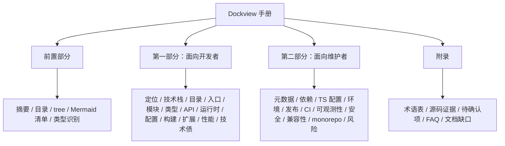
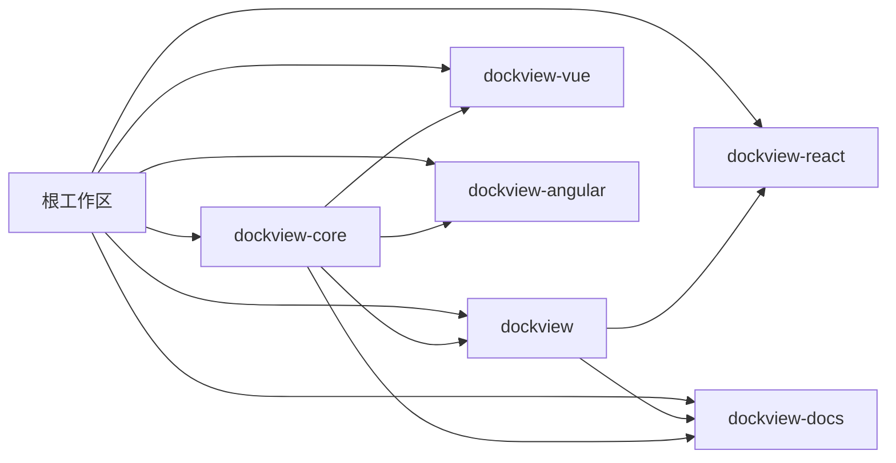
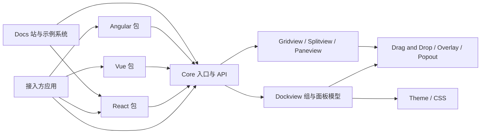
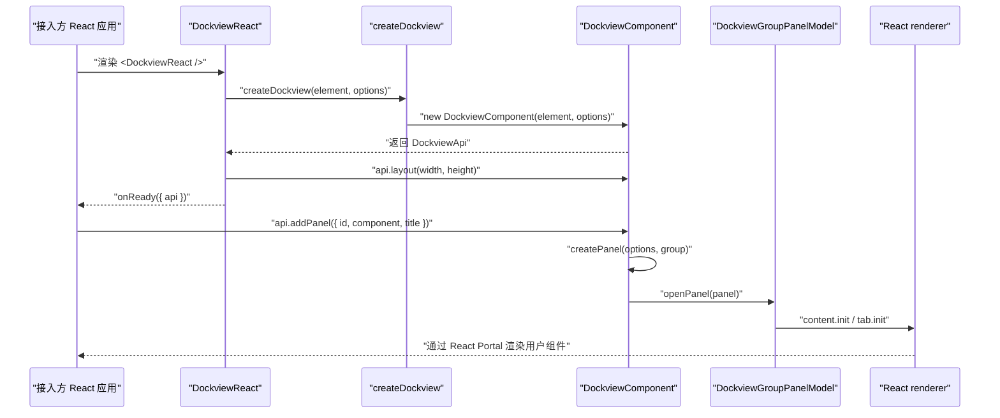
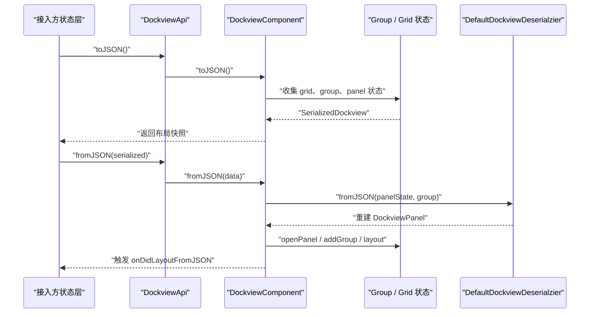
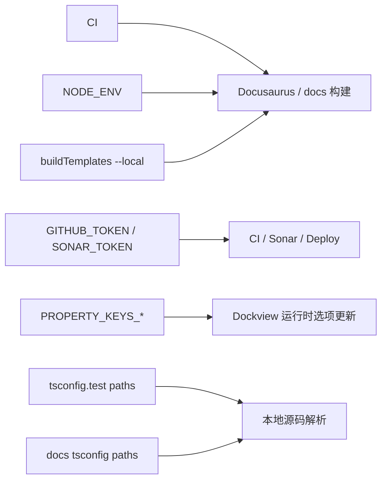
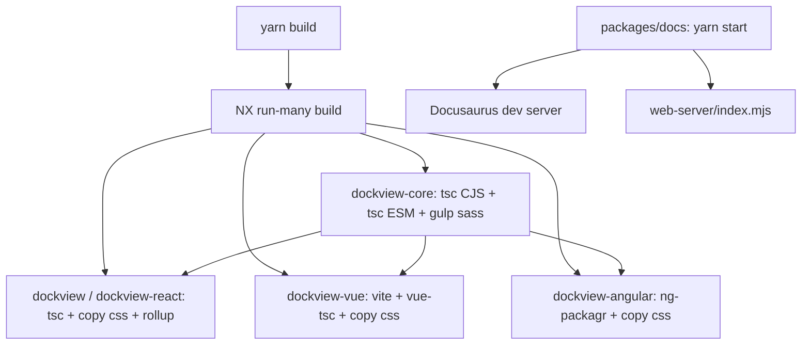
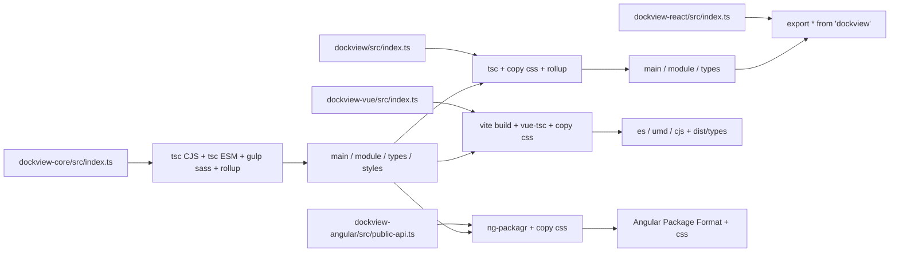
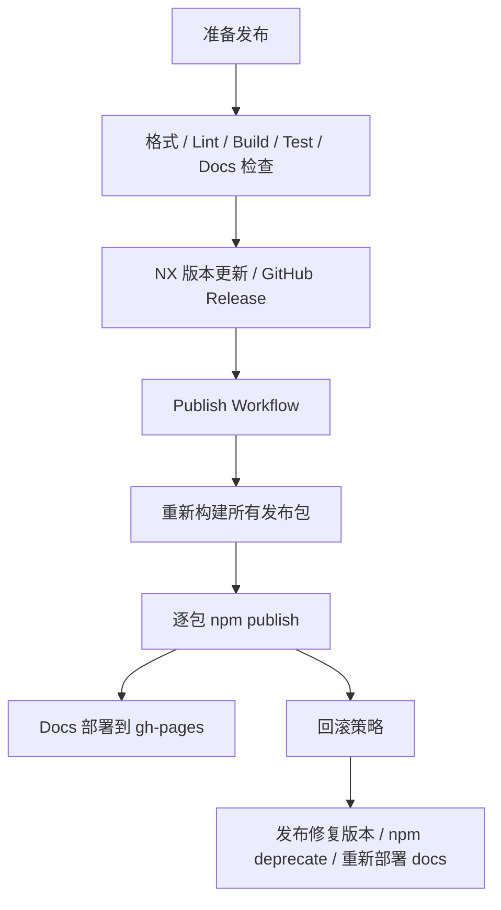

# Dockview 项目开发与维护手册（源码分析版）

> 分析范围：`E:\Code\Node_editor\dockview`
>
> 分析方式：以源码、配置、测试、构建脚本、CI 工作流为主，不把 README 当成唯一事实来源。
>
> 说明：当前工作区未安装 `node_modules`，因此依赖 NX/构建工具的命令没有在本次分析中完整复跑；凡是需要运行结果背书的结论，均按源码与配置说明，并在必要处标记为【待确认】或【推断】。

## 1. 一页式项目摘要

| 项 | 结论 |
| --- | --- |
| 项目主类型 | `monorepo + library / SDK` |
| 项目副类型 | `frontend docs app`（Docusaurus 文档站） |
| 主要发布对象 | `dockview-core`、`dockview`、`dockview-vue`、`dockview-react`、`dockview-angular` |
| 包管理器 | `Yarn v1`，依据：根目录 `yarn.lock`、根 `package.json` scripts |
| 工作区编排 | `NX`，依据：根 `nx.json`、根 scripts 中 `nx run-many` / `nx release` |
| 运行时边界 | 浏览器运行库；Node 负责构建、测试、发布、文档生成；无后端服务入口 |
| 核心设计 | `dockview-core` 提供零运行时依赖的布局引擎，React/Vue/Angular 包做框架适配，`dockview-react` 是兼容性别名包 |
| 构建策略 | Core/React 走 `tsc + Rollup + CSS`；Vue 走 `Vite + vue-tsc + CSS`；Angular 走 `ng-packagr + CSS` |
| 测试策略 | 根 Jest 聚合多包配置；共发现 `57` 个测试文件；主打单元测试与组件适配测试 |
| 发布策略 | NX fixed versioning；GitHub Release 触发 npm 发布；支持 experimental tag |
| 文档站职责 | Docusaurus v3 展示文档、示例、Demo，并消费 TypeDoc 生成的数据 |
| 当前维护重点 | 构建链一致性、公开导出稳定性、Angular/Vue 适配差异、TypeDoc 覆盖面、发布与 CI 门禁完整性 |

## 2. 文档目录框架

1. 一页式项目摘要
2. 文档目录框架
3. 文档 tree
4. Mermaid 图清单
5. 项目类型识别结果与识别依据
6. 第一部分：面向开发者
7. 第二部分：面向维护者
8. 附录

## 3. 文档 tree（最多 3 层）

```text
Dockview 项目开发与维护手册
├── 前置部分
│   ├── 一页式摘要
│   ├── 文档目录与 tree
│   ├── Mermaid 图清单
│   └── 项目类型识别
├── 第一部分：面向开发者
│   ├── 定位、技术栈、目录、入口、模块、类型系统
│   ├── 公开 API / 路由 / 事件 / 关键运行时流程
│   ├── 配置、构建、测试、调试、扩展、性能
│   └── 已知问题、技术债、阅读建议
├── 第二部分：面向维护者
│   ├── 包元数据、依赖、TypeScript 配置、环境与密钥
│   ├── 构建发布部署、CI/CD、可观测性、安全
│   ├── 兼容性、迁移、monorepo 维护策略
│   └── 风险清单、维护建议、交接建议
└── 附录
    ├── 术语表
    ├── 关键源码证据清单
    ├── 待确认项清单
    ├── FAQ / Troubleshooting
    └── 最应优先补齐的文档缺口 Top 10
```

## 4. 需要生成的 Mermaid 图清单

1. 文档结构图
2. 项目 / workspace 结构图
3. 核心模块架构图
4. 主业务链路时序图
5. 序列化 / 反序列化时序图
6. 构建 / 启动链路图
7. 发布 / 回滚流程图
8. 配置 / 环境变量影响图
9. 库导出链 / 打包产物 / 类型声明关系图



## 5. 项目类型识别结果与识别依据

### 5.1 识别结果

该仓库最接近的真实类型是：

- 主类型：`monorepo`
- 主业务形态：`library / SDK`
- 辅助形态：`frontend app`（仅用于文档站与示例演示）

换句话说，这不是一个“单体前端应用”或“后端服务”，而是一个“多包浏览器 UI 布局库仓库”，同时内置一个 Docusaurus 文档站和示例系统。

### 5.2 识别依据

| 依据类别 | 证据 | 结论 |
| --- | --- | --- |
| workspace | 根 `package.json` 使用 `workspaces: ["packages/*"]`；根 `tsconfig.json` 引用多个包；根 `nx.json` 定义多项目构建和发布 | 明确是 monorepo |
| 发布产物 | 各发布包都有 `main`、`module`、`types`、`files` 或 Angular package 配置；根发布脚本遍历多个包执行 `npm publish` | 主要交付物是 npm 库，不是单个应用 |
| 入口文件 | `packages/dockview-core/src/index.ts`、`packages/dockview/src/index.ts`、`packages/dockview-vue/src/index.ts`、`packages/dockview-angular/src/public-api.ts` | 以库入口为中心组织源码 |
| 框架配置 | Vue 使用 `vite.config.ts`，Angular 使用 `ng-package.json`，React/Core 使用 `rollup.config.js` 和 `tsconfig.esm.json` | 按包适配不同框架的发布构建 |
| 运行时代码 | Core API 入口要求 `HTMLElement`，`PopoutWindow` 调用 `window.open`，Jest 使用 `jsdom` | 运行时主要是 browser，不是 Node 服务端 |
| 文档站 | `packages/docs/package.json` 使用 Docusaurus，`src/pages/index.tsx`、`src/pages/demo.tsx` 提供页面入口 | 仓库包含前端文档站，但不是唯一主业务 |
| 服务端结构缺失 | 仓库根与各包中未发现 Express/Nest/Fastify/Koa 等服务入口；未发现 API 控制器/数据库层 | 不是 backend service |

- 对开发者/维护者的价值：先把项目归类为“多包 UI 库仓库”，后续所有文档组织才能围绕公开导出、构建产物、框架包装层和发布链路展开，而不是误写成页面路由文档或服务端接口文档。
- 关键源码证据：`package.json#workspaces`、`nx.json#release`、`packages/dockview-core/package.json#main/module/types`、`packages/docs/package.json`、`packages/dockview-core/src/api/entryPoints.ts#createDockview`
- 待确认项：根 `docs/` 目录本身是 TypeDoc 输出目录还是长期手写文档目录，按现有脚本看更像生成产物目录；本次按“可写入的根 docs 文件夹”处理。

# 第一部分：面向开发者

## 1. 项目定位、使用场景、非目标、术语

Dockview 解决的是“在浏览器里构建 IDE / 工作台式多面板布局”的问题。它提供标签页、分组、网格、分栏、可拖拽重排、浮动组、弹出新窗口、序列化 / 反序列化、主题等能力，并把这些能力拆成一个零运行时依赖的核心引擎，再由 React、Vue、Angular 包做薄适配层。

主要服务对象是前端组件库作者、复杂工作台应用开发者、需要构建 IDE 风格界面的团队，以及希望在 React / Vue / Angular 中复用同一套布局能力的维护者。仓库内置的 `packages/docs` 则服务于示例演示、API 文档呈现和版本发布说明。

该项目明确不负责以下内容：

- 不内置业务数据获取、全局状态管理、鉴权、路由或后端 API。
- 不提供服务端渲染专用适配层；核心逻辑明显依赖 DOM 和 `window`。
- 不内置持久化存储后端；只提供 `toJSON()` / `fromJSON()`，把存储责任交给接入方。
- 不提供运行时 schema 校验框架；主要依靠 TypeScript 契约和少量 imperative guard。

### 术语表

| 术语 | 含义 | 关键落点 |
| --- | --- | --- |
| Dockview | 带标签页和分组的主布局组件 | `packages/dockview-core/src/dockview/*` |
| Group | 一个标签组容器，可包含多个 Panel | `DockviewGroupPanel`、`DockviewGroupPanelModel` |
| Panel | 单个内容面板，内容与标签都可定制 | `DockviewPanel`、`DockviewPanelApi` |
| Gridview | 二维网格布局容器 | `packages/dockview-core/src/gridview/*` |
| Splitview | 一维分栏容器 | `packages/dockview-core/src/splitview/*` |
| Paneview | 折叠 / 面板栈布局容器 | `packages/dockview-core/src/paneview/*` |
| Renderer | 框架包装层注入给 core 的渲染器对象 | `IContentRenderer`、`ITabRenderer`、`IWatermarkRenderer` |
| Floating Group | 脱离主网格的浮动组 | `DockviewFloatingGroupPanel` |
| Popout Group | 打开到新窗口的组 | `PopoutWindow`、`DockviewComponent#addPopoutGroup` |
| Overlay Render Container | 管理 panel DOM 覆盖层与可见性 | `OverlayRenderContainer` |
| Framework Options | 由 React / Vue / Angular 注入的组件工厂选项 | `DockviewFrameworkOptions` 及各框架组件 |

- 对开发者/维护者的价值：这一节把“仓库在解决什么、又刻意不解决什么”界定清楚，能避免新接入者把状态管理、数据层、SSR 或服务端责任错误地加到库里。
- 关键源码证据：`packages/dockview-core/src/dockview/options.ts#DockviewOptions`、`packages/dockview-core/src/api/component.api.ts#DockviewApi`、`packages/dockview-core/src/popoutWindow.ts#PopoutWindow`
- 待确认项：无。

## 2. 技术栈与运行时边界

### 2.1 TypeScript 在这里承担什么角色

TypeScript 在这个仓库里不是“给应用写业务类型”的辅助工具，而是公开 API 契约、框架桥接契约、构建产物类型声明和内部布局模型稳定性的核心基础设施：

- Core 包的公开选项、事件、状态、API 全部由 TypeScript interface / class 暴露。
- React / Vue / Angular 包都把 core 契约再包装成框架友好的 props / inputs / emits / renderer 类型。
- `tsc`、`vue-tsc`、`ng-packagr` 都承担了 `.d.ts` 产出职责。
- 根 `tsconfig.base.json` 开启了 `strict`、`noImplicitAny`、`noImplicitReturns` 等强约束。

### 2.2 运行时边界

| 运行时 | 角色 | 证据 |
| --- | --- | --- |
| Browser | 库的真实运行时。需要 `HTMLElement`、DOM 事件、拖拽、`window.open`、样式表复制 | `createDockview(element, options)`、`PopoutWindow`、`OverlayRenderContainer` |
| Node | 构建、测试、发布、文档生成、模板生成 | 根 scripts、`scripts/docs.mjs`、`packages/docs/scripts/buildTemplates.mjs` |
| SSR / SSG | 仅文档站的静态生成；库本身没有 SSR 专用入口 | `packages/docs/package.json#build`、Docusaurus 配置 |
| Edge / Backend | 未发现真实业务运行时入口 | 未发现服务端入口文件、路由控制器、数据库配置 |

库本体明显偏 browser-only。它并不是“Node 可执行 CLI”，也不是“可在 Edge 上直接运行的同构 SDK”。如果要在 SSR 场景接入，通常应在客户端阶段再挂载。

### 2.3 核心工具栈

| 类别 | 工具 | 用途 |
| --- | --- | --- |
| Monorepo 编排 | NX | 批量构建、缓存、fixed version release |
| 包管理 | Yarn v1 workspaces | 工作区依赖安装与联动 |
| 核心构建 | `tsc` | Core/React/React-compat 的 CJS/ESM 输出 |
| UMD / bundle | Rollup | Core/React/React-compat 的 UMD 与 package bundle |
| CSS 构建 | Gulp | `dockview-core` 中 SCSS 合并为 `dockview.css` |
| Vue 构建 | Vite + `vue-tsc` | JS bundle 与类型声明 |
| Angular 构建 | ng-packagr | Angular Package Format 输出 |
| 测试 | Jest + ts-jest + jsdom | 多包单元测试 |
| 质量 | ESLint、Prettier、SonarCloud、CodeQL | 代码规范、静态质量、供应链与代码扫描 |
| 文档 | Docusaurus v3、TypeDoc | 官网和 API 文档数据生成 |

### 2.4 为什么是这套组合

从代码结构看，这套工具的选择是围绕“多框架发布型库”而非“单应用开发体验”做的：

- `dockview-core` 要兼顾零依赖和广泛兼容，所以保留 `tsc + Rollup + Gulp` 的显式构建链。
- Vue 包使用 Vite，是因为需要更自然地处理 `.vue` SFC 与多格式库构建。
- Angular 包使用 `ng-packagr`，这是 Angular 包发布的惯用链路。
- 根层使用 NX，不是因为代码很多页面，而是为了统一多包构建顺序、缓存和 release 版本策略。

- 对开发者/维护者的价值：理解“为什么不是所有包都走一种构建器”后，后续改构建链时就会优先保留每个生态最自然的产物格式，而不是强行统一。
- 关键源码证据：`tsconfig.base.json`、`packages/dockview-core/rollup.config.js`、`packages/dockview-vue/vite.config.ts`、`packages/dockview-angular/ng-package.json`、`packages/docs/docusaurus.config.js`
- 待确认项：无。

## 3. package / workspace / 目录结构地图

### 3.1 核心目录地图

| 目录 | 职责 | 备注 |
| --- | --- | --- |
| 根目录 | 统一工作区、共享配置、CI/CD、发布、TypeDoc 数据生成 | `package.json`、`nx.json`、根 Jest / ESLint / TS 配置 |
| `packages/dockview-core` | 核心布局引擎与公共 API | 零运行时依赖，所有框架包都依赖它 |
| `packages/dockview` | React 主包 | 公开 React 组件并重导出 core |
| `packages/dockview-react` | React 兼容别名包 | 源码只有 `export * from 'dockview'` |
| `packages/dockview-vue` | Vue 3 适配层 | 使用 SFC、组合式工具函数 |
| `packages/dockview-angular` | Angular 适配层 | standalone component + `NgModule` 双出口 |
| `packages/docs` | 文档站、Demo、模板、发布说明 | Docusaurus v3，非发布库 |
| `scripts` | 根级 TypeDoc 数据生成与文档打包 | 不属于运行时库 |
| `.github/workflows` | CI、发布、文档部署、CodeQL | 持续交付入口 |

### 3.2 关键源码 tree

```text
packages
├── dockview-core
│   ├── src
│   │   ├── api
│   │   ├── dockview
│   │   ├── gridview
│   │   ├── splitview
│   │   ├── paneview
│   │   ├── dnd
│   │   ├── overlay
│   │   └── __tests__
│   ├── rollup.config.js
│   ├── gulpfile.js
│   └── tsconfig*.json
├── dockview
│   ├── src
│   │   ├── dockview
│   │   ├── gridview
│   │   ├── splitview
│   │   ├── paneview
│   │   └── react.ts
│   └── rollup.config.js
├── dockview-vue
│   ├── src
│   │   ├── dockview
│   │   ├── gridview
│   │   ├── splitview
│   │   ├── paneview
│   │   ├── composables
│   │   └── utils.ts
│   └── vite.config.ts
├── dockview-angular
│   ├── src
│   │   ├── public-api.ts
│   │   ├── lib
│   │   │   ├── dockview
│   │   │   ├── gridview
│   │   │   ├── splitview
│   │   │   ├── paneview
│   │   │   └── utils
│   │   └── __tests__
│   └── ng-package.json
└── docs
    ├── docs
    ├── src
    ├── templates
    ├── sandboxes
    ├── blog
    └── web-server
```

### 3.3 建议优先阅读路径

1. 根 `package.json`、`nx.json`、`tsconfig.base.json`
2. `packages/dockview-core/src/index.ts`
3. `packages/dockview-core/src/api/entryPoints.ts`
4. `packages/dockview-core/src/dockview/dockviewComponent.ts`
5. `packages/dockview-core/src/dockview/dockviewGroupPanelModel.ts`
6. React / Vue / Angular 包各自的入口组件
7. `packages/docs/docusaurus.config.js` 与 `packages/docs/src/pages/demo.tsx`

### 3.4 项目 / workspace 结构图



- 对开发者/维护者的价值：这节解决“应该从哪里下手读”和“每个目录究竟算产品代码还是工具链代码”的问题，能显著降低第一次进入仓库时的迷路成本。
- 关键源码证据：`package.json#workspaces`、`packages/README.md`、`packages/dockview-core/AGENTS.md`、`packages/docs/AGENTS.md`
- 待确认项：无。

## 4. 入口文件、启动链路与初始化顺序

### 4.1 各形态入口总览

| 场景 | 入口 | 初始化顺序 |
| --- | --- | --- |
| Vanilla / Core | `packages/dockview-core/src/api/entryPoints.ts#createDockview` 或 `new DockviewComponent(...)` | 创建组件实例 → 暴露 `DockviewApi` → 外部调用 `layout` / `addPanel` |
| React | `packages/dockview/src/dockview/dockview.tsx#DockviewReact` | React `useEffect` 挂载 DOM → 拼出 `DockviewFrameworkOptions` → `createDockview` → `layout` → `onReady` |
| Vue | `packages/dockview-vue/src/dockview/dockview.vue` | `onMounted` → `findComponent` → `createDockview` → `layout` → `markRaw(api)` → `emit('ready')` |
| Angular | `packages/dockview-angular/src/lib/dockview/dockview-angular.component.ts` | `ngOnInit` → `extractCoreOptions` → `AngularFrameworkComponentFactory` → `createDockview` → 事件订阅 → `ready.emit(...)` |
| Docs 首页 | `packages/docs/src/pages/index.tsx` | Docusaurus page render |
| Docs Demo | `packages/docs/src/pages/demo.tsx` | 浏览器端读取 query theme → `ExampleFrame` 懒加载 sandbox |

### 4.2 Core 启动链路

Core 的启动非常直接：

1. `createDockview(element, options)` 在 `entryPoints.ts` 中实例化 `DockviewComponent`。
2. `DockviewComponent` 构造函数在内部初始化：
   - `BaseGrid`
   - `PopupService`
   - `OverlayRenderContainer`
   - 根级 `Droptarget`
   - 主题类名与水印
   - 各类事件发射器
3. `DockviewApi` 被包装并暴露给调用方。
4. 真正的 panel / group 在调用 `api.addPanel()`、`api.addGroup()` 或 `fromJSON()` 时创建。

### 4.3 React 启动链路

React 适配层有两个关键动作：

- 用 `extractCoreOptions()` 过滤出 core 认得的配置项，避免 React props 直接污染 core。
- 把 React 组件注册表映射成 `createComponent` / `createTabComponent` / `createWatermarkComponent` 等 renderer 工厂。

`DockviewReact` 还会在后续 `useEffect` 中持续调用 `api.updateOptions()`，使得 props 变化可以回流到 core，这一模式和 Vue 的 `watch`、Angular 的 `ngOnChanges` 形成对应关系。

### 4.4 Docs 本地启动链路

文档站的本地开发不是单进程：

- `packages/docs/package.json#start` 使用 `concurrently` 同时启动 Docusaurus dev server 和 `web-server/index.mjs`。
- `web-server/index.mjs` 在 `localhost:1111` 暴露本地包产物，供模板示例在 `--local` 模式下加载。

### 4.5 构建命令与运行命令衔接

| 命令 | 作用 | 产出 / 下一跳 |
| --- | --- | --- |
| `yarn build` | 根层批量构建发布库 | 所有发布包 `dist/` 就绪 |
| `yarn build:bundle` | 生成 bundle 产物 | UMD / package bundle 完整 |
| `yarn test` | 多包 Jest | 单元测试 |
| `yarn docs` | TypeDoc + 结构化 API JSON | 根 `docs/` 与 `packages/docs/src/generated/api.output.json` |
| `cd packages/docs && yarn start` | 文档站本地开发 | Docusaurus + 本地包静态服务 |

- 对开发者/维护者的价值：入口和启动顺序一旦清晰，排查“为什么组件没渲染”“为什么 props 更新不生效”“为什么 CSS 拷贝失败”就会快很多。
- 关键源码证据：`packages/dockview-core/src/api/entryPoints.ts`、`packages/dockview-core/src/dockview/dockviewComponent.ts`、`packages/dockview/src/dockview/dockview.tsx`、`packages/dockview-vue/src/dockview/dockview.vue`、`packages/dockview-angular/src/lib/dockview/dockview-angular.component.ts`、`packages/docs/web-server/index.mjs`
- 待确认项：`DockviewComponent` 构造后是否总是由外层主动调用一次 `layout()`；React/Vue 明确调用，Angular 依赖 auto-resize，更适合视为“配置驱动的隐式布局更新”。

## 5. 模块分层与职责边界

### 5.1 核心模块架构图



### 5.2 模块边界表

| 模块 | 职责 | 核心文件 | 依赖关系 | 扩展点 | 风险点 | 建议阅读顺序 |
| --- | --- | --- | --- | --- | --- | --- |
| Core Public API | 暴露 `create*` 入口与 `*Api` façade | `packages/dockview-core/src/api/entryPoints.ts`、`component.api.ts` | 被所有框架包消费 | 新增公开方法、事件 | API 兼容性最敏感 | 1 |
| Dockview Model | 管理 group、panel、拖拽、浮动组、popout、序列化 | `dockviewComponent.ts`、`dockviewGroupPanelModel.ts`、`deserializer.ts` | 依赖 grid/split/pane/dnd/overlay | 新布局能力、多种 drop 行为 | 体量大、事件序复杂 | 2 |
| Layout Primitives | 提供 Gridview / Splitview / Paneview 三类布局基元 | `gridview/*`、`splitview/*`、`paneview/*` | 被 core 和框架包调用 | 布局算法、尺寸策略 | orientation / sizing 改动影响面大 | 3 |
| DnD / Overlay / Popout | 管理拖拽目标、渲染层、浮动与弹窗窗口 | `dnd/*`、`overlay/*`、`popoutWindow.ts` | 依赖 DOM、事件和 panel/group 模型 | 自定义 overlay、窗口行为 | DOM 细节多、跨窗口难测 | 4 |
| Theme | 内置主题与 CSS 变量约束 | `dockview/theme.ts`、SCSS 文件 | 被 docs 和使用方直接消费 | 自定义主题、gap、overlay mounting | CSS 回归可能跨框架传播 | 5 |
| React Adapter | 把 React 组件桥接成 core renderer；维护 portals 生命周期 | `packages/dockview/src/dockview/dockview.tsx`、`react.ts` | 依赖 `dockview-core` | 内容、Tab、水印、头部动作组件 | React 生命周期与 imperative world 混用 | 6 |
| Vue Adapter | 通过 `findComponent`、`mountVueComponent`、`markRaw` 桥接 Vue 组件 | `packages/dockview-vue/src/dockview/dockview.vue`、`utils.ts` | 依赖 `dockview-core` | SFC 插槽式接入、watch 驱动更新 | 组件查找失败与代理污染 | 7 |
| Angular Adapter | 通过 `AngularFrameworkComponentFactory` 创建 standalone 组件与 renderer | `packages/dockview-angular/src/lib/*` | 依赖 `dockview-core`、Angular runtime | Inputs/Outputs、组件工厂 | Angular 版本与打包兼容 | 8 |
| React Compat | 兼容旧包名 | `packages/dockview-react/src/index.ts` | 依赖 `dockview` | 无实际扩展点 | 容易与 `dockview` 重复维护 | 9 |
| Docs Site | 官网文档、Demo、模板生成、API 数据消费 | `packages/docs/*` | 依赖 `dockview` 与 `dockview-core` | 示例、发布说明、API 展示 | 文档和源码漂移 | 10 |

### 5.3 模块边界上的一个关键设计

这个仓库最有价值的架构点，是把“布局状态机”和“框架渲染器”分开：

- Core 只认 renderer 接口，不认 React/Vue/Angular 本身。
- 框架包只负责把本框架组件适配成 renderer，不重写布局引擎。
- 这让 `dockview-core` 的行为在三套框架中保持一致，同时把 UI 生态差异压缩到薄包装层。

- 对开发者/维护者的价值：理解这一层边界后，新增能力时就知道应先改 core 还是先改框架包装层，也知道哪些内部类不应被下游直接依赖。
- 关键源码证据：`packages/dockview-core/src/dockview/types.ts#IContentRenderer`、`packages/dockview/src/react.ts#ReactPart`、`packages/dockview-vue/src/utils.ts#VueRenderer`、`packages/dockview-angular/src/lib/utils/angular-renderer.ts#AngularRenderer`
- 待确认项：无。

## 6. 类型系统与核心契约

### 6.1 关键契约分类

| 契约类别 | 代表符号 | 所在文件 | 作用边界 |
| --- | --- | --- | --- |
| 公开组件 API | `DockviewApi`、`GridviewApi`、`PaneviewApi`、`SplitviewApi` | `packages/dockview-core/src/api/component.api.ts` | 面向接入方的主要编程接口 |
| 创建入口 | `createDockview`、`createGridview` 等 | `packages/dockview-core/src/api/entryPoints.ts` | Runtime 实例入口 |
| 公开配置 | `DockviewOptions`、`DockviewComponentOptions`、`GridviewOptions`、`PaneviewOptions` | `packages/dockview-core/src/dockview/options.ts`、`gridview/options.ts`、`paneview/options.ts` | 配置边界 |
| Renderer 契约 | `IContentRenderer`、`ITabRenderer`、`IWatermarkRenderer` | `packages/dockview-core/src/dockview/types.ts` | Core 与框架包装层的桥 |
| 通用参数 | `Parameters`、`PanelUpdateEvent`、`CreateComponentOptions` | `packages/dockview-core/src/panel/types.ts`、`dockview/options.ts` | 组件参数与更新边界 |
| 状态持久化 | `SerializedDockview`、`GroupviewPanelState`、`GroupPanelViewState` | `dockviewComponent.ts`、`dockview/types.ts`、`dockviewGroupPanelModel.ts` | 序列化边界 |
| React 契约 | `IDockviewReactProps`、`IDockviewPanelProps` | `packages/dockview/src/dockview/dockview.tsx`、`packages/dockview-core/src/dockview/framework.ts` | React 包公开 props |
| Vue 契约 | `IDockviewVueProps`、`VueEvents` | `packages/dockview-vue/src/dockview/types.ts` | Vue `props + emits` |
| Angular 契约 | `DockviewAngularOptions`、`DockviewAngularEvents` | `packages/dockview-angular/src/lib/dockview/types.ts` | Angular inputs / outputs |

### 6.2 类型在边界上的实际作用

1. Core 与接入方之间：由 `DockviewApi`、`AddPanelOptions`、`DockviewOptions` 等约束。
2. Core 与框架适配层之间：由 `IContentRenderer`、`ITabRenderer`、`CreateComponentOptions` 约束。
3. 运行时状态与持久化之间：由 `SerializedDockview`、`GroupPanelViewState` 等约束。
4. 文档站与 API 数据之间：由 TypeDoc 产出 JSON，再由 `scripts/docs.mjs` 结构化处理。

### 6.3 编译期校验与运行时校验的分工

这个仓库主要依赖编译期校验：

- `strict` TypeScript 配置约束公开 API 和内部实现。
- `PROPERTY_KEYS_DOCKVIEW`、`PROPERTY_KEYS_GRIDVIEW`、`PROPERTY_KEYS_PANEVIEW` 这类数组通过“空对象键映射”的写法，确保新增 option 时编译器会提醒同步更新 key 列表。

运行时校验相对轻量，主要表现为：

- 缺少组件注册时抛错，例如 Vue `findComponent()` 和 Angular `component-factory`。
- 重复 group id 时警告并重分配。
- `PopoutWindow#open()` 对 popup blocked 返回 `null`。

### 6.4 未发现的校验工具

在根依赖和各包源码中未发现 `zod`、`io-ts`、`class-validator`、`yup`、`ajv` 等 schema 校验工具。也就是说：

- 公开输入以 TypeScript 类型为主；
- 运行时不做系统化 schema 解析；
- 下游若把外部 JSON 直接传给 `fromJSON()`，需要自行保证数据来源可信。

- 对开发者/维护者的价值：这节能帮助你判断“应该把新增约束加到 type 里、还是加到 runtime guard 里”，以及哪些类型是真正的跨模块公共协议。
- 关键源码证据：`packages/dockview-core/src/panel/types.ts`、`packages/dockview-core/src/dockview/types.ts`、`packages/dockview-core/src/dockview/options.ts#PROPERTY_KEYS_DOCKVIEW`、`packages/dockview-vue/src/dockview/types.ts`、`packages/dockview-angular/src/lib/dockview/types.ts`
- 待确认项：无。

## 7. API / 页面 / 路由 / 命令 / 事件 / 作业说明

本仓库以“库 API”说明为主，同时补充 docs 站的页面与路由结构。

### 7.1 公开入口与导出面

| 包 | 公开入口 | 暴露内容 | 典型输入 | 典型输出 / 副作用 | 关键依赖 |
| --- | --- | --- | --- | --- | --- |
| `dockview-core` | `src/index.ts` | 所有基础 API、布局组件、主题、事件、序列化类型 | `HTMLElement`、options、renderer factory | `DockviewApi` 等实例，DOM 布局变化 | 无运行时依赖 |
| `dockview` | `src/index.ts` | 重导出 core + `DockviewReact` / `GridviewReact` / `PaneviewReact` / `SplitviewReact` | React components registry、props | React 组件、portals | `react` peer、`dockview-core` dep |
| `dockview-vue` | `src/index.ts` | 重导出 core + Vue 组件 | 组件名查找、SFC props/emits | Vue 组件实例 | `vue` peer、`dockview-core` dep |
| `dockview-angular` | `src/public-api.ts` | 重导出 core + standalone 组件 + `DockviewAngularModule` | Angular `Type<any>` registry、inputs/outputs | Angular components / NgModule | Angular peers、`dockview-core` dep |
| `dockview-react` | `src/index.ts` | `export * from 'dockview'` | 与 `dockview` 相同 | 与 `dockview` 相同 | `dockview` dep |

### 7.2 核心编程接口

| API | 常用输入 | 常用输出 / 事件 | 错误或边界 |
| --- | --- | --- | --- |
| `DockviewApi#addPanel` | `id`、`component`、`title`、`params`、位置策略 | 返回 `IDockviewPanel`，可能触发 `onDidAddPanel`、`onDidLayoutChange` | 注册表缺少 renderer 时后续渲染失败 |
| `DockviewApi#addGroup` | 相对 panel/group 或绝对方向 | 返回 `DockviewGroupPanel` | 定位策略错误会影响布局 |
| `DockviewApi#toJSON` | 无 | `SerializedDockview` | 只负责快照，不负责存储 |
| `DockviewApi#fromJSON` | `SerializedDockview` | 重建布局并触发 `onDidLayoutFromJSON` | 输入对象不受 schema 校验保护 |
| `DockviewApi#addFloatingGroup` | panel/group + box | 组从 grid 转为 floating | `disableFloatingGroups` 相关配置需自查 |
| `DockviewApi#addPopoutGroup` | panel/group + `popoutUrl`/position | 弹出新窗口；可能触发 `onDidOpenPopoutWindowFail` | 受浏览器 popup policy 影响 |
| `SplitviewApi` / `GridviewApi` / `PaneviewApi` | 面板增删改 / 方向 / 序列化 | 对应布局容器实例 | 各自约束不同 |

### 7.3 事件面

| 事件 | 作用 | 文件落点 |
| --- | --- | --- |
| `onReady` | 框架包装层初始化完成回调 | React/Vue/Angular 入口组件 |
| `onDidDrop` / `onWillDrop` | 拖拽前后拦截 | `DockviewApi`、`DockviewGroupPanelModel` |
| `onDidLayoutChange` / `onDidLayoutFromJSON` | 布局变化与反序列化完成 | `component.api.ts` |
| `onDidActivePanelChange` / `onDidActiveGroupChange` | 焦点切换 | `DockviewComponent`、`DockviewGroupPanelModel` |
| `onDidOpenPopoutWindowFail` | popup 被阻止时通知 | `DockviewApi`、`DockviewComponent` |

### 7.4 Docs 页面与路由

| 路由 / 页面 | 来源 | 作用 |
| --- | --- | --- |
| `/` | `packages/docs/src/pages/index.tsx` | 官网首页 |
| `/demo` | `packages/docs/src/pages/demo.tsx` | 交互式演示页 |
| `/docs/...` | `packages/docs/docs/**` + Docusaurus docs plugin | 正式文档 |
| `/templates/...` | `packages/docs/static/templates/**` | 模板示例运行页 |

`packages/docs/docs` 下的文档分区也很清晰：`overview`、`core`、`other`、`advanced`、`api`，对应用户指南、核心能力、附属组件、高级能力和 API。

### 7.5 访问控制与错误处理

- 库本身不包含鉴权或权限系统。
- 文档站也不是受保护应用。
- 主要错误处理是“快速抛错 / 事件回调 / 控制台告警”，不是统一错误边界系统。

- 对开发者/维护者的价值：这一节直接告诉开发者“我能从包里拿到什么、调用后会发生什么、哪里会抛错”，是接入和二次开发最常回看的部分。
- 关键源码证据：`packages/dockview-core/src/index.ts`、`packages/dockview-core/src/api/component.api.ts`、`packages/dockview-angular/src/public-api.ts`、`packages/docs/docs`、`packages/docs/src/pages/demo.tsx`
- 待确认项：`dockview-angular` README 示例中模板标签写法与源码 selector `dv-dockview` 是否存在文档漂移，建议以源码为准再核对官网示例。

## 8. 关键运行时流程

### 8.1 主业务链路：React 接入后新增 Panel



#### 代码落点说明

1. `DockviewReact` 在 `useEffect` 中初始化 DOM 引用和 renderer 工厂。
2. `createDockview()` 创建 `DockviewComponent` 并返回 `DockviewApi`。
3. `onReady` 暴露 API 给业务方，业务方通常在这里调用 `addPanel()`。
4. `DockviewComponent#createPanel()` 组装 `DockviewPanelModel` 与 `DockviewPanel`。
5. `DockviewGroupPanelModel#openPanel()` 负责把 panel 接入 tabs container 和 content container。
6. `ReactPanelContentPart` / `ReactPanelHeaderPart` 再借助 `ReactPart` 与 portal 生命周期把 React 组件渲染进 core 管理的 DOM 容器。

### 8.2 关键状态链路：布局序列化与恢复



#### 代码落点说明

1. `DockviewApi#toJSON()` 和 `DockviewApi#fromJSON()` 是唯一稳定的持久化边界。
2. `DockviewComponent` 汇总 grid root、groups、panels、floatingGroups、popoutGroups。
3. `DefaultDockviewDeserialzier` 负责根据 `GroupviewPanelState` 重建 panel 对象。
4. 该链路没有外部 schema 校验，下游应保证数据可信且版本兼容。

- 对开发者/维护者的价值：比起只知道“有 addPanel / fromJSON”，真正知道调用以后内部会经过哪些对象，才能在扩展 renderer、排查拖拽回归、升级序列化格式时不踩坑。
- 关键源码证据：`packages/dockview/src/dockview/dockview.tsx`、`packages/dockview-core/src/dockview/dockviewComponent.ts`、`packages/dockview-core/src/dockview/dockviewGroupPanelModel.ts`、`packages/dockview-core/src/dockview/deserializer.ts`
- 待确认项：`fromJSON()` 的跨大版本兼容策略没有在源码中形成集中声明，建议结合 `packages/docs/blog` 里的 release note 再建立迁移矩阵。

## 9. 配置、环境变量、feature flags 与路径别名

### 9.1 环境变量与开关来源

本仓库未发现 `.env`、`.env.example` 或集中式运行时配置模块。配置主要分成三类：

| 来源 | 变量 / 开关 | 影响 |
| --- | --- | --- |
| GitHub Actions | `SONAR_TOKEN`、`GITHUB_TOKEN` | Sonar 扫描、GitHub Pages 部署 |
| Docs 构建环境 | `CI`、`NODE_ENV` | Docusaurus `baseUrl`、gtag、源码 alias |
| 模板构建参数 | `--local` | `buildTemplates.mjs` 选择本地 `localhost:1111` 还是 CDN |
| 组件运行时 props | `debug`、`disableDnd`、`theme`、`singleTabMode` 等 | 直接影响 core 行为 |
| URL 查询参数 | `theme`、`framework` | docs demo 和文档页框架切换 |

### 9.2 路径别名

| 场景 | 文件 | 别名 |
| --- | --- | --- |
| 测试 | 根 `tsconfig.test.json` | `dockview-core`、`dockview`、`dockview-react` 映射到源码入口 |
| docs 本地开发 | `packages/docs/tsconfig.json` | `dockview-core`、`dockview` 指向本地源码 |
| docs webpack alias | `packages/docs/docusaurus.config.js` | 非生产环境下 alias 到 `../dockview-core/src` 和 `../dockview/src` |

这说明两个重要事实：

- 单测更偏向“源码级验证”，而不是 npm 打包产物级 smoke test。
- docs 本地开发默认会优先读取源码，而不是 npm 包。

### 9.3 `PROPERTY_KEYS_*` 的实际作用

`PROPERTY_KEYS_DOCKVIEW`、`PROPERTY_KEYS_GRIDVIEW`、`PROPERTY_KEYS_PANEVIEW` 不是环境变量，但它们承担了一个非常关键的“配置同步边界”职责：

- React 用它们决定哪些 props 需要做 `updateOptions()` 差量更新。
- Vue 用它们生成 `watch()`。
- Angular 用它们在 `ngOnChanges()` 中提取 core option。

一旦新增 option 却忘了更新 `PROPERTY_KEYS_*`，就会出现“类型有了但运行时更新不生效”的隐蔽 bug。

### 9.4 配置优先级

库运行时的优先级可以理解为：

1. 初始化时传入的 core options
2. 框架包装层生成的 framework options
3. 运行中通过 props / watch / `ngOnChanges()` 触发的 `api.updateOptions()`
4. 主题 CSS class 与 CSS 变量在浏览器中的最终覆盖结果

### 9.5 配置 / 环境变量影响图



- 对开发者/维护者的价值：这节把“哪些配置是编译时、哪些是运行时、哪些只影响 docs / CI”拆开了，能避免把错误的开关改到错误的层级。
- 关键源码证据：`packages/docs/docusaurus.config.js`、`packages/docs/scripts/buildTemplates.mjs`、`tsconfig.test.json`、`packages/docs/tsconfig.json`、`packages/dockview-core/src/dockview/options.ts`
- 待确认项：无。

## 10. 构建、测试、调试、排错

### 10.1 安装与本地运行

| 目标 | 命令 | 说明 |
| --- | --- | --- |
| 安装依赖 | `yarn install` | 根工作区安装 |
| 构建发布包 | `yarn build` | 依赖顺序由 NX 负责 |
| 构建 bundle | `yarn build:bundle` | 生成 UMD / package bundle |
| 运行测试 | `yarn test` | 多包 Jest |
| 覆盖率 | `yarn test:cov` | 根级 Jest 聚合 |
| 代码质量 | `yarn lint`、`yarn format:check` | ESLint / Prettier |
| 生成 API 数据 | `yarn docs` | TypeDoc + `scripts/docs.mjs` |
| 启动 docs | `cd packages/docs && yarn start` | Docusaurus + 本地 ESM server |

### 10.2 各包构建器

| 包 | 主构建脚本 | 构建器 | 类型产物 |
| --- | --- | --- | --- |
| `dockview-core` | `build:cjs` + `build:esm` + `build:css` | `tsc` + Gulp | `dist/cjs/*.d.ts` |
| `dockview` | `build:cjs` + `build:esm` + `build:css` | `tsc` + CSS copy | `dist/cjs/*.d.ts` |
| `dockview-react` | 同 `dockview` | `tsc` + CSS copy | `dist/cjs/*.d.ts` |
| `dockview-vue` | `build:js` + `build:types` + `build:css` | Vite + `vue-tsc` + CSS copy | `dist/types/index.d.ts` |
| `dockview-angular` | `build:angular` + `build:css` | ng-packagr + CSS copy | Angular Package Format 声明输出 |

### 10.3 构建 / 启动链路图



### 10.4 调试建议

- 优先打开 `packages/docs/src/pages/demo.tsx` 对应的 Demo 页面做交互验证。
- 开启 `debug: true` 时，`DockviewComponent` 会挂上 `StrictEventsSequencing`，可帮助发现事件顺序错误。
- 针对 React/Vue/Angular 包，优先用各自入口组件和 Jest 单测定位“框架包装层问题”；针对布局行为，优先回到 `dockview-core`。

### 10.5 常见报错与定位思路

| 现象 | 优先排查 |
| --- | --- |
| `dockview.css` 不存在 | 是否先构建 `dockview-core`；各包 `copy-css.js` 明确依赖 core 产物 |
| Vue 组件找不到 | `findComponent()` 只会在父组件链和 appContext 中查找命名组件 |
| Angular 组件不渲染 | `components` registry 是否传入；`AngularFrameworkComponentFactory` 会直接抛错 |
| 弹窗打不开 | 浏览器阻止 popup；监听 `onDidOpenPopoutWindowFail` |
| 布局恢复异常 | 检查 `SerializedDockview` 是否匹配当前版本；`fromJSON()` 不做 schema 校验 |
| Docs 示例本地加载 404 | `packages/docs/web-server/index.mjs` 是否启动；模板是否使用 `--local` 映射 |

### 10.6 测试范围简述

- Core：覆盖 array、events、API、dockview、gridview、splitview、paneview、overlay、dnd 等。
- React：覆盖主组件、default tab、header actions 等。
- Vue：更多是 utilities / types / 基础 import 行为，SFC 深度集成覆盖相对薄。
- Angular：覆盖 renderer、component factory、四类 Angular 组件。

- 对开发者/维护者的价值：本节就是“日常怎么跑、出错先看哪”的速查表，能直接缩短首次构建与首次排错时间。
- 关键源码证据：根 `package.json#scripts`、各包 `package.json#scripts`、`packages/dockview-core/src/dockview/strictEventsSequencing.ts`、`packages/dockview-angular/src/lib/utils/component-factory.ts`
- 待确认项：当前工作区未安装依赖，NX 与 Jest 命令没有实际复跑；命令说明基于配置静态确认。

## 11. 二次开发与扩展点

### 11.1 推荐扩展点

| 扩展点 | 位置 | 适合做什么 |
| --- | --- | --- |
| `createComponent` | Core framework options | 自定义 panel 内容渲染 |
| `createTabComponent` | Core framework options | 自定义 tab 头部 |
| `createWatermarkComponent` | Core framework options | 自定义空状态 |
| Header actions factory | `createLeft/Right/PrefixHeaderActionComponent` | 自定义 group 头部操作区 |
| `DockviewTheme` + CSS 变量 | `dockview/theme.ts` 与 docs CSS variable config | 自定义主题、间距、overlay 安装方式 |
| `onWillDrop` / `onDidDrop` | `DockviewApi` | 自定义拖拽拦截和外部拖拽接入 |
| `toJSON()` / `fromJSON()` | `DockviewApi` | 做布局持久化、导入导出 |

### 11.2 新增功能的建议路径

1. 先在 `dockview-core` 中定义选项、类型、模型行为和测试。
2. 若涉及公开配置，补齐对应 `PROPERTY_KEYS_*`。
3. 再把能力接到 React / Vue / Angular 适配层。
4. 最后补 docs 示例、TypeDoc 数据和 release note。

### 11.3 不建议直接依赖的内部细节

- `DockviewComponent` 内部字段、`_groups`、`_floatingGroups` 等私有实现细节。
- `DockviewGroupPanelModel` 的内部数组与 MRU 策略。
- `OverlayRenderContainer` 的 DOM 层叠实现。
- `packages/docs/static/templates` 生成物；`packages/docs/AGENTS.md` 已明确提示不要手改。

### 11.4 对文档站的扩展建议

如果你要为新能力补文档，优先同时补这三处：

- `packages/docs/docs/**` 的用户说明
- `packages/docs/templates/**` 的多框架模板
- `packages/docs/src/generated/api.output.json` 所对应的 TypeDoc 数据生成链

- 对开发者/维护者的价值：这节直接告诉贡献者“哪里是官方扩展面、哪里只是内部细节”，能有效减少对不稳定内部实现的耦合。
- 关键源码证据：`packages/dockview-core/src/dockview/options.ts#DockviewFrameworkOptions`、`packages/dockview-core/src/api/component.api.ts`、`packages/docs/AGENTS.md`
- 待确认项：无。

## 12. 性能、包体积、构建效率与质量

### 12.1 运行时性能

| 关注点 | 现状 |
| --- | --- |
| 核心依赖 | `dockview-core` 无运行时依赖，利于宿主应用控制体积 |
| 渲染策略 | `DockviewPanelRenderer` 支持 `onlyWhenVisible` 与 `always` |
| Overlay 更新 | `OverlayRenderContainer` 使用位置缓存和 `requestAnimationFrame` 合并更新 |
| 自动布局 | 默认依赖 auto-resize；可禁用后手动 `layout(width, height)` |
| Demo 加载 | docs `ExampleFrame` 使用 `React.lazy` 动态导入示例 |

### 12.2 包体积与 tree-shaking

优点：

- 发布了 `module` 和 `main`，为 ESM/CJS 双消费提供入口。
- Core 零运行时依赖，天然减轻宿主打包压力。

局限：

- 发布包未声明 `exports` 字段。
- 发布包未声明 `sideEffects` 字段。
- 样式通过入口 bundle 显式引入 `dockview.css`，这天然属于 side effect。

这意味着 tree-shaking 不是“做不到”，但没有做到现代包元数据的最佳状态。

### 12.3 构建效率

- 根 `nx.json` 为 `build`、`test`、`lint`、`format:check` 配置了 cache。
- `build` 默认依赖上游 `^build`，避免手工排序。
- 但各包仍保留独立构建器，维护时需要同时理解 `tsc`、Rollup、Vite、ng-packagr。

### 12.4 质量与覆盖

| 维度 | 现状 |
| --- | --- |
| 单测数量 | 发现 `57` 个测试文件 |
| 测试环境 | `jsdom` 为主，Angular 使用 `jest-preset-angular` |
| 规范 | ESLint + Prettier |
| 质量平台 | SonarCloud |
| 安全扫描 | CodeQL |
| 文档数据 | TypeDoc + 自定义 JSON 二次加工 |

- 对开发者/维护者的价值：这节帮助你在性能优化和构建优化时知道“已经做了什么”和“还缺什么”，不至于盲目引入新工具。
- 关键源码证据：`packages/dockview-core/src/overlay/overlayRenderContainer.ts`、`packages/dockview-core/src/dockview/options.ts#DockviewPanelRenderer`、`nx.json#targetDefaults`、`jest.config.ts`、`sonar-project.properties`
- 待确认项：无。

## 13. 已知问题、技术债与源码阅读建议

### 13.1 已确认或高度可见的技术债

| 项 | 说明 | 性质 |
| --- | --- | --- |
| Angular peer 与根 dev toolchain 不一致 | `dockview-angular` peer 要求 `@angular/core >=21.0.6`，根 devDependencies 仍是 `^17.0.0` | 已确认 |
| 根 `package.json` 没有 `packageManager` 字段 | 仅靠 `yarn.lock` 和文档隐式说明使用 Yarn v1 | 已确认 |
| 根 `package.json#version` 为空字符串 | 发布版本由 NX / git tag 管理，但对工具链可读性一般 | 已确认 |
| `exports` / `sideEffects` 缺失 | 发布元数据不够现代化 | 已确认 |
| TypeDoc 只覆盖 core / dockview / vue | Angular 与 `dockview-react` 未进入 `typedoc.json#entryPoints` | 已确认 |
| docs README 仍写 Docusaurus 2 | 实际依赖是 Docusaurus 3.1.1 | 已确认 |
| `dockview-react` 重复一整套构建配置 | 但源码只有一行重导出 | 已确认 |
| Vue 测试更偏 utility / import 层 | 对 `.vue` 入口的深度集成回归保护较薄 | 【推断】 |
| CJS / ESM 构建默认关闭 sourceMap | npm 消费侧调试体验一般 | 已确认 |
| `build:bundle` 对 Angular 的真实 NX target 解析 | 根脚本与工作流会把 Angular 放进 bundle 批次，但包内无同名 script | 【待确认】 |

### 13.2 新开发者第一周阅读顺序

1. 根 `package.json`、`nx.json`
2. `packages/dockview-core/src/index.ts`
3. `packages/dockview-core/src/api/component.api.ts`
4. `packages/dockview-core/src/dockview/dockviewComponent.ts`
5. `packages/dockview-core/src/dockview/dockviewGroupPanelModel.ts`
6. 选择一个框架包阅读入口组件
7. 用 docs Demo 对照交互行为

### 13.3 最值得补齐的文档空白

- 序列化格式版本兼容说明
- `PROPERTY_KEYS_*` 维护约束
- Core 到三套框架包装层的变更 checklist
- 发布前 smoke test checklist

- 对开发者/维护者的价值：把技术债公开列出来，比“默认一切都稳”更能帮助团队做优先级排序，也方便新人从最关键的风险点开始建立全局观。
- 关键源码证据：`packages/dockview-angular/AGENTS.md`、`typedoc.json`、`package.json`、`packages/docs/package.json`、`packages/dockview-react/src/index.ts`
- 待确认项：`build:bundle` 对 Angular 的实际 NX 行为需要在安装依赖后用 NX project graph / run-many 复核。

# 第二部分：面向维护者

## 1. package 元数据与工程基础设施

### 1.1 package 元数据整体评价

优点：

- 根 `package.json` 明确 `private: true`、`workspaces`、`engines.node >= 18.0`。
- 各发布包都提供了 `description`、`keywords`、`homepage`、`bugs`、`repository`、`license`、`author`。
- 根目录存在 `LICENSE`、`README.md`、`SECURITY.md`、`.github/workflows/*`。

不足：

- 根缺少 `packageManager` 字段。
- 根版本号为空字符串。
- 根没有传统 `CHANGELOG.md`，版本说明散落在 `packages/docs/blog`。
- 根 `docs/` 目录是被 `.gitignore` 忽略的生成目录，手写文档与生成文档容易混淆。

### 1.2 工程基础设施

| 基础设施 | 状态 |
| --- | --- |
| Workspace | Yarn v1 workspaces |
| Monorepo orchestration | NX |
| Shared TS config | 有 |
| Shared Jest config | 有 |
| Shared ESLint / Prettier | 有 |
| CI workflows | 有 |
| Release automation | 有 |
| Security policy | 有 |

- 对开发者/维护者的价值：这节帮助 maintainer 判断“工程基础是否够支撑长期维护”，以及哪些元数据缺口会在发布、接手、自动化工具接入时放大。
- 关键源码证据：根 `package.json`、`.gitignore`、`LICENSE`、`SECURITY.md`、`.github/workflows/*`
- 待确认项：无。

## 2. 依赖管理与版本策略

### 2.1 依赖分层

| 层级 | 现状 |
| --- | --- |
| `dependencies` | 发布包尽量精简，主要是内部包依赖 |
| `peerDependencies` | React / Vue / Angular 框架由消费者提供 |
| `devDependencies` | 构建工具、测试工具、框架开发工具集中在根 |
| `optionalDependencies` | 未发现 |

### 2.2 最关键的依赖

- `typescript`
- `nx`
- `rollup`
- `vite`
- `ng-packagr`
- `jest` / `ts-jest`
- `react` / `vue` / `@angular/*`（开发和适配层）

### 2.3 版本策略

`nx.json#release` 明确：

- 发布项目是五个 npm 包；
- `projectsRelationship: "fixed"`；
- 当前版本来源是 `git-tag`；
- 版本提交和 tag 由 release 过程自动生成。

这意味着这是统一版本线，而不是每包独立漂移版本。

### 2.4 升级风险

| 风险项 | 原因 |
| --- | --- |
| Angular | peer 与根 dev toolchain 已分裂，升级要同时考虑 ng-packagr 和使用者兼容 |
| TypeScript | 所有包共享类型契约，`strict` 改动影响面广 |
| Rollup / Vite / ng-packagr | 三套构建系统并存，升级验证成本高 |
| React 类型 | 根 `resolutions` 强行钉住 `@types/react` 与 `@types/react-dom` |
| Docusaurus | docs 站含较多自定义 webpack alias 和模板系统 |

- 对开发者/维护者的价值：依赖分层是否干净，直接决定升级成本和供应链风险；固定版本策略则决定发布操作是否能“只修一个包不动全局”。
- 关键源码证据：根 `package.json#devDependencies`、各包 `package.json#peerDependencies`、`nx.json#release`
- 待确认项：无。

## 3. TypeScript 工程配置策略

### 3.1 配置分层

| 层级 | 文件 | 作用 |
| --- | --- | --- |
| 根基础 | `tsconfig.base.json` | 默认 strict 配置、lib、声明策略 |
| 根聚合 | `tsconfig.json` | 项目引用入口 |
| 测试 | `tsconfig.test.json`、`tsconfig.spec.json` | Jest 使用，放宽部分选项并加 paths |
| ESLint | `tsconfig.eslint.json` | 仅供 lint 类型上下文 |
| Core / React / React-compat | `tsconfig.json` + `tsconfig.esm.json` | CJS / ESM 分离 |
| Vue | `tsconfig.json` + `tsconfig.app.json` + `tsconfig.build-types.json` + `tsconfig.config.json` | 区分源码、类型、配置文件 |
| Angular | `tsconfig.json` + `tsconfig.lib.json` + `tsconfig.spec.json` | 自成体系 |

### 3.2 关键配置观察

- 根默认 `module: commonjs`、`target: es5`，适合 core / React 系列广兼容构建。
- ESM 构建会在各包 `tsconfig.esm.json` 中覆盖为 `module: ES2020`、`target: es6`。
- Angular 明确使用 `target: es2022` 和 `compilationMode: partial`。
- 测试配置通过 `paths` 把导入指向源码，而不是打包产物。

### 3.3 隐含陷阱

| 陷阱 | 说明 |
| --- | --- |
| 多套 target 并存 | Core/React 默认 ES5，Angular 走 ES2022，Vue 走 Vite；要明确哪个产物面向谁 |
| 测试与发布路径不一致 | Jest 测源码，不等于 npm 包消费验证 |
| Angular 不继承根 base | 好处是独立，坏处是全仓库 TS 约束不完全同源 |
| Source map 策略不统一 | `tsc` 默认 `sourceMap: false`，Rollup 只给部分 bundle 开 source map |

- 对开发者/维护者的价值：维护者最容易在“改了根 tsconfig 却没改 Angular / Vue 分支配置”上踩雷，这节专门把这些配置裂缝显式标出来。
- 关键源码证据：`tsconfig.base.json`、`tsconfig.test.json`、`packages/dockview-core/tsconfig.esm.json`、`packages/dockview-vue/tsconfig.build-types.json`、`packages/dockview-angular/tsconfig.lib.json`
- 待确认项：无。

## 4. 环境配置、密钥与敏感项

### 4.1 环境变量清单

| 变量 | 来源 | 用途 | 敏感性 |
| --- | --- | --- | --- |
| `SONAR_TOKEN` | GitHub Secrets | SonarCloud 扫描 | 高 |
| `GITHUB_TOKEN` | GitHub Actions 内置 | Sonar、GitHub Pages 部署 | 中 |
| `CI` | CI 环境 | docs `baseUrl`、gtag 开启 | 低 |
| `NODE_ENV` | docs 构建环境 | docs 本地 alias 是否启用 | 低 |

### 4.2 配置缺失时的系统表现

| 缺失项 | 表现 |
| --- | --- |
| `SONAR_TOKEN` | `main.yml` 中 Sonar 步骤跳过 |
| docs 本地 server 未启动 | 模板 / 本地 CDN 示例 404 |
| `watermarkComponent` / header action component 未配置 | 对应功能静默降级为无 |
| Angular / Vue 组件 registry 缺失 | 运行时抛错 |

### 4.3 密钥注入方式

仓库里没有 `.env` 文件范式；敏感配置主要由 GitHub Actions secrets 提供。发布工作流里配置了 `id-token: write` 且 `npm publish --provenance`，这很像 npm Trusted Publishing / OIDC 方案的使用方式【推断】。

- 对开发者/维护者的价值：库项目虽然没有业务密钥，但 CI 和发布凭证仍然是关键资产；把这些边界写清楚能减少“本地能发、CI 发不了”的不透明状态。
- 关键源码证据：`.github/workflows/main.yml`、`.github/workflows/publish.yml`、`packages/docs/docusaurus.config.js`
- 待确认项：发布是否完全依赖 npm Trusted Publishing，而非额外的 npm token，需结合仓库外的 npm 配置确认。

## 5. 构建、发布、部署与回滚

### 5.1 导出链 / 打包产物 / 类型声明关系图



### 5.2 发布前检查项

1. `yarn install`
2. `yarn format:check`
3. `yarn lint`
4. `yarn build`
5. `yarn build:bundle`
6. `yarn test:cov`
7. 核对 `packages/docs/blog/` 是否补了 release notes
8. 核对 docs / demo 是否覆盖新能力

### 5.3 实际发布步骤

| 阶段 | 说明 |
| --- | --- |
| 版本生成 | `nx release version` 或 GitHub Release |
| 构建 | 发布工作流重新执行 build + build:bundle |
| 发布 | 循环 `npm publish ./packages/<pkg> --provenance --access public` |
| 实验版 | `workflow_dispatch` 下生成 `0.0.0-experimental-<hash>-<date>` 并打 `experimental` tag |

### 5.4 文档部署

`deploy-docs.yml` 的链路是：

1. 构建五个发布包
2. 构建 `packages/docs`
3. 根执行 `yarn docs`
4. `scripts/package-docs.js` 把 docs site build 与根 `docs/` 合并
5. 部署到 `gh-pages`

### 5.4 发布 / 回滚流程图



### 5.5 回滚建议

- npm 包：优先发布修复版本或使用 `npm deprecate`，不建议依赖 `unpublish`。
- 文档站：重新运行 docs deploy，把 `gh-pages` 回滚到上一个已知良好提交。
- release note：在 `packages/docs/blog` 中补发更正说明。

### 5.6 高风险步骤

- Core CSS 未先生成会导致后续包 `copy-css.js` 失败。
- 统一版本发布会让单包修复也带动全体版本号变化。
- `build:bundle` 对 Angular 的链路需要额外复核。

- 对开发者/维护者的价值：这节是发布日当天最实用的“流程图 + 清单”，尤其适合交接给第一次负责 release 的维护者。
- 关键源码证据：根 `package.json#scripts.release*`、`nx.json#release`、`.github/workflows/publish.yml`、`.github/workflows/deploy-docs.yml`、`scripts/package-docs.js`
- 待确认项：Angular 是否在 CI 中真的参与 `build:bundle`，需要在装好依赖后实际跑一次验证。

## 6. 质量门禁与 CI/CD

### 6.1 现有工作流

| 工作流 | 作用 |
| --- | --- |
| `main.yml` | format、lint、build、bundle、test、sonar |
| `publish.yml` | 正式发布与 experimental 发布 |
| `deploy-docs.yml` | 构建文档站并部署 GitHub Pages |
| `codeql-analysis.yml` | 定时 CodeQL 扫描 |

### 6.2 关键门禁评价

已具备：

- format 检查
- lint
- build
- bundle
- test coverage
- Sonar
- CodeQL

缺失或偏弱：

- 无独立 `typecheck` 门禁
- 无浏览器 E2E / Playwright / Cypress 主线门禁
- 无 `npm pack` / 安装 smoke test
- 发布 workflow 没有显式复用 main CI 结果，只是重新构建

### 6.3 哪些检查应该阻断发布

最少应阻断：

- build
- test
- lint
- format

建议增加后再阻断：

- typecheck
- package smoke install
- docs build smoke

- 对开发者/维护者的价值：CI 的目的不是“跑很多 job”，而是让发布风险前移；这一节把现在的门禁和缺口分开列，方便逐步加固。
- 关键源码证据：`.github/workflows/main.yml`、`.github/workflows/publish.yml`、`.github/workflows/deploy-docs.yml`
- 待确认项：无。

## 7. 可观测性、故障排查与运维接口

这是一个前端库仓库，不存在后端运维接口；因此“可观测性”主要来自调试事件、日志、source map、质量平台和 demo。

### 7.1 当前可观测性来源

| 来源 | 现状 |
| --- | --- |
| 运行时事件 | `onDidLayoutChange`、`onDidDrop`、`onDidOpenPopoutWindowFail` 等 |
| 调试模式 | `debug: true` 启用 `StrictEventsSequencing` |
| CI 平台 | SonarCloud、GitHub Actions、CodeQL |
| docs demo | 可视化复现复杂交互 |
| Source map | docs webpack 开启；Rollup 仅部分 bundle 开启 sourcemap；`tsc` 产物默认关闭 sourceMap |

### 7.2 排障接口

- 接入方最可依赖的是 API 事件和 `debug` 模式。
- 文档站提供大量 sandbox / template，可作为最小复现场。
- `packages/docs/web-server/index.mjs` 提供本地静态包分发，方便排查模板加载问题。

- 对开发者/维护者的价值：库项目没有传统 APM，这节明确“出了问题靠什么看”，能帮助团队形成统一排障路径。
- 关键源码证据：`packages/dockview-core/src/dockview/strictEventsSequencing.ts`、`packages/dockview-core/src/api/component.api.ts`、`packages/docs/src/pages/demo.tsx`、`packages/docs/web-server/index.mjs`
- 待确认项：无。

## 8. 安全、权限、供应链与合规

### 8.1 安全边界

- 无身份认证 / 授权系统。
- 无服务端数据库与请求入口，因此不存在传统后端注入面。
- 主要风险集中在：
  - 用户自定义 renderer 的 DOM / 组件内容安全
  - docs 站的 HTML 注入与 iframe 示例
  - 本地静态文件服务
  - 供应链与发布完整性

### 8.2 代码级安全观察

| 模块 | 风险观察 |
| --- | --- |
| `PopoutWindow` | 依赖 `window.open` 和样式复制；需注意 popup policy 与 same-origin 假设 |
| `packages/docs/src/util/markdown.ts` | 使用简单正则转 HTML，再由 `dangerouslySetInnerHTML` 注入；若未来用于不可信输入，会有 XSS 风险 |
| `packages/docs/web-server/index.mjs` | 已阻止 `..` 路径穿越，基本边界意识是好的 |
| Framework renderers | 最终渲染安全取决于接入方组件本身 |

### 8.3 供应链与合规

已具备：

- MIT license
- `SECURITY.md`
- npm provenance
- Sonar / CodeQL

尚未看到：

- 自动化 license 审计
- 第三方依赖 SBOM 导出

- 对开发者/维护者的价值：库项目的安全重点和后端项目完全不同，这节把真正应该审查的面收敛到了文档注入、静态服务、发布链与自定义 renderer。
- 关键源码证据：`SECURITY.md`、`packages/docs/src/util/markdown.ts`、`packages/docs/src/components/cssVariables.tsx`、`packages/docs/web-server/index.mjs`、`.github/workflows/publish.yml`
- 待确认项：无。

## 9. 兼容性、迁移与变更管理

### 9.1 兼容性面

| 维度 | 当前范围 |
| --- | --- |
| Node | 根声明 `>=18.0`；CI build 用 `20.x`；publish 用 `23.x` |
| React | `^16.8 || ^17 || ^18 || ^19` |
| Vue | `^3.4.0` |
| Angular | peer `>=21.0.6`；根 dev toolchain `^17.0.0` |
| 产物格式 | CJS、ESM、UMD、Angular Package Format、Vue library build |

### 9.2 Breaking change 高风险点

- `src/index.ts` 的导出变更
- `package.json#main/module/types` 路径变更
- CSS 输出路径变更
- `SerializedDockview` 结构变更
- `PROPERTY_KEYS_*` 漏同步
- docs route / example path 变更

### 9.3 现有迁移机制

- `dockview-react` 作为兼容包名存在，说明团队愿意通过兼容层降低迁移成本。
- `rootOverlayModel` 在代码中已标记 `@deprecated`，说明已存在最基础的弃用语义。
- 发布说明集中在 `packages/docs/blog/YYYY-MM-DD-dockview-X.Y.Z.md`。

这套机制“有雏形但不够系统”。更理想的状态是：

- release note 明确列出 breaking changes
- 序列化格式变更提供迁移脚本或示例
- 弃用项统一在文档与类型注释中双重标记

- 对开发者/维护者的价值：兼容性和迁移不是只在大版本时才重要；这节能帮助维护者在每次改导出或改配置时先想到影响面。
- 关键源码证据：根 `package.json#engines`、`packages/dockview/package.json#peerDependencies`、`packages/dockview-vue/package.json#peerDependencies`、`packages/dockview-angular/package.json#peerDependencies`、`packages/dockview-react/src/index.ts`
- 待确认项：无。

## 10. monorepo / 多包维护策略

### 10.1 包职责边界

| 包 | 边界 |
| --- | --- |
| `dockview-core` | 唯一状态机与布局算法实现中心 |
| `dockview` | React 主包，业务优先支持对象 |
| `dockview-react` | 兼容包名，不应承载新逻辑 |
| `dockview-vue` | Vue 3 适配层 |
| `dockview-angular` | Angular 适配层 |
| `docs` | 展示、说明、示例、release notes，不参与 npm 发布 |

### 10.2 影响面分析

| 改动位置 | 影响面 |
| --- | --- |
| `dockview-core` | 五个发布包 + docs 站示例 |
| `dockview` | React 用户 + `dockview-react` + docs site |
| `dockview-vue` | Vue 用户 |
| `dockview-angular` | Angular 用户 |
| `docs` | 官网与示例，不影响 npm 包 API |

### 10.3 最值得建立的自动化

1. 包元数据一致性检查：`main/module/types/files/peerDependencies` 风格统一。
2. 构建后 smoke install：验证每个包可被最小应用安装并导入。
3. 导出面差异检查：防止无意删导出。
4. `PROPERTY_KEYS_*` 完整性测试。
5. 序列化兼容性快照测试。

- 对开发者/维护者的价值：monorepo 的真正难点不是目录多，而是“一个改动会影响哪些包”；这节把维护者最该建立的影响面思维直接列了出来。
- 关键源码证据：根 `package.json#workspaces`、`tsconfig.json#references`、`nx.json#release.projects`、各包 `package.json#dependencies`
- 待确认项：无。

## 11. 风险清单、维护建议与交接建议

### 11.1 当前最大维护风险

1. Core 变更影响面极大，但缺少打包产物级 smoke test。
2. 三套框架适配层技术栈差异大，升级验证成本高。
3. 发布元数据缺少 `exports` / `sideEffects`，未来兼容性演进空间受限。
4. 文档生成目录与手写文档目录边界不够清晰。
5. Angular 与根 dev toolchain 的版本错位可能继续扩大。

### 11.2 建议优先补齐

1. 增加 typecheck job。
2. 增加最小消费应用 smoke test。
3. 建立序列化格式兼容说明。
4. 明确 `dockview-react` 的长期策略：保留兼容还是逐步弃用。
5. 给每个发布包补 `exports` / `sideEffects` 评估。

### 11.3 新 maintainer 最该先掌握什么

- Core 的 group / panel / layout / dnd 模型
- 三套框架包装层的共同模式
- 根 release 与 docs deploy 链
- `packages/docs` 如何反向消费本地源码和 TypeDoc 数据

- 对开发者/维护者的价值：这一节是交接用的，它不试图讲所有细节，而是把长期维护最脆弱的部分和最应该优先掌握的主线浓缩出来。
- 关键源码证据：`packages/dockview-core/src/dockview/dockviewComponent.ts`、`packages/dockview/src/dockview/dockview.tsx`、`packages/dockview-vue/src/composables/useViewComponent.ts`、`.github/workflows/publish.yml`
- 待确认项：无。

# 附录

## A. 术语表

| 术语 | 定义 |
| --- | --- |
| Core | `dockview-core`，所有布局能力的核心实现 |
| Adapter | React / Vue / Angular 适配层 |
| Renderer | 框架组件到 core 的桥接对象 |
| Panel | 单个内容视图 |
| Group | 包含多个 panel 的 tab 容器 |
| Floating Group | 脱离主网格的浮动组 |
| Popout Group | 在新窗口中显示的组 |
| Template | docs 可运行示例模板 |
| Sandbox | docs 中内嵌或独立加载的示例源码 |

## B. 关键源码证据清单（按文件路径整理）

| 文件 | 证明了什么 |
| --- | --- |
| `package.json` | 工作区、根 scripts、Node 版本、Yarn/NX 使用方式 |
| `nx.json` | target defaults、缓存、fixed version release |
| `tsconfig.base.json` | 全仓默认 TS 严格度与默认 target/module |
| `jest.config.ts` | 根聚合 Jest 策略 |
| `.github/workflows/main.yml` | 主 CI 门禁 |
| `.github/workflows/publish.yml` | npm 发布链路 |
| `.github/workflows/deploy-docs.yml` | 文档站部署链路 |
| `packages/dockview-core/package.json` | Core 发布元数据与构建脚本 |
| `packages/dockview-core/src/index.ts` | Core 公开导出面 |
| `packages/dockview-core/src/api/entryPoints.ts` | Core 入口函数 |
| `packages/dockview-core/src/api/component.api.ts` | 公开 API façade |
| `packages/dockview-core/src/dockview/dockviewComponent.ts` | 主状态机与布局入口 |
| `packages/dockview-core/src/dockview/dockviewGroupPanelModel.ts` | group / panel 行为核心 |
| `packages/dockview-core/src/dockview/options.ts` | 公开配置与 `PROPERTY_KEYS_DOCKVIEW` |
| `packages/dockview-core/src/dockview/types.ts` | renderer 契约与 panel 状态 |
| `packages/dockview-core/src/dockview/deserializer.ts` | 反序列化实现 |
| `packages/dockview-core/src/overlay/overlayRenderContainer.ts` | overlay 与可见性性能策略 |
| `packages/dockview-core/src/popoutWindow.ts` | popout 窗口行为 |
| `packages/dockview/package.json` | React 主包元数据 |
| `packages/dockview/src/dockview/dockview.tsx` | React 主入口与 props 同步 |
| `packages/dockview/src/react.ts` | React portal bridge |
| `packages/dockview-vue/package.json` | Vue 构建与 peerDependencies |
| `packages/dockview-vue/src/dockview/dockview.vue` | Vue 启动与 `markRaw` |
| `packages/dockview-vue/src/utils.ts` | Vue renderer 与 component 查找 |
| `packages/dockview-vue/src/composables/useViewComponent.ts` | Vue 通用适配逻辑 |
| `packages/dockview-angular/package.json` | Angular 包元数据与 peerDependencies |
| `packages/dockview-angular/src/public-api.ts` | Angular 公开 API 面 |
| `packages/dockview-angular/src/lib/dockview/dockview-angular.component.ts` | Angular 启动链 |
| `packages/dockview-angular/src/lib/utils/component-factory.ts` | Angular renderer 工厂 |
| `packages/dockview-react/src/index.ts` | React 兼容包的真实职责 |
| `packages/docs/package.json` | Docusaurus 站点与本地开发命令 |
| `packages/docs/docusaurus.config.js` | docs 运行时配置与 alias |
| `packages/docs/src/pages/demo.tsx` | Demo 页面与主题切换 |
| `packages/docs/src/components/frameworkSpecific.tsx` | 文档站框架切换状态流 |
| `packages/docs/scripts/buildTemplates.mjs` | 模板生成与 CDN / local 映射 |
| `scripts/docs.mjs` | TypeDoc 输出二次加工 |
| `scripts/package-docs.js` | docs build 与 typedoc 打包逻辑 |

## C. 待确认项清单

1. 根 `build:bundle` / CI 中，`dockview-angular` 在没有同名 npm script 的情况下由 NX 如何解析 target。
2. `publish.yml` 是否完全依赖 npm Trusted Publishing / OIDC，而不是仓库外部另配 token。
3. `root docs/` 在日常仓库流程中是否仅作为 TypeDoc 生成目录；若是，则本目录下手写文档会有被覆盖风险。
4. Vue 包对 `.vue` 入口级回归是否有独立于 utility test 的更深覆盖。

## D. FAQ / Troubleshooting

### Q1. 为什么构建 React / Vue / Angular 包时会抱怨找不到 `dockview.css`？

这些包的 `build:css` 都是在复制 `dockview-core/dist/styles/dockview.css`。先构建 core，再构建其他包。

### Q2. 为什么 Vue 组件注册了还是提示找不到？

`findComponent()` 只会向上查父组件链和 `appContext.components`。组件名必须能在这两处找到。

### Q3. 为什么 Angular 组件不显示？

先确认 `components` input 已传入，且 key 与 `addPanel({ component })` 使用的名字一致。

### Q4. 为什么 `fromJSON()` 恢复出来的布局不对？

仓库没有统一 schema 校验。先确认序列化数据版本、panel id、component 名称与当前注册表兼容。

### Q5. 为什么 Demo 页面本地示例打不开？

`packages/docs/package.json#start` 会同时起 Docusaurus 和本地静态 server。只起一个进程时，模板示例可能 404。

### Q6. `dockview` 和 `dockview-react` 应该装哪个？

新项目优先装 `dockview`。`dockview-react` 只是兼容性重导出包。

### Q7. 可以把这个库当 SSR 组件直接在服务端渲染吗？

不建议。核心明显依赖 `HTMLElement`、DOM 事件和 `window`。

### Q8. 如何最快看清一次发布会影响哪些包？

先看是否改到 `dockview-core`。改 core 基本等于影响所有发布包和 docs 站。

## E. 最应优先补齐的文档缺口 Top 10

1. `SerializedDockview` 的版本兼容与迁移策略
2. `PROPERTY_KEYS_*` 维护规则与回归测试约束
3. Core 新增 option 时三套框架包装层的同步 checklist
4. `dockview-react` 的弃用或长期保留策略
5. `exports` / `sideEffects` 元数据演进方案
6. 发布前 smoke test 的官方流程
7. docs 本地示例系统与 `web-server/index.mjs` 的工作原理
8. Angular 版本策略与 peer / devDependencies 分离说明
9. TypeDoc 为什么只覆盖 core / dockview / vue 的解释
10. 调试模式 `debug: true` 与 `StrictEventsSequencing` 的使用建议
